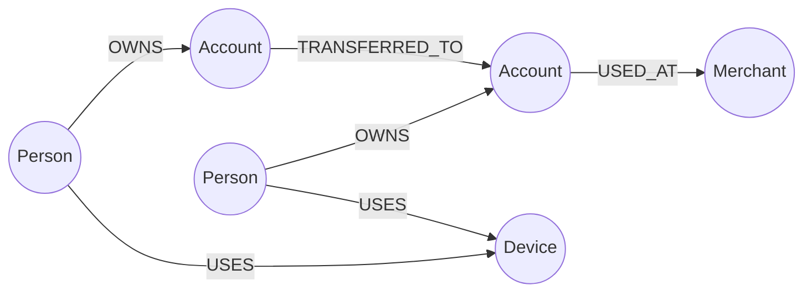
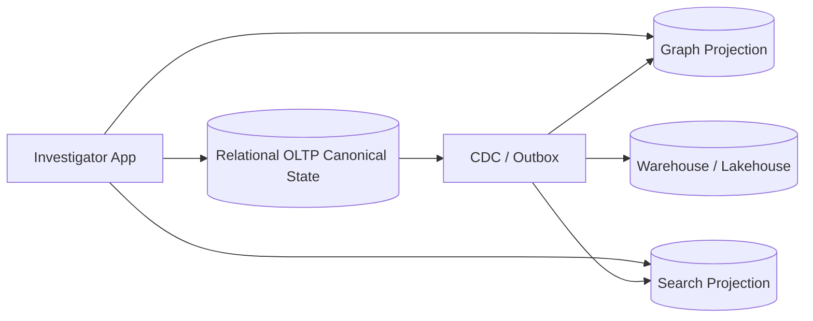
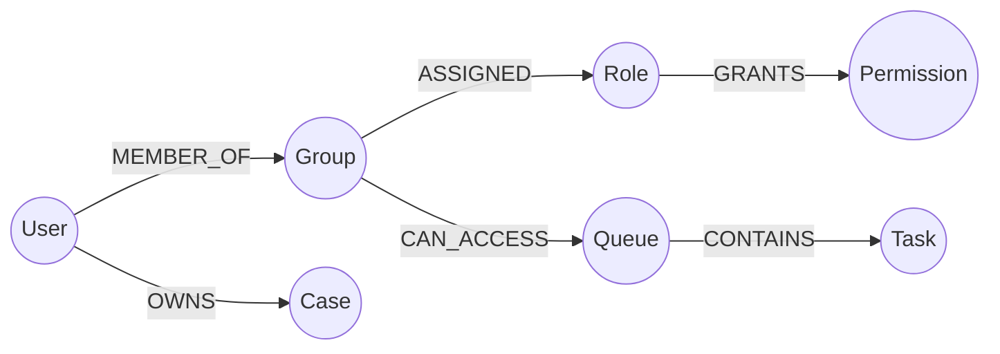
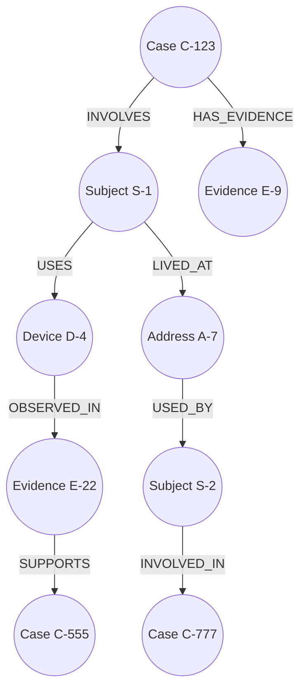

# Part 042 — Graph Database Design

Graph databases are not “databases for drawing diagrams.” They are databases for domains where **relationships are first-class data** and where the main questions require traversing those relationships.

The central mental shift:

> In relational design, relationships often support entity lookup and referential integrity.  
> In graph design, relationships are the query path.

Use a graph database when the structure of connectedness matters enough that repeatedly joining, recursively querying, or reconstructing relationship networks becomes the dominant workload.

---

## 1. The Short Definition

A graph database stores data as:

1. **nodes** — domain entities or concepts;
2. **relationships/edges** — directed connections between nodes;
3. **labels/types** — classification of nodes and relationships;
4. **properties** — attributes on nodes and relationships;
5. **paths** — sequences of relationships that answer traversal questions.

In the property graph model, nodes and relationships can both have properties. Neo4j describes a property graph as consisting of nodes connected by relationships, with labels/types/properties used to describe the domain.

The key question is not “what tables exist?”

The key question is:

> “What paths must the system traverse, under what constraints, and at what latency?”

---

## 2. When Graph Fits

Graph databases fit when your core operations are relationship-heavy.

| Use Case | Why Graph Fits |
|---|---|
| Fraud networks | Need to traverse shared devices, accounts, addresses, merchants |
| Identity and access graph | Need to resolve group, role, delegation, ownership paths |
| Recommendation networks | Need relationship proximity, similar users/items, shared attributes |
| Case investigation | Need connected entities, evidence, communications, incidents |
| Knowledge graph | Need semantic/entity relationship exploration |
| Dependency analysis | Need impact traversal across services, datasets, jobs |
| Network topology | Need path and connectivity queries |
| Bill of materials | Need recursive component relationships |

Graph is less suitable when:

- queries are mostly simple key-value lookups;
- data is mostly tabular aggregates;
- relationship depth is shallow and stable;
- strong relational constraints dominate;
- the team only wants schema flexibility without modelling discipline;
- traversal cardinality cannot be bounded.

Graph databases are powerful, but they do not remove the need for data modelling. They increase the need to model traversal carefully.

---

## 3. Property Graph Mental Model

A property graph typically looks like this:



A traversal question might be:

> “Find accounts connected to this person within two hops through shared device or transfer relationship.”

That query is naturally path-shaped.

In a relational database, this might require multiple joins or recursive CTEs. In a graph database, the relationship store and traversal engine are designed around that access pattern.

---

## 4. Graph Modelling Starts From Questions

A graph model is not a dump of every relationship that exists.

Start with questions:

1. What entity are we starting from?
2. What relationship types can we traverse?
3. What direction do we traverse?
4. What depth is allowed?
5. What filters constrain the path?
6. What relationship properties matter?
7. What result should be returned: nodes, paths, aggregates, ranked candidates?
8. How often is the query executed?
9. What is the maximum acceptable fan-out?
10. What security boundaries apply?

Example:

```txt
Question: Which cases may be related to this enforcement case?
Start: Case C-123
Traversal:
  Case -> Subject -> Address -> Subject -> Case
  Case -> Evidence -> Device -> Evidence -> Case
  Case -> Communication -> PhoneNumber -> Communication -> Case
Depth: max 4 hops
Filter: same tenant/security domain, active investigations only
Result: candidate related cases with explanation path
Latency: under 500ms for investigator workflow
```

This becomes the model contract.

---

## 5. Node Design

A node should represent a thing with identity and meaningful relationships.

Good node candidates:

- Person;
- Organization;
- Account;
- Case;
- Evidence;
- Device;
- Address;
- PhoneNumber;
- EmailAddress;
- Transaction;
- Policy;
- Permission;
- System;
- Dataset;
- Merchant;
- Asset.

Poor node candidates:

- every scalar attribute;
- every enum value without relationship behavior;
- every historical snapshot if not traversed;
- every log line;
- every normalized lookup table copied mechanically from relational schema.

### Rule

Make a thing a node if:

1. it has identity;
2. it participates in multiple relationships;
3. queries need to traverse to/from it;
4. it may accumulate more relationships over time;
5. it has lifecycle or ownership worth modelling.

Otherwise, it may be a property.

---

## 6. Relationship Design

Relationships are the core of graph design.

A relationship should usually represent a meaningful verb or association:

```txt
(:Person)-[:OWNS]->(:Account)
(:Person)-[:USED]->(:Device)
(:Case)-[:HAS_EVIDENCE]->(:Evidence)
(:Task)-[:ASSIGNED_TO]->(:User)
(:Role)-[:GRANTS]->(:Permission)
(:Service)-[:DEPENDS_ON]->(:Service)
(:Dataset)-[:DERIVED_FROM]->(:Dataset)
```

Relationships can have properties:

```txt
(:Person)-[:LIVED_AT {
  from: date('2024-01-01'),
  to: date('2025-03-10'),
  source: 'self_reported',
  confidence: 0.82
}]->(:Address)
```

Relationship properties are appropriate when the attribute describes the connection, not either endpoint.

Examples:

| Property | Belongs On Relationship? | Reason |
|---|---:|---|
| `assigned_at` | Yes | describes assignment connection |
| `confidence` | Yes | describes evidence relation strength |
| `from/to` validity | Yes | describes temporal relation |
| `person_name` | No | belongs on Person node |
| `address_line` | No | belongs on Address node |

---

## 7. Direction Matters

Graph relationships are often directed, even if the domain relationship is conceptually symmetric.

Example:

```txt
(:Person)-[:OWNS]->(:Account)
(:Service)-[:DEPENDS_ON]->(:Service)
(:Dataset)-[:DERIVED_FROM]->(:Dataset)
```

Direction should match the dominant traversal.

If both directions are common, the engine may still support reverse traversal, but the model should make meaning explicit.

Bad:

```txt
(:A)-[:RELATED_TO]->(:B)
```

Better:

```txt
(:Person)-[:OWNS]->(:Account)
(:Account)-[:TRANSFERRED_TO]->(:Account)
(:Evidence)-[:SUPPORTS]->(:Decision)
(:Decision)-[:SUPERSEDES]->(:Decision)
```

`RELATED_TO` is usually a smell unless the relationship is truly generic and the application handles semantics elsewhere.

---

## 8. Labels and Types

Labels classify nodes. Relationship types classify edges.

Example:

```txt
(:Person:Subject)
(:Person:Officer)
(:Organization:RegulatedEntity)
(:Case:EnforcementCase)
(:Evidence:DocumentEvidence)
```

Use labels to support:

- domain clarity;
- query targeting;
- indexes/constraints;
- security segmentation;
- lifecycle grouping;
- import/migration management.

Avoid label explosion.

Bad:

```txt
(:Person_Active_HighRisk_US_2026)
```

Better:

```txt
(:Person { status: 'ACTIVE', riskLevel: 'HIGH', jurisdiction: 'US' })
```

Use labels for stable categories. Use properties for volatile attributes.

---

## 9. Property vs Node vs Relationship

This is one of the most important design decisions.

### Example: Email Address

Option A: property

```txt
(:Person { email: 'a@example.com' })
```

Good when:

- email is only displayed;
- no traversal starts from email;
- uniqueness is simple;
- historical email usage is irrelevant.

Option B: node

```txt
(:Person)-[:USES_EMAIL]->(:EmailAddress { value: 'a@example.com' })
```

Good when:

- multiple people may share/reuse email;
- fraud detection traverses shared contact points;
- email history matters;
- confidence/source of email relation matters;
- email can connect cases, accounts, communications.

### Rule

If a value can become a join point, a relationship anchor, or a risk signal, consider modelling it as a node.

---

## 10. Traversal Design

A graph query is a traversal plan.

It has:

- start node lookup;
- relationship expansion;
- filters;
- path length constraints;
- result projection;
- ranking/aggregation;
- security constraints.

### Example Pseudo-Cypher

```cypher
MATCH (c:Case {caseId: $caseId})
MATCH path = (c)-[:HAS_EVIDENCE|INVOLVES|USES_DEVICE*1..4]-(related:Case)
WHERE related.tenantId = $tenantId
  AND related.status IN ['OPEN', 'UNDER_REVIEW']
RETURN related.caseId, path
LIMIT 50;
```

This query looks simple. It can still be dangerous.

Questions:

1. How many relationships leave the start node?
2. What is the branching factor at each hop?
3. Are high-degree nodes excluded?
4. Does the traversal revisit nodes?
5. Is the relationship type set too broad?
6. Is depth bounded?
7. Is the result limit applied after a huge expansion?
8. Are security filters applied early enough?

---

## 11. Path Explosion

Path explosion happens when each hop multiplies the search space.

Example:

```txt
Start node has 1,000 relationships.
Each neighbor has 1,000 relationships.
Depth 3 can imply billions of possible paths.
```

This does not mean the graph is bad. It means the traversal is under-constrained.

### Mitigations

| Mitigation | Example |
|---|---|
| Bound depth | `*1..3`, not unlimited |
| Restrict relationship types | only `USES_DEVICE`, not all relationships |
| Filter high-degree nodes | exclude common devices or shared office address |
| Use time windows | only relationships active in last 90 days |
| Use confidence threshold | only edges with `confidence >= 0.8` |
| Start from selective index | lookup exact case/person first |
| Use relationship direction | avoid undirected broad expansion |
| Materialize important paths | precompute risk clusters or components |
| Rank before expansion | expand only top candidates |

Graph performance is often about controlling fan-out.

---

## 12. High-Degree Nodes

Some nodes connect to too many things.

Examples:

- common address: “Unknown”;
- public IP address;
- corporate email domain;
- shared device kiosk;
- popular merchant;
- common role like “employee”;
- root organization node;
- country or city node.

These are useful semantically but dangerous operationally.

### Pattern: Do Not Traverse Through Common Nodes Blindly

```txt
(:Person)-[:LIVED_AT]->(:Address { normalized: 'UNKNOWN' })
```

If thousands of persons connect to `UNKNOWN`, this address should not be used as evidence of relatedness.

Options:

- exclude high-degree nodes;
- mark them as non-linking;
- store degree classification;
- require stronger relationship type;
- aggregate them analytically instead of operational traversal;
- split node type into more precise entities.

```txt
(:Address { normalized: 'UNKNOWN', linkable: false })
```

Traversal filter:

```cypher
WHERE address.linkable = true
```

---

## 13. Indexes and Constraints

Graph databases still need indexes.

Indexes are typically used to find start nodes efficiently.

After a start node is found, traversal follows relationships.

Common indexes:

- `Case(caseId)`;
- `Person(personId)`;
- `Account(accountId)`;
- `Device(fingerprint)`;
- `EmailAddress(value)`;
- `Tenant(tenantId)`;
- `Evidence(evidenceId)`.

### Rule

Index start points and frequently filtered node properties.

Do not expect an index to fix a traversal that expands too broadly.

Constraints matter too:

- unique external IDs;
- required properties;
- relationship uniqueness handled by application or constraint features where available;
- tenant-scoped uniqueness;
- import idempotency.

---

## 14. Graph and Relational Boundary

Do not force all data into graph.

A strong architecture often uses:

- relational database for canonical transactional state;
- graph database for connected reasoning/traversal;
- search index for text and faceted search;
- warehouse/lakehouse for large analytical reporting;
- event stream/CDC for synchronization.



Graph should own relationship traversal, not necessarily all system truth.

For enforcement/case systems, graph may be a projection over canonical case, evidence, party, device, and communication facts.

---

## 15. Canonical Graph vs Graph Projection

Two architecture modes exist.

### 15.1 Graph as Canonical Store

The graph database is the authoritative system for certain data.

Use when:

- relationship state is the core transactional domain;
- graph engine supports required consistency and durability;
- application writes can enforce invariants;
- backup/restore/audit requirements are satisfied;
- team has operational maturity.

Risk:

- harder integration with relational/reporting needs;
- constraints may differ from relational expectations;
- large analytical workloads may not fit;
- migration/versioning needs graph-specific tooling.

### 15.2 Graph as Projection

Graph is built from canonical events/tables.

Use when:

- OLTP state remains relational;
- graph is primarily for traversal/search/investigation;
- projection can lag slightly;
- graph can be rebuilt;
- audit truth stays elsewhere.

Risk:

- stale graph;
- projection drift;
- duplicate relationship bugs;
- explanation path may differ from latest canonical state.

For regulated systems, graph-as-projection is often safer unless relationship state itself is the product's canonical truth.

---

## 16. Temporal Graph Modelling

Relationships change over time.

Bad:

```txt
(:Person)-[:WORKS_FOR]->(:Organization)
```

This loses history if the relationship changes.

Better:

```txt
(:Person)-[:WORKED_FOR {
  from: date('2022-01-01'),
  to: date('2025-12-31'),
  source: 'registration_form'
}]->(:Organization)
```

For current-state traversal:

```cypher
WHERE rel.from <= date()
  AND (rel.to IS NULL OR rel.to > date())
```

Temporal graph questions:

- What was connected at time T?
- When did the relationship become valid?
- When did we learn it?
- Who asserted it?
- Was it corrected or superseded?
- Should historical relationships influence current risk?

In high-compliance systems, distinguish:

- **valid time** — when relationship was true in domain;
- **recorded time** — when system learned/recorded it;
- **source time** — when evidence claims it happened.

---

## 17. Relationship Evidence and Confidence

Not every edge is equally reliable.

Example:

```txt
(:Person)-[:USED_DEVICE {
  source: 'login_event',
  firstSeen: datetime('2026-06-01T10:00:00Z'),
  lastSeen: datetime('2026-07-01T20:00:00Z'),
  confidence: 0.97,
  evidenceId: 'E-123'
}]->(:Device)
```

For investigation/regulatory systems, relationships should often carry:

- source;
- evidence reference;
- confidence;
- created/observed time;
- valid time;
- actor/system that asserted it;
- correction/supersession marker;
- classification/sensitivity.

This makes graph results explainable.

A result like “related case found” is weak. A result with path explanation is strong:

```txt
Case C-123 -> Subject S-9 -> Device D-4 -> Subject S-19 -> Case C-555
Evidence: login events E-81 and E-92
Confidence: 0.91
Window: last 30 days
```

---

## 18. Authorization in Graph Queries

Graph authorization is harder than row authorization because data leaks through paths.

Possible leaks:

- seeing existence of hidden node;
- seeing a path through hidden relationship;
- inferring hidden relationship from count/rank;
- traversing across tenant boundary;
- using shared node to connect restricted domains.

### Security Rules

1. Include tenant/security domain on nodes and/or relationships.
2. Apply security filters at traversal start and expansion points.
3. Do not filter only at final result.
4. Avoid cross-tenant shared nodes unless deliberately designed.
5. Classify high-sensitivity relationship types.
6. Test path-level authorization with adversarial graphs.

Bad:

```cypher
MATCH path = (c:Case {caseId: $caseId})-[*1..4]-(related:Case)
RETURN related;
```

Better shape:

```cypher
MATCH path = (c:Case {tenantId: $tenantId, caseId: $caseId})-[rels*1..4]-(related:Case)
WHERE related.tenantId = $tenantId
  AND all(r IN rels WHERE r.securityDomain = $securityDomain)
RETURN related, path;
```

Exact syntax/features vary by graph engine, but the design principle is stable: security is part of traversal, not a final UI filter.

---

## 19. Graph for Access Control

Graph can model access control elegantly.

Example:



Access query:

> Does user U have a path to permission P over case C through group/role/delegation/ownership relationships?

Graph is useful when access is:

- inherited;
- delegated;
- group-based;
- resource hierarchy-based;
- time-bounded;
- explainable;
- frequently audited.

But be careful: authorization queries often require strong freshness. A stale graph projection can leave access open after revocation.

For access control, define:

- freshness SLO;
- revocation propagation guarantee;
- fallback to canonical authorization store;
- emergency deny path;
- audit of authorization path used.

---

## 20. Graph for Case Investigation

A graph projection can help investigators discover connected cases, subjects, evidence, and entities.

### Example Model



Potential query:

```txt
Find related cases within four hops where:
- relationship source is verified;
- confidence >= 0.75;
- evidence is not sealed/restricted;
- path does not cross tenant/security boundary;
- high-degree common addresses are excluded.
```

The graph output should not merely list cases. It should return explanation paths.

---

## 21. Graph for Dependency and Lineage

Graph is also strong for impact analysis.

Example:

```txt
(:Service)-[:WRITES_TO]->(:Table)
(:Table)-[:FEEDS]->(:DataPipeline)
(:DataPipeline)-[:PRODUCES]->(:Dataset)
(:Dashboard)-[:READS_FROM]->(:Dataset)
(:MLModel)-[:TRAINED_ON]->(:Dataset)
```

Questions:

- If table `case_event` changes, which reports break?
- Which downstream models depend on PII fields?
- What systems must be notified before schema migration?
- Which services transitively depend on this API/database?
- What is the blast radius of deleting a column?

This is a graph problem because transitive dependency matters.

---

## 22. Anti-Patterns

### 22.1 Relational Dump Graph

Bad:

```txt
Every table becomes a node label.
Every foreign key becomes a relationship.
Every row is loaded without query design.
```

This produces a graph-shaped copy of a relational schema, not a graph model.

Start from graph questions, not table migration.

### 22.2 Relationship Soup

Bad:

```txt
(:Thing)-[:RELATED_TO]->(:Thing)
```

If everything is `RELATED_TO`, no query can safely reason about semantics.

Use meaningful relationship types.

### 22.3 Unlimited Traversal

Bad:

```cypher
MATCH p = (n)-[*]-(m)
RETURN p;
```

Bound depth and relationship types.

### 22.4 Security Filter at the End

Bad:

```txt
Traverse everything, then filter visible nodes.
```

This can leak through path existence, counts, ranking, or timing.

### 22.5 High-Degree Blind Expansion

Bad:

```txt
Traverse through common city, country, public domain, unknown device.
```

High-degree nodes need explicit treatment.

### 22.6 Graph as Universal Database

Bad:

```txt
Use graph for every transactional/reporting/search workload.
```

Use graph where graph traversal is the core value.

---

## 23. Modelling Pattern: Entity Resolution Graph

Entity resolution often benefits from graph modelling.

```txt
(:IdentityCluster)-[:CONTAINS]->(:PersonRecord)
(:PersonRecord)-[:HAS_EMAIL]->(:EmailAddress)
(:PersonRecord)-[:HAS_PHONE]->(:PhoneNumber)
(:PersonRecord)-[:HAS_ADDRESS]->(:Address)
(:PersonRecord)-[:MATCHED_BY]->(:MatchRule)
```

Important edge properties:

- match confidence;
- match rule;
- evidence source;
- first matched time;
- last confirmed time;
- human review status;
- superseded flag.

Design warning:

Entity resolution is not just graph traversal. It is also governance.

You need:

- manual merge/split workflow;
- audit trail;
- reversible decisions;
- false-positive handling;
- confidence threshold;
- explanation path;
- privacy controls.

---

## 24. Modelling Pattern: Fraud / Risk Network

Risk networks use graph to detect suspicious proximity.

Example:

```txt
(:Account)-[:USED_DEVICE]->(:Device)
(:Account)-[:SENT_TO]->(:Account)
(:Account)-[:REGISTERED_FROM]->(:IPAddress)
(:Account)-[:USED_CARD]->(:PaymentInstrument)
(:Account)-[:HAS_EMAIL]->(:EmailAddress)
```

Queries:

- accounts within 2 hops of known fraud account;
- payment instruments shared by many accounts;
- devices used by recently created accounts;
- transfer cycles;
- shortest path to sanctioned entity;
- clusters with abnormal density.

Failure risks:

- common devices create false positives;
- stale edges overstate current risk;
- unbounded traversal causes latency spikes;
- risk score without explanation becomes hard to defend.

---

## 25. Modelling Pattern: Policy and Permission Graph

Policy graphs model inheritance and grant paths.

```txt
(:User)-[:MEMBER_OF]->(:Group)
(:Group)-[:MEMBER_OF]->(:Group)
(:Group)-[:ASSIGNED_ROLE]->(:Role)
(:Role)-[:GRANTS]->(:Permission)
(:Permission)-[:APPLIES_TO]->(:ResourceType)
(:Resource)-[:BELONGS_TO]->(:Resource)
```

Questions:

- Why can user U access case C?
- Which permissions are inherited through group G?
- Which users would lose access if role R is removed?
- Which resources are accessible through delegation D?

For production authorization, consider materializing effective permissions when runtime latency/freshness requires it. Graph can be the explanation/control plane, while enforcement uses a low-latency policy cache with revocation semantics.

---

## 26. Modelling Pattern: Data Lineage Graph

Lineage is naturally graph-shaped.

```txt
(:SourceSystem)-[:PRODUCES]->(:Table)
(:Table)-[:CONTAINS]->(:Column)
(:Column)-[:TRANSFORMED_IN]->(:Job)
(:Job)-[:WRITES]->(:Dataset)
(:Dashboard)-[:READS]->(:Dataset)
```

Use properties for:

- schema version;
- job run id;
- transformation hash;
- owner;
- sensitivity classification;
- last successful run;
- freshness SLA;
- contract version.

Lineage graph supports:

- impact analysis;
- compliance evidence;
- data quality tracing;
- migration planning;
- incident blast-radius analysis.

---

## 27. Graph Versioning and Schema Evolution

Graph schemas evolve too.

Common changes:

- new node label;
- new relationship type;
- relationship property added;
- property moved to node;
- node split into multiple labels;
- relationship direction changed;
- edge semantics refined;
- security domain added.

### Dangerous Change: Relationship Type Split

Old:

```txt
(:Person)-[:ASSOCIATED_WITH]->(:Organization)
```

New:

```txt
(:Person)-[:EMPLOYED_BY]->(:Organization)
(:Person)-[:OWNS]->(:Organization)
(:Person)-[:REPRESENTS]->(:Organization)
```

Migration strategy:

1. introduce new relationship types;
2. dual write old and new if needed;
3. backfill from evidence/canonical state;
4. update queries to use new types;
5. validate counts and sample paths;
6. deprecate old relationship;
7. keep compatibility for old reports until sunset.

Never silently change relationship meaning.

---

## 28. Graph Import and Idempotency

Graph ingestion often consumes events or snapshots.

Idempotency requirements:

- deterministic node IDs;
- deterministic relationship IDs or unique relationship key;
- event deduplication;
- upsert semantics;
- source version tracking;
- delete/supersede handling;
- replay safety.

Example identity design:

```txt
Node identity:
Case.caseId = canonical case id
Person.personId = canonical party id
Device.deviceId = normalized fingerprint hash
EmailAddress.valueHash = normalized email hash

Relationship identity:
USED_DEVICE = personId + deviceId + source + firstSeenBucket
HAS_EVIDENCE = caseId + evidenceId
```

If relationship identity is not deterministic, replay can create duplicate edges.

---

## 29. Testing Graph Models

Graph testing should include structure, traversal, and security.

### Test Categories

| Test | Purpose |
|---|---|
| Node uniqueness test | Ensure identity boundary works |
| Relationship uniqueness test | Prevent duplicate edges |
| Traversal result test | Expected paths are returned |
| Negative traversal test | Forbidden paths are not returned |
| High-degree node test | Common nodes do not explode results |
| Tenant isolation test | Cross-tenant paths are blocked |
| Temporal test | Historical/current relationships behave correctly |
| Stale projection test | UI/API handles lag correctly |
| Replay test | Re-ingestion is idempotent |
| Migration test | Old/new relationship types coexist safely |

### Small Adversarial Graph

Create a test graph containing:

- two tenants;
- shared-looking nodes;
- high-degree node;
- restricted evidence;
- revoked permission;
- duplicate-looking identity;
- temporal relationship expired yesterday;
- relationship with low confidence;
- path that should exist;
- path that must not be visible.

A graph model is not production-ready until it survives adversarial traversal tests.

---

## 30. Observability

Track graph-specific health.

| Metric | Why It Matters |
|---|---|
| node count by label | Detect import or modelling anomalies |
| relationship count by type | Detect duplicate/fan-out problems |
| degree distribution by label/type | Detect high-degree nodes |
| top high-degree nodes | Prevent path explosion |
| traversal latency by query | SLO by graph operation |
| expanded relationships per query | Detect runaway traversal |
| result count distribution | Detect query broadening |
| projection lag | Detect stale graph |
| failed ingest events | Detect drift |
| duplicate relationship attempts | Detect idempotency issue |
| security-filter rejection count | Detect suspicious or broken access patterns |

Graph observability must reveal shape, not only server health.

---

## 31. Failure Modes

| Failure Mode | Root Cause | Prevention |
|---|---|---|
| Path explosion | Unbounded traversal or high branching factor | depth/type/time/confidence bounds |
| False relationship inference | Common nodes treated as strong signal | high-degree filtering and confidence modelling |
| Duplicate edges | Non-idempotent import | deterministic relationship key/upsert |
| Stale access graph | Projection lag after revocation | freshness SLO + canonical fallback |
| Cross-tenant leak | Shared nodes or late security filter | tenant/security domain on traversal |
| Relationship semantics drift | `RELATED_TO` or overloaded edge type | explicit typed relationships |
| Graph copy of relational schema | Migrated tables without traversal questions | model from graph use cases |
| Slow start-node lookup | Missing index/constraint | index start points |
| Unexplainable risk score | Graph result without path evidence | return explanation path and edge metadata |
| Migration breaks queries | changed relationship direction/type | dual modelling + compatibility queries |

---

## 32. Design Review Checklist

### Use Case Fit

- Is traversal the core workload?
- What questions require graph instead of relational/search?
- What queries need paths, not just joined rows?
- What result must be explained?

### Node Model

- Which nodes have stable identity?
- Which values should remain properties?
- Which values should become nodes because they connect entities?
- Are labels stable and meaningful?

### Relationship Model

- Are relationship types semantic and specific?
- Is direction meaningful?
- Do relationship properties describe the connection?
- Are temporal and evidence properties needed?
- Are high-degree relationships identified?

### Traversal

- What is the start node?
- Is start-node lookup indexed?
- Which relationship types are allowed?
- What depth is allowed?
- What filters apply during expansion?
- How are high-degree nodes handled?
- Is pagination/ranking deterministic?

### Security

- Is tenant/security domain part of the graph?
- Are restricted nodes/relationships blocked during traversal?
- Can path existence leak hidden data?
- How fast do revocations propagate?
- Are authorization paths auditable?

### Operations

- Is the graph canonical or projection?
- What is the rebuild path?
- Is ingestion idempotent?
- How is drift detected?
- What metrics expose degree and expansion risk?
- How are schema/relationship changes migrated?

---

## 33. Practical Rule Set

1. Use graph when relationships are the workload, not just a diagram.
2. Model from traversal questions.
3. Nodes need identity; relationships need semantics.
4. Avoid generic `RELATED_TO` edges.
5. Put connection-specific facts on relationships.
6. Bound traversal depth and relationship types.
7. Treat high-degree nodes as dangerous until proven useful.
8. Index start nodes, but do not expect indexes to fix path explosion.
9. Model temporal/evidence/confidence for investigative graphs.
10. Security must be applied during traversal, not after final result.
11. Decide whether graph is canonical truth or projection.
12. Make graph ingestion idempotent and replayable.
13. Return explanation paths for decisions.
14. Observe graph shape: degree, fan-out, expansion, lag.

---

## 34. What Top Engineers Do Differently

Average design says:

> “We have many relationships, so use graph.”

Strong design says:

> “The investigator needs to discover related cases within four hops through subject/device/address/evidence relationships, excluding common high-degree nodes, constrained to same tenant/security domain, with evidence-backed explanation paths and P99 under 500ms. The graph is a projection from canonical case/evidence events, rebuilt from the event log, with deterministic node/edge IDs, projection lag metrics, and adversarial authorization tests.”

The difference is not the technology choice. The difference is the precision of the traversal contract.

---

## 35. References

- Neo4j Documentation — Graph database concepts and property graph model: https://neo4j.com/docs/getting-started/appendix/graphdb-concepts/
- Neo4j Documentation — What is a graph database: https://neo4j.com/docs/getting-started/graph-database/
- Neo4j Documentation — Tutorial: create a graph data model: https://neo4j.com/docs/getting-started/data-modeling/tutorial-data-modeling/
- Neo4j GitHub — Graph database overview and features: https://github.com/neo4j/neo4j
