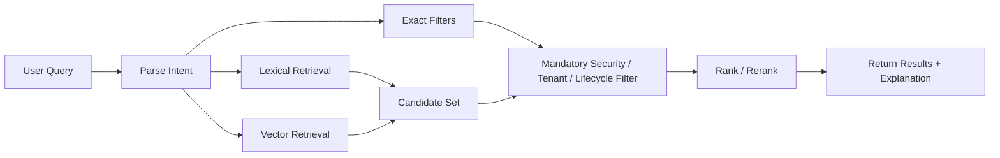
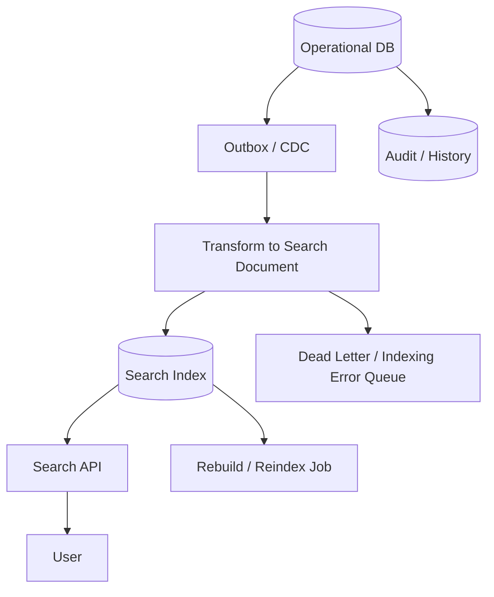
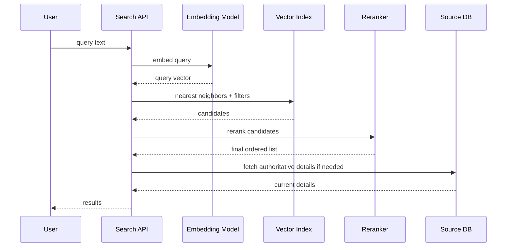
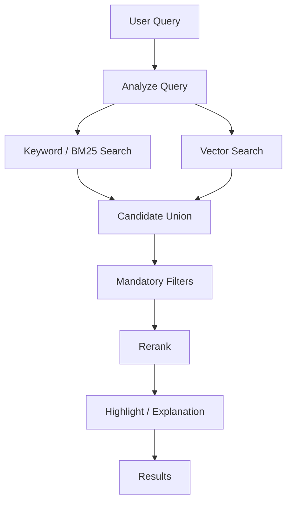
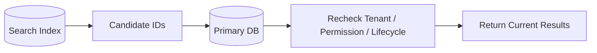
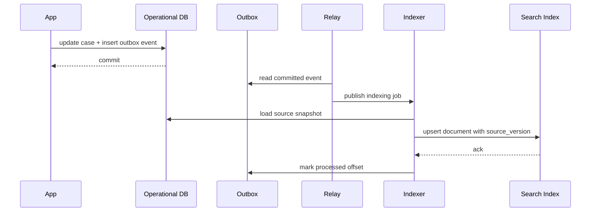
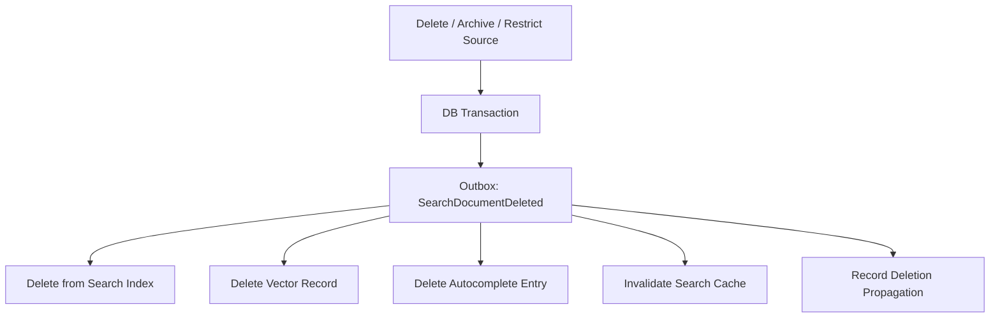
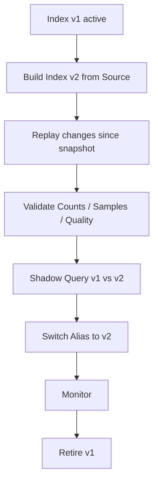
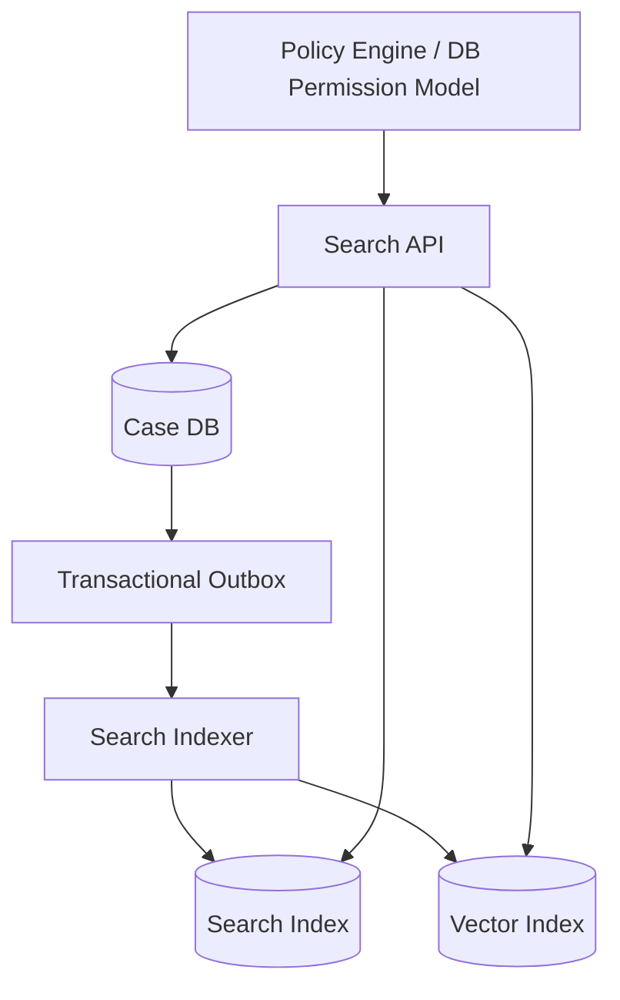

# Part 043 — Search and Vector Index-Aware Design

Search is not “just another query”.

A relational query usually asks:

> “Which rows match these exact predicates?”

Search asks:

> “Which documents are most relevant to this user intent, under these filters, permissions, freshness constraints, and ranking rules?”

Vector search asks an even less exact question:

> “Which items are close in embedding space to this query representation?”

That difference changes the database architecture.

A normal B-Tree index optimizes exact lookup, range lookup, ordering, and joins. A search index optimizes token lookup and ranking. A vector index optimizes nearest-neighbor retrieval in high-dimensional space. They have different data structures, freshness semantics, failure modes, and correctness risks.

The core mental model:

> Search/vector systems are usually retrieval projections, not the canonical system of truth.

They are built from authoritative operational data, transformed into searchable documents or vectors, indexed, queried, ranked, filtered, and periodically rebuilt.

A top-level engineer does not start by asking, “Should we use Elasticsearch, OpenSearch, PostgreSQL full-text search, pgvector, MongoDB Atlas Vector Search, Pinecone, Weaviate, or Qdrant?”

They start by asking:

1. What is the user trying to retrieve?
2. What is the authoritative source?
3. What filters are mandatory for correctness/security?
4. What ranking signal matters?
5. How fresh must the result be?
6. What recall/latency tradeoff is acceptable?
7. How do we rebuild and verify the index?
8. What happens when retrieval is wrong, stale, incomplete, or unauthorized?

That is search and vector **index-aware design**.

---

## 1. What This Part Covers

This part focuses on database design and architecture around:

- full-text search;
- inverted index mental model;
- search document projection;
- semantic/vector search;
- HNSW and IVFFlat design intuition;
- exact vs approximate nearest-neighbor retrieval;
- hybrid lexical + vector search;
- filtered vector search;
- tenant/security-aware retrieval;
- freshness and eventual consistency;
- indexing pipelines;
- blue/green index rebuild;
- embedding version migration;
- search correctness testing;
- operational failure modes.

We will not repeat general indexing or B-Tree internals from previous parts. Here, the emphasis is different: retrieval quality, ranking, projection, and operational control.

---

## 2. Three Retrieval Modes

Most production systems mix three retrieval modes.

| Mode | Typical Question | Main Index Type | Correctness Shape |
|---|---|---|---|
| Exact lookup | “Find case `CASE-2026-001`.” | B-Tree / hash / primary key | deterministic |
| Lexical search | “Find cases mentioning illegal import permit.” | inverted index / full-text index | relevance-ranked |
| Semantic search | “Find cases similar to this complaint narrative.” | vector index / ANN index | approximate, similarity-ranked |

A system becomes brittle when engineers confuse these modes.

Example mistakes:

- using vector search for exact regulatory identifiers;
- using text search as the only authorization filter;
- using a search index as canonical storage;
- expecting semantic search to return deterministic legal/evidence results;
- treating approximate nearest-neighbor recall as correctness instead of a tunable tradeoff.

A safe design usually combines modes:



---

## 3. Search Index Is Usually a Projection

A search index should usually be treated like a read model.

It is derived from one or more authoritative sources.



This gives several design consequences:

1. The operational database remains the source of truth.
2. Search documents are optimized for retrieval, not normalization.
3. Indexing is asynchronous unless strong freshness is explicitly required.
4. Search results may be stale.
5. Rebuild must be possible from authoritative data.
6. Security filters must survive projection.
7. Deletion and privacy rules must propagate into the index.

Do not design a search index as a random dump of tables. Design it as a deliberate retrieval contract.

---

## 4. The Search Document Contract

A search document is not merely “the row as JSON”.

It is the shape optimized for query, filter, ranking, display, and security.

Example search document for regulatory case search:

```json
{
  "document_id": "case:9b2f5a6e",
  "source_type": "case",
  "source_id": "9b2f5a6e",
  "tenant_id": "tenant-a",
  "case_number": "ENF-2026-000184",
  "title": "Import permit irregularity investigation",
  "summary": "Investigation into suspected misuse of import permit documents.",
  "body": "...flattened searchable narrative...",
  "status": "UNDER_REVIEW",
  "risk_level": "HIGH",
  "assigned_unit_id": "unit-enforcement-1",
  "security_labels": ["ENFORCEMENT", "RESTRICTED"],
  "visible_to_actor_ids": ["user-123", "group-investigator"],
  "jurisdiction": "ID-JK",
  "created_at": "2026-07-01T09:20:00Z",
  "updated_at": "2026-07-05T02:11:00Z",
  "source_version": 17,
  "index_schema_version": 3,
  "embedding_model": "text-embedding-model-x",
  "embedding_version": 2,
  "content_vector": [0.013, -0.204, 0.771]
}
```

A good search document has these groups:

| Group | Purpose |
|---|---|
| Identity fields | stable reference back to source |
| Display fields | title, snippet, badges, status |
| Lexical fields | text analyzed for keyword search |
| Filter fields | tenant, status, type, date, unit, lifecycle |
| Security fields | access scopes, labels, groups, visibility rules |
| Ranking fields | popularity, recency, risk, quality score |
| Freshness fields | source version, updated time, index time |
| Vector fields | embeddings and model version |
| Operational fields | index schema version, replay offset, error flags |

The key design question:

> Can this document answer the search query without accidentally leaking, hiding, duplicating, or misranking critical data?

---

## 5. Inverted Index Mental Model

Full-text search is usually powered by an inverted index.

Instead of mapping:

```text
Document -> Terms
```

it maps:

```text
Term -> Documents containing that term
```

Example:

```text
case:1 = "illegal import permit"
case:2 = "permit renewal rejected"
case:3 = "illegal warehouse operation"
```

Inverted index:

```text
illegal   -> case:1, case:3
import    -> case:1
permit    -> case:1, case:2
renewal   -> case:2
rejected  -> case:2
warehouse -> case:3
operation -> case:3
```

Search engines then add:

- tokenization;
- lowercasing;
- stemming;
- stop-word removal;
- synonym expansion;
- phrase positions;
- term frequency;
- inverse document frequency;
- field weighting;
- ranking algorithms.

This means full-text search is not just “contains string”.

The index does semantic-ish lexical processing before matching.

---

## 6. Full-Text Search Design Decisions

When designing lexical search, decide these explicitly.

### 6.1 Which fields are searchable?

Do not index everything blindly.

Common field classes:

| Field | Search Mode |
|---|---|
| title | high-weight lexical |
| summary | medium-weight lexical |
| body/content | broad lexical |
| case number | exact keyword |
| external reference | exact keyword |
| person/company name | analyzed + exact subfield |
| status | filter only |
| tenant | mandatory filter |
| security label | mandatory filter |

A regulatory case number should not be tokenized like normal prose.

`ENF-2026-000184` should be searchable exactly, and maybe with normalized variants, but not treated like a narrative paragraph.

### 6.2 Which fields are filters?

Filters decide eligibility.

Ranking decides order.

Never rely on ranking to enforce access.

Mandatory filters usually include:

- tenant;
- actor permission;
- lifecycle visibility;
- jurisdiction;
- classification/security label;
- deleted/archived status;
- document type;
- valid time window.

### 6.3 Which fields affect ranking?

Ranking signals may include:

- textual relevance;
- recency;
- authority;
- popularity;
- status priority;
- risk level;
- exact field match boost;
- user context;
- business-specific priority.

Ranking is product behavior, not only database behavior.

Document it like a business rule.

---

## 7. PostgreSQL Full-Text Search vs Dedicated Search Engine

PostgreSQL can support full-text search with `tsvector`, `tsquery`, and GIN/GiST indexes.

This is often good enough when:

- data is already in PostgreSQL;
- search volume is moderate;
- ranking needs are simple;
- freshness must be transactionally close to source data;
- operational simplicity matters;
- you need SQL joins and filters around search.

Dedicated search engines like Elasticsearch/OpenSearch become stronger when:

- search is a primary product feature;
- ranking and analyzers are complex;
- scale is high;
- indexing pipeline is independent;
- documents combine multiple source systems;
- autocomplete, faceting, highlighting, synonyms, and relevance tuning matter;
- search cluster operations are acceptable.

A good default rule:

> Start with the simplest engine that satisfies retrieval semantics, then move search to a dedicated projection when ranking, scale, isolation, or operational ownership demands it.

---

## 8. PostgreSQL Full-Text Example

Example source table:

```sql
CREATE TABLE enforcement_case (
    id uuid PRIMARY KEY,
    tenant_id uuid NOT NULL,
    case_number text NOT NULL,
    title text NOT NULL,
    summary text,
    status text NOT NULL,
    risk_level text NOT NULL,
    created_at timestamptz NOT NULL DEFAULT now(),
    updated_at timestamptz NOT NULL DEFAULT now(),
    deleted_at timestamptz,
    search_vector tsvector GENERATED ALWAYS AS (
        setweight(to_tsvector('english', coalesce(title, '')), 'A') ||
        setweight(to_tsvector('english', coalesce(summary, '')), 'B') ||
        setweight(to_tsvector('simple', coalesce(case_number, '')), 'A')
    ) STORED
);

CREATE INDEX enforcement_case_search_gin
ON enforcement_case
USING gin (search_vector);

CREATE INDEX enforcement_case_active_tenant_status_idx
ON enforcement_case (tenant_id, status, updated_at DESC)
WHERE deleted_at IS NULL;
```

Query:

```sql
SELECT
    id,
    case_number,
    title,
    status,
    risk_level,
    ts_rank_cd(search_vector, plainto_tsquery('english', :query)) AS rank
FROM enforcement_case
WHERE tenant_id = :tenant_id
  AND deleted_at IS NULL
  AND search_vector @@ plainto_tsquery('english', :query)
ORDER BY rank DESC, updated_at DESC
LIMIT 20;
```

Important observations:

1. The full-text index accelerates lexical matching.
2. The tenant/status/deleted predicates still matter.
3. Ranking is explicit.
4. Case number is included with a simpler configuration.
5. Exact case-number lookup may still deserve its own unique/B-Tree index.

Search does not replace normal schema design.

---

## 9. Dedicated Search Index Example

A search index document might flatten operational data:

```json
{
  "settings": {
    "analysis": {
      "analyzer": {
        "case_text_analyzer": {
          "type": "standard",
          "stopwords": "_english_"
        }
      }
    }
  },
  "mappings": {
    "properties": {
      "tenant_id": { "type": "keyword" },
      "source_type": { "type": "keyword" },
      "source_id": { "type": "keyword" },
      "case_number": { "type": "keyword" },
      "title": { "type": "text", "analyzer": "case_text_analyzer" },
      "summary": { "type": "text", "analyzer": "case_text_analyzer" },
      "status": { "type": "keyword" },
      "risk_level": { "type": "keyword" },
      "security_labels": { "type": "keyword" },
      "visible_group_ids": { "type": "keyword" },
      "updated_at": { "type": "date" },
      "source_version": { "type": "long" }
    }
  }
}
```

The important part is not the syntax. It is the classification:

- `keyword` fields are exact/filterable;
- `text` fields are analyzed/searchable;
- dates/numbers support filtering/sorting;
- security fields are preserved as filterable fields;
- `source_version` supports idempotent updates and freshness checks.

---

## 10. Vector Search Mental Model

Vector search converts content into vectors.

A vector is an array of numbers representing semantic features.

Example:

```text
"suspected misuse of import permit" -> [0.013, -0.204, 0.771, ...]
```

Similar concepts should be close in embedding space.

A vector query usually follows this path:



Vector search is powerful for:

- semantic search;
- similarity matching;
- recommendations;
- deduplication assistance;
- RAG retrieval;
- clustering;
- anomaly discovery.

But it is dangerous for:

- exact identifiers;
- legal truth;
- authorization;
- deterministic audit evidence;
- financial balance correctness;
- unique constraint enforcement.

A vector index finds “similar”, not “true”.

---

## 11. Exact kNN vs Approximate ANN

Exact nearest-neighbor search compares the query vector against all candidate vectors.

That gives high recall but can be expensive.

Approximate nearest-neighbor search uses an index to trade some recall for latency.

| Search Type | Behavior | Tradeoff |
|---|---|---|
| Exact kNN | checks all candidates | high recall, high cost |
| Approximate ANN | searches index graph/list | lower latency, tunable recall |

Common ANN index families:

| Index | Mental Model | Strength | Risk |
|---|---|---|---|
| HNSW | navigable graph of vectors | strong recall/latency | memory, build cost, filter complexity |
| IVFFlat | vectors partitioned into lists | simpler, lower memory/build cost | recall depends on probes/lists/training |
| Product quantization variants | compressed vector representation | scale/cost reduction | accuracy loss and tuning complexity |

The architect-level question:

> What recall, latency, memory, freshness, and filter behavior does the business require?

Not:

> Which vector database is fashionable this month?

---

## 12. HNSW Design Intuition

HNSW, or Hierarchical Navigable Small World, is graph-based.

Each vector becomes a node. Edges connect nearby vectors. Search navigates the graph toward closer neighbors instead of scanning everything.

Important knobs usually include:

| Parameter | Meaning | Impact |
|---|---|---|
| `m` | graph connectivity | higher recall, more memory |
| `ef_construction` | build-time candidate breadth | better graph, slower build |
| `ef_search` | query-time search breadth | higher recall, higher latency |

Production implications:

1. HNSW often wants memory.
2. Recall is not automatic.
3. Insert order and data distribution can affect quality.
4. Filtering can reduce effective recall.
5. Rebuild may be required after large data/model changes.
6. Latency tuning must be measured on real data.

---

## 13. IVFFlat Design Intuition

IVFFlat divides vectors into clusters/lists.

At query time, the engine searches only some nearby lists.

Important knobs:

| Parameter | Meaning | Impact |
|---|---|---|
| lists | number of partitions | affects build/search balance |
| probes | number of searched lists | higher recall, higher latency |

Production implications:

1. Data distribution matters.
2. Training/build strategy matters.
3. Low probes can miss relevant vectors.
4. High probes approach more exhaustive search.
5. It can be simpler and cheaper than HNSW for some workloads.

---

## 14. Vector Schema Design

A vector record should not be just `(id, embedding)`.

Example relational design:

```sql
CREATE TABLE searchable_content (
    id uuid PRIMARY KEY,
    tenant_id uuid NOT NULL,
    source_type text NOT NULL,
    source_id uuid NOT NULL,
    content_hash text NOT NULL,
    content_text text NOT NULL,
    embedding_model text NOT NULL,
    embedding_version integer NOT NULL,
    embedding vector(1536) NOT NULL,
    security_scope text[] NOT NULL,
    lifecycle_status text NOT NULL,
    source_updated_at timestamptz NOT NULL,
    indexed_at timestamptz NOT NULL DEFAULT now(),
    UNIQUE (source_type, source_id, embedding_model, embedding_version)
);
```

Fields you usually need:

| Field | Why it matters |
|---|---|
| `source_type`, `source_id` | traceability |
| `content_hash` | idempotent re-embedding |
| `embedding_model` | model provenance |
| `embedding_version` | migration/versioning |
| `tenant_id` | isolation/filtering |
| `security_scope` | retrieval authorization |
| `lifecycle_status` | exclude deleted/archived content |
| `source_updated_at` | freshness comparison |
| `indexed_at` | pipeline lag measurement |

Without these fields, vector search becomes an opaque retrieval toy instead of a production database capability.

---

## 15. Hybrid Search

Hybrid search combines lexical search and vector search.

Why?

Lexical search is good for:

- exact terms;
- identifiers;
- rare names;
- legal/regulatory phrases;
- strict keyword match.

Vector search is good for:

- semantic similarity;
- paraphrases;
- fuzzy intent;
- concept-level retrieval.

Hybrid design:



Common fusion methods:

| Method | Idea |
|---|---|
| Weighted score | combine normalized lexical/vector scores |
| Reciprocal Rank Fusion | combine based on rank positions |
| Learning-to-rank | model-based ranking using features |
| Reranking model | expensive second-pass semantic ranking |

A practical architecture:

1. Generate lexical candidates.
2. Generate vector candidates.
3. Apply mandatory filters.
4. Merge and deduplicate.
5. Rerank top candidates.
6. Fetch authoritative source data.
7. Return result with reason/snippet.

---

## 16. Filtered Vector Search

Filtered vector search is hard.

Example query:

> “Find semantically similar cases, but only within tenant A, visible to investigator X, not archived, in jurisdiction Y, created in the last 2 years.”

That query has two parts:

1. similarity search;
2. mandatory structured filters.

There are two common approaches.

### 16.1 Pre-filter

Filter candidates first, then vector search within the allowed subset.

Pros:

- safer for security;
- avoids unauthorized candidate leakage;
- better for highly selective filters if engine supports it well.

Cons:

- can be slow if subset handling is poor;
- may reduce ANN index efficiency.

### 16.2 Post-filter

Vector search first, then filter results.

Pros:

- simple;
- often fast for broad queries.

Cons:

- can return too few results after filtering;
- dangerous if not carefully isolated;
- poor for highly selective tenant/security filters;
- recall becomes unpredictable.

Post-filter example failure:

```text
Search top 20 globally.
Filter to tenant A.
Only 1 result remains.
But there were 50 good tenant A results outside global top 20.
```

This is not a small bug. It is a retrieval correctness failure.

Design rule:

> Mandatory security and tenant filters must be part of the retrieval contract, not an afterthought after ranking.

---

## 17. Search Authorization Boundary

Search is one of the easiest ways to leak data.

Common leak paths:

- result title from unauthorized document;
- autocomplete suggestions from restricted data;
- facet counts revealing hidden records;
- snippets exposing sensitive text;
- vector similarity returning restricted documents;
- cache keys missing tenant/user dimension;
- logs storing raw query or retrieved restricted text;
- offline embedding pipeline indexing data that should be excluded.

Search authorization must apply to:

| Layer | Requirement |
|---|---|
| indexing | only index allowed content or index security metadata |
| query | apply tenant/security/lifecycle filters |
| ranking | rank only eligible candidates |
| snippet | generate snippets from authorized fields only |
| facets | count only authorized documents |
| cache | key by tenant/user/security context |
| logging | redact sensitive query/result data |
| rebuild | preserve security policy during reindex |

Never rely only on UI-side filtering.

---

## 18. Freshness Contract

Search indexes are often eventually consistent.

That is acceptable only if the freshness contract is explicit.

Examples:

| Use Case | Freshness Requirement |
|---|---|
| exact case lookup after create | immediate or primary DB fallback |
| public documentation search | seconds/minutes may be fine |
| compliance deletion | must disappear quickly and provably |
| evidence search | freshness must be disclosed or bounded |
| authorization change | must be reflected before access is granted |
| vector recommendation | stale results may be acceptable |

Represent freshness explicitly:

```json
{
  "source_version": 17,
  "indexed_source_version": 17,
  "indexed_at": "2026-07-05T02:11:30Z",
  "pipeline_lag_ms": 850
}
```

For critical operations, search should often return IDs only, then the API rechecks authority/source state in the primary database.



---

## 19. Indexing Pipeline Design

Avoid direct best-effort indexing inside the same application request unless the search index is non-critical and failure is acceptable.

A robust pattern:

1. Write source data in the operational transaction.
2. Write an outbox event in the same transaction.
3. Relay outbox events to indexing pipeline.
4. Transform source data into search document.
5. Upsert index document idempotently.
6. Store indexing offset/version.
7. Retry failures.
8. Send poison records to DLQ.
9. Monitor lag and error rate.



Important: the indexer should usually load the source snapshot instead of trusting event payloads blindly. Event payloads may be partial or schema-versioned.

---

## 20. Idempotent Indexing

Indexing must tolerate duplicates, retries, reordering, and partial failures.

Use a deterministic document ID:

```text
document_id = source_type + ':' + source_id
```

Use source version checks:

```pseudo
if incoming.source_version < indexed.source_version:
    ignore stale indexing event
else:
    upsert document
```

For multi-document projections:

```text
case:123:main
case:123:evidence:456
case:123:note:789
```

Never rely on “event delivered once”. Treat exactly-once as an end-to-end property you simulate with idempotency.

---

## 21. Deletion and Retention in Search/Vector Indexes

Deletion must propagate to all derived retrieval stores.

This includes:

- full-text index;
- vector index;
- autocomplete index;
- embedding cache;
- reranker cache;
- recommendation index;
- analytics/search logs if policy requires;
- backups according to retention rules.

Deletion architecture:



A common failure mode:

> Source row is hidden, but search index still returns the old title/snippet.

This is often a security incident, not just stale search.

---

## 22. Embedding Version Migration

Embedding models change.

When they do, you cannot blindly mix vector spaces.

Different embedding models may produce incomparable vectors.

Design for versioning from day one:

```sql
CREATE TABLE content_embedding (
    source_type text NOT NULL,
    source_id uuid NOT NULL,
    chunk_id text NOT NULL,
    embedding_model text NOT NULL,
    embedding_version integer NOT NULL,
    vector vector(1536) NOT NULL,
    content_hash text NOT NULL,
    created_at timestamptz NOT NULL DEFAULT now(),
    PRIMARY KEY (source_type, source_id, chunk_id, embedding_model, embedding_version)
);
```

Migration strategy:

1. Keep old embedding index active.
2. Generate new embeddings in parallel.
3. Build new index.
4. Evaluate retrieval quality.
5. Route small traffic percentage to new index.
6. Compare result overlap and quality metrics.
7. Cut over.
8. Retire old embeddings after retention window.

This is blue/green indexing.

---

## 23. Chunking for Vector Search

For long documents, embedding the whole document can be poor.

Chunking splits content into smaller retrievable units.

Chunk design choices:

| Decision | Why it matters |
|---|---|
| chunk size | affects semantic precision and context coverage |
| overlap | helps avoid boundary loss |
| chunk identity | enables traceability |
| parent document link | enables final result grouping |
| section metadata | improves filtering and explanation |
| security metadata | prevents unauthorized chunk retrieval |
| version/hash | supports rebuild and dedup |

Example chunk key:

```text
case:123:evidence:456:chunk:0007
```

Good chunk metadata:

```json
{
  "chunk_id": "case:123:evidence:456:chunk:0007",
  "parent_id": "case:123",
  "source_type": "evidence_document",
  "source_id": "456",
  "section": "findings",
  "page_start": 4,
  "page_end": 5,
  "tenant_id": "tenant-a",
  "security_labels": ["RESTRICTED"],
  "content_hash": "sha256:...",
  "embedding_model": "...",
  "embedding_version": 2
}
```

Chunking is a database design problem because it affects identity, authorization, lineage, retention, and rebuild.

---

## 24. Search Result Explanation

For serious systems, search results should be explainable enough for users to trust them.

Not necessarily full algorithm disclosure, but enough signal:

- matched exact case number;
- matched title phrase;
- matched evidence text;
- similar to selected case;
- boosted because high risk;
- limited to visible cases;
- result may be stale as of timestamp;
- hidden records excluded due to access policy.

For regulated workflows, this matters.

A user must distinguish:

- “no matching records exist”; from
- “no matching records visible to you”; from
- “search index is delayed”; from
- “query was too broad/narrow”; from
- “semantic search found similar but not exact records”.

---

## 25. Search Quality Metrics

Database engineers often measure only latency.

Search systems also need quality metrics.

| Metric | Meaning |
|---|---|
| precision@k | how many top-k results are relevant |
| recall@k | how many relevant results are retrieved in top-k |
| MRR | reciprocal rank of first relevant result |
| NDCG | ranking quality with graded relevance |
| zero-result rate | queries returning no results |
| reformulation rate | users changing query after bad result |
| click-through rate | weak signal of usefulness |
| abandonment | users leave without selecting result |
| freshness lag | source update to index visibility |
| unauthorized-result count | must be zero |

For vector search, also measure:

- exact-vs-approx recall;
- recall under filters;
- latency under concurrent load;
- index memory size;
- build time;
- quality by tenant/domain/category;
- degradation after embedding model changes.

---

## 26. Search Performance Design

Performance is not only index type.

Key dimensions:

| Dimension | Design Question |
|---|---|
| corpus size | how many documents/chunks? |
| update rate | how often do documents change? |
| query rate | how many searches per second? |
| filter selectivity | are filters broad or narrow? |
| top-k size | how many candidates are needed? |
| reranking cost | can expensive reranker run per query? |
| latency SLO | p50/p95/p99 target? |
| freshness SLO | max index lag? |
| memory budget | can vector index fit in memory? |
| rebuild time | can index be rebuilt within operational window? |

A safe search architecture uses budgets:

```text
Total p95 target: 800 ms
- request validation: 20 ms
- query embedding: 100 ms
- lexical retrieval: 120 ms
- vector retrieval: 180 ms
- merge/filter: 50 ms
- rerank: 200 ms
- source fetch: 100 ms
- response serialization: 30 ms
```

Without budgets, search becomes unbounded product magic.

---

## 27. Multi-Tenant Search Index Design

Common options:

| Model | Description | Strength | Risk |
|---|---|---|---|
| shared index | all tenants in one index with `tenant_id` filter | simple, cost-efficient | filter mistakes, noisy tenants |
| index per tenant | separate index per tenant | strong isolation | operational explosion |
| index per tenant tier/cell | grouped by shard/cell | balanced | routing complexity |
| dedicated index for regulated tenants | special isolation for high-risk tenants | compliance | higher cost |

Default for SaaS:

- shared index for small/medium tenants;
- cell/index split for large tenants;
- dedicated index for high-compliance tenants;
- mandatory tenant filter in every query;
- automated tests proving cross-tenant leakage is impossible.

Search tenant isolation must be tested like database row-level security.

---

## 28. Blue/Green Index Rebuild

Indexes must be rebuildable without downtime.

Pattern:



Validation checklist:

- document count by type;
- count by tenant;
- count by lifecycle status;
- sample source-to-index equality;
- unauthorized search test;
- known-query relevance test;
- freshness lag;
- vector dimension/model version;
- duplicate document IDs;
- missing delete propagation;
- query latency under load.

Never treat reindex as a manual hero operation.

---

## 29. Search/Vector Failure Modes

| Failure Mode | Symptom | Root Cause | Mitigation |
|---|---|---|---|
| stale result | user sees old status | async lag | freshness metadata, primary recheck |
| unauthorized result | hidden item appears | missing filter/index metadata | mandatory filter tests, source recheck |
| zero results after filter | vector top-k filtered away | post-filtering too late | prefilter, larger candidate set, filter-aware engine |
| duplicate result | same source appears multiple times | multiple projections not grouped | canonical source ID, dedup/grouping |
| poor relevance | irrelevant top results | analyzer/ranking/vector issue | query logs, judged dataset, reranking |
| index drift | index differs from DB | failed events/retries | reconciliation job |
| bad embedding migration | quality drops | mixed vector spaces | versioned embeddings, shadow eval |
| rebuild overload | source DB impacted | unthrottled scan | snapshot, chunking, rate limits, replica use |
| vector memory pressure | p99 spikes/OOM | large HNSW index | quantization, sharding, capacity planning |
| privacy deletion leak | deleted content still searchable | derived store not purged | delete propagation audit |
| facet leak | hidden counts visible | facets computed pre-auth | authorized-only aggregation |

---

## 30. Case Study: Regulatory Case Search

Requirement:

> Investigators must search cases by keyword and semantic similarity. Search must respect tenant, jurisdiction, role, confidentiality label, lifecycle status, and deletion/retention policy. Recent case updates should appear within 10 seconds. Exact case-number lookup must be immediate.

Architecture:



Design:

1. Case DB remains source of truth.
2. Exact case-number lookup uses primary DB/index.
3. Search document includes tenant, jurisdiction, status, security labels, visible groups.
4. Vector chunks represent case summary, allegations, evidence summaries, and decision text.
5. Search API applies mandatory filters before ranking.
6. API fetches current case state from DB before returning restricted fields.
7. Outbox pipeline indexes within 10-second SLO.
8. Reconciliation job compares source count to index count.
9. Blue/green index rebuild supports analyzer and embedding upgrades.
10. Deletion event purges lexical and vector records.

This is not overengineering. This is what makes retrieval safe in a serious domain.

---

## 31. Implementation Checklist

Before approving a search/vector design, answer these.

### Source of Truth

- What is the canonical source table/service?
- Is search a projection or source of truth?
- How are search documents rebuilt?
- How do results link back to authoritative data?

### Query Semantics

- Which fields are exact?
- Which fields are lexical?
- Which fields are semantic/vector?
- Which filters are mandatory?
- Which ranking signals are business rules?

### Security

- Are tenant/security filters indexed and mandatory?
- Can autocomplete leak hidden terms?
- Can facets leak hidden counts?
- Are snippets generated only from authorized content?
- Is cache keyed by security context?

### Freshness

- What is the max index lag?
- Which operations need immediate source lookup?
- Is indexed source version visible?
- Is pipeline lag monitored?

### Vector

- Which embedding model/version is used?
- How are chunks identified?
- Are vectors comparable across versions?
- What recall/latency target exists?
- Are filters applied before/inside retrieval?

### Operations

- Can we rebuild index without downtime?
- Can we replay missed events?
- Is there a DLQ?
- Are delete events audited?
- Are quality tests automated?

---

## 32. Engineering Heuristics

Use these as practical rules.

1. Search is a projection until proven otherwise.
2. Exact identifiers deserve exact indexes.
3. Authorization is a filter, not a ranking feature.
4. Vector search is approximate unless explicitly exact.
5. Do not mix embedding versions blindly.
6. Search freshness must be part of the product contract.
7. Every derived index needs rebuild and reconciliation.
8. Deletion must propagate to every retrieval surface.
9. Hybrid search usually beats pure vector search for enterprise systems.
10. Relevance must be tested with judged queries, not vibes.

---

## 33. Final Mental Model

A search/vector architecture has four truths:

1. **Data truth** — what the source system says.
2. **Retrieval truth** — what the index can find.
3. **Security truth** — what the user may see.
4. **Ranking truth** — what the system chooses to show first.

The hard part is keeping these aligned.

When they diverge:

- stale results appear;
- unauthorized data leaks;
- relevant records disappear;
- users lose trust;
- audits fail;
- product behavior becomes unexplainable.

Design search like a database subsystem, not a UI feature.

That is the difference between basic implementation and production-grade architecture.

---

## References

- PostgreSQL Documentation — Full Text Search Indexes: https://www.postgresql.org/docs/current/textsearch-indexes.html
- PostgreSQL Documentation — Full Text Search: https://www.postgresql.org/docs/current/textsearch.html
- OpenSearch Documentation — k-NN Vector Field: https://docs.opensearch.org/latest/mappings/supported-field-types/knn-vector/
- OpenSearch Documentation — Approximate k-NN: https://docs.opensearch.org/latest/vector-search/vector-search-techniques/approximate-knn/
- pgvector README — HNSW and IVFFlat: https://github.com/pgvector/pgvector
- MongoDB Documentation — Vector Search: https://www.mongodb.com/docs/vector-search/
