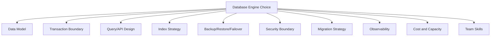
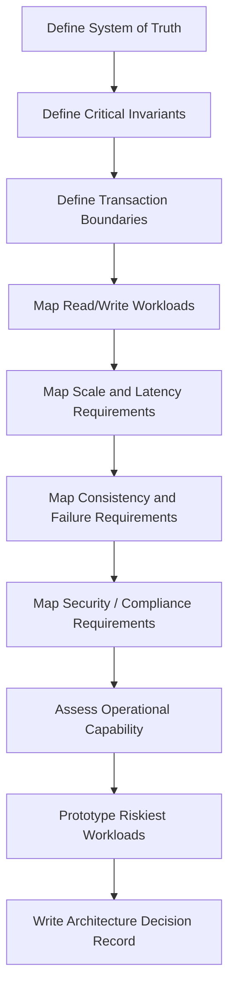
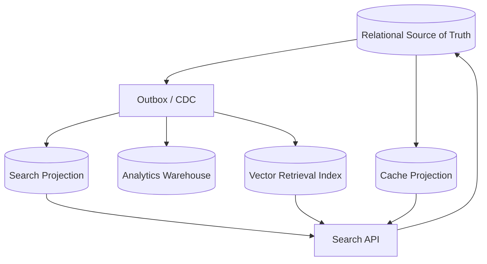

# Part 044 — Choosing the Right Database Engine

Choosing a database engine is not a technology popularity contest.

It is a fit problem.

A database engine is a bundle of tradeoffs:

- data model;
- transaction model;
- indexing model;
- query model;
- replication model;
- failure behavior;
- operational model;
- security model;
- cost model;
- team skill requirement.

The wrong engine can still work for a while. That is what makes bad database decisions dangerous. They fail slowly through complexity, brittle workarounds, unreliable migrations, expensive operations, weak consistency, reporting pain, or security gaps.

The architect-level question is not:

> Which database is best?

The right question is:

> For this workload, with these invariants, access patterns, scale expectations, failure constraints, compliance needs, and team capabilities, which persistence architecture has the lowest long-term risk?

This part gives a decision framework.

---

## 1. The Core Principle

Choose the database from the **shape of the problem**, not from the shape of the hype.

Problem shape is defined by:

1. authority — what is the system of truth?
2. invariants — what must never become invalid?
3. transactions — what must commit atomically?
4. query shape — how is data read?
5. write shape — how is data changed?
6. scale shape — where does growth happen?
7. consistency — how stale can reads be?
8. latency — how fast must operations complete?
9. availability — what happens during failure?
10. operability — can the team run it safely?
11. compliance — what audit, retention, privacy, and security rules apply?
12. evolution — how will schema and workload change?

A database is “right” when its natural strengths align with these forces.

---

## 2. Database Choice Is Architecture, Not Storage

The database engine affects the whole system.



Choosing document database vs relational database changes how you model relationships.

Choosing distributed SQL changes how you think about latency, locality, retries, and transactions.

Choosing wide-column changes how you design queries before tables.

Choosing search/vector changes what “correctness” means.

Choosing warehouse/lakehouse changes freshness, governance, and report reproducibility.

The engine is not hidden below the application. It shapes the application.

---

## 3. The Database Engine Map

A practical classification:

| Engine Type | Natural Strength | Natural Weakness |
|---|---|---|
| Relational OLTP | transactions, constraints, joins, canonical data | horizontal write scale requires design |
| Distributed SQL | SQL + horizontal scale + strong consistency options | operational/latency complexity |
| Key-value | simple high-throughput access | limited query/model expressiveness |
| Wide-column | massive partitioned access patterns | query-driven schema, denormalization burden |
| Document | aggregate/document-oriented data | relationship and cross-document invariant complexity |
| Graph | relationship traversal | high-volume simple OLTP often better elsewhere |
| Search | lexical retrieval/ranking | not canonical truth, eventual consistency |
| Vector DB/index | semantic similarity retrieval | approximate recall, auth/filter complexity |
| Time-series | metric/event time workloads | poor general relational modelling |
| Warehouse | analytical SQL, scans, reporting | not OLTP source of truth |
| Lakehouse | large-scale governed data lake + analytics | operational/data governance complexity |
| Cache | low-latency derived state | not durable canonical truth by default |
| Ledger/event store | immutable facts/history | query/read-model complexity |

Most serious systems use more than one persistence model, but not randomly.

---

## 4. The Default Bias: Relational First for Systems of Record

For business-critical systems of record, relational databases remain a strong default.

Why?

- explicit schema;
- constraints;
- transactions;
- joins;
- referential integrity;
- mature tooling;
- backup/restore maturity;
- auditability;
- query flexibility;
- migration discipline;
- operational familiarity.

This does not mean “always relational”.

It means:

> If your data has important invariants, relationships, lifecycle transitions, audit requirements, and ad hoc operational queries, relational should usually be your baseline unless a stronger workload reason overrides it.

Use another engine because the problem demands it, not because relational feels old.

---

## 5. Decision Workflow

Use this workflow before selecting an engine.



Do not start with tools. Start with forces.

---

## 6. Step 1 — Define the System of Truth

Ask:

- Which database owns the authoritative state?
- Which data is canonical?
- Which data is derived?
- Which system can correct historical mistakes?
- Which system is legally/auditably authoritative?
- Which data can be rebuilt?
- Which data cannot be lost?

If the database is a system of truth, prioritize:

- durability;
- transaction safety;
- constraints;
- backup/restore;
- auditability;
- migration safety;
- access control;
- operational maturity.

If the database is a projection, prioritize:

- read shape;
- rebuildability;
- freshness contract;
- indexing/ranking;
- eventual consistency handling;
- source lineage.

Example:

| Data | Engine Bias |
|---|---|
| case status and decisions | relational OLTP |
| case search index | search engine / PostgreSQL FTS |
| semantic evidence retrieval | vector index |
| dashboard aggregates | warehouse / materialized read model |
| frequently viewed permissions | cache/projection, backed by source DB |

The same domain may need multiple stores with different authority levels.

---

## 7. Step 2 — Identify Invariants

Invariants decide transaction requirements.

Examples:

- one active assignment per case;
- no transition from `CLOSED` back to `UNDER_REVIEW` except via formal reopening;
- payment ledger must balance;
- tenant data must never cross boundaries;
- each evidence document must belong to exactly one case;
- retention deletion must not remove legal-hold records;
- user cannot approve their own escalation;
- unique external reference per jurisdiction.

If invariants are strong and cross-related, relational engines are usually easier.

If invariants are mostly per-key/per-document, document/KV/wide-column may fit.

If invariants span partitions/regions/services, expect higher complexity regardless of engine.

Decision heuristic:

| Invariant Shape | Engine Bias |
|---|---|
| row/document-local | document/KV/relational all possible |
| relationship-heavy | relational/graph |
| aggregate-local | document or relational aggregate tables |
| cross-aggregate atomic | relational/distributed SQL |
| global uniqueness | relational/distributed SQL or explicit uniqueness service |
| eventually consistent business process | saga/outbox + local databases |
| immutable facts | ledger/event store/append-only relational |

---

## 8. Step 3 — Define Transaction Boundary

Ask:

- What must commit together?
- What can be eventually consistent?
- What can be compensated?
- What external side effects are involved?
- What is the retry model?
- What happens after commit succeeds but response is lost?

If one transaction must update multiple related entities with constraints, relational is natural.

If the transaction is per document/item/key, document/KV/wide-column may be strong.

If transaction spans globally distributed regions, distributed SQL may help but with latency and retry tradeoffs.

If transaction spans services, do not assume the database solves it. You likely need outbox/saga/idempotency.

---

## 9. Step 4 — Map Query Shape

Database choice should follow query shape.

| Query Shape | Natural Fit |
|---|---|
| exact lookup by primary key | any engine |
| relational joins and filters | relational/distributed SQL |
| flexible ad hoc operational queries | relational |
| document aggregate fetch | document store |
| query by known partition key + sort key | wide-column/KV |
| text relevance search | search engine / full-text search |
| semantic similarity search | vector index |
| graph traversal | graph database |
| large analytical scans | warehouse/lakehouse |
| time-window metrics | time-series / columnar / OLAP |

A common design failure:

> Choosing an engine before listing top read/write access patterns.

For wide-column and DynamoDB-style designs, this is especially fatal. You must know access patterns first.

For relational systems, query flexibility is higher, but indexes still need workload awareness.

---

## 10. Step 5 — Map Write Shape

Write shape includes:

- insert-only vs update-heavy;
- hot-row updates;
- append-only events;
- idempotent commands;
- batch ingestion;
- high write fan-out;
- large payload writes;
- distributed writes;
- conditional writes;
- TTL/retention expiration;
- schema evolution frequency.

Engine bias:

| Write Shape | Natural Fit |
|---|---|
| append-only high-throughput events | log/event store, wide-column, LSM/KV |
| transactional entity updates | relational |
| per-key conditional writes | KV/wide-column/document/relational |
| high-frequency metrics | time-series/columnar/wide-column |
| large document writes | document/blob + metadata DB |
| multi-row invariants | relational/distributed SQL |
| write-heavy global scale | distributed SQL/wide-column with careful model |

Write amplification matters. Search, secondary indexes, materialized views, CDC, replicas, and vector indexes all add write cost.

---

## 11. Step 6 — Map Scale Shape

“Scale” is not one thing.

Ask what scales:

- rows;
- tenants;
- write throughput;
- read throughput;
- data size;
- query complexity;
- relationship traversal;
- search corpus;
- vector dimension/count;
- number of regions;
- retention period;
- schema versions;
- operational teams.

Different engines scale different dimensions.

A relational database can handle very large systems if workload and schema are disciplined. A distributed database can still fail under a bad hot key or cross-region transaction pattern.

Do not say “NoSQL scales” without defining the scaling dimension.

---

## 12. Step 7 — Define Consistency Requirements

Consistency questions:

- Can reads be stale?
- Can users read their own writes?
- Is monotonic read required?
- Can two users see different versions temporarily?
- Can duplicate processing happen?
- Can conflict resolution be automatic?
- Is last-write-wins acceptable?
- Is manual reconciliation acceptable?
- What happens during region partition?

Engine implications:

| Requirement | Engine/Pattern Bias |
|---|---|
| strict local consistency | relational OLTP |
| global external consistency | distributed SQL with strong consistency model |
| eventual consistency acceptable | document/wide-column/KV/search projections |
| conflict-free local writes | CRDT/eventual systems, but complex |
| read-your-writes UX | primary routing/session token/freshness strategy |
| stale analytics acceptable | warehouse/lakehouse/read replica |

Consistency is not only database theory. It is user experience and business risk.

---

## 13. Step 8 — Define Failure Requirements

Ask:

- What is the RPO?
- What is the RTO?
- Is single-region outage acceptable?
- Can the system degrade to read-only?
- Can writes queue during outage?
- Can users work offline?
- Can stale reads be served?
- What is the blast radius of one tenant?
- Can the team restore one tenant?
- Can the team fail over safely?

A database with impressive benchmarks but weak operational recovery is a bad choice for systems of record.

Failure posture often matters more than average latency.

---

## 14. Step 9 — Evaluate Operational Maturity

Every database has an operational contract.

Questions:

- Who patches it?
- Who monitors it?
- Who restores it?
- Who tunes it?
- Who handles slow queries?
- Who handles failover?
- Who manages schema migrations?
- Who handles capacity planning?
- Who understands its consistency model?
- Who responds at 03:00 when p99 explodes?

Managed services reduce some burden, but not architectural responsibility.

The team still owns:

- data model;
- query shape;
- index design;
- migration safety;
- backup validation;
- security configuration;
- incident playbooks;
- cost control;
- correctness.

Choose engines your organization can operate.

---

## 15. Step 10 — Prototype the Riskiest Workloads

Do not prototype the happy path.

Prototype the risk.

Examples:

- highest-cardinality tenant query;
- worst-case filter + vector search;
- largest expected transaction;
- largest migration/backfill;
- restore from backup;
- regional failover;
- hot partition scenario;
- permission-heavy search;
- p99 under concurrent writes;
- schema evolution with old/new app versions;
- tenant extraction;
- legal-hold deletion case.

A good prototype answers a decision question. It is not a demo.

---

## 16. Engine-by-Engine Decision Guide

### 16.1 Relational OLTP

Use when:

- data has strong relationships;
- constraints matter;
- transactions matter;
- ad hoc queries matter;
- data is a system of record;
- audit and reporting need predictable schema;
- team needs mature tooling.

Avoid or be careful when:

- workload requires massive write scale without partitioning strategy;
- schema is treated as disposable;
- all data is huge unstructured blobs;
- global low-latency active-active writes are mandatory.

Good examples:

- case management;
- payment ledger;
- user/account system;
- workflow state;
- inventory;
- authorization source data;
- compliance records.

---

### 16.2 Distributed SQL

Use when:

- SQL/transactions are needed;
- horizontal scale is required;
- multi-region resilience matters;
- strong consistency across distributed data is valuable;
- operational platform can handle complexity.

Be careful when:

- workload is small enough for a normal relational database;
- most transactions cross regions unnecessarily;
- team is not ready for retries, locality, and distributed execution plans;
- low-latency global writes are assumed to be free.

Distributed SQL is not magic relational. It is relational plus distributed-systems tradeoffs.

---

### 16.3 Key-Value Store

Use when:

- access is mostly by key;
- value is opaque or simple;
- latency/throughput matter;
- query flexibility is not required;
- per-key atomicity is enough.

Avoid when:

- ad hoc filtering is required;
- relationships matter;
- constraints span multiple keys;
- reporting is expected from the same store;
- operators will invent secondary indexes manually without discipline.

Good examples:

- session/token state;
- feature flags;
- idempotency records;
- cached profile summary;
- simple counters with careful design;
- object metadata by key.

---

### 16.4 Wide-Column / DynamoDB-Style Store

Use when:

- access patterns are known;
- partition/sort key model fits;
- scale and predictable latency matter;
- denormalized query-specific tables are acceptable;
- writes are high-volume and per-partition designed.

Avoid when:

- query patterns are unknown;
- ad hoc queries are needed;
- many global secondary indexes become accidental relational modelling;
- strong cross-entity invariants are needed;
- hot partitions cannot be avoided.

This family rewards disciplined access-pattern-first design and punishes exploratory querying.

---

### 16.5 Document Database

Use when:

- aggregate/document boundary is natural;
- common reads fetch a whole document;
- schema varies by document type;
- nested structure is meaningful;
- cross-document invariants are limited;
- application owns shape evolution.

Avoid when:

- many-to-many relationships dominate;
- cross-document transactions are common;
- reporting needs normalized consistency;
- documents grow without bound;
- authorization depends on deeply nested mutable rules.

Good examples:

- content documents;
- configuration objects;
- product catalog with controlled variants;
- user preference profile;
- event payload archive.

---

### 16.6 Graph Database

Use when:

- relationships are the product;
- multi-hop traversal is core;
- path questions matter;
- network analysis matters;
- relationship properties are first-class.

Avoid when:

- workload is simple CRUD;
- graph is only for display;
- high-volume transactional system needs simple key access;
- graph is a projection and can be derived elsewhere.

Good examples:

- fraud rings;
- dependency graph;
- authorization relationship graph;
- lineage graph;
- investigation link analysis;
- recommendation graph.

---

### 16.7 Search Engine

Use when:

- full-text relevance matters;
- ranking matters;
- faceting/highlighting/autocomplete matters;
- documents combine many source entities;
- search scale is independent from OLTP;
- index can be rebuilt.

Avoid when:

- you need canonical truth;
- exact transactional updates are required;
- security filters cannot be modeled safely;
- stale results are unacceptable and no fallback exists.

Search is a retrieval projection, not the source of truth.

---

### 16.8 Vector Database / Vector Index

Use when:

- semantic similarity matters;
- recommendation/search/RAG retrieval is needed;
- approximate recall tradeoff is acceptable;
- embedding lifecycle can be managed;
- security/filtering is designed explicitly.

Avoid when:

- exact correctness is required;
- identifiers or legal truth are queried;
- authorization cannot be enforced before retrieval;
- model/version drift cannot be managed;
- no quality evaluation exists.

Vector search is powerful, but approximate retrieval must be treated as approximate.

---

### 16.9 Time-Series Database

Use when:

- data is time-indexed;
- writes are append-heavy;
- queries are time-window aggregations;
- retention/downsampling matters;
- metrics/events dominate.

Avoid when:

- data is relationship-heavy;
- arbitrary updates matter;
- business transactions matter;
- relational constraints matter.

Good examples:

- metrics;
- sensor readings;
- audit telemetry copy;
- operational monitoring;
- financial market ticks with specific design.

---

### 16.10 Warehouse / Lakehouse

Use when:

- analytical scans dominate;
- historical reporting matters;
- data from multiple systems is integrated;
- columnar storage is valuable;
- transformations are batch/stream analytical;
- governance and lineage matter.

Avoid when:

- OLTP writes are required;
- user-facing transactions depend on it;
- low-latency mutation is needed;
- row-level operational consistency is required.

Warehouse/lakehouse is usually downstream from operational sources.

---

### 16.11 Cache

Use when:

- repeated reads need lower latency;
- data can be recomputed or reloaded;
- staleness is acceptable or controlled;
- cache invalidation can be managed.

Avoid when:

- it becomes undocumented source of truth;
- eviction would lose canonical data;
- consistency requirements are vague;
- keys are not scoped by tenant/security context.

A cache is an accelerator, not a database replacement unless deliberately designed as durable storage.

---

## 17. Polyglot Persistence With Discipline

Using multiple databases can be correct.

But every additional database adds:

- consistency complexity;
- operational burden;
- backup/restore scope;
- monitoring surface;
- security surface;
- migration paths;
- developer cognitive load;
- incident complexity;
- cost;
- governance burden.

Good polyglot architecture:



Bad polyglot architecture:

```text
Every team chooses a different database because they prefer it.
No clear source of truth.
No unified recovery story.
No deletion propagation.
No schema ownership.
No consistency model.
```

Polyglot persistence is strong when each store has a clear job.

---

## 18. Database Selection Matrix

Use this as a first-pass map, not a substitute for design.

| Requirement | Strong Candidate | Watch Out |
|---|---|---|
| system of record with strong invariants | relational OLTP | scaling/partitioning if huge |
| global SQL with strong consistency | distributed SQL | latency/retry/locality |
| massive key-based access | KV/wide-column | query inflexibility |
| flexible document aggregate | document DB | relationship complexity |
| relationship traversal | graph DB | operational/reporting complexity |
| keyword search | search engine / PostgreSQL FTS | not canonical truth |
| semantic retrieval | vector DB/index | approximate recall/security filters |
| metrics/events by time | time-series | not general OLTP |
| analytical reporting | warehouse/lakehouse | freshness and OLTP mismatch |
| low-latency repeated reads | cache | invalidation/staleness |
| immutable audit facts | append-only relational/event store | read model complexity |

---

## 19. Scenario: Regulatory Case Management

Problem shape:

- cases have lifecycle states;
- evidence and decisions require auditability;
- assignments and escalations have invariants;
- role/jurisdiction/tenant security matters;
- reports and search are required;
- historical reconstruction matters.

Good architecture:

| Need | Store |
|---|---|
| canonical case state | relational OLTP |
| transition history/audit | append-only relational tables |
| full-text case/evidence search | search projection / PostgreSQL FTS initially |
| semantic similarity between cases | vector index as projection |
| operational dashboards | materialized read model / warehouse |
| high-speed permission cache | cache derived from authorization source |

Bad architecture:

- putting canonical case state only in search;
- using vector DB as legal evidence store;
- storing all case relationships in nested documents without lifecycle constraints;
- using wide-column before access patterns are stable;
- no restore drill for evidence/audit records.

Recommended baseline:

> Relational source of truth + outbox-driven search/vector/analytics projections.

---

## 20. Scenario: High-Volume Ledger

Problem shape:

- financial correctness;
- append-only entries;
- idempotent commands;
- reconciliation;
- audit trail;
- strict invariants.

Engine bias:

- relational with append-only ledger tables;
- strong constraints;
- transactionally updated account summary if needed;
- immutable journal;
- outbox for downstream projections;
- warehouse for analytics.

Avoid:

- document-only ledger without constraints;
- last-write-wins balance updates;
- search/vector as financial truth;
- distributed saga for intra-ledger atomicity if a local transaction can handle it.

---

## 21. Scenario: Product Catalog

Problem shape varies.

For small/medium catalog with rich query:

- relational for canonical products/variants/prices;
- search engine for product discovery;
- cache for hot product views.

For highly flexible product attributes:

- document model may fit product representation;
- search index still handles discovery;
- relational may still own pricing/inventory if invariants are strong.

Avoid:

- EAV chaos in relational without governance;
- giant unbounded product documents;
- search index as canonical product store;
- no versioning for price/availability.

---

## 22. Scenario: IoT / Telemetry

Problem shape:

- high-volume append writes;
- time-window queries;
- downsampling;
- retention;
- aggregate dashboards;
- device metadata relationships.

Good architecture:

| Need | Store |
|---|---|
| device registry | relational/document |
| raw telemetry | time-series/wide-column/log/lake |
| aggregates | time-series/warehouse |
| alerts | streaming + operational store |
| search over devices | search projection |

Do not force raw telemetry into normalized OLTP tables unless scale is small and requirements justify it.

---

## 23. Scenario: Global User Profile

Problem shape:

- per-user key-based access;
- high read volume;
- low latency;
- regional data residency;
- profile updates;
- personalization projections.

Possible architecture:

- KV/document store for profile aggregate;
- relational for account/security/identity source;
- cache for hot profile reads;
- event stream for profile change projections;
- warehouse for analytics.

Critical question:

> Is profile data authoritative business state, or a derived personalization document?

That answer changes engine choice.

---

## 24. Anti-Patterns

### 24.1 “We Need NoSQL Because Scale”

Scale of what?

- writes?
- reads?
- data size?
- tenants?
- regions?
- search corpus?
- analytics?
- relationships?

Without a scale dimension, “NoSQL for scale” is not architecture.

### 24.2 “Use One Database for Everything”

A single relational database can go very far. But forcing search, analytics, vector retrieval, high-volume metrics, and canonical OLTP into one engine may create avoidable pain.

The mistake is not using one database. The mistake is ignoring workload differences.

### 24.3 “Every Service Gets Its Favorite Database”

This creates operational sprawl and unclear ownership.

A service should get a different engine only when the workload justifies the cost.

### 24.4 “Search Is Source of Truth”

Search indexes are optimized for retrieval and ranking. They are usually eventually consistent and denormalized.

Do not make them canonical unless you have explicitly designed them as durable systems of record.

### 24.5 “Vector DB Solves Knowledge”

Vector retrieval finds similar chunks. It does not solve:

- truth;
- authorization;
- provenance;
- freshness;
- retention;
- hallucination;
- decision accountability.

Vector search is one component in a governed retrieval architecture.

### 24.6 “Distributed SQL Removes Distributed Systems Problems”

Distributed SQL gives powerful abstractions, but latency, retries, locality, range hot spots, and failover behavior still matter.

It changes the problem. It does not delete it.

---

## 25. Cost Model Thinking

Database cost is not just monthly bill.

Total cost includes:

- infrastructure;
- licensing;
- managed service fees;
- storage growth;
- index overhead;
- backup storage;
- data transfer;
- cross-region replication;
- operational labor;
- migration cost;
- incident cost;
- developer learning curve;
- lock-in cost;
- compliance evidence cost.

A cheap database that causes repeated incidents is expensive.

An expensive managed database that eliminates operational risk may be cheap.

Cost must be evaluated against business risk.

---

## 26. Migration and Exit Strategy

Before adopting an engine, ask:

- Can we export all data in usable form?
- Can we replay history into a new store?
- Are IDs portable?
- Are query semantics portable?
- Are constraints encoded only in app code?
- Are stored procedures/extensions portable?
- Is data format proprietary?
- Can we run dual-write/backfill/cutover?
- Can we validate source/target equivalence?

No database is fully portable. But avoid needless lock-in from accidental design.

Good portability practices:

- stable domain IDs;
- explicit schema/versioning;
- outbox event history;
- source-of-truth clarity;
- rebuildable projections;
- migration test harness;
- documented query semantics.

---

## 27. Architecture Decision Record Template

Use this template when selecting a database.

```md
# ADR: Database Engine Choice for <System/Capability>

## Status
Proposed / Accepted / Superseded

## Context
What capability are we building?
What data is authoritative?
What are the expected workloads?

## Requirements
- Transaction/invariant requirements
- Query/access patterns
- Scale assumptions
- Latency SLO
- Availability/RPO/RTO
- Security/compliance requirements
- Retention/backup requirements
- Team/operational constraints

## Options Considered
1. Option A
2. Option B
3. Option C

## Decision
Chosen engine/persistence architecture.

## Rationale
Why this matches workload and risk.

## Tradeoffs
What we accept.

## Failure Modes
What can go wrong and how we detect/recover.

## Migration Plan
How we evolve from current state.

## Validation Plan
Benchmarks, prototypes, restore test, migration test.

## Revisit Trigger
Scale, product, compliance, or operational threshold that forces review.
```

This makes database selection defensible.

---

## 28. Scorecard Example

Score options from 1 to 5, but do not let the score replace reasoning.

| Criterion | Weight | PostgreSQL | Distributed SQL | Document DB | Search Engine |
|---|---:|---:|---:|---:|---:|
| invariants/transactions | 5 | 5 | 5 | 3 | 1 |
| flexible operational query | 4 | 5 | 4 | 3 | 2 |
| full-text relevance | 3 | 3 | 2 | 2 | 5 |
| horizontal global scale | 3 | 3 | 5 | 4 | 4 |
| operational maturity in team | 5 | 5 | 2 | 3 | 3 |
| compliance/audit | 5 | 5 | 4 | 3 | 2 |
| cost simplicity | 3 | 4 | 2 | 3 | 3 |

Then write the actual conclusion:

> We choose PostgreSQL as canonical source because invariants, auditability, and team maturity dominate. We add search as a projection for full-text discovery. We do not choose distributed SQL now because multi-region write scale is not yet required and operational complexity is premature.

The explanation matters more than the table.

---

## 29. Red Flags During Database Review

Be suspicious when you hear:

- “It scales better” without workload evidence.
- “Schema-less is more flexible” without data quality plan.
- “We can join in the application” without consistency analysis.
- “We do not need transactions” without invariant analysis.
- “The search index has all the data” without source-of-truth clarity.
- “The cache can be the database” without durability/recovery design.
- “Distributed SQL solves everything” without latency/retry plan.
- “Vector DB will understand our documents” without evaluation dataset.
- “We can migrate later” without migration path.
- “Managed service means no ops” without incident runbook.

These are not always wrong. But they require proof.

---

## 30. Review Questions for Senior Engineers

Use these in architecture reviews.

### Workload

- What are the top 10 read queries?
- What are the top 10 writes?
- What is the largest expected tenant/entity?
- What is the p95/p99 latency target?
- What is the write/read ratio?

### Correctness

- What invariants must never break?
- Which invariants are enforced by database constraints?
- Which are enforced by transactions?
- Which are eventually consistent?
- What is the reconciliation process?

### Operations

- How is backup performed?
- How is restore tested?
- What is RPO/RTO?
- How is failover tested?
- What metrics indicate overload?
- What is the migration process?

### Security

- What is the tenant boundary?
- What is the access-control boundary?
- Are derived stores secured consistently?
- How is deletion propagated?
- How is sensitive data masked/exported?

### Evolution

- How does schema evolve?
- How does the database support old/new app versions?
- Can we rebuild projections?
- Can we migrate tenants?
- What would force us to revisit the engine choice?

---

## 31. Practical Decision Heuristics

1. Use relational for systems of record unless workload strongly says otherwise.
2. Use search engines for search, not truth.
3. Use vector indexes for semantic retrieval, not correctness.
4. Use wide-column/KV only when access patterns are clear.
5. Use document stores when aggregate boundaries are natural and cross-document invariants are limited.
6. Use graph databases when traversal is central, not incidental.
7. Use warehouses/lakehouses for analytics, not OLTP.
8. Use caches as derived accelerators, not undocumented truth.
9. Use distributed SQL when distribution requirements justify operational cost.
10. Add databases only when the benefit exceeds consistency/operational complexity.

---

## 32. Final Mental Model

A database engine should fit the system’s dominant forces.

Do not ask:

> What database do we like?

Ask:

> What must this system never get wrong?

Then ask:

> What must this system do fast, often, cheaply, securely, and recoverably?

The correct engine is the one whose natural design boundaries align with those answers.

Top engineers do not pick databases by category labels. They pick persistence architectures by invariants, workload, failure mode, and operational truth.

That is the difference between database usage and database architecture.

---

## References

- AWS Documentation — Choosing an AWS database service: https://docs.aws.amazon.com/databases-on-aws-how-to-choose/
- AWS Databases — Purpose-built databases overview: https://aws.amazon.com/products/databases/
- PostgreSQL Documentation: https://www.postgresql.org/docs/current/
- MongoDB Documentation — Data Modeling: https://www.mongodb.com/docs/manual/data-modeling/
- Apache Cassandra Documentation — CQL DDL and primary key modelling: https://cassandra.apache.org/doc/latest/cassandra/developing/cql/ddl.html
- Neo4j Documentation — Graph database concepts: https://neo4j.com/docs/getting-started/appendix/graphdb-concepts/
- OpenSearch Documentation — Search and Vector Search: https://docs.opensearch.org/latest/
