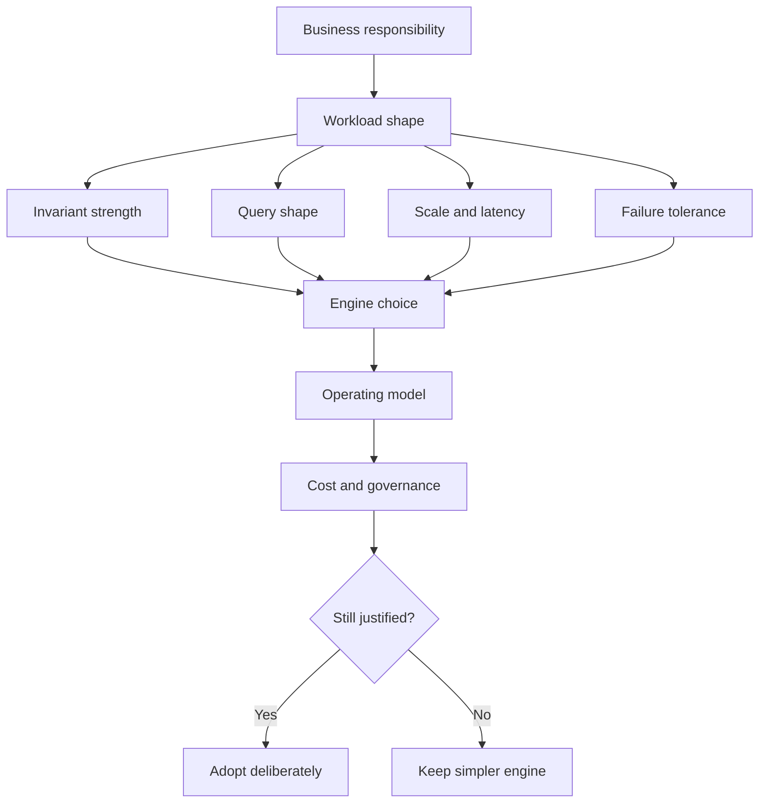
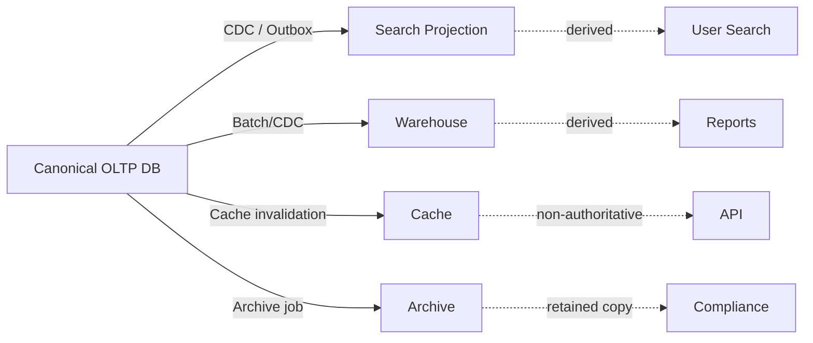
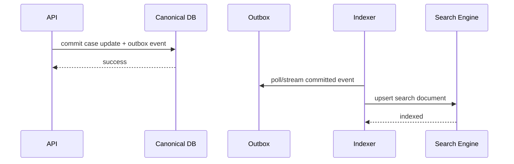
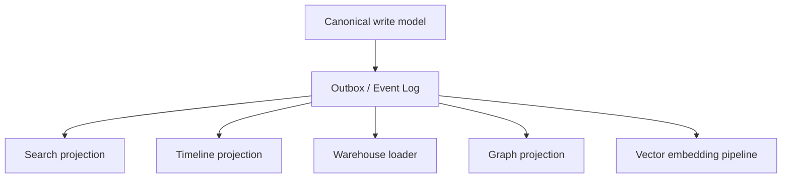
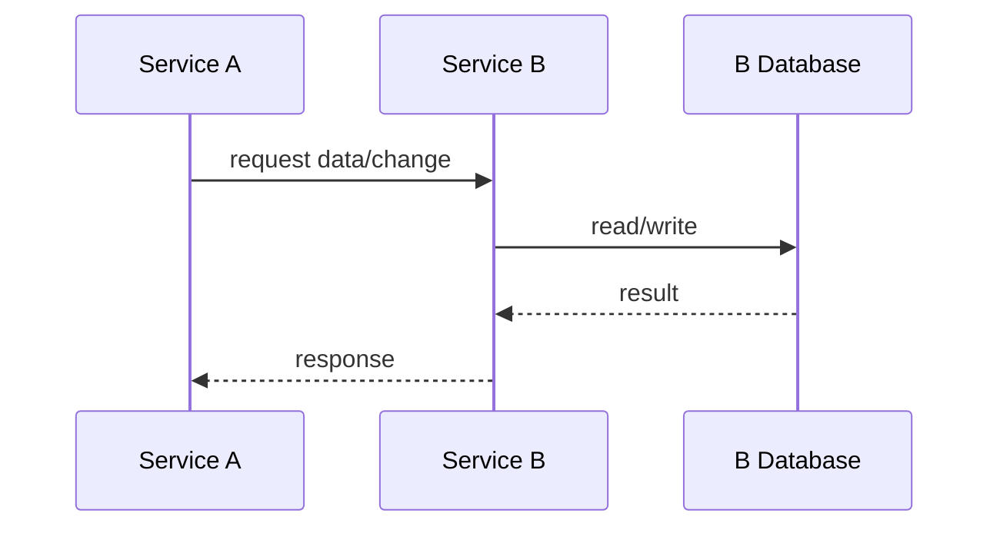
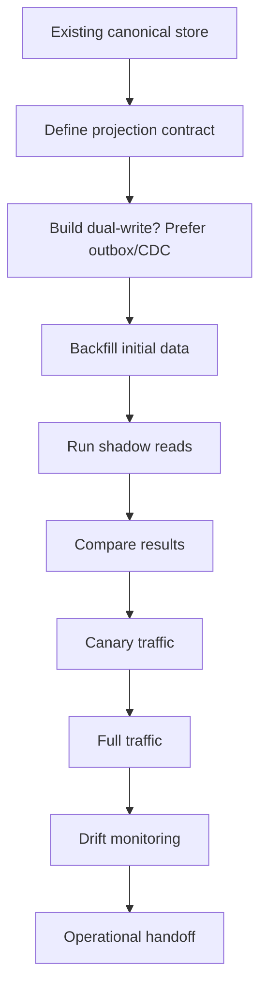
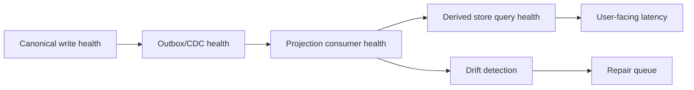

# Part 045 — Polyglot Persistence With Discipline

> Top 1% database architects do not ask: “Which database is best?”  
> They ask: “Which data responsibility, query shape, consistency requirement, failure mode, and operating model justifies this storage engine?”

Polyglot persistence means using more than one persistence technology in one system landscape. A payment ledger may use relational storage. A case search feature may use a search index. A recommendation feature may use vector search. A session store may use key-value storage. An investigation graph may use graph storage. A reporting system may use a warehouse.

That sounds reasonable. It also sounds dangerous.

The discipline is this:

**Every additional database engine must buy a concrete capability that cannot be achieved more simply, and every added capability must pay for its extra consistency, operational, security, migration, and recovery cost.**

This part is not about collecting database logos. It is about designing a persistence portfolio that remains understandable, governable, testable, recoverable, and defensible under production pressure.

---

## 1. The Mental Model: Persistence Portfolio, Not Database Zoo

A weak architecture chooses databases by excitement:

- “Use document DB because it is flexible.”
- “Use graph DB because relationships exist.”
- “Use vector DB because AI.”
- “Use DynamoDB because scale.”
- “Use PostgreSQL for everything because we know it.”

A strong architecture chooses databases by **responsibility**.

A database engine is not just storage. It is a bundle of tradeoffs:

- data model
- query model
- transaction model
- indexing model
- scaling model
- consistency model
- failure behavior
- migration behavior
- backup/restore behavior
- operational skill requirement
- security/governance capability
- cost curve

Polyglot persistence is justified only when one engine's tradeoff bundle is materially better for a bounded responsibility.



### The core rule

Do not choose an engine because a feature exists. Choose it because a bounded workload has a property that the current persistence layer cannot satisfy safely or economically.

Examples:

| Workload pressure | Better-fit storage may be | Why |
|---|---|---|
| Strong multi-row invariants | Relational database | Constraints, transactions, relational integrity |
| Huge write volume by partition key | Wide-column / key-value | Predictable partitioned writes |
| Flexible document aggregate read/write | Document database | Local aggregate mutation, natural JSON shape |
| Deep relationship traversal | Graph database | Traversal-native query model |
| Text relevance ranking | Search engine | Inverted index, relevance scoring |
| Semantic similarity | Vector index / vector-capable DB | Approximate nearest-neighbor search |
| Historical analytics | Warehouse/lakehouse | Columnar scans, batch analytics |
| Low-latency ephemeral lookup | Cache / key-value | Fast point lookup, TTL semantics |

The danger appears when each team independently chooses a different engine without owning the integration contract. That creates a database zoo.

A portfolio is governed. A zoo is accumulated.

---

## 2. Polyglot Persistence Is Not the Same as Microservices

Polyglot persistence often appears in microservice architectures, but they are not identical.

You can have:

1. **Monolith + multiple storage systems**  
   Example: one modular application owns PostgreSQL for transactions, OpenSearch for search projection, Redis for ephemeral locks/cache, and a warehouse for analytics.

2. **Microservices + one database engine type**  
   Example: each service owns its own PostgreSQL database/schema.

3. **Microservices + multiple engine types**  
   Example: order service uses relational DB, catalog service uses document DB, search service uses search index, recommendation service uses vector store.

4. **Shared database + multiple applications**  
   Usually risky unless it is a legacy migration stage or explicitly governed platform boundary.

The design question is not “microservice or monolith?” but:

**Who owns the authoritative state, and how do other persistence stores receive, validate, refresh, rebuild, and expose derived state?**

---

## 3. Canonical Store vs Projection Store

This is the first distinction to make.

A database can be:

| Role | Meaning | Example |
|---|---|---|
| Canonical store | Authoritative source of truth for a domain state | PostgreSQL ledger table |
| Projection store | Derived read model built from canonical events/state | OpenSearch case search index |
| Cache | Temporary acceleration layer | Redis session/token cache |
| Analytical store | Historical/aggregated decision-support store | Warehouse fact/dimension model |
| Integration store | Durable bridge for messages/events | Outbox/inbox table |
| Archive store | Long-term retention or cold storage | Object storage + metadata index |

A common architecture failure is treating projections as if they were canonical.

For example:

- user edits case status through search index result
- reporting warehouse becomes source for operational decisions
- cache value becomes authoritative after source write fails
- document projection stores derived authorization state and never refreshes

The discipline:

**Every persistence store must declare whether it is canonical, derived, cache, analytical, integration, or archive.**



A projection may be essential. It may serve 99% of reads. But it must have a rebuild path and a correctness contract.

---

## 4. The Polyglot Justification Test

Before introducing a new database engine, answer these questions in writing.

### 4.1 Capability gap

What exact workload cannot be handled well by the existing storage system?

Bad answer:

> We need more scale.

Better answer:

> The product listing page requires full-text relevance scoring, faceted filters, typo tolerance, and sub-200ms p95 latency across 50 million product documents. PostgreSQL B-Tree and basic text search are not enough for product-search UX and ranking experiments.

### 4.2 Data role

Is the new store canonical or derived?

If canonical, it owns correctness. If derived, it owns serving performance and freshness.

### 4.3 Invariant boundary

Which invariants must be enforced inside this store?

If the store cannot enforce them, where are they enforced?

### 4.4 Consistency contract

What staleness is acceptable?

- zero staleness
- read-your-writes
- seconds of lag
- minutes of lag
- eventually corrected
- best effort
- manually reconciled

### 4.5 Rebuild path

Can the store be rebuilt from canonical data?

If yes:

- how long does rebuild take?
- can rebuild run while serving traffic?
- how do you compare old vs new projection?
- how do you cut over?

If no:

- why not?
- what backup and recovery guarantees exist?
- what happens after corruption?

### 4.6 Operational readiness

Who can operate this engine at 3 AM?

That includes:

- backup/restore
- capacity planning
- query diagnosis
- index rebuild
- version upgrade
- security patching
- failover
- incident response
- data repair

### 4.7 Governance

Who approves schema changes, index changes, retention changes, and access policy changes?

### 4.8 Cost model

What is the cost per:

- write
- read
- GB stored
- index growth
- replica
- backup
- cross-region transfer
- rebuild
- engineering maintenance

A new database often looks cheap at query time and expensive at lifecycle time.

---

## 5. Database Responsibility Matrix

A disciplined system uses a responsibility matrix.

Example for a regulatory case management platform:

| Data responsibility | Canonical owner | Store type | Consistency | Rebuildable? | Notes |
|---|---|---|---|---|---|
| Case core state | Case service | Relational OLTP | Strong | No, canonical | State transition invariants |
| Case transition history | Case service | Relational append-only table | Strong | No, canonical | Evidence-grade audit |
| Evidence metadata | Evidence service | Relational/document | Strong | Partially | Object body externalized |
| Evidence binary | Evidence service | Object storage | Strong enough + checksum | No, canonical asset | Content-addressable hash recommended |
| Case search | Search service | Search engine | Eventual | Yes | Rebuild from case/evidence metadata |
| Case timeline view | Timeline service | Relational/document projection | Eventual/read-your-writes maybe | Yes | Projection from events |
| SLA dashboard | Reporting service | Warehouse/materialized aggregate | Minutes lag | Yes | Must display freshness timestamp |
| Investigation relationship graph | Graph service | Graph DB/projection | Eventual | Yes/partial | Derived from parties/cases/evidence links |
| ML recommendations | Recommendation service | Vector/index store | Eventual | Yes | Rebuild from embeddings/source corpus |

This matrix prevents accidental authority drift.

---

## 6. Common Polyglot Patterns

### Pattern 1: Relational canonical store + search projection

Use when:

- relational DB owns transactions and constraints
- users need full-text search, relevance, highlighting, faceting, fuzzy matching
- search can be eventually consistent



Critical decisions:

- search document ID must be stable
- indexing must be idempotent
- delete/permission changes need priority path
- search result must rehydrate from canonical store for sensitive actions
- index must be rebuildable
- search freshness must be visible or bounded

Failure mode:

A case is restricted in canonical DB, but search index still exposes stale unauthorized metadata.

Mitigation:

- permission-sensitive search filters
- index delete/update priority
- result reauthorization before display/action
- periodic drift detection

---

### Pattern 2: Relational canonical store + warehouse analytics

Use when:

- operational DB should not serve heavy analytics
- reports scan large history
- reproducible historical reports matter
- analytical model differs from operational model

Critical decisions:

- define report grain
- define extraction timestamp
- define correction handling
- define late-arriving facts handling
- display data freshness
- protect PII in analytical store
- ensure warehouse does not become operational authority

Failure mode:

Business uses yesterday's warehouse status to make today's enforcement action.

Mitigation:

- label data freshness
- prohibit operational commands from warehouse
- link report rows to canonical records
- expose “as of” semantics explicitly

---

### Pattern 3: Transactional store + cache

Use when:

- reads are frequent and repeated
- recomputation is expensive
- stale data is acceptable or bounded

Critical decisions:

- cache key grammar
- TTL
- invalidation path
- negative caching
- stampede protection
- authorization-safe caching
- cache-aside vs write-through
- failure behavior when cache is down

Failure mode:

Cache stores authorization decision longer than the user's permission membership.

Mitigation:

- short TTL for auth-sensitive cache
- versioned permission tokens
- revalidate sensitive actions against canonical state

---

### Pattern 4: Domain service owns specialized canonical store

Use when the specialized engine is truly the best canonical model for that bounded domain.

Example:

- graph DB owns investigation relationship model
- document DB owns dynamic submission document model
- wide-column store owns high-scale telemetry ingestion

This is stronger than “projection”. The service becomes authoritative for that data responsibility.

Required discipline:

- domain boundary must be clear
- API is the access boundary
- other services cannot directly query the store
- invariants must be enforceable in or around the engine
- backup/recovery must match canonical importance
- migration strategy must be known

Failure mode:

A graph DB becomes canonical for relationships, but core case DB also stores relationship state. Both accept writes. They diverge.

Mitigation:

- one write authority
- explicit ownership matrix
- integration by events/API
- reconciliation checks if dual storage is unavoidable during migration

---

### Pattern 5: Event log + multiple projections

Use when:

- multiple read models are derived from the same change stream
- replay/rebuild is a requirement
- temporal history matters



This pattern is powerful but easy to overuse.

Key controls:

- event schema versioning
- replay compatibility
- idempotent consumers
- poison event handling
- projection lag monitoring
- rebuild automation
- consumer-specific checkpointing

Do not call a message stream a source of truth unless it actually has retention, schema, replay, ordering, and governance guarantees suitable for source-of-truth use.

---

## 7. Consistency Contracts Across Stores

A polyglot system is mostly a consistency-management system.

You need contracts like:

| Store pair | Contract | Example |
|---|---|---|
| OLTP → Search | Eventual, usually seconds | Search index catches up after case update |
| OLTP → Cache | Bounded TTL or explicit invalidation | Permission cache expires quickly |
| OLTP → Warehouse | Batch freshness | Report is correct as of last ETL timestamp |
| OLTP → Graph | Eventual with reconciliation | Relationship graph catches up from events |
| OLTP → Vector | Eventual, embedding-versioned | Semantic search may lag content update |
| Service A DB → Service B DB | API/event contract | No direct cross-service join |

### The dangerous phrase: “eventually consistent”

Eventually consistent is not a design. It is a warning label.

You still need to define:

- eventually within how long?
- what user experience during lag?
- what action must not use stale data?
- how is lag measured?
- how is drift detected?
- how is repair triggered?
- what is the manual recovery path?

For example, in case management:

| Operation | Stale projection allowed? | Reason |
|---|---:|---|
| Search for cases | Usually yes | Result list can be slightly stale |
| View restricted evidence | No | Security-sensitive |
| Assign investigator | No | State and authorization must be current |
| Dashboard count | Yes, with freshness label | Aggregate reporting |
| Generate enforcement notice | No | Legal/regulatory action |

---

## 8. Ownership Rules

Polyglot persistence becomes unmanageable when ownership is unclear.

Use these rules:

### Rule 1: One canonical write owner per data responsibility

A table, collection, index, stream, or graph should have one owner for writes.

Other systems may request changes through:

- service API
- command queue
- workflow action
- event-driven process

But they should not directly mutate another service's store.

### Rule 2: Derived stores must be rebuildable or explicitly non-rebuildable

If a store is derived, document the rebuild path.

If not rebuildable, treat it as canonical and upgrade its controls.

### Rule 3: Cross-store joins belong in explicit composition layers

Do not hide distributed joins behind ad hoc application code.

Options:

- API composition
- materialized read model
- warehouse model
- search document projection
- graph projection

### Rule 4: Direct database access is an architectural privilege

When teams directly query another team's store, the schema becomes a public API by accident.

That increases migration risk.

### Rule 5: Every store has an owner, SLO, runbook, and recovery model

A database without an owner is not architecture. It is future incident material.

---

## 9. Polyglot Data Contract

A data contract for polyglot persistence should define:

```yaml
store_name: case-search-index
role: projection
canonical_source: case-service-postgres
owner_team: case-platform
served_use_cases:
  - investigator_case_search
  - supervisor_case_filtering
freshness_contract:
  normal_p95: under_10_seconds
  maximum_before_alert: 60_seconds
authority_rules:
  may_execute_commands: false
  must_rehydrate_before_sensitive_action: true
rebuild:
  supported: true
  source: canonical_case_tables_and_outbox
  estimated_duration: 4_hours
  cutover_strategy: blue_green_index
security:
  contains_pii: true
  authorization_filter_required: true
  field_masking_required: true
schema_evolution:
  versioned_document: true
  backward_compatible_indexer_required: true
observability:
  metrics:
    - indexing_lag_seconds
    - indexing_error_count
    - dead_letter_count
    - drift_sample_mismatch_count
```

This may feel bureaucratic. In production, this is how you avoid invisible dependency chaos.

---

## 10. Integration Patterns and Their Failure Modes

### 10.1 Synchronous API call



Good for:

- current data
- command validation
- strong ownership
- low fan-out requests

Bad for:

- high fan-out queries
- long chains
- cross-service transactions
- availability coupling

Failure modes:

- cascading latency
- partial failure
- retry storm
- implicit distributed transaction

Discipline:

- timeouts
- idempotency
- circuit breakers
- no hidden write-after-call side effect unless contract says so

---

### 10.2 Event-driven projection

Good for:

- search indexes
- dashboards
- read models
- downstream integration
- audit-friendly change propagation

Failure modes:

- lost event
- duplicate event
- out-of-order event
- poison event
- schema version mismatch
- consumer lag
- projection drift

Discipline:

- transactional outbox
- idempotent consumer
- checkpointing
- retry + dead-letter policy
- replay test
- drift detection

---

### 10.3 CDC-based integration

Good for:

- low-intrusion legacy integration
- warehouse loading
- search projection from database changes

Failure modes:

- schema change breaks consumer
- low-level row changes lose domain meaning
- delete semantics ambiguous
- snapshot + stream gap
- transaction ordering misunderstood

Discipline:

- schema compatibility checks
- event enrichment layer if needed
- source table ownership
- CDC lag monitoring
- consumer contract tests

---

### 10.4 Shared database

Sometimes used during legacy modernization.

Good for:

- incremental extraction
- reducing migration blast radius
- temporary compatibility

Bad for:

- ownership
- independent deployability
- schema evolution
- hidden coupling
- security boundaries

Discipline if unavoidable:

- define table ownership
- forbid writes to owned tables by non-owner
- expose compatibility views
- use backward-compatible schema changes
- set a retirement plan

---

## 11. Security in Polyglot Persistence

Every new persistence store creates a new data exposure surface.

Ask:

- Does this store contain PII?
- Does it contain derived sensitive data?
- Are fields masked consistently?
- Are authorization filters equivalent to canonical store?
- Are deletes/retention propagated?
- Is encryption configured?
- Are backups encrypted?
- Who has admin access?
- Is audit access logged?
- Can support users query it directly?

A serious failure mode:

> The canonical database has strict row-level access controls, but the search index receives flattened case documents and exposes restricted fields because the index was treated as “just a projection.”

Projection does not mean harmless. Derived sensitive data is still sensitive.

---

## 12. Data Lifecycle Across Stores

Lifecycle operations must propagate across the persistence portfolio.

| Lifecycle event | Required propagation |
|---|---|
| Create | Canonical insert, projections update |
| Update | Projection refresh, cache invalidation |
| Restrict | Search/access projection priority update |
| Delete/soft delete | Projection removal or tombstone |
| Retention expiry | Archive/purge across stores |
| Legal hold | Prevent purge in all stores |
| Schema change | Versioned readers/indexers |
| Tenant migration | Move canonical + derived state |
| Key rotation | Re-encrypt or rotate relevant stores |

Do not design lifecycle only in the canonical DB. Users experience the whole system.

---

## 13. Migration Strategy for Introducing a New Store

A safe adoption path:



### Step 1: Define contract

Before implementation:

- role
- source
- freshness
- security
- rebuild
- failure behavior

### Step 2: Backfill

Backfill is often harder than steady-state updates.

Plan:

- chunking
- rate limit
- ordering
- resumability
- idempotency
- progress metrics
- validation sampling

### Step 3: Shadow read

Run new store in parallel.

Compare:

- result count
- top results
- missing records
- permission behavior
- latency
- error rate

### Step 4: Canary

Expose to a subset of users or use cases.

### Step 5: Cutover

Cutover should be reversible.

### Step 6: Operate

Only after runbooks, dashboards, alerts, and ownership are ready.

---

## 14. Migration Strategy for Removing a Store

Database removal also needs discipline.

Steps:

1. Identify consumers.
2. Add telemetry for all reads/writes.
3. Freeze new dependency creation.
4. Move consumers to replacement API/store.
5. Shadow compare replacement behavior.
6. Disable writes.
7. Archive or snapshot.
8. Delete infrastructure after retention approval.
9. Remove credentials and access policies.
10. Remove documentation references.

A database that is “not used anymore” often still has one scheduled job or emergency report depending on it.

---

## 15. Cost Model

Polyglot persistence cost is not just cloud bill.

### Direct cost

- compute
- storage
- index storage
- backup storage
- IOPS/throughput
- network transfer
- cross-region replication
- managed service premium

### Engineering cost

- schema design
- integration code
- migration code
- test fixtures
- observability
- incident response
- upgrade planning
- security review

### Cognitive cost

- team knowledge
- onboarding
- debugging across systems
- consistency reasoning
- dependency understanding

### Governance cost

- access control
- retention propagation
- compliance evidence
- audit trail
- data lineage

A new store is justified when its business and technical value exceeds all four cost classes.

---

## 16. Observability for Polyglot Persistence

You need cross-store observability.

### Core metrics

| Metric | Meaning |
|---|---|
| source write rate | Canonical change volume |
| event/outbox lag | Delay from commit to propagation |
| projection lag | Delay from event to queryable projection |
| consumer error rate | Integration health |
| dead-letter count | Poison data/schema problem |
| drift sample mismatch | Derived store correctness problem |
| rebuild duration | Recovery readiness |
| stale read rate | UX correctness pressure |
| authorization mismatch | Security-critical projection drift |
| per-store p95/p99 latency | Serving quality |
| index/storage growth | Capacity risk |

### A useful dashboard layout



Dashboards should follow the path of data from source to serving layer.

---

## 17. Failure Mode Catalogue

| Failure | Cause | Detection | Mitigation |
|---|---|---|---|
| Projection lag | Consumer slow/down | lag metric | backpressure, scale consumer, priority update |
| Projection drift | missed/buggy update | sampled comparison | rebuild, repair job |
| Duplicate derived row | non-idempotent consumer | uniqueness/checksum | idempotency key |
| Unauthorized search result | stale permission projection | auth mismatch test | reauthorization, priority permission event |
| Lost delete | delete event not propagated | tombstone audit | reconciliation job |
| Inconsistent report | warehouse lag unclear | freshness label missing | report as-of timestamp |
| Dual-write split brain | app writes DB then index separately | mismatch | outbox/CDC |
| Schema version break | source change incompatible | consumer error spike | versioned event/document |
| Store outage cascades | synchronous dependency | timeout/error | degrade/fallback/circuit breaker |
| Backup gap | derived store assumed rebuildable but is not | restore drill failure | classify as canonical or add rebuild |

---

## 18. Design Smells

### Smell 1: “We use X because it scales”

Scale how?

- write scale?
- read scale?
- storage scale?
- tenant scale?
- geographic scale?
- operational scale?

Different engines scale different dimensions.

### Smell 2: Multiple canonical stores for the same fact

If two stores can both update the same business fact, you now have reconciliation as a permanent feature.

### Smell 3: No rebuild path for derived store

If you cannot rebuild it, it is not “just a projection.”

### Smell 4: Search index contains unrestricted sensitive fields

Search is often where privacy and authorization leak.

### Smell 5: Cache used as correctness layer

Cache can accelerate correctness checks, but it should not silently replace authoritative checks for sensitive actions.

### Smell 6: Shared database used to avoid API design

This is short-term speed for long-term coupling.

### Smell 7: Database choice owned by one team, operated by another

Ownership mismatch causes incident chaos.

---

## 19. Applied Example: Regulatory Case Platform

Imagine these requirements:

- case lifecycle must be strongly controlled
- evidence must be auditable
- investigators need fast search
- supervisors need dashboards
- analysts need graph exploration
- legal needs reproducible historical reports
- AI feature needs semantic search across evidence descriptions

A disciplined persistence design:

| Requirement | Store | Role | Reason |
|---|---|---|---|
| case lifecycle | PostgreSQL | canonical | strong constraints, transactions, audit |
| evidence metadata | PostgreSQL | canonical | relationship/invariant with case |
| evidence binary | object storage | canonical asset | large immutable object + checksum |
| case search | OpenSearch/Elasticsearch-like | projection | relevance/faceting |
| dashboards | warehouse/materialized aggregate | analytical/projection | aggregate workload isolation |
| relationship exploration | graph DB or graph projection | projection/canonical depending boundary | traversal-heavy queries |
| semantic evidence retrieval | vector-capable store | projection | embedding similarity |
| short-lived assignment cache | key-value cache | cache | latency, TTL |

Important decisions:

- enforcement action creation must read canonical DB, not search/warehouse
- search result rehydrates sensitive fields from canonical DB
- graph relationship confidence/evidence has provenance
- warehouse reports include `as_of_timestamp`
- vector result includes source document version and embedding model version
- deletion/retention events propagate to all derived stores

---

## 20. Production Checklist

Before adding a new persistence engine:

- [ ] The workload gap is explicitly documented.
- [ ] Existing engine limitations were tested, not assumed.
- [ ] Store role is declared: canonical, projection, cache, analytics, integration, archive.
- [ ] Data owner is declared.
- [ ] Write owner is declared.
- [ ] Consistency contract is explicit.
- [ ] Freshness metric exists.
- [ ] Rebuild path exists or store is treated as canonical.
- [ ] Backup/restore strategy exists.
- [ ] Security model is equivalent to sensitivity of data.
- [ ] Retention/delete/legal-hold propagation is defined.
- [ ] Schema evolution strategy exists.
- [ ] Integration pattern avoids unsafe dual writes.
- [ ] Idempotency and retry behavior are designed.
- [ ] Drift detection exists for derived stores.
- [ ] Operational runbook exists.
- [ ] Cost model includes engineering and governance cost.
- [ ] Exit strategy exists.

---

## 21. Architecture Decision Record Template

```md
# ADR: Introduce <store> for <responsibility>

## Status
Proposed / Accepted / Rejected / Deprecated

## Context
What workload, invariant, query shape, scale, latency, or operational need drives this decision?

## Existing Alternatives
What can the current database do? What was measured?

## Decision
Which engine/store is introduced? Is it canonical, projection, cache, analytics, integration, or archive?

## Ownership
Who owns schema, writes, reads, operations, security, and cost?

## Consistency Contract
What freshness or transaction guarantees are expected?

## Integration Pattern
API / outbox / CDC / batch / cache-aside / other.

## Recovery
Backup, restore, rebuild, validation, cutover.

## Security and Compliance
PII, authorization, encryption, retention, audit.

## Consequences
Benefits, risks, operational cost, migration cost, future constraints.

## Exit Plan
How can we migrate away if this decision becomes wrong?
```

---

## 22. Practical Exercises

### Exercise 1: Classify your stores

List every database, cache, queue-backed store, search index, warehouse, and object store in your system.

Classify each as:

- canonical
- projection
- cache
- analytics
- integration
- archive
- unknown

Every “unknown” is an architectural risk.

### Exercise 2: Find accidental authority

Pick one business fact, such as `case.status` or `customer.email`.

Trace all places where it appears.

Ask:

- which one can update it?
- which one users trust?
- which one reports use?
- which one downstream integrations use?
- which one is restored after failure?

If answers differ, you found authority drift.

### Exercise 3: Simulate projection lag

Disable or delay a projection consumer.

Observe:

- user experience
- alerting
- stale data behavior
- security behavior
- catch-up time
- repair process

### Exercise 4: Rebuild test

Pick one derived store.

Rebuild it from source.

Measure:

- duration
- correctness
- missing data
- permission behavior
- downtime/cutover complexity

---

## 23. Summary

Polyglot persistence is powerful when each store has a clear responsibility. It is dangerous when database choice becomes decentralised enthusiasm without governance.

A strong database architect treats every storage engine as a responsibility boundary with explicit contracts:

- authority
- ownership
- consistency
- security
- lifecycle
- recovery
- observability
- cost
- exit path

The final test is simple:

**Can you explain, rebuild, secure, monitor, and retire every persistence store in the system?**

If not, the architecture is not yet disciplined.

---

## References

- AWS, “Cloud Databases on AWS — Purpose-Built Databases”: https://aws.amazon.com/products/databases/
- AWS Prescriptive Guidance, “Enabling data persistence in microservices”: https://docs.aws.amazon.com/prescriptive-guidance/latest/modernization-data-persistence/welcome.html
- AWS Prescriptive Guidance, “Database-per-service pattern”: https://docs.aws.amazon.com/prescriptive-guidance/latest/modernization-data-persistence/database-per-service.html
- AWS Prescriptive Guidance, “Shared-database-per-service pattern”: https://docs.aws.amazon.com/prescriptive-guidance/latest/modernization-data-persistence/shared-database.html
- PostgreSQL Documentation, “Logical Replication”: https://www.postgresql.org/docs/current/logical-replication.html
- PostgreSQL Documentation, “Row Security Policies”: https://www.postgresql.org/docs/current/ddl-rowsecurity.html
