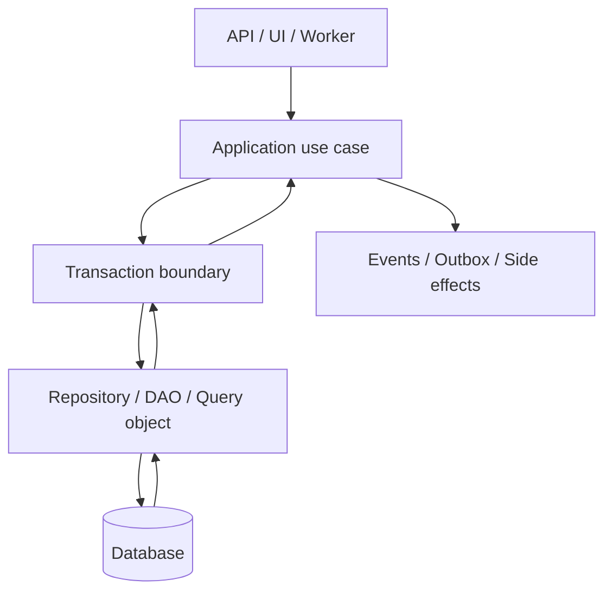
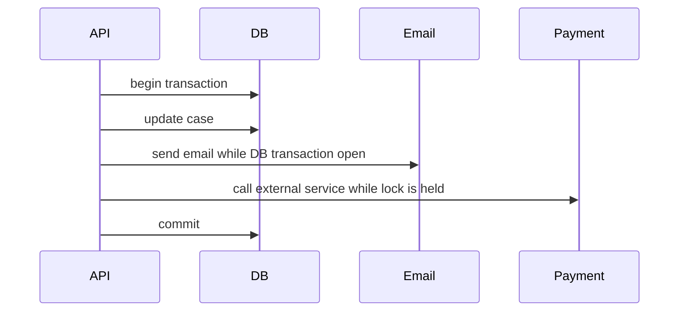
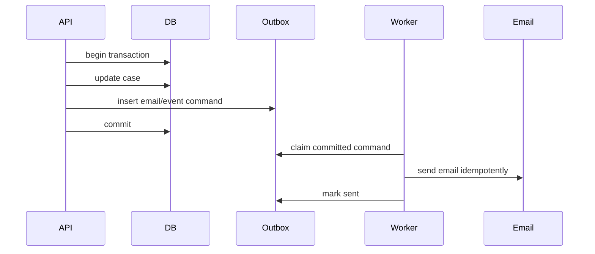
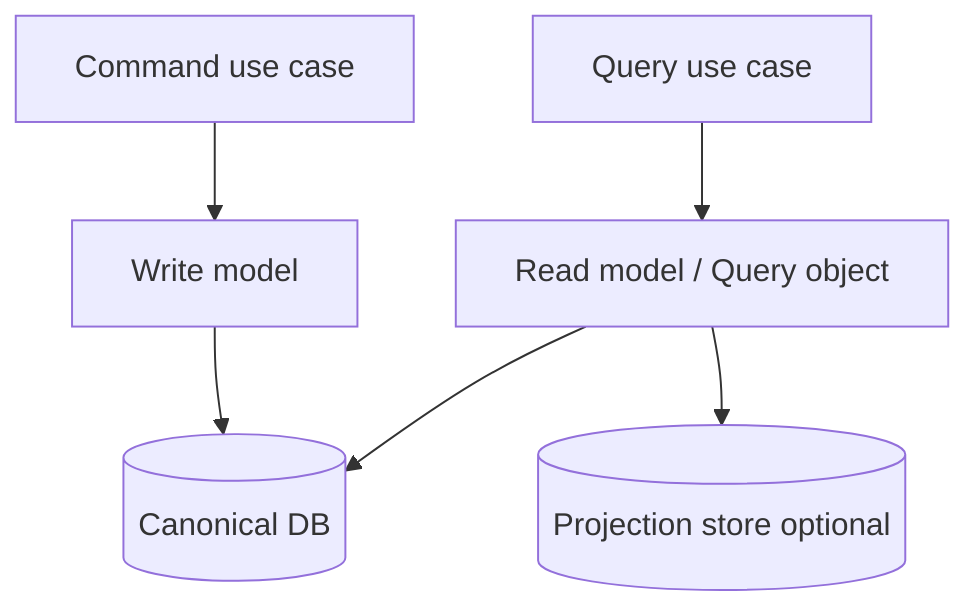
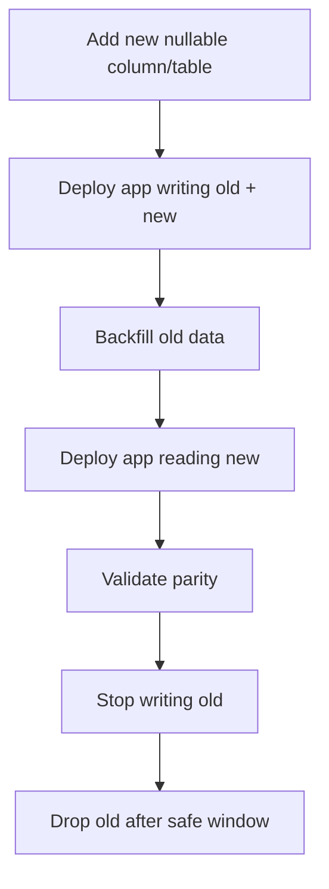
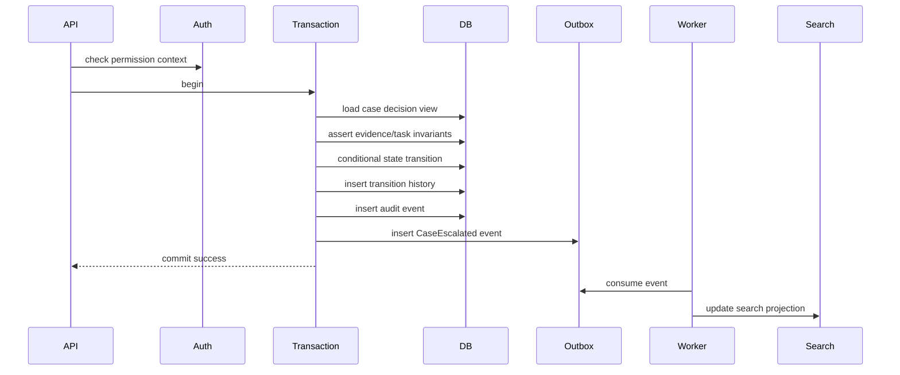

# Part 046 — Application–Database Boundary

> The database is not an implementation detail.  
> But the whole application should not casually depend on database details either.

This part is about the boundary between application code and database design.

A weak boundary creates either of these failures:

1. **Database leakage everywhere**  
   Every service method hand-writes SQL, knows table names, bypasses invariants, and creates inconsistent transaction behavior.

2. **Database denial**  
   The application hides everything behind generic repositories and ORM magic, then gets surprised by N+1 queries, accidental transactions, stale entities, missing constraints, and lock contention.

A strong boundary is different.

It exposes the database intentionally where correctness and performance require it, and hides it where application code should not know physical details.

The goal is not purity. The goal is a boundary that makes data access:

- correct
- readable
- testable
- observable
- performant
- migration-safe
- concurrency-aware
- failure-aware

---

## 1. The Boundary Is a Contract

The application-database boundary defines:

- who may read which data
- who may write which data
- which invariants are enforced by database constraints
- which invariants are enforced by application transactions
- where transaction boundaries begin and end
- how SQL is owned and reviewed
- how query performance is tested
- how schema evolves without breaking application versions
- how errors are classified and retried
- how derived stores/caches are updated



The key point:

**Database access should be organized around use-case and invariant boundaries, not around random CRUD convenience.**

---

## 2. The Three Layers of Data Access Thinking

### Layer 1: Domain/Application Meaning

This answers:

- What business operation is happening?
- What state transition is allowed?
- What invariant must hold?
- What user/actor is responsible?
- What should be audited?

Example:

```text
Approve enforcement case
```

This is not the same as:

```text
UPDATE cases SET status = 'APPROVED'
```

The SQL is only the physical expression of a domain operation.

### Layer 2: Persistence Contract

This answers:

- Which rows/documents must be read?
- Which rows/documents must be locked?
- Which constraints protect correctness?
- Which write order avoids deadlock?
- Which event/outbox record must be committed atomically?

### Layer 3: Physical Execution

This answers:

- Which query plan is expected?
- Which index supports it?
- Which isolation level is required?
- Which lock is acquired?
- What is the expected latency envelope?

Top engineers can reason through all three layers.

---

## 3. Anti-Pattern: Generic CRUD as Architecture

A generic CRUD repository looks neat:

```java
interface Repository<T, ID> {
    T findById(ID id);
    T save(T value);
    void delete(ID id);
    List<T> findAll();
}
```

It is useful for simple admin data. It is dangerous for core business state.

Why?

Because many domain operations are not CRUD.

| Domain operation | Why generic CRUD is weak |
|---|---|
| approve case | requires state transition guard, actor, audit, maybe lock |
| assign task | requires workload, queue, SLA, optimistic/pessimistic concurrency |
| record payment | requires idempotency, ledger invariant, uniqueness |
| restrict evidence | requires permission propagation, audit, index invalidation |
| merge duplicate case | requires multi-entity lifecycle handling and traceability |

A better repository speaks in persistence operations that match invariants.

```java
interface CaseRepository {
    Optional<CaseForDecision> findForDecision(CaseId caseId);
    boolean transitionState(CaseId caseId, CaseState expected, CaseState next, ActorId actorId);
    void appendTransition(CaseTransition transition);
    void appendAudit(AuditEvent event);
}
```

This is not perfect domain modelling. It is more honest about what the database is doing.

---

## 4. Repository, DAO, Query Object, and Service: Use Them Deliberately

These terms are often mixed. In practice, use them by responsibility.

### DAO

A DAO is close to tables and SQL.

Good for:

- explicit SQL ownership
- infrastructure layer
- simple row mapping
- batch operations
- migration scripts
- performance-sensitive access

Example:

```java
class CaseDao {
    CaseRow selectCaseForUpdate(Connection c, UUID caseId) { ... }
    int updateCaseStatus(Connection c, UUID caseId, String from, String to) { ... }
}
```

### Repository

A repository is closer to aggregate/use-case persistence.

Good for:

- domain-oriented persistence
- hiding table split/joins from application service
- coordinating related row loading
- returning domain-shaped data

Example:

```java
class CaseRepository {
    CaseDecisionView loadDecisionView(CaseId id) { ... }
    TransitionResult transition(CaseTransitionCommand command) { ... }
}
```

### Query Object

A query object handles complex read use cases.

Good for:

- search/filter pages
- reports
- dashboards
- pagination
- read models
- projections

Example:

```java
class CaseSearchQuery {
    Page<CaseSearchResult> execute(CaseSearchFilter filter, PageToken token) { ... }
}
```

### Application Service

Coordinates the use case.

Good for:

- transaction demarcation
- authorization check
- repository calls
- domain validation
- event/outbox creation
- audit creation

Example:

```java
class ApproveCaseUseCase {
    void approve(ApproveCaseCommand command) {
        transaction.run(() -> {
            authorization.requireCanApprove(command.actor(), command.caseId());
            CaseForDecision c = caseRepository.loadForDecision(command.caseId());
            c.assertCanApprove();
            caseRepository.transition(command.caseId(), OPEN, APPROVED, command.actor());
            auditRepository.append(...);
            outbox.append(...);
        });
    }
}
```

The application service is often the right place for the transaction boundary.

---

## 5. Transaction Boundary Design

A transaction boundary is a correctness boundary.

A good transaction is:

- short
- explicit
- tied to one business operation
- contains all writes required for atomicity
- avoids external calls inside the transaction
- has predictable lock acquisition order
- emits outbox/integration records atomically when needed

### Bad transaction boundary



Problems:

- locks held while waiting on network
- external side effect may succeed while DB transaction rolls back
- retry becomes unsafe
- user latency becomes transaction duration

### Better boundary



The database transaction protects state. The outbox protects side-effect intent.

---

## 6. Transaction Boundary Checklist

For every write use case, answer:

- What invariant must be true before the transaction commits?
- Which rows must be read inside the transaction?
- Which rows must be locked or conditionally updated?
- Which uniqueness/foreign key/check constraints support the invariant?
- What is the isolation level?
- What error means retry?
- What error means user conflict?
- What error means bug/data corruption?
- Are external calls avoided inside the transaction?
- Is audit written atomically?
- Is outbox written atomically?
- Is the transaction short enough?
- Is lock ordering consistent with other use cases?

---

## 7. ORM Is a Tool, Not a Boundary

ORM can be useful. It can also hide database reality.

Jakarta Persistence defines a standard object/relational mapping model for managing data held in a relational database using a Java domain model. Hibernate implements ORM concepts and exposes a persistence context/session that acts as a unit-of-work abstraction.

The problem is not ORM itself. The problem is using ORM without understanding:

- persistence context lifecycle
- flush timing
- lazy loading
- entity identity
- dirty checking
- transaction boundary
- cascade behavior
- N+1 query risk
- locking semantics
- generated SQL
- batch behavior
- optimistic locking

### Use ORM when

- aggregate is moderate in size
- object graph is controlled
- CRUD-ish mapping is natural
- transaction boundary is simple
- query performance is known/tested
- generated SQL is acceptable

### Avoid or bypass ORM when

- query is complex/reporting-heavy
- partial projection is needed
- write path needs precise SQL
- batch operation must avoid entity loading
- lock behavior must be exact
- performance must be hand-tuned
- schema does not map cleanly to object graph

A strong Java persistence layer often uses both:

- ORM for simple aggregate lifecycle
- SQL/DSL/query objects for critical queries
- explicit transaction service
- explicit outbox/idempotency tables

---

## 8. The N+1 Problem Is a Boundary Failure

N+1 query is not just a performance bug. It is a boundary design bug.

Example:

```java
List<Case> cases = caseRepository.findOpenCases();
for (Case c : cases) {
    System.out.println(c.getAssignedOfficer().getName()); // lazy load per row
}
```

This may produce:

```text
1 query for cases
N queries for assigned officers
```

Fixes depend on intent:

| Intent | Better pattern |
|---|---|
| screen needs case + officer name | projection query with join |
| domain operation needs full aggregate | fetch graph / explicit load plan |
| report needs many rows | SQL query object / read model |
| API list endpoint | DTO projection, not entity graph |

A good boundary distinguishes **domain mutation model** from **read projection model**.

---

## 9. Read Model vs Write Model Boundary

Not every read should load domain entities.

### Write model

Used for commands:

- approve case
- assign task
- record payment
- restrict evidence
- change lifecycle state

Needs:

- invariants
- locks/version checks
- transaction boundary
- audit
- outbox

### Read model

Used for queries:

- list cases
- dashboard
- search result
- export
- timeline view

Needs:

- pagination
- filtering
- sorting
- projection shape
- latency
- freshness
- authorization filtering



Do not force all reads through domain entities. That usually produces over-fetching, lazy-loading surprises, and slow APIs.

---

## 10. SQL Ownership

SQL is code. Treat it like code.

A mature team has rules:

- every important query has an owner
- every important query has an expected plan
- every important query has an index rationale
- every important query has a latency budget
- every write query has an invariant rationale
- SQL changes are reviewed with schema/index changes
- query shape is tested with realistic data volume

### SQL location options

| Option | Good for | Risk |
|---|---|---|
| inline string SQL | small explicit queries | scattering and duplication |
| DAO methods | row-level operations | too table-centric if overused |
| query object classes | complex reads | can become report layer chaos |
| ORM query language | entity-based querying | hidden SQL cost |
| SQL mapper | explicit SQL, controlled mapping | XML/string drift if poorly tested |
| generated DSL | type-safety | abstraction complexity |
| stored procedures | close-to-data logic | deployment/versioning/portability tradeoff |

There is no universal winner. The invariant is:

**The team must know where SQL lives, who owns it, how it is reviewed, and how it is tested.**

---

## 11. Database Constraints vs Application Validation

Application validation protects user experience.

Database constraints protect data truth.

Use both.

Example:

Application validation:

```text
Show user: “Email is required.”
```

Database constraint:

```sql
email text NOT NULL
```

Application validation catches friendly errors early. Database constraints prevent invalid state from entering through any path:

- API
- batch job
- admin script
- migration
- retry
- integration consumer
- future service

A boundary that relies only on application validation is fragile.

---

## 12. Error Classification at the Boundary

Database errors are not all the same.

Classify them.

| Error type | Example | Application response |
|---|---|---|
| uniqueness violation | duplicate idempotency key | return existing result or conflict |
| foreign key violation | invalid reference | client/data bug depending path |
| check constraint violation | illegal state | application bug or validation gap |
| serialization failure | concurrent transaction conflict | retry with backoff |
| deadlock detected | lock ordering/concurrency issue | retry, investigate if frequent |
| lock timeout | contention/degraded DB | retry or return busy |
| connection timeout | DB/network/pool pressure | fail fast, alert |
| query timeout | bad plan or overload | degrade, alert |
| no rows updated | optimistic conflict | return conflict/reload |

Do not catch `Exception` and convert everything to “500 internal server error”.

The boundary should translate database reality into domain/application outcomes.

---

## 13. Retry Discipline

Retries can fix transient errors. They can also duplicate writes.

Only retry safely when the operation is idempotent or inside a transaction that fully rolled back.

### Retry-safe patterns

- idempotency key table
- unique command ID
- optimistic update with version
- outbox worker with dedup key
- serialization failure retry with full transaction replay

### Retry-dangerous patterns

- external side effect inside transaction
- insert without idempotency key
- partial write followed by timeout with unknown commit result
- “retry the last SQL statement” instead of whole transaction

Correct retry unit is often the **entire transaction function**, not an individual SQL statement.

---

## 14. Connection Pool Boundary

The database connection pool is part of architecture.

Bad pool configuration can take down a database.

Think in terms of:

- maximum app instances
- max connections per instance
- database max connections
- worker pools
- long-running reports
- transaction duration
- idle-in-transaction risk
- queueing behavior
- timeout behavior

Example failure:

```text
50 application pods × 50 max connections = 2500 possible connections
Database can safely handle 500 active connections
```

The pool should protect the database, not just the application.

Boundary rules:

- set connection acquisition timeout
- set statement timeout
- set transaction timeout where possible
- separate OLTP pool from batch/report pool
- prevent unbounded worker fan-out
- monitor active/idle/waiting connections
- detect idle-in-transaction sessions

---

## 15. Pagination Boundary

Pagination is not a UI detail. It is a database access contract.

Offset pagination:

```sql
SELECT *
FROM cases
WHERE tenant_id = ?
ORDER BY created_at DESC
OFFSET 500000
LIMIT 50;
```

Problems:

- database still walks/skips many rows
- unstable under concurrent inserts
- expensive at deep pages

Keyset pagination:

```sql
SELECT *
FROM cases
WHERE tenant_id = ?
  AND (created_at, id) < (?, ?)
ORDER BY created_at DESC, id DESC
LIMIT 50;
```

Boundary contract:

- stable sort key
- deterministic tie-breaker
- opaque page token
- matching composite index
- no random deep jump unless explicitly supported by separate mechanism

A query API that exposes arbitrary `offset` may force bad database behavior.

---

## 16. Reporting Boundary

Operational APIs and reporting APIs should not accidentally share the same query path.

Reporting queries often:

- scan more rows
- aggregate heavily
- sort large result sets
- need snapshots
- tolerate lag
- require export jobs
- have different indexes
- may belong in warehouse/read model

Boundary rule:

**Do not let ad hoc reporting queries compete with latency-critical OLTP transactions without isolation.**

Options:

- read replica
- materialized view
- async export job
- warehouse
- reporting schema
- rate-limited query endpoint
- scheduled aggregate table

---

## 17. Migration Boundary

Application and database must evolve together.

A safe boundary supports expand-contract migration:



Application code should tolerate transitional schema states.

Do not deploy application version that requires a destructive schema change to happen atomically across all instances unless deployment guarantees actually support it.

Boundary design should include:

- backward-compatible DDL
- feature flags
- dual-read/dual-write if needed
- migration observability
- rollback plan
- previous-version compatibility

---

## 18. Testing the Boundary

Unit tests are not enough.

You need boundary tests.

### Test categories

| Test | Purpose |
|---|---|
| repository/DAO integration test | SQL correctness against real DB |
| constraint test | invalid data cannot enter |
| concurrency test | race condition does not break invariant |
| migration compatibility test | old/new app versions tolerate schema transition |
| execution plan test/manual review | critical query uses expected access path |
| data volume test | query works at realistic cardinality |
| failure injection test | timeout/deadlock/retry path works |
| projection consistency test | outbox/CDC updates derived store correctly |

For serious systems, test with a real database engine, not only mocks.

Mocks are useful for application branching. They do not prove SQL, constraints, locks, isolation, or query plans.

---

## 19. Boundary Design for Case Management Example

Use case: supervisor approves a regulatory case for escalation.

### Requirements

- case must be in `READY_FOR_REVIEW`
- actor must have approval permission
- required evidence must exist
- no unresolved blocking task may remain
- transition must be audited
- notification must be sent eventually
- search/timeline projections must update

### Boundary design



### Repository shape

```java
interface CaseDecisionRepository {
    CaseDecisionSnapshot loadForEscalation(CaseId caseId, TenantId tenantId);
    boolean transitionToEscalated(CaseId caseId, long expectedVersion, ActorId actorId);
    void appendTransition(CaseTransitionRecord record);
    void appendAudit(AuditRecord record);
    void appendOutbox(OutboxEvent event);
}
```

Notice what is not exposed:

- generic `save(case)`
- arbitrary status setter
- direct table access from API controller
- external notification inside DB transaction

---

## 20. Boundary Smells

### Smell 1: `save(entity)` performs unknown writes

The caller cannot see which tables change, which cascades happen, or which invariants are enforced.

### Smell 2: Controller opens transaction

Usually transaction belongs in application use case/service layer, not HTTP layer.

### Smell 3: Entity returned directly from API

Can trigger lazy loading, expose internal fields, and couple API shape to persistence model.

### Smell 4: Repositories expose `findAll`

On large tables, `findAll` is rarely a valid production operation.

### Smell 5: Query logic split across layers

Filter partly in SQL, partly in application, partly in memory. This causes correctness and performance surprises.

### Smell 6: No one reviews generated SQL

ORM-generated SQL is still SQL. It can still be slow or wrong for workload shape.

### Smell 7: Transaction includes network calls

This increases lock duration and creates unsafe side-effect behavior.

### Smell 8: Read path loads write model

List/detail/report endpoints often need projections, not full mutable entities.

### Smell 9: App validates invariant that DB could enforce cheaply

If the invariant is stable and local to the DB, use a constraint.

### Smell 10: Every database error becomes generic failure

The app loses conflict/retry/idempotency semantics.

---

## 21. Practical Boundary Patterns

### Pattern A: Command handler + transaction function

```java
final class TransactionRunner {
    <T> T run(TransactionalWork<T> work) {
        // begin, execute, commit, rollback, classify exception
    }
}
```

Good because:

- transaction scope is explicit
- retry can wrap whole unit
- metrics can measure duration
- errors can be classified centrally

### Pattern B: Conditional update instead of read-then-write

```sql
UPDATE cases
SET status = 'APPROVED', version = version + 1
WHERE id = :case_id
  AND tenant_id = :tenant_id
  AND status = 'READY_FOR_REVIEW'
  AND version = :expected_version;
```

If affected rows = 0, return conflict or invalid transition.

This pushes concurrency guard into the database.

### Pattern C: Projection query for API list

```sql
SELECT c.id,
       c.reference_no,
       c.status,
       c.priority,
       o.display_name AS assigned_officer,
       c.updated_at
FROM cases c
LEFT JOIN officers o ON o.id = c.assigned_officer_id
WHERE c.tenant_id = :tenant_id
  AND c.status = :status
ORDER BY c.updated_at DESC, c.id DESC
LIMIT :limit;
```

Return DTO/read model, not mutable entity.

### Pattern D: Outbox in same transaction

```sql
INSERT INTO outbox_events(id, aggregate_type, aggregate_id, event_type, payload, created_at)
VALUES (:event_id, 'case', :case_id, 'CaseApproved', :payload, now());
```

This avoids unsafe DB-write + message-publish dual write.

### Pattern E: Idempotency table

```sql
INSERT INTO idempotency_keys(key, request_hash, status, created_at)
VALUES (:key, :hash, 'PROCESSING', now())
ON CONFLICT (key) DO NOTHING;
```

This protects retry and duplicate delivery paths.

---

## 22. Review Checklist

For an application-database boundary review:

- [ ] Is the use case boundary clear?
- [ ] Is the transaction boundary explicit?
- [ ] Are external calls outside the transaction?
- [ ] Are invariants enforced by DB constraints where appropriate?
- [ ] Are concurrency conflicts handled deliberately?
- [ ] Are retries idempotent?
- [ ] Is SQL owned and reviewable?
- [ ] Are generated queries inspected for critical paths?
- [ ] Are read models separated from write models where needed?
- [ ] Are APIs prevented from exposing persistence entities directly?
- [ ] Is pagination database-friendly?
- [ ] Are reports isolated from OLTP workload?
- [ ] Are connection pool limits safe for total deployment size?
- [ ] Are database errors classified?
- [ ] Are migrations backward-compatible?
- [ ] Are integration tests run against real database engine?
- [ ] Are important query plans reviewed at production-like cardinality?
- [ ] Is observability attached to query latency, lock wait, pool wait, and transaction duration?

---

## 23. Exercises

### Exercise 1: Map one write use case

Pick a real write operation.

Document:

- transaction start/end
- rows read
- rows written
- locks/version checks
- constraints used
- audit records
- outbox records
- retry behavior
- failure responses

### Exercise 2: Find accidental ORM queries

Enable SQL logging in a safe environment.

Use one API endpoint.

Count:

- total queries
- duplicate queries
- unexpected lazy loads
- large row fetches
- missing indexes

### Exercise 3: Replace generic save with command-specific persistence

Take one important `save(entity)` path.

Refactor mentally into:

- command input
- load snapshot
- validate invariant
- conditional update
- audit insert
- outbox insert

### Exercise 4: Classify database errors

List top 10 database exceptions from logs.

Classify each as:

- retryable
- conflict
- validation/data bug
- availability issue
- performance issue
- unknown

Unknown errors are where incident response will be weak.

---

## 24. Summary

The application-database boundary is one of the highest-leverage architecture decisions in a system.

Too much leakage creates scattered SQL, inconsistent invariants, and migration pain.

Too much abstraction creates ORM surprise, hidden queries, weak constraints, and denial of database reality.

A strong boundary is explicit:

- transaction per use case
- repository/DAO/query object by responsibility
- SQL owned and reviewed
- database constraints for truth
- application validation for experience
- read/write model separation
- idempotent retry discipline
- failure classification
- migration compatibility
- production-like testing

The final rule:

**Do not hide the database. Design the boundary so the right people see the right database facts at the right level of abstraction.**

---

## References

- Jakarta Persistence 3.2 Specification: https://jakarta.ee/specifications/persistence/3.2/jakarta-persistence-spec-3.2
- Jakarta Persistence EntityManager API: https://jakarta.ee/specifications/persistence/3.2/apidocs/jakarta.persistence/jakarta/persistence/entitymanager
- Hibernate ORM User Guide, stable documentation: https://docs.hibernate.org/stable/orm/userguide/html_single/
- Hibernate ORM documentation index: https://hibernate.org/orm/documentation/
- AWS Prescriptive Guidance, “Database-per-service pattern”: https://docs.aws.amazon.com/prescriptive-guidance/latest/modernization-data-persistence/database-per-service.html
- AWS Prescriptive Guidance, “Shared-database-per-service pattern”: https://docs.aws.amazon.com/prescriptive-guidance/latest/modernization-data-persistence/shared-database.html
- PostgreSQL Documentation, “Transaction Isolation”: https://www.postgresql.org/docs/current/transaction-iso.html
- PostgreSQL Documentation, “Explicit Locking”: https://www.postgresql.org/docs/current/explicit-locking.html
