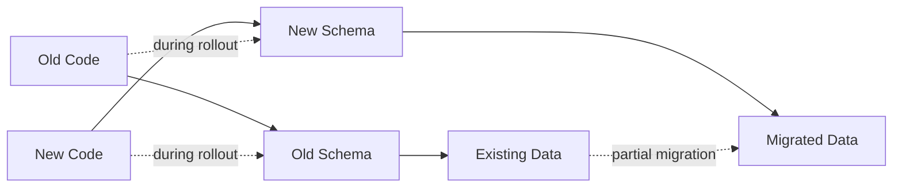
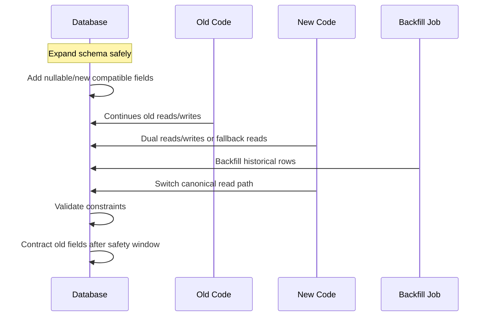
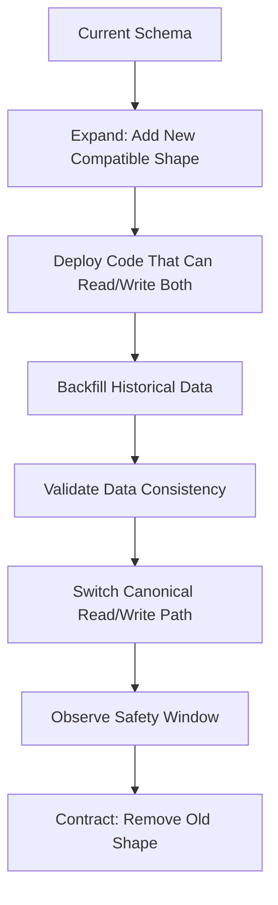
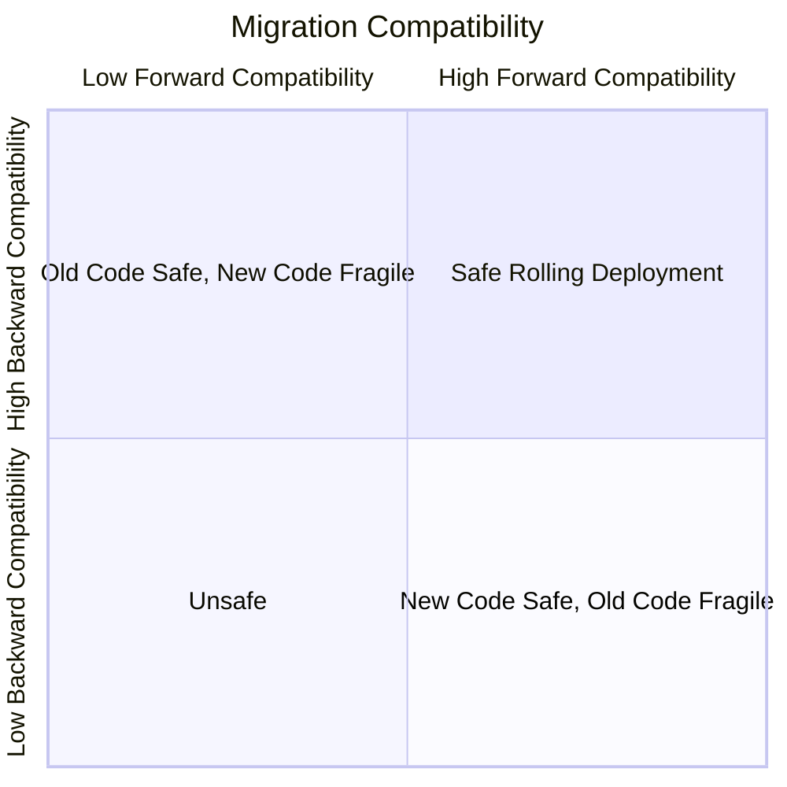
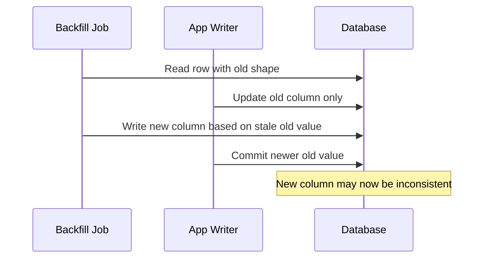
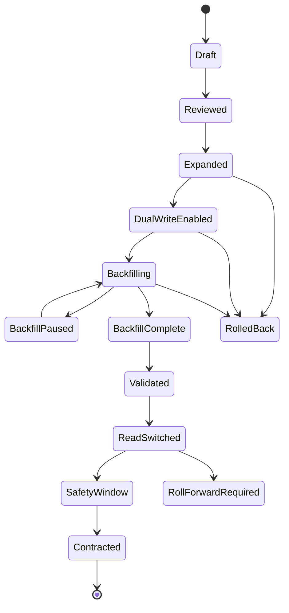

# Part 047 — Schema Evolution and Migration

Database design is not finished when the first schema is deployed.

In production, the harder problem is this:

> How do we keep changing the data model while old code, new code, running transactions, batch jobs, replicas, reports, search projections, CDC consumers, and operational runbooks still depend on the old shape?

A weak engineer treats database migration as a SQL script.

A strong engineer treats it as a **compatibility protocol**.

Schema evolution is not only about changing tables. It is about preserving correctness across versions.

This part builds the mental model and mechanics for production schema evolution. The next part, Part 048, will turn this into a zero-downtime operational playbook.

---

## 1. The Core Problem

A database schema is not just storage layout.

It is a contract between:

- application writers,
- application readers,
- background workers,
- BI/reporting jobs,
- migration scripts,
- CDC/outbox consumers,
- downstream projections,
- support tooling,
- backup/restore workflows,
- access-control policy,
- audit/reconstruction logic.

When schema changes, all these consumers may break.

The failure mode is rarely simply “migration failed”. More often:

- old application version writes data in the old shape,
- new application version reads with new assumptions,
- replica lags behind migration state,
- backfill updates rows while live writes continue,
- report reads partially migrated data,
- search projection misses a new column,
- rollback returns code to old behavior but database has moved forward,
- constraint validation fails after millions of rows are already dirty,
- enum/status change breaks a workflow transition,
- data correction loses auditability.

The architect's job is to turn schema change from an event into a controlled lifecycle.

---

## 2. The Migration Mental Model

A database migration has two dimensions:

1. **Structure migration** — change the schema shape.
2. **Behavior migration** — change how code reads/writes/interprets the data.

Most production failures happen because teams deploy structure and behavior as if they were atomic.

They are not.



During a rolling deployment, there is a mixed-version window. You must assume these states can exist:

| Code Version | Schema Version | Data Shape | Safe? |
|---|---|---|---|
| Old code | Old schema | Old data | Baseline |
| Old code | Expanded schema | Old data | Must be safe |
| New code | Expanded schema | Mixed data | Must be safe |
| New code | New schema | New data | Target |
| Old code after rollback | Expanded/new schema | Mixed/new data | Must be considered |

This is why schema migration is fundamentally a compatibility problem.

---

## 3. Compatibility Before Correctness

Correctness is the final goal, but compatibility is the bridge.

A migration can be logically correct and operationally unsafe.

Example:

```sql
ALTER TABLE customer
DROP COLUMN full_name;
```

Maybe the new model uses `first_name` and `last_name`, and dropping `full_name` is logically correct. But if any old code path, report, export, or emergency script still reads `full_name`, the system breaks.

A production-safe migration usually has this shape:



The important point: **schema reaches compatibility before code relies on it**.

---

## 4. The Three Classes of Schema Change

Not all schema changes have the same risk.

### 4.1 Additive Changes

Usually safest.

Examples:

```sql
ALTER TABLE enforcement_case
ADD COLUMN risk_score numeric(5,2);
```

```sql
CREATE TABLE case_review_note (
    id uuid PRIMARY KEY,
    case_id uuid NOT NULL REFERENCES enforcement_case(id),
    note_text text NOT NULL,
    created_at timestamptz NOT NULL DEFAULT now()
);
```

Additive changes are generally backward compatible when:

- new columns are nullable or have safe defaults,
- old code is not forced to supply new values,
- new tables do not change old behavior immediately,
- indexes/constraints do not block live writes unexpectedly.

But additive is not automatically safe. Adding a default, index, foreign key, or generated column on a huge table can be operationally expensive depending on engine/version and lock behavior.

### 4.2 Behavioral Changes

These change meaning without necessarily changing shape.

Examples:

- `status = 'CLOSED'` now means something different.
- `assigned_user_id` becomes optional.
- `risk_score` moves from analyst-entered to system-calculated.
- duplicate detection changes from exact match to fuzzy match.
- data retention period changes from 5 years to 7 years.

Behavioral changes are dangerous because they are invisible at the DDL layer.

A database architect should require explicit semantic migration notes:

```md
Changed Meaning:
- Before: case.status = CLOSED meant no further user action.
- After: case.status = CLOSED means final decision issued; appeal may still occur.
Compatibility:
- Existing CLOSED cases remain valid.
- New appeal workflow uses separate appeal_status.
Reporting Impact:
- closure rate report must exclude appeal-open cases when measuring finality.
```

### 4.3 Destructive Changes

Highest risk.

Examples:

```sql
ALTER TABLE case_evidence DROP COLUMN file_hash;
ALTER TABLE enforcement_case ALTER COLUMN region_code SET NOT NULL;
DROP TABLE old_case_assignment;
ALTER TYPE case_status RENAME VALUE 'OPEN' TO 'ACTIVE';
```

Destructive changes include:

- dropping columns,
- dropping tables,
- renaming columns,
- changing data types,
- tightening constraints,
- changing enum/status values,
- changing uniqueness semantics,
- changing primary key or foreign key strategy,
- changing partition/shard key.

A destructive change should almost always be decomposed into compatible phases.

---

## 5. The Expand–Migrate–Contract Model

The central migration pattern is:

1. **Expand** — add new structure without breaking old users.
2. **Migrate** — move data and traffic gradually.
3. **Contract** — remove old structure after it is unused and safe.



This model is also called parallel change. It is the safest default when a schema change affects production code.

---

## 6. Example: Splitting `full_name` Into `first_name` and `last_name`

### 6.1 Bad Migration

```sql
ALTER TABLE person
DROP COLUMN full_name;

ALTER TABLE person
ADD COLUMN first_name text NOT NULL;

ALTER TABLE person
ADD COLUMN last_name text NOT NULL;
```

Problems:

- old code breaks,
- existing rows cannot satisfy `NOT NULL`,
- parsing full names is lossy,
- rollback is difficult,
- reports depending on `full_name` break,
- external exports may change format without versioning.

### 6.2 Safe Migration

#### Step 1 — Expand

```sql
ALTER TABLE person
ADD COLUMN first_name text;

ALTER TABLE person
ADD COLUMN last_name text;
```

#### Step 2 — Dual write in application

New writes populate both old and new shape:

```java
record PersonName(String fullName, String firstName, String lastName) {}
```

At write time:

```sql
UPDATE person
SET
    full_name = :fullName,
    first_name = :firstName,
    last_name = :lastName
WHERE id = :id;
```

#### Step 3 — Backfill historical rows

```sql
UPDATE person
SET
    first_name = split_part(full_name, ' ', 1),
    last_name = nullif(substr(full_name, length(split_part(full_name, ' ', 1)) + 2), '')
WHERE first_name IS NULL
  AND full_name IS NOT NULL;
```

This example is intentionally imperfect. Name parsing is culturally and legally tricky. The architect should flag lossy migrations early.

#### Step 4 — Read fallback

```sql
SELECT
    id,
    COALESCE(first_name || ' ' || last_name, full_name) AS display_name
FROM person
WHERE id = :id;
```

#### Step 5 — Validate

```sql
SELECT count(*) AS missing_new_name
FROM person
WHERE full_name IS NOT NULL
  AND first_name IS NULL;
```

#### Step 6 — Tighten constraint only when safe

```sql
ALTER TABLE person
ADD CONSTRAINT person_first_name_required
CHECK (first_name IS NOT NULL) NOT VALID;

ALTER TABLE person
VALIDATE CONSTRAINT person_first_name_required;
```

#### Step 7 — Contract later

Only after old code/report/export usage is removed:

```sql
ALTER TABLE person
DROP COLUMN full_name;
```

The delayed contraction is not bureaucracy. It is how you survive rolling deployments, delayed consumers, hidden scripts, and rollback windows.

---

## 7. Schema Versioning Is Not Enough

A migration tool can record that migration `V047_01` ran.

That does not mean the system is safe.

Schema version answers:

> Was the DDL applied?

It does not answer:

- are all rows backfilled?
- did new writes populate both shapes?
- are old consumers gone?
- are reports updated?
- are replicas caught up?
- is the new constraint valid?
- can rollback still work?
- did CDC consumers understand the new event shape?

A production migration needs multiple markers.

```sql
CREATE TABLE schema_change_execution (
    change_id text PRIMARY KEY,
    phase text NOT NULL,
    started_at timestamptz NOT NULL,
    completed_at timestamptz,
    owner_team text NOT NULL,
    rollback_strategy text NOT NULL,
    validation_query text,
    validation_result jsonb,
    notes text
);
```

Example phases:

| Phase | Meaning |
|---|---|
| `EXPANDED` | Compatible structure added |
| `DUAL_WRITE_ENABLED` | New code writes old + new shape |
| `BACKFILL_RUNNING` | Historical data is being migrated |
| `BACKFILL_COMPLETE` | All eligible rows migrated |
| `VALIDATED` | Data consistency verified |
| `READ_SWITCHED` | New read path is canonical |
| `OLD_USAGE_ZERO` | Old path unused for safety window |
| `CONTRACTED` | Old structure removed |

This can be tracked in deployment metadata, migration logs, observability, or an operational checklist. The table is just an example.

---

## 8. Backward-Compatible vs Forward-Compatible

A migration is **backward-compatible** if old code still works after the schema change.

A migration is **forward-compatible** if new code can tolerate the old or partially migrated schema/data.

You usually need both.



### Backward-compatible examples

- Add nullable column.
- Add table unused by old code.
- Add index.
- Add `NOT VALID` constraint that does not reject existing data immediately.
- Add new enum/status value only if old code ignores unknown values safely.

### Backward-incompatible examples

- Rename column used by old code.
- Drop column used by old code.
- Add `NOT NULL` column with no default to table old code inserts into.
- Change data type in a way old code cannot bind.
- Tighten constraint before old writers comply.

### Forward-compatible examples

- New code can read old and new column.
- New code treats unknown status as controlled error, not crash.
- New code handles `NULL` during backfill.
- New code supports both old and new event versions.

---

## 9. The Compatibility Matrix

Before production migration, write this matrix.

| Scenario | Must Work? | Validation |
|---|---:|---|
| Old app + old schema | Yes | Existing tests |
| Old app + expanded schema | Yes | Backward compatibility test |
| New app + expanded schema + old data | Yes | Mixed-data test |
| New app + partially backfilled data | Yes | Backfill simulation |
| New app + fully migrated data | Yes | Target-state test |
| Old app rollback + expanded schema | Usually yes | Rollback test |
| Old app rollback + contracted schema | Usually no | Only allowed after rollback window closed |

This matrix forces the team to name the unsafe point. That point is usually the contract phase.

---

## 10. Migration Granularity

A migration should be small enough to reason about.

A bad migration:

```sql
ALTER TABLE case_file RENAME COLUMN owner TO owner_user_id;
ALTER TABLE case_file ALTER COLUMN owner_user_id TYPE uuid USING owner_user_id::uuid;
ALTER TABLE case_file ADD CONSTRAINT ...;
UPDATE case_file SET ...;
CREATE INDEX ...;
DROP TABLE ...;
```

This mixes:

- rename,
- type conversion,
- data migration,
- constraint change,
- index change,
- destructive cleanup.

A better structure:

1. add new nullable `owner_user_id`,
2. deploy dual write,
3. backfill in chunks,
4. create supporting index concurrently,
5. validate mapping,
6. add `NOT VALID` constraint then validate,
7. switch reads,
8. observe,
9. drop old column later.

Granularity is not about making more files. It is about making each phase reversible and measurable.

---

## 11. Type Changes

Type changes are deceptively dangerous.

Examples:

```sql
ALTER TABLE payment
ALTER COLUMN amount TYPE numeric(18,2);
```

Potential issues:

- table rewrite,
- lock duration,
- invalid values,
- precision loss,
- application binding mismatch,
- index rebuild,
- replication lag,
- downstream schema mismatch.

Safer pattern:

```sql
ALTER TABLE payment
ADD COLUMN amount_decimal numeric(18,2);
```

Backfill:

```sql
UPDATE payment
SET amount_decimal = amount_cents / 100.0
WHERE amount_decimal IS NULL;
```

Dual write:

```sql
INSERT INTO payment (
    id,
    amount_cents,
    amount_decimal,
    currency
) VALUES (
    :id,
    :amountCents,
    :amountDecimal,
    :currency
);
```

Validate:

```sql
SELECT count(*)
FROM payment
WHERE amount_decimal IS NULL
   OR amount_decimal <> amount_cents / 100.0;
```

Contract later.

For high-value systems, avoid destructive in-place type changes unless you have measured lock/rewrite behavior on production-like volume.

---

## 12. Rename Is Usually Drop + Add

A column rename feels safe:

```sql
ALTER TABLE case_file
RENAME COLUMN owner TO owner_user_id;
```

But for running systems, rename is often equivalent to drop old API and add new API instantly.

Old code reads `owner`.
New code reads `owner_user_id`.
During rolling deploy, one side breaks.

Safer pattern:

```sql
ALTER TABLE case_file
ADD COLUMN owner_user_id uuid;
```

Then:

- dual write,
- backfill,
- switch reads,
- observe old usage,
- drop old column later.

The database can rename atomically. Your distributed application cannot.

---

## 13. Constraint Evolution

Constraints encode invariants. Changing them changes legal states.

### 13.1 Adding a new check constraint

Unsafe on large existing table if it scans and blocks too much.

Safer PostgreSQL-style pattern:

```sql
ALTER TABLE enforcement_case
ADD CONSTRAINT enforcement_case_valid_priority
CHECK (priority IN ('LOW', 'MEDIUM', 'HIGH', 'CRITICAL')) NOT VALID;
```

This starts enforcing the constraint for new/changed rows while avoiding immediate full validation of existing rows.

Then clean old data:

```sql
SELECT id, priority
FROM enforcement_case
WHERE priority NOT IN ('LOW', 'MEDIUM', 'HIGH', 'CRITICAL')
   OR priority IS NULL;
```

Fix data.

Validate later:

```sql
ALTER TABLE enforcement_case
VALIDATE CONSTRAINT enforcement_case_valid_priority;
```

### 13.2 Adding foreign key constraint

Unsafe naive approach:

```sql
ALTER TABLE case_task
ADD CONSTRAINT case_task_case_id_fk
FOREIGN KEY (case_id) REFERENCES enforcement_case(id);
```

Safer:

```sql
ALTER TABLE case_task
ADD CONSTRAINT case_task_case_id_fk
FOREIGN KEY (case_id)
REFERENCES enforcement_case(id)
NOT VALID;
```

Validate after orphan cleanup:

```sql
SELECT t.id, t.case_id
FROM case_task t
LEFT JOIN enforcement_case c ON c.id = t.case_id
WHERE c.id IS NULL;
```

Then:

```sql
ALTER TABLE case_task
VALIDATE CONSTRAINT case_task_case_id_fk;
```

### 13.3 Tightening nullable to required

Do not jump directly from nullable to `NOT NULL` without proving all writers comply.

Safer sequence:

1. add application validation,
2. observe null writes become zero,
3. backfill existing nulls,
4. add check constraint `NOT VALID`,
5. validate,
6. optionally set column `NOT NULL` if operationally safe for your engine/version.

Example:

```sql
ALTER TABLE case_task
ADD CONSTRAINT case_task_assignee_required
CHECK (assignee_user_id IS NOT NULL) NOT VALID;
```

---

## 14. Index Evolution

Indexes are schema too.

Adding an index changes:

- write cost,
- storage cost,
- planner choices,
- lock behavior during build,
- replication/WAL pressure,
- maintenance overhead.

### 14.1 Production index addition

On PostgreSQL, prefer concurrent index creation for large/hot tables:

```sql
CREATE INDEX CONCURRENTLY idx_case_task_assignee_open
ON case_task (assignee_user_id, due_at)
WHERE completed_at IS NULL;
```

But concurrent index creation is not magic:

- it takes longer,
- it can fail and leave invalid index artifacts,
- it cannot run inside a normal transaction block,
- it still waits on conflicting transactions at certain phases,
- it adds write overhead once active.

### 14.2 Replacing index

Bad:

```sql
DROP INDEX idx_old;
CREATE INDEX idx_new ON ...;
```

Safer:

1. create new index concurrently,
2. verify planner uses it,
3. observe query latency,
4. drop old index later.

```sql
CREATE INDEX CONCURRENTLY idx_case_task_queue_v2
ON case_task (queue_id, priority DESC, created_at)
WHERE status = 'READY';
```

Then after validation:

```sql
DROP INDEX CONCURRENTLY idx_case_task_queue_v1;
```

---

## 15. Enum and Status Evolution

Statuses are often business state machines pretending to be strings.

### 15.1 Dangerous changes

- renaming a status,
- deleting a status,
- reusing old status with new meaning,
- adding status old code cannot handle,
- changing transition rules without migrating existing cases.

### 15.2 Safer status migration

Suppose:

Old:

```txt
OPEN, IN_REVIEW, CLOSED
```

New:

```txt
DRAFT, ACTIVE, UNDER_REVIEW, FINALIZED, ARCHIVED
```

Do not simply rename values.

Use mapping table:

```sql
CREATE TABLE case_status_migration_map (
    old_status text PRIMARY KEY,
    new_status text NOT NULL,
    mapping_reason text NOT NULL
);
```

Insert explicit mapping:

```sql
INSERT INTO case_status_migration_map (old_status, new_status, mapping_reason)
VALUES
('OPEN', 'ACTIVE', 'Open cases become active'),
('IN_REVIEW', 'UNDER_REVIEW', 'Review state renamed with same semantics'),
('CLOSED', 'FINALIZED', 'Closed cases with final decision become finalized');
```

Backfill:

```sql
ALTER TABLE enforcement_case
ADD COLUMN status_v2 text;

UPDATE enforcement_case c
SET status_v2 = m.new_status
FROM case_status_migration_map m
WHERE c.status = m.old_status
  AND c.status_v2 IS NULL;
```

Validate:

```sql
SELECT status, count(*)
FROM enforcement_case
WHERE status_v2 IS NULL
GROUP BY status;
```

For regulatory systems, status migration should also be auditable:

```sql
INSERT INTO case_transition_history (
    case_id,
    from_status,
    to_status,
    transition_type,
    transition_reason,
    occurred_at,
    actor_type
)
SELECT
    id,
    status,
    status_v2,
    'MIGRATION',
    'Schema evolution: status model v2',
    now(),
    'SYSTEM'
FROM enforcement_case
WHERE status_v2 IS NOT NULL;
```

---

## 16. Backfill Design

Backfill is where many migrations fail.

Backfill must be treated as a production workload.

It competes with:

- OLTP traffic,
- vacuum/compaction,
- replication bandwidth,
- index maintenance,
- locks,
- storage I/O,
- cache/buffer pool,
- CDC consumers,
- batch jobs.

### 16.1 Bad backfill

```sql
UPDATE enforcement_case
SET normalized_reference = upper(reference_number)
WHERE normalized_reference IS NULL;
```

On a large table, this can cause:

- huge transaction,
- massive WAL,
- row bloat,
- lock contention,
- replica lag,
- long rollback,
- cache churn.

### 16.2 Chunked backfill

```sql
WITH batch AS (
    SELECT id
    FROM enforcement_case
    WHERE normalized_reference IS NULL
    ORDER BY id
    LIMIT 1000
)
UPDATE enforcement_case c
SET normalized_reference = upper(c.reference_number)
FROM batch
WHERE c.id = batch.id;
```

Run repeatedly with:

- rate limiting,
- progress tracking,
- lock timeout,
- statement timeout,
- pause/resume capability,
- validation query,
- error table.

### 16.3 Backfill progress table

```sql
CREATE TABLE data_migration_job (
    job_id text PRIMARY KEY,
    target_table text NOT NULL,
    status text NOT NULL,
    last_processed_key text,
    processed_rows bigint NOT NULL DEFAULT 0,
    failed_rows bigint NOT NULL DEFAULT 0,
    started_at timestamptz NOT NULL DEFAULT now(),
    updated_at timestamptz NOT NULL DEFAULT now()
);
```

### 16.4 Backfill error capture

```sql
CREATE TABLE data_migration_error (
    job_id text NOT NULL,
    entity_id uuid NOT NULL,
    error_code text NOT NULL,
    error_detail text NOT NULL,
    occurred_at timestamptz NOT NULL DEFAULT now(),
    PRIMARY KEY (job_id, entity_id)
);
```

This makes backfill inspectable and resumable.

---

## 17. Live Writes During Backfill

Backfill is not enough if live writes continue.

Problem:



Solutions:

### 17.1 Dual write before backfill

Deploy app so all new writes populate both old and new columns.

Then backfill only historical gaps.

### 17.2 Deterministic recompute

Ensure new column can always be recomputed from current source field.

```sql
UPDATE enforcement_case
SET normalized_reference = upper(reference_number)
WHERE normalized_reference IS DISTINCT FROM upper(reference_number);
```

### 17.3 Trigger bridge

Use only when needed and carefully reviewed.

```sql
CREATE FUNCTION sync_normalized_reference()
RETURNS trigger AS $$
BEGIN
    NEW.normalized_reference := upper(NEW.reference_number);
    RETURN NEW;
END;
$$ LANGUAGE plpgsql;

CREATE TRIGGER trg_sync_normalized_reference
BEFORE INSERT OR UPDATE OF reference_number
ON enforcement_case
FOR EACH ROW
EXECUTE FUNCTION sync_normalized_reference();
```

Trigger bridges can be useful but dangerous:

- hidden write behavior,
- hard to test,
- may surprise application owners,
- can slow writes,
- can complicate rollback.

Use them as temporary migration infrastructure with explicit removal plan.

---

## 18. Data Migration Is Business Logic

Data migration is not “just SQL”.

It often encodes business interpretation.

Example:

```sql
UPDATE enforcement_case
SET severity = CASE
    WHEN fine_amount >= 100000 THEN 'HIGH'
    WHEN repeat_offender = true THEN 'HIGH'
    WHEN fine_amount >= 10000 THEN 'MEDIUM'
    ELSE 'LOW'
END;
```

This is a policy decision.

A proper migration should document:

- rule source,
- owner approval,
- exceptions,
- audit trail,
- reproducibility,
- rollback/correction path,
- validation sample,
- downstream impact.

For regulated systems, migration scripts should be treated as evidence-producing code.

---

## 19. Migration as a State Machine

A good migration has explicit states.



Notice that rollback may stop being safe after certain phases. That must be known before deployment.

---

## 20. Rollback vs Roll Forward

Teams often say “we can rollback”. Usually they mean code rollback.

Database rollback is different.

### 20.1 Easy rollback

- unused nullable column added,
- unused table added,
- index added,
- new code not yet deployed.

### 20.2 Hard rollback

- data transformed destructively,
- old column dropped,
- old semantics overwritten,
- constraint rejects old write behavior,
- primary key changed,
- shard key changed,
- external consumers received new events.

### 20.3 Roll-forward mindset

For many database changes, the safer plan is:

- keep old and new shapes,
- pause traffic switch,
- fix data,
- deploy compatibility patch,
- continue migration.

Rollback is not always the right recovery action. The architecture must specify where rollback is possible and where roll-forward becomes mandatory.

---

## 21. Migration Testing

Migration tests should run against production-like data shape, not empty fixtures.

### 21.1 What to test

| Test | Purpose |
|---|---|
| DDL dry run | Detect syntax/lock/rewrite issues early |
| Old app on expanded schema | Backward compatibility |
| New app on old/mixed data | Forward compatibility |
| Backfill idempotency | Safe resume/retry |
| Validation query | Prove target invariant |
| Rollback test | Confirm rollback boundary |
| Query plan comparison | Detect performance regression |
| Replica lag simulation | Understand replication impact |
| Report/export test | Detect downstream breakage |
| CDC/event consumer test | Detect contract breakage |

### 21.2 Backfill idempotency test

Run migration twice.

Expected result:

- second run changes zero or same deterministic rows,
- no duplicate events,
- no duplicate audit entries unless explicitly allowed,
- no incorrect timestamp churn.

### 21.3 Mixed-version test

Run old writer and new reader together.

Run new writer and old reader together.

This catches more real issues than static schema validation.

---

## 22. Migration Observability

Migration should have dashboards.

Minimum metrics:

- rows processed,
- rows remaining,
- rows failed,
- rows per second,
- error rate,
- transaction duration,
- lock wait,
- deadlock count,
- statement timeout count,
- replication lag,
- WAL generation rate,
- CPU/I/O pressure,
- query latency impact,
- application error rate,
- old-path usage count,
- dual-write mismatch count.

Example validation metric:

```sql
SELECT
    count(*) FILTER (WHERE status_v2 IS NULL) AS unmigrated_rows,
    count(*) FILTER (WHERE status_v2 IS NOT NULL) AS migrated_rows
FROM enforcement_case;
```

Example consistency metric:

```sql
SELECT count(*) AS mismatched_reference
FROM enforcement_case
WHERE normalized_reference IS DISTINCT FROM upper(reference_number);
```

The migration is not complete when the script finishes. It is complete when the target invariant is proven and old usage reaches zero for the required safety window.

---

## 23. Database Migration Governance

Migration governance is not ceremony. It prevents irreversible data loss.

A production database change should include:

```md
# Database Change Proposal

## Change Summary
What changes and why?

## Business Invariant
Which invariant does this support or change?

## Compatibility
Can old code run on new schema?
Can new code run on old/mixed data?

## Migration Phases
Expand, migrate, validate, switch, contract.

## Data Impact
How many rows? Which tenants? Which partitions?

## Operational Impact
Locks, WAL, replica lag, storage, index build, query plan changes.

## Backfill Plan
Batch size, ordering, rate limit, resume behavior.

## Validation Plan
Queries, thresholds, sample checks.

## Rollback / Roll-forward Plan
What is reversible? What is not?

## Downstream Impact
Reports, CDC, projections, search, APIs, exports.

## Security / Compliance Impact
PII, retention, audit, access policy, evidence.

## Owner
Who watches it in production?
```

---

## 24. Common Schema Evolution Smells

### 24.1 Big bang migration

One giant migration changes schema, data, code, and contract at once.

Risk:

- hard to rollback,
- hard to debug,
- long lock duration,
- mixed-version failure.

### 24.2 Rename without compatibility

A rename is treated as harmless.

Risk:

- old code breaks during rollout.

### 24.3 Migration hidden in application startup

Application starts and runs DDL automatically on production.

Risk:

- multiple pods race,
- startup timeout,
- partial deployment,
- hard to observe,
- application rollback entangled with database state.

Some environments use app-managed migrations successfully, but high-risk production systems should separate heavy/unsafe DB changes from normal app startup.

### 24.4 Backfill without throttle

A backfill saturates database resources.

Risk:

- normal user traffic degrades,
- replicas lag,
- WAL disk fills,
- vacuum/compaction falls behind.

### 24.5 Contract phase too early

Old column/table is dropped as soon as new code deploys.

Risk:

- rollback impossible,
- hidden consumer breaks,
- old batch job fails.

### 24.6 No validation query

Team assumes migration succeeded because command returned success.

Risk:

- silent partial migration,
- incorrect reporting,
- stale projections.

---

## 25. Practical Migration Checklist

Before migration:

- [ ] Is the change additive, behavioral, or destructive?
- [ ] Is expand–migrate–contract needed?
- [ ] Is old code compatible with expanded schema?
- [ ] Is new code compatible with old/mixed data?
- [ ] Is the backfill idempotent?
- [ ] Is the backfill chunked and resumable?
- [ ] Is there a validation query?
- [ ] Is there a rollback or roll-forward plan?
- [ ] Are hidden consumers identified?
- [ ] Are reports/search/CDC/export contracts handled?
- [ ] Are locks and table rewrites understood?
- [ ] Are indexes added safely?
- [ ] Are constraints validated safely?
- [ ] Is observability ready?
- [ ] Is old-path usage measurable?
- [ ] Is the contract phase delayed until safe?

---

## 26. A Production-Grade Migration Template

```md
# Migration: <change name>

## Intent
Describe business and technical goal.

## Current Model
Describe old schema, old semantics, old consumers.

## Target Model
Describe new schema, new semantics, new invariants.

## Compatibility Strategy
- Backward compatibility:
- Forward compatibility:
- Mixed-version behavior:

## Expand DDL
SQL script and lock expectation.

## Code Phase 1
Dual write/read fallback behavior.

## Backfill
Batch size, ordering, retry, idempotency, observability.

## Validation
Queries and acceptance thresholds.

## Code Phase 2
Switch canonical read/write behavior.

## Safety Window
How long old path is monitored before removal.

## Contract DDL
Old column/table/index cleanup.

## Rollback/Roll-forward
Explicit phase-by-phase recovery plan.

## Evidence
Links to test result, dry run, approval, dashboard.
```

---

## 27. Mental Model Summary

Schema evolution is safe when you stop thinking in terms of DDL files and start thinking in terms of compatibility states.

The core rules:

1. Treat schema as a contract.
2. Separate structure migration from behavior migration.
3. Prefer additive changes first.
4. Decompose destructive changes.
5. Assume rolling deployment and mixed-version windows.
6. Backfill historical data separately from live writes.
7. Make backfill idempotent, chunked, resumable, and observable.
8. Validate target invariants with SQL, not hope.
9. Delay contraction until old usage is proven gone.
10. Know the exact point where rollback stops being safe.

A top engineer does not ask, “Can this SQL run?”

They ask:

> Can the entire system remain correct while this data model changes under live traffic?

That is schema evolution.

---

## References

- PostgreSQL Documentation — `ALTER TABLE`, constraints, `NOT VALID`, and validation behavior.
- PostgreSQL Documentation — `CREATE INDEX` and `CREATE INDEX CONCURRENTLY` behavior.
- PostgreSQL Documentation — explicit locking and DDL lock modes.
- Prisma Data Guide — expand and contract pattern for relational schema evolution.
- Liquibase Documentation — database change management concepts, changelogs, and changesets.
- AWS Prescriptive Guidance — database migration phases and migration planning.
