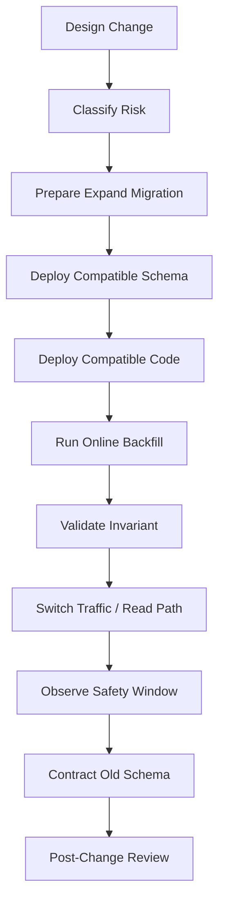
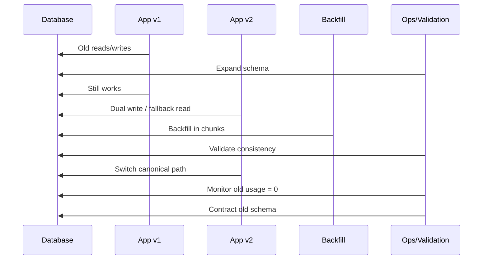
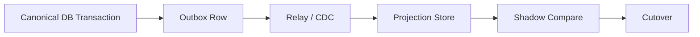
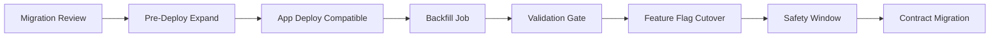

# Part 048 — Zero-Downtime Database Changes

Zero-downtime database change does not mean “the migration script runs quickly”.

It means:

> Users, jobs, APIs, workflows, reports, replicas, projections, and downstream consumers continue to observe a valid system while the database changes underneath them.

This is harder than normal application deployment because database state persists. Code can be rolled back. Data often cannot.

Part 047 explained schema evolution. This part is the operational playbook: how to apply real database changes under live traffic.

---

## 1. The First Principle

A zero-downtime database change is a **multi-phase release**, not a single migration.



The most important idea:

> The database can be ahead of the application, but it must not become incompatible with any application version that can still run.

---

## 2. What “Downtime” Really Means

Downtime is not only HTTP 500.

Database-change downtime includes:

- write path blocked by DDL lock,
- query latency spike causing request timeout,
- replica lag causing stale decision screen,
- work queue stops claiming tasks,
- background jobs deadlock with migration,
- reports show partial migrated data,
- search index falls behind,
- rollback fails because schema contracted too soon,
- data correctness invariant becomes false,
- audit reconstruction no longer works,
- authorization policy reads old shape incorrectly.

A mature team defines downtime as **user-visible or business-visible invalid system behavior**, not just process unavailability.

---

## 3. Change Risk Classification

Before touching production, classify the change.

| Class | Example | Zero-Downtime Default |
|---|---|---|
| Add column nullable | `ADD COLUMN risk_score numeric` | Usually direct, still check lock/rewrite behavior |
| Add index | `CREATE INDEX` | Use online/concurrent build for hot tables |
| Add constraint | `CHECK`, `FK` | Add as not-valid/deferred validation where supported |
| Tighten nullability | nullable → required | Backfill + validate before enforce |
| Rename column | `owner` → `owner_user_id` | Treat as add + dual write + contract |
| Change type | `text` → `uuid` | Add new column + backfill + switch |
| Drop column/table | destructive | Only after old usage zero and rollback window closed |
| Repartition/reshard | change physical placement | Requires migration plan, dual routing, or maintenance window if unavoidable |
| Change primary key | identity semantics | Treat as high-risk architecture migration |

A good review starts with: **What class is this change?**

---

## 4. The Zero-Downtime Compatibility Contract

For every change, answer four questions.

### 4.1 Can old code run against new schema?

This protects rolling deployment and rollback.

### 4.2 Can new code run against old or partially migrated data?

This protects mixed data during backfill.

### 4.3 Can old and new code write concurrently without corrupting data?

This protects dual-version windows.

### 4.4 Can downstream consumers tolerate the transition?

This protects reports, CDC, search, exports, and audit.

If any answer is “no”, you need phased compatibility work.

---

## 5. The Safe Deployment Order

For most schema changes:



Never put contraction before compatibility is proven.

---

## 6. Safe DDL Principles

DDL is not harmless.

Before running DDL, understand:

- Does it rewrite the table?
- Does it scan all rows?
- What lock does it take?
- Does it block reads?
- Does it block writes?
- Can it run inside a transaction?
- Does it generate heavy WAL/redo/binlog?
- Does it affect replicas?
- Does it invalidate query plans?
- Does it trigger auto-statistics changes?

A database architect should not approve DDL based only on syntax.

---

## 7. PostgreSQL-Oriented Safe DDL Examples

The exact behavior depends on database engine and version. The examples here are PostgreSQL-oriented because many production systems use PostgreSQL, and because it exposes useful primitives like concurrent index build and not-valid constraints.

### 7.1 Add nullable column

```sql
ALTER TABLE enforcement_case
ADD COLUMN external_reference text;
```

Usually safe, but still confirm on your PostgreSQL version and table size.

### 7.2 Add column with volatile default — avoid surprise

Be careful with defaults that may rewrite or touch many rows depending on engine/version and expression.

Safer default strategy:

```sql
ALTER TABLE enforcement_case
ADD COLUMN risk_band text;
```

Then update application to populate it.

Backfill separately.

Then add constraint later.

### 7.3 Add index on hot table

Unsafe:

```sql
CREATE INDEX idx_case_task_due_at
ON case_task (due_at);
```

Safer:

```sql
CREATE INDEX CONCURRENTLY idx_case_task_due_at
ON case_task (due_at);
```

Operational notes:

- do not run inside a normal transaction block,
- watch invalid index artifacts if it fails,
- monitor write latency and replication lag,
- verify planner usage after creation,
- consider partial index if only subset is queried.

### 7.4 Add partial index for active workload

```sql
CREATE INDEX CONCURRENTLY idx_case_task_open_assignee_due
ON case_task (assignee_user_id, due_at)
WHERE completed_at IS NULL;
```

This can reduce index size and write amplification when the query targets only active rows.

### 7.5 Add check constraint safely

```sql
ALTER TABLE enforcement_case
ADD CONSTRAINT enforcement_case_valid_priority
CHECK (priority IN ('LOW', 'MEDIUM', 'HIGH', 'CRITICAL')) NOT VALID;
```

Validate later:

```sql
ALTER TABLE enforcement_case
VALIDATE CONSTRAINT enforcement_case_valid_priority;
```

### 7.6 Add foreign key safely

```sql
ALTER TABLE case_task
ADD CONSTRAINT case_task_case_id_fk
FOREIGN KEY (case_id)
REFERENCES enforcement_case(id)
NOT VALID;
```

Validate after orphan cleanup:

```sql
ALTER TABLE case_task
VALIDATE CONSTRAINT case_task_case_id_fk;
```

### 7.7 Avoid direct rename in rolling systems

Instead of:

```sql
ALTER TABLE case_task RENAME COLUMN owner TO assignee_user_id;
```

Use:

```sql
ALTER TABLE case_task
ADD COLUMN assignee_user_id uuid;
```

Then dual write/backfill/switch/contract.

---

## 8. Timeouts and Guardrails

Migration scripts should protect production from themselves.

Example PostgreSQL session guardrails:

```sql
SET lock_timeout = '3s';
SET statement_timeout = '5min';
SET idle_in_transaction_session_timeout = '1min';
```

Why:

- `lock_timeout` avoids waiting forever behind production traffic,
- `statement_timeout` prevents runaway DDL/DML,
- idle transaction timeout prevents forgotten sessions from holding locks.

A failed migration because of timeout is often better than a successful migration that stalls the product.

---

## 9. Lock-Aware Migration Planning

Before migration, inspect lock risk.

Ask:

- Which table is touched?
- How hot is it?
- Which writes happen continuously?
- Are long-running transactions common?
- Are reports holding snapshots?
- Are maintenance jobs running?
- Are replicas lagging already?
- Does DDL conflict with normal writes?

During migration, monitor lock waits.

PostgreSQL example:

```sql
SELECT
    blocked.pid AS blocked_pid,
    blocked.query AS blocked_query,
    blocking.pid AS blocking_pid,
    blocking.query AS blocking_query
FROM pg_stat_activity blocked
JOIN pg_locks blocked_locks
  ON blocked_locks.pid = blocked.pid
JOIN pg_locks blocking_locks
  ON blocking_locks.locktype = blocked_locks.locktype
 AND blocking_locks.database IS NOT DISTINCT FROM blocked_locks.database
 AND blocking_locks.relation IS NOT DISTINCT FROM blocked_locks.relation
 AND blocking_locks.page IS NOT DISTINCT FROM blocked_locks.page
 AND blocking_locks.tuple IS NOT DISTINCT FROM blocked_locks.tuple
 AND blocking_locks.virtualxid IS NOT DISTINCT FROM blocked_locks.virtualxid
 AND blocking_locks.transactionid IS NOT DISTINCT FROM blocked_locks.transactionid
 AND blocking_locks.classid IS NOT DISTINCT FROM blocked_locks.classid
 AND blocking_locks.objid IS NOT DISTINCT FROM blocked_locks.objid
 AND blocking_locks.objsubid IS NOT DISTINCT FROM blocked_locks.objsubid
 AND blocking_locks.pid != blocked_locks.pid
JOIN pg_stat_activity blocking
  ON blocking.pid = blocking_locks.pid
WHERE NOT blocked_locks.granted
  AND blocking_locks.granted;
```

This query is an operational example. Adapt it to your engine and observability stack.

---

## 10. Online Backfill Playbook

Backfill should be:

- chunked,
- idempotent,
- resumable,
- observable,
- throttled,
- safe under concurrent writes,
- pauseable,
- validated.

### 10.1 Basic chunked backfill

```sql
WITH batch AS (
    SELECT id
    FROM enforcement_case
    WHERE normalized_reference IS NULL
    ORDER BY id
    LIMIT 1000
)
UPDATE enforcement_case c
SET normalized_reference = upper(c.reference_number)
FROM batch
WHERE c.id = batch.id;
```

### 10.2 Backfill by key range

For large tables, keyset/range backfill is often more stable:

```sql
UPDATE enforcement_case
SET normalized_reference = upper(reference_number)
WHERE id > :last_id
  AND id <= :next_id
  AND normalized_reference IS NULL;
```

Track progress externally:

```sql
UPDATE data_migration_job
SET
    last_processed_key = :next_id,
    processed_rows = processed_rows + :row_count,
    updated_at = now()
WHERE job_id = :job_id;
```

### 10.3 Backfill throttle loop

Pseudo-code:

```java
while (true) {
    int changed = migrateNextBatch(batchSize);
    recordProgress(changed);

    if (changed == 0) break;

    if (dbPressureHigh() || replicaLagHigh()) {
        sleep(longerPause);
    } else {
        sleep(shortPause);
    }
}
```

Backfill rate should be adaptive, not heroic.

---

## 11. Dual Write Pattern

Dual write inside the same database transaction can be safe when both old and new schema live in the same database.

Example:

```sql
UPDATE enforcement_case
SET
    reference_number = :referenceNumber,
    normalized_reference = upper(:referenceNumber),
    updated_at = now()
WHERE id = :caseId;
```

Dual write danger appears when:

- old and new stores are different databases,
- event publish is outside transaction,
- search index update is async,
- one write succeeds and the other fails,
- retries are not idempotent.

For same-database schema evolution, dual writing old and new columns is usually manageable.

For cross-store migration, use outbox/CDC/reconciliation patterns instead of pretending distributed dual write is atomic.

---

## 12. Dual Read and Fallback Read

During migration, read paths should handle mixed data.

Example:

```sql
SELECT
    id,
    COALESCE(normalized_reference, upper(reference_number)) AS normalized_reference
FROM enforcement_case
WHERE id = :caseId;
```

This keeps new code safe before backfill completes.

But do not leave fallback logic forever. It creates permanent complexity.

Track fallback hits:

```sql
SELECT count(*)
FROM enforcement_case
WHERE normalized_reference IS NULL;
```

Application metric:

```txt
case_reference.fallback_read.count
```

Contract only when fallback usage is zero for the required safety window.

---

## 13. Cutover Strategy

Cutover is when the new path becomes canonical.

Types:

### 13.1 Read cutover

New read path becomes default.

Before:

```txt
read full_name
```

During:

```txt
read first_name/last_name if available, else full_name
```

After:

```txt
read first_name/last_name only
```

### 13.2 Write cutover

New write path becomes source.

Before:

```txt
write old column
```

During:

```txt
write old + new
```

After:

```txt
write new only, optionally derive old until old consumers gone
```

### 13.3 Consumer cutover

Downstream report/search/export consumes new field or event version.

The mistake is to switch all three at once.

Better:

1. data prepared,
2. readers compatible,
3. write source switched,
4. downstream switched,
5. old removed later.

---

## 14. Feature Flags for Database Migration

Feature flags can control behavior phases:

| Flag | Purpose |
|---|---|
| `write_new_column_enabled` | Start dual write |
| `read_new_column_enabled` | Prefer new read path |
| `fallback_old_column_enabled` | Allow fallback during mixed data |
| `backfill_enabled` | Pause/resume background migration |
| `contract_allowed` | Gate destructive cleanup |

But flags are not a substitute for schema compatibility.

Bad:

- flag off but schema already dropped old column.

Good:

- flag controls behavior while schema supports both paths.

---

## 15. Validation Gates

No cutover without validation.

### 15.1 Completeness validation

```sql
SELECT count(*) AS missing_normalized_reference
FROM enforcement_case
WHERE normalized_reference IS NULL
  AND reference_number IS NOT NULL;
```

### 15.2 Consistency validation

```sql
SELECT count(*) AS inconsistent_normalized_reference
FROM enforcement_case
WHERE normalized_reference IS DISTINCT FROM upper(reference_number);
```

### 15.3 Constraint-readiness validation

```sql
SELECT priority, count(*)
FROM enforcement_case
WHERE priority IS NULL
   OR priority NOT IN ('LOW', 'MEDIUM', 'HIGH', 'CRITICAL')
GROUP BY priority;
```

### 15.4 Downstream validation

Compare canonical database and projection:

```sql
SELECT count(*)
FROM enforcement_case c
LEFT JOIN search_projection_audit s
  ON s.case_id = c.id
WHERE s.indexed_version < c.updated_version;
```

Validation should be repeatable and automated when possible.

---

## 16. Safety Window

The safety window is the period between switching to the new path and removing the old path.

During the safety window, observe:

- old column reads,
- old column writes,
- old event versions,
- old report queries,
- old API fields,
- rollback need,
- support scripts,
- batch jobs,
- BI dashboards,
- CDC consumers.

A safety window can be:

- hours for internal low-risk fields,
- days for application-facing schema,
- weeks for external integrations,
- months for regulated exports or customer-facing contracts.

The safety window should be risk-based, not arbitrary.

---

## 17. Contract Phase

Contract means removing old compatibility surface.

Examples:

```sql
ALTER TABLE enforcement_case
DROP COLUMN reference_number_old;
```

```sql
DROP INDEX CONCURRENTLY idx_case_task_queue_v1;
```

```sql
DROP TABLE old_assignment_projection;
```

Contract is where many rollbacks become impossible.

Before contract:

- [ ] old reads are zero,
- [ ] old writes are zero,
- [ ] old reports retired,
- [ ] old exports retired,
- [ ] old CDC consumers upgraded,
- [ ] old support scripts updated,
- [ ] backup/restore implications understood,
- [ ] rollback window closed,
- [ ] stakeholder approval captured.

---

## 18. Rollback Playbooks by Phase

### 18.1 After expand only

Usually safe:

- leave unused column/table/index,
- or drop it if safe.

### 18.2 After dual write enabled

Rollback code can usually continue because old schema still exists.

Check:

- did new code write values old code cannot interpret?
- did new enum/status value appear?
- did old column remain populated?

### 18.3 During backfill

Usually pause backfill.

Then either:

- leave partially filled new column,
- continue after fix,
- clear new column if safe and unnecessary.

Do not blindly reverse a large backfill unless you know it is correct.

### 18.4 After read switch

Rollback depends on whether old shape is still updated.

If dual write still runs, rollback may be safe.

If old write path stopped, rollback may see stale old values.

### 18.5 After contract

Rollback usually becomes roll-forward.

This is why contract is delayed.

---

## 19. Example Full Change: Add `case_priority_rank`

Goal:

- introduce numeric priority rank for queue sorting,
- keep old `priority` text for existing consumers,
- avoid downtime.

### 19.1 Expand

```sql
ALTER TABLE enforcement_case
ADD COLUMN priority_rank integer;
```

### 19.2 Add safe constraint not yet validated

```sql
ALTER TABLE enforcement_case
ADD CONSTRAINT enforcement_case_priority_rank_valid
CHECK (priority_rank BETWEEN 1 AND 100) NOT VALID;
```

### 19.3 Deploy dual write

Application writes:

```sql
UPDATE enforcement_case
SET
    priority = :priority,
    priority_rank = :priorityRank,
    updated_at = now()
WHERE id = :caseId;
```

### 19.4 Backfill

```sql
WITH batch AS (
    SELECT id
    FROM enforcement_case
    WHERE priority_rank IS NULL
    ORDER BY id
    LIMIT 1000
)
UPDATE enforcement_case c
SET priority_rank = CASE c.priority
    WHEN 'CRITICAL' THEN 100
    WHEN 'HIGH' THEN 75
    WHEN 'MEDIUM' THEN 50
    WHEN 'LOW' THEN 25
    ELSE 10
END
FROM batch
WHERE c.id = batch.id;
```

### 19.5 Create queue index

```sql
CREATE INDEX CONCURRENTLY idx_case_queue_priority_rank
ON enforcement_case (queue_id, priority_rank DESC, created_at)
WHERE closed_at IS NULL;
```

### 19.6 Validate completeness

```sql
SELECT count(*)
FROM enforcement_case
WHERE priority_rank IS NULL;
```

### 19.7 Validate constraint

```sql
ALTER TABLE enforcement_case
VALIDATE CONSTRAINT enforcement_case_priority_rank_valid;
```

### 19.8 Switch read path

Queue query changes from:

```sql
ORDER BY priority, created_at
```

to:

```sql
ORDER BY priority_rank DESC, created_at
```

### 19.9 Observe

Watch:

- queue latency,
- index usage,
- old query usage,
- fallback path,
- write errors,
- priority mismatch.

### 19.10 Contract later

Only if `priority` text is no longer part of public/reporting contract.

Often it stays as business label while `priority_rank` becomes ordering mechanism.

Important design lesson:

> Not every migration should remove the old field. Sometimes old and new fields represent different concepts after the change.

---

## 20. Example Full Change: Move Notes to Separate Table

Old model:

```sql
CREATE TABLE enforcement_case (
    id uuid PRIMARY KEY,
    notes text
);
```

Problem:

- unstructured notes,
- no author per note,
- no audit timeline,
- hard to search/filter.

Target:

```sql
CREATE TABLE case_note (
    id uuid PRIMARY KEY,
    case_id uuid NOT NULL,
    note_text text NOT NULL,
    created_by uuid NOT NULL,
    created_at timestamptz NOT NULL DEFAULT now()
);
```

### 20.1 Expand

```sql
CREATE TABLE case_note (
    id uuid PRIMARY KEY,
    case_id uuid NOT NULL,
    note_text text NOT NULL,
    created_by uuid,
    created_at timestamptz NOT NULL DEFAULT now()
);
```

Add FK safely if table is large/existing:

```sql
ALTER TABLE case_note
ADD CONSTRAINT case_note_case_fk
FOREIGN KEY (case_id)
REFERENCES enforcement_case(id)
NOT VALID;
```

### 20.2 New writes

New app writes note rows. Optionally maintain old `notes` summary for old screens.

### 20.3 Historical migration

For each old note blob, create one migration note:

```sql
INSERT INTO case_note (id, case_id, note_text, created_by, created_at)
SELECT
    gen_random_uuid(),
    id,
    notes,
    NULL,
    now()
FROM enforcement_case
WHERE notes IS NOT NULL
  AND notes <> '';
```

But this is semantically lossy. It cannot recover original note authors/timestamps. Document that explicitly.

### 20.4 Validate

```sql
SELECT count(*)
FROM enforcement_case c
WHERE c.notes IS NOT NULL
  AND c.notes <> ''
  AND NOT EXISTS (
      SELECT 1
      FROM case_note n
      WHERE n.case_id = c.id
  );
```

### 20.5 Switch UI/read path

Read notes from `case_note`.

### 20.6 Contract

Drop old `notes` only after reports/exports/support scripts are updated.

---

## 21. Cross-Service / Cross-Store Changes

Zero-downtime becomes harder when the target is another service or database.

Examples:

- relational canonical store → document search projection,
- monolith table → service-owned table,
- local database → distributed SQL,
- old ledger table → append-only ledger service.

Do not use naive dual write across stores.

Safer patterns:

- transactional outbox,
- CDC stream,
- idempotent consumer,
- reconciliation job,
- shadow read comparison,
- feature-flagged cutover,
- fallback to old store,
- eventual contract.



The source of truth must stay clear during migration.

---

## 22. Shadow Reads

Shadow read compares old and new read paths without exposing new result to users.

Example:

```java
CaseView oldView = oldRepository.loadCase(caseId);
CaseView newView = newRepository.loadCase(caseId);

if (!equivalent(oldView, newView)) {
    metrics.increment("case_view.shadow_mismatch");
    auditShadowMismatch(caseId, oldView, newView);
}

return oldView;
```

Use shadow reads before cutover when:

- new query path is complex,
- projection store is new,
- denormalized table is introduced,
- performance/correctness risk is high.

Be careful:

- shadow reads add load,
- sensitive data may be duplicated in logs,
- equivalence must be business-aware, not byte-equality only.

---

## 23. Shadow Writes

Shadow write writes to new path but does not make it authoritative.

Use when preparing a new table/store.

Rules:

- shadow write must not affect user outcome,
- failure must be visible but should not break canonical write unless required,
- retry must be idempotent,
- reconciliation must exist.

For same-database dual schema, shadow write can be in the same transaction.

For different stores, use outbox/event-driven replication instead.

---

## 24. Reconciliation

Reconciliation proves old and new paths agree.

Example:

```sql
SELECT count(*) AS mismatch_count
FROM old_case_summary o
JOIN new_case_summary n ON n.case_id = o.case_id
WHERE o.open_task_count <> n.open_task_count
   OR o.latest_decision_at IS DISTINCT FROM n.latest_decision_at;
```

For large data, use sampling plus checksums:

```sql
SELECT
    tenant_id,
    count(*) AS row_count,
    md5(string_agg(id::text || ':' || updated_at::text, ',' ORDER BY id)) AS checksum
FROM enforcement_case
GROUP BY tenant_id;
```

Be careful with checksum on very large groups. Use chunked checksums by range or partition.

---

## 25. Zero-Downtime and Replication Lag

DDL/backfill can generate enough WAL/binlog to delay replicas.

Consequences:

- read replicas become stale,
- read-after-write breaks,
- failover target is behind,
- CDC consumers lag,
- analytics pipeline becomes delayed,
- disk fills on replication slots/log retention.

During migration, monitor:

- primary write throughput,
- WAL generation,
- replica replay lag,
- replication slot retained bytes,
- CDC consumer lag,
- disk free space.

Backfill should pause or slow down when lag exceeds threshold.

Pseudo-policy:

```txt
if replica_lag > 30s:
    reduce batch size by 50%
if replica_lag > 2m:
    pause backfill
if retained_wal > warning_threshold:
    page migration owner
```

---

## 26. Zero-Downtime and Query Plans

Adding columns/indexes/statistics can change query plans.

After migration, run:

```sql
EXPLAIN (ANALYZE, BUFFERS)
SELECT ...;
```

Compare:

- latency,
- actual vs estimated rows,
- index usage,
- sort spill,
- buffer reads,
- join strategy,
- plan stability under parameter variation.

A migration is unsafe if it creates a correct schema but makes critical queries 20x slower.

---

## 27. Online Migration Incident Runbook

When migration causes production issues, do not improvise.

### 27.1 Symptoms

- lock wait spike,
- request latency spike,
- deadlock increase,
- replica lag,
- CPU/I/O saturation,
- disk/WAL growth,
- application errors,
- failed constraint validation,
- invalid concurrent index,
- backfill error storm.

### 27.2 First actions

1. Identify whether migration is still running.
2. Pause backfill if possible.
3. Stop new migration batches.
4. Inspect blocking locks.
5. Check replica lag and disk pressure.
6. Check application error pattern.
7. Decide rollback, roll-forward, or pause.

### 27.3 Avoid

- killing random sessions without understanding lock graph,
- dropping partially built structures blindly,
- rerunning non-idempotent scripts,
- continuing backfill during saturation,
- contracting old schema while incident is unresolved.

---

## 28. Invalid Concurrent Index Handling

Concurrent index build can fail.

Failure may leave an invalid index object depending on engine behavior.

Checklist:

- detect invalid indexes,
- drop invalid artifact if needed,
- fix blocker/root cause,
- retry during lower traffic,
- monitor again.

PostgreSQL inspection example:

```sql
SELECT
    c.relname AS index_name,
    i.indisvalid,
    i.indisready
FROM pg_index i
JOIN pg_class c ON c.oid = i.indexrelid
WHERE NOT i.indisvalid
   OR NOT i.indisready;
```

Drop safely if appropriate:

```sql
DROP INDEX CONCURRENTLY idx_failed_index_name;
```

---

## 29. Deployment Pipeline Design

A production database deployment pipeline should separate:

1. pre-deploy schema expand,
2. app deployment,
3. data backfill,
4. validation,
5. behavior cutover,
6. post-deploy contract.



Do not force every DB change into the same pipeline step.

Heavy backfills and destructive contractions should be explicit operational actions.

---

## 30. The Database Change Review Board Pattern

For high-risk systems, create a lightweight review gate.

Not bureaucracy. Risk control.

Reviewers should ask:

- Is this change compatible with rolling deploy?
- What locks/scans/rewrites happen?
- Is backfill safe and observable?
- What is the rollback boundary?
- How do we validate correctness?
- What downstream consumers are affected?
- What is the blast radius by tenant/region/partition?
- Who is on point during execution?

The goal is not to block change. It is to make database change routine instead of terrifying.

---

## 31. Anti-Patterns

### 31.1 One migration to rule them all

DDL + huge update + drop old column + app behavior change in one release.

Result: no safe intermediate state.

### 31.2 “It worked on staging”

Staging has 10k rows. Production has 2 billion rows, long-running reports, replicas, and CDC consumers.

Result: wrong lock/performance assumption.

### 31.3 Backfill without owner

A background job runs for days with no owner watching.

Result: lag, bloat, and silent partial migration.

### 31.4 Contract immediately after deploy

Old code path removed before rollback window closes.

Result: rollback impossible.

### 31.5 Hidden schema dependency

Reports, scripts, exports, and support tools are not inventoried.

Result: migration “succeeds” but business process breaks.

---

## 32. Zero-Downtime Checklist

### Before production

- [ ] Change classified by risk.
- [ ] Expand/migrate/contract plan exists.
- [ ] Old app works with expanded schema.
- [ ] New app works with old/mixed data.
- [ ] Backfill is idempotent.
- [ ] Backfill is chunked and resumable.
- [ ] DDL lock/rewrite behavior understood.
- [ ] Timeouts configured.
- [ ] Monitoring dashboard ready.
- [ ] Validation queries reviewed.
- [ ] Rollback/roll-forward plan documented.
- [ ] Downstream consumers identified.
- [ ] Security/audit impact reviewed.

### During production

- [ ] Watch lock waits.
- [ ] Watch replication lag.
- [ ] Watch query latency.
- [ ] Watch application errors.
- [ ] Watch WAL/disk growth.
- [ ] Watch backfill progress.
- [ ] Pause if thresholds exceeded.

### Before cutover

- [ ] Completeness validation passes.
- [ ] Consistency validation passes.
- [ ] Shadow read/write mismatch acceptable.
- [ ] New index/query plan verified.
- [ ] Old and new paths can still coexist.

### Before contract

- [ ] Old path usage zero.
- [ ] Rollback window closed.
- [ ] Reports/scripts/exports upgraded.
- [ ] CDC/search/analytics consumers upgraded.
- [ ] Backup/restore implications understood.
- [ ] Destructive DDL approved.

---

## 33. Zero-Downtime Database Change Template

```md
# Zero-Downtime DB Change Plan

## Change ID
<stable identifier>

## Owner
<team/person>

## Intent
<why this change exists>

## Risk Class
Additive / behavioral / destructive / high-risk physical migration.

## Tables / Objects Affected
<table, index, constraint, trigger, function, view>

## Current Contract
Who reads/writes old shape?

## Target Contract
Who reads/writes new shape?

## Compatibility Matrix
Old app + expanded schema:
New app + old data:
New app + mixed data:
Rollback behavior:

## Expand Step
DDL, expected lock, expected duration, timeout.

## Application Compatibility Step
Dual write, dual read, fallback behavior, feature flags.

## Backfill Step
Batch size, ordering, throttle, resume, error handling.

## Validation Step
Completeness query, consistency query, downstream validation.

## Cutover Step
Read/write switch plan and flag sequence.

## Safety Window
Duration and old usage metric.

## Contract Step
Destructive cleanup and final validation.

## Observability
Dashboard, alerts, thresholds.

## Incident Actions
Pause, rollback, roll-forward, owner escalation.
```

---

## 34. Mental Model Summary

Zero-downtime database change is not a trick. It is disciplined state management.

The core rules:

1. Never make the schema incompatible with code that can still run.
2. Separate expand, behavior change, backfill, validation, cutover, and contract.
3. Treat backfill as production traffic.
4. Make every long-running step observable and pauseable.
5. Delay destructive changes until old usage is proven gone.
6. Prefer roll-forward after irreversible data movement.
7. Validate invariants with real queries.
8. Monitor locks, latency, lag, WAL, and errors during execution.
9. Remember hidden consumers: reports, scripts, exports, CDC, search, support tools.
10. Design the migration as carefully as the final schema.

A production database does not care that your DDL is elegant.

It cares whether every live reader and writer can survive the transition.

That is zero-downtime database engineering.

---

## References

- PostgreSQL Documentation — `ALTER TABLE`, constraints, `NOT VALID`, and validation behavior.
- PostgreSQL Documentation — `CREATE INDEX`, including concurrent index build behavior.
- PostgreSQL Documentation — explicit locking and lock modes.
- PostgreSQL Documentation — monitoring views such as `pg_stat_activity`, `pg_locks`, and index catalogs.
- AWS Prescriptive Guidance — database migration phases, planning, and migration scenarios requiring minimal or near-zero downtime.
- Prisma Data Guide — expand and contract pattern.
- Liquibase Documentation — database change management and changelog-driven migration practice.
