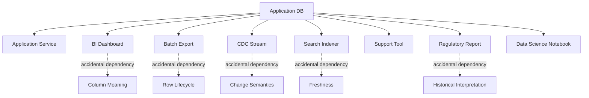
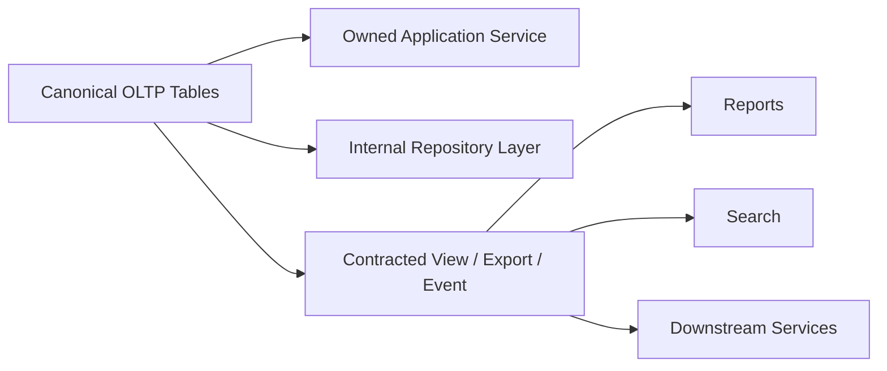
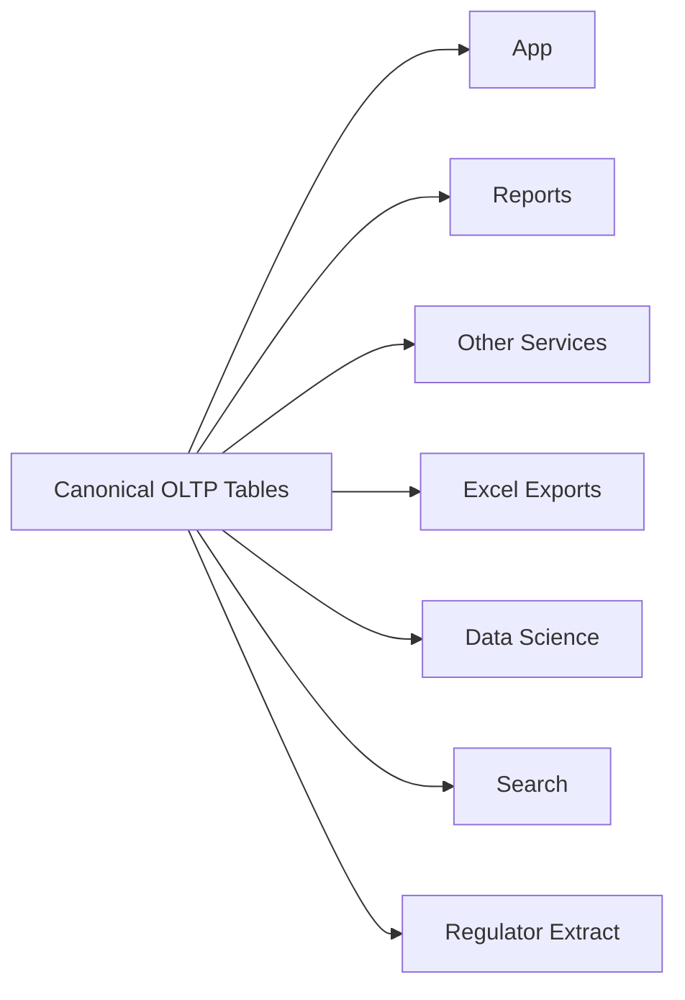
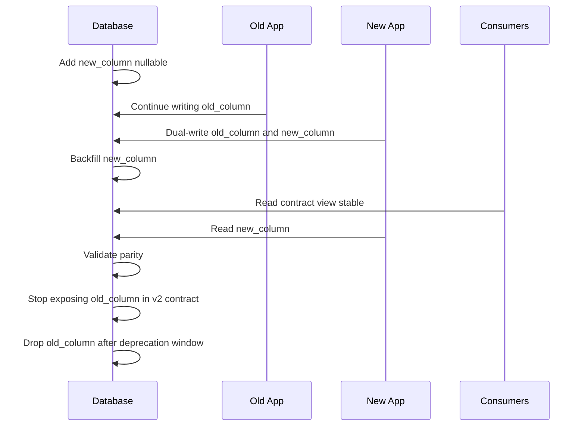
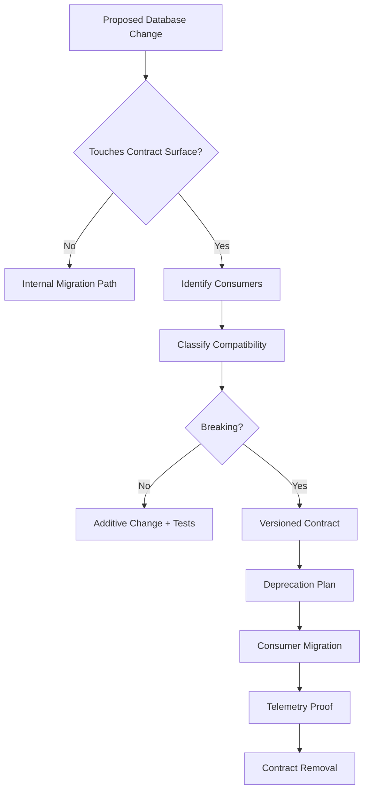
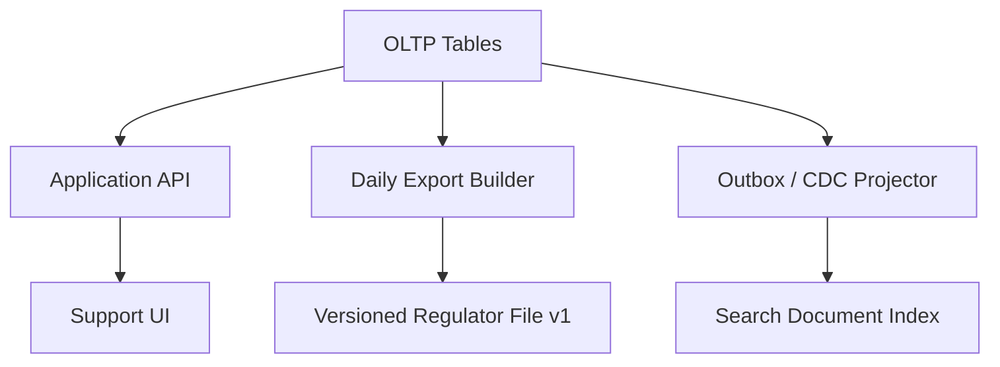

# Part 049 — Data Contracts at Database Boundary

A database schema is not just storage.

In a production system, a database is also a **contract surface**.

Every table, column, index, constraint, view, query result, event payload, export, report, materialized view, CDC stream, and dashboard can become a promise that other systems quietly depend on.

The dangerous part is that most database contracts are accidental.

A team exposes a table to a reporting job. Another team reads it directly. A BI query starts relying on a nullable column meaning “not reviewed yet”. A downstream service parses an enum-like status string. A migration renames a column. Nobody thinks it is a breaking API change because “it is only a database change”.

That is how systems become fragile.

This part gives you the architect-level model for treating database boundaries as explicit contracts.

---

## 1. Core Mental Model

A data contract answers five questions:

1. **Who is allowed to consume this data?**
2. **What meaning is guaranteed?**
3. **What shape is guaranteed?**
4. **What freshness/consistency is guaranteed?**
5. **How can the contract evolve without breaking consumers?**

A table definition is not enough.

```sql
CREATE TABLE case_file (
    id uuid PRIMARY KEY,
    tenant_id uuid NOT NULL,
    case_number text NOT NULL,
    status text NOT NULL,
    assigned_user_id uuid,
    created_at timestamptz NOT NULL,
    updated_at timestamptz NOT NULL
);
```

This DDL says shape, but not meaning.

It does not tell you:

- whether `status = 'CLOSED'` means legally closed, operationally closed, or UI-hidden;
- whether `assigned_user_id` can be stale after reassignment;
- whether consumers may join to `users` directly;
- whether `updated_at` changes on comments, evidence, assignment, or only case header fields;
- whether `case_number` is globally unique, tenant-scoped, or externally assigned;
- whether deleted cases disappear, become soft-deleted, or move to archive;
- whether reports may treat current rows as historical truth.

A database architect must separate **storage shape** from **contract meaning**.

---

## 2. Why Database Contracts Are Harder Than API Contracts

HTTP/REST/gRPC APIs usually have visible boundaries. A route, protobuf schema, OpenAPI document, or SDK makes the contract obvious.

Database contracts are sneakier because consumers can depend on internal details:



The same database table may be simultaneously:

- a transactional state store;
- a reporting source;
- an audit source;
- a CDC source;
- a search projection source;
- a migration staging area;
- a support/debugging source;
- a legal evidence source.

That is why database contract design must be stricter than ordinary schema design.

---

## 3. Contract Surface Taxonomy

A production database has several contract surfaces.

| Surface | Example | Risk |
|---|---|---|
| Physical table | `case_file` | Internal details leak to consumers |
| View | `reporting.case_summary_v1` | Safer but can hide expensive query cost |
| Materialized view | `case_dashboard_mv` | Freshness and rebuild semantics matter |
| Stored procedure/function | `create_case(...)` | Strong write contract but versioning needed |
| CDC stream | `case_file` changes | Emits structural changes, not always domain events |
| Outbox event | `CaseAssigned.v1` | Better semantic contract, requires event governance |
| Export file | CSV/Parquet extract | Schema, ordering, null, and encoding become contract |
| Report dataset | BI semantic model | Metrics and grain become contract |
| Search projection | Elasticsearch/OpenSearch document | Denormalized shape and staleness become contract |
| Analytics table | warehouse/lakehouse table | Grain, late arrival, correction, and history semantics matter |

The architect question is not “what table exists?”

The better question is:

> Which contract surfaces are intentional, and which are accidental?

---

## 4. The Contract Boundary Principle

Do not expose canonical operational tables as public contracts unless you deliberately accept the coupling.

Prefer this:



Avoid this:



The second architecture makes every schema migration a negotiation with unknown consumers.

---

## 5. A Contract Is More Than Columns

A useful data contract has at least these dimensions.

### 5.1 Shape Contract

The structural shape:

- column names;
- data types;
- nullability;
- enum/status values;
- primary key and uniqueness semantics;
- nesting/document shape;
- event payload fields;
- file format and encoding.

Example:

```yaml
contract: reporting.case_summary.v1
owner: enforcement-platform
shape:
  case_id: uuid required
  tenant_id: uuid required
  case_number: string required
  current_status: string required
  assigned_team_code: string nullable
  opened_at: timestamp required
  closed_at: timestamp nullable
```

### 5.2 Semantic Contract

What the fields mean.

```yaml
semantics:
  current_status:
    description: Latest operational lifecycle state of the case.
    allowed_values:
      - DRAFT
      - OPEN
      - UNDER_REVIEW
      - ESCALATED
      - CLOSED
    warning: Do not infer legal finality from CLOSED. Use closure_decision_type.
```

Without semantic contract, consumers infer meaning.

Inferred meaning becomes hidden coupling.

### 5.3 Consistency Contract

What consistency consumers can expect.

```yaml
consistency:
  source: primary OLTP database
  read_consistency: transactionally consistent within each row
  cross_table_consistency: best effort for reporting view
  max_staleness: 5 minutes
```

A dashboard that can be five minutes stale is different from an authorization check that must be current.

### 5.4 Lifecycle Contract

How rows appear, change, disappear, and get corrected.

```yaml
lifecycle:
  creation: case appears after case_file transaction commits
  update: current_status changes only through approved transition path
  deletion: rows are not physically deleted before retention expiry
  correction: corrected values preserve audit trail in case_transition_history
```

### 5.5 Compatibility Contract

How changes are introduced.

```yaml
compatibility:
  additive_fields: allowed
  nullable_to_required: breaking unless staged
  status_value_addition: conditionally breaking
  field_removal: breaking
  type_change: breaking unless compatible cast is guaranteed
  deprecation_notice: 90 days
```

---

## 6. Internal Table vs Public Data Product

A table can be internal even if it is readable by the database engine.

An internal table is optimized for:

- invariant enforcement;
- transaction boundaries;
- write path correctness;
- operational maintenance;
- physical indexing;
- schema evolution.

A public data product is optimized for:

- stable semantics;
- consumer comprehension;
- compatibility;
- explicit freshness;
- governed access;
- reproducibility.

Do not confuse them.

### Example: Internal Tables

```sql
CREATE TABLE case_file (
    id uuid PRIMARY KEY,
    tenant_id uuid NOT NULL,
    lifecycle_state text NOT NULL,
    priority_score integer NOT NULL DEFAULT 0,
    assigned_unit_id uuid,
    opened_at timestamptz NOT NULL,
    closed_at timestamptz,
    row_version bigint NOT NULL DEFAULT 0,
    updated_at timestamptz NOT NULL
);

CREATE TABLE case_assignment_history (
    id uuid PRIMARY KEY,
    case_id uuid NOT NULL REFERENCES case_file(id),
    assigned_unit_id uuid NOT NULL,
    assigned_user_id uuid,
    assigned_at timestamptz NOT NULL,
    unassigned_at timestamptz,
    assigned_by_user_id uuid NOT NULL,
    reason_code text NOT NULL
);
```

### Example: Public Reporting Contract

```sql
CREATE SCHEMA reporting;

CREATE VIEW reporting.case_summary_v1 AS
SELECT
    c.id AS case_id,
    c.tenant_id,
    c.lifecycle_state AS current_status,
    c.opened_at,
    c.closed_at,
    a.assigned_unit_id AS current_assigned_unit_id,
    c.priority_score
FROM case_file c
LEFT JOIN LATERAL (
    SELECT h.assigned_unit_id
    FROM case_assignment_history h
    WHERE h.case_id = c.id
      AND h.unassigned_at IS NULL
    ORDER BY h.assigned_at DESC
    LIMIT 1
) a ON true;
```

The view becomes the stable boundary. The internal tables can evolve behind it.

---

## 7. The Three Types of Database Consumer

Not every consumer deserves the same contract.

### 7.1 Operational Consumer

Examples:

- core application service;
- workflow engine adapter;
- authorization decision path;
- support console;
- user-facing read API.

Needs:

- low latency;
- current data;
- strong correctness;
- predictable transaction semantics.

Operational consumers should usually go through an application boundary or tightly controlled views/procedures.

### 7.2 Analytical Consumer

Examples:

- BI dashboards;
- warehouse pipelines;
- periodic reports;
- risk scoring jobs;
- data science notebooks.

Needs:

- stable grain;
- historical semantics;
- late-arrival handling;
- reproducible metrics;
- clear freshness.

Analytical consumers should usually use projections, snapshots, warehouse tables, or curated views.

### 7.3 Integration Consumer

Examples:

- downstream microservice;
- search indexer;
- notification service;
- external regulator system;
- partner export.

Needs:

- explicit event/file/API schema;
- idempotency;
- versioning;
- replay;
- compatibility windows.

Integration consumers should usually use domain events, outbox, CDC projections, or published exports—not arbitrary table reads.

---

## 8. Database Contract Anti-Patterns

### 8.1 Public Tables by Accident

A reporting tool receives direct read access to OLTP schema.

At first, it is convenient.

Later:

- queries become slow;
- schema cannot change;
- deleted rows break reports;
- internal enum values become public vocabulary;
- operational table names become organizational language.

Fix: create a reporting schema, versioned views, or warehouse model.

### 8.2 Status Value as Unversioned Contract

```sql
status text NOT NULL CHECK (status IN ('OPEN', 'CLOSED'))
```

A consumer assumes only two values.

Later you add:

```text
UNDER_REVIEW
ESCALATED
SUSPENDED
REOPENED
```

The application code is fine. The report is not.

Adding enum/status values is often **semantically breaking**, even if the column type does not change.

### 8.3 Nullable Field With Hidden Meaning

```sql
closed_at timestamptz NULL
```

Possible meanings:

- not closed yet;
- closed time unknown;
- closed before migration and not backfilled;
- closure suppressed due to privacy policy;
- data quality issue.

A nullable column without semantic contract is a bug waiting to become a dashboard rule.

### 8.4 Reusing a Column for a New Meaning

Old meaning:

```text
reviewed_at = time supervisor reviewed the case
```

New meaning:

```text
reviewed_at = time automated rule engine reviewed the case
```

Same shape, different meaning. This is a breaking change even though DDL did not change.

### 8.5 Backfill Without Consumer Contract

A migration backfills historical values.

Consumers suddenly observe old rows as if the values existed at original event time.

That can corrupt metrics.

A backfill must define:

- value origin;
- generated timestamp;
- effective timestamp;
- confidence;
- whether consumers should treat it as historical truth or reconstructed value.

---

## 9. Compatibility Taxonomy

Database changes should be classified before implementation.

| Change | Usually Compatible? | Notes |
|---|---:|---|
| Add nullable column | Yes | Unless consumers use `SELECT *` or strict schema parsing |
| Add column with default | Usually | Risk: table rewrite/lock depending engine/version/config |
| Add optional JSON field | Usually | Risk: downstream schema validation |
| Add required column | No | Needs expand/backfill/validate/contract |
| Rename column | No | Use add-copy-deprecate-contract |
| Drop column | No | Must prove no consumers |
| Change data type | Usually no | Some widening changes are compatible, but validate consumers |
| Add enum/status value | Maybe breaking | Consumers may assume exhaustive values |
| Tighten constraint | Maybe breaking | Existing writes may fail |
| Loosen constraint | Maybe breaking | Consumers may rely on stronger invariant |
| Change meaning of column | Breaking | Even if DDL unchanged |
| Change freshness SLA | Breaking for operational consumers | Must update contract |
| Change row lifecycle | Breaking | Soft-delete/hard-delete/archive affect consumers |
| Repartition table | Usually internal | Can break CDC, replication, query plans, maintenance windows |

Architectural rule:

> A change is breaking if a reasonable existing consumer can fail or produce materially different meaning without changing its code.

---

## 10. Compatibility Design Patterns

### 10.1 Add, Migrate, Read, Remove

For column rename:



### 10.2 Versioned Views

```sql
CREATE VIEW reporting.case_summary_v1 AS
SELECT
    id AS case_id,
    lifecycle_state AS status,
    opened_at,
    closed_at
FROM case_file;

CREATE VIEW reporting.case_summary_v2 AS
SELECT
    id AS case_id,
    lifecycle_state AS current_status,
    closure_reason_code,
    opened_at,
    closed_at
FROM case_file;
```

Keep `v1` until consumers migrate.

Do not silently change `v1` semantics.

### 10.3 Compatibility View Over New Schema

Old contract:

```text
case_file.assigned_user_id
```

New normalized schema:

```text
case_assignment_history
```

Compatibility view:

```sql
CREATE VIEW compatibility.case_file_v1 AS
SELECT
    c.id,
    c.tenant_id,
    c.lifecycle_state AS status,
    a.assigned_user_id,
    c.opened_at,
    c.closed_at
FROM case_file c
LEFT JOIN LATERAL (
    SELECT h.assigned_user_id
    FROM case_assignment_history h
    WHERE h.case_id = c.id
      AND h.unassigned_at IS NULL
    ORDER BY h.assigned_at DESC
    LIMIT 1
) a ON true;
```

This lets physical model improve without forcing every consumer to migrate on the same day.

### 10.4 Shadow Contract

Before switching consumers, produce both old and new contract outputs and compare.

```sql
SELECT
    old.case_id,
    old.status AS old_status,
    new.current_status AS new_status
FROM reporting.case_summary_v1 old
JOIN reporting.case_summary_v2 new USING (case_id)
WHERE old.status IS DISTINCT FROM new.current_status;
```

Shadow contracts are powerful during refactoring.

### 10.5 Contract Adapter Table

Sometimes you need a stable output table independent of OLTP complexity.

```sql
CREATE TABLE published_case_summary (
    contract_version text NOT NULL,
    case_id uuid NOT NULL,
    tenant_id uuid NOT NULL,
    payload jsonb NOT NULL,
    produced_at timestamptz NOT NULL,
    source_version bigint NOT NULL,
    PRIMARY KEY (contract_version, case_id)
);
```

This is useful when:

- consumers need stable JSON/Avro payloads;
- publishing is asynchronous;
- rebuild/replay is required;
- multiple versions must coexist.

---

## 11. Contract-First Database Change Workflow

Before a migration, answer these questions.



A good migration plan includes:

- owner;
- affected contract surfaces;
- known consumers;
- compatibility classification;
- rollout phases;
- rollback/roll-forward strategy;
- validation queries;
- consumer notification;
- deprecation date;
- monitoring signals.

---

## 12. Consumer Inventory

You cannot safely evolve what you cannot inventory.

Maintain a consumer registry.

```yaml
contract: reporting.case_summary.v1
owner: enforcement-platform
consumers:
  - name: compliance-dashboard
    team: analytics
    mode: dashboard
    freshness_requirement: 15 minutes
    migration_contact: analytics-oncall
  - name: nightly-regulator-export
    team: reporting
    mode: batch-export
    freshness_requirement: daily
    migration_contact: reporting-platform
  - name: search-indexer
    team: platform-search
    mode: async-projection
    freshness_requirement: 5 minutes
    migration_contact: search-oncall
```

Without a registry, your actual compatibility process becomes archaeology.

### Discovery Techniques

Use multiple signals:

- database permissions;
- query logs;
- BI datasource definitions;
- CDC connector configs;
- warehouse lineage;
- application config repositories;
- secrets/connection strings;
- service ownership registry;
- data catalog;
- manual team review.

Do not rely only on human memory.

---

## 13. SQL Contract Surfaces

### 13.1 Views as Read Contracts

Views are useful because they:

- hide physical schema;
- expose stable names;
- restrict columns;
- encode semantic joins;
- support versioning;
- can be secured separately.

But views are not magic.

View risks:

- hidden expensive joins;
- unstable execution plans;
- security leakage through joins;
- accidental change of semantics;
- consumers adding filters that break performance assumptions.

For heavy consumers, prefer materialized views, projection tables, or warehouse models.

### 13.2 Stored Procedures as Write Contracts

For strong write invariants, procedures/functions can define an explicit write boundary.

```sql
CREATE FUNCTION enforcement.assign_case(
    p_case_id uuid,
    p_assigned_user_id uuid,
    p_actor_user_id uuid,
    p_reason_code text
) RETURNS void
LANGUAGE plpgsql
AS $$
BEGIN
    UPDATE case_file
    SET updated_at = now()
    WHERE id = p_case_id;

    INSERT INTO case_assignment_history (
        id,
        case_id,
        assigned_user_id,
        assigned_at,
        assigned_by_user_id,
        reason_code
    ) VALUES (
        gen_random_uuid(),
        p_case_id,
        p_assigned_user_id,
        now(),
        p_actor_user_id,
        p_reason_code
    );
END;
$$;
```

The procedure can enforce a write protocol, but it becomes a contract too. Version it deliberately if external consumers call it.

### 13.3 Grants as Contract Boundaries

Use permissions to enforce contract boundaries.

```sql
REVOKE ALL ON ALL TABLES IN SCHEMA app FROM reporting_role;
GRANT USAGE ON SCHEMA reporting TO reporting_role;
GRANT SELECT ON reporting.case_summary_v1 TO reporting_role;
```

A contract that is documented but not enforced will eventually be bypassed.

---

## 14. Event Contracts vs Table Contracts

CDC from a table is not automatically a domain event.

A table change says:

```text
row X changed from A to B
```

A domain event says:

```text
CaseAssigned occurred because supervisor Y assigned case X to investigator Z for reason R
```

These are not equivalent.

### Table CDC Event

```json
{
  "op": "u",
  "table": "case_file",
  "before": {
    "assigned_user_id": "old-user"
  },
  "after": {
    "assigned_user_id": "new-user"
  }
}
```

### Domain Event

```json
{
  "event_id": "4e783e3d-9a3c-4e42-81a2-f6e792b45a5c",
  "event_type": "CaseAssigned",
  "event_version": 1,
  "aggregate_type": "Case",
  "aggregate_id": "case-123",
  "occurred_at": "2026-07-05T10:15:30Z",
  "actor_user_id": "supervisor-77",
  "payload": {
    "assigned_user_id": "investigator-99",
    "assigned_unit_id": "unit-12",
    "reason_code": "LOAD_BALANCING"
  }
}
```

Use table CDC when consumers need replication/projection of state.

Use domain events when consumers need business meaning.

---

## 15. Contract Versioning

A contract version should change when the consumer-visible shape or meaning changes.

### Version in Name

```text
reporting.case_summary_v1
reporting.case_summary_v2
```

Good for SQL views and datasets.

### Version in Payload

```json
{
  "event_type": "CaseClosed",
  "event_version": 2,
  "payload": {
    "case_id": "...",
    "closure_reason_code": "NO_VIOLATION",
    "closure_decision_id": "..."
  }
}
```

Good for events/files/APIs.

### Version in Schema Registry

Useful when payloads use Avro/Protobuf/JSON Schema and compatibility rules are enforced by tooling.

### Compatibility Rule

Do not create a new major contract version for every additive change.

Do create a new major version when:

- a field is removed;
- a field is renamed;
- a field meaning changes;
- a field type changes incompatibly;
- requiredness changes incompatibly;
- enum/status semantics change in a way consumers must handle;
- lifecycle/freshness contract changes materially.

---

## 16. Schema Registry Is Not Enough

A schema registry can tell you if payload shape is compatible.

It cannot fully tell you if meaning is compatible.

Example:

```json
{
  "status": "CLOSED"
}
```

Shape unchanged.

Meaning changed from:

```text
case is operationally inactive
```

to:

```text
case has received final legal closure decision
```

That is a breaking semantic change.

Architectural rule:

> Contract compatibility includes syntax, semantics, lifecycle, freshness, and failure behavior.

---

## 17. Data Contract Document Template

Use a lightweight but explicit document.

```yaml
contract_name: reporting.case_summary
version: 1
owner_team: enforcement-platform
technical_owner: database-platform
business_owner: case-operations
status: active

purpose: >
  Stable reporting view for operational case lifecycle dashboard and daily regulator export.

source_of_truth:
  database: enforcement_oltp
  source_tables:
    - case_file
    - case_assignment_history
    - case_closure_decision

consumers:
  - compliance-dashboard
  - nightly-regulator-export

shape:
  fields:
    case_id:
      type: uuid
      required: true
      meaning: Stable internal case identifier.
    current_status:
      type: string
      required: true
      meaning: Current operational lifecycle state.
      allowed_values:
        - DRAFT
        - OPEN
        - UNDER_REVIEW
        - ESCALATED
        - CLOSED
    closed_at:
      type: timestamp
      required: false
      meaning: Time the case entered CLOSED state.

freshness:
  mode: materialized projection
  expected_lag: under 5 minutes
  maximum_lag_before_alert: 15 minutes

consistency:
  row_level: transactionally derived from committed source rows
  cross_row: eventually consistent
  historical_reproducibility: not guaranteed; use case_snapshot_daily for historical reports

lifecycle:
  deletion: soft-deleted cases excluded unless include_deleted flag is added in future version
  correction: corrected rows overwrite current view; audit source remains in case_event_history

compatibility:
  additive_fields: allowed
  field_removal: requires v2
  status_value_addition: requires consumer notice
  deprecation_window: 90 days
```

This is more useful than a diagram alone.

---

## 18. Contract Testing

Database contract tests prevent accidental breakage.

### 18.1 Shape Test

```sql
SELECT
    column_name,
    data_type,
    is_nullable
FROM information_schema.columns
WHERE table_schema = 'reporting'
  AND table_name = 'case_summary_v1'
ORDER BY ordinal_position;
```

Compare against expected contract.

### 18.2 Semantic Sample Test

```sql
SELECT current_status
FROM reporting.case_summary_v1
WHERE current_status NOT IN (
    'DRAFT',
    'OPEN',
    'UNDER_REVIEW',
    'ESCALATED',
    'CLOSED'
);
```

### 18.3 Freshness Test

```sql
SELECT now() - max(produced_at) AS projection_lag
FROM reporting.case_summary_projection_metadata;
```

### 18.4 Parity Test During Migration

```sql
SELECT count(*) AS mismatch_count
FROM reporting.case_summary_v1 old
JOIN reporting.case_summary_v2 new USING (case_id)
WHERE old.current_status IS DISTINCT FROM new.current_status;
```

### 18.5 Consumer Query Test

Store critical consumer queries and run them before migration.

This catches:

- missing columns;
- plan regression;
- type mismatch;
- row count drift;
- semantic mismatch;
- unacceptable latency.

---

## 19. Data Contract and Invariants

A contract should expose invariants clearly.

Bad contract:

```yaml
field: total_amount
meaning: total amount
```

Better:

```yaml
field: total_amount
meaning: Sum of active line_item.amount values at the time invoice was finalized.
invariant: Must equal sum(line_items where voided_at is null) after invoice finalization.
correction: If line item is corrected after finalization, emit InvoiceCorrected event and preserve previous total in audit history.
```

When invariant is visible, consumers know whether they can trust the field.

---

## 20. Data Contract and Access Control

Contracts must include access rules.

A reporting view may be structurally compatible but insecure.

Example safe view:

```sql
CREATE VIEW reporting.case_public_summary_v1 AS
SELECT
    id AS case_id,
    case_number,
    lifecycle_state AS current_status,
    opened_at,
    closed_at
FROM case_file
WHERE sensitivity_level IN ('PUBLIC', 'INTERNAL');
```

Better still, combine with grants, RLS, masking, or export pipeline controls.

Contract fields should be classified:

| Classification | Example | Rule |
|---|---|---|
| Public operational | case number | Can appear in broad internal dashboards |
| Internal restricted | investigator assignment | Role-scoped |
| Sensitive | subject identity | Need masking/minimization |
| Highly sensitive | evidence content | Separate contract and access workflow |
| Derived sensitive | risk score | Treat as sensitive even if derived |

Data contracts are not only about shape. They are also about what should not leak.

---

## 21. Data Contract and Reporting Grain

Analytical contracts must define grain.

Bad:

```text
case report table
```

Better:

```yaml
grain: one row per case per calendar day per tenant
```

Or:

```yaml
grain: one row per case lifecycle transition
```

The grain determines what counts can mean.

If a consumer does:

```sql
SELECT count(*) FROM reporting.case_activity_v1;
```

The answer is meaningless unless the row grain is known.

Common grains:

- one row per current entity;
- one row per event;
- one row per entity per day;
- one row per relationship interval;
- one row per snapshot run;
- one row per exported file record.

Changing grain is a breaking contract change.

---

## 22. Contracting Null Semantics

Nulls are not self-explanatory.

Define null reason when important.

Pattern:

```sql
CREATE TABLE case_closure_summary (
    case_id uuid PRIMARY KEY,
    closed_at timestamptz,
    closed_at_null_reason text CHECK (
        closed_at_null_reason IN (
            'CASE_NOT_CLOSED',
            'MIGRATION_UNKNOWN',
            'SUPPRESSED_BY_POLICY'
        )
    ),
    CHECK (
        (closed_at IS NOT NULL AND closed_at_null_reason IS NULL)
        OR
        (closed_at IS NULL AND closed_at_null_reason IS NOT NULL)
    )
);
```

This avoids downstream folklore.

---

## 23. Contracting Status and State

For status fields, document:

- allowed values;
- terminal values;
- transient values;
- whether new values may appear;
- default consumer behavior for unknown values;
- mapping to external terms;
- transition history location.

Consumer guidance:

```yaml
unknown_status_policy:
  dashboards: display as UNKNOWN and alert owner
  external_export: fail closed and hold export
  search_index: index raw value under current_status_raw
```

An enum that consumers treat as exhaustive is a brittle contract.

---

## 24. Contracting Deletes

Deletes must be explicit.

For each contract, define:

- whether delete is physical, logical, tombstone, or archive;
- whether deleted rows disappear from views;
- whether delete events are emitted;
- whether hard deletes are delayed;
- whether legal hold blocks deletion;
- whether backup restore can resurrect deleted data;
- how downstream systems purge deleted projections.

Example:

```yaml
deletion:
  operational_table: soft delete with deleted_at
  reporting_view: excludes deleted rows by default
  cdc_stream: emits CaseDeleted domain event
  search_projection: consumes tombstone and removes document
  warehouse: preserves delete marker for audit-retention period
```

---

## 25. Contracting Time

Time fields need exact meaning.

```yaml
opened_at:
  meaning: time case entered OPEN state
  source: case_transition_history.occurred_at
  timezone: UTC instant
  correction_policy: corrected through transition correction event, not direct update

updated_at:
  meaning: last time current case header row was modified
  warning: not a reliable business activity timestamp
```

`updated_at` is often abused as event time, freshness time, and business time. It should rarely be used as a contract field without explanation.

---

## 26. Contracting Backfills

Backfills are dangerous because they manufacture history.

Define:

- why backfill is needed;
- source of reconstructed value;
- backfill timestamp;
- effective timestamp;
- confidence;
- whether downstream consumers should recalculate historical metrics;
- whether events should be emitted for backfilled rows.

Example columns:

```sql
ALTER TABLE case_risk_assessment
ADD COLUMN risk_score_source text NOT NULL DEFAULT 'RULE_ENGINE',
ADD COLUMN risk_score_computed_at timestamptz,
ADD COLUMN risk_score_backfilled_at timestamptz;
```

If historical reports change after a backfill, that is not necessarily wrong. But it must be intentional.

---

## 27. Contracting CDC

If a table is captured by CDC, schema changes become integration changes.

Changing a column can break:

- connector serialization;
- schema registry compatibility;
- consumer deserialization;
- downstream projection code;
- replay logic;
- lake ingestion;
- deletion handling.

CDC contract should state:

```yaml
cdc:
  source_table: case_file
  publication: enforcement_publication
  key: id
  ordering: per source database commit order
  delete_mode: tombstone
  snapshot_mode: initial + streaming
  schema_change_policy: additive only without notice
  consumer_idempotency_required: true
```

Part 050 expands this in depth.

---

## 28. Database Contract Review Checklist

Before approving a database change, ask:

### Contract Surface

- Is this table/view/event/export used outside the owning service?
- Is direct table access allowed or accidental?
- Are there views/projections that should be the public boundary?
- Are grants enforcing the intended boundary?

### Consumer Impact

- Who consumes this data?
- Are all consumers known?
- Are consumer queries tested?
- Are BI dashboards, exports, CDC connectors, and search pipelines included?

### Compatibility

- Is the change additive?
- Does field meaning change?
- Does nullability change?
- Does status vocabulary change?
- Does row lifecycle change?
- Does freshness or consistency change?
- Does grain change?

### Versioning

- Is a new contract version needed?
- Is old version still available?
- Is deprecation timeline explicit?
- Is migration telemetry available?

### Enforcement

- Are permissions aligned with contract?
- Are constraints aligned with documented invariants?
- Are contract tests automated?
- Are validation queries defined?

### Operations

- Can contract output be rebuilt?
- Can historical output be reproduced?
- Can consumers replay?
- Is rollback or roll-forward path defined?

---

## 29. Practical Example: Case Closure Contract Evolution

### Old Contract

```yaml
contract: reporting.case_summary.v1
fields:
  case_id: uuid
  status: string
  closed_at: timestamp nullable
```

Problem: `status = CLOSED` does not explain why case closed.

New requirement: reports must distinguish:

- no violation;
- settled;
- escalated to litigation;
- duplicate;
- withdrawn.

### Bad Migration

```sql
ALTER TABLE case_file
ADD COLUMN closure_reason text NOT NULL;
```

This fails because historical rows do not have reason. It also breaks old writers.

### Better Migration

Expand:

```sql
ALTER TABLE case_file
ADD COLUMN closure_reason_code text NULL;
```

Backfill with explicit unknown reason:

```sql
UPDATE case_file
SET closure_reason_code = 'MIGRATION_UNKNOWN'
WHERE lifecycle_state = 'CLOSED'
  AND closure_reason_code IS NULL;
```

Create v2 contract:

```sql
CREATE VIEW reporting.case_summary_v2 AS
SELECT
    id AS case_id,
    lifecycle_state AS current_status,
    closed_at,
    closure_reason_code
FROM case_file;
```

Keep v1 stable:

```sql
CREATE OR REPLACE VIEW reporting.case_summary_v1 AS
SELECT
    id AS case_id,
    lifecycle_state AS status,
    closed_at
FROM case_file;
```

Validate:

```sql
SELECT count(*)
FROM reporting.case_summary_v2
WHERE current_status = 'CLOSED'
  AND closure_reason_code IS NULL;
```

Contract statement:

```yaml
closure_reason_code:
  required_when: current_status = CLOSED
  allowed_values:
    - NO_VIOLATION
    - SETTLED
    - LITIGATION_ESCALATION
    - DUPLICATE
    - WITHDRAWN
    - MIGRATION_UNKNOWN
  warning: MIGRATION_UNKNOWN appears only for cases closed before 2026-07-05 migration.
```

This is contract-aware evolution.

---

## 30. Production Failure Modes

### Failure Mode: Hidden Consumer Breaks

A schema change passes application tests but breaks a BI dashboard.

Cause:

- direct table access;
- no consumer inventory;
- no query log review;
- no contract versioning.

Mitigation:

- use published views;
- monitor query logs;
- inventory credentials;
- require contract review for exposed schemas.

### Failure Mode: Semantic Drift

Column meaning changes without DDL change.

Mitigation:

- contract docs;
- semantic test cases;
- ADR for meaning changes;
- versioned view/event for meaning changes.

### Failure Mode: Additive Change Breaks Strict Consumers

A consumer uses `SELECT *`, strict CSV parser, or rigid schema validation.

Mitigation:

- forbid `SELECT *` in consumer contracts;
- publish explicit columns;
- use compatibility tests;
- coordinate file/event schema evolution.

### Failure Mode: Contract View Becomes Slow

A stable view hides increasingly complex joins.

Mitigation:

- track query latency;
- materialize if necessary;
- index underlying tables;
- publish projection table;
- define freshness SLA.

### Failure Mode: CDC Consumer Misreads Table Change as Domain Event

A row update is consumed as business event, but it was a correction/backfill.

Mitigation:

- use outbox domain events;
- include operation reason;
- tag migration/backfill writes;
- document CDC semantics.

---

## 31. Architect-Level Heuristics

Use these rules in design review.

1. **Do not expose canonical tables casually.** Use views, events, exports, APIs, or projections.
2. **A contract is shape plus meaning.** DDL is not enough.
3. **Adding a status value may be breaking.** Consumers often assume exhaustive states.
4. **Changing meaning is breaking even if DDL is unchanged.**
5. **Null needs semantics.** Unknown, not applicable, not yet, suppressed, and invalid are different.
6. **Freshness is part of contract.** Stale dashboards are fine; stale authorization is not.
7. **Grain is part of contract.** Reports without grain become misleading.
8. **Deletes are part of contract.** Disappearance is observable behavior.
9. **Backfills are contract events.** They can rewrite historical interpretation.
10. **Contract tests must run before migration.** Documentation alone does not protect production.

---

## 32. Mini Design Exercise

You are asked to expose case data to three consumers:

1. a real-time support UI;
2. a daily regulator export;
3. a search index.

Do not expose one table to all three.

Better design:



Each consumer gets a fit-for-purpose contract:

| Consumer | Contract | Freshness | Consistency | Evolution |
|---|---|---:|---|---|
| Support UI | API/read model | current | strong enough for operation | app versioning |
| Regulator export | versioned file | daily | reproducible snapshot | file schema version |
| Search index | projection document | minutes | eventually consistent | document version + rebuild |

This is contract-aware architecture.

---

## 33. Final Mental Model

A database architect does not ask only:

> What tables should we create?

A database architect asks:

> What promises are we making, to whom, for how long, with what compatibility and recovery guarantees?

That is the essence of data contracts at the database boundary.

The next part builds on this: how database changes become event streams through CDC, outbox, replay, ordering, and idempotent consumers.

---

## References

- PostgreSQL Documentation — `CREATE VIEW`, privileges, constraints, logical replication, and schema evolution: https://www.postgresql.org/docs/current/
- PostgreSQL Documentation — Logical Decoding Concepts: https://www.postgresql.org/docs/current/logicaldecoding-explanation.html
- AWS Prescriptive Guidance — Transactional Outbox Pattern: https://docs.aws.amazon.com/prescriptive-guidance/latest/cloud-design-patterns/transactional-outbox.html
- Debezium Documentation — Outbox Event Router: https://debezium.io/documentation/reference/stable/transformations/outbox-event-router.html
- Confluent Documentation — Kafka Message Delivery Guarantees: https://docs.confluent.io/kafka/design/delivery-semantics.html
