# Part 050 — CDC and Event-Driven Database Integration

A database does not live alone.

In real systems, committed database changes must feed:

- search indexes;
- caches;
- read models;
- analytics pipelines;
- audit stores;
- external notifications;
- workflow engines;
- downstream services;
- machine-learning features;
- regulatory exports;
- data lakes and warehouses.

The hard part is not publishing a message.

The hard part is preserving enough truth, ordering, idempotency, replayability, and semantic meaning so that downstream systems can be wrong temporarily but not corrupt permanently.

This part explains CDC and event-driven database integration from a production database architect perspective.

---

## 1. Core Mental Model

Every integration from a database is a projection pipeline.

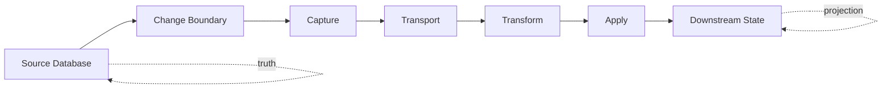

The source database owns truth.

The downstream system owns a derived projection.

The projection is correct only if the pipeline defines:

- what changes are captured;
- in what order;
- with what key;
- with what schema;
- with what idempotency rule;
- with what replay behavior;
- with what delete/correction semantics;
- with what failure recovery.

Without those rules, event-driven architecture becomes distributed data drift.

---

## 2. CDC Is Not One Thing

Change Data Capture means “observe committed data changes and deliver them elsewhere”.

There are several implementations.

| CDC Style | How It Works | Strength | Weakness |
|---|---|---|---|
| Timestamp polling | Query rows where `updated_at > last_seen` | Simple | Misses deletes, clock issues, update coalescing |
| Trigger-based CDC | Trigger writes to change table | Semantic control | Adds write overhead, must maintain triggers |
| Log-based CDC | Read database transaction/WAL/binlog/oplog | Low app coupling, good ordering | Operationally complex, connector/slot management |
| Application outbox | App writes event row in same transaction | Strong semantic event | Requires app discipline and publisher |
| Event sourcing | Event log is source of truth | Strong replay semantics | Major modelling commitment |

Architectural rule:

> Choose CDC style based on the contract you need, not based on what is easiest to demo.

---

## 3. Table Change vs Domain Event

A table change is a fact about storage.

A domain event is a fact about business meaning.

Example table update:

```json
{
  "table": "case_file",
  "op": "u",
  "before": {
    "lifecycle_state": "UNDER_REVIEW"
  },
  "after": {
    "lifecycle_state": "CLOSED"
  }
}
```

Example domain event:

```json
{
  "event_id": "f9ec07e4-1e3e-4a31-821e-84e4dfeb4d3e",
  "event_type": "CaseClosed",
  "event_version": 1,
  "aggregate_type": "Case",
  "aggregate_id": "case-123",
  "occurred_at": "2026-07-05T03:17:21Z",
  "actor_user_id": "user-77",
  "payload": {
    "closure_reason_code": "NO_VIOLATION",
    "decision_id": "decision-456"
  }
}
```

They answer different questions.

| Question | Table CDC | Domain Event |
|---|---|---|
| Which row changed? | Excellent | Maybe |
| Which columns changed? | Excellent | Maybe |
| Why did it change? | Weak | Strong |
| What business action occurred? | Weak | Strong |
| Can downstream rebuild state? | Good | Good if events are complete |
| Can analytics interpret meaning? | Risky | Better |
| Is schema tied to physical DB? | Yes | Less directly |

Use table CDC for replication, search projection, cache invalidation, and warehouse ingestion.

Use domain events for business integration.

Use both when necessary, but do not confuse them.

---

## 4. The Dual-Write Problem

Bad pattern:

```java
caseRepository.save(caseFile);
kafkaProducer.send(new CaseClosedEvent(...));
```

What if database commit succeeds but message publish fails?

What if message publish succeeds but database commit fails?

What if the process crashes between them?

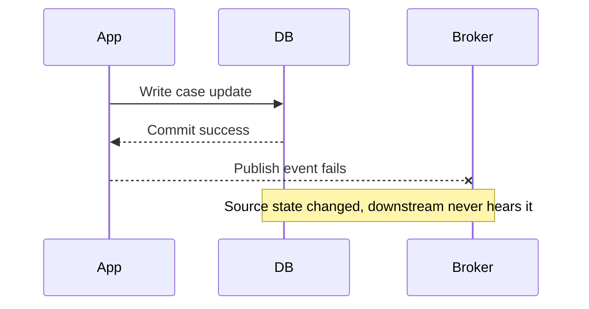

That is dual-write inconsistency.

The database architect's answer is usually one of:

1. transactional outbox;
2. event sourcing;
3. distributed transaction/2PC where truly justified;
4. database-native change stream if storage-level events are sufficient.

For most service architectures, the transactional outbox is the pragmatic default.

---

## 5. Transactional Outbox Pattern

The application writes business data and event record in the same database transaction.

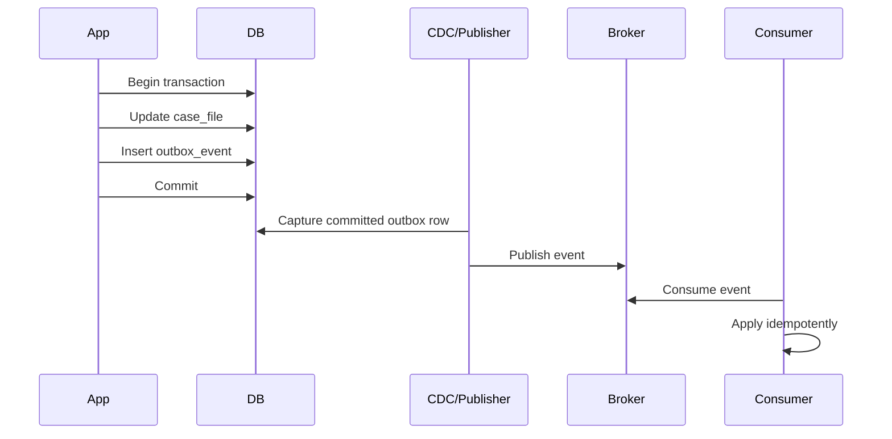

Schema:

```sql
CREATE TABLE outbox_event (
    event_id uuid PRIMARY KEY,
    aggregate_type text NOT NULL,
    aggregate_id uuid NOT NULL,
    event_type text NOT NULL,
    event_version integer NOT NULL,
    payload jsonb NOT NULL,
    headers jsonb NOT NULL DEFAULT '{}',
    occurred_at timestamptz NOT NULL,
    created_at timestamptz NOT NULL DEFAULT now(),
    transaction_id xid8,
    published_at timestamptz,
    publish_attempts integer NOT NULL DEFAULT 0
);

CREATE INDEX outbox_event_unpublished_idx
ON outbox_event (created_at, event_id)
WHERE published_at IS NULL;

CREATE INDEX outbox_event_aggregate_idx
ON outbox_event (aggregate_type, aggregate_id, created_at, event_id);
```

Important: the outbox row is not a queue message accidentally stored in a database. It is part of the transaction contract.

---

## 6. Outbox Event Design

A production event should carry enough identity and context.

```json
{
  "event_id": "8da3c95e-2488-4456-8090-0ccb47dbda3a",
  "event_type": "CaseAssigned",
  "event_version": 1,
  "aggregate_type": "Case",
  "aggregate_id": "b6ed47a9-43f4-4b98-ae46-44a41c6adad4",
  "aggregate_version": 42,
  "tenant_id": "tenant-1",
  "occurred_at": "2026-07-05T04:20:11Z",
  "actor": {
    "user_id": "user-99",
    "auth_context_id": "authctx-123"
  },
  "trace": {
    "correlation_id": "corr-abc",
    "causation_id": "cmd-def"
  },
  "payload": {
    "assigned_user_id": "user-123",
    "assigned_unit_id": "unit-7",
    "reason_code": "ESCALATION"
  }
}
```

Minimum production fields:

| Field | Purpose |
|---|---|
| `event_id` | Consumer deduplication |
| `event_type` | Routing and deserialization |
| `event_version` | Schema evolution |
| `aggregate_type` | Domain grouping |
| `aggregate_id` | Entity identity and partitioning |
| `aggregate_version` | Ordering/optimistic application |
| `tenant_id` | Isolation and authorization |
| `occurred_at` | Business/event time |
| `created_at` | Database insertion time |
| `correlation_id` | Trace across systems |
| `causation_id` | Link to command/event that caused it |
| `payload` | Event-specific body |

---

## 7. Polling Outbox Publisher

Simple publisher loop:

```sql
WITH next_events AS (
    SELECT event_id
    FROM outbox_event
    WHERE published_at IS NULL
    ORDER BY created_at, event_id
    LIMIT 100
    FOR UPDATE SKIP LOCKED
)
SELECT o.*
FROM outbox_event o
JOIN next_events n USING (event_id);
```

After publishing:

```sql
UPDATE outbox_event
SET published_at = now(),
    publish_attempts = publish_attempts + 1
WHERE event_id = $1;
```

This works, but understand the tradeoffs:

- message can be published and publisher can crash before marking `published_at`;
- consumer must deduplicate;
- ordering is approximate across concurrent transactions unless carefully designed;
- polling adds load;
- unpublished backlog must be monitored;
- deleting old outbox rows must not break replay requirements.

---

## 8. Log-Based Outbox With CDC

Instead of polling, capture committed outbox rows from the database log.

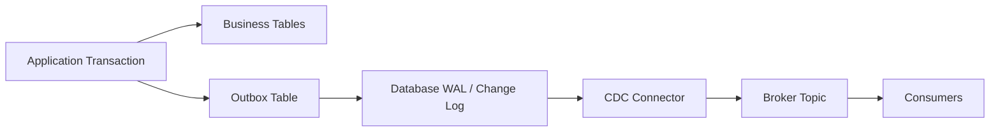

Advantages:

- no polling query loop;
- connector sees committed order from database log;
- source database write path only inserts outbox row;
- integrates well with Kafka-style pipelines.

Risks:

- replication slot/binlog retention can grow if connector stops;
- schema changes can break connector or consumers;
- initial snapshots need careful handling;
- connector offsets become critical recovery state;
- operational ownership must be explicit.

---

## 9. PostgreSQL Logical Decoding Mental Model

PostgreSQL logical decoding exposes committed changes from WAL in a logical form.

The key concepts:

- WAL records physical/logical information needed for recovery and replication;
- logical decoding converts changes into a stream consumable by clients/plugins;
- a replication slot tracks what changes a client still needs;
- if a slot is not consumed, WAL needed by that slot can be retained;
- publications/subscriptions provide built-in logical replication for table changes.

Architecture:

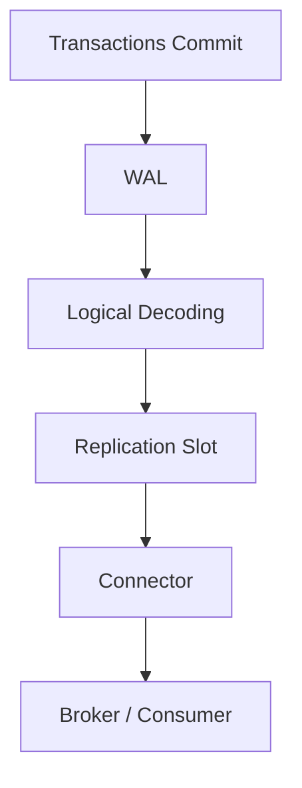

Architectural implications:

- CDC is downstream of commit;
- connector lag is not just message lag, it can become database storage pressure;
- slot health is a database SLO;
- schema migration must account for logical replication consumers.

---

## 10. Ordering Is Local, Not Magical

Ordering must be scoped.

Possible scopes:

| Scope | Meaning |
|---|---|
| Global database commit order | All captured transactions in source order |
| Table order | Changes from one table in observed order |
| Aggregate order | Events for one entity ordered by version |
| Partition order | Events in one broker partition ordered |
| Consumer apply order | Order after retries, parallelism, and failures |

Most systems only need aggregate order.

Do not pay for global ordering unless business invariants require it.

### Aggregate Version Pattern

```sql
CREATE TABLE case_file (
    id uuid PRIMARY KEY,
    aggregate_version bigint NOT NULL DEFAULT 0,
    lifecycle_state text NOT NULL
);
```

On state transition:

```sql
UPDATE case_file
SET lifecycle_state = $new_state,
    aggregate_version = aggregate_version + 1
WHERE id = $case_id
  AND aggregate_version = $expected_version;
```

Outbox event includes new version:

```sql
INSERT INTO outbox_event (
    event_id,
    aggregate_type,
    aggregate_id,
    event_type,
    event_version,
    payload,
    occurred_at
) VALUES (
    gen_random_uuid(),
    'Case',
    $case_id,
    'CaseStatusChanged',
    1,
    jsonb_build_object(
        'new_status', $new_state,
        'aggregate_version', $new_version
    ),
    now()
);
```

Consumer applies only if expected:

```sql
UPDATE case_projection
SET lifecycle_state = $new_state,
    aggregate_version = $event_aggregate_version
WHERE case_id = $case_id
  AND aggregate_version < $event_aggregate_version;
```

This gives idempotent, monotonic projection update per aggregate.

---

## 11. Broker Partitioning Strategy

For Kafka-like brokers, partition key controls per-partition order.

Common keys:

| Key | Good For | Risk |
|---|---|---|
| `aggregate_id` | Per-entity ordering | Hot aggregate can hotspot |
| `tenant_id` | Tenant-local ordering | Large tenant hotspot |
| `event_type` | Consumer separation | Breaks per-aggregate order |
| random key | Load spread | No ordering guarantee |
| composite hash | Balance + scoped order | More complex routing |

For most domain events:

```text
partition_key = aggregate_type + ':' + aggregate_id
```

For tenant-sensitive systems:

```text
partition_key = tenant_id + ':' + aggregate_id
```

Do not partition by event type if consumers need ordered lifecycle events for the same entity.

---

## 12. Idempotent Consumer Pattern

Assume every message can be delivered more than once.

Consumer-side dedup table:

```sql
CREATE TABLE consumed_event (
    consumer_name text NOT NULL,
    event_id uuid NOT NULL,
    consumed_at timestamptz NOT NULL DEFAULT now(),
    PRIMARY KEY (consumer_name, event_id)
);
```

Apply event in one transaction:

```sql
BEGIN;

INSERT INTO consumed_event (consumer_name, event_id)
VALUES ('case-search-projector', $event_id)
ON CONFLICT DO NOTHING;

-- Check whether insert happened before applying.
-- In application code, if 0 rows inserted, skip.

INSERT INTO case_search_projection (
    case_id,
    tenant_id,
    lifecycle_state,
    updated_from_event_id,
    updated_at
) VALUES (
    $case_id,
    $tenant_id,
    $state,
    $event_id,
    now()
)
ON CONFLICT (case_id) DO UPDATE
SET lifecycle_state = EXCLUDED.lifecycle_state,
    updated_from_event_id = EXCLUDED.updated_from_event_id,
    updated_at = EXCLUDED.updated_at;

COMMIT;
```

Better with aggregate version:

```sql
INSERT INTO case_projection (
    case_id,
    aggregate_version,
    lifecycle_state
) VALUES (
    $case_id,
    $aggregate_version,
    $state
)
ON CONFLICT (case_id) DO UPDATE
SET aggregate_version = EXCLUDED.aggregate_version,
    lifecycle_state = EXCLUDED.lifecycle_state
WHERE case_projection.aggregate_version < EXCLUDED.aggregate_version;
```

This handles duplicates and out-of-order older events.

---

## 13. The Exactly-Once Illusion

People often say “we need exactly-once delivery”.

Be precise.

There are different guarantees:

| Layer | Possible Guarantee |
|---|---|
| Producer to broker | idempotent send / transactional producer |
| Broker storage | durable ordered log per partition |
| Consumer offset | committed offset after processing |
| Consumer side effect | must be idempotent or transactional |
| External API call | usually not exactly-once |
| Database projection update | can be exactly-once effect with constraints/versioning |

Even if the broker provides exactly-once processing semantics inside its ecosystem, your end-to-end workflow can still duplicate side effects when it touches an external database, email service, payment provider, search engine, or file export.

Architectural rule:

> Design for at-least-once delivery and exactly-once effect where it matters.

Exactly-once effect is usually achieved through:

- idempotency keys;
- unique constraints;
- compare-and-swap version checks;
- deterministic upserts;
- dedup tables;
- transactional apply + offset commit where supported;
- reconciliation jobs.

---

## 14. Snapshot + Streaming Problem

CDC pipelines often need to initialize downstream state.

Naive approach:

1. Dump current table.
2. Start CDC after dump.

Problem: changes can happen during the dump.

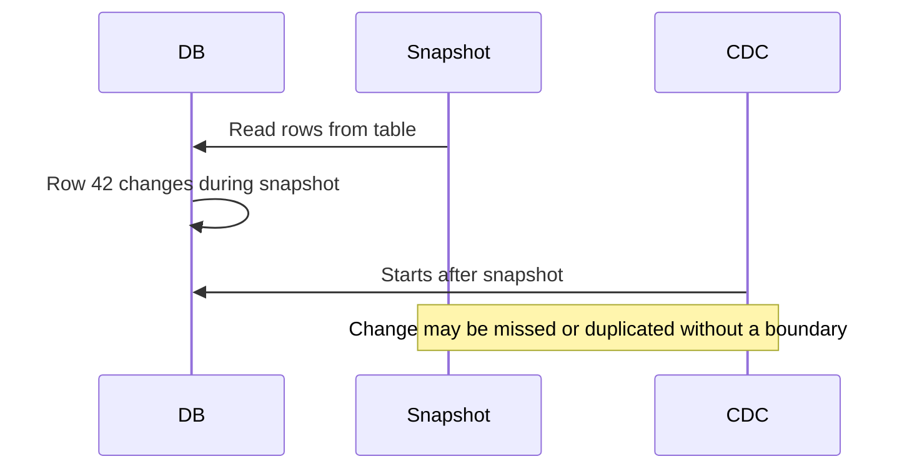

Correct approaches use some form of consistency boundary:

- transaction snapshot plus WAL position;
- connector-managed snapshot;
- incremental snapshot with watermarks;
- application-level backfill with replay repair;
- pause writes for small systems only when acceptable.

CDC correctness is not just “start connector”. It is snapshot + stream alignment.

---

## 15. Backfill and Replay

A mature event-driven database pipeline can rebuild downstream state.

Replay requirements:

- source events retained long enough;
- event schema versions still readable;
- consumers can reset state;
- projections can be recreated idempotently;
- ordering rules are stable;
- delete/tombstone events are retained or reconstructable;
- side-effecting consumers can disable external effects during replay.

Projection rebuild pattern:

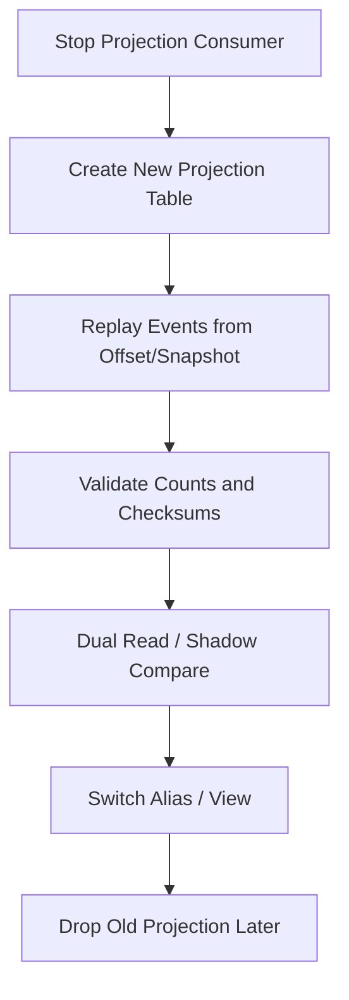

Never assume replay is safe unless you have tested it.

---

## 16. Delete and Tombstone Semantics

Deletes are the most commonly broken CDC behavior.

You must define:

- does delete emit an event?
- does downstream remove state or mark deleted?
- are tombstones retained?
- how do snapshots represent deleted rows?
- are deletes physical, soft, archival, or privacy erasure?
- how are deletes propagated to search indexes and caches?

Example domain delete event:

```json
{
  "event_id": "...",
  "event_type": "CaseRemovedFromSearch",
  "event_version": 1,
  "aggregate_id": "case-123",
  "payload": {
    "reason": "SECURITY_RECLASSIFIED"
  }
}
```

Do not rely only on row disappearance unless every consumer understands disappearance semantics.

---

## 17. Correction vs New Event

In regulated systems, corrections matter.

Bad event:

```json
{
  "event_type": "CaseUpdated",
  "payload": {
    "risk_score": 75
  }
}
```

Better event:

```json
{
  "event_type": "CaseRiskScoreCorrected",
  "event_version": 1,
  "aggregate_id": "case-123",
  "payload": {
    "previous_score": 70,
    "corrected_score": 75,
    "correction_reason_code": "RULE_VERSION_FIX",
    "effective_at": "2026-07-01T00:00:00Z",
    "corrected_at": "2026-07-05T04:00:00Z"
  }
}
```

A correction is not the same as a new business occurrence.

CDC emits row changes. Domain events should preserve correction semantics.

---

## 18. Event Schema Evolution

Events need compatibility rules.

Generally safe:

- add optional field;
- add field with default;
- add new event type if consumers ignore unknown types;
- add new enum value only if consumers are designed for unknown values.

Dangerous:

- rename field;
- remove field;
- change field meaning;
- change key identity;
- change partition key;
- change event ordering semantics;
- change delete semantics;
- change timestamp meaning.

Event versioning example:

```json
{
  "event_type": "CaseClosed",
  "event_version": 2,
  "payload": {
    "closure_reason_code": "NO_VIOLATION",
    "closure_decision_id": "decision-456",
    "closed_by_user_id": "user-77"
  }
}
```

Consumer strategy:

```text
handle CaseClosed v1
handle CaseClosed v2
reject unknown major version
ignore unknown additive fields
log unknown enum values
```

---

## 19. CDC Schema Evolution for Tables

If CDC publishes table changes, table DDL becomes stream schema change.

Examples:

| DB Change | CDC Impact |
|---|---|
| Add nullable column | Consumers may ignore or strict parsers may fail |
| Add required column | Snapshot/replay assumptions change |
| Rename column | Usually breaking |
| Drop column | Breaking for consumers |
| Change primary key | Severe: partitioning/dedup/replay impact |
| Change table name | Connector routing impact |
| Partition table | Connector config may need update |
| Change data type | Serialization compatibility risk |

For CDC-exposed tables, every DDL needs integration review.

---

## 20. Outbox Cleanup and Retention

Outbox tables can grow quickly.

Cleanup policy must respect:

- publisher lag;
- replay requirements;
- audit requirements;
- event retention in broker;
- regulatory retention;
- debug needs;
- storage cost.

Common strategies:

### 20.1 Keep Outbox Short, Broker Long

Outbox is only a reliable handoff. Broker retains events for replay.

Risk: if broker retention is not enough, database cannot replay.

### 20.2 Keep Outbox Partitioned

```sql
CREATE TABLE outbox_event (
    event_id uuid NOT NULL,
    created_at timestamptz NOT NULL,
    payload jsonb NOT NULL,
    PRIMARY KEY (created_at, event_id)
) PARTITION BY RANGE (created_at);
```

Drop old partitions after retention window.

### 20.3 Archive Outbox

Move old rows to cheaper archive for audit/replay.

Be careful: archived event schema must remain readable.

---

## 21. CDC Observability

Monitor from source to sink.

| Signal | Meaning |
|---|---|
| replication slot lag | source DB retains change log too long |
| WAL/binlog disk growth | connector or consumer not advancing |
| connector error count | capture or serialization failure |
| event publish latency | capture-to-broker delay |
| consumer lag | broker-to-consumer delay |
| projection freshness | consumer-to-state delay |
| duplicate count | retry/idempotency behavior |
| dead-letter count | poison message/schema issue |
| replay duration | recovery capability |
| checksum mismatch | projection correctness issue |

Example projection freshness table:

```sql
CREATE TABLE projection_checkpoint (
    projection_name text PRIMARY KEY,
    last_event_id uuid,
    last_event_occurred_at timestamptz,
    last_event_consumed_at timestamptz NOT NULL,
    last_source_lsn text,
    updated_at timestamptz NOT NULL DEFAULT now()
);
```

Freshness query:

```sql
SELECT
    projection_name,
    now() - last_event_consumed_at AS consume_lag,
    now() - last_event_occurred_at AS event_lag
FROM projection_checkpoint;
```

---

## 22. Dead Letter Queue Is Not a Strategy

A DLQ is a containment mechanism, not a correctness model.

For every DLQ, define:

- what makes a message non-processable;
- whether message is poison, transient, or schema-incompatible;
- who owns remediation;
- whether processing continues after skipping;
- whether skipped message breaks ordering;
- how fixed messages are replayed;
- how downstream state is repaired.

DLQ without repair process is just delayed data loss.

---

## 23. Handling Poison Events

Poison events usually come from:

- invalid payload;
- unknown schema version;
- missing reference data;
- authorization mismatch;
- downstream constraint violation;
- bug in consumer;
- unexpected ordering;
- deleted entity referenced by later event.

Consumer strategy:

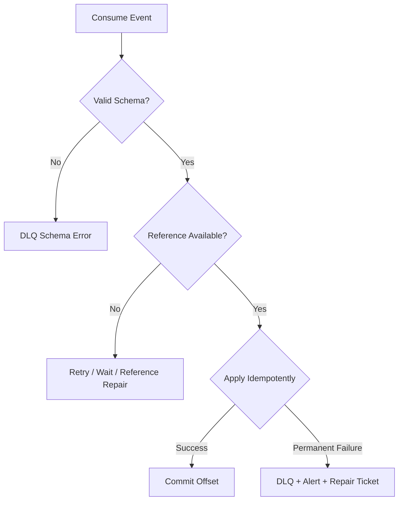

For ordered streams, skipping one event may corrupt later state. Design carefully.

---

## 24. Reference Data in Event Consumers

Consumer receives:

```json
{
  "event_type": "CaseAssigned",
  "payload": {
    "assigned_unit_id": "unit-7"
  }
}
```

But consumer projection needs unit name.

Options:

1. event carries unit name snapshot;
2. consumer joins/calls reference service;
3. consumer maintains reference data projection;
4. projection stores only ID and resolves at query time.

Tradeoff:

| Option | Good | Bad |
|---|---|---|
| Snapshot in event | Historical meaning stable | Payload duplication |
| Lookup service | Fresh reference data | Runtime coupling/failure |
| Local projection | Fast, resilient | More pipelines |
| Resolve at query | Simple storage | Query latency/coupling |

For regulatory history, snapshot values often matter.

---

## 25. Security and PII in CDC

CDC can leak everything.

If a table contains sensitive columns, CDC may expose them to more systems than intended.

Controls:

- capture only approved tables;
- publish contract outbox instead of raw table CDC;
- mask/redact sensitive fields;
- separate topics by sensitivity;
- enforce topic ACLs;
- encrypt at rest/in transit;
- minimize payload;
- classify event fields;
- avoid dumping evidence bodies into general event streams;
- define deletion/privacy propagation.

Bad event:

```json
{
  "event_type": "CaseEvidenceAdded",
  "payload": {
    "full_evidence_text": "... sensitive content ..."
  }
}
```

Better event:

```json
{
  "event_type": "CaseEvidenceAdded",
  "payload": {
    "evidence_id": "evidence-123",
    "evidence_type": "DOCUMENT",
    "sensitivity_level": "RESTRICTED"
  }
}
```

---

## 26. Multi-Tenant CDC

Tenant isolation must survive the event pipeline.

Event envelope should include tenant identity:

```json
{
  "tenant_id": "tenant-1",
  "aggregate_type": "Case",
  "aggregate_id": "case-123",
  "event_type": "CaseEscalated"
}
```

Architectural questions:

- Are topics shared across tenants or tenant-scoped?
- Are consumers allowed to see all tenants?
- Can tenant data be deleted/exported independently?
- Can one tenant's event volume cause lag for others?
- Can events be replayed per tenant?
- Are encryption keys tenant-specific?
- Does DLQ preserve tenant boundary?

In high-isolation systems, use tenant-aware routing and per-tenant replay/repair tooling.

---

## 27. CDC and Search Indexing

Search projection is a common CDC use case.

Pattern:

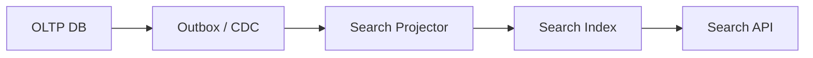

Important design points:

- search document ID must be deterministic;
- updates must be idempotent;
- delete/tombstone must remove or hide documents;
- security fields must be indexed correctly;
- partial updates must not lose fields;
- full document rebuild must be possible;
- freshness must be visible;
- search index is not source of truth.

Use event/version in document:

```json
{
  "case_id": "case-123",
  "tenant_id": "tenant-1",
  "current_status": "ESCALATED",
  "aggregate_version": 42,
  "last_event_id": "event-999",
  "indexed_at": "2026-07-05T05:00:00Z"
}
```

This helps diagnose stale search results.

---

## 28. CDC and Cache Invalidation

Cache invalidation via CDC can work, but be precise.

Options:

- invalidate by key;
- update cache value;
- publish entity version;
- use TTL as safety net;
- read-through cache after invalidation;
- bypass cache after critical writes.

Event:

```json
{
  "event_type": "CaseChanged",
  "aggregate_id": "case-123",
  "aggregate_version": 42,
  "changed_fields": ["lifecycle_state", "assigned_user_id"]
}
```

Do not use CDC-based cache invalidation for security-critical freshness unless the stale window is acceptable.

---

## 29. CDC and Analytics/Warehouse Ingestion

Warehouse CDC has different concerns:

- append vs merge semantics;
- late-arriving updates;
- delete handling;
- schema drift;
- snapshot consistency;
- historical reconstruction;
- slowly changing dimensions;
- primary key stability;
- deduplication;
- partitioning by event/ingestion time.

Common raw zone model:

```sql
CREATE TABLE raw_case_file_cdc (
    source_table text NOT NULL,
    source_pk jsonb NOT NULL,
    op text NOT NULL,
    before jsonb,
    after jsonb,
    source_lsn text,
    source_tx_id text,
    source_commit_ts timestamptz,
    ingested_at timestamptz NOT NULL
);
```

Then curated tables apply semantic rules.

Do not let raw CDC tables become business-facing contracts.

---

## 30. Event-Driven Integration Failure Modes

### Failure Mode: Missing Event After DB Commit

Cause:

- dual write;
- app crash after commit before publish;
- publisher bug.

Mitigation:

- transactional outbox;
- log-based CDC;
- reconciliation query.

### Failure Mode: Duplicate Event

Cause:

- retry;
- publisher crash after publish before mark-as-published;
- connector rebalance;
- consumer offset issue.

Mitigation:

- event ID;
- dedup table;
- idempotent upsert;
- aggregate version.

### Failure Mode: Out-of-Order Apply

Cause:

- parallel consumers;
- wrong partition key;
- retry of older event;
- multiple topics for one aggregate.

Mitigation:

- aggregate partition key;
- aggregate version check;
- monotonic update;
- per-aggregate sequencer if necessary.

### Failure Mode: Connector Lag Fills WAL Disk

Cause:

- stalled logical replication slot;
- broken connector;
- downstream unavailable.

Mitigation:

- slot lag alert;
- emergency connector repair;
- drop/recreate slot only with recovery plan;
- capacity buffer;
- runbook.

### Failure Mode: Schema Change Breaks Consumers

Cause:

- table CDC exposed directly;
- no schema registry/compatibility test;
- no consumer inventory.

Mitigation:

- versioned event contracts;
- contract tests;
- additive changes;
- consumer migration plan.

### Failure Mode: Replay Sends External Side Effects Again

Cause:

- replay consumer sends emails/webhooks/payments;
- no replay mode.

Mitigation:

- separate projection consumers from side-effect consumers;
- idempotency keys at external boundary;
- replay guard flag;
- manual approval for side-effect replay.

---

## 31. CDC Production Readiness Checklist

### Source Database

- Are captured tables explicitly approved?
- Are primary keys stable?
- Are delete semantics defined?
- Are replication slots/binlogs monitored?
- Is WAL/binlog retention sized for outages?
- Are schema migrations reviewed for CDC impact?

### Outbox/Event Contract

- Does every event have event ID?
- Does every event have type/version?
- Is aggregate ID present?
- Is tenant ID present where needed?
- Is correlation/causation available?
- Are sensitive fields minimized?
- Is event retention defined?

### Ordering

- What ordering scope is required?
- Is broker partition key aligned with ordering scope?
- Are aggregate versions used?
- Can consumers handle old events?

### Consumer

- Is consumer idempotent?
- Is dedup durable?
- Are side effects protected?
- Is DLQ process defined?
- Can consumer replay from a checkpoint?
- Is projection freshness measured?

### Operations

- Are connector offsets backed up/understood?
- Are lag alerts configured?
- Is replay tested?
- Is rebuild tested?
- Is schema evolution tested?
- Is incident runbook documented?

---

## 32. Runbook: CDC Connector Lag Incident

Symptoms:

- replication slot lag increasing;
- WAL disk usage increasing;
- downstream events delayed;
- connector error logs;
- consumer lag increasing.

Triage:

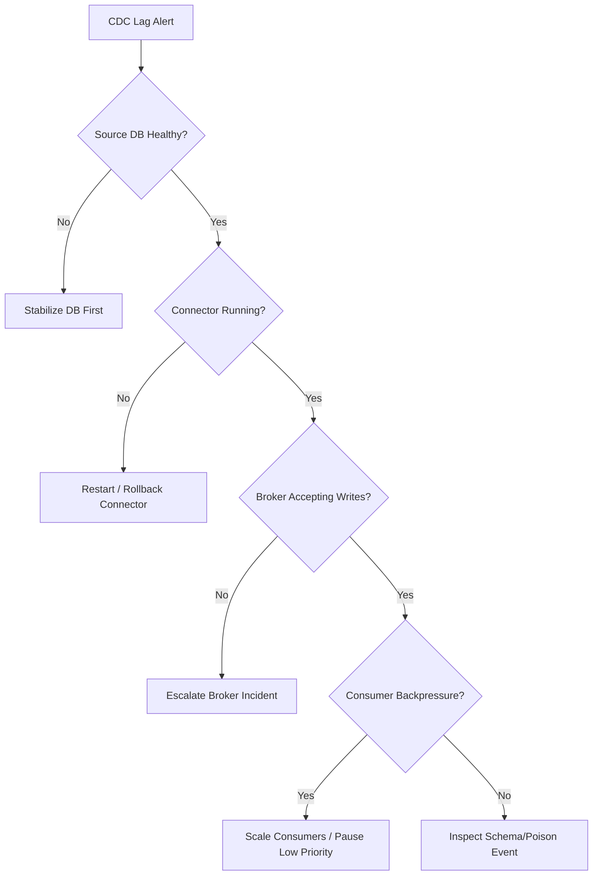

Actions:

1. protect source database disk first;
2. identify whether connector, broker, or consumer is bottleneck;
3. check recent schema changes;
4. check poison event/DLQ;
5. scale or pause non-critical consumers;
6. avoid dropping replication slot unless you accept data loss or have resnapshot/replay plan;
7. after recovery, validate projection consistency.

---

## 33. Runbook: Projection Drift

Symptoms:

- search result stale;
- dashboard count differs from OLTP;
- consumer checkpoint says caught up;
- data complaint from user/regulator.

Triage:

1. identify affected aggregate IDs;
2. compare source row, event log, consumer checkpoint, projection row;
3. determine if event missing, duplicate, old, failed, or applied incorrectly;
4. check aggregate version;
5. check DLQ and consumer logs;
6. repair by replaying affected events or rebuilding projection slice;
7. add invariant/checksum monitor.

Example reconciliation query:

```sql
SELECT
    c.id,
    c.lifecycle_state AS source_state,
    p.lifecycle_state AS projection_state,
    c.aggregate_version AS source_version,
    p.aggregate_version AS projection_version
FROM case_file c
JOIN case_projection p ON p.case_id = c.id
WHERE c.lifecycle_state IS DISTINCT FROM p.lifecycle_state
   OR c.aggregate_version <> p.aggregate_version;
```

---

## 34. Case Study: Enforcement Case Search Projection

Requirement:

- case search should update within 2 minutes;
- search results must respect tenant and sensitivity;
- stale search is acceptable for UI discovery;
- stale authorization is not acceptable;
- deleted/restricted cases must disappear quickly;
- full rebuild must be possible.

Design:

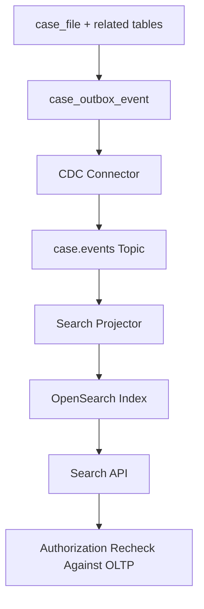

Event types:

- `CaseOpened`
- `CaseAssigned`
- `CaseStatusChanged`
- `CaseSensitivityChanged`
- `CaseClosed`
- `CaseDeleted`

Search document:

```json
{
  "case_id": "case-123",
  "tenant_id": "tenant-1",
  "case_number": "ENF-2026-000123",
  "current_status": "ESCALATED",
  "assigned_unit_id": "unit-7",
  "sensitivity_level": "RESTRICTED",
  "searchable_text": "...",
  "aggregate_version": 42,
  "last_event_id": "event-abc",
  "indexed_at": "2026-07-05T05:10:00Z"
}
```

Rules:

- document update is idempotent by `case_id` and `aggregate_version`;
- stale search results are filtered by final authorization check;
- `CaseSensitivityChanged` is high priority;
- `CaseDeleted` removes document;
- projection can be rebuilt from outbox/broker retention;
- projection lag is an SLO.

This is event-driven integration with clear correctness boundaries.

---

## 35. Architect-Level Heuristics

1. **Do not dual-write without a recovery pattern.** Use outbox, CDC, event sourcing, or a real distributed transaction.
2. **CDC is not automatically a domain event.** Storage change and business meaning are different.
3. **Consumers must be idempotent.** Duplicates are normal in reliable distributed systems.
4. **Ordering must be scoped.** Per-aggregate order is usually enough; global order is expensive.
5. **Design for exactly-once effect, not exactly-once fantasy.** External side effects still need idempotency.
6. **Snapshot + stream alignment is a correctness problem.** Do not hand-wave initial loads.
7. **Deletes require explicit semantics.** Tombstone, soft delete, hard delete, and archive are different.
8. **CDC lag is a database risk.** It can retain logs and hurt the source system.
9. **Replay is a product feature.** If you cannot replay, your projection is fragile.
10. **Sensitive data spreads through CDC.** Minimize and classify event payloads.

---

## 36. Final Mental Model

CDC and event-driven database integration are not messaging problems first.

They are **state propagation problems**.

The source database commits truth. The event pipeline carries facts or semantic events. Consumers create projections. Correctness depends on contract, idempotency, ordering, replay, and repair.

A top-tier database architect designs the entire propagation lifecycle:

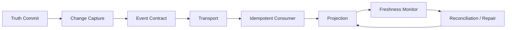

That is the difference between “we publish events” and “we operate a reliable data propagation architecture”.

---

## References

- PostgreSQL Documentation — Logical Decoding Concepts: https://www.postgresql.org/docs/current/logicaldecoding-explanation.html
- PostgreSQL Documentation — Logical Replication Subscriptions: https://www.postgresql.org/docs/current/logical-replication-subscription.html
- PostgreSQL Documentation — Replication Configuration: https://www.postgresql.org/docs/current/runtime-config-replication.html
- AWS Prescriptive Guidance — Transactional Outbox Pattern: https://docs.aws.amazon.com/prescriptive-guidance/latest/cloud-design-patterns/transactional-outbox.html
- Debezium Documentation — Outbox Event Router: https://debezium.io/documentation/reference/stable/transformations/outbox-event-router.html
- Confluent Documentation — Kafka Message Delivery Guarantees: https://docs.confluent.io/kafka/design/delivery-semantics.html
