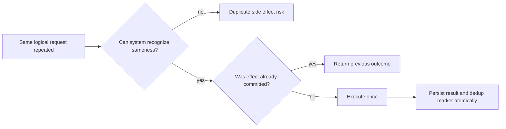
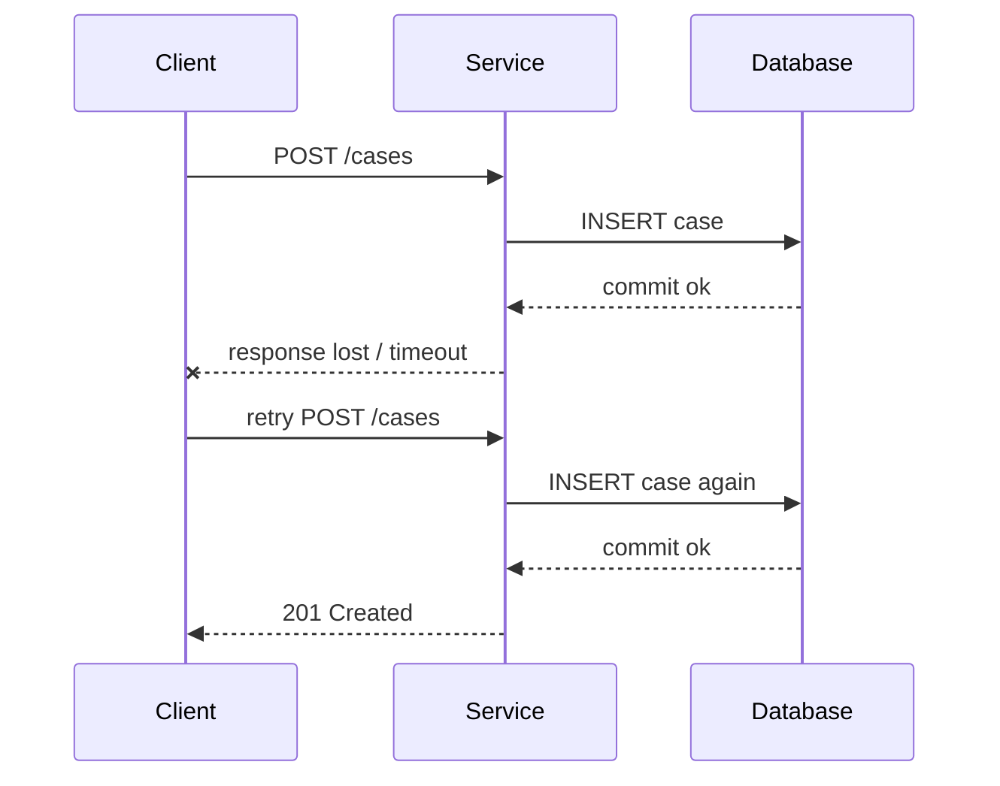
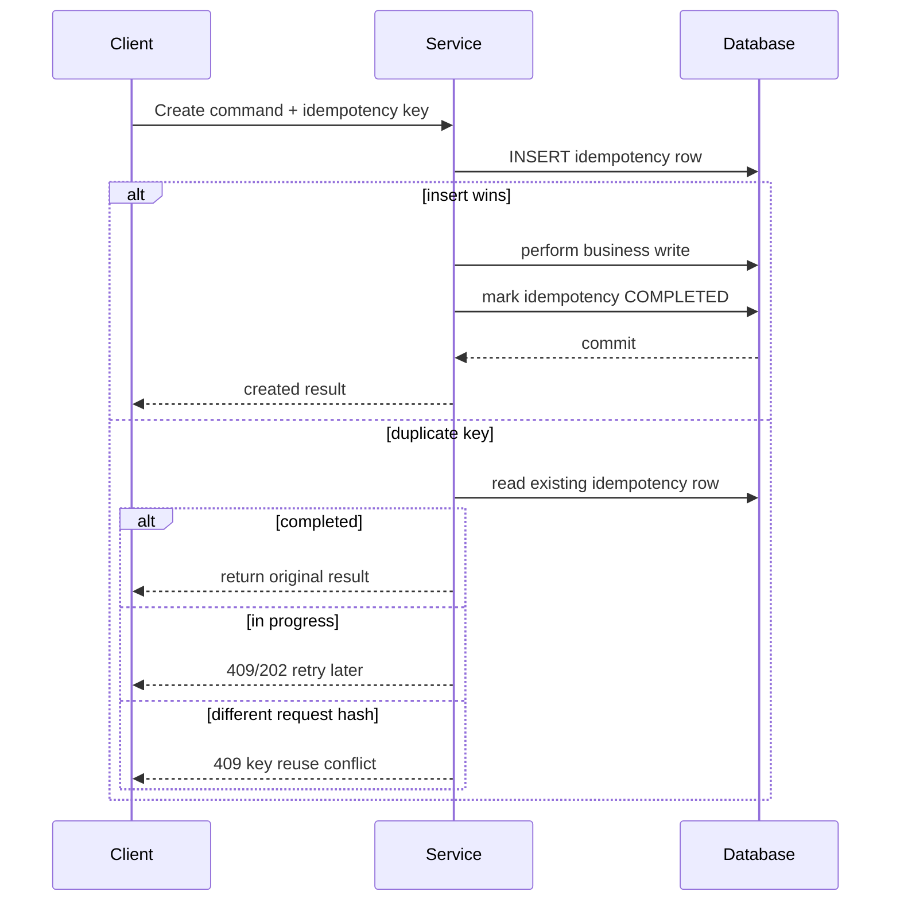
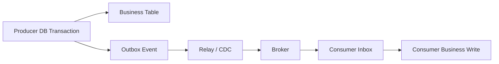
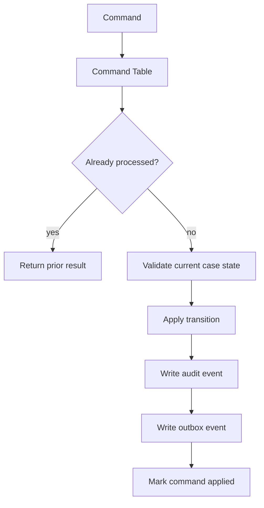
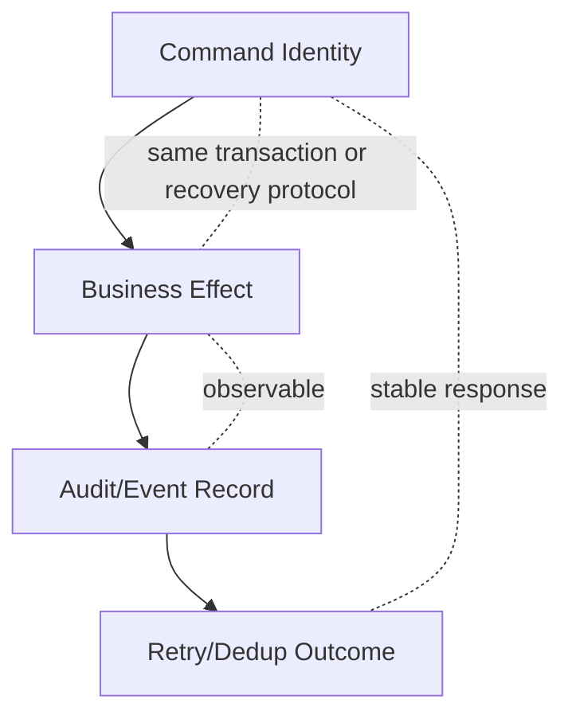

# Part 051 — Idempotency and Deduplication Design

A production database must survive retries.

Networks timeout. Clients retry. Load balancers replay. Workers crash after commit. Message brokers redeliver. External APIs return ambiguous failures. Humans click the same button twice. Batch jobs restart from the middle. CDC consumers resume from checkpoints. Webhooks arrive out of order.

If the write path is not idempotent, a normal retry becomes data corruption.

This part explains how to design idempotency and deduplication at the database boundary, with concrete schema patterns and failure-mode reasoning.

The goal is simple:

> The same logical command may be attempted many times, but the system must produce one valid business effect.

---

## 1. Core Mental Model

Idempotency is a semantic property.

Deduplication is one possible mechanism.

They are related but not the same.



A system is idempotent only when it can answer three questions safely:

1. **Identity** — is this request logically the same as a previous request?
2. **State** — did the previous request already complete, fail, or remain in progress?
3. **Outcome** — what response/result should a retry receive?

A UUID in an HTTP header is not idempotency by itself.

A unique index is not idempotency by itself.

A retry loop is not idempotency by itself.

The architect's job is to bind the logical command, database transaction, dedup marker, and response contract into one consistent protocol.

---

## 2. Why Retries Corrupt Data

Most corruption caused by retries is not dramatic. It is boring and silent.

Example duplicate effects:

- two payments created for one checkout;
- two enforcement cases opened for one complaint;
- two SLA timers started for one workflow transition;
- two notification records inserted;
- one ledger credit applied twice;
- one assignment consumed by two workers;
- one external callback processed twice;
- one outbox event projected twice into a search index;
- one batch import row creates duplicate master data.

The failure path usually looks like this:



From the client's perspective, it sent one logical command.

From the database's perspective, it received two independent inserts.

Without a durable idempotency boundary, both are valid writes.

---

## 3. Idempotency vs Deduplication vs Uniqueness

Use precise terms.

| Concept | Meaning | Typical Mechanism | Example |
|---|---|---|---|
| Idempotency | Repeating the same logical operation produces no additional side effect | Idempotency key + persisted result | Retry `CreatePayment` returns original payment |
| Deduplication | Detect and ignore an already-seen item | Unique event/message key | Consumer skips already processed message |
| Business uniqueness | Business domain allows only one record for a natural condition | Unique constraint/index | One active SLA per case |
| Commutativity | Applying operations in any order gives same result | Set-like operation, max/version update | Mark notification as read |
| Exactly-once effect | Business effect happens once despite at-least-once attempts | Transactional dedup + idempotent apply | Apply ledger entry once |

Important distinction:

- **Deduplication** says: “I have seen this input.”
- **Idempotency** says: “This repeated input should produce the same logical outcome.”
- **Uniqueness** says: “This business state must not have duplicates.”

You usually need all three in different places.

---

## 4. The Retry Threat Model

Before designing a table, enumerate duplicate sources.

### 4.1 Client-level retry

The client sends the same command again because it did not receive a response.

Common causes:

- HTTP timeout;
- mobile network drop;
- frontend double submit;
- reverse proxy retry;
- browser refresh;
- SDK retry policy;
- user manually retries.

### 4.2 Service-level retry

The service retries internal operations.

Common causes:

- transient DB error;
- serialization failure;
- deadlock retry;
- external dependency timeout;
- worker restart;
- scheduled job retry.

### 4.3 Broker-level redelivery

The broker intentionally redelivers because it cannot know whether the consumer finished.

Common causes:

- consumer crash after DB commit but before ack;
- rebalance;
- visibility timeout expiry;
- offset commit failure;
- manual replay.

### 4.4 CDC replay

A projection pipeline reprocesses changes.

Common causes:

- rebuilding search index;
- recovering from bad deployment;
- replaying outbox;
- restoring consumer state;
- snapshot + stream overlap.

### 4.5 Human and operational retry

Operators rerun scripts, imports, or corrective workflows.

Common causes:

- batch import partial failure;
- manual requeue;
- ticket reopened;
- support action repeated;
- data repair script rerun.

A database design that does not define duplicate behavior for each source is incomplete.

---

## 5. The Idempotency Contract

An idempotent command needs an explicit contract.

Minimum contract:

```text
same idempotency scope + same idempotency key + same request fingerprint
=> same logical command
=> at most one committed business effect
=> retry returns original result or stable status
```

The contract must define:

| Field | Question |
|---|---|
| Scope | Where is the key unique? Globally? Tenant? User? Endpoint? Aggregate? |
| Key | Who generates it? Client, service, batch process, broker? |
| Fingerprint | How do we detect same key with different payload? |
| TTL | How long do we remember completed keys? |
| In-progress behavior | Do duplicates wait, return 409, or poll status? |
| Failure behavior | Which failures are retryable and which are terminal? |
| Response behavior | Do retries return cached response, current resource, or status? |
| Side effect boundary | Which side effects are covered by the key? |

Do not say “idempotent” without answering these questions.

---

## 6. Idempotency Key Design

An idempotency key should identify a logical command, not a transport attempt.

Bad key candidates:

- database auto-increment ID generated after the insert;
- HTTP request timestamp;
- random request ID generated by a proxy per attempt;
- message offset alone;
- connection ID;
- session ID;
- full JSON payload hash without business scope.

Better key candidates:

- client-generated command ID;
- batch import row ID + import job ID;
- external payment intent ID;
- webhook provider event ID;
- aggregate ID + expected version + command type;
- tenant ID + source system + external reference;
- deterministic natural business key when the business operation is naturally unique.

### 6.1 Key scope

A key without scope is ambiguous.

Prefer explicit scoping:

```text
tenant_id + operation_name + idempotency_key
```

or:

```text
source_system + external_event_id
```

or:

```text
aggregate_type + aggregate_id + command_id
```

For public APIs, key scope is often:

```text
client/account + endpoint/operation + idempotency_key
```

This prevents accidental collision between unrelated operations using the same client-generated key.

### 6.2 Request fingerprint

The same key with a different payload is usually a bug or attack.

Store a stable fingerprint:

```text
sha256(canonical_json(request_body) + operation_name + api_version)
```

Then enforce:

- same key + same fingerprint = retry;
- same key + different fingerprint = conflict;
- new key = new command.

### 6.3 TTL

Idempotency data cannot always be stored forever.

TTL is safe only if the business can tolerate duplicates after expiry.

Examples:

| Operation | Suggested retention thinking |
|---|---|
| Payment creation | Long retention or external business reference uniqueness |
| Webhook event processing | Retain based on provider replay window + operational replay window |
| Batch import row | Retain as long as import job can be retried/reconciled |
| Notification send | Retain long enough to avoid duplicate user impact |
| Case creation from external complaint | Prefer permanent natural uniqueness on external complaint reference |

A dangerous TTL design says: “we forgot the key, so duplicate creation is allowed.”

For high-value effects, use business uniqueness in addition to idempotency TTL.

---

## 7. Canonical Table Pattern: Idempotency Request

A robust API write path usually uses an idempotency table.

```sql
CREATE TABLE idempotency_request (
    tenant_id           uuid        NOT NULL,
    operation_name      text        NOT NULL,
    idempotency_key     text        NOT NULL,
    request_hash        text        NOT NULL,
    status              text        NOT NULL CHECK (status IN (
                            'IN_PROGRESS',
                            'COMPLETED',
                            'FAILED_RETRYABLE',
                            'FAILED_TERMINAL'
                        )),
    resource_type       text,
    resource_id         uuid,
    response_code       integer,
    response_body       jsonb,
    error_code          text,
    locked_until        timestamptz,
    created_at          timestamptz NOT NULL DEFAULT now(),
    completed_at        timestamptz,
    expires_at          timestamptz,

    PRIMARY KEY (tenant_id, operation_name, idempotency_key)
);

CREATE INDEX idx_idempotency_request_expires_at
    ON idempotency_request (expires_at)
    WHERE expires_at IS NOT NULL;
```

The primary key is the concurrency control mechanism.

The row is not just a cache.

It is a durable command identity record.

---

## 8. Safe Create Flow

A common pattern is:

1. Insert idempotency row.
2. If insert wins, execute business write.
3. Store result in idempotency row in the same transaction or with a safe recovery protocol.
4. If insert loses, inspect existing row.
5. Return previous result, conflict, or in-progress response.



Implementation sketch:

```sql
-- Try to claim the command.
INSERT INTO idempotency_request (
    tenant_id,
    operation_name,
    idempotency_key,
    request_hash,
    status,
    locked_until,
    expires_at
)
VALUES (
    :tenant_id,
    'CreateCase',
    :idempotency_key,
    :request_hash,
    'IN_PROGRESS',
    now() + interval '2 minutes',
    now() + interval '30 days'
)
ON CONFLICT DO NOTHING;
```

If `rows_affected = 1`, this attempt owns the command.

If `rows_affected = 0`, read the existing row:

```sql
SELECT status,
       request_hash,
       resource_type,
       resource_id,
       response_code,
       response_body,
       locked_until
FROM idempotency_request
WHERE tenant_id = :tenant_id
  AND operation_name = 'CreateCase'
  AND idempotency_key = :idempotency_key;
```

Then decide:

| Existing row | Behavior |
|---|---|
| Hash differs | Reject: idempotency key reused for different command |
| `COMPLETED` | Return stored result or current resource representation |
| `IN_PROGRESS` and lock active | Return `202 Accepted`, `409 Conflict`, or retry-after |
| `IN_PROGRESS` and lock expired | Recovery path; do not blindly execute again without analysis |
| `FAILED_RETRYABLE` | Allow retry claim according to policy |
| `FAILED_TERMINAL` | Return stable terminal error |

---

## 9. Atomicity Boundary

A common mistake is storing idempotency in Redis while the business effect is stored in PostgreSQL.

That can work for low-value dedup, but it is not a correctness boundary.

If the dedup marker and business write are not committed atomically, there are gap failures.

### 9.1 Marker before effect

```text
write idempotency marker -> crash -> business effect never happened
```

Retry sees marker and may incorrectly skip execution.

### 9.2 Effect before marker

```text
write business effect -> crash -> marker missing
```

Retry may duplicate the effect.

### 9.3 Correctness rule

For high-value effects:

> The idempotency marker and the protected business effect must share the same durable transactional boundary, or there must be an explicit reconciliation protocol.

The simplest reliable design is same database, same transaction.

```sql
BEGIN;

-- claim idempotency key
-- insert business row
-- insert outbox event
-- mark idempotency completed

COMMIT;
```

---

## 10. Business Uniqueness as the Last Line of Defense

Idempotency keys are not enough.

A client can send two different keys for the same business operation.

Example:

```text
Create case for external complaint EXT-991
```

If the client retries with a new idempotency key, the idempotency table cannot know it is the same complaint unless business uniqueness also exists.

Use a unique constraint for natural business duplicates:

```sql
CREATE TABLE enforcement_case (
    case_id                 uuid PRIMARY KEY,
    tenant_id               uuid NOT NULL,
    source_system           text NOT NULL,
    external_complaint_id   text NOT NULL,
    status                  text NOT NULL,
    created_at              timestamptz NOT NULL DEFAULT now(),

    UNIQUE (tenant_id, source_system, external_complaint_id)
);
```

Then `CreateCase` can be safely retried even if the idempotency key changes:

```sql
INSERT INTO enforcement_case (
    case_id,
    tenant_id,
    source_system,
    external_complaint_id,
    status
)
VALUES (
    gen_random_uuid(),
    :tenant_id,
    :source_system,
    :external_complaint_id,
    'OPEN'
)
ON CONFLICT (tenant_id, source_system, external_complaint_id)
DO UPDATE SET external_complaint_id = EXCLUDED.external_complaint_id
RETURNING case_id;
```

Be careful: `ON CONFLICT DO UPDATE` should not mutate unrelated columns just to force `RETURNING`. In production, prefer a function or explicit read-after-conflict if mutation has audit implications.

---

## 11. Partial Unique Index for Conditional Idempotency

Some business uniqueness applies only for active state.

Example: one active SLA timer per case and SLA type.

```sql
CREATE TABLE case_sla_timer (
    timer_id        uuid PRIMARY KEY,
    tenant_id       uuid NOT NULL,
    case_id         uuid NOT NULL,
    sla_type        text NOT NULL,
    status          text NOT NULL CHECK (status IN ('ACTIVE', 'STOPPED', 'BREACHED')),
    started_at      timestamptz NOT NULL,
    stopped_at      timestamptz
);

CREATE UNIQUE INDEX uq_active_case_sla_timer
    ON case_sla_timer (tenant_id, case_id, sla_type)
    WHERE status = 'ACTIVE';
```

This is not merely a performance index.

It is a concurrency-safe invariant:

> At most one active timer exists for the same case and SLA type.

Without this, two workers can both check “no active timer” and both insert.

---

## 12. Dedup Table Pattern for Event Consumers

Consumers of at-least-once delivery need durable dedup.

```sql
CREATE TABLE processed_message (
    consumer_name       text        NOT NULL,
    message_id          text        NOT NULL,
    message_source      text        NOT NULL,
    message_hash        text,
    processed_at        timestamptz NOT NULL DEFAULT now(),
    result_status       text        NOT NULL CHECK (result_status IN ('APPLIED', 'IGNORED', 'FAILED_TERMINAL')),
    aggregate_type      text,
    aggregate_id        uuid,

    PRIMARY KEY (consumer_name, message_source, message_id)
);
```

Consumer flow:

```sql
BEGIN;

INSERT INTO processed_message (
    consumer_name,
    message_source,
    message_id,
    message_hash,
    result_status
)
VALUES (
    :consumer_name,
    :message_source,
    :message_id,
    :message_hash,
    'APPLIED'
)
ON CONFLICT DO NOTHING;

-- If insert did not happen, skip the message.
-- If insert happened, apply business effect in this same transaction.

COMMIT;
```

Important rule:

> Insert the dedup marker and apply the side effect in the same transaction.

Otherwise a crash can mark a message as processed without applying it, or apply it without marking it.

---

## 13. Inbox Pattern

The inbox pattern is a more structured version of consumer dedup.

Instead of processing directly from the broker, first persist inbound messages.

```sql
CREATE TABLE inbox_message (
    inbox_id        uuid PRIMARY KEY,
    source_system   text NOT NULL,
    message_id      text NOT NULL,
    message_type    text NOT NULL,
    aggregate_id    uuid,
    payload         jsonb NOT NULL,
    headers         jsonb NOT NULL DEFAULT '{}'::jsonb,
    received_at     timestamptz NOT NULL DEFAULT now(),
    status          text NOT NULL CHECK (status IN (
                        'RECEIVED',
                        'PROCESSING',
                        'PROCESSED',
                        'FAILED_RETRYABLE',
                        'FAILED_TERMINAL'
                    )),
    attempt_count   integer NOT NULL DEFAULT 0,
    next_attempt_at timestamptz,
    last_error      text,

    UNIQUE (source_system, message_id)
);
```

The inbox gives you:

- durable arrival record;
- dedup by source message ID;
- retry state;
- poison-message handling;
- operational inspection;
- replay without broker dependency;
- audit of consumed integrations.

Use an inbox when processing is complex, regulated, or operationally important.

---

## 14. Outbox + Inbox End-to-End

The outbox protects the producer from dual-write bugs.

The inbox protects the consumer from redelivery bugs.



Producer transaction:

```sql
BEGIN;

UPDATE enforcement_case
SET status = 'UNDER_REVIEW'
WHERE case_id = :case_id
  AND status = 'OPEN';

INSERT INTO outbox_event (
    event_id,
    aggregate_type,
    aggregate_id,
    event_type,
    aggregate_version,
    payload
)
VALUES (
    gen_random_uuid(),
    'EnforcementCase',
    :case_id,
    'CaseMovedUnderReview',
    :new_version,
    :payload
);

COMMIT;
```

Consumer transaction:

```sql
BEGIN;

INSERT INTO inbox_message (
    inbox_id,
    source_system,
    message_id,
    message_type,
    payload,
    status
)
VALUES (
    gen_random_uuid(),
    'case-service',
    :event_id,
    :event_type,
    :payload,
    'PROCESSING'
)
ON CONFLICT DO NOTHING;

-- If insert wins, apply projection/business effect.
-- If insert loses, skip.

UPDATE inbox_message
SET status = 'PROCESSED'
WHERE source_system = 'case-service'
  AND message_id = :event_id;

COMMIT;
```

This does not create magical exactly-once delivery.

It creates exactly-once business effect under a defined dedup key.

---

## 15. Idempotent Create Patterns

### 15.1 Create with client command ID

Best for APIs and mobile clients.

```sql
CREATE TABLE case_command (
    tenant_id       uuid NOT NULL,
    command_id      uuid NOT NULL,
    command_type    text NOT NULL,
    request_hash    text NOT NULL,
    case_id         uuid,
    status          text NOT NULL,
    created_at      timestamptz NOT NULL DEFAULT now(),
    completed_at    timestamptz,

    PRIMARY KEY (tenant_id, command_id)
);
```

Command ID is durable and auditable.

It can also become part of the business timeline.

### 15.2 Create with external natural reference

Best for integration imports.

```sql
CREATE TABLE external_case_reference (
    tenant_id           uuid NOT NULL,
    source_system       text NOT NULL,
    external_case_ref   text NOT NULL,
    case_id             uuid NOT NULL,
    first_seen_at        timestamptz NOT NULL DEFAULT now(),

    PRIMARY KEY (tenant_id, source_system, external_case_ref),
    UNIQUE (case_id)
);
```

### 15.3 Create with deterministic ID

Sometimes the resource ID can be generated from the business key.

```text
case_id = UUIDv5(namespace = tenant_id, name = source_system + ':' + external_ref)
```

This can simplify dedup but has tradeoffs:

- IDs become derivable;
- key format changes are painful;
- collision risk depends on algorithm and namespace;
- natural keys can be sensitive;
- business merge/split can complicate identity.

Use with caution.

---

## 16. Idempotent Update Patterns

Updates are more subtle than creates.

Two identical update requests may not be semantically identical if state changed between attempts.

### 16.1 Set operation

Setting a value is naturally idempotent if the same value is set repeatedly.

```sql
UPDATE user_notification
SET read_at = COALESCE(read_at, now())
WHERE notification_id = :notification_id;
```

But notice the subtlety: using `now()` changes on each execution. `COALESCE` prevents a retry from changing the original timestamp.

### 16.2 Compare-and-set operation

For state transitions, require expected state or version.

```sql
UPDATE enforcement_case
SET status = 'UNDER_REVIEW',
    version = version + 1,
    updated_at = now()
WHERE case_id = :case_id
  AND status = 'OPEN'
RETURNING case_id, status, version;
```

If no row is returned, decide whether:

- the command already succeeded;
- the case moved to an incompatible state;
- the request is stale;
- another worker won.

### 16.3 Command table for transitions

For regulated workflows, persist commands.

```sql
CREATE TABLE case_transition_command (
    tenant_id       uuid NOT NULL,
    command_id      uuid NOT NULL,
    case_id         uuid NOT NULL,
    from_status     text NOT NULL,
    to_status       text NOT NULL,
    requested_by    uuid NOT NULL,
    request_hash    text NOT NULL,
    result_status   text NOT NULL CHECK (result_status IN (
                        'IN_PROGRESS',
                        'APPLIED',
                        'REJECTED',
                        'FAILED_RETRYABLE'
                    )),
    applied_transition_id uuid,
    created_at      timestamptz NOT NULL DEFAULT now(),
    completed_at    timestamptz,

    PRIMARY KEY (tenant_id, command_id)
);
```

This gives you both idempotency and auditability.

---

## 17. Idempotent Append and Ledger Design

Appending is dangerous because duplicates look legitimate.

Bad pattern:

```sql
INSERT INTO ledger_entry (account_id, amount, direction)
VALUES (:account_id, :amount, 'CREDIT');
```

Retry duplicates money.

Better pattern:

```sql
CREATE TABLE ledger_entry (
    ledger_entry_id     uuid PRIMARY KEY,
    tenant_id           uuid NOT NULL,
    account_id          uuid NOT NULL,
    source_system       text NOT NULL,
    source_operation_id text NOT NULL,
    direction           text NOT NULL CHECK (direction IN ('DEBIT', 'CREDIT')),
    amount_cents        bigint NOT NULL CHECK (amount_cents > 0),
    currency_code       char(3) NOT NULL,
    posted_at           timestamptz NOT NULL DEFAULT now(),

    UNIQUE (tenant_id, source_system, source_operation_id)
);
```

The unique source operation ID is the idempotency boundary for the append.

If one logical debit/credit maps to multiple ledger rows, introduce a transaction group:

```sql
CREATE TABLE ledger_transaction (
    tenant_id           uuid NOT NULL,
    ledger_txn_id       uuid NOT NULL,
    source_system       text NOT NULL,
    source_operation_id text NOT NULL,
    created_at          timestamptz NOT NULL DEFAULT now(),

    PRIMARY KEY (tenant_id, ledger_txn_id),
    UNIQUE (tenant_id, source_system, source_operation_id)
);
```

---

## 18. Queue Claim Deduplication

Work queues need idempotent claim behavior.

Multiple workers may attempt to claim the same job.

```sql
UPDATE work_item
SET status = 'PROCESSING',
    claimed_by = :worker_id,
    claimed_at = now(),
    lease_until = now() + interval '5 minutes'
WHERE work_item_id = :work_item_id
  AND status = 'READY'
RETURNING *;
```

For batch claiming:

```sql
WITH next_jobs AS (
    SELECT work_item_id
    FROM work_item
    WHERE status = 'READY'
      AND available_at <= now()
    ORDER BY priority DESC, available_at ASC
    FOR UPDATE SKIP LOCKED
    LIMIT 100
)
UPDATE work_item w
SET status = 'PROCESSING',
    claimed_by = :worker_id,
    claimed_at = now(),
    lease_until = now() + interval '5 minutes'
FROM next_jobs n
WHERE w.work_item_id = n.work_item_id
RETURNING w.*;
```

The dedup rule is:

> A job is claimed by state transition, not by worker memory.

The database row is the claim authority.

---

## 19. Duplicate Detection Windows

Deduplication can be permanent or windowed.

| Dedup type | Use case | Risk |
|---|---|---|
| Permanent | Financial ledger, case creation from external reference | Storage growth |
| Long-window | Webhook events, import rows, notifications | Duplicate after TTL expiry |
| Short-window | UI double submit, transient job retry | Not enough for replay/import |
| No dedup, commutative operation | Mark read, set flag, max timestamp | Only safe for naturally idempotent effects |

Design storage according to risk.

For permanent dedup, use compact keys and partition/archive if needed.

For windowed dedup, explicitly define duplicate behavior after expiry.

---

## 20. Payload Hash and Conflict Detection

Never allow the same idempotency key to mean two different commands.

Example conflict:

```text
Key: abc123
Request A: create payment for $10
Request B: create payment for $99
```

Safe behavior:

```sql
SELECT request_hash
FROM idempotency_request
WHERE tenant_id = :tenant_id
  AND operation_name = :operation_name
  AND idempotency_key = :idempotency_key;
```

If hash differs, reject.

Do not silently return the old result.

Do not silently run the new request.

Return a stable conflict response.

---

## 21. In-Progress Recovery

`IN_PROGRESS` rows are hard.

They can mean:

- a request is currently executing;
- a request crashed before business write;
- a request committed business write but crashed before marking completed;
- a transaction is still open;
- a worker is dead;
- the database rolled back.

Avoid naive recovery.

### 21.1 Same transaction completion

Best case:

```sql
BEGIN;
-- claim idempotency
-- business write
-- mark completed
COMMIT;
```

If the transaction rolls back, both marker and write disappear.

If it commits, both exist.

### 21.2 Separate transaction recovery

Sometimes response body is updated after business commit.

Then recovery must inspect business state.

Example:

```sql
SELECT case_id
FROM enforcement_case
WHERE tenant_id = :tenant_id
  AND source_system = :source_system
  AND external_complaint_id = :external_complaint_id;
```

If business row exists, mark idempotency completed.

If not, allow retry claim.

This requires a business uniqueness constraint. Without it, recovery is guesswork.

---

## 22. Response Storage Strategy

A retry needs an outcome.

Options:

| Strategy | Use when | Tradeoff |
|---|---|---|
| Store full response | Public API must return exact original response | Larger table, response schema versioning |
| Store resource reference | Response can be rebuilt from current resource | Current state may differ from original response |
| Store status only | Async command returns status endpoint | Client must poll |
| Store error code | Terminal validation errors must remain stable | Must avoid caching transient failures as terminal |

For long-lived business systems, storing `resource_type + resource_id + response_code` is usually more maintainable than storing huge response JSON forever.

For public payment-like APIs, exact response caching may be required for client expectations.

---

## 23. Retry Classification

Not every failure should be retried.

Classify failures:

| Failure | Retry? | Idempotency state |
|---|---|---|
| Network timeout before service received request | Yes | no row or unknown |
| DB serialization failure before commit | Yes | transaction rolled back |
| Deadlock victim | Yes | transaction rolled back |
| Unique conflict due to duplicate business key | Maybe return existing resource | completed-equivalent |
| Validation error | No unless payload changes | terminal failure |
| Authorization error | Usually no | terminal or not persisted |
| External dependency timeout after local commit | Needs recovery | ambiguous |
| Crash after DB commit before response | Yes | should return committed result |

A robust idempotency design is also a retry policy design.

---

## 24. Idempotency and External Side Effects

External calls are dangerous because they do not share your database transaction.

Example:

```text
DB insert payment_request -> call external PSP -> DB update result
```

Failures:

- external call succeeds but DB update fails;
- DB commit succeeds but external call not made;
- client retries while external operation still unknown;
- provider sends webhook before local state is ready.

Use one of these patterns:

### 24.1 External provider idempotency key

Pass your command ID to the provider if supported.

```text
payment_command.command_id -> provider idempotency key
```

Then provider retries are safe too.

### 24.2 Local command state machine

```text
REQUESTED -> SENT_TO_PROVIDER -> CONFIRMED -> FAILED
```

Store provider reference and webhook event IDs.

### 24.3 Reconciliation job

For ambiguous state, query provider by your idempotency key or external reference.

Do not guess.

---

## 25. Idempotency for Batch Imports

Batch imports are a major duplicate source.

Bad import design:

```text
for each row:
  insert customer
```

Better import design:

```sql
CREATE TABLE import_job (
    import_job_id   uuid PRIMARY KEY,
    tenant_id       uuid NOT NULL,
    source_name     text NOT NULL,
    status          text NOT NULL,
    created_at      timestamptz NOT NULL DEFAULT now()
);

CREATE TABLE import_row_result (
    import_job_id       uuid NOT NULL REFERENCES import_job(import_job_id),
    row_number          integer NOT NULL,
    source_row_hash     text NOT NULL,
    natural_key         text,
    target_type         text,
    target_id           uuid,
    status              text NOT NULL CHECK (status IN ('PENDING', 'APPLIED', 'SKIPPED', 'FAILED')),
    error_code          text,

    PRIMARY KEY (import_job_id, row_number)
);
```

Then every row has durable processing state.

If a job restarts, it resumes rather than repeats blindly.

For cross-job dedup, use natural business keys in target tables.

---

## 26. Idempotency for Case Management

Regulatory/case-management systems have high duplicate risk.

Common duplicate-triggering actions:

- create case from complaint;
- assign case to officer;
- escalate case;
- submit evidence;
- approve enforcement action;
- start SLA timer;
- send official notice;
- generate report/export;
- close/reopen case.

Recommended design:



A command table is often better than a generic idempotency table for high-value workflows because it becomes part of the audit trail.

---

## 27. Anti-Patterns

### 27.1 “We use UUID primary keys, so duplicates cannot happen”

UUID prevents accidental primary-key collision.

It does not prevent two rows representing the same business fact.

### 27.2 “The frontend disables the button”

Frontend prevention is UX, not correctness.

Users can refresh, retry, automate, or bypass the frontend.

### 27.3 “Kafka guarantees exactly once”

Broker semantics do not automatically make your database side effects exactly once.

Your consumer still needs dedup/idempotent apply.

### 27.4 “We dedup in memory”

In-memory dedup fails across restarts, scale-out, deployment, and replay.

Use it only as an optimization, not as correctness.

### 27.5 “We use timestamp-based duplicate detection”

Time-window heuristics are weak.

Two legitimate operations can happen close together, and duplicates can arrive outside the window.

### 27.6 “We catch unique violation and ignore it”

A unique violation means a conflict occurred.

You must know whether it means:

- duplicate retry;
- business duplicate;
- race winner;
- invalid request;
- malicious key reuse;
- stale command.

Ignoring it hides bugs.

---

## 28. Testing Idempotency

Test the failure paths, not just the happy path.

### 28.1 Duplicate sequential request

```text
send same command twice
expect one business effect
expect same response or stable status
```

### 28.2 Duplicate concurrent request

```text
send same command from 20 threads
expect one winner
expect 19 retries/conflicts/previous result
expect no duplicate business rows
```

### 28.3 Same key different payload

```text
send key K with payload A
send key K with payload B
expect conflict
```

### 28.4 Crash after business write

Inject failure after business insert but before response.

Retry should return existing result.

### 28.5 Broker redelivery

Process same message twice.

Expect one side effect and one dedup record.

### 28.6 Replay

Replay historical outbox/inbox messages.

Projection should converge to same state.

### 28.7 TTL expiry

Expire dedup key.

Verify whether duplicate effect is still prevented by business uniqueness or explicitly allowed.

---

## 29. Observability

Track idempotency as a first-class system health area.

Metrics:

- idempotency claims created;
- duplicate retries served;
- key reuse conflicts;
- in-progress stale rows;
- retryable failures;
- terminal failures;
- dedup hits per consumer;
- unique constraint conflict rate;
- outbox replay count;
- inbox poison messages;
- command recovery count.

Logs should include:

- operation name;
- idempotency key hash, not necessarily raw key;
- tenant/account;
- resource ID;
- command status;
- request hash;
- correlation ID;
- outcome.

Alerts:

- sudden spike in duplicate requests;
- increasing stale `IN_PROGRESS` rows;
- high key reuse conflicts;
- outbox/inbox retry backlog;
- dedup table growth beyond retention plan.

---

## 30. Review Checklist

Use this during design review.

### Command identity

- What is the logical command?
- Who generates the idempotency key?
- What is the uniqueness scope?
- Is the key stable across retries?
- Is the key independent from transport attempts?

### Payload safety

- Do we store request fingerprint?
- What happens if the same key arrives with different payload?
- Is request canonicalization deterministic?

### Atomicity

- Are dedup marker and business effect committed atomically?
- If not, what is the recovery protocol?
- Can a crash create marker-without-effect?
- Can a crash create effect-without-marker?

### Business uniqueness

- Is there a natural duplicate condition?
- Is it enforced with a database constraint/index?
- Does idempotency still work if client sends a new key?

### Response behavior

- What response does a retry receive?
- Do we cache full response, resource reference, or status?
- Are terminal errors cached?
- Are transient failures cached incorrectly?

### Retention

- How long are keys retained?
- What happens after expiry?
- Is expiry compliant with audit/retention requirements?
- Is storage growth bounded?

### Consumers

- What is the message dedup key?
- Is dedup persisted before ack?
- Are dedup and side effect in the same transaction?
- Can replay safely reprocess messages?

### Operations

- How do we inspect stuck commands?
- How do we recover stale `IN_PROGRESS` rows?
- How do we reconcile external ambiguous outcomes?
- What metrics prove idempotency is working?

---

## 31. Practical Design Heuristics

Use these defaults unless the domain says otherwise:

1. Public API write command → require idempotency key.
2. External import → use source system + external ID uniqueness.
3. Event consumer → persist processed message ID in same transaction as effect.
4. High-value append → enforce source operation uniqueness.
5. Workflow transition → persist command ID and transition result.
6. External API call → propagate idempotency key to provider if possible.
7. Retryable job → claim work by database state transition.
8. Low-value notification → dedup by recipient + template + business event ID.
9. Rebuildable projection → use deterministic upsert keyed by source event/resource.
10. Financial/regulatory effect → never rely on cache-only dedup.

---

## 32. Final Mental Model

Idempotency is not a library feature.

It is a database design property.

A retry-safe system has four durable records:



When you design idempotency, ask:

- What is the logical command?
- What state change does it authorize?
- What unique fact proves it has already happened?
- What result should a retry receive?
- What happens if a process crashes at every boundary?

A top-level database architect does not try to prevent retries.

They make retries boring.

---

## References

- PostgreSQL Documentation — Constraints: https://www.postgresql.org/docs/current/ddl-constraints.html
- PostgreSQL Documentation — INSERT / ON CONFLICT: https://www.postgresql.org/docs/current/sql-insert.html
- PostgreSQL Documentation — Explicit Locking: https://www.postgresql.org/docs/current/explicit-locking.html
- Stripe API Reference — Idempotent Requests: https://docs.stripe.com/api/idempotent_requests
- AWS Lambda Powertools — Idempotency: https://docs.aws.amazon.com/powertools/python/latest/utilities/idempotency/
- AWS Prescriptive Guidance — Transactional Outbox Pattern: https://docs.aws.amazon.com/prescriptive-guidance/latest/cloud-design-patterns/transactional-outbox.html
