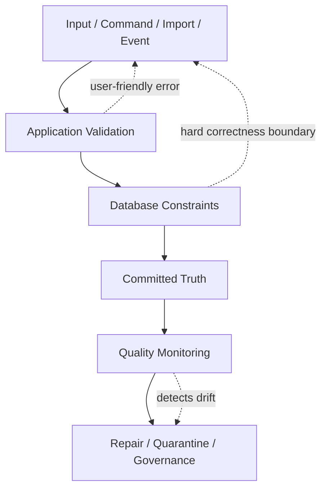
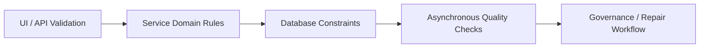
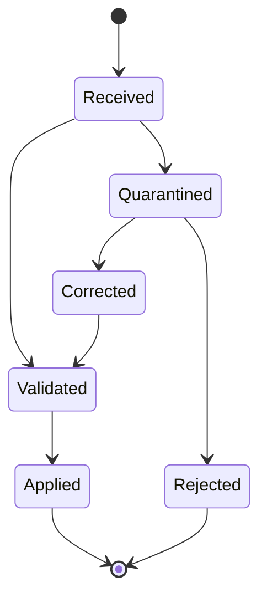
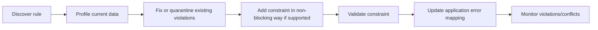
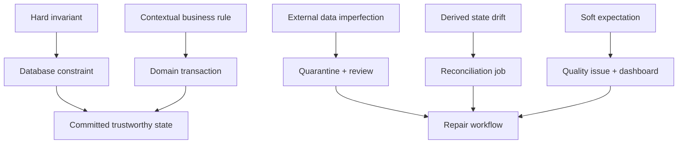

# Part 052 — Data Quality and Constraint Strategy

Data quality is not an analytics problem only.

It starts at the operational database.

If invalid state enters the source of truth, every downstream system becomes a negotiation with historical damage: reports disagree, workflows branch incorrectly, audits become expensive, search projections drift, ML features learn garbage, and support teams compensate manually.

A strong database architect treats quality as a layered enforcement strategy.

Not all quality rules belong in the database.

But every critical invariant needs an explicit owner, enforcement point, monitoring path, and repair path.

This part explains how to design that strategy.

---

## 1. Core Mental Model

A database is not just a place where data is stored.

It is a boundary where impossible states should be rejected.



The key design question is:

> Which rules must be impossible to violate, and which rules are allowed to be detected and repaired later?

A constraint strategy separates:

- **hard invariants** — must never be violated;
- **soft expectations** — should usually hold, but exceptions exist;
- **quality signals** — useful indicators, not write blockers;
- **repairable defects** — accepted temporarily with workflow to resolve;
- **historical defects** — invalid legacy data that must be isolated.

Without this classification, teams either under-constrain everything or over-constrain the wrong things.

---

## 2. Data Quality Dimensions

Use data quality dimensions to reason clearly.

| Dimension | Question | Example |
|---|---|---|
| Validity | Does the value fit the allowed domain? | `amount_cents > 0` |
| Completeness | Is required data present? | `case.opened_at IS NOT NULL` |
| Uniqueness | Is this fact duplicated? | one active SLA timer per case |
| Consistency | Do related facts agree? | closed case must have `closed_at` |
| Referential integrity | Does reference point to existing row? | `case_id` exists |
| Temporal correctness | Do effective periods overlap illegally? | one active policy per account per time |
| Accuracy | Does data reflect the real world? | address is current |
| Timeliness | Is data updated within expected time? | risk score refreshed in 24h |
| Freshness | Is projection/report sufficiently recent? | search index lag < 60s |
| Lineage | Can origin/transformation be explained? | report value sourced from transaction X |
| Security classification | Is sensitivity known? | PII fields tagged |
| Auditability | Can changes be reconstructed? | before/after or event history exists |

Database constraints are excellent for validity, completeness, uniqueness, referential integrity, and many temporal rules.

They are weaker for real-world accuracy, freshness, semantic correctness, and cross-system lineage.

That does not make those rules unimportant. It means they need additional enforcement layers.

---

## 3. Constraint Strategy: The Layered Model

Do not ask only: “Should this rule be in the database?”

Ask: “Where is the cheapest reliable place to enforce this rule, and what happens if that layer fails?”



| Layer | Strength | Weakness | Best for |
|---|---|---|---|
| UI validation | Fast feedback | Bypassable | usability, formatting hints |
| API validation | Clear errors | Race-prone alone | request shape, user messages |
| Service/domain logic | Context-rich | Not universal if multiple writers | complex business rules |
| Database constraint | Universal, concurrent-safe | Less expressive, harder migrations | hard invariants |
| Trigger/procedure | Close to data | Can hide complexity | derived integrity, audit hooks |
| Async quality job | Broad checks | Detects after damage | cross-system or soft rules |
| Data catalog/governance | Organizational memory | Not enforcement by itself | ownership, classification, lineage |

Hard truth:

> If multiple writers can touch the data, application-only validation is not a correctness boundary.

---

## 4. Constraint Taxonomy

### 4.1 Type constraints

The column type is the first constraint.

Bad:

```sql
amount text
created_at text
is_active text
metadata text
```

Better:

```sql
amount_cents bigint NOT NULL
created_at timestamptz NOT NULL
is_active boolean NOT NULL
metadata jsonb NOT NULL DEFAULT '{}'::jsonb
```

A type is a statement about allowed values, operations, indexes, and semantics.

### 4.2 NOT NULL constraints

`NULL` means unknown, missing, not applicable, not yet known, intentionally hidden, or bug — unless you define it.

Use `NOT NULL` for required facts.

```sql
ALTER TABLE enforcement_case
    ALTER COLUMN opened_at SET NOT NULL;
```

Avoid nullable columns for required lifecycle facts.

If a field becomes required only after a state transition, model it explicitly.

### 4.3 CHECK constraints

Use `CHECK` for row-local rules.

```sql
CREATE TABLE penalty (
    penalty_id      uuid PRIMARY KEY,
    amount_cents    bigint NOT NULL CHECK (amount_cents > 0),
    currency_code   char(3) NOT NULL CHECK (currency_code ~ '^[A-Z]{3}$'),
    issued_at       timestamptz NOT NULL
);
```

Good for:

- positive amounts;
- allowed numeric ranges;
- simple status domains;
- date ordering inside one row;
- mutually dependent columns in one row.

Example conditional rule:

```sql
ALTER TABLE enforcement_case
ADD CONSTRAINT chk_closed_case_has_closed_at
CHECK (
    (status <> 'CLOSED') OR (closed_at IS NOT NULL)
);
```

### 4.4 UNIQUE constraints and indexes

Use uniqueness for identity and business duplicate prevention.

```sql
CREATE TABLE party (
    party_id       uuid PRIMARY KEY,
    tenant_id      uuid NOT NULL,
    source_system  text NOT NULL,
    external_ref   text NOT NULL,
    display_name   text NOT NULL,

    UNIQUE (tenant_id, source_system, external_ref)
);
```

Unique constraints are correctness tools, not just indexing tools.

### 4.5 Partial unique indexes

Use when uniqueness applies only to a subset.

```sql
CREATE UNIQUE INDEX uq_case_active_assignment
ON case_assignment (tenant_id, case_id)
WHERE ended_at IS NULL;
```

This enforces:

> A case can have only one active assignment.

### 4.6 Foreign keys

Use foreign keys when referential integrity is local to the database boundary.

```sql
CREATE TABLE case_evidence (
    evidence_id uuid PRIMARY KEY,
    case_id     uuid NOT NULL REFERENCES enforcement_case(case_id),
    file_id     uuid NOT NULL,
    added_at    timestamptz NOT NULL DEFAULT now()
);
```

Foreign keys protect against orphaned rows.

They also encode ownership and lifecycle coupling.

Do not omit FKs because “the application handles it” unless you have a specific scaling, ownership, or cross-database reason — and then document the alternative integrity mechanism.

### 4.7 Exclusion constraints

Use exclusion constraints for non-overlap and range conflicts.

Example: no overlapping active policy periods for the same tenant and policy key.

```sql
CREATE EXTENSION IF NOT EXISTS btree_gist;

CREATE TABLE policy_assignment (
    policy_assignment_id uuid PRIMARY KEY,
    tenant_id            uuid NOT NULL,
    policy_key           text NOT NULL,
    effective_range      tstzrange NOT NULL,

    EXCLUDE USING gist (
        tenant_id WITH =,
        policy_key WITH =,
        effective_range WITH &&
    )
);
```

This is far safer than “check first, then insert” application logic.

### 4.8 Generated columns

Use generated columns to centralize deterministic derivations.

```sql
CREATE TABLE person_name (
    person_id   uuid PRIMARY KEY,
    first_name  text NOT NULL,
    last_name   text NOT NULL,
    full_name   text GENERATED ALWAYS AS (first_name || ' ' || last_name) STORED
);
```

Generated columns can reduce drift when a derived value is needed for indexing/querying.

### 4.9 Deferrable constraints

Some constraints should be checked at transaction commit, not per statement.

Useful when importing cyclic references or performing multi-row transformations.

```sql
ALTER TABLE case_relation
ADD CONSTRAINT fk_case_relation_parent
FOREIGN KEY (parent_case_id)
REFERENCES enforcement_case(case_id)
DEFERRABLE INITIALLY DEFERRED;
```

Use sparingly. Deferrable constraints increase transaction reasoning complexity.

---

## 5. Invariant Classification

Map rules to enforcement type.

| Invariant | Best enforcement |
|---|---|
| Amount must be positive | `CHECK` |
| Case ID must exist for evidence | `FOREIGN KEY` |
| One active assignment per case | partial unique index |
| Valid status value | lookup table or `CHECK` |
| Closed case must have close timestamp | `CHECK` |
| Close timestamp must be after open timestamp | `CHECK` |
| Active effective periods must not overlap | exclusion constraint |
| User can access case only if assigned/authorized | RLS/app authorization/policy table |
| Case must have at least one evidence item before enforcement action | transaction/domain logic + possible trigger |
| Risk score must refresh daily | async quality monitor |
| Address must be real | external validation + quality status |
| Report total must match ledger | reconciliation job |

The rule of thumb:

> If a rule is row-local, timeless, and universally true, prefer a database constraint.

> If a rule depends on workflow state, multiple rows, external services, or human interpretation, combine domain logic with durable audit/quality checks.

---

## 6. Constraint as Concurrency Control

Constraints are not only validation.

They prevent race conditions.

Bad pattern:

```sql
SELECT count(*)
FROM case_assignment
WHERE case_id = :case_id
  AND ended_at IS NULL;

-- if count = 0, insert assignment
```

Two concurrent transactions can both see zero.

Correct pattern:

```sql
CREATE UNIQUE INDEX uq_case_active_assignment
ON case_assignment (case_id)
WHERE ended_at IS NULL;
```

Then concurrent inserts cannot both commit.

A database constraint turns a race into a controlled conflict.

Your application can catch the conflict and return a meaningful domain error.

---

## 7. Status and Enum Strategy

Status fields are dangerous because they grow silently.

Options:

| Strategy | Use when | Tradeoff |
|---|---|---|
| `CHECK (status IN (...))` | Small stable status set | Migration needed for new values |
| Lookup/reference table | Values have metadata/lifecycle | More joins, governance required |
| Native enum | Very stable values, DB-specific comfort | Harder evolution in some engines |
| Free text | Almost never for state | No integrity |

For workflow states, prefer explicit lifecycle modelling.

```sql
CREATE TABLE case_status_type (
    status_code text PRIMARY KEY,
    is_terminal boolean NOT NULL,
    display_order integer NOT NULL,
    description text NOT NULL
);

CREATE TABLE enforcement_case (
    case_id uuid PRIMARY KEY,
    status_code text NOT NULL REFERENCES case_status_type(status_code)
);
```

But a lookup table alone does not enforce legal transitions.

Transition legality needs a state transition table or domain logic.

---

## 8. Conditional Required Fields

Many systems abuse nullable columns because fields become required only in some states.

Example:

- `closed_at` required only when status is `CLOSED`;
- `assigned_to` required only when status is `ASSIGNED`;
- `rejection_reason` required only when decision is `REJECTED`.

Use row-local `CHECK` constraints when simple:

```sql
ALTER TABLE enforcement_case
ADD CONSTRAINT chk_case_closed_fields
CHECK (
    status <> 'CLOSED'
    OR (closed_at IS NOT NULL AND closure_reason IS NOT NULL)
);
```

Use separate subtype/detail tables when fields are numerous or lifecycle-specific:

```sql
CREATE TABLE case_closure (
    case_id         uuid PRIMARY KEY REFERENCES enforcement_case(case_id),
    closed_at       timestamptz NOT NULL,
    closed_by       uuid NOT NULL,
    closure_reason  text NOT NULL,
    closure_summary text NOT NULL
);
```

This often produces cleaner models than 40 nullable columns on the main table.

---

## 9. Cross-Row Quality Rules

Some rules span rows.

Examples:

- at least one active owner for each active case;
- total allocation percentage equals 100%;
- ledger debit total equals credit total;
- no duplicate person after fuzzy matching;
- every enforcement decision has at least one supporting evidence item.

Enforcement options:

| Option | Use when |
|---|---|
| Unique/exclusion constraint | rule can be expressed declaratively |
| Transactional stored procedure | all writes go through controlled DB function |
| Domain service transaction | rule needs rich application context |
| Trigger | rule must be close to data and universal |
| Deferred validation job | rule is expensive, soft, or cross-system |
| Reconciliation process | rule may be temporarily inconsistent but must converge |

Be explicit about temporary inconsistency.

If a rule is checked asynchronously, define:

- acceptable delay;
- severity;
- owner;
- repair workflow;
- escalation path;
- dashboard/alert.

---

## 10. Data Quality State Model

Not all bad data should be rejected immediately.

For imports and external feeds, quarantine is often better.



Example tables:

```sql
CREATE TABLE inbound_record (
    inbound_record_id uuid PRIMARY KEY,
    source_system     text NOT NULL,
    source_record_id  text NOT NULL,
    payload           jsonb NOT NULL,
    status            text NOT NULL CHECK (status IN (
                         'RECEIVED',
                         'VALIDATED',
                         'QUARANTINED',
                         'APPLIED',
                         'REJECTED'
                       )),
    received_at       timestamptz NOT NULL DEFAULT now(),
    validated_at      timestamptz,
    applied_at        timestamptz,

    UNIQUE (source_system, source_record_id)
);

CREATE TABLE inbound_record_quality_issue (
    issue_id          uuid PRIMARY KEY,
    inbound_record_id uuid NOT NULL REFERENCES inbound_record(inbound_record_id),
    severity          text NOT NULL CHECK (severity IN ('INFO', 'WARNING', 'ERROR', 'BLOCKER')),
    field_path        text,
    issue_code        text NOT NULL,
    issue_message     text NOT NULL,
    detected_at       timestamptz NOT NULL DEFAULT now(),
    resolved_at       timestamptz
);
```

This keeps bad external data out of canonical tables while preserving traceability.

---

## 11. Quality Gates

A quality gate is a decision point.

Examples:

| Gate | Blocks? | Example |
|---|---:|---|
| API request validation | yes | missing required field |
| DB constraint | yes | duplicate active assignment |
| Import pre-validation | maybe | malformed external payload |
| Workflow transition guard | yes | cannot close case without decision |
| Reporting quality check | maybe | missing dimension mapping |
| Analytics freshness check | no/write warning | projection lag above SLA |
| Reconciliation check | escalates | ledger imbalance |

A quality gate must define:

- rule name;
- owner;
- enforcement point;
- severity;
- blocking/non-blocking behavior;
- error message;
- repair instruction;
- observability metric.

Without this, “data quality” becomes a vague complaint after production incidents.

---

## 12. Quality Rule Catalog

For serious systems, maintain a catalog.

```sql
CREATE TABLE data_quality_rule (
    rule_id          text PRIMARY KEY,
    rule_name        text NOT NULL,
    domain_area      text NOT NULL,
    target_entity    text NOT NULL,
    severity         text NOT NULL CHECK (severity IN ('INFO', 'WARNING', 'ERROR', 'BLOCKER')),
    enforcement_layer text NOT NULL CHECK (enforcement_layer IN (
                        'DATABASE_CONSTRAINT',
                        'DOMAIN_SERVICE',
                        'IMPORT_VALIDATION',
                        'ASYNC_MONITOR',
                        'MANUAL_REVIEW'
                    )),
    is_blocking      boolean NOT NULL,
    owner_team       text NOT NULL,
    description      text NOT NULL,
    repair_playbook  text,
    created_at       timestamptz NOT NULL DEFAULT now()
);
```

A catalog connects design intent to operations.

It helps answer:

- Which rules are hard constraints?
- Which quality failures are currently open?
- Who owns repair?
- Which rules changed recently?
- Which reports depend on this rule?

---

## 13. Data Quality Issue Table

Persist quality defects as first-class records.

```sql
CREATE TABLE data_quality_issue (
    issue_id          uuid PRIMARY KEY,
    rule_id           text NOT NULL REFERENCES data_quality_rule(rule_id),
    entity_type       text NOT NULL,
    entity_id         text NOT NULL,
    severity          text NOT NULL,
    status            text NOT NULL CHECK (status IN (
                         'OPEN',
                         'ACKNOWLEDGED',
                         'IN_REPAIR',
                         'RESOLVED',
                         'WAIVED'
                       )),
    detected_at       timestamptz NOT NULL DEFAULT now(),
    resolved_at       timestamptz,
    waiver_reason     text,
    evidence          jsonb NOT NULL DEFAULT '{}'::jsonb
);

CREATE INDEX idx_data_quality_issue_open
ON data_quality_issue (rule_id, severity, detected_at)
WHERE status IN ('OPEN', 'ACKNOWLEDGED', 'IN_REPAIR');
```

This moves data quality from “someone noticed a bad report” to managed operational work.

---

## 14. Constraint Naming Strategy

Constraint names are part of your API to operators and application error mapping.

Bad:

```text
users_email_key
chk_197238
constraint_42
```

Better:

```text
uq_user_email_per_tenant
chk_penalty_amount_positive
fk_evidence_case
excl_policy_assignment_no_overlap
```

When the application catches a database exception, the constraint name can map to a domain error:

| Constraint | Domain error |
|---|---|
| `uq_active_case_assignment` | case already has active assignment |
| `chk_penalty_amount_positive` | penalty amount must be positive |
| `fk_evidence_case` | case does not exist |
| `excl_policy_assignment_no_overlap` | policy period overlaps existing assignment |

Good names make production incidents faster to diagnose.

---

## 15. Error Mapping

Database errors should not leak raw SQL to users.

But they should not be swallowed either.

Application mapping example:

```text
SQLSTATE 23505 + constraint uq_active_case_assignment
=> HTTP 409 / CASE_ALREADY_ASSIGNED

SQLSTATE 23514 + constraint chk_closed_case_has_closed_at
=> HTTP 400 / CLOSED_CASE_REQUIRES_CLOSE_TIMESTAMP

SQLSTATE 23503 + constraint fk_evidence_case
=> HTTP 404 or 409 / CASE_NOT_FOUND_OR_NOT_ACCESSIBLE
```

This turns constraints into part of the domain contract.

---

## 16. Migration Strategy for New Constraints

Adding constraints to an existing production table is risky because historical data may already violate the rule.

Use a staged approach:



For PostgreSQL, patterns include:

- add nullable column;
- backfill in chunks;
- add `CHECK ... NOT VALID`;
- validate later;
- create index concurrently;
- add unique constraint using existing index where applicable;
- use short lock timeouts;
- deploy application compatibility first.

Never add a constraint blindly to a large production table without profiling data and understanding lock behavior.

---

## 17. Handling Legacy Bad Data

Legacy data often violates new rules.

Do not let legacy defects become an excuse for no constraints forever.

Options:

### 17.1 Repair before constraint

Best when defect count is small.

```sql
SELECT case_id
FROM enforcement_case
WHERE status = 'CLOSED'
  AND closed_at IS NULL;
```

Fix rows, then add constraint.

### 17.2 Quarantine invalid rows

Best for imports or external feeds.

Move invalid records to quarantine tables before canonical insert.

### 17.3 Grandfather exception

Sometimes historical state must be preserved as-is.

```sql
ALTER TABLE enforcement_case
ADD COLUMN is_legacy_exception boolean NOT NULL DEFAULT false;

ALTER TABLE enforcement_case
ADD CONSTRAINT chk_closed_case_has_closed_at_or_legacy
CHECK (
    is_legacy_exception
    OR status <> 'CLOSED'
    OR closed_at IS NOT NULL
);
```

Use sparingly. Exceptions must be visible and owned.

### 17.4 Versioned rule

Some rules become effective from a date or version.

```sql
CHECK (
    created_at < timestamp '2026-01-01'
    OR required_new_field IS NOT NULL
)
```

This can be valid, but it embeds policy history into schema. Document it.

---

## 18. Soft Rules vs Hard Rules

A soft rule should not be implemented as a hard constraint.

Example soft rules:

- customer name should be title-cased;
- risk score should exist within 24 hours;
- case summary should be at least 100 characters;
- address should pass third-party validation;
- duplicate person probability should be below threshold;
- document OCR confidence should exceed target.

These may need:

- warning;
- quality issue;
- manual review;
- exception workflow;
- score/reason capture;
- report exclusion flag;
- remediation queue.

Hard constraints are for rules where violation makes the row nonsensical or unsafe.

---

## 19. Completeness Strategy

Completeness is not the same as `NOT NULL`.

A field may be missing because:

- not yet collected;
- not applicable;
- unknown to source system;
- intentionally redacted;
- pending manual review;
- impossible to determine;
- legacy migration gap;
- user skipped required step due to bug.

For high-stakes data, model completeness explicitly:

```sql
CREATE TABLE case_data_requirement (
    requirement_id  uuid PRIMARY KEY,
    case_id         uuid NOT NULL REFERENCES enforcement_case(case_id),
    requirement_code text NOT NULL,
    status          text NOT NULL CHECK (status IN (
                        'NOT_REQUIRED',
                        'REQUIRED_MISSING',
                        'PROVIDED',
                        'WAIVED'
                    )),
    waiver_reason   text,
    updated_at      timestamptz NOT NULL DEFAULT now(),

    UNIQUE (case_id, requirement_code)
);
```

This is better than interpreting `NULL` across many columns.

---

## 20. Reference Data Quality

Reference data looks simple but often becomes a quality trap.

Examples:

- country codes;
- currency codes;
- violation types;
- enforcement action categories;
- document types;
- risk categories;
- regulatory basis codes.

Design reference data with lifecycle:

```sql
CREATE TABLE violation_type (
    violation_type_code text PRIMARY KEY,
    display_name        text NOT NULL,
    description         text NOT NULL,
    effective_from      date NOT NULL,
    effective_to        date,
    is_active           boolean NOT NULL,
    sort_order          integer NOT NULL
);
```

Questions:

- Can old records keep retired values?
- Can new records use retired values?
- Are values tenant-specific?
- Are values jurisdiction-specific?
- Are mappings versioned?
- Who approves changes?

A lookup table without governance is just another uncontrolled enum.

---

## 21. Duplicate Quality Strategy

Not all duplicates are exact.

Types:

| Duplicate type | Example | Strategy |
|---|---|---|
| Exact duplicate | same external ID | unique constraint |
| Business duplicate | same tax ID per tenant | unique constraint or review |
| Fuzzy duplicate | similar name/address/date of birth | matching pipeline + manual review |
| Temporal duplicate | same active period overlap | exclusion constraint |
| Projection duplicate | same source event applied twice | dedup key |

For fuzzy duplicates, do not pretend the database can solve semantics alone.

Use candidate matching tables:

```sql
CREATE TABLE duplicate_candidate (
    candidate_id        uuid PRIMARY KEY,
    entity_type         text NOT NULL,
    entity_id_1         uuid NOT NULL,
    entity_id_2         uuid NOT NULL,
    score               numeric(5,4) NOT NULL CHECK (score >= 0 AND score <= 1),
    reason              jsonb NOT NULL,
    status              text NOT NULL CHECK (status IN (
                            'PENDING_REVIEW',
                            'CONFIRMED_DUPLICATE',
                            'CONFIRMED_DISTINCT',
                            'MERGED'
                          )),
    detected_at          timestamptz NOT NULL DEFAULT now(),

    CHECK (entity_id_1 <> entity_id_2)
);
```

Data quality is sometimes an investigation workflow, not a boolean check.

---

## 22. Derived Data Quality

Derived data can drift.

Examples:

- stored balance;
- case item count;
- current assignment cache;
- search document;
- materialized report total;
- risk score;
- SLA breach flag.

For each derived field, document:

- source of derivation;
- update trigger;
- recomputation method;
- freshness expectation;
- drift detection query;
- repair method.

Example drift check:

```sql
SELECT c.case_id,
       c.evidence_count AS stored_count,
       count(e.evidence_id) AS actual_count
FROM enforcement_case c
LEFT JOIN case_evidence e ON e.case_id = c.case_id
GROUP BY c.case_id, c.evidence_count
HAVING c.evidence_count <> count(e.evidence_id);
```

If you store derived data, you own drift detection.

---

## 23. Quality Observability

Quality needs metrics.

Useful metrics:

- constraint violation rate by constraint name;
- rejected API requests by rule;
- import quarantine rate;
- open data quality issues by severity;
- average time to repair;
- duplicate candidate volume;
- reconciliation mismatch count;
- stale derived field count;
- missing required data count by workflow stage;
- invalid reference usage attempts;
- report suppression count due to quality gate;
- projection freshness lag;
- data contract violation count.

Quality incidents should have runbooks.

Example alert:

```text
ALERT: data_quality_issue_open{severity="BLOCKER", rule_id="ledger_balanced"} > 0 for 5m
```

Blocker quality defects should be treated like system incidents.

---

## 24. Data Repair Principles

Repair is part of the quality strategy.

Bad repair:

```sql
UPDATE table SET value = 'fixed' WHERE ...;
```

No audit. No reason. No reversibility.

Better repair:

- create repair ticket/record;
- capture before/after;
- capture actor and approval;
- run in transaction;
- emit audit/outbox event;
- verify quality rule after repair;
- store script version or migration ID.

Repair table example:

```sql
CREATE TABLE data_repair_action (
    repair_action_id uuid PRIMARY KEY,
    issue_id         uuid REFERENCES data_quality_issue(issue_id),
    entity_type      text NOT NULL,
    entity_id        text NOT NULL,
    action_type      text NOT NULL,
    before_snapshot  jsonb,
    after_snapshot   jsonb,
    reason           text NOT NULL,
    approved_by      uuid,
    executed_by      uuid NOT NULL,
    executed_at      timestamptz NOT NULL DEFAULT now()
);
```

For regulatory systems, repair without evidence can be worse than the original defect.

---

## 25. Security and Quality

Security classification is a data quality concern.

If a column contains PII but is not classified, downstream systems may mishandle it.

Track sensitive fields:

```sql
CREATE TABLE data_field_catalog (
    field_id            text PRIMARY KEY,
    entity_name         text NOT NULL,
    field_name          text NOT NULL,
    data_classification text NOT NULL CHECK (data_classification IN (
                            'PUBLIC',
                            'INTERNAL',
                            'CONFIDENTIAL',
                            'PII',
                            'SENSITIVE_PII',
                            'REGULATED'
                         )),
    owner_team          text NOT NULL,
    retention_policy    text,
    masking_policy      text,
    description         text NOT NULL
);
```

This is not a replacement for database security controls.

It is metadata that enables correct controls.

---

## 26. Testing Constraint Strategy

Test constraints directly.

### 26.1 Positive path

Valid rows should insert/update successfully.

### 26.2 Null and boundary cases

Try missing required fields, zero amounts, negative amounts, invalid codes, reversed dates.

### 26.3 Concurrent races

Try to violate uniqueness from multiple concurrent transactions.

Example:

```text
20 workers insert active assignment for same case
expect exactly one commit
expect 19 controlled conflicts
```

### 26.4 Historical migration test

Run constraint validation against production-like data snapshot before migration.

### 26.5 Error mapping test

Verify each important constraint maps to a domain error.

### 26.6 Repair test

Introduce quality defect in test dataset.

Run quality job.

Run repair workflow.

Verify issue closes and audit exists.

---

## 27. Common Anti-Patterns

### 27.1 Validation only in frontend

Frontend validation improves UX.

It is not a data integrity boundary.

### 27.2 Nullable-by-default schema

Nullable-by-default produces ambiguous state.

Make optionality intentional.

### 27.3 No foreign keys because “microservices”

If data is in the same database ownership boundary, FK removal often creates silent corruption.

If data crosses service/database boundaries, document the alternative integrity strategy.

### 27.4 Free-text status

Free-text status fields become reporting and workflow disasters.

Use constrained values and transition logic.

### 27.5 Overusing triggers for business logic

Triggers can enforce important invariants, but hidden complex business workflows in triggers are hard to test, version, and observe.

Use triggers carefully and document them like application code.

### 27.6 Rejecting all imperfect external data

For external feeds, strict rejection may create operational blindness.

Quarantine, preserve evidence, and repair.

### 27.7 Treating data quality as dashboard-only

Dashboards detect damage after commit.

Critical invariants need prevention.

---

## 28. Constraint Review Checklist

Use this when reviewing a schema.

### Entity integrity

- Does every table have a primary key?
- Is the primary key stable and meaningless enough?
- Are natural unique keys captured where needed?
- Are external references constrained per source/tenant?

### Required data

- Are required columns `NOT NULL`?
- Are conditional required fields modelled explicitly?
- Are nullable columns semantically documented?

### Domain validity

- Are numeric ranges constrained?
- Are date/time relationships constrained?
- Are status values constrained?
- Are currency/country/reference codes governed?

### Relationship integrity

- Are local references protected by foreign keys?
- Are delete/update actions intentional?
- Are child indexes present for FK-heavy operations?
- Are cross-boundary references documented?

### Uniqueness

- Are duplicate business facts impossible?
- Are active-only uniqueness rules enforced with partial unique indexes?
- Are temporal overlaps prevented if illegal?

### Quality workflow

- Are soft quality rules cataloged?
- Are imports quarantined before canonical insert?
- Are quality issues persisted and owned?
- Is repair auditable?

### Operations

- Are constraint names meaningful?
- Are application error mappings defined?
- Are constraint violations monitored?
- Is there a migration plan for adding/changing constraints?

---

## 29. Practical Defaults

For production systems, use these defaults:

1. Every table has a primary key.
2. Every required field is `NOT NULL`.
3. Every important natural/business uniqueness rule has a unique constraint or index.
4. Every local relationship has a foreign key unless intentionally exempted.
5. Every status field is constrained or references a governed lookup table.
6. Every conditional lifecycle rule is either a `CHECK`, separate table, or domain transition guard.
7. Every active-only uniqueness rule uses a partial unique index.
8. Every temporal non-overlap invariant uses exclusion constraint or equivalent mechanism.
9. Every derived field has a drift detection query.
10. Every import has quarantine/error records.
11. Every data repair is auditable.
12. Every critical quality rule has monitoring and ownership.

---

## 30. Final Mental Model

Data quality is not one mechanism.

It is a system of gates.



The architect's job is to decide which gate owns which rule.

A weak system relies on everyone remembering the rules.

A strong system makes invalid states difficult, visible, and repairable.

---

## References

- PostgreSQL Documentation — Constraints: https://www.postgresql.org/docs/current/ddl-constraints.html
- PostgreSQL Documentation — Partial Indexes: https://www.postgresql.org/docs/current/indexes-partial.html
- PostgreSQL Documentation — Exclusion Constraints: https://www.postgresql.org/docs/current/ddl-constraints.html#DDL-CONSTRAINTS-EXCLUSION
- PostgreSQL Documentation — Generated Columns: https://www.postgresql.org/docs/current/ddl-generated-columns.html
- PostgreSQL Documentation — ALTER TABLE: https://www.postgresql.org/docs/current/sql-altertable.html
- Great Expectations Documentation — Expectations and Validation Results: https://docs.greatexpectations.io/
