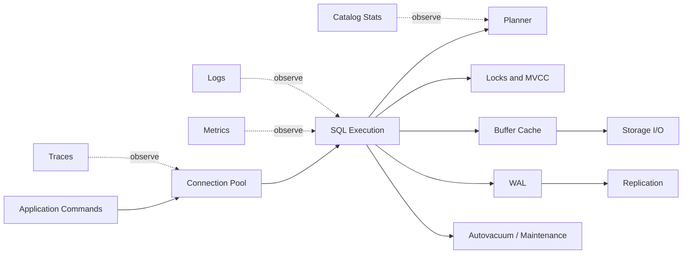
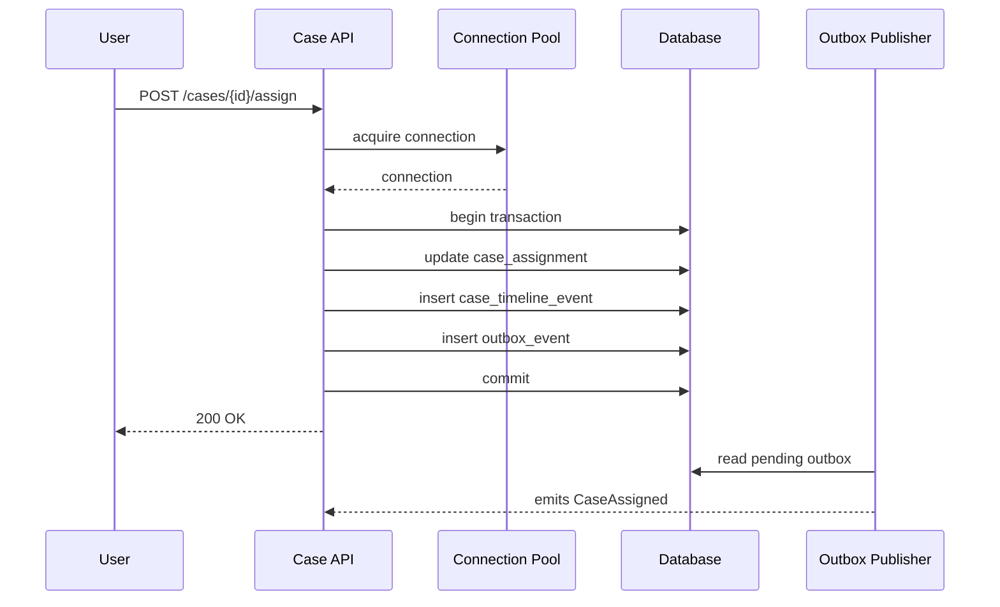

# Part 053 — Observability for Database Systems

A production database does not fail silently.

It leaves signals.

The problem is that weak teams collect many signals but cannot answer operational questions quickly:

- What is slow right now?
- Which workload caused it?
- Which tenant or endpoint is affected?
- Is this CPU, I/O, lock, connection, vacuum, plan regression, replication, storage, or downstream pressure?
- What changed?
- What action is safe?

Database observability is the ability to answer those questions from evidence, not intuition.

This part focuses on observability design for database-backed systems: what to measure, how to label it, how to connect database evidence to application behavior, and how to turn metrics into diagnosis.

The goal is not “install monitoring”.

The goal is to build a database system that can explain itself under pressure.

---

## 1. Core Mental Model

A database is not one black box.

It is a shared state machine serving many workloads at once.



A slow request can be caused by many layers:

| Symptom | Possible Database Cause |
|---|---|
| High request latency | slow query, lock wait, connection wait, replica lag, disk saturation |
| High CPU | bad plan, missing index, excessive parsing, hash aggregation, sort, parallel query overhead |
| High I/O | sequential scan, cache miss, checkpoint, vacuum, index bloat, table bloat |
| High error rate | deadlock, serialization failure, timeout, unique conflict, connection exhaustion |
| Stale UI | read replica lag, cache lag, projection lag, CDC delay |
| Missing search result | indexing pipeline failure, CDC consumer lag, authorization filter drift |
| Bad report | snapshot inconsistency, ETL delay, semantic contract mismatch |

The architect’s job is to preserve the causal chain:

> user action → application operation → transaction → SQL statements → rows/indexes touched → locks/waits/I/O → downstream effects

If that chain is broken, every incident becomes guesswork.

---

## 2. Observability Is Not Just Monitoring

Monitoring asks: **is something wrong?**

Observability asks: **why is it wrong and how do we know?**

A production database observability stack needs five capabilities:

| Capability | Purpose |
|---|---|
| Metrics | Show trends, saturation, rates, lag, resource pressure |
| Logs | Preserve discrete events: errors, slow queries, DDL, connections, deadlocks |
| Traces | Connect app request to DB operations and timing |
| Catalog/stat views | Reveal database internal state: sessions, locks, stats, vacuum, replication |
| Runbooks | Convert signals into safe diagnostic and mitigation actions |

Metrics without query identity are weak.

Logs without correlation IDs are weak.

Traces without SQL operation names are weak.

Dashboards without runbooks are decorative.

---

## 3. The Five Database Signal Classes

For database systems, generic CPU/memory/disk metrics are not enough.

Use these five classes.

### 3.1 Workload Signals

These describe how the database is being used.

Examples:

- queries per second
- transactions per second
- rows read/written
- statements by endpoint/use case
- top SQL by total time
- top SQL by mean latency
- top SQL by rows returned
- top SQL by temp file usage
- top SQL by buffer reads
- read/write ratio
- transaction duration
- connection pool wait time

Workload signals tell you whether the database is serving the workload you designed for.

### 3.2 Latency Signals

Latency must be decomposed.

Do not only track request latency.

Track:

- application endpoint latency
- connection acquisition latency
- SQL execution latency
- lock wait time
- I/O wait time
- replication apply lag
- queue/projection lag
- commit latency
- p50/p95/p99/p99.9

A single average latency number is usually useless during incidents.

A p99 spike with stable p50 usually means a subset of requests is blocked, skewed, or routed differently.

### 3.3 Saturation Signals

Saturation means some finite resource is near exhaustion.

Examples:

- active connections
- connection pool utilization
- CPU utilization
- IOPS utilization
- WAL generation rate
- disk free space
- memory pressure
- temp file growth
- lock queue length
- autovacuum backlog
- replication slot retained WAL
- replica replay lag

Saturation often precedes failure.

A mature system alerts on saturation before user-facing failure.

### 3.4 Contention Signals

Contention is the database saying: “many actors want the same thing”.

Examples:

- lock waits
- deadlocks
- serialization failures
- hot row updates
- hot partition writes
- sequence contention
- unique index contention
- FK check contention
- work queue claim contention

Contention is architectural.

You rarely fix it by increasing CPU.

You fix it by changing write shape, sharding key, lock scope, transaction duration, queue design, or invariant enforcement pattern.

### 3.5 Correctness and Freshness Signals

A database system can be fast and still wrong.

Track:

- replica lag
- CDC lag
- projection lag
- cache invalidation lag
- failed outbox messages
- failed inbox dedup records
- data quality violations
- invariant repair jobs
- orphan record count
- reconciliation mismatch count
- audit gap count
- unauthorized access attempt count

Correctness observability matters especially for regulatory systems.

A workflow that “eventually becomes correct” may still violate a legal or operational deadline.

---

## 4. Database Observability Contract

Every critical database-backed operation should have an observability contract.

Example:

```yaml
operation: assign_case_to_officer
business_goal: assign an open case to exactly one accountable officer
write_tables:
  - case_assignment
  - case_timeline_event
  - outbox_event
read_tables:
  - case_record
  - officer_capacity
critical_invariants:
  - one active assignment per case
  - assigned officer must be active
  - assignment event must be emitted atomically
expected_latency:
  p95: 150ms
  p99: 500ms
expected_errors:
  - unique_violation means duplicate assignment attempt
  - serialization_failure is retryable
  - lock_timeout means contention on case/officer capacity
metrics:
  - command_latency
  - db_statement_latency
  - lock_wait
  - outbox_lag
logs:
  - command_id
  - case_id
  - officer_id
  - transaction_id
  - db_error_class
trace_attributes:
  - db.system
  - db.operation.name
  - tenant_id
  - command_id
  - case_id_hash
alerts:
  - p99 latency above 2s for 10m
  - duplicate assignment invariant violation > 0
  - outbox lag above 60s
```

The important part is not the YAML.

The important part is discipline:

> Every critical operation must be diagnosable by business operation, not only by anonymous SQL text.

---

## 5. Query Identity: The Missing Link

The most common observability failure is that the database sees SQL but not business intent.

For example:

```sql
select * from case_record where tenant_id = $1 and status = $2 order by created_at desc limit $3;
```

This query might be used by:

- case search screen
- dashboard widget
- nightly export
- escalation job
- support admin view
- API integration

Same SQL shape.

Different operational meaning.

### 5.1 Add Application Names

At minimum, configure connection `application_name` or equivalent.

Examples:

```text
case-api
case-api:assign-case
case-api:search-cases
case-worker:escalation-scan
reporting-service:daily-export
```

In PostgreSQL, active sessions can expose `application_name` through `pg_stat_activity`.

```sql
select
  pid,
  application_name,
  usename,
  state,
  wait_event_type,
  wait_event,
  now() - query_start as query_age,
  left(query, 160) as query_preview
from pg_stat_activity
where state <> 'idle'
order by query_start;
```

### 5.2 Use Stable SQL Operation Names

Do not name operations after endpoints only.

Name by stable business/database operation:

```text
case.search.open_cases
case.assignment.create
case.timeline.append
case.escalation.scan_due_cases
case.report.export_case_snapshot
```

Then attach that name to:

- trace span
- query comment if safe
- structured log
- metric label with controlled cardinality
- runbook entry

### 5.3 Be Careful With High-Cardinality Labels

Metrics labels should not include raw IDs:

Bad:

```text
tenant_id=tenant_817263
case_id=CASE-2026-00018881
user_id=U-119288
```

Good:

```text
tenant_tier=enterprise
operation=case.assignment.create
route=primary
db_role=writer
```

Use raw IDs in logs/traces with sampling and privacy controls, not as metric dimensions.

---

## 6. PostgreSQL Observability Views You Should Know

The exact database engine may vary, but PostgreSQL provides a good mental model because it exposes many internal views.

### 6.1 Current Activity

Use `pg_stat_activity` to inspect active sessions.

```sql
select
  pid,
  application_name,
  usename,
  client_addr,
  state,
  wait_event_type,
  wait_event,
  now() - xact_start as xact_age,
  now() - query_start as query_age,
  left(query, 200) as query_preview
from pg_stat_activity
where state <> 'idle'
order by query_start nulls last;
```

Interpretation:

| Column | Meaning |
|---|---|
| `state` | active, idle, idle in transaction |
| `wait_event_type` | broad class of wait: Lock, IO, Client, LWLock, etc. |
| `wait_event` | specific wait reason |
| `xact_age` | long transaction risk |
| `query_age` | long-running statement risk |

Red flags:

- many `idle in transaction` sessions
- long `xact_age`
- many sessions waiting on locks
- many active queries from one app operation
- sessions stuck on client read/write

### 6.2 Lock Diagnosis

```sql
select
  blocked.pid as blocked_pid,
  blocked.application_name as blocked_app,
  blocked.query as blocked_query,
  blocking.pid as blocking_pid,
  blocking.application_name as blocking_app,
  blocking.query as blocking_query
from pg_catalog.pg_locks blocked_locks
join pg_catalog.pg_stat_activity blocked
  on blocked.pid = blocked_locks.pid
join pg_catalog.pg_locks blocking_locks
  on blocking_locks.locktype = blocked_locks.locktype
 and blocking_locks.database is not distinct from blocked_locks.database
 and blocking_locks.relation is not distinct from blocked_locks.relation
 and blocking_locks.page is not distinct from blocked_locks.page
 and blocking_locks.tuple is not distinct from blocked_locks.tuple
 and blocking_locks.virtualxid is not distinct from blocked_locks.virtualxid
 and blocking_locks.transactionid is not distinct from blocked_locks.transactionid
 and blocking_locks.classid is not distinct from blocked_locks.classid
 and blocking_locks.objid is not distinct from blocked_locks.objid
 and blocking_locks.objsubid is not distinct from blocked_locks.objsubid
 and blocking_locks.pid <> blocked_locks.pid
join pg_catalog.pg_stat_activity blocking
  on blocking.pid = blocking_locks.pid
where not blocked_locks.granted
  and blocking_locks.granted;
```

Lock diagnosis must answer:

- who is blocked?
- who is blocking?
- what operation owns the blocker?
- how old is the blocker transaction?
- is the blocker safe to terminate?
- what invariant or migration created the lock?

Never kill sessions blindly.

A session may be holding a lock because it is halfway through a critical transaction.

### 6.3 Query Statistics

`pg_stat_statements` is one of the most important PostgreSQL extensions for workload observability.

Typical diagnostic query:

```sql
select
  queryid,
  calls,
  total_exec_time,
  mean_exec_time,
  max_exec_time,
  rows,
  shared_blks_hit,
  shared_blks_read,
  temp_blks_written,
  left(query, 240) as query_preview
from pg_stat_statements
order by total_exec_time desc
limit 20;
```

Useful rankings:

| Ranking | Finds |
|---|---|
| total time | biggest cumulative cost |
| mean time | consistently slow queries |
| max time | outlier-prone queries |
| calls | chatty query patterns |
| rows | over-fetching or fan-out |
| shared blocks read | I/O-heavy queries |
| temp blocks written | spill-heavy sorts/aggregations |

Do not optimize only the slowest single query.

Optimize the workload that materially consumes resources or violates SLO.

### 6.4 Table and Index Statistics

```sql
select
  schemaname,
  relname,
  seq_scan,
  idx_scan,
  n_live_tup,
  n_dead_tup,
  last_vacuum,
  last_autovacuum,
  last_analyze,
  last_autoanalyze
from pg_stat_all_tables
where schemaname not in ('pg_catalog', 'information_schema')
order by n_dead_tup desc
limit 30;
```

Questions this helps answer:

- Which tables accumulate dead tuples?
- Is autovacuum keeping up?
- Are tables being sequentially scanned often?
- Are statistics stale?
- Is a table growing faster than expected?

Index stats:

```sql
select
  schemaname,
  relname,
  indexrelname,
  idx_scan,
  idx_tup_read,
  idx_tup_fetch
from pg_stat_all_indexes
where schemaname not in ('pg_catalog', 'information_schema')
order by idx_scan asc
limit 50;
```

Low `idx_scan` does not always mean unused.

An index may be critical for rare high-value operations or constraint enforcement.

Review before dropping.

### 6.5 I/O and WAL Signals

Useful signal categories:

- buffer cache hit/read behavior
- checkpoint frequency
- WAL generation rate
- WAL archive failures
- replication slot retained WAL
- temp file creation
- read/write latency
- fsync latency

In newer PostgreSQL versions, `pg_stat_io` exposes detailed I/O statistics by backend type, object, and context.

Important lesson:

> Not all I/O is bad. Unexpected I/O is bad.

A large export is allowed to read many pages.

A dashboard query reading millions of pages every minute is not.

---

## 7. Logs: What to Capture

Database logs are useful when they are structured enough to diagnose events.

Capture at least:

- slow queries above threshold
- deadlocks
- lock waits above threshold
- connection failures
- authentication failures
- DDL changes
- temporary file creation
- checkpoint warnings
- autovacuum activity for critical tables
- replication failures
- statement timeouts
- serialization failures if they exceed normal retry noise

Example PostgreSQL log-related settings to understand:

```text
log_min_duration_statement
log_lock_waits
deadlock_timeout
log_temp_files
log_connections
log_disconnections
log_autovacuum_min_duration
```

Do not log all statements in a high-throughput production system unless you have a specific short diagnostic window.

Full statement logging can create privacy risk, cost explosion, and performance overhead.

---

## 8. Tracing the Database Boundary

A trace should show where database time occurs inside a request.



Useful span attributes:

```text
db.system=postgresql
db.operation.name=case.assignment.create
db.statement.hash=...
db.route=primary
db.transaction.read_only=false
db.retry.count=1
db.error.class=serialization_failure
tenant.tier=enterprise
```

Avoid putting sensitive raw SQL parameters into traces.

Hash or redact IDs when needed.

---

## 9. Dashboard Architecture

Do not build one giant dashboard.

Build dashboards by diagnostic question.

### 9.1 Executive Health Dashboard

Purpose: answer “is the database healthy?”

Include:

- availability
- primary/replica state
- p95/p99 DB latency
- connection saturation
- CPU/I/O/storage
- replication lag
- error rate
- top incident alerts

### 9.2 Workload Dashboard

Purpose: answer “what is consuming database capacity?”

Include:

- top operations by DB time
- top SQL by total time
- queries per app/service
- read/write ratio
- rows returned/written
- transaction duration distribution
- batch/reporting workload windows

### 9.3 Contention Dashboard

Purpose: answer “who is blocking whom?”

Include:

- lock wait count/time
- blocked sessions
- blocker sessions
- deadlocks
- serialization failures
- hot table/index indicators
- queue claim latency

### 9.4 Storage and Maintenance Dashboard

Purpose: answer “is the database accumulating maintenance debt?”

Include:

- table/index size growth
- dead tuples
- autovacuum runs
- analyze freshness
- WAL generation
- checkpoint behavior
- temp files
- disk free space
- backup status

### 9.5 Replication and Freshness Dashboard

Purpose: answer “how stale are derived/read systems?”

Include:

- replica lag
- WAL sender/receiver state
- replication slot retained WAL
- CDC lag
- outbox age
- consumer lag
- projection rebuild status
- stale-read incidents

---

## 10. Alerting Principles

Bad alert:

> CPU above 80%.

Better alert:

> CPU above 85% for 15 minutes and DB p99 latency above SLO for primary OLTP workload.

Bad alert:

> Query took more than 1 second.

Better alert:

> `case.assignment.create` p99 above 2 seconds for 10 minutes, with lock wait above 500ms for more than 5% of requests.

### 10.1 Alert on User Impact or Imminent Failure

Alert classes:

| Alert Type | Example |
|---|---|
| User impact | p99 write latency above SLO |
| Data correctness | projection lag violates freshness contract |
| Imminent failure | disk/WAL space below safe threshold |
| HA/DR risk | replica not receiving WAL |
| Maintenance debt | autovacuum cannot keep up on critical tables |
| Security | abnormal failed auth/access pattern |

### 10.2 Avoid Alert Flooding

Group alerts by causal system.

If disk is full, do not page separately for:

- slow queries
- failed WAL archive
- replication lag
- connection errors
- checkpoint failure

Make disk saturation the parent incident.

---

## 11. Incident Diagnosis Playbooks

### 11.1 Slow Database Incident

First classify:

```text
Is the whole DB slow or one workload slow?
Is it reads, writes, or commits?
Is latency CPU, I/O, lock, connection, replica, or app-side?
Did traffic, data volume, deploy, migration, or plan change recently?
```

Workflow:

1. Check user-facing SLO and affected operations.
2. Check active sessions and wait events.
3. Check connection pool saturation.
4. Check top SQL by total/mean/max time.
5. Check locks/blockers.
6. Check CPU/I/O/storage/WAL.
7. Check replication lag if reads use replicas.
8. Check recent deploy/migration/statistics/analyze changes.
9. Choose mitigation with lowest blast radius.
10. Record root cause and prevention.

### 11.2 Lock Storm Incident

Questions:

- Which session is the root blocker?
- What transaction opened it?
- Is it application, migration, reporting, or manual admin?
- How many sessions are blocked behind it?
- Will killing it corrupt business flow or only roll back a safe statement?

Possible mitigations:

- cancel blocker query
- terminate blocker session
- pause offending worker
- lower concurrency
- stop migration
- route traffic away from heavy operation
- temporarily disable non-critical batch/reporting workload

Prevention:

- shorter transactions
- lock timeout
- statement timeout
- safer migration pattern
- queue concurrency limit
- predictable lock ordering

### 11.3 Replication Lag Incident

Questions:

- Is lag receive lag, replay lag, or apply lag?
- Is primary generating excessive WAL?
- Is replica CPU/I/O constrained?
- Is a replication slot retaining WAL?
- Are read requests routed to stale replicas?
- Which freshness contracts are violated?

Mitigations:

- route critical reads to primary
- reduce batch write load
- pause heavy read queries on replica
- scale replica resources
- rebuild stuck replica if needed
- drop obsolete replication slot only after impact review

### 11.4 Autovacuum Debt Incident

Questions:

- Which tables have high dead tuples?
- Are long transactions preventing cleanup?
- Is autovacuum running but too slow?
- Are table thresholds too high for workload?
- Is bloat causing I/O amplification?

Mitigations:

- terminate long idle-in-transaction sessions
- tune autovacuum per hot table
- run manual vacuum/analyze in controlled window
- reduce update churn
- partition high-churn table
- avoid unbounded soft-delete accumulation

---

## 12. Observability for Regulatory Systems

For regulatory and enforcement lifecycle platforms, database observability must cover more than performance.

Track:

- case lifecycle transition failures
- illegal transition attempts
- missing audit event after state change
- evidence attachment failures
- stale authorization policy reads
- SLA/escalation job lag
- assignment queue backlog
- decision record completeness
- case merge/split anomalies
- report snapshot generation success/failure
- retention/legal-hold conflicts

Example invariant monitor:

```sql
select count(*) as cases_without_timeline_event
from case_record c
where c.status = 'CLOSED'
  and not exists (
    select 1
    from case_timeline_event e
    where e.case_id = c.case_id
      and e.event_type = 'CASE_CLOSED'
  );
```

If this returns non-zero, the database may be internally inconsistent even if the application is responding quickly.

---

## 13. Anti-Patterns

### 13.1 Metrics Without Operation Identity

You know the database is slow, but not which business operation is causing it.

Fix:

- add operation names
- set application names
- structure logs
- connect traces to SQL spans

### 13.2 Only Watching Infrastructure Metrics

CPU and memory are not enough.

You need query, lock, transaction, replication, and correctness signals.

### 13.3 Logging Raw Sensitive Data

SQL logs may contain PII, secrets, tokens, case details, or evidence metadata.

Fix:

- parameterize queries
- redact logs
- restrict log access
- define retention
- hash identifiers where possible

### 13.4 Alerting on Everything

Too many alerts create operational blindness.

Alert on symptoms and risk, not every noisy metric.

### 13.5 No Baseline

Without baseline, you cannot distinguish normal seasonal load from degradation.

Maintain baseline by:

- hour of day
- day of week
- batch window
- reporting cycle
- tenant tier
- release version

---

## 14. Database Observability Review Checklist

### Workload Identity

- [ ] Critical operations have stable operation names.
- [ ] Connection `application_name` or equivalent is configured.
- [ ] Metrics use bounded-cardinality labels.
- [ ] Logs/traces include correlation IDs.
- [ ] Sensitive values are redacted or hashed.

### Performance Signals

- [ ] Query latency is tracked by operation and SQL fingerprint.
- [ ] Connection pool wait time is tracked.
- [ ] Lock waits and deadlocks are visible.
- [ ] I/O wait and temp file usage are visible.
- [ ] Top SQL by total time and mean time is visible.

### Reliability Signals

- [ ] Replication lag is tracked.
- [ ] WAL/disk growth is tracked.
- [ ] Backup success and restore validation are tracked.
- [ ] Autovacuum/analyze freshness is tracked.
- [ ] Long transactions are detected.

### Correctness Signals

- [ ] Outbox/CDC lag is tracked.
- [ ] Projection freshness is tracked.
- [ ] Invariant violation monitors exist.
- [ ] Data quality repair jobs are monitored.
- [ ] Audit completeness checks exist.

### Incident Readiness

- [ ] Slow DB runbook exists.
- [ ] Lock storm runbook exists.
- [ ] Replication lag runbook exists.
- [ ] Disk/WAL full runbook exists.
- [ ] Emergency access and kill-session policy are defined.

---

## 15. Key Takeaways

Database observability is not a dashboard collection.

It is a causal model.

A strong database architect designs systems so that every production question has an evidence path:

```text
business operation
→ application trace
→ database session/query
→ wait/resource/lock signal
→ impacted data/invariant
→ safe mitigation
```

The best systems are not systems that never fail.

They are systems that fail explainably.

When the database can explain itself, teams can respond quickly without panic, guesswork, or unsafe intervention.

---

## References

- PostgreSQL Documentation — Monitoring Database Activity and the Cumulative Statistics System: https://www.postgresql.org/docs/current/monitoring-stats.html
- PostgreSQL Documentation — Runtime Statistics Configuration: https://www.postgresql.org/docs/current/runtime-config-statistics.html
- PostgreSQL Documentation — `EXPLAIN`: https://www.postgresql.org/docs/current/sql-explain.html
- PostgreSQL Documentation — Using `EXPLAIN`: https://www.postgresql.org/docs/current/using-explain.html
- Amazon RDS Documentation — Performance Insights: https://docs.aws.amazon.com/AmazonRDS/latest/UserGuide/USER_PerfInsights.html
- Amazon RDS Documentation — Monitoring DB Instances: https://docs.aws.amazon.com/AmazonRDS/latest/gettingstartedguide/managing-monitoring-perf.html
