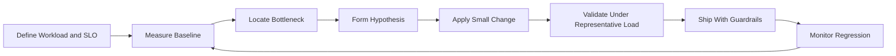
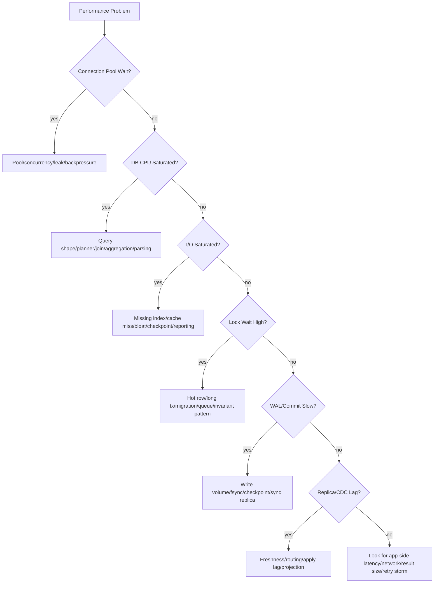

# Part 054 — Database Performance Engineering

Database performance engineering is not the same as “making queries faster”.

It is the discipline of making database behavior predictable under real workload, real data volume, real concurrency, and real failure conditions.

A weak engineer sees a slow query and adds an index.

A strong database architect asks:

- Which workload is slow?
- What is the SLO?
- What changed?
- Is the bottleneck CPU, I/O, lock, connection, memory, WAL, network, planner, schema, data distribution, or application behavior?
- Is this a local query problem or a systemic capacity problem?
- Will the fix improve the bottleneck or just move it?
- What regression test prevents this from returning?

Performance engineering is a loop:



This part explains the loop.

---

## 1. Core Mental Model

A database is a resource scheduler.

It schedules:

- CPU for parsing, planning, execution, joins, aggregation, compression, checksums
- memory for buffers, sorts, hashes, connections, maintenance
- storage I/O for reads, writes, flushes, checkpoints, WAL
- locks for correctness
- transaction visibility for MVCC
- network bandwidth for result sets and replication
- background work for vacuum, analyze, checkpoint, replication, archiving

Performance degrades when one or more of these resources becomes the limiting factor.

The limiting factor is the bottleneck.

You cannot tune correctly until you know the bottleneck.

---

## 2. Performance Is a Contract, Not a Feeling

Do not say:

> The database should be fast.

Say:

```yaml
operation: case.search.open_cases
workload_type: interactive_read
slo:
  p95_latency_ms: 300
  p99_latency_ms: 1000
  error_rate: <0.1%
expected_data_shape:
  tenants: 500
  cases_per_large_tenant: 10_000_000
  open_cases_per_large_tenant: 500_000
expected_concurrency:
  normal: 100 active users
  peak: 500 active users
query_contract:
  must_filter_by_tenant: true
  must_filter_by_visibility_scope: true
  must_order_by: created_at_desc
  pagination: keyset
freshness:
  may_use_replica: true
  max_staleness_seconds: 5
```

Performance cannot be engineered without:

- operation name
- latency target
- throughput target
- data volume assumption
- concurrency assumption
- read/write ratio
- freshness requirement
- correctness requirement

A query that is “fast” for 10,000 rows may be broken for 100 million rows.

A design that is “fast” for one tenant may collapse under tenant skew.

---

## 3. The Performance Equation

Think of request latency as a composition:

```text
request_latency
= queue_wait
+ connection_acquire_time
+ network_time
+ transaction_setup_time
+ planning_time
+ execution_time
+ lock_wait_time
+ io_wait_time
+ result_transfer_time
+ commit_time
+ retry_time
```

When users say “the database is slow”, they may actually mean:

- app threads are waiting for DB connections
- DB sessions are idle in transaction
- queries are blocked on row locks
- primary is overloaded by reporting queries
- replica is stale
- a new plan chose sequential scan
- autovacuum is behind
- disk is saturated by checkpoint/writeback
- result sets are too large
- retry storms are amplifying load

Performance engineering decomposes latency until the dominant term is visible.

---

## 4. Workload Taxonomy

Different workloads need different tuning strategies.

| Workload | Primary Risk | Typical Optimization |
|---|---|---|
| Point lookup | index miss, connection overhead | correct key/index, batching, cache |
| Search/list page | bad filter/order/index, large offset | composite index, keyset pagination |
| Write command | lock contention, constraint cost, WAL | shorter transaction, idempotency, batching |
| Queue worker | hot claim query, lock storm | `SKIP LOCKED`, partitioned queues, leases |
| Reporting query | full scan, sort spill, replica impact | read replica, aggregate table, warehouse |
| Batch import | WAL pressure, index maintenance | chunking, staging table, controlled indexes |
| CDC/outbox | lag, polling pressure | index pending rows, batch size, partitioning |
| Tenant-heavy workload | skew, hot partition | tenant isolation, routing, shard split |

A single database may serve all of these.

That is why workload isolation matters.

---

## 5. Baseline Before Tuning

Before changing anything, capture a baseline.

Minimum baseline:

- top operations by DB time
- top SQL fingerprints by total time
- p50/p95/p99 latency by operation
- throughput by operation
- active connections and pool wait
- CPU, memory, I/O, disk, WAL
- lock wait and deadlock count
- buffer hit/read behavior
- temp file usage
- table/index size
- autovacuum/analyze status
- replication/CDC lag
- error classes

Baseline must be taken under representative workload.

A benchmark with empty tables is worse than useless because it creates false confidence.

### 5.1 Baseline Template

```yaml
baseline_id: db-perf-2026-07-case-search-v1
window: 2026-07-05T09:00:00+07:00/2026-07-05T10:00:00+07:00
environment: staging-prod-shape
schema_version: 2026_07_05_001
data_profile:
  total_cases: 120_000_000
  largest_tenant_cases: 12_000_000
  open_case_ratio: 0.08
workload:
  read_qps: 1200
  write_tps: 150
  peak_concurrent_sessions: 180
results:
  p95_case_search_ms: 260
  p99_case_search_ms: 880
  cpu_avg: 62%
  read_iops_avg: 8500
  lock_wait_p99_ms: 20
  temp_files_mb: 0
notes:
  - no reporting workload during test
  - replica lag below 2s
```

If you do not record context, you cannot compare results later.

---

## 6. Bottleneck Isolation Framework

Use a layer-by-layer decision tree.



The point is not to memorize the tree.

The point is to avoid random tuning.

---

## 7. Query-Level Performance Engineering

### 7.1 Start With Query Shape

A query is not slow because SQL is slow.

It is slow because its shape does not match the data and index shape.

Questions:

- Does the query filter by tenant/partition boundary?
- Does it filter by selective predicates?
- Does the index match equality/range/order?
- Does it return too many columns?
- Does it use offset pagination?
- Does it cause join fan-out?
- Does it sort or aggregate large intermediate results?
- Does it call functions on indexed columns?
- Does it use optional filters that confuse planner estimates?

Bad example:

```sql
select *
from case_record
where lower(reference_no) = lower($1);
```

Better if case-insensitive lookup is required:

```sql
create index idx_case_record_reference_no_lower
on case_record (lower(reference_no));

select case_id, reference_no, status, created_at
from case_record
where lower(reference_no) = lower($1);
```

Or better still, normalize a canonical value at write time:

```sql
alter table case_record
add column reference_no_normalized text;

create unique index uq_case_reference_no_normalized
on case_record (tenant_id, reference_no_normalized);
```

### 7.2 Match Index to Access Pattern

For a common list query:

```sql
select case_id, reference_no, status, created_at
from case_record
where tenant_id = $1
  and status = 'OPEN'
  and deleted_at is null
order by created_at desc, case_id desc
limit 50;
```

A reasonable index:

```sql
create index concurrently idx_case_open_list
on case_record (tenant_id, status, created_at desc, case_id desc)
where deleted_at is null;
```

Why:

- `tenant_id` scopes the workload
- `status` narrows status subset
- `created_at desc, case_id desc` supports order and keyset pagination
- partial predicate excludes deleted rows

But do not add this index blindly.

Check:

- write amplification
- status cardinality
- tenant skew
- query frequency
- existing overlapping indexes
- insert/update cost

### 7.3 Avoid Offset Pagination for Deep Pages

Bad:

```sql
select case_id, created_at
from case_record
where tenant_id = $1
order by created_at desc
limit 50 offset 500000;
```

The database still has to walk through many rows.

Better:

```sql
select case_id, created_at
from case_record
where tenant_id = $1
  and (created_at, case_id) < ($2, $3)
order by created_at desc, case_id desc
limit 50;
```

This is keyset pagination.

It turns “skip N rows” into “continue from this key”.

### 7.4 Reduce Result Width

`select *` can destroy performance.

It increases:

- disk read volume
- memory pressure
- network transfer
- serialization cost
- cache pressure
- index-only scan impossibility

Return only what the operation needs.

Large JSON/document/evidence columns should not be pulled into list views.

### 7.5 Watch Join Fan-Out

A join that looks innocent may multiply rows.

Example:

```sql
select c.case_id, e.evidence_id, n.note_id
from case_record c
left join evidence e on e.case_id = c.case_id
left join case_note n on n.case_id = c.case_id
where c.case_id = $1;
```

If a case has 20 evidence records and 30 notes, this returns 600 rows.

Better:

- load separate collections separately
- aggregate carefully
- use dedicated read model
- limit child records
- define UI access pattern explicitly

---

## 8. Index Engineering

Indexes are not free.

They cost:

- write amplification
- storage
- cache pressure
- vacuum/maintenance overhead
- planner choice complexity
- migration time

### 8.1 Index Portfolio Review

For each index, record:

```yaml
index: idx_case_open_list
owner: case-search
supports:
  - case.search.open_cases
  - escalation.scan_due_open_cases
correctness_role: none
access_pattern:
  equality: [tenant_id, status]
  range: [created_at]
  order: [created_at desc, case_id desc]
expected_selectivity: high for large tenants
write_cost: medium
retirement_condition: replaced by case_search_projection
```

This prevents index sprawl.

### 8.2 Detect Duplicate or Overlapping Indexes

Common bad portfolio:

```sql
(tenant_id)
(tenant_id, status)
(tenant_id, status, created_at)
(tenant_id, status, created_at, case_id)
```

Some may be redundant.

But be careful:

- unique indexes have correctness role
- partial indexes may serve different subsets
- sort direction can matter
- small indexes may support specific fast paths
- FK indexes may support delete/update checks

### 8.3 Partial Index for Hot Subsets

Use partial indexes when queries focus on a small active subset.

Example:

```sql
create index concurrently idx_case_pending_escalation
on case_record (tenant_id, sla_due_at, case_id)
where status in ('OPEN', 'UNDER_REVIEW')
  and deleted_at is null;
```

This can be much smaller than a full index.

But the query predicate must imply the index predicate.

### 8.4 Expression Index vs Stored Column

Expression index:

```sql
create index idx_person_email_lower
on person (lower(email));
```

Stored normalized column:

```sql
alter table person add column email_normalized text not null;
create unique index uq_person_email_normalized on person (email_normalized);
```

Use stored column when:

- normalization is business semantics
- uniqueness depends on normalized value
- multiple systems need the same value
- you want easier inspection/debugging

Use expression index when:

- expression is simple and local
- semantics are not reused elsewhere
- you want to avoid schema expansion

---

## 9. Transaction and Contention Performance

A fast query inside a bad transaction can still create a slow system.

Watch:

- transaction duration
- number of statements per transaction
- user/network calls inside transaction
- external API calls inside transaction
- row lock duration
- lock acquisition order
- hot row updates
- retry storms

Bad pattern:

```text
begin
  load case
  call external identity service
  update assignment
  send email
  insert audit
commit
```

Better:

```text
begin
  validate local invariant
  update assignment
  insert audit
  insert outbox event
commit

async worker sends email / calls external service
```

Keep transactions short and local.

### 9.1 Hot Row Mitigation

Hot row example:

```sql
update tenant_counter
set next_case_no = next_case_no + 1
where tenant_id = $1
returning next_case_no;
```

This serializes all case creation for a tenant.

Possible mitigations:

- allocate number ranges per worker
- use database sequence if global order is acceptable
- generate non-sequential public IDs
- bucket counters
- defer display number assignment
- isolate large tenant to dedicated shard/cell

Never optimize away correctness without explicitly changing the business invariant.

---

## 10. Connection Pool Engineering

Connection count is not throughput.

Too many active database sessions can reduce performance by increasing:

- CPU context switching
- memory usage
- lock contention
- buffer churn
- query concurrency beyond storage capacity

A pool should apply backpressure.

It should not turn traffic spikes into database collapse.

Track:

- pool size
- active connections
- idle connections
- waiters
- acquire wait time
- timeout count
- connection lifetime
- transaction leak

Rules of thumb:

- Small, controlled pools often outperform huge pools.
- Separate interactive and batch pools.
- Separate read and write pools if routing differs.
- Use statement timeout and transaction timeout.
- Detect idle-in-transaction sessions.

---

## 11. Resource-Level Tuning

Resource tuning should follow bottleneck evidence.

### 11.1 CPU

CPU pressure may come from:

- bad joins
- large sorts/hashes
- expression-heavy filters
- JSON processing
- too many active sessions
- query plan instability
- excessive parsing/planning
- encryption/compression overhead

Fixes may include:

- better indexes
- query rewrite
- prepared statement discipline
- connection pool limit
- aggregate/precomputed table
- moving reporting workload away
- vertical scaling only after query/workload review

### 11.2 Memory

Database memory is used by:

- buffer cache/shared buffers
- per-query sort/hash memory
- maintenance operations
- connections
- OS page cache

Danger:

> Increasing per-query memory can multiply by concurrent operations.

If 200 concurrent queries each get large sort memory, the system can collapse.

Tune based on concurrency and workload class.

### 11.3 I/O

I/O pressure may come from:

- missing index
- large scan
- poor cache locality
- table/index bloat
- checkpoint bursts
- vacuum
- reporting workload
- temp file spills
- backup/snapshot activity

Fixes:

- correct index
- reduce result width
- partition hot/cold data
- tune checkpoint behavior
- isolate reports
- reduce bloat
- improve storage class
- avoid huge sorts/aggregates in OLTP path

### 11.4 WAL and Commit Path

Write-heavy systems are often limited by WAL/fsync/replication.

Signals:

- high WAL generation rate
- commit latency spike
- checkpoint pressure
- replication lag
- WAL archive backlog
- disk write latency

Mitigations:

- batch writes carefully
- reduce unnecessary indexes
- reduce update churn
- avoid wide row updates
- use append-only where appropriate
- isolate bulk load
- choose synchronous replication intentionally
- avoid updating large JSON blobs for tiny changes

---

## 12. Autovacuum Is Performance Engineering

In MVCC databases, updates/deletes create old row versions.

If cleanup cannot keep up, you get:

- table bloat
- index bloat
- more I/O
- worse cache efficiency
- slower scans
- worse planner estimates
- transaction ID wraparound risk

Autovacuum is not background noise.

It is part of the performance control loop.

Track:

```sql
select
  relname,
  n_live_tup,
  n_dead_tup,
  last_autovacuum,
  last_autoanalyze,
  vacuum_count,
  autovacuum_count,
  analyze_count,
  autoanalyze_count
from pg_stat_all_tables
where schemaname = 'public'
order by n_dead_tup desc
limit 20;
```

High-churn tables often need table-specific tuning.

Example:

```sql
alter table outbox_event set (
  autovacuum_vacuum_scale_factor = 0.02,
  autovacuum_analyze_scale_factor = 0.02
);
```

Do not copy this value blindly.

The right value depends on table size, churn rate, storage, and maintenance window.

---

## 13. Data Shape and Skew

Performance depends on distribution, not just volume.

Example:

```text
Tenant A: 50,000,000 cases
Tenant B: 10,000 cases
Tenant C: 4,000 cases
```

A query design that works for median tenants may fail for Tenant A.

Track:

- largest tenant by rows
- largest tenant by write rate
- largest tenant by query rate
- top partitions by size
- status distribution
- null distribution
- time distribution
- high-degree relationships
- hot keys

Skew-aware design may require:

- tenant isolation
- partitioning
- per-tenant indexes/projections
- workload throttling
- shard splitting
- dedicated reporting path

---

## 14. Performance Regression Prevention

Performance fixes are temporary unless guarded.

Add regression protection:

- query plan checks for critical queries
- fixture data with production-like cardinality/skew
- latency budgets in integration tests where practical
- migration review for lock and scan risk
- index ownership registry
- slow query review after release
- dashboard annotation for deploy/migration
- load-test scenario for critical operations
- rollback/roll-forward plan

Example performance review comment:

```text
This migration adds idx_case_open_list to support case.search.open_cases.
Validated on 120M-row staging dataset.
Plan uses Index Scan with tenant_id/status/created_at predicate.
p95 improved from 1800ms to 230ms.
Write TPS dropped by 3.2% in benchmark due to extra index maintenance.
Index is owned by Case Search and will be reviewed after search projection rollout.
```

This is the difference between tuning and engineering.

---

## 15. Performance Anti-Patterns

### 15.1 Add Index First, Ask Later

Indexes can help reads but hurt writes.

Every index should have a workload owner.

### 15.2 Scale Hardware Before Understanding Workload

Vertical scaling can buy time.

It can also hide structural problems until they become more expensive.

### 15.3 Benchmark Empty Data

Empty-table benchmarks ignore:

- cardinality
- bloat
- cache miss
- skew
- join fan-out
- partition count
- index depth
- real row width

### 15.4 Tune Global Config Without Bottleneck Evidence

Changing memory/planner/autovacuum/checkpoint parameters blindly can create new incidents.

Tune from evidence.

### 15.5 Ignore Write Amplification

A schema optimized for reads may make writes collapse.

Count every secondary index, trigger, projection, FK check, audit insert, outbox insert, and replication stream.

### 15.6 Treat Reporting as OLTP

Reports often require scans, joins, aggregation, sorting, and snapshots.

Do not let uncontrolled reporting compete with interactive writes on the primary.

---

## 16. Performance Engineering Checklist

### Workload Definition

- [ ] Critical operations are named.
- [ ] SLOs are defined by p95/p99, not average only.
- [ ] Data volume and skew assumptions are documented.
- [ ] Read/write/concurrency profile is known.
- [ ] Freshness requirement is known.

### Measurement

- [ ] Baseline exists before tuning.
- [ ] Query fingerprints are tracked.
- [ ] Operation-level latency is tracked.
- [ ] Lock wait and connection wait are visible.
- [ ] CPU/I/O/WAL/storage metrics are visible.

### Bottleneck Diagnosis

- [ ] Slow workload is isolated from global DB health.
- [ ] CPU vs I/O vs lock vs connection vs WAL is classified.
- [ ] Query plan is inspected with representative parameters.
- [ ] Data distribution and skew are checked.
- [ ] Recent deploy/migration/statistics changes are reviewed.

### Fix Design

- [ ] Fix targets the actual bottleneck.
- [ ] Read improvement vs write cost is evaluated.
- [ ] Rollback or roll-forward path exists.
- [ ] Impact on replicas/CDC/backups is considered.
- [ ] Migration lock risk is reviewed.

### Regression Prevention

- [ ] Critical query plans are monitored after release.
- [ ] Slow query dashboard is checked post-deploy.
- [ ] Index registry is updated.
- [ ] Runbook is updated if new failure mode exists.
- [ ] Performance assumption is added to architecture decision record.

---

## 17. Key Takeaways

Performance engineering is disciplined diagnosis.

Do not tune from vibes.

Tune from evidence:

```text
workload contract
→ baseline
→ bottleneck
→ hypothesis
→ controlled change
→ validation
→ guardrail
```

The best database architects are not the ones who know the most magic parameters.

They are the ones who can explain why a system is slow, prove which resource is limiting it, choose the smallest safe intervention, and prevent the same problem from returning.

---

## References

- PostgreSQL Documentation — Monitoring Database Activity and Statistics: https://www.postgresql.org/docs/current/monitoring-stats.html
- PostgreSQL Documentation — Using `EXPLAIN`: https://www.postgresql.org/docs/current/using-explain.html
- PostgreSQL Documentation — Runtime Resource Configuration: https://www.postgresql.org/docs/current/runtime-config-resource.html
- PostgreSQL Documentation — Runtime Statistics Configuration: https://www.postgresql.org/docs/current/runtime-config-statistics.html
- PostgreSQL Documentation — Vacuuming Configuration: https://www.postgresql.org/docs/current/runtime-config-vacuum.html
- Amazon RDS Documentation — Performance Insights: https://docs.aws.amazon.com/AmazonRDS/latest/UserGuide/USER_PerfInsights.html
