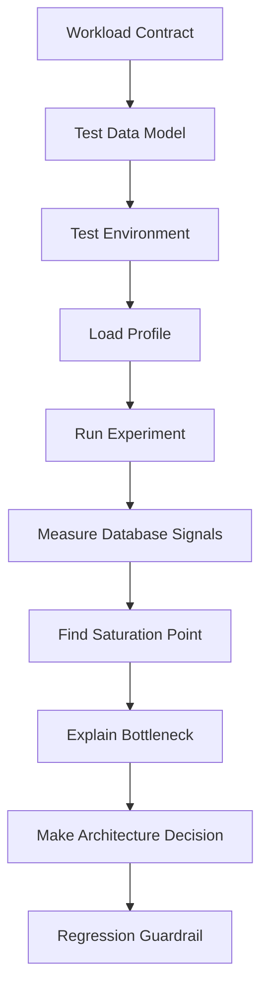
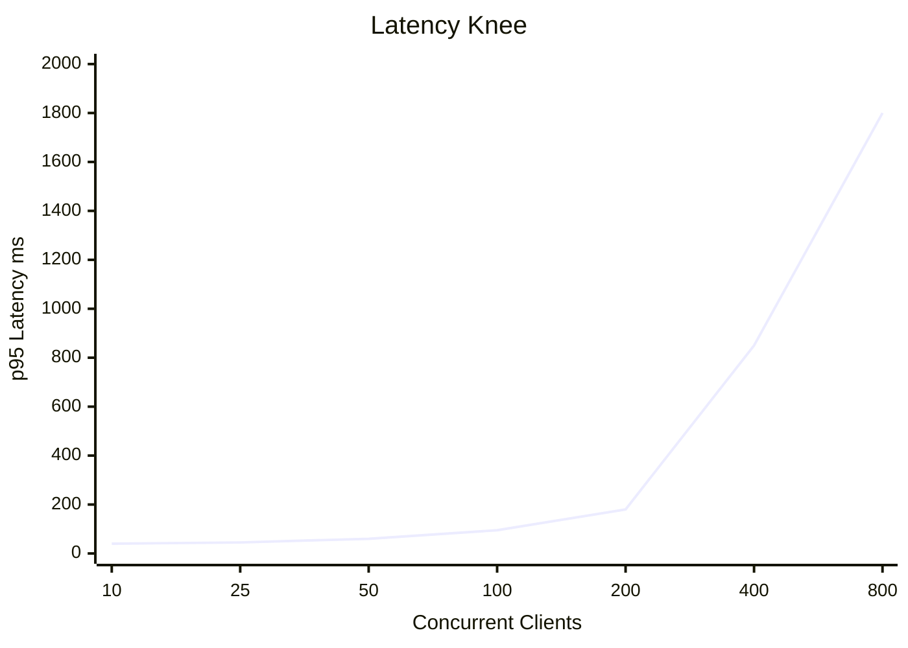
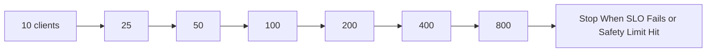

# Part 055 — Load Testing and Benchmarking Databases

A benchmark is an experiment.

A load test is a rehearsal.

A bad benchmark produces a number that makes the team feel safe.

A good benchmark produces a decision:

- this schema can support the next 12 months of growth
- this index does not survive write concurrency
- this transaction boundary creates lock contention
- this query plan becomes unstable after 100 million rows
- this replica strategy violates freshness requirements
- this migration must be redesigned before production

Database benchmarking is not about getting a large TPS number. It is about discovering the system's performance envelope before users discover it for you.



This part teaches how to design database load tests that actually answer engineering questions.

---

## 1. Benchmarking Is Not Performance Theater

Performance theater looks like this:

```text
We ran 1,000 users.
The database handled it.
Average latency looked fine.
Ship it.
```

This is weak because it hides the important questions:

- What were those users doing?
- Was the dataset realistic?
- Were indexes already warm?
- Was the test read-only?
- Were retries counted?
- Were errors ignored?
- Were p95 and p99 measured?
- Did the workload include lock contention?
- Did it include large tenants?
- Did it include stale statistics?
- Did it include autovacuum/checkpoint pressure?
- Did it include replica lag?
- Was the database already saturated but still returning successful responses?

Architect-level benchmarking is not a vanity number. It is controlled evidence.

A benchmark report should be able to say:

```text
At 420 TPS, p95 write latency crosses 250 ms because transaction wait time grows on account_status row locks.
The bottleneck is not CPU or I/O. It is hot-row contention.
Adding CPU will not fix it.
The design should replace the single counter row with bucketed counters or append-only ledger aggregation.
```

That is a useful benchmark.

---

## 2. Core Mental Model

A database under load has four major curves:

1. **Throughput curve** — how many operations per second complete successfully.
2. **Latency curve** — how long each operation takes, especially p95/p99.
3. **Saturation curve** — how close CPU, I/O, memory, connection, lock, WAL, or replica resources are to limit.
4. **Correctness curve** — whether results remain correct under retries, concurrent writes, failover, duplicate commands, and stale reads.

Most teams measure only throughput.

That is not enough.

A database can have high throughput and still be unhealthy:

- p99 latency is exploding
- lock waits are increasing
- checkpoints are causing periodic stalls
- WAL archive is falling behind
- replica lag is growing
- autovacuum cannot keep up
- connection pool is saturated
- plans are changing unpredictably
- error rate is rising but hidden by retries
- data correctness depends on lucky timing

The most important benchmark question is:

> Where is the knee of the curve?

The knee is the point where a small increase in load causes a disproportionate increase in latency, error rate, queue depth, or lag.



Architects care about the knee because it tells you when the system stops degrading gracefully.

---

## 3. Benchmark vs Load Test vs Stress Test vs Soak Test

These terms are often mixed. Separate them.

| Test Type | Main Question | Example |
|---|---|---|
| Microbenchmark | How fast is one primitive? | Single indexed lookup, single insert, B-Tree lookup, JSON expression index |
| Synthetic benchmark | How does the DB behave under controlled workload? | `pgbench` custom read/write mix |
| Application load test | Can the whole app meet SLO under expected load? | 500 users creating/searching cases |
| Stress test | Where does the system break? | Increase clients until p99/error rate explodes |
| Spike test | What happens when demand jumps suddenly? | 10x login/case search after announcement |
| Soak test | Does the system degrade over time? | 12-hour write-heavy workload watching bloat/WAL/vacuum |
| Failover test | What happens during topology change? | Primary failover while writes continue |
| Migration load test | Is the schema/backfill safe under production traffic? | Backfill 500M rows while OLTP continues |
| Replay test | Does production-like traffic behave the same in staging? | Sanitized query log replay |
| Shadow test | What would happen if new path handled real traffic? | Shadow writes to new schema/projection |

A top engineer chooses the test type based on the decision being made.

Do not use a microbenchmark to justify application-level SLO.

Do not use a happy-path app load test to justify database failure behavior.

Do not use average latency to justify interactive user experience.

---

## 4. Start With a Workload Contract

Before running any tool, define what you are testing.

```yaml
benchmark: case_management_v1_write_path
purpose: validate transaction design and index strategy for case creation
system_under_test:
  database: PostgreSQL 18
  schema_version: 2026_07_05_001
  application_version: case-service@2.14.0
workload_mix:
  create_case: 20%
  assign_case: 15%
  add_evidence: 15%
  search_open_cases: 30%
  fetch_timeline: 15%
  dashboard_counts: 5%
traffic_shape:
  normal_tps: 250
  peak_tps: 750
  spike_tps: 1500
concurrency:
  normal_clients: 100
  peak_clients: 500
latency_slo:
  create_case_p95_ms: 250
  search_open_cases_p95_ms: 300
  fetch_timeline_p95_ms: 200
correctness:
  no_duplicate_case_number: true
  no_double_assignment: true
  transition_rules_enforced: true
  idempotent_retries: true
freshness:
  search_may_use_replica: true
  assignment_guard_must_use_primary: true
success_criteria:
  error_rate: "<0.1%"
  deadlocks_per_hour: 0
  replica_lag_p95_seconds: "<5"
  cpu_utilization_peak: "<70%"
  io_queue_depth_peak: "within storage baseline"
  p99_latency_ms: "<1000"
```

A benchmark without a workload contract cannot be interpreted.

---

## 5. Benchmark the Operation, Not Just the Query

A real database operation includes more than SQL execution time.

Example: `assign_case` may include:

1. authenticate actor
2. authorize case visibility
3. read current case state
4. verify transition guard
5. acquire lock or perform conditional update
6. insert assignment history
7. update current assignment
8. insert audit event
9. insert outbox event
10. commit
11. publish asynchronously

Benchmarking only this query is misleading:

```sql
UPDATE cases
SET assigned_to_user_id = $1
WHERE case_id = $2;
```

The real write path may be:

```sql
BEGIN;

SELECT status, assigned_to_user_id, version
FROM cases
WHERE tenant_id = $1
  AND case_id = $2
FOR UPDATE;

INSERT INTO case_assignment_history (
    tenant_id,
    case_id,
    assigned_to_user_id,
    assigned_by_user_id,
    assigned_at
) VALUES ($1, $2, $3, $4, now());

UPDATE cases
SET assigned_to_user_id = $3,
    version = version + 1,
    updated_at = now()
WHERE tenant_id = $1
  AND case_id = $2;

INSERT INTO audit_event (...)
VALUES (...);

INSERT INTO outbox_event (...)
VALUES (...);

COMMIT;
```

The benchmark must include the transaction shape that production uses.

Otherwise you are not testing contention, WAL volume, index write amplification, or transaction duration.

---

## 6. Build Realistic Test Data

Most invalid database benchmarks fail here.

A dataset with 10,000 rows does not reveal the behavior of a table with 500 million rows.

A dataset with uniform distribution does not reveal tenant skew.

A dataset with all active records does not reveal partial indexes, archival patterns, or status distribution.

A dataset with clean values does not reveal optional filters, null selectivity, or outlier payloads.

### 6.1 Data Shape Contract

Define test data explicitly.

```yaml
data_shape:
  tenants:
    total: 500
    distribution: skewed
    top_1_percent_tenants_hold: 45% of cases
  cases:
    total_rows: 120_000_000
    status_distribution:
      draft: 3%
      submitted: 8%
      under_review: 12%
      escalated: 2%
      closed: 70%
      archived: 5%
    age_distribution:
      last_30_days: 20%
      last_1_year: 55%
      older_than_3_years: 15%
  evidence:
    total_rows: 450_000_000
    avg_per_case: 3.75
    p99_per_case: 200
  audit_events:
    total_rows: 3_000_000_000
    retention_years: 7
  text_search_documents:
    total_rows: 120_000_000
  indexes:
    include_all_production_indexes: true
  bloat:
    simulate_updates: true
```

This is the difference between a toy benchmark and an architectural test.

### 6.2 Include Skew

Production data is rarely uniform.

Skew appears in:

- tenant size
- user activity
- case status
- geography
- time ranges
- queue ownership
- document count per case
- hot accounts
- popular search terms
- large organizations

Uniform random data hides hotspot behavior.

For multi-tenant systems, generate tenants like this:

```text
Tenant A: 20M cases
Tenant B: 12M cases
Tenant C: 8M cases
Long tail: 497 tenants share 80M cases
```

This matters because an index that works for small tenants may fail for large tenants.

### 6.3 Include History

Many systems benchmark only current rows.

But production databases contain history:

- closed cases
- audit records
- old assignments
- old workflow transitions
- expired tokens
- archived documents
- old idempotency keys
- tombstones
- correction records
- retry records

History changes query selectivity and index size.

A query like this may look fine in development:

```sql
SELECT *
FROM cases
WHERE tenant_id = $1
  AND status = 'OPEN'
ORDER BY created_at DESC
LIMIT 50;
```

But if `status = 'OPEN'` is not selective for a large tenant, or if the index order is wrong, it can become slow at scale.

### 6.4 Include Realistic Row Width

A narrow row benchmark can lie.

Wide rows change:

- buffer cache efficiency
- I/O volume
- network transfer
- TOAST/large-object behavior
- vacuum cost
- index-only scan viability
- backup size

Do not benchmark `users(id, name)` and extrapolate to `cases` with JSON payloads, large descriptions, evidence metadata, and audit context.

---

## 7. Test Environment Discipline

A benchmark result is only meaningful with environment metadata.

Capture:

```yaml
environment:
  database_engine: PostgreSQL 18.0
  instance_type: r7g.4xlarge
  cpu: 16 vCPU
  memory_gb: 128
  storage:
    type: gp3
    size_gb: 4000
    provisioned_iops: 16000
    throughput_mbps: 1000
  postgres_config:
    shared_buffers: 32GB
    work_mem: 64MB
    maintenance_work_mem: 2GB
    max_connections: 500
    checkpoint_timeout: 15min
    max_wal_size: 64GB
  schema_version: 2026_07_05_001
  dataset:
    cases_rows: 120M
    audit_rows: 3B
    index_size_gb: 1800
  application:
    connection_pool_size: 200
    statement_timeout_ms: 5000
  network:
    app_db_same_az: true
```

Without environment metadata, you cannot compare runs.

---

## 8. Warm Cache vs Cold Cache

Both are useful. They answer different questions.

| Cache State | Question |
|---|---|
| Cold cache | What happens after restart, failover, or cache eviction? |
| Warm cache | What happens under steady-state hot workload? |
| Partially warm cache | What happens with realistic working set? |
| Polluted cache | What happens when reporting/batch workloads evict OLTP working set? |

A system may pass warm-cache tests and fail after failover.

A cold-cache test is especially important for:

- disaster recovery
- blue/green database migration
- replica promotion
- large analytical queries
- cache-sensitive dashboards
- index-only scan assumptions

Benchmark reports must state cache condition.

---

## 9. Metrics That Matter

Do not collect only TPS.

Collect metrics at four layers.

### 9.1 Client/Application Metrics

- request rate
- success rate
- error rate
- timeout rate
- retry count
- latency p50/p90/p95/p99/p99.9
- queue wait before DB call
- connection acquisition time
- transaction duration
- payload size
- result row count

### 9.2 Database Query Metrics

- calls per query identity
- total time
- mean time
- p95/p99 if available through tracing
- rows returned
- rows scanned
- shared buffer hits/reads
- temp file usage
- sort spill
- plan hash/change
- lock wait time

### 9.3 Database System Metrics

- CPU utilization
- load average/run queue
- memory usage
- buffer cache hit ratio, interpreted carefully
- IOPS
- storage throughput
- I/O latency
- WAL generated per second
- checkpoint frequency/duration
- active connections
- idle-in-transaction connections
- lock waits
- deadlocks
- autovacuum progress
- table/index bloat indicators
- replication lag

### 9.4 Correctness Metrics

- duplicate idempotency keys
- failed unique constraints
- serialization failures
- deadlocks
- lost transition attempts
- invalid state rows
- outbox lag
- inbox duplicate count
- reconciliation mismatches
- stale-read incidents

A load test that measures no correctness metrics is incomplete.

---

## 10. Latency Percentiles Matter More Than Averages

Average latency hides user pain.

Example:

```text
100 requests:
95 requests = 50 ms
4 requests = 500 ms
1 request = 10,000 ms
```

Average:

```text
(95*50 + 4*500 + 1*10000) / 100 = 167.5 ms
```

The average looks acceptable.

But p99 is 10 seconds.

For interactive systems, design around tail latency.

Use:

- p50 for normal experience
- p95 for common worst-case experience
- p99 for tail behavior
- max for debugging, not SLO by itself

For databases, tail latency often comes from:

- lock waits
- I/O stalls
- checkpoint pressure
- plan regression
- large tenant skew
- connection pool queueing
- autovacuum conflict
- replica lag fallback
- slow external storage flush

---

## 11. Use Concurrency Ramp, Not One Big Jump

Do not start with 1,000 clients.

Ramp gradually.

Example:

```yaml
ramp_plan:
  - clients: 10
    duration: 5m
  - clients: 25
    duration: 5m
  - clients: 50
    duration: 5m
  - clients: 100
    duration: 10m
  - clients: 200
    duration: 10m
  - clients: 400
    duration: 10m
  - clients: 800
    duration: 10m
```

At each step capture:

- throughput
- p95 latency
- p99 latency
- error rate
- database CPU
- I/O latency
- lock waits
- WAL throughput
- replication lag
- active connections

You are looking for the knee.



Stop when:

- p95 exceeds SLO
- p99 exceeds safety limit
- error rate rises
- lock waits explode
- database CPU is saturated
- I/O latency spikes
- replica lag exceeds contract
- WAL archive falls behind
- application pool queues grow

The goal is not to destroy the database. The goal is to map the envelope.

---

## 12. Open Loop vs Closed Loop Load

Many load tests accidentally hide overload.

### Closed Loop

A client sends a request, waits for response, then sends the next request.

If the system slows down, clients naturally send fewer requests.

This can hide overload.

### Open Loop

The load generator sends requests at a target arrival rate regardless of response time.

If the system slows down, queues grow.

This exposes overload more clearly.

Use both carefully.

| Model | Good For | Risk |
|---|---|---|
| Closed loop | User-session simulation | Understates overload |
| Open loop | Capacity/SLO validation | Can overload dangerously |

For database-specific tests, closed-loop tools like `pgbench` are common and useful, but you must interpret throughput carefully.

If latency rises, the client may stop applying as much pressure because it is waiting.

---

## 13. `pgbench` Mental Model

PostgreSQL includes `pgbench`, a simple benchmarking tool. It repeatedly runs SQL command sequences in concurrent database sessions and reports transaction rate and latency statistics.

The default workload is loosely based on TPC-B, but the default script is rarely representative of your application.

Use custom scripts.

### 13.1 Initialize a Test Database

```bash
createdb benchdb
pgbench -i -s 100 benchdb
```

`-s` controls scale factor. Bigger scale means larger tables.

But do not confuse pgbench default schema with your production schema.

For architecture decisions, create your own schema and scripts.

### 13.2 Simple Read Script

`search_open_cases.sql`:

```sql
\set tenant_id random(1, 500)
\set limit_size 50

SELECT case_id, case_number, status, priority, created_at
FROM cases
WHERE tenant_id = :tenant_id
  AND status IN ('SUBMITTED', 'UNDER_REVIEW', 'ESCALATED')
ORDER BY created_at DESC, case_id DESC
LIMIT :limit_size;
```

Run:

```bash
pgbench \
  -n \
  -c 100 \
  -j 8 \
  -T 600 \
  -f search_open_cases.sql \
  benchdb
```

Interpretation:

- `-c 100` means 100 clients
- `-j 8` means 8 worker threads
- `-T 600` means 10 minutes
- `-f` uses custom script

### 13.3 Mixed Workload Script Selection

For realistic workload mix, use multiple scripts with weights.

```bash
pgbench \
  -n \
  -c 300 \
  -j 16 \
  -T 900 \
  -f 20@create_case.sql \
  -f 15@assign_case.sql \
  -f 30@search_open_cases.sql \
  -f 20@fetch_case_timeline.sql \
  -f 15@add_evidence.sql \
  benchdb
```

The exact syntax available depends on PostgreSQL version, so keep the benchmark harness version-controlled with the database version.

### 13.4 Use Prepared Statements Carefully

Prepared statements can reduce parse/plan overhead, but they can also interact with generic/custom plan behavior.

Test the same execution mode as production:

- prepared vs non-prepared
- parameterized vs literal
- application driver behavior
- connection pool mode

A benchmark that uses different SQL shape from production is not representative.

---

## 14. Custom Benchmark Scripts Should Preserve Transaction Shape

Example: `assign_case.sql`

```sql
\set tenant_id random(1, 500)
\set case_id random(1, 120000000)
\set actor_id random(1, 50000)
\set assignee_id random(1, 50000)

BEGIN;

SELECT case_id, status, version
FROM cases
WHERE tenant_id = :tenant_id
  AND case_id = :case_id
FOR UPDATE;

UPDATE cases
SET assigned_to_user_id = :assignee_id,
    version = version + 1,
    updated_at = clock_timestamp()
WHERE tenant_id = :tenant_id
  AND case_id = :case_id
  AND status IN ('SUBMITTED', 'UNDER_REVIEW', 'ESCALATED');

INSERT INTO case_assignment_history (
    tenant_id,
    case_id,
    assigned_to_user_id,
    assigned_by_user_id,
    assigned_at
) VALUES (
    :tenant_id,
    :case_id,
    :assignee_id,
    :actor_id,
    clock_timestamp()
);

INSERT INTO audit_event (
    tenant_id,
    entity_type,
    entity_id,
    action,
    actor_id,
    occurred_at
) VALUES (
    :tenant_id,
    'CASE',
    :case_id,
    'CASE_ASSIGNED',
    :actor_id,
    clock_timestamp()
);

INSERT INTO outbox_event (
    tenant_id,
    aggregate_type,
    aggregate_id,
    event_type,
    payload,
    created_at
) VALUES (
    :tenant_id,
    'CASE',
    :case_id,
    'CaseAssigned',
    jsonb_build_object('assigneeId', :assignee_id),
    clock_timestamp()
);

COMMIT;
```

This is heavier than a single update, but it is closer to production truth.

---

## 15. Read Workload Design

Read workload must include query variety.

For a regulatory case system:

| Query | Why It Matters |
|---|---|
| Search open cases by tenant/status/date | Main interactive list workload |
| Fetch case detail | Point lookup plus authorization |
| Fetch timeline | Ordered child records, often large |
| Dashboard counts | Aggregate pressure |
| User queue | Hot operational list |
| Evidence search | Search/document projection boundary |
| Export report | Long-running analytical risk |
| Admin lookup | Low-frequency but high-privilege path |

Each query should have:

```yaml
query_contract:
  name: search_open_cases
  expected_frequency: high
  latency_slo_p95_ms: 300
  result_size_p95: 50
  filters:
    tenant_id: mandatory
    status: optional_multi_value
    assigned_to_user_id: optional
    created_at_range: optional
  ordering:
    created_at: desc
    case_id: desc
  pagination: keyset
  replica_allowed: true
  max_staleness_seconds: 5
```

This prevents random SQL testing.

---

## 16. Write Workload Design

Write workloads must include correctness and contention.

Examples:

| Write Operation | Risk |
|---|---|
| Create case | unique case number, sequence hotspot, audit/outbox WAL |
| Assign case | hot queue, lock contention, transition guard |
| Add evidence | parent-child fan-out, large payload metadata |
| Submit decision | state transition correctness |
| Reopen case | terminal state correction |
| Batch import | bulk insert, constraint validation, WAL surge |
| Idempotent command retry | duplicate prevention |

Include retry behavior in load tests.

If production retries serialization failures, deadlocks, or transient connection errors, the benchmark should count:

- first-attempt success
- retry success
- retry exhaustion
- duplicate prevention success
- duplicate side effect failure

A system that succeeds only without retries is not production-ready.

---

## 17. Testing Lock Contention

Lock contention rarely appears with uniformly random IDs.

To test contention, deliberately create hot resources.

Example:

```yaml
contention_profile:
  hot_cases:
    count: 100
    receive_percent_of_assignments: 40%
  hot_queues:
    count: 5
    receive_percent_of_claims: 70%
  hot_tenants:
    count: 3
    receive_percent_of_traffic: 50%
```

Then run assignment/claim tests.

Watch:

- lock wait time
- deadlocks
- transaction duration
- queue claim success rate
- retries
- p99 latency

Useful diagnostic query pattern in PostgreSQL:

```sql
SELECT
    a.pid,
    a.state,
    a.wait_event_type,
    a.wait_event,
    a.query,
    now() - a.query_start AS query_age
FROM pg_stat_activity a
WHERE a.wait_event_type IS NOT NULL
ORDER BY query_age DESC;
```

Do not assume contention is solved because average TPS is high.

---

## 18. Testing Index Write Amplification

Every additional index adds write cost.

Benchmark write-heavy operations before and after index changes.

Measure:

- insert latency
- update latency
- WAL generated per second
- checkpoint pressure
- index size growth
- CPU usage
- autovacuum impact

Example experiment:

```yaml
experiment: add_case_search_index
baseline_indexes:
  - cases_pkey
  - idx_cases_tenant_created
candidate_index:
  - idx_cases_tenant_status_assignee_created
hypothesis:
  improves_search_p95: true
  increases_create_case_p95_by_less_than: 10ms
measure:
  read_query_p95
  create_case_p95
  update_case_p95
  wal_bytes_per_second
  index_size_gb
  autovacuum_frequency
```

A good index decision includes both read benefit and write cost.

---

## 19. Testing Query Plan Stability

A query can be fast today and slow after data grows.

Plan stability depends on:

- table size
- index size
- statistics freshness
- parameter values
- tenant skew
- status distribution
- time range width
- correlation between columns
- partition count
- prepared statement behavior

Test query plans at multiple data sizes:

```yaml
plan_stability_matrix:
  rows:
    - 1_000_000
    - 10_000_000
    - 100_000_000
    - 500_000_000
  tenant_profiles:
    - small_tenant
    - medium_tenant
    - large_tenant
  time_ranges:
    - last_1_day
    - last_30_days
    - last_1_year
    - all_time
```

Capture `EXPLAIN (ANALYZE, BUFFERS)` for representative cases.

Example:

```sql
EXPLAIN (ANALYZE, BUFFERS)
SELECT case_id, case_number, created_at
FROM cases
WHERE tenant_id = 'tenant_large'
  AND status = 'UNDER_REVIEW'
  AND created_at >= now() - interval '30 days'
ORDER BY created_at DESC, case_id DESC
LIMIT 50;
```

Look for:

- sequential scan where index scan expected
- rows removed by filter
- actual rows far from estimated rows
- sort spilling to disk
- nested loop explosion
- bitmap heap scan with many heap reads
- index scan reading too many rows before limit

---

## 20. Testing Pagination

Offset pagination often passes early tests and fails at scale.

Bad:

```sql
SELECT case_id, created_at
FROM cases
WHERE tenant_id = $1
ORDER BY created_at DESC
LIMIT 50 OFFSET 500000;
```

Better:

```sql
SELECT case_id, created_at
FROM cases
WHERE tenant_id = $1
  AND (created_at, case_id) < ($2, $3)
ORDER BY created_at DESC, case_id DESC
LIMIT 50;
```

Benchmark both if your team is debating pagination design.

Measure p95 as page depth increases:

| Page Depth | Offset Pagination | Keyset Pagination |
|---:|---:|---:|
| 1 | usually fine | usually fine |
| 100 | degraded | stable |
| 10,000 | often bad | stable if index matches |
| 500,000 | usually unacceptable | stable if cursor selective |

A list endpoint benchmark with only first-page queries is incomplete.

---

## 21. Testing Aggregates and Dashboards

Dashboard queries often create production incidents because they look harmless.

Example:

```sql
SELECT status, count(*)
FROM cases
WHERE tenant_id = $1
GROUP BY status;
```

This may be fine for small tenants and dangerous for large tenants.

Benchmark alternatives:

1. direct aggregate from OLTP table
2. partial index-supported aggregate
3. materialized summary table
4. asynchronously updated projection
5. warehouse/lakehouse report

Workload contract:

```yaml
dashboard_counts:
  max_staleness_seconds: 60
  exactness_required: false
  tenant_size_sensitive: true
  allowed_store: projection
```

If dashboard data may be stale, do not force the primary OLTP database to compute exact counts under peak traffic.

---

## 22. Testing Replicas

Read scaling tests must include replica behavior.

Measure:

- primary CPU reduction
- replica CPU/I/O
- replication lag
- stale-read impact
- failover behavior
- query plan differences on replica
- long query conflict with replication apply

Test cases:

```yaml
replica_tests:
  read_only_search:
    allowed_lag_seconds: 5
  post_write_read:
    must_read_your_writes: true
  dashboard:
    allowed_lag_seconds: 60
  authorization_policy_read:
    must_be_fresh: true
```

Not every read is safe for replicas.

Assignment guards, security policy checks, and workflow transitions should generally read from the primary or use a freshness token/session guarantee.

---

## 23. Testing Migrations Under Load

Schema migration safety cannot be proven in an idle database.

Test:

- DDL lock behavior
- concurrent index build duration
- backfill throughput
- OLTP latency during backfill
- WAL surge
- replica lag
- autovacuum impact
- rollback/stop behavior

Example migration benchmark:

```yaml
migration_test:
  migration: add_case_priority_bucket
  production_like_traffic: true
  backfill_batch_size: 5000
  sleep_between_batches_ms: 100
  abort_thresholds:
    primary_p95_latency_ms: 500
    replica_lag_seconds: 30
    wal_archive_lag_minutes: 5
    lock_wait_seconds: 3
```

A safe migration has a throttle and an abort condition.

---

## 24. Testing Backfill Throughput

Backfills are hidden load generators.

A backfill that updates 500 million rows affects:

- table bloat
- index bloat
- WAL volume
- replication lag
- checkpoint pressure
- vacuum backlog
- cache eviction
- lock contention

Bad:

```sql
UPDATE cases
SET priority_bucket = compute_priority(priority, risk_score)
WHERE priority_bucket IS NULL;
```

Better:

```sql
UPDATE cases
SET priority_bucket = compute_priority(priority, risk_score)
WHERE case_id > $1
  AND case_id <= $2
  AND priority_bucket IS NULL;
```

Run in chunks.

Measure:

- rows/sec
- WAL bytes/sec
- p95 OLTP latency during backfill
- replica lag
- dead tuples
- autovacuum progress
- estimated completion time

---

## 25. Testing Connection Pool Behavior

Database saturation often starts in the connection pool.

Too few connections:

- application queues
- high connection wait time
- underused database resources

Too many connections:

- memory pressure
- context switching
- lock contention
- CPU thrash
- worse tail latency

Benchmark pool size.

```yaml
pool_experiment:
  pool_sizes: [25, 50, 100, 200, 400]
  fixed_load_tps: 500
  measure:
    - app_connection_wait_p95
    - db_active_connections
    - db_cpu
    - db_context_switching
    - db_latency_p95
    - error_rate
```

The best pool size is usually not the largest pool size.

---

## 26. Testing Statement Timeouts

A database without statement timeouts can fail by accumulation.

A bad query runs too long, holds resources, then causes queueing and cascading latency.

Benchmark with realistic timeouts:

```sql
SET statement_timeout = '5s';
SET lock_timeout = '2s';
SET idle_in_transaction_session_timeout = '30s';
```

Then verify:

- user-facing errors are handled
- transactions roll back correctly
- retry logic is selective
- no partial external side effects occur
- cancellation does not corrupt workflow state

Timeouts are part of production behavior. They must be tested.

---

## 27. Benchmark Report Template

A benchmark that is not reported clearly will be misused.

Use this structure:

```md
# Benchmark Report: Case Management Write Path v1

## Decision
Can schema v2026_07_05 support 750 peak TPS with p95 < 250 ms for write operations?

## Result
No. The write path saturates at 430 TPS due to lock contention on tenant_case_counter.

## Environment
- DB: PostgreSQL 18
- Instance: r7g.4xlarge
- Storage: gp3 16k IOPS
- Dataset: 120M cases, 3B audit events

## Workload
- 20% create case
- 15% assign case
- 15% add evidence
- 30% search open cases
- 15% timeline read
- 5% dashboard counts

## Findings
1. p95 write latency crosses SLO at 430 TPS.
2. CPU remains below 55%, so CPU is not bottleneck.
3. Lock wait increases on tenant_case_counter.
4. WAL throughput is high but not saturated.
5. No deadlocks observed.

## Evidence
- chart: TPS vs p95
- chart: lock wait vs clients
- EXPLAIN plans for top queries
- pg_stat_statements snapshot
- pg_stat_activity lock samples

## Recommendation
Replace per-tenant counter row with range-allocated case number blocks or async human-readable number allocation.

## Follow-up Experiment
Benchmark block allocation with 1,000 clients and same workload.
```

A report must distinguish observation from interpretation.

---

## 28. Benchmark Anti-Patterns

### 28.1 Average Latency Only

Average latency hides tail behavior.

Use percentiles.

### 28.2 Tiny Dataset

A table with 10,000 rows cannot validate a table expected to hold 1 billion rows.

### 28.3 Uniform Random IDs

Uniform randomness hides hot tenants, hot queues, and hot accounts.

### 28.4 Read-Only Benchmark for Write-Heavy System

Read-only benchmarks do not test WAL, locks, index write amplification, or MVCC bloat.

### 28.5 Benchmarking Without Index Size

An index that fits in memory during test may not fit in memory in production.

### 28.6 Ignoring Errors

A benchmark that reports only successful requests hides timeout/deadlock/retry behavior.

### 28.7 No Cooldown or Repeat Runs

One run is not evidence. Repeat runs and compare variance.

### 28.8 Benchmarking Different SQL Than Production

Different SQL shape means different plan, locks, I/O, and result size.

### 28.9 No Correctness Validation

High TPS with duplicate records or illegal state is not success.

### 28.10 No Saturation Point

A benchmark that stops before failure tells you less than one that finds the envelope.

---

## 29. Example: Regulatory Case Management Load Test

### 29.1 Schema Areas

```text
cases
case_transition
case_assignment_history
evidence_metadata
audit_event
outbox_event
user_queue_membership
case_search_projection
```

### 29.2 Workload Mix

```yaml
workload_mix:
  search_open_cases: 30%
  fetch_case_detail: 20%
  fetch_case_timeline: 15%
  assign_case: 10%
  transition_case_state: 10%
  add_evidence_metadata: 10%
  dashboard_counts: 5%
```

### 29.3 Data Distribution

```yaml
data_distribution:
  tenants: 300
  largest_tenant_cases: 25_000_000
  median_tenant_cases: 150_000
  p99_case_timeline_events: 500
  p99_evidence_per_case: 100
  audit_events_per_case_avg: 25
```

### 29.4 Correctness Assertions

After test:

```sql
-- no invalid current status
SELECT status, count(*)
FROM cases
WHERE status NOT IN (
  'DRAFT', 'SUBMITTED', 'UNDER_REVIEW', 'ESCALATED', 'CLOSED', 'ARCHIVED'
)
GROUP BY status;

-- no duplicate active assignment per case
SELECT tenant_id, case_id, count(*)
FROM case_assignment_current
GROUP BY tenant_id, case_id
HAVING count(*) > 1;

-- no outbox event without corresponding state change
SELECT o.outbox_event_id
FROM outbox_event o
LEFT JOIN case_transition t
  ON t.tenant_id = o.tenant_id
 AND t.case_id = o.aggregate_id
 AND t.transition_id = (o.payload->>'transitionId')::uuid
WHERE o.event_type = 'CaseTransitioned'
  AND t.transition_id IS NULL;
```

Performance without correctness is not success.

---

## 30. Interpreting Bottlenecks

| Symptom | Likely Bottleneck | Evidence |
|---|---|---|
| CPU near 100%, low I/O | CPU-bound query execution | high CPU, expensive joins/aggregates |
| I/O latency high, CPU moderate | Storage-bound | low cache hit, high read/write latency |
| p99 spikes periodically | checkpoint/autovacuum/batch interference | time-correlated database events |
| many active sessions waiting | lock contention | wait_event lock, blockers |
| app latency high, DB low active usage | connection pool/app queue | high pool wait, low DB CPU |
| replica lag grows | write volume or replica apply bottleneck | WAL generation > replay rate |
| temp files grow | sort/hash spill | log temp files, EXPLAIN spill |
| high WAL bytes/sec | write amplification | many indexes, wide updates, backfill |
| plan changes across tenants | statistics/skew/parameter sensitivity | EXPLAIN differs by tenant |
| error rate after saturation | timeout/retry overload | errors + retry count rises |

Do not fix the symptom. Fix the bottleneck.

---

## 31. Benchmark-Driven Architecture Decisions

Good benchmark outcomes are decisions.

Examples:

| Finding | Decision |
|---|---|
| Direct dashboard aggregate fails for large tenants | Build async summary table |
| `OFFSET` pagination p95 grows linearly | Use keyset pagination |
| `create_case` bottleneck is counter row | Use sequence/range allocation |
| Search query harms OLTP cache | Move search to projection/search engine |
| Backfill creates replica lag | Throttle backfill and run by partition |
| Write path hits WAL limit | Reduce indexes or scale storage throughput |
| Query plan unstable by tenant size | Use tenant-aware indexes/partitioning/statistics |
| Read replica stale for authorization | Route policy-critical reads to primary |

Benchmarking should change architecture when evidence says the design is wrong.

---

## 32. Regression Guardrails

A benchmark is not a one-time event.

Add regression tests for:

- critical query plans
- p95 latency under fixed dataset
- index usage
- migration lock behavior
- backfill throughput
- idempotency correctness
- retry behavior
- dashboard query cost
- storage growth

In CI, you may not run full production-scale tests, but you can run smaller guardrails:

```yaml
ci_database_perf_guardrails:
  explain_plan_check:
    critical_queries: true
  migration_lock_check:
    forbidden_operations: true
  index_budget_check:
    max_new_indexes_per_table: 2
  query_shape_check:
    offset_pagination_forbidden: true
  correctness_check:
    duplicate_idempotency_forbidden: true
```

For full-scale tests, run scheduled benchmark suites or release-gate benchmark suites in staging/performance environments.

---

## 33. Practical Checklist

Before benchmark:

- [ ] Decision/question is explicit
- [ ] Workload contract exists
- [ ] Dataset is realistic in size, skew, row width, history
- [ ] Schema and indexes match candidate production version
- [ ] Environment metadata is recorded
- [ ] Cache condition is declared
- [ ] Application connection pool behavior is represented
- [ ] Statement/lock timeouts match production
- [ ] Read/write mix matches production or scenario
- [ ] Correctness assertions are defined

During benchmark:

- [ ] Ramp load gradually
- [ ] Capture p50/p95/p99 latency
- [ ] Capture throughput and errors
- [ ] Capture lock waits/deadlocks
- [ ] Capture CPU/I/O/memory/WAL/replica lag
- [ ] Capture query stats and plans
- [ ] Stop at safety threshold

After benchmark:

- [ ] Identify saturation knee
- [ ] Explain bottleneck with evidence
- [ ] Separate facts from interpretation
- [ ] Recommend architecture/design change
- [ ] Define follow-up experiment
- [ ] Store result in versioned benchmark report
- [ ] Add regression guardrail

---

## 34. Sources and Further Reading

- PostgreSQL Documentation — `pgbench`: `https://www.postgresql.org/docs/current/pgbench.html`
- PostgreSQL Documentation — Using `EXPLAIN`: `https://www.postgresql.org/docs/current/using-explain.html`
- PostgreSQL Documentation — Monitoring Database Activity: `https://www.postgresql.org/docs/current/monitoring.html`
- PostgreSQL Documentation — The Cumulative Statistics System: `https://www.postgresql.org/docs/current/monitoring-stats.html`
- PostgreSQL Documentation — `ANALYZE`: `https://www.postgresql.org/docs/current/sql-analyze.html`
- AWS Well-Architected Framework — Reliability Pillar: `https://docs.aws.amazon.com/wellarchitected/latest/reliability-pillar/welcome.html`
- AWS Well-Architected Framework — Performance Efficiency Pillar: `https://docs.aws.amazon.com/wellarchitected/latest/performance-efficiency-pillar/welcome.html`

---

## 35. Final Mental Model

A load test should not merely answer:

> How many requests can the database handle?

It should answer:

> Under which workload, data shape, concurrency, and failure assumptions does this database design remain correct, predictable, and operable?

Benchmarking is the bridge between database design and capacity planning.

Part 056 builds directly on this by turning benchmark results into a growth and capacity model.
