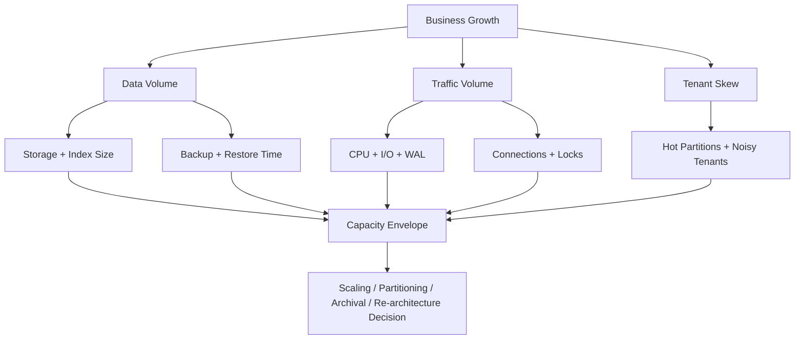
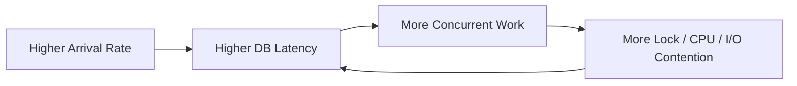
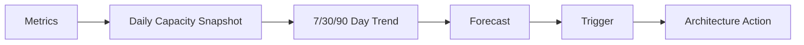

# Part 056 — Capacity Planning and Growth Model

Capacity planning is not guessing how large the database should be.

It is modelling when the database will become unsafe, slow, expensive, or operationally difficult as demand grows.

A weak capacity plan says:

> We have a big database instance, so we are fine.

A strong capacity plan says:

> At current growth, the audit table reaches 4.8B rows in 14 months. The current partitioning strategy still supports retention purge, but index size exceeds memory by Q3, replica replay becomes the limiting factor during peak write bursts, and backup restore time exceeds RTO by November unless we change backup topology or archival strategy.

Capacity is a multidimensional envelope.



This part teaches how to build that envelope.

---

## 1. Core Mental Model

Capacity planning is a function of four things:

```text
capacity_required = demand × data_shape × workload_cost × safety_margin
```

Where:

- **demand** = users, tenants, TPS, QPS, batch jobs, reports, integrations
- **data shape** = row count, row width, history, indexes, partitions, skew, retention
- **workload cost** = CPU, memory, I/O, WAL, locks, network per operation
- **safety margin** = headroom for spikes, failover, maintenance, incidents, growth uncertainty

If you ignore any of these, the plan is incomplete.

Capacity is not just storage.

It includes:

- CPU
- memory
- buffer cache
- storage size
- storage IOPS
- storage throughput
- write-ahead log throughput
- network throughput
- connection capacity
- lock/concurrency capacity
- replica apply capacity
- backup window
- restore time
- maintenance work
- partition count
- index size
- operational human capacity
- cost envelope

A database can have enough disk and still be out of capacity because p99 latency fails, replica lag grows, or backup restore exceeds RTO.

---

## 2. Stop Guessing Capacity

Cloud infrastructure can make capacity easier to change, but it does not remove the need to understand demand.

The AWS Well-Architected reliability guidance explicitly frames “stop guessing capacity” as a design principle: monitor demand and utilization, then add or remove resources to satisfy demand without over- or under-provisioning.

For databases, this principle has a catch:

- vertical scaling may require failover/restart
- storage grows easily, but I/O and restore time may not
- partitioning is hard to retrofit
- sharding is much harder to retrofit
- indexes grow invisibly until memory/I/O behavior changes
- retention mistakes become expensive years later
- large tenants can break assumptions before total system volume does

Capacity planning must happen before the database is in pain.

---

## 3. Capacity Dimensions

### 3.1 Storage Capacity

Storage includes:

- table data
- indexes
- TOAST/large object storage
- WAL files
- temporary files
- bloat/dead tuples
- materialized views
- projections
- archive partitions
- backup snapshots
- replication slots retained WAL

Do not estimate only table rows.

### 3.2 CPU Capacity

CPU is consumed by:

- query execution
- joins
- aggregation
- sorting
- JSON processing
- compression/decompression
- encryption
- constraint checks
- triggers
- query planning
- background workers
- replication apply
- autovacuum

CPU bottlenecks often appear after query complexity or concurrency grows, not merely after storage grows.

### 3.3 Memory Capacity

Memory is consumed by:

- buffer cache
- connection overhead
- sort/hash memory
- maintenance operations
- prepared statement caches
- OS page cache
- background workers

A system can degrade when the working set no longer fits in memory.

### 3.4 I/O Capacity

I/O includes:

- random reads
- sequential reads
- random writes
- WAL writes
- checkpoint writes
- vacuum reads/writes
- index maintenance
- temporary file spills
- backup reads
- replication reads

Storage capacity in GB is not the same as storage performance.

### 3.5 WAL Capacity

Write-heavy systems are often limited by WAL throughput.

WAL grows with:

- inserts
- updates
- deletes
- index modifications
- full-page writes after checkpoint
- bulk backfills
- table rewrites
- outbox/audit writes
- high-churn tables

A design with many indexes and audit/outbox tables may generate much more WAL than table-size growth suggests.

### 3.6 Connection Capacity

Connections consume memory and scheduling overhead.

Capacity must define:

- maximum database connections
- application pool size per service
- number of service replicas
- background worker connections
- migration/admin connections
- reporting connections
- failover surge behavior

The database is not a free connection sink.

### 3.7 Lock/Concurrency Capacity

Some designs saturate on locks before CPU or I/O.

Examples:

- one counter row per tenant
- one queue row for all workers
- parent-row locking for high-frequency child inserts
- hot account balance row
- global sequence-like business identifier
- high-contention state transition

Capacity planning must include contention hotspots.

### 3.8 Operational Capacity

Operational capacity includes:

- backup duration
- restore duration
- migration duration
- vacuum/maintenance duration
- index rebuild duration
- failover duration
- incident diagnosis complexity
- on-call ability to operate system safely

A design is not production-ready if humans cannot recover it within required time.

---

## 4. Build a Demand Model

Start from business/product growth.

```yaml
business_growth:
  tenants:
    current: 120
    monthly_growth: 8
    projected_12_months: 216
  users:
    current_active_daily: 25_000
    monthly_growth_percent: 5
  cases:
    created_per_day_current: 180_000
    created_per_day_projected_12_months: 420_000
  evidence_documents:
    avg_per_case: 3.5
    p95_per_case: 20
    p99_per_case: 120
  audit_events:
    avg_per_case_lifetime: 25
  retention:
    cases_years: 7
    audit_years: 10
```

Translate this into database growth.

---

## 5. Entity Growth Model

For each major table, estimate row growth.

```yaml
table_growth:
  cases:
    current_rows: 80_000_000
    daily_insert_rows: 180_000
    monthly_insert_rows: 5_400_000
    yearly_insert_rows: 65_700_000
    retention_years: 7
  evidence_metadata:
    current_rows: 260_000_000
    daily_insert_rows: 630_000
    yearly_insert_rows: 229_950_000
    retention_years: 7
  audit_event:
    current_rows: 1_800_000_000
    daily_insert_rows: 4_500_000
    yearly_insert_rows: 1_642_500_000
    retention_years: 10
  outbox_event:
    current_rows: 50_000_000
    daily_insert_rows: 1_200_000
    retention_days: 14
```

Do not average everything together.

Audit, outbox, timeline, and history tables often grow faster than the root entity table.

---

## 6. Storage Growth Formula

A rough storage model:

```text
monthly_table_growth = monthly_rows × avg_row_size_bytes
monthly_index_growth = monthly_rows × sum(avg_index_entry_size_bytes)
monthly_bloat_budget = (table_growth + index_growth) × expected_bloat_factor
monthly_total_growth = table_growth + index_growth + bloat_budget + derived_storage_growth
```

Example:

```yaml
cases_storage_model:
  monthly_rows: 5_400_000
  avg_heap_row_size_bytes: 700
  indexes:
    cases_pkey: 32
    idx_cases_tenant_status_created: 64
    idx_cases_assignee_open: 56
    idx_cases_case_number: 48
  total_index_entry_size_bytes: 200
  monthly_heap_growth_gb: 3.52
  monthly_index_growth_gb: 1.01
  bloat_budget_percent: 20
  monthly_total_growth_gb: 5.44
```

For audit tables:

```yaml
audit_storage_model:
  monthly_rows: 135_000_000
  avg_heap_row_size_bytes: 900
  total_index_entry_size_bytes: 160
  monthly_heap_growth_gb: 113.2
  monthly_index_growth_gb: 20.1
  bloat_budget_percent: 10
  monthly_total_growth_gb: 146.6
```

Audit/history can dominate storage.

---

## 7. Index Amplification

Index amplification is the ratio of index storage to table storage.

```text
index_amplification = total_index_size / table_heap_size
```

If a table has 1 TB heap and 2 TB indexes, index amplification is 2.0.

High index amplification increases:

- storage cost
- backup size
- restore time
- insert/update/delete cost
- WAL volume
- cache pressure
- vacuum cost
- replication apply work

Every index must justify itself.

Index capacity review:

```yaml
index_capacity_review:
  table: cases
  heap_size_gb: 900
  index_size_gb: 1400
  index_amplification: 1.56
  indexes:
    - name: cases_pkey
      purpose: identity lookup
      keep: true
    - name: idx_cases_tenant_status_created
      purpose: open case list
      keep: true
    - name: idx_cases_assignee_open
      purpose: user queue
      keep: true
    - name: idx_cases_priority
      purpose: unknown
      usage_last_30_days: low
      action: review/drop
```

Capacity planning is also index governance.

---

## 8. WAL Growth Model

WAL is often the hidden bottleneck.

Estimate WAL per operation from measurement, not pure theory.

```yaml
wal_measurement:
  create_case:
    avg_wal_bytes: 18_000
  assign_case:
    avg_wal_bytes: 12_500
  add_evidence_metadata:
    avg_wal_bytes: 8_000
  audit_only_event:
    avg_wal_bytes: 4_000
```

Then model peak WAL:

```text
wal_bytes_per_second = sum(operation_tps × avg_wal_bytes_per_operation)
```

Example:

```yaml
peak_wal_model:
  create_case:
    tps: 150
    wal_bytes_per_op: 18_000
    wal_mb_per_sec: 2.57
  assign_case:
    tps: 200
    wal_bytes_per_op: 12_500
    wal_mb_per_sec: 2.38
  add_evidence:
    tps: 300
    wal_bytes_per_op: 8_000
    wal_mb_per_sec: 2.29
  audit_event:
    tps: 900
    wal_bytes_per_op: 4_000
    wal_mb_per_sec: 3.43
  total_peak_wal_mb_per_sec: 10.67
```

Now compare against:

- storage write throughput
- WAL disk capacity
- archive throughput
- replica replay capacity
- network throughput
- backup/PITR assumptions

WAL capacity matters for durability, replication, recovery, and storage pressure.

---

## 9. Backup and Restore Capacity

Capacity planning must include restore time.

Storage size alone is not the risk. Restore duration is.

```yaml
restore_capacity_model:
  database_size_tb: 8
  backup_restore_throughput_mb_per_sec: 500
  estimated_restore_seconds: 16777
  estimated_restore_hours: 4.66
  rto_hours: 2
  status: fails_rto
```

If restore time exceeds RTO, options include:

- smaller failure domains
- partition-level restore strategy
- warm standby
- more frequent snapshots
- cross-region replica
- archival split
- reduce retained hot data
- tenant isolation for critical tenants
- faster storage/restore pipeline

A system with 10-year retention in the primary OLTP database may be easy to query and hard to recover.

---

## 10. Memory and Working Set Model

The database does not need all data in memory.

It needs the working set in memory.

Working set includes:

- hot indexes
- frequently accessed table pages
- active tenant data
- queue rows
- recent timeline data
- lookup/reference tables
- current-state rows

Model it:

```yaml
working_set:
  hot_tenant_count: 20
  hot_cases_per_tenant: 500_000
  hot_case_row_size_bytes: 700
  hot_case_heap_gb: 6.52
  hot_case_index_gb: 9.8
  hot_audit_recent_gb: 12
  hot_lookup_gb: 2
  estimated_working_set_gb: 30.32
  available_memory_for_cache_gb: 90
  status: healthy
```

If the working set exceeds effective cache memory, expect more reads from storage and higher tail latency.

Beware: reporting queries can evict OLTP working set.

---

## 11. CPU Capacity Model

CPU capacity is best measured from benchmarks.

Example:

```yaml
cpu_measurement:
  benchmark_load:
    tps: 500
    qps: 3000
    cpu_utilization_percent: 55
  projected_peak:
    tps: 900
    qps: 5400
    estimated_cpu_percent_linear: 99
  conclusion: CPU may saturate before projected peak
```

But CPU rarely scales perfectly linearly.

At higher load, additional costs appear:

- lock waits
- context switching
- cache misses
- connection overhead
- plan instability
- memory pressure
- I/O waits
- retry amplification

Use benchmark curves, not simple multiplication alone.

---

## 12. I/O Capacity Model

Track four I/O categories:

1. read IOPS
2. write IOPS
3. read throughput
4. write throughput

For OLTP, random I/O and latency matter.

For backup/reporting, throughput matters.

For WAL, sequential write latency matters.

```yaml
io_capacity:
  storage:
    provisioned_iops: 16000
    provisioned_throughput_mb_sec: 1000
  measured_peak:
    read_iops: 7000
    write_iops: 4500
    read_throughput_mb_sec: 250
    write_throughput_mb_sec: 180
    avg_read_latency_ms: 1.2
    avg_write_latency_ms: 1.8
  projected_12_month_peak:
    read_iops: 14000
    write_iops: 9000
    read_throughput_mb_sec: 500
    write_throughput_mb_sec: 360
  risk:
    iops_headroom_low: true
```

Headroom matters because maintenance tasks also need I/O.

---

## 13. Connection Capacity Model

A common failure mode:

```text
services × replicas × pool_size > database max_connections
```

Example:

```yaml
connection_model:
  database_max_connections: 600
  reserved_admin_connections: 20
  reserved_background_connections: 30
  available_app_connections: 550
  services:
    case_service:
      replicas: 20
      pool_size: 20
      total: 400
    search_service:
      replicas: 10
      pool_size: 10
      total: 100
    report_service:
      replicas: 5
      pool_size: 15
      total: 75
  total_requested: 575
  status: exceeds_available_app_connections
```

The fix may be:

- reduce pool sizes
- use pooling middleware
- separate reporting connection pool
- separate read replicas
- limit service replicas
- backpressure at application layer
- queue batch/report jobs

More connections are not always more capacity.

---

## 14. Little's Law for Database Thinking

A useful approximation:

```text
concurrency = throughput × latency
```

If a system handles 1,000 requests/sec and each request spends 100 ms in DB, average concurrent DB work is:

```text
1000 × 0.1 = 100 concurrent operations
```

If latency rises to 500 ms at same arrival rate:

```text
1000 × 0.5 = 500 concurrent operations
```

Latency creates concurrency.

Concurrency creates contention.

Contention creates more latency.

This feedback loop causes collapse.



Capacity planning must include this nonlinear effect.

---

## 15. Headroom Policy

Running a database at 95% utilization is fragile.

Define headroom explicitly.

```yaml
headroom_policy:
  cpu:
    normal_max: 60%
    peak_max: 75%
    emergency_max: 85%
  storage:
    used_max: 70%
    emergency_expand_at: 80%
  iops:
    normal_max: 60%
    peak_max: 75%
  connections:
    normal_max: 60%
    peak_max: 75%
  replication_lag:
    normal_p95_seconds: 5
    emergency_seconds: 60
  wal_archive_lag:
    normal_minutes: 2
    emergency_minutes: 10
```

Headroom is not waste. It buys:

- spikes
- failover
- noisy neighbor absorption
- maintenance
- backup
- index creation
- backfills
- incident response
- traffic forecasting error

---

## 16. Tenant Skew Capacity Model

Multi-tenant capacity is rarely about average tenant size.

Average tenant:

```text
100M cases / 500 tenants = 200k cases per tenant
```

But real distribution may be:

```text
largest tenant = 25M cases
second largest = 14M cases
long tail median = 40k cases
```

Plan for:

- largest tenant
- top 1% tenants
- noisy tenant traffic bursts
- tenant-specific reports
- tenant restore
- tenant migration
- tenant-level retention/legal hold
- tenant-level search projection rebuild

Capacity model:

```yaml
tenant_skew:
  total_tenants: 500
  largest_tenant_cases: 25_000_000
  p99_tenant_cases: 12_000_000
  median_tenant_cases: 40_000
  largest_tenant_daily_writes: 80_000
  top_5_tenants_share_of_traffic: 35%
  risk:
    noisy_neighbor: high
    large_tenant_query_plan_skew: high
```

Average-based planning fails multi-tenant systems.

---

## 17. Retention and Archival Capacity

Retention policy determines long-term capacity.

Questions:

- How long is data retained online?
- How long is it retained in warm archive?
- How long is it retained in cold archive?
- What is the legal hold behavior?
- Is deletion physical or logical?
- Are backups allowed to retain deleted personal data?
- Can reports query archive data?
- Can cases be restored from archive?

Retention model:

```yaml
retention_model:
  cases:
    hot_online: 2 years
    warm_archive: 5 years
    cold_archive: 10 years
  audit_event:
    hot_online: 1 year
    warm_archive: 9 years
    immutable: true
  outbox_event:
    hot_online: 14 days
    hard_delete_after: 30 days
  idempotency_key:
    hot_online: 7 days
    hard_delete_after: 30 days
```

Without retention control, storage grows forever.

---

## 18. Partitioning Capacity Model

Partitioning changes capacity operations.

Useful partition dimensions:

- time
- tenant
- region
- status/lifecycle
- hash bucket

For time-partitioned audit events:

```yaml
partition_model:
  table: audit_event
  partition_strategy: monthly_range
  rows_per_month: 135_000_000
  avg_partition_size_gb: 145
  hot_partitions: current_month + previous_month
  retention_months: 120
  expected_total_partitions: 120
  purge_method: detach_and_drop_partition
```

Review:

- partition count
- partition size
- partition pruning effectiveness
- index strategy per partition
- maintenance window
- backup/restore impact
- query complexity
- partition creation automation
- old partition archival

Partitioning should be designed before tables become unmanageable.

---

## 19. Growth Forecasting

Use multiple forecast scenarios.

```yaml
forecast_scenarios:
  conservative:
    case_growth_monthly: 3%
    traffic_growth_monthly: 4%
  expected:
    case_growth_monthly: 7%
    traffic_growth_monthly: 8%
  aggressive:
    case_growth_monthly: 15%
    traffic_growth_monthly: 20%
  event_spike:
    traffic_multiplier: 5x
    duration_hours: 6
```

Capacity planning should not use a single optimistic line.

Create forecast tables:

| Month | Cases Rows | Audit Rows | DB Size | Peak TPS | CPU Peak | Storage Used | Risk |
|---:|---:|---:|---:|---:|---:|---:|---|
| 0 | 80M | 1.8B | 3.2TB | 500 | 55% | 45% | healthy |
| 3 | 98M | 2.2B | 4.0TB | 650 | 64% | 55% | monitor |
| 6 | 118M | 2.7B | 5.1TB | 820 | 77% | 68% | scale soon |
| 9 | 142M | 3.2B | 6.4TB | 1050 | 90% | 81% | unsafe |
| 12 | 170M | 3.9B | 8.1TB | 1350 | >100% | 96% | fails |

This makes timing visible.

---

## 20. Capacity Envelope

The capacity envelope is the safe operating region.

Example:

```yaml
capacity_envelope:
  safe_until:
    cases_rows: 120_000_000
    audit_rows: 2_700_000_000
    peak_tps: 800
    database_size_tb: 5
  limiting_factor:
    primary: CPU under mixed workload
    secondary: audit storage growth
    tertiary: restore time
  required_actions_before_limit:
    - move dashboard counts to projection
    - partition audit_event monthly
    - increase storage throughput
    - run restore drill on 5TB snapshot
    - review unused indexes on cases
```

The envelope must state the limiting factor.

If you do not know the limiting factor, you do not have a capacity model.

---

## 21. Scaling Triggers

Capacity planning should produce triggers.

```yaml
scaling_triggers:
  vertical_scale:
    condition: cpu_p95_peak > 70% for 7 days
    action: scale instance during maintenance window
  storage_expand:
    condition: storage_used > 70% or projected_60_days > 80%
    action: increase allocated storage and IOPS
  partitioning_required:
    condition: audit_event projected > 2B rows or partition size > 200GB
    action: implement monthly partitions
  read_replica_required:
    condition: primary_read_cpu > 40% from read-only queries
    action: route eligible reads to replica
  archival_required:
    condition: hot_data_retention_exceeds_2_years
    action: move closed cases older than 2 years to archive tier
  sharding_review:
    condition: largest_tenant exceeds 30% primary workload
    action: evaluate tenant isolation/cell architecture
```

Triggers convert capacity planning into action.

---

## 22. Scaling Options and Tradeoffs

| Option | Helps | Costs/Risks |
|---|---|---|
| Bigger instance | CPU/memory | failover/restart, cost, vertical limit |
| More IOPS/throughput | storage bottleneck | cost, does not fix bad queries |
| Read replicas | read load | stale reads, lag, routing complexity |
| Partitioning | maintenance, pruning, retention | design complexity, query constraints |
| Archival | storage/restore/hot set | query complexity, product behavior |
| Index cleanup | write/storage/cache | risk if usage misunderstood |
| Query rewrite | CPU/I/O/latency | application changes |
| Projection/read model | dashboard/search load | eventual consistency, rebuild path |
| Sharding/cells | tenant isolation/scale | operational complexity |
| Database-per-tenant | isolation/restore | high operational overhead |
| Distributed SQL | multi-region/scale | latency/transaction complexity/cost |

Scaling is not just adding hardware.

Often the correct capacity move is changing data lifecycle or query architecture.

---

## 23. Cost Capacity Model

Capacity must include cost.

Database cost includes:

- compute
- storage
- provisioned IOPS
- backups
- snapshots
- cross-region replication
- data transfer
- monitoring/logging
- read replicas
- support/operations
- migration time
- engineer time

Example:

```yaml
monthly_cost_model:
  primary_compute: 4200
  read_replicas: 3600
  storage: 1800
  provisioned_iops: 2400
  backups: 900
  cross_region_replication: 1200
  monitoring_logs: 500
  total_usd: 14600
```

Cost review questions:

- Which indexes are expensive and unused?
- Which data can be archived?
- Which reports should leave OLTP?
- Which tenants drive most cost?
- Should large tenants be isolated and priced differently?
- Are backups retaining unnecessary data?
- Are replicas serving enough reads to justify cost?

Capacity planning is also financial architecture.

---

## 24. Capacity and Reliability

Capacity failures are reliability failures.

Common examples:

- disk fills and database stops accepting writes
- WAL archive lags and PITR window is threatened
- replica lag breaks stale-read contract
- CPU saturation causes timeout storm
- connection exhaustion takes app down
- backup restore exceeds RTO
- autovacuum cannot keep up and bloat grows
- partition count grows without automation
- large tenant report takes down primary

Reliability planning must include capacity thresholds.

---

## 25. Capacity and Security/Compliance

Security/compliance requirements affect capacity.

Examples:

- audit retention increases storage
- encryption increases CPU overhead
- row-level security adds predicate cost
- data masking/projection creates derived storage
- legal hold prevents purge
- right-to-erasure requires delete propagation
- access audit creates more write volume
- immutable logs need archival strategy
- tenant data residency may require regional duplication

Do not treat compliance as metadata. It changes capacity.

---

## 26. Capacity Review for a New Feature

When reviewing a feature, require a capacity section.

```yaml
feature_capacity_review:
  feature: case_risk_scoring
  new_tables:
    - case_risk_score
    - case_risk_score_history
  row_growth:
    case_risk_score: one per case
    case_risk_score_history: avg 5 per case per year
  new_indexes:
    - tenant_id, risk_score desc, updated_at desc
  write_amplification:
    on_case_update: +1 history row
  read_workload:
    high_risk_queue: interactive
    risk_trend_report: analytical
  retention:
    history_years: 7
  estimated_12_month_storage_gb: 650
  risks:
    - high-risk queue may become hot query
    - history table grows faster than root table
    - report should not run on OLTP primary
```

No production feature should add unbounded data without capacity review.

---

## 27. Database Capacity Dashboard

A production capacity dashboard should show trend, not just current value.

Include:

- database size over time
- table size top N
- index size top N
- index amplification by table
- row count estimates
- daily insert/update/delete rate
- WAL generated per day
- backup size and duration
- restore drill duration
- CPU p50/p95/p99
- I/O latency p95
- storage used percent and projected exhaustion date
- connection usage
- lock waits
- dead tuples/bloat indicators
- autovacuum lag
- replication lag
- largest tenant data/traffic share
- query latency top N by total time and p95

Trend is more important than snapshot.



---

## 28. Forecasting Storage Exhaustion

A simple forecast:

```text
days_until_full = (usable_storage - current_used_storage) / daily_growth
```

Example:

```yaml
storage_forecast:
  usable_storage_tb: 10
  current_used_tb: 6.5
  daily_growth_gb: 35
  days_until_80_percent: 42
  days_until_90_percent: 71
  days_until_full: 102
```

But use multiple growth rates:

- last 7 days
- last 30 days
- last 90 days
- projected product launch impact
- worst-case import/backfill impact

If the forecast says 102 days to full, do not wait 100 days.

---

## 29. Forecasting Restore Failure

Restore time grows with data size.

```yaml
restore_forecast:
  current_db_size_tb: 5
  restore_time_hours_current: 2.5
  projected_db_size_tb_12m: 9
  estimated_restore_time_hours_12m: 4.5
  rto_hours: 3
  action_required_by: before_db_size_reaches_6TB
```

Capacity risk is not only “disk full”.

It is also “we can no longer recover within business requirements.”

---

## 30. Forecasting WAL/Replication Failure

If WAL generation exceeds replica replay capacity, lag grows.

```yaml
replication_capacity:
  normal_wal_mb_sec: 8
  peak_wal_mb_sec: 35
  replica_replay_capacity_mb_sec: 28
  peak_duration_minutes: 30
  expected_lag_growth_mb: 12_600
  risk: replica_lag_exceeds_freshness_contract
```

Mitigations:

- reduce write amplification
- reduce indexes
- scale replica
- improve storage throughput
- batch writes differently
- throttle backfills
- separate analytical replicas
- adjust freshness contract

Replica lag is a capacity signal.

---

## 31. Forecasting Hotspot Failure

Some limits do not scale with total hardware.

Example: single hot row.

```text
UPDATE tenant_counter
SET next_number = next_number + 1
WHERE tenant_id = $1;
```

This row can serialize all case creation for a large tenant.

Capacity model:

```yaml
hotspot_model:
  operation: allocate_case_number
  current_largest_tenant_tps: 40
  projected_largest_tenant_tps: 200
  measured_row_lock_saturation_tps: 90
  risk: largest tenant growth exceeds hot-row capacity
  mitigation: range allocation or sequence-per-tenant strategy
```

Hardware may not fix serialization bottlenecks.

---

## 32. Case Study: Capacity Plan for Case Management

### 32.1 Current State

```yaml
current_state:
  tenants: 120
  cases: 80_000_000
  evidence_metadata: 260_000_000
  audit_events: 1_800_000_000
  database_size_tb: 3.2
  peak_tps: 500
  peak_qps: 3000
  largest_tenant_case_share: 18%
  restore_time_hours: 1.7
```

### 32.2 12-Month Expected State

```yaml
expected_12_month_state:
  tenants: 216
  cases: 150_000_000
  evidence_metadata: 510_000_000
  audit_events: 3_600_000_000
  database_size_tb: 7.4
  peak_tps: 1200
  peak_qps: 7200
  largest_tenant_case_share: 24%
  restore_time_hours_estimated: 3.9
```

### 32.3 Risks

```yaml
risks:
  - audit_event table becomes operationally heavy without partitioning
  - restore time exceeds 3h RTO by month 8
  - dashboard exact counts overload primary for largest tenants
  - largest tenant may create noisy-neighbor issue
  - WAL generation during backfills may create replica lag
  - index amplification on cases exceeds 1.5x
```

### 32.4 Decisions

```yaml
architecture_decisions:
  - partition audit_event by month before 2.5B rows
  - move dashboard counts to async summary table
  - introduce tenant-level capacity dashboard
  - review/drop unused indexes before next major growth phase
  - set storage expansion trigger at 70% projected 60-day usage
  - run quarterly restore drill
  - evaluate cell isolation for top 5 tenants
```

That is a capacity plan.

---

## 33. Capacity Planning Anti-Patterns

### 33.1 Planning Only Disk

Disk is only one dimension. CPU, I/O, WAL, connections, restore time, and lock capacity matter.

### 33.2 Using Average Tenant

Average tenant hides large-tenant failure.

### 33.3 Ignoring Index Growth

Index size can exceed table size.

### 33.4 Ignoring Audit/History

Audit and history often dominate long-term storage.

### 33.5 No Restore-Time Forecast

A backup that exists but cannot be restored within RTO is not enough.

### 33.6 No Backfill Capacity

Backfills can consume WAL, I/O, and vacuum capacity.

### 33.7 No Spike Scenario

Peak events, imports, campaigns, deadlines, and regulatory submissions create non-average demand.

### 33.8 No Human Operating Model

If only one expert can safely operate the database at scale, operational capacity is low.

### 33.9 Over-scaling Instead of Fixing Design

Bigger hardware does not fix bad query shape, hot rows, unbounded history, or missing archival.

### 33.10 No Trigger-Based Actions

A forecast without action thresholds becomes a document nobody uses.

---

## 34. Capacity Planning Checklist

Business demand:

- [ ] Tenant growth model exists
- [ ] User growth model exists
- [ ] Transaction growth model exists
- [ ] Batch/import/report growth is modelled
- [ ] Spike scenarios are modelled

Data growth:

- [ ] Row growth per major table is estimated
- [ ] Row width is estimated/measured
- [ ] Index growth is estimated
- [ ] Audit/history growth is estimated
- [ ] Retention and archival are defined
- [ ] Bloat budget is included

Resource capacity:

- [ ] CPU capacity is benchmarked
- [ ] Memory/working set is estimated
- [ ] I/O capacity is measured
- [ ] WAL capacity is measured
- [ ] Connection capacity is modelled
- [ ] Lock hotspot capacity is reviewed
- [ ] Replica replay capacity is tested

Operational capacity:

- [ ] Backup size trend is monitored
- [ ] Restore time is tested
- [ ] RPO/RTO remain achievable
- [ ] Migration/backfill capacity is known
- [ ] Partition/archival automation exists where needed
- [ ] Incident runbooks include capacity failures

Governance:

- [ ] Scaling triggers are defined
- [ ] Cost forecast exists
- [ ] Large tenant/noisy neighbor policy exists
- [ ] Capacity dashboard exists
- [ ] Forecast reviewed regularly

---

## 35. Sources and Further Reading

- AWS Well-Architected Framework — Reliability Pillar: `https://docs.aws.amazon.com/wellarchitected/latest/reliability-pillar/welcome.html`
- AWS Well-Architected Framework — Design Principles, Stop Guessing Capacity: `https://docs.aws.amazon.com/wellarchitected/latest/framework/rel-dp.html`
- AWS Well-Architected Framework — Performance Efficiency Pillar: `https://docs.aws.amazon.com/wellarchitected/latest/performance-efficiency-pillar/welcome.html`
- PostgreSQL Documentation — Monitoring Database Activity: `https://www.postgresql.org/docs/current/monitoring.html`
- PostgreSQL Documentation — The Cumulative Statistics System: `https://www.postgresql.org/docs/current/monitoring-stats.html`
- PostgreSQL Documentation — `pgbench`: `https://www.postgresql.org/docs/current/pgbench.html`
- PostgreSQL Documentation — Routine Vacuuming: `https://www.postgresql.org/docs/current/routine-vacuuming.html`
- PostgreSQL Documentation — WAL Configuration: `https://www.postgresql.org/docs/current/runtime-config-wal.html`

---

## 36. Final Mental Model

Capacity planning is not a spreadsheet exercise.

It is the act of making future failure visible early enough that architecture can still change cheaply.

The question is not:

> How big should the database be?

The real question is:

> Under projected business growth, which database resource or design assumption fails first, when will it fail, how will we know, and what action must happen before that point?

Part 057 continues this by zooming into one of the hardest capacity problems: hotspots, skew, and high-cardinality workloads.
