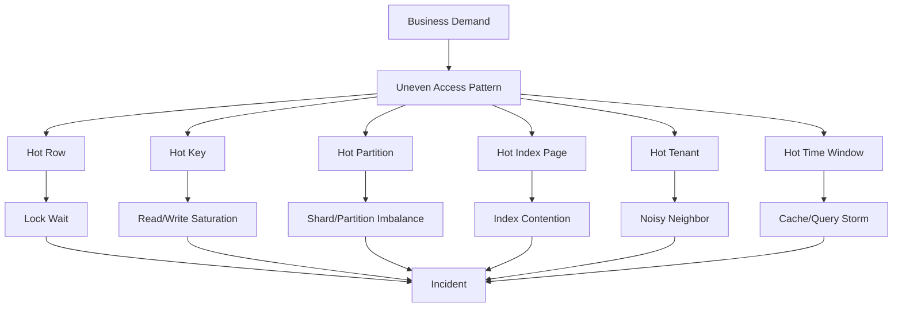
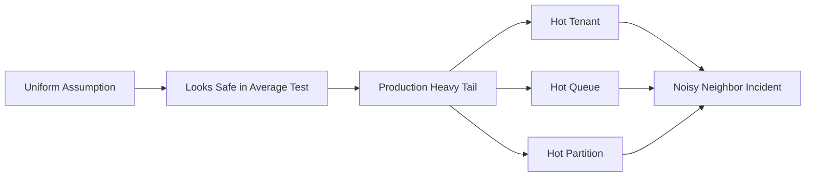
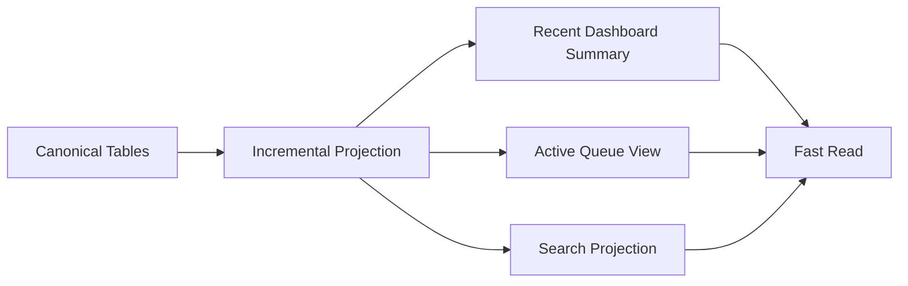
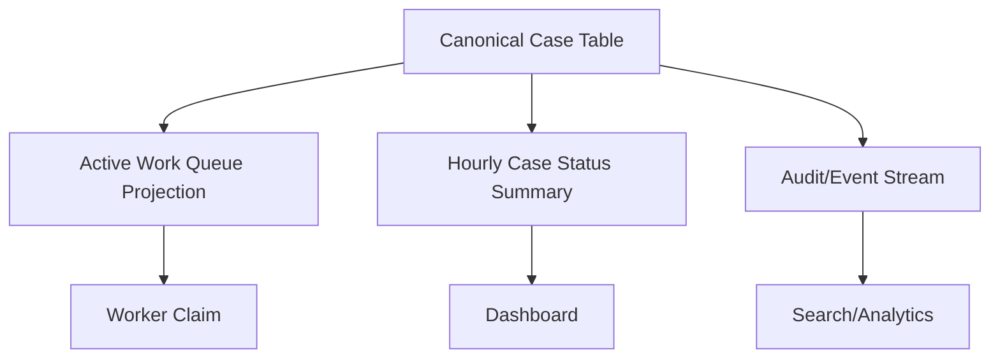
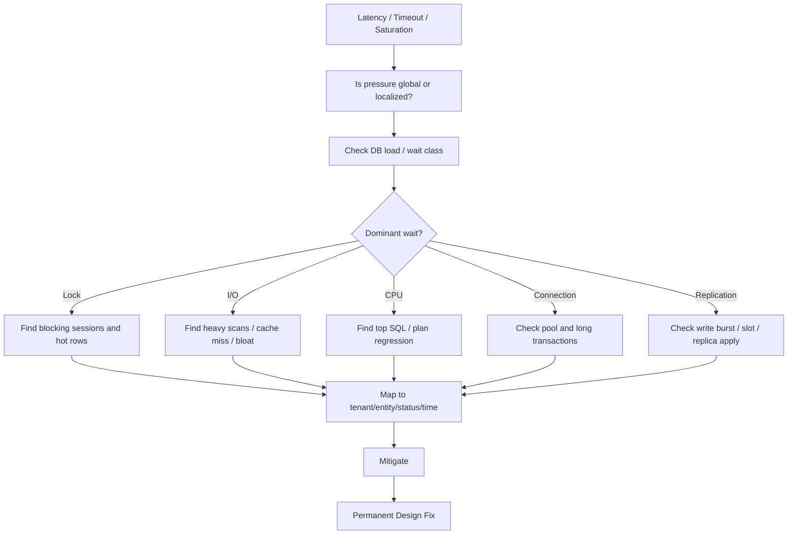

# Part 057 — Hotspots, Skew, and High Cardinality

A database rarely fails because the average workload is too large.

It fails because the workload is uneven.

One tenant writes 200x more than the median tenant. One status value dominates the table. One queue partition receives almost all jobs. One parent row is locked by every transaction. One index leaf page receives all inserts. One dashboard query scans the same recent time window every five seconds. One observability label explodes into millions of unique series.

That is the real shape of production.

Averages hide it.

```text
average QPS = total QPS / total users
```

This number is often useless for architecture.

A stronger question is:

```text
Where is the pressure concentrated?
```

This part teaches how to reason about that concentration.



Hotspots, skew, and high cardinality are not isolated topics. They are the same architectural problem viewed from different angles:

- **hotspot** asks: where is the pressure concentrated?
- **skew** asks: how uneven is the distribution?
- **high cardinality** asks: how many distinct values exist, and what does that do to indexes, partitions, metrics, caches, and query plans?

A top-level database architect does not only ask whether the schema is normalized or indexed. They ask whether the data distribution will remain safe under growth.

---

## 1. Core Mental Model

Every database operation touches a physical or logical place.

That place may be:

- a row
- an index leaf page
- a table partition
- a shard
- a tenant
- a queue bucket
- a time range
- a lock
- a connection pool
- a replica
- a cache entry
- an observability time series

When too many operations converge on the same place, that place becomes a hotspot.

```text
hotspot = concentrated demand on limited concurrency capacity
```

Skew is the unevenness that creates hotspots.

```text
skew = max(entity_load) / median(entity_load)
```

High cardinality is the number of distinct values in a dimension.

```text
cardinality(column) = count(distinct column)
```

But high cardinality is not automatically bad.

High cardinality can be good for a B-tree lookup because it improves selectivity.

High cardinality can be bad for metrics labels because it creates unbounded time series.

High cardinality can be good for tenant isolation because each tenant has a distinct key.

High cardinality can be bad for partitioning if each partition becomes tiny and impossible to manage.

The skill is not memorizing whether high cardinality is good or bad. The skill is knowing which subsystem is affected.

---

## 2. Three Different Questions That People Confuse

### 2.1 Is the value selective?

This matters for query planning and indexing.

Example:

```sql
SELECT *
FROM enforcement_case
WHERE case_number = 'CASE-2026-00001234';
```

`case_number` is likely high-cardinality and highly selective.

A B-tree index can be excellent.

### 2.2 Is the value evenly distributed?

This matters for sharding, partitioning, replica load, queue routing, and tenant isolation.

Example:

```text
tenant_id = TINY_AGENCY     -> 100 rows/day
tenant_id = NATIONAL_AGENCY -> 25,000,000 rows/day
```

`tenant_id` may have high cardinality, but the distribution is skewed.

Sharding by `tenant_id` alone may still create a hot shard.

### 2.3 Is the value bounded?

This matters for observability, indexing metadata, partitions, caches, and operational control.

Example:

```text
metric label: case_id
```

`case_id` is high-cardinality and unbounded.

Using it as a metric label can destroy metric storage and query performance.

A value can be selective, uneven, and unbounded at the same time.

You must evaluate all three.

---

## 3. Taxonomy of Hotspots

A hotspot is not one thing. Diagnose which kind you have.

| Hotspot Type | Symptom | Usual Root Cause | Typical Fix |
|---|---|---|---|
| Hot row | lock waits on one row | counter, parent aggregate, workflow state row | append-only events, bucketed counter, parent lock redesign |
| Hot key | high reads/writes for one key | popular entity, queue key, tenant key | caching, bucketing, isolation, rate limit |
| Hot index page | insert contention at right edge | monotonic key, timestamp-leading index | key randomization, hash prefix, partitioning, fillfactor tuning |
| Hot partition | one partition/shard overloaded | bad partition/shard key, time skew | composite key, subpartition, tenant split, rebalancing |
| Hot tenant | one tenant dominates pooled system | noisy neighbor | tenant throttling, cell/silo migration, per-tenant pool |
| Hot time window | recent data queried constantly | dashboards, polling, recent-case queues | materialized summary, cache, time partition, incremental query |
| Hot status | low-cardinality state dominates | most rows are `OPEN` or `ACTIVE` | partial index, lifecycle split, archival |
| Hot queue | workers compete for same rows | naive FIFO queue table | sharded queue, `SKIP LOCKED`, lease, broker |
| Hot connection pool | threads wait for DB connections | pool under-sized or queries too slow | reduce query time, backpressure, pool governance |
| Hot metric label | observability overload | unbounded labels | dimension hygiene, exemplars, trace IDs instead of labels |

A production incident often combines several.

Example:

```text
One large tenant imports millions of cases.
The import writes to the same tenant partition.
Each insert updates the same tenant aggregate row.
The index is ordered by created_at.
The dashboard polls recent OPEN cases.
The system emits metrics with tenant_id and case_id labels.
```

That is not one bottleneck.

It is a hotspot cascade.

---

## 4. Skew: The Shape of Real Data

Uniform distribution is a dangerous assumption.

Most real workloads are heavy-tailed.

```text
small number of entities -> huge share of traffic
large number of entities -> tiny share of traffic
```

This appears as:

- a few tenants dominate workload
- a few customers generate most transactions
- a few products dominate reads
- a few statuses dominate row count
- recent time windows dominate access
- a few users trigger most exports
- a few workflow queues contain most waiting tasks
- one evidence type dominates storage

Averages are misleading because heavy-tail distributions do not behave like normal distributions.



The correct question is:

> What happens to p95, p99, max, and top-N entities?

Not:

> What is the average?

---

## 5. High Cardinality: Good, Bad, and Context-Dependent

High cardinality means many distinct values.

Examples:

- `case_id`
- `user_id`
- `tenant_id`
- `email_address`
- `request_id`
- `idempotency_key`
- `transaction_id`
- `document_hash`

Low cardinality means few distinct values.

Examples:

- `status`
- `gender`
- `is_deleted`
- `priority`
- `country_code` in a domestic system
- `case_type` if only a few types exist

### 5.1 High cardinality in B-tree indexes

Usually helpful when the query is selective.

```sql
CREATE UNIQUE INDEX ux_case_case_number
ON enforcement_case (case_number);
```

A lookup by `case_number` can find few rows.

### 5.2 Low cardinality in standalone indexes

Often weak.

```sql
CREATE INDEX idx_case_status
ON enforcement_case (status);
```

If 80% of rows are `OPEN`, this index may not help much for:

```sql
SELECT *
FROM enforcement_case
WHERE status = 'OPEN';
```

The planner may prefer a sequential scan because the result is huge.

But a low-cardinality column can be useful as the first column of a composite index when combined with selective filters or ordering.

```sql
CREATE INDEX idx_case_status_assignee_due
ON enforcement_case (status, assignee_id, due_at);
```

This can support:

```sql
SELECT id, case_number, due_at
FROM enforcement_case
WHERE status = 'OPEN'
  AND assignee_id = $1
ORDER BY due_at
LIMIT 50;
```

The question is not whether a column is high or low cardinality. The question is whether the index matches the query shape and data distribution.

### 5.3 High cardinality in metrics

Dangerous.

Bad:

```text
case_transition_latency_seconds{case_id="CASE-123", tenant_id="T-99"}
```

Better:

```text
case_transition_latency_seconds{tenant_tier="enterprise", transition="ASSIGN_TO_REVIEW"}
```

Put `case_id` in logs/traces, not metric labels.

### 5.4 High cardinality in partitioning

Can be either good or bad.

Partition by tenant can work when tenant count is moderate and tenants are balanced.

It can fail when:

- there are millions of tiny tenants
- one tenant dominates the data
- tenant migration requires cross-partition movement
- queries frequently span all tenants
- maintenance requires touching too many partitions

### 5.5 High cardinality in cache keys

Can reduce contention, but can also destroy hit rate.

Caching by `case_id` is safe if reads repeat.

Caching one-off export results by request ID may just fill cache with cold entries.

---

## 6. Detecting Skew in Data

Start with the distribution, not the index.

### 6.1 Top tenants by row count

```sql
SELECT tenant_id, count(*) AS row_count
FROM enforcement_case
GROUP BY tenant_id
ORDER BY row_count DESC
LIMIT 20;
```

### 6.2 Top tenants by write activity proxy

```sql
SELECT tenant_id,
       count(*) FILTER (WHERE created_at >= now() - interval '1 hour') AS rows_last_hour,
       count(*) FILTER (WHERE created_at >= now() - interval '1 day') AS rows_last_day
FROM enforcement_case
GROUP BY tenant_id
ORDER BY rows_last_hour DESC
LIMIT 20;
```

### 6.3 Status distribution

```sql
SELECT status, count(*) AS row_count
FROM enforcement_case
GROUP BY status
ORDER BY row_count DESC;
```

### 6.4 Assignee queue skew

```sql
SELECT assignee_id, status, count(*) AS open_cases
FROM enforcement_case
WHERE status IN ('OPEN', 'UNDER_REVIEW')
GROUP BY assignee_id, status
ORDER BY open_cases DESC
LIMIT 50;
```

### 6.5 Time-window concentration

```sql
SELECT date_trunc('hour', created_at) AS hour_bucket,
       count(*) AS row_count
FROM enforcement_case
WHERE created_at >= now() - interval '7 days'
GROUP BY hour_bucket
ORDER BY hour_bucket;
```

### 6.6 Size skew by evidence/document type

```sql
SELECT evidence_type,
       count(*) AS item_count,
       pg_size_pretty(sum(octet_length(payload::text))::bigint) AS approx_payload_size
FROM evidence_record
GROUP BY evidence_type
ORDER BY sum(octet_length(payload::text)) DESC
LIMIT 20;
```

This is not perfect for exact storage size, but it helps detect payload concentration.

### 6.7 Skew ratio

```sql
WITH tenant_counts AS (
    SELECT tenant_id, count(*) AS c
    FROM enforcement_case
    GROUP BY tenant_id
), ranked AS (
    SELECT c,
           percentile_cont(0.50) WITHIN GROUP (ORDER BY c) OVER () AS p50,
           percentile_cont(0.95) WITHIN GROUP (ORDER BY c) OVER () AS p95,
           max(c) OVER () AS max_c
    FROM tenant_counts
)
SELECT DISTINCT
       p50,
       p95,
       max_c,
       round(max_c / nullif(p50, 0), 2) AS max_to_p50_ratio,
       round(p95 / nullif(p50, 0), 2) AS p95_to_p50_ratio
FROM ranked;
```

A `max_to_p50_ratio` of 5 may be manageable.

A ratio of 500 means you do not have one workload. You have multiple workload classes sharing the same design.

---

## 7. Detecting Hot Queries

Data skew is only half the story. You also need workload skew.

If PostgreSQL `pg_stat_statements` is enabled, start with query fingerprints.

```sql
SELECT queryid,
       calls,
       total_exec_time,
       mean_exec_time,
       rows,
       shared_blks_hit,
       shared_blks_read,
       temp_blks_written,
       left(query, 160) AS query_sample
FROM pg_stat_statements
ORDER BY total_exec_time DESC
LIMIT 20;
```

Look for:

- high `calls` and moderate latency
- low `calls` and extreme latency
- huge `rows`
- high block reads
- temp writes indicating sort/hash spill
- query patterns that hit recent windows repeatedly
- query patterns with tenant filters missing
- query patterns that use `OFFSET` at high page numbers

The expensive query is not always the query with highest single latency.

A query that takes 20 ms but runs 50,000 times per minute can dominate the database.

---

## 8. Detecting Lock Hotspots

Lock hotspots show up as waits.

### 8.1 Active queries waiting on locks

```sql
SELECT pid,
       now() - query_start AS runtime,
       wait_event_type,
       wait_event,
       state,
       left(query, 200) AS query
FROM pg_stat_activity
WHERE wait_event_type = 'Lock'
ORDER BY runtime DESC;
```

### 8.2 Blocking tree

```sql
SELECT blocked.pid AS blocked_pid,
       blocked.usename AS blocked_user,
       now() - blocked.query_start AS blocked_duration,
       left(blocked.query, 160) AS blocked_query,
       blocking.pid AS blocking_pid,
       blocking.usename AS blocking_user,
       now() - blocking.query_start AS blocking_duration,
       left(blocking.query, 160) AS blocking_query
FROM pg_stat_activity blocked
JOIN pg_locks blocked_locks
  ON blocked_locks.pid = blocked.pid
JOIN pg_locks blocking_locks
  ON blocking_locks.locktype = blocked_locks.locktype
 AND blocking_locks.database IS NOT DISTINCT FROM blocked_locks.database
 AND blocking_locks.relation IS NOT DISTINCT FROM blocked_locks.relation
 AND blocking_locks.page IS NOT DISTINCT FROM blocked_locks.page
 AND blocking_locks.tuple IS NOT DISTINCT FROM blocked_locks.tuple
 AND blocking_locks.virtualxid IS NOT DISTINCT FROM blocked_locks.virtualxid
 AND blocking_locks.transactionid IS NOT DISTINCT FROM blocked_locks.transactionid
 AND blocking_locks.classid IS NOT DISTINCT FROM blocked_locks.classid
 AND blocking_locks.objid IS NOT DISTINCT FROM blocked_locks.objid
 AND blocking_locks.objsubid IS NOT DISTINCT FROM blocked_locks.objsubid
 AND blocking_locks.pid <> blocked_locks.pid
JOIN pg_stat_activity blocking
  ON blocking.pid = blocking_locks.pid
WHERE NOT blocked_locks.granted
  AND blocking_locks.granted;
```

This query is diagnostic, not a permanent dashboard. For production, wrap lock diagnostics into safe internal tooling.

### 8.3 Common lock hotspot smells

- one row updated by all writers
- parent row locked before child insert
- FK checks waiting on parent updates
- migration holding an `ACCESS EXCLUSIVE` lock
- long transaction keeping old versions alive
- workflow transition table updated in inconsistent order
- job workers claiming same queue rows without `SKIP LOCKED`

---

## 9. Hot Row Pattern

Hot row is one of the most common write bottlenecks.

Bad pattern:

```sql
UPDATE tenant_stats
SET total_cases = total_cases + 1,
    updated_at = now()
WHERE tenant_id = $1;
```

If one tenant is very active, every insert must serialize through the same `tenant_stats` row.

This creates:

- row lock wait
- deadlock risk if combined with other updates
- poor latency tail
- bad throughput under burst

### 9.1 Pattern: append facts, aggregate asynchronously

```sql
CREATE TABLE case_created_event (
    id bigserial PRIMARY KEY,
    tenant_id uuid NOT NULL,
    case_id uuid NOT NULL,
    occurred_at timestamptz NOT NULL DEFAULT now()
);
```

Then compute summary asynchronously or incrementally.

This trades immediate aggregate freshness for write scalability.

Use when exact real-time aggregate is not a transaction invariant.

### 9.2 Pattern: bucketed counter

```sql
CREATE TABLE tenant_case_counter_bucket (
    tenant_id uuid NOT NULL,
    bucket smallint NOT NULL,
    count_value bigint NOT NULL DEFAULT 0,
    PRIMARY KEY (tenant_id, bucket)
);
```

Writer chooses a bucket:

```sql
UPDATE tenant_case_counter_bucket
SET count_value = count_value + 1
WHERE tenant_id = $1
  AND bucket = (abs(hashtext($2::text)) % 32);
```

Read sums buckets:

```sql
SELECT sum(count_value)
FROM tenant_case_counter_bucket
WHERE tenant_id = $1;
```

Use when:

- approximate or slightly more expensive reads are acceptable
- writes are much more frequent than reads
- exact total can be computed by summing buckets

### 9.3 Pattern: materialized invariant row

Sometimes a hot row is necessary because it protects a critical invariant.

Example:

```sql
-- only one active assignment per case
SELECT *
FROM case_lock
WHERE case_id = $1
FOR UPDATE;
```

This can be valid if the invariant is worth serialization.

The question is not whether hot rows are always bad.

The question is whether the serialization is intentional and bounded.

---

## 10. Hot Index Page Pattern

Monotonic inserts can concentrate writes at the right edge of an index.

Examples:

```sql
CREATE INDEX idx_event_created_at
ON event_log (created_at);
```

```sql
CREATE INDEX idx_case_sequence
ON enforcement_case (case_sequence);
```

If inserts arrive in increasing order, they land in the same index region.

In a single-node database, this may still be acceptable for a long time. In a distributed or highly concurrent system, it may create write pressure on one range/shard/page.

### 10.1 When monotonic keys are useful

They preserve locality.

Good for:

- range scans
- time-ordered reads
- append-heavy storage
- partition-by-time lifecycle
- human-readable sequences

### 10.2 When monotonic keys hurt

They can create:

- right-edge index contention
- single shard/range hotspot in distributed DBs
- uneven partition writes if partitioned by recent time only
- large recent partition pressure

### 10.3 Mitigation options

| Option | Benefit | Cost |
|---|---|---|
| Hash prefix | spreads writes | makes range scans harder |
| Composite key `(bucket, created_at)` | spreads recent writes | queries must include/scan buckets |
| Time partition + subpartition | lifecycle + spread | more operational complexity |
| Random UUID | write distribution | weaker locality, larger index |
| ULID/UUIDv7 | mostly ordered ID | can still concentrate recent writes |
| Dedicated ingestion buffer | absorbs bursts | eventual propagation |

Example bucketed index:

```sql
CREATE TABLE event_log (
    id uuid PRIMARY KEY,
    tenant_id uuid NOT NULL,
    bucket smallint NOT NULL,
    occurred_at timestamptz NOT NULL,
    payload jsonb NOT NULL
);

CREATE INDEX idx_event_bucket_time
ON event_log (bucket, occurred_at DESC);
```

Query recent events across all buckets:

```sql
SELECT *
FROM event_log
WHERE bucket = ANY($1)
  AND occurred_at >= $2
ORDER BY occurred_at DESC
LIMIT 100;
```

This may require application-level merge or scanning multiple buckets.

No mitigation is free.

---

## 11. Hot Tenant and Noisy Neighbor

Multi-tenant systems rarely grow evenly.

A pooled design assumes shared infrastructure:

```text
all tenants -> same tables -> same indexes -> same connection pool -> same compute
```

A hot tenant can consume:

- connection pool slots
- row locks
- WAL bandwidth
- buffer cache
- autovacuum capacity
- replica replay bandwidth
- search indexing throughput
- background worker time
- export/report capacity

### 11.1 Detect tenant load by query tag

Application should attach tenant metadata to query context when safe.

At minimum, log and trace:

- tenant ID
- operation name
- request ID
- query fingerprint
- row count
- duration
- retry count

Do not put unbounded tenant or case IDs into high-cardinality metric labels unless your observability platform is designed for it and you enforce cardinality budgets.

### 11.2 Pooled tenant mitigation patterns

| Pattern | Use When | Tradeoff |
|---|---|---|
| Per-tenant rate limit | tenant load is bursty | may throttle legitimate use |
| Per-tenant queue | async work dominates | increased latency |
| Tenant priority class | premium/regulated tenants need protection | fairness/governance complexity |
| Cell architecture | tenant groups need blast-radius isolation | routing and operations complexity |
| Silo migration | one tenant dominates | higher cost, migration work |
| Separate reporting replica | reporting causes noise | data freshness/cost |
| Separate background worker pool | batch jobs cause noise | operational complexity |

### 11.3 Tenant split decision

Move a tenant out of pooled storage when:

- tenant consumes a sustained high percentage of DB load
- tenant-specific restore/RPO/RTO differs from pool
- tenant data residency differs
- tenant security/compliance requirements differ
- tenant migration window is manageable
- noisy neighbor mitigation costs exceed isolation cost

Do not split because the tenant is “important”. Split because its workload or risk profile no longer fits the shared envelope.

---

## 12. Hot Status and Lifecycle Skew

Status columns often look harmless.

```sql
status IN ('DRAFT', 'OPEN', 'UNDER_REVIEW', 'CLOSED', 'ARCHIVED')
```

But production tables often have skew.

Example:

```text
CLOSED   -> 92%
OPEN     -> 4%
ARCHIVED -> 3%
OTHER    -> 1%
```

A standalone `status` index may not help broad queries.

But a partial index can target active rows.

```sql
CREATE INDEX idx_case_active_assignee_due
ON enforcement_case (assignee_id, due_at)
WHERE status IN ('OPEN', 'UNDER_REVIEW');
```

Query:

```sql
SELECT id, case_number, due_at
FROM enforcement_case
WHERE status IN ('OPEN', 'UNDER_REVIEW')
  AND assignee_id = $1
ORDER BY due_at
LIMIT 50;
```

This keeps the index focused on the small hot working set.

### 12.1 Lifecycle split

If active and closed data behave differently, split the physical design.

Options:

- partial indexes for active rows
- partition by lifecycle/status + time
- active table + history table
- archival storage
- materialized active work queue

Do not force one table/index strategy to serve active workflow, regulatory history, analytics, and archival equally.

---

## 13. Hot Time Window

Most operational systems read recent data more often than old data.

Examples:

- dashboard: last 24 hours
- inbox: due today
- queue: unclaimed active tasks
- import monitor: current import batch
- audit viewer: recent transitions
- event consumer: latest offset

Recent windows become hot.

### 13.1 Symptoms

- recent partition receives all writes and many reads
- same dashboard query repeated by many users
- read replica lag grows during burst
- cache stampede on dashboard refresh
- index on `created_at DESC` becomes dominant
- autovacuum struggles on recently updated rows

### 13.2 Mitigation

Use a serving model for hot windows.



Examples:

```sql
CREATE TABLE case_dashboard_hourly_summary (
    tenant_id uuid NOT NULL,
    hour_bucket timestamptz NOT NULL,
    status text NOT NULL,
    count_value bigint NOT NULL,
    PRIMARY KEY (tenant_id, hour_bucket, status)
);
```

Instead of scanning millions of recent cases every refresh, read a small summary.

### 13.3 Avoid polling storms

If 500 users open the same dashboard, do not execute the same expensive query 500 times.

Use:

- short-lived cache
- materialized summary
- async refresh
- conditional refresh
- shared query result cache
- client-side backoff
- server-side request coalescing

---

## 14. Hot Queue Pattern

Relational tables are often used as queues.

A naive queue:

```sql
SELECT id
FROM job
WHERE status = 'READY'
ORDER BY created_at
LIMIT 1;
```

Then:

```sql
UPDATE job
SET status = 'RUNNING'
WHERE id = $1;
```

This can race and create contention.

A safer PostgreSQL-style worker claim:

```sql
WITH candidate AS (
    SELECT id
    FROM job
    WHERE status = 'READY'
      AND run_after <= now()
    ORDER BY priority DESC, created_at
    FOR UPDATE SKIP LOCKED
    LIMIT 1
)
UPDATE job j
SET status = 'RUNNING',
    locked_at = now(),
    locked_by = $1
FROM candidate c
WHERE j.id = c.id
RETURNING j.*;
```

`SKIP LOCKED` helps workers avoid blocking on already-claimed rows.

But it does not solve all queue problems.

### 14.1 Queue hotspot risks

- all workers scan same low-cardinality `status = READY`
- oldest job is locked or poisoned
- priority queue creates hot top range
- one tenant floods the queue
- retry storm requeues too many jobs
- queue table accumulates tombstones/dead tuples
- job payload makes rows wide

### 14.2 Sharded queue

```sql
CREATE TABLE job (
    id uuid PRIMARY KEY,
    queue_shard smallint NOT NULL,
    tenant_id uuid NOT NULL,
    status text NOT NULL,
    priority int NOT NULL,
    run_after timestamptz NOT NULL,
    created_at timestamptz NOT NULL
);

CREATE INDEX idx_job_claim
ON job (queue_shard, status, run_after, priority DESC, created_at)
WHERE status = 'READY';
```

Workers claim from assigned shards.

This reduces contention and improves fairness.

### 14.3 When to stop using the database as a queue

Move to a broker or dedicated queue when:

- job throughput dominates OLTP workload
- scheduling/retry semantics become complex
- queue retention grows huge
- fairness requires advanced routing
- consumers scale independently
- DB queue contention affects user transactions

A database queue is not wrong. It just needs an exit criterion.

---

## 15. High-Cardinality Observability Failure

Observability systems can be taken down by dimension explosion.

Bad metric design:

```text
db_query_duration_seconds{tenant_id="...", user_id="...", case_id="...", query_hash="..."}
```

This creates potentially unbounded time series.

Better split:

- metrics: bounded dimensions
- logs: high-cardinality identifiers
- traces: request/case-specific detail
- exemplars: sampled linkage from metrics to traces

### 15.1 Bounded metric labels

Good examples:

```text
operation="case_transition"
transition="SUBMIT_FOR_REVIEW"
tenant_tier="enterprise"
db_role="primary"
result="success|error|timeout"
```

Risky examples:

```text
case_id
user_id
request_id
email
idempotency_key
raw_sql_text
```

### 15.2 Cardinality budget

Define a budget:

```text
metric label must have bounded known cardinality unless explicitly approved
```

Example rule:

| Label | Allowed? | Reason |
|---|---:|---|
| `operation` | yes | finite list |
| `status` | yes | finite list |
| `tenant_tier` | yes | finite list |
| `tenant_id` | maybe | only if tenant count small/budgeted |
| `case_id` | no | unbounded |
| `request_id` | no | unbounded |
| `sql_hash` | maybe | bounded by query templates if normalized |

---

## 16. Partitioning and Skew

Partitioning is often proposed as a fix for large tables.

It is not automatically a fix for skew.

Partitioning helps when:

- queries can prune partitions
- maintenance can operate per partition
- data lifecycle maps to partitions
- write/read load is spread across partitions
- partition count remains manageable

Partitioning hurts when:

- every query scans every partition
- one partition receives all recent writes
- one tenant dominates one partition
- global unique constraints become difficult
- migration/backfill touches too many partitions
- too many tiny partitions increase planning/maintenance overhead

### 16.1 Time partition hotspot

Partition by month:

```sql
CREATE TABLE event_log (
    id uuid NOT NULL,
    tenant_id uuid NOT NULL,
    occurred_at timestamptz NOT NULL,
    payload jsonb NOT NULL
) PARTITION BY RANGE (occurred_at);
```

All current writes go to the current month.

This may be fine for lifecycle management but not for write distribution.

If write distribution is the goal, you may need:

- time + hash subpartition
- tenant + time partition
- logical sharding
- separate ingestion path

### 16.2 Tenant partition hotspot

Partition by tenant:

```text
partition = hash(tenant_id) mod N
```

This distributes tenants, not necessarily load.

If one tenant is huge, that tenant still dominates its partition.

Mitigation:

- split large tenant by time or sub-tenant key
- move large tenant to dedicated cell
- use tenant class routing
- isolate background jobs

### 16.3 High-cardinality partition anti-pattern

Do not create a partition per case.

Do not create a partition per user.

Do not create a partition per request.

Partitions are operational units, not row-level indexes.

A partition key should align with:

- pruning
- maintenance
- lifecycle
- isolation
- balancing

---

## 17. Index Design Under Skew

Planner estimates depend on statistics. Skew makes estimates harder.

A query on a common value and a rare value may need different plans.

```sql
SELECT *
FROM enforcement_case
WHERE status = 'OPEN'; -- common
```

```sql
SELECT *
FROM enforcement_case
WHERE status = 'ESCALATED_SECURITY'; -- rare
```

The same predicate column has different selectivity depending on value.

### 17.1 Extended statistics

If columns are correlated, single-column stats may mislead the planner.

Example:

```text
tenant_id and region are correlated
case_type and workflow_version are correlated
status and closed_at are correlated
```

Create extended statistics when correlation causes bad estimates.

```sql
CREATE STATISTICS st_case_tenant_status
ON tenant_id, status
FROM enforcement_case;

ANALYZE enforcement_case;
```

Then re-check the plan.

### 17.2 Partial indexes for skewed subsets

```sql
CREATE INDEX idx_case_escalated_due
ON enforcement_case (due_at)
WHERE status = 'ESCALATED';
```

This is useful when:

- rare subset has important queries
- full index would be too large
- predicate is stable and appears in query

### 17.3 Composite index for tenant-local access

```sql
CREATE INDEX idx_case_tenant_status_updated
ON enforcement_case (tenant_id, status, updated_at DESC);
```

This supports tenant-scoped operational screens.

But if one tenant dominates, this index may still be hot for that tenant.

Index correctness is not the same as load distribution.

---

## 18. Sequence and ID Hotspots

Sequential IDs are simple and locality-friendly.

They are also predictable and can create distributed write concentration.

### 18.1 `bigserial` / identity

Good for:

- single-node OLTP
- compact indexes
- locality
- ordering by insertion

Risks:

- public enumeration if exposed
- right-edge index writes
- cross-region/global ID generation difficulty
- shard coordination if global sequence needed

### 18.2 UUID

Good for:

- distributed generation
- non-guessable public IDs
- decoupled services

Risks:

- larger indexes
- random write pattern
- worse locality than sequential IDs
- human-unfriendly debugging

### 18.3 ULID / UUIDv7-style ordered IDs

Good for:

- rough time ordering
- distributed generation
- better locality than random UUID

Risks:

- recent IDs may still cluster
- clock behavior matters
- may reveal creation time

Do not choose ID strategy only from aesthetics. Choose it from:

- locality needs
- distribution needs
- public exposure
- index size
- sharding strategy
- ordering semantics
- operational debugging

---

## 19. Cache Hotspots and Stampedes

Caching can hide database hotspots or create new ones.

### 19.1 Hot cache key

A very popular key can overload cache or backend on miss.

Example:

```text
cache key: dashboard:global:open-case-count
```

If it expires, many requests recompute it together.

This is a cache stampede.

Mitigation:

- stale-while-revalidate
- request coalescing
- jittered TTL
- background refresh
- single-flight lock
- materialized database summary

### 19.2 Cache key cardinality

Cache by high-cardinality keys only when hit rate is real.

Bad:

```text
cache export result by request_id for one-time downloads
```

Better:

```text
cache shared dashboard summary by tenant_id and hour bucket
```

Cache should reduce repeated expensive work, not store every unique request.

---

## 20. Design Patterns for Hotspot Mitigation

### 20.1 Bucketing

Use when many writes target one logical key.

```text
logical key: tenant_id
physical key: tenant_id + bucket
```

Benefit:

- distributes write pressure

Cost:

- read must merge buckets
- uniqueness constraints become harder
- operations must know bucket grammar

### 20.2 Hash prefix

Use when monotonic or skewed leading key creates physical concentration.

```text
physical_key = hash(entity_id) % N + entity_id
```

Benefit:

- spreads writes

Cost:

- range scans become harder
- query must scan multiple prefixes

### 20.3 Materialized read model

Use when repeated expensive query hits hot recent data.

Benefit:

- bounded read cost

Cost:

- freshness contract
- rebuild process
- projection lag monitoring

### 20.4 Queue sharding

Use when workers contend for same candidate set.

Benefit:

- parallelism and fairness

Cost:

- shard assignment
- rebalancing
- poison job handling

### 20.5 Tenant isolation

Use when one tenant no longer fits pooled assumptions.

Benefit:

- blast-radius control

Cost:

- routing
- migration
- more infrastructure
- reporting complexity

### 20.6 Partial indexing

Use when a hot subset is small and repeatedly queried.

Benefit:

- smaller index
- better cache locality

Cost:

- query must match predicate
- maintenance complexity

### 20.7 Rate limiting and backpressure

Use when demand can exceed safe database capacity.

Benefit:

- protects core system

Cost:

- user-visible throttling
- needs fairness policy

### 20.8 Async ingestion

Use when external bursts should not directly hit transactional tables.

Benefit:

- absorbs spikes

Cost:

- eventual consistency
- replay/dedup complexity

---

## 21. Regulatory Case Management Example

Imagine this schema:

```sql
CREATE TABLE enforcement_case (
    id uuid PRIMARY KEY,
    tenant_id uuid NOT NULL,
    case_number text NOT NULL,
    status text NOT NULL,
    assignee_id uuid,
    priority int NOT NULL,
    created_at timestamptz NOT NULL,
    updated_at timestamptz NOT NULL,
    due_at timestamptz,
    UNIQUE (tenant_id, case_number)
);

CREATE INDEX idx_case_work_queue
ON enforcement_case (tenant_id, status, assignee_id, due_at)
WHERE status IN ('OPEN', 'UNDER_REVIEW', 'ESCALATED');
```

Initial design looks fine.

Then production arrives.

```text
Tenant A: 2,000 cases/day
Tenant B: 80,000 cases/day
Tenant C: 4,000,000 cases/day during campaign season
```

Dashboard query:

```sql
SELECT status, count(*)
FROM enforcement_case
WHERE tenant_id = $1
  AND created_at >= now() - interval '30 days'
GROUP BY status;
```

Worker claim query:

```sql
SELECT id
FROM enforcement_case
WHERE tenant_id = $1
  AND status = 'OPEN'
ORDER BY priority DESC, due_at
LIMIT 1
FOR UPDATE;
```

Incident symptoms:

- Tenant C dashboard scans huge recent window
- workers compete for same top priority cases
- active subset index grows rapidly
- replication lag increases during imports
- other tenants see latency because shared pool is saturated

Better design:



Add:

- per-tenant ingestion rate limit
- tenant workload class
- active queue table with sharding
- summary table for dashboard
- large tenant isolation threshold
- partial indexes on active rows
- retention partitioning for history
- replica/read routing for non-critical stale reads

This is not over-engineering. It is making the physical workload match the business distribution.

---

## 22. Ledger Example

A ledger often has a hot account or hot merchant.

Bad pattern:

```sql
UPDATE account_balance
SET balance = balance + $amount
WHERE account_id = $account_id;
```

This serializes every balance update for that account.

Sometimes this is required for correctness.

But if throughput is high, use an append-only ledger and derive balance carefully.

```sql
CREATE TABLE ledger_entry (
    id uuid PRIMARY KEY,
    account_id uuid NOT NULL,
    idempotency_key text NOT NULL,
    amount numeric(20, 2) NOT NULL,
    direction text NOT NULL CHECK (direction IN ('DEBIT', 'CREDIT')),
    posted_at timestamptz NOT NULL,
    UNIQUE (account_id, idempotency_key)
);
```

Balance strategies:

- compute from ledger for low volume
- maintain snapshot periodically
- maintain balance row with intentional serialization
- shard balance by sub-account if business allows
- use reservation/authorization model

Correctness comes before throughput in ledger systems.

But the architect must know exactly where serialization occurs and whether the business accepts it.

---

## 23. Diagnostic Workflow

When latency spikes, do not immediately add indexes.

Use this workflow:



Key questions:

1. Is the load from one query fingerprint?
2. Is the load from one tenant?
3. Is the load from one status/time window?
4. Is the load from one row or lock chain?
5. Is the load from writes, reads, background jobs, or migrations?
6. Is the replica stale because write volume increased or apply is blocked?
7. Is the query plan wrong because statistics missed skew?
8. Is this a design issue or operational incident?

---

## 24. Remediation Matrix

| Symptom | Immediate Mitigation | Durable Fix |
|---|---|---|
| one tenant saturates DB | throttle tenant, pause jobs | cell/silo isolation, workload class |
| lock wait on counter row | disable counter update, reduce concurrency | bucket counter, async aggregate |
| dashboard scan storm | cache temporarily, reduce refresh | summary table, incremental projection |
| queue workers blocked | lower workers, use `SKIP LOCKED` | sharded queue, broker |
| right-edge index pressure | reduce ingest burst | hash/bucket key, partition/subpartition |
| common status query slow | add tactical partial index | active read model, lifecycle split |
| query plan regression | analyze table, force safer query shape | extended stats, index redesign, tests |
| metric cardinality explosion | drop bad label, reduce retention | metric label governance |
| replica lag from burst | route fresh reads to primary, pause batch | write smoothing, replica capacity, CDC isolation |

Do not confuse mitigation with repair.

Mitigation buys time.

Repair changes the design so the same incident does not repeat.

---

## 25. Review Checklist

Use this checklist during database design review.

### 25.1 Distribution

- What is the top-N distribution by tenant/customer/account/user?
- What is p50/p95/max row count per tenant?
- What is p50/p95/max write rate per tenant?
- Which statuses dominate the table?
- Which time windows dominate reads?
- Which entity IDs are likely to become celebrity keys?

### 25.2 Keys and indexes

- Does any leading index column create a right-edge hotspot?
- Are low-cardinality indexes justified by query shape?
- Are partial indexes used for hot active subsets?
- Do composite indexes match equality/range/order pattern?
- Are correlated columns causing bad planner estimates?
- Do high-cardinality keys fit memory/cache/index-size constraints?

### 25.3 Partitioning and sharding

- Is the partition key chosen for pruning, lifecycle, isolation, or distribution?
- Are those goals compatible?
- What happens to the largest tenant?
- What happens to current-time partitions?
- How many partitions exist after 1, 2, and 5 years?
- Can hot partitions be split?
- Can large tenants be migrated?

### 25.4 Writes and locking

- Does every write update a shared parent/counter row?
- Which transaction intentionally serializes access?
- Are queues using safe claim semantics?
- Are idempotency and dedup constraints hot?
- Is retry behavior amplifying contention?

### 25.5 Observability

- Can DB load be grouped by query, tenant class, operation, and wait type?
- Are metric labels bounded?
- Are high-cardinality identifiers in logs/traces, not metrics?
- Can the team identify top tenants/top queries quickly?
- Are skew dashboards part of normal review?

### 25.6 Operations

- Is there a runbook for noisy tenants?
- Is there a runbook for lock storms?
- Is there a runbook for replication lag?
- Is there a backpressure mechanism?
- Is there a clear isolation threshold?

---

## 26. Common Anti-Patterns

### 26.1 “Average latency is fine”

Average hides tail latency.

Use p95, p99, and max by workload class.

### 26.2 “We added an index, so it scales”

An index improves access path. It does not necessarily distribute load.

### 26.3 “Partition by time solves scale”

Time partitioning helps lifecycle and pruning. It may create a hot current partition.

### 26.4 “Tenant ID solves multi-tenancy”

`tenant_id` is a filter. It is not isolation by itself.

### 26.5 “High cardinality is always good for indexes”

High cardinality helps selectivity but can increase index size, cache pressure, and operational complexity.

### 26.6 “Database queue is simple”

It is simple until concurrency, retries, priority, fairness, poison jobs, and retention arrive.

### 26.7 “Just scale up”

Scaling up can hide skew but does not remove it.

It may buy time while making the final redesign harder.

---

## 27. Design Heuristics

Use these as practical rules of thumb.

1. If one logical entity receives many writes, assume a hot row/key until proven otherwise.
2. If a query filters by a low-cardinality status, require another selective predicate or a partial index.
3. If a partition key is chosen, state whether it is for pruning, lifecycle, isolation, or write distribution.
4. If one tenant can be 100x larger than median, design tenant isolation from day one.
5. If a metric label can grow without bound, do not use it as a metric label.
6. If a queue is in the database, define worker claim, retry, poison job, and retention semantics explicitly.
7. If a counter is updated on every transaction, either justify serialization or bucket/derive it.
8. If recent data is queried repeatedly, create a serving model instead of repeatedly scanning canonical tables.
9. If query plans are unstable, inspect skew and statistics before blaming the planner.
10. If the mitigation is throttling, the durable fix is usually isolation, projection, bucketing, or workload redesign.

---

## 28. Mini Exercises

### Exercise 1 — Hot tenant

You operate a pooled SaaS case-management database. One tenant contributes 70% of writes and 50% of reads.

Design:

- immediate mitigation
- observability change
- long-term isolation strategy
- migration path
- rollback plan

### Exercise 2 — Hot queue

A `task` table has 20 million rows. Workers claim tasks with `WHERE status = 'READY' ORDER BY created_at LIMIT 1`.

Improve:

- schema
- index
- claim query
- retry model
- retention strategy

### Exercise 3 — Hot dashboard

A dashboard counts open cases by status every 10 seconds for each tenant. Large tenants time out.

Design:

- summary table
- refresh mechanism
- freshness contract
- drift detection
- rebuild process

### Exercise 4 — Observability cardinality

Your metrics system receives labels: `tenant_id`, `case_id`, `request_id`, `operation`, `status`, `sql_hash`.

Classify each as:

- safe metric label
- conditional metric label
- log/trace only

Explain why.

---

## 29. Final Mental Model

Hotspots are not random performance bugs.

They are the physical consequence of logical concentration.

Skew tells you where demand is uneven.

Cardinality tells you how many distinct values exist.

A top-level database architect combines them into one question:

> Where will demand concentrate, and what part of the system is least able to absorb that concentration?

That is the question that prevents many production incidents before they happen.

---

## References

- PostgreSQL Documentation — Cumulative Statistics System: https://www.postgresql.org/docs/current/monitoring-stats.html
- PostgreSQL Documentation — Table Partitioning and Partition Pruning: https://www.postgresql.org/docs/current/ddl-partitioning.html
- PostgreSQL Documentation — `pg_locks`: https://www.postgresql.org/docs/current/view-pg-locks.html
- PostgreSQL Documentation — Partial Indexes: https://www.postgresql.org/docs/current/indexes-partial.html
- PostgreSQL Documentation — Multicolumn Indexes: https://www.postgresql.org/docs/current/indexes-multicolumn.html
- PostgreSQL Documentation — Planner Statistics and Extended Statistics: https://www.postgresql.org/docs/current/planner-stats.html
- PostgreSQL Documentation — Explicit Locking: https://www.postgresql.org/docs/current/explicit-locking.html
- PostgreSQL Documentation — `SELECT ... FOR UPDATE` / locking clauses: https://www.postgresql.org/docs/current/sql-select.html
- AWS RDS Performance Insights — Database Load: https://docs.aws.amazon.com/AmazonRDS/latest/UserGuide/USER_PerfInsights.Overview.ActiveSessions.html
- AWS RDS Performance Insights — Analyzing DB load by wait events: https://docs.aws.amazon.com/AmazonRDS/latest/UserGuide/USER_PerfInsights.UsingDashboard.AnalyzeDBLoad.html
