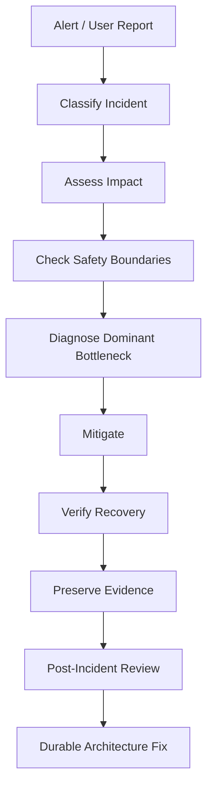
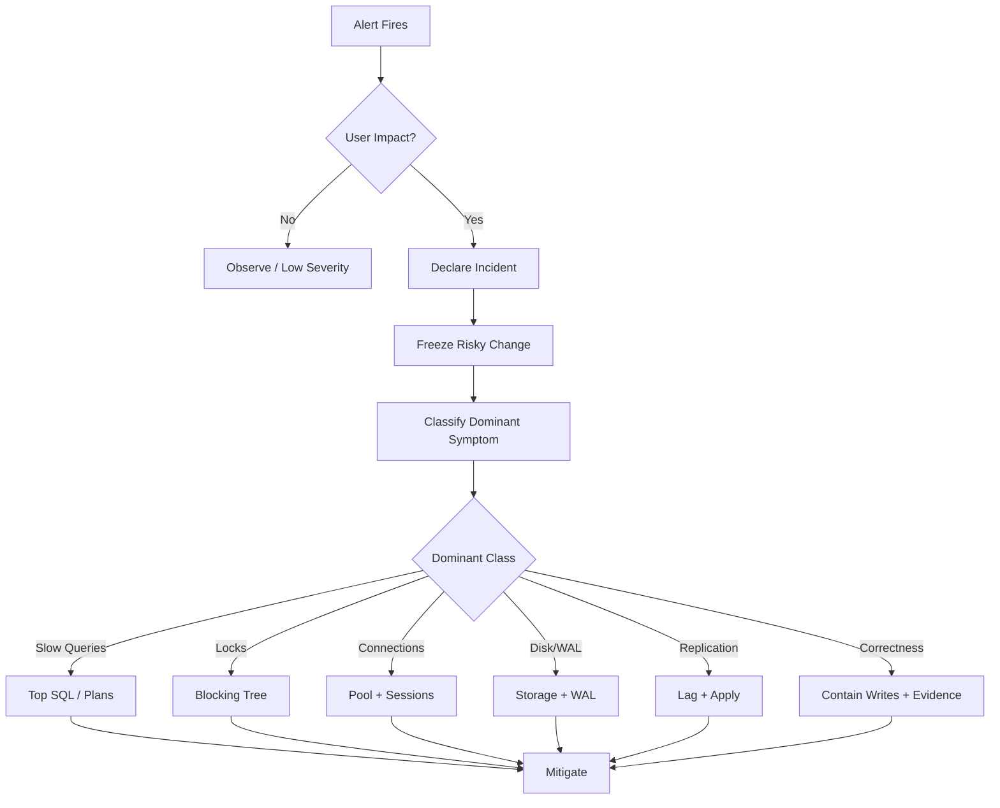

# Part 058 — Operational Runbooks for Database Incidents

A production database incident is not the time to invent the diagnostic process.

The system is already under pressure. People are anxious. Customer impact is growing. Logs are noisy. Dashboards disagree. Someone wants to restart the database. Someone else wants to kill all queries. A migration may be half-applied. Replica lag may make dashboards lie. A batch job may be retrying and amplifying the problem.

A runbook exists to remove improvisation from the first critical minutes.

```text
incident runbook = pre-agreed sequence of safe actions under pressure
```

A good runbook answers:

- What is happening?
- How bad is it?
- What should we check first?
- What should we not do?
- How do we mitigate safely?
- When do we escalate?
- What evidence must we preserve?
- What durable fix prevents recurrence?

This part teaches database incident runbooks from an architect's perspective.

Not only commands.

Not only dashboards.

The goal is operational control.



---

## 1. Core Mental Model

Database incidents are usually one of four categories:

```text
capacity, contention, correctness, or control-plane failure
```

### 1.1 Capacity

The database cannot keep up with workload.

Examples:

- CPU saturated
- I/O saturated
- memory pressure
- disk full
- WAL volume too high
- connection pool exhausted
- replica cannot replay fast enough

### 1.2 Contention

The database has capacity, but work is waiting on shared resources.

Examples:

- row lock wait
- table lock wait
- deadlock storm
- hot counter row
- queue contention
- migration lock
- long transaction blocking vacuum or DDL

### 1.3 Correctness

The database accepted or exposed wrong state.

Examples:

- duplicate records
- missing audit event
- wrong status transition
- accidental delete/update
- bad migration transformed data incorrectly
- stale replica caused invalid decision
- inconsistent projection/search index

### 1.4 Control-plane failure

The mechanisms for operating the database are failing.

Examples:

- backup failure
- restore failure
- failover failure
- monitoring blind spot
- CDC connector stalled
- migration pipeline stuck
- secret/certificate expiry
- permission/configuration issue

The first goal of incident response is classification.

If you classify incorrectly, mitigation can make things worse.

---

## 2. Safety Rules During Database Incidents

Before running commands, establish safety boundaries.

### 2.1 Do not make the blast radius larger

Avoid broad actions unless impact and rollback are clear.

Dangerous under pressure:

```sql
DELETE FROM big_table WHERE ...;
VACUUM FULL big_table;
ALTER TABLE big_table ADD COLUMN ... DEFAULT ...;
DROP INDEX ...;
REINDEX DATABASE ...;
KILL all sessions;
Restart primary database;
```

These may be valid in controlled maintenance, but they are dangerous incident reflexes.

### 2.2 Preserve evidence

Before mitigation destroys evidence, capture:

- alert timestamp
- impacted user journeys
- top SQL fingerprints
- active sessions
- lock graph
- replication lag
- disk/WAL status
- recent deployments/migrations
- batch jobs/imports
- relevant application logs/traces
- cloud provider events

### 2.3 Prefer reversible mitigation

Good first mitigations:

- disable a feature flag
- pause batch workers
- throttle a tenant/job
- route stale-safe reads to replica
- temporarily increase timeout carefully
- stop a runaway migration
- kill a single clearly blocking session
- add a tactical index only if lock-safe and justified

Riskier mitigations:

- schema changes on hot tables
- mass data changes
- failover without root-cause awareness
- restart without preserving state
- killing many sessions blindly

### 2.4 Assign roles

At minimum:

| Role | Responsibility |
|---|---|
| Incident commander | owns coordination and decisions |
| Database lead | owns DB diagnosis and mitigation |
| Application lead | owns feature flags, traffic, workers, deploy rollback |
| Comms lead | updates stakeholders |
| Scribe | records timeline, commands, observations |

Do not let everyone run queries independently against the hot primary.

---

## 3. The First 10 Minutes

A useful first-10-minute script:

```text
1. Confirm impact.
2. Freeze unnecessary deployments/migrations/batch jobs.
3. Identify dominant symptom: latency, errors, locks, disk, lag, data correctness.
4. Check current DB load and wait class.
5. Identify top SQL / top blockers / top tenants / top jobs.
6. Apply reversible mitigation.
7. Verify whether impact decreases.
8. Continue deeper diagnosis.
```

Diagram:



---

## 4. Universal Triage Queries for PostgreSQL

These are starting points. Adjust for your environment, permissions, and managed-service restrictions.

### 4.1 Current active sessions

```sql
SELECT pid,
       usename,
       application_name,
       client_addr,
       state,
       wait_event_type,
       wait_event,
       now() - xact_start AS xact_age,
       now() - query_start AS query_age,
       left(query, 200) AS query
FROM pg_stat_activity
WHERE state <> 'idle'
ORDER BY query_age DESC NULLS LAST;
```

Look for:

- very old transactions
- many sessions waiting on same event
- migration sessions
- batch jobs
- idle in transaction
- application name concentration

### 4.2 Lock waits

```sql
SELECT pid,
       wait_event_type,
       wait_event,
       now() - query_start AS waiting_for,
       left(query, 200) AS query
FROM pg_stat_activity
WHERE wait_event_type = 'Lock'
ORDER BY waiting_for DESC;
```

### 4.3 Blocking PIDs

```sql
SELECT blocked.pid AS blocked_pid,
       blocking.pid AS blocking_pid,
       now() - blocked.query_start AS blocked_for,
       left(blocked.query, 120) AS blocked_query,
       left(blocking.query, 120) AS blocking_query
FROM pg_stat_activity blocked
JOIN LATERAL unnest(pg_blocking_pids(blocked.pid)) AS bpid(blocking_pid)
  ON true
JOIN pg_stat_activity blocking
  ON blocking.pid = bpid.blocking_pid
ORDER BY blocked_for DESC;
```

### 4.4 Long transactions

```sql
SELECT pid,
       usename,
       application_name,
       state,
       now() - xact_start AS xact_age,
       now() - query_start AS query_age,
       left(query, 200) AS query
FROM pg_stat_activity
WHERE xact_start IS NOT NULL
ORDER BY xact_age DESC;
```

### 4.5 Top statements by total time

Requires `pg_stat_statements`.

```sql
SELECT calls,
       total_exec_time,
       mean_exec_time,
       rows,
       shared_blks_hit,
       shared_blks_read,
       temp_blks_written,
       left(query, 200) AS query
FROM pg_stat_statements
ORDER BY total_exec_time DESC
LIMIT 20;
```

### 4.6 Top statements by mean time

```sql
SELECT calls,
       mean_exec_time,
       max_exec_time,
       rows,
       left(query, 200) AS query
FROM pg_stat_statements
WHERE calls > 10
ORDER BY mean_exec_time DESC
LIMIT 20;
```

### 4.7 Table and index size

```sql
SELECT schemaname,
       relname,
       pg_size_pretty(pg_total_relation_size(relid)) AS total_size,
       n_live_tup,
       n_dead_tup,
       last_vacuum,
       last_autovacuum,
       last_analyze,
       last_autoanalyze
FROM pg_stat_user_tables
ORDER BY pg_total_relation_size(relid) DESC
LIMIT 20;
```

### 4.8 Replication lag

On primary:

```sql
SELECT application_name,
       client_addr,
       state,
       sync_state,
       write_lag,
       flush_lag,
       replay_lag,
       sent_lsn,
       replay_lsn
FROM pg_stat_replication;
```

### 4.9 Database size

```sql
SELECT datname,
       pg_size_pretty(pg_database_size(datname)) AS size
FROM pg_database
ORDER BY pg_database_size(datname) DESC;
```

### 4.10 Temporary file / spill suspicion

Use logs and `pg_stat_statements.temp_blks_written`. For active diagnosis:

```sql
SELECT calls,
       temp_blks_written,
       mean_exec_time,
       left(query, 200) AS query
FROM pg_stat_statements
WHERE temp_blks_written > 0
ORDER BY temp_blks_written DESC
LIMIT 20;
```

---

## 5. Runbook: Slow Query Storm

### 5.1 Symptoms

- API latency spikes
- DB CPU high
- many sessions active
- top SQL dominates DB load
- query timeouts
- dashboards show high read I/O or temp writes

### 5.2 First checks

1. Is one query fingerprint responsible?
2. Is this from a recent deploy?
3. Did data distribution change?
4. Did statistics become stale?
5. Did a query plan change?
6. Is there a new report/export/batch job?
7. Is the query scanning more rows than expected?

### 5.3 Diagnosis

Find top statements:

```sql
SELECT calls,
       total_exec_time,
       mean_exec_time,
       rows,
       shared_blks_read,
       temp_blks_written,
       left(query, 200) AS query
FROM pg_stat_statements
ORDER BY total_exec_time DESC
LIMIT 10;
```

For a known query, run:

```sql
EXPLAIN (ANALYZE, BUFFERS)
SELECT ...;
```

Use `ANALYZE` carefully. It executes the query. For destructive statements, use a transaction and rollback or avoid execution.

### 5.4 Immediate mitigation

- disable feature or endpoint generating query
- reduce dashboard refresh rate
- pause export/report job
- route non-critical reads to replica if freshness permits
- add request-level timeout/backpressure
- run `ANALYZE` if stale stats are likely and safe
- add tactical partial/concurrent index only after lock/cost review

### 5.5 Durable fixes

- redesign query shape
- add workload-specific index
- create summary/materialized read model
- enforce pagination limits
- replace offset pagination with keyset pagination
- split OLTP and reporting workload
- add plan regression tests
- add top-query SLO dashboard

### 5.6 Do not

- add random indexes blindly
- increase connection pool to hide slow queries
- run `EXPLAIN ANALYZE` on destructive or huge operations without caution
- kill all active queries without identifying top cause

---

## 6. Runbook: Lock Storm

### 6.1 Symptoms

- many sessions waiting on `Lock`
- low CPU but high latency
- transactions appear stuck
- API timeouts on writes
- migration or batch job coincides with incident

### 6.2 First checks

```sql
SELECT blocked.pid AS blocked_pid,
       blocking.pid AS blocking_pid,
       now() - blocked.query_start AS blocked_for,
       left(blocked.query, 160) AS blocked_query,
       left(blocking.query, 160) AS blocking_query
FROM pg_stat_activity blocked
JOIN LATERAL unnest(pg_blocking_pids(blocked.pid)) AS bpid(blocking_pid)
  ON true
JOIN pg_stat_activity blocking
  ON blocking.pid = bpid.blocking_pid
ORDER BY blocked_for DESC;
```

Find long transactions:

```sql
SELECT pid,
       state,
       now() - xact_start AS xact_age,
       now() - query_start AS query_age,
       left(query, 200) AS query
FROM pg_stat_activity
WHERE xact_start IS NOT NULL
ORDER BY xact_age DESC;
```

### 6.3 Immediate mitigation

- stop the incoming traffic path if it is amplifying locks
- pause worker/batch jobs touching locked rows
- cancel or terminate one clearly blocking session if safe
- stop unsafe migration
- reduce worker concurrency
- apply feature flag to avoid contested path

Cancel first:

```sql
SELECT pg_cancel_backend($pid);
```

Terminate only if necessary and understood:

```sql
SELECT pg_terminate_backend($pid);
```

### 6.4 Durable fixes

- enforce lock ordering
- reduce transaction duration
- remove user interaction from transactions
- use optimistic concurrency for low-conflict paths
- use parent-row locking intentionally for invariants
- bucket hot counters
- use `FOR UPDATE SKIP LOCKED` for queues
- run migrations with lock timeout and safety checks
- add concurrency tests

### 6.5 Do not

- terminate primary/system processes
- kill blockers without knowing whether rollback will be worse
- leave application retry storms running
- ignore long `idle in transaction` sessions

---

## 7. Runbook: Connection Exhaustion

### 7.1 Symptoms

- application errors: too many connections
- connection pool wait time increases
- DB process count high
- CPU may be normal
- latency increases before query execution

### 7.2 First checks

```sql
SELECT state,
       count(*)
FROM pg_stat_activity
GROUP BY state
ORDER BY count(*) DESC;
```

By application:

```sql
SELECT application_name,
       state,
       count(*)
FROM pg_stat_activity
GROUP BY application_name, state
ORDER BY count(*) DESC;
```

Long idle transactions:

```sql
SELECT pid,
       application_name,
       state,
       now() - xact_start AS xact_age,
       left(query, 160) AS query
FROM pg_stat_activity
WHERE state = 'idle in transaction'
ORDER BY xact_age DESC;
```

### 7.3 Immediate mitigation

- reduce application pool size if too many replicas/instances are opening connections
- scale down runaway workers
- enable/adjust backpressure
- terminate stale idle-in-transaction sessions if safe
- restart only offending application pods/services if leak is likely
- route non-critical workloads away

### 7.4 Durable fixes

- define global connection budget
- use PgBouncer or equivalent pooler where appropriate
- set statement and idle-in-transaction timeouts
- separate OLTP, worker, reporting pools
- implement circuit breakers
- monitor pool wait time, active connections, idle connections
- audit connection leaks

### 7.5 Common root causes

- application deploy increased replica count
- each service instance has oversized pool
- batch job opens too many connections
- missing connection close
- long transactions hold connections
- slow DB makes pool appear exhausted

Connection exhaustion is often a symptom, not the root cause.

---

## 8. Runbook: Disk or WAL Space Emergency

### 8.1 Symptoms

- disk usage near 100%
- database refuses writes
- WAL directory grows rapidly
- replication slot retains WAL
- backup/archive process stuck
- huge temp files or logs

### 8.2 First checks

Database sizes:

```sql
SELECT datname,
       pg_size_pretty(pg_database_size(datname)) AS size
FROM pg_database
ORDER BY pg_database_size(datname) DESC;
```

Large relations:

```sql
SELECT schemaname,
       relname,
       pg_size_pretty(pg_total_relation_size(relid)) AS total_size,
       n_dead_tup
FROM pg_stat_user_tables
ORDER BY pg_total_relation_size(relid) DESC
LIMIT 20;
```

Replication slots:

```sql
SELECT slot_name,
       slot_type,
       active,
       restart_lsn,
       confirmed_flush_lsn
FROM pg_replication_slots;
```

### 8.3 Immediate mitigation

- add storage if possible and fastest
- stop runaway batch/import
- stop query producing huge temp files
- check stalled replication slots / CDC consumers
- rotate/compress logs if logs are filling disk
- drop obsolete temporary/staging tables only after verification
- archive/delete known safe old data only with explicit approval

### 8.4 Dangerous actions

Do not run `VACUUM FULL` as an emergency reflex. It needs space and heavy locks.

Do not delete files manually from PostgreSQL data directory.

Do not drop replication slots blindly without understanding data loss implications for downstream consumers.

### 8.5 Durable fixes

- storage growth alerting at multiple thresholds
- WAL growth alerting
- replication slot lag alerting
- temp file logging
- retention and partition purge automation
- CDC consumer SLO
- capacity forecast
- restore drills

---

## 9. Runbook: Replication Lag

### 9.1 Symptoms

- read replica stale
- read-after-write failures
- dashboards inconsistent
- CDC/search/analytics lag
- failover risk increases
- WAL retained on primary

### 9.2 First checks

On primary:

```sql
SELECT application_name,
       state,
       sync_state,
       write_lag,
       flush_lag,
       replay_lag,
       sent_lsn,
       replay_lsn
FROM pg_stat_replication;
```

Check write bursts:

```sql
SELECT now() AS observed_at;
-- Use provider metrics for write throughput, WAL generation, network, replica CPU/I/O.
```

Check long-running queries on replica that may block replay in some environments:

```sql
SELECT pid,
       state,
       now() - query_start AS query_age,
       left(query, 160) AS query
FROM pg_stat_activity
WHERE state <> 'idle'
ORDER BY query_age DESC;
```

### 9.3 Immediate mitigation

- route freshness-critical reads to primary
- temporarily disable stale-sensitive features
- pause large write jobs/backfills/imports
- reduce CDC/search indexing pressure if separate
- cancel long read queries on replica if they block replay
- avoid failover unless carefully assessed

### 9.4 Durable fixes

- define freshness contract per query
- implement lag-aware read routing
- isolate reporting replicas
- monitor replica lag and WAL retention
- tune write batch size
- avoid giant transactions
- separate CDC replication slots by criticality
- test failover under lag

### 9.5 Do not

- assume replica data is fresh
- run correctness-sensitive workflow guards on stale replicas
- fail over to a lagging replica without data-loss analysis

---

## 10. Runbook: Autovacuum, Bloat, and Dead Tuple Pressure

### 10.1 Symptoms

- table/index size grows faster than data
- query performance slowly degrades
- updates/deletes heavy table becomes slow
- dead tuple count high
- long transactions prevent cleanup
- disk pressure grows

### 10.2 First checks

```sql
SELECT schemaname,
       relname,
       n_live_tup,
       n_dead_tup,
       last_vacuum,
       last_autovacuum,
       last_analyze,
       last_autoanalyze
FROM pg_stat_user_tables
ORDER BY n_dead_tup DESC
LIMIT 20;
```

Long transactions:

```sql
SELECT pid,
       state,
       now() - xact_start AS xact_age,
       left(query, 160) AS query
FROM pg_stat_activity
WHERE xact_start IS NOT NULL
ORDER BY xact_age DESC;
```

### 10.3 Immediate mitigation

- stop long transactions preventing cleanup
- pause heavy update/delete batch
- run targeted `VACUUM` where safe
- reduce write pressure temporarily
- add storage if needed

```sql
VACUUM (VERBOSE, ANALYZE) schema_name.table_name;
```

### 10.4 Durable fixes

- tune autovacuum per hot table
- avoid massive updates/deletes in one transaction
- use partition drop for retention purge
- reduce row churn
- move large mutable JSON payloads out of hot rows
- create archival strategy
- add bloat monitoring

### 10.5 Do not

- disable autovacuum globally
- run `VACUUM FULL` during peak incident unless explicitly planned
- ignore long transactions

---

## 11. Runbook: Bad Migration or DDL Lock

### 11.1 Symptoms

- deploy coincides with DB latency
- sessions blocked by DDL
- table lock appears
- migration process running long
- application errors after schema change

### 11.2 First checks

Find migration sessions:

```sql
SELECT pid,
       application_name,
       state,
       wait_event_type,
       wait_event,
       now() - query_start AS query_age,
       left(query, 300) AS query
FROM pg_stat_activity
WHERE query ILIKE '%alter table%'
   OR query ILIKE '%create index%'
   OR application_name ILIKE '%migration%'
ORDER BY query_age DESC;
```

Find blockers/blocked:

```sql
SELECT blocked.pid AS blocked_pid,
       blocking.pid AS blocking_pid,
       left(blocked.query, 120) AS blocked_query,
       left(blocking.query, 120) AS blocking_query
FROM pg_stat_activity blocked
JOIN LATERAL unnest(pg_blocking_pids(blocked.pid)) AS bpid(blocking_pid)
  ON true
JOIN pg_stat_activity blocking
  ON blocking.pid = bpid.blocking_pid;
```

### 11.3 Immediate mitigation

- stop deployment pipeline
- cancel migration if it has not safely completed
- disable app code that depends on incomplete schema
- roll forward with compatibility patch if rollback impossible
- reduce traffic to affected path
- communicate write/read impact

### 11.4 Durable fixes

- expand-contract migration discipline
- use lock timeout and statement timeout in migration runner
- test migration on production-like data volume
- use `CREATE INDEX CONCURRENTLY` where appropriate
- use `NOT VALID` constraints then validate later where appropriate
- separate backfill from DDL
- add migration observability
- require DB migration review for hot tables

### 11.5 Migration guardrails

Every production migration should declare:

- expected lock type
- expected runtime
- rollback/roll-forward plan
- data volume tested
- feature flag dependency
- compatibility window
- backfill strategy
- verification query

---

## 12. Runbook: Noisy Tenant

### 12.1 Symptoms

- one tenant dominates DB load
- other tenants see latency
- import/export/report job from one tenant coincides with incident
- queue backlog mostly from one tenant
- top queries include tenant-specific filters

### 12.2 First checks

Application logs/traces should expose tenant context.

Database alone may not know tenant unless queries include it.

If table has tenant ID:

```sql
SELECT tenant_id,
       count(*) AS recent_rows
FROM enforcement_case
WHERE updated_at >= now() - interval '15 minutes'
GROUP BY tenant_id
ORDER BY recent_rows DESC
LIMIT 20;
```

For queues:

```sql
SELECT tenant_id, status, count(*)
FROM job
WHERE created_at >= now() - interval '1 hour'
GROUP BY tenant_id, status
ORDER BY count(*) DESC
LIMIT 20;
```

### 12.3 Immediate mitigation

- throttle tenant-specific import/export
- pause tenant background jobs
- route tenant to lower concurrency worker pool
- degrade non-critical features for that tenant
- protect core write path for all tenants

### 12.4 Durable fixes

- tenant workload class
- per-tenant quotas/rate limits
- cell architecture
- dedicated tenant database for large tenants
- per-tenant observability
- noisy-neighbor SLO and escalation policy

---

## 13. Runbook: CDC / Outbox / Projection Lag

### 13.1 Symptoms

- search index stale
- analytics not updated
- downstream consumers behind
- outbox table grows
- replication slot retains WAL
- duplicate events processed
- event ordering issue

### 13.2 First checks

Outbox backlog:

```sql
SELECT status,
       count(*) AS count,
       min(created_at) AS oldest,
       max(created_at) AS newest
FROM outbox_event
GROUP BY status;
```

Oldest unprocessed event:

```sql
SELECT id, aggregate_type, aggregate_id, created_at, error_code
FROM outbox_event
WHERE status IN ('PENDING', 'FAILED')
ORDER BY created_at
LIMIT 20;
```

Replication slots:

```sql
SELECT slot_name,
       slot_type,
       active,
       restart_lsn,
       confirmed_flush_lsn
FROM pg_replication_slots;
```

### 13.3 Immediate mitigation

- pause producer if backlog threatens primary
- scale consumer safely
- isolate poison events
- move bad events to DLQ/quarantine
- preserve event ordering if required
- route users away from stale projection if correctness-sensitive
- temporarily read canonical store for critical flows

### 13.4 Durable fixes

- idempotent consumer
- inbox/dedup table
- DLQ with replay tooling
- schema versioning
- projection rebuild process
- lag SLO per projection
- poison event policy
- backpressure from consumer lag to producer

---

## 14. Runbook: Backup or Restore Failure

### 14.1 Symptoms

- scheduled backup failed
- PITR archive missing
- restore drill failed
- backup too slow
- restore exceeds RTO
- backup contains wrong data scope
- tenant restore cannot be performed safely

### 14.2 First checks

Confirm:

- last successful backup time
- backup type: logical, physical, snapshot, WAL/PITR
- restore test status
- encryption and access status
- retention policy
- backup region/account
- affected RPO/RTO

### 14.3 Immediate mitigation

- start manual backup if safe
- pause risky migrations/data changes if no valid backup exists
- confirm WAL archive continuity
- notify risk owners if RPO is breached
- test restore in isolated environment

### 14.4 Durable fixes

- automated restore drills
- backup integrity verification
- PITR monitoring
- cross-region/account backup strategy
- tenant restore procedure
- recovery runbook
- RPO/RTO dashboard
- backup access control review

A backup that has never been restored is an assumption, not a recovery plan.

---

## 15. Runbook: Data Correctness Incident

### 15.1 Symptoms

- incorrect state shown to users
- duplicate records
- missing audit trail
- wrong workflow transition
- invalid financial/regulatory decision
- accidental update/delete
- projection inconsistent with canonical store

### 15.2 First principle

Contain first. Repair second.

Do not immediately mutate data before evidence capture.

### 15.3 First checks

- When did wrong data first appear?
- Which entities are affected?
- Is the canonical table wrong or only a projection?
- Is the bug still writing bad data?
- Is there an audit/event trail?
- Are downstream systems affected?
- Is correction legally/regulatorily sensitive?

### 15.4 Immediate mitigation

- disable write path causing bad state
- stop downstream propagation
- freeze affected records if necessary
- snapshot affected data
- preserve audit logs and application traces
- communicate uncertainty clearly

### 15.5 Repair strategies

| Problem | Repair |
|---|---|
| projection stale/wrong | rebuild projection from canonical data |
| duplicate entity | merge with audit trail and redirect references |
| wrong status | compensating transition/correction record |
| accidental delete | restore from backup/PITR or audit reconstruction |
| missing audit event | append correction event, do not pretend original existed |
| bad derived field | recompute from source of truth |

### 15.6 Durable fixes

- invariant constraint
- transition table
- idempotency key
- data contract test
- reconciliation job
- audit completeness check
- safer migration/backfill
- dual-control for high-risk data repair

Correctness incidents require evidence discipline, not just SQL skill.

---

## 16. Runbook: Failover Decision

Failover is not a universal fix.

It can reduce impact when primary is unhealthy, but it can also cause data loss, split brain, stale reads, or longer outage.

### 16.1 Ask before failover

- Is primary actually unhealthy, or just overloaded by workload?
- Is replica caught up enough for business RPO?
- Are there in-flight transactions with unknown outcome?
- Are clients ready to reconnect?
- Are background jobs/CDC aware of new primary?
- Could failover make split-brain or duplicate processing worse?
- Is the runbook tested?

### 16.2 Safer alternatives before failover

- pause batch jobs
- disable hot feature
- kill specific blocker
- add capacity/storage
- route reads differently
- throttle writes

### 16.3 After failover

Verify:

- write path works
- application connections reconnect
- replicas are reconfigured
- CDC/outbox consumers resume safely
- backup schedule points to new primary
- monitoring dashboards update
- no old-primary writes occur

---

## 17. Incident Evidence Template

Use this during the incident.

```md
# Database Incident Timeline

## Summary
- Incident ID:
- Start time:
- Detection source:
- Severity:
- Impacted users/tenants:
- Impacted journeys:

## Current Hypothesis
- Dominant symptom:
- Suspected root cause:
- Confidence:

## Evidence
- Top SQL:
- Wait events:
- Lock blockers:
- Replication lag:
- Disk/WAL status:
- Recent deploys/migrations:
- Batch/import jobs:
- Application errors:

## Actions
| Time | Actor | Action | Result | Reversible? |
|---|---|---|---|---|

## Mitigation Status
- Impact reduced? yes/no
- Remaining risk:

## Follow-up
- Data repair needed?
- Customer/regulatory communication needed?
- Postmortem owner:
```

Evidence discipline matters because memory is unreliable under pressure.

---

## 18. Database Incident Severity Model

Example severity classification:

| Severity | Definition | Examples |
|---|---|---|
| SEV1 | Critical business path down or correctness risk severe | cannot write cases, data corruption, primary unavailable |
| SEV2 | Major degradation with workaround | high latency, replica stale for non-critical reads, partial tenant impact |
| SEV3 | Limited impact or internal workload affected | report delay, one background projection lagging |
| SEV4 | No user impact, risk detected | backup retry, storage warning, slow query trend |

Correctness can raise severity even if availability looks fine.

A system serving wrong data may be more dangerous than a system returning errors.

---

## 19. Durable Fix Categories

Every database incident should produce one or more durable fixes.

| Category | Examples |
|---|---|
| Schema fix | constraint, index, partition, column split |
| Query fix | rewrite, pagination, selectivity, projection |
| Workload fix | throttle, backpressure, worker scheduling |
| Architecture fix | read model, cell isolation, separate reporting store |
| Operational fix | runbook, alert, dashboard, migration guardrail |
| Testing fix | load test, concurrency test, migration rehearsal |
| Governance fix | review checklist, ownership, data repair approval |

If the only follow-up is “monitor more”, the fix is probably incomplete.

Monitoring detects recurrence. It does not prevent recurrence.

---

## 20. Runbook Quality Checklist

A database incident runbook is production-ready when it answers:

### 20.1 Scope

- What incident type does it cover?
- Which databases/services are in scope?
- Which user journeys are affected?
- Which dashboards/alerts trigger it?

### 20.2 Safety

- What actions are explicitly prohibited?
- Which actions require approval?
- Which commands are read-only?
- Which commands can kill sessions or mutate data?
- What evidence must be captured first?

### 20.3 Diagnosis

- Which queries/dashboards identify the dominant bottleneck?
- How do we identify top SQL, blockers, tenants, jobs, replicas, and storage pressure?
- How do we distinguish capacity from contention?
- How do we distinguish canonical data issue from projection issue?

### 20.4 Mitigation

- What reversible mitigations exist?
- How do we pause batch jobs/workers/imports?
- How do we disable risky features?
- How do we throttle tenants?
- How do we route reads safely?

### 20.5 Escalation

- Who owns database decisions?
- Who can approve data repair?
- Who can approve failover?
- Who contacts cloud/vendor support?
- Who communicates externally?

### 20.6 Verification

- What indicates recovery?
- Which SLO/SLA signals must return to normal?
- How do we verify no data correctness issue remains?
- How do we verify background systems caught up?

### 20.7 Follow-up

- Is a postmortem required?
- Is data repair required?
- Is a migration/design review required?
- Is the runbook updated after learning?

---

## 21. Anti-Patterns During Database Incidents

### 21.1 Restart-first culture

Restarting can hide evidence and may not fix root cause.

Restart only when it matches the failure mode or is the safest mitigation.

### 21.2 Kill-all culture

Killing all sessions can trigger retries, rollbacks, user errors, and more load.

Kill specific sessions with known impact.

### 21.3 Index-first culture

Adding an index during incident can lock, consume I/O, and make write pressure worse.

Use tactical indexes only after safety review.

### 21.4 Dashboard-only diagnosis

Dashboards show symptoms. You still need query, lock, tenant, and workload evidence.

### 21.5 Ignoring retries

Application retries can amplify database incidents.

Backoff, jitter, idempotency, and circuit breakers are part of database reliability.

### 21.6 Confusing mitigation with fix

Pausing a job is mitigation.

Redesigning the job to be throttled, resumable, and partition-aware is the fix.

### 21.7 No owner for data repair

Data repair needs governance.

Ad hoc SQL patches without audit trail can create regulatory and operational risk.

---

## 22. Example: Lock Storm From Migration

Scenario:

A deployment adds a column with a default to a large hot table. API latency spikes. Many sessions wait on lock.

Triage:

```sql
SELECT pid,
       application_name,
       wait_event_type,
       wait_event,
       now() - query_start AS query_age,
       left(query, 300) AS query
FROM pg_stat_activity
WHERE state <> 'idle'
ORDER BY query_age DESC;
```

Finds:

```text
ALTER TABLE enforcement_case ADD COLUMN risk_score int DEFAULT 0 NOT NULL;
```

Immediate mitigation:

- stop deploy pipeline
- cancel migration if safe
- disable application feature depending on column
- verify blocked sessions recover

Durable fix:

1. Add nullable column without default.
2. Deploy app writing both old/new where needed.
3. Backfill in chunks.
4. Add default.
5. Add `NOT NULL` using safe validation path where supported/applicable.
6. Contract old behavior.
7. Add migration guardrail requiring lock review.

Incident lesson:

A migration is a production workload.

Treat it like one.

---

## 23. Example: Noisy Tenant Import

Scenario:

One tenant imports 10 million records. Other tenants experience write timeouts.

Triage:

- top SQL shows insert/update storm
- application logs show one tenant
- WAL generation high
- replica lag increasing
- connection pool saturated by import workers

Immediate mitigation:

- pause import workers for that tenant
- reduce worker concurrency
- restore API pool capacity
- route non-critical stale reads to replica only if safe
- communicate tenant-specific delay

Durable fix:

- per-tenant import queue
- per-tenant rate limit
- resumable chunked import
- import staging table
- validation before canonical write
- cell/silo threshold for large tenants
- lag-aware read routing
- import SLO separate from core API SLO

Incident lesson:

Multi-tenancy without workload isolation is shared fate.

---

## 24. Example: Stale Replica Causes Wrong Workflow Decision

Scenario:

A workflow guard checks a read replica to determine whether a case is already assigned. Replica is 90 seconds behind. Two users assign the same case.

Immediate mitigation:

- route workflow guard reads to primary
- disable replica reads for correctness-sensitive endpoints
- identify affected cases
- append correction records
- notify downstream systems

Durable fix:

- classify reads by freshness requirement
- enforce primary reads for guards/invariants
- add unique constraint or transactional guard
- add lag-aware router
- add concurrency test
- add audit completeness validation

Incident lesson:

Replica consistency is a business correctness decision, not only a performance decision.

---

## 25. Example: Projection Lag in Search

Scenario:

Users search for newly uploaded evidence but results are missing. Canonical database has the evidence. Search projection is behind.

Immediate mitigation:

- show freshness warning
- route critical lookup to canonical store
- pause producer if outbox backlog threatens primary
- scale consumer or isolate poison event
- do not re-ingest blindly without dedup

Durable fix:

- projection lag SLO
- DLQ and replay tooling
- idempotent indexing
- schema-versioned events
- rebuild from canonical source
- user-visible freshness contract

Incident lesson:

A projection is not the system of truth unless you intentionally make it one.

---

## 26. Prebuilt Runbook Index

A mature database platform should have at least these runbooks:

1. Slow query storm
2. Lock storm
3. Deadlock spike
4. Connection exhaustion
5. Disk full / WAL full
6. Replication lag
7. Backup failure
8. Restore procedure
9. Failover procedure
10. Bad migration rollback/roll-forward
11. Autovacuum/bloat emergency
12. Noisy tenant
13. Queue backlog
14. CDC/outbox lag
15. Projection/search stale
16. Accidental delete/update
17. Data repair with audit trail
18. Permission/security incident
19. Certificate/secret expiry
20. Cloud provider degradation

Each runbook should be tested.

An untested runbook is documentation, not operational capability.

---

## 27. Final Mental Model

A database runbook is not a list of magic SQL commands.

It is a decision system.

It turns production pressure into controlled action:

```text
classify -> contain -> diagnose -> mitigate -> verify -> learn -> harden
```

The best runbooks encode architecture knowledge:

- where invariants live
- which reads require freshness
- which tables are hot
- which migrations are dangerous
- which tenants can dominate workload
- which projections can be rebuilt
- which actions are reversible
- which actions risk data loss

That is why database architecture and operations cannot be separated.

A design that cannot be operated safely is not production-grade.

---

## References

- PostgreSQL Documentation — Monitoring Database Activity: https://www.postgresql.org/docs/current/monitoring.html
- PostgreSQL Documentation — Cumulative Statistics System: https://www.postgresql.org/docs/current/monitoring-stats.html
- PostgreSQL Documentation — `pg_stat_activity`: https://www.postgresql.org/docs/current/monitoring-stats.html#MONITORING-PG-STAT-ACTIVITY-VIEW
- PostgreSQL Documentation — `pg_locks`: https://www.postgresql.org/docs/current/view-pg-locks.html
- PostgreSQL Documentation — Explicit Locking: https://www.postgresql.org/docs/current/explicit-locking.html
- PostgreSQL Documentation — VACUUM: https://www.postgresql.org/docs/current/sql-vacuum.html
- PostgreSQL Documentation — Runtime Configuration / WAL: https://www.postgresql.org/docs/current/runtime-config-wal.html
- PostgreSQL Documentation — High Availability, Load Balancing, and Replication: https://www.postgresql.org/docs/current/high-availability.html
- PostgreSQL Documentation — `CREATE INDEX CONCURRENTLY`: https://www.postgresql.org/docs/current/sql-createindex.html
- PostgreSQL Documentation — `ALTER TABLE`: https://www.postgresql.org/docs/current/sql-altertable.html
- AWS RDS Performance Insights — DB Load: https://docs.aws.amazon.com/AmazonRDS/latest/UserGuide/USER_PerfInsights.Overview.ActiveSessions.html
- AWS RDS Performance Insights — Analyzing DB Load by Wait Events: https://docs.aws.amazon.com/AmazonRDS/latest/UserGuide/USER_PerfInsights.UsingDashboard.AnalyzeDBLoad.html
- AWS Well-Architected Framework — Operational Excellence Pillar: https://docs.aws.amazon.com/wellarchitected/latest/operational-excellence-pillar/welcome.html
