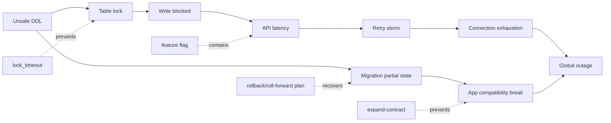

# Part 059 — Failure Mode and Risk Modelling

> Database architecture is not finished when the schema is normalized, the indexes are fast, and replication is configured. It is finished when the team can explain **how the design fails**, **how the failure is detected**, **how damage is contained**, **how recovery works**, and **how correctness is proven afterward**.

This part gives you a practical failure-modelling method for database systems. The goal is not pessimism. The goal is disciplined design.

A strong database architect does not ask only:

```text
Can this design work?
```

They ask:

```text
How does this design fail under concurrency, load, migration, operator error,
replication lag, corrupt input, stale consumers, bad assumptions, and partial recovery?
```

That question is where senior database design begins.

---

## 1. Learning Goals

After this part, you should be able to:

1. Model database failures beyond “database down”.
2. Separate correctness failure, availability failure, performance failure, durability failure, confidentiality failure, and operability failure.
3. Build a database-specific FMEA: Failure Mode and Effects Analysis.
4. Draw fault trees for data-loss, data-corruption, stale-read, tenant-leakage, and unrecoverable-migration scenarios.
5. Assign controls into prevention, detection, containment, recovery, and proof.
6. Convert abstract risk into concrete schema, transaction, index, migration, backup, monitoring, and runbook decisions.
7. Design degraded modes that preserve core invariants.
8. Review a database architecture with a risk register rather than opinions.

---

## 2. The Core Mental Model

A database failure is not simply the loss of a process, node, disk, or connection.

A production database is responsible for several promises:

| Promise | Meaning |
|---|---|
| Correctness | The database rejects illegal state and preserves business invariants. |
| Availability | Required operations can be performed when needed. |
| Durability | Committed data survives expected failures. |
| Recoverability | The system can be restored to an acceptable point within acceptable time. |
| Confidentiality | Only authorized principals can see sensitive data. |
| Integrity | Data cannot be silently altered, lost, duplicated, or mis-associated. |
| Traceability | Important changes can be explained later with evidence. |
| Evolvability | Schema and access patterns can change without unsafe downtime or corruption. |
| Operability | Operators can diagnose, mitigate, and recover under pressure. |

So the correct question is not:

```text
Is the database reliable?
```

The correct question is:

```text
Which promise can fail, through which mechanism, with what blast radius,
under which detection signal, with what recovery path, and what proof of recovery?
```

That sentence is the backbone of this part.

---

## 3. Why Database Failure Modelling Is Different

Application failures are often reversible. A bad API deployment can be rolled back. A worker can be restarted. A cache can be flushed.

Database failures are different because they can modify the system of truth.

A bad database failure may create one of these outcomes:

1. Data is unavailable.
2. Data is wrong.
3. Data is missing.
4. Data is duplicated.
5. Data is visible to the wrong party.
6. Data history becomes unverifiable.
7. Recovery overwrites valid newer data.
8. Consumers process inconsistent projections.
9. Backups exist but cannot restore the required state.
10. Operators do not know which records are affected.

The dangerous cases are not always loud. A failed database node is obvious. A silent invariant violation can live for months.

---

## 4. Failure Taxonomy

Use this taxonomy during architecture review.

### 4.1 Availability Failure

The operation cannot complete.

Examples:

- Database unavailable.
- Connection pool exhausted.
- Primary unavailable and failover not complete.
- Query times out.
- Lock wait exceeds SLA.
- Disk full prevents writes.
- Replica lag prevents read scaling.

Availability failure is often visible, but its root cause may be correctness, capacity, schema, index, or operational failure.

### 4.2 Correctness Failure

The database accepts or returns a state that violates expected business meaning.

Examples:

- Two active assignments for a case that must have one owner.
- Negative balance where impossible.
- Case transitions from `CLOSED` back to `UNDER_REVIEW` without reopening event.
- Invoice paid twice because idempotency was missing.
- A soft-deleted row participates in uniqueness incorrectly.
- Effective-dated records overlap.

Correctness failures are architecturally serious because backups faithfully preserve wrong data.

### 4.3 Durability Failure

A committed write is lost or not recoverable.

Examples:

- WAL not flushed as assumed.
- Async replica promoted before receiving latest commits.
- Snapshot backup without consistent log stream.
- Misconfigured storage cache lies about flush.
- Manual restore omits required schema/data dependency.

Durability failure is rare in mature systems, but when it happens, it destroys trust.

### 4.4 Recoverability Failure

The system technically has backups, but cannot restore the business state within required RPO/RTO.

Examples:

- Backup is corrupt.
- Restore process was never tested.
- PITR target time is ambiguous.
- Tenant-level restore is impossible in shared schema.
- Restore replays bad migration or bad batch job.
- Backup contains encrypted data but key is unavailable.

A backup is not a recovery capability. A tested restore is.

### 4.5 Consistency Failure Across Boundaries

The canonical store and derived systems disagree beyond their freshness contract.

Examples:

- Search index shows deleted document.
- Reporting table misses reversal transaction.
- CDC consumer processes out of order events.
- Cache returns unauthorized stale data after permission revocation.
- Replica read violates workflow guard.

This failure often happens when the database design is correct locally but integration contracts are weak.

### 4.6 Security Failure

Unauthorized access, modification, exfiltration, or privilege escalation occurs.

Examples:

- Shared application role can read all tenants.
- SQL injection reaches tables directly.
- Admin credentials reused by service runtime.
- Read replica exposed to analytics users with production PII.
- Backup copied to insecure storage.
- CDC stream leaks sensitive payloads.

Security failures are database architecture failures when the schema, roles, grants, boundaries, and audit path do not enforce intent.

### 4.7 Operability Failure

The system may be technically recoverable, but operators cannot understand or safely act in time.

Examples:

- No query fingerprint to identify top offenders.
- No migration identifier in lock storm.
- No tenant dimension in metrics.
- No runbook for replication lag.
- Alert fires after disk is already full.
- Data repair script has no dry-run mode.

Operability failure converts small incidents into large incidents.

### 4.8 Evolvability Failure

The database cannot change safely.

Examples:

- Table has no compatibility layer for old and new application versions.
- Enum/status migration requires global downtime.
- Backfill cannot resume after failure.
- Contract consumers are unknown.
- Column rename breaks reports and CDC consumers.
- Data model has no versioning for historical records.

A database that cannot evolve becomes a hidden product constraint.

---

## 5. Failure Surfaces in Database Architecture

A failure surface is a place where a system promise can be violated.

```mermaid
flowchart TD
    A[Database Architecture] --> B[Schema Surface]
    A --> C[Transaction Surface]
    A --> D[Index and Query Surface]
    A --> E[Replication Surface]
    A --> F[Migration Surface]
    A --> G[Backup and Restore Surface]
    A --> H[Security Surface]
    A --> I[Integration Surface]
    A --> J[Operational Surface]

    B --> B1[Missing constraints]
    B --> B2[Ambiguous keys]
    B --> B3[Nullable meaning drift]

    C --> C1[Lost update]
    C --> C2[Write skew]
    C --> C3[External side effect before commit]

    D --> D1[Bad plan]
    D --> D2[Lock amplification]
    D --> D3[Full scan under load]

    E --> E1[Replica lag]
    E --> E2[Split brain]
    E --> E3[Promotion data loss]

    F --> F1[Unsafe DDL]
    F --> F2[Non-resumable backfill]
    F --> F3[Compatibility break]

    G --> G1[Untested restore]
    G --> G2[Missing WAL/logs]
    G --> G3[Key unavailable]

    H --> H1[Privilege leak]
    H --> H2[Tenant escape]
    H --> H3[Backup exfiltration]

    I --> I1[CDC lag]
    I --> I2[Duplicate events]
    I --> I3[Stale projection]

    J --> J1[No signal]
    J --> J2[No runbook]
    J --> J3[Unsafe manual fix]
```



Do not review only tables and indexes. Review all surfaces.

---

## 6. Risk Is Not One Number

Many teams score risk as:

```text
risk = likelihood × impact
```

That is useful but incomplete for database design.

Use this richer model:

```text
risk = likelihood × impact × undetectability × unrecoverability × blast_radius
```

Where:

| Factor | Question |
|---|---|
| Likelihood | How likely is this failure under expected workload and change frequency? |
| Impact | What business, user, regulatory, financial, or operational damage occurs? |
| Detectability | How quickly and precisely can we detect it? |
| Recoverability | Can we repair or restore safely? |
| Blast radius | How much data, how many tenants, how many consumers, and how many operations are affected? |

A rare failure with huge impact and poor recovery can be more important than a frequent small failure.

---

## 7. Database FMEA Template

FMEA means Failure Mode and Effects Analysis. For databases, do not make it academic. Make it executable.

Use this template:

| Field | Meaning |
|---|---|
| Component | Table, transaction, job, replica, migration, index, CDC flow, backup flow, role, etc. |
| Failure mode | What can go wrong? |
| Cause | Why can it happen? |
| Effect | What breaks? |
| Invariant impacted | Which system truth becomes unsafe? |
| Detection signal | Metric, log, query, audit, reconciliation, alert. |
| Prevention control | Constraint, transaction design, role, migration gate, test. |
| Containment control | Partition, tenant boundary, rate limit, circuit breaker, feature flag. |
| Recovery control | Restore, replay, repair script, rebuild, compensation. |
| Proof of recovery | Query/report/reconciliation showing state is correct. |
| Owner | Team or role accountable. |

---

## 8. Example FMEA: Regulatory Case Assignment

Assume this invariant:

```text
A case can have at most one active primary assignee at a time.
```

A weak schema might use:

```sql
CREATE TABLE case_assignment (
    id              uuid PRIMARY KEY,
    case_id         uuid NOT NULL,
    user_id         uuid NOT NULL,
    assignment_type text NOT NULL,
    active          boolean NOT NULL DEFAULT true,
    assigned_at     timestamptz NOT NULL DEFAULT now(),
    revoked_at      timestamptz
);
```

This schema says `active`, but it does not prevent two active primary assignees.

FMEA:

| Field | Example |
|---|---|
| Component | `case_assignment` write path |
| Failure mode | Two active primary assignments for same case |
| Cause | Concurrent reassignment; missing partial unique index; retry duplicates command |
| Effect | Two officers act on same case; SLA and accountability become ambiguous |
| Invariant impacted | Single active primary owner per case |
| Detection signal | Reconciliation query counts active primary assignments per case |
| Prevention | Partial unique index on `(case_id)` where active and type is primary |
| Containment | Reassignment command serialized by case row lock |
| Recovery | Resolve active assignment by transition event; preserve duplicate as revoked correction |
| Proof | Query returns zero cases with more than one active primary assignment |

Better schema-level control:

```sql
CREATE UNIQUE INDEX uq_one_active_primary_assignment
ON case_assignment (case_id)
WHERE active = true AND assignment_type = 'PRIMARY';
```

But that is not enough if the assignment transition also needs audit history. A production path should use a transaction:

```sql
BEGIN;

SELECT id
FROM enforcement_case
WHERE id = :case_id
FOR UPDATE;

UPDATE case_assignment
SET active = false,
    revoked_at = now(),
    revoked_reason = :reason
WHERE case_id = :case_id
  AND assignment_type = 'PRIMARY'
  AND active = true;

INSERT INTO case_assignment (
    id,
    case_id,
    user_id,
    assignment_type,
    active,
    assigned_at,
    assigned_by,
    command_id
)
VALUES (
    gen_random_uuid(),
    :case_id,
    :new_user_id,
    'PRIMARY',
    true,
    now(),
    :actor_id,
    :command_id
);

INSERT INTO case_timeline_event (
    id,
    case_id,
    event_type,
    occurred_at,
    actor_id,
    payload
)
VALUES (
    gen_random_uuid(),
    :case_id,
    'PRIMARY_ASSIGNEE_CHANGED',
    now(),
    :actor_id,
    jsonb_build_object('newUserId', :new_user_id, 'reason', :reason)
);

COMMIT;
```

The lock is not merely a performance detail. It is a containment control.

---

## 9. Controls: Prevention, Detection, Containment, Recovery, Proof

A mature risk model has five control types.

### 9.1 Prevention

Prevention reduces the chance of failure.

Examples:

- `NOT NULL`, `CHECK`, `UNIQUE`, `FOREIGN KEY`.
- Exclusion constraint for non-overlapping validity intervals.
- Idempotency table.
- Transaction boundary.
- Least privilege database role.
- Migration precheck.
- `statement_timeout` and `lock_timeout`.
- `CREATE INDEX CONCURRENTLY` where appropriate.
- Backfill batching and resume cursor.

### 9.2 Detection

Detection reveals failure or drift.

Examples:

- Reconciliation query.
- Slow query logs.
- Lock wait alert.
- Replication lag metric.
- Row-count mismatch between canonical and projection stores.
- Duplicate command metric.
- Audit completeness check.
- Backup restore drill failure.

### 9.3 Containment

Containment limits blast radius.

Examples:

- Tenant partitioning.
- Cell architecture.
- Feature flag.
- Rate limit per tenant.
- Circuit breaker for heavy reports.
- Read-only degraded mode.
- Quarantine table for invalid imports.
- Per-consumer CDC offset.
- Separate database role for batch job.

### 9.4 Recovery

Recovery returns the system to acceptable state.

Examples:

- Point-in-time restore.
- Roll-forward data repair.
- Replay event log.
- Rebuild projection.
- Re-run idempotent batch.
- Compensating transaction.
- Tenant-level restore.
- Reconciliation-driven repair script.

### 9.5 Proof

Proof demonstrates the system is correct after recovery.

Examples:

- Invariant query returns zero violations.
- Balance reconciliation matches ledger.
- CDC consumer offset reaches source LSN.
- Search index checksum matches source table count/version.
- Audit chain has no missing sequence.
- Sampled restored records match expected point in time.

Proof is often missing. Without proof, recovery is only a hope.

---

## 10. Fault Tree Analysis

FMEA starts from a component. Fault tree analysis starts from an unacceptable outcome.

Example top event:

```text
User sees another tenant's confidential case data.
```

Fault tree:

```mermaid
flowchart TD
    T[Top Event: Tenant data exposure] --> A[Application query misses tenant predicate]
    T --> B[Database role can read all tenants]
    T --> C[RLS disabled or bypassed]
    T --> D[Reporting/export path ignores tenant boundary]
    T --> E[Backup or replica copied to wrong audience]
    T --> F[Search projection contains cross-tenant document]

    A --> A1[Manual SQL string]
    A --> A2[Repository missing tenant context]
    A --> A3[Test data has only one tenant]

    B --> B1[Shared superuser-like role]
    B --> B2[No least privilege grant model]

    C --> C1[Table owner bypass]
    C --> C2[Policy not FORCEd]
    C --> C3[Session variable unset]

    D --> D1[Ad hoc analyst access]
    D --> D2[No masking policy]

    E --> E1[Backup bucket misconfigured]
    E --> E2[Replica used for analytics without filtering]

    F --> F1[Projection builder bug]
    F --> F2[Delete/revocation not propagated]
```



This reveals a key principle:

> If one missed predicate can leak tenant data, the security architecture is too fragile.

---

## 11. Blast Radius Modelling

For every failure mode, ask four questions:

1. **Scope of data:** one row, one case, one account, one tenant, one partition, all data?
2. **Scope of users:** one user, one team, one customer, all customers, external public?
3. **Scope of time:** current request, last hour, all history, future decisions?
4. **Scope of consumers:** only OLTP app, reports, search, CDC, downstream systems, backups?

Example:

| Failure mode | Bad blast radius | Better blast radius |
|---|---|---|
| Bad import | Corrupts canonical tables directly | Lands in quarantine table, validated before merge |
| Hot tenant | Saturates whole shared DB | Isolated by tenant rate limit/cell/shard |
| Bad migration | Locks critical table globally | Runs in batches with timeout and feature flag |
| Wrong report query | Exports all tenants | Role/view enforces tenant and masking boundary |
| CDC consumer bug | All projections corrupted | Per-consumer offset + replay + rebuild path |

Design for small blast radius before you design for heroic recovery.

---

## 12. Risk Categories by Database Layer

### 12.1 Schema Layer

Failure modes:

- Missing uniqueness.
- Weak FK strategy.
- Nullable field with overloaded meaning.
- No effective-date non-overlap enforcement.
- Status column with invalid transitions.
- JSON blob hides invariant-critical data.

Controls:

- Constraints.
- Generated columns.
- Partial indexes.
- Exclusion constraints.
- State transition table.
- Schema review checklist.

### 12.2 Transaction Layer

Failure modes:

- Lost update.
- Write skew.
- Double execution of command.
- External side effect before commit.
- Long transaction blocks vacuum or locks.

Controls:

- Atomic conditional update.
- Row lock.
- Serializable transaction with retry.
- Idempotency key.
- Transactional outbox.
- Short transaction discipline.

### 12.3 Query and Index Layer

Failure modes:

- Bad plan after data growth.
- Full scan under peak traffic.
- Sort spill.
- Offset pagination degradation.
- Index bloat.
- Write amplification due to too many indexes.

Controls:

- Query review.
- `EXPLAIN ANALYZE` baseline.
- Composite index aligned to predicate/order.
- Keyset pagination.
- Statistics maintenance.
- Index lifecycle governance.

### 12.4 Replication Layer

Failure modes:

- Stale read violates workflow rule.
- Failover loses async commits.
- Replica slot retains WAL until disk pressure.
- Split brain accepts writes in two primaries.

Controls:

- Read routing by freshness contract.
- Synchronous replication where business requires it.
- Promotion runbook.
- Fencing token.
- Lag alerting.
- Replica slot monitoring.

### 12.5 Migration Layer

Failure modes:

- Unsafe DDL locks production table.
- New app version assumes column exists while old version still writes old shape.
- Backfill corrupts rows.
- Rollback impossible after destructive contract phase.

Controls:

- Expand-migrate-contract.
- Compatibility window.
- Backfill checkpoint.
- Dry-run and validation query.
- Lock timeout.
- Kill switch.

### 12.6 Backup and Recovery Layer

Failure modes:

- Backup missing WAL required for PITR.
- Backup encrypted with lost key.
- Restore takes longer than RTO.
- Tenant-specific restore impossible.
- Restore is logically corrupt because bad data was already committed.

Controls:

- Restore drill.
- PITR test.
- Key recovery test.
- Backup inventory.
- Reconciliation after restore.
- Logical export for selected recovery needs.

### 12.7 Security Layer

Failure modes:

- Overprivileged role.
- RLS bypass.
- Misconfigured read replica.
- Backup leakage.
- Sensitive field copied to logs, reports, or CDC.

Controls:

- Least privilege grants.
- RLS/tenant enforcement.
- Secret rotation.
- Encryption.
- Audit.
- Masked views.
- Separate roles for app, migration, analyst, support, and admin.

---

## 13. Risk Register Format

Create a database risk register per major system or bounded context.

```md
# Database Risk Register

## Risk: Duplicate enforcement case created for same complaint

- ID: DB-RISK-001
- Owner: Case Platform Team
- Status: Open
- Impact: High
- Likelihood: Medium
- Detectability: Medium
- Recoverability: Medium
- Blast radius: Per complaint / per tenant

### Failure Mode
Concurrent imports or retries create two active cases for the same external complaint.

### Impact
Duplicate investigation, conflicting decisions, invalid SLA reporting, audit confusion.

### Existing Controls
- External complaint id stored.
- Unique index on `(tenant_id, source_system, external_complaint_id)`.
- Idempotency key for import command.

### Missing Controls
- Reconciliation dashboard for duplicate suspect cases.
- Merge workflow with audit event.
- Import replay proof.

### Detection
Daily query: active duplicate candidates by external complaint id.

### Recovery
Merge duplicate case using approved merge workflow. Preserve both original records in timeline.

### Proof
No duplicate active case remains for same `(tenant_id, source_system, external_complaint_id)`.
```

A risk register is useful only if it changes design decisions.

---

## 14. Scoring Model

Use a simple 1–5 scale.

| Score | Likelihood | Impact | Detectability | Recoverability | Blast radius |
|---:|---|---|---|---|---|
| 1 | Rare | Minor | Immediate | Automatic | Single row/request |
| 2 | Unlikely | Low | Fast | Simple manual | Single user/case |
| 3 | Possible | Medium | Delayed | Scripted repair | Tenant or feature |
| 4 | Likely | High | Hard | Restore/replay required | Multiple tenants/systems |
| 5 | Expected | Critical | Silent | Unclear/impossible | Global/systemic |

Example calculation:

```text
risk_score = likelihood + impact + detectability + recoverability + blast_radius
```

Or weighted:

```text
risk_score = impact*3 + blast_radius*3 + recoverability*2 + detectability*2 + likelihood
```

For database systems, impact, blast radius, and recoverability usually matter more than likelihood.

---

## 15. Example: Bad Migration Risk Model

Failure mode:

```text
Add NOT NULL column with default to very large table during peak traffic.
```

Effects:

- Table rewrite or heavy lock depending engine/version/DDL shape.
- Write path blocked.
- Connection pool fills.
- API timeouts.
- Retry storm increases load.
- Operators kill migration halfway.
- Application version expects column but migration incomplete.

Controls:

| Control | Type |
|---|---|
| Add nullable column first | Prevention |
| Backfill in batches | Prevention/containment |
| `lock_timeout` and `statement_timeout` | Containment |
| Feature flag read/write path | Containment |
| Validation query before contract | Detection/proof |
| Roll-forward migration plan | Recovery |
| Migration dashboard | Detection |
| Maintenance window for risky DDL | Containment |

Mermaid risk path:



---

## 16. Example: Stale Replica Risk Model

Failure mode:

```text
Application reads workflow state from replica immediately after write to primary.
```

Effects:

- User sees old status.
- Guard condition evaluates incorrectly.
- Duplicate command submitted.
- Case transitions incorrectly.
- Audit timeline appears inconsistent.

Controls:

| Control | Type |
|---|---|
| Query classification: guard reads use primary | Prevention |
| Sticky primary after write | Prevention |
| Freshness token / LSN wait | Prevention |
| Replica lag alert | Detection |
| Idempotency key | Containment |
| State transition constraint | Containment |
| Duplicate command reconciliation | Recovery/proof |

Design rule:

```text
A replica is a scalability tool, not a correctness boundary, unless the operation explicitly tolerates staleness.
```

---

## 17. Example: Silent Data Corruption

Failure mode:

```text
Batch job recalculates derived balances using an incorrect filter.
```

Effects:

- Derived balance wrong.
- Reports wrong.
- Customer notices discrepancy.
- Downstream exports propagate wrong numbers.
- Audit questions arise.

Controls:

| Control | Type |
|---|---|
| Append-only ledger as canonical source | Prevention |
| Derived table marked rebuildable | Containment |
| Batch job writes job_id and calculation_version | Detection/recovery |
| Reconciliation between ledger and balance | Detection/proof |
| Shadow calculation before cutover | Prevention |
| Ability to rebuild derived balances | Recovery |

Important distinction:

```text
If a value is derived, design it as disposable and rebuildable.
If a value is canonical, design it as protected and auditable.
```

---

## 18. Detection Queries as Architecture Artifacts

A database design should ship with detection queries.

### Duplicate active primary assignee

```sql
SELECT case_id, count(*) AS active_primary_count
FROM case_assignment
WHERE active = true
  AND assignment_type = 'PRIMARY'
GROUP BY case_id
HAVING count(*) > 1;
```

### Orphan records that should be impossible

```sql
SELECT e.id, e.case_id
FROM evidence_document e
LEFT JOIN enforcement_case c ON c.id = e.case_id
WHERE c.id IS NULL;
```

### Overlapping effective intervals

```sql
SELECT a.id AS id_a, b.id AS id_b, a.subject_id
FROM subject_assignment a
JOIN subject_assignment b
  ON a.subject_id = b.subject_id
 AND a.id < b.id
 AND tstzrange(a.valid_from, a.valid_to, '[)') && tstzrange(b.valid_from, b.valid_to, '[)');
```

### Outbox lag

```sql
SELECT
    now() - min(created_at) AS oldest_unpublished_age,
    count(*) AS pending_count
FROM outbox_event
WHERE published_at IS NULL;
```

### Tenant distribution skew

```sql
SELECT tenant_id, count(*) AS row_count
FROM enforcement_case
GROUP BY tenant_id
ORDER BY row_count DESC
LIMIT 20;
```

These queries are not merely monitoring snippets. They are executable statements of your invariants.

---

## 19. Failure Injection

Do not wait for production to discover whether recovery works.

Run controlled failure experiments.

| Experiment | Question answered |
|---|---|
| Kill app during transaction | Are writes atomic and retry-safe? |
| Kill worker after DB commit before publish | Does outbox publish later? |
| Delay replica | Do stale-sensitive reads route to primary? |
| Fill disk in staging | Do alerts and runbooks work before total failure? |
| Cancel migration mid-backfill | Can it resume safely? |
| Reprocess event stream | Are consumers idempotent? |
| Restore backup to staging | Can we meet RTO and prove correctness? |
| Revoke DB privilege | Does app fail closed with useful error? |
| Inject duplicate command | Does idempotency return same result? |
| Simulate tenant hot key | Is blast radius contained? |

Failure injection is not chaos for entertainment. It is proof collection.

---

## 20. Degraded Modes

A degraded mode is a deliberate reduced-capability state that preserves critical invariants.

Examples:

| Failure | Bad response | Better degraded mode |
|---|---|---|
| Replica lag high | Continue stale reads for all pages | Route sensitive reads to primary; disable stale dashboards warning-free |
| Search index stale | Show outdated confidential documents | Show “search updating” and fallback to canonical query for sensitive records |
| Outbox lag | Keep accepting all commands blindly | Accept commands but expose downstream-lag warning and throttle noncritical events |
| Reporting DB unavailable | Query OLTP heavily | Disable heavy reports, keep operational writes available |
| Migration issue | Continue rollout | Freeze deploy, disable feature flag, run validation |
| Backup failure | Ignore until next cycle | Treat as reliability incident; freeze destructive migrations if required |

Degraded mode design principle:

```text
When full functionality is unsafe, preserve correctness, confidentiality,
and recoverability before convenience.
```

---

## 21. Recovery Strategies

### 21.1 Rollback

Useful for code, dangerous for data if destructive change has already happened.

Rollback works when:

- Old schema still exists.
- Old application version can read/write current data.
- No irreversible transformation occurred.
- External side effects can be ignored or compensated.

### 21.2 Roll-Forward

Often safer for databases.

Roll-forward works by applying a corrective migration or repair that preserves history.

Example:

```text
Bad migration wrote wrong status for 10,000 cases.
Do not restore whole database if valid newer updates exist.
Instead, identify affected records, create correction events, repair current state,
and prove invariant health afterward.
```

### 21.3 Point-in-Time Restore

Useful for catastrophic corruption or data loss, but complex when new valid writes happened after the target time.

Questions:

- What is the exact target time?
- Which writes after target time must be preserved?
- Can affected tenant be restored separately?
- Are encryption keys available?
- Will replay re-trigger external side effects?

### 21.4 Replay

Useful when canonical log/event/outbox exists.

Replay works when:

- Events are durable.
- Consumers are idempotent.
- Event schema is versioned.
- Ordering scope is understood.
- Rebuild target is disposable.

### 21.5 Reconciliation + Repair

Useful for data correctness failure.

Pattern:

1. Detect affected records.
2. Freeze or limit affected write path if needed.
3. Export affected set.
4. Produce expected state from canonical source.
5. Apply repair in batches.
6. Write audit repair record.
7. Run proof queries.
8. Publish incident summary.

---

## 22. Database Risk Review Meeting

A good database risk review is structured.

### Inputs

- Data model.
- Transaction design.
- Query workload.
- Migration plan.
- Backup/restore plan.
- Security model.
- Integration/CDC contract.
- Observability plan.
- Runbook.

### Questions

1. What data is canonical?
2. What state must never exist?
3. Which failures create wrong data rather than unavailable data?
4. Which operations rely on stale reads?
5. Which writes are retry-safe?
6. Which migrations are destructive?
7. Which restore scenarios have been tested?
8. Which consumers can be rebuilt?
9. Which access paths can leak data?
10. What is the proof of recovery for each critical failure?

### Output

- Approved controls.
- Open risks.
- Required tests.
- Runbook tasks.
- Observability gaps.
- Architecture decision records.

---

## 23. Risk Modelling for Regulatory Systems

Regulatory and enforcement systems have special risk characteristics:

1. Decisions must be explainable.
2. Evidence history matters.
3. Deadlines and SLA have legal or procedural weight.
4. Unauthorized disclosure can be severe.
5. Incorrect state transitions can invalidate process.
6. Audit trails must preserve who, what, when, why, and under which authority.
7. Corrections must not erase prior facts without trace.

Typical high-risk failure modes:

| Failure mode | Risk |
|---|---|
| Evidence deleted without audit | Loss of defensibility |
| Case owner ambiguity | Accountability failure |
| SLA recalculation wrong | Procedural unfairness or missed enforcement deadline |
| Role revocation not reflected in search projection | Confidential data leakage |
| Duplicate case not merged properly | Conflicting decisions |
| State transition skipped | Invalid workflow outcome |
| Backdated update without transaction/effective-time distinction | Historical reconstruction failure |

Design response:

- Prefer append-only timeline for decisions and evidence events.
- Store correction events, not silent overwrite, for important facts.
- Put hard invariants in database constraints where possible.
- Treat report reproducibility as an architecture requirement.
- Treat access control changes as time-sensitive writes.
- Make repair actions auditable.

---

## 24. Anti-Patterns

### 24.1 “We Have Backups” Without Restore Proof

Backups do not prove recoverability.

A restore drill proves recoverability.

### 24.2 “The App Validates That”

Application validation is useful, but concurrency, batch jobs, admin scripts, migrations, and direct integrations can bypass it.

Database constraints are the last line of defense for core invariants.

### 24.3 “Read Replicas Are Always Safe for Reads”

Some reads are correctness-sensitive.

A read that guards a write, checks authorization freshness, or validates workflow state may need primary or freshness guarantee.

### 24.4 “The Migration Worked in Dev”

Dev data does not have production size, skew, lock contention, index bloat, replication lag, or old consumers.

Migration safety must be tested with production-like data shape.

### 24.5 “We Can Repair It Manually”

Manual repair without script, audit, dry-run, and proof is a new failure mode.

### 24.6 “Only One Consumer Uses This Table”

Hidden consumers include reports, exports, support tools, ad hoc analytics, CDC pipelines, search indexes, caches, and compliance jobs.

---

## 25. Database Risk Checklist

Use this before production launch.

### Correctness

- [ ] Critical invariants are listed.
- [ ] Each invariant has enforcement location.
- [ ] Database-level constraints exist for hard invariants where feasible.
- [ ] Concurrency anomalies are identified.
- [ ] Retry and idempotency strategy exists.
- [ ] Derived data has reconciliation or rebuild path.

### Availability and Performance

- [ ] Workload envelope is defined.
- [ ] Critical queries have execution plan baseline.
- [ ] Lock-sensitive paths are reviewed.
- [ ] Hot tenant/key/row scenarios are considered.
- [ ] Connection pool limits and timeouts are configured.
- [ ] Degraded mode exists for heavy noncritical operations.

### Replication and Consistency

- [ ] Read routing is classified by freshness need.
- [ ] Replica lag alerts exist.
- [ ] Failover behavior is understood.
- [ ] Promotion data-loss risk is accepted or mitigated.
- [ ] CDC ordering and replay strategy are documented.

### Migration

- [ ] Migration follows expand-migrate-contract where needed.
- [ ] Backfill is resumable.
- [ ] Validation queries exist.
- [ ] Lock timeout and rollback/roll-forward plan exist.
- [ ] Consumer compatibility is reviewed.

### Backup and Recovery

- [ ] RPO/RTO are explicit.
- [ ] Restore drill has been run.
- [ ] PITR target selection is understood.
- [ ] Backup encryption keys are recoverable.
- [ ] Tenant-level restore needs are addressed.
- [ ] Proof-of-restore queries exist.

### Security

- [ ] Database roles follow least privilege.
- [ ] Tenant/data access boundary is enforced below application where needed.
- [ ] Sensitive data in backup, replica, CDC, and export is protected.
- [ ] Admin and break-glass access are audited.
- [ ] Security failure modes are in risk register.

### Operability

- [ ] Metrics cover query, lock, WAL, disk, replication, connection, and job health.
- [ ] Alerts fire before hard failure.
- [ ] Runbooks exist for top incidents.
- [ ] Reconciliation queries exist for core invariants.
- [ ] Repair scripts have dry-run and audit mode.

---

## 26. Production Review Exercise

Take any table in your system and answer:

1. What is the canonical fact represented by this table?
2. What illegal states should never exist?
3. Which illegal states are prevented by constraints?
4. Which are prevented only by application code?
5. What happens under concurrent writes?
6. What happens if a command is retried?
7. What happens if a migration fails halfway?
8. What happens if this table is restored to yesterday?
9. What derived systems depend on it?
10. What query proves it is healthy?

If you cannot answer these questions, the table is not architecture-reviewed yet.

---

## 27. Summary

Failure-mode and risk modelling turns database architecture from design optimism into operational truth.

The key lessons:

1. Database failure is broader than outage.
2. Wrong data can be worse than unavailable data.
3. Every critical invariant needs enforcement, detection, recovery, and proof.
4. Risk must include blast radius and recoverability, not only likelihood.
5. FMEA starts from components; fault trees start from unacceptable outcomes.
6. Degraded modes should preserve correctness, confidentiality, and recoverability first.
7. Backups are not recovery until restored and verified.
8. Security, migration, replication, and integration risks are database architecture risks.
9. A production database design should ship with detection queries and runbooks.
10. Top-level engineers design not only for the happy path, but for controlled failure.

---

## 28. References

- AWS Well-Architected Reliability Pillar — design principles, failure management, disaster recovery, RTO/RPO, multi-location deployment: https://docs.aws.amazon.com/wellarchitected/latest/reliability-pillar/welcome.html
- AWS Well-Architected Framework Reliability overview: https://docs.aws.amazon.com/wellarchitected/latest/framework/reliability.html
- AWS Reliability Pillar — Plan for Disaster Recovery: https://docs.aws.amazon.com/wellarchitected/latest/reliability-pillar/plan-for-disaster-recovery-dr.html
- PostgreSQL Documentation — Monitoring Database Activity and Statistics: https://www.postgresql.org/docs/current/monitoring-stats.html
- PostgreSQL Documentation — Explicit Locking: https://www.postgresql.org/docs/current/explicit-locking.html
- PostgreSQL Documentation — Transaction Isolation: https://www.postgresql.org/docs/current/transaction-iso.html
- PostgreSQL Documentation — Row Security Policies: https://www.postgresql.org/docs/current/ddl-rowsecurity.html
- NIST SP 800-53 Rev. 5 — Security and Privacy Controls for Information Systems and Organizations: https://csrc.nist.gov/pubs/sp/800/53/r5/upd1/final
