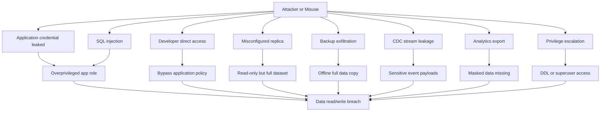
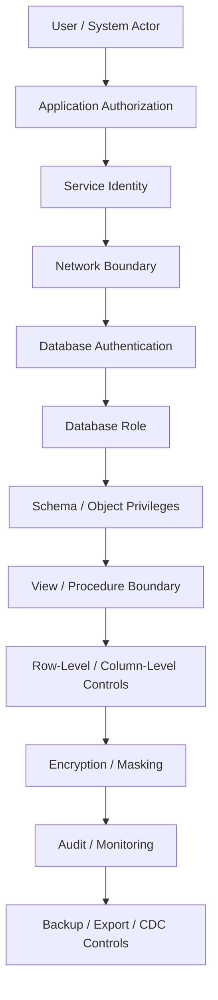
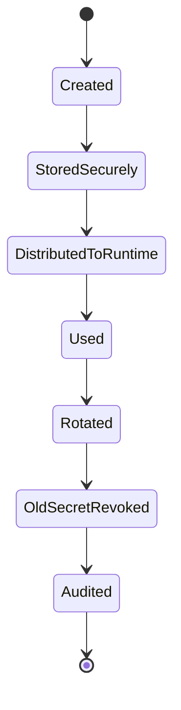

# Part 060 — Database Security Architecture

> Database security architecture is not a password, a firewall rule, or an encrypted disk. It is the design of **who can do what, to which data, through which path, under which controls, with which evidence, and with what blast radius if a layer fails**.

This part focuses on database security as architecture.

We will not repeat generic application authentication/authorization material from earlier series. Here, the scope is the database boundary itself: roles, privileges, schema exposure, row-level controls, encryption, secrets, network paths, auditing, backup security, analytics exposure, CDC exposure, and operational access.

---

## 1. Learning Goals

After this part, you should be able to:

1. Build a database-specific threat model.
2. Separate application authorization from database authorization.
3. Design least-privilege database roles.
4. Reduce blast radius of compromised service credentials.
5. Use schema, view, grant, and row-level boundaries intentionally.
6. Classify encryption controls: in transit, at rest, field-level, application-level, and backup encryption.
7. Design secret lifecycle: creation, storage, rotation, revocation, and audit.
8. Secure backups, replicas, CDC streams, exports, and analytics copies.
9. Design break-glass and admin access without making it invisible.
10. Create a database security review checklist.

---

## 2. The Core Mental Model

A database contains concentrated authority.

It often has:

- Canonical business facts.
- Personal and confidential data.
- Historical evidence.
- Financial or enforcement records.
- Authorization-relevant state.
- Audit trails.
- Derived data that may reveal sensitive facts.
- Backups that preserve everything.
- Replicas and exports that multiply exposure.

The database is not just a storage component. It is a trust boundary.

A good database security design answers:

```text
If the application is compromised, what can the attacker do?
If a developer credential leaks, what can the attacker read or modify?
If an analyst query is wrong, what data can be exposed?
If a backup is copied, what is inside it and who can decrypt it?
If row-level security fails, what catches the failure?
If an admin performs emergency access, how is it approved and audited?
```

Security architecture is not a single wall. It is defense-in-depth.

---

## 3. Security Objectives

Database security has five core objectives.

| Objective | Meaning |
|---|---|
| Confidentiality | Unauthorized parties cannot read protected data. |
| Integrity | Unauthorized parties cannot modify protected data. |
| Availability | Security controls do not create avoidable outages, and attacks cannot trivially deny service. |
| Accountability | Sensitive access and modification are attributable. |
| Containment | A compromised path has limited blast radius. |

Many systems over-focus on confidentiality and forget integrity. A user who cannot read all data but can modify critical workflow state is still dangerous.

---

## 4. Threat Model for Database Systems

Start with actors and paths.

### 4.1 Actors

| Actor | Risk |
|---|---|
| Application service | Overprivileged service role can read/write too much. |
| Background worker | Batch job can corrupt many rows quickly. |
| Migration runner | DDL privilege can destroy or expose schema. |
| Developer | Direct production access can bypass application controls. |
| DBA/admin | High privilege requires approval and audit. |
| Analyst/reporting user | Read access can expose PII or cross-tenant data. |
| Support user | Legitimate investigation access can become broad data browsing. |
| CDC consumer | Event stream may leak sensitive payloads. |
| Backup operator | Backup copy may contain full production dataset. |
| Attacker | May exploit SQL injection, leaked credential, exposed replica, or misconfigured network. |

### 4.2 Assets

| Asset | Example |
|---|---|
| Core records | Cases, accounts, transactions, decisions, assignments. |
| Sensitive fields | PII, addresses, identifiers, notes, evidence descriptions. |
| Secrets | DB passwords, TLS private keys, encryption keys. |
| Audit logs | Access history, decision history, admin actions. |
| Derived stores | Search documents, reports, materialized views, caches. |
| Backups | Full historical copy of data. |
| CDC streams | Append-only feed of changes. |
| Metadata | Tenant catalog, schema, table names, row counts, query logs. |

### 4.3 Attack Paths



This diagram exposes an important point: even if the primary application is secure, replicas, exports, backups, logs, and CDC can still leak data.

---

## 5. Database Security Layers

Think in layers.



The mistake is assuming any one layer is enough.

A good design assumes one layer may fail and asks what limits damage next.

---

## 6. Application Authorization vs Database Authorization

Application authorization answers:

```text
Can this user perform this action in this product workflow?
```

Database authorization answers:

```text
Can this database principal execute this database operation on this data object?
```

They are related but not the same.

Example:

| Layer | Example rule |
|---|---|
| Application | Officer can close case only if assigned and all required evidence is reviewed. |
| Database | `case_write_role` can update allowed columns on `case` table through stored procedure or controlled SQL path. |
| Row policy | Role can see rows only for allowed tenant/context. |
| Audit | Every status change has actor, command id, timestamp, and reason. |

Do not push all authorization into the database blindly. Also do not leave the database as an unprotected backend bucket.

Use the database for hard containment and invariant enforcement. Use the application for rich workflow semantics and user experience.

---

## 7. Least Privilege as Architecture

Least privilege means each role has only the capabilities required for its purpose.

For databases, least privilege must be applied by:

1. Environment.
2. Service.
3. Operation type.
4. Schema/table/view/function.
5. Column when needed.
6. Row/tenant when needed.
7. Time-bound access for humans.
8. Separation of runtime, migration, reporting, support, and admin access.

Bad design:

```text
Every service uses db_admin with broad read/write/DDL privileges.
```

Better design:

```text
case_api_rw        -> read/write only case service tables/views/functions
case_worker_rw     -> write outbox, process jobs, update selected workflow tables
case_report_ro     -> read approved reporting views only
case_migration_ddl -> DDL during deployment pipeline only
case_support_ro    -> masked read views with audited access
case_break_glass   -> temporary elevated access with approval and audit
```

---

## 8. Role Design Pattern

Separate ownership from usage.

### 8.1 Ownership Role

Owns schema objects. Not used by application runtime.

```sql
CREATE ROLE case_owner NOLOGIN;
```

### 8.2 Runtime Roles

Used by services.

```sql
CREATE ROLE case_api_rw LOGIN;
CREATE ROLE case_worker_rw LOGIN;
CREATE ROLE case_report_ro LOGIN;
CREATE ROLE case_support_ro LOGIN;
```

### 8.3 Migration Role

Used by CI/CD migration process, not by runtime services.

```sql
CREATE ROLE case_migration_ddl LOGIN;
```

### 8.4 Break-Glass Role

Used only for emergency, time-bound, audited access.

```sql
CREATE ROLE case_break_glass LOGIN;
```

### 8.5 Schema Ownership

```sql
CREATE SCHEMA case_mgmt AUTHORIZATION case_owner;
```

### 8.6 Grants

Example grants:

```sql
GRANT USAGE ON SCHEMA case_mgmt TO case_api_rw;

GRANT SELECT, INSERT, UPDATE
ON case_mgmt.enforcement_case,
   case_mgmt.case_assignment,
   case_mgmt.case_timeline_event
TO case_api_rw;

GRANT SELECT
ON case_mgmt.case_summary_view
TO case_report_ro;

GRANT SELECT
ON case_mgmt.support_case_masked_view
TO case_support_ro;
```

Avoid granting `ALL` casually. Avoid using owner role as runtime role.

---

## 9. Default Privileges

A common failure mode:

```text
New table created. Existing roles unintentionally do or do not get access.
```

Use default privileges intentionally.

```sql
ALTER DEFAULT PRIVILEGES FOR ROLE case_owner IN SCHEMA case_mgmt
GRANT SELECT ON TABLES TO case_report_ro;
```

But be careful. Default privileges can create silent exposure if applied too broadly.

Design rule:

```text
Default privileges should match a documented schema exposure policy,
not developer convenience.
```

---

## 10. Runtime Role Separation

Separate write paths.

| Role | Allowed | Not allowed |
|---|---|---|
| API role | OLTP reads/writes for request lifecycle | DDL, bulk export, admin repair |
| Worker role | Job claim/update, outbox publish, batch state transitions | Arbitrary human support query |
| Reporting role | Approved views/materialized views | Direct sensitive base tables |
| Migration role | DDL and controlled data migration | Runtime traffic use |
| Support role | Masked search/read views | Bulk export, direct update |
| Admin role | Emergency operations | Normal application operation |

This prevents one leaked credential from becoming total compromise.

---

## 11. Network Boundary

Database network controls should answer:

1. Which workloads can reach the database endpoint?
2. From which network segments?
3. Through which port/protocol?
4. Is traffic encrypted in transit?
5. Can developers connect directly?
6. Are replicas/backups exposed through weaker paths?

Recommended posture:

- Private network by default.
- No public database endpoint unless extremely justified.
- Security groups/firewall rules by service identity or subnet.
- Separate admin access path through bastion/VPN/identity-aware proxy.
- TLS required for client connections where supported.
- Separate endpoints/roles for primary, replica, analytics, and admin.

Network isolation is not a substitute for database privileges. It is one layer.

---

## 12. Authentication Strategy

Authentication answers:

```text
Who is connecting to the database?
```

Common models:

| Model | Strength | Risk |
|---|---|---|
| Static password | Simple | Long-lived secret leakage |
| Rotated password | Better | Rotation complexity |
| IAM/token-based auth | Short-lived identity | Cloud/provider coupling |
| Client certificate | Strong mutual identity | Certificate lifecycle complexity |
| Kerberos/SSO integration | Enterprise control | Operational complexity |

Production design should define:

- Who creates credentials?
- Where are credentials stored?
- How are they rotated?
- How are they revoked?
- How is credential use audited?
- What is the blast radius of one credential leak?

---

## 13. Secrets Management

Do not put database secrets in source code, images, logs, or plain environment dumps.

Secret lifecycle:



Design requirements:

- Central secret manager or equivalent control.
- Access to secret is itself authorized and audited.
- Rotation procedure tested.
- Dual-secret window for zero-downtime rotation.
- Immediate revocation path for compromise.
- No shared secret across unrelated services.
- Secret access logs reviewed for abnormal usage.

If many services share one database credential, you cannot attribute misuse precisely.

---

## 14. Encryption

Encryption has multiple layers. Do not collapse them into one checkbox.

| Layer | Protects against | Does not protect against |
|---|---|---|
| In transit | Network eavesdropping/tampering | Compromised app role |
| At rest | Stolen disk/snapshot/storage media | Authorized database query |
| Backup encryption | Backup theft | Authorized restore by wrong party if key accessible |
| Column/field encryption | Database/operator exposure for selected fields | Queryability and key-management complexity |
| Application-level encryption | DB cannot see plaintext | Harder search/indexing/reporting |
| Tokenization | Reduces exposure of raw sensitive values | Token vault becomes critical asset |

Design rule:

```text
Encryption controls storage and transport exposure.
Authorization controls query exposure.
Audit controls accountability.
Do not confuse them.
```

---

## 15. Field-Level Protection

Some fields deserve stronger controls than the table as a whole.

Examples:

- National ID.
- Passport number.
- Bank account number.
- Personal address.
- Health information.
- Confidential evidence notes.
- Informant identity.
- Legal privilege notes.

Possible controls:

1. Move field to separate table with narrower grants.
2. Expose only masked view to common roles.
3. Encrypt field with application-managed key.
4. Tokenize value and store token in operational table.
5. Log all access to field.
6. Require explicit reason code for access.
7. Use break-glass workflow for exceptional access.

Example separated sensitive table:

```sql
CREATE TABLE case_mgmt.person_sensitive_identity (
    person_id       uuid PRIMARY KEY REFERENCES case_mgmt.person(id),
    national_id_enc bytea NOT NULL,
    key_version     integer NOT NULL,
    created_at      timestamptz NOT NULL DEFAULT now(),
    updated_at      timestamptz NOT NULL DEFAULT now()
);

REVOKE ALL ON case_mgmt.person_sensitive_identity FROM PUBLIC;
GRANT SELECT, INSERT, UPDATE ON case_mgmt.person_sensitive_identity TO identity_service_rw;
```

The rest of the application can reference `person_id` without reading the sensitive value.

---

## 16. Views as Security Boundaries

Views can reduce exposure when used intentionally.

Example masked support view:

```sql
CREATE VIEW case_mgmt.support_case_masked_view AS
SELECT
    c.id,
    c.tenant_id,
    c.case_number,
    c.status,
    c.priority,
    left(p.full_name, 1) || '***' AS subject_name_masked,
    '***' || right(p.national_id_last4, 2) AS national_id_masked,
    c.created_at,
    c.updated_at
FROM case_mgmt.enforcement_case c
JOIN case_mgmt.person p ON p.id = c.subject_person_id;

GRANT SELECT ON case_mgmt.support_case_masked_view TO case_support_ro;
```

Then avoid granting support role direct access to base sensitive tables.

View security caveat:

```text
A view is useful only if base table privileges are not also granted broadly.
```

---

## 17. Row-Level Security

Row-Level Security restricts which rows a database role can see or modify.

Use cases:

- Multi-tenant SaaS.
- Support access scoped to assigned tenant/customer.
- User-owned records.
- Region or jurisdiction boundary.
- Confidential case compartments.

Example tenant policy:

```sql
ALTER TABLE case_mgmt.enforcement_case ENABLE ROW LEVEL SECURITY;

CREATE POLICY tenant_case_isolation
ON case_mgmt.enforcement_case
USING (tenant_id = current_setting('app.tenant_id')::uuid)
WITH CHECK (tenant_id = current_setting('app.tenant_id')::uuid);
```

Application sets session context at transaction start:

```sql
SELECT set_config('app.tenant_id', :tenant_id, true);
```

Important:

- `USING` controls row visibility for read/update/delete.
- `WITH CHECK` controls rows allowed for insert/update.
- Policy must be tested for `SELECT`, `INSERT`, `UPDATE`, and `DELETE`.
- Table owners and superusers may bypass policies depending configuration/role behavior.
- Use `FORCE ROW LEVEL SECURITY` where appropriate to reduce accidental bypass.

Example:

```sql
ALTER TABLE case_mgmt.enforcement_case FORCE ROW LEVEL SECURITY;
```

RLS is powerful, but not magic. You must test it like code.

---

## 18. RLS Failure Modes

| Failure mode | Cause | Control |
|---|---|---|
| Tenant context missing | App forgot to set session variable | Fail-closed policy; transaction wrapper test |
| Owner bypass | Runtime role owns table | Separate owner role from runtime role |
| Insert wrong tenant | `USING` exists but `WITH CHECK` missing | Always define write policy |
| Support role sees all tenants | Broad bypass grant | Separate audited support access path |
| Search/report bypasses RLS | Projection built without tenant filter | Enforce tenant in projection schema and tests |
| Admin repair accidentally cross-tenant | Manual SQL lacks tenant predicate | Dry-run, scoped role, approval, audit |

Fail-closed policy example:

```sql
CREATE POLICY tenant_case_isolation
ON case_mgmt.enforcement_case
USING (
    current_setting('app.tenant_id', true) IS NOT NULL
    AND tenant_id = current_setting('app.tenant_id')::uuid
)
WITH CHECK (
    current_setting('app.tenant_id', true) IS NOT NULL
    AND tenant_id = current_setting('app.tenant_id')::uuid
);
```

---

## 19. Column-Level Grants

Some databases allow column-specific grants.

Example:

```sql
GRANT SELECT (id, tenant_id, case_number, status, created_at)
ON case_mgmt.enforcement_case
TO case_report_ro;
```

This can help, but schema-level separation and views are often easier to reason about at scale.

Use column grants when:

- The table is stable.
- Sensitive columns are few.
- Access requirements are simple.
- Tooling supports review.

Use views or separate tables when:

- Masking is required.
- Derived exposure differs from base table.
- Complex joins are needed.
- Support/report consumers should not know base schema.

---

## 20. Stored Procedures and Controlled Write APIs

For very sensitive transitions, exposing raw table update may be too broad.

Pattern:

- Revoke direct update on table.
- Grant execute on controlled function/procedure.
- Function validates transition, writes audit, writes outbox, and enforces invariant.

Example:

```sql
REVOKE UPDATE ON case_mgmt.enforcement_case FROM case_api_rw;

CREATE FUNCTION case_mgmt.close_case(
    p_case_id uuid,
    p_actor_id uuid,
    p_reason text,
    p_command_id uuid
)
RETURNS void
LANGUAGE plpgsql
SECURITY DEFINER
AS $$
BEGIN
    -- Validate current state, actor scope, command id, required evidence, etc.
    -- Keep function owner and search_path carefully controlled in real systems.
    UPDATE case_mgmt.enforcement_case
    SET status = 'CLOSED',
        closed_at = now(),
        updated_at = now()
    WHERE id = p_case_id
      AND status IN ('READY_TO_CLOSE', 'UNDER_FINAL_REVIEW');

    IF NOT FOUND THEN
        RAISE EXCEPTION 'case cannot be closed from current state';
    END IF;

    INSERT INTO case_mgmt.case_timeline_event (
        id, case_id, event_type, occurred_at, actor_id, payload, command_id
    ) VALUES (
        gen_random_uuid(), p_case_id, 'CASE_CLOSED', now(), p_actor_id,
        jsonb_build_object('reason', p_reason), p_command_id
    );
END;
$$;

GRANT EXECUTE ON FUNCTION case_mgmt.close_case(uuid, uuid, text, uuid) TO case_api_rw;
```

Caution:

- `SECURITY DEFINER` must be reviewed carefully.
- Control `search_path` to avoid object hijacking.
- Functions must be versioned and tested.
- Do not hide business complexity in unmaintainable procedural code.

---

## 21. SQL Injection and Database Blast Radius

SQL injection is usually described as an application bug, but database architecture controls blast radius.

Bad:

```text
Application role can SELECT, INSERT, UPDATE, DELETE on every table.
```

If SQL injection occurs, attacker gets broad data access.

Better:

- Parameterized queries.
- Runtime role has limited grants.
- Sensitive base tables inaccessible.
- Views mask common support/report access.
- RLS enforces tenant boundary.
- Dangerous operations require stored procedure or separate role.
- `statement_timeout` limits expensive attack queries.
- Audit abnormal query patterns.

You prevent injection in the application. You contain injection in the database.

---

## 22. Audit Architecture

Audit should answer:

```text
Who accessed or changed what, when, through which path, for what reason,
and under which authorization context?
```

There are multiple audit types:

| Audit type | Example |
|---|---|
| Data-change audit | Case status changed, assignment changed, evidence attached. |
| Access audit | Sensitive record viewed by support user. |
| Admin audit | DBA executed privileged command. |
| Security audit | Failed login, privilege change, role grant. |
| Export audit | Report/export generated containing sensitive data. |
| Backup audit | Backup created, copied, restored, or deleted. |
| Break-glass audit | Emergency access approved and used. |

Application-level audit and database-level audit serve different purposes.

- Application audit captures business actor and reason.
- Database audit captures technical principal and operation path.

You often need both.

---

## 23. Data-Change Audit Pattern

For business-critical changes, store domain-level audit events.

```sql
CREATE TABLE case_mgmt.case_timeline_event (
    id              uuid PRIMARY KEY,
    tenant_id       uuid NOT NULL,
    case_id         uuid NOT NULL,
    event_type      text NOT NULL,
    occurred_at     timestamptz NOT NULL,
    actor_id        uuid,
    command_id      uuid,
    reason          text,
    payload         jsonb NOT NULL,
    request_id      text,
    created_at      timestamptz NOT NULL DEFAULT now()
);

CREATE INDEX ix_case_timeline_case_time
ON case_mgmt.case_timeline_event (tenant_id, case_id, occurred_at DESC);
```

Audit event requirements:

- Immutable or append-only where feasible.
- Includes actor and command/request id.
- Includes reason for sensitive/manual action.
- Includes enough payload to reconstruct decision context.
- Has tenant/jurisdiction context.
- Has schema/version if payload evolves.

---

## 24. Access Audit Pattern

Some reads are sensitive enough to audit.

Examples:

- Viewing sealed case.
- Viewing identity document.
- Exporting evidence bundle.
- Support user opening customer record.
- Admin querying sensitive table.

Pattern:

```sql
CREATE TABLE security.sensitive_access_log (
    id              uuid PRIMARY KEY,
    occurred_at     timestamptz NOT NULL DEFAULT now(),
    actor_id        uuid,
    database_role   text NOT NULL DEFAULT current_user,
    tenant_id       uuid,
    resource_type   text NOT NULL,
    resource_id     uuid NOT NULL,
    access_type     text NOT NULL,
    reason_code     text,
    request_id      text,
    client_app      text,
    client_addr     inet
);
```

Important:

```text
Access logging must be hard to bypass for sensitive access paths.
```

For support tools, make the access path write audit before returning sensitive data.

---

## 25. Admin and Break-Glass Access

Admin access is necessary. Invisible admin access is dangerous.

Break-glass design:

1. Emergency role is disabled or inaccessible by default.
2. Access requires approval/ticket/incident id.
3. Access is time-bound.
4. Session is logged.
5. Commands are attributable.
6. Post-use review is required.
7. Credentials are rotated if needed.
8. Any data repair has dry-run and proof query.

Break-glass table:

```sql
CREATE TABLE security.break_glass_session (
    id              uuid PRIMARY KEY,
    requested_by    uuid NOT NULL,
    approved_by     uuid NOT NULL,
    reason          text NOT NULL,
    incident_id     text NOT NULL,
    started_at      timestamptz NOT NULL,
    expires_at      timestamptz NOT NULL,
    closed_at       timestamptz,
    summary         text
);
```

The point is not bureaucracy. The point is accountability under exceptional power.

---

## 26. Backup Security

Backups are production data.

Often they are more dangerous than the live database because they may bypass live access controls.

Backup security questions:

1. Are backups encrypted?
2. Who can create backups?
3. Who can list backups?
4. Who can copy backups?
5. Who can restore backups?
6. Who can decrypt backups?
7. Are backups replicated to another account/region?
8. Are backup access logs reviewed?
9. Are backups subject to retention and legal hold?
10. Do backups contain data that should have been purged?

Controls:

- Separate backup administration role.
- Encryption keys with restricted access.
- Immutable backup policy where appropriate.
- Restore into isolated network by default.
- No restore to lower environment without masking/tokenization.
- Backup inventory and access audit.
- Restore drill includes security validation.

---

## 27. Replica Security

A read replica is a copy of data. Treat it as sensitive.

Failure modes:

- Replica endpoint exposed more broadly than primary.
- Analysts get replica access with raw PII.
- Replica used for reporting without tenant/masking boundary.
- Replica lag hides recent access revocation.
- Replica promoted with wrong security configuration.

Controls:

- Replica network boundary equal or stricter than primary.
- Separate roles for replica/reporting access.
- Masked/reporting views.
- No direct analyst access to raw OLTP base tables unless approved.
- Monitor replication lag for security-sensitive revocation cases.
- Promotion runbook validates grants, roles, and security settings.

---

## 28. CDC and Event Stream Security

CDC streams can leak sensitive data even when database tables are protected.

CDC risks:

- Full row images include PII.
- Delete events expose prior values.
- Event payload copied to logs.
- Consumers persist sensitive fields in weaker stores.
- Replay exposes historical data beyond retention expectations.
- CDC topic ACLs broader than DB grants.

Controls:

- Event contract classifies sensitive fields.
- Redaction or payload minimization.
- Topic-level access control.
- Encryption in transit and at rest.
- Consumer registry.
- Data retention on topics.
- Audit access to topics.
- Separate internal CDC from public domain events.
- Delete/revocation propagation.

Design rule:

```text
A CDC stream is a data product with security requirements, not merely plumbing.
```

---

## 29. Analytics and Export Security

Analytics creates another database boundary.

Questions:

1. Is analytical data raw, masked, aggregated, or anonymized?
2. Can analysts join data to re-identify individuals?
3. Are tenant boundaries preserved?
4. Are exports watermarked or logged?
5. Is row-level access applied in BI tools only, or also in warehouse views?
6. Do reports include data past retention policy?
7. Are ad hoc queries audited?

Controls:

- Curated data marts.
- Masked views.
- Aggregation thresholds.
- Purpose-specific access.
- Export approval for sensitive datasets.
- Data classification tags.
- Lineage tracking.
- Retention policy in warehouse/lakehouse.
- Separate raw zone from consumption zone.

Do not assume “analytics is internal” means “analytics is safe”.

---

## 30. Environment Isolation

Production, staging, dev, and test must have different security assumptions.

Bad:

```text
Production dump restored to dev with real PII for debugging.
```

Better:

- Synthetic data for most tests.
- Masked/tokenized production subset only when justified.
- Separate credentials per environment.
- No production role usable in non-production.
- Network separation.
- Lower environments cannot reach production database.
- Backup restore to lower environment requires masking pipeline.

Environment isolation also protects production from accidental scripts pointed at the wrong database.

---

## 31. Data Classification

Classify fields and tables.

Example classification:

| Class | Example | Controls |
|---|---|---|
| Public | Published reference data | Basic integrity |
| Internal | Operational metadata | Role-based access |
| Confidential | Case details, customer account data | Restricted roles, audit, masking |
| Highly sensitive | IDs, evidence, informant info, financial credentials | Strong access, encryption/tokenization, reason-coded audit |
| Regulated | Data under legal/privacy retention obligations | Retention, deletion workflow, access proof |

Classification should drive schema design.

For example, do not store highly sensitive identity values in a general `person` table if most consumers only need display name and internal person id.

---

## 32. Multi-Tenant Security Model

Multi-tenancy needs security at multiple layers:

1. Tenant catalog.
2. Request tenant context.
3. Database tenant column or physical isolation.
4. RLS or enforced predicates.
5. Tenant-scoped indexes and unique keys.
6. Tenant-aware audit.
7. Tenant-aware backup/restore/export.
8. Tenant-aware support access.
9. Tenant-aware metrics.
10. Tenant migration controls.

Tenant escape failure mode:

```text
A query missing tenant predicate returns another tenant's case.
```

Controls:

- Composite keys include `tenant_id` where appropriate.
- RLS policy enforces tenant context.
- Runtime role does not bypass RLS.
- Tests use multiple tenants.
- Reports/search/CDC preserve tenant context.
- Support tooling requires tenant scope.

Schema rule:

```text
If tenant isolation matters, tenant_id is not just a column.
It is part of identity, access, index, audit, backup, and incident response design.
```

---

## 33. Security Observability

Monitor security-relevant signals.

Examples:

| Signal | Why it matters |
|---|---|
| Failed logins | Credential attack or misconfiguration |
| New grants/role changes | Privilege escalation risk |
| Superuser/admin sessions | High-risk access |
| Unusual query volume by role | Possible exfiltration |
| Large exports | Data leakage risk |
| Sensitive access log spikes | Misuse or incident |
| Access outside normal hours | Suspicious activity |
| Backup copy/restore event | Full data exposure event |
| CDC consumer access changes | Downstream leakage risk |
| RLS policy changes | Tenant/data boundary change |

Security observability should be integrated into incident management, not buried in database logs no one reads.

---

## 34. Security Testing

Test security as executable behavior.

### 34.1 Grant Tests

Assert roles cannot access what they should not.

```sql
-- As case_report_ro, this should succeed:
SELECT * FROM case_mgmt.case_summary_view LIMIT 1;

-- As case_report_ro, this should fail:
SELECT * FROM case_mgmt.person_sensitive_identity LIMIT 1;
```

### 34.2 RLS Tests

Use at least two tenants.

```sql
SELECT set_config('app.tenant_id', 'aaaaaaaa-aaaa-aaaa-aaaa-aaaaaaaaaaaa', true);

SELECT count(*)
FROM case_mgmt.enforcement_case
WHERE tenant_id <> current_setting('app.tenant_id')::uuid;

-- Expected: 0
```

### 34.3 Insert/Update Policy Tests

```sql
SELECT set_config('app.tenant_id', 'aaaaaaaa-aaaa-aaaa-aaaa-aaaaaaaaaaaa', true);

-- Should fail if row tenant_id differs from session tenant_id.
INSERT INTO case_mgmt.enforcement_case (id, tenant_id, case_number, status)
VALUES (gen_random_uuid(), 'bbbbbbbb-bbbb-bbbb-bbbb-bbbbbbbbbbbb', 'CASE-1', 'OPEN');
```

### 34.4 Backup/Restore Security Test

- Restore backup into isolated environment.
- Confirm encryption keys are controlled.
- Confirm restored endpoint is not public.
- Confirm non-production consumers cannot access raw production data.
- Confirm masking pipeline if used.

### 34.5 Break-Glass Test

- Request emergency access.
- Verify approval path.
- Verify expiration.
- Verify audit log.
- Verify post-use review.

---

## 35. Security Review Checklist

### Identity and Roles

- [ ] Runtime roles are separate from owner roles.
- [ ] Migration role is not used by application runtime.
- [ ] Reporting/support/admin roles are separated.
- [ ] No application uses superuser/admin role.
- [ ] Credentials are unique per service and environment.
- [ ] Credential rotation is tested.

### Privileges

- [ ] Grants are explicit and minimal.
- [ ] Direct base-table access is avoided for support/reporting where views are safer.
- [ ] Sensitive tables have restricted grants.
- [ ] Default privileges are reviewed.
- [ ] DDL privileges are limited to deployment pipeline.
- [ ] Dangerous functions/procedures are reviewed.

### Row and Column Protection

- [ ] Tenant-sensitive tables have tenant boundary strategy.
- [ ] RLS policies include both `USING` and `WITH CHECK` where needed.
- [ ] RLS is tested for multiple tenants.
- [ ] Sensitive columns are masked, separated, encrypted, or tokenized where needed.
- [ ] Support views expose only necessary fields.

### Network and Authentication

- [ ] Database endpoint is private by default.
- [ ] Admin access path is controlled.
- [ ] TLS/in-transit encryption policy is defined.
- [ ] Direct developer production access is restricted and audited.
- [ ] Replica endpoints are not weaker than primary.

### Encryption and Secrets

- [ ] Encryption at rest is enabled where required.
- [ ] Backup encryption and key access are reviewed.
- [ ] Field-level encryption/tokenization is used for selected high-risk fields where needed.
- [ ] Secrets are stored in a managed secret system.
- [ ] Secret access is audited.
- [ ] Rotation/revocation process is tested.

### Audit and Monitoring

- [ ] Data-change audit exists for critical business changes.
- [ ] Sensitive read access is logged where required.
- [ ] Admin and break-glass sessions are logged.
- [ ] Role/grant changes are monitored.
- [ ] Large export and backup actions are auditable.
- [ ] Security alerts have owners and runbooks.

### Backups, Replicas, CDC, Exports

- [ ] Backups are treated as production-sensitive data.
- [ ] Restore path does not expose data to weaker environments.
- [ ] CDC payloads are classified and minimized.
- [ ] Topic/access controls match data sensitivity.
- [ ] Analytics data is masked/curated where required.
- [ ] Retention/deletion policy applies beyond primary OLTP store.

### Operations

- [ ] Break-glass process exists and is tested.
- [ ] Data repair process is audited.
- [ ] Security incident response includes database-specific steps.
- [ ] Access reviews are scheduled.
- [ ] Security assumptions are captured in architecture decision records.

---

## 36. Architecture Decision Record Template

```md
# ADR: Database Security Boundary for Case Management

## Status
Accepted

## Context
The case management database stores confidential case records, evidence metadata,
assignments, decisions, audit events, and tenant-scoped operational data.

## Decision
- Runtime application uses `case_api_rw`, not owner/admin role.
- Schema is owned by `case_owner` NOLOGIN role.
- Reporting uses approved views only.
- Support access uses masked views and reason-coded access logging.
- Tenant-sensitive tables use RLS with session tenant context.
- Migration role is available only in CI/CD pipeline.
- Backups are encrypted and restore requires restricted approval.
- CDC events exclude highly sensitive fields unless explicitly approved.

## Consequences
- More role/grant management complexity.
- Security tests are required in CI.
- Some ad hoc debugging is slower.
- Blast radius of compromised runtime credential is reduced.
- Tenant boundary does not rely solely on application query discipline.

## Open Risks
- RLS policy performance must be load-tested.
- Support access workflow needs UX implementation.
- Data masking rules must be reviewed by compliance/legal.
```

---

## 37. Common Anti-Patterns

### 37.1 One Database User for Everything

This makes attribution poor and blast radius huge.

### 37.2 Application Superuser

The service runtime should not own schema, create tables, grant privileges, or bypass policies.

### 37.3 Security Only in Application Code

Application authorization is necessary but insufficient for database containment.

### 37.4 Raw Production Data in Lower Environments

This creates uncontrolled data copies and weakens privacy posture.

### 37.5 Backups Treated as Infrastructure Artifacts

Backups are full data copies and must be secured like the database itself.

### 37.6 Analyst Access to Raw OLTP Tables

This bypasses product authorization, masking, and purpose limitation.

### 37.7 CDC Without Data Classification

A CDC stream can leak more than a public API because it may include every change.

### 37.8 RLS Without Tests

Untested RLS gives false confidence.

### 37.9 Shared Secrets Across Services

When one shared credential leaks, you cannot isolate source or contain damage.

### 37.10 Invisible Break-Glass

Emergency access without evidence becomes permanent privileged access.

---

## 38. Practical Design Exercise

Pick one production database and answer:

1. Which roles can connect?
2. Which role owns schema objects?
3. Which role does each service use?
4. Can the application role perform DDL?
5. Can the application role read sensitive tables directly?
6. Can support users access raw PII?
7. How is tenant isolation enforced?
8. Are RLS policies tested with multiple tenants?
9. Who can create/copy/restore backups?
10. Who can decrypt backups?
11. What sensitive data appears in CDC streams?
12. What sensitive data appears in logs?
13. What happens if a service credential leaks?
14. What happens if an analyst account is compromised?
15. What evidence exists for admin access?

If the answers are vague, the database security architecture is not explicit enough.

---

## 39. Summary

Database security architecture is defense-in-depth around the system of truth.

The key lessons:

1. The database is a trust boundary, not just storage.
2. Application authorization and database authorization solve different problems.
3. Least privilege must be designed across roles, schemas, tables, views, functions, rows, columns, and environments.
4. Runtime roles should not own schema objects or hold admin privileges.
5. Network controls reduce reachability but do not replace grants and policies.
6. Encryption protects storage and transport exposure, but it does not replace authorization.
7. Backups, replicas, CDC streams, analytics stores, and exports are part of database security scope.
8. RLS can enforce tenant or row boundaries, but it must be tested and protected from bypass.
9. Support and break-glass access need approval, time bounds, and audit evidence.
10. Security design should reduce blast radius when one layer fails.

A top-level database architect asks not only “is the data encrypted?” but:

```text
Who can reach the database, with what identity, what privileges,
through what path, to which data, with what audit trail,
and what happens when one control fails?
```

That is database security architecture.

---

## 40. References

- PostgreSQL Documentation — Database Roles and Privileges: https://www.postgresql.org/docs/current/user-manag.html
- PostgreSQL Documentation — Role Attributes: https://www.postgresql.org/docs/current/role-attributes.html
- PostgreSQL Documentation — Privileges: https://www.postgresql.org/docs/current/ddl-priv.html
- PostgreSQL Documentation — Row Security Policies: https://www.postgresql.org/docs/current/ddl-rowsecurity.html
- PostgreSQL Documentation — Client Authentication: https://www.postgresql.org/docs/current/client-authentication.html
- PostgreSQL Documentation — Secure TCP/IP Connections with SSL: https://www.postgresql.org/docs/current/ssl-tcp.html
- OWASP Database Security Cheat Sheet: https://cheatsheetseries.owasp.org/cheatsheets/Database_Security_Cheat_Sheet.html
- OWASP Authorization Cheat Sheet: https://cheatsheetseries.owasp.org/cheatsheets/Authorization_Cheat_Sheet.html
- OWASP Secrets Management Cheat Sheet: https://cheatsheetseries.owasp.org/cheatsheets/Secrets_Management_Cheat_Sheet.html
- OWASP Least Privilege Principle: https://owasp.org/www-community/controls/Least_Privilege_Principle
- NIST SP 800-53 Rev. 5 — Security and Privacy Controls for Information Systems and Organizations: https://csrc.nist.gov/pubs/sp/800/53/r5/upd1/final
