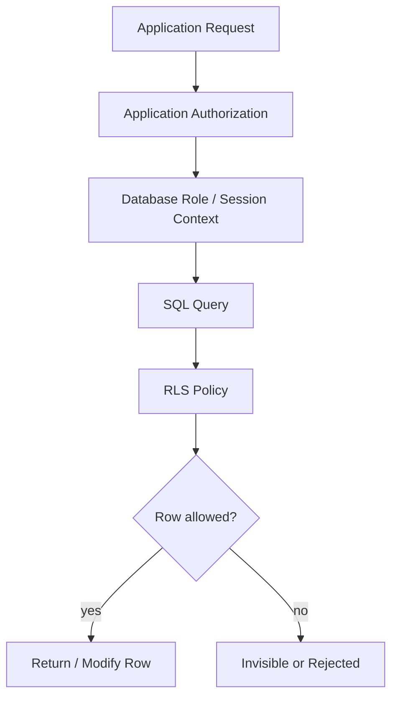

# Part 061 — Row-Level Security and Data Access Control

> Target bagian ini: kamu tidak hanya tahu `CREATE POLICY`, tetapi bisa merancang **data access control sebagai invariant database**. Fokusnya: siapa boleh melihat/mengubah baris mana, bagaimana boundary itu dipaksa di SQL, bagaimana mencegah bypass, bagaimana menguji policy, dan bagaimana mendesainnya agar tetap operable di production.

Di banyak sistem enterprise, akses data sering dimulai sebagai `WHERE tenant_id = ?` di service layer. Itu mudah, cepat, dan cukup untuk fase awal. Tetapi begitu sistem mulai punya banyak service, reporting, support access, admin tools, read replica, CDC, BI, data export, dan manual query, filter aplikasi saja menjadi terlalu rapuh.

**Row-level security (RLS)** adalah cara menjadikan sebagian access rule sebagai properti database. PostgreSQL mendefinisikan RLS sebagai policy per table yang menentukan row mana yang dapat dikembalikan, dimasukkan, diubah, atau dihapus oleh statement user tertentu. RLS diaktifkan di table, lalu policy didefinisikan dengan predicate. Superuser dan role dengan `BYPASSRLS` dapat melewati RLS, sehingga desain role tetap krusial.

RLS bukan pengganti authorization architecture. RLS adalah **last line of defense** dan **consistency guard** untuk data boundary yang sangat penting.

---

## 1. Mental model: access control is a data invariant

Access control biasanya dibahas sebagai security feature. Untuk database architect, access control lebih tepat dianggap sebagai invariant.

Contoh invariant:

```text
A user may only read cases belonging to tenants where the user has active membership.

An investigator may update a case only if:
- the case belongs to their tenant,
- the case is assigned to them or their active team,
- the case is not closed,
- and the operation is within their role scope.
```

Kalau invariant ini hanya ada di application code, maka setiap query harus benar. Satu query lupa filter dapat menjadi data breach.

Kalau invariant ini juga dimodelkan di database, maka query yang lupa filter tetap tidak akan melihat baris yang tidak boleh dilihat, sepanjang role dan policy tidak dibypass.



Important distinction:

| Layer | Responsibility |
|---|---|
| Application authorization | Menentukan user action secara business-level: boleh approve, assign, escalate, close, export |
| Database privileges | Menentukan role boleh `SELECT`, `INSERT`, `UPDATE`, `DELETE`, `EXECUTE` object tertentu |
| Row-level security | Menentukan row mana yang visible/writeable untuk role/session tertentu |
| Column masking/field security | Menentukan field sensitif mana yang boleh terlihat |
| Audit | Membuktikan siapa mengakses apa, kapan, dengan alasan apa |

Architect-level rule:

> Use RLS for stable, high-value data boundaries. Do not encode every UI permission as RLS.

---

## 2. When RLS is a good fit

RLS sangat cocok ketika rule-nya:

1. **row-scoped** — akses dapat diputuskan dari atribut row atau join ke membership table.
2. **stable** — rule tidak berubah setiap sprint.
3. **high-risk** — kegagalan filter dapat menyebabkan tenant leak, privacy breach, atau regulatory incident.
4. **cross-query** — banyak query berbeda membutuhkan boundary yang sama.
5. **cross-tool** — data diakses dari service, admin console, reporting tool, atau internal SQL tooling.

Contoh fit yang kuat:

| Use case | RLS fit? | Reason |
|---|---:|---|
| Multi-tenant SaaS tenant isolation | High | Boundary sederhana dan sangat kritikal |
| Regulatory case access by tenant + team | High | Kesalahan filter berdampak besar |
| Customer support scoped access | High | Perlu audit + limited visibility |
| Public/private row visibility | Medium | Bisa dilakukan dengan RLS atau view |
| Per-button UI permission | Low | Terlalu granular, berubah cepat |
| Dynamic workflow guard complex | Medium/Low | Lebih cocok di app/service, RLS sebagai boundary dasar |
| Field-level masking | Low for RLS | Lebih cocok view, column privilege, masking layer |

---

## 3. First principle: separate object privilege from row policy

Kesalahan umum: mengira RLS otomatis memberi hak akses. Tidak.

Agar user bisa membaca table, role tetap perlu privilege `SELECT`. RLS kemudian mempersempit row yang terlihat.

```sql
GRANT SELECT, INSERT, UPDATE ON enforcement_case TO app_case_worker;

ALTER TABLE enforcement_case ENABLE ROW LEVEL SECURITY;

CREATE POLICY case_tenant_read_policy
ON enforcement_case
FOR SELECT
TO app_case_worker
USING (
  tenant_id = current_setting('app.tenant_id')::uuid
);
```

Interpretasi:

- `GRANT SELECT` berarti role boleh menjalankan `SELECT` pada object.
- `USING (...)` berarti hanya row yang predicate-nya true yang visible.
- Jika tidak ada policy yang applicable, default-nya akses row ditolak ketika RLS aktif.

Mental model:

```text
Object privilege opens the door.
RLS decides which rooms inside the building can be entered.
```

---

## 4. Session context pattern

RLS butuh konteks: tenant, user, role, team, request purpose, support mode, dan sebagainya.

Di PostgreSQL, pattern umum adalah menyimpan context per transaction/session menggunakan custom GUC via `set_config()` / `current_setting()`.

```sql
SELECT set_config('app.user_id',   'b0f1...', true);
SELECT set_config('app.tenant_id', '74c5...', true);
SELECT set_config('app.roles',     'case_worker,investigator', true);
```

Parameter ketiga `true` berarti setting berlaku local untuk current transaction.

Dalam aplikasi:

```sql
BEGIN;

SELECT set_config('app.user_id', :user_id, true);
SELECT set_config('app.tenant_id', :tenant_id, true);

-- business queries here

COMMIT;
```

Gunakan `SET LOCAL`/transaction-local context untuk mencegah leakage antar request saat connection pooling.

### Failure mode: leaked tenant context

Connection pool dapat menggunakan kembali connection yang sama untuk request berikutnya. Jika context diset di session-level dan tidak dibersihkan, tenant A bisa menjalankan query dengan context tenant B.

Mitigation:

1. Set context **inside transaction**.
2. Use transaction pooling carefully.
3. Wrap every request in transaction for DB context.
4. Add test that simulates connection reuse.
5. Prefer `set_config(..., true)` for transaction-local setting.

---

## 5. Minimal tenant isolation policy

Schema:

```sql
CREATE TABLE tenant (
  tenant_id uuid PRIMARY KEY,
  name text NOT NULL,
  status text NOT NULL CHECK (status IN ('active', 'suspended', 'closed'))
);

CREATE TABLE enforcement_case (
  case_id uuid PRIMARY KEY,
  tenant_id uuid NOT NULL REFERENCES tenant(tenant_id),
  case_number text NOT NULL,
  status text NOT NULL,
  subject_name text NOT NULL,
  created_at timestamptz NOT NULL DEFAULT now(),
  updated_at timestamptz NOT NULL DEFAULT now(),
  UNIQUE (tenant_id, case_number)
);

CREATE INDEX idx_enforcement_case_tenant_status
ON enforcement_case (tenant_id, status, updated_at DESC);
```

RLS:

```sql
ALTER TABLE enforcement_case ENABLE ROW LEVEL SECURITY;

CREATE POLICY enforcement_case_tenant_select
ON enforcement_case
FOR SELECT
TO app_user
USING (
  tenant_id = current_setting('app.tenant_id')::uuid
);

CREATE POLICY enforcement_case_tenant_insert
ON enforcement_case
FOR INSERT
TO app_user
WITH CHECK (
  tenant_id = current_setting('app.tenant_id')::uuid
);

CREATE POLICY enforcement_case_tenant_update
ON enforcement_case
FOR UPDATE
TO app_user
USING (
  tenant_id = current_setting('app.tenant_id')::uuid
)
WITH CHECK (
  tenant_id = current_setting('app.tenant_id')::uuid
);
```

Kenapa `UPDATE` punya `USING` dan `WITH CHECK`?

- `USING` menentukan row lama mana yang boleh ditargetkan.
- `WITH CHECK` menentukan row baru hasil update harus tetap valid.

Tanpa `WITH CHECK`, user mungkin tidak bisa membaca tenant lain, tetapi bisa mencoba mengubah `tenant_id` row menjadi tenant lain jika object privilege dan constraint memungkinkan.

---

## 6. Do not rely only on application-supplied tenant_id

Bad pattern:

```sql
SELECT *
FROM enforcement_case
WHERE tenant_id = :tenant_id;
```

Ini benar hanya jika semua query selalu punya filter dan parameter tidak dapat dimanipulasi.

Better pattern:

```sql
SELECT *
FROM enforcement_case
WHERE status = 'open'
ORDER BY updated_at DESC
LIMIT 50;
```

RLS menambahkan tenant boundary secara implisit. Application tetap boleh menambahkan filter tenant untuk performance/readability, tetapi security tidak bergantung pada itu.

Architect-level rule:

> Application filters are query intent. RLS policies are safety boundary.

---

## 7. Membership-based access control

Tenant-only policy sering tidak cukup. Dalam case-management system, akses bisa tergantung membership, team, assignment, atau role.

Schema:

```sql
CREATE TABLE app_user (
  user_id uuid PRIMARY KEY,
  email text NOT NULL UNIQUE,
  status text NOT NULL CHECK (status IN ('active', 'disabled'))
);

CREATE TABLE tenant_membership (
  tenant_id uuid NOT NULL REFERENCES tenant(tenant_id),
  user_id uuid NOT NULL REFERENCES app_user(user_id),
  role_code text NOT NULL,
  status text NOT NULL CHECK (status IN ('active', 'suspended', 'revoked')),
  valid_from timestamptz NOT NULL DEFAULT now(),
  valid_until timestamptz,
  PRIMARY KEY (tenant_id, user_id, role_code)
);

CREATE INDEX idx_tenant_membership_user_active
ON tenant_membership (user_id, tenant_id)
WHERE status = 'active';
```

Policy:

```sql
CREATE POLICY enforcement_case_membership_select
ON enforcement_case
FOR SELECT
TO app_user
USING (
  EXISTS (
    SELECT 1
    FROM tenant_membership m
    WHERE m.tenant_id = enforcement_case.tenant_id
      AND m.user_id = current_setting('app.user_id')::uuid
      AND m.status = 'active'
      AND m.valid_from <= now()
      AND (m.valid_until IS NULL OR m.valid_until > now())
  )
);
```

Tradeoff:

- Lebih aman karena membership dicek dari DB state.
- Lebih mahal karena setiap row bisa membutuhkan semi-join ke membership table.
- Butuh index yang benar.
- Butuh test query plan.

Untuk sistem high-throughput, tenant context sering cukup di RLS, sedangkan role/action permission tetap di application. Untuk sistem high-risk, membership-based RLS bisa diterima walau lebih kompleks.

---

## 8. ABAC-style policy without chaos

Attribute-Based Access Control (ABAC) sering terdengar fleksibel, tetapi bisa menjadi policy spaghetti jika semua atribut dimasukkan ke predicate.

Contoh rule:

```text
A case is visible when:
- user is active member of tenant,
- case classification <= user clearance level,
- case region is in user's jurisdiction,
- case is not sealed unless user has sealed_case_access,
- support user must have active support session.
```

Schema pendukung:

```sql
CREATE TABLE user_access_profile (
  tenant_id uuid NOT NULL,
  user_id uuid NOT NULL,
  clearance_level int NOT NULL,
  region_codes text[] NOT NULL,
  can_view_sealed boolean NOT NULL DEFAULT false,
  PRIMARY KEY (tenant_id, user_id)
);

ALTER TABLE enforcement_case
ADD COLUMN classification_level int NOT NULL DEFAULT 0,
ADD COLUMN region_code text NOT NULL DEFAULT 'GLOBAL',
ADD COLUMN sealed_at timestamptz;
```

Policy:

```sql
CREATE POLICY enforcement_case_abac_select
ON enforcement_case
FOR SELECT
TO app_user
USING (
  EXISTS (
    SELECT 1
    FROM user_access_profile p
    WHERE p.tenant_id = enforcement_case.tenant_id
      AND p.user_id = current_setting('app.user_id')::uuid
      AND p.clearance_level >= enforcement_case.classification_level
      AND enforcement_case.region_code = ANY(p.region_codes)
      AND (
        enforcement_case.sealed_at IS NULL
        OR p.can_view_sealed = true
      )
  )
);
```

This works, but beware:

1. Arrays can hurt indexing and reasoning.
2. Policy predicate can become opaque.
3. Debugging “why can’t I see this case?” becomes harder.
4. Planner behavior must be tested with real cardinality.

If ABAC rules grow, create an explicit access materialization table.

---

## 9. Materialized access table pattern

Instead of evaluating complex policy logic for every query, precompute row access.

```sql
CREATE TABLE case_access_grant (
  case_id uuid NOT NULL REFERENCES enforcement_case(case_id),
  user_id uuid NOT NULL REFERENCES app_user(user_id),
  access_level text NOT NULL CHECK (access_level IN ('read', 'write', 'admin')),
  reason_code text NOT NULL,
  granted_at timestamptz NOT NULL DEFAULT now(),
  expires_at timestamptz,
  PRIMARY KEY (case_id, user_id, access_level)
);

CREATE INDEX idx_case_access_grant_user
ON case_access_grant (user_id, case_id)
WHERE expires_at IS NULL OR expires_at > now();
```

Note: PostgreSQL partial indexes cannot use volatile expressions like `now()` directly in the predicate. In practice, use status columns, periodic expiry job, or expression design carefully. Safer version:

```sql
CREATE TABLE case_access_grant (
  case_id uuid NOT NULL REFERENCES enforcement_case(case_id),
  user_id uuid NOT NULL REFERENCES app_user(user_id),
  access_level text NOT NULL CHECK (access_level IN ('read', 'write', 'admin')),
  reason_code text NOT NULL,
  status text NOT NULL CHECK (status IN ('active', 'expired', 'revoked')),
  granted_at timestamptz NOT NULL DEFAULT now(),
  expires_at timestamptz,
  PRIMARY KEY (case_id, user_id, access_level)
);

CREATE INDEX idx_case_access_grant_user_active
ON case_access_grant (user_id, case_id)
WHERE status = 'active';
```

RLS:

```sql
CREATE POLICY enforcement_case_access_grant_select
ON enforcement_case
FOR SELECT
TO app_user
USING (
  EXISTS (
    SELECT 1
    FROM case_access_grant g
    WHERE g.case_id = enforcement_case.case_id
      AND g.user_id = current_setting('app.user_id')::uuid
      AND g.access_level IN ('read', 'write', 'admin')
      AND g.status = 'active'
  )
);
```

Tradeoff:

| Dimension | Direct ABAC predicate | Materialized grant table |
|---|---|---|
| Freshness | Immediate | Depends on grant recompute/update |
| Query simplicity | Lower | Higher |
| Debuggability | Medium/Low | High |
| Storage | Low | Higher |
| Auditability | Medium | High |
| Good for complex case access | Sometimes | Often |

Architectural insight:

> If users ask “why does this person have access?”, a materialized grant table gives you an answerable database artifact.

---

## 10. Write policies are more important than read policies

Read leaks are obvious security incidents. Write policy failures can silently corrupt authority boundaries.

Example: user should not assign a case to another tenant’s team.

```sql
CREATE TABLE case_assignment (
  case_id uuid NOT NULL REFERENCES enforcement_case(case_id),
  tenant_id uuid NOT NULL REFERENCES tenant(tenant_id),
  assigned_team_id uuid NOT NULL,
  assigned_user_id uuid,
  assigned_at timestamptz NOT NULL DEFAULT now(),
  PRIMARY KEY (case_id, assigned_team_id, assigned_at)
);
```

Bad: only check current user's tenant.

```sql
WITH CHECK (tenant_id = current_setting('app.tenant_id')::uuid)
```

Better: ensure assignment is consistent with case and team tenant.

```sql
CREATE POLICY case_assignment_insert_policy
ON case_assignment
FOR INSERT
TO app_user
WITH CHECK (
  tenant_id = current_setting('app.tenant_id')::uuid
  AND EXISTS (
    SELECT 1
    FROM enforcement_case c
    WHERE c.case_id = case_assignment.case_id
      AND c.tenant_id = case_assignment.tenant_id
  )
  AND EXISTS (
    SELECT 1
    FROM team t
    WHERE t.team_id = case_assignment.assigned_team_id
      AND t.tenant_id = case_assignment.tenant_id
      AND t.status = 'active'
  )
);
```

Even better: add composite FK where possible.

```sql
ALTER TABLE enforcement_case
ADD CONSTRAINT uq_case_id_tenant UNIQUE (case_id, tenant_id);

ALTER TABLE team
ADD CONSTRAINT uq_team_id_tenant UNIQUE (team_id, tenant_id);

ALTER TABLE case_assignment
ADD CONSTRAINT fk_assignment_case_tenant
FOREIGN KEY (case_id, tenant_id)
REFERENCES enforcement_case(case_id, tenant_id);

ALTER TABLE case_assignment
ADD CONSTRAINT fk_assignment_team_tenant
FOREIGN KEY (assigned_team_id, tenant_id)
REFERENCES team(team_id, tenant_id);
```

RLS should not replace relational constraints. Use both.

---

## 11. Owner role, bypass, and privileged maintenance

In PostgreSQL, table owner and roles with bypass privileges need careful treatment. If your application connects as table owner, RLS behavior may not protect you as expected unless forced.

Pattern:

```sql
ALTER TABLE enforcement_case ENABLE ROW LEVEL SECURITY;
ALTER TABLE enforcement_case FORCE ROW LEVEL SECURITY;
```

Use separate roles:

| Role | Purpose |
|---|---|
| `db_migrator` | Owns schema/migration, not used by app runtime |
| `app_user` | Runtime service role subject to RLS |
| `app_readonly` | Runtime read-only role subject to RLS |
| `support_admin` | Limited support role with special audited policies |
| `reporting_ro` | Read-only reporting role, ideally via views/projections |
| `break_glass_admin` | Emergency-only, highly audited, may bypass |

Never run the normal application as superuser. Never grant `BYPASSRLS` to normal app roles.

---

## 12. Security definer functions: sharp tool

`SECURITY DEFINER` functions run with privileges of the function owner. They can intentionally bypass some caller restrictions. This is useful for controlled operations, but dangerous.

Example controlled transition:

```sql
CREATE FUNCTION close_case(p_case_id uuid, p_reason text)
RETURNS void
LANGUAGE plpgsql
SECURITY DEFINER
AS $$
BEGIN
  UPDATE enforcement_case
  SET status = 'closed', updated_at = now()
  WHERE case_id = p_case_id
    AND status <> 'closed';

  INSERT INTO case_audit_event(case_id, event_type, actor_user_id, event_payload)
  VALUES (
    p_case_id,
    'case.closed',
    current_setting('app.user_id')::uuid,
    jsonb_build_object('reason', p_reason)
  );
END;
$$;
```

Guardrails:

1. Set safe `search_path` inside function.
2. Keep function small.
3. Do explicit authorization inside function.
4. Audit every privileged operation.
5. Do not expose generic dynamic SQL.
6. Test with restricted role, not owner role.

Safer skeleton:

```sql
CREATE FUNCTION close_case(p_case_id uuid, p_reason text)
RETURNS void
LANGUAGE plpgsql
SECURITY DEFINER
SET search_path = public, pg_temp
AS $$
DECLARE
  v_user_id uuid := current_setting('app.user_id')::uuid;
BEGIN
  IF NOT EXISTS (
    SELECT 1
    FROM case_access_grant g
    WHERE g.case_id = p_case_id
      AND g.user_id = v_user_id
      AND g.access_level IN ('write', 'admin')
      AND g.status = 'active'
  ) THEN
    RAISE EXCEPTION 'not authorized to close case';
  END IF;

  UPDATE enforcement_case
  SET status = 'closed', updated_at = now()
  WHERE case_id = p_case_id
    AND status <> 'closed';
END;
$$;
```

---

## 13. Views vs RLS

Views can provide simplified, restricted, or masked access. RLS provides row filtering at table level.

| Need | Prefer |
|---|---|
| Hide columns | View or column privileges |
| Mask PII | View/function/masking layer |
| Enforce tenant row isolation | RLS |
| Provide stable reporting contract | View/materialized view |
| Reduce query complexity | View |
| Protect against forgotten filters | RLS |
| Different access per row | RLS or access grant table |

Often best design uses both:

```sql
CREATE VIEW case_summary_view AS
SELECT
  case_id,
  tenant_id,
  case_number,
  status,
  created_at,
  updated_at
FROM enforcement_case;

GRANT SELECT ON case_summary_view TO app_readonly;
REVOKE ALL ON enforcement_case FROM app_readonly;
```

If the underlying table has RLS, views must be reviewed carefully for security-barrier and owner/definer behavior depending on database/version/settings. Treat views as explicit security surface, not harmless abstraction.

---

## 14. RLS and indexes

RLS predicates participate in planning like additional filters. If the policy predicate is not index-friendly, every query becomes slower.

Tenant policy:

```sql
USING (tenant_id = current_setting('app.tenant_id')::uuid)
```

Index:

```sql
CREATE INDEX idx_case_tenant_status_updated
ON enforcement_case (tenant_id, status, updated_at DESC);
```

Common performance rules:

1. Put policy columns in common indexes.
2. Avoid complex functions on row columns inside policy.
3. Avoid non-sargable policy predicates.
4. Index membership/access grant tables for `user_id`, `tenant_id`, and target entity.
5. Benchmark with RLS enabled, not disabled.
6. Use realistic tenant cardinality and skew.

Test:

```sql
SET ROLE app_user;
BEGIN;
SELECT set_config('app.user_id', '...', true);
SELECT set_config('app.tenant_id', '...', true);

EXPLAIN (ANALYZE, BUFFERS)
SELECT case_id, case_number, status
FROM enforcement_case
WHERE status = 'open'
ORDER BY updated_at DESC
LIMIT 50;

ROLLBACK;
```

If you benchmark as owner/superuser, you may miss RLS cost and behavior.

---

## 15. Testing RLS like production code

RLS policy is code. Test it.

Minimum test matrix:

| Test | Example |
|---|---|
| Positive read | User sees own tenant/cases |
| Negative read | User cannot see other tenant/cases |
| Insert check | User cannot insert row for other tenant |
| Update check old row | User cannot update row outside scope |
| Update check new row | User cannot move row outside scope |
| Delete check | User cannot delete outside scope |
| Join leakage | Query joining allowed and forbidden rows leaks nothing |
| Aggregate leakage | `count(*)` only counts allowed rows |
| Search leakage | search/projection respects source access |
| Support mode | support user only sees allowed rows under active session |
| Connection reuse | tenant context does not leak across requests |
| Migration role | migration bypass is controlled and audited |

Example negative test:

```sql
SET ROLE app_user;
BEGIN;
SELECT set_config('app.user_id', '11111111-1111-1111-1111-111111111111', true);
SELECT set_config('app.tenant_id', 'aaaaaaaa-aaaa-aaaa-aaaa-aaaaaaaaaaaa', true);

-- Should return zero, even if row exists in another tenant.
SELECT count(*)
FROM enforcement_case
WHERE tenant_id = 'bbbbbbbb-bbbb-bbbb-bbbb-bbbbbbbbbbbb';

ROLLBACK;
```

For application tests, run DB integration tests with the same role and context-setting path as production.

---

## 16. Debugging “why can’t I see this row?”

RLS makes access safer, but debugging can become harder.

Create a controlled diagnostic function for internal admin/support, not for normal users.

```sql
CREATE TABLE access_diagnosis_event (
  diagnosis_id bigserial PRIMARY KEY,
  actor_user_id uuid NOT NULL,
  target_user_id uuid NOT NULL,
  entity_type text NOT NULL,
  entity_id uuid NOT NULL,
  reason text NOT NULL,
  diagnosed_at timestamptz NOT NULL DEFAULT now()
);
```

Diagnostic dimensions:

1. Is user active?
2. Does user have tenant membership?
3. Is membership active and in validity window?
4. Does row belong to tenant?
5. Is row sealed/classified?
6. Does user have clearance/team/assignment?
7. Is support session active?
8. Is policy using current tenant/user context correctly?

Output should be human-readable:

```text
DENIED: user is not active member of tenant 74c5...
DENIED: case is sealed and user does not have sealed_case_access
DENIED: support access expired at 2026-07-05T08:30:00Z
```

Architectural point:

> A policy you cannot explain will become an operations burden.

---

## 17. Support access and break-glass access

Support access is not normal access. It needs purpose, time limit, audit, and sometimes approval.

Schema:

```sql
CREATE TABLE support_access_session (
  session_id uuid PRIMARY KEY,
  support_user_id uuid NOT NULL REFERENCES app_user(user_id),
  tenant_id uuid NOT NULL REFERENCES tenant(tenant_id),
  reason text NOT NULL,
  approved_by uuid,
  status text NOT NULL CHECK (status IN ('requested', 'approved', 'active', 'expired', 'revoked')),
  started_at timestamptz,
  expires_at timestamptz,
  created_at timestamptz NOT NULL DEFAULT now()
);

CREATE INDEX idx_support_access_session_active
ON support_access_session (support_user_id, tenant_id)
WHERE status = 'active';
```

Policy fragment:

```sql
OR EXISTS (
  SELECT 1
  FROM support_access_session s
  WHERE s.support_user_id = current_setting('app.user_id')::uuid
    AND s.tenant_id = enforcement_case.tenant_id
    AND s.status = 'active'
    AND s.started_at <= now()
    AND s.expires_at > now()
)
```

Every support read should ideally produce audit:

```sql
INSERT INTO data_access_event (
  actor_user_id,
  tenant_id,
  entity_type,
  entity_id,
  access_type,
  purpose,
  accessed_at
)
VALUES (...);
```

Be careful: logging every row read via trigger is not usually practical for large queries. Instead, audit at command/export/view level or use controlled access functions for sensitive data.

---

## 18. RLS and reporting/analytics

A common failure: OLTP database has strong RLS, but warehouse/export has raw unrestricted data.

Design options:

| Option | Description | Risk |
|---|---|---|
| Apply RLS in OLTP only | Warehouse gets raw data | High if warehouse broadly accessible |
| Export tenant-separated datasets | Physical/logical separation downstream | Lower, more operational work |
| Apply equivalent policies in warehouse | Warehouse has its own row policy | Good but must prevent drift |
| Publish masked aggregate data products | Avoid raw PII/row access | Best for broad analytics |

Policy drift problem:

```text
OLTP policy: active membership + region + sealed-case check
Warehouse policy: tenant only
Result: analyst sees sealed cases they should not see
```

Mitigation:

1. Treat access policy as data contract.
2. Version policy semantics.
3. Export access-relevant attributes.
4. Test downstream policy with sample users.
5. Mask or aggregate whenever raw row-level access is unnecessary.

---

## 19. RLS failure modes

| Failure mode | Symptom | Root cause | Mitigation |
|---|---|---|---|
| App uses owner/superuser role | RLS not effective | Wrong runtime role | Dedicated non-owner app role, FORCE RLS |
| Tenant context leak | Cross-tenant visibility | Session variable reused | Transaction-local context, pool tests |
| Missing `WITH CHECK` | User can insert/update illegal rows | Read policy only | Separate write policies |
| Policy too complex | Slow queries everywhere | Heavy join/function in predicate | Materialized grants, indexes, simplification |
| BI bypass | Analysts see raw rows | Warehouse not protected | Downstream policy/masking/contracts |
| Debugging impossible | Support cannot explain access | Opaque predicate | Access diagnosis table/function |
| Migration bypass corrupts data | Rows violate policy assumptions | Privileged role writes bad data | migration checks, constraints, post-migration validation |
| RLS treated as business permission engine | Policy sprawl | Too much UI logic in DB | Keep RLS for stable boundary, app handles actions |
| Missing index on access table | Latency spike | Policy `EXISTS` scans membership | Index by user/tenant/entity/status |
| Inconsistent tenant FK | Row has mismatched tenant | Weak relational constraint | Composite FK including tenant_id |

---

## 20. Production checklist

Before shipping RLS-backed access control, review:

### Boundary

- [ ] What row-level boundary is being protected?
- [ ] Is it tenant, membership, assignment, jurisdiction, classification, support session, or another scope?
- [ ] Is this boundary stable enough to live in DB policy?
- [ ] What remains in application authorization?

### Roles

- [ ] Does app runtime use non-owner, non-superuser role?
- [ ] Does runtime role lack `BYPASSRLS`?
- [ ] Is `FORCE ROW LEVEL SECURITY` needed?
- [ ] Are migration/admin roles separated?

### Context

- [ ] How are `app.user_id`, `app.tenant_id`, and other attributes set?
- [ ] Are settings transaction-local?
- [ ] Is connection reuse tested?
- [ ] Can a request run without context? Should it fail closed?

### Policy

- [ ] Are `SELECT`, `INSERT`, `UPDATE`, `DELETE` policies explicit?
- [ ] Do write policies include `WITH CHECK`?
- [ ] Are policy predicates index-friendly?
- [ ] Are composite FK/constraints used where possible?

### Performance

- [ ] Has `EXPLAIN ANALYZE` been run with RLS enabled and production-like role?
- [ ] Are membership/grant tables indexed?
- [ ] Has tenant skew been tested?
- [ ] Are common dashboards/reports tested under RLS?

### Operations

- [ ] Is there a diagnostic path for denied access?
- [ ] Are support/break-glass accesses audited?
- [ ] Are downstream exports/warehouses protected consistently?
- [ ] Are policy changes reviewed like schema changes?

---

## 21. Design heuristic

Use this decision rule:

```text
If forgetting a WHERE clause would cause a serious breach,
consider making that WHERE clause a database policy.

If the rule changes every product sprint,
keep it in application authorization.

If the rule explains who may see which data across many tools,
model it explicitly as access data, not hidden code.
```

RLS is strongest when it enforces simple, stable, high-impact boundaries:

- tenant isolation,
- active membership,
- case assignment scope,
- classification/sealed data boundary,
- support session boundary,
- public/private row visibility.

It becomes dangerous when used as an unstructured dumping ground for all authorization logic.

The top 1% database architect does not ask only: “Can I express this policy?”

They ask:

1. Can I prove it denies the right rows?
2. Can I prove it allows the right rows?
3. Can I debug it under incident pressure?
4. Can it scale with real cardinality?
5. Can it evolve without breaking existing users?
6. Can downstream systems preserve the same boundary?

---

## References

- PostgreSQL Documentation — Row Security Policies: https://www.postgresql.org/docs/current/ddl-rowsecurity.html
- PostgreSQL Documentation — `CREATE POLICY`: https://www.postgresql.org/docs/current/sql-createpolicy.html
- PostgreSQL Documentation — Privileges: https://www.postgresql.org/docs/current/ddl-priv.html
- PostgreSQL Documentation — Predefined Roles and `BYPASSRLS`: https://www.postgresql.org/docs/current/predefined-roles.html
