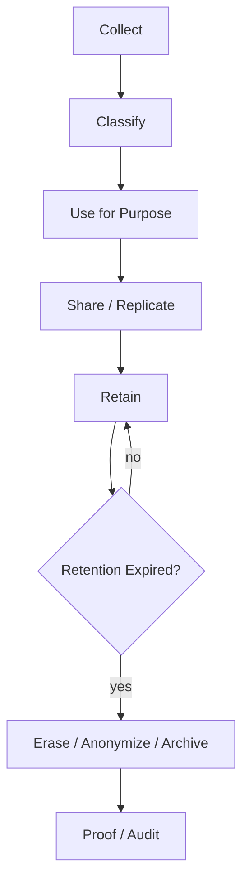
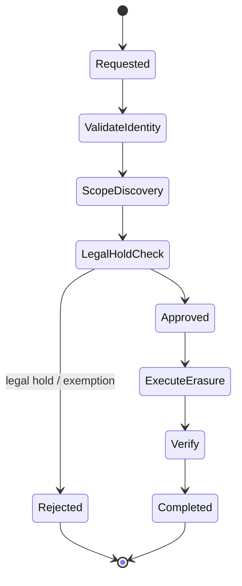
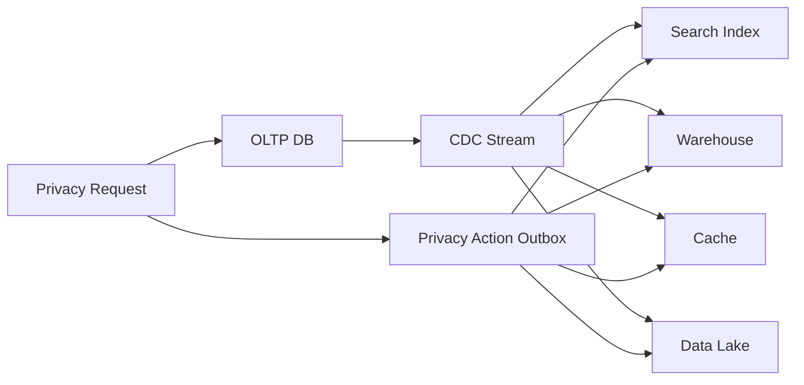
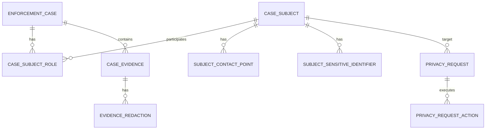

# Part 062 — Privacy, Retention, and Compliance Design

> Target bagian ini: kamu bisa mendesain database yang tidak hanya “aman”, tetapi juga **minimizing, purpose-aware, retention-aware, erasable where required, auditable, and legally defensible**. Fokusnya adalah architecture dan implementation pattern, bukan nasihat legal.

Privacy bukan fitur tambahan. Privacy adalah constraint desain data.

Begitu database menyimpan personal data, desain schema, index, backup, archive, CDC, warehouse, search, audit log, dan support tools semuanya berubah. Personal data yang tersebar tanpa peta akan membuat erasure, retention, masking, dan breach response menjadi mahal dan tidak pasti.

Database architect perlu menjawab pertanyaan yang lebih keras dari “apakah kolom ini encrypted?”:

1. Kenapa data ini dikumpulkan?
2. Siapa boleh menggunakannya?
3. Sampai kapan boleh disimpan?
4. Di mana saja data ini disalin?
5. Bagaimana membuktikan data sudah dihapus/masked/retained sesuai rule?
6. Apa yang terjadi jika data muncul di backup, audit log, CDC, search index, warehouse, dan export file?

---

## 1. Mental model: privacy is lifecycle control

Privacy design bukan hanya access control. Privacy adalah lifecycle control atas personal data.



Tiap tahap harus punya rule.

| Stage | Database design question |
|---|---|
| Collect | Apakah field ini benar-benar perlu? Apa lawful/business purpose-nya? |
| Classify | Apakah field PII, sensitive PII, secret, regulated, public, internal? |
| Use | Query/service apa yang boleh memakai field ini? |
| Share | Apakah field keluar lewat CDC, API, warehouse, search, export? |
| Retain | Sampai kapan data boleh identifiable? |
| Erase | Apakah harus hard delete, pseudonymize, anonymize, atau retain under legal hold? |
| Prove | Bagaimana membuktikan compliance action terjadi? |

Architectural rule:

> Data that is easy to collect but hard to delete is architectural debt.

---

## 2. Privacy classification taxonomy

Mulai dari data classification. Tanpa classification, retention/masking/security tidak punya basis.

Contoh taxonomy:

| Classification | Example | Typical handling |
|---|---|---|
| Public | published organization name | Normal access controls |
| Internal | internal case category | Internal-only access |
| Confidential | case decision notes | Strong access, audit |
| PII | name, email, phone, address | Purpose, minimization, masking |
| Sensitive PII | national ID, biometrics, health, financial identifiers | Strong encryption/masking, limited access |
| Secret | API key, credential, token | Do not store in normal DB if avoidable; use secret manager |
| Legal/evidence | enforcement evidence, decision proof | Retention/legal hold/audit chain |

Implement as metadata catalog:

```sql
CREATE TABLE data_classification_catalog (
  catalog_id bigserial PRIMARY KEY,
  schema_name text NOT NULL,
  table_name text NOT NULL,
  column_name text NOT NULL,
  classification text NOT NULL CHECK (
    classification IN ('public', 'internal', 'confidential', 'pii', 'sensitive_pii', 'secret', 'legal_evidence')
  ),
  purpose_code text NOT NULL,
  retention_policy_code text NOT NULL,
  masking_policy_code text,
  owner_team text NOT NULL,
  reviewed_at timestamptz NOT NULL DEFAULT now(),
  UNIQUE (schema_name, table_name, column_name)
);
```

This catalog is not only documentation. It should drive review, linting, export controls, and compliance checks.

---

## 3. Data minimization as schema design

Data minimization means: collect and store only what is necessary for a defined purpose.

Bad schema:

```sql
CREATE TABLE case_subject (
  subject_id uuid PRIMARY KEY,
  full_name text,
  date_of_birth date,
  national_id text,
  passport_number text,
  phone text,
  email text,
  home_address text,
  employer text,
  bank_account text,
  notes text
);
```

This table collects everything because it might be useful someday.

Better schema separates purpose and sensitivity:

```sql
CREATE TABLE case_subject (
  subject_id uuid PRIMARY KEY,
  tenant_id uuid NOT NULL,
  display_name text NOT NULL,
  subject_type text NOT NULL,
  created_at timestamptz NOT NULL DEFAULT now()
);

CREATE TABLE subject_contact_point (
  contact_point_id uuid PRIMARY KEY,
  subject_id uuid NOT NULL REFERENCES case_subject(subject_id),
  contact_type text NOT NULL CHECK (contact_type IN ('email', 'phone', 'postal_address')),
  contact_value_encrypted bytea NOT NULL,
  purpose_code text NOT NULL,
  verified_at timestamptz,
  expires_at timestamptz,
  created_at timestamptz NOT NULL DEFAULT now()
);

CREATE TABLE subject_sensitive_identifier (
  identifier_id uuid PRIMARY KEY,
  subject_id uuid NOT NULL REFERENCES case_subject(subject_id),
  identifier_type text NOT NULL,
  identifier_hash bytea NOT NULL,
  identifier_encrypted bytea,
  purpose_code text NOT NULL,
  retention_policy_code text NOT NULL,
  created_at timestamptz NOT NULL DEFAULT now()
);
```

Advantages:

1. Sensitive data is isolated.
2. Access control can be stricter at table/view level.
3. Retention can differ per purpose.
4. Hash can support matching without exposing plaintext.
5. Search/index can avoid raw sensitive data.

---

## 4. Purpose limitation as data model

“Purpose” should not live only in a policy document. It should be represented in schema and processing metadata.

```sql
CREATE TABLE processing_purpose (
  purpose_code text PRIMARY KEY,
  description text NOT NULL,
  lawful_basis text,
  owner_team text NOT NULL,
  default_retention_policy_code text NOT NULL,
  status text NOT NULL CHECK (status IN ('active', 'retired')),
  created_at timestamptz NOT NULL DEFAULT now()
);

CREATE TABLE personal_data_processing_record (
  processing_id uuid PRIMARY KEY,
  subject_id uuid NOT NULL,
  purpose_code text NOT NULL REFERENCES processing_purpose(purpose_code),
  source_system text NOT NULL,
  collected_at timestamptz NOT NULL,
  valid_until timestamptz,
  consent_reference_id uuid,
  metadata jsonb NOT NULL DEFAULT '{}'::jsonb
);
```

This allows questions like:

```sql
SELECT purpose_code, count(*)
FROM personal_data_processing_record
GROUP BY purpose_code;
```

And operational checks:

```sql
SELECT *
FROM personal_data_processing_record p
WHERE p.valid_until < now()
  AND NOT EXISTS (
    SELECT 1
    FROM legal_hold h
    WHERE h.subject_id = p.subject_id
      AND h.status = 'active'
  );
```

---

## 5. Retention policy as executable rule

Retention policy should be a database-visible artifact.

```sql
CREATE TABLE retention_policy (
  retention_policy_code text PRIMARY KEY,
  description text NOT NULL,
  retention_period interval NOT NULL,
  action text NOT NULL CHECK (action IN ('delete', 'anonymize', 'pseudonymize', 'archive', 'review')),
  legal_basis text,
  owner_team text NOT NULL,
  status text NOT NULL CHECK (status IN ('active', 'retired'))
);
```

Attach policy to data:

```sql
ALTER TABLE subject_contact_point
ADD COLUMN retention_policy_code text NOT NULL REFERENCES retention_policy(retention_policy_code),
ADD COLUMN retain_until timestamptz;
```

Calculate retention deadline:

```sql
UPDATE subject_contact_point cp
SET retain_until = cp.created_at + rp.retention_period
FROM retention_policy rp
WHERE rp.retention_policy_code = cp.retention_policy_code
  AND cp.retain_until IS NULL;
```

Do not depend only on application code to remember retention. Retention must be queryable.

---

## 6. Legal hold overrides retention

In regulatory/enforcement systems, data may need deletion after retention expiry, but legal hold may require preserving it.

Schema:

```sql
CREATE TABLE legal_hold (
  legal_hold_id uuid PRIMARY KEY,
  hold_scope text NOT NULL CHECK (hold_scope IN ('subject', 'case', 'tenant', 'dataset')),
  subject_id uuid,
  case_id uuid,
  tenant_id uuid,
  dataset_code text,
  reason text NOT NULL,
  status text NOT NULL CHECK (status IN ('active', 'released')),
  created_by uuid NOT NULL,
  created_at timestamptz NOT NULL DEFAULT now(),
  released_by uuid,
  released_at timestamptz
);
```

Retention candidate query:

```sql
SELECT cp.*
FROM subject_contact_point cp
WHERE cp.retain_until < now()
  AND NOT EXISTS (
    SELECT 1
    FROM legal_hold h
    WHERE h.status = 'active'
      AND (
        (h.hold_scope = 'subject' AND h.subject_id = cp.subject_id)
        OR (h.hold_scope = 'tenant' AND h.tenant_id = cp.tenant_id)
      )
  );
```

Architectural rule:

> Retention expiry creates eligibility for disposal. It does not automatically mean disposal is legally safe.

---

## 7. Erasure, anonymization, pseudonymization, deletion

Do not use “delete” as a vague word. Choose the right action.

| Action | Meaning | Reversible? | Typical use |
|---|---|---:|---|
| Hard delete | Remove row/data physically/logically from active store | No | Unneeded non-evidence data |
| Soft delete | Mark as deleted but keep data | Yes | Operational undo, not privacy erasure by itself |
| Pseudonymization | Replace identifier with reversible or linkable surrogate | Sometimes | Reduce exposure while preserving joinability |
| Anonymization | Remove identifiability such that subject cannot reasonably be identified | No/Hard | Analytics retention after identity no longer needed |
| Redaction | Remove/mask sensitive field in document/log | No/Partial | Evidence copy with sensitive fields removed |
| Crypto-shredding | Destroy encryption key so ciphertext is unusable | No if keys truly gone | Large encrypted payloads/backups where physical delete is hard |

### Example erasure request workflow



Schema:

```sql
CREATE TABLE privacy_request (
  request_id uuid PRIMARY KEY,
  request_type text NOT NULL CHECK (request_type IN ('access', 'rectification', 'erasure', 'restriction', 'export')),
  subject_id uuid NOT NULL,
  status text NOT NULL CHECK (
    status IN ('requested', 'validating', 'approved', 'rejected', 'executing', 'completed', 'failed')
  ),
  reason text,
  requested_at timestamptz NOT NULL DEFAULT now(),
  completed_at timestamptz
);

CREATE TABLE privacy_request_action (
  action_id uuid PRIMARY KEY,
  request_id uuid NOT NULL REFERENCES privacy_request(request_id),
  target_system text NOT NULL,
  target_table text NOT NULL,
  target_key text NOT NULL,
  action text NOT NULL,
  status text NOT NULL CHECK (status IN ('pending', 'done', 'failed', 'skipped')),
  result_summary text,
  executed_at timestamptz
);
```

This turns privacy operations into auditable workflow, not ad-hoc scripts.

---

## 8. Subject identity and data discovery

You cannot erase or export data you cannot find.

Build subject identity mapping:

```sql
CREATE TABLE subject_identity_link (
  subject_id uuid NOT NULL,
  identifier_type text NOT NULL,
  identifier_hash bytea NOT NULL,
  source_system text NOT NULL,
  confidence text NOT NULL CHECK (confidence IN ('exact', 'strong', 'weak')),
  created_at timestamptz NOT NULL DEFAULT now(),
  PRIMARY KEY (subject_id, identifier_type, identifier_hash, source_system)
);

CREATE INDEX idx_subject_identity_link_identifier
ON subject_identity_link (identifier_type, identifier_hash);
```

Use hashes for lookup where possible:

```text
normalized_email = lower(trim(email))
identifier_hash = HMAC-SHA256(secret_pepper, normalized_email)
```

Why HMAC instead of plain hash?

- Plain hashes of emails/phone numbers are vulnerable to dictionary attacks.
- HMAC with secret pepper reduces offline enumeration risk.
- Keep pepper in secret manager, not normal database table.

---

## 9. PII in indexes

Indexes can leak or preserve personal data even after table update/delete semantics are misunderstood.

Avoid indexing raw sensitive values:

```sql
-- Risky: raw national_id in index structure
CREATE INDEX idx_subject_national_id
ON subject_sensitive_identifier (national_id);
```

Prefer hash lookup:

```sql
CREATE UNIQUE INDEX uq_subject_identifier_hash
ON subject_sensitive_identifier (identifier_type, identifier_hash);
```

Store encrypted value only when necessary:

```sql
CREATE TABLE subject_sensitive_identifier (
  identifier_id uuid PRIMARY KEY,
  subject_id uuid NOT NULL,
  identifier_type text NOT NULL,
  identifier_hash bytea NOT NULL,
  identifier_encrypted bytea,
  purpose_code text NOT NULL,
  retention_policy_code text NOT NULL,
  created_at timestamptz NOT NULL DEFAULT now()
);
```

Design choice:

| Need | Suggested design |
|---|---|
| Equality lookup | HMAC hash index |
| Display original value | Encrypted column + strict access |
| Prefix search | Avoid if sensitive; consider dedicated secure search pattern |
| Analytics grouping | Use non-identifying bucket/category |
| Exact duplicate detection | HMAC hash |

---

## 10. Masking and views

Masking should be explicit. Do not let every consumer read raw PII and “promise not to show it.”

```sql
CREATE VIEW case_subject_masked_view AS
SELECT
  s.subject_id,
  s.tenant_id,
  s.display_name,
  left(s.display_name, 1) || '***' AS masked_name,
  s.subject_type,
  s.created_at
FROM case_subject s;
```

For emails:

```sql
CREATE FUNCTION mask_email(p_email text)
RETURNS text
LANGUAGE sql
IMMUTABLE
AS $$
  SELECT regexp_replace(p_email, '(^.).*(@.*$)', '\1***\2')
$$;
```

Then:

```sql
CREATE VIEW subject_contact_masked_view AS
SELECT
  contact_point_id,
  subject_id,
  contact_type,
  CASE
    WHEN contact_type = 'email' THEN mask_email(decrypt_contact(contact_value_encrypted))
    ELSE '***'
  END AS masked_contact_value,
  purpose_code,
  created_at
FROM subject_contact_point;
```

Guardrails:

1. Raw PII tables should have restricted grants.
2. Most roles should use masked views.
3. Export jobs should default to masked/projection views.
4. Access to unmasked PII should require purpose and audit.
5. Masking is not anonymization.

---

## 11. Audit logs can become privacy liabilities

Audit logs often capture payloads, before/after values, request bodies, headers, and user identifiers. That can accidentally duplicate PII into a long-retention store.

Bad audit event:

```json
{
  "event": "subject.updated",
  "before": {
    "name": "Alice Example",
    "email": "alice@example.com",
    "national_id": "123456789"
  },
  "after": {
    "name": "Alice Example",
    "email": "alice.new@example.com",
    "national_id": "123456789"
  }
}
```

Better audit event:

```json
{
  "event": "subject.updated",
  "subject_id": "...",
  "changed_fields": ["email"],
  "actor_user_id": "...",
  "purpose": "case_contact_update",
  "pii_payload_stored": false
}
```

If before/after is legally required, isolate it:

```sql
CREATE TABLE sensitive_audit_payload (
  audit_payload_id uuid PRIMARY KEY,
  audit_event_id uuid NOT NULL,
  payload_encrypted bytea NOT NULL,
  retention_policy_code text NOT NULL,
  retain_until timestamptz NOT NULL,
  access_reason_required boolean NOT NULL DEFAULT true
);
```

Architectural rule:

> Auditability does not justify unlimited raw PII replication.

---

## 12. Backups and erasure reality

Backups complicate erasure. A hard-deleted row may still exist in old backups until those backups expire.

Design considerations:

| Storage | Erasure implication |
|---|---|
| Primary OLTP | Can update/delete/anonymize actively |
| Read replica | Follows primary changes eventually |
| CDC broker | Events may retain old PII |
| Search index | Must delete/reindex documents |
| Warehouse | Must propagate erasure/anonymization |
| Object storage export | Must locate and delete/redact files |
| Backups | Usually expire by retention; direct row delete inside immutable backup may not be feasible |
| Logs | Must avoid storing raw PII or have log retention controls |

Practical pattern:

1. Do not put unnecessary PII in backups/logs/export.
2. Use short backup retention where compatible with recovery needs.
3. Document backup erasure limitation transparently.
4. Ensure restored backup replays erasure ledger before use.
5. Maintain `erasure_ledger` as durable proof and replay source.

```sql
CREATE TABLE erasure_ledger (
  erasure_id uuid PRIMARY KEY,
  subject_id uuid NOT NULL,
  request_id uuid NOT NULL,
  erasure_scope text NOT NULL,
  executed_at timestamptz NOT NULL DEFAULT now(),
  proof_hash bytea NOT NULL,
  notes text
);
```

When restoring from backup:

```text
restore backup
apply migrations
replay erasure ledger after backup timestamp
validate erased subjects absent/masked
open system for traffic
```

---

## 13. CDC, search, and warehouse propagation

Privacy action must propagate.



Create explicit privacy action events:

```sql
CREATE TABLE privacy_action_outbox (
  outbox_id uuid PRIMARY KEY,
  subject_id uuid NOT NULL,
  action text NOT NULL CHECK (action IN ('erase', 'anonymize', 'restrict', 'unrestrict')),
  scope jsonb NOT NULL,
  created_at timestamptz NOT NULL DEFAULT now(),
  published_at timestamptz
);
```

Consumers must be idempotent:

```sql
CREATE TABLE privacy_action_inbox (
  consumer_name text NOT NULL,
  outbox_id uuid NOT NULL,
  processed_at timestamptz NOT NULL DEFAULT now(),
  PRIMARY KEY (consumer_name, outbox_id)
);
```

Do not assume deleting from OLTP is enough. Every derived store has its own erasure behavior.

---

## 14. Privacy-safe analytics

Analytics often wants historical data. Privacy often wants minimization and retention. Resolve this by changing the analytical grain and identifiability.

Options:

| Pattern | Description |
|---|---|
| Aggregate early | Store counts/metrics instead of row-level PII |
| Tokenize subject | Use non-reversible token where individual identity is not needed |
| Pseudonymized fact | Keep stable subject surrogate but remove direct identifiers |
| Differential access | Raw layer restricted; curated aggregate layer broad |
| Retention by layer | Bronze/raw short retention, silver/gold longer if anonymized |

Example analytical projection:

```sql
CREATE TABLE case_daily_metrics (
  metric_date date NOT NULL,
  tenant_id uuid NOT NULL,
  case_type text NOT NULL,
  region_code text NOT NULL,
  opened_count bigint NOT NULL,
  closed_count bigint NOT NULL,
  avg_resolution_hours numeric,
  PRIMARY KEY (metric_date, tenant_id, case_type, region_code)
);
```

This answers many business questions without exposing subject PII.

---

## 15. Data retention job design

Retention jobs are production workflows. They need batching, audit, retry, and safety gates.

```sql
CREATE TABLE retention_job_run (
  job_run_id uuid PRIMARY KEY,
  policy_code text NOT NULL,
  status text NOT NULL CHECK (status IN ('planned', 'running', 'completed', 'failed', 'cancelled')),
  dry_run boolean NOT NULL DEFAULT true,
  candidate_count bigint,
  affected_count bigint,
  started_at timestamptz,
  completed_at timestamptz,
  error_message text
);

CREATE TABLE retention_job_item (
  job_run_id uuid NOT NULL REFERENCES retention_job_run(job_run_id),
  target_table text NOT NULL,
  target_pk text NOT NULL,
  action text NOT NULL,
  status text NOT NULL CHECK (status IN ('candidate', 'done', 'skipped', 'failed')),
  reason text,
  PRIMARY KEY (job_run_id, target_table, target_pk)
);
```

Runbook:

1. Dry-run candidate selection.
2. Review sample records.
3. Check legal hold exclusions.
4. Execute in small batches.
5. Emit privacy action events.
6. Verify affected row counts.
7. Reconcile derived systems.
8. Record evidence.

Batch delete pattern:

```sql
WITH candidate AS (
  SELECT contact_point_id
  FROM subject_contact_point
  WHERE retain_until < now()
  ORDER BY retain_until
  LIMIT 1000
)
DELETE FROM subject_contact_point cp
USING candidate c
WHERE cp.contact_point_id = c.contact_point_id
RETURNING cp.contact_point_id;
```

Never start with unbounded delete on large tables.

---

## 16. Compliance evidence tables

Compliance work needs proof. Do not rely on screenshots and tribal memory.

```sql
CREATE TABLE compliance_control_evidence (
  evidence_id uuid PRIMARY KEY,
  control_code text NOT NULL,
  evidence_type text NOT NULL CHECK (evidence_type IN ('query_result', 'job_run', 'review', 'approval', 'test_result')),
  scope text NOT NULL,
  evidence_hash bytea,
  summary text NOT NULL,
  produced_by text NOT NULL,
  produced_at timestamptz NOT NULL DEFAULT now()
);
```

Examples:

| Control | Evidence |
|---|---|
| PII inventory maintained | catalog diff report |
| Retention enforced | monthly retention job run record |
| Legal hold respected | retention exclusion query result |
| Erasure propagated | privacy action consumer acknowledgements |
| Masked export | export job config + sample validation |
| Access to PII audited | data access event report |

Evidence itself can contain sensitive data. Store summaries/hashes where possible.

---

## 17. Privacy architecture decision matrix

When a field is proposed, ask:

| Question | Decision implication |
|---|---|
| Is this personal data? | classify and protect |
| Is it sensitive? | isolate/encrypt/restrict |
| Is it needed for core operation? | maybe collect |
| Is it needed only for analytics? | prefer aggregate/pseudonymized projection |
| Is equality lookup needed? | HMAC hash |
| Is display needed? | encrypted raw value with strict access |
| Is prefix/full-text search needed? | challenge requirement; consider secure search pattern |
| How long is it needed? | retention policy |
| Where will it flow? | CDC/export/warehouse/search mapping |
| How will it be erased? | erasure plan and ledger |
| Can it appear in logs/audit? | redaction/masking rules |

---

## 18. Common privacy design smells

| Smell | Why it is dangerous | Better design |
|---|---|---|
| “Just add JSON metadata” | PII hides in unclassified blob | classify fields or controlled schema |
| Raw PII in audit logs | Long-lived duplicate sensitive data | changed fields + encrypted sensitive payload only if needed |
| Raw PII in search index | Hard to erase and overexposed | minimal search document, masked fields, delete propagation |
| Retention policy in wiki only | Not executable | retention policy table + job |
| Erasure script per incident | Non-repeatable, no proof | privacy request workflow + action ledger |
| Soft delete called erasure | Data still exists | anonymize/hard delete/crypto-shred where required |
| Warehouse has unrestricted raw data | OLTP controls bypassed | warehouse access policy/masking/curated layer |
| Backup restore ignores erasure | Deleted data reappears | replay erasure ledger after restore |
| Plain hash identifiers | Dictionary attack risk | HMAC with secret pepper |
| Purpose not recorded | Cannot prove why data exists | processing purpose records |

---

## 19. Case-management example: privacy-aware case subject design

A regulatory case platform may need subject identity, evidence, correspondence, audit, and decision records. Not all of that has the same privacy behavior.



Key rules:

1. `case_subject.display_name` may be visible to case workers.
2. Contact points require stricter purpose-bound access.
3. Sensitive identifiers should be hash-indexed and encrypted if display is needed.
4. Evidence may be under legal hold and not erasable in the same way as contact preference data.
5. Redaction may be required for exports even if raw evidence is retained internally.
6. Privacy request workflow must check legal/evidence retention before erasure.

---

## 20. Production checklist

### Inventory

- [ ] Are PII/sensitive columns cataloged?
- [ ] Are JSON/blob fields reviewed for hidden PII?
- [ ] Are indexes containing PII identified?
- [ ] Are logs/audit/CDC/export/search/warehouse included in inventory?

### Purpose and minimization

- [ ] Does every PII field have purpose code?
- [ ] Is the field necessary for that purpose?
- [ ] Is raw value needed or would hash/token/category be enough?
- [ ] Is collection separated from optional enrichment?

### Access and masking

- [ ] Are raw PII tables restricted?
- [ ] Are masked views/projections available for normal use?
- [ ] Is unmasked access audited with purpose?
- [ ] Are support/break-glass accesses time-bounded and reviewed?

### Retention

- [ ] Is retention policy executable, not only documented?
- [ ] Are `retain_until` or equivalent fields populated?
- [ ] Are legal holds modeled?
- [ ] Are retention jobs batched, auditable, and tested?

### Erasure and propagation

- [ ] Is there a privacy request workflow?
- [ ] Is subject data discoverable across systems?
- [ ] Are derived stores notified via outbox/event?
- [ ] Is erasure ledger replayed after restore?
- [ ] Are backups/log retention limitations documented?

### Evidence

- [ ] Are compliance actions recorded?
- [ ] Are evidence records themselves privacy-safe?
- [ ] Can auditors see what rule ran, when, by whom, and with what result?

---

## 21. Final heuristic

A database is privacy-ready when this query has a credible answer:

```text
For subject X, show:
- what personal data we hold,
- why we hold it,
- where it exists,
- who can access it,
- when it expires,
- whether legal hold applies,
- how it will be erased/anonymized,
- and proof of past privacy actions.
```

If the answer requires searching code, logs, dashboards, warehouses, S3 buckets, Slack messages, and old migration scripts manually, the system is not privacy-designed. It is merely privacy-documented.

Top-tier database architecture treats privacy as a **data lifecycle invariant**:

- minimize collection,
- classify deliberately,
- bind data to purpose,
- restrict raw access,
- propagate controls downstream,
- retain only as long as justified,
- erase/anonymize with proof,
- and design restore paths that do not resurrect deleted personal data.

---

## References

- NIST Privacy Framework: https://www.nist.gov/privacy-framework
- NIST SP 800-63A Privacy Considerations and Data Minimization: https://pages.nist.gov/800-63-4/sp800-63a/privacy/
- GDPR Article 5 — Principles relating to processing of personal data: https://gdpr-info.eu/art-5-gdpr/
- GDPR Article 17 — Right to erasure: https://gdpr-info.eu/art-17-gdpr/
- PostgreSQL Documentation — Row Security Policies: https://www.postgresql.org/docs/current/ddl-rowsecurity.html
