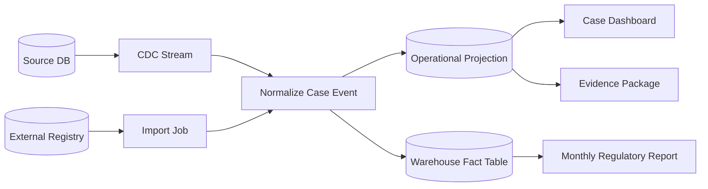
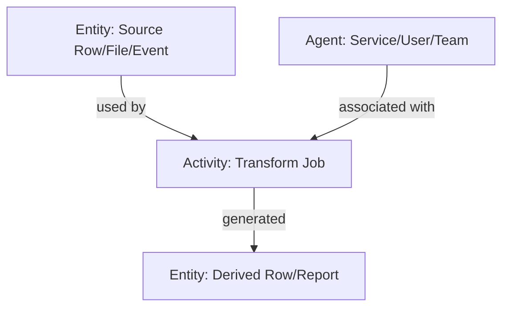
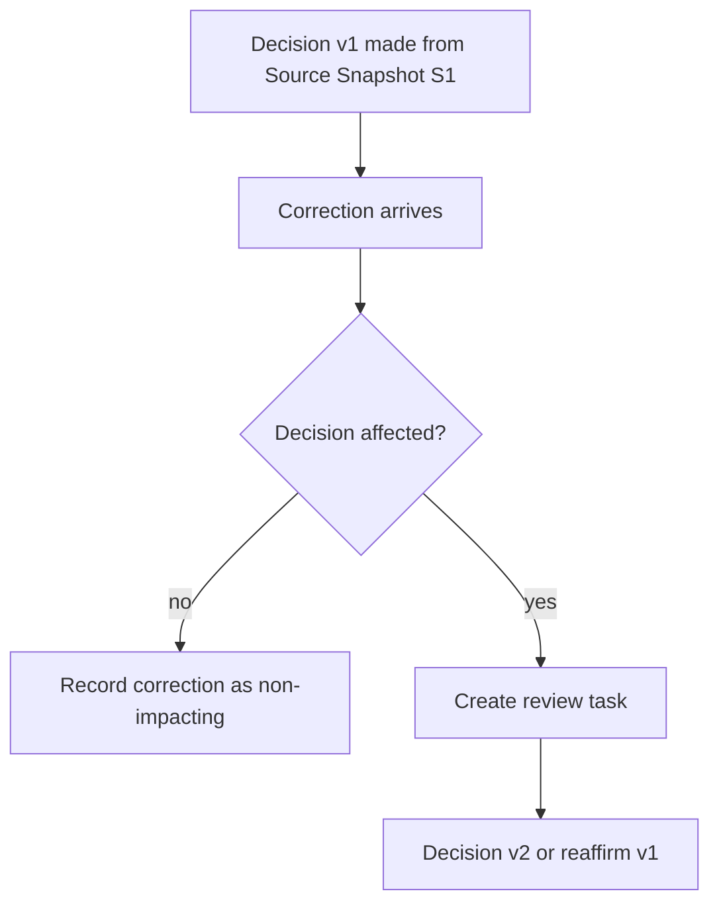
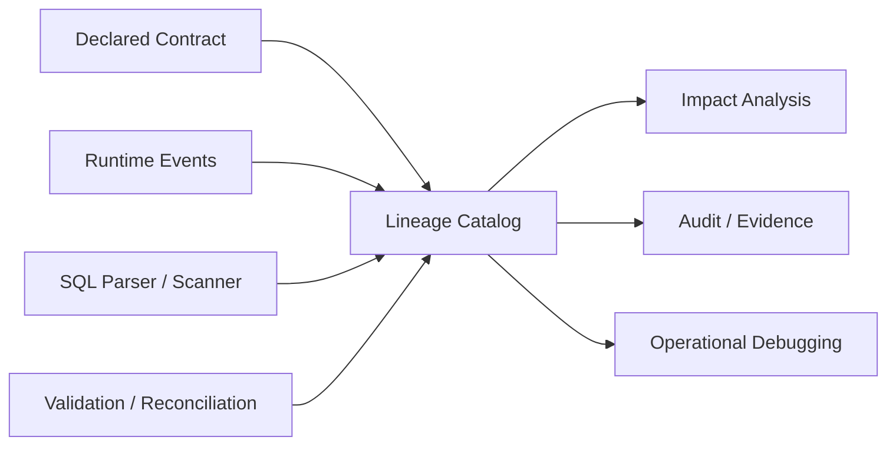
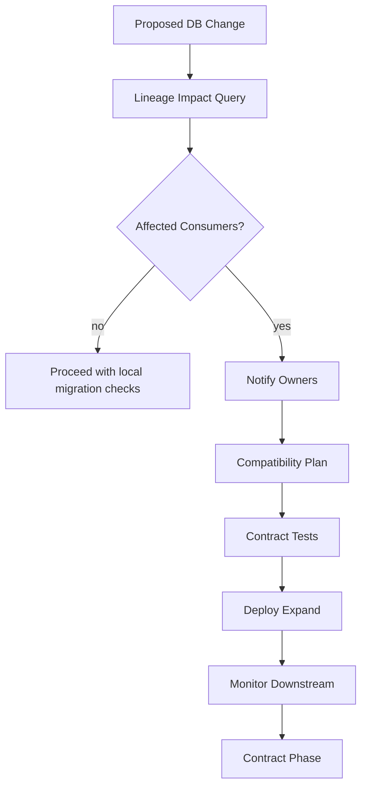
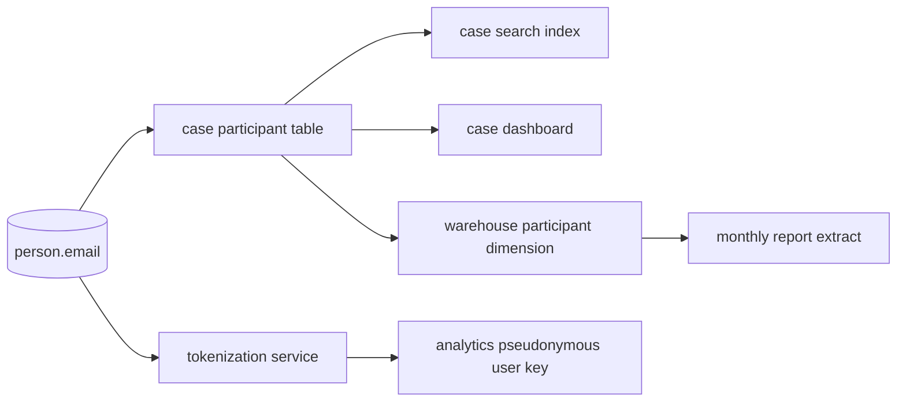
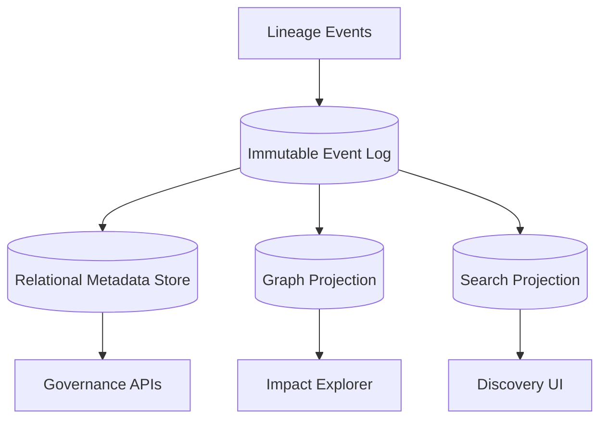

# Part 063 — Data Lineage and Provenance

> Target bagian ini: kamu bisa mendesain database dan platform data yang mampu menjawab **data ini berasal dari mana, diproses oleh apa, berubah karena apa, dipakai oleh siapa, dan apa dampaknya jika berubah atau salah**. Fokusnya adalah database architecture, metadata model, impact analysis, evidence-grade traceability, dan operasionalisasi lineage di production.

Lineage bukan diagram cantik di katalog data.

Lineage adalah kemampuan sistem untuk menjelaskan perjalanan data dari sumber sampai penggunaan akhir. Provenance adalah versi yang lebih evidence-oriented: bukan hanya “A mengalir ke B”, tetapi **siapa/apa yang menghasilkan data, aktivitas apa yang mengubahnya, input apa yang dipakai, kapan terjadi, versi rule apa yang berlaku, dan bukti apa yang mendukung output**.

Di sistem regulatory, enforcement, finance, healthcare, atau case management, lineage menjawab pertanyaan defensible:

1. Keputusan ini dibuat memakai data apa?
2. Data itu berasal dari sistem mana?
3. Transformasi apa yang diterapkan?
4. Versi aturan/model apa yang dipakai?
5. Apakah data sudah dikoreksi setelah keputusan dibuat?
6. Report mana yang terdampak jika kolom atau rule berubah?
7. Bagaimana membuktikan bahwa export, dashboard, dan evidence package konsisten dengan source-of-truth saat itu?

Architectural rule:

> If data can influence a decision, the path from source to decision must be explainable.

---

## 1. Mental model: lineage is a dependency graph plus evidence

Lineage paling sederhana adalah dependency graph.



Tetapi production-grade lineage tidak cukup hanya graph. Ia harus punya metadata yang menjawab:

| Question | Required metadata |
|---|---|
| Data berasal dari mana? | source system, source entity, source key, extraction timestamp |
| Diproses oleh apa? | job name, job version, code version, rule version, config version |
| Input apa yang dipakai? | input dataset version, upstream watermark, file checksum, query snapshot |
| Output apa yang dibuat? | output dataset, row/entity key, output version, commit/batch id |
| Siapa/apa responsible? | service account, actor, workflow, owner team |
| Kapan terjadi? | event time, processing time, effective time, transaction time |
| Bagaimana diverifikasi? | row count, checksum, reconciliation result, validation status |
| Siapa mengonsumsi? | dashboard, API, report, export, model, downstream job |

W3C PROV memberi model dasar yang berguna: provenance menjelaskan penggunaan dan produksi **entities** oleh **activities**, yang dapat dipengaruhi oleh **agents**. Model ini cocok sebagai mental model, meskipun implementasi database tidak harus memakai RDF/ontology.



Terjemahan database-oriented:

| PROV concept | Database/platform example |
|---|---|
| Entity | table, row, file, event, report, model output |
| Activity | ETL job, migration, backfill, API command, rule engine run |
| Agent | service account, user, team, scheduler, external system |

---

## 2. Lineage vs provenance vs audit log

Tiga istilah ini sering dicampur. Untuk architect, bedakan dengan tajam.

| Concept | Main question | Typical granularity | Example |
|---|---|---|---|
| Audit log | Who did what? | action/event | User approved case at 10:04 |
| Lineage | What depends on what? | dataset/table/column/job/row | Report uses warehouse fact derived from case_event |
| Provenance | How was this output produced? | entity/activity/agent/evidence | This risk score was generated by model v3 using input snapshot X |

Audit log membantu accountability. Lineage membantu dependency/impact analysis. Provenance membantu explainability dan defensibility.

Contoh:

```text
A case decision was approved.
```

Audit log menjawab:

```text
Actor: reviewer_123
Action: APPROVE_DECISION
Time: 2026-07-05T09:21:33Z
```

Lineage menjawab:

```text
Decision record depends on:
- case profile projection v12
- sanctions screening result v5
- evidence document metadata v8
- policy rule table version 2026.06
```

Provenance menjawab:

```text
The risk classification was generated by rule_engine@sha256:...
using source events up to LSN 42/BF9E2A10,
policy bundle 2026.06.14,
and external registry snapshot 2026-07-01.
Validation passed: checksum=..., input_count=..., exception_count=0.
```

Rule:

> Audit says what happened. Lineage says what depends on what. Provenance says how an output came into existence.

---

## 3. Lineage levels

Lineage punya beberapa level. Jangan langsung mengejar row-level lineage jika table/column-level belum rapi.

| Level | Meaning | Use case | Cost |
|---|---|---|---|
| System-level | system A feeds system B | architecture overview | low |
| Dataset/table-level | table/file/topic A feeds table/report B | impact analysis | medium |
| Column-level | target column derived from source columns | schema change safety | medium-high |
| Row/entity-level | output row/entity derived from input rows/events | regulatory evidence, debugging | high |
| Cell/value-level | target value derived from exact source values | high assurance, scientific/research systems | very high |

Recommendation:

1. Start with system/dataset lineage.
2. Add column lineage for shared contracts, reports, and derived fields.
3. Add row/entity lineage only where decisions, money, rights, compliance, or evidence are affected.
4. Use value-level lineage only when cost is justified.

Failure mode:

> Teams attempt universal row-level lineage and end up with expensive metadata nobody trusts.

Better:

> Capture coarse lineage everywhere; capture fine-grained provenance at decision-critical boundaries.

---

## 4. Data product lineage contract

Setiap data product yang production-grade harus punya lineage contract.

```yaml
name: regulatory_case_summary
owner: enforcement-data-platform
classification: internal-restricted
source_of_truth: false
canonical_source:
  - operational.case
  - operational.case_status_transition
  - operational.evidence_document
freshness_sla: P15M
rebuildable: true
retention_policy: CASE_RETENTION_7Y
lineage_level:
  dataset: required
  column: required
  row: required_for_decision_fields
quality_gates:
  - row_count_reconciliation
  - orphan_case_check
  - status_transition_validity
consumers:
  - case_dashboard
  - monthly_enforcement_report
  - evidence_export_service
```

Lineage contract menjelaskan:

| Field | Why it matters |
|---|---|
| owner | Siapa yang memperbaiki jika lineage rusak |
| canonical source | Menghindari circular truth |
| freshness SLA | Menjelaskan staleness downstream |
| rebuildable | Menentukan recovery strategy |
| lineage level | Mengontrol biaya metadata |
| quality gates | Membuktikan transformasi valid |
| consumers | Impact analysis saat perubahan |

---

## 5. Metadata model: minimum viable lineage schema

Untuk internal platform, mulai dari schema metadata yang sederhana tapi kuat.

```sql
CREATE TABLE data_asset (
  asset_id            uuid PRIMARY KEY,
  asset_type          text NOT NULL CHECK (asset_type IN (
    'database', 'schema', 'table', 'column', 'topic', 'file', 'report', 'api', 'model', 'dashboard'
  )),
  asset_urn           text NOT NULL UNIQUE,
  display_name        text NOT NULL,
  owner_team          text NOT NULL,
  classification      text NOT NULL,
  system_name         text NOT NULL,
  created_at          timestamptz NOT NULL DEFAULT now(),
  retired_at          timestamptz
);

CREATE TABLE data_job (
  job_id              uuid PRIMARY KEY,
  job_urn             text NOT NULL UNIQUE,
  job_type            text NOT NULL CHECK (job_type IN (
    'etl', 'cdc', 'api_command', 'migration', 'backfill', 'report_build', 'ml_inference'
  )),
  owner_team          text NOT NULL,
  code_repository     text,
  description         text,
  created_at          timestamptz NOT NULL DEFAULT now(),
  retired_at          timestamptz
);

CREATE TABLE data_lineage_edge (
  lineage_edge_id     uuid PRIMARY KEY,
  upstream_asset_id   uuid NOT NULL REFERENCES data_asset(asset_id),
  downstream_asset_id uuid NOT NULL REFERENCES data_asset(asset_id),
  job_id              uuid REFERENCES data_job(job_id),
  transformation_type text NOT NULL CHECK (transformation_type IN (
    'copy', 'filter', 'join', 'aggregate', 'derive', 'mask', 'tokenize', 'enrich', 'project', 'export'
  )),
  lineage_level       text NOT NULL CHECK (lineage_level IN ('system', 'dataset', 'column', 'row', 'value')),
  confidence          text NOT NULL CHECK (confidence IN ('declared', 'observed', 'verified')),
  valid_from          timestamptz NOT NULL DEFAULT now(),
  valid_to            timestamptz,
  metadata            jsonb NOT NULL DEFAULT '{}'::jsonb
);

CREATE INDEX idx_lineage_upstream ON data_lineage_edge(upstream_asset_id);
CREATE INDEX idx_lineage_downstream ON data_lineage_edge(downstream_asset_id);
CREATE INDEX idx_lineage_job ON data_lineage_edge(job_id);
```

Design notes:

| Column | Reason |
|---|---|
| `asset_urn` | Stable identity across tools |
| `confidence` | Distinguishes declared vs observed vs verified lineage |
| `valid_from/valid_to` | Lineage changes over time |
| `metadata jsonb` | Extensible without blocking core model |

Do not make lineage purely free-form JSON. You need typed edges for graph traversal and impact analysis.

---

## 6. Asset URN convention

Lineage graph dies when identity is inconsistent. Define URN convention early.

Examples:

```text
postgres://prod-core/enforcement/public.case
postgres://prod-core/enforcement/public.case.status
kafka://prod/enforcement.case-events.v1
s3://regulated-lake/bronze/case_events/dt=2026-07-05/
dashboard://superset/enforcement-case-overview
report://regulatory/monthly-enforcement-summary/v2
api://case-service/GET /cases/{caseId}
model://risk-classifier/v3
```

Rules:

1. URN must be globally unique.
2. URN must be stable enough for metadata history.
3. URN must not embed volatile deployment detail unless environment-specific lineage is intentional.
4. Table and column URNs must be separable.
5. External data sources must have explicit source identities.

Bad:

```text
case_table
summary_report
source_file
```

Good:

```text
postgres://prod-core/enforcement/public.case
report://regulator-x/monthly-enforcement-summary/v2
sftp://agency-y/imports/registry_snapshot_2026_07_01.csv
```

---

## 7. Dataset-level lineage

Dataset-level lineage answers: “If this table changes, what breaks?”

Example:

```sql
INSERT INTO data_lineage_edge (
  lineage_edge_id,
  upstream_asset_id,
  downstream_asset_id,
  job_id,
  transformation_type,
  lineage_level,
  confidence,
  metadata
)
VALUES (
  gen_random_uuid(),
  :case_table_asset_id,
  :case_summary_table_asset_id,
  :case_summary_job_id,
  'aggregate',
  'dataset',
  'verified',
  jsonb_build_object(
    'refresh_mode', 'incremental',
    'freshness_sla', 'P15M',
    'watermark_column', 'updated_at'
  )
);
```

Use dataset-level lineage for:

- migration impact analysis
- ownership review
- consumer notification
- stale data debugging
- data product inventory
- report dependency mapping

Common anti-pattern:

> “Only the pipeline team knows dependencies.”

That creates hidden coupling. Dependencies must be inspectable.

---

## 8. Column-level lineage

Column-level lineage answers: “Can we rename/drop/change semantics of this column?”

Schema:

```sql
CREATE TABLE column_lineage_edge (
  column_lineage_edge_id uuid PRIMARY KEY,
  source_column_asset_id uuid NOT NULL REFERENCES data_asset(asset_id),
  target_column_asset_id uuid NOT NULL REFERENCES data_asset(asset_id),
  job_id                 uuid REFERENCES data_job(job_id),
  expression             text,
  transformation_type    text NOT NULL,
  confidence             text NOT NULL CHECK (confidence IN ('declared', 'observed', 'verified')),
  valid_from             timestamptz NOT NULL DEFAULT now(),
  valid_to               timestamptz
);

CREATE INDEX idx_column_lineage_source ON column_lineage_edge(source_column_asset_id);
CREATE INDEX idx_column_lineage_target ON column_lineage_edge(target_column_asset_id);
```

Example mappings:

| Target column | Source columns | Transformation |
|---|---|---|
| `case_summary.current_status` | `case.status` | copy |
| `case_summary.age_days` | `case.created_at`, `now()` | derive |
| `monthly_report.total_closed_cases` | `case.closed_at`, `case.status` | aggregate/filter |
| `search_document.display_name` | `person.legal_name` | mask/project |

Column lineage should preserve **semantic meaning**, not only SQL text.

Example:

```yaml
target: warehouse.case_fact.days_to_close
sources:
  - operational.case.opened_at
  - operational.case.closed_at
expression: date_diff('day', opened_at, closed_at)
semantic_contract: calendar days from case opening to terminal closure
null_semantics: null when case is not terminal
version: 2
```

If the semantic contract changes, version the derived field.

---

## 9. Row/entity-level provenance

Row-level lineage is expensive but valuable for decisions.

Use it for:

- risk score explanation
- regulatory decision evidence
- financial ledger reconciliation
- case recommendation
- automated enforcement action
- AI/ML inference evidence
- customer-impacting eligibility decision

Minimal schema:

```sql
CREATE TABLE provenance_run (
  run_id             uuid PRIMARY KEY,
  job_id             uuid NOT NULL REFERENCES data_job(job_id),
  run_status         text NOT NULL CHECK (run_status IN ('running', 'succeeded', 'failed', 'cancelled')),
  started_at         timestamptz NOT NULL,
  completed_at       timestamptz,
  code_version       text NOT NULL,
  config_version     text,
  rule_version       text,
  input_watermark    text,
  output_watermark   text,
  actor_type         text NOT NULL CHECK (actor_type IN ('scheduler', 'service', 'user', 'external_system')),
  actor_id           text NOT NULL,
  metadata           jsonb NOT NULL DEFAULT '{}'::jsonb
);

CREATE TABLE entity_provenance (
  entity_provenance_id uuid PRIMARY KEY,
  run_id               uuid NOT NULL REFERENCES provenance_run(run_id),
  output_asset_id      uuid NOT NULL REFERENCES data_asset(asset_id),
  output_entity_key    text NOT NULL,
  input_asset_id       uuid NOT NULL REFERENCES data_asset(asset_id),
  input_entity_key     text NOT NULL,
  relationship_type    text NOT NULL CHECK (relationship_type IN (
    'copied_from', 'derived_from', 'aggregated_from', 'joined_with', 'validated_against', 'enriched_by'
  )),
  captured_at          timestamptz NOT NULL DEFAULT now(),
  metadata             jsonb NOT NULL DEFAULT '{}'::jsonb
);

CREATE INDEX idx_entity_prov_output ON entity_provenance(output_asset_id, output_entity_key);
CREATE INDEX idx_entity_prov_input ON entity_provenance(input_asset_id, input_entity_key);
CREATE INDEX idx_entity_prov_run ON entity_provenance(run_id);
```

Example:

```text
Output: risk_assessment(case_id=CASE-123, version=8)
Derived from:
- case(case_id=CASE-123, version=27)
- evidence_document(document_id=DOC-991, checksum=...)
- screening_result(screening_id=SCR-77, version=5)
- policy_bundle(policy_id=POLICY-2026-06, checksum=...)
Generated by:
- job: risk-classifier
- code: git sha abc123
- rule version: 2026.06.14
- run: 7df4...
```

Important: do not store sensitive source values unnecessarily in provenance. Store keys, checksums, versions, and references unless value-level proof is required.

---

## 10. Provenance for decision records

For decision-grade systems, attach provenance directly to decisions.

```sql
CREATE TABLE decision_record (
  decision_id          uuid PRIMARY KEY,
  case_id              uuid NOT NULL,
  decision_type        text NOT NULL,
  decision_status      text NOT NULL,
  decision_outcome     text NOT NULL,
  decided_by_actor_id  text NOT NULL,
  decided_at           timestamptz NOT NULL,
  rationale            text NOT NULL,
  evidence_package_id  uuid,
  provenance_run_id    uuid REFERENCES provenance_run(run_id),
  source_snapshot_ref  text NOT NULL,
  policy_version       text NOT NULL,
  created_at           timestamptz NOT NULL DEFAULT now()
);
```

Why embed provenance references?

Because decisions are not only current facts. They are outputs of a context at a time.

A later correction should not silently rewrite what the decision saw. Instead, model:



Pattern:

- Store current state separately.
- Store decision context snapshot/provenance immutably.
- If source data changes later, create an impact review rather than mutating old decision explanation.

---

## 11. Snapshot references and reproducibility

Lineage says what depends on what. Reproducibility says whether we can recompute the same output.

For reproducible report/decision/model output, capture:

| Metadata | Example |
|---|---|
| source snapshot | database transaction timestamp, LSN, backup snapshot id, file checksum |
| code version | git SHA, container digest |
| config version | feature flag snapshot, YAML checksum |
| rule/model version | policy bundle id, model registry version |
| environment | engine version, locale/timezone, dependency versions |
| input watermark | Kafka offset, CDC LSN, batch id |
| output checksum | row count, aggregate checksum, report hash |

Example report build table:

```sql
CREATE TABLE report_build (
  report_build_id      uuid PRIMARY KEY,
  report_name          text NOT NULL,
  report_version       text NOT NULL,
  period_start         date NOT NULL,
  period_end           date NOT NULL,
  built_at             timestamptz NOT NULL DEFAULT now(),
  built_by_job_id      uuid NOT NULL REFERENCES data_job(job_id),
  source_snapshot_ref  text NOT NULL,
  code_version         text NOT NULL,
  config_version       text NOT NULL,
  row_count            bigint NOT NULL,
  output_checksum      text NOT NULL,
  validation_status    text NOT NULL CHECK (validation_status IN ('passed', 'failed', 'waived')),
  storage_uri          text NOT NULL
);
```

Rule:

> A regulatory report without source snapshot and build metadata is a screenshot, not a defensible artifact.

---

## 12. Lineage capture mechanisms

Lineage can be captured in multiple ways.

| Mechanism | Example | Strength | Weakness |
|---|---|---|---|
| Declared metadata | YAML contract, dbt model metadata | simple, explicit | can drift from reality |
| SQL parsing | parse transformation queries | useful for column lineage | misses runtime/dynamic logic |
| Runtime instrumentation | emit events from jobs/services | accurate execution lineage | requires engineering discipline |
| CDC/log analysis | derive from change streams | useful for data movement | weak semantic context |
| Catalog integration | scan warehouse/database metadata | broad inventory | shallow semantics |
| Manual curation | owner documents dependency | handles complex semantics | costly and stale-prone |

Best practice: combine declared + observed + verified.



Use confidence level:

| Confidence | Meaning |
|---|---|
| declared | owner says dependency exists |
| observed | system observed data/job access |
| verified | dependency validated by tests/reconciliation/runtime event |

---

## 13. Runtime lineage events

A practical lineage event should be small, structured, and emitted by jobs/services.

```json
{
  "eventType": "LINEAGE_RUN_COMPLETED",
  "runId": "7df4b8d7-7a75-4a0f-9f9b-3b6b5d8b0d1a",
  "job": {
    "name": "case-summary-builder",
    "version": "git:abc123",
    "owner": "enforcement-data-platform"
  },
  "inputs": [
    {
      "assetUrn": "postgres://prod-core/enforcement/public.case",
      "snapshotRef": "lsn:42/BF9E2A10",
      "rowCount": 982331
    },
    {
      "assetUrn": "postgres://prod-core/enforcement/public.case_status_transition",
      "snapshotRef": "lsn:42/BF9E2A10",
      "rowCount": 3341220
    }
  ],
  "outputs": [
    {
      "assetUrn": "postgres://analytics/enforcement/public.case_summary",
      "rowCount": 982331,
      "checksum": "sha256:..."
    }
  ],
  "startedAt": "2026-07-05T01:00:00Z",
  "completedAt": "2026-07-05T01:04:12Z",
  "status": "succeeded"
}
```

This is close to OpenLineage-style thinking: jobs, datasets, runs, and contextual metadata. You do not need to implement the OpenLineage spec directly, but adopting its vocabulary avoids inventing a weak custom model.

---

## 14. Impact analysis queries

Lineage becomes valuable when it answers questions quickly.

### 14.1 Downstream impact

“What depends on `case.status`?”

```sql
WITH RECURSIVE downstream AS (
  SELECT
    le.upstream_asset_id,
    le.downstream_asset_id,
    1 AS depth,
    ARRAY[le.upstream_asset_id, le.downstream_asset_id] AS path
  FROM data_lineage_edge le
  WHERE le.upstream_asset_id = :asset_id
    AND le.valid_to IS NULL

  UNION ALL

  SELECT
    d.downstream_asset_id,
    le.downstream_asset_id,
    d.depth + 1,
    d.path || le.downstream_asset_id
  FROM downstream d
  JOIN data_lineage_edge le
    ON le.upstream_asset_id = d.downstream_asset_id
   AND le.valid_to IS NULL
  WHERE NOT le.downstream_asset_id = ANY(d.path)
)
SELECT
  d.depth,
  a.asset_urn,
  a.asset_type,
  a.owner_team,
  a.classification
FROM downstream d
JOIN data_asset a ON a.asset_id = d.downstream_asset_id
ORDER BY d.depth, a.asset_urn;
```

### 14.2 Upstream root cause

“Report total looks wrong. What inputs produced it?”

```sql
WITH RECURSIVE upstream AS (
  SELECT
    le.downstream_asset_id,
    le.upstream_asset_id,
    1 AS depth,
    ARRAY[le.downstream_asset_id, le.upstream_asset_id] AS path
  FROM data_lineage_edge le
  WHERE le.downstream_asset_id = :report_asset_id
    AND le.valid_to IS NULL

  UNION ALL

  SELECT
    u.upstream_asset_id,
    le.upstream_asset_id,
    u.depth + 1,
    u.path || le.upstream_asset_id
  FROM upstream u
  JOIN data_lineage_edge le
    ON le.downstream_asset_id = u.upstream_asset_id
   AND le.valid_to IS NULL
  WHERE NOT le.upstream_asset_id = ANY(u.path)
)
SELECT
  u.depth,
  a.asset_urn,
  a.asset_type,
  a.owner_team
FROM upstream u
JOIN data_asset a ON a.asset_id = u.upstream_asset_id
ORDER BY u.depth, a.asset_urn;
```

### 14.3 Consumer notification

“Who must be notified if this column semantic changes?”

```sql
SELECT DISTINCT
  consumer.asset_urn AS consumer_urn,
  consumer.owner_team
FROM column_lineage_edge cle
JOIN data_asset target_col
  ON target_col.asset_id = cle.target_column_asset_id
JOIN data_lineage_edge le
  ON le.upstream_asset_id = target_col.asset_id
JOIN data_asset consumer
  ON consumer.asset_id = le.downstream_asset_id
WHERE cle.source_column_asset_id = :source_column_asset_id
  AND cle.valid_to IS NULL
  AND le.valid_to IS NULL;
```

---

## 15. Lineage and schema evolution

Schema evolution without lineage is guesswork.

Before changing a table/column, ask:

| Change | Lineage question |
|---|---|
| drop column | downstream consumers? derived columns? reports? exports? |
| rename column | contract alias? parser impact? dbt/SQL jobs? |
| type change | downstream cast? precision loss? warehouse schema? |
| semantic change | consumers expecting old meaning? report historical comparability? |
| split table | lineage rewrite? consumer migration? rebuild path? |
| merge entities | provenance of merged identity? duplicate resolution evidence? |
| mask/tokenize PII | search/export/report impact? re-identification path? |

Migration gate:



Never approve destructive schema changes based only on source repository search. Repository search misses dashboards, BI tools, ad-hoc reports, CDC consumers, external exports, and notebooks.

---

## 16. Lineage and data quality

Lineage helps diagnose quality incidents.

Example incident:

```text
Monthly closed case count is 12% lower than expected.
```

Diagnosis path:

1. Identify affected report build.
2. Read report provenance: source snapshot, job version, config version.
3. Traverse upstream lineage to source tables/jobs.
4. Compare row counts/checksums with previous successful build.
5. Check recent schema/config/job changes on upstream assets.
6. Isolate whether error is source, transform, filter, aggregation, or freshness.
7. Rebuild from known-good snapshot if needed.

Quality metadata table:

```sql
CREATE TABLE data_quality_result (
  quality_result_id uuid PRIMARY KEY,
  run_id            uuid NOT NULL REFERENCES provenance_run(run_id),
  asset_id          uuid NOT NULL REFERENCES data_asset(asset_id),
  rule_name         text NOT NULL,
  rule_version      text NOT NULL,
  status            text NOT NULL CHECK (status IN ('passed', 'failed', 'warning', 'waived')),
  checked_at        timestamptz NOT NULL DEFAULT now(),
  observed_value    numeric,
  expected_value    numeric,
  details           jsonb NOT NULL DEFAULT '{}'::jsonb
);
```

Attach quality result to provenance. A derived asset without quality metadata is hard to trust.

---

## 17. Lineage for PII and privacy

Lineage is mandatory for privacy operations because personal data propagates.

Questions:

1. Where does PII originate?
2. Which derived tables contain PII?
3. Which search indexes, vector indexes, exports, reports, and backups include it?
4. Which transformations mask/tokenize/anonymize it?
5. Which downstream stores must receive erasure or anonymization commands?

PII lineage example:



Metadata to add:

```sql
ALTER TABLE data_asset
ADD COLUMN contains_pii boolean NOT NULL DEFAULT false,
ADD COLUMN pii_categories text[] NOT NULL DEFAULT '{}',
ADD COLUMN privacy_transform text;
```

Privacy transform examples:

| Transform | Meaning |
|---|---|
| none | identifiable data remains |
| masked | displayed partially |
| tokenized | reversible tokenization exists |
| pseudonymized | linkable but not directly identifying without key |
| anonymized | no reasonable re-identification path under threat model |

Be careful: aggregation does not automatically mean anonymous. Small cells can re-identify.

---

## 18. Lineage for AI, scoring, and automated decisions

If a model or rule engine influences decisions, provenance must capture more than input/output.

Capture:

| Metadata | Why |
|---|---|
| model id/version | identifies exact model behavior |
| feature set version | explains feature semantics |
| training data lineage | reveals upstream bias/change |
| inference input snapshot | explains individual decision |
| prompt/template version | for LLM-based workflows |
| tool/output references | for agentic workflows |
| confidence/score | decision explanation |
| human override | accountability |
| policy threshold version | why score led to outcome |

Schema extension:

```sql
CREATE TABLE model_inference_provenance (
  inference_id        uuid PRIMARY KEY,
  model_name          text NOT NULL,
  model_version       text NOT NULL,
  feature_set_version text NOT NULL,
  input_asset_id      uuid NOT NULL REFERENCES data_asset(asset_id),
  input_entity_key    text NOT NULL,
  output_asset_id     uuid NOT NULL REFERENCES data_asset(asset_id),
  output_entity_key   text NOT NULL,
  inference_time      timestamptz NOT NULL,
  code_version        text NOT NULL,
  config_version      text NOT NULL,
  input_checksum      text NOT NULL,
  output_checksum     text NOT NULL,
  explanation_ref     text,
  metadata            jsonb NOT NULL DEFAULT '{}'::jsonb
);
```

Do not store raw prompts or full input payloads blindly if they may contain PII, secrets, or privileged investigation data. Store classified references and redacted evidence where possible.

---

## 19. Lineage storage design

Lineage is graph-shaped, but you can start relational.

Options:

| Storage | Good for | Weakness |
|---|---|---|
| Relational tables | governance, SQL queries, constraints | recursive graph traversal can become heavy |
| Graph database | deep traversal, impact graph exploration | operationally another engine |
| Search index | discovery, keyword lookup | weak consistency and graph semantics |
| Data catalog platform | UI, stewardship, integrations | may not support custom row-level provenance |
| Event log | immutable lineage events | needs materialized query model |

Practical architecture:



This mirrors a common architecture pattern:

- event log is source of lineage changes
- relational store enforces metadata integrity
- graph/search projections optimize exploration

---

## 20. Lineage event immutability and correction

Lineage/provenance can be wrong. Do not update historical facts silently.

Pattern:

```sql
CREATE TABLE lineage_event (
  lineage_event_id uuid PRIMARY KEY,
  event_type       text NOT NULL,
  event_time       timestamptz NOT NULL,
  emitted_by       text NOT NULL,
  correlation_id   text,
  payload          jsonb NOT NULL,
  payload_hash     text NOT NULL,
  supersedes_event_id uuid REFERENCES lineage_event(lineage_event_id)
);
```

Correction strategy:

| Situation | Handling |
|---|---|
| missing lineage edge | append correction event |
| wrong edge | append superseding event, mark old edge invalid |
| wrong run metadata | append correction with reason |
| wrong report provenance | create corrected report build or annotation |
| wrong decision provenance | create evidence correction and impact review |

Rule:

> Provenance correction must itself be provenance-tracked.

---

## 21. Lineage freshness and drift detection

Lineage can drift from reality.

Drift examples:

- job changed SQL but lineage metadata not updated
- dashboard directly queries source table without catalog registration
- emergency script writes derived table outside pipeline
- CDC consumer added without owner registration
- BI user creates unmanaged report using restricted table
- schema migration changes column meaning without contract update

Detection mechanisms:

| Signal | Detection |
|---|---|
| unexpected DB query consumer | database logs / query telemetry |
| unregistered table write | audit trigger / permissions / DDL event trigger |
| stale declared metadata | CI check compares SQL model to lineage declaration |
| missing consumer owner | catalog required field validation |
| dashboard unmanaged query | BI metadata scanner |
| CDC consumer unknown | broker ACL / consumer group inventory |

Lineage freshness metric:

```text
lineage_coverage = assets_with_owner_and_upstream / total_production_assets
verified_lineage_coverage = verified_edges / total_edges
stale_lineage_count = edges_not_confirmed_within_policy_window
unknown_consumer_count = production_queries_from_unregistered_clients
```

---

## 22. Enforcement: make lineage hard to bypass

Lineage cannot rely only on goodwill.

Controls:

1. Production data assets require owner metadata.
2. New tables require registration in catalog.
3. New public views require contract metadata.
4. ETL jobs emit lineage events before being considered production-ready.
5. BI dashboards must use governed datasets.
6. CDC consumers require owner and purpose registration.
7. Migration PRs must include impact analysis.
8. PII-containing assets require privacy lineage.
9. Report builds require source snapshot and checksum.
10. Decision records require provenance references.

Example migration review gate:

```yaml
schema_change:
  asset: postgres://prod-core/enforcement/public.case.status
  change_type: semantic_change
  impact_analysis_required: true
  downstream_assets:
    - postgres://analytics/enforcement/public.case_summary.current_status
    - dashboard://superset/enforcement-case-overview
    - report://regulatory/monthly-enforcement-summary/v2
  consumer_approval_required: true
  backward_compatible: true
```

---

## 23. Case study: regulatory enforcement decision

Scenario:

A regulator asks why `CASE-123` was escalated automatically to senior review on 2026-07-05.

A weak system answers:

```text
Because risk_score was HIGH.
```

A defensible system answers:

```text
CASE-123 was escalated by rule bundle POLICY-2026-06.14,
rule RISK_ESCALATION_07,
at 2026-07-05T09:21:33Z.
The rule evaluated these inputs:
- case_profile version 27
- evidence_document DOC-991 checksum sha256:...
- sanctions_screening SCR-77 version 5
- prior_enforcement_history snapshot LSN 42/BF9E2A10
The escalation was generated by service risk-engine version git:abc123.
Validation passed and the transition was recorded in case_status_transition id ...
The decision context is preserved in evidence_package EPK-...
```

Schema sketch:

```sql
CREATE TABLE case_decision_input_ref (
  decision_input_ref_id uuid PRIMARY KEY,
  decision_id           uuid NOT NULL REFERENCES decision_record(decision_id),
  source_asset_urn      text NOT NULL,
  source_entity_key     text NOT NULL,
  source_version        text NOT NULL,
  source_checksum       text,
  input_role            text NOT NULL,
  captured_at           timestamptz NOT NULL DEFAULT now()
);
```

This makes the decision reconstructable without duplicating all raw data into decision row.

---

## 24. Common failure modes

| Failure mode | Why it happens | Consequence | Prevention |
|---|---|---|---|
| Diagram-only lineage | manually maintained docs | stale, untrusted lineage | runtime events + catalog |
| No owner metadata | assets created ad hoc | no one fixes broken data | owner required at creation |
| Dataset lineage only | no column mapping | schema changes break reports | column lineage for contracts |
| Overly granular lineage everywhere | ambition exceeds need | high cost, poor adoption | tiered lineage policy |
| Provenance stores raw PII | careless evidence capture | privacy/security risk | references/checksums/redaction |
| Lineage not versioned | only current dependencies shown | historical reports unexplained | valid_from/valid_to |
| No confidence level | declared and verified mixed | false trust | declared/observed/verified |
| Consumers not registered | dashboards/notebooks bypass process | hidden breaking changes | query telemetry + BI scanning |
| No source snapshot | report cannot be reproduced | weak audit defense | report_build metadata |
| No correction model | provenance edited silently | evidence integrity risk | append correction events |

---

## 25. Design checklist

Use this checklist before approving database/data-platform architecture.

### Asset inventory

- [ ] Every production table/topic/file/report has a stable asset URN.
- [ ] Every asset has owner team and classification.
- [ ] PII/sensitive assets are explicitly marked.
- [ ] Retired assets are not deleted from lineage history.

### Lineage graph

- [ ] Critical assets have upstream and downstream lineage.
- [ ] Shared contracts have column-level lineage.
- [ ] Decision-critical outputs have row/entity provenance.
- [ ] Lineage edges have confidence level.
- [ ] Lineage edges are time-versioned.

### Provenance

- [ ] Report/decision/model outputs capture source snapshot.
- [ ] Jobs capture code/config/rule/model version.
- [ ] Inputs/outputs capture row counts and checksums where feasible.
- [ ] Corrections are append-only and traceable.
- [ ] Raw sensitive values are not unnecessarily duplicated in provenance.

### Operations

- [ ] Schema changes require impact analysis.
- [ ] Consumer notification is driven by lineage graph.
- [ ] Lineage drift is monitored.
- [ ] Unknown consumers are detected.
- [ ] Runbooks can use lineage for root cause analysis.

### Governance

- [ ] New assets cannot become production without metadata.
- [ ] CDC/export consumers must register owner and purpose.
- [ ] Regulatory reports include build/provenance metadata.
- [ ] Decision records attach evidence/provenance references.
- [ ] Privacy erasure/masking uses lineage to propagate changes.

---

## 26. Practical implementation path

Do not try to build a perfect lineage platform on day one.

### Phase 1 — Inventory

- asset registry
- owner/team/classification
- stable URNs
- production vs non-production flag

### Phase 2 — Dataset lineage

- pipeline declared metadata
- runtime job events
- downstream/upstream traversal
- schema change impact query

### Phase 3 — Column lineage

- public data product columns
- BI/report fields
- CDC/export contracts
- semantic versioning

### Phase 4 — Decision/report provenance

- source snapshot
- code/config/rule version
- row count/checksum
- evidence package reference

### Phase 5 — Enforcement and automation

- CI/CD impact gates
- drift detection
- unknown consumer detection
- privacy propagation
- incident runbook integration

Architectural rule:

> Start with the lineage questions you need to answer under pressure. Build only the metadata required to answer them reliably.

---

## 27. Final mental model

Data lineage and provenance are not documentation tasks. They are database architecture capabilities.

A top-tier database architect treats lineage as:

1. **Dependency graph** — what depends on what.
2. **Evidence chain** — how an output came into existence.
3. **Impact system** — what breaks if something changes.
4. **Trust mechanism** — why a report, dashboard, decision, or model output can be believed.
5. **Compliance enabler** — how privacy, retention, audit, and regulatory traceability become executable.

The key shift:

> Do not ask, “Can we draw the data flow?” Ask, “Can we prove how this value reached this decision and who is affected if it changes?”

That is the difference between a data diagram and an evidence-grade architecture.

---

## References

- W3C, **PROV-DM: The PROV Data Model** — provenance as entities, activities, and agents.
- W3C, **PROV-O: The PROV Ontology** — formal ontology for provenance representation.
- OpenLineage, **Object Model** — jobs, datasets, runs, and facets as lineage metadata concepts.
- PostgreSQL Documentation, **Recursive Queries / WITH RECURSIVE**, useful for lineage graph traversal in relational metadata stores.
- PostgreSQL Documentation, **JSON Types**, useful for extensible metadata fields when core columns remain typed.
