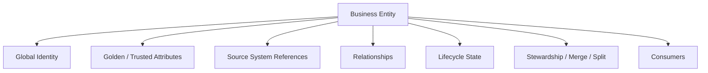
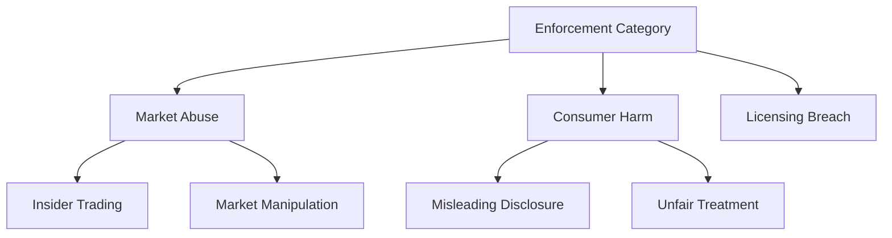
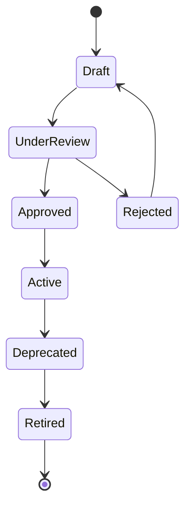
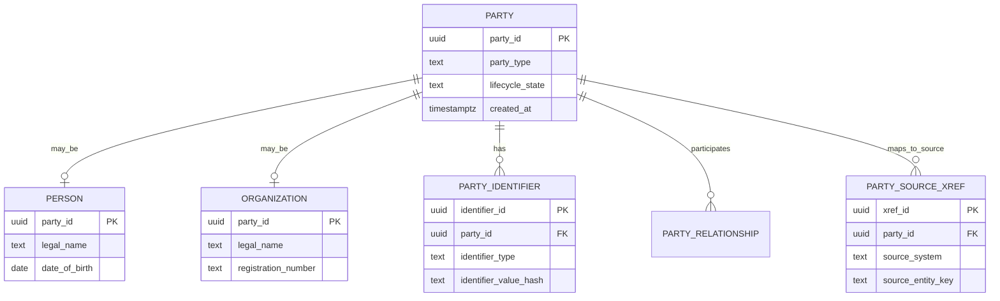

# Part 064 — Master Data, Reference Data, and Taxonomy

> Target bagian ini: kamu bisa membedakan **master data**, **reference data**, dan **taxonomy**, lalu mendesain schema, lifecycle, ownership, versioning, mapping, synchronization, governance, dan failure mode-nya di sistem produksi.

Banyak sistem enterprise gagal bukan karena query lambat, tetapi karena istilah bisnis, kode referensi, dan entity utama tidak konsisten.

Contoh:

- `customer`, `client`, `party`, `account_holder`, `subject`, dan `respondent` dipakai bergantian tanpa definisi jelas.
- Status “closed” berarti selesai di satu sistem, tetapi berarti archived di sistem lain.
- Country code, currency code, industry classification, risk category, dan case type tersebar sebagai string bebas.
- Organisasi punya tiga “single source of truth” untuk customer.
- Dashboard berbeda karena taxonomy berubah tanpa versioning.
- Case lama tidak bisa diinterpretasi karena reference value lama dihapus.

Database architect harus menguasai ini karena master/reference data adalah **semantic infrastructure**.

Architectural rule:

> If teams cannot agree what an entity or code means, the database cannot compensate with indexes and constraints.

---

## 1. Core definitions

| Concept | Meaning | Example | Volatility | Ownership |
|---|---|---|---|---|
| Master data | Core business entity shared across processes | person, organization, product, location, supplier, account | medium | domain/stewardship team |
| Reference data | Controlled values used to classify/categorize | country code, currency, status code, case type, risk rating | low-medium | governance/domain owner |
| Taxonomy | Structured classification system | enforcement category tree, product hierarchy, document type hierarchy | medium | policy/governance/domain owner |
| Metadata | Data about data | table owner, column classification, rule version | medium | platform/governance |
| Transactional data | Business events/facts | payment, case transition, order, inspection result | high | operational service/domain |

IBM describes reference data as data used to classify or categorize other data, such as country and currency codes. That distinction is useful: reference data is not the event itself; it shapes interpretation of events.

---

## 2. Why master/reference data matters

Master/reference data affects correctness, not only reporting convenience.

| Area | Failure when master/reference data is weak |
|---|---|
| Transaction processing | invalid status/type/category accepted |
| Workflow | wrong queue/escalation because category mapping wrong |
| Authorization | actor linked to wrong organization/role |
| Reporting | inconsistent aggregation across systems |
| Compliance | old decisions cannot be interpreted after taxonomy changes |
| Integration | external code mappings drift |
| Search | duplicate entities and inconsistent labels |
| Analytics | dimensions unstable; time-series reports not comparable |
| Data quality | duplicate parties/products/locations explode |

A strong database design separates:

1. **identity of core entity**
2. **attributes of entity**
3. **classification of entity**
4. **versioned interpretation of classification**
5. **mapping to external systems**
6. **historical usage in transactions**

---

## 3. Master data mental model

Master data answers: “What shared thing does the enterprise recognize?”



Examples:

| Master entity | Why it is master data |
|---|---|
| Person/Party | referenced by cases, accounts, claims, communications |
| Organization | referenced by permits, enforcement actions, ownership structures |
| Product | referenced by orders, inventory, pricing, support |
| Location | referenced by inspections, incidents, service areas |
| Supplier | referenced by procurement, risk, contracts |

Master data is not “all data about customer”. It is the trusted cross-process representation of shared entity identity and key attributes.

---

## 4. Reference data mental model

Reference data answers: “What controlled values are allowed, and what do they mean?”

```sql
CREATE TABLE ref_case_type (
  case_type_code      text PRIMARY KEY,
  display_name        text NOT NULL,
  description         text NOT NULL,
  is_active           boolean NOT NULL DEFAULT true,
  valid_from          date NOT NULL,
  valid_to            date,
  sort_order          integer NOT NULL,
  owner_team          text NOT NULL,
  created_at          timestamptz NOT NULL DEFAULT now(),
  CHECK (valid_to IS NULL OR valid_to > valid_from)
);
```

Reference data should not be random app constants.

Bad:

```java
if (caseType.equals("A")) { ... }
```

Better:

```sql
CREATE TABLE ref_case_type (
  case_type_code text PRIMARY KEY,
  display_name text NOT NULL,
  regulatory_meaning text NOT NULL,
  requires_senior_review boolean NOT NULL,
  default_sla_hours integer NOT NULL,
  valid_from date NOT NULL,
  valid_to date
);
```

Design question:

> Is this just a display label, or does it drive business behavior?

If it drives behavior, it needs ownership, versioning, tests, and change governance.

---

## 5. Taxonomy mental model

Taxonomy is reference data with structure.

Example:



Taxonomy can be:

| Shape | Example | DB pattern |
|---|---|---|
| flat list | risk rating LOW/MEDIUM/HIGH | reference table |
| hierarchy | product category tree | adjacency list / closure table |
| DAG | document can belong to multiple categories | edge table |
| ontology-like | rich typed relationships | graph/properties |
| versioned taxonomy | regulatory classification by year | taxonomy version tables |

Architectural rule:

> A taxonomy is not only a tree; it is a contract for classification, reporting, routing, and historical interpretation.

---

## 6. Master vs reference vs transactional data

Do not confuse entity identity with transaction events.

Example: regulatory case management.

| Data | Type | Reason |
|---|---|---|
| `party` | master data | shared person/org identity |
| `case` | transactional/operational entity | lifecycle of investigation/enforcement matter |
| `case_type` | reference data | classifies case |
| `case_status` | reference data + state machine | classifies lifecycle state |
| `case_status_transition` | transactional event | records state change |
| `enforcement_taxonomy_node` | taxonomy | structured regulatory classification |
| `evidence_document` | operational entity | case-specific artifact |
| `country_code` | reference data | classification/standardized location attribute |
| `organization_relationship` | master relationship | shared relationship between orgs/people |

Rule:

> Reference data defines allowed meaning. Transactional data records what happened.

---

## 7. Reference table design

Minimum viable production reference table:

```sql
CREATE TABLE ref_value_set (
  value_set_code   text PRIMARY KEY,
  display_name     text NOT NULL,
  description      text NOT NULL,
  owner_team       text NOT NULL,
  change_policy    text NOT NULL CHECK (change_policy IN ('platform', 'domain_owner', 'committee', 'external_standard')),
  created_at       timestamptz NOT NULL DEFAULT now()
);

CREATE TABLE ref_value (
  value_set_code   text NOT NULL REFERENCES ref_value_set(value_set_code),
  value_code       text NOT NULL,
  display_name     text NOT NULL,
  description      text NOT NULL,
  is_active        boolean NOT NULL DEFAULT true,
  valid_from       date NOT NULL,
  valid_to         date,
  sort_order       integer NOT NULL DEFAULT 0,
  metadata         jsonb NOT NULL DEFAULT '{}'::jsonb,
  created_at       timestamptz NOT NULL DEFAULT now(),
  updated_at       timestamptz NOT NULL DEFAULT now(),
  PRIMARY KEY (value_set_code, value_code),
  CHECK (valid_to IS NULL OR valid_to > valid_from)
);
```

But generic reference table can become a dumping ground. Use it carefully.

Prefer dedicated reference tables when:

- values have domain-specific attributes
- FK constraints are important
- values drive behavior
- history/versioning matters
- query performance matters
- semantics differ across value sets

Example dedicated table:

```sql
CREATE TABLE ref_case_status (
  status_code           text PRIMARY KEY,
  display_name          text NOT NULL,
  lifecycle_phase       text NOT NULL CHECK (lifecycle_phase IN ('intake', 'assessment', 'investigation', 'decision', 'closure')),
  is_terminal           boolean NOT NULL,
  allows_reopen         boolean NOT NULL,
  default_sla_hours     integer,
  requires_decision_ref boolean NOT NULL,
  is_active             boolean NOT NULL DEFAULT true,
  valid_from            date NOT NULL,
  valid_to              date,
  CHECK (valid_to IS NULL OR valid_to > valid_from)
);
```

---

## 8. Do not delete reference values casually

Deleting reference values breaks history.

Bad:

```sql
DELETE FROM ref_case_type WHERE case_type_code = 'LEGACY_X';
```

This creates old rows with invalid references or forces destructive update.

Better:

```sql
UPDATE ref_case_type
SET is_active = false,
    valid_to = DATE '2026-07-05'
WHERE case_type_code = 'LEGACY_X';
```

Then operational tables can preserve history:

```sql
CREATE TABLE case_file (
  case_id         uuid PRIMARY KEY,
  case_number     text NOT NULL UNIQUE,
  case_type_code  text NOT NULL REFERENCES ref_case_type(case_type_code),
  opened_at       timestamptz NOT NULL,
  closed_at       timestamptz
);
```

But this only preserves code, not full meaning if meaning changes. For defensibility, capture versioned meaning when necessary.

---

## 9. Versioned reference data

Reference values can change meaning over time.

Example:

- risk rating `HIGH` threshold changes
- case category definition changes after regulation update
- country/region classification changes
- product category hierarchy changes
- enforcement violation taxonomy version changes

Pattern:

```sql
CREATE TABLE ref_case_category_version (
  category_code      text NOT NULL,
  version_no         integer NOT NULL,
  display_name       text NOT NULL,
  definition         text NOT NULL,
  valid_from         date NOT NULL,
  valid_to           date,
  regulation_ref     text,
  is_active          boolean NOT NULL DEFAULT true,
  PRIMARY KEY (category_code, version_no),
  CHECK (valid_to IS NULL OR valid_to > valid_from)
);

CREATE UNIQUE INDEX uq_ref_case_category_current
ON ref_case_category_version(category_code)
WHERE valid_to IS NULL;
```

Transaction row can store both code and version:

```sql
CREATE TABLE case_classification (
  case_classification_id uuid PRIMARY KEY,
  case_id                uuid NOT NULL,
  category_code          text NOT NULL,
  category_version_no    integer NOT NULL,
  classified_at          timestamptz NOT NULL,
  classified_by_actor_id text NOT NULL,
  rationale              text,
  FOREIGN KEY (category_code, category_version_no)
    REFERENCES ref_case_category_version(category_code, version_no)
);
```

Why store version?

Because a classification made under old taxonomy must remain interpretable after taxonomy changes.

Rule:

> If the meaning can change and historical interpretation matters, store the reference version used at decision time.

---

## 10. Effective-dated reference data lookup

Sometimes transaction date determines applicable reference value.

```sql
SELECT r.*
FROM ref_tax_rate r
WHERE r.jurisdiction_code = :jurisdiction_code
  AND r.valid_from <= :transaction_date
  AND (r.valid_to IS NULL OR :transaction_date < r.valid_to)
ORDER BY r.valid_from DESC
LIMIT 1;
```

For PostgreSQL, range types and exclusion constraints can prevent overlapping validity periods.

```sql
CREATE EXTENSION IF NOT EXISTS btree_gist;

CREATE TABLE ref_tax_rate (
  jurisdiction_code text NOT NULL,
  valid_period      daterange NOT NULL,
  rate              numeric(8,5) NOT NULL,
  PRIMARY KEY (jurisdiction_code, valid_period),
  EXCLUDE USING gist (
    jurisdiction_code WITH =,
    valid_period WITH &&
  )
);
```

This enforces:

> For the same jurisdiction, two active tax-rate rows cannot overlap in time.

The same pattern applies to policy threshold, SLA calendar, classification definition, and jurisdiction-specific rule.

---

## 11. Reference data lifecycle

Reference values need lifecycle governance.



Lifecycle table:

```sql
CREATE TABLE reference_change_request (
  change_request_id uuid PRIMARY KEY,
  value_set_code    text NOT NULL,
  change_type       text NOT NULL CHECK (change_type IN ('add', 'update', 'deprecate', 'retire', 'merge', 'split')),
  requested_by      text NOT NULL,
  requested_at      timestamptz NOT NULL DEFAULT now(),
  status            text NOT NULL CHECK (status IN ('draft', 'under_review', 'approved', 'rejected', 'implemented', 'cancelled')),
  reason            text NOT NULL,
  effective_date    date NOT NULL,
  impact_summary    text,
  metadata          jsonb NOT NULL DEFAULT '{}'::jsonb
);
```

Operational rule:

- low-risk UI labels can be changed by owner team
- behavior-driving values require review
- regulatory classifications require effective date and evidence
- destructive changes require impact analysis
- taxonomy restructuring requires migration plan

---

## 12. Reference data as deploy-time vs runtime configuration

Not all reference data should be editable at runtime.

| Type | Example | Change mechanism |
|---|---|---|
| Standards reference | ISO country/currency code | controlled import/versioned update |
| Domain classification | case type, violation category | governance workflow |
| Behavior configuration | SLA hours by case type | versioned config with tests |
| UI label | display name, sort order | owner update with audit |
| State machine status | workflow state | code/schema migration + tests |

If reference data drives business logic, treat it like code:

- version it
- test it
- review it
- deploy it safely
- preserve old behavior for historical records

Anti-pattern:

> Business-critical rules hidden inside editable lookup tables with no tests.

Better:

> Reference data that changes behavior has an explicit rule contract, lifecycle, audit trail, and validation suite.

---

## 13. Master data architecture patterns

Master data architecture usually falls into several patterns.

| Pattern | Description | Good for | Risk |
|---|---|---|---|
| Registry | central index links records across systems | lightweight identity resolution | attributes remain inconsistent |
| Consolidation | central hub consolidates data for reporting | analytics and dedup | not real-time operational authority |
| Coexistence | hub and sources synchronize trusted attributes | shared operations | complex synchronization |
| Centralized | hub is system of record for master entity | strong governance | high organizational coupling |

Do not choose pattern based on tool marketing. Choose based on authority and workflow.

Questions:

1. Which system creates the entity?
2. Which system can change authoritative attributes?
3. Which attributes are mastered where?
4. How are duplicates merged?
5. How are splits handled?
6. What happens when source systems disagree?
7. How fast must corrections propagate?
8. Which consumers require historical state?

---

## 14. Party master data pattern

For person/organization, use party modelling.



Schema sketch:

```sql
CREATE TABLE party (
  party_id        uuid PRIMARY KEY,
  party_type      text NOT NULL CHECK (party_type IN ('person', 'organization')),
  lifecycle_state text NOT NULL CHECK (lifecycle_state IN ('active', 'merged', 'split', 'retired')),
  created_at      timestamptz NOT NULL DEFAULT now(),
  updated_at      timestamptz NOT NULL DEFAULT now()
);

CREATE TABLE person_profile (
  party_id       uuid PRIMARY KEY REFERENCES party(party_id),
  legal_name     text NOT NULL,
  date_of_birth  date,
  created_at     timestamptz NOT NULL DEFAULT now(),
  updated_at     timestamptz NOT NULL DEFAULT now()
);

CREATE TABLE organization_profile (
  party_id             uuid PRIMARY KEY REFERENCES party(party_id),
  legal_name           text NOT NULL,
  registration_number  text,
  jurisdiction_code    text,
  created_at           timestamptz NOT NULL DEFAULT now(),
  updated_at           timestamptz NOT NULL DEFAULT now()
);

CREATE TABLE party_source_xref (
  party_source_xref_id uuid PRIMARY KEY,
  party_id             uuid NOT NULL REFERENCES party(party_id),
  source_system        text NOT NULL,
  source_entity_type   text NOT NULL,
  source_entity_key    text NOT NULL,
  source_confidence    text NOT NULL CHECK (source_confidence IN ('low', 'medium', 'high', 'verified')),
  valid_from           timestamptz NOT NULL DEFAULT now(),
  valid_to             timestamptz,
  UNIQUE (source_system, source_entity_type, source_entity_key)
);
```

Do not expose internal `party_id` as the only identifier business users see. Keep business identifiers explicit and governed.

---

## 15. Golden record vs source-specific truth

The phrase “golden record” can be misleading.

A golden record is not always one row with perfect truth. Often it is an assembled trusted view with attribute-level survivorship.

Example:

| Attribute | Source of truth | Rule |
|---|---|---|
| legal name | government registry | verified external source wins |
| email | self-service portal | latest verified user input wins |
| risk category | risk system | computed by policy version |
| organization relationship | corporate registry + stewardship | verified manual curation wins |
| mailing address | customer portal | most recent confirmed address wins |

Schema:

```sql
CREATE TABLE mastered_attribute (
  mastered_attribute_id uuid PRIMARY KEY,
  party_id              uuid NOT NULL REFERENCES party(party_id),
  attribute_name        text NOT NULL,
  attribute_value       text NOT NULL,
  source_system         text NOT NULL,
  source_entity_key     text NOT NULL,
  confidence_score      numeric(5,4) NOT NULL,
  survivorship_rule     text NOT NULL,
  effective_from        timestamptz NOT NULL,
  effective_to          timestamptz,
  created_at            timestamptz NOT NULL DEFAULT now(),
  UNIQUE (party_id, attribute_name, effective_from)
);
```

Alternative: materialize current trusted profile for fast reads, but keep attribute history.

```sql
CREATE TABLE party_trusted_profile (
  party_id              uuid PRIMARY KEY REFERENCES party(party_id),
  legal_name            text NOT NULL,
  legal_name_source     text NOT NULL,
  email                 text,
  email_source          text,
  updated_at            timestamptz NOT NULL
);
```

Rule:

> The golden record should be explainable, not magical.

---

## 16. Duplicate, merge, and split

Master data systems must model duplicate resolution explicitly.

### Merge

```sql
CREATE TABLE party_merge_event (
  merge_event_id        uuid PRIMARY KEY,
  surviving_party_id    uuid NOT NULL REFERENCES party(party_id),
  merged_party_id       uuid NOT NULL REFERENCES party(party_id),
  merge_reason          text NOT NULL,
  confidence_score      numeric(5,4) NOT NULL,
  approved_by_actor_id  text NOT NULL,
  approved_at           timestamptz NOT NULL,
  evidence_ref          text,
  CHECK (surviving_party_id <> merged_party_id)
);
```

After merge:

- old party should not disappear
- old references should resolve to surviving party where appropriate
- historical transactions should preserve original reference if legally meaningful
- downstream systems need merge event

### Split

Splits are harder than merges.

```sql
CREATE TABLE party_split_event (
  split_event_id       uuid PRIMARY KEY,
  original_party_id    uuid NOT NULL REFERENCES party(party_id),
  new_party_id         uuid NOT NULL REFERENCES party(party_id),
  split_reason         text NOT NULL,
  approved_by_actor_id text NOT NULL,
  approved_at          timestamptz NOT NULL,
  evidence_ref         text
);
```

A split may require reassigning identifiers, relationships, cases, consents, and historical events. Never treat it as a simple update.

Rule:

> Identity correction is a business event, not a row overwrite.

---

## 17. External identifiers and crosswalk mapping

Enterprise systems rarely agree on IDs.

Use crosswalk mapping:

```sql
CREATE TABLE master_identity_crosswalk (
  crosswalk_id       uuid PRIMARY KEY,
  master_entity_type text NOT NULL,
  master_entity_id   uuid NOT NULL,
  source_system      text NOT NULL,
  source_entity_type text NOT NULL,
  source_entity_key  text NOT NULL,
  match_method       text NOT NULL CHECK (match_method IN ('source_asserted', 'deterministic', 'probabilistic', 'manual')),
  confidence_score   numeric(5,4) NOT NULL,
  valid_from         timestamptz NOT NULL DEFAULT now(),
  valid_to           timestamptz,
  UNIQUE (source_system, source_entity_type, source_entity_key)
);
```

Match methods:

| Method | Example | Risk |
|---|---|---|
| source asserted | external system says ID maps to party | source may be wrong |
| deterministic | exact national ID hash match | missing/incorrect IDs |
| probabilistic | name+DOB+address similarity | false positive/negative |
| manual | steward confirms | human error, slow |

For regulated systems, automatic merge should be conservative. Prefer candidate match + steward review when false positive risk is high.

---

## 18. Taxonomy hierarchy patterns

### 18.1 Adjacency list

Simple and common.

```sql
CREATE TABLE taxonomy_node (
  taxonomy_code    text NOT NULL,
  node_code        text NOT NULL,
  parent_node_code text,
  display_name     text NOT NULL,
  definition       text NOT NULL,
  sort_order       integer NOT NULL DEFAULT 0,
  is_active        boolean NOT NULL DEFAULT true,
  PRIMARY KEY (taxonomy_code, node_code),
  FOREIGN KEY (taxonomy_code, parent_node_code)
    REFERENCES taxonomy_node(taxonomy_code, node_code)
);
```

Good for simple trees. Recursive queries needed for ancestors/descendants.

### 18.2 Closure table

Better for frequent ancestor/descendant queries.

```sql
CREATE TABLE taxonomy_node_closure (
  taxonomy_code        text NOT NULL,
  ancestor_node_code   text NOT NULL,
  descendant_node_code text NOT NULL,
  depth                integer NOT NULL CHECK (depth >= 0),
  PRIMARY KEY (taxonomy_code, ancestor_node_code, descendant_node_code)
);
```

Query descendants:

```sql
SELECT n.*
FROM taxonomy_node_closure c
JOIN taxonomy_node n
  ON n.taxonomy_code = c.taxonomy_code
 AND n.node_code = c.descendant_node_code
WHERE c.taxonomy_code = :taxonomy_code
  AND c.ancestor_node_code = :node_code;
```

### 18.3 Versioned taxonomy

For historical interpretation:

```sql
CREATE TABLE taxonomy_version (
  taxonomy_code     text NOT NULL,
  version_no        integer NOT NULL,
  display_name      text NOT NULL,
  valid_from        date NOT NULL,
  valid_to          date,
  status            text NOT NULL CHECK (status IN ('draft', 'approved', 'active', 'retired')),
  PRIMARY KEY (taxonomy_code, version_no)
);

CREATE TABLE taxonomy_node_version (
  taxonomy_code     text NOT NULL,
  version_no        integer NOT NULL,
  node_code         text NOT NULL,
  parent_node_code  text,
  display_name      text NOT NULL,
  definition        text NOT NULL,
  PRIMARY KEY (taxonomy_code, version_no, node_code),
  FOREIGN KEY (taxonomy_code, version_no)
    REFERENCES taxonomy_version(taxonomy_code, version_no)
);
```

Transactions reference taxonomy version:

```sql
CREATE TABLE case_taxonomy_assignment (
  assignment_id      uuid PRIMARY KEY,
  case_id            uuid NOT NULL,
  taxonomy_code      text NOT NULL,
  taxonomy_version   integer NOT NULL,
  node_code          text NOT NULL,
  assigned_at        timestamptz NOT NULL,
  assigned_by        text NOT NULL,
  FOREIGN KEY (taxonomy_code, taxonomy_version, node_code)
    REFERENCES taxonomy_node_version(taxonomy_code, version_no, node_code)
);
```

---

## 19. Mapping between taxonomies

Different regulators, departments, or systems may classify the same concept differently.

```sql
CREATE TABLE taxonomy_mapping (
  mapping_id              uuid PRIMARY KEY,
  source_taxonomy_code    text NOT NULL,
  source_taxonomy_version integer NOT NULL,
  source_node_code        text NOT NULL,
  target_taxonomy_code    text NOT NULL,
  target_taxonomy_version integer NOT NULL,
  target_node_code        text NOT NULL,
  mapping_type            text NOT NULL CHECK (mapping_type IN (
    'equivalent', 'broader', 'narrower', 'related', 'manual_review_required'
  )),
  confidence              text NOT NULL CHECK (confidence IN ('low', 'medium', 'high', 'verified')),
  valid_from              date NOT NULL,
  valid_to                date,
  rationale               text NOT NULL
);
```

Mapping is rarely perfect.

| Mapping | Meaning |
|---|---|
| equivalent | same meaning |
| broader | target is more general |
| narrower | target is more specific |
| related | useful association but not substitutable |
| manual_review_required | no safe automatic mapping |

Rule:

> A mapping table without mapping semantics is a hidden data quality incident.

---

## 20. Reference data and state machines

Statuses are often reference data, but state transitions are not merely lookup values.

Weak design:

```sql
CREATE TABLE case_file (
  case_id uuid PRIMARY KEY,
  status text NOT NULL
);
```

Better:

```sql
CREATE TABLE ref_case_status (
  status_code text PRIMARY KEY,
  display_name text NOT NULL,
  is_terminal boolean NOT NULL,
  lifecycle_phase text NOT NULL
);

CREATE TABLE ref_case_status_transition_rule (
  from_status_code text NOT NULL REFERENCES ref_case_status(status_code),
  to_status_code   text NOT NULL REFERENCES ref_case_status(status_code),
  requires_reason  boolean NOT NULL DEFAULT false,
  requires_approval boolean NOT NULL DEFAULT false,
  PRIMARY KEY (from_status_code, to_status_code)
);

CREATE TABLE case_status_transition (
  transition_id    uuid PRIMARY KEY,
  case_id          uuid NOT NULL,
  from_status_code text NOT NULL,
  to_status_code   text NOT NULL,
  transitioned_at  timestamptz NOT NULL,
  transitioned_by  text NOT NULL,
  reason           text,
  FOREIGN KEY (from_status_code, to_status_code)
    REFERENCES ref_case_status_transition_rule(from_status_code, to_status_code)
);
```

Reference data defines allowed states. Transition event records movement. Rule table defines allowed movement.

---

## 21. Caching reference data

Reference data is read often and changes slowly, so caching is common. But stale reference data can cause wrong behavior.

Define freshness contract:

| Reference type | Cache strategy |
|---|---|
| UI label/sort | longer TTL acceptable |
| behavior-driving SLA/risk rule | versioned, cache by version, short TTL or explicit reload |
| state transition rule | deploy-time or version-pinned runtime config |
| external standards | versioned release/import |
| taxonomy used for historical reports | version-pinned; never “latest” for old period |

Pattern:

```text
command includes reference_version or policy_version
service loads exact version
transaction stores version used
```

Do not let long-lived app cache silently use old reference values for write validation.

---

## 22. Synchronizing reference data across services

Options:

| Pattern | Use when | Risk |
|---|---|---|
| shared DB reference table | modular monolith / same DB boundary | coupling |
| reference API | services need central lookup | latency/availability dependency |
| replicated reference package | high availability, versioned config | propagation complexity |
| event stream of reference changes | many consumers need updates | consumer lag/version mismatch |
| code constants | values rarely change and are behavior-critical | redeploy needed |

A production-grade reference data service publishes:

- value set metadata
- active values
- versions
- effective dates
- change events
- deprecation notices
- checksum/package signature
- compatibility notes

Reference change event:

```json
{
  "eventType": "REFERENCE_VALUE_CHANGED",
  "valueSet": "CASE_TYPE",
  "version": 17,
  "changeType": "deprecate",
  "valueCode": "LEGACY_X",
  "effectiveDate": "2026-08-01",
  "ownerTeam": "enforcement-policy",
  "requiresConsumerAction": true
}
```

---

## 23. Data quality rules for master/reference data

Master/reference data requires stronger quality gates.

### Reference data rules

- code is stable and unique
- display name is not used as key
- inactive values cannot be used for new transactions unless explicitly allowed
- effective periods do not overlap
- destructive changes require impact analysis
- behavior-driving attributes have tests
- value definition is not empty
- owner is assigned

### Master data rules

- source crosswalk is unique
- merge/split events are auditable
- duplicate candidates are reviewed
- identifiers are classified and protected
- survivorship rules are explicit
- trusted attributes have source/provenance
- lifecycle state is valid
- downstream consumers receive identity correction events

Example duplicate candidate table:

```sql
CREATE TABLE party_duplicate_candidate (
  candidate_id       uuid PRIMARY KEY,
  party_id_a         uuid NOT NULL REFERENCES party(party_id),
  party_id_b         uuid NOT NULL REFERENCES party(party_id),
  match_score        numeric(5,4) NOT NULL,
  match_reason       jsonb NOT NULL,
  status             text NOT NULL CHECK (status IN ('open', 'confirmed_duplicate', 'rejected', 'needs_more_evidence')),
  created_at         timestamptz NOT NULL DEFAULT now(),
  reviewed_by        text,
  reviewed_at        timestamptz,
  CHECK (party_id_a <> party_id_b)
);
```

---

## 24. Security and privacy for master data

Master data often concentrates risk.

Risks:

- party/entity hub becomes high-value target
- crosswalk table enables re-identification
- identifiers contain sensitive personal/business data
- merge/split mistakes have large blast radius
- analytics copies overexpose identifiable attributes
- steward tools bypass normal app authorization

Controls:

| Control | Purpose |
|---|---|
| attribute classification | know which fields are sensitive |
| row/tenant/org access policy | restrict who sees which party/entity |
| hashed identifiers | prevent casual exposure |
| tokenization | protect reversible sensitive identifiers |
| stewardship audit | trace manual identity decisions |
| break-glass control | controlled emergency access |
| export policy | prevent broad extraction |
| lineage | know where master data propagates |

Example identifier storage:

```sql
CREATE TABLE party_identifier (
  identifier_id        uuid PRIMARY KEY,
  party_id             uuid NOT NULL REFERENCES party(party_id),
  identifier_type      text NOT NULL,
  identifier_hash      text NOT NULL,
  identifier_token_ref text,
  issuing_authority    text,
  verified_at          timestamptz,
  valid_from           date,
  valid_to             date,
  UNIQUE (identifier_type, identifier_hash)
);
```

Store raw identifiers only when required, and protect them separately.

---

## 25. Master/reference data and analytics dimensions

Reference and master data often become dimensions in analytics.

Dimension design questions:

1. Is this attribute slowly changing?
2. Should historical reports reflect old value or current value?
3. Is the hierarchy versioned?
4. Are mappings one-to-one or many-to-many?
5. Does category change retroactively?
6. Does report need regulatory taxonomy version?

Example slowly changing dimension:

```sql
CREATE TABLE dim_case_category (
  dim_case_category_key bigint GENERATED ALWAYS AS IDENTITY PRIMARY KEY,
  category_code         text NOT NULL,
  category_version      integer NOT NULL,
  display_name          text NOT NULL,
  parent_category_code  text,
  effective_from        date NOT NULL,
  effective_to          date,
  is_current            boolean NOT NULL,
  UNIQUE (category_code, category_version)
);
```

Operational transaction stores code/version; warehouse dimension adds surrogate dimension key for analytics performance and historical reporting.

---

## 26. Case study: enforcement taxonomy change

Scenario:

A regulator changes violation taxonomy. Old category `DISCLOSURE_BREACH` splits into:

- `MISLEADING_DISCLOSURE`
- `LATE_DISCLOSURE`
- `INCOMPLETE_DISCLOSURE`

Weak approach:

```sql
UPDATE case_file
SET category_code = 'MISLEADING_DISCLOSURE'
WHERE category_code = 'DISCLOSURE_BREACH';
```

This destroys historical meaning.

Better approach:

1. Create taxonomy version 2.
2. Retire old node in version 2; keep it in version 1.
3. Add mapping from old to new with `manual_review_required` or conditional rules.
4. New cases use taxonomy v2.
5. Existing cases keep v1 assignment unless reclassified through explicit event.
6. Reports declare taxonomy version or mapping strategy.
7. Reclassification creates audit/provenance record.

Schema event:

```sql
CREATE TABLE case_reclassification_event (
  reclassification_event_id uuid PRIMARY KEY,
  case_id                   uuid NOT NULL,
  old_taxonomy_code          text NOT NULL,
  old_taxonomy_version       integer NOT NULL,
  old_node_code              text NOT NULL,
  new_taxonomy_code          text NOT NULL,
  new_taxonomy_version       integer NOT NULL,
  new_node_code              text NOT NULL,
  reason                    text NOT NULL,
  reclassified_by            text NOT NULL,
  reclassified_at            timestamptz NOT NULL,
  evidence_ref               text
);
```

Rule:

> Taxonomy change is not a bulk update. It is a semantic migration with historical consequences.

---

## 27. Operational ownership model

Reference/master data requires stewardship, not just engineering ownership.

| Role | Responsibility |
|---|---|
| Data owner | accountable for meaning and policy |
| Data steward | manages quality, duplicates, reference changes |
| Engineering owner | implements schema, APIs, pipelines, controls |
| Security/privacy owner | reviews sensitive data handling |
| Consumer owner | validates downstream impact |
| Governance forum | approves high-impact semantic changes |

RACI example:

| Activity | Data owner | Steward | Engineer | Security | Consumers |
|---|---|---|---|---|---|
| Add reference value | A | R | C | C if sensitive | I |
| Change behavior-driving attribute | A | R | R | C | C |
| Merge party records | A | R | C | C | I |
| Split party record | A | R | C | C | C |
| Taxonomy version release | A | R | R | C | C |
| Retire value | A | R | R | C | C |

A = accountable, R = responsible, C = consulted, I = informed.

---

## 28. APIs for reference/master data

For distributed systems, expose stable APIs.

Reference API examples:

```http
GET /reference/value-sets/CASE_TYPE?asOf=2026-07-05
GET /reference/value-sets/CASE_TYPE/versions/17
GET /reference/taxonomies/ENFORCEMENT_CATEGORY/versions/2/nodes
GET /reference/mappings?from=taxonomyA:v1&to=taxonomyB:v3
```

Master API examples:

```http
GET /parties/{partyId}
GET /parties:resolve?sourceSystem=CRM&sourceKey=123
GET /parties/{partyId}/identifiers
GET /parties/{partyId}/relationships?asOf=2026-07-05
POST /party-merge-candidates
```

API response should include version and metadata:

```json
{
  "valueSet": "CASE_TYPE",
  "version": 17,
  "effectiveDate": "2026-07-05",
  "checksum": "sha256:...",
  "values": [
    {
      "code": "MARKET_ABUSE",
      "displayName": "Market Abuse",
      "active": true,
      "definition": "..."
    }
  ]
}
```

Consumers can cache by version/checksum safely.

---

## 29. Common anti-patterns

| Anti-pattern | Why it hurts | Better design |
|---|---|---|
| Stringly typed status/category | invalid values, inconsistent meaning | FK to reference table |
| Display label as key | label changes break data | stable code + display name |
| Generic lookup table for everything | weak constraints and semantics | dedicated tables for important value sets |
| Deleting old reference values | history becomes invalid | deprecate/retire with validity period |
| No effective dating | historical decisions ambiguous | versioned/effective-dated reference data |
| Taxonomy as nested JSON blob only | hard to query/govern/version | node/edge/version tables |
| Golden record without provenance | unexplainable trust | attribute source/provenance/survivorship |
| Auto-merge without review | false positives corrupt identity | conservative matching + stewardship |
| Crosswalk without confidence | unsafe identity mapping | match method + confidence + validity |
| Runtime editable business rules | untested behavior changes | versioned rules + review + tests |
| Cache latest reference values for decisions | old decisions unreproducible | version-pin decisions |
| No owner for value set | no accountable semantics | owner/steward metadata required |

---

## 30. Design checklist

### Reference data

- [ ] Stable code is separate from display label.
- [ ] Values have definitions, owner, active flag, and effective period.
- [ ] Old values are retired, not deleted.
- [ ] Behavior-driving values have tests.
- [ ] New transactions cannot use inactive values unless explicitly allowed.
- [ ] Historical transactions can be interpreted under the version used.
- [ ] External standards/imports are versioned and auditable.

### Taxonomy

- [ ] Taxonomy has explicit version.
- [ ] Nodes have stable codes and definitions.
- [ ] Parent/child relationships are versioned.
- [ ] Mapping semantics are explicit.
- [ ] Reclassification is event-driven and audited.
- [ ] Reports declare taxonomy version or mapping strategy.

### Master data

- [ ] Master entity identity is stable and governed.
- [ ] Source-system crosswalks are unique and versioned.
- [ ] Duplicate/merge/split is modelled as events.
- [ ] Trusted attributes have source/provenance.
- [ ] Survivorship rules are explicit.
- [ ] Sensitive identifiers are hashed/tokenized/protected.
- [ ] Downstream consumers receive identity correction events.

### Operations

- [ ] Reference changes have workflow and approval.
- [ ] Consumers are notified of breaking semantic changes.
- [ ] Caches are version-aware.
- [ ] Reference/master changes are observable and auditable.
- [ ] Backup/restore preserves reference history.
- [ ] Data lineage tracks reference/master propagation.

---

## 31. Practical implementation path

### Phase 1 — Stop string chaos

- identify top 20 business-critical codes/statuses/categories
- create dedicated reference tables
- add FKs from operational tables
- define owner and definitions

### Phase 2 — Add lifecycle and versioning

- active/inactive
- valid_from/valid_to
- change requests
- audit trail
- behavior tests for important values

### Phase 3 — Build taxonomy support

- taxonomy version
- node table
- closure table if needed
- mapping table
- reclassification events

### Phase 4 — Establish master identity

- party/product/location master tables
- source crosswalks
- duplicate candidate queue
- merge/split events
- trusted attribute provenance

### Phase 5 — Operationalize governance

- reference APIs/packages
- change events
- consumer impact analysis
- lineage integration
- stewardship dashboards

---

## 32. Final mental model

Master data, reference data, and taxonomy are not clerical tables.

They are the semantic backbone of the database architecture.

A top-tier database architect asks:

1. Which entities are shared across processes?
2. Which attributes are authoritative, and where?
3. Which codes define allowed meaning?
4. Which classifications drive workflow, risk, reporting, or compliance?
5. Can old transactions still be interpreted after definitions change?
6. Can we prove why two records were merged or split?
7. Can every consumer safely handle semantic change?

The key shift:

> Treat meaning as data with lifecycle, ownership, versioning, and evidence.

When meaning is governed, schema becomes more than storage. It becomes a reliable model of the business.

---

## References

- IBM, **What is Master Data Management?** — defines master data categories and reference data as data used to classify or categorize other data.
- IBM InfoSphere MDM Reference Data Management Hub — describes centralized management and distribution of trusted enterprise reference data.
- PostgreSQL Documentation, **Constraints** — foreign keys, unique constraints, check constraints for enforcing reference integrity.
- PostgreSQL Documentation, **Range Types** and **Exclusion Constraints** — useful for effective-dated reference data without overlapping validity periods.
- W3C PROV — useful conceptual foundation for provenance of mastered attributes and taxonomy-driven decisions.
