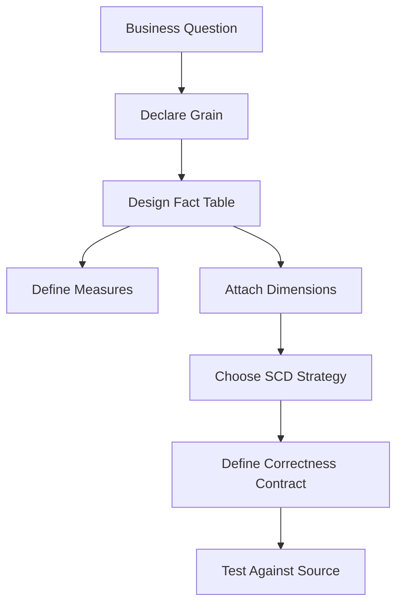
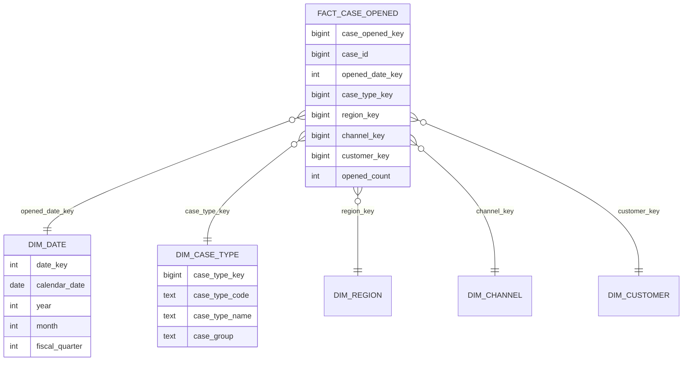
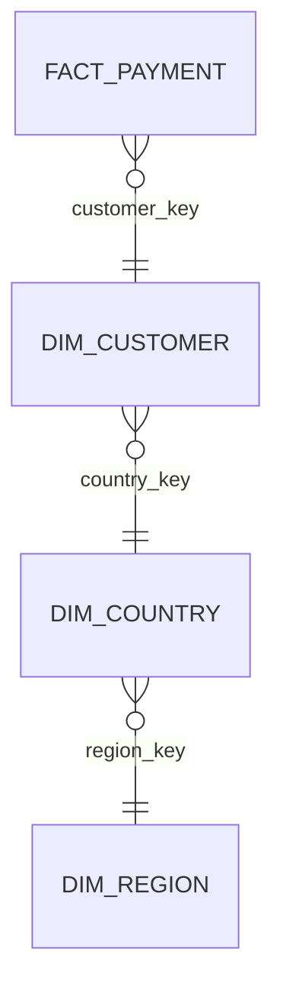
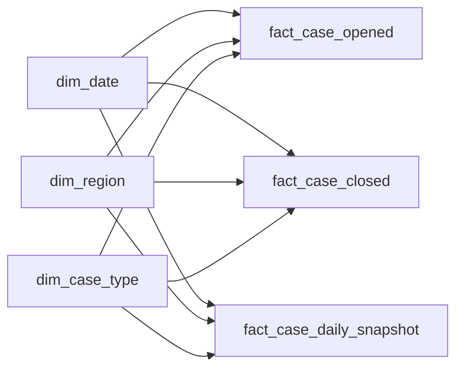
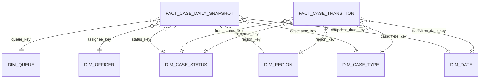

# Part 065 — Analytical Modelling and Dimensional Design

> Target bagian ini: kamu bisa mendesain model analitik yang stabil, mudah dipakai analyst, efisien untuk query agregasi, dan tetap bisa ditelusuri kembali ke sumber operasionalnya.

Banyak engineer kuat di OLTP tetapi lemah saat diminta membuat database untuk reporting. Mereka membawa kebiasaan schema operasional ke warehouse: tabel terlalu normalized, join terlalu panjang, definisi metric tersebar, time logic tidak konsisten, dan report berubah setiap kali business rule berubah.

Analytical modelling bukan sekadar “copy table produksi ke warehouse”. Analytical modelling adalah proses mengubah fakta operasional menjadi **model pengukuran bisnis**.

Mental model paling penting:

> OLTP bertanya: “apa state yang valid sekarang dan bagaimana command mengubahnya?”  
> OLAP bertanya: “apa yang terjadi, kapan, pada grain apa, dan menurut dimensi bisnis apa kita ingin mengukurnya?”

Di bagian ini kita fokus pada **dimensional modelling**: fact table, dimension table, star schema, slowly changing dimension, snapshot, bridge, conformed dimension, dan semantic correctness.

---

## 1. Analytical Model Is a Measurement System

Model operasional menyimpan state agar transaksi benar.

Model analitik menyimpan measurement agar pertanyaan bisnis bisa dijawab.

Contoh pertanyaan operasional:

- Apakah case ini boleh di-assign ke investigator ini?
- Apakah invoice ini boleh dibayar?
- Apakah status transition ini legal?
- Apakah user ini boleh melihat evidence ini?

Contoh pertanyaan analitik:

- Berapa banyak case baru per bulan per region?
- Berapa median waktu dari intake sampai triage?
- Berapa backlog aktif per queue per severity?
- Berapa conversion rate dari investigation ke enforcement action?
- Berapa total amount yang recovered per fiscal quarter?

Perbedaan utamanya ada di **grain**.

Dalam OLTP, grain sering mengikuti lifecycle entity: satu row per `case`, satu row per `payment`, satu row per `assignment`.

Dalam OLAP, grain harus ditulis eksplisit sebagai unit observasi:

- satu row per case creation event
- satu row per case per day
- satu row per task transition
- satu row per payment settlement
- satu row per case-state snapshot per midnight
- satu row per investigation outcome

Tanpa grain, fact table akan ambigu.

Architectural rule:

> A fact table without an explicit grain is a future reporting incident.

---

## 2. Dimensional Modelling Vocabulary

Dimensional modelling memecah model analitik menjadi dua jenis tabel utama:

| Concept | Meaning | Example |
|---|---|---|
| Fact | Sesuatu yang terjadi atau diukur | case opened, payment settled, task completed |
| Dimension | Konteks untuk memahami fact | date, region, customer, case type, officer, product |
| Grain | Satu row fact mewakili apa | one row per case per day |
| Measure | Nilai numerik/agregat | amount, count, duration, quantity |
| Degenerate dimension | Identifier transaksi yang disimpan di fact | case number, invoice number |
| Conformed dimension | Dimension yang dipakai konsisten di banyak mart | date, customer, product, geography |
| Slowly changing dimension | Dimension yang berubah dari waktu ke waktu | customer address, officer unit, product category |
| Snapshot fact | Fact yang merekam state pada waktu tertentu | daily backlog snapshot |
| Accumulating snapshot | Fact untuk proses dengan milestone | intake → triage → investigation → closure |

Diagram mental:



---

## 3. The First Question: What Is the Grain?

Grain adalah kontrak paling penting dalam fact table.

Bad grain:

> `fact_case` berisi data case.

Good grain:

> `fact_case_opened` has one row per case at the moment the case is created.

Good grain:

> `fact_case_daily_snapshot` has one row per case per local reporting date, representing the case state at end of day.

Good grain:

> `fact_task_transition` has one row per task transition event.

Grain menentukan:

- uniqueness key
- allowed measures
- join path ke dimensions
- aggregation semantics
- deduplication logic
- late-arriving data handling
- report correctness

### 3.1 Grain Examples

| Business question | Likely grain | Fact table |
|---|---|---|
| How many cases were opened? | one row per case opened | `fact_case_opened` |
| How long do tasks take? | one row per task completion | `fact_task_completion` |
| What was backlog yesterday? | one row per case per day | `fact_case_daily_snapshot` |
| How many transitions happened? | one row per transition | `fact_case_transition` |
| What is payment volume? | one row per settled payment | `fact_payment_settlement` |
| How long does full lifecycle take? | one row per case lifecycle | `fact_case_lifecycle` |

### 3.2 Grain Anti-Pattern: Mixed Grain

```sql
-- Bad: one table mixes event-level, current-state, and snapshot data.
CREATE TABLE analytics.case_report (
    case_id bigint,
    opened_at timestamptz,
    current_status text,
    current_assignee_id bigint,
    daily_backlog_count integer,
    total_tasks_completed integer,
    last_transition_at timestamptz
);
```

Problem:

- `opened_at` is case event grain.
- `current_status` is current-state grain.
- `daily_backlog_count` is aggregate snapshot grain.
- `total_tasks_completed` is derived lifecycle grain.

Satu tabel berisi banyak semantic level. Query akan tampak mudah di awal, tetapi metrik menjadi tidak stabil.

Better:

```sql
CREATE TABLE analytics.fact_case_opened (
    case_opened_key bigint generated always as identity primary key,
    case_id bigint not null,
    opened_at timestamptz not null,
    opened_date_key integer not null,
    case_type_key bigint not null,
    region_key bigint not null,
    source_system_key bigint not null,
    opened_count integer not null default 1,
    unique (case_id)
);

CREATE TABLE analytics.fact_case_daily_snapshot (
    case_daily_snapshot_key bigint generated always as identity primary key,
    case_id bigint not null,
    snapshot_date_key integer not null,
    status_key bigint not null,
    queue_key bigint,
    assignee_key bigint,
    age_days integer not null,
    is_backlog integer not null,
    open_case_count integer not null default 1,
    unique (case_id, snapshot_date_key)
);
```

---

## 4. Fact Tables

Fact table menyimpan event, measurement, atau snapshot yang bisa dianalisis.

Fact table biasanya memiliki:

- surrogate key optional
- natural/business identifier sebagai degenerate dimension
- foreign keys ke dimension tables
- measures
- event timestamp atau date key
- load metadata
- source lineage
- uniqueness rule sesuai grain

Template:

```sql
CREATE TABLE analytics.fact_<business_process> (
    <fact_key> bigint generated always as identity primary key,

    -- degenerate/business identifiers
    source_event_id text not null,
    source_entity_id bigint not null,

    -- dimension keys
    date_key integer not null references analytics.dim_date(date_key),
    customer_key bigint references analytics.dim_customer(customer_key),
    product_key bigint references analytics.dim_product(product_key),

    -- measures
    event_count integer not null default 1,
    amount numeric(18, 2),
    duration_seconds bigint,

    -- lineage
    source_system text not null,
    source_loaded_at timestamptz not null,
    source_lsn text,

    unique (source_system, source_event_id)
);
```

### 4.1 Additive, Semi-Additive, and Non-Additive Measures

Measures tidak semuanya boleh dijumlahkan sembarangan.

| Type | Meaning | Example | Safe aggregation |
|---|---|---|---|
| Additive | Bisa dijumlahkan di semua dimension | payment amount, item quantity | SUM |
| Semi-additive | Bisa dijumlahkan di beberapa dimension, tidak semua | account balance, backlog count | SUM by org, not across time blindly |
| Non-additive | Tidak boleh dijumlahkan langsung | ratio, percentage, median | recompute from components |

Bad design:

```sql
conversion_rate numeric(8,4)
```

Jika report menjumlahkan atau merata-ratakan conversion rate antar group, hasil bisa salah.

Better:

```sql
converted_count integer not null,
eligible_count integer not null
```

Lalu semantic layer menghitung:

```sql
converted_count::numeric / nullif(eligible_count, 0)
```

Architectural rule:

> Store numerator and denominator when possible; compute ratios at query/semantic layer.

---

## 5. Transaction Fact Table

Transaction fact adalah fact table paling natural: satu row per business event.

Contoh: satu row per payment settlement.

```sql
CREATE TABLE analytics.fact_payment_settlement (
    payment_settlement_key bigint generated always as identity primary key,
    payment_id bigint not null,
    settlement_event_id text not null,

    settlement_date_key integer not null references analytics.dim_date(date_key),
    customer_key bigint not null references analytics.dim_customer(customer_key),
    payment_method_key bigint not null references analytics.dim_payment_method(payment_method_key),
    currency_key bigint not null references analytics.dim_currency(currency_key),

    settlement_amount numeric(18, 2) not null,
    settlement_count integer not null default 1,

    source_system text not null,
    source_loaded_at timestamptz not null,

    unique (source_system, settlement_event_id)
);
```

Kapan cocok:

- event bisnis jelas
- event immutable atau append-only
- metric berasal dari event
- report butuh drill-down ke transaksi

Failure mode:

- event dikirim ulang dan tidak dedup
- event late arriving dan masuk ke periode laporan lama
- event correction diperlakukan sebagai overwrite tanpa audit
- dimension key tidak resolve saat load

---

## 6. Periodic Snapshot Fact Table

Periodic snapshot fact merekam kondisi pada interval tetap: daily, weekly, monthly.

Contoh: backlog case per hari.

```sql
CREATE TABLE analytics.fact_case_daily_snapshot (
    case_daily_snapshot_key bigint generated always as identity primary key,
    snapshot_date_key integer not null references analytics.dim_date(date_key),
    case_id bigint not null,

    case_type_key bigint not null references analytics.dim_case_type(case_type_key),
    region_key bigint not null references analytics.dim_region(region_key),
    status_key bigint not null references analytics.dim_case_status(status_key),
    queue_key bigint references analytics.dim_queue(queue_key),
    assignee_key bigint references analytics.dim_officer(officer_key),

    age_days integer not null,
    sla_remaining_hours integer,
    is_backlog integer not null,
    open_case_count integer not null default 1,

    source_loaded_at timestamptz not null,

    unique (case_id, snapshot_date_key)
);
```

Kapan cocok:

- backlog
- inventory
- balance
- active subscriptions
- active investigations
- open task count

Pitfall:

- Snapshot fact membesar cepat.
- Query bisa salah jika menjumlahkan snapshot antar tanggal.
- Snapshot harus punya definisi “as of” yang jelas.

Rule:

> Snapshot facts answer “what was true at time T”, not “what happened between T1 and T2”.

---

## 7. Accumulating Snapshot Fact Table

Accumulating snapshot cocok untuk proses yang punya milestone tetap.

Contoh regulatory case lifecycle:

- intake
- triage
- assignment
- investigation start
- recommendation
- decision
- closure

Satu row per case, diupdate saat milestone tercapai.

```sql
CREATE TABLE analytics.fact_case_lifecycle (
    case_lifecycle_key bigint generated always as identity primary key,
    case_id bigint not null,

    case_type_key bigint not null,
    region_key bigint not null,

    intake_date_key integer,
    triage_date_key integer,
    assignment_date_key integer,
    investigation_start_date_key integer,
    recommendation_date_key integer,
    decision_date_key integer,
    closure_date_key integer,

    intake_to_triage_hours integer,
    triage_to_assignment_hours integer,
    investigation_duration_hours integer,
    total_lifecycle_hours integer,

    current_milestone text not null,
    is_closed boolean not null,

    source_loaded_at timestamptz not null,

    unique (case_id)
);
```

Kapan cocok:

- order lifecycle
- claim processing
- case management
- onboarding funnel
- approval process

Tradeoff:

- Fact row mutable.
- Late corrections harus bisa memperbarui milestone.
- Lifecycle yang branchy/dynamic bisa membuat kolom milestone terlalu banyak.

Jika workflow sangat dynamic, gunakan event fact + derived lifecycle mart.

---

## 8. Dimension Tables

Dimension table menjawab “context around the fact”.

Contoh dimension:

- date
- customer
- product
- geography
- officer
- organization unit
- case type
- status
- channel
- risk category

Template:

```sql
CREATE TABLE analytics.dim_customer (
    customer_key bigint generated always as identity primary key,

    -- natural/business key
    customer_id bigint not null,

    -- descriptive attributes
    customer_number text not null,
    customer_name text,
    customer_type text,
    risk_segment text,
    country_code text,

    -- SCD metadata
    effective_from timestamptz not null,
    effective_to timestamptz,
    is_current boolean not null,

    -- lineage
    source_system text not null,
    source_loaded_at timestamptz not null,

    unique (customer_id, effective_from)
);
```

Dimension harus user-friendly. Analyst tidak harus menghafal normalized production schema.

Bad dimension:

```sql
dim_customer(customer_id, party_id, legal_entity_id, xref_id, type_cd, attr_1, attr_2)
```

Better:

```sql
dim_customer(
    customer_key,
    customer_id,
    customer_number,
    customer_display_name,
    customer_type,
    risk_segment,
    country_name,
    is_government_entity,
    effective_from,
    effective_to,
    is_current
)
```

---

## 9. Star Schema

Star schema menempatkan fact table di tengah, dikelilingi dimension tables.



Star schema optimize untuk:

- business readability
- fewer joins than normalized OLTP schema
- stable report contracts
- dimensional slicing
- aggregate-friendly query
- BI tool compatibility

Query contoh:

```sql
SELECT
    d.fiscal_year,
    d.fiscal_quarter,
    r.region_name,
    ct.case_group,
    SUM(f.opened_count) AS cases_opened
FROM analytics.fact_case_opened f
JOIN analytics.dim_date d ON d.date_key = f.opened_date_key
JOIN analytics.dim_region r ON r.region_key = f.region_key
JOIN analytics.dim_case_type ct ON ct.case_type_key = f.case_type_key
GROUP BY d.fiscal_year, d.fiscal_quarter, r.region_name, ct.case_group
ORDER BY d.fiscal_year, d.fiscal_quarter, r.region_name, ct.case_group;
```

---

## 10. Snowflake Schema

Snowflake schema normalizes dimensions into sub-dimensions.

Example:



It can reduce redundancy but increases query complexity.

Use snowflake carefully when:

- dimension is very large
- hierarchy is centrally governed
- reference data is reused widely
- update semantics matter

Prefer star schema for BI-facing marts unless there is a concrete reason.

Architectural rule:

> Normalize OLTP for write correctness. Denormalize analytical dimensions for read clarity.

---

## 11. Date Dimension

Date dimension is not optional in serious analytics.

A timestamp alone is not enough because reporting often needs:

- calendar year
- fiscal year
- fiscal quarter
- month name
- week number
- working day flag
- holiday flag
- reporting period
- local jurisdiction calendar

Example:

```sql
CREATE TABLE analytics.dim_date (
    date_key integer primary key, -- YYYYMMDD
    calendar_date date not null unique,
    calendar_year integer not null,
    calendar_month integer not null,
    calendar_day integer not null,
    month_name text not null,
    quarter integer not null,
    fiscal_year integer not null,
    fiscal_quarter integer not null,
    week_of_year integer not null,
    day_of_week integer not null,
    is_weekend boolean not null,
    is_business_day boolean not null,
    reporting_period text not null
);
```

Why `date_key` often uses `YYYYMMDD`:

- human readable
- stable
- easy partitioning/filtering
- independent from surrogate sequence

But never use it to encode timezone logic casually. Decide whether the date is:

- event local date
- UTC date
- tenant reporting date
- jurisdiction business date
- processing date

---

## 12. Slowly Changing Dimensions

Dimension attributes change.

Customer moves country. Officer moves unit. Product changes category. Case type taxonomy is reorganized. Risk segment changes.

If the warehouse overwrites dimension attributes blindly, historical reports change.

Question:

> When we report cases opened in 2024 by region, should we use the customer’s region at case-open time or current region?

There is no universal answer. It is a business semantics decision.

Common SCD strategies:

| Type | Meaning | Use when |
|---|---|---|
| Type 0 | Retain original value | attribute must never change historically |
| Type 1 | Overwrite | history not needed; correction preferred |
| Type 2 | Add new dimension row | historical analysis needs old and new versions |
| Type 3 | Add previous/current attribute columns | limited change tracking |
| Type 4 | Separate history table | history needed but not in main dimension |
| Type 6 | Hybrid Type 1 + 2 + 3 | need both current and historical perspectives |

### 12.1 SCD Type 1

Use when change is correction or history is irrelevant.

```sql
UPDATE analytics.dim_payment_method
SET payment_method_name = 'Credit Card'
WHERE payment_method_code = 'CARD';
```

Risk:

- historical reports change.

Good for:

- typo correction
- display label correction
- non-historical attribute

### 12.2 SCD Type 2

Use when historical context matters.

```sql
CREATE TABLE analytics.dim_officer (
    officer_key bigint generated always as identity primary key,
    officer_id bigint not null,
    officer_name text not null,
    organization_unit text not null,
    role_name text not null,
    effective_from timestamptz not null,
    effective_to timestamptz,
    is_current boolean not null,
    source_loaded_at timestamptz not null,
    unique (officer_id, effective_from)
);
```

When officer moves unit:

```sql
UPDATE analytics.dim_officer
SET effective_to = timestamp '2026-07-01 00:00:00+00',
    is_current = false
WHERE officer_id = 101
  AND is_current = true;

INSERT INTO analytics.dim_officer (
    officer_id,
    officer_name,
    organization_unit,
    role_name,
    effective_from,
    effective_to,
    is_current,
    source_loaded_at
)
VALUES (
    101,
    'Ari Wijaya',
    'Enforcement Unit B',
    'Senior Investigator',
    timestamp '2026-07-01 00:00:00+00',
    null,
    true,
    now()
);
```

Fact loading must resolve dimension version based on event time:

```sql
SELECT officer_key
FROM analytics.dim_officer
WHERE officer_id = :officer_id
  AND effective_from <= :event_time
  AND (effective_to > :event_time OR effective_to IS NULL);
```

Rule:

> SCD Type 2 is useless if fact loading always joins to `is_current = true`.

---

## 13. Fact-to-Dimension Time Alignment

A common reporting bug:

```sql
-- Wrong for historical reporting when dimension is Type 2.
JOIN analytics.dim_customer dc
  ON dc.customer_id = f.customer_id
 AND dc.is_current = true
```

This attributes old events to current customer attributes.

Better:

```sql
JOIN analytics.dim_customer dc
  ON dc.customer_id = f.customer_id
 AND dc.effective_from <= f.event_at
 AND (dc.effective_to > f.event_at OR dc.effective_to IS NULL)
```

Even better: resolve dimension surrogate key during ETL/ELT and store it in fact.

```sql
INSERT INTO analytics.fact_case_opened (..., customer_key, ...)
SELECT
    ...,
    dc.customer_key,
    ...
FROM staging.case_opened s
JOIN analytics.dim_customer dc
  ON dc.customer_id = s.customer_id
 AND dc.effective_from <= s.opened_at
 AND (dc.effective_to > s.opened_at OR dc.effective_to IS NULL);
```

Then report query is simple and stable:

```sql
JOIN analytics.dim_customer dc ON dc.customer_key = f.customer_key
```

---

## 14. Degenerate Dimensions

A degenerate dimension is a business identifier stored in the fact table without a separate dimension table.

Examples:

- `case_number`
- `invoice_number`
- `payment_reference`
- `order_number`
- `claim_number`

```sql
CREATE TABLE analytics.fact_invoice_line (
    invoice_line_fact_key bigint generated always as identity primary key,
    invoice_number text not null,
    invoice_line_number integer not null,
    invoice_date_key integer not null,
    customer_key bigint not null,
    product_key bigint not null,
    quantity numeric(18, 4) not null,
    amount numeric(18, 2) not null,
    unique (invoice_number, invoice_line_number)
);
```

Use it when:

- identifier is useful for drill-through
- no descriptive attributes need separate table
- identifier belongs to transaction, not a descriptive entity

---

## 15. Junk Dimensions

Junk dimension groups low-cardinality flags/codes.

Bad:

```sql
fact_case_opened(
  is_urgent boolean,
  is_anonymous boolean,
  is_cross_border boolean,
  intake_channel_code text,
  priority_code text
)
```

Better sometimes:

```sql
CREATE TABLE analytics.dim_case_flags (
    case_flags_key bigint generated always as identity primary key,
    is_urgent boolean not null,
    is_anonymous boolean not null,
    is_cross_border boolean not null,
    intake_channel_code text not null,
    priority_code text not null,
    unique (is_urgent, is_anonymous, is_cross_border, intake_channel_code, priority_code)
);
```

Use carefully. Junk dimensions are useful when flags are descriptive and stable. Do not hide important business concepts inside a junk dimension just because they are small.

---

## 16. Role-Playing Dimensions

One dimension can play multiple roles.

Example: `dim_date` used as:

- opened date
- assigned date
- decision date
- closure date

```sql
CREATE TABLE analytics.fact_case_lifecycle (
    case_id bigint not null,
    opened_date_key integer references analytics.dim_date(date_key),
    assigned_date_key integer references analytics.dim_date(date_key),
    decision_date_key integer references analytics.dim_date(date_key),
    closed_date_key integer references analytics.dim_date(date_key)
);
```

In BI semantic layer, expose them as role-specific date dimensions:

- Opened Date
- Assigned Date
- Decision Date
- Closed Date

Do not create four physical date dimensions unless calendars differ.

---

## 17. Bridge Tables for Many-to-Many

Fact-to-dimension relationship is often many-to-many.

Example:

- one case has multiple allegations
- one investigation has multiple officers
- one product belongs to multiple categories
- one customer belongs to multiple segments

Do not force many-to-many into comma-separated fields.

```sql
CREATE TABLE analytics.bridge_case_allegation (
    case_id bigint not null,
    allegation_type_key bigint not null references analytics.dim_allegation_type(allegation_type_key),
    allocation_weight numeric(9, 6) not null default 1.0,
    primary key (case_id, allegation_type_key)
);
```

When counting cases by allegation, risk of double counting is real.

Use allocation weight if metric must sum to original total:

```sql
SELECT
    a.allegation_group,
    SUM(f.opened_count * b.allocation_weight) AS allocated_cases
FROM analytics.fact_case_opened f
JOIN analytics.bridge_case_allegation b ON b.case_id = f.case_id
JOIN analytics.dim_allegation_type a ON a.allegation_type_key = b.allegation_type_key
GROUP BY a.allegation_group;
```

Architectural rule:

> Many-to-many analytical joins must define double-counting semantics explicitly.

---

## 18. Conformed Dimensions

Conformed dimensions are shared dimensions with consistent meaning across fact tables.

Example:

- `dim_date`
- `dim_customer`
- `dim_product`
- `dim_region`
- `dim_case_type`
- `dim_organization_unit`

Why it matters:

If `fact_case_opened` and `fact_case_closed` use different region definitions, comparing opened vs closed by region is unreliable.



Conformed dimensions enable drilling across fact tables.

Example:

```sql
WITH opened AS (
    SELECT opened_date_key AS date_key, region_key, SUM(opened_count) AS opened_count
    FROM analytics.fact_case_opened
    GROUP BY opened_date_key, region_key
),
closed AS (
    SELECT closed_date_key AS date_key, region_key, SUM(closed_count) AS closed_count
    FROM analytics.fact_case_closed
    GROUP BY closed_date_key, region_key
)
SELECT
    d.calendar_month,
    r.region_name,
    SUM(o.opened_count) AS opened_count,
    SUM(c.closed_count) AS closed_count
FROM opened o
FULL JOIN closed c
  ON c.date_key = o.date_key
 AND c.region_key = o.region_key
JOIN analytics.dim_date d ON d.date_key = coalesce(o.date_key, c.date_key)
JOIN analytics.dim_region r ON r.region_key = coalesce(o.region_key, c.region_key)
GROUP BY d.calendar_month, r.region_name;
```

---

## 19. Dimensional Bus Matrix

A dimensional bus matrix maps business processes to conformed dimensions.

| Business process / Fact | Date | Customer | Product | Region | Officer | Case Type | Status |
|---|---:|---:|---:|---:|---:|---:|---:|
| Case opened | ✅ | ✅ | ❌ | ✅ | ❌ | ✅ | ❌ |
| Case assigned | ✅ | ❌ | ❌ | ✅ | ✅ | ✅ | ✅ |
| Case transition | ✅ | ❌ | ❌ | ✅ | ✅ | ✅ | ✅ |
| Case daily snapshot | ✅ | ✅ | ❌ | ✅ | ✅ | ✅ | ✅ |
| Payment settlement | ✅ | ✅ | ✅ | ✅ | ❌ | ❌ | ❌ |

This prevents random mart creation.

Use it during architecture review:

- Which facts exist?
- Which dimensions are conformed?
- Which dimensions are duplicated?
- Which metrics are derived from which fact?
- Which domain owns each dimension?
- Which dimensions are Type 1 vs Type 2?

---

## 20. Late-Arriving Facts and Dimensions

Data does not always arrive in perfect order.

Cases:

- fact event arrives before dimension update
- dimension correction arrives after facts loaded
- source emits backdated events
- CDC replay loads old event after new event
- batch file arrives late

Options:

### 20.1 Unknown Dimension Row

```sql
INSERT INTO analytics.dim_customer (
    customer_key,
    customer_id,
    customer_number,
    customer_display_name,
    effective_from,
    effective_to,
    is_current,
    source_system,
    source_loaded_at
)
VALUES (
    0,
    -1,
    'UNKNOWN',
    'Unknown Customer',
    timestamp '1900-01-01 00:00:00+00',
    null,
    true,
    'system',
    now()
);
```

Fact can load with `customer_key = 0`, then be repaired later.

### 20.2 Suspense/Quarantine

If unresolved dimension is unacceptable:

```sql
CREATE TABLE analytics_load.quarantine_fact_case_opened (
    source_event_id text primary key,
    payload jsonb not null,
    reason text not null,
    first_seen_at timestamptz not null,
    last_seen_at timestamptz not null,
    retry_count integer not null default 0
);
```

### 20.3 Re-key Facts

If dimension version is corrected, facts may need surrogate key update.

This must be deliberate and auditable:

```sql
UPDATE analytics.fact_case_opened f
SET customer_key = dc.customer_key
FROM analytics.dim_customer dc
WHERE f.customer_id = dc.customer_id
  AND dc.effective_from <= f.opened_at
  AND (dc.effective_to > f.opened_at OR dc.effective_to IS NULL)
  AND f.customer_key <> dc.customer_key;
```

---

## 21. Derived Metrics and Semantic Layer

Do not scatter metric definitions across dashboards.

Bad:

- Dashboard A defines backlog as `status <> 'CLOSED'`.
- Dashboard B defines backlog as `closed_at IS NULL`.
- Dashboard C excludes suspended cases.
- Dashboard D includes appeals.

Better:

Create governed metric definitions:

```sql
CREATE VIEW analytics_semantic.case_backlog_daily AS
SELECT
    f.snapshot_date_key,
    f.region_key,
    f.case_type_key,
    SUM(f.open_case_count) FILTER (WHERE s.is_backlog_status) AS backlog_cases,
    SUM(f.open_case_count) FILTER (WHERE f.sla_remaining_hours < 0) AS breached_cases
FROM analytics.fact_case_daily_snapshot f
JOIN analytics.dim_case_status s ON s.status_key = f.status_key
GROUP BY f.snapshot_date_key, f.region_key, f.case_type_key;
```

Semantic layer responsibilities:

- metric name
- metric formula
- grain
- allowed dimensions
- time semantics
- owner
- caveats
- lineage
- freshness

Architectural rule:

> A metric is production logic. Treat it like code.

---

## 22. Analytical Correctness Contract

Every analytical mart needs a correctness contract.

Template:

```md
## Metric Contract: Average Case Triage Time

Grain:
- One row per case triage completion.

Source:
- operational.case_transition
- transition_type = 'TRIAGED'

Start time:
- case.opened_at

End time:
- first transition to TRIAGED

Exclusions:
- duplicate cases merged before triage
- test cases
- cases created by migration scripts

Timezone:
- tenant reporting timezone

Late data:
- report for a month remains provisional for 7 days

Correction:
- source transition correction triggers recomputation

Owner:
- Enforcement Operations Analytics

Validation:
- count of triaged cases must reconcile with source transition table within 0.1%
```

---

## 23. Regulatory Case Management Dimensional Model

Example mart:

### 23.1 Facts

| Fact | Grain | Purpose |
|---|---|---|
| `fact_case_opened` | one row per case opened | intake volume |
| `fact_case_transition` | one row per state transition | lifecycle movement |
| `fact_task_completion` | one row per task completed | productivity/duration |
| `fact_case_daily_snapshot` | one row per case per day | backlog/SLA |
| `fact_case_decision` | one row per formal decision | outcome analytics |
| `fact_case_escalation` | one row per escalation event | risk/escalation analysis |

### 23.2 Dimensions

| Dimension | SCD type | Notes |
|---|---|---|
| `dim_date` | static | fiscal/reporting calendar |
| `dim_case_type` | Type 2 or versioned reference | taxonomy changes affect historical reports |
| `dim_region` | Type 2 | jurisdiction changes |
| `dim_officer` | Type 2 | unit/role changes |
| `dim_queue` | Type 2 | queue ownership changes |
| `dim_case_status` | Type 0/2 | workflow version sensitive |
| `dim_priority` | Type 1/2 | depends on policy |
| `dim_decision_type` | Type 2 | legal meaning may change |

Diagram:



---

## 24. Indexing Analytical Models

Warehouse engines vary, but general concerns remain:

- partition by date for large facts
- cluster/sort by common filter dimensions
- index dimensions by natural key and surrogate key
- avoid too many indexes on heavy load tables
- pre-aggregate if repeated dashboard query is expensive
- store narrow fact rows when possible
- avoid wide text columns in fact tables

PostgreSQL-style example:

```sql
CREATE INDEX idx_fact_case_opened_date_region_type
ON analytics.fact_case_opened (opened_date_key, region_key, case_type_key);

CREATE INDEX idx_fact_case_daily_snapshot_date_status
ON analytics.fact_case_daily_snapshot (snapshot_date_key, status_key);

CREATE INDEX idx_dim_customer_natural_current
ON analytics.dim_customer (customer_id)
WHERE is_current = true;
```

For columnar warehouses, physical strategy may be different: partitioning, clustering, sort key, distribution key, or micro-partition pruning. The conceptual rule is the same: align physical layout with dominant scan/filter/group patterns.

---

## 25. Data Load Pattern

Analytical load pipeline:


Why dimensions before facts?

Because facts usually need dimension surrogate keys.

Typical load steps:

1. Ingest source changes into raw table.
2. Deduplicate by source event key.
3. Normalize timestamps and identifiers.
4. Load/update dimensions.
5. Resolve dimension keys for facts.
6. Insert/update facts according to grain.
7. Run reconciliation checks.
8. Publish to semantic/reporting layer.
9. Record batch/run metadata.

---

## 26. Reconciliation Queries

Analytical tables must reconcile with source.

### 26.1 Count Reconciliation

```sql
SELECT
    source_count,
    mart_count,
    source_count - mart_count AS diff
FROM (
    SELECT count(*) AS source_count
    FROM operational.case
    WHERE opened_at >= date '2026-01-01'
      AND opened_at < date '2026-02-01'
) s
CROSS JOIN (
    SELECT sum(opened_count) AS mart_count
    FROM analytics.fact_case_opened f
    JOIN analytics.dim_date d ON d.date_key = f.opened_date_key
    WHERE d.calendar_date >= date '2026-01-01'
      AND d.calendar_date < date '2026-02-01'
) m;
```

### 26.2 Amount Reconciliation

```sql
SELECT
    source_total,
    mart_total,
    source_total - mart_total AS diff
FROM (
    SELECT sum(settlement_amount) AS source_total
    FROM operational.payment
    WHERE settled_at >= date '2026-01-01'
      AND settled_at < date '2026-02-01'
) s
CROSS JOIN (
    SELECT sum(settlement_amount) AS mart_total
    FROM analytics.fact_payment_settlement f
    JOIN analytics.dim_date d ON d.date_key = f.settlement_date_key
    WHERE d.calendar_date >= date '2026-01-01'
      AND d.calendar_date < date '2026-02-01'
) m;
```

### 26.3 Dimension Coverage

```sql
SELECT customer_key, count(*) AS fact_rows
FROM analytics.fact_case_opened
WHERE customer_key = 0
GROUP BY customer_key;
```

---

## 27. Anti-Patterns

### 27.1 Reporting Directly From OLTP Tables

Works initially. Fails when:

- report query locks or slows operational workload
- business wants historical dimension context
- data model changes for application reasons
- report definitions fork across teams
- replica lag creates inconsistent dashboard

### 27.2 One Big Flat Table for Everything

Can work for a specific mart. Dangerous as enterprise default.

Failure:

- repeated attributes drift
- multiple grains mixed
- storage waste
- unclear metric lineage
- hard update/correction
- double-counting hidden

### 27.3 No Grain Declaration

Symptoms:

- `COUNT(*)` means different things to different people
- analysts add `DISTINCT` randomly
- measures cannot be trusted
- report changes after join added

### 27.4 SCD Ignored

Symptoms:

- historical reports change when customer/product/org changes
- old numbers cannot be reproduced
- audit/report disputes cannot be resolved

### 27.5 Metric Logic in Dashboards Only

Symptoms:

- same metric differs between dashboards
- business debates numbers instead of decisions
- no owner for definitions

---

## 28. Design Checklist

Before approving an analytical model, ask:

### Grain

- Is the grain declared in one sentence?
- Does uniqueness enforce the grain?
- Are there mixed grains in one table?

### Fact

- Are facts transaction, periodic snapshot, or accumulating snapshot?
- Are measures additive/semi-additive/non-additive classified?
- Are ratios stored incorrectly instead of numerator/denominator?
- Is there idempotency/dedup key?

### Dimension

- Are dimensions descriptive and analyst-friendly?
- Are natural keys and surrogate keys separated?
- Is SCD strategy explicit per attribute?
- Does fact loading resolve correct dimension version?

### Time

- Is reporting date semantics explicit?
- Are timezones defined?
- Are late-arriving facts handled?
- Can historical reports be reproduced?

### Conformance

- Are common dimensions conformed across marts?
- Is there a bus matrix?
- Are duplicate dimensions justified?

### Correctness

- Are metric contracts documented?
- Are source-to-mart reconciliation checks automated?
- Are unknown/quarantine rows monitored?
- Is lineage recorded?

### Operations

- Is load pipeline idempotent?
- Are marts rebuildable?
- Are data quality failures observable?
- Is report freshness communicated?

---

## 29. Practical Heuristics

- Start every fact design with: “one row per ____”.
- Prefer multiple clear fact tables over one confused table.
- Use Type 2 dimensions when historical context matters.
- Store surrogate dimension keys in fact tables after resolving event-time version.
- Treat report metrics as governed production logic.
- Reconcile every important mart to source.
- Use conformed dimensions to prevent metric fragmentation.
- Keep operational schema and analytical schema separately optimized.
- Do not let BI dashboards become the only place where business rules live.
- If analysts need `DISTINCT` everywhere, your grain is probably unclear.

---

## 30. Closing Mental Model

Dimensional modelling is not a downgrade from normalized design. It is a different design goal.

Relational OLTP model optimizes for:

- valid state
- safe writes
- transaction boundaries
- low-latency command handling
- integrity under concurrency

Dimensional analytical model optimizes for:

- understandable business questions
- repeatable metrics
- historical context
- efficient aggregation
- governed reporting

Top-tier database architects know when to switch mental models.

They do not ask:

> “How do I expose production tables to BI?”

They ask:

> “What business process are we measuring, at what grain, with what dimensions, under what history and correctness contract?”
