# Part 066 — Operational vs Analytical Data Boundaries

> Target bagian ini: kamu bisa memisahkan database operasional dan analitik secara benar: bukan karena “best practice”, tetapi karena workload, correctness, ownership, freshness, security, dan failure modes-nya berbeda.

Banyak sistem tumbuh seperti ini:

1. Aplikasi mulai dengan satu database OLTP.
2. Product manager butuh dashboard.
3. Engineer menulis query agregasi langsung ke tabel produksi.
4. Dashboard makin banyak.
5. Query makin berat.
6. Replica ditambahkan.
7. Replica lag mulai memengaruhi angka.
8. Business logic report tersebar di SQL dashboard.
9. Migration aplikasi jadi takut karena “takut report rusak”.
10. Database produksi menjadi campuran command store, integration store, search store, dan reporting warehouse.

Ini bukan masalah tooling. Ini masalah boundary.

Architectural rule:

> A database should not be forced to serve contradictory workload contracts without an explicit architecture.

---

## 1. OLTP and OLAP Are Different Contracts

OLTP: Online Transaction Processing.

Fokus:

- banyak transaksi kecil
- write correctness
- low latency
- concurrency control
- current state
- strong invariants
- index untuk lookup spesifik
- normalized-ish model
- short transactions

OLAP: Online Analytical Processing.

Fokus:

- scan besar
- aggregation
- historical analysis
- dimensional slicing
- long-running queries
- columnar access often preferred
- read-heavy workload
- denormalized or dimensional model
- batch/stream load

Perbandingan:

| Dimension | OLTP | OLAP |
|---|---|---|
| Primary goal | Correct command processing | Insight and reporting |
| Data shape | Current operational state | Historical events/snapshots |
| Query pattern | Point lookup, small joins | Large scan, group, aggregate |
| Write pattern | Frequent small writes | Batch/stream loads |
| Latency target | milliseconds to low seconds | seconds to minutes depending report |
| Schema | normalized, invariant-rich | star, wide, columnar, semantic |
| Concurrency | many users modifying state | many readers scanning data |
| Correctness | transaction/invariant correctness | metric/reconciliation correctness |
| Failure impact | user cannot perform operation | business cannot see/report insight |

Mental model:

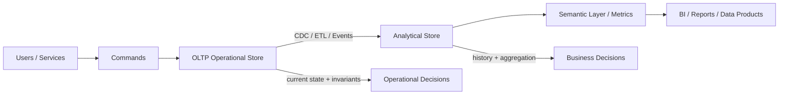

---

## 2. The Core Boundary Question

Do not start with “Should we use a data warehouse?”

Start with:

> What decisions depend on this data, and what correctness contract do those decisions require?

There are different decision types:

| Decision type | Example | Store usually involved |
|---|---|---|
| Operational command | approve payment, assign case | OLTP |
| Operational read | show case detail page | OLTP/read model |
| Near-real-time monitoring | queue backlog, SLA breach | OLTP projection / low-latency mart |
| Management reporting | monthly case volume | OLAP |
| Regulatory/statutory report | official submitted number | governed OLAP with reproducibility |
| Investigation analytics | identify risk pattern | warehouse/lake/search/graph |
| Product analytics | funnel, retention | event warehouse |
| ML feature generation | risk score features | feature store/warehouse |

Boundary is determined by decision risk.

If wrong data causes illegal state or user-facing action error, do not use stale analytical projection as authority.

If query needs broad historical aggregation, do not punish the OLTP system.

---

## 3. Operational Store: What It Must Own

Operational database owns:

- current authoritative state
- command validity
- invariants
- transactional writes
- concurrency control
- workflow state
- access-control-critical facts
- correction path
- audit event generation
- source event/order identity

Example operational tables:

```sql
CREATE TABLE app.case_file (
    case_id bigint generated always as identity primary key,
    case_number text not null unique,
    tenant_id bigint not null,
    case_type_code text not null,
    status text not null,
    priority text not null,
    opened_at timestamptz not null,
    closed_at timestamptz,
    version bigint not null default 0,
    check ((status = 'CLOSED') = (closed_at is not null))
);

CREATE TABLE app.case_transition (
    case_transition_id bigint generated always as identity primary key,
    case_id bigint not null references app.case_file(case_id),
    from_status text not null,
    to_status text not null,
    transition_reason text,
    actor_id bigint not null,
    transitioned_at timestamptz not null,
    command_id uuid not null unique
);
```

The operational schema should care about:

- illegal status prevention
- duplicate command prevention
- transactional correctness
- access control
- audit completeness

It should not be distorted to make quarterly dashboard SQL convenient.

---

## 4. Analytical Store: What It Must Own

Analytical store owns:

- historical facts
- reporting grain
- dimensional context
- metric definitions
- snapshots
- aggregations
- reproducibility
- lineage
- reconciliation
- semantic layer
- report-specific performance

Example analytical tables:

```sql
CREATE TABLE analytics.fact_case_transition (
    case_transition_fact_key bigint generated always as identity primary key,
    case_transition_id bigint not null,
    case_id bigint not null,
    transition_date_key integer not null,
    from_status_key bigint not null,
    to_status_key bigint not null,
    actor_officer_key bigint,
    case_type_key bigint not null,
    region_key bigint not null,
    transition_count integer not null default 1,
    source_loaded_at timestamptz not null,
    unique (case_transition_id)
);
```

Analytical schema should care about:

- correct grain
- business-readable dimensions
- historical interpretation
- query performance for aggregation
- stable metric contracts

It should not be used to decide whether a command is legal right now.

---

## 5. Boundary Anti-Pattern: Reporting Directly on OLTP

Reporting directly on production OLTP feels efficient until it creates hidden coupling.

Failure modes:

### 5.1 Workload Contention

Heavy report scans compete with application transactions for:

- CPU
- memory/cache
- I/O
- locks
- connection pool
- temporary disk
- WAL/checkpoint pressure

Example bad query:

```sql
SELECT
    date_trunc('month', opened_at) AS month,
    case_type_code,
    status,
    count(*)
FROM app.case_file
WHERE opened_at >= now() - interval '3 years'
GROUP BY 1, 2, 3
ORDER BY 1, 2, 3;
```

This may be acceptable on small data. At scale, it becomes an operational risk.

### 5.2 Schema Coupling

Application migration becomes harder because dashboards depend on internal tables.

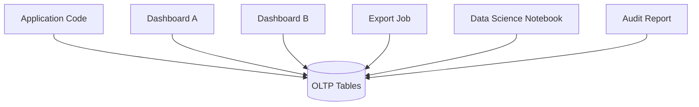

Now `app.case_file.status` cannot be refactored because unknown downstream consumers depend on it.

### 5.3 Metric Drift

Every dashboard defines its own logic.

```sql
-- Dashboard A
WHERE status <> 'CLOSED'

-- Dashboard B
WHERE closed_at IS NULL

-- Dashboard C
WHERE status IN ('OPEN', 'IN_REVIEW', 'ESCALATED')

-- Dashboard D
WHERE status NOT IN ('CLOSED', 'CANCELLED', 'DUPLICATE')
```

They all claim to show “open cases”.

### 5.4 Historical Context Loss

OLTP current state often cannot answer historical questions correctly.

Question:

> How many cases were assigned to Unit A when they were opened last year?

If officer/unit data is overwritten in OLTP, answer may be impossible unless audit/history was designed.

### 5.5 Access Control Confusion

Operational authorization and analytical access are not the same.

A user who can see one case detail may not be allowed to export all cases matching a condition.

---

## 6. Boundary Anti-Pattern: Using Warehouse as Authority

The opposite mistake is using analytical data to make operational decisions.

Bad:

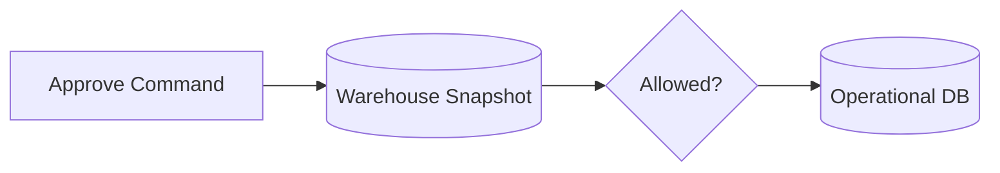

Why risky:

- warehouse may be stale
- load may fail
- dimensions may be Type 1 overwritten
- aggregation may lose row-level detail
- security may be broader than operational scope
- snapshot may represent end-of-day, not current state

Warehouse can inform operations, but should not replace operational truth unless explicitly designed as a serving store with freshness/consistency guarantees.

---

## 7. The Data Movement Boundary

Typical movement patterns:

| Pattern | Latency | Good for | Risk |
|---|---:|---|---|
| Nightly batch ETL | hours/day | stable reporting | stale data |
| Incremental batch | minutes/hours | dashboards | late data complexity |
| CDC streaming | seconds/minutes | near-real-time marts | ordering/replay complexity |
| Transactional outbox | seconds/minutes | domain events/projections | schema/event governance |
| API extraction | variable | small controlled data products | throttling/coupling |
| Direct replica query | low | operational read/report light | stale read + workload coupling |

Architecture must define:

- source of extraction
- ordering guarantee
- idempotency key
- delete semantics
- correction semantics
- schema evolution contract
- PII handling
- replay path
- load observability
- reconciliation

---

## 8. Freshness Contract

Analytical data is almost always stale by some amount.

That is not inherently bad. It is bad when unstated.

Define freshness per data product:

```md
Data Product: Case Backlog Dashboard

Freshness target:
- 5 minutes under normal operation

Freshness SLO:
- 99% of refreshes complete within 10 minutes

Staleness display:
- dashboard must show last successful source watermark

Operational use:
- not valid for legal command authorization
- valid for management monitoring

Failure mode:
- if stale > 30 minutes, dashboard displays degraded banner
```

Freshness metadata table:

```sql
CREATE TABLE analytics_control.data_product_watermark (
    data_product_name text primary key,
    source_system text not null,
    source_high_watermark timestamptz not null,
    last_successful_load_at timestamptz not null,
    last_failed_load_at timestamptz,
    status text not null check (status in ('HEALTHY', 'DEGRADED', 'FAILED')),
    error_message text
);
```

Dashboard should show:

- last refreshed at
- source watermark
- data completeness warning
- provisional period notice

Architectural rule:

> Stale data is acceptable when visible and bounded. Invisible staleness is a correctness bug.

---

## 9. Reproducibility Contract

Some reports must be reproducible.

Examples:

- statutory submissions
- board reports
- financial close
- enforcement performance reports
- audit evidence packages

A report is reproducible when you can answer:

- what source data was used?
- what code/query version produced it?
- what reference data/taxonomy version was used?
- what time window and timezone were used?
- what corrections were included or excluded?
- who approved it?
- can the exact result be regenerated?

Report run table:

```sql
CREATE TABLE analytics_control.report_run (
    report_run_id uuid primary key,
    report_name text not null,
    report_version text not null,
    parameters jsonb not null,
    source_watermarks jsonb not null,
    reference_versions jsonb not null,
    executed_by text not null,
    executed_at timestamptz not null,
    result_hash text not null,
    status text not null check (status in ('RUNNING', 'SUCCEEDED', 'FAILED', 'APPROVED', 'REVOKED'))
);
```

For high-stakes reports, do not rely on mutable dashboards as evidence.

---

## 10. Workload Isolation Patterns

### 10.1 Read Replica for Light Reporting

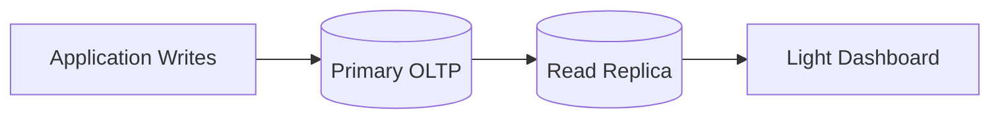

Good for:

- operational read scaling
- admin screens
- low-complexity dashboards
- short queries

Risks:

- replica lag
- schema coupling remains
- heavy queries can still damage replica
- no dimensional modelling
- no governed metric layer

Use when query is close to operational read model and freshness is understood.

### 10.2 Dedicated Reporting Schema in Same Engine

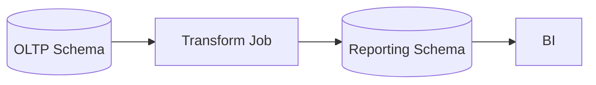

Good for:

- early-stage reporting
- moderate volume
- teams not ready for full warehouse
- controlled marts

Risks:

- same physical database may still share resources
- transform jobs can compete with OLTP
- may become permanent accidental warehouse

### 10.3 Separate Warehouse

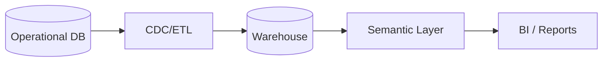

Good for:

- large analytical scans
- historical storage
- dimensional models
- BI workloads
- cross-domain reporting
- governed metrics

Risks:

- data latency
- pipeline complexity
- reconciliation needed
- security duplication
- cost governance

### 10.4 Real-Time Projection Store

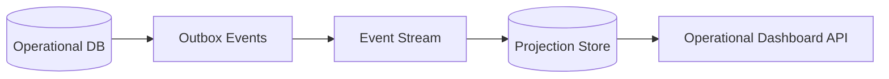

Good for:

- near-real-time operational dashboard
- queue count
- SLA monitoring
- status board

Risks:

- projection drift
- replay complexity
- idempotency bugs
- authorization freshness

---

## 11. Choosing the Boundary Pattern

Decision matrix:

| Requirement | Better pattern |
|---|---|
| exact current state for command | OLTP |
| simple admin list | OLTP read model / replica |
| large historical aggregation | warehouse/mart |
| dashboard refresh every few minutes | CDC/incremental mart |
| real-time queue status | projection store or carefully designed OLTP read model |
| official report | governed warehouse + report run evidence |
| exploratory analysis | warehouse/lakehouse sandbox with governed source |
| ML features | feature store/warehouse with lineage |
| search/filter over documents | search projection |
| graph exploration | graph projection or graph store |

---

## 12. Data Ownership Across the Boundary

Operational domain owns meaning of operational events.

Analytics team may own mart transformation and metrics.

But ownership must be explicit.

Example RACI:

| Asset | Accountable | Responsible | Consulted |
|---|---|---|---|
| `app.case_file` | Case Platform Team | Case Platform Team | Analytics, Compliance |
| `case_opened` event | Case Platform Team | Case Platform Team | Analytics |
| `fact_case_opened` | Analytics Platform | Analytics Platform | Case Platform |
| `dim_case_type` | Governance/Reference Data Team | Analytics Platform | Case Platform, Compliance |
| `metric.average_triage_time` | Operations Analytics | Analytics Platform | Compliance |
| Official monthly report | Regulatory Reporting | Analytics Platform | Case Platform |

Rule:

> Ownership must follow semantic authority, not just table location.

---

## 13. Source Contract for Analytics

Do not let analytics scrape arbitrary tables silently.

Expose stable source contract:

Options:

- CDC contract on selected tables
- domain events
- versioned views
- extract tables
- data product API
- outbox event stream

Example source view:

```sql
CREATE VIEW integration.v_case_opened_v1 AS
SELECT
    c.case_id,
    c.case_number,
    c.tenant_id,
    c.case_type_code,
    c.region_code,
    c.opened_at,
    c.created_by_actor_id,
    c.source_channel,
    c.created_at AS source_record_created_at,
    c.updated_at AS source_record_updated_at
FROM app.case_file c;
```

The view becomes a boundary. Internal OLTP table can evolve behind it.

Contract metadata:

```sql
CREATE TABLE integration.data_contract_registry (
    contract_name text primary key,
    version integer not null,
    owner_team text not null,
    compatibility_policy text not null,
    schema_definition jsonb not null,
    created_at timestamptz not null,
    deprecated_at timestamptz
);
```

---

## 14. CDC vs Domain Events

CDC emits data changes.

Domain events express business meaning.

| Aspect | CDC | Domain event |
|---|---|---|
| Source | database log/table change | application/domain logic |
| Meaning | row changed | business event occurred |
| Coupling | table/schema coupling | event contract coupling |
| Ordering | usually DB commit order per stream/partition | app-defined |
| Best for | replication, projections, warehouse loading | integration, business workflows |
| Risk | low semantic meaning | event design/versioning burden |

Example CDC record says:

> row in `case_file` changed status from `TRIAGE` to `INVESTIGATION`.

Domain event says:

> `CaseAssignedToInvestigation` occurred because triage accepted the case.

Analytics may use either, but do not confuse them.

CDC is excellent for completeness and replay. Domain events are better for semantic intent.

Many systems use both:

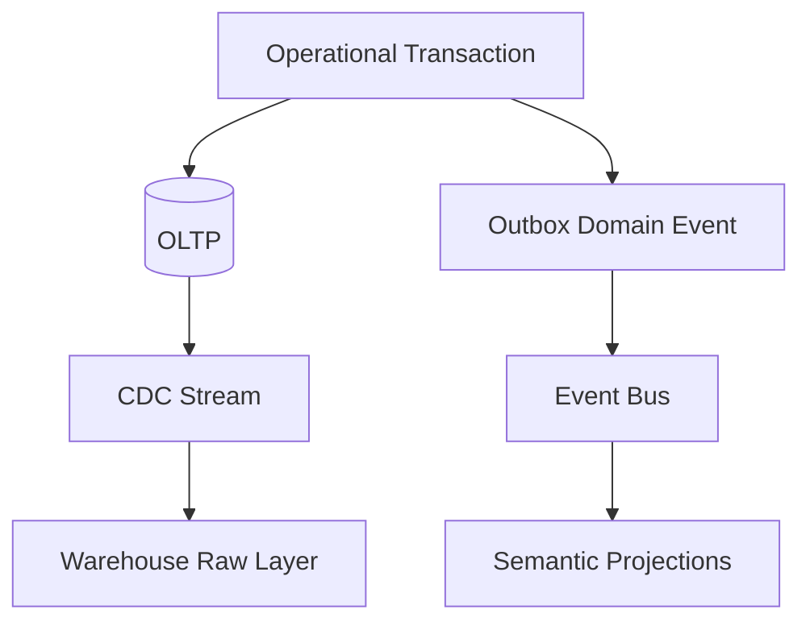

---

## 15. Reporting Correctness Levels

Not all reports need the same rigor.

| Level | Example | Required discipline |
|---|---|---|
| Exploratory | ad-hoc notebook | documented caveat |
| Operational dashboard | queue status | freshness watermark |
| Management dashboard | monthly volume | metric contract + reconciliation |
| Financial/regulatory report | official submission | reproducible run + approval + lineage |
| Legal evidence | case audit package | immutable evidence + provenance |

Do not over-engineer every chart. Do not under-engineer official reports.

Architectural maturity is matching rigor to consequence.

---

## 16. Handling Corrections

Operational systems correct data.

Analytical systems must decide how correction affects history.

Types:

| Correction type | Example | Analytical handling |
|---|---|---|
| Typo correction | wrong display name | Type 1 update |
| Backdated event | case opened date corrected | restate affected facts |
| Legal reclassification | case type changed | Type 2 / taxonomy version |
| Duplicate merge | two cases merged | bridge/merge event + restatement |
| Deletion/erasure | PII removal | privacy workflow across projections |
| Reversal | payment reversed | reversal fact, not silent delete |

Correction event table:

```sql
CREATE TABLE analytics_control.data_restatement_run (
    restatement_run_id uuid primary key,
    reason text not null,
    affected_data_products text[] not null,
    affected_period_start date not null,
    affected_period_end date not null,
    source_change_reference text not null,
    executed_at timestamptz not null,
    executed_by text not null,
    validation_result jsonb not null,
    status text not null
);
```

Rule:

> Analytical history is not always immutable, but every restatement must be explainable.

---

## 17. Security Boundary

Operational access and analytical access differ.

Operational access:

- user sees specific case based on assignment/membership
- user can perform command if role + state + ownership allow
- row-level enforcement often required

Analytical access:

- user may see aggregate only
- user may export data
- user may query across tenants/regions
- user may access de-identified data
- sensitive attributes may need masking

Security patterns:

| Need | Pattern |
|---|---|
| aggregate only | semantic view hides row-level detail |
| tenant isolation | tenant-filtered mart + RLS |
| PII masking | masked dimension or tokenized column |
| export control | separate export permission and audit |
| privileged analytics | controlled break-glass workflow |
| subject erasure | propagation workflow to warehouse/search/cache |

Bad assumption:

> “It is only analytics, so security is less strict.”

Often analytics is more dangerous because it aggregates and exports more data.

---

## 18. Privacy Boundary

Do not blindly copy all OLTP columns into warehouse.

For each column ask:

- Is it needed for a known use case?
- Is it PII/sensitive?
- Can it be minimized?
- Can it be tokenized?
- Can it be aggregated before exposure?
- What is retention period?
- Does it need erasure propagation?
- Does it appear in logs or BI extracts?

Example safer dimension split:

```sql
CREATE TABLE analytics.dim_customer_public (
    customer_key bigint primary key,
    customer_id_hash text not null,
    customer_type text not null,
    risk_segment text,
    country_code text,
    effective_from timestamptz not null,
    effective_to timestamptz,
    is_current boolean not null
);

CREATE TABLE analytics_secure.dim_customer_sensitive (
    customer_key bigint primary key,
    legal_name text,
    email text,
    phone text,
    national_id_token text,
    access_policy text not null
);
```

Most BI users should not need `analytics_secure`.

---

## 19. Performance Boundary

Analytical queries often have different physical needs:

- columnar storage
- partition pruning
- compression
- materialized aggregates
- vectorized execution
- distributed scans
- large memory grants
- workload queues

Operational queries need:

- low-latency index lookup
- short transactions
- stable p99
- predictable write latency
- small working set

If both run in one engine, enforce:

- query timeouts
- statement classes
- resource groups/queues
- replica separation
- reporting windows
- materialized summaries
- connection pool separation
- kill-switch for report users

Example PostgreSQL guardrails:

```sql
ALTER ROLE reporting_user SET statement_timeout = '30s';
ALTER ROLE reporting_user SET idle_in_transaction_session_timeout = '10s';
```

And use separate connection pools:

```text
app-write-pool      -> primary OLTP, strict low-latency
app-read-pool       -> primary/replica, operational reads
reporting-pool      -> replica/warehouse, longer timeout
etl-pool            -> controlled batch windows
admin-pool          -> restricted break-glass
```

---

## 20. Semantic Layer Boundary

The semantic layer is where business metrics become governed interfaces.

It can be implemented through:

- SQL views
- dbt semantic models
- BI semantic model
- metrics service
- cube layer
- data product API

Core responsibilities:

- define metric names
- define formulas
- define grain
- define allowed dimensions
- define filters/exclusions
- define time semantics
- expose lineage
- enforce access
- version changes

Example:

```sql
CREATE VIEW analytics_semantic.case_monthly_volume AS
SELECT
    d.fiscal_year,
    d.fiscal_month,
    r.region_name,
    ct.case_group,
    SUM(f.opened_count) AS cases_opened
FROM analytics.fact_case_opened f
JOIN analytics.dim_date d ON d.date_key = f.opened_date_key
JOIN analytics.dim_region r ON r.region_key = f.region_key
JOIN analytics.dim_case_type ct ON ct.case_type_key = f.case_type_key
WHERE f.is_test_case = false
GROUP BY d.fiscal_year, d.fiscal_month, r.region_name, ct.case_group;
```

If every dashboard writes this from scratch, semantic layer is missing.

---

## 21. Data Product Boundary

A mature organization treats analytical outputs as data products.

Data product contract:

```md
Data Product: Case Monthly Volume

Owner:
- Enforcement Analytics Team

Source:
- Case Platform v_case_opened_v1

Refresh:
- hourly incremental load

Freshness SLO:
- 99% within 90 minutes

Grain:
- one row per month, region, case group

Metric:
- cases_opened = sum fact_case_opened.opened_count excluding test cases

Consumers:
- Operations dashboard
- Monthly board report
- Regulatory performance pack

Access:
- aggregate only for regional managers
- row-level mart access restricted to analytics engineers

Lineage:
- raw.case_opened -> fact_case_opened -> case_monthly_volume

Quality checks:
- monthly count reconciles to source within 0.1%
```

Data product thinking prevents anonymous tables from becoming critical dependencies.

---

## 22. Operational Read Model vs Analytical Mart

CQRS-style read model is not the same as warehouse mart.

| Aspect | Operational read model | Analytical mart |
|---|---|---|
| Purpose | serve application UI/API | serve BI/reporting |
| Freshness | near-real-time | defined by data product |
| Shape | optimized for screen/use case | optimized for analysis/grain |
| Authority | may support user workflow | not command authority |
| Data volume | current/recent state | historical |
| Query | lookup/filter/list | aggregate/scan |
| Ownership | application/domain team | analytics/data team or shared |

Example operational read model:

```sql
CREATE TABLE read_model.case_worklist_item (
    case_id bigint primary key,
    tenant_id bigint not null,
    case_number text not null,
    status text not null,
    priority text not null,
    queue_id bigint not null,
    assigned_to bigint,
    sla_due_at timestamptz,
    last_activity_at timestamptz not null
);
```

Example analytical mart:

```sql
CREATE TABLE analytics.fact_case_daily_snapshot (
    case_id bigint not null,
    snapshot_date_key integer not null,
    status_key bigint not null,
    queue_key bigint not null,
    priority_key bigint not null,
    age_days integer not null,
    open_case_count integer not null,
    primary key (case_id, snapshot_date_key)
);
```

Both may be derived from same source. They serve different contracts.

---

## 23. Boundary Review Method

When reviewing a system, classify every data consumer.

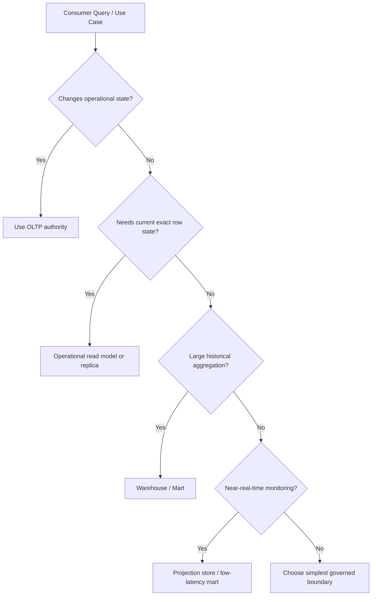

Questions:

1. Who consumes this data?
2. What decision do they make?
3. What is the consequence of wrong/stale data?
4. What is the required freshness?
5. What is the required history?
6. Does query shape threaten OLTP?
7. Does access scope differ from operational access?
8. Does the metric need reproducibility?
9. Who owns the definition?
10. Can it be rebuilt/reconciled?

---

## 24. Example: Case Backlog Dashboard

Requirement:

> Managers need to see open backlog by region, queue, priority, and SLA status.

Bad design:

```sql
SELECT region_code, queue_id, priority, count(*)
FROM app.case_file
WHERE closed_at IS NULL
GROUP BY region_code, queue_id, priority;
```

Problems:

- current-only; cannot show historical trend
- definition of backlog implicit
- status semantics ignored
- query hits operational table
- no freshness/reproducibility
- no SLA snapshot history

Better design:

### 24.1 Operational Source

`case_file`, `case_transition`, `task`, `sla_clock` remain operational.

### 24.2 Daily Snapshot Fact

```sql
CREATE TABLE analytics.fact_case_daily_snapshot (
    snapshot_date_key integer not null,
    case_id bigint not null,
    region_key bigint not null,
    queue_key bigint not null,
    priority_key bigint not null,
    status_key bigint not null,
    sla_status_key bigint not null,
    age_days integer not null,
    open_case_count integer not null default 1,
    primary key (snapshot_date_key, case_id)
);
```

### 24.3 Semantic View

```sql
CREATE VIEW analytics_semantic.case_backlog_daily AS
SELECT
    d.calendar_date,
    r.region_name,
    q.queue_name,
    p.priority_name,
    sla.sla_status_name,
    SUM(f.open_case_count) AS backlog_cases
FROM analytics.fact_case_daily_snapshot f
JOIN analytics.dim_date d ON d.date_key = f.snapshot_date_key
JOIN analytics.dim_region r ON r.region_key = f.region_key
JOIN analytics.dim_queue q ON q.queue_key = f.queue_key
JOIN analytics.dim_priority p ON p.priority_key = f.priority_key
JOIN analytics.dim_sla_status sla ON sla.sla_status_key = f.sla_status_key
JOIN analytics.dim_case_status s ON s.status_key = f.status_key
WHERE s.is_backlog_status = true
GROUP BY d.calendar_date, r.region_name, q.queue_name, p.priority_name, sla.sla_status_name;
```

### 24.4 Freshness Contract

- Near-real-time dashboard: refresh every 5 minutes from projection.
- Historical trend: daily snapshot final after midnight + late correction window.
- Official monthly backlog: frozen report run with source watermark.

One use case may need multiple serving models.

---

## 25. Example: Regulatory Official Monthly Report

Requirement:

> Produce official monthly report of case opened, closed, escalated, and breached SLA by jurisdiction.

Architecture:

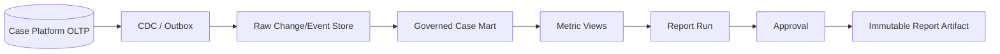

Required tables:

- source raw table
- fact tables
- dimension tables
- metric semantic views
- report run table
- report approval table
- report artifact table
- restatement table

Official report should record:

- report version
- query/model version
- source watermark
- dimension/taxonomy version
- generated file hash
- approver
- approval timestamp
- restatement status

This is not overengineering when report has legal/regulatory consequence.

---

## 26. Migration Boundary

Operational schema evolves. Analytical consumers must not break unexpectedly.

Safe pattern:

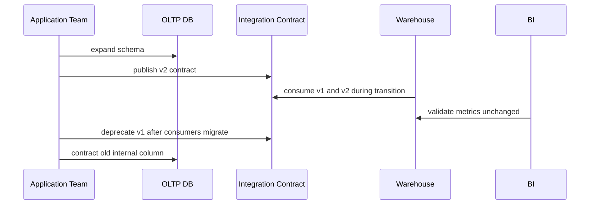

Rules:

- analytics should consume contract, not random internal table
- breaking source changes require versioning
- deprecation needs consumer registry
- warehouse transformation tests must run before OLTP migration contract phase
- metric regression test must compare old/new outputs

---

## 27. Observability Across Boundary

You need end-to-end visibility:

- source change rate
- CDC lag
- ingestion lag
- transform duration
- failed records
- unknown dimension count
- reconciliation diff
- report freshness
- query latency
- dashboard usage
- semantic model errors

Control table:

```sql
CREATE TABLE analytics_control.pipeline_run (
    pipeline_run_id uuid primary key,
    pipeline_name text not null,
    started_at timestamptz not null,
    finished_at timestamptz,
    status text not null,
    source_low_watermark text,
    source_high_watermark text,
    rows_read bigint,
    rows_inserted bigint,
    rows_updated bigint,
    rows_rejected bigint,
    validation_result jsonb,
    error_message text
);
```

Alert examples:

- CDC lag > 15 minutes
- unknown dimension rows > threshold
- daily reconciliation diff > tolerance
- report freshness SLO breach
- sudden drop in fact count
- duplicate source event detected
- load completed but semantic view query fails

---

## 28. Boundary Failure Modes

| Failure | Symptom | Root cause | Mitigation |
|---|---|---|---|
| OLTP slowed by dashboard | app p99 spikes | analytical query on production | workload isolation, warehouse, timeout |
| dashboard number changed | historical report changed | Type 1 overwrite or source correction | SCD, restatement process |
| report stale | last hour missing | pipeline lag invisible | watermark + freshness alert |
| duplicate metrics | count too high | replay without idempotency | source event unique key |
| missing facts | count too low | late dimensions quarantined | unknown row/retry monitoring |
| unauthorized export | data leak | analytics access too broad | masking/RLS/export control |
| schema migration broke BI | dashboard fails | direct dependency on OLTP internals | contract view/versioning |
| official report unreproducible | audit challenge | no report run metadata | report-run artifact + lineage |

---

## 29. Architecture Review Checklist

### Workload

- Which queries are operational and which are analytical?
- Are large scans isolated from OLTP?
- Are timeouts/resource groups defined?
- Are reporting users separated from app users?

### Correctness

- Which store is authoritative for commands?
- Which store is authoritative for metrics?
- Are freshness and staleness visible?
- Are official reports reproducible?

### Data Movement

- What extraction pattern is used?
- Is load idempotent?
- Are deletes/corrections handled?
- Can pipeline replay from source?
- Are schema changes versioned?

### Security

- Is analytical access broader than operational access?
- Is PII minimized/masked?
- Are exports audited?
- Are tenant/region restrictions preserved?

### Ownership

- Who owns source contract?
- Who owns metric definition?
- Who owns mart transformation?
- Who approves official reports?

### Operations

- Are pipeline runs observable?
- Are reconciliation checks automated?
- Are watermarks exposed?
- Is there a stale-report incident runbook?

---

## 30. Practical Heuristics

- Do not let dashboards depend on internal OLTP tables by accident.
- Do not use warehouse projections for command authorization.
- Do not hide staleness; expose watermarks everywhere.
- Do not treat CDC as semantic event design.
- Do not copy every PII field into analytics “just in case”.
- Do not let each dashboard define metrics independently.
- Use read replicas for operational read scaling, not as permanent warehouse substitute.
- Use governed marts for high-value repeated reporting.
- Use report run metadata for official reports.
- Make every boundary explicit: source, contract, freshness, ownership, security, reconciliation.

---

## 31. Closing Mental Model

Operational and analytical systems are both “databases”, but they are not the same product.

Operational database is a **state machine and invariant enforcement engine**.

Analytical database is a **measurement and interpretation engine**.

Top-tier database architects do not collapse those responsibilities accidentally. They design the boundary deliberately.

The mature question is not:

> “Can the production database answer this query?”

The mature question is:

> “Should this query be answered by the operational authority, an operational read model, a projection store, a governed mart, or an official reproducible reporting pipeline?”

That question is the difference between a database that survives scale and a database that becomes an accidental dependency swamp.
