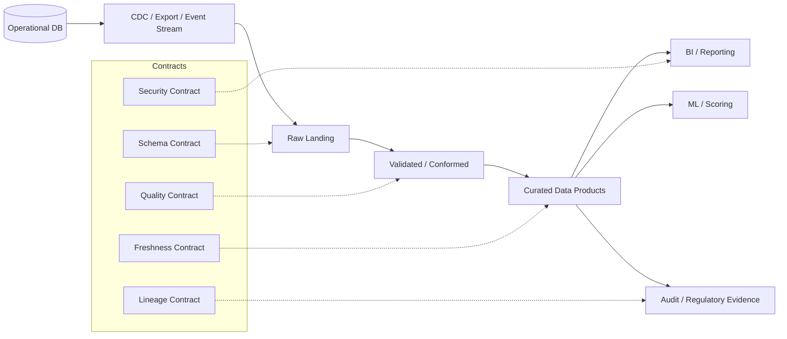
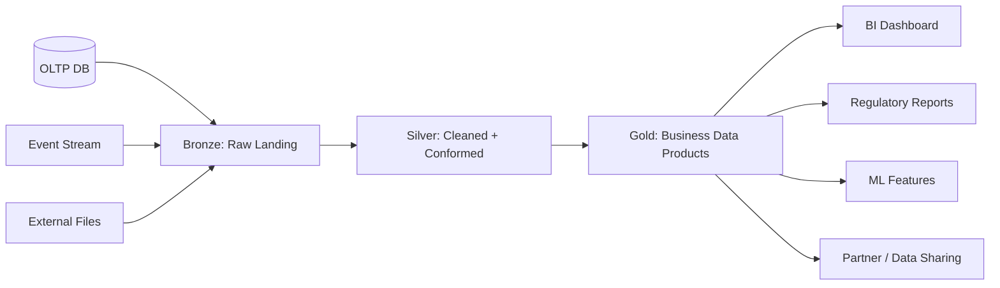
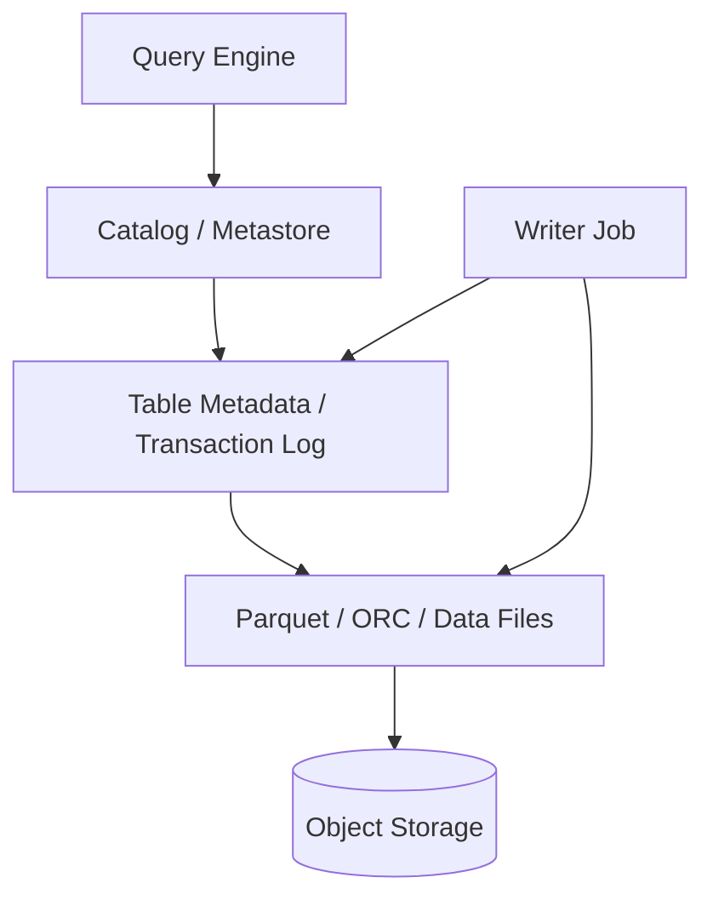
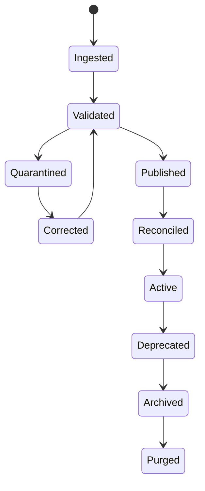
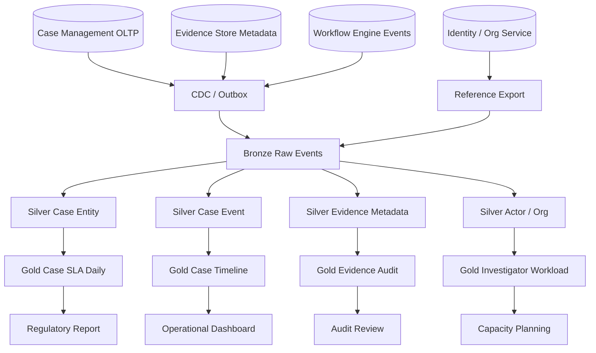

# Part 067 — Data Lakehouse and Warehouse Architecture

> Target: setelah bagian ini, kamu tidak hanya tahu istilah *data lake*, *warehouse*, dan *lakehouse*. Kamu harus bisa mendesain analytical platform yang punya boundary jelas terhadap OLTP, punya freshness contract, dapat direkonsiliasi, aman untuk compliance, murah dioperasikan, dan bisa dipercaya untuk decision-making.

Bagian sebelumnya membedakan **operational data boundary** dan **analytical data boundary**. Sekarang kita masuk ke desain platform analitiknya.

Database operational menjawab:

- apakah command valid?
- apakah invariant terjaga?
- apakah state sekarang benar?
- apakah transaksi berhasil?

Platform analitik menjawab:

- apa yang terjadi dalam periode tertentu?
- apa tren, cohort, funnel, dan distribusinya?
- apa laporan yang dapat direproduksi?
- apa dataset terpercaya untuk analyst, reporting, ML, dan audit?

Kesalahan besar di banyak organisasi: menganggap data platform hanya sebagai tempat “copy semua tabel produksi”. Itu bukan architecture. Itu hanya landfill.

Lakehouse/warehouse yang benar adalah **contracted analytical system**: punya layer, grain, quality gate, lineage, semantic meaning, access control, retention, freshness, dan ownership.

---

## 1. Mental model: analytical platform adalah production system juga

Analytical platform sering dianggap lebih longgar daripada OLTP karena “tidak melayani request user langsung”. Ini keliru.

Di organisasi matang, analytical platform memengaruhi:

- regulatory report,
- executive metric,
- enforcement prioritization,
- fraud scoring,
- customer segmentation,
- operational dashboard,
- capacity planning,
- financial reconciliation,
- audit evidence.

Jika data analitik salah, keputusan bisnis salah. Jika lineage tidak jelas, laporan tidak defensible. Jika freshness tidak jelas, operasi membaca masa lalu seolah-olah masa kini.

Mental model yang lebih kuat:



A good analytical architecture is not “one database for reports”. It is a pipeline of truth refinement.

---

## 2. Lake, warehouse, lakehouse: bukan sekadar teknologi

### 2.1 Data warehouse

Warehouse adalah analytical system dengan model terstruktur, SQL-first, optimized untuk query/reporting.

Typical traits:

- schema cukup ketat,
- data curated,
- semantic layer kuat,
- query engine mature,
- access governance jelas,
- digunakan untuk BI dan reporting,
- cocok untuk star schema/fact-dimension.

Warehouse biasanya bagus ketika:

- metric harus stabil,
- banyak analyst pakai SQL,
- data sudah cukup terstruktur,
- reporting reproducibility penting,
- workload aggregation/join dominan.

Contoh engine/platform: Snowflake, BigQuery, Redshift, Azure Synapse, PostgreSQL-based analytical store, ClickHouse, DuckDB untuk local/embedded analytics.

### 2.2 Data lake

Data lake adalah storage-centric architecture untuk menyimpan data dalam banyak format, biasanya di object storage.

Typical traits:

- cheaper storage,
- format fleksibel,
- cocok untuk raw data,
- batch dan ML-friendly,
- bisa menyimpan structured/semi-structured/unstructured,
- governance sering menjadi tantangan jika tidak didesain.

Lake buruk jika hanya menjadi dump zone.

Lake yang sehat punya:

- ingestion contract,
- catalog,
- partitioning,
- schema tracking,
- retention,
- quality gates,
- lineage,
- access policy,
- lifecycle policy.

### 2.3 Lakehouse

Lakehouse mencoba menggabungkan fleksibilitas data lake dengan kemampuan warehouse: ACID-like table management, schema evolution/enforcement, scalable metadata, batch/stream unification, dan SQL access di atas object storage.

Open table formats seperti Delta Lake, Apache Iceberg, dan Apache Hudi muncul untuk membuat data lake lebih mirip database table: punya transaction log/metadata, snapshot, schema evolution, partition evolution, dan time travel tergantung format/engine.

Lakehouse is useful when:

- data volume besar,
- object storage economics penting,
- batch + streaming perlu disatukan,
- ML dan BI memakai dataset yang sama,
- multi-engine access diperlukan,
- reproducibility/snapshot penting.

Tetapi lakehouse bukan magic. Banyak table format memberi atomicity pada level table/snapshot, tetapi desain pipeline multi-table, semantic correctness, privacy, dan governance tetap harus kamu bangun.

---

## 3. Warehouse vs lakehouse decision matrix

| Pertanyaan | Lebih condong warehouse | Lebih condong lake/lakehouse |
|---|---|---|
| Data highly structured? | Ya | Tidak selalu |
| Banyak ad-hoc BI SQL? | Ya | Bisa, tergantung engine |
| Banyak raw/semi-structured/log/file? | Bisa, tapi kurang ideal | Ya |
| Object storage cost penting? | Kadang | Ya |
| ML feature pipeline dominan? | Bisa | Sering lebih cocok |
| Multi-engine read penting? | Terbatas vendor/platform | Ya, terutama open table format |
| Governance sederhana dibutuhkan cepat? | Warehouse managed sering unggul | Lakehouse perlu discipline |
| Reproducible snapshot penting? | Bisa | Sangat cocok jika table format mendukung snapshot/time travel |
| Real-time serving latency rendah? | Biasanya bukan | Biasanya bukan; butuh serving store/projection |

Rule praktis:

> Warehouse bagus untuk governed analytics. Lakehouse bagus untuk governed analytical storage at scale. Keduanya bukan replacement untuk OLTP atau low-latency serving store.

---

## 4. Medallion architecture: bronze, silver, gold

Medallion architecture mengorganisasi data dalam layer yang meningkat kualitasnya secara progresif:

- **Bronze**: raw/landing data; fidelity tinggi terhadap source.
- **Silver**: cleaned, validated, conformed; entity lebih stabil.
- **Gold**: business-ready data products; metric/reporting/serving-oriented.



Jangan perlakukan medallion sebagai folder convention saja. Ia adalah quality boundary.

### 4.1 Bronze layer contract

Bronze harus menjawab:

- data datang dari source mana?
- kapan diekstrak?
- offset/LSN/event id-nya apa?
- schema source versi berapa?
- apakah data full snapshot atau delta?
- apakah record deleted/tombstone?
- apakah data encrypted/masked?
- apakah ingestion idempotent?

Bronze should preserve source truth as much as possible.

Contoh bronze table fields:

```sql
CREATE TABLE bronze_case_event_raw (
  ingestion_id        uuid        NOT NULL,
  source_system       text        NOT NULL,
  source_table        text        NOT NULL,
  source_pk           text        NOT NULL,
  source_lsn          text,
  source_operation    text        NOT NULL, -- insert/update/delete/snapshot
  source_event_time   timestamptz,
  ingested_at         timestamptz NOT NULL DEFAULT now(),
  schema_version      text        NOT NULL,
  payload             jsonb       NOT NULL,
  payload_hash        text        NOT NULL,
  PRIMARY KEY (source_system, source_table, source_pk, source_lsn)
);
```

Bronze bukan tempat validasi bisnis berat. Bronze adalah **evidence of what arrived**.

### 4.2 Silver layer contract

Silver melakukan normalisasi analitik:

- parse typed columns,
- standardize time zone,
- validate required fields,
- deduplicate,
- resolve reference data,
- conform entity identity,
- classify invalid/quarantined records,
- apply privacy tagging,
- maintain lineage to bronze.

Contoh silver table:

```sql
CREATE TABLE silver_case_event (
  case_event_id       uuid        PRIMARY KEY,
  source_system       text        NOT NULL,
  source_event_id     text        NOT NULL,
  case_id             uuid        NOT NULL,
  tenant_id           uuid        NOT NULL,
  event_type          text        NOT NULL,
  event_time          timestamptz NOT NULL,
  actor_id            uuid,
  payload             jsonb       NOT NULL,
  quality_status      text        NOT NULL CHECK (quality_status IN ('valid', 'quarantined', 'corrected')),
  bronze_ref          text        NOT NULL,
  processed_at        timestamptz NOT NULL,
  UNIQUE (source_system, source_event_id)
);
```

Silver is where data becomes reliable enough to join.

### 4.3 Gold layer contract

Gold adalah data product. Ia harus punya owner, SLA/freshness, metric definition, access classification, lineage, dan consumer list.

Contoh gold product:

```sql
CREATE TABLE gold_case_sla_daily (
  tenant_id                uuid        NOT NULL,
  report_date             date        NOT NULL,
  case_type               text        NOT NULL,
  opened_count            bigint      NOT NULL,
  closed_count            bigint      NOT NULL,
  breached_sla_count      bigint      NOT NULL,
  avg_resolution_seconds  numeric(18,2),
  computed_at             timestamptz NOT NULL,
  source_watermark        timestamptz NOT NULL,
  metric_version          text        NOT NULL,
  PRIMARY KEY (tenant_id, report_date, case_type, metric_version)
);
```

Gold is not “final forever”. It is a versioned contract for consumption.

---

## 5. Raw fidelity vs business correctness

A strong lakehouse keeps two truths separate:

1. **Source fidelity**: what the source system emitted.
2. **Business correctness**: what the organization believes after validation, correction, standardization, and reconciliation.

Never overwrite raw evidence just because business interpretation changed.

Bad pattern:

```text
Source emits wrong status -> bronze overwritten with corrected status
```

Better pattern:

```text
Bronze preserves source event
Silver records correction / quarantine / normalized value
Gold recomputes metric using corrected interpretation
```

For regulated systems, this distinction is critical. You often need to prove:

- original data received,
- transformation applied,
- correction reason,
- responsible actor/system,
- affected reports,
- recomputation timestamp.

---

## 6. Table format mental model: files are not enough

Plain files in object storage are not a database table.

A table needs:

- schema,
- partition metadata,
- file list,
- snapshot/version,
- commit protocol,
- concurrent writer handling,
- delete/update semantics,
- statistics,
- compaction lifecycle,
- metadata cleanup.

Open lakehouse table formats solve parts of this problem.



### 6.1 Delta Lake mental model

Delta Lake extends Parquet data files with a transaction log that tracks table changes and supports ACID transactions and scalable metadata handling. The transaction log lets engines reason about which files belong to which table version.

### 6.2 Apache Iceberg mental model

Iceberg uses table metadata and snapshots to describe table state. It was designed for huge analytic tables and supports features such as hidden partitioning, schema evolution, snapshot isolation, and time travel depending on engine/catalog integration.

### 6.3 Hudi mental model

Hudi focuses strongly on incremental processing, upserts, deletes, and streaming ingestion use cases. It is often considered when near-real-time ingestion and record-level mutation patterns are central.

Do not choose by brand. Choose by:

- engine compatibility,
- mutation workload,
- streaming/batch needs,
- catalog ecosystem,
- governance integration,
- compaction cost,
- operational skill,
- multi-table transaction requirements,
- time-travel and rollback requirements.

---

## 7. File layout and partitioning

Partitioning in lake/warehouse is about pruning files/partitions. Wrong partitioning creates too many files, too much metadata, or poor pruning.

Good partition candidates:

- date/time bucket,
- tenant or region only if controlled cardinality,
- domain category with stable values,
- ingestion date for raw layer,
- event date for analytics.

Bad partition candidates:

- high-cardinality user id,
- every tenant when tenants are many and small,
- timestamp to minute/second,
- volatile status,
- fields often updated.

### 7.1 Bronze partitioning

Bronze often partitions by ingestion date/source:

```text
s3://lake/bronze/source=case-service/table=case_event/ingestion_date=2026-07-05/...
```

This supports replay and operational ingestion management.

### 7.2 Silver partitioning

Silver often partitions by event date or domain date:

```text
s3://lake/silver/domain=case/case_event/event_date=2026-07-05/...
```

This supports analytical query pruning.

### 7.3 Gold partitioning

Gold depends on consumer query pattern:

```text
s3://lake/gold/case_sla_daily/report_date=2026-07-05/...
```

Gold partitioning should optimize report/dashboard workload, not ingestion convenience.

---

## 8. Small files problem

Object storage is not a row-store database. Too many tiny files cause:

- high metadata overhead,
- slow planning,
- inefficient scans,
- poor compression,
- excessive object listing,
- high query startup latency.

Common causes:

- micro-batch writes too frequently,
- partition cardinality too high,
- streaming sink creates small files,
- one file per tenant,
- no compaction job,
- late-arriving data creates scattered files.

Mitigations:

- compact files periodically,
- tune batch size,
- reduce partition cardinality,
- use clustering/sorting where supported,
- separate raw ingestion layout from curated query layout,
- monitor file count per table/partition.

Architectural invariant:

> A lakehouse table is healthy only if its metadata and file layout are healthy.

---

## 9. Schema evolution in lakehouse/warehouse

Schema evolution is not just “add column”. You need compatibility rules.

Safe-ish changes:

- add nullable column,
- add field with default in curated layer,
- add new enum/status if consumers tolerate unknown,
- widen numeric/text field when engine supports it,
- add new table/data product.

Dangerous changes:

- rename column,
- change type,
- change metric meaning,
- change grain,
- split/merge identifiers,
- change timezone semantics,
- delete field,
- reinterpret null,
- mutate historical facts without versioning.

Schema evolution contract:

```yaml
data_product: gold_case_sla_daily
version: 2
owner: enforcement-data-platform
compatibility:
  backward: true
  forward: partial
changes:
  - added_column: reopened_count
  - metric_semantics_changed: false
consumers:
  - executive_dashboard
  - regulator_monthly_report
freshness_sla: P1D
quality_rules:
  - opened_count >= 0
  - closed_count >= 0
  - source_watermark is not null
```

---

## 10. Data quality gates

Each layer should have quality rules appropriate to its purpose.

### 10.1 Bronze quality

Bronze validates ingestion mechanics:

- payload parseable,
- source metadata present,
- unique event key,
- payload hash stored,
- schema version captured,
- ingestion time captured.

Bronze should not drop source data just because domain validation fails. Quarantine instead.

### 10.2 Silver quality

Silver validates domain usability:

- required identifiers present,
- event time valid,
- reference codes resolvable,
- duplicates removed,
- deleted/tombstone interpreted,
- PII tags assigned,
- invalid records quarantined.

### 10.3 Gold quality

Gold validates business product correctness:

- metric sums reconcile,
- grain uniqueness holds,
- freshness SLA met,
- no duplicate dimension join multiplication,
- data product contract satisfied,
- metric version explicit,
- report can be reproduced.

Quality should be executable, not tribal knowledge.

---

## 11. Reconciliation design

Analytical systems drift. Sources change. Pipelines fail. CDC misses events if misconfigured. Backfills duplicate rows. Late data arrives.

Reconciliation is a first-class architecture concern.

Types:

- **row count reconciliation**: source vs target counts by time window.
- **hash reconciliation**: checksum/hash over stable fields.
- **sum reconciliation**: financial/quantity totals.
- **state reconciliation**: current operational state vs analytical latest state.
- **metric reconciliation**: dashboard metric vs canonical report.
- **lineage reconciliation**: every gold row traceable to silver/bronze inputs.

Example reconciliation table:

```sql
CREATE TABLE data_reconciliation_run (
  reconciliation_run_id uuid PRIMARY KEY,
  source_name           text NOT NULL,
  target_name           text NOT NULL,
  window_start          timestamptz NOT NULL,
  window_end            timestamptz NOT NULL,
  source_row_count      bigint,
  target_row_count      bigint,
  source_checksum       text,
  target_checksum       text,
  status                text NOT NULL CHECK (status IN ('matched', 'mismatched', 'warning')),
  diff_summary          jsonb,
  executed_at           timestamptz NOT NULL DEFAULT now()
);
```

Without reconciliation, your platform asks users to trust a black box.

---

## 12. Freshness and watermark design

Freshness must be explicit. “Updated daily” is not enough.

A dataset should expose:

- `computed_at`: when target was computed,
- `source_watermark`: latest source event included,
- `ingestion_watermark`: latest ingested record included,
- `pipeline_run_id`: producing run,
- `quality_status`: valid/degraded/partial,
- `metric_version`: semantic version.

Example:

```sql
CREATE TABLE data_product_run (
  data_product_name    text NOT NULL,
  data_product_version text NOT NULL,
  pipeline_run_id      uuid NOT NULL,
  run_status           text NOT NULL,
  started_at           timestamptz NOT NULL,
  finished_at          timestamptz,
  source_watermark     timestamptz,
  row_count            bigint,
  quality_summary      jsonb NOT NULL,
  PRIMARY KEY (data_product_name, data_product_version, pipeline_run_id)
);
```

Dashboard should show freshness. Reports should record freshness. ML features should know freshness.

---

## 13. Snapshot and reproducibility

For regulatory reports, “current data” is not enough. You need reproducible snapshots.

A report should answer:

- dataset version used,
- table snapshot/time travel version,
- code version,
- parameter set,
- reference data version,
- generated timestamp,
- approver/reviewer,
- correction/reissue history.

Report run table:

```sql
CREATE TABLE report_run (
  report_run_id        uuid PRIMARY KEY,
  report_name          text NOT NULL,
  report_version       text NOT NULL,
  parameter_json       jsonb NOT NULL,
  data_snapshot_ref    text NOT NULL,
  code_version         text NOT NULL,
  reference_data_ref   text NOT NULL,
  generated_at         timestamptz NOT NULL,
  generated_by         text NOT NULL,
  status               text NOT NULL CHECK (status IN ('draft', 'approved', 'submitted', 'reissued'))
);
```

In mature systems, a report is not just a PDF/CSV. It is an evidence object with provenance.

---

## 14. Governance and catalog

A data catalog is not a UI decoration. It is the control plane for meaning.

Minimum catalog metadata:

- dataset name,
- owner,
- description,
- source systems,
- layer,
- schema,
- primary grain,
- freshness SLA,
- quality rules,
- classification/PII,
- retention,
- access policy,
- lineage,
- consumers,
- deprecation status,
- semantic version.

Example dataset contract:

```yaml
name: gold.case_sla_daily
layer: gold
owner: enforcement-analytics
primary_grain:
  - tenant_id
  - report_date
  - case_type
freshness_sla: "daily by 07:00 Asia/Jakarta"
source_watermark_policy: "include events <= previous day 23:59:59 UTC"
classification: confidential
pii: false
retention: P7Y
quality_rules:
  - unique_grain
  - non_negative_counts
  - source_watermark_present
consumers:
  - monthly_regulatory_report
  - executive_case_dashboard
lineage:
  upstream:
    - silver.case_event
    - silver.case
semantic_version: "1.3.0"
```

Without catalog, teams discover data by folklore. Folklore does not scale.

---

## 15. Access control and privacy in analytics

Analytical platforms are high-risk because they aggregate data.

Risks:

- broad access to copied PII,
- exports outside controlled systems,
- unmasked raw data in bronze,
- analysts joining data into sensitive derived attributes,
- old snapshots retaining deleted data,
- ML feature tables leaking protected fields,
- dashboard filters exposing tenant/customer info,
- cross-region data residency violation.

Controls:

- classify columns and datasets,
- separate raw restricted zone,
- mask/tokenize sensitive fields,
- row/column-level access where platform supports it,
- publish curated de-identified products,
- log and review access,
- govern exports,
- propagate retention/delete policies,
- keep privacy lineage.

Do not assume “analytics copy” is less sensitive than OLTP. Often it is more sensitive because it is broader.

---

## 16. Cost architecture

Lakehouse/warehouse cost comes from:

- storage,
- compute scans,
- metadata operations,
- compaction,
- streaming jobs,
- query concurrency,
- data transfer,
- retention,
- duplicate data products,
- inefficient dashboards,
- unbounded exploration queries.

Cost controls:

- partition pruning,
- file compaction,
- columnar format,
- predicate pushdown,
- curated aggregate tables,
- materialized gold products,
- workload isolation,
- query limits/quotas,
- lifecycle policies,
- archive cold data,
- data product ownership.

Anti-pattern:

```text
Every dashboard scans all raw events every refresh.
```

Better:

```text
Raw events -> daily aggregate -> dashboard reads bounded gold table.
```

---

## 17. Lakehouse operational lifecycle

A table needs lifecycle jobs:

- ingest,
- validate,
- transform,
- compact,
- optimize/clustering,
- vacuum/expire old files,
- reconcile,
- publish,
- catalog update,
- access audit,
- retention purge,
- backfill/reprocess.



If no one owns lifecycle jobs, the lakehouse decays.

---

## 18. Batch, streaming, and incremental pipelines

### 18.1 Batch pipeline

Batch is simpler and often enough for reporting.

Use batch when:

- freshness SLA is hourly/daily,
- correction/reconciliation more important than latency,
- data volume can be processed within window,
- operations prefer deterministic run boundaries.

### 18.2 Streaming pipeline

Streaming is useful when:

- near-real-time dashboard matters,
- downstream alerting depends on event delay,
- CDC flow must update projections quickly,
- operational feedback loop depends on analytics.

Streaming adds complexity:

- watermarking,
- late events,
- duplicate events,
- state store,
- exactly-once illusion,
- checkpoint recovery,
- backpressure,
- schema evolution while stream runs.

### 18.3 Incremental processing

Incremental processing is often the best middle ground.

Pattern:

```text
Read changes since previous watermark
Transform changed window/entity
Merge into target
Update watermark only after successful commit
Reconcile affected window/entity
```

Design invariant:

> Incremental pipeline must be replayable and idempotent.

---

## 19. Late-arriving data and correction

Analytical data often arrives late:

- source emits delayed event,
- CDC connector was down,
- batch file received late,
- manual correction entered after period closed,
- reference data changed retroactively.

Do not silently mutate closed reports.

Patterns:

- watermark with allowed lateness,
- correction table,
- report reissue process,
- metric versioning,
- period close lock,
- adjustment row instead of rewrite,
- affected report impact analysis.

Example correction event:

```sql
CREATE TABLE analytical_correction_event (
  correction_id      uuid PRIMARY KEY,
  target_dataset     text NOT NULL,
  target_key         jsonb NOT NULL,
  correction_type    text NOT NULL,
  reason_code        text NOT NULL,
  reason_detail      text,
  requested_by       text NOT NULL,
  approved_by        text,
  applied_at         timestamptz,
  impact_summary     jsonb
);
```

---

## 20. Data product architecture

A data product is not just a table. It is a governed contract.

A proper data product includes:

- dataset/table,
- schema,
- semantic definitions,
- owner,
- SLA,
- quality checks,
- lineage,
- access policy,
- retention,
- documentation,
- example queries,
- deprecation policy,
- support channel,
- consumer impact process.

Data product readiness checklist:

- [ ] grain is documented,
- [ ] owner is assigned,
- [ ] freshness visible,
- [ ] quality rules pass,
- [ ] lineage exists,
- [ ] access classification exists,
- [ ] metric semantics versioned,
- [ ] reconciliation method exists,
- [ ] sample queries are provided,
- [ ] consumers are registered.

---

## 21. Reference architecture: regulatory case analytics



Key design choices:

- OLTP remains source of truth for active case state.
- Bronze preserves raw events and CDC metadata.
- Silver conforms identity, case, workflow, and evidence entities.
- Gold publishes data products with specific grains.
- Reports store snapshot references.
- Quality and reconciliation run per reporting period.
- PII and evidence-sensitive fields are masked or excluded from general gold products.

---

## 22. Common failure modes

### Failure mode 1: raw lake becomes landfill

Symptoms:

- no catalog,
- no owner,
- no schema history,
- no quality checks,
- impossible to know trusted dataset.

Fix:

- define layers,
- assign ownership,
- register datasets,
- introduce quality gates,
- publish curated gold products.

### Failure mode 2: gold metric changes silently

Symptoms:

- dashboard number changes after “small transformation fix”,
- report cannot be reproduced,
- consumers not notified.

Fix:

- metric versioning,
- semantic changelog,
- report snapshot,
- consumer registry.

### Failure mode 3: lakehouse used as OLTP serving store

Symptoms:

- user-facing requests depend on object storage scan,
- latency unpredictable,
- concurrency poor,
- operational workflows wait for analytics refresh.

Fix:

- introduce serving store/projection,
- separate analytics and operational query boundary.

### Failure mode 4: no freshness contract

Symptoms:

- dashboard says “today” but source watermark is yesterday,
- users make wrong operational decisions,
- stale data not visible.

Fix:

- expose `source_watermark`,
- dashboard freshness banner,
- SLA alerts.

### Failure mode 5: privacy deletion not propagated

Symptoms:

- OLTP data deleted/anonymized,
- lake snapshots still contain PII,
- exports retain old data.

Fix:

- privacy lineage,
- deletion propagation,
- retention policy per layer,
- controlled snapshots,
- legal/backup exception documentation.

---

## 23. Architecture review checklist

Use this when reviewing lakehouse/warehouse design.

### Source and ingestion

- [ ] Source systems are identified.
- [ ] Ingestion mode is explicit: CDC, batch, event, file.
- [ ] Source schema version is captured.
- [ ] Ingestion is idempotent.
- [ ] Replay strategy exists.
- [ ] Delete/tombstone semantics are defined.

### Layering

- [ ] Bronze preserves raw fidelity.
- [ ] Silver has validation and conformance rules.
- [ ] Gold products have explicit consumers.
- [ ] Quarantine path exists.
- [ ] Correction path exists.

### Table design

- [ ] Partitioning matches query pattern.
- [ ] Small file mitigation exists.
- [ ] Compaction/optimization lifecycle exists.
- [ ] Schema evolution rules exist.
- [ ] Snapshot/time travel policy exists if required.

### Quality and reconciliation

- [ ] Quality rules are executable.
- [ ] Reconciliation is defined.
- [ ] Freshness/watermark is exposed.
- [ ] Metric version is explicit.
- [ ] Report reproducibility is supported.

### Governance

- [ ] Dataset owner is assigned.
- [ ] Catalog metadata exists.
- [ ] PII classification exists.
- [ ] Access policy exists.
- [ ] Retention policy exists.
- [ ] Lineage exists.

### Operations

- [ ] Pipeline failure alerts exist.
- [ ] Backfill strategy exists.
- [ ] Cost controls exist.
- [ ] Consumer communication exists.
- [ ] Deprecation policy exists.

---

## 24. Practical design heuristics

1. Do not let raw data become the public interface.
2. Treat bronze as evidence, silver as conformance, gold as product.
3. Put metric definitions under version control.
4. Prefer append/correction over silent historical rewrite for regulated reports.
5. Expose freshness everywhere data is consumed.
6. Separate analytical storage from low-latency serving.
7. Monitor table health: file count, size, partition count, compaction debt.
8. Govern access by dataset classification, not by convenience.
9. Make every gold table answer: who owns me, who uses me, how fresh am I, can I be reproduced?
10. Never call something “single source of truth” unless correction, lineage, and reconciliation are designed.

---

## 25. Mini exercise

Take one operational system, for example case management.

Design:

1. Bronze tables for raw case event, task event, evidence event.
2. Silver conformed `case`, `case_event`, `task`, `evidence_metadata`.
3. Gold products:
   - `case_sla_daily`,
   - `case_backlog_by_queue`,
   - `investigator_workload_daily`,
   - `evidence_chain_audit`.
4. Freshness fields for each gold table.
5. Reconciliation rules between OLTP source and silver/gold.
6. Retention and PII classification.

Then answer:

- which dataset is safe for dashboard?
- which dataset is safe for regulator report?
- which dataset is safe for ML feature generation?
- which dataset should almost nobody read directly?

If your answer is “bronze for everything”, redesign.

---

## 26. References

- Databricks Docs — Medallion lakehouse architecture: https://docs.databricks.com/aws/en/lakehouse/medallion
- Delta Lake Docs — Delta Lake overview: https://docs.delta.io/
- Databricks Docs — Delta Lake transaction log and ACID overview: https://docs.databricks.com/aws/en/delta/
- Apache Iceberg Docs: https://iceberg.apache.org/docs/latest/
- PostgreSQL Docs — Materialized Views: https://www.postgresql.org/docs/current/rules-materializedviews.html
- PostgreSQL Docs — `REFRESH MATERIALIZED VIEW`: https://www.postgresql.org/docs/current/sql-refreshmaterializedview.html
