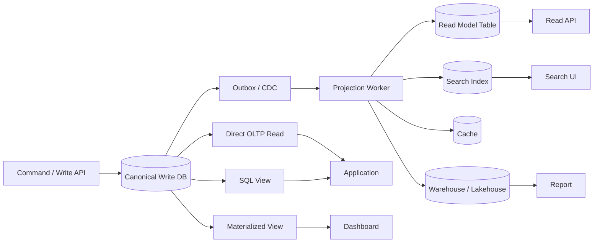
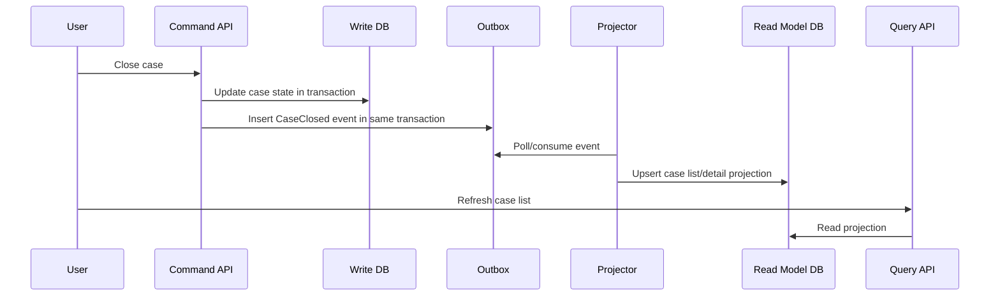
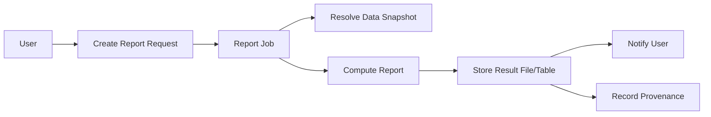
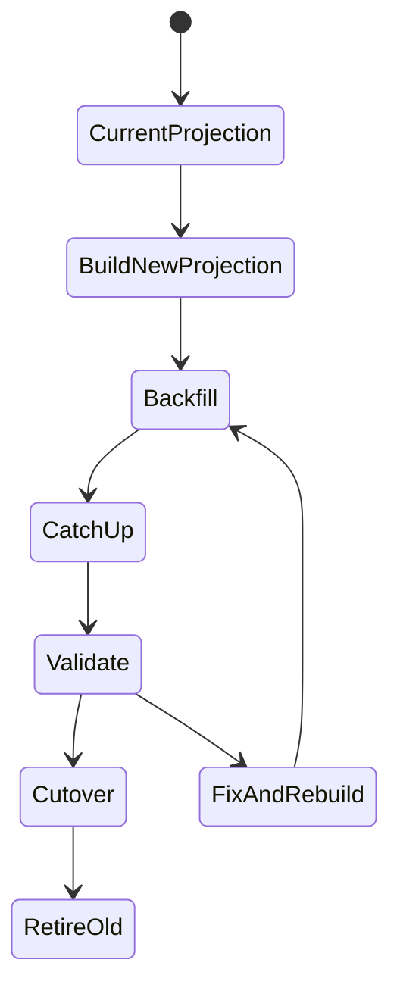

# Part 068 — Query Serving Patterns

> Target: setelah bagian ini, kamu bisa memilih dan mendesain pola query-serving yang tepat: kapan cukup query OLTP langsung, kapan pakai view/materialized view, kapan membuat aggregate table, kapan memakai CQRS read model, kapan memakai search projection, dan bagaimana menjaga freshness, correctness, rebuildability, serta operational safety.

Query serving adalah boundary antara **data yang benar** dan **data yang cepat/nyaman dibaca**.

Sistem produksi jarang hanya punya satu jenis query. Biasanya ada:

- command path: create/update/delete,
- detail read: buka satu record,
- list/search: filter/sort/pagination,
- dashboard: aggregate cepat,
- report: reproducible dan auditable,
- export: large result async,
- search: full-text/fuzzy/vector,
- operational queue: claim next task,
- analytics: scan besar,
- API consumer query: stable contract.

Memaksa semua query melewati schema OLTP yang sama adalah salah satu penyebab database menjadi lambat, rapuh, dan sulit berevolusi.

---

## 1. Core mental model

Write model dan read model sering punya kebutuhan berbeda.

Write model butuh:

- invariant kuat,
- transactional integrity,
- normalized relation,
- minimal duplication,
- conflict handling,
- audit path,
- precise lifecycle.

Read model butuh:

- shape sesuai UI/API/report,
- query cepat,
- pagination stabil,
- filtering mudah,
- denormalized fields,
- precomputed aggregate,
- search-friendly document,
- freshness yang cukup.

Pola query serving mengakui perbedaan ini.



Architectural rule:

> Query-serving data may be derived, but its derivation must be explicit, observable, and rebuildable.

---

## 2. Pattern selection matrix

| Need | Suitable pattern | Warning |
|---|---|---|
| Read one row by primary key | Direct OLTP read | Keep projection width small |
| Read joined detail page | Direct read or SQL view | Watch join fan-out |
| Stable reusable SQL abstraction | View | Does not store result; query still runs |
| Fast aggregate dashboard | Materialized view or aggregate table | Refresh/freshness contract required |
| High-write + high-read API shape differs | CQRS read model | Eventual consistency and rebuild required |
| Full-text/fuzzy search | Search projection | Auth/filter freshness risk |
| Expensive report/export | Async report table/file | Snapshot and reproducibility required |
| Highly dynamic analytics | Warehouse/lakehouse | Not OLTP serving path |
| Extremely hot read | Cache | Invalidation and stale data risk |
| Operational queue claim | Canonical DB with locking pattern | Do not use stale projection |

---

## 3. Direct OLTP read

The simplest pattern is best when it works.

Use direct OLTP read when:

- query is bounded,
- uses primary key or selective index,
- does not require huge join/aggregation,
- freshness must be immediate,
- result shape maps closely to canonical model,
- latency is acceptable.

Example:

```sql
SELECT
  c.case_id,
  c.case_number,
  c.status,
  c.priority,
  c.assigned_team_id,
  c.created_at,
  c.updated_at
FROM enforcement_case c
WHERE c.tenant_id = $1
  AND c.case_id = $2;
```

Good direct reads are boring and predictable.

Bad direct reads:

```sql
SELECT *
FROM enforcement_case c
JOIN case_event e ON e.case_id = c.case_id
JOIN evidence ev ON ev.case_id = c.case_id
JOIN task t ON t.case_id = c.case_id
WHERE c.tenant_id = $1
ORDER BY e.event_time DESC;
```

This can multiply rows, scan too much, and make a detail page depend on unbounded history.

Better: split into bounded queries or projections.

---

## 4. SQL view

A view stores a query definition, not the result. PostgreSQL documentation defines a view as a query that is run whenever referenced.

Use view when:

- you need stable contract over underlying tables,
- you want to hide complexity,
- you want column-level abstraction,
- you want to expose limited data,
- query cost is acceptable,
- freshness must be current.

Example:

```sql
CREATE VIEW case_summary_v1 AS
SELECT
  c.tenant_id,
  c.case_id,
  c.case_number,
  c.status,
  c.priority,
  c.assigned_team_id,
  c.created_at,
  c.updated_at,
  COUNT(t.task_id) FILTER (WHERE t.status <> 'completed') AS open_task_count
FROM enforcement_case c
LEFT JOIN case_task t
  ON t.tenant_id = c.tenant_id
 AND t.case_id = c.case_id
GROUP BY
  c.tenant_id,
  c.case_id,
  c.case_number,
  c.status,
  c.priority,
  c.assigned_team_id,
  c.created_at,
  c.updated_at;
```

View benefits:

- stable interface,
- easy schema abstraction,
- no refresh lag,
- access control boundary,
- versionable via `case_summary_v1`, `case_summary_v2`.

View risks:

- expensive query runs every time,
- planner complexity hidden,
- bad join can affect all consumers,
- consumers may treat view as cheap table,
- changing view semantics can break reports.

Use views for abstraction, not as performance magic.

---

## 5. Materialized view

A materialized view stores the result of a query and can be refreshed. In PostgreSQL, materialized views persist results in a table-like form and `REFRESH MATERIALIZED VIEW` updates the contents.

Use materialized view when:

- query is expensive,
- data can be stale within a known window,
- refresh cost is acceptable,
- result can be recomputed,
- consumers mostly read, not write,
- grain is stable.

Example:

```sql
CREATE MATERIALIZED VIEW case_sla_daily_mv AS
SELECT
  tenant_id,
  date_trunc('day', closed_at)::date AS report_date,
  case_type,
  COUNT(*) AS closed_count,
  COUNT(*) FILTER (WHERE closed_at > sla_due_at) AS breached_count,
  AVG(EXTRACT(EPOCH FROM (closed_at - created_at))) AS avg_resolution_seconds,
  now() AS computed_at
FROM enforcement_case
WHERE closed_at IS NOT NULL
GROUP BY tenant_id, date_trunc('day', closed_at)::date, case_type;

CREATE UNIQUE INDEX case_sla_daily_mv_uq
ON case_sla_daily_mv (tenant_id, report_date, case_type);
```

Refresh:

```sql
REFRESH MATERIALIZED VIEW CONCURRENTLY case_sla_daily_mv;
```

Important: concurrent refresh reduces read blocking but has restrictions and still has operational cost. It is not incremental magic.

Materialized view contract:

- refresh schedule,
- max acceptable staleness,
- refresh duration target,
- source tables,
- unique grain,
- error handling,
- consumer impact if refresh fails,
- monitoring/alerting.

Anti-pattern:

```text
Create materialized view for every slow query without measuring refresh cost.
```

---

## 6. Aggregate table

An aggregate table is a table you maintain explicitly, often incrementally.

Use aggregate table when:

- materialized view full refresh is too expensive,
- you need incremental update,
- you need custom correction logic,
- you need refresh per window/entity,
- you need metadata fields such as source watermark,
- you need controlled backfill.

Example:

```sql
CREATE TABLE case_sla_daily_agg (
  tenant_id                uuid        NOT NULL,
  report_date             date        NOT NULL,
  case_type               text        NOT NULL,
  closed_count            bigint      NOT NULL DEFAULT 0,
  breached_count          bigint      NOT NULL DEFAULT 0,
  total_resolution_seconds numeric(20,2) NOT NULL DEFAULT 0,
  source_watermark        timestamptz NOT NULL,
  computed_at             timestamptz NOT NULL,
  metric_version          text        NOT NULL,
  PRIMARY KEY (tenant_id, report_date, case_type, metric_version)
);
```

Incremental upsert:

```sql
INSERT INTO case_sla_daily_agg (
  tenant_id,
  report_date,
  case_type,
  closed_count,
  breached_count,
  total_resolution_seconds,
  source_watermark,
  computed_at,
  metric_version
)
SELECT
  tenant_id,
  closed_at::date,
  case_type,
  COUNT(*),
  COUNT(*) FILTER (WHERE closed_at > sla_due_at),
  SUM(EXTRACT(EPOCH FROM (closed_at - created_at))),
  MAX(updated_at),
  now(),
  'v1'
FROM enforcement_case
WHERE updated_at > $1
  AND updated_at <= $2
  AND closed_at IS NOT NULL
GROUP BY tenant_id, closed_at::date, case_type
ON CONFLICT (tenant_id, report_date, case_type, metric_version)
DO UPDATE SET
  closed_count = EXCLUDED.closed_count,
  breached_count = EXCLUDED.breached_count,
  total_resolution_seconds = EXCLUDED.total_resolution_seconds,
  source_watermark = EXCLUDED.source_watermark,
  computed_at = EXCLUDED.computed_at;
```

Be careful: incremental aggregates are easy to get wrong when events are updated, deleted, corrected, or moved across buckets.

Safer strategy for many systems:

```text
Recompute affected day/entity window from source of truth
Replace that aggregate partition/key
Record watermark and quality result
```

---

## 7. CQRS read model

CQRS separates command model from query model. AWS Prescriptive Guidance describes CQRS as separating data mutation/command side from query side, useful when updates and queries have different throughput, latency, or consistency requirements.

Use CQRS read model when:

- write schema is normalized but read shape is denormalized,
- read workload is much heavier than write workload,
- UI/API needs fast list/detail/search-like shape,
- read model can be eventually consistent,
- projection can be rebuilt,
- events/CDC are reliable enough,
- stale-read behavior is acceptable and visible.



Example read model table:

```sql
CREATE TABLE case_list_read_model (
  tenant_id             uuid        NOT NULL,
  case_id               uuid        NOT NULL,
  case_number           text        NOT NULL,
  title                 text        NOT NULL,
  status                text        NOT NULL,
  priority              text        NOT NULL,
  assigned_team_name    text,
  assigned_user_name    text,
  latest_event_type     text,
  latest_event_time     timestamptz,
  open_task_count       integer     NOT NULL DEFAULT 0,
  has_overdue_task      boolean     NOT NULL DEFAULT false,
  sla_due_at            timestamptz,
  projection_version    bigint      NOT NULL,
  projected_at          timestamptz NOT NULL,
  PRIMARY KEY (tenant_id, case_id)
);

CREATE INDEX case_list_read_model_queue_idx
ON case_list_read_model (tenant_id, status, priority, sla_due_at, latest_event_time DESC);
```

The read model is intentionally denormalized. It is shaped for query.

---

## 8. Projection design contract

Every projection needs a contract:

```yaml
projection: case_list_read_model
source:
  type: outbox
  stream: case-domain-events
ordering_scope:
  - tenant_id
  - case_id
idempotency_key: event_id
rebuildable: true
max_staleness: PT30S
consumer:
  - case-list-ui
  - team-queue-api
fallback:
  stale_behavior: show freshness banner
  rebuild_behavior: backfill from canonical tables
security:
  tenant_scoped: true
  pii: limited
```

Projection invariants:

- applying same event twice has no effect,
- older event cannot overwrite newer projection,
- projection stores source version/watermark,
- projection can be rebuilt from canonical source,
- projection freshness is observable,
- projection does not become canonical source unless explicitly promoted.

---

## 9. Event-sourced projection vs state-sourced projection

### 9.1 Event-sourced projection

Projection is built from domain events.

Pros:

- captures business transition semantics,
- easy to reconstruct timeline,
- natural for audit/event-driven systems,
- can build multiple projections.

Cons:

- event design must be stable,
- schema evolution complex,
- rebuild requires full event history,
- late/corrected events need careful handling,
- bugs in old events can persist.

### 9.2 State-sourced projection

Projection is built from current canonical tables via CDC/query/backfill.

Pros:

- simpler if current state is enough,
- easier to correct by recomputing,
- less dependent on event completeness.

Cons:

- loses transition semantics unless history table exists,
- harder to capture intent,
- CDC update events may be too low-level,
- derived state may be ambiguous.

Decision heuristic:

- Use event-sourced projection for timeline, audit, workflow, and semantic transitions.
- Use state-sourced projection for current list/detail/search documents.
- Use aggregate recompute for reports where correctness matters more than event replay elegance.

---

## 10. Search projection

Search engines are excellent at text, relevance, fuzzy matching, highlighting, and inverted-index workloads. They are not usually canonical stores.

Use search projection when:

- full-text search needed,
- partial/fuzzy matching needed,
- relevance scoring needed,
- many optional filters needed,
- UI search latency matters,
- source schema is too normalized for search.

Example search document:

```json
{
  "tenant_id": "...",
  "case_id": "...",
  "case_number": "ENF-2026-000123",
  "title": "Suspicious transaction investigation",
  "status": "under_review",
  "priority": "high",
  "assigned_team": "Financial Enforcement",
  "subjects": ["Acme Trading", "John Doe"],
  "latest_event_time": "2026-07-05T03:10:00Z",
  "search_text": "ENF-2026-000123 Suspicious transaction investigation Acme Trading John Doe",
  "security_scope": {
    "tenant_id": "...",
    "allowed_team_ids": ["..."],
    "classification": "confidential"
  },
  "projection_version": 91231,
  "projected_at": "2026-07-05T03:10:05Z"
}
```

Search projection risks:

- stale authorization data,
- deleted records still searchable,
- PII over-indexed,
- ranking inconsistent with business priority,
- partial failure creates missing documents,
- schema evolution breaks query clients,
- search result links to unauthorized detail page.

Mandatory controls:

- source-of-truth check on sensitive detail open,
- delete/tombstone propagation,
- projection version,
- reindex job,
- access filter embedded or joined safely,
- PII classification.

---

## 11. Entity-centric index

Elastic documentation describes transforms as a way to pivot data into an entity-centric index. This is useful when raw events are not convenient for entity query.

Event-centric source:

```json
{ "case_id": "C1", "event_type": "assigned", "event_time": "..." }
{ "case_id": "C1", "event_type": "task_created", "event_time": "..." }
{ "case_id": "C1", "event_type": "sla_breached", "event_time": "..." }
```

Entity-centric target:

```json
{
  "case_id": "C1",
  "latest_event_time": "...",
  "open_task_count": 3,
  "has_sla_breach": true,
  "current_assignee": "..."
}
```

Use for:

- case summary,
- customer profile,
- session summary,
- device status,
- investigation graph node summary,
- operational dashboard.

But be explicit: entity-centric index is a projection, not the raw event log.

---

## 12. Cache-backed read

Cache is a query-serving pattern, but it is often abused.

Use cache when:

- data is read frequently,
- computation/query is expensive,
- some staleness is acceptable,
- invalidation can be defined,
- cache stampede can be prevented,
- canonical source remains clear.

Patterns:

- cache-aside,
- read-through,
- write-through,
- write-behind,
- refresh-ahead,
- negative caching,
- request coalescing,
- TTL + version check.

Cache key must include all authorization/scoping inputs:

```text
case-list:v3:tenant:{tenantId}:user:{userId}:queue:{queueId}:status:{status}:page:{cursor}
```

Danger:

```text
case-list:status:open
```

This leaks cross-tenant/user data if used incorrectly.

Cache invalidation strategy:

- short TTL for low-risk data,
- event-based invalidation for high-value data,
- versioned cache key for deployments,
- explicit purge on permission change,
- source check for sensitive actions.

---

## 13. Async report table/file

Some queries should not be served synchronously.

Use async report pattern when:

- query scans huge data,
- result can be large,
- reproducibility matters,
- user can wait,
- report needs approval/submission,
- report generation must be audited.



Report request table:

```sql
CREATE TABLE report_request (
  report_request_id uuid PRIMARY KEY,
  tenant_id         uuid NOT NULL,
  report_name       text NOT NULL,
  parameters        jsonb NOT NULL,
  requested_by      uuid NOT NULL,
  requested_at      timestamptz NOT NULL DEFAULT now(),
  status            text NOT NULL CHECK (status IN ('queued', 'running', 'completed', 'failed', 'cancelled')),
  result_uri        text,
  data_snapshot_ref text,
  error_summary     text
);
```

Do not let a dashboard query become an accidental report engine.

---

## 14. Query API over read model

A read model needs an API contract too.

Bad query API:

```http
GET /cases?sql=anything
```

Better:

```http
GET /case-search?status=open&queue=financial-enforcement&sort=sla_due_at&cursor=...
```

The API should enforce:

- allowed filters,
- allowed sort orders,
- max page size,
- authorization,
- deterministic pagination,
- freshness metadata,
- stable response shape.

Response example:

```json
{
  "data": [
    {
      "caseId": "...",
      "caseNumber": "ENF-2026-000123",
      "status": "under_review",
      "priority": "high",
      "slaDueAt": "2026-07-06T00:00:00Z"
    }
  ],
  "page": {
    "nextCursor": "..."
  },
  "freshness": {
    "projectedAt": "2026-07-05T03:10:05Z",
    "sourceWatermark": "2026-07-05T03:10:01Z",
    "maxStalenessSeconds": 30
  }
}
```

Freshness should be visible at API boundary, not hidden in logs.

---

## 15. Serving pattern by consistency requirement

Not every read needs the same freshness.

| Read type | Freshness requirement | Pattern |
|---|---:|---|
| Confirm command result | Immediate/read-your-writes | Primary DB/direct read |
| Open detail page after write | Immediate or session-consistent | Primary or sticky read |
| Search list | Seconds acceptable | Search/read model projection |
| Dashboard | Minutes acceptable | Aggregate table/materialized view |
| Regulatory report | Snapshot/reproducible | Warehouse/lakehouse report run |
| Authorization decision | Immediate or strongly consistent | Canonical security source |
| Task claim | Strong/current | Canonical DB with locks |
| Recommendation | Eventually consistent | Feature store/projection |

Never use stale projection for guard decisions such as:

- “can this user access this case?”
- “is this task already claimed?”
- “is this transition legal?”
- “is this payment already executed?”
- “is this case legally closed?”

For these, query canonical state or enforce transactionally.

---

## 16. Freshness contract

Every derived read store needs freshness contract:

```yaml
read_model: case_list_read_model
canonical_source: enforcement_case_db
update_mechanism: transactional_outbox
expected_lag: PT5S
max_lag: PT30S
stale_behavior:
  ui: show freshness banner
  api: include freshness metadata
  command_guard: forbidden_to_use
failure_behavior:
  projector_down: serve stale up to PT5M for list only
  lag_exceeded: route to degraded mode
rebuild:
  method: backfill from canonical tables
  expected_duration: PT2H
```

Freshness is not just an SLO metric. It is part of correctness.

---

## 17. Rebuildability

A projection that cannot be rebuilt will eventually become a second source of truth by accident.

Projection rebuild design:

- source of truth identified,
- deterministic transformation,
- projection schema versioned,
- full rebuild supported,
- incremental catch-up supported,
- dual projection possible,
- cutover safe,
- old projection retained during validation,
- reconciliation before switch.



Rebuild checklist:

- [ ] Can we rebuild without stopping writes?
- [ ] Can we compare old vs new projection?
- [ ] Can we replay from outbox/event log?
- [ ] Can we backfill from canonical tables if event log is incomplete?
- [ ] Can we pause consumers during cutover if needed?
- [ ] Can we rollback API routing?

---

## 18. Idempotent projection update

Projection consumers must tolerate duplicate events.

Example event table:

```sql
CREATE TABLE projection_inbox (
  projection_name text NOT NULL,
  event_id        uuid NOT NULL,
  processed_at    timestamptz NOT NULL DEFAULT now(),
  PRIMARY KEY (projection_name, event_id)
);
```

Pseudo-flow:

```sql
BEGIN;

INSERT INTO projection_inbox (projection_name, event_id)
VALUES ('case_list_read_model', $event_id)
ON CONFLICT DO NOTHING;

-- If no row inserted, event already processed.
-- Otherwise apply projection update.

UPDATE case_list_read_model
SET
  status = $status,
  latest_event_time = $event_time,
  projection_version = $event_sequence,
  projected_at = now()
WHERE tenant_id = $tenant_id
  AND case_id = $case_id
  AND projection_version < $event_sequence;

COMMIT;
```

Projection update must handle:

- duplicate event,
- out-of-order event,
- missing event,
- delete/tombstone,
- schema version mismatch,
- partial failure after inbox insert,
- poison message.

---

## 19. Delete and tombstone propagation

Derived stores are dangerous if deletes do not propagate.

Delete semantics must answer:

- is it soft delete or hard delete?
- should projection hide record or store tombstone?
- should search index delete document?
- should aggregate decrement/recompute?
- should cache purge?
- should warehouse retain historical fact?
- should privacy erasure remove/anonymize data?

Projection tombstone example:

```sql
ALTER TABLE case_list_read_model
ADD COLUMN deleted_at timestamptz,
ADD COLUMN delete_reason text;

CREATE INDEX case_list_active_idx
ON case_list_read_model (tenant_id, status, priority)
WHERE deleted_at IS NULL;
```

For search index, delete propagation must be monitored. A deleted sensitive case that remains searchable is a security incident, not just a stale data bug.

---

## 20. Authorization in read models

Two options:

1. Filter using canonical authorization source at read time.
2. Project authorization fields into read model/search index.

### 20.1 Read-time authorization

Pros:

- fresher permission,
- less duplicated security state,
- easier revocation.

Cons:

- query may be slower,
- search engine may not join easily,
- complex filters.

### 20.2 Projected authorization

Pros:

- fast filtering,
- search-friendly,
- supports complex result lists.

Cons:

- stale permission risk,
- permission changes need re-projection,
- larger documents,
- risk of leaking results before detail check.

Safe pattern for sensitive systems:

```text
Search/list projection uses coarse authorization filter
Detail endpoint rechecks canonical authorization
Sensitive action uses canonical transaction guard
```

---

## 21. Materialized view vs aggregate table vs CQRS read model

| Criterion | Materialized view | Aggregate table | CQRS read model |
|---|---|---|---|
| Maintenance | DB refresh | Custom job | Event/CDC projector |
| Refresh | Usually full or DB-managed | Incremental/window recompute | Eventual per event |
| Best for | SQL aggregate/reusable result | Metrics/reporting tables | API/UI read shape |
| Freshness | Scheduled/on-demand | Scheduled/incremental | Near-real-time possible |
| Rebuild | Re-run query | Recompute jobs | Replay/backfill |
| Complexity | Low-medium | Medium | Medium-high |
| Risk | refresh cost/blocking/stale | wrong incremental logic | event ordering/staleness |
| Canonical? | No | No | No |

Heuristic:

- Use **view** for abstraction.
- Use **materialized view** for recomputable expensive SQL with acceptable staleness.
- Use **aggregate table** for controlled metric/reporting product.
- Use **CQRS read model** for application-specific high-volume read shape.
- Use **search projection** for text/relevance/fuzzy retrieval.
- Use **warehouse/lakehouse** for analytical scan/reporting/BI.

---

## 22. Query-serving for case management

Example requirements:

1. Investigator opens a case detail page.
2. Team lead views queue sorted by SLA due date.
3. User searches by subject name and case number.
4. Dashboard shows backlog by queue.
5. Compliance generates monthly report.
6. Worker claims next available task.

Recommended serving architecture:

| Requirement | Pattern |
|---|---|
| Case detail | Direct OLTP read + bounded child queries |
| Queue list | CQRS read model `case_queue_read_model` |
| Search | Search projection with authorization filter |
| Dashboard backlog | Aggregate table or materialized view |
| Monthly report | Warehouse/lakehouse snapshot report |
| Claim next task | Canonical DB with `FOR UPDATE SKIP LOCKED` or equivalent locking pattern |

Important: do not use the search index to decide whether a task is claimable. Search is for discovery, not transactional guard.

---

## 23. Observability for query serving

Derived read stores need metrics.

Minimum metrics:

- projection lag,
- source watermark,
- processed event count,
- failed event count,
- DLQ count,
- rebuild progress,
- projection row count,
- reconciliation mismatch,
- API latency,
- cache hit ratio,
- materialized view refresh duration,
- refresh failure count,
- search indexing lag,
- stale-result count.

Example projection state table:

```sql
CREATE TABLE projection_checkpoint (
  projection_name      text PRIMARY KEY,
  source_stream        text NOT NULL,
  last_processed_offset text,
  last_source_time     timestamptz,
  last_projected_at    timestamptz,
  lag_seconds          numeric(18,2),
  status               text NOT NULL,
  error_summary        text
);
```

Expose this in dashboard. A read model without lag metrics is operationally blind.

---

## 24. Testing query-serving patterns

Test dimensions:

### Correctness

- projection equals canonical source for sample set,
- aggregate reconciles with base records,
- deleted records disappear where required,
- permission changes take effect,
- duplicate events do not double-count,
- out-of-order events do not regress state.

### Performance

- p50/p95/p99 latency,
- high-cardinality filters,
- worst-case tenant,
- pagination depth,
- refresh duration,
- rebuild duration,
- search query latency.

### Resilience

- projector down,
- event duplicate,
- event missing,
- poison event,
- search index unavailable,
- cache unavailable,
- materialized view refresh failure,
- warehouse delayed,
- permission revocation during lag.

### Compatibility

- read model schema v1/v2,
- API consumers tolerate new field,
- old projection cutover,
- metric version change,
- search mapping evolution.

---

## 25. Common failure modes

### Failure mode 1: read model becomes hidden source of truth

Symptoms:

- commands read projection for validation,
- manual fixes applied only to projection,
- canonical DB and projection disagree,
- no rebuild path.

Fix:

- define canonical source,
- restrict projection writes,
- rebuild from canonical source,
- reconcile regularly.

### Failure mode 2: stale authorization leak

Symptoms:

- user removed from team still sees cases in search/list,
- detail endpoint blocks but search result leaks metadata.

Fix:

- reduce projected sensitive fields,
- recheck detail access,
- permission-change event reprojects affected documents,
- short TTL/staleness limit for security-sensitive projections.

### Failure mode 3: aggregate double-counts updates

Symptoms:

- case moved from open to closed but both counters increment,
- correction event counted as new event,
- late event updates old period incorrectly.

Fix:

- recompute affected window,
- model metric as state transition,
- use idempotency/event version,
- reconcile against source.

### Failure mode 4: materialized view refresh becomes production incident

Symptoms:

- refresh locks/blocking,
- refresh runs longer than interval,
- high I/O during business hours,
- stale dashboard.

Fix:

- refresh off-peak,
- use concurrent refresh when appropriate,
- move to aggregate table,
- partition data product,
- monitor refresh duration.

### Failure mode 5: cache key misses security scope

Symptoms:

- tenant/user sees another tenant/user's data,
- cached admin result served to normal user.

Fix:

- include tenant/user/permission scope in key,
- do not cache sensitive result broadly,
- add cache key review checklist.

---

## 26. Design checklist

For each query surface, answer:

- [ ] What is the query use case?
- [ ] Is freshness immediate, seconds, minutes, hours, or snapshot-based?
- [ ] Is stale result dangerous or merely inconvenient?
- [ ] What is the canonical source?
- [ ] Is this read model derived?
- [ ] Can it be rebuilt?
- [ ] How is it updated: synchronous, refresh, CDC, outbox, batch?
- [ ] How is duplicate/update/delete handled?
- [ ] What is the authorization model?
- [ ] What is the pagination strategy?
- [ ] What indexes support the query?
- [ ] What metrics show lag and health?
- [ ] What happens during projection failure?
- [ ] What is the rollback/cutover strategy?
- [ ] Who owns the read model?

---

## 27. Practical heuristics

1. Keep transactional guards on canonical state.
2. Use projections for speed and shape, not authority.
3. Every derived store must have freshness metadata.
4. Every projection must be idempotent.
5. Every projection must be rebuildable or intentionally disposable.
6. Search indexes must not be trusted as security authority.
7. Aggregate tables need reconciliation.
8. Materialized views need refresh SLO and failure behavior.
9. Cache keys must include security and tenant scope.
10. Prefer bounded query APIs over arbitrary query flexibility in operational systems.

---

## 28. Mini exercise

Given this requirement:

> “Show all open enforcement cases assigned to my team, sorted by SLA due date, searchable by case number, subject name, and evidence tag. The page must load in under 300ms. Permission changes must take effect within 30 seconds. Claiming a task must be strongly consistent.”

Design:

1. canonical tables used for task claim,
2. read model for queue list,
3. search projection fields,
4. permission projection/update strategy,
5. freshness response metadata,
6. stale/degraded behavior,
7. rebuild plan,
8. reconciliation queries.

Correct answer shape:

- queue/search can use derived projection,
- task claim must use canonical DB transaction,
- permission changes must trigger re-projection or read-time check,
- detail/action endpoint must recheck canonical authorization,
- projection lag must be visible.

---

## 29. References

- AWS Prescriptive Guidance — CQRS pattern: https://docs.aws.amazon.com/prescriptive-guidance/latest/modernization-data-persistence/cqrs-pattern.html
- AWS Prescriptive Guidance — Decompose monoliths by using CQRS and event sourcing: https://docs.aws.amazon.com/prescriptive-guidance/latest/patterns/decompose-monoliths-into-microservices-by-using-cqrs-and-event-sourcing.html
- PostgreSQL Docs — `CREATE VIEW`: https://www.postgresql.org/docs/current/sql-createview.html
- PostgreSQL Docs — Materialized Views: https://www.postgresql.org/docs/current/rules-materializedviews.html
- PostgreSQL Docs — `CREATE MATERIALIZED VIEW`: https://www.postgresql.org/docs/current/sql-creatematerializedview.html
- PostgreSQL Docs — `REFRESH MATERIALIZED VIEW`: https://www.postgresql.org/docs/current/sql-refreshmaterializedview.html
- Elastic Docs — Transforms overview: https://www.elastic.co/docs/explore-analyze/transforms/transform-overview
