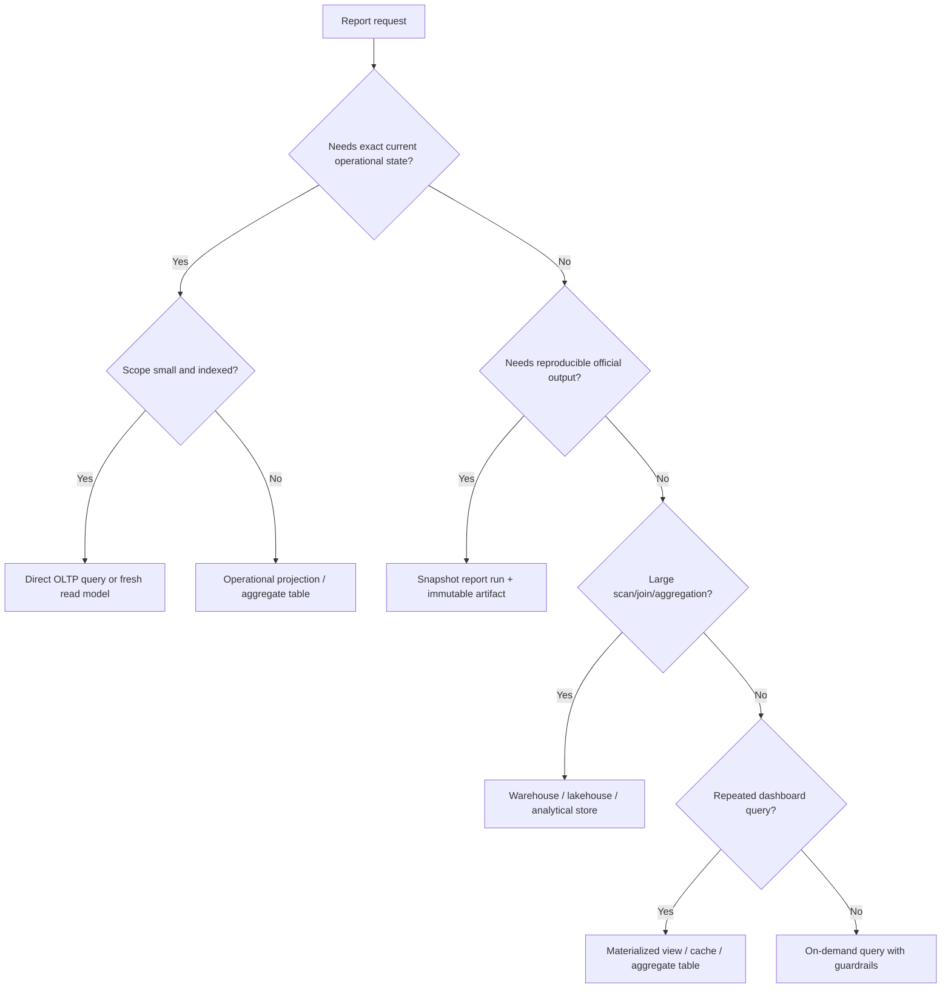
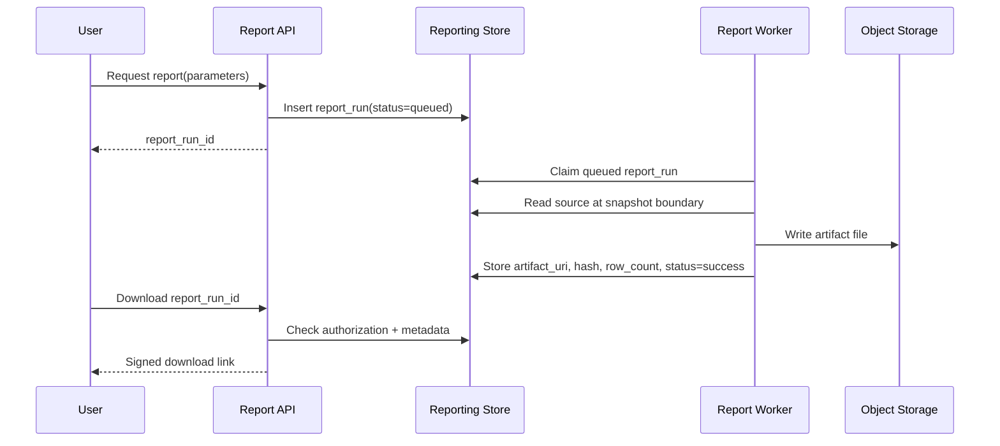
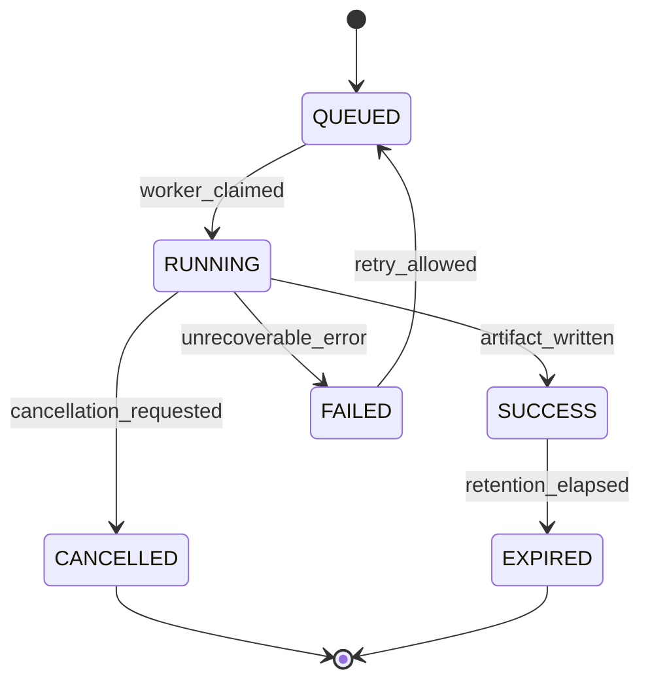
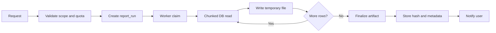

# Part 069 — Large-Scale Reporting Design

Reporting kelihatannya sederhana: user memilih filter, klik **Generate**, lalu sistem mengeluarkan tabel, PDF, CSV, dashboard, atau angka KPI.

Di production, reporting hampir selalu menjadi salah satu sumber kerusakan database paling diam-diam:

- query report membaca terlalu banyak row dari database OLTP;
- report berubah hasilnya ketika refresh ulang karena snapshot tidak dikunci;
- export besar membuat connection pool habis;
- filter bebas membuat query planner memilih plan buruk;
- authorization di report tidak sama dengan authorization di aplikasi;
- report untuk audit/regulator tidak bisa direproduksi;
- laporan terlihat benar, tetapi tidak bisa dijelaskan dari data lineage;
- tim menambahkan index demi report, lalu write path OLTP melambat;
- dashboard tampak real-time, tetapi sebenarnya stale tanpa freshness contract.

Mental model utama:

> Large-scale reporting is not a query problem. It is a data product, workload isolation, reproducibility, authorization, and operational control problem.

Bagian ini membahas desain reporting skala besar dari sisi database architect: kapan report boleh langsung query OLTP, kapan harus snapshot, kapan harus async, kapan perlu projection table, kapan perlu warehouse/lakehouse, bagaimana membuat report reproducible, dan bagaimana mencegah laporan menjadi distributed denial-of-service terhadap sistem operasional.

---

## 1. Apa yang Membuat Reporting Sulit?

Reporting sulit bukan karena SQL-nya panjang. Reporting sulit karena ia sering menggabungkan beberapa tekanan yang berlawanan.

| Tekanan | Dampak |
|---|---|
| User ingin fleksibel | Query shape menjadi tidak terprediksi |
| Data besar | Scan, join, sort, dan aggregation mahal |
| Hasil harus akurat | Perlu snapshot, reconciliation, dan definisi metric |
| User ingin cepat | Perlu precompute, cache, materialized view, atau async |
| Data sensitif | Perlu row/field-level authorization di output |
| Report dipakai untuk keputusan | Perlu reproducibility dan audit trail |
| Banyak tenant/user | Perlu throttling, isolation, dan quota |
| Schema berubah | Perlu versioned report contract |

Kalau reporting dianggap hanya endpoint SQL, sistem biasanya gagal di salah satu sisi ini.

---

## 2. Reporting Workload Taxonomy

Sebelum memilih arsitektur, klasifikasikan report.

### 2.1 Operational Lookup Report

Contoh:

- daftar kasus aktif;
- daftar transaksi pending;
- task overdue untuk supervisor;
- daftar dokumen yang belum diverifikasi.

Karakteristik:

- dekat dengan workflow operasional;
- freshness tinggi;
- scope biasanya kecil;
- user perlu drill-down ke record operasional;
- authorization harus sama dengan aplikasi utama.

Biasanya boleh query database operasional atau read model yang sangat fresh.

### 2.2 Operational Aggregate Report

Contoh:

- jumlah kasus per status hari ini;
- SLA breach per unit kerja;
- total transaksi gagal per channel;
- queue workload per officer.

Karakteristik:

- aggregation relatif ringan;
- freshness menengah sampai tinggi;
- sering muncul di dashboard;
- query diulang berkali-kali.

Biasanya cocok memakai aggregate table, materialized view, atau projection yang di-refresh incremental.

### 2.3 Analytical Report

Contoh:

- tren kasus 24 bulan;
- cohort analysis;
- laporan performa cabang;
- root-cause analysis;
- regulatory monthly report.

Karakteristik:

- membaca volume data besar;
- join lintas domain;
- freshness tidak selalu real-time;
- perlu reproducibility;
- sering punya definisi metric yang kompleks.

Biasanya tidak cocok langsung ke OLTP. Gunakan warehouse/lakehouse/analytical store.

### 2.4 Compliance and Evidence Report

Contoh:

- laporan final ke regulator;
- audit evidence pack;
- decision history report;
- report investigasi yang harus bisa dibuktikan ulang.

Karakteristik:

- hasil harus reproducible;
- perlu data lineage;
- perlu snapshot timestamp;
- perlu definisi metric versi tertentu;
- output sering menjadi artefak legal/regulatory.

Tidak cukup “query latest data”. Perlu report run record, snapshot boundary, dan immutable output artifact.

### 2.5 Bulk Export

Contoh:

- CSV 5 juta row;
- data extract untuk partner;
- archive export;
- data migration extract.

Karakteristik:

- output besar;
- durasi lama;
- raw row lebih dominan daripada aggregate;
- raw HTTP response mudah timeout;
- harus ada throttling, pagination, file generation, dan resumability.

Biasanya harus async.

---

## 3. Reporting Architecture Decision Tree

Gunakan decision tree sederhana berikut.



Rule of thumb:

- **Direct OLTP query** hanya untuk report kecil, indexed, bounded, dan low frequency.
- **Materialized view/aggregate table** untuk repeated query dengan bounded freshness.
- **Async report job** untuk output besar, durasi panjang, atau user-tolerant latency.
- **Warehouse/lakehouse** untuk analytical cross-domain report.
- **Snapshot report** untuk official/compliance report.

---

## 4. Core Reporting Contracts

Setiap report production-grade minimal punya contract berikut.

### 4.1 Data Scope Contract

Menjawab:

- data apa yang termasuk?
- data apa yang dikecualikan?
- tenant/unit/user mana yang boleh terlihat?
- time range memakai event time, effective time, transaction time, atau report run time?
- status apa yang dihitung?
- soft-deleted/archived data ikut atau tidak?

Contoh buruk:

> Monthly closed cases report.

Contoh lebih baik:

> Report menghitung case yang transition ke `CLOSED` dalam interval `[period_start, period_end)`, berdasarkan `case_transition.transitioned_at`, termasuk case yang setelahnya direopened, tetapi menampilkan final state saat snapshot report dijalankan.

### 4.2 Freshness Contract

Menjawab:

- hasil harus real-time atau boleh stale?
- stale maksimum berapa lama?
- apakah report menunjukkan `data_as_of`?
- apakah user boleh melihat report ketika pipeline tertinggal?
- apakah report run menolak jika source freshness tidak cukup?

Contoh field:

```sql
data_as_of timestamptz not null,
source_watermark timestamptz not null,
freshness_status text not null check (freshness_status in ('fresh', 'stale', 'unknown'))
```

### 4.3 Reproducibility Contract

Menjawab:

- apakah hasil bisa dihasilkan ulang?
- report memakai query version berapa?
- metric definition version berapa?
- source snapshot boundary apa?
- parameter request apa?
- siapa requester?
- artifact hash apa?

### 4.4 Authorization Contract

Menjawab:

- authorization diterapkan sebelum aggregation atau setelah aggregation?
- apakah row-level access sama dengan aplikasi operasional?
- apakah report mengandung field sensitif?
- apakah export perlu masking?
- apakah report output boleh dibagikan ulang?

Jangan anggap authorization UI cukup. Report output adalah data product tersendiri.

### 4.5 Operational Contract

Menjawab:

- synchronous atau asynchronous?
- max time range?
- max row count?
- max concurrent run per tenant/user?
- retry policy?
- cancellation?
- retention artifact?
- alert jika gagal?

---

## 5. Direct OLTP Reporting

Direct OLTP reporting berarti report query langsung ke database operasional.

Ini boleh, tetapi harus dibatasi.

### Cocok untuk

- report kecil;
- lookup/list operational;
- query indexed;
- time range pendek;
- hasil dipakai untuk action langsung;
- freshness wajib tinggi;
- tidak ada aggregation besar.

### Tidak cocok untuk

- export jutaan row;
- dashboard high-frequency;
- report lintas domain;
- ad-hoc filter bebas;
- query yang butuh full table scan;
- laporan regulator yang harus reproducible;
- report yang membutuhkan transformasi panjang.

### Guardrail SQL Design

Contoh operational report:

```sql
select
    c.case_id,
    c.case_number,
    c.status,
    c.priority,
    c.assigned_unit_id,
    c.created_at,
    c.sla_due_at
from enforcement_case c
where c.tenant_id = :tenant_id
  and c.assigned_unit_id = :unit_id
  and c.status in ('OPEN', 'UNDER_REVIEW')
  and c.sla_due_at < now() + interval '2 days'
order by c.sla_due_at asc, c.case_id asc
limit 100;
```

Index:

```sql
create index concurrently idx_case_operational_sla
on enforcement_case (
    tenant_id,
    assigned_unit_id,
    status,
    sla_due_at,
    case_id
)
where deleted_at is null;
```

Guardrail:

- wajib tenant filter;
- wajib bounded status/time range;
- wajib deterministic order;
- wajib limit;
- wajib index sesuai query shape;
- tidak boleh `select *`;
- tidak boleh filter bebas tanpa allowlist.

---

## 6. Materialized View for Reporting

Materialized view menyimpan hasil query. Ia berguna ketika query mahal tetapi hasil bisa di-refresh periodik.

PostgreSQL menyediakan `REFRESH MATERIALIZED VIEW`; opsi `CONCURRENTLY` memungkinkan refresh tanpa blocking concurrent select, dengan syarat tertentu seperti unique index yang sesuai.

### Cocok untuk

- dashboard aggregate;
- report query yang sering diulang;
- freshness periodik cukup;
- source data tidak berubah terlalu sering;
- hasil bisa dihitung ulang dari source.

### Contoh

```sql
create materialized view mv_case_daily_status_summary as
select
    tenant_id,
    date_trunc('day', created_at)::date as report_date,
    status,
    count(*) as case_count
from enforcement_case
where deleted_at is null
group by tenant_id, date_trunc('day', created_at)::date, status;

create unique index mv_case_daily_status_summary_uq
on mv_case_daily_status_summary (tenant_id, report_date, status);
```

Refresh:

```sql
refresh materialized view concurrently mv_case_daily_status_summary;
```

### Failure Modes

| Failure | Penyebab | Mitigasi |
|---|---|---|
| Report stale tanpa diketahui user | tidak ada `data_as_of` | simpan metadata refresh |
| Refresh blocking | refresh non-concurrent atau query berat | jadwal refresh, concurrent refresh, partitioned aggregate |
| Full recompute mahal | source terlalu besar | incremental aggregate/projection |
| Result salah setelah schema berubah | view tidak versioned | report contract + migration test |
| Authorization bocor | materialized view global tanpa scope | tenant/security-aware materialized view |

### Refresh Metadata

Tambahkan metadata:

```sql
create table report_dataset_refresh (
    dataset_name text primary key,
    refreshed_at timestamptz not null,
    source_watermark timestamptz not null,
    row_count bigint not null,
    status text not null check (status in ('running', 'success', 'failed')),
    error_message text
);
```

UI report harus menampilkan:

```text
Data as of: 2026-07-05 09:30:00+07
Freshness: 5 minutes behind source
```

---

## 7. Aggregate Table Pattern

Aggregate table mirip materialized view, tetapi dikelola aplikasi/pipeline.

Keunggulan:

- bisa incremental;
- bisa partitioned;
- bisa punya metadata refresh per partition;
- bisa menampung metric version;
- bisa diisi dari CDC/event stream;
- bisa diperbaiki/rebuilt per window.

Contoh:

```sql
create table case_daily_metric (
    tenant_id uuid not null,
    metric_date date not null,
    unit_id uuid,
    case_type text not null,
    opened_count bigint not null default 0,
    closed_count bigint not null default 0,
    breached_sla_count bigint not null default 0,
    metric_version int not null,
    source_watermark timestamptz not null,
    computed_at timestamptz not null default now(),
    primary key (tenant_id, metric_date, unit_id, case_type, metric_version)
);
```

Query report menjadi murah:

```sql
select
    metric_date,
    sum(opened_count) as opened,
    sum(closed_count) as closed,
    sum(breached_sla_count) as breached_sla
from case_daily_metric
where tenant_id = :tenant_id
  and metric_date >= :from_date
  and metric_date < :to_date
  and metric_version = :metric_version
group by metric_date
order by metric_date;
```

Tradeoff:

- harus punya reconciliation;
- metric bisa drift;
- update logic lebih kompleks;
- data correction harus memicu recompute;
- schema metric perlu versioning.

---

## 8. Snapshot Report Pattern

Snapshot report digunakan ketika hasil harus reproducible.

Contoh:

- laporan bulanan regulator;
- official compliance report;
- audit package;
- laporan keputusan enforcement;
- financial close report.

Pattern:

1. user/requester membuat report run;
2. sistem menyimpan parameter;
3. sistem menentukan snapshot boundary;
4. query dieksekusi terhadap data sesuai boundary;
5. output disimpan sebagai artifact immutable;
6. hash artifact disimpan;
7. metadata lineage disimpan;
8. report bisa diunduh/dibuktikan ulang.



Schema:

```sql
create table report_definition (
    report_definition_id uuid primary key,
    report_code text not null unique,
    report_name text not null,
    report_version int not null,
    metric_version int not null,
    owner_team text not null,
    is_active boolean not null default true,
    created_at timestamptz not null default now()
);

create table report_run (
    report_run_id uuid primary key,
    report_definition_id uuid not null references report_definition(report_definition_id),
    tenant_id uuid not null,
    requested_by uuid not null,
    requested_at timestamptz not null default now(),
    parameters_json jsonb not null,
    snapshot_time timestamptz not null,
    source_watermark timestamptz,
    status text not null check (status in ('queued', 'running', 'success', 'failed', 'cancelled')),
    started_at timestamptz,
    finished_at timestamptz,
    row_count bigint,
    artifact_uri text,
    artifact_sha256 text,
    error_message text
);
```

Invariant penting:

- `report_definition_id`, `report_version`, dan `metric_version` tidak boleh hilang;
- `parameters_json` harus menyimpan request asli;
- `snapshot_time` harus eksplisit;
- output official tidak boleh silently regenerated tanpa audit;
- artifact hash harus stabil;
- jika output diregenerasi, buat `report_run` baru atau simpan regeneration audit.

---

## 9. Async Report Job Design

Report besar jangan dijalankan sebagai request HTTP panjang.

Gunakan model:

- `POST /reports/{code}/runs` membuat job;
- worker menjalankan job;
- user polling status atau menerima notification;
- artifact disimpan di object storage;
- download memakai link sementara.

### Report Job State Machine



### Claim Pattern

```sql
with candidate as (
    select report_run_id
    from report_run
    where status = 'queued'
    order by requested_at
    limit 1
    for update skip locked
)
update report_run rr
set status = 'running',
    started_at = now()
from candidate c
where rr.report_run_id = c.report_run_id
returning rr.*;
```

### Chunked Export

Jangan gunakan `OFFSET` untuk export besar. Gunakan keyset/chunking.

```sql
select *
from report_source_view
where tenant_id = :tenant_id
  and (sort_key, id) > (:last_sort_key, :last_id)
order by sort_key, id
limit 10000;
```

Worker menulis chunk ke file stream. Setelah chunk selesai, checkpoint disimpan.

```sql
create table report_run_checkpoint (
    report_run_id uuid primary key references report_run(report_run_id),
    last_sort_key timestamptz,
    last_id uuid,
    rows_written bigint not null default 0,
    updated_at timestamptz not null default now()
);
```

Ini membuat export bisa resumable.

---

## 10. Reporting Source Design

Jangan biarkan setiap report menulis query langsung ke tabel internal OLTP.

Buat layer sumber:

| Layer | Fungsi |
|---|---|
| Base table | state operasional canonical |
| Internal view | stabilisasi join/filter dasar |
| Reporting source view/table | contract untuk report |
| Report definition | parameter + metric semantics |
| Report run | execution record |
| Artifact | output immutable |

Contoh:

```sql
create view reporting_case_base_v1 as
select
    c.tenant_id,
    c.case_id,
    c.case_number,
    c.case_type,
    c.status,
    c.created_at,
    c.closed_at,
    c.assigned_unit_id,
    c.sla_due_at,
    c.sla_breached,
    c.deleted_at
from enforcement_case c
where c.deleted_at is null;
```

Report query memakai view ini, bukan tabel internal langsung.

Keuntungan:

- schema internal bisa berubah;
- report contract stabil;
- authorization/masking bisa dikontrol;
- migration impact lebih mudah dianalisis;
- report source bisa dipindah ke warehouse tanpa mengubah definisi report terlalu besar.

---

## 11. Parameter Design

Parameter report adalah attack surface dan performance surface.

Contoh parameter buruk:

```json
{
  "where": "status != 'CLOSED' OR priority = 'HIGH'",
  "orderBy": "created_at desc"
}
```

Ini memberi user kebebasan membentuk SQL.

Contoh parameter lebih aman:

```json
{
  "periodStart": "2026-01-01",
  "periodEnd": "2026-02-01",
  "unitIds": ["..."],
  "statuses": ["OPEN", "UNDER_REVIEW"],
  "includeArchived": false,
  "outputFormat": "csv"
}
```

Validasi parameter:

- date range maksimum;
- enum allowlist;
- jumlah unit/status maksimum;
- output format allowlist;
- sort column allowlist;
- row limit;
- authorization terhadap scope parameter.

Simpan parameter request asli di `report_run.parameters_json`.

---

## 12. Authorization in Reporting

Reporting authorization sering bocor karena aggregation terasa “aman”. Padahal aggregate bisa mengungkap informasi sensitif.

Contoh leak:

- user tidak boleh melihat kasus investigasi, tetapi report count menunjukkan ada 1 kasus rahasia di unit tertentu;
- export menampilkan email/phone tanpa masking;
- dashboard per officer menunjukkan workload orang lain;
- report hasil filter kecil membuat re-identification possible.

### Authorization Placement

| Placement | Risiko |
|---|---|
| UI only | mudah bypass lewat API/export |
| API only | raw report SQL/pipeline bisa bocor |
| Query predicate | lebih aman, tetapi perlu testing |
| RLS/database policy | kuat untuk row access, tetapi report aggregate tetap perlu semantic rule |
| Output masking | perlu diterapkan sebelum artifact disimpan |

### Pattern

```sql
create table report_access_scope (
    user_id uuid not null,
    tenant_id uuid not null,
    unit_id uuid not null,
    can_view_sensitive boolean not null default false,
    primary key (user_id, tenant_id, unit_id)
);
```

Query:

```sql
select
    c.case_number,
    c.status,
    case
        when ras.can_view_sensitive then c.subject_name
        else '[masked]'
    end as subject_name
from reporting_case_base_v1 c
join report_access_scope ras
  on ras.tenant_id = c.tenant_id
 and ras.unit_id = c.assigned_unit_id
where ras.user_id = :requester_id
  and c.tenant_id = :tenant_id;
```

Official report harus menyimpan siapa yang menghasilkan report dan authorization scope saat report dibuat.

---

## 13. Reconciliation

Report skala besar harus bisa dibuktikan benar.

Reconciliation menjawab:

- apakah total row sesuai source?
- apakah aggregate konsisten dengan detail?
- apakah data per partition lengkap?
- apakah pipeline melewatkan event?
- apakah report berbeda setelah recompute?

Contoh reconciliation table:

```sql
create table report_reconciliation_result (
    reconciliation_id uuid primary key,
    report_run_id uuid references report_run(report_run_id),
    check_name text not null,
    expected_value numeric,
    actual_value numeric,
    status text not null check (status in ('pass', 'fail', 'warning')),
    details_json jsonb,
    checked_at timestamptz not null default now()
);
```

Contoh check:

```sql
insert into report_reconciliation_result (
    reconciliation_id,
    report_run_id,
    check_name,
    expected_value,
    actual_value,
    status
)
select
    gen_random_uuid(),
    :report_run_id,
    'closed_case_count_matches_source',
    src.closed_count,
    rpt.closed_count,
    case when src.closed_count = rpt.closed_count then 'pass' else 'fail' end
from (
    select count(*) as closed_count
    from enforcement_case
    where tenant_id = :tenant_id
      and closed_at >= :period_start
      and closed_at < :period_end
) src
cross join (
    select sum(closed_count) as closed_count
    from case_daily_metric
    where tenant_id = :tenant_id
      and metric_date >= :period_start::date
      and metric_date < :period_end::date
) rpt;
```

---

## 14. Report Versioning

Report berubah. Metric berubah. Source schema berubah. Regulasi berubah.

Jangan overwrite definisi report lama tanpa jejak.

Versioning yang diperlukan:

| Version | Contoh |
|---|---|
| Report definition version | layout, parameter, query logic |
| Metric version | definisi closed case, SLA breach, active case |
| Source dataset version | reporting view/table contract |
| Output schema version | kolom CSV/PDF/JSON |
| Authorization policy version | field masking/access scope |

Contoh:

```sql
create table metric_definition (
    metric_code text not null,
    metric_version int not null,
    expression_description text not null,
    effective_from date not null,
    effective_to date,
    owner_team text not null,
    approved_by text,
    approved_at timestamptz,
    primary key (metric_code, metric_version)
);
```

Official report harus menyimpan metric version yang digunakan.

---

## 15. Large Export Pipeline

Untuk CSV besar:

1. validasi request;
2. buat report run;
3. worker claim job;
4. query chunk dengan keyset;
5. stream ke temporary object;
6. hitung checksum/hash;
7. finalize object;
8. update report run;
9. kirim notification;
10. expire artifact sesuai retention.



### Export Guardrails

- max rows per report;
- max concurrent exports per tenant;
- max exports per user per hour;
- time range limit;
- low-priority replica/warehouse source;
- job cancellation;
- object retention;
- field masking;
- audit download event;
- compression;
- checksum;
- resumable checkpoint.

---

## 16. Dashboard Reporting

Dashboard adalah report yang dieksekusi terus-menerus.

Jika dashboard langsung query OLTP setiap 5 detik, ia bisa menjadi beban konstan.

Pattern:

- precompute aggregate;
- cache dashboard response;
- use freshness indicator;
- update via event/CDC;
- limit filter cardinality;
- separate executive dashboard from operational dashboard;
- avoid unbounded drill-down.

Dashboard metadata:

```json
{
  "dataAsOf": "2026-07-05T09:30:00+07:00",
  "freshnessSeconds": 45,
  "source": "case_daily_metric_v3",
  "metricVersion": 7
}
```

Dashboard tanpa `dataAsOf` adalah UX yang menipu.

---

## 17. Report Storage and Retention

Report output perlu lifecycle sendiri.

| Output Type | Retention |
|---|---|
| ad-hoc export | pendek, misalnya 7–30 hari |
| official monthly report | panjang sesuai policy/regulasi |
| failed report artifact | pendek, cukup untuk debugging |
| audit evidence pack | sesuai legal retention |
| sensitive export | pendek + encryption + strict access audit |

Simpan artifact di object storage, bukan di database utama, kecuali output kecil dan memang perlu transaksional.

Metadata tetap di database:

- report run id;
- artifact URI;
- hash;
- size;
- content type;
- encryption key reference;
- retention expiry;
- access audit.

---

## 18. Observability for Reporting

Metrics:

- report runs by status;
- queue depth;
- run duration percentile;
- rows exported;
- bytes written;
- failure rate;
- retry count;
- cancellation count;
- source freshness lag;
- reconciliation failure;
- top expensive reports;
- tenant/user causing high load.

Example table:

```sql
create table report_run_event (
    report_run_event_id uuid primary key,
    report_run_id uuid not null references report_run(report_run_id),
    event_type text not null,
    message text,
    details_json jsonb,
    occurred_at timestamptz not null default now()
);
```

Event examples:

- `queued`
- `claimed`
- `source_snapshot_selected`
- `chunk_written`
- `artifact_finalized`
- `reconciliation_failed`
- `cancelled`
- `expired`

---

## 19. Common Reporting Smells

| Smell | Meaning |
|---|---|
| Report endpoint has arbitrary SQL-like filters | injection/performance/authorization risk |
| Dashboard query uses OLTP joins over millions of rows | workload boundary violation |
| No `data_as_of` | freshness contract missing |
| Official report can be regenerated silently | reproducibility broken |
| Export over HTTP stream for huge data | timeout and connection exhaustion risk |
| No report run table | no audit trail |
| Same metric implemented differently in 5 reports | metric governance missing |
| Report uses application DTO directly | schema/report contract coupled to API |
| Report output has no hash | evidence integrity weak |
| Aggregate report ignores row-level authorization | data leak risk |

---

## 20. Large-Scale Reporting Review Checklist

Use this checklist before approving a report design.

### Semantics

- [ ] Report purpose jelas.
- [ ] Data scope eksplisit.
- [ ] Time semantics eksplisit.
- [ ] Metric definitions versioned.
- [ ] Soft delete/archive behavior jelas.
- [ ] Correction/reopen/backdated event behavior jelas.

### Architecture

- [ ] Source store sesuai workload.
- [ ] OLTP tidak dipakai untuk scan/aggregate besar.
- [ ] Freshness contract eksplisit.
- [ ] Snapshot/reproducibility tersedia jika official.
- [ ] Async job digunakan untuk output besar.
- [ ] Materialized/aggregate/projection punya rebuild path.

### Performance

- [ ] Query bounded.
- [ ] Index/query shape direview.
- [ ] Max row/time range ditetapkan.
- [ ] Export menggunakan chunking/keyset.
- [ ] Dashboard tidak over-query.
- [ ] Concurrency/quota tersedia.

### Security

- [ ] Report authorization sama atau lebih ketat dari aplikasi.
- [ ] Field masking jelas.
- [ ] Output artifact access diaudit.
- [ ] Sensitive export retention pendek.
- [ ] Multi-tenant isolation diuji.

### Reliability

- [ ] Report run status model tersedia.
- [ ] Retry/cancel/resume jelas.
- [ ] Failure visible to user/operator.
- [ ] Reconciliation checks tersedia.
- [ ] Artifact hash disimpan.
- [ ] Retention/expiry policy tersedia.

---

## 21. Key Takeaways

Large-scale reporting adalah kombinasi dari:

- workload isolation;
- semantic contract;
- freshness contract;
- reproducibility;
- authorization;
- operational control;
- data lineage;
- evidence integrity.

Jangan mulai dari “SQL report-nya apa?”. Mulai dari:

1. siapa pengguna report;
2. keputusan apa yang diambil dari report;
3. data mana yang authoritative;
4. seberapa fresh harusnya;
5. apakah harus reproducible;
6. apakah output sensitif;
7. seberapa besar data yang dibaca;
8. bagaimana report gagal, diulang, dibatalkan, dan diaudit.

Architect yang kuat tidak hanya membuat report cepat. Ia membuat report **benar, aman, dapat dijelaskan, dapat diulang, dan tidak merusak workload operasional**.

---

## References

- PostgreSQL Documentation — Materialized Views and `REFRESH MATERIALIZED VIEW`
- PostgreSQL Documentation — `EXPLAIN`, indexes, partitioning, and query planning
- AWS Prescriptive Guidance — Data lake architecture and data engineering principles
- Microsoft Power BI Guidance — Incremental refresh and large semantic models
- Kimball dimensional modelling concepts
- Prior parts in this series: Part 065, Part 066, Part 067, Part 068
