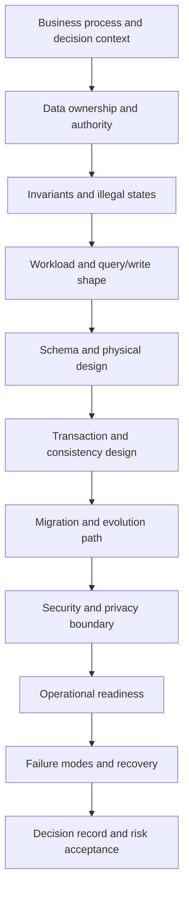

# Part 070 — Database Architecture Review Method

Database architecture review bukan meeting untuk mencari siapa yang paling senior atau siapa yang paling kuat opininya.

Architecture review adalah proses untuk menjawab:

> Given the business process, workload, invariants, failure modes, and operational constraints, is this database design safe enough to run and evolve in production?

Review yang buruk biasanya seperti ini:

- terlalu fokus pada diagram;
- terlalu cepat membahas teknologi;
- tidak memeriksa invariant;
- tidak memeriksa query shape;
- tidak memeriksa migration path;
- tidak memeriksa failure mode;
- tidak memeriksa operational ownership;
- tidak menyimpan decision record;
- approval berdasarkan “looks fine”.

Review yang baik menghasilkan:

- keputusan yang bisa dijelaskan;
- risiko yang eksplisit;
- tradeoff yang diterima secara sadar;
- checklist action yang jelas;
- evidence, bukan asumsi;
- ownership dan revisit trigger.

Bagian ini memberi metode review yang bisa dipakai sebagai internal engineering handbook untuk database design dan architecture review.

---

## 1. Review Is a Risk Reduction System

Tujuan review bukan membuat desain sempurna. Tujuan review adalah mengurangi risiko yang paling mahal sebelum desain masuk produksi.

Risiko database biasanya mahal karena:

- data sulit diperbaiki setelah rusak;
- migration sulit rollback;
- schema buruk memengaruhi banyak aplikasi;
- query buruk bisa menjatuhkan database utama;
- security leak di database berdampak luas;
- backup/restore yang belum diuji baru gagal saat krisis;
- report resmi yang salah bisa menjadi risiko hukum/regulasi.

Jadi review harus diarahkan ke risiko, bukan preferensi.

---

## 2. The Review Funnel

Gunakan funnel berikut.



Kalau review langsung lompat ke “pakai Postgres atau MongoDB?”, review sudah salah urutan.

Technology choice datang setelah:

- data authority jelas;
- access pattern jelas;
- consistency requirement jelas;
- failure mode jelas;
- operational team mampu menjalankan.

---

## 3. Review Inputs

Sebelum review, minta dokumen/artefak minimal.

### 3.1 Context

- business capability;
- user journey/workflow;
- decision yang bergantung pada data;
- regulatory/compliance requirement;
- tenant/security model;
- integration boundary.

### 3.2 Data Model

- conceptual model;
- logical ERD;
- physical schema draft;
- key strategy;
- relationship cardinality;
- state machine/lifecycle;
- reference/master data dependency.

### 3.3 Workload

- main write commands;
- main read queries;
- reporting/export workload;
- expected data volume;
- concurrency;
- latency target;
- growth model;
- multi-tenant distribution.

### 3.4 Correctness

- invariants;
- constraints;
- transaction boundary;
- isolation level assumptions;
- idempotency strategy;
- dedup/retry design;
- correction/repair path.

### 3.5 Operations

- migration plan;
- backup/restore plan;
- observability plan;
- runbook draft;
- capacity estimate;
- failure-mode analysis.

If there is no evidence, mark it as assumption. Do not allow assumptions to masquerade as facts.

---

## 4. Review Output

Architecture review harus menghasilkan output konkret:

1. **Decision**: approve, approve with conditions, needs redesign, or reject.
2. **Risk register**: risk, impact, likelihood, mitigation, owner.
3. **Action items**: specific, assigned, due.
4. **Decision record**: context, options, tradeoffs, chosen approach.
5. **Revisit triggers**: when this design must be reviewed again.

Contoh status:

| Status | Meaning |
|---|---|
| Approved | desain siap dengan risiko acceptable |
| Approved with conditions | boleh lanjut setelah action tertentu selesai |
| Needs redesign | desain punya flaw struktural |
| Spike required | evidence belum cukup, perlu experiment/benchmark/prototype |
| Rejected | risiko tidak acceptable untuk production |

---

## 5. Phase 1 — Business and Data Authority Review

Pertanyaan inti:

- data ini mewakili real-world entity apa?
- siapa owner data?
- siapa boleh membuat/mengubah/menghapus?
- sistem mana source of truth?
- apakah ada derived copy?
- apakah ada external authority?
- apakah correction boleh dilakukan?
- apakah data menjadi evidence?

### Smells

| Smell | Why Dangerous |
|---|---|
| “This table is shared by many services” | ownership kabur |
| “Both systems can update this field” | conflict authority |
| “We sync both ways” | correctness sulit dibuktikan |
| “Report uses whichever value is latest” | semantic ambiguity |
| “Admin can edit anything” | audit/correction boundary lemah |

### Review Questions

- Apakah setiap table punya owning capability/team?
- Apakah setiap mutable field punya authority?
- Apakah source of truth dan projection dibedakan?
- Apakah correction path diaudit?
- Apakah deletion/retention dipahami?

### Evidence

- data ownership matrix;
- system-of-record diagram;
- lifecycle diagram;
- integration contract;
- audit/correction requirement.

---

## 6. Phase 2 — Invariants Review

Database design harus dimulai dari state yang tidak boleh terjadi.

Contoh invariant:

- satu case hanya boleh punya satu active assignment;
- tenant A tidak boleh melihat data tenant B;
- closed case tidak boleh diedit kecuali lewat reopen transition;
- ledger entry tidak boleh diubah setelah posted;
- effective-dated rule tidak boleh overlap;
- idempotency key hanya boleh menghasilkan satu business result;
- deleted entity tidak boleh muncul di search/export.

### Invariant Table

| Invariant | Enforcement | Failure Impact | Test |
|---|---|---|---|
| One active assignment per case | partial unique index | duplicate work, SLA wrong | concurrent assignment test |
| Valid state transition only | transition table + transaction | illegal workflow | transition matrix test |
| Tenant isolation | tenant_id + RLS + tests | data breach | cross-tenant query test |
| No overlapping effective period | exclusion constraint/app lock | wrong rule selection | overlap insert test |

### Review Questions

- Apakah invariant ditulis eksplisit?
- Mana yang ditegakkan database?
- Mana yang ditegakkan aplikasi?
- Mana yang butuh transaksi?
- Mana yang rentan race condition?
- Apakah ada concurrent test?
- Apakah invariant monitoring ada?

### Strong Signal

Desain yang matang bisa menjawab:

> “Here are the illegal states, and here is exactly where each illegal state is prevented, detected, or repaired.”

---

## 7. Phase 3 — Workload Review

Schema yang tampak bersih bisa gagal jika workload-nya salah dipahami.

Review workload dengan format command/query.

### Write Workload

| Command | Frequency | Rows touched | Transaction boundary | Contention risk |
|---|---:|---:|---|---|
| Create case | high | case + audit + outbox | single txn | unique case number |
| Assign case | medium | case + assignment + transition | single txn | active assignment invariant |
| Close case | medium | case + decision + audit | single txn | status transition |
| Import evidence | bursty | evidence + file metadata | multi-step | storage side effect |

### Read Workload

| Query | Frequency | Freshness | Expected Rows | Index |
|---|---:|---|---:|---|
| My active tasks | high | current | 20–100 | tenant, assignee, status |
| Case timeline | medium | current | 100–1000 | case_id, occurred_at |
| SLA dashboard | high | <=5 min stale | aggregate | projection/aggregate |
| Monthly report | low | snapshot | millions | warehouse/snapshot |

### Review Questions

- Apakah query shape diketahui?
- Apakah setiap high-frequency query punya index strategy?
- Apakah write amplification dari index diterima?
- Apakah reporting workload diisolasi?
- Apakah hot row/key/tenant dianalisis?
- Apakah pagination bounded?
- Apakah parameter bebas dibatasi?

### Required Evidence

- top N query list;
- expected volume;
- expected concurrency;
- EXPLAIN untuk query kritis jika schema/data sudah ada;
- load test plan untuk workload berisiko.

---

## 8. Phase 4 — Schema Review

Schema review memeriksa apakah model logis benar-benar menjadi physical schema yang aman.

### Table Review

- Apakah table punya grain jelas?
- Apakah table terlalu banyak tanggung jawab?
- Apakah nullable columns punya alasan?
- Apakah status enum mencampur beberapa state machine?
- Apakah history/current state dipisahkan dengan benar?
- Apakah relationship-as-entity digunakan ketika relationship punya lifecycle?

### Key Review

- Primary key stabil?
- Natural key perlu unique constraint?
- Public identifier terpisah dari internal identifier?
- Composite key digunakan dengan sadar?
- Tenant-scoped uniqueness jelas?
- Foreign key dipakai ketika boundary memungkinkan?

### Constraint Review

- `NOT NULL` untuk mandatory fields?
- `CHECK` untuk domain sederhana?
- `UNIQUE` untuk business uniqueness?
- partial unique untuk active/current constraints?
- FK untuk referential integrity?
- exclusion constraint untuk interval overlap?
- generated column untuk derived invariant sederhana?

### Index Review

- Index sesuai query shape?
- Composite index order tepat?
- Partial index digunakan untuk subset dominan?
- Covering index perlu atau tidak?
- Redundant indexes dibuang?
- Write amplification dihitung?
- FK columns yang sering join/delete punya index?

### Smells

| Smell | Risk |
|---|---|
| `status` with 30 values | hidden state machines |
| `metadata_json` stores core fields | constraint/query/reporting weak |
| nullable everything | invalid state easy |
| no FK because “microservices” | orphan data inside same boundary |
| EAV for normal domain attributes | weak type, weak constraint, bad query |
| polymorphic FK | referential integrity lost |
| audit table without actor/reason | weak evidence |

---

## 9. Phase 5 — Transaction and Consistency Review

Pertanyaan inti:

- operasi mana harus atomic?
- invariant mana lintas row/table?
- apakah isolation level cukup?
- apakah write skew mungkin?
- apakah retry safe?
- apakah external side effect dipisah dari DB transaction?

### Transaction Boundary Template

```text
Command: Assign Case
Atomic changes:
- create assignment row
- mark previous assignment inactive
- insert case_transition
- insert audit_event
- insert outbox_event

Consistency requirements:
- only one active assignment per case
- assignee must belong to tenant/unit
- case must be assignable state

Concurrency strategy:
- transaction
- lock case row or active assignment row
- partial unique index on active assignment
- retry on serialization/deadlock
```

### Review Questions

- Apakah read-modify-write aman?
- Apakah lost update dicegah?
- Apakah write skew dicegah?
- Apakah retry policy tahu error mana yang retryable?
- Apakah idempotency key tersedia untuk command eksternal?
- Apakah outbox digunakan untuk event publish?
- Apakah commit-unknown ditangani?

---

## 10. Phase 6 — Evolution and Migration Review

Database design yang bagus tapi tidak bisa dimigrasikan adalah desain yang belum selesai.

### Review Questions

- Apakah schema change backward compatible?
- Apakah expand–migrate–contract plan tersedia?
- Apakah backfill online dan resumable?
- Apakah DDL lock impact dipahami?
- Apakah rollback/roll-forward plan jelas?
- Apakah validation query tersedia?
- Apakah dual read/write perlu?
- Apakah old app dan new app bisa berjalan bersamaan?

### Migration Risk Classification

| Risk | Example | Review Demand |
|---|---|---|
| Low | add nullable column | normal review |
| Medium | add index concurrently | monitor lock/WAL/load |
| High | backfill billion rows | batch plan + validation + rollback |
| Critical | change primary key/shard key | redesign/spike required |
| Critical | split table used by many services | compatibility plan + consumer coordination |

---

## 11. Phase 7 — Security and Privacy Review

Security review harus masuk ke database design, bukan ditempel di akhir.

### Review Questions

- Apakah tenant boundary enforced?
- Apakah least privilege role design tersedia?
- Apakah aplikasi memakai owner role atau limited role?
- Apakah RLS diperlukan?
- Apakah sensitive columns diidentifikasi?
- Apakah export/report masking diterapkan?
- Apakah backup encrypted dan access-controlled?
- Apakah CDC/search/warehouse menerima PII?
- Apakah break-glass access diaudit?
- Apakah retention/erasure/legal hold jelas?

### Evidence

- data classification matrix;
- role/privilege matrix;
- RLS/access policy tests;
- audit event schema;
- privacy propagation diagram;
- backup/restore access policy.

---

## 12. Phase 8 — Operational Readiness Review

Production database bukan hanya schema. Ia perlu operasi.

### Observability

- slow query visibility;
- query fingerprint;
- lock wait visibility;
- connection pool metrics;
- replication lag;
- WAL growth;
- disk usage;
- cache hit ratio;
- autovacuum/bloat signal;
- migration progress;
- report/export queue;
- CDC/outbox lag.

### Backup and Restore

- RPO/RTO jelas;
- PITR tersedia jika perlu;
- restore drill dilakukan;
- restore validation query tersedia;
- tenant-level restore strategy jelas;
- backup retention sesuai compliance;
- backup access diaudit.

### Runbook

- slow query storm;
- lock storm;
- connection exhaustion;
- disk full/WAL pressure;
- replication lag;
- bad migration;
- failed backup;
- data correctness incident;
- security incident.

### Review Questions

- Siapa owner saat incident?
- Alert apa yang actionable?
- Apa degraded mode?
- Apa manual mitigation?
- Apa recovery proof?
- Apa post-incident data validation?

---

## 13. Phase 9 — Failure Mode Review

Gunakan failure-mode table.

| Failure Mode | Cause | Detection | Mitigation | Recovery | Owner |
|---|---|---|---|---|---|
| Duplicate active assignment | race condition | invariant monitor | partial unique + transaction | repair duplicate | case platform |
| Report wrong after schema change | unversioned metric | reconciliation fail | metric versioning | regenerate official report with audit | analytics |
| Tenant data leak in export | missing scope predicate | access audit anomaly | report access scope | revoke artifact, incident response | security |
| Backfill overloads primary | unthrottled update | CPU/WAL/lag alert | batch + throttle | pause/resume | platform |
| Replica stale read breaks workflow | read routed to replica | state mismatch | primary read for command guards | retry from primary | application |

### Review Questions

- Apa top 10 failure modes?
- Mana yang catastrophic?
- Mana yang likely?
- Mana yang tidak bisa dideteksi cepat?
- Mana yang recovery-nya belum terbukti?
- Mana yang perlu redesign, bukan runbook?

---

## 14. Scoring Model

Gunakan scoring sederhana. Jangan pura-pura terlalu presisi.

### Risk Score

```text
Risk Score = Impact x Likelihood x Detectability
```

Skala 1–5:

| Dimension | 1 | 5 |
|---|---|---|
| Impact | minor inconvenience | data loss/breach/outage/regulatory failure |
| Likelihood | rare | likely under normal production load |
| Detectability | obvious immediately | silent for days/months |

Interpretasi:

| Score | Meaning |
|---:|---|
| 1–20 | acceptable with normal controls |
| 21–50 | mitigation required |
| 51–80 | senior review required |
| 81–125 | redesign or explicit executive risk acceptance |

Detectability penting. Silent corruption lebih berbahaya daripada failure yang langsung terlihat.

---

## 15. Architecture Decision Record for Database

Template ADR:

```md
# ADR: <Decision Title>

## Status
Proposed | Accepted | Superseded | Rejected

## Context
What business process, data, workload, and constraints drive this decision?

## Decision
What are we choosing?

## Options Considered
1. Option A
2. Option B
3. Option C

## Tradeoffs
What do we gain and lose?

## Invariants Protected
Which illegal states does this design prevent?

## Consistency Model
What is strongly consistent, eventually consistent, stale-allowed, or async?

## Migration Plan
How will this be introduced without downtime/data loss?

## Failure Modes
What can go wrong and how do we detect/recover?

## Operational Requirements
Monitoring, backup, restore, runbook, capacity, ownership.

## Security and Privacy
Access control, sensitive data, audit, retention.

## Revisit Triggers
When should this decision be reviewed again?
```

Good ADRs are not essays. They are decision evidence.

---

## 16. Example Review — Case Assignment Design

### Proposal

A case can be assigned to an officer. Current assignment is stored in `case.assigned_user_id`. Assignment history is stored in `case_assignment_history`.

### Review Finding

Potential flaw:

- current state and history can drift;
- no invariant preventing multiple active assignments if future design adds active assignment table;
- reassignment reason not mandatory;
- concurrency behavior unclear;
- assignment authorization not represented;
- SLA impact not defined.

### Improved Design

```sql
create table case_assignment (
    case_assignment_id uuid primary key,
    tenant_id uuid not null,
    case_id uuid not null,
    assigned_user_id uuid not null,
    assigned_by uuid not null,
    assigned_at timestamptz not null,
    unassigned_at timestamptz,
    assignment_reason text not null,
    is_active boolean generated always as (unassigned_at is null) stored
);

create unique index case_assignment_one_active_uq
on case_assignment (tenant_id, case_id)
where unassigned_at is null;
```

Transaction:

```sql
begin;

select *
from enforcement_case
where tenant_id = :tenant_id
  and case_id = :case_id
for update;

update case_assignment
set unassigned_at = now()
where tenant_id = :tenant_id
  and case_id = :case_id
  and unassigned_at is null;

insert into case_assignment (
    case_assignment_id,
    tenant_id,
    case_id,
    assigned_user_id,
    assigned_by,
    assigned_at,
    assignment_reason
)
values (
    gen_random_uuid(),
    :tenant_id,
    :case_id,
    :assigned_user_id,
    :assigned_by,
    now(),
    :reason
);

insert into case_transition (...);
insert into audit_event (...);
insert into outbox_event (...);

commit;
```

Review conclusion:

- approve with condition: add concurrent assignment test, authorization check, SLA impact rule, and migration path from existing assigned column.

---

## 17. Review Meeting Format

Keep it structured.

### Before Meeting

- reviewer reads design doc;
- author identifies top risks;
- data volume and workload assumptions included;
- open questions listed.

### During Meeting

1. context and scope;
2. data ownership;
3. invariants;
4. workload;
5. schema/transaction design;
6. migration plan;
7. security/privacy;
8. operations/failure modes;
9. decision and actions.

### After Meeting

- publish decision record;
- track action items;
- schedule follow-up if conditional approval;
- update standard/checklist if new pattern discovered.

---

## 18. Review Anti-Patterns

| Anti-Pattern | Why It Fails |
|---|---|
| Review by senior taste | inconsistent, political |
| Diagram-only review | ignores invariants/workload |
| Technology-first review | misses domain constraints |
| No written assumptions | decisions become folklore |
| No failure-mode review | production discovers design flaws |
| No migration review | good schema cannot be deployed safely |
| No ownership review | shared database becomes unmanaged |
| No revisit trigger | design remains after assumptions expire |
| Approval without conditions | action items disappear |

---

## 19. Revisit Triggers

A design must be reviewed again when:

- data volume grows 10x;
- QPS/TPS grows 3x;
- tenant count or largest tenant grows significantly;
- report/export workload changes;
- new regulatory/privacy requirement appears;
- schema ownership changes;
- service boundary changes;
- a new database engine is introduced;
- backup/restore objective changes;
- incident reveals hidden failure mode;
- latency SLO changes;
- new region/data residency requirement appears.

Architecture decisions expire when assumptions expire.

---

## 20. Database Architecture Review Checklist

### Context

- [ ] Business capability clear.
- [ ] Data owner clear.
- [ ] Source of truth clear.
- [ ] Derived/projection stores identified.
- [ ] Regulatory/compliance context captured.

### Data Model

- [ ] Conceptual/logical/physical model aligned.
- [ ] Table grain clear.
- [ ] Key strategy clear.
- [ ] Relationship cardinality clear.
- [ ] Lifecycle/state machine clear.
- [ ] Temporal semantics clear.

### Correctness

- [ ] Invariants documented.
- [ ] Enforcement layer identified.
- [ ] Database constraints used where appropriate.
- [ ] Concurrency risks tested.
- [ ] Idempotency/retry strategy clear.
- [ ] Correction/repair path clear.

### Workload

- [ ] Critical commands listed.
- [ ] Critical queries listed.
- [ ] Reporting/export workload isolated.
- [ ] Index strategy reviewed.
- [ ] Hotspot/skew analyzed.
- [ ] Capacity estimate exists.

### Consistency

- [ ] Transaction boundaries clear.
- [ ] Isolation assumptions clear.
- [ ] Replica/stale-read behavior clear.
- [ ] Event/CDC ordering clear.
- [ ] Distributed consistency tradeoff documented.

### Migration

- [ ] Expand–migrate–contract plan.
- [ ] Online backfill plan.
- [ ] Validation plan.
- [ ] Rollback/roll-forward plan.
- [ ] Old/new app compatibility checked.

### Security and Privacy

- [ ] Least privilege roles.
- [ ] Tenant isolation.
- [ ] RLS/ABAC/ACL decision clear.
- [ ] Sensitive fields classified.
- [ ] Audit events defined.
- [ ] Retention/erasure/legal hold defined.

### Operations

- [ ] Monitoring dashboard.
- [ ] Alert strategy.
- [ ] Backup/restore tested.
- [ ] Runbook exists.
- [ ] Failure modes reviewed.
- [ ] Ownership and escalation clear.

### Decision

- [ ] Options compared.
- [ ] Tradeoffs explicit.
- [ ] Risks scored.
- [ ] Action items assigned.
- [ ] Revisit triggers defined.
- [ ] ADR published.

---

## 21. Key Takeaways

Database architecture review is a discipline of making hidden assumptions visible.

A strong review asks:

- What is the source of truth?
- What states are illegal?
- What workload will hit this design?
- What consistency does each operation need?
- What happens during concurrency?
- How will this change safely?
- How will this fail?
- How will we know it failed?
- How will we recover?
- Who owns the result?

The goal is not to block engineering velocity. The goal is to prevent irreversible data mistakes, fragile migrations, expensive outages, silent report errors, and security failures.

A top-level database architect does not win reviews with opinions. They win by making tradeoffs explicit, risks measurable, and decisions defensible.

---

## References

- AWS Well-Architected Framework — Operational Excellence, Reliability, Security, Performance Efficiency, Cost Optimization
- PostgreSQL Documentation — constraints, indexes, transactions, locking, monitoring, backup/recovery
- NIST security/privacy control and risk management concepts
- Prior parts in this series: Part 001–069
