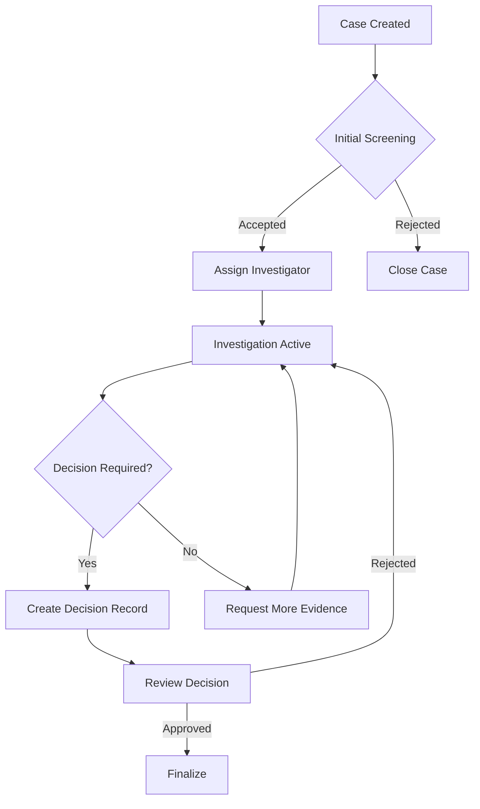
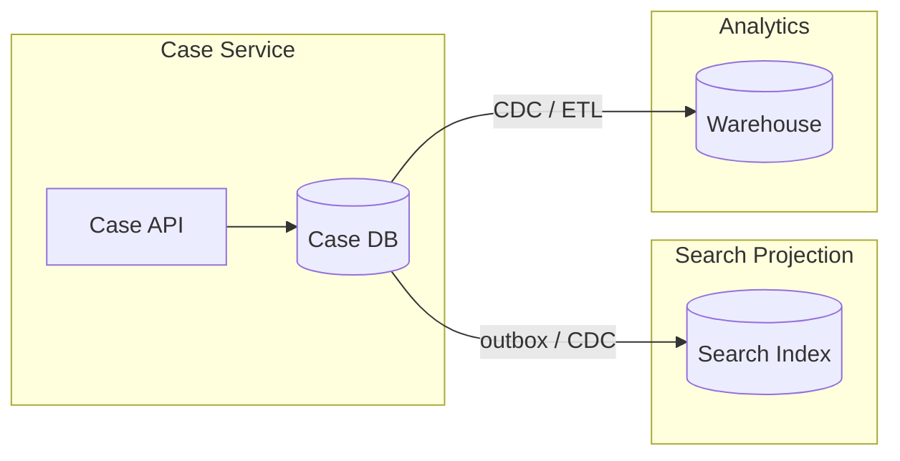
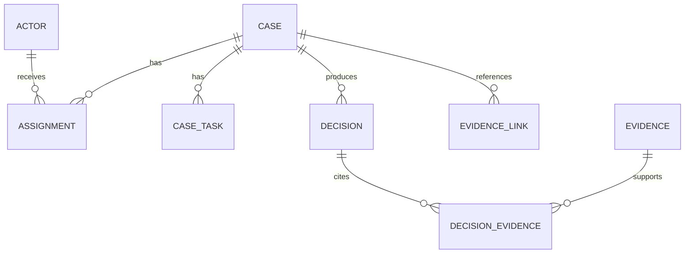
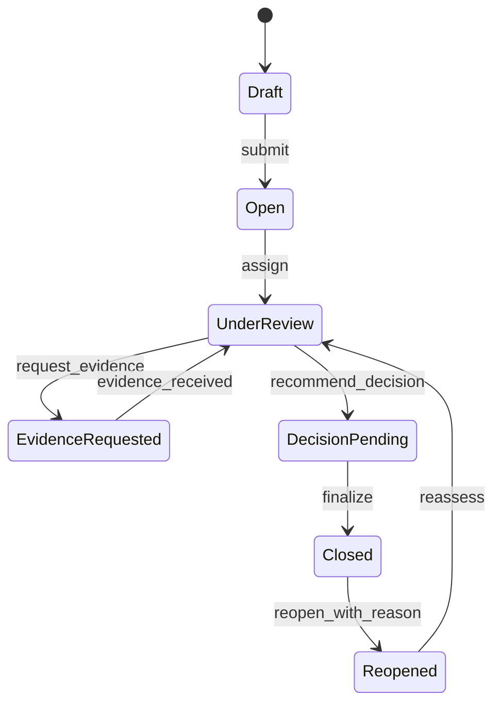
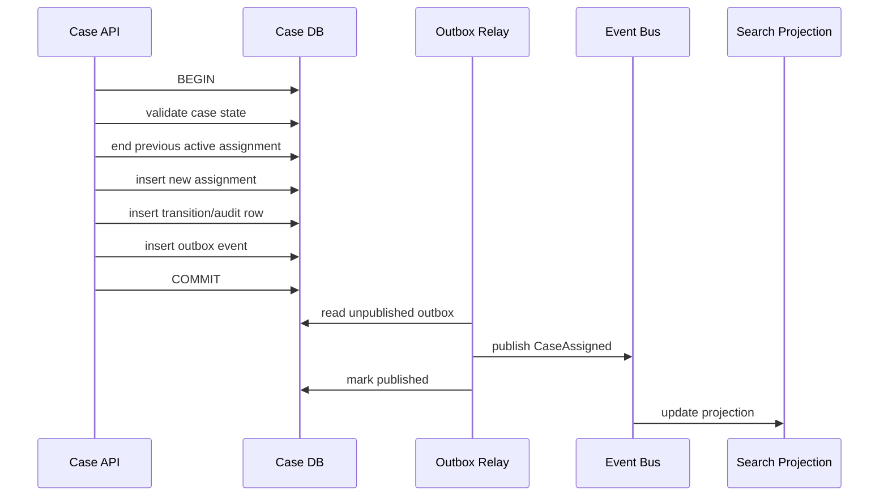
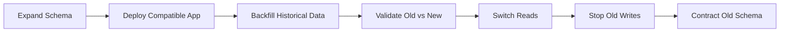

# Part 071 — Database Design Document Template

Database design document bukan formalitas.

Untuk engineer biasa, dokumen desain database adalah tempat menaruh ERD dan daftar tabel.

Untuk database architect, dokumen desain database adalah **contract** antara:

- business process;
- data ownership;
- correctness invariant;
- workload;
- security boundary;
- operational reality;
- migration plan;
- failure recovery;
- future evolution.

Dokumen yang bagus tidak hanya menjawab “tabelnya apa?”.

Dokumen yang bagus menjawab:

> State apa yang kita simpan, siapa pemilik kebenarannya, invariant apa yang tidak boleh rusak, bagaimana data berubah, bagaimana query berjalan, bagaimana perubahan schema dilakukan tanpa downtime, dan bagaimana kita membuktikan desain ini aman di production?

Part ini adalah template siap pakai untuk design review internal.

Gunakan sebagai:

- template RFC;
- template architecture decision record;
- checklist sebelum migration besar;
- template PRD teknis untuk database redesign;
- dokumen governance untuk sistem regulated;
- alat komunikasi antara engineer, architect, product, security, SRE, dan data team.

---

## 1. Cara membaca template ini

Template ini sengaja panjang.

Bukan karena setiap desain database harus menulis 100 halaman, tapi karena setiap section mewakili risiko yang sering muncul di production.

Untuk perubahan kecil, beberapa section boleh ringkas.

Untuk perubahan besar, terutama yang menyentuh state utama, audit, security, multi-tenancy, atau migration, hampir semua section harus diisi.

Rule praktis:

| Jenis Perubahan | Panjang Dokumen | Section Wajib |
|---|---:|---|
| Tambah kolom sederhana | 1–2 halaman | context, schema, migration, compatibility, rollback |
| Tambah tabel baru | 3–6 halaman | authority, grain, key, constraint, access pattern, index |
| Ubah lifecycle/state | 6–12 halaman | state machine, invariant, migration, audit, rollback |
| Redesign modul database | 15+ halaman | hampir semua section |
| Data regulated / financial / enforcement | 15+ halaman | authority, audit, traceability, privacy, failure evidence |
| Multi-tenant / distributed / CDC | 15+ halaman | tenant isolation, integration, replay, DR, observability |

Dokumen boleh pendek.

Tapi reasoning-nya tidak boleh dangkal.

---

## 2. Prinsip desain dokumen

Sebelum template, pegang prinsip berikut.

### 2.1 Start from truth, not table

Jangan mulai dari:

> Kita butuh tabel `case`, `case_task`, `case_status`.

Mulai dari:

> Kebenaran apa yang harus dipertahankan sistem ini?

Contoh:

- satu case hanya boleh punya satu active assignee pada satu waktu;
- decision final tidak boleh diubah, hanya boleh dikoreksi melalui reversal event;
- evidence yang sudah dipakai untuk enforcement decision harus tetap reconstructable;
- tenant A tidak boleh bisa melihat row tenant B, bahkan jika query aplikasi salah;
- report bulanan harus reproducible setelah taxonomy berubah.

Jika dokumen tidak menjelaskan truth boundary, schema hanya menjadi kumpulan container data.

### 2.2 Separate meaning from implementation

Desain yang matang memisahkan:

- **conceptual model**: konsep bisnis;
- **logical model**: relasi, cardinality, lifecycle, invariant;
- **physical model**: table, index, partition, storage, migration.

Jika langsung lompat ke DDL, reviewer sulit membedakan apakah masalahnya di domain modelling atau di SQL implementation.

### 2.3 Every table must have grain

Setiap tabel harus menjawab:

> Satu row di tabel ini merepresentasikan satu apa?

Contoh grain yang jelas:

- satu case regulatory;
- satu transition case dari state A ke state B;
- satu assignment period untuk satu actor pada satu case;
- satu evidence attachment;
- satu decision record;
- satu generated report run.

Grain yang kabur menghasilkan duplikasi, nullable chaos, status soup, dan query yang semakin sulit dijelaskan.

### 2.4 Every invariant needs an enforcement level

Invariant tidak cukup ditulis di dokumen.

Harus jelas enforcement-nya:

| Enforcement Level | Contoh |
|---|---|
| Database constraint | `NOT NULL`, `UNIQUE`, `CHECK`, FK, exclusion constraint |
| Transaction logic | conditional update, row lock, serializable transaction |
| Application service | domain validation, workflow guard |
| Async validator | drift detection, reconciliation job |
| Operational control | review/approval/manual exception |

Jika invariant kritikal hanya dijaga oleh UI, desain belum production-grade.

### 2.5 Design doc must include failure path

Desain yang hanya menjelaskan happy path belum cukup.

Minimal harus menjawab:

- apa yang terjadi jika migration berhenti di tengah;
- apa yang terjadi jika replica lag;
- apa yang terjadi jika outbox event terkirim dua kali;
- apa yang terjadi jika backfill membuat lock storm;
- apa yang terjadi jika partial unique index gagal dibuat karena data lama invalid;
- apa yang terjadi jika user meminta erasure tapi data sudah masuk backup/search/warehouse;
- apa yang terjadi jika support engineer perlu break-glass access.

Failure path adalah bagian dari desain, bukan tambahan operasional belakangan.

---

## 3. Template lengkap

Bagian ini adalah template utama.

Kamu bisa copy seluruh bagian mulai dari sini untuk dokumen internal.

---

# Database Design Document — `<Feature / Domain / Database Change Name>`

## 0. Document Control

| Field | Value |
|---|---|
| Status | Draft / In Review / Approved / Superseded |
| Owner | `<name / team>` |
| Reviewers | `<backend>`, `<database>`, `<security>`, `<SRE>`, `<data>` |
| Created | `<YYYY-MM-DD>` |
| Last Updated | `<YYYY-MM-DD>` |
| Target Release | `<release / milestone>` |
| Related Tickets | `<links>` |
| Related ADRs | `<links>` |
| Related Migrations | `<migration IDs>` |
| Production Databases | `<db names / clusters>` |
| Risk Level | Low / Medium / High / Critical |

### 0.1 Decision Summary

Write one short paragraph.

Template:

> We will design `<domain/change>` by storing `<canonical state>` in `<database/schema/tables>`, enforcing `<critical invariants>` using `<constraints/transactions/policies>`, serving `<main workloads>` through `<indexes/read models/projections>`, and migrating via `<migration strategy>` with rollback through `<rollback strategy>`.

Example:

> We will model regulatory case assignment as effective-dated assignment periods, enforce at most one active assignment per case through a partial unique index, preserve assignment history for audit, serve active workload queues through composite indexes on tenant, status, and due date, and migrate existing assignment rows through expand–backfill–validate–contract.

### 0.2 Non-Technical Summary

Explain for product, compliance, and operations.

Template:

> This change improves `<business capability>` by making `<data/process>` explicit and auditable. It affects `<users/workflows/reports>`. The main risk is `<risk>`, mitigated by `<mitigation>`.

Keep it short.

If non-engineers cannot understand this section, the design likely has unclear business meaning.

---

## 1. Problem Statement

### 1.1 Current Situation

Describe the current system.

Include:

- existing tables or stores;
- current workflow;
- known pain points;
- data quality issues;
- operational incidents;
- reporting problems;
- migration pressure;
- security/compliance gaps.

Template:

```md
Today, `<domain>` is represented by `<current tables/stores>`. This design works for `<current scenario>`, but fails when `<new requirement / scale / compliance need>` because `<specific reason>`.
```

Bad:

> The current table is bad and hard to maintain.

Good:

> The current `case_owner_id` column stores only the latest owner. It cannot reconstruct ownership at the time a decision was made, so audit reports infer historical ownership from current state. This is incorrect for enforcement decisions where accountability must be point-in-time.

### 1.2 Goals

Write measurable goals.

Examples:

- preserve full assignment history;
- support point-in-time reconstruction;
- prevent duplicate active assignments;
- reduce P95 queue query latency below 100 ms for 10M active tasks;
- support tenant-level restore;
- support schema evolution without downtime;
- prevent cross-tenant reads at database level;
- allow report reproduction for historical taxonomy versions.

Template:

```md
This design must:

1. ...
2. ...
3. ...
```

### 1.3 Non-Goals

Non-goals prevent uncontrolled scope.

Examples:

- not redesigning authorization service;
- not replacing data warehouse;
- not migrating historical attachments;
- not changing public API contract in phase 1;
- not solving global multi-region consistency yet.

Template:

```md
This design explicitly does not:

1. ...
2. ...
3. ...
```

### 1.4 Success Criteria

Define acceptance signals.

Use concrete conditions:

- migration completes with zero failed validation queries;
- old and new reads match for 30 days;
- no long-running lock above 2 seconds during DDL;
- slow query dashboard shows no P95 regression;
- audit reconstruction test passes for sampled historical cases;
- RLS tests prove tenant isolation for read/write paths;
- rollback has been tested in staging with production-like data.

---

## 2. Domain and Business Process

### 2.1 Domain Narrative

Explain the business process in plain language.

Template:

```md
A `<primary actor>` performs `<command>` on `<entity>` when `<condition>`. The system records `<fact>`, changes `<state>`, notifies `<downstream actor/system>`, and preserves `<evidence/history>` for `<reason>`.
```

Example:

> A compliance officer assigns a case to an investigator when the case enters review. The system records the assignment period, changes the case work queue visibility, emits an assignment event, and preserves the assignment history because later enforcement decisions must show who was responsible at the time.

### 2.2 Business Process Diagram

Use Mermaid.



### 2.3 Actors

| Actor | Role | Data They Create | Data They Read | Special Rules |
|---|---|---|---|---|
| `<actor>` | `<role>` | `<tables/events>` | `<tables/views>` | `<constraints>` |

Examples:

- case creator;
- investigator;
- supervisor;
- compliance reviewer;
- system scheduler;
- external integration;
- support engineer;
- auditor;
- data analyst.

### 2.4 Commands and Events

Separate **commands** from **facts/events**.

| Command | Actor | Preconditions | State Change | Events Produced |
|---|---|---|---|---|
| `AssignCase` | Supervisor | case is open | active assignment changes | `CaseAssigned` |
| `CloseCase` | Investigator | decision finalized | case becomes closed | `CaseClosed` |

A command can fail.

An event, once recorded, is a fact.

---

## 3. Data Authority and Ownership

### 3.1 Source of Truth

Identify canonical owner.

| Data | Canonical Owner | Consumers | Derived Stores | Rebuildable? |
|---|---|---|---|---|
| case status | case database | workflow, reporting | search, warehouse | yes |
| evidence metadata | evidence service | case UI, audit | search | yes |
| attachment binary | object storage | evidence service | none | no |

Questions:

- Which database is allowed to decide the current truth?
- Which stores are projections?
- Which data can be rebuilt?
- Which data must never be inferred from stale projections?

### 3.2 Ownership Boundary



Write the rule:

```md
Only `<owner service/database>` may mutate `<canonical entity>`. Other systems may store projections but must not become hidden authorities.
```

### 3.3 Authority Anti-Patterns

Avoid:

- two services updating the same table;
- reporting job correcting operational state;
- search projection becoming source of truth;
- cache write-back without conflict contract;
- data warehouse used for operational decisions without freshness guarantees;
- manual DB updates outside audited correction flow.

---

## 4. Glossary and Semantic Contract

Create shared vocabulary.

| Term | Definition | Not This | Example |
|---|---|---|---|
| Case | A regulatory matter under lifecycle management | Not a single task | `CASE-2026-0001` |
| Assignment | Effective-dated responsibility period | Not a user profile | investigator assigned from Jan 1 to Jan 5 |
| Decision | Auditable conclusion on a case | Not UI status | warning issued |

Why this matters:

- names in schema become long-lived contracts;
- bad terms leak into APIs, dashboards, and reports;
- ambiguous terms create conflicting joins and metrics.

### 4.1 Naming Rules

Document rules:

- use singular or plural consistently;
- use domain terms, not UI labels;
- avoid overloaded names like `status`, `type`, `data`, `value` without qualifier;
- avoid `is_active` when lifecycle has more than two states;
- prefer `occurred_at`, `effective_from`, `created_at`, `recorded_at` based on time meaning;
- suffix derived fields clearly, e.g. `*_count`, `*_snapshot`, `*_version`.

---

## 5. Conceptual Model

### 5.1 Conceptual Entities

| Concept | Meaning | Lifecycle | Owner | Notes |
|---|---|---|---|---|
| Case | Regulatory matter | created → screened → investigated → closed | Case Service | canonical entity |
| Assignment | Responsibility period | active → ended | Case Service | historical |
| Evidence | Submitted proof | submitted → accepted/rejected | Evidence Service | may include binary |
| Decision | Formal outcome | draft → approved → final | Case Service | immutable after final |

### 5.2 Conceptual Relationship Diagram



### 5.3 Conceptual Questions

Answer:

- Is this entity independent or owned by another entity?
- Can it exist without parent?
- Does it need history?
- Can it be corrected?
- Can it be merged/split?
- Can it be deleted?
- Is it tenant-scoped?
- Is it regulated?
- Is it PII?
- Is it part of evidence chain?

---

## 6. Logical Model

### 6.1 Entity Grain

Every table/entity must have grain.

| Logical Entity | Grain | Example Row |
|---|---|---|
| `case` | one regulatory case | one investigation matter |
| `case_assignment` | one responsibility interval for one case and actor | investigator A assigned from T1 to T2 |
| `case_transition` | one state transition attempt that succeeded | open → under_review |
| `decision` | one formal decision record | warning decision v1 |

### 6.2 Keys and Identity

| Entity | Primary Identity | Natural Identifier | Public Identifier | Notes |
|---|---|---|---|---|
| case | `case_id` UUID | `case_number` | `case_number` | case number may change format |
| assignment | `assignment_id` UUID | none | none | historical record |
| decision | `decision_id` UUID | decision code within case | decision reference | final record |

Rules:

- internal PK is stable and meaningless;
- public ID is safe to expose;
- natural key is protected by unique constraint when true;
- idempotency key is not a primary key replacement;
- cross-boundary references use public ID or stable external ID, not internal DB surrogate unless boundary is shared intentionally.

### 6.3 Cardinality

| Relationship | Cardinality | Optional? | Enforcement |
|---|---|---:|---|
| case → assignment | one-to-many | no active assignment required initially | FK + partial unique active assignment |
| case → decision | one-to-many | optional | FK |
| decision → evidence | many-to-many | optional | join table |

### 6.4 Lifecycle Model



Document:

- allowed transitions;
- forbidden transitions;
- terminal states;
- reversal/correction rules;
- transition actor;
- transition reason;
- transition evidence;
- transition idempotency.

### 6.5 Logical Invariants

| Invariant | Why It Matters | Enforcement | Failure If Broken |
|---|---|---|---|
| one active assignment per case | queue correctness | partial unique index | double work / audit ambiguity |
| final decision immutable | regulatory defensibility | app rule + DB guard | evidence tampering risk |
| tenant cannot cross-reference other tenant's case | isolation | composite FK / RLS | data leak |
| effective intervals do not overlap | historical correctness | exclusion constraint / transaction rule | wrong point-in-time owner |

---

## 7. Physical Schema

### 7.1 Database and Schema

| Item | Value |
|---|---|
| Database Engine | PostgreSQL / MySQL / MongoDB / Cassandra / etc. |
| Version | `<version>` |
| Schema / Namespace | `<schema>` |
| Deployment Topology | single primary, read replicas, multi-region, sharded, etc. |
| Migration Tool | Flyway / Liquibase / custom |

### 7.2 DDL Draft

Example PostgreSQL-style DDL:

```sql
CREATE TABLE regulatory_case (
    case_id uuid PRIMARY KEY,
    tenant_id uuid NOT NULL,
    case_number text NOT NULL,
    lifecycle_state text NOT NULL,
    priority text NOT NULL,
    created_at timestamptz NOT NULL,
    updated_at timestamptz NOT NULL,
    version bigint NOT NULL DEFAULT 0,
    CONSTRAINT uq_regulatory_case_tenant_number UNIQUE (tenant_id, case_number),
    CONSTRAINT ck_regulatory_case_state CHECK (
        lifecycle_state IN (
            'draft',
            'open',
            'under_review',
            'evidence_requested',
            'decision_pending',
            'closed',
            'reopened'
        )
    )
);

CREATE TABLE case_assignment (
    assignment_id uuid PRIMARY KEY,
    tenant_id uuid NOT NULL,
    case_id uuid NOT NULL,
    actor_id uuid NOT NULL,
    assignment_role text NOT NULL,
    assigned_at timestamptz NOT NULL,
    ended_at timestamptz,
    ended_reason text,
    created_by uuid NOT NULL,
    created_at timestamptz NOT NULL,
    CONSTRAINT fk_assignment_case
        FOREIGN KEY (tenant_id, case_id)
        REFERENCES regulatory_case (tenant_id, case_id),
    CONSTRAINT ck_assignment_interval CHECK (ended_at IS NULL OR ended_at > assigned_at)
);

CREATE UNIQUE INDEX uq_case_active_assignment
    ON case_assignment (tenant_id, case_id, assignment_role)
    WHERE ended_at IS NULL;

CREATE INDEX ix_case_assignment_actor_active
    ON case_assignment (tenant_id, actor_id, assignment_role, assigned_at DESC)
    WHERE ended_at IS NULL;
```

Important note:

If composite FK references `(tenant_id, case_id)`, the referenced table needs a unique or primary key compatible with that pair. If `case_id` alone is globally unique but tenant isolation is critical, using `(tenant_id, case_id)` in FK can still encode tenant boundary in the relationship.

### 7.3 Column Semantics

| Column | Type | Nullable | Meaning | Source | Notes |
|---|---|---:|---|---|---|
| `created_at` | `timestamptz` | no | row insertion time | DB/app | not business event time |
| `assigned_at` | `timestamptz` | no | assignment effective start | command | business time |
| `ended_at` | `timestamptz` | yes | assignment effective end | command | null means active |
| `version` | bigint | no | optimistic lock counter | app/db | increments on state change |

### 7.4 Index Plan

| Query | Index | Reason | Expected Cardinality |
|---|---|---|---:|
| lookup case by number | `(tenant_id, case_number)` unique | business lookup | 1 |
| active queue by actor | `(tenant_id, actor_id, assignment_role, assigned_at DESC)` partial | active assignment queue | low/medium |
| active assignment per case | partial unique index | invariant + lookup | 1 |
| audit history by case | `(tenant_id, case_id, assigned_at DESC)` | timeline | tens/hundreds |

### 7.5 Physical Design Notes

Document:

- expected row count;
- row width;
- growth rate;
- index count;
- partitioning plan;
- archival plan;
- bloat/vacuum implications;
- hot row risk;
- write amplification;
- JSON/large column decision;
- storage class if managed DB.

---

## 8. Invariants and Enforcement Matrix

This section is mandatory.

| ID | Invariant | Enforcement | Test | Monitoring | Manual Repair |
|---|---|---|---|---|---|
| INV-001 | one active assignment per case/role | partial unique index | concurrent assign test | duplicate-active query | end duplicate invalid row with audit reason |
| INV-002 | assignment interval valid | check constraint | invalid interval insert test | constraint error rate | correct interval through admin command |
| INV-003 | final decision immutable | trigger/service guard | update-final-decision test | forbidden update audit | reversal record |
| INV-004 | tenant isolation | RLS + composite FK + tests | cross-tenant read/write tests | denied access log | security incident runbook |

### 8.1 Example Drift Detection Query

```sql
-- Should return zero rows.
SELECT tenant_id, case_id, assignment_role, count(*) AS active_count
FROM case_assignment
WHERE ended_at IS NULL
GROUP BY tenant_id, case_id, assignment_role
HAVING count(*) > 1;
```

### 8.2 Enforcement Philosophy

Use database constraints for invariants that are:

- local to one row;
- local to a small set of rows;
- required for all writers;
- critical for data correctness;
- difficult to reliably enforce in every application path.

Use application/service logic for invariants that require:

- external system calls;
- complex policy evaluation;
- user intent validation;
- workflow-level authorization;
- temporary rollout compatibility.

Use reconciliation for invariants that are:

- cross-store;
- async by design;
- projection freshness-related;
- impossible to enforce synchronously without unacceptable coupling.

---

## 9. Workload and Access Patterns

### 9.1 Workload Classification

| Workload | Type | Criticality | Freshness | Latency Target | Volume |
|---|---|---|---|---:|---:|
| create case | OLTP write | high | immediate | P95 < 150 ms | 100/s |
| assign case | OLTP write | high | immediate | P95 < 150 ms | 50/s |
| active queue | OLTP read | high | current enough | P95 < 100 ms | 500/s |
| case timeline | OLTP read | medium | current enough | P95 < 300 ms | 100/s |
| monthly report | OLAP/report | medium | daily | async | millions rows |
| search case | search projection | medium | < 1 min | P95 < 300 ms | 300/s |

### 9.2 Query Catalog

For every important query, document shape.

```sql
-- Active assignment queue.
SELECT ca.assignment_id, ca.case_id, rc.case_number, rc.priority, ca.assigned_at
FROM case_assignment ca
JOIN regulatory_case rc
  ON rc.tenant_id = ca.tenant_id
 AND rc.case_id = ca.case_id
WHERE ca.tenant_id = :tenant_id
  AND ca.actor_id = :actor_id
  AND ca.assignment_role = 'investigator'
  AND ca.ended_at IS NULL
ORDER BY ca.assigned_at DESC
LIMIT :limit;
```

For each query:

- is it interactive or batch?
- is it tenant-scoped?
- is it authorized by row-level policy?
- is it stable under pagination?
- does it sort on indexed columns?
- can it tolerate stale replica?
- does it risk join fan-out?
- does it need a projection/read model?

### 9.3 Query-to-Index Mapping

| Query ID | Query Description | Index Required | Can Use Replica? | Notes |
|---|---|---|---|---|
| Q-001 | active queue by actor | `ix_case_assignment_actor_active` | yes if lag < freshness budget | sticky primary after assignment |
| Q-002 | case by number | `uq_regulatory_case_tenant_number` | yes | exact lookup |
| Q-003 | audit timeline | `(tenant_id, case_id, created_at)` | yes | high fan-out acceptable |

---

## 10. Transaction and Consistency Design

### 10.1 Transaction Boundaries

| Operation | Tables Mutated | Isolation | Locks | Retry? | Outbox? |
|---|---|---|---|---|---|
| Assign case | case, assignment, outbox | read committed + unique constraint | case row optional | yes on unique/deadlock | yes |
| Finalize decision | decision, case, audit, outbox | read committed / serializable depending invariant | case row | yes | yes |
| Close case | case, transition, outbox | read committed | case row | yes | yes |

### 10.2 Example Write Path



### 10.3 Concurrency Rules

Document:

- what happens if two users assign the same case concurrently;
- what happens if assignment and close happen concurrently;
- what happens if retry replays same command;
- what error codes are retryable;
- what errors are user-visible conflict;
- whether optimistic or pessimistic control is used;
- whether serializable isolation is needed.

Example:

```md
Concurrent assignment is resolved by database uniqueness. The first transaction to commit wins. The second receives a unique violation and is translated to HTTP 409 with latest assignment returned to the caller. The command is safe to retry only when the same idempotency key and request fingerprint are used.
```

---

## 11. Migration Plan

### 11.1 Migration Strategy

Choose one:

- simple additive migration;
- expand–backfill–validate–contract;
- shadow table;
- dual write;
- read switch;
- online repartitioning;
- cross-store migration;
- tenant-by-tenant migration.

### 11.2 Expand–Backfill–Validate–Contract Template



### 11.3 Migration Steps

| Step | Action | Owner | Safety Guard | Rollback |
|---:|---|---|---|---|
| 1 | create new table nullable/additive | DB owner | lock timeout | drop new table if unused |
| 2 | deploy dual-write app | backend | feature flag | disable flag |
| 3 | backfill in chunks | data/platform | rate limit, pause/resume | truncate new rows |
| 4 | validate parity | backend/data | zero mismatch threshold | fix and rerun |
| 5 | switch reads | backend | canary | revert flag |
| 6 | enforce constraints | DB owner | `NOT VALID` then validate if supported | drop constraint |
| 7 | remove old column | DB owner | after retention window | roll-forward only |

### 11.4 Backfill Plan

Document:

- chunk key;
- chunk size;
- rate limit;
- retry behavior;
- idempotency;
- locking impact;
- replica lag impact;
- WAL growth;
- progress table;
- pause/resume command;
- validation query;
- alert thresholds.

Example progress table:

```sql
CREATE TABLE migration_progress (
    migration_name text PRIMARY KEY,
    last_processed_id uuid,
    processed_count bigint NOT NULL DEFAULT 0,
    failed_count bigint NOT NULL DEFAULT 0,
    started_at timestamptz NOT NULL,
    updated_at timestamptz NOT NULL,
    completed_at timestamptz
);
```

### 11.5 Compatibility Matrix

| App Version | Old Schema | Expanded Schema | Contracted Schema |
|---|---:|---:|---:|
| v1 old app | yes | yes | no |
| v2 dual-write | no | yes | yes |
| v3 new-read | no | yes | yes |

This matrix prevents deploy order mistakes.

---

## 12. Security and Privacy Design

### 12.1 Data Classification

| Table/Column | Classification | Reason | Protection |
|---|---|---|---|
| `regulatory_case.case_number` | internal | case identifier | tenant isolation |
| `case_note.body` | confidential | may contain PII | RLS + encryption/log redaction |
| `actor.email` | PII | personal data | masking in analytics |
| `evidence_metadata` | regulated | decision evidence | audit + retention |

### 12.2 Access Model

Document:

- database roles;
- application roles;
- service accounts;
- RLS policies;
- admin/break-glass access;
- analyst access;
- migration user privileges;
- read replica permissions;
- backup access.

### 12.3 Tenant Isolation

If multi-tenant, answer:

- is every tenant-scoped table carrying `tenant_id`?
- are unique keys tenant-scoped or global?
- do FKs include tenant boundary where needed?
- are RLS policies applied and tested?
- can background jobs accidentally cross tenant?
- can analytics exports leak tenant data?
- can support tools bypass policy?

### 12.4 Privacy and Retention

Document:

- retention period by entity;
- legal hold behavior;
- erasure behavior;
- anonymization/pseudonymization plan;
- propagation to search/warehouse/backups;
- audit log privacy strategy;
- masking rules;
- data minimization decisions.

---

## 13. Integration and Derived Data

### 13.1 Integration Surfaces

| Surface | Producer | Consumer | Contract | Delivery | Rebuildable? |
|---|---|---|---|---|---:|
| Outbox event | case DB | search | `CaseAssigned.v1` | at least once | yes |
| CDC stream | case DB | warehouse | table-level | at least once | yes |
| API read | case API | UI | REST/GraphQL | request/response | no projection |
| Export | reporting job | external regulator | file schema | batch | reproducible |

### 13.2 Derived Store Strategy

For each derived store:

- source table/event;
- transformation logic;
- freshness target;
- rebuild command;
- backfill plan;
- deletion propagation;
- schema versioning;
- quality validation;
- authorization strategy.

### 13.3 Exactly-Once Clarification

Do not write:

> This event is exactly once.

Write:

> Delivery is at least once. Consumer is idempotent using `(event_id)` and can safely process duplicates. Projection correctness is verified through reconciliation.

---

## 14. Observability and Operations

### 14.1 Metrics

| Signal | Metric | Threshold | Action |
|---|---|---:|---|
| query latency | P95/P99 by query ID | > SLO | inspect plan, index, locks |
| lock wait | blocked sessions | > N/min | run lock tree query |
| migration progress | rows/min | stalled 10 min | pause/backoff |
| replica lag | seconds/bytes | > freshness budget | route to primary |
| outbox lag | oldest unpublished age | > 5 min | inspect relay |
| constraint violation | error count by constraint | spike | inspect caller/data bug |

### 14.2 Logs

Required structured fields:

- query ID;
- command ID;
- tenant ID if safe;
- request ID;
- actor ID if safe;
- transaction outcome;
- retry count;
- DB error code;
- migration step;
- outbox event ID.

### 14.3 Dashboards

Minimum dashboards:

- database health;
- workload query latency;
- lock/contention;
- migration/backfill;
- replication/CDC/outbox;
- data quality/invariant drift;
- tenant skew/noisy tenant;
- backup/restore status.

### 14.4 Runbooks

Link runbooks for:

- slow query storm;
- lock storm;
- disk/WAL pressure;
- failed migration;
- data mismatch;
- replica lag;
- outbox stuck;
- tenant data leak suspicion;
- restore request;
- emergency rollback.

---

## 15. Backup, Restore, and DR

### 15.1 Recovery Objectives

| Scope | RPO | RTO | Restore Method | Tested? |
|---|---:|---:|---|---:|
| entire database | 5 min | 1 hour | PITR | yes/no |
| single tenant | 1 hour | 4 hours | logical export/import or restore-copy-extract | yes/no |
| single case | best effort | 1 day | audit reconstruction/manual repair | yes/no |
| search projection | rebuildable | 2 hours | replay from source | yes/no |

### 15.2 Restore Validation

Define post-restore checks:

- row counts;
- constraint checks;
- orphan checks;
- sample business reconstruction;
- RLS policy test;
- checksum/parity where applicable;
- application smoke test;
- report reconciliation.

### 15.3 Disaster Scenarios

Document:

- primary region unavailable;
- corrupt migration applied;
- accidental tenant delete;
- malicious update;
- backup unavailable;
- replica promoted with lag;
- CDC slot lost;
- warehouse drift.

---

## 16. Capacity, Cost, and Growth

### 16.1 Growth Model

| Entity | Current Rows | Growth / Month | 12-Month Estimate | Retention | Notes |
|---|---:|---:|---:|---|---|
| case | 5M | 500k | 11M | 7 years | partition by creation month? |
| assignment | 20M | 2M | 44M | 7 years | history-heavy |
| transition | 50M | 5M | 110M | 7 years | append-only |
| outbox | 10M active/archived | 20M | 250M | 30 days active | archive/purge |

### 16.2 Capacity Questions

Answer:

- when will largest table hit operational pain?
- which index grows fastest?
- how much WAL does backfill generate?
- what is expected working set?
- are hot tenants isolated?
- is partitioning needed now or later?
- what is the restore time for projected size?
- what is cost of retention?
- what is cost of duplicate projection stores?

---

## 17. Failure Modes and Risk Register

### 17.1 Failure-Mode Table

| Failure Mode | Cause | Impact | Detection | Mitigation | Residual Risk |
|---|---|---|---|---|---|
| duplicate active assignment | race condition / disabled constraint | wrong work ownership | drift query | unique partial index | low |
| migration locks table | unsafe DDL | outage | lock wait alert | lock timeout, online DDL | medium |
| stale replica read after assign | read routed to replica | user sees old queue | freshness token | sticky primary | medium |
| outbox duplicate event | relay retry | duplicate projection update | idempotency table | idempotent consumer | low |
| report mismatch | taxonomy changed | compliance issue | reconciliation | versioned taxonomy | medium |

### 17.2 Risk Score

| Risk | Likelihood | Impact | Score | Owner | Mitigation Deadline |
|---|---:|---:|---:|---|---|
| `<risk>` | 1–5 | 1–5 | L×I | `<team>` | `<date>` |

Use this to force ownership.

A risk without owner is just hope.

---

## 18. Testing Strategy

### 18.1 Test Matrix

| Test Type | What It Proves | Example |
|---|---|---|
| Unit test | domain rule | cannot close case without decision |
| Integration test | DB constraint works | duplicate active assignment rejected |
| Concurrency test | race safety | two assigns, one winner |
| Migration test | deploy safety | old app works with expanded schema |
| Backfill test | data parity | old assignment = new assignment period |
| RLS test | tenant isolation | tenant A cannot read tenant B |
| Performance test | workload SLO | active queue P95 < 100 ms |
| Restore test | recovery proof | PITR restore validates data |
| Reconciliation test | projection correctness | search index matches source |

### 18.2 Concurrency Test Example

```md
Test: concurrent assignment conflict

Given one open case
When two supervisors assign different investigators at the same time
Then only one active assignment exists
And the losing command receives conflict
And assignment history is auditable
And no duplicate outbox event is published for losing command
```

### 18.3 Migration Test Example

```md
Test: expanded schema compatibility

Given app version v1 writes old schema
And app version v2 reads old and new schema
When migration adds new assignment table
Then v1 still works
And v2 can backfill old data
And validation query returns zero mismatch
```

---

## 19. Rollout Plan

### 19.1 Deployment Sequence

| Sequence | Change | Flag | Validation | Rollback |
|---:|---|---|---|---|
| 1 | additive DDL | none | schema exists | drop if unused |
| 2 | deploy dual-write | `assignment_dual_write` | compare writes | disable flag |
| 3 | run backfill | `backfill_enabled` | parity | pause/truncate |
| 4 | enable new reads for canary | `assignment_new_read` | latency/parity | disable flag |
| 5 | enable all reads | same | dashboard | disable flag |
| 6 | stop old writes | `old_assignment_write=false` | no old writes | re-enable |
| 7 | contract old schema | none | after window | roll-forward only |

### 19.2 Canary Plan

Document:

- first tenant/user cohort;
- duration;
- metrics;
- rollback condition;
- manual observation tasks;
- customer support notes.

### 19.3 Communication Plan

Who needs to know:

- backend team;
- frontend team;
- SRE/on-call;
- data/analytics;
- security/compliance;
- customer support;
- product owner;
- external integration owners.

---

## 20. Open Questions

| Question | Owner | Deadline | Decision Needed For |
|---|---|---|---|
| Should assignment history be retained forever? | compliance | 2026-07-10 | retention design |
| Can reports tolerate one-hour freshness? | product/data | 2026-07-10 | warehouse design |
| Is active assignment tenant-scoped by organization or legal entity? | domain owner | 2026-07-10 | key design |

Open questions must have owner and deadline.

Otherwise the design is not reviewable.

---

## 21. Decision Records

### ADR-001 — `<Decision Title>`

| Field | Value |
|---|---|
| Status | Proposed / Accepted / Rejected / Superseded |
| Context | `<why decision exists>` |
| Options | `<option A/B/C>` |
| Decision | `<chosen option>` |
| Consequences | `<tradeoffs>` |
| Revisit Trigger | `<when to reconsider>` |

Example:

```md
Decision: Store assignment as effective-dated records instead of overwriting `case.owner_id`.

Reason:
- required for point-in-time audit;
- supports reassignment history;
- enables SLA attribution;
- avoids overwriting evidence of responsibility.

Consequence:
- queue query needs partial index;
- writes are slightly more complex;
- reporting becomes more accurate.
```

---

## 22. Final Review Checklist

Before approval, verify:

- [ ] problem is clearly defined;
- [ ] goals and non-goals are explicit;
- [ ] source of truth is identified;
- [ ] conceptual model exists;
- [ ] every table has grain;
- [ ] keys and identity are justified;
- [ ] critical invariants have enforcement;
- [ ] query catalog maps to indexes;
- [ ] transaction boundaries are documented;
- [ ] concurrency failures are handled;
- [ ] migration plan is safe and reversible where possible;
- [ ] compatibility matrix exists;
- [ ] security and privacy boundaries are reviewed;
- [ ] observability and runbooks exist;
- [ ] backup/restore impact is understood;
- [ ] capacity model is present;
- [ ] failure modes have mitigation;
- [ ] rollout plan has gates;
- [ ] open questions have owners;
- [ ] ADRs capture major tradeoffs.

---

## 23. Compact Version for Small Changes

For small schema changes, use this shorter template.

```md
# Database Change Design — <name>

## Summary
What changes and why?

## Current Behavior
How does the database work today?

## Proposed Schema Change
DDL or schema diff.

## Data Meaning
What does each new/changed column/table mean?

## Compatibility
Which app versions can run before/after this change?

## Constraints
What correctness rules are enforced?

## Index and Query Impact
Which queries use this change?

## Migration Plan
Deploy order, backfill, validation.

## Rollback Plan
How to recover if deployment fails.

## Security/Privacy Impact
Any new sensitive data or access change?

## Test Plan
Unit/integration/migration/performance tests.
```

Small does not mean careless.

It only means lower risk and shorter evidence.

---

## 24. Example Completed Mini Design

This section shows how a small design should read.

### Summary

We will add effective-dated case assignments to replace the current `case.owner_id` overwrite model. The new model stores assignment history, enforces one active assignment per case and role, and supports point-in-time audit reconstruction.

### Proposed Schema

```sql
CREATE TABLE case_assignment (
    assignment_id uuid PRIMARY KEY,
    tenant_id uuid NOT NULL,
    case_id uuid NOT NULL,
    actor_id uuid NOT NULL,
    role text NOT NULL,
    assigned_at timestamptz NOT NULL,
    ended_at timestamptz,
    created_at timestamptz NOT NULL,
    created_by uuid NOT NULL,
    CONSTRAINT ck_assignment_time CHECK (ended_at IS NULL OR ended_at > assigned_at)
);

CREATE UNIQUE INDEX uq_case_assignment_active
    ON case_assignment (tenant_id, case_id, role)
    WHERE ended_at IS NULL;
```

### Invariant

There must be at most one active assignment for each `(tenant_id, case_id, role)`.

Enforcement:

- partial unique index;
- service-level command validation;
- daily drift query;
- concurrency integration test.

### Query Impact

The active queue query uses:

```sql
CREATE INDEX ix_case_assignment_actor_active
    ON case_assignment (tenant_id, actor_id, role, assigned_at DESC)
    WHERE ended_at IS NULL;
```

### Migration

1. Create `case_assignment` table.
2. Deploy application writing both `case.owner_id` and `case_assignment`.
3. Backfill one active assignment from existing owner values.
4. Validate active assignment count equals owner count.
5. Switch reads to assignment table.
6. Stop writing `case.owner_id`.
7. Remove old column after retention window.

### Rollback

Before step 6, disable feature flag and read from `case.owner_id`.

After step 6, rollback becomes roll-forward: re-enable old write path only if compatibility window has not closed.

---

## 25. Common Design Document Smells

### 25.1 Table-First Document

Smell:

> Here are the tables. Review please.

Problem:

Reviewer cannot infer business meaning, invariant, or workload.

Fix:

Start with domain narrative, source of truth, lifecycle, and invariants.

### 25.2 Constraint-Free Design

Smell:

> Validation happens in service layer.

Problem:

Other writers, migrations, batch jobs, and manual scripts can violate state.

Fix:

Classify invariants by enforcement level.

### 25.3 No Query Catalog

Smell:

> Indexes will be added later if needed.

Problem:

Schema may not support real access patterns.

Fix:

Map important queries to indexes before approval.

### 25.4 Migration as Afterthought

Smell:

> We will migrate old data.

Problem:

No deploy order, no validation, no rollback, no lock/WAL estimate.

Fix:

Write migration state machine and compatibility matrix.

### 25.5 Audit as Logging

Smell:

> We log changes.

Problem:

Logs may not reconstruct point-in-time truth or survive retention/export requirements.

Fix:

Model audit/history as queryable data with explicit semantics.

### 25.6 Security Added Later

Smell:

> Authorization is handled by API.

Problem:

Batch jobs, reporting, support tools, and future services bypass assumptions.

Fix:

Define access model, RLS/tenant boundary, sensitive columns, and export rules.

---

## 26. How a Senior Reviewer Reads This Document

A strong reviewer does not read linearly only.

They jump between sections looking for consistency:

- Does the domain narrative match the lifecycle diagram?
- Does every state transition produce auditable evidence?
- Do invariants map to constraints or transaction rules?
- Do query patterns match indexes?
- Do indexes match write volume?
- Does migration preserve compatibility?
- Do security rules match tenant boundaries?
- Do derived stores have rebuild and reconciliation?
- Does backup/restore match retention and compliance?
- Does the rollout plan have safe stop points?

The best design documents make these cross-checks easy.

---

## 27. Mental Model

A database design document is not a document about tables.

It is a document about **state under pressure**.

Pressure comes from:

- concurrency;
- scale;
- bad input;
- changing requirements;
- audits;
- partial failures;
- stale replicas;
- duplicate events;
- human mistakes;
- malicious access;
- operational incidents.

A top-tier database architect writes design docs that expose pressure early.

The goal is not to make the design look perfect.

The goal is to make the design **reviewable, testable, operable, and defensible**.

---

## 28. References

- PostgreSQL Documentation — Constraints, `CREATE TABLE`, `ALTER TABLE`, indexes, row-level security, monitoring.
- AWS Well-Architected Framework — Operational Excellence, Reliability, Security, Performance Efficiency.
- Google Cloud Architecture Framework — Operational excellence, reliability, security, privacy, compliance.
- Prior parts in this series: invariants-first design, workload-first design, schema evolution, zero-downtime database changes, observability, failure-mode modelling, security architecture.
