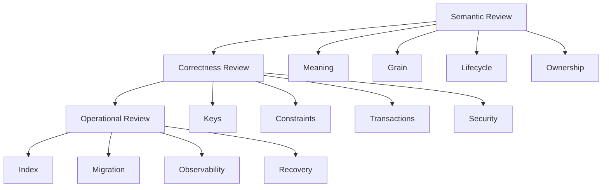
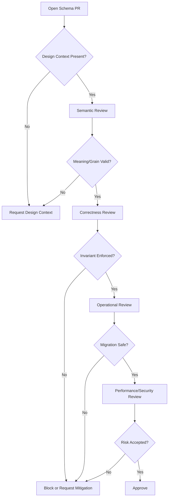

# Part 072 — Schema Review Checklist

Schema review bukan sekadar memeriksa apakah DDL bisa dijalankan.

Schema review adalah proses memastikan bahwa perubahan schema:

- menyimpan meaning yang benar;
- menjaga invariant;
- mendukung workload;
- aman terhadap concurrency;
- tidak memecahkan compatibility;
- tidak membuka celah security/privacy;
- dapat dimigrasikan tanpa outage;
- dapat diobservasi;
- dapat dipulihkan saat gagal;
- dapat dipertahankan di production dalam jangka panjang.

Checklist ini dibuat untuk dipakai saat:

- design review;
- pull request migration;
- schema review mingguan;
- incident postmortem;
- pre-production readiness;
- database architecture governance.

Gunakan checklist ini sebagai alat berpikir.

Jangan pakai seperti ritual centang kosong.

---

## 1. Review Model

Schema review yang bagus punya tiga level.



Jika semantic review gagal, jangan lanjut terlalu jauh ke index tuning.

Salah meaning tidak bisa diselamatkan oleh index bagus.

---

## 2. Review Severity

Tidak semua temuan sama beratnya.

Gunakan severity agar diskusi tidak berubah menjadi debat preferensi.

| Severity | Meaning | Example | Release Decision |
|---|---|---|---|
| Blocker | bisa menyebabkan data corruption, data leak, outage, irreversible migration | missing tenant boundary, unsafe destructive migration | tidak boleh merge |
| High | correctness/performance/security risk signifikan | missing unique constraint for business invariant | harus diperbaiki atau ada waiver |
| Medium | maintenance/performance future risk | unclear naming, missing secondary index for non-critical query | boleh merge dengan follow-up jelas |
| Low | style/readability improvement | inconsistent comment, minor naming | optional |

Rule:

> Kalau reviewer tidak bisa menjelaskan failure mode, jangan beri severity tinggi hanya karena preferensi.

---

## 3. Required Inputs Before Review

Jangan review schema dalam vacuum.

Minimal harus ada:

- [ ] problem statement;
- [ ] business process summary;
- [ ] source of truth / owner;
- [ ] DDL diff;
- [ ] migration plan;
- [ ] rollback or roll-forward plan;
- [ ] affected queries;
- [ ] affected APIs/jobs/reports;
- [ ] estimated row count and growth;
- [ ] security/privacy classification;
- [ ] test plan;
- [ ] observability plan for risky changes.

Jika input ini tidak ada, review akan berubah menjadi tebak-tebakan.

---

## 4. Semantic Checklist

### 4.1 Table Meaning

For every new or changed table:

- [ ] nama table merepresentasikan konsep domain, bukan UI screen;
- [ ] satu row memiliki grain yang jelas;
- [ ] table tidak mencampur beberapa lifecycle berbeda;
- [ ] table tidak menjadi dumping ground untuk “data tambahan”;
- [ ] table owner jelas;
- [ ] table canonical atau derived dijelaskan;
- [ ] table rebuildable atau non-rebuildable dijelaskan;
- [ ] table retention period jelas;
- [ ] table tenant-scoped atau global jelas.

Reviewer question:

> Satu row di tabel ini adalah satu apa?

Jika jawaban butuh tiga paragraf dan banyak pengecualian, grain kemungkinan buruk.

### 4.2 Naming

Check:

- [ ] nama table konsisten singular/plural sesuai standard tim;
- [ ] nama column tidak ambigu;
- [ ] tidak memakai `data`, `value`, `type`, `status` tanpa qualifier jelas;
- [ ] timestamp memakai nama sesuai meaning: `created_at`, `occurred_at`, `recorded_at`, `effective_from`, `processed_at`;
- [ ] boolean tidak menyembunyikan lifecycle kompleks;
- [ ] foreign key jelas dari nama: `case_id`, `actor_id`, `tenant_id`;
- [ ] public identifier berbeda dari internal identifier jika perlu;
- [ ] enum/status value memakai vocabulary domain, bukan label UI.

Bad:

```sql
status text NOT NULL,
value text,
type text NOT NULL,
```

Better:

```sql
lifecycle_state text NOT NULL,
assignment_role text NOT NULL,
classification_code text NOT NULL,
```

### 4.3 Glossary Alignment

Check:

- [ ] istilah schema cocok dengan glossary domain;
- [ ] istilah yang mirip dibedakan: `customer`, `party`, `account`, `user`, `actor`;
- [ ] istilah legal/regulatory tidak disederhanakan secara salah;
- [ ] istilah report/metric tidak disamakan dengan operational state;
- [ ] perubahan nama tidak membuat ambiguity di API dan analytics.

---

## 5. Ownership and Boundary Checklist

### 5.1 Source of Truth

Check:

- [ ] canonical owner jelas;
- [ ] tidak ada dua service yang menjadi writer untuk state yang sama;
- [ ] derived table/projection diberi label derived;
- [ ] rebuild path untuk derived data jelas;
- [ ] manual update path diaudit atau dilarang;
- [ ] support/admin tooling tidak menjadi hidden writer;
- [ ] reporting system tidak mengoreksi operational truth.

Question:

> Kalau row ini berbeda antara operational DB, search index, dan warehouse, mana yang benar?

Jika tidak ada jawaban, authority boundary belum jelas.

### 5.2 Service Boundary

Check:

- [ ] tabel tidak dibaca langsung oleh service lain tanpa contract;
- [ ] cross-service join tidak menjadi dependency runtime kritikal;
- [ ] ownership database-per-service dihormati jika arsitektur microservice;
- [ ] shared database schema punya module boundary jelas jika modular monolith;
- [ ] CDC/API/event contract jelas untuk consumer eksternal;
- [ ] breaking change sudah dikomunikasikan ke consumer.

---

## 6. Key and Identity Checklist

### 6.1 Primary Key

Check:

- [ ] setiap table punya primary key kecuali alasan kuat;
- [ ] primary key immutable;
- [ ] primary key tidak mengandung sensitive data;
- [ ] primary key tidak bergantung pada mutable business value;
- [ ] primary key cocok dengan access pattern dan distribution model;
- [ ] key generation tidak menjadi bottleneck;
- [ ] key aman untuk multi-region/sharding jika dibutuhkan;
- [ ] public ID tidak memaksa expose internal PK jika tidak aman.

Questions:

- Apakah row ini perlu stable identity selamanya?
- Apakah ID ini akan muncul di URL/log/event/report?
- Apakah ID ini perlu globally unique atau tenant-scoped?
- Apakah urutan ID menciptakan hot index page?

### 6.2 Natural Key

Check:

- [ ] natural key benar-benar immutable atau change process tersedia;
- [ ] natural key uniqueness ditegakkan dengan constraint;
- [ ] natural key tenant-scoped jika perlu;
- [ ] natural key tidak menyimpan PII sebagai identifier utama;
- [ ] format natural key tidak menjadi dependency internal berlebihan.

Example:

```sql
CONSTRAINT uq_case_tenant_number UNIQUE (tenant_id, case_number)
```

### 6.3 Foreign Key

Check:

- [ ] FK dipakai untuk relationship yang harus konsisten secara lokal;
- [ ] FK tidak dibuat lintas database/service jika ownership berbeda dan tidak supported;
- [ ] referential action (`RESTRICT`, `CASCADE`, `SET NULL`) dipilih sadar;
- [ ] FK column type sama dengan referenced key;
- [ ] FK tenant boundary aman;
- [ ] FK child column punya index jika delete/update parent atau join frequent;
- [ ] FK tidak menciptakan cascade delete berbahaya pada data regulated.

Bad:

```sql
-- tenant boundary not encoded; application must remember to filter.
case_id uuid NOT NULL REFERENCES regulatory_case(case_id)
```

Better for tenant-scoped relationship:

```sql
tenant_id uuid NOT NULL,
case_id uuid NOT NULL,
FOREIGN KEY (tenant_id, case_id)
    REFERENCES regulatory_case (tenant_id, case_id)
```

### 6.4 Polymorphic Reference

Blocker risk if this appears without strong justification:

```sql
entity_type text NOT NULL,
entity_id uuid NOT NULL
```

Review questions:

- Why not separate tables?
- How is referential integrity enforced?
- How is authorization enforced?
- How are migrations handled?
- How are queries indexed?
- How are deletes propagated?
- How is audit reconstruction done?

Acceptable only if:

- table is truly generic metadata/audit/event envelope;
- referential integrity is enforced elsewhere;
- failure mode is documented;
- consumers do not require strong relational joins.

---

## 7. Column and Type Checklist

### 7.1 Type Choice

Check:

- [ ] numeric types have sufficient range;
- [ ] money uses integer minor unit or decimal, not float;
- [ ] timestamps include timezone strategy;
- [ ] date vs timestamp decision is intentional;
- [ ] text length constraints are meaningful if used;
- [ ] JSON is used for flexible boundary, not to avoid modelling;
- [ ] enum/check/reference table decision is justified;
- [ ] arrays do not hide many-to-many relationships unless read-only/contained;
- [ ] binary/large payload not stored inline unless justified;
- [ ] collation/case-sensitivity considered for user-facing text.

Bad:

```sql
amount double precision NOT NULL
```

Better:

```sql
amount_minor bigint NOT NULL,
currency_code char(3) NOT NULL
```

or:

```sql
amount numeric(19, 4) NOT NULL,
currency_code char(3) NOT NULL
```

### 7.2 Nullability

Check:

- [ ] nullable means unknown/not applicable/not yet available, not lazy design;
- [ ] required domain facts are `NOT NULL`;
- [ ] nullable FK has clear lifecycle meaning;
- [ ] `NULL` does not break uniqueness semantics unexpectedly;
- [ ] query predicates handle null intentionally;
- [ ] reports define how null is counted;
- [ ] migration from nullable to not-null has validation plan.

Questions:

- What does null mean?
- Who can set it to null?
- Can it become non-null later?
- Can it return to null?
- Does null change authorization or lifecycle?

### 7.3 Defaults

Check:

- [ ] default is safe and semantically correct;
- [ ] default does not hide missing input;
- [ ] default timestamp meaning is clear;
- [ ] default status does not bypass workflow;
- [ ] default value does not create silent data quality issue.

Bad:

```sql
priority text NOT NULL DEFAULT 'normal'
```

This may hide missing classification.

Better:

```sql
priority text NOT NULL
```

unless product explicitly says default priority is normal.

### 7.4 Generated / Derived Columns

Check:

- [ ] derived value has one canonical formula;
- [ ] derived value is updated atomically;
- [ ] generated column or materialized projection is considered;
- [ ] stale derived value has detection/rebuild path;
- [ ] source column changes update derived value correctly;
- [ ] indexing derived value is necessary and measured.

---

## 8. Constraint Checklist

### 8.1 Basic Constraints

Check:

- [ ] primary key exists;
- [ ] unique constraints encode business uniqueness;
- [ ] `NOT NULL` used for required data;
- [ ] `CHECK` constraints encode simple domain rules;
- [ ] FK constraints preserve local referential integrity;
- [ ] exclusion constraints considered for non-overlap intervals where supported;
- [ ] partial unique index considered for conditional uniqueness;
- [ ] constraints are named meaningfully;
- [ ] constraint violation handling mapped to user/API errors.

Example:

```sql
CONSTRAINT ck_assignment_interval
CHECK (ended_at IS NULL OR ended_at > assigned_at)
```

### 8.2 Business Invariant Mapping

For every business invariant:

| Invariant | Constraint? | Transaction Rule? | Async Check? | Reason |
|---|---:|---:|---:|---|
| one active assignment per case | yes | yes | yes | critical correctness |
| user has valid certification | no | yes | maybe | external/policy data |
| report count matches source | no | no | yes | cross-store derived data |

Check:

- [ ] every invariant has enforcement level;
- [ ] critical invariant is not UI-only;
- [ ] async-only invariant has detection SLA;
- [ ] manual repair flow exists;
- [ ] tests intentionally violate constraints.

### 8.3 Constraint Evolution

Check:

- [ ] adding constraint to existing data has validation query;
- [ ] invalid historical data has repair plan;
- [ ] online validation strategy exists for large table;
- [ ] application compatibility exists before enforcement;
- [ ] rollback behavior is understood;
- [ ] constraint name stable for error mapping.

---

## 9. Index Checklist

### 9.1 Index Justification

Every index must map to one or more of:

- query access path;
- uniqueness/correctness;
- FK parent delete/update support;
- ordering/pagination;
- partial active subset;
- join path;
- search/filter pattern.

Check:

- [ ] index has named query owner;
- [ ] column order matches equality/range/order pattern;
- [ ] partial predicate matches query predicate exactly enough;
- [ ] low-cardinality index is justified;
- [ ] redundant indexes removed;
- [ ] write amplification acceptable;
- [ ] index build strategy safe for production size;
- [ ] index supports tenant prefix if queries are tenant-scoped;
- [ ] index does not expose sensitive search path unexpectedly.

### 9.2 Composite Index Order

Rule of thumb:

```txt
equality columns → range column → order-by columns → covering columns if supported/needed
```

Example:

```sql
CREATE INDEX ix_case_queue
    ON regulatory_case (tenant_id, lifecycle_state, priority, created_at DESC);
```

Supports:

```sql
WHERE tenant_id = :tenant_id
  AND lifecycle_state = 'under_review'
ORDER BY priority, created_at DESC
```

But if query usually filters by actor through assignment table, this index may be wrong.

Always design from actual query.

### 9.3 Partial Index

Check:

- [ ] predicate represents stable subset;
- [ ] query always includes predicate;
- [ ] predicate is not too broad;
- [ ] predicate does not drift with business meaning;
- [ ] partial unique index is used for conditional invariant;
- [ ] planner can recognize predicate from query shape.

Example:

```sql
CREATE UNIQUE INDEX uq_case_active_assignment
    ON case_assignment (tenant_id, case_id, assignment_role)
    WHERE ended_at IS NULL;
```

### 9.4 Foreign Key Index

PostgreSQL creates indexes for primary keys and unique constraints, but not automatically for referencing foreign key columns in child tables.

Review:

- [ ] child FK columns indexed when parent delete/update occurs;
- [ ] child FK columns indexed when joins are frequent;
- [ ] composite FK index column order matches query pattern;
- [ ] cascade action has performance impact reviewed.

Example:

```sql
CREATE INDEX ix_assignment_case
    ON case_assignment (tenant_id, case_id);
```

### 9.5 Index Smells

Smells:

- one index per column without query mapping;
- many overlapping composite indexes;
- index on boolean alone;
- index on `status` alone in huge multi-tenant table;
- index that starts with non-selective column while query is tenant-scoped;
- unused indexes kept forever;
- index added after incident without regression test;
- expression index without query normalization discipline;
- index on JSON field because schema modelling was avoided.

---

## 10. Query and Plan Checklist

### 10.1 Query Shape

Check:

- [ ] all important queries are listed;
- [ ] predicates are sargable;
- [ ] no function wraps indexed column unintentionally;
- [ ] pagination has deterministic order;
- [ ] high-offset pagination avoided for large sets;
- [ ] `SELECT *` avoided for hot path;
- [ ] join fan-out understood;
- [ ] `DISTINCT` not hiding bad join;
- [ ] `OR` conditions reviewed for index usage;
- [ ] optional filters do not create generic bad plans;
- [ ] report query not running against OLTP primary if heavy.

Bad:

```sql
WHERE lower(email) = lower(:email)
```

Potentially better:

```sql
-- normalize at write time or use a matching expression index intentionally.
WHERE email_normalized = :email_normalized
```

### 10.2 EXPLAIN Review

For high-risk queries, require:

- [ ] `EXPLAIN` or `EXPLAIN ANALYZE` from staging/prod-like data;
- [ ] estimated vs actual rows reviewed;
- [ ] scan type reviewed;
- [ ] join algorithm reviewed;
- [ ] sort/materialization reviewed;
- [ ] buffer/temp spill reviewed where available;
- [ ] plan stable under tenant skew;
- [ ] plan stable under realistic parameter values.

### 10.3 Query Ownership

Every hot query should have:

- query ID;
- owner team;
- SLO;
- dashboard;
- expected cardinality;
- index mapping;
- fallback strategy.

---

## 11. Lifecycle and State Checklist

### 11.1 Status Column Review

A `status` column is not automatically bad.

But review carefully.

Check:

- [ ] status values are finite and documented;
- [ ] allowed transitions are documented;
- [ ] terminal states defined;
- [ ] reversal/correction path defined;
- [ ] transition actor/reason/time/evidence captured if needed;
- [ ] transition history exists when audit matters;
- [ ] current state and history do not drift;
- [ ] constraints prevent impossible status if feasible;
- [ ] report semantics by status are clear.

Smell:

```sql
status text NOT NULL
```

without transition table or allowed value constraint.

Better:

```sql
CREATE TABLE case_transition (
    transition_id uuid PRIMARY KEY,
    tenant_id uuid NOT NULL,
    case_id uuid NOT NULL,
    from_state text,
    to_state text NOT NULL,
    transition_reason text NOT NULL,
    occurred_at timestamptz NOT NULL,
    actor_id uuid NOT NULL
);
```

### 11.2 Effective-Dated Data

Check:

- [ ] effective start and end semantics clear;
- [ ] half-open interval `[from, to)` used consistently;
- [ ] active row predicate clear;
- [ ] non-overlap invariant enforced or checked;
- [ ] point-in-time query tested;
- [ ] correction vs new fact distinguished;
- [ ] timezone strategy clear;
- [ ] report reconstruction tested.

---

## 12. Audit, History, and Traceability Checklist

Check:

- [ ] audit requirement is explicit, not assumed;
- [ ] audit row captures actor, action, target, time, reason, request ID;
- [ ] audit time semantics clear: occurred/recorded/processed;
- [ ] before/after data captured only when safe and necessary;
- [ ] sensitive data not leaked into audit logs unnecessarily;
- [ ] decision evidence is linked, not copied blindly;
- [ ] immutable/final records cannot be edited silently;
- [ ] correction/reversal path exists;
- [ ] audit can reconstruct required business state;
- [ ] audit retention matches compliance;
- [ ] audit table query/index strategy exists.

Question:

> If an auditor asks “why was this decision made on this date?”, can the database answer without guessing from current state?

---

## 13. Multi-Tenant and Security Checklist

### 13.1 Tenant Scope

Check:

- [ ] every tenant-scoped table has `tenant_id` or equivalent boundary;
- [ ] unique keys are scoped correctly;
- [ ] FK relationships preserve tenant boundary;
- [ ] indexes start with tenant key for tenant-scoped queries where appropriate;
- [ ] background jobs include tenant boundary;
- [ ] admin queries are safe;
- [ ] tenant deletion/export/restore is possible;
- [ ] noisy tenant can be identified;
- [ ] tenant migration path exists if needed.

### 13.2 RLS / Access Policy

Check:

- [ ] RLS needed or explicitly not needed;
- [ ] `USING` policy for read/update/delete reviewed;
- [ ] `WITH CHECK` policy for insert/update reviewed;
- [ ] table owner bypass risk understood;
- [ ] privileged roles separated;
- [ ] migration role privilege reviewed;
- [ ] policy performance impact reviewed;
- [ ] tests cover deny and allow paths;
- [ ] support/break-glass path audited.

### 13.3 Sensitive Data

Check:

- [ ] sensitive columns identified;
- [ ] PII not used as primary key;
- [ ] logs do not include raw sensitive values;
- [ ] masking strategy exists for analytics/support;
- [ ] encryption requirements documented;
- [ ] backup/export security reviewed;
- [ ] delete/erasure propagation reviewed;
- [ ] access to replicas/warehouse/search reviewed.

---

## 14. Retention, Delete, and Archival Checklist

Check:

- [ ] delete semantics clear: soft delete, hard delete, archive, anonymize;
- [ ] soft delete predicate is included in hot queries;
- [ ] partial unique indexes account for soft delete;
- [ ] FK/cascade behavior safe;
- [ ] restore from soft delete possible if required;
- [ ] purge job is chunked and observable;
- [ ] retention period documented;
- [ ] legal hold blocks purge;
- [ ] archive query path defined;
- [ ] search/warehouse/cache deletion propagation exists;
- [ ] backup retention conflict documented;
- [ ] audit trail preserved or anonymized according to policy.

Smell:

```sql
deleted boolean NOT NULL DEFAULT false
```

Better:

```sql
deleted_at timestamptz,
deleted_by uuid,
deleted_reason text
```

if deletion requires traceability.

---

## 15. Migration Checklist

### 15.1 DDL Safety

Check:

- [ ] migration is additive where possible;
- [ ] destructive changes delayed until compatibility window closes;
- [ ] lock behavior understood;
- [ ] lock timeout / statement timeout configured;
- [ ] large table DDL tested on realistic data size;
- [ ] index build strategy safe;
- [ ] constraint validation strategy safe;
- [ ] migration can be paused/resumed if long-running;
- [ ] migration has owner watching dashboards;
- [ ] deploy order documented.

### 15.2 Expand–Contract Safety

Check:

- [ ] old app works with new schema;
- [ ] new app works with old or expanded schema as required;
- [ ] dual-write period defined if needed;
- [ ] read switch uses flag/canary;
- [ ] old writes stopped before contract;
- [ ] contract step is delayed until no old consumers remain;
- [ ] compatibility matrix exists.

### 15.3 Backfill Safety

Check:

- [ ] backfill is idempotent;
- [ ] chunking key chosen;
- [ ] chunk size tested;
- [ ] rate limit exists;
- [ ] progress table/log exists;
- [ ] retry handles partial failure;
- [ ] validation query exists;
- [ ] data mismatch handling defined;
- [ ] WAL/replica lag impact considered;
- [ ] backfill can be stopped safely.

Example validation:

```sql
-- Example: active assignment parity check.
SELECT count(*) AS mismatch_count
FROM regulatory_case c
LEFT JOIN case_assignment a
  ON a.tenant_id = c.tenant_id
 AND a.case_id = c.case_id
 AND a.ended_at IS NULL
WHERE c.owner_id IS DISTINCT FROM a.actor_id;
```

### 15.4 Rollback vs Roll-Forward

Check:

- [ ] rollback possible before each step;
- [ ] roll-forward plan exists after irreversible step;
- [ ] data written during new version is not lost on rollback;
- [ ] feature flags can disable reads/writes independently;
- [ ] old schema is not dropped too early;
- [ ] backup/snapshot point identified for high-risk changes;
- [ ] support/on-call knows rollback command.

---

## 16. Transaction and Concurrency Checklist

Check:

- [ ] write path has explicit transaction boundary;
- [ ] read-modify-write protected;
- [ ] isolation level sufficient for invariant;
- [ ] optimistic lock version used where appropriate;
- [ ] unique constraint used for race-prone uniqueness;
- [ ] row lock/advisory lock used only with clear ordering;
- [ ] deadlock risk reviewed;
- [ ] retry policy defined by error type;
- [ ] idempotency key used for external retry;
- [ ] outbox used for DB + event atomicity;
- [ ] external side effects not executed inside DB transaction unless safe;
- [ ] work queue claim is concurrency-safe;
- [ ] concurrency tests exist.

Bad:

```txt
1. SELECT count(*) active assignment
2. if count == 0 INSERT assignment
```

This races.

Better:

```sql
INSERT INTO case_assignment (...)
VALUES (...)
ON CONFLICT ON CONSTRAINT uq_case_active_assignment
DO NOTHING;
```

or use a transaction with lock/constraint depending DB capabilities.

---

## 17. Derived Data and Denormalization Checklist

Check:

- [ ] duplicated data has source owner;
- [ ] freshness contract documented;
- [ ] update mechanism atomic or reconciled;
- [ ] rebuild path exists;
- [ ] drift detection query exists;
- [ ] derived data not used as authority accidentally;
- [ ] historical snapshot semantics clear;
- [ ] denormalized field has reason: latency, report, search, snapshot, integration;
- [ ] write amplification acceptable;
- [ ] migration and deletion propagation handled.

Smell:

```sql
case.assignee_name text
```

Question:

- Is this snapshot at assignment time?
- Or should it update when actor name changes?
- Is it for display performance?
- How is it repaired if stale?

---

## 18. CDC, Event, and Integration Checklist

Check:

- [ ] schema change impact on CDC consumers reviewed;
- [ ] event contract versioned;
- [ ] outbox event generated atomically with state change;
- [ ] event ordering scope documented;
- [ ] consumer idempotency key defined;
- [ ] delete/tombstone semantics defined;
- [ ] replay/backfill strategy exists;
- [ ] DLQ handling defined;
- [ ] PII in events reviewed;
- [ ] search/warehouse/cache projection update path reviewed;
- [ ] consumer compatibility tested.

Questions:

- Can a consumer see new column as null?
- Can a consumer handle enum/status addition?
- Can a consumer rebuild from snapshot + stream?
- Can duplicate event cause duplicate side effect?
- Can out-of-order event corrupt projection?

---

## 19. Reporting and Analytics Checklist

Check:

- [ ] operational schema not overloaded for heavy reports;
- [ ] report grain defined;
- [ ] metric definitions versioned;
- [ ] taxonomy/reference versioning handled;
- [ ] slowly changing dimension strategy exists if needed;
- [ ] report reproducibility requirement defined;
- [ ] direct OLTP reporting approved only if safe;
- [ ] materialized/aggregate/snapshot model considered;
- [ ] privacy masking in analytics reviewed;
- [ ] reconciliation between source and report exists.

Question:

> If the report is regenerated six months later, should the number match the old report or reflect latest corrections?

Both can be valid.

But the schema must know which one is required.

---

## 20. Observability Checklist

Check:

- [ ] query IDs or identifiable SQL patterns exist for hot paths;
- [ ] slow query logging configured where appropriate;
- [ ] metrics for affected workload exist;
- [ ] lock wait monitoring exists;
- [ ] migration progress observable;
- [ ] constraint violation/error rate observable;
- [ ] outbox/CDC lag observable;
- [ ] replica lag considered;
- [ ] data quality drift queries scheduled;
- [ ] dashboard updated before release;
- [ ] alerts have runbook links.

Minimum production signals:

| Signal | Why |
|---|---|
| query latency by endpoint/query | catch plan/index regression |
| lock wait | catch DDL/concurrency issue |
| rows changed by migration | detect stuck backfill |
| constraint violation count | detect application/data bug |
| replica lag | prevent stale read bugs |
| outbox lag | detect integration failure |
| table/index size | detect growth/cost issue |

---

## 21. Backup, Restore, and Recovery Checklist

Check:

- [ ] schema change included in backup/restore tests;
- [ ] restore of new table validated;
- [ ] point-in-time recovery impact understood;
- [ ] tenant-level restore impact reviewed;
- [ ] migration rollback does not rely on unavailable backup;
- [ ] derived tables can be rebuilt;
- [ ] backup includes required metadata;
- [ ] retention and legal hold respected;
- [ ] restore runbook updated;
- [ ] high-risk migration has restore rehearsal if needed.

Question:

> If this migration corrupts data at 10:00 and we detect it at 14:00, what exactly do we restore, replay, or repair?

---

## 22. Capacity and Cost Checklist

Check:

- [ ] expected row count estimated;
- [ ] growth rate estimated;
- [ ] largest tenant skew considered;
- [ ] row width estimated;
- [ ] index size estimated;
- [ ] WAL/write amplification considered;
- [ ] backup size impact considered;
- [ ] query working set considered;
- [ ] partitioning threshold defined;
- [ ] archive/purge threshold defined;
- [ ] cost of projections/duplicates justified;
- [ ] capacity dashboard has scaling indicators.

Red flags:

- append-only table with no retention;
- JSON payload growing unbounded;
- many secondary indexes on high-write table;
- active queue table with no partition/archive plan;
- tenant skew ignored;
- historical audit table queried without date/tenant index.

---

## 23. PostgreSQL Review Snippets

These are starter snippets for review.

Adapt to your schema and version.

### 23.1 Tables Without Primary Key

```sql
SELECT n.nspname AS schema_name,
       c.relname AS table_name
FROM pg_class c
JOIN pg_namespace n ON n.oid = c.relnamespace
WHERE c.relkind = 'r'
  AND n.nspname NOT IN ('pg_catalog', 'information_schema')
  AND NOT EXISTS (
      SELECT 1
      FROM pg_index i
      WHERE i.indrelid = c.oid
        AND i.indisprimary
  )
ORDER BY 1, 2;
```

### 23.2 Foreign Keys Without Matching Child Index Prefix

This is a conservative helper. Review manually.

```sql
WITH fk AS (
    SELECT con.oid,
           con.conrelid,
           con.conname,
           con.conkey
    FROM pg_constraint con
    WHERE con.contype = 'f'
),
idx AS (
    SELECT indrelid,
           indkey::int2[] AS indkey
    FROM pg_index
)
SELECT conrelid::regclass AS table_name,
       conname AS fk_name,
       conkey AS fk_columns
FROM fk
WHERE NOT EXISTS (
    SELECT 1
    FROM idx
    WHERE idx.indrelid = fk.conrelid
      AND idx.indkey[0:array_length(fk.conkey, 1)-1] = fk.conkey
)
ORDER BY 1, 2;
```

Caution:

- expression indexes and some advanced cases need manual review;
- column order matters;
- not every FK needs child index, but many production schemas do.

### 23.3 Largest Tables and Indexes

```sql
SELECT relname AS relation,
       pg_size_pretty(pg_total_relation_size(oid)) AS total_size,
       pg_size_pretty(pg_relation_size(oid)) AS table_size,
       pg_size_pretty(pg_indexes_size(oid)) AS indexes_size
FROM pg_class
WHERE relkind IN ('r', 'p')
ORDER BY pg_total_relation_size(oid) DESC
LIMIT 30;
```

### 23.4 Approximate Row Counts

```sql
SELECT schemaname,
       relname,
       n_live_tup,
       n_dead_tup,
       last_vacuum,
       last_autovacuum,
       last_analyze,
       last_autoanalyze
FROM pg_stat_user_tables
ORDER BY n_live_tup DESC
LIMIT 50;
```

### 23.5 Potentially Unused Indexes

```sql
SELECT schemaname,
       relname AS table_name,
       indexrelname AS index_name,
       idx_scan,
       pg_size_pretty(pg_relation_size(indexrelid)) AS index_size
FROM pg_stat_user_indexes
ORDER BY idx_scan ASC, pg_relation_size(indexrelid) DESC
LIMIT 50;
```

Caution:

- stats reset after restart/reset;
- rarely used critical indexes may still be necessary;
- unique/constraint indexes may protect correctness even if low scan count.

### 23.6 Duplicate Active Assignment Drift Example

```sql
SELECT tenant_id, case_id, assignment_role, count(*) AS active_count
FROM case_assignment
WHERE ended_at IS NULL
GROUP BY tenant_id, case_id, assignment_role
HAVING count(*) > 1;
```

### 23.7 Long-Running Transactions

```sql
SELECT pid,
       usename,
       application_name,
       state,
       now() - xact_start AS xact_age,
       now() - query_start AS query_age,
       wait_event_type,
       wait_event,
       left(query, 500) AS query
FROM pg_stat_activity
WHERE xact_start IS NOT NULL
ORDER BY xact_start ASC;
```

### 23.8 Lock Wait Inspection

```sql
SELECT blocked.pid AS blocked_pid,
       blocked.query AS blocked_query,
       blocking.pid AS blocking_pid,
       blocking.query AS blocking_query
FROM pg_stat_activity blocked
JOIN pg_locks blocked_locks
  ON blocked_locks.pid = blocked.pid
JOIN pg_locks blocking_locks
  ON blocking_locks.locktype = blocked_locks.locktype
 AND blocking_locks.database IS NOT DISTINCT FROM blocked_locks.database
 AND blocking_locks.relation IS NOT DISTINCT FROM blocked_locks.relation
 AND blocking_locks.page IS NOT DISTINCT FROM blocked_locks.page
 AND blocking_locks.tuple IS NOT DISTINCT FROM blocked_locks.tuple
 AND blocking_locks.virtualxid IS NOT DISTINCT FROM blocked_locks.virtualxid
 AND blocking_locks.transactionid IS NOT DISTINCT FROM blocked_locks.transactionid
 AND blocking_locks.classid IS NOT DISTINCT FROM blocked_locks.classid
 AND blocking_locks.objid IS NOT DISTINCT FROM blocked_locks.objid
 AND blocking_locks.objsubid IS NOT DISTINCT FROM blocked_locks.objsubid
 AND blocking_locks.pid != blocked_locks.pid
JOIN pg_stat_activity blocking
  ON blocking.pid = blocking_locks.pid
WHERE NOT blocked_locks.granted
  AND blocking_locks.granted;
```

---

## 24. PR Comment Templates

Use precise comments.

### 24.1 Missing Grain

```md
I cannot review this table safely yet because the row grain is unclear.
Please add one sentence answering: “one row in `<table>` represents one ___”.
This affects key choice, uniqueness, retention, and query design.
```

### 24.2 Missing Invariant Enforcement

```md
The design states that only one active assignment may exist per case, but I do not see a DB-level or transaction-level enforcement mechanism.
Please add either a partial unique index, a locking strategy, or a clear reason why this invariant cannot be enforced in the database.
```

### 24.3 Unsafe Migration

```md
This migration appears destructive before all app versions are compatible.
Please rewrite as expand–backfill–validate–contract or provide a compatibility matrix showing why no old writer/reader can break.
```

### 24.4 Index Without Workload

```md
This index may be valid, but the PR does not map it to a query shape or invariant.
Please add the query it supports, expected cardinality, and whether the column order matches equality/range/order usage.
```

### 24.5 Tenant Boundary Risk

```md
This FK/reference does not include tenant scope. If IDs are not globally unique or if tenant isolation must be enforced structurally, this can allow cross-tenant association.
Please document the isolation guarantee or include `tenant_id` in the relationship.
```

---

## 25. Review Flow for Pull Requests

Use this sequence.



Do not approve schema PR only because tests pass.

Tests usually cover expected behavior.

Schema review must cover unexpected behavior.

---

## 26. Minimal Checklist for Emergency Changes

Sometimes production requires emergency schema change.

Even then, use a minimal checklist.

- [ ] What production issue does this fix?
- [ ] Is the change additive?
- [ ] What lock does it take?
- [ ] What is the exact SQL?
- [ ] What is the rollback/roll-forward?
- [ ] What metric proves it helped?
- [ ] What metric proves it hurt?
- [ ] Who is watching production?
- [ ] How do we document follow-up cleanup?

Emergency does not mean uncontrolled.

Emergency means faster control loop.

---

## 27. Blocker Patterns

These should usually block merge.

### 27.1 Missing Tenant Boundary on Tenant Data

Example:

```sql
case_id uuid NOT NULL
```

without `tenant_id` in a table that is tenant-scoped.

Potential impact:

- cross-tenant association;
- data leak;
- impossible tenant restore/export;
- noisy tenant diagnosis failure.

### 27.2 Destructive Migration Without Compatibility Window

Example:

```sql
ALTER TABLE regulatory_case DROP COLUMN owner_id;
```

while old app still reads/writes `owner_id`.

Potential impact:

- immediate outage;
- rollback failure;
- data loss.

### 27.3 Business Uniqueness Without Constraint

Example:

> There can only be one active assignment.

but no unique constraint, lock, or serializable transaction.

Potential impact:

- duplicate work;
- audit ambiguity;
- race condition under load.

### 27.4 Sensitive Data in Logs/Audit Without Policy

Example:

```sql
old_payload jsonb,
new_payload jsonb
```

containing raw PII.

Potential impact:

- privacy breach;
- retention conflict;
- excessive access exposure.

### 27.5 Unbounded Array or JSON in Hot Entity

Example:

```sql
comments jsonb NOT NULL DEFAULT '[]'
```

for ever-growing comments.

Potential impact:

- row bloat;
- write amplification;
- concurrency conflicts;
- impossible per-comment authorization/audit.

---

## 28. Schema Review Scorecard

For larger designs, score each area.

| Area | Score 0–3 | Notes |
|---|---:|---|
| Domain meaning |  | 0 unclear, 3 clear grain/glossary |
| Ownership/source of truth |  | 0 ambiguous, 3 explicit authority |
| Invariant enforcement |  | 0 UI-only, 3 DB/transaction enforced |
| Query/index fit |  | 0 unknown workload, 3 mapped/tested |
| Migration safety |  | 0 destructive, 3 expand-contract tested |
| Concurrency safety |  | 0 races likely, 3 tested/handled |
| Security/privacy |  | 0 unknown, 3 classified/enforced |
| Observability |  | 0 invisible, 3 dashboards/runbooks |
| Recovery |  | 0 no plan, 3 restore/repair tested |
| Evolution |  | 0 brittle, 3 versioned/compatible |

Interpretation:

| Total | Meaning |
|---:|---|
| 0–10 | not ready for production |
| 11–20 | significant design risk |
| 21–25 | acceptable with mitigations |
| 26–30 | strong production-ready design |

Do not use the score as bureaucracy.

Use it to expose risk concentration.

---

## 29. Reviewer Mindset

A weak reviewer asks:

> Is this DDL syntactically valid?

A stronger reviewer asks:

> What illegal state can enter this system?

A top-tier reviewer asks:

> Under concurrency, migration, scale, stale reads, partial failure, security boundaries, and future evolution, can this schema still preserve the truth it claims to own?

That is the mental model.

Schema review is not about perfection.

It is about reducing irreversible mistakes before they become operational facts.

---

## 30. Final Compact Checklist

Use this when reviewing quickly.

### Meaning

- [ ] row grain clear;
- [ ] source of truth clear;
- [ ] lifecycle clear;
- [ ] glossary aligned.

### Correctness

- [ ] PK/FK/unique/check constraints appropriate;
- [ ] critical invariants enforced;
- [ ] null/default semantics intentional;
- [ ] concurrency/race conditions handled.

### Workload

- [ ] access patterns listed;
- [ ] indexes mapped to queries/invariants;
- [ ] plans reviewed for hot queries;
- [ ] write amplification acceptable.

### Evolution

- [ ] migration additive/safe;
- [ ] backfill idempotent;
- [ ] compatibility matrix exists;
- [ ] rollback/roll-forward defined.

### Security

- [ ] tenant boundary enforced;
- [ ] sensitive data classified;
- [ ] access policy reviewed;
- [ ] export/analytics/backup impact reviewed.

### Operations

- [ ] observability exists;
- [ ] capacity/growth considered;
- [ ] backup/restore impact known;
- [ ] runbook updated.

If any section has a high-risk unknown, do not approve blindly.

Turn the unknown into a decision, test, migration guard, or explicit risk acceptance.

---

## 31. References

- PostgreSQL Documentation — Constraints, indexes, `ALTER TABLE`, row-level security, monitoring statistics, `EXPLAIN`.
- AWS Well-Architected Framework — Operational Excellence, Security, Reliability, Performance Efficiency.
- Google Cloud Architecture Framework — Operational excellence, security, privacy, compliance, reliability.
- Prior parts in this series: Part 008, 023, 024, 047, 048, 052, 053, 058, 060, 061, 062, 070.
