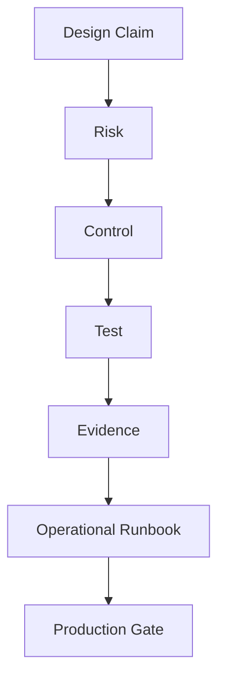
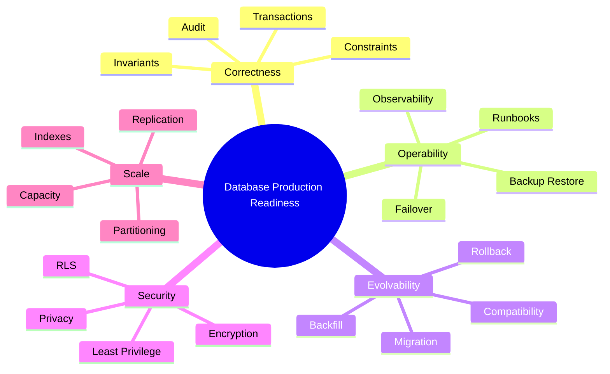
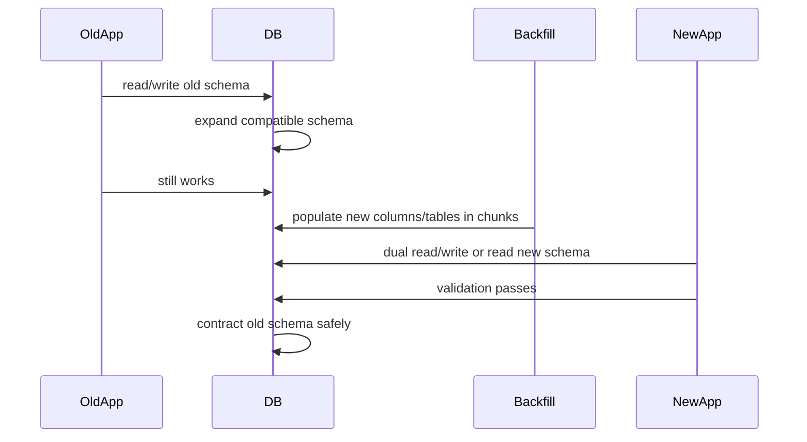

# Part 073 — Production Readiness Checklist

Production-ready database bukan database yang “sudah bisa menyimpan data”.

Production-ready database adalah database yang:

- menyimpan **state yang benar**;
- menolak **illegal state**;
- tetap bisa dipakai saat workload naik;
- bisa diubah tanpa outage yang tidak perlu;
- bisa dipulihkan saat rusak;
- bisa diaudit setelah terjadi dispute;
- bisa dioperasikan oleh manusia biasa saat jam buruk;
- punya bukti bahwa klaim reliability/security/performance benar-benar diuji.

Banyak desain database gagal bukan karena SQL-nya salah. Ia gagal karena tidak siap terhadap realitas production:

- migrasi berjalan terlalu lama dan mengunci tabel;
- index bagus di staging tapi buruk di data production;
- query reporting membunuh OLTP;
- backup ada tapi restore belum pernah dicoba;
- replica ada tapi failover runbook tidak jelas;
- RLS ada tapi ada role dengan bypass yang dipakai aplikasi;
- audit ada tapi tidak bisa menjawab “siapa mengubah apa, kapan, dari nilai apa ke nilai apa, dan berdasarkan authority apa?”;
- data bisa dihapus tapi retention, legal hold, dan downstream projection tidak ikut benar.

Checklist ini dibuat sebagai **pre-production gate** dan **periodic review artifact**.

Gunakan part ini sebelum:

- meluncurkan database/service baru;
- menjalankan migrasi besar;
- memecah monolith database;
- menambahkan projection/search/warehouse;
- menaikkan traffic atau tenant besar;
- melewati audit/security review;
- menerima sistem dari vendor/team lain;
- menyatakan sistem “production ready”.

---

## 1. Mental Model: Production Readiness Is Evidence, Not Confidence

Kalimat seperti ini tidak cukup:

> “Seharusnya aman.”

Yang dibutuhkan:

> “Ini aman untuk workload X karena invariant Y dijaga oleh constraint Z, migrasi sudah diuji dengan data 2x production size, rollback path A tersedia, restore drill terakhir berhasil dalam 43 menit, dan dashboard B akan memberi alert sebelum SLO terlanggar.”

Production readiness berarti setiap klaim punya evidence.



Contoh:

| Claim | Risk | Control | Evidence |
|---|---|---|---|
| Tenant data isolated | Cross-tenant leak | Composite keys + RLS + test matrix | Automated RLS negative tests |
| Write path retry-safe | Duplicate case created | Idempotency key + unique constraint | Chaos retry test |
| Migration zero-downtime | DDL lock outage | Expand-contract + timeout + concurrent index | Staging migration replay |
| Backup valid | Restore fails during incident | PITR + restore drill | Restore report with checksum |
| Read scaling safe | Stale decision shown | Freshness contract + primary routing | Lag simulation test |

Rule:

> No evidence, no readiness.

---

## 2. Readiness Categories

Database production readiness mencakup 14 kategori:

1. ownership and authority;
2. data model and invariants;
3. schema and physical design;
4. query and index readiness;
5. transaction and concurrency;
6. migration and compatibility;
7. backup, restore, and disaster recovery;
8. replication and failover;
9. observability and alerting;
10. security and access control;
11. privacy, retention, and compliance;
12. integration and derived data;
13. capacity, performance, and cost;
14. operational runbooks and incident response.



---

## 3. Readiness Decision Levels

Tidak semua findings sama beratnya.

Gunakan level berikut:

| Level | Meaning | Release Decision |
|---|---|---|
| P0 blocker | Bisa menyebabkan data loss, security breach, unrecoverable outage, cross-tenant leak, atau regulatory violation | Tidak boleh release |
| P1 serious | Bisa menyebabkan outage, data drift besar, performance collapse, atau manual recovery berat | Release hanya dengan explicit exception |
| P2 moderate | Risiko nyata tapi mitigasi manual tersedia | Boleh release dengan follow-up dated owner |
| P3 improvement | Kualitas/operability bisa ditingkatkan | Tidak menghalangi release |

Contoh P0:

- tidak ada tested restore path;
- tidak ada ownership data yang jelas;
- operasi mutasi penting tidak idempotent padahal client retry otomatis;
- multi-tenant table tidak punya tenant isolation yang bisa diuji;
- destructive migration tidak punya rollback/roll-forward plan;
- aplikasi memakai database superuser;
- audit trail bisa diedit tanpa jejak;
- data PII masuk log, CDC, atau warehouse tanpa klasifikasi.

---

## 4. Production Readiness Scorecard

Gunakan score 0–3 per kategori:

| Score | Meaning |
|---:|---|
| 0 | Tidak ada desain/kontrol/test |
| 1 | Ada desain, belum ada test/evidence |
| 2 | Ada kontrol dan test dasar |
| 3 | Ada kontrol, automated test/monitoring, runbook, dan owner |

Template:

| Category | Score | Evidence | Owner | Blocker? |
|---|---:|---|---|---|
| Data authority |  |  |  |  |
| Invariants |  |  |  |  |
| Migration safety |  |  |  |  |
| Backup/restore |  |  |  |  |
| Observability |  |  |  |  |
| Security |  |  |  |  |
| Privacy/retention |  |  |  |  |
| Performance/capacity |  |  |  |  |
| Runbooks |  |  |  |  |

Minimum recommended gate:

- no P0 blocker;
- P1 must have signed exception;
- backup/restore must be at least score 2;
- security/access control must be at least score 2;
- migration safety must be at least score 2 for any schema-changing release;
- observability must be at least score 2 for production traffic.

---

## 5. Ownership and Authority Checklist

Sebelum bicara index, jawab dulu: **siapa pemilik truth?**

### 5.1 Questions

- Database ini authoritative untuk entity apa?
- Entity mana yang hanya cache/projection?
- Service/team mana yang boleh mengubah entity tersebut?
- Apakah ada write path lain selain service owner?
- Apakah report/export dianggap authoritative oleh user?
- Jika ada conflict antara database ini dan sistem lain, siapa yang menang?
- Apakah ada manual correction path?
- Apakah correction menghapus history atau membuat correction event?

### 5.2 Required Artifacts

| Artifact | Required? | Why |
|---|---|---|
| Data ownership map | Yes | Mencegah dual authority |
| Source-of-truth declaration | Yes | Menjelaskan canonical store |
| Write ownership policy | Yes | Mencegah uncontrolled writes |
| Correction policy | Yes | Menangani data salah tanpa memalsukan history |
| Derived data list | Yes | Menjelaskan projection/cache/report/search |
| Consumer registry | Recommended | Memahami impact schema changes |

### 5.3 Common Failure Modes

| Failure | Symptom | Prevention |
|---|---|---|
| Dual authority | Data berubah di dua sistem berbeda | Single write owner + integration contract |
| Shadow writes | DBA/support update manual tanpa event | Correction workflow + audit |
| Projection mistaken as truth | User mengacu data stale | Freshness label + source label |
| Unknown consumers | Migration mematahkan downstream | Consumer registry + contract test |

---

## 6. Data Model and Invariant Checklist

Database design production-ready jika illegal state sulit masuk.

### 6.1 Invariant Inventory

Tuliskan invariant dalam format eksplisit:

```text
Invariant: A closed case cannot receive a new enforcement decision.
Enforced by: application guard + state transition transaction + CHECK/trigger where possible.
Failure if violated: regulatory decision after final closure, audit dispute.
Test: concurrent transition test + negative SQL test.
Evidence: test suite link + migration constraint.
```

### 6.2 Constraint Coverage

| Rule Type | Preferred Enforcement |
|---|---|
| Required value | `NOT NULL` |
| Domain value | `CHECK`, reference table, enum with migration discipline |
| Uniqueness | `UNIQUE`, partial unique index |
| Referential integrity | Foreign key where same ownership boundary |
| Temporal non-overlap | Exclusion constraint or transactional guard |
| Cross-row aggregate invariant | Parent lock, materialized invariant row, serializable transaction |
| Workflow transition invariant | Transition table + transaction guard |
| External side effect invariant | Outbox + idempotency key |

### 6.3 Checklist

- [ ] Every table has a clear semantic grain.
- [ ] Every mutable state has a lifecycle definition.
- [ ] Every status has allowed transitions.
- [ ] Every critical invariant has an enforcement location.
- [ ] Every enforcement location has a test.
- [ ] Critical constraints are not only hidden in frontend validation.
- [ ] Nullable columns are intentionally nullable.
- [ ] Reference tables are versioned if their meaning changes over time.
- [ ] Derived values have source, refresh, and repair strategy.
- [ ] Deletion semantics are explicit: delete, soft delete, archive, anonymize, purge.

### 6.4 Blocker Smells

- `status varchar(50)` with no state transition model.
- `metadata jsonb` used for fields that drive workflow decisions.
- `deleted_at` exists but all queries rely on developer memory to filter it.
- Duplicate business records prevented only by “check then insert”.
- No uniqueness constraint for external request ID or idempotency key.
- Audit rows can be updated or deleted by the application role.

---

## 7. Schema and Physical Design Checklist

### 7.1 Table Readiness

For every table:

| Question | Expected Answer |
|---|---|
| What is one row? | One precise semantic unit |
| Who owns this table? | One service/team/domain |
| Can rows be updated? | Clear lifecycle and mutation rules |
| Can rows be deleted? | Clear retention/delete rule |
| How big can it get? | Growth estimate |
| Which queries hit it? | Known access patterns |
| Which indexes support those queries? | Documented index contract |
| Is it tenant-scoped? | Tenant key strategy |
| Does it contain sensitive data? | Classification and access control |

### 7.2 Column Readiness

- [ ] Column names reflect business meaning, not UI label.
- [ ] Type matches domain, not convenience.
- [ ] Money uses integer minor units or exact numeric discipline.
- [ ] Timestamp semantics are clear: event time, transaction time, effective time, processing time.
- [ ] Timezone policy is explicit.
- [ ] String columns have reasonable length or justification.
- [ ] JSON columns are not hiding core relational invariants.
- [ ] PII columns are classified.
- [ ] Audit/correction-sensitive fields have history strategy.

### 7.3 Primary Key Readiness

- [ ] Primary key is immutable.
- [ ] Public identifier is separated from internal identifier if enumeration/security matters.
- [ ] Composite key is used when it strengthens tenant/parent ownership boundary.
- [ ] Natural key changes are accounted for.
- [ ] External IDs have source namespace.

Example:

```sql
create table external_reference (
  source_system text not null,
  source_entity_type text not null,
  source_entity_id text not null,
  local_entity_type text not null,
  local_entity_id uuid not null,
  created_at timestamptz not null default now(),
  primary key (source_system, source_entity_type, source_entity_id)
);
```

---

## 8. Query and Index Readiness Checklist

Index readiness starts from workload, not from column list.

### 8.1 Access Pattern Inventory

For each important query:

```text
Query name: Case inbox
Actor: investigator
Frequency: 500/min peak
Freshness: must be primary after assignment update
Predicate: tenant_id, assigned_user_id, status in active states
Sort: due_at asc, priority desc
Pagination: keyset
Expected p95: < 100 ms
Index: (tenant_id, assigned_user_id, status, due_at, priority, id)
Plan evidence: EXPLAIN ANALYZE on production-like data
```

### 8.2 Checklist

- [ ] Each critical query has a named access pattern.
- [ ] Each access pattern has expected latency and frequency.
- [ ] Each OLTP list query has deterministic order.
- [ ] High-volume list queries use keyset pagination where possible.
- [ ] `OFFSET` use is justified and bounded.
- [ ] Composite indexes follow equality → range → order reasoning.
- [ ] Indexes are not duplicated accidentally.
- [ ] Write amplification from indexes is measured.
- [ ] Foreign key columns used in delete/update paths are indexed.
- [ ] Soft-delete predicates are reflected in partial indexes when useful.
- [ ] Multi-tenant queries cannot forget tenant filter.
- [ ] Query plans are tested on production-like cardinality/skew.

### 8.3 PostgreSQL Diagnosis Snippets

Top statements by total time:

```sql
select
  queryid,
  calls,
  total_exec_time,
  mean_exec_time,
  rows,
  left(query, 160) as sample_query
from pg_stat_statements
order by total_exec_time desc
limit 20;
```

Index usage:

```sql
select
  schemaname,
  relname,
  indexrelname,
  idx_scan,
  idx_tup_read,
  idx_tup_fetch
from pg_stat_user_indexes
order by idx_scan asc, idx_tup_read desc
limit 50;
```

Sequential scan suspects:

```sql
select
  schemaname,
  relname,
  seq_scan,
  seq_tup_read,
  idx_scan,
  n_live_tup
from pg_stat_user_tables
where n_live_tup > 100000
order by seq_tup_read desc
limit 50;
```

---

## 9. Transaction and Concurrency Readiness Checklist

A database is not production-ready if correctness only holds in single-user testing.

### 9.1 Critical Write Path Review

For each write command:

| Question | Answer Required |
|---|---|
| What invariant can concurrent requests violate? | Explicit invariant list |
| Is command idempotent? | Key/fingerprint/replay behavior |
| What rows are locked? | Lock acquisition order |
| What isolation level is assumed? | `READ COMMITTED`, serializable, explicit lock, etc. |
| What happens on retry? | Safe retry policy |
| What happens after commit but before response? | Idempotent result retrieval |
| Does it publish events? | Outbox/inbox design |

### 9.2 Checklist

- [ ] Every externally retried command has idempotency design.
- [ ] Every read-modify-write operation is atomic or guarded.
- [ ] Critical uniqueness is enforced by database constraint.
- [ ] State transitions are performed in one transaction.
- [ ] Lock acquisition order is documented for multi-row updates.
- [ ] Deadlock and serialization errors are classified as retryable where safe.
- [ ] External side effects are not executed inside ambiguous transaction boundary without outbox/coordination.
- [ ] Work queue uses safe claiming pattern (`FOR UPDATE SKIP LOCKED` or equivalent) if relevant.
- [ ] Batch jobs use chunking and do not hold long transactions unnecessarily.

### 9.3 Concurrency Test Matrix

| Scenario | Test |
|---|---|
| Same command retried 10x | One effect, same response |
| Two users close same case | One wins; loser gets conflict |
| Assignment and closure race | Illegal transition rejected |
| Event publish failure after commit | Outbox remains pending |
| Deadlock | Retry or fail safely |
| Lock timeout | No partial state |

---

## 10. Migration and Compatibility Readiness Checklist

Migration readiness is about change under traffic.

### 10.1 Required Plan

Every production migration should answer:

- Is this expand, migrate, or contract?
- Is it backward compatible with old app version?
- Is it forward compatible with new app version?
- What lock does it take?
- How long does it run on production-sized data?
- Can it be paused/resumed?
- How is progress observed?
- What is rollback or roll-forward plan?
- What is the validation query?
- Which downstream consumers are affected?

### 10.2 Safe Migration Pattern



### 10.3 Checklist

- [ ] DDL lock behavior reviewed.
- [ ] Large index build uses safe/concurrent strategy where supported.
- [ ] Backfill is chunked, resumable, and observable.
- [ ] Old and new app versions can coexist.
- [ ] Contract phase is delayed until old version gone.
- [ ] Long-running migration has timeout/kill plan.
- [ ] Migration has production-like rehearsal.
- [ ] Migration has validation query.
- [ ] Migration has stakeholder communication for risk window.
- [ ] Migration does not break CDC/search/warehouse consumers.

### 10.4 Blocker Smells

- `alter table ... add column ... not null` without default/backfill strategy on huge table.
- Rename column and deploy app at same time without compatibility layer.
- Backfill runs in one transaction across millions of rows.
- Migration rollback assumes data can be trivially reconstructed.
- No measured runtime on production-like data.

---

## 11. Backup, Restore, and Disaster Recovery Checklist

Backup is not the product. Restore is the product.

### 11.1 Required Definitions

| Term | Must Be Defined |
|---|---|
| RPO | Maximum acceptable data loss |
| RTO | Maximum acceptable recovery time |
| PITR window | How far back point-in-time recovery is possible |
| Backup retention | How long backups are kept |
| Restore target | Whole cluster, database, schema, table, tenant, object |
| Restore authority | Who can initiate restore |
| Restore validation | How restored data correctness is proven |

### 11.2 Checklist

- [ ] Backup schedule documented.
- [ ] PITR or equivalent is configured if RPO requires it.
- [ ] WAL/binlog/archive path is monitored.
- [ ] Backups are encrypted.
- [ ] Backup access is least-privilege.
- [ ] Restore drill has been performed recently.
- [ ] Restore time was measured, not guessed.
- [ ] Restored data was validated with checksum/count/business queries.
- [ ] Tenant/object-level restore strategy exists if product promises it.
- [ ] Backup retention reconciles with privacy/erasure requirements.
- [ ] Backup failure alerts page the right owner.
- [ ] Cross-region/cross-account backup exists if blast radius requires it.

### 11.3 Restore Drill Template

```text
Restore Drill ID:
Date:
Database:
Backup Source:
Target Environment:
Requested Recovery Point:
Actual Recovery Point:
RPO Result:
Start Time:
End Time:
RTO Result:
Validation Queries:
Validation Result:
Issues Found:
Follow-up Owner:
Next Drill Date:
```

### 11.4 Validation Query Examples

Row counts for critical tables:

```sql
select 'case_file' as table_name, count(*) from case_file
union all
select 'case_transition', count(*) from case_transition
union all
select 'case_decision', count(*) from case_decision;
```

Business invariant validation:

```sql
select case_id
from case_file
where status = 'CLOSED'
  and closed_at is null;
```

Audit completeness validation:

```sql
select cf.id
from case_file cf
left join case_audit_event ae
  on ae.entity_type = 'case_file'
 and ae.entity_id = cf.id
where ae.id is null
limit 100;
```

---

## 12. Replication and Failover Readiness Checklist

Replica does not automatically mean high availability.

### 12.1 Questions

- Is replication used for HA, DR, read scaling, analytics, or CDC?
- Is replication synchronous or asynchronous?
- What is expected maximum lag?
- Which reads may go to replica?
- Which reads must go to primary?
- How is lag measured?
- How is failover triggered?
- Who can promote a replica?
- What prevents split brain?
- What happens to connection strings after failover?
- What happens to CDC/outbox after failover?

### 12.2 Checklist

- [ ] Replica purpose is documented.
- [ ] Lag is monitored and alerted.
- [ ] Read routing respects freshness contract.
- [ ] Failover procedure is tested.
- [ ] Application reconnect behavior is tested.
- [ ] Promotion ownership is clear.
- [ ] Split-brain prevention exists.
- [ ] Replica is not silently used for strongly consistent reads.
- [ ] Replication slots or equivalent cannot fill disk unnoticed.
- [ ] CDC consumers know how to resume after failover.

---

## 13. Observability and Alerting Checklist

Production readiness requires answering three questions quickly:

1. What is broken?
2. Why is it broken?
3. What is the safest next action?

### 13.1 Required Signals

| Area | Signals |
|---|---|
| Query | latency, calls, rows, plan, slow query log |
| Locking | lock wait, blocked sessions, deadlocks |
| Connection | active, idle, waiting, pool saturation |
| Storage | disk used, growth rate, temp spill, WAL/binlog growth |
| Replication | lag bytes/time, slot lag, replica health |
| Transaction | long-running transaction, idle in transaction |
| Vacuum/maintenance | bloat, dead tuples, autovacuum progress |
| Backup | last success, restore drill age, archive failures |
| Security | failed login, privileged access, RLS policy changes |
| Business | cases created, cases stuck, transitions failed, outbox pending |

### 13.2 Dashboard Structure

Recommended dashboards:

- executive health dashboard;
- database workload dashboard;
- query performance dashboard;
- locks/contention dashboard;
- replication/failover dashboard;
- storage/WAL dashboard;
- backup/restore dashboard;
- tenant skew dashboard;
- business correctness dashboard;
- migration/backfill dashboard.

### 13.3 Alert Rules

Bad alert:

```text
CPU > 80%
```

Better alert:

```text
Database p95 write latency > SLO for 10 minutes
AND active connections > baseline p95
AND lock wait time increasing
```

Good alert includes:

- user/business impact;
- threshold based on SLO/baseline;
- runbook link;
- dashboard link;
- owner/escalation path.

---

## 14. Security Readiness Checklist

### 14.1 Database Role Model

- [ ] Application does not use superuser/admin role.
- [ ] Migration role is separate from runtime role.
- [ ] Read-only/reporting roles are separate.
- [ ] Break-glass role exists but is audited and time-limited.
- [ ] Secrets are rotated and not stored in code.
- [ ] Least privilege grants are reviewed.
- [ ] Sensitive tables/columns have explicit access policy.
- [ ] RLS policies are tested if used.
- [ ] Backup, replica, CDC, and export access are included in threat model.

### 14.2 Example Role Separation

```sql
create role app_runtime login;
create role app_migration login;
create role app_readonly login;
create role app_break_glass login;

-- Runtime can use data through selected tables/views/functions.
grant usage on schema public to app_runtime;

grant select, insert, update on case_file to app_runtime;
grant select, insert on case_transition to app_runtime;

-- Runtime should not own schema objects.
revoke create on schema public from app_runtime;
```

### 14.3 Blocker Smells

- Application uses database owner role.
- All services share one DB credential.
- Sensitive exports are not audited.
- CDC pipeline gets all columns including PII by default.
- Support user can view all tenant data without reason capture.
- Backup bucket access is broader than database access.

---

## 15. Privacy, Retention, and Compliance Readiness Checklist

Privacy is not a UI checkbox. It is a data lifecycle property.

### 15.1 Required Inventory

For each table/column:

| Field | Required |
|---|---|
| Data classification | public/internal/confidential/restricted |
| Contains PII? | yes/no |
| Purpose | why collected |
| Retention period | duration/rule |
| Legal hold behavior | block purge? |
| Masking policy | where masked |
| Export policy | allowed/not allowed |
| Downstream propagation | search, CDC, warehouse, logs |
| Erasure behavior | delete, anonymize, retain with legal basis |

### 15.2 Checklist

- [ ] PII inventory exists.
- [ ] Retention policy is executable as query/job.
- [ ] Legal hold overrides purge.
- [ ] Erasure/anonymization workflow includes downstream stores.
- [ ] Audit logs do not leak excessive sensitive data.
- [ ] Logs/traces do not contain raw PII accidentally.
- [ ] Backups and restore process have privacy implications documented.
- [ ] Data subject discovery can find relevant records.
- [ ] Privacy-sensitive analytics use minimization or aggregation.

---

## 16. Integration and Derived Data Readiness Checklist

Derived data is production debt unless it is rebuildable, observable, and contract-bound.

### 16.1 Derived Store Inventory

| Store | Source | Freshness | Rebuild | Owner | Failure Action |
|---|---|---|---|---|---|
| Search index | CDC/outbox | < 30 sec | Full reindex | Platform search | Disable search fallback |
| Dashboard aggregate | batch/CDC | < 15 min | Recompute partition | Analytics | Mark stale |
| Cache | app write-through | < 5 min | Flush/reload | Service owner | Bypass cache |
| Warehouse table | CDC ETL | T+1 / near-real-time | Reload date range | Data platform | Stop reports |

### 16.2 Checklist

- [ ] Canonical store is clear.
- [ ] Projection is marked as derived.
- [ ] Projection has freshness contract.
- [ ] Projection has rebuild procedure.
- [ ] CDC/outbox has dedup/idempotency.
- [ ] Delete/tombstone propagation is defined.
- [ ] Schema evolution is compatible with consumers.
- [ ] Backfill and replay are tested.
- [ ] Drift detection exists.
- [ ] Consumer failure does not block OLTP writes unless intentionally designed.

---

## 17. Capacity, Performance, and Cost Readiness Checklist

Capacity planning asks:

> What breaks first as data, users, tenants, and writes grow?

### 17.1 Required Forecasts

- Row growth per core table.
- Index growth per core index.
- Storage growth including WAL/binlog/archive.
- Query QPS/TPS growth.
- Peak concurrency.
- Connection pool requirement.
- Backup size and restore time growth.
- Tenant skew distribution.
- Top N largest tenants.
- Reporting/export volume.
- CDC volume.

### 17.2 Checklist

- [ ] Production-like load test has been run.
- [ ] Data shape includes skew and large tenants.
- [ ] p50/p95/p99 latency is measured.
- [ ] Saturation point is known or estimated.
- [ ] Headroom policy exists.
- [ ] Scaling trigger is defined.
- [ ] Cost of indexes/projections/replicas is understood.
- [ ] Backup/restore time remains within target under growth.
- [ ] Partitioning/sharding threshold is defined before emergency.
- [ ] Heavy reports/exports are isolated from OLTP where needed.

### 17.3 Capacity Envelope Template

```text
Current data size:
Projected data size in 12 months:
Current peak TPS:
Projected peak TPS:
Current p95 latency:
Target p95 latency:
Known bottleneck:
Saturation trigger:
Planned mitigation:
Owner:
Review date:
```

---

## 18. Operational Runbook Readiness Checklist

Every high-risk failure needs a runbook before production.

### 18.1 Required Runbooks

Minimum:

- slow query storm;
- lock storm/deadlock spike;
- connection pool exhaustion;
- disk full/storage pressure;
- WAL/binlog/archive growth;
- replication lag;
- failed backup;
- restore request;
- failed migration/backfill;
- data correctness incident;
- security/credential incident;
- tenant noisy neighbor;
- CDC/outbox lag;
- failover/promotion.

### 18.2 Runbook Template

```text
Runbook Name:
Severity:
Symptoms:
Dashboards:
Diagnostic Queries:
Immediate Safe Actions:
Actions Requiring Approval:
Actions Forbidden:
Rollback/Recovery:
Customer/Stakeholder Communication:
Evidence to Capture:
Postmortem Questions:
Owner:
Last Tested:
```

### 18.3 Actions Forbidden Example

For lock storm:

```text
Forbidden:
- Do not kill sessions randomly without identifying blocker tree.
- Do not run VACUUM FULL during active incident without explicit approval.
- Do not create index blindly on production during storm.
- Do not restart primary unless failover/restart decision owner approves.
```

---

## 19. PostgreSQL Production Readiness Quick Queries

These are not universal truth, but useful first-pass checks.

### 19.1 Long Transactions

```sql
select
  pid,
  usename,
  application_name,
  state,
  now() - xact_start as xact_age,
  now() - query_start as query_age,
  left(query, 160) as query
from pg_stat_activity
where xact_start is not null
order by xact_age desc
limit 20;
```

### 19.2 Blocked Sessions

```sql
select
  blocked.pid as blocked_pid,
  blocked.query as blocked_query,
  blocking.pid as blocking_pid,
  blocking.query as blocking_query
from pg_stat_activity blocked
join pg_locks blocked_locks
  on blocked_locks.pid = blocked.pid
join pg_locks blocking_locks
  on blocking_locks.locktype = blocked_locks.locktype
 and blocking_locks.database is not distinct from blocked_locks.database
 and blocking_locks.relation is not distinct from blocked_locks.relation
 and blocking_locks.page is not distinct from blocked_locks.page
 and blocking_locks.tuple is not distinct from blocked_locks.tuple
 and blocking_locks.virtualxid is not distinct from blocked_locks.virtualxid
 and blocking_locks.transactionid is not distinct from blocked_locks.transactionid
 and blocking_locks.classid is not distinct from blocked_locks.classid
 and blocking_locks.objid is not distinct from blocked_locks.objid
 and blocking_locks.objsubid is not distinct from blocked_locks.objsubid
 and blocking_locks.pid != blocked_locks.pid
join pg_stat_activity blocking
  on blocking.pid = blocking_locks.pid
where not blocked_locks.granted
  and blocking_locks.granted;
```

### 19.3 Table Growth and Dead Tuples

```sql
select
  schemaname,
  relname,
  n_live_tup,
  n_dead_tup,
  last_vacuum,
  last_autovacuum,
  last_analyze,
  last_autoanalyze
from pg_stat_user_tables
order by n_dead_tup desc
limit 50;
```

### 19.4 Database Size

```sql
select
  datname,
  pg_size_pretty(pg_database_size(datname)) as size
from pg_database
order by pg_database_size(datname) desc;
```

### 19.5 Table and Index Size

```sql
select
  schemaname,
  relname,
  pg_size_pretty(pg_total_relation_size(relid)) as total_size,
  pg_size_pretty(pg_relation_size(relid)) as table_size,
  pg_size_pretty(pg_total_relation_size(relid) - pg_relation_size(relid)) as index_size
from pg_catalog.pg_statio_user_tables
order by pg_total_relation_size(relid) desc
limit 50;
```

---

## 20. Final Production Readiness Gate

Before launch, the team should be able to answer these without hand-waving:

### 20.1 Correctness

- [ ] What are the top 10 business invariants?
- [ ] Where is each invariant enforced?
- [ ] How is each invariant tested under concurrency?
- [ ] What data states are illegal?
- [ ] How are corrections represented?

### 20.2 Safety

- [ ] Can we restore the database?
- [ ] Have we measured restore time?
- [ ] Can we explain what data may be lost under disaster?
- [ ] Can we stop a bad migration?
- [ ] Can we rebuild derived stores?

### 20.3 Operations

- [ ] Do we know normal baseline?
- [ ] Do alerts reflect user impact?
- [ ] Do runbooks exist for likely incidents?
- [ ] Can on-call diagnose locks, lag, disk, query regression?
- [ ] Is there an owner for every database-critical component?

### 20.4 Security and Compliance

- [ ] Does runtime use least privilege?
- [ ] Are sensitive fields classified?
- [ ] Are backup/export/CDC paths secured?
- [ ] Is support access audited?
- [ ] Is retention executable?
- [ ] Is legal hold represented?

### 20.5 Evolution

- [ ] Can schema evolve without breaking old app versions?
- [ ] Are consumers known?
- [ ] Are migrations tested on production-like data?
- [ ] Are large backfills resumable?
- [ ] Is rollback/roll-forward realistic?

---

## 21. Production Readiness Review Format

Recommended meeting flow:

1. **State the release scope**.
2. **State the database ownership and source-of-truth boundary**.
3. **Walk through critical invariants**.
4. **Walk through top write paths**.
5. **Walk through top read paths and query plans**.
6. **Review migration plan**.
7. **Review backup/restore evidence**.
8. **Review observability and alerting**.
9. **Review security/privacy**.
10. **Review runbooks**.
11. **Score readiness categories**.
12. **Record blockers/exceptions**.
13. **Assign owners and dates**.

Decision output:

```text
Decision: APPROVED / APPROVED WITH EXCEPTIONS / BLOCKED
Blockers:
Exceptions:
Required Follow-up:
Next Review:
Approver:
```

---

## 22. Architect-Level Principle

A strong database architect does not ask only:

> “Does the schema look clean?”

They ask:

> “Under production traffic, bad inputs, retries, concurrent users, schema evolution, partial outages, stale replicas, support intervention, legal hold, and restore from backup — does the system still preserve truth?”

That is the real production readiness test.

---

## References

- PostgreSQL Documentation — Server Administration, Backup and Restore, Monitoring, Row Security Policies, Constraints, and EXPLAIN.
- AWS Well-Architected Framework — Operational Excellence, Reliability, Security, and Performance Efficiency pillars.
- AWS Reliability Pillar — disaster recovery, RTO/RPO, resilience, and operational readiness concepts.
- NIST and OWASP references for security/privacy control thinking.
