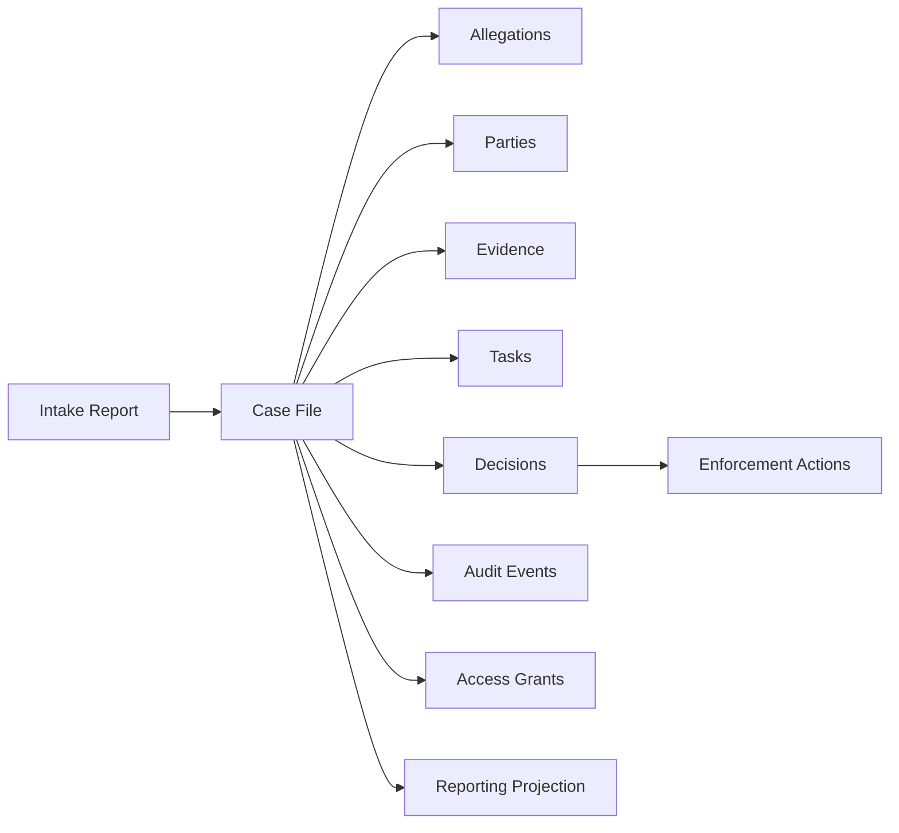
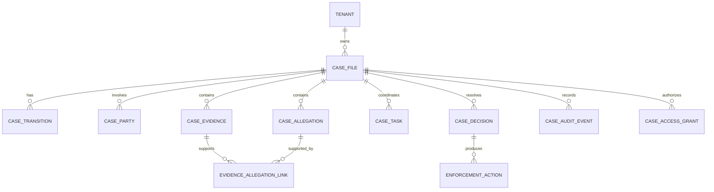
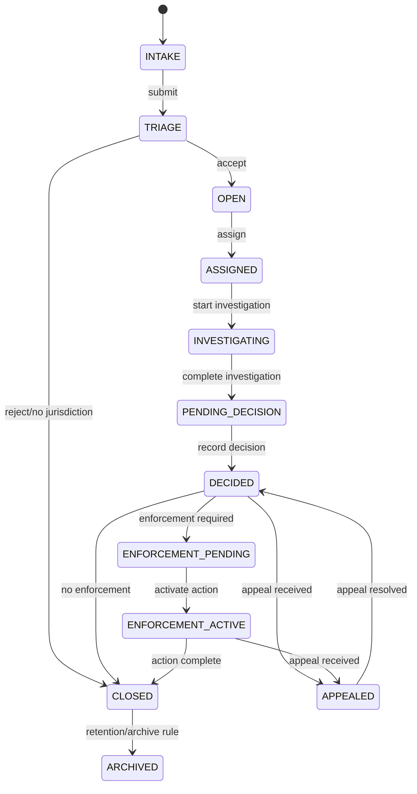

# Part 074 — Case Study: Regulatory Case Management Database

Bagian ini adalah case study end-to-end.

Kita akan mendesain database untuk **regulatory case management system**: sistem yang mengelola lifecycle kasus dari intake, assessment, investigation, decision, enforcement action, appeal, closure, audit, dan reporting.

Ini bukan CRUD sederhana.

Sistem seperti ini punya karakteristik sulit:

- state machine kompleks;
- banyak actor dan authority;
- evidence harus traceable;
- perubahan harus defensible;
- keputusan harus bisa dijelaskan ulang bertahun-tahun kemudian;
- access control tidak sekadar role global;
- SLA/escalation memengaruhi workflow;
- laporan regulator harus reproducible;
- data subject, retention, legal hold, dan audit saling bertabrakan;
- external integration tidak boleh membuat decision state menjadi inconsistent.

Tujuan case study ini bukan memberi satu schema final universal. Tujuannya membangun **cara berpikir architect-level** untuk sistem database yang harus benar, dapat diaudit, dan dapat dioperasikan.

---

## 1. Problem Statement

Kita mendesain database untuk platform bernama **RegCase**.

RegCase dipakai oleh lembaga regulator untuk mengelola laporan pelanggaran dan enforcement lifecycle.

### 1.1 High-Level Capabilities

RegCase harus mendukung:

1. intake report dari publik/internal/external agency;
2. triage dan eligibility assessment;
3. case creation dan case assignment;
4. investigation workflow;
5. evidence collection;
6. party/entity management;
7. allegation/violation modelling;
8. decision recommendation;
9. enforcement action;
10. appeal/review;
11. closure;
12. audit trail;
13. SLA dan escalation;
14. access control berdasarkan tenant, organization unit, role, assignment, sensitivity, dan legal basis;
15. operational search;
16. regulatory reporting;
17. data retention, legal hold, dan privacy controls.

### 1.2 Non-Goals

Kita tidak membahas:

- UI detail;
- BPMN engine implementation detail;
- full legal taxonomy spesifik negara;
- Java service implementation;
- Kafka/OpenAPI detail yang sudah menjadi seri lain.

Kita fokus pada database design and architecture.

---

## 2. Domain Mental Model

Sistem regulatory case management bukan “case table dengan status”.

Ia adalah kombinasi dari:

- **case file**: container utama untuk urusan regulasi;
- **party graph**: pihak yang dilaporkan, pelapor, saksi, pemilik manfaat, organisasi terkait;
- **allegation**: dugaan pelanggaran terhadap aturan tertentu;
- **evidence**: dokumen/fakta/artifact yang mendukung atau membantah allegation;
- **task/workflow**: pekerjaan manusia/sistem dalam lifecycle;
- **decision**: hasil penilaian/rekomendasi/putusan;
- **enforcement action**: tindakan formal;
- **audit/provenance**: jejak siapa melakukan apa, kapan, berdasarkan apa;
- **access control**: siapa boleh melihat/mengubah bagian mana;
- **reporting projection**: ringkasan untuk dashboard dan laporan.



The critical insight:

> Case is not the only entity. It is the coordination boundary for multiple independently meaningful entities.

---

## 3. Core Design Principles

### 3.1 Truth Is Separated From Projection

Canonical tables:

- `case_file`
- `case_transition`
- `case_party`
- `case_allegation`
- `case_evidence`
- `case_task`
- `case_decision`
- `enforcement_action`
- `case_audit_event`

Derived/projection tables:

- `case_search_document`
- `case_dashboard_snapshot`
- `case_reporting_fact`
- `case_timeline_projection`

Never confuse projection with source of truth.

### 3.2 State Change Is Explicit

Case status must not change silently.

Bad:

```sql
update case_file
set status = 'CLOSED'
where id = :case_id;
```

Better:

- validate allowed transition;
- insert transition row;
- update current state;
- emit audit/outbox event;
- do all in one transaction.

### 3.3 Evidence Must Be Traceable

Evidence is not just a file path.

Evidence needs:

- source;
- acquisition method;
- hash/checksum;
- chain of custody;
- classification;
- legal basis;
- versioning;
- linkage to allegation/decision;
- access rules.

### 3.4 Decisions Must Be Defensible

A decision must answer:

- what was decided;
- when;
- by whom;
- under what role/authority;
- based on what evidence;
- according to what rule version;
- whether it supersedes earlier decision;
- how appeal/review affects it.

---

## 4. Requirements to Data Model

### 4.1 Functional Requirements

| Requirement | Data Implication |
|---|---|
| A report may become zero, one, or many cases | Intake report separated from case file |
| A case may involve multiple parties | `case_party` relationship entity |
| One party may appear in many cases | Party master/reference or external party reference |
| A case may contain multiple allegations | `case_allegation` with rule reference |
| Evidence may support multiple allegations | Evidence-allegation link table |
| Status changes must be auditable | Transition table |
| Tasks may be reassigned | Assignment history |
| Decisions may be revised/appealed | Versioned decision model |
| Cases may be merged/split | Relationship table and immutable history |
| Access depends on assignment and sensitivity | Access grant/policy model |
| Reports must be reproducible | Snapshot/report run metadata |

### 4.2 Non-Functional Requirements

| Requirement | Design Response |
|---|---|
| Regulatory defensibility | immutable audit/provenance |
| Multi-tenant agency deployment | tenant-scoped keys and RLS |
| High read workload for inbox/search | indexed operational read model/search projection |
| Strong write correctness | database constraints + transactional transition |
| Long retention | partitioning/archive strategy |
| Privacy and legal hold | retention state + legal hold table |
| External integration | outbox/CDC with idempotency |
| Case confidentiality | sensitivity classification + access grants |

---

## 5. Conceptual Model



Conceptual boundaries:

- `case_file` is workflow coordination root;
- `party` may be master data or external reference;
- `evidence` has its own lifecycle;
- `decision` is a formal record, not just a status;
- `task` is operational work, not the case itself;
- `audit_event` is append-only;
- `access_grant` is policy materialization.

---

## 6. Case Lifecycle State Machine

### 6.1 Candidate States

Example states:

| State | Meaning |
|---|---|
| `INTAKE` | Report received, not yet accepted as case |
| `TRIAGE` | Basic eligibility and priority assessment |
| `OPEN` | Case accepted and active |
| `ASSIGNED` | Responsible investigator/team assigned |
| `INVESTIGATING` | Evidence collection and analysis ongoing |
| `PENDING_DECISION` | Investigation complete, decision needed |
| `DECIDED` | Decision recorded |
| `ENFORCEMENT_PENDING` | Enforcement action preparation |
| `ENFORCEMENT_ACTIVE` | Enforcement action active |
| `APPEALED` | Appeal/review opened |
| `CLOSED` | Case closed |
| `ARCHIVED` | No longer operationally active |

### 6.2 State Machine



### 6.3 Transition Rule Table

```sql
create table case_state_transition_rule (
  from_status text not null,
  to_status text not null,
  required_role text not null,
  requires_reason boolean not null default true,
  requires_assignment boolean not null default false,
  requires_open_task_completion boolean not null default false,
  is_active boolean not null default true,
  primary key (from_status, to_status)
);
```

This makes transition rules data-driven but still reviewable.

Caution:

> Do not let dynamic rules become an ungoverned workflow scripting engine hidden inside the database.

---

## 7. Core Schema: Case File

```sql
create table case_file (
  tenant_id uuid not null,
  case_id uuid not null,
  case_number text not null,
  title text not null,
  description text,
  status text not null,
  priority text not null,
  sensitivity_level text not null default 'NORMAL',
  source_type text not null,
  source_reference text,
  assigned_team_id uuid,
  assigned_user_id uuid,
  opened_at timestamptz not null default now(),
  closed_at timestamptz,
  due_at timestamptz,
  version bigint not null default 1,
  created_at timestamptz not null default now(),
  created_by uuid not null,
  updated_at timestamptz not null default now(),
  updated_by uuid not null,
  primary key (tenant_id, case_id),
  unique (tenant_id, case_number),
  check (priority in ('LOW', 'MEDIUM', 'HIGH', 'CRITICAL')),
  check (sensitivity_level in ('NORMAL', 'CONFIDENTIAL', 'RESTRICTED')),
  check (
    (status <> 'CLOSED' and closed_at is null)
    or
    (status = 'CLOSED' and closed_at is not null)
  )
);
```

### 7.1 Design Notes

- `tenant_id` is part of primary key to make tenant boundary explicit.
- `case_number` is public/business identifier.
- `case_id` is stable internal identifier.
- `status` is duplicated current state for fast query, but transition history is canonical for state changes.
- `version` supports optimistic concurrency.
- `sensitivity_level` feeds access control.

### 7.2 Key Indexes

```sql
create index idx_case_inbox_by_assignee
on case_file (tenant_id, assigned_user_id, status, due_at, priority, case_id)
where status not in ('CLOSED', 'ARCHIVED');

create index idx_case_by_team
on case_file (tenant_id, assigned_team_id, status, due_at, case_id)
where status not in ('CLOSED', 'ARCHIVED');

create index idx_case_opened_at
on case_file (tenant_id, opened_at desc, case_id);
```

---

## 8. Case Transition Schema

```sql
create table case_transition (
  tenant_id uuid not null,
  transition_id uuid not null,
  case_id uuid not null,
  from_status text not null,
  to_status text not null,
  reason text not null,
  actor_user_id uuid not null,
  actor_role text not null,
  occurred_at timestamptz not null default now(),
  request_id text,
  metadata jsonb not null default '{}'::jsonb,
  primary key (tenant_id, transition_id),
  foreign key (tenant_id, case_id)
    references case_file (tenant_id, case_id),
  unique (tenant_id, case_id, request_id)
);
```

### 8.1 Transition Transaction Pattern

```sql
-- Pseudocode transaction
begin;

select status, version
from case_file
where tenant_id = :tenant_id
  and case_id = :case_id
for update;

-- Validate allowed transition from current status to requested status.
-- Validate actor role, assignment, open tasks, evidence requirements.

insert into case_transition (
  tenant_id,
  transition_id,
  case_id,
  from_status,
  to_status,
  reason,
  actor_user_id,
  actor_role,
  request_id
) values (
  :tenant_id,
  :transition_id,
  :case_id,
  :from_status,
  :to_status,
  :reason,
  :actor_user_id,
  :actor_role,
  :request_id
);

update case_file
set status = :to_status,
    closed_at = case when :to_status = 'CLOSED' then now() else closed_at end,
    version = version + 1,
    updated_at = now(),
    updated_by = :actor_user_id
where tenant_id = :tenant_id
  and case_id = :case_id;

insert into outbox_event (...);
insert into case_audit_event (...);

commit;
```

Important:

> The transition table is not just audit. It is the formal record of lifecycle movement.

---

## 9. Intake Report Model

A report is not always a case.

```sql
create table intake_report (
  tenant_id uuid not null,
  report_id uuid not null,
  source_channel text not null,
  reporter_type text not null,
  reporter_contact_id uuid,
  received_at timestamptz not null default now(),
  raw_payload jsonb not null,
  triage_status text not null default 'RECEIVED',
  created_case_id uuid,
  primary key (tenant_id, report_id),
  foreign key (tenant_id, created_case_id)
    references case_file (tenant_id, case_id)
);
```

Why separated?

- Some reports are duplicates.
- Some reports are out of jurisdiction.
- Some reports become multiple cases.
- Some reports are merged into existing cases.
- Raw report may have different retention/privacy treatment.

If one report can create multiple cases:

```sql
create table intake_report_case_link (
  tenant_id uuid not null,
  report_id uuid not null,
  case_id uuid not null,
  link_type text not null,
  linked_at timestamptz not null default now(),
  linked_by uuid not null,
  primary key (tenant_id, report_id, case_id),
  foreign key (tenant_id, report_id)
    references intake_report (tenant_id, report_id),
  foreign key (tenant_id, case_id)
    references case_file (tenant_id, case_id)
);
```

---

## 10. Party and Relationship Model

A regulatory case may involve:

- complainant;
- respondent;
- regulated entity;
- witness;
- legal representative;
- beneficial owner;
- internal officer;
- external agency;
- affected consumer;
- related organization.

### 10.1 Party Table

In real systems, party often deserves its own master data strategy. For this case study, we use tenant-scoped party records.

```sql
create table party (
  tenant_id uuid not null,
  party_id uuid not null,
  party_type text not null,
  display_name text not null,
  external_reference text,
  normalized_identifier text,
  created_at timestamptz not null default now(),
  updated_at timestamptz not null default now(),
  primary key (tenant_id, party_id),
  check (party_type in ('PERSON', 'ORGANIZATION', 'AGENCY', 'UNKNOWN'))
);
```

### 10.2 Case Party Role

```sql
create table case_party (
  tenant_id uuid not null,
  case_id uuid not null,
  party_id uuid not null,
  role_type text not null,
  is_primary boolean not null default false,
  effective_from timestamptz not null default now(),
  effective_to timestamptz,
  notes text,
  primary key (tenant_id, case_id, party_id, role_type, effective_from),
  foreign key (tenant_id, case_id)
    references case_file (tenant_id, case_id),
  foreign key (tenant_id, party_id)
    references party (tenant_id, party_id),
  check (effective_to is null or effective_to > effective_from)
);
```

Why relationship-as-entity?

Because role has properties:

- role type;
- effective period;
- primary/secondary flag;
- notes;
- confidentiality;
- source;
- dispute/correction history.

A many-to-many join table without attributes would be too weak.

---

## 11. Allegation and Rule Reference

An allegation is a claim that a party violated a rule.

```sql
create table regulatory_rule_version (
  tenant_id uuid not null,
  rule_version_id uuid not null,
  rule_code text not null,
  rule_title text not null,
  version_label text not null,
  effective_from date not null,
  effective_to date,
  rule_text text not null,
  primary key (tenant_id, rule_version_id),
  unique (tenant_id, rule_code, version_label),
  check (effective_to is null or effective_to > effective_from)
);
```

```sql
create table case_allegation (
  tenant_id uuid not null,
  allegation_id uuid not null,
  case_id uuid not null,
  respondent_party_id uuid,
  rule_version_id uuid not null,
  allegation_summary text not null,
  status text not null default 'OPEN',
  created_at timestamptz not null default now(),
  created_by uuid not null,
  primary key (tenant_id, allegation_id),
  foreign key (tenant_id, case_id)
    references case_file (tenant_id, case_id),
  foreign key (tenant_id, respondent_party_id)
    references party (tenant_id, party_id),
  foreign key (tenant_id, rule_version_id)
    references regulatory_rule_version (tenant_id, rule_version_id),
  check (status in ('OPEN', 'SUBSTANTIATED', 'NOT_SUBSTANTIATED', 'WITHDRAWN'))
);
```

Why rule version?

Because the applicable regulation can change over time. A decision made in 2026 must reference the rule version that applied to the relevant period, not whatever rule text exists today.

---

## 12. Evidence Model

Evidence design must support:

- file metadata;
- chain of custody;
- hash/integrity;
- source and acquisition method;
- classification;
- link to allegations;
- redaction;
- retention/legal hold;
- audit.

```sql
create table case_evidence (
  tenant_id uuid not null,
  evidence_id uuid not null,
  case_id uuid not null,
  evidence_type text not null,
  title text not null,
  description text,
  storage_uri text not null,
  content_hash text not null,
  hash_algorithm text not null default 'SHA-256',
  source_type text not null,
  acquired_at timestamptz not null,
  acquired_by uuid not null,
  classification text not null default 'CONFIDENTIAL',
  legal_basis text,
  is_redacted boolean not null default false,
  supersedes_evidence_id uuid,
  created_at timestamptz not null default now(),
  primary key (tenant_id, evidence_id),
  foreign key (tenant_id, case_id)
    references case_file (tenant_id, case_id),
  foreign key (tenant_id, supersedes_evidence_id)
    references case_evidence (tenant_id, evidence_id),
  unique (tenant_id, case_id, content_hash)
);
```

### 12.1 Evidence-Allegation Link

```sql
create table evidence_allegation_link (
  tenant_id uuid not null,
  evidence_id uuid not null,
  allegation_id uuid not null,
  support_type text not null,
  relevance_note text,
  linked_at timestamptz not null default now(),
  linked_by uuid not null,
  primary key (tenant_id, evidence_id, allegation_id),
  foreign key (tenant_id, evidence_id)
    references case_evidence (tenant_id, evidence_id),
  foreign key (tenant_id, allegation_id)
    references case_allegation (tenant_id, allegation_id),
  check (support_type in ('SUPPORTS', 'CONTRADICTS', 'CONTEXT', 'UNKNOWN'))
);
```

### 12.2 Chain of Custody

```sql
create table evidence_custody_event (
  tenant_id uuid not null,
  custody_event_id uuid not null,
  evidence_id uuid not null,
  event_type text not null,
  actor_user_id uuid not null,
  occurred_at timestamptz not null default now(),
  location text,
  note text,
  primary key (tenant_id, custody_event_id),
  foreign key (tenant_id, evidence_id)
    references case_evidence (tenant_id, evidence_id)
);
```

Core invariant:

> Evidence used in a decision must be immutable or versioned from that point onward.

---

## 13. Task, Assignment, and SLA Model

Workflow tasks are operational units.

```sql
create table case_task (
  tenant_id uuid not null,
  task_id uuid not null,
  case_id uuid not null,
  task_type text not null,
  title text not null,
  status text not null default 'OPEN',
  assigned_team_id uuid,
  assigned_user_id uuid,
  priority text not null default 'MEDIUM',
  due_at timestamptz,
  completed_at timestamptz,
  created_at timestamptz not null default now(),
  created_by uuid not null,
  primary key (tenant_id, task_id),
  foreign key (tenant_id, case_id)
    references case_file (tenant_id, case_id),
  check (status in ('OPEN', 'IN_PROGRESS', 'BLOCKED', 'COMPLETED', 'CANCELLED')),
  check (
    (status = 'COMPLETED' and completed_at is not null)
    or
    (status <> 'COMPLETED' and completed_at is null)
  )
);
```

### 13.1 Assignment History

```sql
create table task_assignment_event (
  tenant_id uuid not null,
  assignment_event_id uuid not null,
  task_id uuid not null,
  from_user_id uuid,
  to_user_id uuid,
  from_team_id uuid,
  to_team_id uuid,
  reason text not null,
  assigned_by uuid not null,
  occurred_at timestamptz not null default now(),
  primary key (tenant_id, assignment_event_id),
  foreign key (tenant_id, task_id)
    references case_task (tenant_id, task_id)
);
```

### 13.2 SLA Clock

```sql
create table case_sla_timer (
  tenant_id uuid not null,
  sla_timer_id uuid not null,
  case_id uuid not null,
  timer_type text not null,
  started_at timestamptz not null,
  paused_at timestamptz,
  due_at timestamptz not null,
  completed_at timestamptz,
  status text not null default 'RUNNING',
  primary key (tenant_id, sla_timer_id),
  foreign key (tenant_id, case_id)
    references case_file (tenant_id, case_id),
  check (status in ('RUNNING', 'PAUSED', 'COMPLETED', 'BREACHED', 'CANCELLED'))
);
```

SLA must not be inferred only from current case status. You need explicit timer records to explain pauses, extensions, and breaches.

---

## 14. Decision Model

A decision is a formal artifact.

```sql
create table case_decision (
  tenant_id uuid not null,
  decision_id uuid not null,
  case_id uuid not null,
  decision_type text not null,
  decision_status text not null default 'DRAFT',
  decision_summary text not null,
  rationale text not null,
  decided_by uuid,
  decided_at timestamptz,
  authority_role text,
  rule_version_id uuid,
  supersedes_decision_id uuid,
  created_at timestamptz not null default now(),
  created_by uuid not null,
  primary key (tenant_id, decision_id),
  foreign key (tenant_id, case_id)
    references case_file (tenant_id, case_id),
  foreign key (tenant_id, rule_version_id)
    references regulatory_rule_version (tenant_id, rule_version_id),
  foreign key (tenant_id, supersedes_decision_id)
    references case_decision (tenant_id, decision_id),
  check (decision_status in ('DRAFT', 'SUBMITTED', 'APPROVED', 'REJECTED', 'FINAL', 'SUPERSEDED'))
);
```

### 14.1 Decision Evidence Link

```sql
create table decision_evidence_link (
  tenant_id uuid not null,
  decision_id uuid not null,
  evidence_id uuid not null,
  usage_type text not null,
  note text,
  primary key (tenant_id, decision_id, evidence_id),
  foreign key (tenant_id, decision_id)
    references case_decision (tenant_id, decision_id),
  foreign key (tenant_id, evidence_id)
    references case_evidence (tenant_id, evidence_id),
  check (usage_type in ('PRIMARY_BASIS', 'SUPPORTING', 'CONTRADICTORY_REVIEWED'))
);
```

### 14.2 Decision Invariants

- A `FINAL` decision must have `decided_by`, `decided_at`, and `authority_role`.
- A final decision must link to at least one allegation or have a formal “no allegation substantiated” rationale.
- Evidence linked to final decision cannot be hard-deleted.
- Superseded decisions remain queryable.
- Appeal creates new review/decision record; it does not mutate history silently.

Some of these require transactional guards or trigger-based enforcement because SQL `CHECK` cannot count linked rows.

---

## 15. Enforcement Action Model

```sql
create table enforcement_action (
  tenant_id uuid not null,
  action_id uuid not null,
  case_id uuid not null,
  decision_id uuid not null,
  action_type text not null,
  status text not null default 'PENDING',
  effective_from date,
  effective_to date,
  amount_minor bigint,
  currency_code char(3),
  issued_at timestamptz,
  issued_by uuid,
  created_at timestamptz not null default now(),
  primary key (tenant_id, action_id),
  foreign key (tenant_id, case_id)
    references case_file (tenant_id, case_id),
  foreign key (tenant_id, decision_id)
    references case_decision (tenant_id, decision_id),
  check (status in ('PENDING', 'ISSUED', 'ACTIVE', 'SUSPENDED', 'COMPLETED', 'CANCELLED')),
  check (effective_to is null or effective_from is null or effective_to > effective_from)
);
```

Money note:

> Use integer minor units or strict numeric discipline. Do not use floating point for penalty amounts.

---

## 16. Case Merge, Split, and Duplicate Handling

Regulatory systems often discover duplicate or related cases.

Do not implement merge as destructive copying.

```sql
create table case_relationship (
  tenant_id uuid not null,
  from_case_id uuid not null,
  to_case_id uuid not null,
  relationship_type text not null,
  reason text not null,
  created_at timestamptz not null default now(),
  created_by uuid not null,
  primary key (tenant_id, from_case_id, to_case_id, relationship_type),
  foreign key (tenant_id, from_case_id)
    references case_file (tenant_id, case_id),
  foreign key (tenant_id, to_case_id)
    references case_file (tenant_id, case_id),
  check (from_case_id <> to_case_id),
  check (relationship_type in ('DUPLICATE_OF', 'RELATED_TO', 'SPLIT_FROM', 'MERGED_INTO', 'APPEAL_OF'))
);
```

Recommended rule:

- Merge creates relationship and marks source as merged/closed.
- Evidence/task/decision movement is explicit and audited.
- Old case number remains resolvable.
- Reports can still reconstruct the pre-merge history.

---

## 17. Audit Event Model

Audit event is append-only evidence of system/user actions.

```sql
create table case_audit_event (
  tenant_id uuid not null,
  audit_event_id uuid not null,
  case_id uuid,
  entity_type text not null,
  entity_id uuid not null,
  action_type text not null,
  actor_user_id uuid,
  actor_type text not null,
  reason text,
  occurred_at timestamptz not null default now(),
  request_id text,
  correlation_id text,
  before_data jsonb,
  after_data jsonb,
  metadata jsonb not null default '{}'::jsonb,
  primary key (tenant_id, audit_event_id)
);
```

### 17.1 Audit Design Rules

- Application role should not update/delete audit rows.
- Audit event should include actor context.
- Audit should distinguish system action vs human action.
- Sensitive values may need masking or hashing.
- Audit should include request/correlation ID.
- Audit event schema should be versioned if event payload evolves.

### 17.2 Append-Only Guard

In PostgreSQL, you can restrict privileges and optionally add trigger guard:

```sql
create or replace function prevent_audit_mutation()
returns trigger
language plpgsql
as $$
begin
  raise exception 'audit events are append-only';
end;
$$;

create trigger trg_prevent_audit_update
before update or delete on case_audit_event
for each row execute function prevent_audit_mutation();
```

Even if you use trigger, role permissions and operational procedure still matter.

---

## 18. Access Control Model

Access is not just `role = investigator`.

A user may access a case because:

- they are assigned;
- their team owns it;
- they supervise assigned team;
- they have specialized authority;
- they are reviewing appeal;
- they are support under break-glass;
- they have external agency data sharing permission;
- the case is low sensitivity;
- legal hold or confidentiality restricts access.

### 18.1 Access Grant Table

```sql
create table case_access_grant (
  tenant_id uuid not null,
  case_id uuid not null,
  principal_type text not null,
  principal_id uuid not null,
  access_level text not null,
  grant_reason text not null,
  granted_at timestamptz not null default now(),
  granted_by uuid,
  expires_at timestamptz,
  primary key (tenant_id, case_id, principal_type, principal_id, access_level),
  foreign key (tenant_id, case_id)
    references case_file (tenant_id, case_id),
  check (principal_type in ('USER', 'TEAM', 'ROLE', 'EXTERNAL_AGENCY')),
  check (access_level in ('READ', 'COMMENT', 'EDIT', 'DECIDE', 'ADMIN'))
);
```

### 18.2 RLS Sketch

```sql
alter table case_file enable row level security;

create policy case_file_read_policy
on case_file
for select
using (
  tenant_id = current_setting('app.tenant_id')::uuid
  and exists (
    select 1
    from case_access_grant g
    where g.tenant_id = case_file.tenant_id
      and g.case_id = case_file.case_id
      and g.principal_type = 'USER'
      and g.principal_id = current_setting('app.user_id')::uuid
      and g.access_level in ('READ', 'COMMENT', 'EDIT', 'DECIDE', 'ADMIN')
      and (g.expires_at is null or g.expires_at > now())
  )
);
```

Important:

> RLS is defense-in-depth. It does not remove the need for application authorization and policy tests.

### 18.3 Support Access

Break-glass access should require:

- reason;
- approval;
- time limit;
- audit event;
- notification or later review;
- automatic expiration.

---

## 19. Outbox and Integration

Case management systems often publish events:

- case created;
- case assigned;
- status changed;
- task due soon;
- decision finalized;
- enforcement action issued;
- evidence added;
- case closed.

Use transactional outbox to avoid dual-write loss.

```sql
create table outbox_event (
  tenant_id uuid not null,
  outbox_event_id uuid not null,
  aggregate_type text not null,
  aggregate_id uuid not null,
  event_type text not null,
  event_version int not null,
  payload jsonb not null,
  occurred_at timestamptz not null default now(),
  published_at timestamptz,
  publish_attempts int not null default 0,
  last_error text,
  primary key (tenant_id, outbox_event_id)
);
```

Publisher query:

```sql
select *
from outbox_event
where published_at is null
order by occurred_at, outbox_event_id
limit 100
for update skip locked;
```

Downstream consumers must be idempotent.

```sql
create table inbox_event_dedup (
  consumer_name text not null,
  source_event_id uuid not null,
  processed_at timestamptz not null default now(),
  primary key (consumer_name, source_event_id)
);
```

---

## 20. Search Projection

Operational users need search:

- by case number;
- by title;
- by party name;
- by respondent identifier;
- by allegation rule;
- by status;
- by assignment;
- by due date;
- by sensitivity;
- by evidence metadata.

Do not force all search into OLTP joins if workload is heavy.

### 20.1 Projection Table Example

```sql
create table case_search_document (
  tenant_id uuid not null,
  case_id uuid not null,
  case_number text not null,
  title text not null,
  status text not null,
  priority text not null,
  assigned_user_id uuid,
  assigned_team_id uuid,
  party_names text,
  allegation_codes text,
  due_at timestamptz,
  updated_at timestamptz not null,
  source_version bigint not null,
  primary key (tenant_id, case_id)
);
```

This can be implemented in PostgreSQL for moderate scale, or pushed to a search engine for larger/full-text workloads.

Projection contract:

- source tables;
- refresh mechanism;
- freshness SLO;
- rebuild procedure;
- authorization behavior;
- delete propagation;
- drift detection.

---

## 21. Reporting Model

Operational database should not be abused for every report.

### 21.1 Reporting Facts

Example fact table:

```sql
create table case_lifecycle_fact_daily (
  tenant_id uuid not null,
  report_date date not null,
  case_status text not null,
  priority text not null,
  assigned_team_id uuid,
  opened_count int not null default 0,
  closed_count int not null default 0,
  breached_sla_count int not null default 0,
  avg_days_to_close numeric(12,2),
  generated_at timestamptz not null default now(),
  primary key (tenant_id, report_date, case_status, priority, assigned_team_id)
);
```

### 21.2 Reproducible Report Run

```sql
create table report_run (
  tenant_id uuid not null,
  report_run_id uuid not null,
  report_name text not null,
  report_version text not null,
  parameters jsonb not null,
  as_of_time timestamptz not null,
  generated_at timestamptz not null default now(),
  generated_by uuid not null,
  output_uri text,
  checksum text,
  primary key (tenant_id, report_run_id)
);
```

Regulatory reporting needs reproducibility:

> The same report version, same parameters, and same as-of time should be explainable later.

---

## 22. Retention, Archival, and Legal Hold

```sql
create table case_legal_hold (
  tenant_id uuid not null,
  legal_hold_id uuid not null,
  case_id uuid not null,
  hold_reason text not null,
  placed_at timestamptz not null default now(),
  placed_by uuid not null,
  released_at timestamptz,
  released_by uuid,
  primary key (tenant_id, legal_hold_id),
  foreign key (tenant_id, case_id)
    references case_file (tenant_id, case_id)
);
```

Retention query should exclude active holds:

```sql
select cf.tenant_id, cf.case_id
from case_file cf
where cf.status = 'ARCHIVED'
  and cf.closed_at < now() - interval '7 years'
  and not exists (
    select 1
    from case_legal_hold h
    where h.tenant_id = cf.tenant_id
      and h.case_id = cf.case_id
      and h.released_at is null
  );
```

Important:

- Legal hold blocks purge.
- Archive is not purge.
- Audit/evidence retention may differ from case summary retention.
- PII minimization may require masking while retaining non-PII legal evidence.

---

## 23. Key Workload Patterns

### 23.1 Investigator Inbox

```sql
select case_id, case_number, title, priority, status, due_at
from case_file
where tenant_id = :tenant_id
  and assigned_user_id = :user_id
  and status not in ('CLOSED', 'ARCHIVED')
order by due_at asc nulls last, priority desc, case_id
limit 50;
```

Index:

```sql
create index idx_case_investigator_inbox
on case_file (tenant_id, assigned_user_id, due_at, priority, case_id)
where status not in ('CLOSED', 'ARCHIVED');
```

### 23.2 Team Queue

```sql
select case_id, case_number, title, priority, due_at
from case_file
where tenant_id = :tenant_id
  and assigned_team_id = :team_id
  and status in ('OPEN', 'ASSIGNED', 'INVESTIGATING')
order by priority desc, due_at asc, case_id
limit 100;
```

### 23.3 Case Timeline

Timeline can be derived from multiple event tables:

- transition;
- task assignment;
- decision;
- evidence custody;
- audit event.

For performance, maintain a projection:

```sql
create table case_timeline_event (
  tenant_id uuid not null,
  case_id uuid not null,
  timeline_event_id uuid not null,
  event_type text not null,
  event_time timestamptz not null,
  actor_user_id uuid,
  summary text not null,
  source_entity_type text not null,
  source_entity_id uuid not null,
  primary key (tenant_id, case_id, timeline_event_id)
);

create index idx_case_timeline_order
on case_timeline_event (tenant_id, case_id, event_time desc, timeline_event_id desc);
```

---

## 24. Invariant Catalog

| Invariant | Enforcement |
|---|---|
| Case number unique per tenant | `unique (tenant_id, case_number)` |
| Closed case has `closed_at` | `CHECK` + transition transaction |
| Case status changes only through transition command | application/service boundary + audit check |
| Final decision has decision metadata | `CHECK` + command validation |
| Evidence linked to final decision cannot be deleted | delete guard + retention policy |
| No cross-tenant reference | composite FK with `tenant_id` |
| Assigned task cannot be completed by unauthorized actor | authorization + transaction guard |
| SLA breach is recorded once | unique event/timer constraint |
| Outbox event created atomically with state change | same transaction |
| Access to restricted case requires explicit grant | RLS/access grant test |

---

## 25. Failure Modes

### 25.1 Status Soup

Symptom:

- `status` has 40 values;
- no transition table;
- reports infer lifecycle incorrectly;
- developers update status directly.

Mitigation:

- transition rule table;
- transition command;
- append-only transition history;
- state machine tests.

### 25.2 Evidence Drift

Symptom:

- decision references evidence that was later replaced;
- report cannot prove what evidence was available at decision time.

Mitigation:

- evidence versioning;
- content hash;
- decision-evidence link;
- immutable evidence after final decision.

### 25.3 Access Leak

Symptom:

- user sees case because query forgot tenant/team/sensitivity filter.

Mitigation:

- composite tenant keys;
- RLS;
- access grant table;
- negative authorization tests;
- query review.

### 25.4 Reporting Dispute

Symptom:

- monthly enforcement report changes after being submitted.

Mitigation:

- report run metadata;
- as-of time;
- versioned report definition;
- snapshot/materialized fact;
- checksum of output.

### 25.5 Duplicate Case Creation

Symptom:

- external retry creates multiple cases for same report.

Mitigation:

- intake report idempotency key;
- external reference unique key;
- command dedup;
- duplicate resolution workflow.

---

## 26. Migration Strategy

This system will evolve. Design for change.

### 26.1 Example: Add Appeal Workflow

Safe steps:

1. Add `APPEALED` state to transition rule table as inactive.
2. Add `appeal_case` table.
3. Deploy app that can read old and new structures.
4. Enable transition for pilot tenant.
5. Backfill historical appeal records if needed.
6. Add reporting projection.
7. Validate dashboards.
8. Enable globally.

### 26.2 Example Schema

```sql
create table case_appeal (
  tenant_id uuid not null,
  appeal_id uuid not null,
  case_id uuid not null,
  decision_id uuid not null,
  appeal_reason text not null,
  status text not null default 'OPEN',
  filed_at timestamptz not null default now(),
  filed_by uuid not null,
  resolved_at timestamptz,
  primary key (tenant_id, appeal_id),
  foreign key (tenant_id, case_id)
    references case_file (tenant_id, case_id),
  foreign key (tenant_id, decision_id)
    references case_decision (tenant_id, decision_id)
);
```

Migration principle:

> Add capability as compatible expansion first. Contract only after old paths are gone.

---

## 27. Production Readiness Checklist for This Case Study

### 27.1 Correctness

- [ ] Case lifecycle state machine defined.
- [ ] Transition table exists.
- [ ] Illegal transitions rejected.
- [ ] Critical business identifiers have unique constraints.
- [ ] Evidence linked to decision cannot disappear silently.
- [ ] Final decision requirements are enforced.
- [ ] Merge/split operations are non-destructive and auditable.

### 27.2 Security

- [ ] Runtime role is least privilege.
- [ ] Tenant isolation enforced.
- [ ] RLS/access grant policy tested.
- [ ] Restricted case access requires explicit grant.
- [ ] Break-glass access audited.
- [ ] Evidence storage access is aligned with DB access.

### 27.3 Audit and Defensibility

- [ ] State transitions audited.
- [ ] Evidence custody recorded.
- [ ] Decision rationale recorded.
- [ ] Rule version referenced.
- [ ] Report run metadata stored.
- [ ] Audit table append-only.

### 27.4 Performance

- [ ] Investigator inbox query has plan evidence.
- [ ] Team queue query has plan evidence.
- [ ] Timeline query/index strategy exists.
- [ ] Search projection freshness defined.
- [ ] Reporting workload isolated if heavy.
- [ ] Large tenant skew tested.

### 27.5 Operations

- [ ] Backup/restore tested.
- [ ] Legal hold and retention job tested.
- [ ] Outbox lag dashboard exists.
- [ ] SLA breach job observable.
- [ ] Migration/backfill runbook exists.
- [ ] Access incident runbook exists.

---

## 28. What a Top 1% Engineer Should Notice

A weaker design says:

> “We need a case table, party table, evidence table, and status column.”

A stronger design says:

> “We need a stateful evidence-grade system where case lifecycle, authority, party roles, evidence custody, decision rationale, access policy, retention, reporting, and integration events are each modelled with explicit invariants and recoverable operational behavior.”

The difference is not the number of tables.

The difference is whether the database can answer hard questions:

- Why did this case close?
- Who was allowed to close it?
- What evidence existed at that time?
- Which rule version applied?
- Was SLA breached?
- Who accessed restricted evidence?
- Can we reproduce the submitted report?
- Can we restore a tenant without corrupting audit trail?
- Can downstream search be rebuilt from truth?
- Can a bad transition be corrected without rewriting history?

That is database architecture.

---

## 29. Suggested Exercises

1. Add a constraint strategy for “only one active primary respondent per case”.
2. Design an appeal workflow that can supersede but not delete prior decisions.
3. Add a redaction workflow for evidence while preserving original restricted evidence.
4. Design a tenant-level export job that respects RLS, legal hold, and PII masking.
5. Build an ERD for party relationship graph across cases.
6. Create a migration plan from status-only case table to transition-history model.
7. Write queries for investigator inbox, team queue, SLA breach list, and case timeline.
8. Design a report run model for monthly enforcement statistics.
9. Define a backfill/rebuild process for `case_search_document`.
10. Write an incident runbook for accidental cross-tenant access grant.

---

## References

- PostgreSQL Documentation — Constraints, Row-Level Security, triggers, indexes, transactions, and monitoring.
- AWS Well-Architected Framework — operational excellence, reliability, security, and performance readiness thinking.
- NIST Privacy/Security references for evidence, access, retention, and audit-control thinking.
- W3C PROV and OpenLineage concepts for provenance and lineage mental model.
