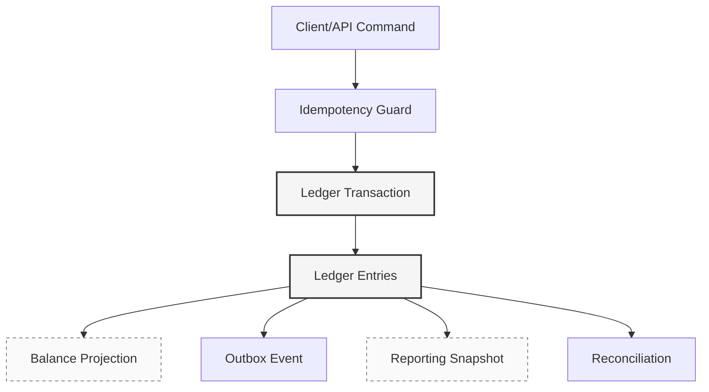
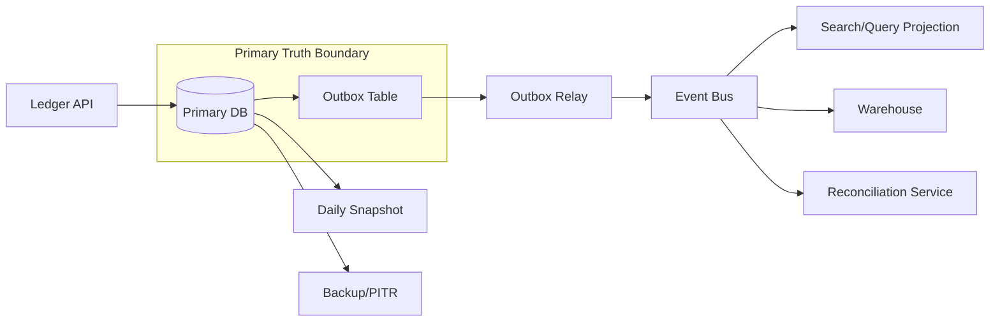
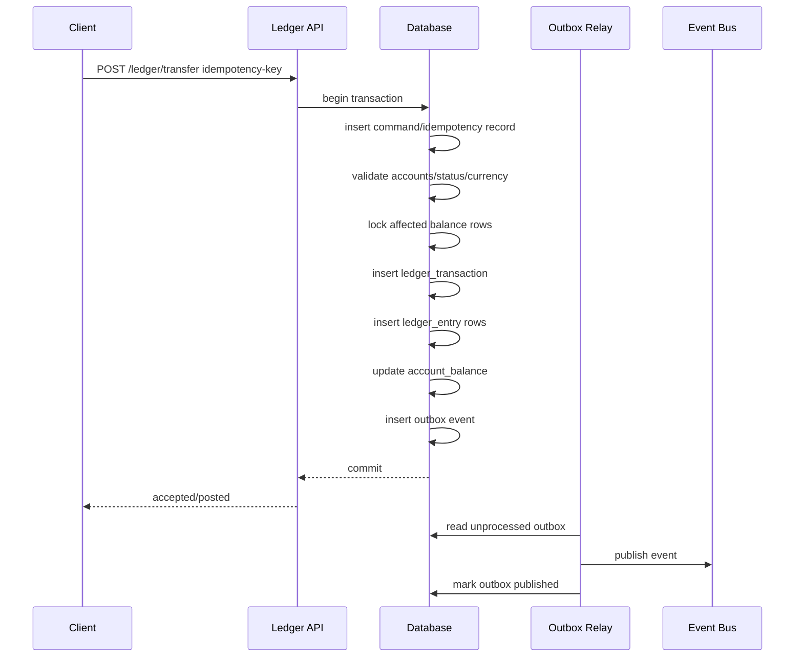

# Part 075 — Case Study: High-Volume Transaction Ledger

> Target pembelajaran: mampu mendesain ledger transaksional yang bisa menangani volume tinggi, retry, audit, koreksi, settlement, reconciliation, dan reporting tanpa kehilangan invariant utama: **uang/nilai tidak boleh muncul, hilang, atau berubah tanpa jejak yang sah**.

Ledger adalah salah satu desain database paling keras karena ia memadukan beberapa tekanan sekaligus:

1. correctness lebih penting daripada convenience,
2. write path harus retry-safe,
3. history tidak boleh mudah ditimpa,
4. balance harus bisa dihitung ulang,
5. latency tetap perlu rendah,
6. reconciliation harus bisa membuktikan sumber selisih,
7. audit harus bisa menjelaskan *who/what/why/when*.

Dalam sistem biasa, data sering dilihat sebagai row yang mewakili current state. Dalam ledger, data harus dilihat sebagai **urutan fakta yang membentuk state**. Balance bukan fakta utama. Balance adalah proyeksi dari journal.

---

## 1. Problem Statement

Kita akan mendesain ledger untuk platform pembayaran internal.

Contoh kebutuhan:

- setiap tenant memiliki banyak account,
- account bisa menyimpan balance dalam beberapa currency,
- transfer antar-account harus atomic,
- setiap movement harus punya trace ke command, actor, dan external reference,
- request bisa retry karena timeout/network failure,
- tidak boleh double charge,
- balance harus cepat dibaca,
- laporan harian harus reproducible,
- koreksi harus dilakukan dengan reversal/adjustment, bukan update diam-diam,
- reconciliation dengan processor/bank harus bisa menemukan mismatch.

Non-goal:

- ini bukan pembahasan payment gateway end-to-end,
- bukan desain Kafka pipeline mendalam,
- bukan PL/pgSQL khusus,
- bukan accounting course penuh.

Fokus kita adalah database architecture.

---

## 2. Ledger Mental Model

Ledger production-grade biasanya punya empat layer data:

| Layer | Fungsi | Mutable? | Contoh |
|---|---|---:|---|
| Command | Permintaan bisnis yang ingin dieksekusi | Terbatas | `transfer_request`, `payment_capture_request` |
| Journal | Fakta immutable yang sudah diterima ledger | Tidak | `ledger_transaction` |
| Entry | Debit/credit movement per account | Tidak | `ledger_entry` |
| Projection | Current/read model untuk query cepat | Ya, derived | `account_balance` |

Diagram:



Prinsip utama:

> **Journal dan entry adalah source of truth. Balance adalah cache/projection yang harus bisa direbuild.**

Kalau balance tidak bisa direbuild dari entry, desain ledger belum defensible.

---

## 3. Core Invariants

Ledger harus dirancang dari invariant, bukan dari tabel.

### 3.1 Invariant Dasar

| Invariant | Makna | Enforcement |
|---|---|---|
| Transaction balance | Total debit = total credit dalam satu transaction | App + DB validation + test |
| Idempotency | Command yang sama tidak menghasilkan entry ganda | Unique constraint |
| Immutability | Posted transaction tidak boleh diubah | Permission, trigger, append-only discipline |
| Account existence | Entry harus mengarah ke account valid | FK atau validated reference |
| Currency correctness | Amount dan currency harus konsisten | FK/check/domain |
| No negative balance, kalau berlaku | Account tertentu tidak boleh turun di bawah nol | Lock/conditional update/serializable |
| Rebuildability | Projection bisa dibangun ulang dari journal | Backfill/reconciliation job |
| Traceability | Setiap entry punya causal chain | Required metadata |

### 3.2 Invariant yang Sering Diremehkan

1. **Idempotency scope harus jelas**: per tenant, per endpoint, per external reference, atau per business operation?
2. **Currency bukan string bebas**: harus reference data yang dikontrol.
3. **Correction tidak boleh update amount lama**: gunakan reversal + adjustment.
4. **Balance read cepat tidak sama dengan source of truth**: balance table boleh salah sementara, tapi harus bisa dideteksi dan diperbaiki.
5. **Uniqueness bukan hanya primary key**: external processor reference sering perlu uniqueness tersendiri.
6. **Ordering global jarang realistis**: biasanya yang dibutuhkan adalah ordering per account, per tenant, atau per transaction.

---

## 4. High-Level Architecture



Design boundary:

- API boleh menerima command,
- database primary memutuskan apakah command diterima,
- journal/entry ditulis dalam transaksi yang sama,
- outbox ditulis dalam transaksi yang sama,
- event bus bukan source of truth,
- warehouse bukan source of truth,
- balance projection adalah derived state.

---

## 5. Schema Design

### 5.1 Account

```sql
create table ledger_account (
    account_id          uuid primary key,
    tenant_id           uuid not null,
    account_code        text not null,
    account_type        text not null,
    currency_code       char(3) not null,
    status              text not null,
    allow_negative      boolean not null default false,
    created_at          timestamptz not null default now(),
    closed_at           timestamptz,

    constraint uq_ledger_account_code
        unique (tenant_id, account_code),

    constraint ck_ledger_account_status
        check (status in ('ACTIVE', 'FROZEN', 'CLOSED')),

    constraint ck_ledger_account_closed
        check (
            (status = 'CLOSED' and closed_at is not null)
            or
            (status <> 'CLOSED' and closed_at is null)
        )
);
```

Catatan desain:

- `account_code` adalah business identifier tenant-scoped.
- `account_id` adalah stable internal identifier.
- `currency_code` di account menyederhanakan invariant: satu account satu currency.
- `allow_negative` harus jarang dipakai dan perlu policy jelas.
- Status `FROZEN` harus mencegah outgoing movement, tapi mungkin masih mengizinkan reversal/correction.

### 5.2 Ledger Transaction

```sql
create table ledger_transaction (
    ledger_tx_id        uuid primary key,
    tenant_id           uuid not null,
    tx_type             text not null,
    tx_status           text not null,
    idempotency_key     text not null,
    request_fingerprint text not null,
    external_ref_type   text,
    external_ref        text,
    business_ref        text,
    occurred_at         timestamptz not null,
    posted_at           timestamptz,
    created_at          timestamptz not null default now(),
    created_by          text not null,
    reason_code         text,
    metadata            jsonb not null default '{}'::jsonb,

    constraint uq_ledger_tx_idempotency
        unique (tenant_id, idempotency_key),

    constraint uq_ledger_tx_external_ref
        unique (tenant_id, external_ref_type, external_ref),

    constraint ck_ledger_tx_status
        check (tx_status in ('PENDING', 'POSTED', 'REVERSED', 'REJECTED')),

    constraint ck_ledger_tx_posted_at
        check (
            (tx_status = 'POSTED' and posted_at is not null)
            or
            (tx_status <> 'POSTED')
        )
);
```

Catatan:

- `idempotency_key` mencegah duplicate processing dari client retry.
- `external_ref` mencegah double ingestion dari processor/bank.
- `request_fingerprint` mencegah key yang sama dipakai untuk payload berbeda.
- `occurred_at` adalah business/event time.
- `posted_at` adalah waktu ledger menerima fakta.
- `created_at` adalah waktu row dibuat.

Jangan hanya punya satu `created_at` lalu menganggap semua time semantics selesai.

### 5.3 Ledger Entry

```sql
create table ledger_entry (
    ledger_entry_id     uuid primary key,
    ledger_tx_id        uuid not null references ledger_transaction(ledger_tx_id),
    tenant_id           uuid not null,
    account_id          uuid not null references ledger_account(account_id),
    entry_side          text not null,
    amount_minor        bigint not null,
    currency_code       char(3) not null,
    entry_seq           integer not null,
    effective_at        timestamptz not null,
    created_at          timestamptz not null default now(),

    constraint uq_ledger_entry_seq
        unique (ledger_tx_id, entry_seq),

    constraint ck_ledger_entry_side
        check (entry_side in ('DEBIT', 'CREDIT')),

    constraint ck_ledger_entry_amount_positive
        check (amount_minor > 0)
);

create index ix_ledger_entry_account_time
    on ledger_entry (tenant_id, account_id, effective_at, ledger_entry_id);

create index ix_ledger_entry_tx
    on ledger_entry (tenant_id, ledger_tx_id);
```

Kenapa `amount_minor bigint`, bukan `numeric(18,2)`?

- uang atau unit nilai lebih aman disimpan sebagai minor unit integer,
- decimal scale mengikuti currency/reference data,
- rounding harus terjadi di boundary bisnis, bukan tersebar di query.

Namun untuk instrumen dengan presisi variabel, `numeric` bisa sah. Yang penting: precision policy eksplisit.

### 5.4 Balance Projection

```sql
create table account_balance (
    tenant_id           uuid not null,
    account_id          uuid not null references ledger_account(account_id),
    currency_code       char(3) not null,
    balance_minor       bigint not null,
    version             bigint not null default 0,
    last_entry_id       uuid,
    updated_at          timestamptz not null default now(),

    primary key (tenant_id, account_id)
);
```

Balance table adalah projection. Tetapi projection ini tetap critical karena biasanya dipakai untuk authorization transaksi baru, limit check, dan UI.

Karena itu balance update harus:

- atomic dengan journal write, atau
- punya recovery job yang dapat mendeteksi gap,
- punya version/last_entry marker,
- punya reconciliation terhadap sum(entry).

---

## 6. Double-Entry Pattern

Single-entry ledger hanya mencatat “account A berkurang 100”. Itu berbahaya karena tidak memaksa conservation of value.

Double-entry mencatat minimal dua entry:

- debit satu account,
- credit account lain,
- total debit = total credit.

Contoh transfer 10.00 USD dari customer wallet ke merchant payable:

```text
Transaction: PAYMENT_CAPTURED 10.00 USD

Debit  : customer_wallet          1000
Credit : merchant_payable         1000
```

Secara database:

```sql
insert into ledger_transaction (...)
values (..., 'PAYMENT_CAPTURED', 'POSTED', ...);

insert into ledger_entry (..., account_id, entry_side, amount_minor, entry_seq)
values
    (..., :customer_wallet,  'DEBIT',  1000, 1),
    (..., :merchant_payable, 'CREDIT', 1000, 2);
```

Di beberapa domain, definisi debit/credit tergantung account type. Untuk menghindari confusion, banyak sistem internal memakai `direction` terhadap balance:

```sql
entry_direction in ('INCREASE', 'DECREASE')
```

Itu lebih mudah untuk engineer, tetapi kurang dekat dengan accounting semantics. Pilihan mana pun boleh, asal invariant jelas.

---

## 7. Posting Flow



Write path harus memutuskan satu hal penting:

> Apakah balance update dilakukan synchronously dalam transaksi posting, atau asynchronously dari entry stream?

### 7.1 Synchronous Balance Projection

Kelebihan:

- read-after-write mudah,
- overdraft check kuat,
- UI balance langsung update,
- reconciliation lebih mudah untuk OLTP path.

Kekurangan:

- write transaction lebih berat,
- hot account contention tinggi,
- throughput turun untuk account yang sangat aktif.

### 7.2 Asynchronous Balance Projection

Kelebihan:

- write journal lebih cepat,
- projection dapat diskalakan terpisah,
- cocok untuk append-heavy event stream.

Kekurangan:

- balance stale,
- overdraft prevention sulit,
- failure recovery lebih kompleks,
- user experience perlu freshness contract.

Rule praktis:

- Jika balance dipakai untuk mencegah illegal transaction, update balance dalam transaction yang sama atau gunakan concurrency control kuat.
- Jika balance hanya untuk display/reporting, async projection bisa diterima.

---

## 8. Idempotency Design

Idempotency bukan “client mengirim UUID”. Idempotency adalah contract:

> **Untuk scope tertentu, request yang sama menghasilkan outcome yang sama, walaupun diproses ulang.**

### 8.1 Idempotency Table

```sql
create table ledger_idempotency (
    tenant_id           uuid not null,
    idempotency_key     text not null,
    request_fingerprint text not null,
    status              text not null,
    ledger_tx_id        uuid,
    response_code       integer,
    response_body       jsonb,
    created_at          timestamptz not null default now(),
    expires_at          timestamptz not null,

    primary key (tenant_id, idempotency_key),

    constraint ck_idempotency_status
        check (status in ('PROCESSING', 'SUCCEEDED', 'FAILED_RETRYABLE', 'FAILED_FINAL'))
);
```

Flow:

1. insert `(tenant_id, idempotency_key)`;
2. jika conflict, baca record existing;
3. jika fingerprint berbeda, return conflict;
4. jika sukses sebelumnya, return response lama;
5. jika `PROCESSING`, return 409/202 atau wait bounded;
6. jika retryable, coba lagi sesuai policy.

```sql
insert into ledger_idempotency (
    tenant_id,
    idempotency_key,
    request_fingerprint,
    status,
    expires_at
)
values (
    :tenant_id,
    :idempotency_key,
    :fingerprint,
    'PROCESSING',
    now() + interval '24 hours'
)
on conflict (tenant_id, idempotency_key) do nothing;
```

Yang sering salah:

- key tidak tenant-scoped,
- key expired terlalu cepat,
- request fingerprint tidak disimpan,
- response sukses tidak disimpan,
- retry setelah commit unknown menghasilkan double posting.

---

## 9. Balance Update and Concurrency

### 9.1 Pessimistic Lock Pattern

Untuk account yang harus dicegah negative balance:

```sql
select *
from account_balance
where tenant_id = :tenant_id
  and account_id in (:source_account_id, :target_account_id)
order by account_id
for update;
```

Kenapa `order by account_id`?

Untuk mengurangi deadlock dengan lock ordering stabil.

Lalu update:

```sql
update account_balance
set balance_minor = balance_minor - :amount,
    version = version + 1,
    updated_at = now()
where tenant_id = :tenant_id
  and account_id = :source_account_id
  and (balance_minor >= :amount or :allow_negative = true);
```

Jika affected rows = 0, reject sebagai insufficient funds atau account policy violation.

### 9.2 Atomic Conditional Update Pattern

Untuk single-account debit:

```sql
update account_balance
set balance_minor = balance_minor - :amount,
    version = version + 1,
    updated_at = now()
where tenant_id = :tenant_id
  and account_id = :account_id
  and balance_minor >= :amount;
```

Ini sering lebih efisien daripada `select then update`, karena check dan mutation terjadi dalam satu statement.

### 9.3 Serializable Transaction

Jika invariant melibatkan predicate yang sulit dikunci manual, gunakan serializable isolation + retry discipline.

Namun jangan menganggap serializable otomatis menyelesaikan semua masalah tanpa retry. Aplikasi harus siap menghadapi serialization failure.

---

## 10. Reversal and Correction

Ledger production-grade tidak mengedit entry lama.

Jika transaksi salah:

1. buat reversal transaction,
2. entry reversal membalik efek transaction lama,
3. jika perlu, buat adjustment transaction baru,
4. semua punya reason code dan causal reference.

Schema tambahan:

```sql
alter table ledger_transaction
add column reverses_ledger_tx_id uuid references ledger_transaction(ledger_tx_id);

create unique index uq_ledger_reversal_once
on ledger_transaction (tenant_id, reverses_ledger_tx_id)
where reverses_ledger_tx_id is not null;
```

Contoh:

```text
Original: PAYMENT_CAPTURED +1000 to merchant payable
Reversal: PAYMENT_CAPTURE_REVERSED -1000 from merchant payable
Adjustment: PAYMENT_CAPTURED +900 if corrected amount is 9.00
```

Anti-pattern:

```sql
update ledger_entry set amount_minor = 900 where ledger_entry_id = ...;
```

Itu menghancurkan audit trail dan membuat report historis tidak reproducible.

---

## 11. Reconciliation Design

Reconciliation menjawab:

> Apakah internal ledger sama dengan external system untuk periode, account, dan reference tertentu?

### 11.1 Reconciliation Tables

```sql
create table reconciliation_run (
    recon_run_id        uuid primary key,
    tenant_id           uuid not null,
    source_system       text not null,
    period_start        timestamptz not null,
    period_end          timestamptz not null,
    status              text not null,
    started_at          timestamptz not null default now(),
    completed_at        timestamptz,
    summary             jsonb not null default '{}'::jsonb
);

create table reconciliation_item (
    recon_item_id       uuid primary key,
    recon_run_id        uuid not null references reconciliation_run(recon_run_id),
    tenant_id           uuid not null,
    external_ref        text,
    ledger_tx_id        uuid,
    mismatch_type       text not null,
    internal_amount     bigint,
    external_amount     bigint,
    status              text not null,
    details             jsonb not null default '{}'::jsonb,
    created_at          timestamptz not null default now()
);
```

Mismatch taxonomy:

| Type | Meaning |
|---|---|
| `MISSING_INTERNAL` | External says transaction exists, ledger does not |
| `MISSING_EXTERNAL` | Ledger has transaction, external does not |
| `AMOUNT_MISMATCH` | Same reference, different amount |
| `CURRENCY_MISMATCH` | Same reference, different currency |
| `STATUS_MISMATCH` | Captured vs reversed/refunded mismatch |
| `DUPLICATE_EXTERNAL` | External duplicate reference |
| `DUPLICATE_INTERNAL` | Internal duplicate posting |

Reconciliation tidak boleh hanya berupa report manual. Ia harus menghasilkan item yang bisa ditindaklanjuti.

---

## 12. Daily Snapshot and Reporting

Balance pada akhir hari harus reproducible.

```sql
create table account_balance_snapshot_daily (
    tenant_id           uuid not null,
    account_id          uuid not null,
    business_date       date not null,
    currency_code       char(3) not null,
    opening_balance     bigint not null,
    debit_total         bigint not null,
    credit_total        bigint not null,
    closing_balance     bigint not null,
    entry_count         bigint not null,
    generated_at        timestamptz not null default now(),
    source_watermark    timestamptz not null,

    primary key (tenant_id, account_id, business_date)
);
```

Snapshot harus menyimpan:

- periode,
- source watermark,
- query/report version,
- generated_at,
- counts dan totals,
- checksum kalau perlu.

Jangan membuat laporan finansial hanya dari query live tanpa metadata run. Jika laporan berubah saat data terlambat masuk, tidak ada bukti versi mana yang pernah dilihat regulator/auditor.

---

## 13. Partitioning Strategy

Ledger entry bisa menjadi tabel terbesar.

Pilihan partitioning:

| Strategy | Cocok untuk | Risiko |
|---|---|---|
| Range by `posted_at` | Retention, report period, archival | Hot latest partition |
| Hash by `tenant_id` | Tenant distribution | Harder retention |
| Composite: time partition + tenant index | Reporting + multi-tenant query | Complexity |
| Shard by account/tenant | Very high throughput | Cross-shard transaction complexity |

Untuk PostgreSQL single cluster high-volume moderate-scale:

```sql
create table ledger_entry_y2026m07
partition of ledger_entry
for values from ('2026-07-01') to ('2026-08-01');
```

Tetapi partitioning bukan pengganti index. Query yang selalu memfilter `tenant_id`, `account_id`, dan time tetap butuh index sesuai shape.

---

## 14. Query Patterns

### 14.1 Account Statement

```sql
select
    le.effective_at,
    lt.tx_type,
    le.entry_side,
    le.amount_minor,
    lt.business_ref,
    lt.external_ref
from ledger_entry le
join ledger_transaction lt
  on lt.ledger_tx_id = le.ledger_tx_id
where le.tenant_id = :tenant_id
  and le.account_id = :account_id
  and le.effective_at >= :from_time
  and le.effective_at <  :to_time
order by le.effective_at, le.ledger_entry_id
limit :limit;
```

Index:

```sql
create index ix_ledger_entry_statement
on ledger_entry (tenant_id, account_id, effective_at, ledger_entry_id);
```

### 14.2 Current Balance

```sql
select balance_minor, version, updated_at
from account_balance
where tenant_id = :tenant_id
  and account_id = :account_id;
```

### 14.3 Rebuild Balance

```sql
select
    tenant_id,
    account_id,
    sum(case when entry_side = 'CREDIT' then amount_minor else -amount_minor end) as computed_balance
from ledger_entry
where tenant_id = :tenant_id
  and account_id = :account_id
group by tenant_id, account_id;
```

Catatan: debit/credit sign bergantung pada account type. Jangan hardcode sembarangan jika accounting semantics lebih kompleks.

---

## 15. Outbox Event

```sql
create table ledger_outbox (
    outbox_id           uuid primary key,
    tenant_id           uuid not null,
    aggregate_type      text not null,
    aggregate_id        uuid not null,
    event_type          text not null,
    event_version       integer not null,
    payload             jsonb not null,
    created_at          timestamptz not null default now(),
    published_at        timestamptz,
    attempt_count       integer not null default 0,

    constraint ck_outbox_attempt_count
        check (attempt_count >= 0)
);

create index ix_ledger_outbox_unpublished
on ledger_outbox (created_at, outbox_id)
where published_at is null;
```

Event contoh:

```json
{
  "eventId": "...",
  "tenantId": "...",
  "ledgerTxId": "...",
  "eventType": "LedgerTransactionPosted",
  "postedAt": "2026-07-05T10:15:00Z",
  "entries": [
    {"accountId": "...", "side": "DEBIT", "amountMinor": 1000, "currency": "USD"},
    {"accountId": "...", "side": "CREDIT", "amountMinor": 1000, "currency": "USD"}
  ]
}
```

Outbox event harus dianggap *at-least-once*. Consumer wajib idempotent.

---

## 16. Failure Modes

| Failure | Symptom | Prevention | Recovery |
|---|---|---|---|
| Double posting | Same payment appears twice | Idempotency + external ref uniqueness | Reverse duplicate, reconcile |
| Balance drift | Balance table != sum(entries) | Atomic update + rebuild job | Recompute projection |
| Partial publish | DB commit success, event not sent | Outbox | Relay retry |
| Commit unknown | Client timeout after DB commit | Idempotency read-back | Return previous outcome |
| Deadlock | Transfer between accounts in opposite order | Stable lock ordering | Retry transaction |
| Hot account | High lock wait on one account | Bucket/queue/account split | Degrade, serialize commands |
| Wrong correction | Old entry updated | Append-only permission | Restore from audit, create correction |
| Stale report | Report changes after late data | Snapshot + watermark | Regenerate versioned report |
| Reconciliation gap | External mismatch unresolved | Recon item workflow | Manual investigation + adjustment |

---

## 17. High-Volume Scaling Options

### 17.1 Single Strong Ledger DB

Best when:

- correctness is strict,
- volume is high but manageable,
- cross-account transfer common,
- operations team wants simpler failure model.

Tactics:

- strong indexing,
- partition by time,
- write batching carefully,
- connection pool discipline,
- asynchronous downstream projections,
- dedicated reporting replica/warehouse.

### 17.2 Account-Scoped Shards

Best when:

- transfers mostly within shard/account group,
- extreme volume,
- tenant/account ownership can route commands.

Risks:

- cross-shard transfer requires saga or coordinator,
- global report harder,
- idempotency must be shard-aware,
- resharding becomes a major operation.

### 17.3 Append-Only Log + Projection Store

Best when:

- write append throughput dominates,
- reads can tolerate projection freshness,
- event replay is core capability.

Risks:

- illegal negative balance prevention harder,
- projection lag becomes business risk,
- replay correctness must be heavily tested.

---

## 18. Testing Strategy

### 18.1 Unit-Level Invariant Tests

- transaction debit total equals credit total,
- currency consistency,
- no entry with zero/negative amount,
- reversal mirrors original,
- fingerprint mismatch rejected.

### 18.2 Concurrency Tests

Scenarios:

- 100 concurrent debit requests on same account,
- transfer A→B and B→A concurrently,
- idempotency retry with same key,
- idempotency retry with different payload,
- client timeout after commit,
- duplicate external reference ingestion.

### 18.3 Rebuild Tests

- delete/recreate balance projection from entries,
- compare generated projection with live balance,
- rebuild from PITR restore,
- replay outbox to projection store.

### 18.4 Reconciliation Tests

- missing external item,
- missing internal item,
- amount mismatch,
- duplicated external ref,
- late-arriving external settlement.

---

## 19. Operational Dashboards

Minimum signals:

- ledger posting TPS,
- p50/p95/p99 posting latency,
- idempotency conflict count,
- unique constraint violation count by type,
- deadlock count,
- lock wait by account/tenant,
- hot account ranking,
- outbox lag,
- reconciliation open item count,
- balance drift count,
- report generation duration,
- partition growth,
- WAL volume,
- restore drill result.

Metric tanpa tenant/account cardinality control bisa meledakkan observability cost. Untuk high-cardinality label, gunakan sampling/top-N atau log analytics, bukan semua dimensi sebagai metric label.

---

## 20. Production Readiness Checklist

Sebelum go-live, jawab:

- [ ] Apa source of truth: journal atau balance?
- [ ] Apakah balance bisa direbuild dari entry?
- [ ] Apakah semua external reference punya uniqueness policy?
- [ ] Apa scope idempotency key?
- [ ] Apakah retry setelah timeout menghasilkan outcome yang sama?
- [ ] Apakah correction dilakukan via reversal/adjustment?
- [ ] Apakah transaction debit/credit total divalidasi?
- [ ] Apakah lock ordering stabil?
- [ ] Apakah insufficient balance dicegah secara atomic?
- [ ] Apakah outbox ditulis dalam transaksi yang sama?
- [ ] Apakah consumer downstream idempotent?
- [ ] Apakah report punya version/watermark?
- [ ] Apakah reconciliation menghasilkan actionable item?
- [ ] Apakah restore drill pernah membuktikan ledger dapat dipulihkan?
- [ ] Apakah ada runbook untuk double posting, balance drift, outbox lag, dan reconciliation mismatch?

---

## 21. Final Mental Model

Ledger bukan tabel transaksi biasa.

Ledger adalah sistem pembuktian state:

```text
Command accepted
  -> immutable journal fact
  -> balanced entries
  -> derived balance
  -> emitted event
  -> reconciled report
  -> auditable correction path
```

Top 1% engineer tidak hanya bertanya:

> “Bagaimana menyimpan transaksi?”

Mereka bertanya:

> “Bagaimana membuktikan bahwa setiap perubahan nilai sah, atomic, retry-safe, reproducible, dan bisa direkonsiliasi setelah failure?”

Jika sistem bisa menjawab itu, ledger mulai layak masuk production.

---

## References

- PostgreSQL Documentation — Constraints: https://www.postgresql.org/docs/current/ddl-constraints.html
- PostgreSQL Documentation — Transaction Isolation: https://www.postgresql.org/docs/current/transaction-iso.html
- PostgreSQL Documentation — Explicit Locking: https://www.postgresql.org/docs/current/explicit-locking.html
- PostgreSQL Documentation — Indexes and Partial Indexes: https://www.postgresql.org/docs/current/indexes.html
- AWS Prescriptive Guidance — Transactional Outbox Pattern: https://docs.aws.amazon.com/prescriptive-guidance/latest/cloud-design-patterns/transactional-outbox.html
