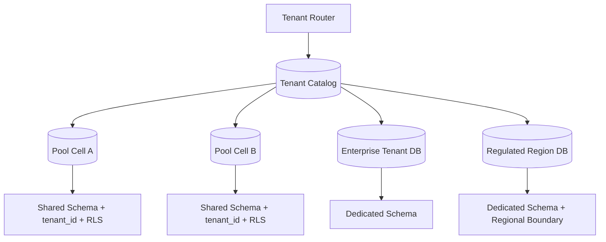
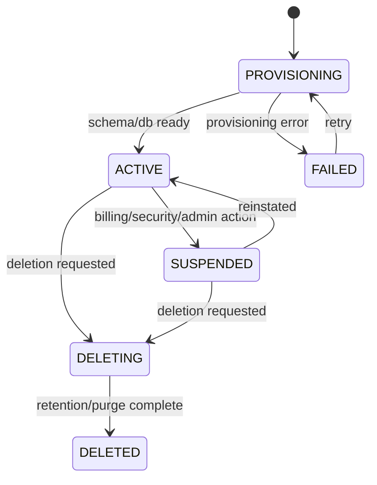
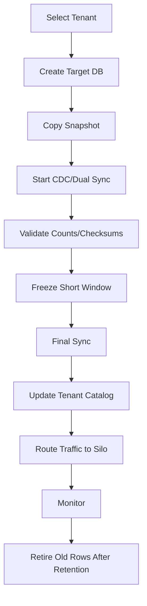
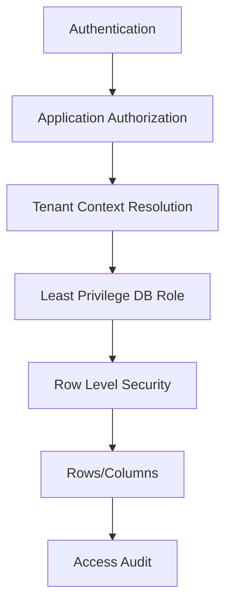

# Part 076 — Case Study: Multi-Tenant SaaS Platform

> Target pembelajaran: mampu mendesain database untuk SaaS multi-tenant yang aman, scalable, observable, bisa dimigrasikan, dan punya tenant isolation yang defensible. Fokusnya bukan sekadar “tambahkan `tenant_id`”, tetapi bagaimana isolation bekerja dari schema, query, transaction, backup, migration, analytics, sampai incident response.

Multi-tenancy adalah salah satu area database architecture yang sering terlihat sederhana tetapi menjadi sumber risiko besar:

- cross-tenant data leak,
- noisy neighbor,
- tenant-specific migration,
- tenant restore sulit,
- analytics mencampur data,
- authorization dan isolation tercampur,
- enterprise tenant meminta dedicated resources,
- small tenant butuh cost efficiency.

Kalau ledger menguji correctness nilai, multi-tenant SaaS menguji **correctness boundary**: data siapa boleh dilihat, diubah, dipindahkan, dihapus, dipulihkan, dan dilaporkan oleh siapa.

---

## 1. Problem Statement

Kita mendesain database untuk SaaS workflow/case-management platform.

Kebutuhan:

- ribuan tenant kecil,
- beberapa tenant enterprise besar,
- user bisa menjadi member beberapa tenant,
- data tenant harus isolated,
- tenant enterprise bisa meminta dedicated database,
- tenant bisa di-suspend, delete, export, restore,
- sistem butuh audit log per tenant,
- reporting cross-tenant hanya untuk internal ops dengan governance ketat,
- migration harus zero-downtime,
- noisy tenant tidak boleh menjatuhkan semua tenant,
- support engineer punya break-glass access yang diaudit.

Non-goal:

- ini bukan pembahasan billing SaaS penuh,
- bukan IAM/OAuth detail,
- bukan Kubernetes deployment detail,
- bukan ulang materi authorization pattern.

Fokus kita: database design dan architecture boundary.

---

## 2. Multi-Tenancy Mental Model

Multi-tenancy memiliki dua konsep yang sering tertukar:

| Konsep | Pertanyaan | Contoh |
|---|---|---|
| Data partitioning | Data tenant disimpan di mana dan dipisah secara fisik/logis bagaimana? | row `tenant_id`, schema per tenant, database per tenant |
| Tenant isolation | Bagaimana kita menjamin tenant A tidak bisa mengakses data tenant B? | RLS, IAM boundary, service policy, network isolation, dedicated DB |

Partitioning tidak otomatis berarti isolation.

Contoh: shared table dengan `tenant_id` adalah data partitioning. Tetapi jika query lupa filter `tenant_id`, isolation gagal. Isolation membutuhkan enforcement yang tidak bergantung hanya pada disiplin developer.

---

## 3. Tenancy Model Options

### 3.1 Pool Model: Shared Database, Shared Schema

```text
shared_db.public.case_record
  tenant_id | case_id | title | status
```

Kelebihan:

- cost efficient,
- operasional sederhana untuk banyak tenant kecil,
- schema migration sekali jalan,
- resource sharing tinggi.

Kekurangan:

- blast radius besar,
- tenant isolation harus sangat kuat,
- noisy neighbor risk,
- tenant-specific restore sulit,
- data residency/dedicated compliance sulit.

### 3.2 Bridge Model: Shared Database, Schema per Tenant

```text
shared_db.tenant_001.case_record
shared_db.tenant_002.case_record
```

Kelebihan:

- isolasi logis lebih jelas,
- tenant restore lebih mudah daripada pooled row,
- query tidak selalu butuh `tenant_id`.

Kekurangan:

- migration ribuan schema kompleks,
- connection/search_path risk,
- schema drift risk,
- metadata management berat.

### 3.3 Silo Model: Database per Tenant

```text
tenant_001_db.case_record
tenant_002_db.case_record
```

Kelebihan:

- isolation paling kuat,
- restore per tenant mudah,
- performance isolation lebih baik,
- enterprise/compliance friendly.

Kekurangan:

- cost tinggi,
- operational fleet lebih kompleks,
- migration orchestration sulit,
- cross-tenant analytics lebih sulit.

### 3.4 Hybrid Model

Real SaaS sering hybrid:

| Tenant Type | Model |
|---|---|
| Free/small | Pooled shared schema |
| Growth tenant | Pooled but isolated cell |
| Enterprise | Dedicated database or cluster |
| Regulated tenant | Dedicated database + dedicated key + residency boundary |

Diagram:



Hybrid model membutuhkan tenant catalog yang sangat kuat.

---

## 4. Tenant Catalog as Control Plane

Tenant catalog adalah source of truth untuk routing tenant.

```sql
create table tenant_catalog (
    tenant_id           uuid primary key,
    tenant_slug         text not null unique,
    tenant_name         text not null,
    tenant_status       text not null,
    tenancy_model       text not null,
    cell_id             text not null,
    database_key        text not null,
    schema_name         text,
    data_region         text not null,
    plan_code           text not null,
    isolation_tier      text not null,
    created_at          timestamptz not null default now(),
    suspended_at        timestamptz,
    deletion_requested_at timestamptz,
    deleted_at          timestamptz,

    constraint ck_tenant_status
        check (tenant_status in ('PROVISIONING', 'ACTIVE', 'SUSPENDED', 'DELETING', 'DELETED')),

    constraint ck_tenancy_model
        check (tenancy_model in ('POOL', 'BRIDGE', 'SILO')),

    constraint ck_isolation_tier
        check (isolation_tier in ('STANDARD', 'ENHANCED', 'DEDICATED', 'REGULATED'))
);
```

Rules:

- application tidak boleh menebak lokasi tenant,
- setiap request resolve tenant melalui catalog/cache yang tervalidasi,
- catalog update harus auditable,
- tenant migration mengubah catalog via controlled state machine,
- deleted tenant tidak boleh diroute ke data lama.

Tenant catalog adalah control plane, bukan tabel konfigurasi biasa.

---

## 5. Core Domain Schema in Pool Model

### 5.1 Tenant-Scoped Table

```sql
create table case_record (
    tenant_id           uuid not null,
    case_id             uuid not null,
    case_number         text not null,
    title               text not null,
    status              text not null,
    priority            text not null,
    assigned_team_id    uuid,
    opened_at           timestamptz not null,
    closed_at           timestamptz,
    created_at          timestamptz not null default now(),
    updated_at          timestamptz not null default now(),

    primary key (tenant_id, case_id),

    constraint uq_case_number_per_tenant
        unique (tenant_id, case_number),

    constraint ck_case_status
        check (status in ('OPEN', 'IN_REVIEW', 'ESCALATED', 'CLOSED', 'CANCELLED'))
);
```

Notice:

- primary key composite dengan `tenant_id`,
- unique key tenant-scoped,
- semua relationship tenant-scoped,
- query path wajib punya tenant predicate.

### 5.2 Tenant-Scoped Foreign Key

```sql
create table case_task (
    tenant_id           uuid not null,
    task_id             uuid not null,
    case_id             uuid not null,
    task_type           text not null,
    status              text not null,
    assignee_user_id    uuid,
    due_at              timestamptz,
    created_at          timestamptz not null default now(),

    primary key (tenant_id, task_id),

    constraint fk_case_task_case
        foreign key (tenant_id, case_id)
        references case_record (tenant_id, case_id)
);
```

FK harus membawa `tenant_id`. Jika FK hanya ke `case_id`, tenant boundary bocor secara konseptual walaupun UUID collision unlikely.

---

## 6. Identity Model

```sql
create table app_user (
    user_id             uuid primary key,
    email               citext not null unique,
    display_name        text not null,
    status              text not null,
    created_at          timestamptz not null default now()
);

create table tenant_membership (
    tenant_id           uuid not null,
    user_id             uuid not null references app_user(user_id),
    membership_status   text not null,
    joined_at           timestamptz not null default now(),
    left_at             timestamptz,

    primary key (tenant_id, user_id)
);

create table tenant_role_assignment (
    tenant_id           uuid not null,
    user_id             uuid not null,
    role_code           text not null,
    granted_at          timestamptz not null default now(),
    granted_by          uuid,

    primary key (tenant_id, user_id, role_code),

    foreign key (tenant_id, user_id)
        references tenant_membership (tenant_id, user_id)
);
```

User global, membership tenant-scoped.

Jangan menyimpan `tenant_id` di `app_user` jika user bisa bergabung ke banyak tenant. Itu akan membuat model rusak saat enterprise user, consultant, auditor, atau support actor memiliki akses lintas tenant.

---

## 7. Row-Level Security Pattern

Pooled schema sebaiknya tidak hanya bergantung pada application-side `where tenant_id = ?`.

Contoh RLS:

```sql
alter table case_record enable row level security;

create policy tenant_case_isolation
on case_record
using (
    tenant_id = current_setting('app.current_tenant_id')::uuid
)
with check (
    tenant_id = current_setting('app.current_tenant_id')::uuid
);
```

Aplikasi harus set context di awal transaction/request:

```sql
select set_config('app.current_tenant_id', :tenant_id::text, true);
```

`USING` mengontrol row yang bisa dibaca/diubah. `WITH CHECK` mengontrol row baru/hasil update agar tidak menulis ke tenant lain.

### 7.1 RLS Failure Modes

| Failure | Penyebab | Mitigasi |
|---|---|---|
| Missing tenant context | Connection reused tanpa set config | Set per transaction, reset pool, test |
| Superuser bypass | App memakai role terlalu kuat | Dedicated least-privilege app role |
| Policy hanya `USING` | Insert tenant lain masih mungkin | Tambahkan `WITH CHECK` |
| Reporting role bypass | Analytics query pakai privileged role | Dedicated governed export path |
| Function bypass | `SECURITY DEFINER` salah | Review function owner/search_path |

RLS bukan alasan untuk mengabaikan application authorization. RLS adalah safety net/enforcement layer untuk tenant isolation.

---

## 8. Query Shape for Pool Model

Semua query OLTP harus tenant-leading:

```sql
select case_id, case_number, title, status
from case_record
where tenant_id = :tenant_id
  and status = 'OPEN'
  and opened_at >= :from_time
order by opened_at desc, case_id desc
limit :limit;
```

Index:

```sql
create index ix_case_record_opened
on case_record (tenant_id, status, opened_at desc, case_id desc);
```

Anti-pattern:

```sql
select * from case_record where status = 'OPEN';
```

Di multi-tenant pooled database, query tanpa tenant predicate bisa menjadi:

- security risk,
- performance risk,
- noisy-neighbor amplifier,
- accidental cross-tenant analytics.

---

## 9. Noisy Neighbor Management

Noisy neighbor terjadi ketika satu tenant memakai resource berlebihan dan menurunkan service untuk tenant lain.

Sumber umum:

- tenant besar menjalankan query mahal,
- export besar,
- reporting live di OLTP,
- high write burst,
- long transaction,
- lock pada shared reference table,
- index miss di tenant besar,
- background job tenant besar.

Mitigasi:

| Problem | Mitigation |
|---|---|
| Query mahal | query budget, timeout, index, async report |
| Export besar | job queue, chunking, rate limit, replica/warehouse |
| Tenant data terlalu besar | move tenant to dedicated cell/silo |
| Write burst | per-tenant rate limit, queue isolation |
| Lock contention | tenant-scoped row lock, stable lock ordering |
| Reporting overload | materialized view/read model/warehouse |
| Connection starvation | per-tenant concurrency limit |

SaaS architect harus punya **tenant-level observability**, bukan hanya global database metrics.

---

## 10. Cell-Based Architecture

Cell adalah unit isolasi operasional yang berisi sekelompok tenant.

```text
Cell A: tenants 1-1000
Cell B: tenants 1001-2000
Cell C: enterprise tenant X
```

Manfaat:

- blast radius lebih kecil,
- migration per cell,
- capacity planning lebih mudah,
- noisy tenant bisa dipindah,
- failover lebih terkendali.

Schema catalog:

```sql
create table tenant_cell (
    cell_id             text primary key,
    region_code         text not null,
    database_key        text not null,
    status              text not null,
    max_tenant_count    integer not null,
    max_storage_gb      integer not null,
    created_at          timestamptz not null default now()
);
```

Tenant placement harus mempertimbangkan:

- region/data residency,
- tenant size,
- plan/isolation tier,
- compliance requirement,
- existing load,
- restore/failover capacity.

---

## 11. Tenant Lifecycle State Machine



Lifecycle table:

```sql
create table tenant_lifecycle_event (
    tenant_event_id     uuid primary key,
    tenant_id           uuid not null references tenant_catalog(tenant_id),
    from_status         text,
    to_status           text not null,
    reason_code         text not null,
    actor_id            uuid,
    occurred_at         timestamptz not null default now(),
    metadata            jsonb not null default '{}'::jsonb
);
```

Tenant deletion is not a `delete from tenant_catalog`.

It is a controlled lifecycle:

1. stop new access,
2. export if required,
3. legal hold check,
4. retention window,
5. downstream deletion propagation,
6. purge source data,
7. tombstone catalog,
8. audit evidence retained according to policy.

---

## 12. Tenant Migration: Pool to Silo

Enterprise tenant grows and needs dedicated DB.

Migration flow:



Migration control table:

```sql
create table tenant_migration_run (
    migration_run_id    uuid primary key,
    tenant_id           uuid not null,
    source_database_key text not null,
    target_database_key text not null,
    from_model          text not null,
    to_model            text not null,
    status              text not null,
    started_at          timestamptz not null default now(),
    cutover_at          timestamptz,
    completed_at        timestamptz,
    validation_summary  jsonb not null default '{}'::jsonb
);
```

Validation minimum:

- row counts per table,
- checksums per critical table,
- FK validation,
- latest update watermark,
- sample query comparison,
- authorization policy test,
- backup/restore target tested,
- app routing smoke test.

---

## 13. Backup and Restore Per Tenant

Pool model membuat tenant-specific restore sulit.

Jika tenant A meminta restore data ke kondisi kemarin, tetapi tenant B tetap berjalan di same tables, PITR database-level restore tidak bisa langsung overwrite primary.

Pattern:

1. restore database snapshot/PITR ke temporary environment,
2. extract tenant A rows,
3. validate referential completeness,
4. replay or transform into restore operation,
5. write restored data via controlled import/correction path,
6. audit restore event.

Untuk enterprise/silo model, restore lebih sederhana karena database tenant dedicated. Tetapi fleet operations lebih berat.

Checklist:

- [ ] Apakah restore granularity per tenant didukung?
- [ ] Apakah restore bisa diuji tanpa menimpa tenant lain?
- [ ] Apakah audit data restore ikut dipulihkan?
- [ ] Apakah downstream projection/search/warehouse direbuild?
- [ ] Apakah tenant deletion legal hold dihormati?

---

## 14. Reporting and Analytics Boundary

Multi-tenant analytics punya dua jenis:

| Type | Scope | Example | Risk |
|---|---|---|---|
| Tenant analytics | Satu tenant melihat datanya sendiri | tenant dashboard | stale data, auth |
| Internal SaaS ops analytics | Provider melihat aggregate lintas tenant | usage, health, billing | privacy, access abuse |

Jangan menjalankan cross-tenant analytics langsung di OLTP pooled table tanpa governance.

Pattern:

- tenant dashboard: tenant-scoped materialized view/read model,
- heavy export: async job + object storage,
- internal aggregate: anonymized/aggregated warehouse,
- support view: audited break-glass query path,
- compliance report: versioned report run.

Analytics schema harus menjaga:

- tenant_id tetap tersedia untuk enforcement,
- PII minimization,
- masking/pseudonymization,
- report run metadata,
- access audit.

---

## 15. Security Boundary

Multi-tenant security terdiri dari beberapa layer:



Rules:

- authN membuktikan siapa user,
- authZ membuktikan user boleh bertindak untuk tenant tertentu,
- tenant context membatasi request,
- DB role membatasi privilege,
- RLS membatasi row,
- column masking/encryption membatasi sensitive data,
- audit membuktikan akses.

Isolation dan authorization berbeda:

- isolation mencegah data tenant lain terekspos,
- authorization memastikan actor punya permission dalam tenant yang benar.

Keduanya perlu.

---

## 16. Schema Evolution in Multi-Tenant SaaS

### 16.1 Pool Model Migration

Satu migration memengaruhi semua tenant. Risiko tinggi karena blast radius besar.

Gunakan:

- expand-contract,
- backward-compatible column,
- `NOT VALID` constraint where possible,
- online index build,
- batched backfill,
- feature flag,
- canary tenant,
- query plan regression check.

### 16.2 Bridge/Silo Model Migration

Migration harus dijalankan per schema/database.

Risiko:

- sebagian tenant schema version berbeda,
- migration stuck di tenant tertentu,
- app harus support multiple schema versions,
- orchestration dan retry kompleks.

Tambahkan:

```sql
create table schema_version_registry (
    database_key        text not null,
    schema_name         text not null,
    version             integer not null,
    applied_at          timestamptz not null default now(),
    checksum            text not null,

    primary key (database_key, schema_name, version)
);
```

Aplikasi harus tahu compatibility window.

---

## 17. Data Residency and Regional Boundary

Jika tenant punya data residency requirement, `tenant_id` saja tidak cukup.

Perlu:

- tenant catalog berisi `data_region`,
- routing menjamin request ke region benar,
- backup berada di region yang sesuai,
- replicas tidak melanggar residency,
- analytics/export mengikuti policy,
- support access lintas region diaudit,
- deletion/retention mengikuti regulasi wilayah.

Data residency adalah architecture boundary, bukan metadata kosmetik.

---

## 18. Operational Observability

Minimum tenant-aware metrics:

- request rate per tenant tier,
- DB CPU/IO by cell,
- slow query sample with tenant hash,
- row growth per tenant,
- storage per tenant,
- active connections per cell,
- lock wait by tenant,
- export/report job duration per tenant,
- migration status per tenant,
- outbox/CDC lag by tenant/cell,
- RLS denied/error count,
- break-glass access count,
- tenant restore drill result.

Hindari label cardinality explosion. Jangan semua `tenant_id` dijadikan metric label mentah untuk semua metric. Gunakan:

- top-N tenants,
- tenant tier,
- hashed tenant id untuk logs,
- sampled traces,
- per-cell dashboards.

---

## 19. Failure Modes

| Failure | Impact | Prevention | Recovery |
|---|---|---|---|
| Missing tenant filter | Cross-tenant data leak | RLS, query tests, repository guard | Incident response + audit + notification |
| Wrong tenant context in pool | Reads/writes wrong tenant | set context per transaction, reset pool | Data repair, forensic audit |
| Noisy tenant | Global latency spike | per-tenant limit, cells, async reports | throttle/move tenant |
| Tenant migration partial cutover | split-brain data | catalog state machine, freeze window | rollback/roll-forward with reconciliation |
| Silo schema drift | tenant app errors | registry, migration orchestrator | targeted migration fix |
| Tenant restore overwrites others | catastrophic data loss | restore to temp, tenant-scoped import | PITR + incident process |
| Analytics leak | internal user sees PII/cross-tenant detail | governed warehouse, masking | revoke, audit, regenerate data products |
| Enterprise tenant under-isolated | contract/compliance breach | isolation tier mapping | migrate to silo/dedicated cell |
| RLS bypass | unrestricted access | least privilege, no superuser app role | rotate credentials, audit access |

---

## 20. Design Decision Matrix

| Requirement | Pool | Bridge | Silo | Hybrid |
|---|---:|---:|---:|---:|
| Lowest cost | Excellent | Good | Poor | Good |
| Strong isolation | Medium with RLS | Good | Excellent | Excellent for selected tenants |
| Operational simplicity | Good initially | Medium | Poor at scale | Medium |
| Tenant restore | Hard | Medium | Easy | Depends |
| Schema migration | Easy single migration | Hard across schemas | Hard across DBs | Hard but manageable with control plane |
| Noisy neighbor isolation | Weak | Medium | Strong | Strong with cells |
| Enterprise compliance | Often weak | Medium | Strong | Strong |
| Cross-tenant analytics | Easier | Medium | Harder | Needs pipeline |
| Data residency | Hard | Medium | Strong | Strong |

Default recommendation:

- start with pool only if isolation enforcement and tenant observability are mature,
- introduce cells before the platform becomes too large,
- offer silo for enterprise/regulatory tenants,
- build tenant migration early, not after the first enterprise deal forces it.

---

## 21. Production Readiness Checklist

Before production:

- [ ] Tenant catalog is source of truth for routing.
- [ ] Every tenant-scoped table has `tenant_id` in primary/unique/FK design.
- [ ] RLS or equivalent DB-level isolation is enforced for pooled data.
- [ ] App DB role cannot bypass tenant isolation.
- [ ] Connection pool resets tenant context safely.
- [ ] Tenant lifecycle has state machine and audit trail.
- [ ] Tenant deletion is lifecycle-driven, not ad hoc delete.
- [ ] Backup/restore strategy supports tenant-level restore or has documented limitation.
- [ ] Noisy-neighbor limits exist.
- [ ] Tenant-aware observability exists.
- [ ] Reporting/export path is async and governed.
- [ ] Cross-tenant analytics has privacy boundary.
- [ ] Tenant migration path exists: pool to cell/silo.
- [ ] Schema migration strategy supports tenancy model.
- [ ] Break-glass support access is approved, scoped, time-boxed, and audited.
- [ ] Data residency is enforced by routing and storage, not just policy text.

---

## 22. Final Mental Model

Multi-tenant SaaS database design is not:

```text
add tenant_id to every table
```

It is:

```text
tenant catalog
  -> routing boundary
  -> partitioning model
  -> isolation enforcement
  -> tenant-scoped schema
  -> tenant-aware queries
  -> tenant-aware operations
  -> tenant lifecycle
  -> migration/restore/recovery
  -> analytics governance
```

A top-tier engineer asks:

> “What happens if this tenant becomes 100x larger, asks for dedicated isolation, needs restore from yesterday, is under legal hold, or triggers a noisy-neighbor incident?”

A production-grade multi-tenant database must answer those questions before the first major tenant incident.

---

## References

- AWS Well-Architected SaaS Lens — Silo, Pool, and Bridge Models: https://docs.aws.amazon.com/wellarchitected/latest/saas-lens/silo-pool-and-bridge-models.html
- AWS Guidance for Multi-Tenant Architectures on AWS: https://docs.aws.amazon.com/solutions/multi-tenant-architectures-on-aws/
- AWS SaaS Tenant Isolation Strategies: https://docs.aws.amazon.com/whitepapers/latest/saas-tenant-isolation-strategies/saas-tenant-isolation-strategies.html
- AWS Prescriptive Guidance — SaaS Data Partitioning Models: https://docs.aws.amazon.com/prescriptive-guidance/latest/multi-tenancy-amazon-neptune/data-partitioning-models.html
- PostgreSQL Documentation — Row Security Policies: https://www.postgresql.org/docs/current/ddl-rowsecurity.html
- PostgreSQL Documentation — Constraints: https://www.postgresql.org/docs/current/ddl-constraints.html
