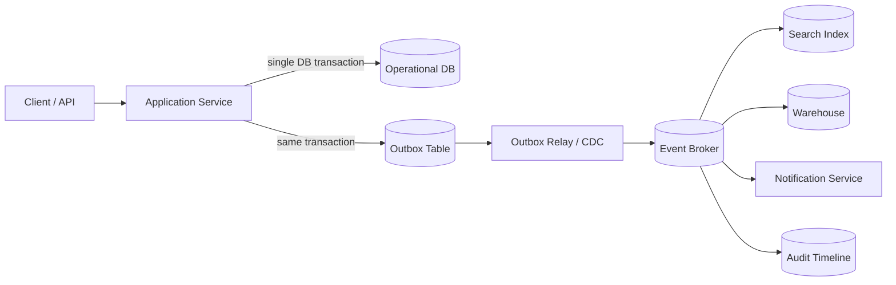
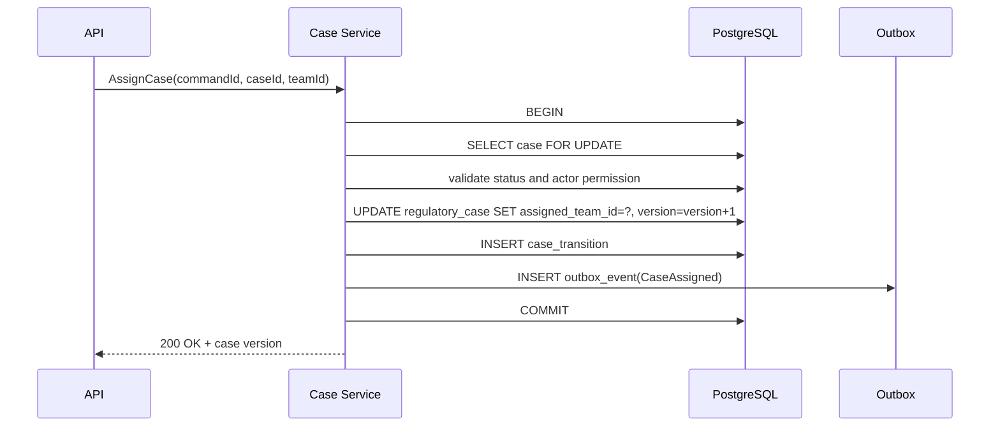
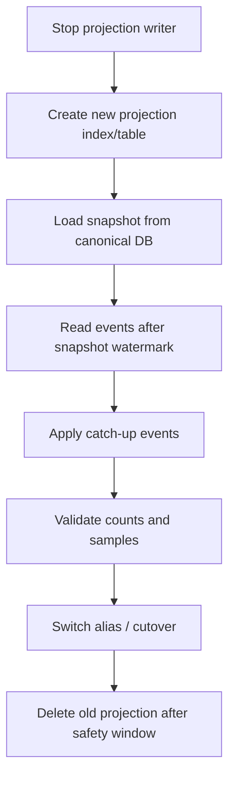

# Part 077 — Case Study: Event-Driven Operational Database

> Target pembelajaran: mampu mendesain operational database yang tetap menjadi source of truth, tetapi mampu menggerakkan search index, notification, analytics, audit timeline, workflow automation, dan downstream system secara reliable melalui event. Fokusnya adalah correctness, ordering, replay, idempotency, dan recoverability; bukan sekadar “publish event setelah insert”.

Event-driven architecture sering gagal bukan karena event broker-nya buruk, tetapi karena boundary antara **database write** dan **event publish** tidak dirancang sebagai satu kesatuan.

Masalah klasiknya:

1. service berhasil commit ke database tetapi gagal publish event,
2. service publish event tetapi transaksi database rollback,
3. consumer menerima event dua kali,
4. event datang tidak berurutan,
5. projection tertinggal jauh,
6. schema event berubah dan consumer rusak,
7. delete/privacy event tidak dipropagasikan,
8. replay menghasilkan state berbeda dari production,
9. event payload membocorkan data sensitif,
10. tim tidak tahu apakah downstream sudah konsisten dengan database.

Tujuan desain ini: membuat event-driven operational database yang **boring, auditable, replayable, dan defensible**.

---

## 1. Case Scenario

Kita mendesain database untuk platform regulatory case management.

Sistem utama melakukan:

- intake complaint,
- create case,
- assign investigator,
- update case status,
- attach evidence,
- create enforcement decision,
- notify parties,
- update search index,
- feed analytics warehouse,
- expose event stream untuk downstream team.

Kebutuhan utama:

- PostgreSQL OLTP tetap menjadi source of truth,
- setiap state change penting harus menghasilkan domain event,
- event tidak boleh hilang setelah database commit,
- consumer harus idempotent,
- search projection bisa di-rebuild,
- warehouse bisa bootstrap dari snapshot + event stream,
- event schema harus versioned,
- event tidak boleh membocorkan PII yang tidak perlu,
- audit harus bisa menjawab: “perubahan ini terjadi karena command apa, oleh siapa, dan event mana yang diterbitkan?”

Non-goal:

- bukan tutorial Kafka detail,
- bukan ulang materi CDC penuh,
- bukan membahas workflow engine secara lengkap,
- bukan event sourcing murni sebagai canonical persistence.

Di case study ini, database relasional tetap canonical. Event adalah **observable consequence** dari perubahan state.

---

## 2. Core Architecture

Desain yang aman menggunakan **transactional outbox**.

Artinya: aplikasi menulis business table dan outbox table dalam transaksi database yang sama. Setelah commit, outbox diproses oleh relay/CDC connector untuk dikirim ke broker.



Mental model:

- database transaction menjaga state dan outbox event atomic,
- relay mengubah outbox row menjadi broker message,
- consumer boleh gagal dan retry,
- projection bisa rebuild dari event stream atau snapshot,
- event stream bukan pengganti constraint di database,
- “event published” bukan bukti business transaction valid; validitas tetap ada di database.

---

## 3. Source of Truth Boundary

Sebelum membuat event, tentukan boundary kebenaran.

| Data | Source of truth | Derived/projection | Recovery path |
|---|---|---|---|
| Case current state | OLTP database | Search index, dashboard, cache | Rebuild from DB snapshot + event stream |
| Case transition history | OLTP transition table | Timeline projection | Rebuild from transition table |
| Notification sent status | Notification service DB | Ops dashboard | Reconcile with provider callback |
| Analytics metric | Warehouse | BI dashboard | Recompute from source data |
| Event delivery state | Outbox table + broker offset | Monitoring dashboard | Retry relay / replay topic |

Rule penting:

> Jangan menaruh invariant utama hanya di consumer.

Contoh salah:

- `case.status` berubah ke `CLOSED`, lalu consumer mengecek apakah evidence lengkap.
- Jika consumer gagal, case sudah terlanjur closed.

Contoh benar:

- invariant “case tidak boleh closed tanpa required evidence” dicek dalam transaksi command.
- event `CaseClosed` hanya konsekuensi dari state yang sudah valid.

---

## 4. Domain Model Minimal

Kita mulai dari entity utama.

```sql
CREATE TABLE regulatory_case (
    case_id          UUID PRIMARY KEY,
    tenant_id        UUID NOT NULL,
    case_number      TEXT NOT NULL,
    status           TEXT NOT NULL,
    priority         TEXT NOT NULL,
    assigned_team_id UUID,
    version          BIGINT NOT NULL DEFAULT 0,
    created_at       TIMESTAMPTZ NOT NULL DEFAULT now(),
    updated_at       TIMESTAMPTZ NOT NULL DEFAULT now(),

    CONSTRAINT uq_case_number_per_tenant UNIQUE (tenant_id, case_number),
    CONSTRAINT ck_case_status CHECK (status IN (
        'DRAFT', 'OPEN', 'UNDER_REVIEW', 'PENDING_DECISION', 'CLOSED', 'CANCELLED'
    ))
);
```

Transition history:

```sql
CREATE TABLE case_transition (
    transition_id    UUID PRIMARY KEY,
    tenant_id        UUID NOT NULL,
    case_id          UUID NOT NULL REFERENCES regulatory_case(case_id),
    from_status      TEXT,
    to_status        TEXT NOT NULL,
    command_id       UUID NOT NULL,
    actor_id         UUID NOT NULL,
    reason_code      TEXT,
    note             TEXT,
    occurred_at      TIMESTAMPTZ NOT NULL DEFAULT now(),

    CONSTRAINT uq_case_command_transition UNIQUE (tenant_id, case_id, command_id)
);

CREATE INDEX ix_case_transition_case_time
    ON case_transition (tenant_id, case_id, occurred_at DESC);
```

Command id dipakai untuk idempotency. Kalau client retry command yang sama, database tidak menciptakan transition ganda.

---

## 5. Outbox Schema

Outbox harus menyimpan event yang cukup untuk delivery, debugging, replay, dan governance.

```sql
CREATE TABLE outbox_event (
    outbox_id          UUID PRIMARY KEY,
    tenant_id          UUID NOT NULL,
    aggregate_type     TEXT NOT NULL,
    aggregate_id       UUID NOT NULL,
    aggregate_version  BIGINT NOT NULL,
    event_type         TEXT NOT NULL,
    event_version      INTEGER NOT NULL,
    event_key          TEXT NOT NULL,
    payload            JSONB NOT NULL,
    metadata           JSONB NOT NULL,
    occurred_at        TIMESTAMPTZ NOT NULL DEFAULT now(),
    available_at       TIMESTAMPTZ NOT NULL DEFAULT now(),
    published_at       TIMESTAMPTZ,
    publish_attempts   INTEGER NOT NULL DEFAULT 0,
    last_error         TEXT,
    status             TEXT NOT NULL DEFAULT 'PENDING',

    CONSTRAINT ck_outbox_status CHECK (status IN (
        'PENDING', 'IN_PROGRESS', 'PUBLISHED', 'FAILED', 'CANCELLED'
    )),
    CONSTRAINT uq_outbox_aggregate_version UNIQUE (
        aggregate_type, aggregate_id, aggregate_version, event_type
    )
);

CREATE INDEX ix_outbox_pending
    ON outbox_event (available_at, outbox_id)
    WHERE status = 'PENDING';

CREATE INDEX ix_outbox_aggregate
    ON outbox_event (aggregate_type, aggregate_id, aggregate_version);
```

Kolom penting:

| Column | Fungsi |
|---|---|
| `outbox_id` | event id global; dipakai consumer untuk dedup |
| `aggregate_type` | contoh: `RegulatoryCase` |
| `aggregate_id` | id entity yang berubah |
| `aggregate_version` | sequence per aggregate untuk ordering |
| `event_key` | broker partition key; biasanya `aggregate_id` atau `tenant_id:aggregate_id` |
| `payload` | data event minimal yang dibutuhkan consumer |
| `metadata` | actor, correlation id, causation id, trace id, command id |
| `available_at` | retry backoff / delayed publish |
| `status` | lifecycle delivery |

Outbox bukan audit table penuh. Audit menjawab “siapa mengubah apa dan kenapa”. Outbox menjawab “event apa yang harus dikirim ke dunia luar”.

Kadang satu row bisa melayani dua kebutuhan, tetapi di sistem regulated lebih aman memisahkan **audit event** dan **integration event**.

---

## 6. Event Envelope

Jangan kirim payload mentah tanpa envelope.

Contoh event:

```json
{
  "eventId": "09d8e4d2-1e7e-4c96-936f-5b4264d7f36d",
  "eventType": "CaseAssigned",
  "eventVersion": 1,
  "occurredAt": "2026-07-05T10:15:30Z",
  "tenantId": "f0b8b8e3-5ef1-48f4-bc69-13a69a8db57d",
  "aggregateType": "RegulatoryCase",
  "aggregateId": "b5b2d790-7c52-4c09-b08c-8abf9a654a19",
  "aggregateVersion": 42,
  "correlationId": "req-0bb30f",
  "causationId": "cmd-7d71f9",
  "actorId": "user-123",
  "payload": {
    "caseId": "b5b2d790-7c52-4c09-b08c-8abf9a654a19",
    "assignedTeamId": "team-enforcement-01",
    "previousAssignedTeamId": null
  }
}
```

Envelope contract:

| Field | Required | Reason |
|---|---:|---|
| `eventId` | yes | deduplication |
| `eventType` | yes | routing |
| `eventVersion` | yes | schema evolution |
| `occurredAt` | yes | timeline and lag calculation |
| `tenantId` | yes | isolation and routing |
| `aggregateId` | yes | ordering and projection |
| `aggregateVersion` | yes | out-of-order detection |
| `correlationId` | yes | traceability across services |
| `causationId` | yes | command/event causality |
| `actorId` | often | audit/debug; may be pseudonymized |

A good event envelope makes debugging distributed systems possible.

---

## 7. Command Write Path

Example: assign a case.



SQL sketch:

```sql
BEGIN;

SELECT case_id, tenant_id, status, assigned_team_id, version
FROM regulatory_case
WHERE tenant_id = :tenant_id
  AND case_id = :case_id
FOR UPDATE;

-- application validates:
-- - actor can assign case
-- - case status allows assignment
-- - target team is active in tenant

UPDATE regulatory_case
SET assigned_team_id = :new_team_id,
    version = version + 1,
    updated_at = now()
WHERE tenant_id = :tenant_id
  AND case_id = :case_id
RETURNING version;

INSERT INTO case_transition (
    transition_id,
    tenant_id,
    case_id,
    from_status,
    to_status,
    command_id,
    actor_id,
    reason_code,
    note
) VALUES (
    gen_random_uuid(),
    :tenant_id,
    :case_id,
    :status,
    :status,
    :command_id,
    :actor_id,
    'ASSIGNMENT_CHANGED',
    :note
)
ON CONFLICT (tenant_id, case_id, command_id) DO NOTHING;

INSERT INTO outbox_event (
    outbox_id,
    tenant_id,
    aggregate_type,
    aggregate_id,
    aggregate_version,
    event_type,
    event_version,
    event_key,
    payload,
    metadata
) VALUES (
    gen_random_uuid(),
    :tenant_id,
    'RegulatoryCase',
    :case_id,
    :new_version,
    'CaseAssigned',
    1,
    :case_id::text,
    jsonb_build_object(
        'caseId', :case_id,
        'assignedTeamId', :new_team_id,
        'previousAssignedTeamId', :old_team_id
    ),
    jsonb_build_object(
        'commandId', :command_id,
        'actorId', :actor_id,
        'correlationId', :correlation_id,
        'traceId', :trace_id
    )
);

COMMIT;
```

Invariant:

> Kalau command commit, outbox event exists. Kalau command rollback, outbox event tidak exists.

Itu inti transactional outbox.

---

## 8. Relay Pattern

Ada dua pendekatan umum:

1. polling relay,
2. log-based CDC relay.

### 8.1 Polling Relay

Relay worker memilih pending events:

```sql
WITH picked AS (
    SELECT outbox_id
    FROM outbox_event
    WHERE status = 'PENDING'
      AND available_at <= now()
    ORDER BY available_at, outbox_id
    LIMIT 100
    FOR UPDATE SKIP LOCKED
)
UPDATE outbox_event o
SET status = 'IN_PROGRESS',
    publish_attempts = publish_attempts + 1
FROM picked p
WHERE o.outbox_id = p.outbox_id
RETURNING o.*;
```

Setelah publish sukses:

```sql
UPDATE outbox_event
SET status = 'PUBLISHED',
    published_at = now(),
    last_error = NULL
WHERE outbox_id = :outbox_id;
```

Kalau publish gagal:

```sql
UPDATE outbox_event
SET status = 'PENDING',
    available_at = now() + (:backoff_seconds || ' seconds')::interval,
    last_error = :error_message
WHERE outbox_id = :outbox_id;
```

Kelebihan polling:

- mudah dipahami,
- tidak perlu logical replication,
- kontrol retry mudah.

Kekurangan:

- bisa menambah load ke DB,
- butuh tuning batch/interval,
- status update outbox bisa membuat write amplification,
- ordering global sulit.

### 8.2 CDC Relay

CDC membaca perubahan outbox table dari database log dan mengirim ke broker.

Kelebihan:

- tidak perlu polling intensif,
- delivery mendekati commit order database,
- cocok untuk volume tinggi,
- bisa memakai connector seperti Debezium.

Kekurangan:

- operational complexity lebih tinggi,
- perlu memahami replication slot / connector offset,
- schema outbox harus stabil,
- error handling kadang bergeser ke connector/broker ecosystem.

Rule praktis:

| Kondisi | Pilihan awal |
|---|---|
| volume rendah-sedang, tim kecil | polling relay |
| volume tinggi, banyak consumer, sudah punya Kafka/CDC | log-based CDC |
| perlu zero-loss event dari DB commit log | CDC/outbox |
| perlu enrichment kompleks sebelum publish | polling relay atau relay service khusus |

---

## 9. Ordering Model

Kesalahan umum: menganggap event broker menjaga ordering semua event.

Yang realistis adalah ordering **per key**, bukan global.

Untuk case management:

- ordering per `case_id` penting,
- ordering global semua case tidak penting,
- ordering per tenant mungkin terlalu kasar dan bisa bottleneck,
- ordering per actor biasanya tidak sesuai domain.

Broker partition key:

```text
event_key = aggregate_id
```

Consumer projection harus menyimpan last applied version per aggregate.

```sql
CREATE TABLE projection_aggregate_checkpoint (
    projection_name     TEXT NOT NULL,
    aggregate_type      TEXT NOT NULL,
    aggregate_id        UUID NOT NULL,
    last_version        BIGINT NOT NULL,
    last_event_id       UUID NOT NULL,
    updated_at          TIMESTAMPTZ NOT NULL DEFAULT now(),
    PRIMARY KEY (projection_name, aggregate_type, aggregate_id)
);
```

Consumer logic:

```text
if event.aggregateVersion == checkpoint.lastVersion + 1:
    apply event
elif event.aggregateVersion <= checkpoint.lastVersion:
    ignore duplicate/old event
else:
    pause aggregate / send to gap queue
```

Out-of-order event tidak boleh diterapkan diam-diam.

---

## 10. Consumer Idempotency

Consumer harus aman terhadap duplicate delivery.

Inbox table:

```sql
CREATE TABLE consumer_inbox_event (
    consumer_name   TEXT NOT NULL,
    event_id        UUID NOT NULL,
    received_at     TIMESTAMPTZ NOT NULL DEFAULT now(),
    processed_at    TIMESTAMPTZ,
    status          TEXT NOT NULL DEFAULT 'PROCESSING',
    error_message   TEXT,
    PRIMARY KEY (consumer_name, event_id)
);
```

Processing pattern:

```sql
BEGIN;

INSERT INTO consumer_inbox_event (consumer_name, event_id)
VALUES (:consumer_name, :event_id)
ON CONFLICT DO NOTHING;

-- if inserted row count = 0, event was already seen
-- return success to broker if already processed

-- apply projection mutation

UPDATE consumer_inbox_event
SET status = 'PROCESSED', processed_at = now()
WHERE consumer_name = :consumer_name
  AND event_id = :event_id;

COMMIT;
```

Idempotency bukan optional. Broker retry, network retry, connector restart, dan manual replay akan menyebabkan duplicate.

---

## 11. Projection Design

Search projection berbeda dari canonical model.

Canonical model:

- normalized,
- constraint-rich,
- write-safe,
- source-of-truth.

Search projection:

- denormalized,
- query optimized,
- rebuildable,
- eventually consistent.

Example search document:

```json
{
  "caseId": "...",
  "tenantId": "...",
  "caseNumber": "CASE-2026-000123",
  "status": "UNDER_REVIEW",
  "priority": "HIGH",
  "assignedTeamName": "Enforcement A",
  "partyNames": ["PT Example", "John Doe"],
  "latestDecision": null,
  "updatedAt": "2026-07-05T10:15:30Z",
  "visibilityScope": ["tenant:f0b8", "team:enforcement-a"]
}
```

Projection contract harus menyebut:

- source events,
- source tables untuk bootstrap,
- freshness target,
- authorization field,
- rebuild procedure,
- deletion/tombstone behavior,
- schema version,
- monitoring metric.

---

## 12. Replay and Rebuild

Sistem event-driven yang baik harus bisa menjawab:

> Kalau projection rusak, bagaimana membangunnya ulang tanpa mengubah source of truth?

Rebuild strategy:



Watermark table:

```sql
CREATE TABLE projection_rebuild_run (
    rebuild_id        UUID PRIMARY KEY,
    projection_name   TEXT NOT NULL,
    snapshot_started_at TIMESTAMPTZ NOT NULL,
    snapshot_lsn      TEXT,
    event_from_time   TIMESTAMPTZ NOT NULL,
    status            TEXT NOT NULL,
    row_count         BIGINT,
    error_message     TEXT,
    created_at        TIMESTAMPTZ NOT NULL DEFAULT now(),
    completed_at      TIMESTAMPTZ
);
```

Kalau memakai CDC, idealnya ambil snapshot dengan posisi log/LSN agar catch-up tidak kehilangan perubahan.

---

## 13. Event Schema Evolution

Event tidak sama dengan internal DTO.

Aturan:

- event adalah public contract,
- jangan rename field tanpa versioning,
- field baru harus optional atau punya default,
- semantic change butuh event version baru,
- consumer lama harus tetap bisa memproses event lama,
- event harus punya deprecation window.

Compatibility table:

| Change | Risk | Safe approach |
|---|---|---|
| add optional field | low | same event version acceptable |
| add required field | medium | new version or default |
| rename field | high | keep old + add new during transition |
| remove field | high | deprecate then remove after consumer migration |
| change meaning | very high | new event type/version |
| split event | high | dual publish during migration |
| merge event | high | consumer compatibility plan |

Versioned event handler:

```text
switch eventType:
  CaseAssigned:
    if eventVersion == 1: handleV1(event)
    if eventVersion == 2: handleV2(event)
```

---

## 14. Delete, Privacy, and Tombstone Events

Delete is not merely row removal.

Downstream stores need to know:

- should document be removed from search?
- should warehouse retain anonymized facts?
- should cache evict key?
- should notification service suppress future messages?
- should external consumer receive erasure request?

Pattern:

```json
{
  "eventType": "CaseErasureRequested",
  "eventVersion": 1,
  "aggregateId": "...",
  "payload": {
    "caseId": "...",
    "erasureScope": "PII_ONLY",
    "retainAuditShell": true,
    "deadlineAt": "2026-08-04T00:00:00Z"
  }
}
```

Projection deletion contract:

| Store | Delete behavior |
|---|---|
| search index | delete document or remove PII fields |
| cache | evict immediately |
| warehouse | anonymize dimension or remove depending policy |
| audit log | retain minimal shell if legally required |
| external partner | send erasure command and track acknowledgement |

Privacy event harus minim payload. Jangan masukkan PII yang justru ingin dihapus.

---

## 15. Observability

Metrics utama:

| Metric | Meaning |
|---|---|
| outbox pending count | event backlog |
| oldest pending age | delay paling penting |
| publish attempts | retry pressure |
| publish failure rate | broker/relay issue |
| consumer lag | projection freshness |
| poison event count | schema/data bug |
| duplicate event ignored | retry/replay activity |
| out-of-order gap count | partitioning/ordering issue |
| projection validation mismatch | correctness issue |

Useful query:

```sql
SELECT
    status,
    count(*) AS events,
    min(occurred_at) AS oldest,
    max(occurred_at) AS newest
FROM outbox_event
GROUP BY status
ORDER BY status;
```

Oldest pending event:

```sql
SELECT outbox_id, event_type, aggregate_type, aggregate_id,
       occurred_at, publish_attempts, last_error
FROM outbox_event
WHERE status = 'PENDING'
ORDER BY occurred_at
LIMIT 20;
```

Consumer poison events:

```sql
SELECT consumer_name, status, count(*)
FROM consumer_inbox_event
GROUP BY consumer_name, status
ORDER BY consumer_name, status;
```

---

## 16. Failure Modes

| Failure | Symptom | Root cause | Mitigation |
|---|---|---|---|
| Dual-write gap | DB updated but no event | event publish outside transaction | transactional outbox |
| Duplicate event | consumer applies twice | broker retry/replay | inbox dedup + idempotent mutation |
| Out-of-order event | projection regresses | wrong partition key | aggregate key + version check |
| Poison event | consumer repeatedly fails | schema/data bug | DLQ + fix-forward + replay |
| Outbox backlog | downstream stale | relay down/broker slow | alert on oldest pending age |
| Projection drift | search result wrong | missed event/buggy handler | validation + rebuild |
| Payload leak | sensitive data exposed | event contract too broad | data minimization + event review |
| Infinite retry storm | system overloaded | no backoff/circuit breaker | exponential backoff + max attempts |
| Replay corrupts projection | non-idempotent handler | handler uses current time/randomness | deterministic projection logic |
| CDC slot bloat | disk fills | connector stuck | monitor replication lag/slot retained bytes |

---

## 17. Testing Strategy

Minimum tests:

1. command commits business row and outbox row atomically,
2. command rollback does not create outbox row,
3. duplicate command does not create duplicate transition,
4. duplicate event is ignored by consumer,
5. out-of-order event is rejected or parked,
6. projection rebuild produces same result as live projection,
7. old event version still supported,
8. poison event goes to DLQ without blocking all tenants,
9. deletion/tombstone propagates to search/cache/warehouse,
10. relay restart does not lose in-progress events.

Concurrency test:

```text
Given 50 concurrent AssignCase commands for same case
When all commands race
Then only valid transitions commit
And aggregate_version is strictly increasing
And outbox contains exactly one event per committed transition
```

Replay test:

```text
Given production-like event stream
When projection is rebuilt from empty state
Then document count, sample documents, and aggregate checksums match canonical DB
```

---

## 18. Design Checklist

Before approving an event-driven database design, ask:

- What is canonical source of truth?
- Which events are domain events and which are integration events?
- Is event creation atomic with database commit?
- What is the event ordering scope?
- What is the idempotency key for producer and consumer?
- Can every projection be rebuilt?
- Is event schema versioned?
- Is delete/privacy propagation explicit?
- Are event payloads minimized?
- How is lag measured?
- What happens when relay is down for 6 hours?
- What happens when consumer has a poison event?
- What is the manual replay procedure?
- Which event changes require consumer approval?
- Are audit events separate from integration events?
- Is there a runbook for backlog, DLQ, and projection drift?

---

## 19. Architecture Principle

Event-driven operational database design is not about moving logic into Kafka, CDC, or queue workers.

It is about this contract:

> The database commits valid state. The outbox records what must be observed. The relay delivers at-least-once. Consumers are idempotent. Projections are rebuildable. Operators can prove what happened.

Kalau lima hal itu tidak benar, sistem event-driven akan terlihat modern tetapi rapuh.

---

## 20. References

- AWS Prescriptive Guidance — Transactional Outbox Pattern: https://docs.aws.amazon.com/prescriptive-guidance/latest/cloud-design-patterns/transactional-outbox.html
- AWS Prescriptive Guidance — Event Sourcing Pattern: https://docs.aws.amazon.com/prescriptive-guidance/latest/cloud-design-patterns/event-sourcing.html
- Debezium Documentation — Outbox Event Router: https://debezium.io/documentation/reference/stable/transformations/outbox-event-router.html
- PostgreSQL Documentation — Logical Decoding: https://www.postgresql.org/docs/current/logicaldecoding.html
- PostgreSQL Documentation — Explicit Locking: https://www.postgresql.org/docs/current/explicit-locking.html
- Confluent Documentation — Kafka Message Delivery Guarantees: https://docs.confluent.io/kafka/design/delivery-semantics.html
