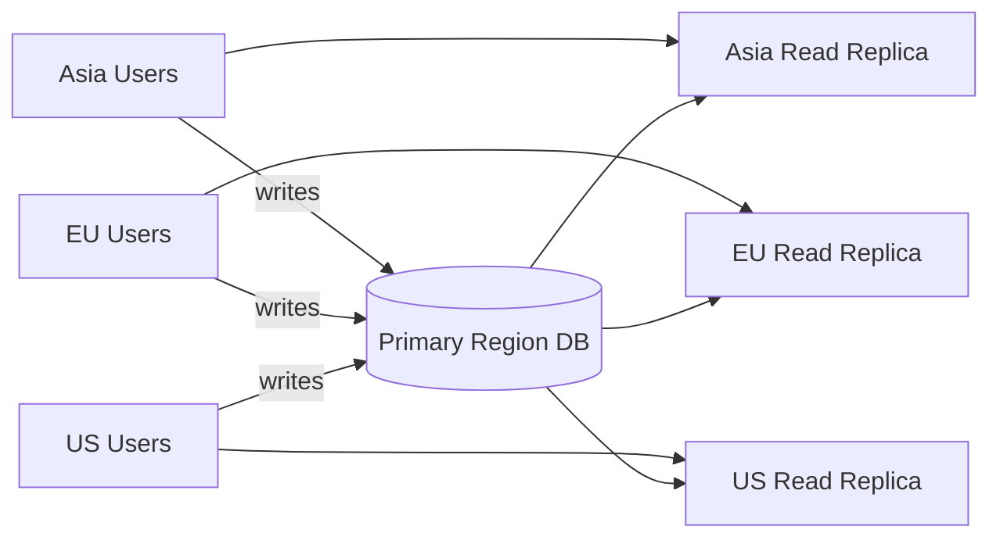
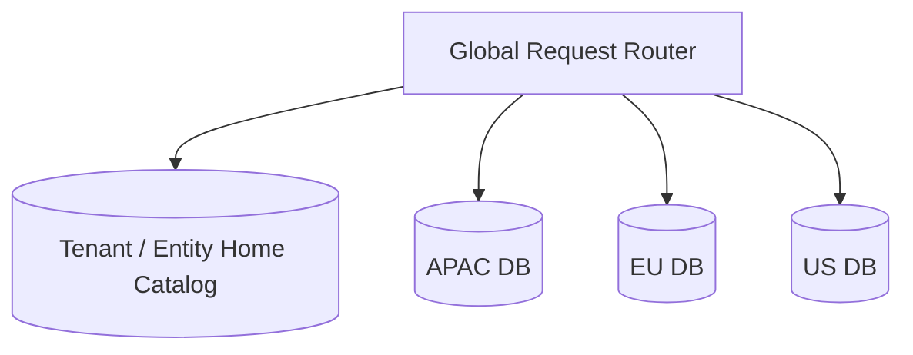
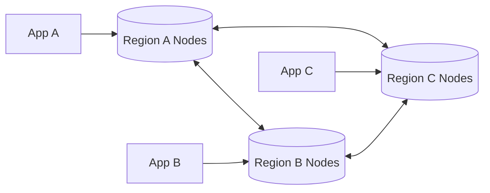
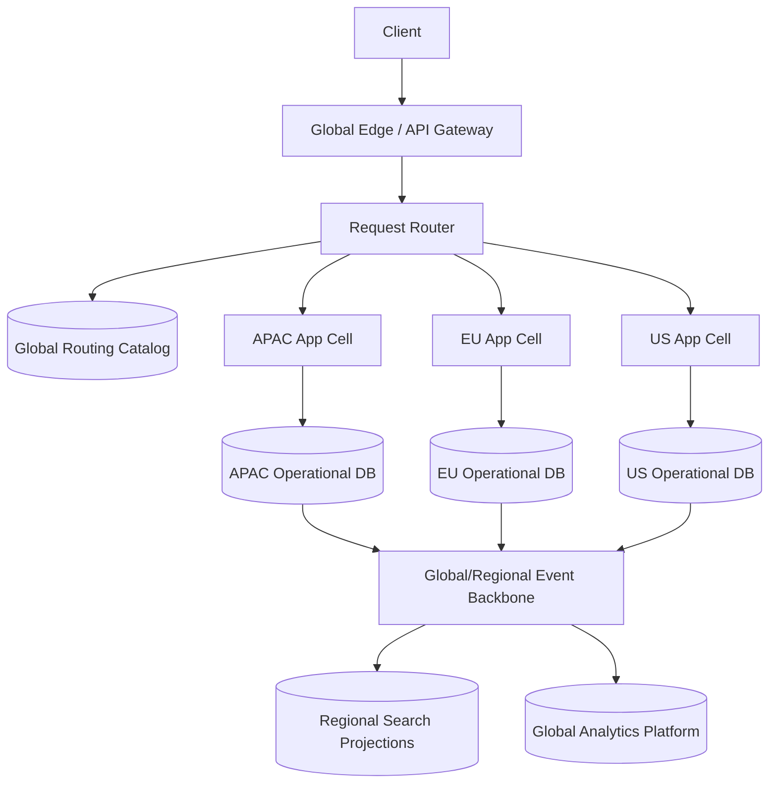
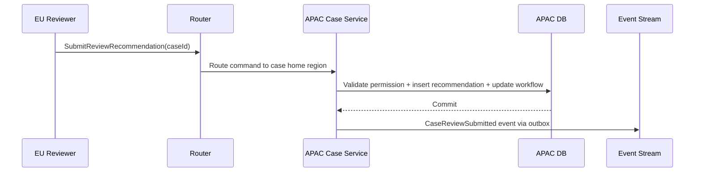
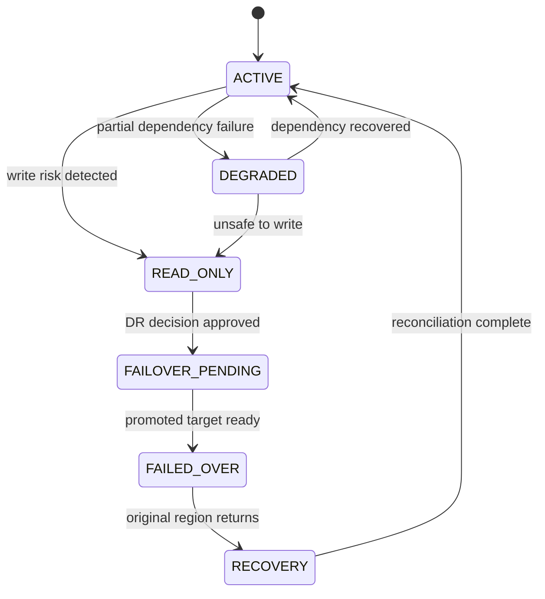
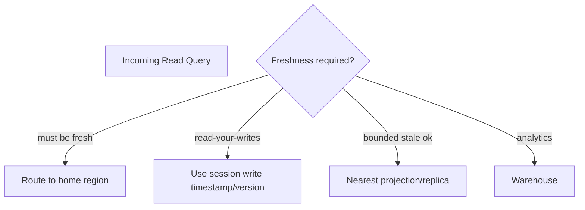
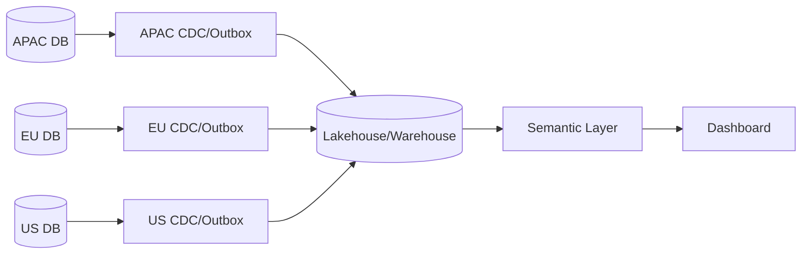
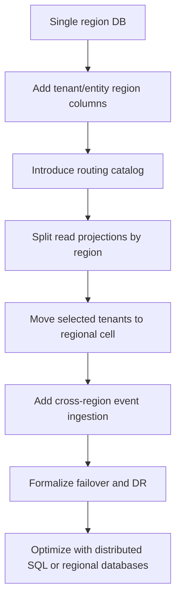

# Part 078 — Case Study: Distributed Global Application

> Target pembelajaran: mampu mendesain database architecture untuk aplikasi global yang harus menyeimbangkan latency, consistency, availability, data residency, failover, dan operational complexity. Fokusnya bukan “replicate everything everywhere”, tetapi memilih **home region**, **consistency boundary**, dan **degraded mode** yang sesuai dengan invariant bisnis.

Aplikasi global adalah tempat banyak simplifikasi database runtuh.

Di single region, kita bisa berkata:

- satu primary database,
- satu latency envelope,
- satu failure domain,
- satu legal jurisdiction,
- satu backup/restore boundary.

Di multi-region, semuanya berubah:

- user lebih dekat ke region berbeda,
- data tidak selalu boleh keluar negara tertentu,
- cross-region write lebih lambat,
- async replication bisa konflik,
- failover bisa menyebabkan stale read atau lost write,
- operational incident punya blast radius geografis,
- “availability” untuk satu region bisa berarti “inconsistency” untuk region lain.

Top 1% database architect tidak memilih active-active karena terdengar modern. Mereka mulai dari pertanyaan: **state apa yang harus benar, di mana state itu tinggal, dan siapa boleh menulisnya saat region bermasalah?**

---

## 1. Case Scenario

Kita mendesain global regulatory platform.

Pengguna berada di:

- Indonesia,
- Singapore,
- EU,
- United States,
- Australia.

Sistem digunakan untuk:

- intake complaint global,
- case management regional,
- evidence upload,
- cross-region reference lookup,
- investigation collaboration,
- public portal status check,
- executive dashboard,
- regulator audit.

Constraints:

- beberapa tenant/data subject harus tetap di region tertentu,
- user global butuh low-latency read,
- case update harus strongly consistent dalam case home region,
- global reference data boleh replicated read-only,
- dashboard boleh stale beberapa menit,
- public status boleh stale pendek,
- enforcement decision tidak boleh konflik,
- region outage harus punya degraded mode,
- audit trail harus survive region failure,
- backup/restore harus mempertahankan data residency.

Non-goal:

- bukan tutorial vendor spesifik,
- bukan network architecture detail,
- bukan Kubernetes multi-cluster detail,
- bukan IAM global detail.

Fokus: database design dan architecture decision.

---

## 2. First Principle: Not All Data Is Global

Kesalahan umum adalah menganggap semua data harus replicated global.

Lebih baik mulai dari klasifikasi data.

| Data class | Example | Home | Replication | Consistency need |
|---|---|---|---|---|
| Global reference data | country, violation taxonomy | global admin region | read-only replicas everywhere | eventual acceptable |
| Tenant configuration | tenant settings, policy flags | tenant home region | cached/global read projection | read-your-config for admin writes |
| Case operational data | case, task, evidence metadata | case home region | regional read replicas/projections | strong for commands |
| Evidence object | document/blob | data residency region | maybe replicated encrypted | depends legal policy |
| User identity profile | global user account | identity home/global service | replicated/cached | strong for security-sensitive changes |
| Authorization grants | membership, role assignment | tenant home region | local cache with short TTL | strong for writes, bounded stale reads |
| Public status projection | case status subset | nearest edge/read store | async projection | bounded staleness |
| Analytics | warehouse/lakehouse | analytical region | batch/stream ingestion | reproducible, not synchronous |
| Audit log | immutable/security-critical | home + protected replica | append-only replicated | high durability |

Architecture starts by assigning **home** and **consistency** to every data class.

---

## 3. Topology Options

### 3.1 Single Primary Region + Global Read Replicas



Good for:

- simple correctness,
- low operational complexity,
- read-heavy global app,
- writes concentrated in one region.

Bad for:

- high write latency from far regions,
- data residency restrictions,
- primary region outage,
- user experience for write-heavy workflows.

### 3.2 Region-Per-Tenant / Region-Per-Entity Home



Good for:

- data residency,
- regional latency,
- bounded blast radius,
- tenant isolation.

Bad for:

- cross-region collaboration complexity,
- global reporting complexity,
- tenant migration complexity,
- duplicated operational surface.

### 3.3 Distributed SQL Multi-Region



Good for:

- one logical database,
- SQL abstraction,
- consensus-based replication,
- strong consistency options,
- row/table locality features in some systems.

Bad for:

- cross-region transaction latency,
- operational learning curve,
- schema locality design required,
- not all workloads benefit.

### 3.4 Async Active-Active per Region

Each region accepts writes and replicates asynchronously.

Good for:

- local write latency,
- high apparent availability,
- disconnected operation.

Bad for:

- conflict resolution,
- non-deterministic convergence,
- difficult invariant enforcement,
- audit complexity,
- regulatory defensibility risk.

Rule:

> Avoid async active-active for canonical state with strong invariants unless conflict semantics are explicit, bounded, and testable.

---

## 4. Recommended Architecture for This Case

Use **home-region ownership** with selective global projections.



Principle:

- each case has one home region,
- all commands for that case route to home region,
- read projections may exist closer to users,
- reference data replicated globally,
- analytics ingests async,
- failover is explicit, not accidental.

---

## 5. Global Routing Catalog

The routing catalog maps tenant/entity to home region.

```sql
CREATE TABLE tenant_region_assignment (
    tenant_id        UUID PRIMARY KEY,
    home_region      TEXT NOT NULL,
    residency_policy TEXT NOT NULL,
    status           TEXT NOT NULL,
    created_at       TIMESTAMPTZ NOT NULL DEFAULT now(),
    updated_at       TIMESTAMPTZ NOT NULL DEFAULT now(),

    CONSTRAINT ck_tenant_region_status CHECK (status IN (
        'ACTIVE', 'MIGRATING', 'SUSPENDED', 'DECOMMISSIONED'
    ))
);

CREATE TABLE entity_home_region (
    entity_type       TEXT NOT NULL,
    entity_id         UUID NOT NULL,
    tenant_id         UUID NOT NULL,
    home_region       TEXT NOT NULL,
    region_epoch      BIGINT NOT NULL DEFAULT 1,
    assigned_at       TIMESTAMPTZ NOT NULL DEFAULT now(),
    PRIMARY KEY (entity_type, entity_id)
);

CREATE INDEX ix_entity_home_tenant
    ON entity_home_region (tenant_id, entity_type, home_region);
```

Why both tenant and entity home?

- tenant home is default,
- entity home supports migration/split later,
- `region_epoch` prevents stale router decisions during migration.

Request routing:

```text
resolve tenant_id / case_id
read entity_home_region
route command to home_region
include region_epoch in command
home region validates epoch before mutation
```

Epoch validation prevents writes to old region after migration.

---

## 6. Region-Aware Schema

Operational tables include home region metadata.

```sql
CREATE TABLE regulatory_case (
    tenant_id       UUID NOT NULL,
    case_id         UUID NOT NULL,
    home_region     TEXT NOT NULL,
    region_epoch    BIGINT NOT NULL,
    case_number     TEXT NOT NULL,
    status          TEXT NOT NULL,
    version         BIGINT NOT NULL DEFAULT 0,
    created_at      TIMESTAMPTZ NOT NULL DEFAULT now(),
    updated_at      TIMESTAMPTZ NOT NULL DEFAULT now(),

    PRIMARY KEY (tenant_id, case_id),
    CONSTRAINT uq_case_number_region UNIQUE (tenant_id, home_region, case_number)
);
```

Every command must include region context:

```sql
UPDATE regulatory_case
SET status = :new_status,
    version = version + 1,
    updated_at = now()
WHERE tenant_id = :tenant_id
  AND case_id = :case_id
  AND home_region = :expected_region
  AND region_epoch = :expected_region_epoch
  AND status = :expected_current_status;
```

If row count is zero, possible reasons:

- stale client state,
- wrong region,
- entity migrated,
- status changed concurrently,
- tenant suspended.

Do not hide these as generic 500 errors.

---

## 7. Consistency Contract by Operation

Not every operation needs the same consistency.

| Operation | Route | Consistency | Staleness allowed | Degraded mode |
|---|---|---|---:|---|
| Create case | tenant home region | strong local transaction | none | queue intake if allowed |
| Update case status | case home region | strong local transaction | none | read-only during home outage |
| Assign task | case home region | strong local transaction | none | pause assignment |
| View case detail by investigator | case home or fresh replica | read-your-writes preferred | seconds if no recent write | show stale warning |
| Public status check | nearest projection | eventual | 1-5 minutes | show last updated timestamp |
| Global dashboard | warehouse | eventual/reproducible | minutes-hours | freeze last successful report |
| Reference lookup | local cache/replica | eventual | hours if versioned | fallback to last valid version |
| Role change | tenant home region | strong write | bounded cache stale | revoke via cache bust event |
| Evidence upload | evidence home region | strong metadata commit | none | deferred upload if policy allows |

This table is more important than the technology choice.

---

## 8. Data Residency Design

Data residency is not only storage location. It includes:

- primary storage location,
- replica location,
- backup location,
- log location,
- cache location,
- search projection location,
- warehouse ingestion location,
- support access location,
- disaster recovery location.

Residency policy table:

```sql
CREATE TABLE residency_policy (
    policy_code        TEXT PRIMARY KEY,
    allowed_regions    TEXT[] NOT NULL,
    backup_regions     TEXT[] NOT NULL,
    analytics_allowed  BOOLEAN NOT NULL,
    cross_border_export_allowed BOOLEAN NOT NULL,
    description        TEXT NOT NULL,
    effective_from     DATE NOT NULL,
    effective_to       DATE
);
```

Before placing data, validate:

```text
tenant.residency_policy allows target home_region
backup target belongs to policy.backup_regions
search projection region allowed
analytics export allowed or anonymized
support access jurisdiction allowed
```

A common failure: application data respects residency, but logs/search/analytics/backups violate it.

---

## 9. Global Identifiers

Global apps need IDs that do not require cross-region coordination for every insert.

Options:

| ID | Good | Risk |
|---|---|---|
| UUIDv4 | easy, decentralized | random index locality |
| UUIDv7/ULID-like | time-sortable, decentralized | clock behavior must be understood |
| region-prefixed sequence | readable, local sequence | reveals region, migration complexity |
| central sequence | simple uniqueness | global bottleneck |

Practical pattern:

- use UUID/ULID-like ID for internal identity,
- use region-scoped human number for display,
- include tenant/home region in uniqueness where required.

Example:

```sql
CREATE TABLE case_number_counter (
    tenant_id     UUID NOT NULL,
    region_code   TEXT NOT NULL,
    year          INTEGER NOT NULL,
    next_value    BIGINT NOT NULL,
    PRIMARY KEY (tenant_id, region_code, year)
);
```

Display number:

```text
APAC-2026-00000123
```

Do not build core identity around display number.

---

## 10. Cross-Region Workflow

Some workflows cross regions.

Example: APAC case needs EU legal review.

Bad design:

- EU app directly updates APAC canonical case over async replica.

Better design:

- APAC case remains home-owned,
- EU reviewer creates review recommendation in EU collaboration store or via routed command,
- final state transition happens in APAC home region,
- event records EU contribution as evidence/input.

Pattern:



Rule:

> Cross-region collaboration does not imply cross-region ownership.

---

## 11. Conflict Avoidance Over Conflict Resolution

Conflict resolution sounds attractive, but for regulated workflows it is dangerous.

Example conflict:

- APAC investigator closes case as “No Violation”.
- EU reviewer escalates same case as “Legal Action Required”.
- Async replication converges later.

Which one wins?

`last_write_wins` is unacceptable because it erases causality.

Safer approach:

- single writer per aggregate,
- home-region command routing,
- optimistic version check,
- explicit merge/review process for conflicting recommendations.

Conflict table for exceptional cases:

```sql
CREATE TABLE cross_region_conflict_case (
    conflict_id       UUID PRIMARY KEY,
    tenant_id         UUID NOT NULL,
    aggregate_type    TEXT NOT NULL,
    aggregate_id      UUID NOT NULL,
    home_region       TEXT NOT NULL,
    conflicting_region TEXT NOT NULL,
    conflict_type     TEXT NOT NULL,
    local_version     BIGINT,
    remote_version    BIGINT,
    payload           JSONB NOT NULL,
    status            TEXT NOT NULL DEFAULT 'OPEN',
    detected_at       TIMESTAMPTZ NOT NULL DEFAULT now(),
    resolved_at       TIMESTAMPTZ,
    resolution_note   TEXT
);
```

But this table should be rare. The architecture should prevent most conflicts by ownership design.

---

## 12. Failover Model

Failover must be designed per data class and operation.

| Failure | Allowed behavior |
|---|---|
| read projection down | route to another projection or home region |
| analytics pipeline down | continue OLTP, mark dashboard stale |
| non-home region down | users in that region route to home region, higher latency |
| home region down | freeze writes for affected entities unless DR promotion approved |
| global catalog down | use cached routing with short TTL; block migrations |
| event backbone down | continue OLTP if outbox can buffer; alert backlog |
| evidence object store down | block evidence upload or accept metadata only depending policy |

State machine for region:



Do not automatically fail over strong-write systems without clear fencing. Split brain is often worse than downtime.

---

## 13. Fencing During Failover

If a region is promoted, the old writer must not continue accepting writes.

Fencing methods:

- DNS/control-plane disable,
- database role demotion,
- lease epoch,
- region epoch in routing catalog,
- application write gate,
- operator approval with audit.

Schema support:

```sql
CREATE TABLE region_write_epoch (
    logical_scope   TEXT PRIMARY KEY,
    active_region   TEXT NOT NULL,
    epoch           BIGINT NOT NULL,
    status          TEXT NOT NULL,
    updated_at      TIMESTAMPTZ NOT NULL DEFAULT now()
);
```

Command validation:

```sql
SELECT active_region, epoch, status
FROM region_write_epoch
WHERE logical_scope = :tenant_or_cell
FOR UPDATE;

-- service validates:
-- active_region == current_region
-- epoch == command_epoch
-- status == 'WRITABLE'
```

Without fencing, two regions can both believe they are primary.

---

## 14. Multi-Region Read Strategy

Read routing uses freshness contract.



Read API should expose freshness when relevant:

```json
{
  "caseId": "...",
  "status": "UNDER_REVIEW",
  "source": "regional_projection",
  "dataFreshness": {
    "asOf": "2026-07-05T10:15:00Z",
    "lagSeconds": 18
  }
}
```

For operational UI:

- after write, route user to home/fresh read for a short window,
- show “last updated” for stale projection,
- do not use stale authorization projection for sensitive grants,
- classify every query.

---

## 15. Global Audit Strategy

Audit must preserve causality across regions.

Minimum audit fields:

```sql
CREATE TABLE global_audit_event (
    audit_event_id    UUID PRIMARY KEY,
    tenant_id         UUID NOT NULL,
    home_region       TEXT NOT NULL,
    actor_id          UUID,
    action_type       TEXT NOT NULL,
    aggregate_type    TEXT NOT NULL,
    aggregate_id      UUID NOT NULL,
    aggregate_version BIGINT,
    command_id        UUID,
    correlation_id    TEXT,
    causation_id      TEXT,
    occurred_at       TIMESTAMPTZ NOT NULL,
    recorded_at       TIMESTAMPTZ NOT NULL DEFAULT now(),
    payload_hash      TEXT NOT NULL,
    metadata          JSONB NOT NULL
);
```

For global reconstruction, use:

- `occurred_at` for business time,
- `recorded_at` for system ingestion time,
- `aggregate_version` for per-aggregate order,
- `correlation_id` for cross-service trace,
- region and epoch for topology context.

Do not rely on wall-clock timestamp alone for ordering critical transitions across regions.

---

## 16. Analytics and Reporting

Global dashboard should not query regional OLTP databases directly.

Better pipeline:



Warehouse contract:

- ingestion watermark per region,
- report as-of timestamp,
- reconciliation counts per source,
- privacy/residency filtering,
- schema version tracking,
- late event handling,
- reproducible snapshot for regulatory reports.

Dashboard must show freshness:

```text
APAC as of 10:15 UTC
EU as of 10:12 UTC
US as of 10:14 UTC
```

A global number without freshness metadata can be misleading.

---

## 17. Migration to Global Architecture

Do not jump from single-region monolith DB to full active-active.

A safer path:



Migration principles:

- add region metadata before moving data,
- make router explicit before split,
- make projections rebuildable,
- test tenant migration on non-critical tenant,
- keep rollback path,
- freeze region migration during incidents,
- audit every migration command.

Tenant migration state:

```sql
CREATE TABLE tenant_region_migration (
    migration_id       UUID PRIMARY KEY,
    tenant_id          UUID NOT NULL,
    source_region      TEXT NOT NULL,
    target_region      TEXT NOT NULL,
    status             TEXT NOT NULL,
    started_at         TIMESTAMPTZ,
    cutover_at         TIMESTAMPTZ,
    completed_at       TIMESTAMPTZ,
    validation_summary JSONB,
    error_message      TEXT
);
```

---

## 18. Operational Observability

Global database architecture needs region-aware metrics.

| Metric | Dimension |
|---|---|
| write latency | region, tenant, operation |
| read latency | source: home/replica/projection |
| replication lag | source region, target region |
| event backlog | region, topic, tenant |
| routing errors | requested region, expected home region |
| stale read rate | endpoint, projection |
| failover readiness | region, last drill |
| residency violation attempts | policy, target region |
| conflict detection | aggregate type, region pair |
| backup freshness | region, data class |

Minimum dashboard panels:

- global request routing map,
- per-region DB health,
- per-region write/read latency percentiles,
- replication/event lag,
- catalog health,
- tenant hot spots,
- DR readiness,
- data residency guardrail violations.

---

## 19. Failure Mode Table

| Failure | Risk | Design response |
|---|---|---|
| wrong region write | split ownership | routing catalog + epoch validation |
| async conflict | lost business decision | single writer per aggregate |
| stale authorization read | data leak | strong route for auth-sensitive checks |
| global catalog unavailable | cannot route | cached routing + migration freeze |
| home region down | writes unavailable | read-only or controlled DR promotion |
| old primary continues writing | split brain | fencing epoch + write gate |
| dashboard inconsistent | wrong executive decision | watermark and freshness metadata |
| residency leak through logs | compliance violation | classify logs/search/backup too |
| cross-region transaction too slow | UX timeout | localize aggregate and avoid cross-region write path |
| tenant migration partial | duplicated/missing data | epoch cutover + validation + rollback plan |

---

## 20. Testing Strategy

Test not only happy-path latency.

Minimum test suite:

1. route command to correct home region,
2. reject command with stale region epoch,
3. reject write during read-only region mode,
4. read from nearest projection with freshness metadata,
5. perform read-your-writes after command,
6. simulate replication lag and verify UI behavior,
7. simulate global catalog outage,
8. simulate home region outage,
9. perform DR promotion with fencing,
10. attempt residency-violating export and ensure blocked,
11. run tenant migration and verify counts/checksums,
12. run global report with region watermarks,
13. verify audit causality across regions,
14. verify authorization cache invalidation.

Chaos-style scenario:

```text
Given tenant T is homed in APAC
And user submits status transition for case C
When APAC region becomes read-only mid-request
Then command must either commit once or fail cleanly
And no other region may accept conflicting write for C
And audit must contain final command outcome
```

Latency test:

```text
For each operation class:
  measure p50/p95/p99 from each user region
  classify latency: routing, app, DB, replication, projection
  validate SLO against consistency requirement
```

---

## 21. Architecture Decision Framework

When choosing global database topology, decide in this order:

1. What data is legally allowed to live where?
2. What operation requires strong consistency?
3. What aggregate/entity has a single writer?
4. What reads can be stale, and by how much?
5. What happens during home region outage?
6. Can business tolerate read-only degraded mode?
7. How is failover fenced?
8. How are audit and evidence preserved?
9. How are global reports reconciled?
10. How will tenant/entity migration work?

Technology comes after these answers.

---

## 22. Final Design Summary

For this case, the strongest design is usually:

- regional/cell-based operational databases,
- tenant/entity home-region catalog,
- single writer per aggregate,
- event/outbox-based global projection,
- warehouse for global analytics,
- explicit freshness contract for reads,
- strict data residency classification,
- manual/controlled failover for critical write ownership,
- fencing epoch to prevent split brain,
- rebuildable projections and auditable migration.

This design does not maximize theoretical availability for every write. It maximizes **correctness, explainability, residency compliance, and operational control**.

For regulated systems, that is usually the right tradeoff.

---

## 23. References

- Google Cloud Spanner Documentation — Instance configurations: https://cloud.google.com/spanner/docs/instance-configurations
- Google Cloud Spanner Documentation — TrueTime and external consistency: https://cloud.google.com/spanner/docs/true-time-external-consistency
- CockroachDB Documentation — Multi-region capabilities overview: https://www.cockroachlabs.com/docs/stable/multiregion-overview
- CockroachDB Documentation — Regional tables: https://www.cockroachlabs.com/docs/stable/regional-tables
- AWS Well-Architected Reliability Pillar — Disaster recovery planning: https://docs.aws.amazon.com/wellarchitected/latest/reliability-pillar/plan-for-disaster-recovery-dr.html
- AWS Prescriptive Guidance — Multi-region application architecture patterns: https://docs.aws.amazon.com/prescriptive-guidance/latest/patterns/welcome.html
