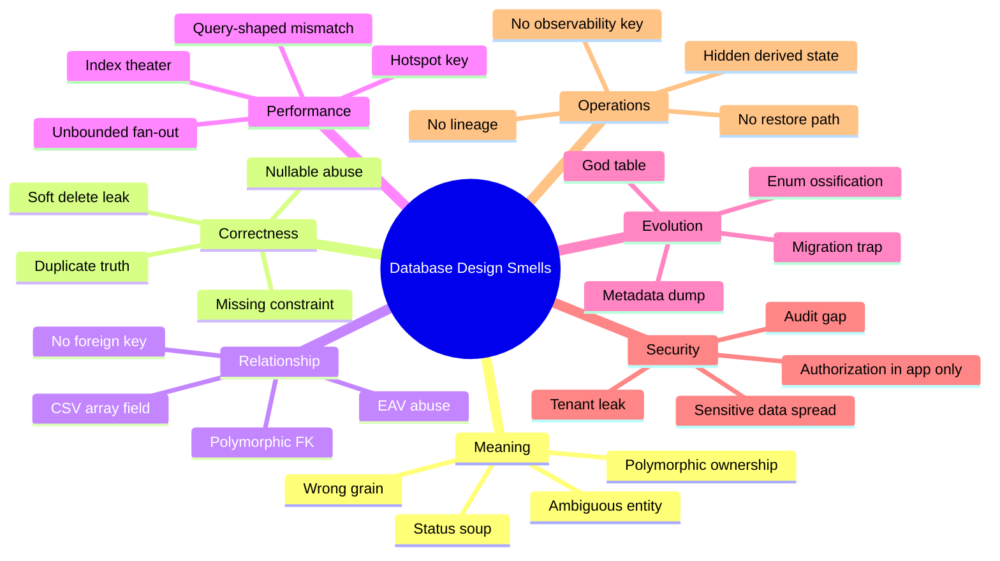
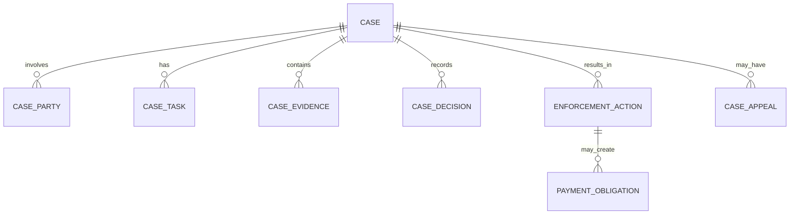
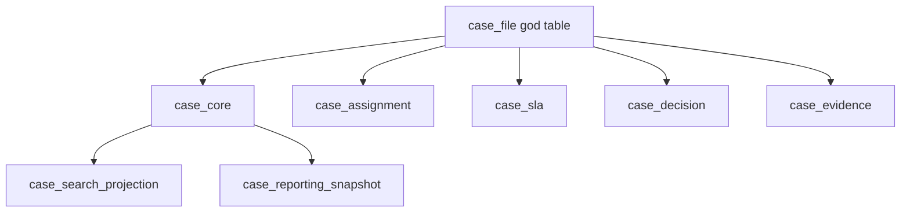
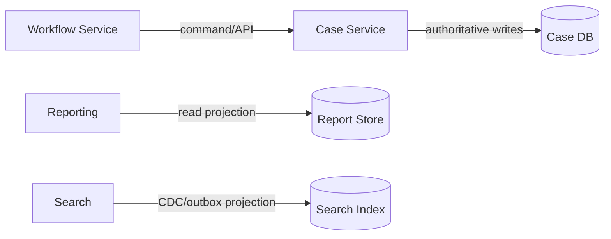
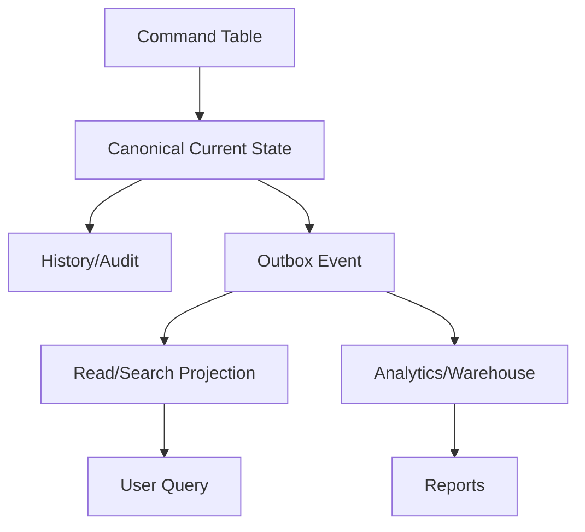
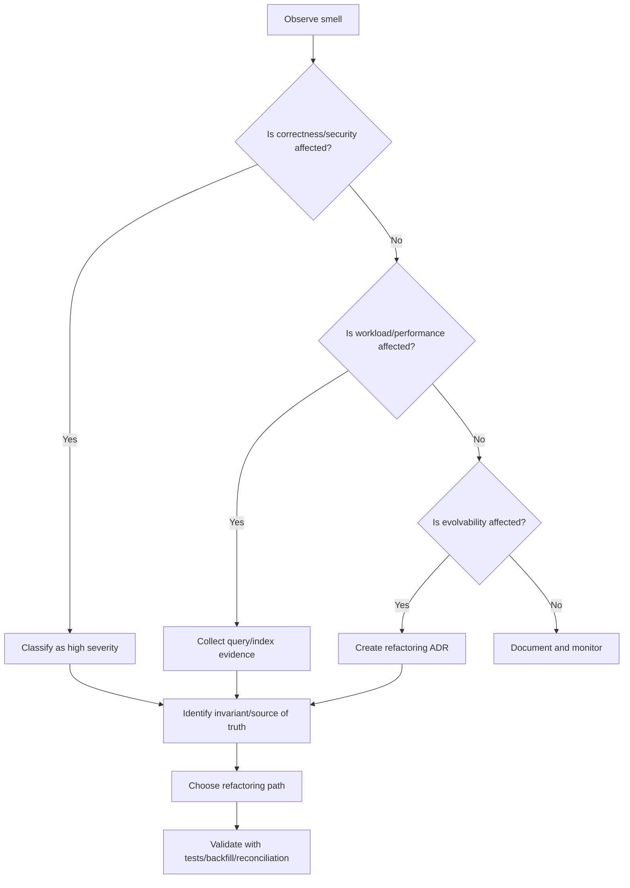

# Part 079 — Common Database Design Smells

> Target pembelajaran: mampu mengenali desain database yang terlihat "jalan" tetapi membawa risiko correctness, performance, security, operability, dan evolvability. Fokusnya bukan hafalan anti-pattern, tetapi kemampuan membaca **smell → root cause → failure mode → refactoring path**.

Database design smell adalah sinyal bahwa struktur data, constraint, ownership, atau access path tidak lagi merepresentasikan kenyataan domain dan workload.

Smell berbeda dari bug.

Bug biasanya terlihat sebagai satu perilaku salah. Smell adalah bentuk desain yang membuat bug, incident, dan perubahan berisiko menjadi lebih mungkin terjadi.

Contoh:

- `status` berisi 18 nilai tanpa transition table bukan selalu bug hari ini, tetapi itu smell.
- kolom `metadata JSONB` yang menyimpan semua business field bukan selalu bug hari ini, tetapi itu smell.
- foreign key sengaja tidak dipakai karena "lebih fleksibel" bukan selalu gagal hari ini, tetapi itu smell.
- tabel `case` dengan 130 kolom bukan selalu lambat hari ini, tetapi itu smell.

Top 1% database engineer tidak hanya bertanya:

> "Apakah query-nya jalan?"

Mereka bertanya:

> "State ilegal apa yang bisa masuk? Query apa yang akan rusak saat data tumbuh? Perubahan apa yang akan menjadi migration hell? Incident apa yang akan sulit didiagnosis?"

---

## 1. Smell Taxonomy

Database smell bisa dikelompokkan berdasarkan lapisan failure.



Prinsip diagnosis:

| Question | What it reveals |
|---|---|
| Apa grain tabel ini? | Apakah satu row merepresentasikan satu hal yang jelas? |
| Siapa owner state ini? | Apakah ada lebih dari satu writer authority? |
| Invariant apa yang dijaga DB? | Apakah correctness hanya bergantung pada aplikasi? |
| Query utama apa yang harus cepat? | Apakah schema/index cocok dengan workload? |
| Bagaimana data berubah sepanjang waktu? | Apakah lifecycle, audit, dan correction jelas? |
| Bagaimana restore/rebuild dilakukan? | Apakah derived state punya source dan repair path? |
| Siapa boleh melihat row ini? | Apakah tenant/security boundary enforceable? |

---

## 2. Smell #1 — Table Has No Clear Grain

### 2.1 Symptom

Tabel menyimpan campuran beberapa konsep:

```sql
CREATE TABLE enforcement_case (
  id BIGSERIAL PRIMARY KEY,
  complaint_number TEXT,
  respondent_name TEXT,
  inspector_name TEXT,
  current_task_name TEXT,
  last_decision_reason TEXT,
  latest_evidence_file_name TEXT,
  penalty_amount NUMERIC(18,2),
  payment_reference TEXT,
  appeal_reason TEXT,
  appeal_decision TEXT,
  closed_at TIMESTAMPTZ
);
```

Row ini sebenarnya mencoba menjadi:

- complaint,
- case,
- party,
- assignment,
- task,
- evidence,
- decision,
- penalty,
- payment,
- appeal.

### 2.2 Root Cause

Biasanya terjadi karena tim memulai dari screen/API response, bukan dari domain entity dan lifecycle.

Kalimat red flag:

> "Satu halaman butuh semua field ini, jadi masukkan saja ke satu tabel."

### 2.3 Failure Mode

- Banyak kolom nullable karena tidak semua phase memakai semua kolom.
- Validasi menjadi conditional dan tersebar di aplikasi.
- Audit sulit karena perubahan kecil di salah satu konsep terlihat seperti update case umum.
- Permission sulit karena field evidence, decision, payment, dan appeal punya akses berbeda.
- Query reporting sulit karena grain tidak jelas.
- Migration sulit karena setiap perubahan domain menyentuh tabel besar.

### 2.4 Better Model

Pisahkan berdasarkan grain dan lifecycle.



Setiap tabel punya kalimat grain:

| Table | Grain sentence |
|---|---|
| `case_file` | One row per regulatory case. |
| `case_party` | One row per party role in a case. |
| `case_task` | One row per unit of work assigned in a case. |
| `case_evidence` | One row per evidence item registered to a case. |
| `case_decision` | One row per formal decision event. |
| `payment_obligation` | One row per payable obligation created by enforcement action. |

### 2.5 Review Heuristic

A table is suspicious if you cannot finish this sentence cleanly:

> One row in this table represents exactly one ________.

If the answer contains "and", "or", "depending on status", or "sometimes", inspect the model.

---

## 3. Smell #2 — Status Soup

### 3.1 Symptom

A table has one or more status columns that encode lifecycle, workflow, business decision, operational queue, and integration state together.

```sql
CREATE TABLE case_file (
  id BIGSERIAL PRIMARY KEY,
  status TEXT NOT NULL,
  sub_status TEXT,
  previous_status TEXT,
  status_reason TEXT,
  status_updated_at TIMESTAMPTZ
);
```

Example values:

```text
DRAFT
SUBMITTED
VALIDATING
REJECTED
ASSIGNED
IN_REVIEW
WAITING_FOR_EVIDENCE
ESCALATED
APPROVED
APPROVED_PENDING_PAYMENT
PAYMENT_FAILED
APPEALED
REOPENED
CLOSED
CANCELLED_BY_SYSTEM
```

### 3.2 Root Cause

Status is being used as a low-cost substitute for a state machine.

The schema captures current label but not:

- legal transitions,
- who performed transition,
- guard condition,
- reason/evidence,
- transition time,
- compensation path,
- terminal-state behavior.

### 3.3 Failure Mode

- Illegal transitions happen silently.
- Reports misinterpret status semantics.
- Integration emits inconsistent events.
- Reopen/correction breaks old assumptions.
- Authorization rules become `if status in (...)` spaghetti.
- Different teams assign different meaning to same status.

### 3.4 Better Model

Use explicit transition history and separate dimensions of state.

```sql
CREATE TABLE case_file (
  id BIGSERIAL PRIMARY KEY,
  case_number TEXT NOT NULL UNIQUE,
  lifecycle_state TEXT NOT NULL,
  created_at TIMESTAMPTZ NOT NULL DEFAULT now(),
  updated_at TIMESTAMPTZ NOT NULL DEFAULT now(),
  CONSTRAINT case_lifecycle_state_chk CHECK (
    lifecycle_state IN ('draft', 'submitted', 'active', 'closed', 'cancelled')
  )
);

CREATE TABLE case_transition (
  id BIGSERIAL PRIMARY KEY,
  case_id BIGINT NOT NULL REFERENCES case_file(id),
  from_state TEXT,
  to_state TEXT NOT NULL,
  transition_name TEXT NOT NULL,
  reason_code TEXT,
  actor_id BIGINT NOT NULL,
  occurred_at TIMESTAMPTZ NOT NULL DEFAULT now(),
  command_id UUID NOT NULL UNIQUE
);
```

For independent state dimensions, avoid one giant status:

| Dimension | Example |
|---|---|
| Lifecycle | draft, submitted, active, closed |
| Assignment | unassigned, assigned |
| SLA | on_track, warning, breached |
| Payment | not_applicable, pending, paid, failed |
| Appeal | none, pending, decided |
| Integration | pending_publish, published, failed |

### 3.5 Rule

A status value is acceptable only if it answers one clear question.

Bad:

> `APPROVED_PENDING_PAYMENT_ESCALATED`

Better:

```text
case.lifecycle_state = approved
payment.state = pending
sla.state = escalated
```

---

## 4. Smell #3 — Nullable Abuse

### 4.1 Symptom

A table has many nullable columns, and each null means something different.

```sql
CREATE TABLE task (
  id BIGSERIAL PRIMARY KEY,
  assignee_id BIGINT NULL,
  completed_at TIMESTAMPTZ NULL,
  cancelled_at TIMESTAMPTZ NULL,
  due_at TIMESTAMPTZ NULL,
  rejection_reason TEXT NULL,
  approval_reason TEXT NULL,
  external_reference TEXT NULL
);
```

Possible meanings of null:

- unknown,
- not applicable,
- not yet set,
- intentionally empty,
- hidden because of permission,
- deleted,
- derived later,
- invalid but tolerated.

### 4.2 Root Cause

The model does not distinguish optionality, lifecycle phase, and subtype.

### 4.3 Failure Mode

- `WHERE column IS NULL` becomes semantically unsafe.
- Reports undercount or overcount.
- Application code invents meaning around null.
- Constraints cannot express phase-specific requirements.
- Migration/backfill becomes ambiguous.

### 4.4 Better Model

Use one or more of these patterns:

#### Pattern A — Explicit State

```sql
CREATE TABLE task (
  id BIGSERIAL PRIMARY KEY,
  state TEXT NOT NULL CHECK (state IN ('open', 'completed', 'cancelled')),
  assignee_id BIGINT,
  completed_at TIMESTAMPTZ,
  cancelled_at TIMESTAMPTZ,
  CONSTRAINT completed_requires_completed_at CHECK (
    state <> 'completed' OR completed_at IS NOT NULL
  ),
  CONSTRAINT cancelled_requires_cancelled_at CHECK (
    state <> 'cancelled' OR cancelled_at IS NOT NULL
  )
);
```

#### Pattern B — Subtype Table

```sql
CREATE TABLE task (
  id BIGSERIAL PRIMARY KEY,
  task_type TEXT NOT NULL,
  state TEXT NOT NULL
);

CREATE TABLE approval_task_detail (
  task_id BIGINT PRIMARY KEY REFERENCES task(id),
  approval_reason_required BOOLEAN NOT NULL DEFAULT true
);

CREATE TABLE external_sync_task_detail (
  task_id BIGINT PRIMARY KEY REFERENCES task(id),
  external_reference TEXT NOT NULL
);
```

#### Pattern C — Reason Table

```sql
CREATE TABLE task_closure_reason (
  task_id BIGINT PRIMARY KEY REFERENCES task(id),
  closure_type TEXT NOT NULL CHECK (closure_type IN ('completed', 'cancelled', 'rejected')),
  reason_code TEXT NOT NULL,
  note TEXT,
  actor_id BIGINT NOT NULL,
  occurred_at TIMESTAMPTZ NOT NULL DEFAULT now()
);
```

### 4.5 Heuristic

Every nullable column should have a documented null meaning.

If the null meaning is not stable, the column is not ready.

---

## 5. Smell #4 — Missing Constraints Because “The App Handles It”

### 5.1 Symptom

The database allows invalid state.

```sql
CREATE TABLE invoice (
  id BIGSERIAL PRIMARY KEY,
  invoice_number TEXT,
  customer_id BIGINT,
  amount NUMERIC(18,2),
  status TEXT
);
```

The application says:

- `invoice_number` must be unique,
- `customer_id` must refer to a real customer,
- `amount` must be positive,
- `status` must be one of known values.

The database enforces none of that.

### 5.2 Root Cause

Teams confuse validation with invariant enforcement.

Application validation improves user experience. Database constraint protects system truth.

### 5.3 Failure Mode

Invalid data enters through:

- backoffice script,
- migration,
- batch job,
- manual SQL,
- second service,
- retry race,
- import pipeline,
- future application version.

### 5.4 Better Model

```sql
CREATE TABLE invoice (
  id BIGSERIAL PRIMARY KEY,
  invoice_number TEXT NOT NULL UNIQUE,
  customer_id BIGINT NOT NULL REFERENCES customer(id),
  amount NUMERIC(18,2) NOT NULL CHECK (amount > 0),
  status TEXT NOT NULL CHECK (status IN ('draft', 'issued', 'void', 'paid')),
  issued_at TIMESTAMPTZ,
  paid_at TIMESTAMPTZ,
  CONSTRAINT paid_requires_paid_at CHECK (
    status <> 'paid' OR paid_at IS NOT NULL
  )
);
```

### 5.5 Nuance

Not every rule belongs in a database constraint.

Good DB constraints:

- stable,
- local or expressible relationally,
- correctness-critical,
- not based on external availability,
- not based on volatile policy.

Better in application/policy engine:

- complex external service call,
- user-specific permission decision,
- frequently changing business policy,
- expensive cross-domain computation.

But when a rule is a hard invariant, "app handles it" is not enough.

---

## 6. Smell #5 — Polymorphic Foreign Key

### 6.1 Symptom

A row can refer to different table types using `(target_type, target_id)`.

```sql
CREATE TABLE comment (
  id BIGSERIAL PRIMARY KEY,
  target_type TEXT NOT NULL,
  target_id BIGINT NOT NULL,
  body TEXT NOT NULL
);
```

`target_type` might be:

- `case`,
- `task`,
- `evidence`,
- `decision`,
- `appeal`.

### 6.2 Root Cause

The team wants flexible attachment without modelling the relationship.

### 6.3 Failure Mode

- No real foreign key.
- Orphan records accumulate.
- Cascading behavior unclear.
- Authorization becomes dynamic and easy to bypass.
- Query planner cannot use relationship semantics.
- Adding target types changes application branching.
- Deletion/retention is unsafe.

### 6.4 Better Options

#### Option A — Separate Association Tables

```sql
CREATE TABLE comment (
  id BIGSERIAL PRIMARY KEY,
  body TEXT NOT NULL,
  created_by BIGINT NOT NULL,
  created_at TIMESTAMPTZ NOT NULL DEFAULT now()
);

CREATE TABLE case_comment (
  comment_id BIGINT PRIMARY KEY REFERENCES comment(id),
  case_id BIGINT NOT NULL REFERENCES case_file(id)
);

CREATE TABLE task_comment (
  comment_id BIGINT PRIMARY KEY REFERENCES comment(id),
  task_id BIGINT NOT NULL REFERENCES case_task(id)
);
```

#### Option B — Common Parent Entity

```sql
CREATE TABLE commentable_object (
  id BIGSERIAL PRIMARY KEY,
  object_type TEXT NOT NULL CHECK (object_type IN ('case', 'task', 'evidence'))
);

CREATE TABLE case_file (
  id BIGINT PRIMARY KEY REFERENCES commentable_object(id),
  case_number TEXT NOT NULL UNIQUE
);

CREATE TABLE comment (
  id BIGSERIAL PRIMARY KEY,
  commentable_id BIGINT NOT NULL REFERENCES commentable_object(id),
  body TEXT NOT NULL
);
```

#### Option C — Domain-Specific Comment Tables

Sometimes the simplest solution is best:

```sql
CREATE TABLE case_note (...);
CREATE TABLE evidence_note (...);
```

Use this when each note type has different lifecycle, retention, and security.

---

## 7. Smell #6 — CSV, Delimited Lists, or Array Fields for Relational Data

### 7.1 Symptom

```sql
CREATE TABLE case_file (
  id BIGSERIAL PRIMARY KEY,
  assigned_user_ids TEXT,
  tags TEXT,
  related_case_numbers TEXT
);
```

Values:

```text
assigned_user_ids = '12,89,144'
tags = 'urgent,financial,repeat-offender'
related_case_numbers = 'CASE-001|CASE-392|CASE-771'
```

### 7.2 Root Cause

The team stores relationship as string because it seems faster to implement.

### 7.3 Failure Mode

- No foreign key.
- No uniqueness per relationship.
- No efficient join.
- No clean delete/update.
- No authorization per relationship.
- Parsing bugs.
- Reporting becomes string manipulation.

### 7.4 Better Model

```sql
CREATE TABLE case_assignment (
  case_id BIGINT NOT NULL REFERENCES case_file(id),
  user_id BIGINT NOT NULL REFERENCES app_user(id),
  assignment_role TEXT NOT NULL,
  assigned_at TIMESTAMPTZ NOT NULL DEFAULT now(),
  PRIMARY KEY (case_id, user_id, assignment_role)
);

CREATE TABLE case_tag (
  case_id BIGINT NOT NULL REFERENCES case_file(id),
  tag_code TEXT NOT NULL REFERENCES tag(code),
  PRIMARY KEY (case_id, tag_code)
);

CREATE TABLE related_case (
  case_id BIGINT NOT NULL REFERENCES case_file(id),
  related_case_id BIGINT NOT NULL REFERENCES case_file(id),
  relation_type TEXT NOT NULL,
  PRIMARY KEY (case_id, related_case_id, relation_type),
  CHECK (case_id <> related_case_id)
);
```

### 7.5 Nuance

Arrays can be valid for local attributes with no independent lifecycle.

Example acceptable:

- normalized text search tokens in a projection,
- immutable list of small flags in an analytics table,
- vector embedding array,
- document payload not used for relational integrity.

But arrays are suspicious when elements are entities, relationships, permissions, or mutable facts.

---

## 8. Smell #7 — EAV Abuse

### 8.1 Symptom

```sql
CREATE TABLE entity_attribute_value (
  entity_id BIGINT NOT NULL,
  attribute_name TEXT NOT NULL,
  value_text TEXT,
  value_number NUMERIC,
  value_date DATE,
  PRIMARY KEY (entity_id, attribute_name)
);
```

Everything becomes metadata.

### 8.2 Why It Looks Attractive

EAV promises:

- unlimited fields,
- no migrations,
- configurable forms,
- rapid feature delivery.

### 8.3 Real Cost

- Type safety weakens.
- Required fields become hard to enforce.
- Unique constraints become hard.
- Query performance becomes poor.
- Reporting becomes pivot-heavy.
- Application code owns schema semantics implicitly.
- Rename/versioning of attributes becomes fragile.

### 8.4 Better Pattern: Hybrid Core + Extension

```sql
CREATE TABLE inspection_report (
  id BIGSERIAL PRIMARY KEY,
  case_id BIGINT NOT NULL REFERENCES case_file(id),
  inspection_date DATE NOT NULL,
  inspector_id BIGINT NOT NULL REFERENCES app_user(id),
  result_code TEXT NOT NULL,
  created_at TIMESTAMPTZ NOT NULL DEFAULT now()
);

CREATE TABLE inspection_report_field_definition (
  id BIGSERIAL PRIMARY KEY,
  form_version_id BIGINT NOT NULL,
  field_code TEXT NOT NULL,
  data_type TEXT NOT NULL,
  is_required BOOLEAN NOT NULL DEFAULT false,
  UNIQUE (form_version_id, field_code)
);

CREATE TABLE inspection_report_field_value (
  report_id BIGINT NOT NULL REFERENCES inspection_report(id),
  field_definition_id BIGINT NOT NULL REFERENCES inspection_report_field_definition(id),
  value_text TEXT,
  value_number NUMERIC,
  value_date DATE,
  PRIMARY KEY (report_id, field_definition_id)
);
```

Use EAV only for truly dynamic fields, and keep core invariants relational.

### 8.5 Rule

If a field is used in:

- authorization,
- lifecycle state,
- financial calculation,
- legal decision,
- frequent filtering,
- reporting metric,
- foreign key relation,

it probably should not live only in generic EAV.

---

## 9. Smell #8 — JSON Dump as Escape Hatch

### 9.1 Symptom

```sql
CREATE TABLE case_file (
  id BIGSERIAL PRIMARY KEY,
  payload JSONB NOT NULL
);
```

The payload contains:

```json
{
  "caseNumber": "CASE-2026-001",
  "tenantId": "t-001",
  "status": "ACTIVE",
  "assignedUserId": 42,
  "dueDate": "2026-08-01",
  "evidence": [...],
  "decision": {...}
}
```

### 9.2 Root Cause

JSON is used to avoid schema design.

### 9.3 Failure Mode

- Constraints are weak or hidden.
- Indexes become ad hoc.
- Field rename becomes implicit migration.
- Query shape becomes hard to optimize.
- Access control field extraction becomes fragile.
- Reporting depends on JSON path conventions.
- Data quality validation moves outside DB.

### 9.4 Good JSON Use

JSON can be excellent for:

- external raw payload storage,
- audit snapshot,
- provider-specific metadata,
- rarely queried optional attributes,
- schema-versioned document details,
- read model payload where source of truth is elsewhere.

### 9.5 Better Pattern

Use relational columns for identity, ownership, lifecycle, security, and query predicates.

```sql
CREATE TABLE case_file (
  id BIGSERIAL PRIMARY KEY,
  tenant_id BIGINT NOT NULL REFERENCES tenant(id),
  case_number TEXT NOT NULL,
  lifecycle_state TEXT NOT NULL,
  assigned_team_id BIGINT,
  due_at TIMESTAMPTZ,
  details JSONB NOT NULL DEFAULT '{}'::jsonb,
  created_at TIMESTAMPTZ NOT NULL DEFAULT now(),
  UNIQUE (tenant_id, case_number)
);
```

Rule:

> JSON is fine for extensibility. It is dangerous when it hides authority, identity, lifecycle, access control, or query-critical fields.

---

## 10. Smell #9 — God Table

### 10.1 Symptom

A central table has:

- 100+ columns,
- dozens of nullable fields,
- many unrelated indexes,
- triggers from multiple teams,
- fields for old and new workflows,
- strong coupling to every report and API.

### 10.2 Root Cause

The table became the integration point for the whole organization.

### 10.3 Failure Mode

- Migration lock risk.
- Query plan instability.
- Bloat and write amplification.
- Ownership conflict.
- Performance tuning conflicts.
- Privacy/security overexposure.
- Teams cannot change independently.

### 10.4 Refactoring Direction

Split by lifecycle and access pattern.



But do not split blindly.

Use these questions:

- Does this group of columns change at a different frequency?
- Does it have different permissions?
- Does it have different retention?
- Does it have different lifecycle?
- Does it cause different indexes/query path?
- Does it belong to a different owner/team/domain?

---

## 11. Smell #10 — Duplicate Sources of Truth

### 11.1 Symptom

Two tables or systems can both answer the same authoritative question.

Example:

```sql
case_file.current_assignee_id
case_assignment.active = true
workflow_task.assignee_id
search_case_document.assigneeId
```

Question:

> Who is currently assigned to this case?

Four places answer it.

### 11.2 Root Cause

The team created projections and caches but did not document authority.

### 11.3 Failure Mode

- UI shows inconsistent state.
- Reports disagree.
- Debugging becomes archaeology.
- Reconciliation jobs become permanent duct tape.
- Data repair is risky because no one knows which copy wins.

### 11.4 Better Contract

Document each copy:

| Store | Role | Authority? | Freshness | Repair path |
|---|---|---:|---|---|
| `case_assignment` | assignment history | yes | immediate | manual transition correction |
| `case_file.current_assignee_id` | hot read cache | no | same transaction | rebuild from assignment |
| `workflow_task.assignee_id` | workflow engine work item | no/owned by workflow | eventual sync | resync from case assignment |
| search document | query projection | no | <= 60s | reindex case |

### 11.5 Rule

Every duplicate field needs:

- source,
- freshness contract,
- update mechanism,
- reconciliation query,
- rebuild path,
- consumer contract.

Without that, it is not denormalization. It is data drift waiting to happen.

---

## 12. Smell #11 — Soft Delete Leak

### 12.1 Symptom

```sql
CREATE TABLE user_account (
  id BIGSERIAL PRIMARY KEY,
  email TEXT NOT NULL UNIQUE,
  deleted_at TIMESTAMPTZ
);
```

Application queries must remember:

```sql
WHERE deleted_at IS NULL
```

### 12.2 Failure Mode

- Deleted rows appear in UI/report.
- Unique constraint prevents recreating logically deleted value.
- FK behavior unclear.
- Analytics counts deleted data incorrectly.
- Privacy erasure is falsely assumed.
- Search/cache projections retain deleted data.

### 12.3 Better Pattern

Use partial unique index for active identity.

```sql
CREATE UNIQUE INDEX user_account_email_active_uidx
ON user_account (lower(email))
WHERE deleted_at IS NULL;
```

Prefer lifecycle-aware query surfaces:

```sql
CREATE VIEW active_user_account AS
SELECT *
FROM user_account
WHERE deleted_at IS NULL;
```

But view alone is not enough. You also need:

- repository/query discipline,
- tests that deleted rows are excluded,
- CDC delete/tombstone propagation,
- retention/purge policy,
- audit distinction between deletion and erasure.

---

## 13. Smell #12 — Index Theater

### 13.1 Symptom

The database has many indexes, but performance remains poor.

Signs:

- every foreign key column indexed without workload review,
- single-column indexes for every filter,
- overlapping composite indexes,
- low-cardinality indexes on boolean/status columns,
- indexes unused by query shape,
- indexes added after every incident and never removed.

### 13.2 Root Cause

Indexes are treated as magic performance objects, not workload contracts.

### 13.3 Failure Mode

- Write amplification.
- Slower inserts/updates/deletes.
- Larger backups.
- More memory pressure.
- Plan instability.
- Migration time increases.
- Duplicate indexes hide real query design issue.

### 13.4 Diagnosis Query

PostgreSQL example:

```sql
SELECT
  schemaname,
  relname AS table_name,
  indexrelname AS index_name,
  idx_scan,
  idx_tup_read,
  idx_tup_fetch
FROM pg_stat_user_indexes
ORDER BY idx_scan ASC, indexrelname;
```

But do not drop an index only because `idx_scan = 0` in one short window.

Check:

- reporting schedule,
- rare incident/runbook queries,
- constraint support,
- FK delete/update path,
- migration/backfill jobs,
- partition-specific usage.

### 13.5 Better Rule

Every production index should have:

- owner,
- query or constraint purpose,
- expected predicate/order shape,
- write cost awareness,
- evidence from plan or workload,
- lifecycle review.

---

## 14. Smell #13 — Query Shape Fighting Schema Shape

### 14.1 Symptom

Common queries require:

- leading wildcard search,
- filtering on function-wrapped columns,
- joining through generic tables,
- sorting without supporting index,
- `OFFSET` pagination at high offset,
- cross-tenant scans,
- unbounded fan-out.

Example:

```sql
SELECT *
FROM case_file
WHERE lower(case_number) = lower(:caseNumber);
```

This fights a plain index on `case_number` unless an expression index exists.

### 14.2 Better Options

Normalize write value:

```sql
case_number_normalized TEXT NOT NULL UNIQUE
```

or create expression index:

```sql
CREATE INDEX case_file_case_number_lower_idx
ON case_file (lower(case_number));
```

For pagination:

Bad:

```sql
SELECT *
FROM case_file
ORDER BY created_at DESC
OFFSET 100000 LIMIT 50;
```

Better:

```sql
SELECT *
FROM case_file
WHERE (created_at, id) < (:lastCreatedAt, :lastId)
ORDER BY created_at DESC, id DESC
LIMIT 50;
```

Supporting index:

```sql
CREATE INDEX case_file_created_id_desc_idx
ON case_file (created_at DESC, id DESC);
```

---

## 15. Smell #14 — No Ownership Boundary

### 15.1 Symptom

Multiple services write the same tables.

```text
case-service writes case_file
workflow-service writes case_file
reporting-service writes case_file
admin-service writes case_file
integration-service writes case_file
```

### 15.2 Failure Mode

- Invariants are not localized.
- Rollback is unsafe.
- Audit cannot explain actor intent.
- Schema change requires many teams.
- Incidents have unclear owner.
- Security privileges become broad.

### 15.3 Better Model



Only one authority writes canonical tables.

Others use:

- API command,
- event subscription,
- CDC projection,
- read-only view,
- separate projection store.

---

## 16. Smell #15 — Tenant Boundary by Convention

### 16.1 Symptom

Every tenant-owned table has `tenant_id`, but enforcement relies on application code.

```sql
SELECT * FROM case_file WHERE id = :id;
```

A missing `tenant_id` predicate becomes a data leak.

### 16.2 Failure Mode

- Cross-tenant read leak.
- Cross-tenant update/delete.
- Search projection leak.
- Admin tooling leak.
- Batch job leak.
- Backup/restore by tenant impossible.

### 16.3 Better Model

Use composite keys or RLS depending on architecture.

```sql
CREATE TABLE case_file (
  tenant_id BIGINT NOT NULL REFERENCES tenant(id),
  id BIGINT NOT NULL,
  case_number TEXT NOT NULL,
  PRIMARY KEY (tenant_id, id),
  UNIQUE (tenant_id, case_number)
);

CREATE TABLE case_task (
  tenant_id BIGINT NOT NULL,
  id BIGINT NOT NULL,
  case_id BIGINT NOT NULL,
  PRIMARY KEY (tenant_id, id),
  FOREIGN KEY (tenant_id, case_id)
    REFERENCES case_file(tenant_id, id)
);
```

This prevents cross-tenant relationship mistakes structurally.

If using RLS, ensure:

- app sets tenant context safely,
- owner role does not bypass accidentally,
- tests prove cross-tenant denial,
- admin/break-glass path is audited,
- migrations and batch jobs have explicit tenant behavior.

---

## 17. Smell #16 — Audit Is a Last-Minute Add-On

### 17.1 Symptom

Audit is implemented as:

```sql
updated_by BIGINT,
updated_at TIMESTAMPTZ
```

This is not audit. It is last update metadata.

### 17.2 Missing Questions

- What changed?
- What was old value?
- What was new value?
- Who requested it?
- Which service performed it?
- Which command caused it?
- Was it user action, migration, batch job, or system correction?
- What evidence supported the decision?
- Was external notification sent?

### 17.3 Better Audit Event

```sql
CREATE TABLE audit_event (
  id BIGSERIAL PRIMARY KEY,
  aggregate_type TEXT NOT NULL,
  aggregate_id TEXT NOT NULL,
  event_type TEXT NOT NULL,
  actor_id BIGINT,
  actor_type TEXT NOT NULL,
  command_id UUID,
  correlation_id UUID,
  reason_code TEXT,
  before_state JSONB,
  after_state JSONB,
  occurred_at TIMESTAMPTZ NOT NULL DEFAULT now()
);
```

For regulatory systems, connect audit to evidence and decision records, not only row updates.

---

## 18. Smell #17 — Derived Data Without Rebuild Path

### 18.1 Symptom

```sql
case_file.open_task_count
case_file.latest_evidence_at
case_file.current_sla_state
case_file.search_text
```

No one knows how to rebuild them.

### 18.2 Failure Mode

- Drift after failed transaction.
- Drift after migration.
- Drift after manual repair.
- Drift after replay.
- Drift after bug fix.
- No confidence in reports.

### 18.3 Better Contract

For every derived field:

```yaml
derived_field: case_file.open_task_count
source: case_task where state in ('open', 'assigned')
updated_by: trigger/application transaction/projection job
freshness: same transaction
rebuild_query: documented
validation_query: documented
owner: case-platform
```

Example validation:

```sql
SELECT cf.id, cf.open_task_count, actual.open_count
FROM case_file cf
JOIN (
  SELECT case_id, count(*) AS open_count
  FROM case_task
  WHERE state IN ('open', 'assigned')
  GROUP BY case_id
) actual ON actual.case_id = cf.id
WHERE cf.open_task_count <> actual.open_count;
```

---

## 19. Smell #18 — Temporal Amnesia

### 19.1 Symptom

A row only shows current value, but business needs past truth.

```sql
CREATE TABLE user_role (
  user_id BIGINT,
  role_code TEXT,
  PRIMARY KEY (user_id, role_code)
);
```

Question later:

> Did this user have approval permission when the decision was made on March 2?

The table cannot answer.

### 19.2 Better Pattern

```sql
CREATE TABLE user_role_assignment (
  id BIGSERIAL PRIMARY KEY,
  user_id BIGINT NOT NULL,
  role_code TEXT NOT NULL,
  valid_from TIMESTAMPTZ NOT NULL,
  valid_to TIMESTAMPTZ,
  assigned_by BIGINT NOT NULL,
  revoked_by BIGINT,
  CHECK (valid_to IS NULL OR valid_to > valid_from)
);
```

Temporal questions require temporal model.

Do not assume current table can explain past decisions.

---

## 20. Smell #19 — Enum/Code Value Ossification

### 20.1 Symptom

Statuses, reason codes, violation types, product types, or jurisdiction codes are hardcoded everywhere.

```sql
status TEXT CHECK (status IN ('A', 'B', 'C'))
```

This is fine for very stable closed sets. It is bad for business-managed taxonomy.

### 20.2 Failure Mode

- Every new code requires migration.
- Meaning changes without versioning.
- Reports reinterpret historical data using current meaning.
- UI labels drift from database values.
- Integrations use incompatible code sets.

### 20.3 Better Pattern

```sql
CREATE TABLE violation_type (
  code TEXT PRIMARY KEY,
  version INT NOT NULL,
  label TEXT NOT NULL,
  parent_code TEXT REFERENCES violation_type(code),
  effective_from DATE NOT NULL,
  effective_to DATE,
  is_active BOOLEAN NOT NULL DEFAULT true
);
```

Use check constraints for truly stable technical state. Use reference tables for business taxonomy.

---

## 21. Smell #20 — One Table for Commands, State, Events, and Reports

### 21.1 Symptom

The same table is used for:

- command validation,
- current state,
- audit trail,
- integration events,
- reporting snapshots,
- search documents,
- workflow queue.

### 21.2 Failure Mode

Every consumer optimizes the same table differently.

- transactional path wants narrow rows and strict constraints,
- audit wants append-only history,
- reporting wants denormalized wide records,
- search wants text/token/vector projection,
- queue wants claim/lease behavior,
- integration wants ordered event envelope.

One table cannot satisfy all without becoming a god table.

### 21.3 Better Separation



---

## 22. Smell #21 — Overusing Triggers as Hidden Application Logic

### 22.1 Symptom

Important business logic is hidden in triggers:

- status transition,
- audit,
- notification,
- denormalized counter,
- permission grant,
- queue insertion,
- external integration marker.

### 22.2 Trigger Is Not Bad

Triggers are valid for:

- low-level audit capture,
- updated timestamp,
- invariant derived inside same DB boundary,
- outbox insertion under strict governance,
- partition routing in some setups.

### 22.3 Smell Appears When

- trigger behavior is undocumented,
- application developers do not know it exists,
- order of triggers matters,
- trigger calls remote service,
- trigger implements complex workflow,
- migration scripts unintentionally fire triggers,
- debugging requires reading hidden procedural code.

### 22.4 Rule

If a trigger encodes business meaning, document it as part of the database contract and test it like application code.

---

## 23. Smell #22 — Reporting Directly From OLTP Without Contract

### 23.1 Symptom

BI dashboards query operational tables directly.

```text
PowerBI/Tableau/custom exports -> production OLTP tables
```

### 23.2 Failure Mode

- Long queries block or overload production.
- Reports depend on internal schema.
- Schema migration breaks dashboards.
- Report semantics change without versioning.
- Security filters are incomplete.
- Point-in-time reproducibility is missing.

### 23.3 Better Pattern

Expose reporting via:

- materialized view,
- read replica with clear staleness,
- reporting schema,
- warehouse/lakehouse,
- semantic layer,
- snapshot table,
- async report job.

Production OLTP tables are implementation detail unless intentionally published as a contract.

---

## 24. Smell #23 — No Operational Keys

### 24.1 Symptom

Rows lack fields needed to debug production.

Missing:

- `created_at`,
- `updated_at`,
- `created_by`,
- `command_id`,
- `correlation_id`,
- `tenant_id`,
- `source_system`,
- `ingested_at`,
- `schema_version`.

### 24.2 Failure Mode

During incident, engineers cannot answer:

- when did this state appear?
- what request caused it?
- was it retry or duplicate?
- which tenant was affected?
- which upstream sent it?
- what schema version created it?

### 24.3 Better Model

Not every table needs all operational columns. But every important business row needs enough provenance for diagnosis.

Example:

```sql
CREATE TABLE external_event_inbox (
  id BIGSERIAL PRIMARY KEY,
  source_system TEXT NOT NULL,
  external_event_id TEXT NOT NULL,
  event_type TEXT NOT NULL,
  payload JSONB NOT NULL,
  received_at TIMESTAMPTZ NOT NULL DEFAULT now(),
  processed_at TIMESTAMPTZ,
  processing_state TEXT NOT NULL,
  correlation_id UUID,
  schema_version TEXT NOT NULL,
  UNIQUE (source_system, external_event_id)
);
```

---

## 25. Smell #24 — Magic Boolean Flags

### 25.1 Symptom

```sql
is_active BOOLEAN
is_deleted BOOLEAN
is_valid BOOLEAN
is_current BOOLEAN
is_primary BOOLEAN
is_final BOOLEAN
is_locked BOOLEAN
```

### 25.2 Failure Mode

Booleans multiply into illegal combinations.

Example:

```text
is_active = true
is_deleted = true
is_final = true
is_locked = false
```

What does this mean?

### 25.3 Better Pattern

Use explicit state or constrained mutually exclusive model.

```sql
state TEXT NOT NULL CHECK (state IN ('draft', 'active', 'suspended', 'closed', 'deleted'))
```

For `is_primary`, use partial unique index:

```sql
CREATE UNIQUE INDEX one_primary_address_per_user
ON user_address(user_id)
WHERE is_primary = true;
```

Booleans are fine when they represent independent true/false facts. They are dangerous when they encode lifecycle.

---

## 26. Smell #25 — Ambiguous Money and Quantity

### 26.1 Symptom

```sql
amount NUMERIC(18,2)
quantity NUMERIC
unit TEXT
```

Missing:

- currency,
- precision rule,
- rounding mode,
- tax inclusion,
- sign semantics,
- effective date,
- source.

### 26.2 Failure Mode

- Mixed currency aggregation.
- Wrong rounding.
- Negative amount ambiguity.
- Reconciliation mismatch.
- Ledger imbalance.
- Report dispute.

### 26.3 Better Model

```sql
CREATE TABLE monetary_amount (
  amount_minor BIGINT NOT NULL,
  currency_code CHAR(3) NOT NULL,
  CHECK (amount_minor >= 0)
);
```

In real systems, prefer embedding this model in domain tables with explicit naming:

```sql
penalty_amount_minor BIGINT NOT NULL,
penalty_currency_code CHAR(3) NOT NULL,
penalty_tax_included BOOLEAN NOT NULL
```

For ledger, sign semantics must be part of entry direction, not an ambiguous negative number.

---

## 27. Smell #26 — Hidden Cross-Row Invariant

### 27.1 Symptom

The business says:

- only one active assignment per case,
- no overlapping validity periods,
- only one primary address,
- total allocation must equal 100%,
- exactly two balanced ledger entries per transaction.

But the database does not enforce it.

### 27.2 Better Tools

Depending on invariant:

- unique constraint,
- partial unique index,
- exclusion constraint,
- parent-row lock,
- transaction-level validation,
- serializable isolation,
- materialized invariant row,
- deferred constraint,
- reconciliation job.

Example one active assignment:

```sql
CREATE UNIQUE INDEX one_active_case_assignment
ON case_assignment(case_id)
WHERE ended_at IS NULL;
```

Example no overlapping temporal range in PostgreSQL-style range model:

```sql
-- Conceptual example: use range/exclusion pattern where supported.
-- Prevent overlapping active periods for same subject.
```

The architectural smell is not “the constraint is missing” only. The smell is that the invariant has no named enforcement strategy.

---

## 28. Smell #27 — Sequence of Events Stored Only as Current State

### 28.1 Symptom

```sql
case_file.state = 'closed'
```

But system cannot answer:

- when was it submitted?
- how many times was it reopened?
- who escalated it?
- which transition failed?
- what was previous state?

### 28.2 Better Model

Keep current state and transition log.

```sql
case_file.current_state
case_transition(from_state, to_state, transition_name, actor_id, occurred_at, reason_code)
```

Current state optimizes current query. Transition log preserves explanation.

---

## 29. Smell #28 — Hard Delete Without Lifecycle Thinking

### 29.1 Symptom

Rows disappear with no clear policy.

```sql
DELETE FROM case_evidence WHERE id = :id;
```

### 29.2 Failure Mode

- Audit trail broken.
- Reports cannot reconcile old counts.
- Evidence chain invalid.
- Foreign keys cascade unexpectedly.
- Privacy erasure confused with operational deletion.
- Restore from backup reintroduces deleted data.

### 29.3 Better Decision Matrix

| Data type | Delete strategy |
|---|---|
| Mistaken draft with no external effect | hard delete may be acceptable |
| Submitted regulatory case | lifecycle cancel/close, not silent delete |
| Evidence metadata | tombstone + audit; blob retention per policy |
| PII after retention expires | erasure/anonymization process |
| Projection/search document | delete/rebuild from source |
| Import staging row | purge after successful load |

---

## 30. Smell #29 — Migration Script as One-Off Heroics

### 30.1 Symptom

Migrations are:

- manually run,
- not idempotent,
- not reviewed,
- not tested with production-like data volume,
- irreversible,
- not observable,
- not connected to application deployment order.

### 30.2 Failure Mode

- locked table,
- long transaction,
- replica lag,
- failed deploy halfway,
- incompatible app version,
- corrupted historical data,
- no rollback path.

### 30.3 Better Pattern

Every non-trivial migration needs:

- migration design note,
- precheck query,
- lock/time estimate,
- expand phase,
- backfill plan,
- dual read/write if needed,
- validation query,
- cutover plan,
- contract phase,
- rollback/roll-forward plan,
- monitoring.

This is covered deeply in Part 047, 048, and 080.

---

## 31. Smell #30 — Security and Privacy Added After Data Shape

### 31.1 Symptom

Schema is designed first, then team asks:

> "How do we restrict this later?"

### 31.2 Failure Mode

- PII spread across many tables.
- Tenant isolation is by convention.
- Audit log stores too much sensitive data.
- Search index leaks restricted fields.
- Report exports bypass row-level policy.
- Backups are accessible too broadly.
- Deletion/erasure cannot be propagated.

### 31.3 Better Design Questions

Ask at design time:

- What is the data classification?
- Who can read this row?
- Who can update this row?
- Does access depend on tenant, role, assignment, jurisdiction, case sensitivity, or legal hold?
- Which fields are sensitive?
- Which fields must never appear in search projection?
- How is access audited?
- How is data erased or retained?

---

## 32. Smell Severity Matrix

Use this matrix during review.

| Severity | Meaning | Example |
|---|---|---|
| S1 | Can cause data breach, irreversible corruption, legal failure | tenant leak, missing audit for decision, duplicate ledger truth |
| S2 | Can cause major incident or hard-to-repair data drift | missing idempotency, no FK, derived data no rebuild |
| S3 | Can cause performance degradation or expensive migration | bad index strategy, god table, nullable abuse |
| S4 | Code smell with manageable local impact | inconsistent naming, harmless unused column |

Do not treat all smells equally. Prioritize based on blast radius and reversibility.

---

## 33. Smell Diagnosis Workflow



Checklist:

1. Name the smell.
2. Identify affected invariant or workload.
3. Find source of truth.
4. Estimate blast radius.
5. Determine if fix requires online migration.
6. Add guardrails before refactor.
7. Validate with data profiling.
8. Refactor incrementally.
9. Add regression tests.
10. Document decision.

---

## 34. Practical Smell Review Checklist

Use this during schema review.

### Meaning

- [ ] Can every table state its grain in one sentence?
- [ ] Are entity boundaries clear?
- [ ] Are lifecycle and workflow state separated?
- [ ] Are business taxonomy/code values versioned where needed?

### Correctness

- [ ] Are hard invariants enforced by DB constraint when feasible?
- [ ] Are uniqueness rules explicit?
- [ ] Are foreign keys present for canonical relationships?
- [ ] Are nullable columns semantically documented?
- [ ] Are cross-row invariants named with enforcement strategy?

### Relationships

- [ ] No CSV/delimited relationship fields?
- [ ] No unjustified polymorphic FK?
- [ ] Many-to-many relationships have relationship entity when needed?
- [ ] Relationship lifecycle has start/end/audit if needed?

### Performance

- [ ] Indexes map to actual query shapes?
- [ ] No redundant index set without reason?
- [ ] Pagination is keyset where large result expected?
- [ ] Query predicates are sargable?
- [ ] Hotspot/skew risks identified?

### Evolution

- [ ] Migration path is expand/backfill/contract where breaking?
- [ ] Derived fields have rebuild path?
- [ ] Reference data has version/effective date where needed?
- [ ] JSON/EAV use is constrained and documented?

### Security and Privacy

- [ ] Tenant boundary is structurally enforceable?
- [ ] Sensitive fields are classified?
- [ ] Search/report/export projections respect access rules?
- [ ] Audit captures actor/intent/change where needed?

### Operations

- [ ] Backup/restore implications are known?
- [ ] Observability keys exist?
- [ ] Incident diagnosis queries are possible?
- [ ] Data repair strategy is documented?

---

## 35. Mental Model: Smell Is Debt With Interest

Not every smell must be fixed immediately.

The mistake is not having a smell. The mistake is letting a smell become invisible.

For every known smell, decide:

| Decision | Meaning |
|---|---|
| Fix now | High-risk, cheap enough, or blocking correctness |
| Contain | Add guardrails while deferring major refactor |
| Monitor | Accept with metrics/data-quality check |
| Document | Explain why it is acceptable for now |
| Revisit | Attach trigger condition for future fix |

A senior architect can tolerate debt. They cannot tolerate undocumented, unpriced, invisible debt.

---

## 36. References

- PostgreSQL Documentation — Constraints: https://www.postgresql.org/docs/current/ddl-constraints.html
- PostgreSQL Documentation — `ALTER TABLE`: https://www.postgresql.org/docs/current/sql-altertable.html
- PostgreSQL Documentation — Row Security Policies: https://www.postgresql.org/docs/current/ddl-rowsecurity.html
- PostgreSQL Documentation — Monitoring Database Activity and Statistics: https://www.postgresql.org/docs/current/monitoring-stats.html
- AWS Prescriptive Guidance — Strangler Fig Pattern: https://docs.aws.amazon.com/prescriptive-guidance/latest/cloud-design-patterns/strangler-fig.html

---

## 37. Closing

Common database design smells are not style preferences. They are early warnings about future production failures.

The most important pattern:

```text
Smell -> Hidden assumption -> Failure mode -> Guardrail -> Refactoring path
```

If you can name the smell, explain the risk, and design a safe refactoring path, you are no longer just writing schema. You are operating as a database architect.

Next: **Part 080 — Refactoring Bad Database Design**.
