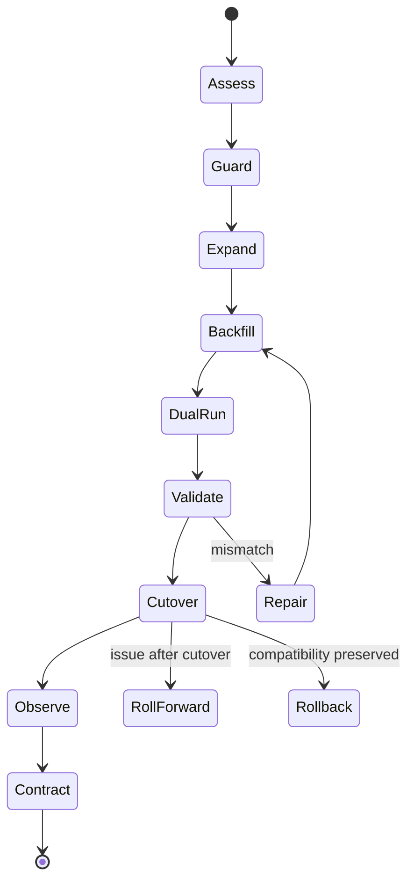
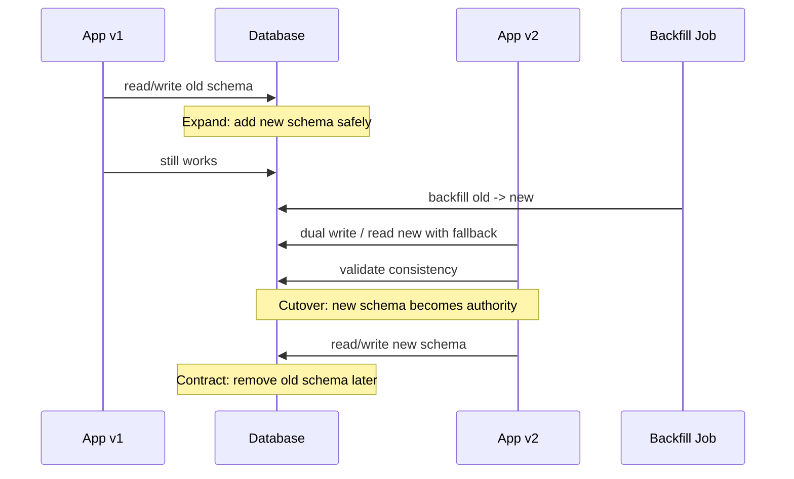
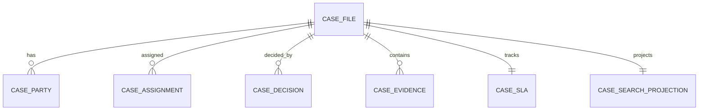
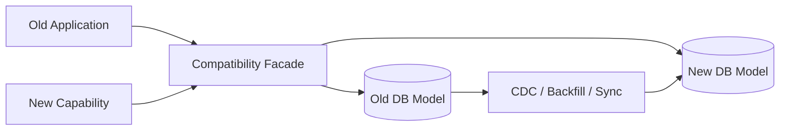
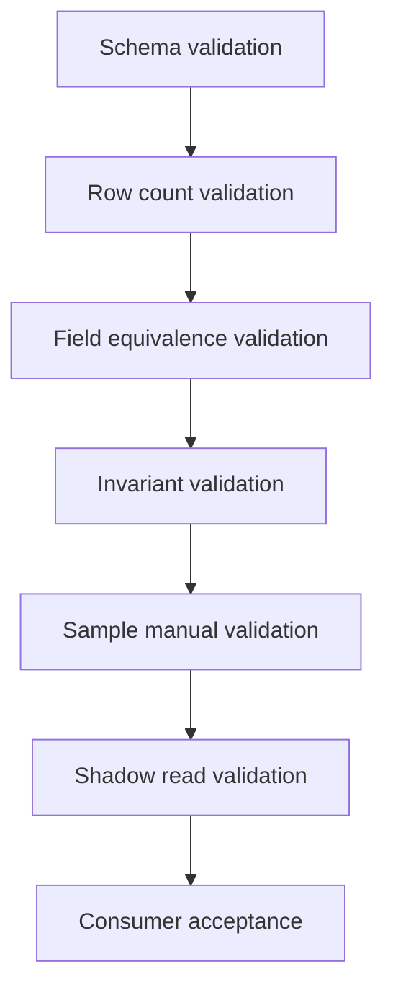

# Part 080 — Refactoring Bad Database Design

> Target pembelajaran: mampu memperbaiki database design yang buruk tanpa menghentikan sistem produksi, tanpa merusak data historis, dan tanpa membuat migrasi menjadi operasi heroik. Fokusnya adalah **safe refactoring under load**: compatibility, backfill, validation, cutover, rollback/roll-forward, reconciliation, dan governance.

Database refactoring berbeda dari code refactoring.

Pada code refactoring, kita bisa deploy versi baru dan mengganti implementation selama contract tetap sama. Pada database refactoring, data lama tetap hidup. Aplikasi lama mungkin masih berjalan. Background job mungkin masih membaca schema lama. Reporting, CDC, BI, support tools, search index, dan integrasi eksternal mungkin bergantung pada shape lama.

Karena itu refactoring database bukan satu aksi:

```text
ALTER TABLE ... done
```

Refactoring database production-grade adalah state machine.



The core rule:

> You do not refactor a production database by changing shape. You refactor by preserving compatibility while moving authority.

---

## 1. Refactoring vs Migration vs Repair

These terms are often mixed.

| Term | Meaning | Example |
|---|---|---|
| Schema migration | Change database structure | Add column, create table, add index |
| Data migration | Move or transform data | Backfill `case_party` from `case_file.respondent_name` |
| Database refactoring | Improve design while preserving behavior | Split god table into normalized tables |
| Data repair | Correct invalid historical data | Fix duplicate active assignments |
| Platform migration | Move engine/topology | PostgreSQL to distributed SQL, self-managed to managed DB |
| Contract migration | Change consumer-facing data shape | Replace table access with versioned view/API |

A serious refactor usually contains all of them.

---

## 2. First Principle: Freeze the Invariant Before Moving the Shape

Do not start by writing DDL.

Start by answering:

1. What is the current truth?
2. What is the target truth?
3. Which invariant is currently broken or unenforced?
4. Which consumers depend on old shape?
5. Which writes can happen during migration?
6. How do we detect divergence?
7. How do we recover from partial execution?

Example bad model:

```sql
CREATE TABLE case_file (
  id BIGSERIAL PRIMARY KEY,
  respondent_name TEXT,
  respondent_identifier TEXT,
  complainant_name TEXT,
  complainant_identifier TEXT
);
```

Target model:

```sql
CREATE TABLE party (
  id BIGSERIAL PRIMARY KEY,
  identifier TEXT,
  display_name TEXT NOT NULL
);

CREATE TABLE case_party (
  case_id BIGINT NOT NULL REFERENCES case_file(id),
  party_id BIGINT NOT NULL REFERENCES party(id),
  role_code TEXT NOT NULL CHECK (role_code IN ('respondent', 'complainant')),
  PRIMARY KEY (case_id, party_id, role_code)
);
```

Invariant to define:

- A case may have one or more respondents.
- A case may have one or more complainants.
- A party identity may be reused across cases if identifier matches trusted identity source.
- Historical display name at time of case may need snapshot if legal record requires it.

If you do not define this, the refactor may preserve bad semantics under a new schema.

---

## 3. Refactoring Safety Levels

Not all refactors have the same risk.

| Level | Type | Example | Risk |
|---|---|---|---|
| L1 | Additive only | Add nullable column, add table | Low if lock-safe |
| L2 | Additive with backfill | Add derived column and populate | Medium |
| L3 | Compatibility-preserving shape change | Add new table + dual write | Medium/high |
| L4 | Authority move | Move canonical truth from old table to new model | High |
| L5 | Semantic correction | Change meaning, repair historical data | Very high |
| L6 | Engine/topology migration | Move DB engine/shard/region | Critical |

The deeper the semantic change, the more you need validation and rollback/roll-forward discipline.

---

## 4. The Expand–Migrate–Contract Pattern

The most important production database refactoring pattern is expand–migrate–contract.



### 4.1 Expand

Add new structure without breaking old code.

Examples:

```sql
ALTER TABLE case_file ADD COLUMN case_type_code TEXT;

CREATE TABLE case_party (...);

CREATE INDEX CONCURRENTLY case_party_case_id_idx
ON case_party(case_id);
```

Rules:

- Do not drop old columns.
- Do not rename in-place for rolling deployments.
- Do not add strict `NOT NULL` before data exists.
- Avoid long exclusive locks.
- Use concurrent index creation where appropriate.
- Use `NOT VALID` constraints where supported to decouple creation from historical validation.

### 4.2 Migrate / Backfill

Move old data to new shape.

```sql
INSERT INTO case_party(case_id, party_id, role_code)
SELECT cf.id, p.id, 'respondent'
FROM case_file cf
JOIN party p ON p.identifier = cf.respondent_identifier
WHERE cf.respondent_identifier IS NOT NULL
ON CONFLICT DO NOTHING;
```

Rules:

- Run in chunks.
- Be resumable.
- Be idempotent.
- Record progress.
- Validate row counts and semantic equivalence.
- Avoid long transactions.
- Monitor replica lag, locks, WAL, and write load.

### 4.3 Dual Run

For a period, both old and new paths may exist.

Patterns:

- dual write old+new,
- write old, derive new asynchronously,
- write new, maintain old compatibility field,
- read new with fallback to old,
- shadow read old and new, compare results.

### 4.4 Cutover

Move authority.

Examples:

- application starts reading new table,
- API response uses new model,
- reporting uses new view,
- event payload uses new field version,
- old column becomes compatibility-only.

### 4.5 Contract

Remove old structure only when:

- no application version reads it,
- no job writes it,
- no report depends on it,
- no CDC consumer expects it,
- audit/reconstruction is safe,
- rollback window has expired,
- backup restore behavior is understood.

---

## 5. Refactoring Plan Template

Every non-trivial database refactor should have a design note.

```md
# Database Refactoring Plan

## 1. Problem
What smell or failure mode are we fixing?

## 2. Current Model
Tables, columns, indexes, constraints, consumers.

## 3. Target Model
New schema, ownership, invariants, access path.

## 4. Compatibility Requirement
Which app versions/jobs/reports/integrations must keep working?

## 5. Migration State Machine
Expand, backfill, dual-run, validate, cutover, contract.

## 6. Backfill Strategy
Batch size, ordering, resume key, throttling, idempotency.

## 7. Validation Strategy
Row count, checksum, semantic query, shadow read, reconciliation.

## 8. Rollback / Roll-forward
What can be reverted? What must be fixed forward?

## 9. Observability
Metrics, logs, dashboard, alert thresholds.

## 10. Risk Register
Lock risk, data drift, performance, security, consumer breakage.
```

---

## 6. Pattern: Split a God Table

### 6.1 Current Smell

```sql
CREATE TABLE case_file (
  id BIGSERIAL PRIMARY KEY,
  case_number TEXT NOT NULL,
  respondent_name TEXT,
  respondent_identifier TEXT,
  assigned_user_id BIGINT,
  assigned_at TIMESTAMPTZ,
  sla_due_at TIMESTAMPTZ,
  decision_code TEXT,
  decision_reason TEXT,
  decision_at TIMESTAMPTZ,
  evidence_count INT,
  search_text TEXT
);
```

Problem:

- different lifecycle in one row,
- weak audit,
- hard permission separation,
- derived values mixed with canonical values,
- future multi-party support impossible.

### 6.2 Target



### 6.3 Migration Steps

#### Step 1 — Expand

```sql
CREATE TABLE case_party (
  id BIGSERIAL PRIMARY KEY,
  case_id BIGINT NOT NULL REFERENCES case_file(id),
  role_code TEXT NOT NULL,
  party_identifier TEXT,
  display_name TEXT NOT NULL,
  created_at TIMESTAMPTZ NOT NULL DEFAULT now()
);

CREATE TABLE case_assignment (
  id BIGSERIAL PRIMARY KEY,
  case_id BIGINT NOT NULL REFERENCES case_file(id),
  assignee_user_id BIGINT NOT NULL,
  assigned_at TIMESTAMPTZ NOT NULL,
  ended_at TIMESTAMPTZ
);

CREATE UNIQUE INDEX case_assignment_one_active_idx
ON case_assignment(case_id)
WHERE ended_at IS NULL;
```

#### Step 2 — Backfill

```sql
INSERT INTO case_party(case_id, role_code, party_identifier, display_name)
SELECT id, 'respondent', respondent_identifier, respondent_name
FROM case_file
WHERE respondent_name IS NOT NULL
ON CONFLICT DO NOTHING;
```

If no unique key exists yet, add one carefully:

```sql
CREATE UNIQUE INDEX case_party_dedupe_idx
ON case_party(case_id, role_code, coalesce(party_identifier, ''), display_name);
```

#### Step 3 — Dual Write

New application writes:

- `case_file` core fields,
- `case_party` for parties,
- compatibility fields in `case_file` while old readers exist.

#### Step 4 — Validate

```sql
SELECT count(*)
FROM case_file cf
WHERE cf.respondent_name IS NOT NULL
AND NOT EXISTS (
  SELECT 1
  FROM case_party cp
  WHERE cp.case_id = cf.id
    AND cp.role_code = 'respondent'
);
```

#### Step 5 — Cutover Reads

Update reads to use `case_party`.

Optionally expose compatibility view:

```sql
CREATE VIEW case_file_legacy_view AS
SELECT
  cf.id,
  cf.case_number,
  cp.display_name AS respondent_name,
  cp.party_identifier AS respondent_identifier
FROM case_file cf
LEFT JOIN case_party cp
  ON cp.case_id = cf.id
 AND cp.role_code = 'respondent';
```

#### Step 6 — Contract

Remove old fields later:

```sql
ALTER TABLE case_file DROP COLUMN respondent_name;
ALTER TABLE case_file DROP COLUMN respondent_identifier;
```

Only after confirming no consumers remain.

---

## 7. Pattern: Replace Polymorphic Foreign Key

### 7.1 Current Smell

```sql
CREATE TABLE attachment (
  id BIGSERIAL PRIMARY KEY,
  target_type TEXT NOT NULL,
  target_id BIGINT NOT NULL,
  file_id BIGINT NOT NULL
);
```

### 7.2 Target Option A — Association Tables

```sql
CREATE TABLE attachment (
  id BIGSERIAL PRIMARY KEY,
  file_id BIGINT NOT NULL,
  created_at TIMESTAMPTZ NOT NULL DEFAULT now()
);

CREATE TABLE case_attachment (
  attachment_id BIGINT PRIMARY KEY REFERENCES attachment(id),
  case_id BIGINT NOT NULL REFERENCES case_file(id)
);

CREATE TABLE evidence_attachment (
  attachment_id BIGINT PRIMARY KEY REFERENCES attachment(id),
  evidence_id BIGINT NOT NULL REFERENCES case_evidence(id)
);
```

### 7.3 Migration Strategy

1. Create new association tables.
2. Backfill by `target_type`.
3. Add new write path to populate both old and new.
4. Validate each target type.
5. Switch reads to typed associations.
6. Add constraints/NOT NULL where possible.
7. Remove old `target_type/target_id` after consumers are gone.

Validation:

```sql
SELECT target_type, count(*)
FROM attachment_old ao
WHERE NOT EXISTS (
  SELECT 1
  FROM case_attachment ca
  WHERE ao.target_type = 'case'
    AND ca.attachment_id = ao.id
)
GROUP BY target_type;
```

### 7.4 Hidden Decision

Before refactoring, decide whether attachment is truly generic.

If case attachment and evidence attachment have different retention/security/lifecycle, use separate domain tables instead of generic association.

---

## 8. Pattern: Replace CSV Field With Relationship Table

### 8.1 Current Smell

```sql
case_file.assigned_user_ids = '12,31,44'
```

### 8.2 Target

```sql
CREATE TABLE case_assignment (
  case_id BIGINT NOT NULL REFERENCES case_file(id),
  user_id BIGINT NOT NULL REFERENCES app_user(id),
  role_code TEXT NOT NULL,
  assigned_at TIMESTAMPTZ NOT NULL DEFAULT now(),
  PRIMARY KEY (case_id, user_id, role_code)
);
```

### 8.3 Backfill

PostgreSQL-style example:

```sql
INSERT INTO case_assignment(case_id, user_id, role_code)
SELECT
  cf.id,
  trim(user_id_text)::BIGINT,
  'assignee'
FROM case_file cf
CROSS JOIN LATERAL regexp_split_to_table(cf.assigned_user_ids, ',') AS user_id_text
WHERE cf.assigned_user_ids IS NOT NULL
ON CONFLICT DO NOTHING;
```

### 8.4 Data Quality Trap

Before casting, profile invalid values.

```sql
SELECT id, assigned_user_ids
FROM case_file
WHERE assigned_user_ids IS NOT NULL
  AND assigned_user_ids !~ '^[0-9]+(,[0-9]+)*$';
```

Data repair comes before enforced relationship.

---

## 9. Pattern: Replace EAV With Typed Core + Dynamic Extension

### 9.1 Current Smell

```sql
CREATE TABLE eav (
  entity_id BIGINT,
  attr TEXT,
  value TEXT
);
```

### 9.2 Refactoring Strategy

Do not migrate all attributes blindly.

Classify attributes:

| Attribute type | Target |
|---|---|
| Identity/key | typed relational column/table |
| Lifecycle/status | typed relational column/table with constraints |
| Authorization field | typed relational column/table |
| Frequently filtered/sorted | typed indexed column |
| Report metric | typed fact/dimension column |
| Rare optional display field | dynamic extension allowed |
| Raw provider payload | JSON/raw table allowed |

### 9.3 Migration Steps

1. Inventory EAV attributes and usage frequency.
2. Identify invariants hidden in EAV.
3. Add typed columns/tables for core attributes.
4. Backfill typed values with cast validation.
5. Dual write typed + EAV for compatibility.
6. Switch reads/reports to typed model.
7. Freeze/deprecate EAV attributes.
8. Keep extension model only for true dynamic fields.

### 9.4 Cast Validation Example

```sql
SELECT entity_id, value
FROM eav
WHERE attr = 'inspection_date'
  AND value !~ '^\d{4}-\d{2}-\d{2}$';
```

Only after invalid values are repaired should you backfill into `DATE`.

---

## 10. Pattern: Move From App-Only Validation to Database Constraints

### 10.1 Current Smell

Application assumes one active assignment per case, but DB does not enforce it.

### 10.2 Refactoring Steps

#### Step 1 — Detect Violations

```sql
SELECT case_id, count(*)
FROM case_assignment
WHERE ended_at IS NULL
GROUP BY case_id
HAVING count(*) > 1;
```

#### Step 2 — Repair Data

Repair requires business decision:

- choose latest assignment,
- close older assignments,
- escalate to manual review,
- preserve all as historical but mark one active.

Do not let engineers invent legal/business repair rules silently.

#### Step 3 — Add Constraint Safely

```sql
CREATE UNIQUE INDEX CONCURRENTLY case_assignment_one_active_idx
ON case_assignment(case_id)
WHERE ended_at IS NULL;
```

#### Step 4 — Add Application Error Mapping

Map unique violation to domain error:

```text
ACTIVE_ASSIGNMENT_ALREADY_EXISTS
```

#### Step 5 — Add Regression Test

Concurrency test:

- two concurrent requests assign different users,
- exactly one succeeds,
- loser receives retry/domain error,
- no duplicate active assignment remains.

---

## 11. Pattern: Add NOT NULL Without Downtime

### 11.1 Dangerous One-Step Change

```sql
ALTER TABLE case_file
ALTER COLUMN case_number SET NOT NULL;
```

If table is large or data has nulls, this can be risky.

### 11.2 Safer Multi-Step Strategy

1. Add application write validation.
2. Backfill existing nulls.
3. Add check constraint not valid where supported.
4. Validate constraint.
5. Set `NOT NULL` if still desired.

Example:

```sql
ALTER TABLE case_file
ADD CONSTRAINT case_number_not_null_chk
CHECK (case_number IS NOT NULL) NOT VALID;

ALTER TABLE case_file
VALIDATE CONSTRAINT case_number_not_null_chk;
```

Then:

```sql
ALTER TABLE case_file
ALTER COLUMN case_number SET NOT NULL;
```

The exact lock behavior depends on engine/version and table state, so test in staging with production-like data.

---

## 12. Pattern: Rename Column Without Breaking Rolling Deployments

### 12.1 Dangerous Change

```sql
ALTER TABLE customer RENAME COLUMN name TO display_name;
```

Old app version breaks immediately.

### 12.2 Safer Expand–Contract

```sql
ALTER TABLE customer ADD COLUMN display_name TEXT;
```

Backfill:

```sql
UPDATE customer
SET display_name = name
WHERE display_name IS NULL;
```

Deploy app version that writes both:

```text
name = displayName
display_name = displayName
```

Then app reads `display_name` with fallback:

```sql
SELECT coalesce(display_name, name) AS display_name
FROM customer;
```

After all readers/writers migrated and validation is clean, stop writing `name`, then drop it later.

---

## 13. Pattern: Change Column Type Safely

### 13.1 Example

`amount` stored as `TEXT`, target is `BIGINT amount_minor`.

### 13.2 Steps

1. Add new column.
2. Profile invalid values.
3. Backfill valid rows.
4. Quarantine invalid rows.
5. Dual write new value.
6. Switch reads.
7. Add constraints.
8. Drop old column later.

```sql
ALTER TABLE payment ADD COLUMN amount_minor BIGINT;

UPDATE payment
SET amount_minor = (amount_text::NUMERIC(18,2) * 100)::BIGINT
WHERE amount_text ~ '^\d+(\.\d{1,2})?$'
  AND amount_minor IS NULL;
```

Validation:

```sql
SELECT count(*)
FROM payment
WHERE amount_text IS NOT NULL
  AND amount_minor IS NULL;
```

Do not cast blindly in one migration if invalid data can exist.

---

## 14. Pattern: Introduce Audit After the Fact

### 14.1 Problem

A production system lacks history. You cannot reconstruct past events perfectly.

### 14.2 Honest Strategy

Separate:

- **true historical events** available from logs/backups/CDC,
- **inferred history** reconstructed from current state,
- **future audit** captured from now onward.

### 14.3 Migration Design

1. Add audit table.
2. Add application-level audit event on future commands.
3. Optional: create baseline snapshot event for existing rows.
4. Mark baseline as inferred/imported.
5. Do not pretend inferred data is original event history.

```sql
CREATE TABLE audit_event (
  id BIGSERIAL PRIMARY KEY,
  aggregate_type TEXT NOT NULL,
  aggregate_id TEXT NOT NULL,
  event_type TEXT NOT NULL,
  event_source TEXT NOT NULL CHECK (event_source IN ('command', 'baseline_import', 'repair')),
  payload JSONB NOT NULL,
  occurred_at TIMESTAMPTZ NOT NULL,
  recorded_at TIMESTAMPTZ NOT NULL DEFAULT now()
);
```

Baseline:

```sql
INSERT INTO audit_event(
  aggregate_type,
  aggregate_id,
  event_type,
  event_source,
  payload,
  occurred_at
)
SELECT
  'case',
  id::TEXT,
  'case.baseline_imported',
  'baseline_import',
  to_jsonb(case_file),
  now()
FROM case_file;
```

---

## 15. Pattern: Extract Read Model From OLTP

### 15.1 Current Smell

UI search/report queries overload OLTP tables.

### 15.2 Target

```sql
CREATE TABLE case_search_projection (
  case_id BIGINT PRIMARY KEY,
  tenant_id BIGINT NOT NULL,
  case_number TEXT NOT NULL,
  title TEXT,
  lifecycle_state TEXT NOT NULL,
  assigned_user_name TEXT,
  respondent_names TEXT,
  search_text TEXT,
  updated_at TIMESTAMPTZ NOT NULL,
  source_version BIGINT NOT NULL
);
```

### 15.3 Migration

1. Create projection table.
2. Backfill from canonical tables.
3. Add outbox/projection updater for new changes.
4. Run shadow search comparing old/new result set.
5. Cut UI search to projection.
6. Remove expensive OLTP search query.

### 15.4 Validation

```sql
SELECT count(*) FROM case_file;
SELECT count(*) FROM case_search_projection;

SELECT cf.id
FROM case_file cf
LEFT JOIN case_search_projection sp ON sp.case_id = cf.id
WHERE sp.case_id IS NULL;
```

Semantic validation must check not only count but important fields.

---

## 16. Pattern: Strangler Fig for Database Refactoring

The strangler pattern is useful when the old model is too risky to rewrite in one pass.



Use it when:

- old schema has many consumers,
- domain boundary is being split,
- migration takes months,
- you need incremental capability replacement,
- rollback must remain possible during transition.

Approaches:

| Approach | When useful |
|---|---|
| Compatibility view | Old readers need old shape |
| Facade API | Hide old/new database from consumers |
| CDC projection | New model derived from old writes |
| Dual write | New app writes both during transition |
| Event bridge | Old system emits events into new capability |
| Data access layer strangler | Move query by query from old schema to new schema |

Warning: strangler migration still needs source-of-truth clarity. Otherwise, it creates two bad systems instead of one.

---

## 17. Compatibility Layer Options

### 17.1 Database View

Good for read compatibility.

```sql
CREATE VIEW legacy_case_view AS
SELECT
  cf.id,
  cf.case_number,
  cp.display_name AS respondent_name
FROM case_file cf
LEFT JOIN case_party cp
  ON cp.case_id = cf.id
 AND cp.role_code = 'respondent';
```

Pros:

- quick compatibility,
- keeps old consumers alive,
- centralizes mapping.

Cons:

- write compatibility is harder,
- performance may be poor,
- can hide complexity,
- permissions must be reviewed.

### 17.2 Application Facade

Good when mapping requires business logic.

```text
Old consumer -> Legacy API -> New model
```

Pros:

- can enforce domain rules,
- supports versioned contract,
- can log/measure consumer usage.

Cons:

- additional service code,
- latency,
- potential dual-write complexity.

### 17.3 Shadow Table

Good when old query shape must remain performant.

```sql
legacy_case_shadow(id, respondent_name, ...)
```

Keep it updated from new model until old consumers are retired.

Pros:

- predictable performance,
- low consumer change.

Cons:

- derived state drift risk,
- needs rebuild path,
- extends migration lifetime.

---

## 18. Backfill Engineering

Backfill is where many database refactors fail.

### 18.1 Bad Backfill

```sql
UPDATE huge_table
SET new_column = expensive_function(old_column);
```

Problems:

- huge transaction,
- long locks,
- WAL spike,
- replica lag,
- timeout,
- no resume,
- no progress tracking.

### 18.2 Better Backfill Table

```sql
CREATE TABLE migration_progress (
  migration_name TEXT PRIMARY KEY,
  last_processed_id BIGINT NOT NULL DEFAULT 0,
  updated_at TIMESTAMPTZ NOT NULL DEFAULT now()
);
```

Batch pseudocode:

```text
loop:
  read last_processed_id
  select next N rows ordered by id
  transform and write idempotently
  validate batch
  update last_processed_id
  sleep/throttle if load high
```

### 18.3 SQL Batch Example

```sql
WITH batch AS (
  SELECT id
  FROM case_file
  WHERE id > :last_id
  ORDER BY id
  LIMIT :batch_size
)
INSERT INTO case_party(case_id, role_code, display_name)
SELECT cf.id, 'respondent', cf.respondent_name
FROM case_file cf
JOIN batch b ON b.id = cf.id
WHERE cf.respondent_name IS NOT NULL
ON CONFLICT DO NOTHING;
```

Update progress only after successful batch.

### 18.4 Backfill Guardrails

- small batch size,
- lock timeout,
- statement timeout,
- retry with backoff,
- progress checkpoint,
- dry run count,
- pause switch,
- metrics,
- replica lag guard,
- WAL/disk guard,
- correctness validation.

---

## 19. Validation Strategy

Validation must be layered.



### 19.1 Row Count

```sql
SELECT count(*) FROM old_source WHERE respondent_name IS NOT NULL;
SELECT count(*) FROM case_party WHERE role_code = 'respondent';
```

### 19.2 Field Equivalence

```sql
SELECT cf.id, cf.respondent_name, cp.display_name
FROM case_file cf
JOIN case_party cp ON cp.case_id = cf.id AND cp.role_code = 'respondent'
WHERE cf.respondent_name IS DISTINCT FROM cp.display_name;
```

### 19.3 Invariant Validation

```sql
SELECT case_id, count(*)
FROM case_assignment
WHERE ended_at IS NULL
GROUP BY case_id
HAVING count(*) > 1;
```

### 19.4 Shadow Read

Run old and new query paths and compare:

```text
old_result = oldRepository.search(criteria)
new_result = newRepository.search(criteria)
compare ids, ordering, totals, permissions, key fields
```

### 19.5 Reconciliation Report

A migration is not done until reconciliation is clean or accepted exceptions are documented.

---

## 20. Rollback vs Roll-Forward

Rollback is not always possible.

| Change | Rollback possible? | Notes |
|---|---:|---|
| Add nullable column | Usually yes | Safe to ignore/drop later |
| Add table | Usually yes | Unless new writes are authoritative |
| Backfill derived copy | Yes | Can truncate/rebuild |
| Move authority to new model | Hard | Need dual write or reverse sync |
| Drop column | No easy rollback | Requires backup/restore or rebuild |
| Repair historical data | Often no | Need audit/repair log |
| Engine migration | Complex | Need bidirectional sync or freeze window |

### 20.1 Rollback-Friendly Design

Keep compatibility until confidence is high.

- Do not drop old column immediately.
- Keep dual write during observation window.
- Keep old read path behind feature flag.
- Keep reconciliation job running.
- Keep backup/restore point.
- Keep migration progress and repair logs.

### 20.2 Roll-Forward Plan

For many data migrations, roll-forward is safer.

Example:

- bug created missing `case_party` rows,
- instead of rolling back app and reverting schema,
- fix writer,
- rerun idempotent backfill,
- validate.

Roll-forward requires idempotent jobs and clear source of truth.

---

## 21. Data Repair Discipline

Data repair is not an ad hoc SQL update.

### 21.1 Repair Plan

```md
# Data Repair Plan

## Problem
Which invariant is violated?

## Scope
How many rows/tenants/cases affected?

## Cause
Bug, migration, manual operation, external import?

## Business Rule
How should correct value be chosen?

## SQL Plan
Detection query, repair query, verification query.

## Audit
How repair is recorded.

## Approval
Business/engineering/security owner signoff.
```

### 21.2 Repair Table

```sql
CREATE TABLE data_repair_log (
  id BIGSERIAL PRIMARY KEY,
  repair_name TEXT NOT NULL,
  target_table TEXT NOT NULL,
  target_id TEXT NOT NULL,
  before_state JSONB,
  after_state JSONB,
  reason TEXT NOT NULL,
  approved_by TEXT NOT NULL,
  executed_by TEXT NOT NULL,
  executed_at TIMESTAMPTZ NOT NULL DEFAULT now()
);
```

### 21.3 Repair Rule

If the data has regulatory, financial, security, or audit impact, record the repair as a first-class event.

---

## 22. Refactoring Under CDC/Event Consumers

Database refactoring can break downstream consumers even if the app still works.

Watch for:

- column rename changes event payload,
- table split changes CDC stream shape,
- drop column breaks consumer deserialization,
- backfill creates unexpected event flood,
- dual write creates duplicate semantic events,
- delete/tombstone semantics change.

### 22.1 Safer Strategy

- version event schema,
- keep old fields during transition,
- mark backfill events differently or suppress if appropriate,
- document replay behavior,
- coordinate consumer cutover,
- provide compatibility projection,
- monitor lag and DLQ.

Event contract example:

```json
{
  "eventType": "case.party.added",
  "schemaVersion": "2.0",
  "caseId": "123",
  "party": {
    "role": "respondent",
    "displayName": "ACME Ltd"
  },
  "migrationContext": {
    "isBackfill": true,
    "migrationName": "split-case-party-2026-07"
  }
}
```

---

## 23. Refactoring Security and Privacy During Migration

Migration often creates temporary data duplication.

Questions:

- Does new table copy PII?
- Is it encrypted/protected the same way?
- Are RLS policies applied before data appears?
- Do support/admin roles gain new access accidentally?
- Does search/report projection include restricted fields?
- Does old deletion/erasure process cover new table?
- Does backup retention now contain duplicated sensitive data?

### 23.1 Security Checklist Before Backfill

- [ ] grants reviewed,
- [ ] RLS policy created and tested,
- [ ] sensitive columns classified,
- [ ] masking/export policy updated,
- [ ] erasure workflow updated,
- [ ] audit event updated,
- [ ] CDC consumers reviewed,
- [ ] backup/restore docs updated.

Do this before moving data, not after.

---

## 24. Refactoring Tests

### 24.1 Schema Migration Test

- apply migration to empty database,
- apply migration to production-like snapshot,
- rollback or roll-forward tested,
- migration can resume after interruption.

### 24.2 Compatibility Test

- old app version works after expand,
- new app works during dual-run,
- mixed app versions work during rolling deploy,
- old consumers work through compatibility layer.

### 24.3 Data Validation Test

- row count,
- field equivalence,
- edge cases,
- invalid old data,
- tenant boundary,
- permission behavior.

### 24.4 Concurrency Test

- write old and new paths concurrently,
- duplicate commands,
- retry after timeout,
- backfill while writes happen,
- cutover while reads happen.

### 24.5 Performance Test

- migration lock duration,
- backfill throughput,
- WAL growth,
- replica lag,
- index build time,
- query plan after refactor.

---

## 25. Operational Runbook for Refactoring Execution

### 25.1 Pre-Flight

- confirm migration version,
- confirm backups/PITR healthy,
- confirm restore drill freshness,
- confirm feature flags default safe,
- confirm dashboards,
- confirm pause/kill switch,
- confirm owner on call,
- confirm communication channel.

### 25.2 During Expand

Monitor:

- locks,
- active queries,
- replication lag,
- CPU/I/O,
- WAL volume,
- application error rate.

### 25.3 During Backfill

Monitor:

- progress rows/sec,
- failed batches,
- retry count,
- lag,
- disk growth,
- deadlocks,
- validation mismatch count.

### 25.4 During Cutover

Monitor:

- app error rate,
- latency,
- mismatch count,
- business KPI,
- consumer lag,
- support tickets,
- audit event volume.

### 25.5 Post-Cutover

- keep old path for observation window,
- run reconciliation periodically,
- review slow queries,
- review security logs,
- update docs,
- schedule contract cleanup.

---

## 26. Example End-to-End Refactor: Status Soup to State Machine

### 26.1 Current

```sql
CREATE TABLE case_file (
  id BIGSERIAL PRIMARY KEY,
  status TEXT NOT NULL,
  status_reason TEXT,
  status_updated_at TIMESTAMPTZ
);
```

### 26.2 Target

```sql
CREATE TABLE case_state_transition (
  id BIGSERIAL PRIMARY KEY,
  case_id BIGINT NOT NULL REFERENCES case_file(id),
  from_state TEXT,
  to_state TEXT NOT NULL,
  transition_name TEXT NOT NULL,
  reason_code TEXT,
  actor_id BIGINT,
  occurred_at TIMESTAMPTZ NOT NULL DEFAULT now(),
  command_id UUID NOT NULL UNIQUE
);

ALTER TABLE case_file ADD COLUMN lifecycle_state TEXT;
```

### 26.3 Migration Plan

#### Expand

Add `lifecycle_state` and transition table.

#### Backfill Current State

```sql
UPDATE case_file
SET lifecycle_state = lower(status)
WHERE lifecycle_state IS NULL;
```

#### Create Baseline Transition

```sql
INSERT INTO case_state_transition(
  case_id,
  from_state,
  to_state,
  transition_name,
  reason_code,
  occurred_at,
  command_id
)
SELECT
  id,
  NULL,
  lifecycle_state,
  'baseline_import',
  status_reason,
  coalesce(status_updated_at, now()),
  gen_random_uuid()
FROM case_file
WHERE lifecycle_state IS NOT NULL;
```

#### Dual Write

New transition command writes:

- transition row,
- updates `case_file.lifecycle_state`,
- updates old `status` for compatibility.

#### Validate

```sql
SELECT cf.id, cf.lifecycle_state, latest.to_state
FROM case_file cf
JOIN LATERAL (
  SELECT to_state
  FROM case_state_transition cst
  WHERE cst.case_id = cf.id
  ORDER BY occurred_at DESC, id DESC
  LIMIT 1
) latest ON true
WHERE cf.lifecycle_state IS DISTINCT FROM latest.to_state;
```

#### Cutover

Application reads `lifecycle_state` and transition table.

#### Contract

Drop old `status` only after:

- no old app version,
- no old report,
- no CDC consumer expects it,
- transition table validated,
- baseline semantics documented.

---

## 27. Example End-to-End Refactor: Tenant Boundary by Convention to Structural Boundary

### 27.1 Current

```sql
CREATE TABLE case_file (
  id BIGSERIAL PRIMARY KEY,
  tenant_id BIGINT NOT NULL,
  case_number TEXT NOT NULL
);

CREATE TABLE case_task (
  id BIGSERIAL PRIMARY KEY,
  case_id BIGINT NOT NULL,
  title TEXT NOT NULL
);
```

Problem: `case_task` does not carry tenant boundary and FK cannot prevent cross-tenant misuse.

### 27.2 Target

```sql
CREATE TABLE case_file_new_key (
  tenant_id BIGINT NOT NULL,
  id BIGINT NOT NULL,
  case_number TEXT NOT NULL,
  PRIMARY KEY (tenant_id, id),
  UNIQUE (tenant_id, case_number)
);
```

In practice, changing primary key in-place may be too invasive. Safer approach:

1. Add `tenant_id` to child tables.
2. Backfill from parent.
3. Add composite FK.
4. Update application queries to include tenant.
5. Add indexes.
6. Optionally later change PK strategy.

### 27.3 Migration

```sql
ALTER TABLE case_task ADD COLUMN tenant_id BIGINT;

UPDATE case_task ct
SET tenant_id = cf.tenant_id
FROM case_file cf
WHERE cf.id = ct.case_id
  AND ct.tenant_id IS NULL;
```

Validate:

```sql
SELECT count(*)
FROM case_task
WHERE tenant_id IS NULL;
```

Add uniqueness to parent if needed:

```sql
CREATE UNIQUE INDEX CONCURRENTLY case_file_tenant_id_id_uidx
ON case_file(tenant_id, id);
```

Add FK:

```sql
ALTER TABLE case_task
ADD CONSTRAINT case_task_case_composite_fk
FOREIGN KEY (tenant_id, case_id)
REFERENCES case_file(tenant_id, id)
NOT VALID;

ALTER TABLE case_task
VALIDATE CONSTRAINT case_task_case_composite_fk;
```

Cutover application:

```sql
SELECT *
FROM case_task
WHERE tenant_id = :tenantId
  AND case_id = :caseId;
```

---

## 28. Governance: When to Refactor

Not all bad designs should be fixed immediately.

Use decision matrix:

| Factor | Low urgency | High urgency |
|---|---|---|
| Correctness risk | Cosmetic | Illegal state already occurring |
| Security risk | Internal-only low sensitivity | Tenant/PII leak possibility |
| Change frequency | Stable | Constantly blocking features |
| Performance | Acceptable | Incident or capacity wall |
| Repair cost | Easy later | Cost grows with every row |
| Consumer count | Few | Many consumers but growing |
| Migration complexity | High but no pressure | High and getting worse |

Refactor now when:

- invariant is already violated,
- security boundary is weak,
- audit/legal defensibility is at risk,
- migration cost increases sharply with data volume,
- feature delivery repeatedly hits same schema limitation,
- operational incidents point to same design root cause.

Contain first when:

- refactor is too risky today,
- you can add constraints/monitoring around the smell,
- data volume is manageable,
- consumers need time to migrate.

---

## 29. Refactoring ADR Template

```md
# ADR: Refactor <Old Model> to <New Model>

## Status
Proposed / Accepted / In Progress / Completed / Superseded

## Context
What design smell or production failure motivates this?

## Current Design
Tables, columns, consumers, known problems.

## Decision
Target schema and authority model.

## Alternatives Considered
Do nothing, patch, projection-only, full rewrite, strangler, etc.

## Migration Strategy
Expand, backfill, dual-run, validate, cutover, contract.

## Compatibility
Old app versions, reports, CDC consumers, support tools.

## Risk
Locking, data drift, rollback, security, privacy, performance.

## Validation
Queries, checksums, shadow reads, reconciliation.

## Rollback / Roll-forward
What happens if each phase fails?

## Consequences
Operational cost, future migration, ownership change.
```

---

## 30. Red Flags During Refactoring Review

Stop and redesign if you hear:

- "We can drop the old column in the same deploy."
- "No one uses this table, I think."
- "Backfill can run as one update."
- "Rollback is restoring backup."
- "Reports probably won't care."
- "CDC consumers can adapt later."
- "We'll fix invalid rows manually if it fails."
- "This field is optional just during migration, but forever maybe."
- "We'll dual write but not reconcile."
- "It's only a database change."

These sentences are not always wrong, but they demand evidence.

---

## 31. Production Refactoring Checklist

### Design

- [ ] Current smell named.
- [ ] Target invariant defined.
- [ ] Source of truth identified.
- [ ] Consumer inventory complete.
- [ ] Target schema reviewed.
- [ ] Security/privacy impact reviewed.

### Migration

- [ ] Expand step backward-compatible.
- [ ] Backfill idempotent and resumable.
- [ ] Batch size and throttle configured.
- [ ] Validation queries written.
- [ ] Dual-run behavior documented.
- [ ] Cutover feature flag exists.
- [ ] Contract cleanup scheduled separately.

### Operations

- [ ] Backup/PITR verified.
- [ ] Lock/statement timeout configured.
- [ ] Metrics/dashboard ready.
- [ ] Pause/kill switch ready.
- [ ] On-call owner assigned.
- [ ] Incident runbook written.

### Correctness

- [ ] Row count validation.
- [ ] Field equivalence validation.
- [ ] Invariant validation.
- [ ] Shadow read validation where needed.
- [ ] Reconciliation result recorded.

### Governance

- [ ] ADR approved.
- [ ] Data repair plan approved if needed.
- [ ] Consumer migration plan communicated.
- [ ] Post-migration review scheduled.

---

## 32. Mental Model: Refactor by Moving Authority

Most database refactors are not about tables.

They are about authority.

```text
Old shape may remain.
New shape may exist.
But only one shape should be authoritative for each fact.
```

During transition, you must answer:

| Question | Required answer |
|---|---|
| Which side accepts writes? | old, new, or both with rule |
| Which side wins conflict? | explicit precedence |
| Which side is used for reads? | old, new, fallback, or shadow compare |
| How is drift detected? | reconciliation query/job |
| How is drift repaired? | source-to-target rebuild |
| When is old side retired? | measurable contract condition |

Without authority movement, refactoring becomes copying data around.

---

## 33. References

- PostgreSQL Documentation — `ALTER TABLE`: https://www.postgresql.org/docs/current/sql-altertable.html
- PostgreSQL Documentation — Constraints: https://www.postgresql.org/docs/current/ddl-constraints.html
- PostgreSQL Documentation — `CREATE INDEX`: https://www.postgresql.org/docs/current/sql-createindex.html
- AWS Prescriptive Guidance — Strangler Fig Pattern: https://docs.aws.amazon.com/prescriptive-guidance/latest/cloud-design-patterns/strangler-fig.html
- Liquibase Documentation — Changelog and Changesets: https://docs.liquibase.com/secure/implementation-guide-5-1/intro-to-liquibase
- Redgate Flyway Documentation — Repeatable Migrations: https://documentation.red-gate.com/fd/repeatable-migrations-273973335.html

---

## 34. Closing

Bad database design is rarely fixed by one heroic migration.

It is fixed by a controlled sequence:

```text
make risk visible
add guardrails
expand safely
backfill idempotently
run old and new together
validate continuously
move authority deliberately
contract only after evidence
```

A strong database architect can improve a flawed system while it is running. That is the real skill: not designing perfect schemas in isolation, but evolving imperfect systems safely under real traffic, real data, real consumers, and real business constraints.

Next: **Part 081 — Database Architecture Decision Framework**.
