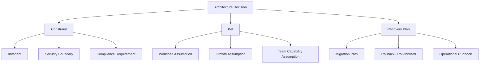
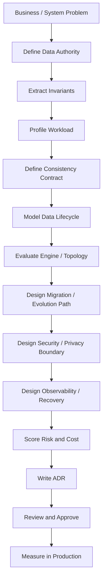
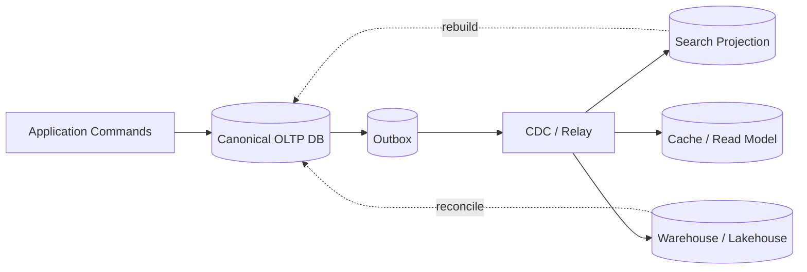

# Part 081 — Database Architecture Decision Framework

> Target pembelajaran: mampu memilih, menjustifikasi, mengkritik, dan mempertahankan keputusan arsitektur database secara sistematis. Bukan berdasarkan selera engine, bukan berdasarkan hype, bukan berdasarkan “tim sebelumnya pakai ini”, tetapi berdasarkan **authority, invariant, workload, consistency, evolution, operational capability, risk, dan cost of change**.

Database architect yang kuat bukan orang yang selalu memilih PostgreSQL, MongoDB, Cassandra, Spanner, DynamoDB, Elasticsearch, atau warehouse tertentu.

Database architect yang kuat adalah orang yang bisa menjawab:

1. data mana yang menjadi **truth**;
2. invariant mana yang wajib dijaga;
3. operasi mana yang harus atomic;
4. query mana yang latency-sensitive;
5. data mana yang boleh stale;
6. perubahan schema mana yang akan sering terjadi;
7. failure mana yang paling mahal;
8. siapa yang mengoperasikan sistem saat incident;
9. kapan keputusan ini harus diubah;
10. bagaimana membuktikan keputusan ini benar setelah production berjalan.

Framework ini adalah sintesis dari semua part sebelumnya. Anggap ini seperti **decision operating system** untuk database architecture.

---

## 1. The Real Problem: Database Decisions Are Usually Made Too Late

Banyak tim membuat keputusan database setelah mereka sudah punya:

- beberapa entity class;
- beberapa endpoint;
- beberapa query;
- beberapa migration;
- beberapa report;
- beberapa integrasi;
- beberapa production incident.

Pada titik itu, keputusan sudah terjadi, hanya belum ditulis.

Contoh:

```text
"Kita pakai JSONB dulu, nanti kalau stabil dinormalisasi."
```

Itu bukan temporary shortcut. Itu keputusan arsitektur.

```text
"Report langsung query database production saja, datanya belum besar."
```

Itu bukan quick win. Itu keputusan workload isolation.

```text
"Access control dicek di service saja."
```

Itu bukan simplifikasi. Itu keputusan security boundary.

```text
"Event dikirim setelah insert berhasil. Kalau publish gagal, retry dari app."
```

Itu bukan detail implementasi. Itu keputusan consistency antara database dan event bus.

Keputusan database jarang gagal karena engineer tidak tahu teknologi. Ia gagal karena tradeoff tidak dibuat eksplisit.

> A database architecture decision that is not written down still exists. It is just harder to review, harder to test, and harder to reverse.

---

## 2. Mental Model: Decision as Constraint + Bet + Recovery Plan

Setiap keputusan database punya tiga komponen.

| Komponen | Pertanyaan | Contoh |
|---|---|---|
| Constraint | Apa yang wajib benar? | Satu case hanya boleh punya satu active investigator |
| Bet | Apa yang kita asumsikan akan terjadi? | Volume case per tenant tidak akan melebihi 10 juta per tahun |
| Recovery plan | Jika bet salah, apa jalur keluar? | Tenant besar bisa dipindah ke dedicated database |

Keputusan yang matang bukan keputusan yang tidak punya risiko. Keputusan matang adalah keputusan yang risikonya dikenal, diamati, dan punya escape hatch.



Example decision:

```text
Decision:
Use PostgreSQL as canonical store for case-management data.
Use OpenSearch as search projection, not source of truth.
Use warehouse/lakehouse for analytical reports.

Constraint:
Case transitions, assignment uniqueness, decision audit, and evidence lifecycle must be transactionally protected.

Bet:
Operational query workload remains OLTP-shaped; search and analytics are projection workloads.

Recovery:
If search projection falls behind, operational writes continue; search freshness SLO degrades but case truth remains safe.
If analytics grows, warehouse scales independently.
```

---

## 3. Decision Levels

Jangan mencampur semua keputusan ke dalam satu diskusi “pakai database apa?”.

Ada banyak level keputusan.

| Level | Keputusan | Contoh |
|---|---|---|
| Data authority | Di mana truth tinggal? | `case_file` di PostgreSQL adalah source of truth |
| Model | Bagaimana data dimodelkan? | Normalize party/evidence/decision, denormalize timeline projection |
| Constraint | Siapa menjaga invariant? | Unique partial index untuk one active assignment |
| Transaction | Operasi apa harus atomic? | Create case + intake event + audit row + outbox |
| Engine | Engine apa dipakai? | PostgreSQL, distributed SQL, document DB, warehouse |
| Topology | Bagaimana engine disebar? | Single primary + replicas, partitioning, sharding, multi-region |
| Integration | Bagaimana data keluar? | CDC, outbox, API, batch export |
| Security | Boundary akses di mana? | RLS, application policy, views, grants |
| Migration | Bagaimana berubah? | Expand-migrate-contract |
| Operation | Bagaimana diamati dan dipulihkan? | Metrics, runbook, PITR, restore drill |
| Governance | Bagaimana keputusan dikontrol? | ADR, review checklist, ownership |

Architecture review yang buruk melompat langsung ke engine.

Architecture review yang baik memulai dari authority, invariant, workload, dan failure mode.

---

## 4. The Decision Pipeline

Gunakan pipeline berikut untuk keputusan database besar.



The key idea:

> Engine selection is not the first decision. It is a consequence of earlier decisions.

---

## 5. Step 1 — Define Data Authority

The first question is not:

```text
Which database should we use?
```

The first question is:

```text
Which system has authority over this fact?
```

Authority means the system is allowed to decide what is true.

Example facts:

| Fact | Authority | Not authority |
|---|---|---|
| Case current status | Case operational DB | Search index, dashboard, email notification |
| Evidence chain of custody | Evidence DB/module | Object storage metadata alone |
| User display name | Identity/profile service | Case DB local copy |
| Daily case count metric | Warehouse/semantic layer | Operational table as live query source |
| Search relevance score | Search engine | Canonical case DB |

A database decision that ignores authority will create duplicate truth.

### Authority questions

Ask:

1. Who is allowed to create this fact?
2. Who is allowed to correct it?
3. Who is allowed to delete or expire it?
4. Who must be notified when it changes?
5. Can another system override it?
6. Is it canonical, derived, cached, projected, or temporary?
7. What happens when copies disagree?

### Authority map template

```md
## Data Authority Map

| Data / Fact | Authority | Copies / Projections | Freshness | Repair Path | Owner |
|---|---|---|---|---|---|
| Case status | Case DB | Search, timeline, warehouse | Search <= 60s, warehouse daily | Rebuild projection from case DB | Case Platform Team |
| Evidence metadata | Evidence DB | Search, audit export | Search <= 5m | Re-index from evidence table | Evidence Team |
```

---

## 6. Step 2 — Extract Invariants

A database design without explicit invariants is just storage.

Invariant examples:

- a case cannot transition from `CLOSED` back to `UNDER_REVIEW` without a reopening decision;
- a ledger transaction must balance debit and credit lines;
- a tenant user cannot read another tenant’s case;
- an evidence item cannot be deleted while under legal hold;
- a report must be reproducible using the same data snapshot;
- a case cannot have two active primary investigators;
- a policy version cannot overlap another active policy version for the same jurisdiction.

### Invariant classification

| Type | Example | Common enforcement |
|---|---|---|
| Domain invariant | One active assignment | Partial unique index, transaction lock |
| Referential invariant | Evidence belongs to existing case | Foreign key |
| Temporal invariant | Effective periods do not overlap | Exclusion constraint, trigger, serializable transaction |
| Security invariant | Tenant isolation | RLS, composite keys, app policy |
| Lifecycle invariant | Closed case cannot accept new task | Transaction guard |
| Analytical invariant | Metric has one definition | Semantic layer, metric contract |
| Integration invariant | Event published exactly after DB commit | Outbox pattern |

### Invariant enforcement ladder

Prefer the strongest practical enforcement layer.

| Layer | Strength | Use when |
|---|---:|---|
| Database constraint | Very high | Invariant is local to database rows/tables |
| Transactional guard | High | Needs read-modify-write logic |
| Serializable transaction | High but operationally complex | Predicate invariant cannot be expressed as simple constraint |
| Application validation | Medium | UX-level validation or cross-service policy |
| Async repair | Low as prevention, useful as safety net | Derived data, projection drift, external copies |
| Dashboard alert only | Detection only | Invariant is hard to prevent but must be detected |

A decision framework must ask:

```text
Can this invariant be made impossible to violate?
If not, can violation be detected fast?
If detected, can it be repaired safely?
```

---

## 7. Step 3 — Profile the Workload

Database decisions must be workload-first.

A workload profile is not “read-heavy” or “write-heavy”. That is too shallow.

Good workload profile:

```md
## Workload Profile

Commands:
- Create case: 20 TPS peak, inserts 8 rows, writes audit + outbox.
- Assign investigator: 50 TPS peak, must enforce one active primary investigator.
- Submit decision: 5 TPS peak, writes decision, status transition, audit, outbox.

Queries:
- Case detail by id: p95 < 100ms, strongly consistent.
- Case queue by assignee/status/SLA: p95 < 250ms, current enough within same primary.
- Full-text search by party/evidence keyword: p95 < 1s, freshness <= 60s acceptable.
- Monthly compliance report: async, reproducible, not from OLTP primary.

Data growth:
- 30M cases/year, 200M tasks/year, 2B audit events/year.
- Large tenants can be 100x median tenant.

Concurrency risks:
- Assignment, status transition, and SLA escalation can conflict.
- Queue workers claim tasks concurrently.
```

### Workload dimensions

| Dimension | Why it matters |
|---|---|
| Read/write ratio | Affects index, projection, cache, replica design |
| Query shape | Determines whether B-Tree, search index, graph traversal, warehouse is appropriate |
| Write shape | Determines transaction boundary, contention, WAL pressure |
| Latency SLO | Determines serving path and topology |
| Freshness tolerance | Determines primary vs replica vs projection |
| Concurrency | Determines lock/transaction strategy |
| Growth | Determines partitioning/sharding/lifecycle |
| Skew | Determines tenant isolation/hotspot mitigation |
| Retention | Determines archive/purge/partitioning |
| Recovery objective | Determines backup/PITR/replication strategy |

---

## 8. Step 4 — Define Consistency Contract

Consistency is not a single global checkbox.

Different operations need different guarantees.

| Operation | Consistency required | Reason |
|---|---|---|
| Case status transition | Strong, transactional | Prevent illegal lifecycle |
| Assignment uniqueness | Strong, transactional | Prevent duplicate active owner |
| Search result listing | Eventually consistent | Projection; freshness SLO acceptable |
| Dashboard count | Eventually consistent with watermark | Analytical display |
| Regulatory decision record | Strong + auditable | Defensibility |
| Notification delivery | At-least-once with idempotency | External side effect |
| Report export | Snapshot consistent | Reproducibility |

### Consistency vocabulary

| Term | Practical meaning |
|---|---|
| Strong consistency | Read observes committed truth needed for correctness |
| Read-your-writes | User sees own write after commit |
| Monotonic read | User does not move backward in observed state |
| Snapshot consistency | Query sees one stable snapshot |
| Eventual consistency | System converges after delay |
| Causal consistency | Dependent effects become visible in causal order |
| External consistency | Commit order respects real-time ordering |

### Decision rule

Use the weakest consistency that still preserves user trust and domain correctness.

But do not weaken consistency for invariants.

```text
Latency optimization is acceptable for derived views.
Latency optimization is dangerous for authority updates.
```

---

## 9. Step 5 — Model Data Lifecycle

Database decisions must account for lifecycle.

For every major entity, document:

1. creation path;
2. valid transitions;
3. correction path;
4. cancellation/reversal path;
5. archival path;
6. retention period;
7. purge/erasure conditions;
8. downstream propagation;
9. reporting snapshot behavior;
10. audit requirement.

### Lifecycle matrix

| Entity | Created by | Mutated by | Terminal state | Retention | Purge? | Audit level |
|---|---|---|---|---|---|---|
| Case | Intake service | Workflow commands | Closed / withdrawn | 7 years | After retention unless legal hold | Full |
| Evidence | Investigator / integration | Metadata correction | Archived | Case retention + hold | Restricted | Full chain of custody |
| Task | Workflow engine | Assignment/escalation | Done / canceled | 2 years after case close | Yes | Medium |
| Decision | Authorized officer | Correction/reversal only | Final | Permanent/long retention | Usually no | Full |

If lifecycle is not understood, engine selection is premature.

A document database may fit aggregate lifecycle when document boundary is stable and bounded.

A relational database may fit when lifecycle has many relationships, constraints, and independent sub-entities.

An event log may fit when history is the primary truth and current state is projection.

A warehouse may fit when immutable analytical snapshots matter more than command-time constraints.

---

## 10. Step 6 — Hard Filters Before Scoring

Many teams use weighted scoring too early. Scoring is useful only after disqualifying unsafe options.

### Hard filter examples

| Requirement | Disqualifies |
|---|---|
| Multi-row transactional invariant is central | Pure search engine as authority |
| Cross-entity joins are core OLTP path | Key-value store as only canonical store |
| Unbounded relationship traversal is primary query | Plain relational-only solution may become painful unless graph projection added |
| Regulatory audit and correction history required | Cache/projection-only truth |
| Reproducible historical reporting required | Live OLTP-only dashboard without snapshots |
| Strict tenant isolation required | App-only tenant filtering without DB-level guardrails |
| Frequent schema evolution with many consumers | Shared raw table access as public contract |
| Low-latency global writes with strict consistency | Single-region primary without locality strategy |
| Need point-in-time restore | System without tested backup/PITR path |

Hard filters prevent “pretty scorecards” from justifying impossible designs.

---

## 11. Step 7 — Engine Fit Matrix

This matrix is not a universal truth. It is a decision starting point.

| Engine family | Strong fit | Weak fit | Watch out |
|---|---|---|---|
| Relational OLTP | Invariants, joins, transactions, referential integrity | Massive write-only event ingestion without partitioning | Lock/contention, schema migration, reporting overload |
| Distributed SQL | Relational + scale/multi-region needs | Simple app where ops complexity is not justified | Transaction retries, locality, cost, operational maturity |
| Document DB | Aggregate/document boundary, flexible document shape | Strong cross-document invariants and joins | Unbounded arrays, duplicated truth, schema drift |
| Key-value / LSM | High write throughput, simple key access, event/state stores | Ad-hoc query, multi-dimensional filtering | Secondary indexes, compaction, hot keys |
| Wide-column | Query-driven high-scale access patterns | Exploratory relational queries | Partition key mistakes, tombstones, table-per-query duplication |
| Graph DB | Relationship traversal, network analysis, lineage | Simple CRUD with limited traversal | High-degree nodes, traversal explosion, transaction boundary |
| Search engine | Full-text, relevance, faceting, semantic retrieval | Canonical transactional truth | Staleness, reindexing, authorization freshness |
| Vector store/index | Similarity search, RAG, recommendation | Exact canonical truth | Embedding versioning, recall/precision, filtering semantics |
| Warehouse/lakehouse | Analytics, reporting, historical snapshots | Low-latency command processing | Freshness, reconciliation, governance, cost |
| Cache | Latency reduction, computed view | Source of truth | Invalidation, stampede, stale data |

### Practical principle

> Choose the engine whose failure modes you can operate, not only the one whose happy path looks elegant.

---

## 12. Step 8 — Topology Decision

Even after engine selection, topology matters.

PostgreSQL as single primary with replicas is different from PostgreSQL partitioned by time, from database-per-tenant, from logical replication to read models, from distributed SQL.

### Topology options

| Topology | Use when | Risk |
|---|---|---|
| Single primary | Strong consistency, modest scale, simpler operations | Primary bottleneck, regional latency |
| Primary + read replicas | Read scaling and HA | Stale reads, lag, failover complexity |
| Partitioned single database | Large table lifecycle/query pruning | Wrong partition key, migration complexity |
| Sharded application-level | Horizontal scale/tenant isolation | Routing, cross-shard query, resharding |
| Database-per-tenant | Isolation, custom backup/restore, enterprise tenants | Operational overhead, fleet management |
| Cell-based architecture | Blast radius control, tenant grouping | Routing, deployment complexity |
| Distributed SQL | Scale/multi-region relational semantics | Cost, retries, topology-aware schema |
| Polyglot projection | Specialized query serving | Consistency and rebuild discipline |

### Topology decision questions

1. What is the blast radius of one database failure?
2. What is the blast radius of one tenant spike?
3. Can a tenant be restored independently?
4. Can a tenant be migrated independently?
5. Can data residency be enforced?
6. How is routing done?
7. What happens during failover?
8. What becomes stale?
9. What is the operational overhead per partition/shard/tenant/cell?

---

## 13. Step 9 — Evolution and Migration Fit

A design is not complete unless it can evolve.

Ask:

- Can we add a column safely?
- Can we add a constraint safely?
- Can we change a relationship from one-to-one to one-to-many?
- Can we split a table?
- Can we move a tenant?
- Can we rebuild derived stores?
- Can we run old and new code together?
- Can we rollback the application without rolling back data?
- Can we validate data correctness after migration?

### Evolution score

| Score | Meaning |
|---:|---|
| 1 | Change requires downtime/manual repair |
| 2 | Change possible but risky and untested |
| 3 | Change possible with expand-contract and backfill |
| 4 | Change path documented and automated |
| 5 | Change path continuously tested with validation/reconciliation |

A design that is fast on day one but impossible to evolve is not cheap. It is deferred cost.

---

## 14. Step 10 — Security and Privacy Fit

Security is not a feature added after schema design.

Security boundary affects:

- table structure;
- key design;
- tenant scoping;
- row-level policy;
- view design;
- export paths;
- backup access;
- audit logging;
- analytics access;
- support access;
- deletion/retention design.

### Security decision questions

| Area | Questions |
|---|---|
| Identity | Who is the principal: user, service, tenant, organization? |
| Authorization | Is access object-level, row-level, field-level, purpose-based? |
| Tenant isolation | Is tenant boundary enforced by app, DB, topology, or all? |
| Sensitive data | Which fields are PII/secret/confidential/evidence-grade? |
| Audit | Can we prove who accessed/changed data? |
| Backup | Are backups encrypted and access-controlled? |
| Analytics | Does sensitive data leak into warehouse/search/export? |
| Support access | Is break-glass controlled and audited? |
| Erasure | Can deletion propagate to projections and derived stores? |

If a design says “authorization is handled elsewhere”, require a concrete proof path.

---

## 15. Step 11 — Operational Fit

A database design must match operational capability.

Questions:

1. Who receives the alert?
2. What dashboard shows the cause?
3. What runbook handles the incident?
4. How do we restore data?
5. How often do we test restore?
6. How do we detect bloat, lag, lock storms, queue backlog, projection drift?
7. Who approves migrations?
8. How do we stop a bad migration?
9. How do we test failover?
10. What is our cost of on-call complexity?

### Operational fit score

| Score | Meaning |
|---:|---|
| 1 | Team cannot operate this safely |
| 2 | Operation depends on one expert |
| 3 | Basic monitoring/runbook exists |
| 4 | Alerts, runbooks, drills, ownership exist |
| 5 | Self-service guardrails and continuous validation exist |

A technically superior database choice can be the wrong choice if the organization cannot operate it.

---

## 16. Step 12 — Cost of Change and Exit Strategy

Every database decision should include an exit strategy.

Exit does not mean “we can rewrite everything later”. That is not a strategy.

Exit strategy examples:

| Decision | Exit strategy |
|---|---|
| Use search projection | Projection rebuild from canonical DB |
| Use JSONB for dynamic attributes | Attribute registry + extraction migration path |
| Use shared schema multi-tenancy | Tenant catalog + tenant export/import + DB-per-tenant path |
| Use relational primary | CDC stream to analytical warehouse/search |
| Use document DB canonical store | Schema versioning + migration jobs + validation queries |
| Use distributed SQL | Locality-aware schema + fallback strategy for non-global operations |

### Reversibility classification

| Class | Meaning | Example |
|---|---|---|
| Type 1 | Hard to reverse | Canonical database engine, sharding strategy, tenant isolation model |
| Type 2 | Reversible with effort | Index strategy, projection technology, report store |
| Type 3 | Easily reversible | Query tuning, cache TTL, read replica routing rule |

Spend review energy proportional to irreversibility.

---

## 17. Weighted Scorecard

After hard filters, use scoring.

Example dimensions:

| Dimension | Weight | Option A: PostgreSQL canonical + search projection | Option B: Document DB canonical | Option C: Distributed SQL |
|---|---:|---:|---:|---:|
| Transactional invariants | 5 | 5 | 3 | 5 |
| Relationship complexity | 4 | 5 | 3 | 5 |
| Query flexibility | 4 | 5 | 3 | 5 |
| Write scale | 3 | 3 | 4 | 4 |
| Multi-region readiness | 3 | 2 | 3 | 5 |
| Migration simplicity | 4 | 4 | 3 | 3 |
| Team operational skill | 5 | 5 | 3 | 2 |
| Security/RLS fit | 4 | 5 | 3 | 4 |
| Analytics boundary | 3 | 4 | 3 | 4 |
| Cost predictability | 3 | 4 | 3 | 2 |

Weighted scoring must include notes, not just numbers.

```md
## Scoring Notes

Option A wins for invariant enforcement, operational maturity, SQL query flexibility, and RLS.
Option B is attractive for flexible intake documents but weak for cross-document workflow invariants.
Option C is strong for future global topology but currently operationally expensive for the team.

Decision:
Choose Option A now with explicit exit path:
- search projection for text/semantic search;
- warehouse for analytics;
- tenant extraction path for future silo/cell model;
- revisit distributed SQL if multi-region write latency becomes a real requirement.
```

---

## 18. Decision Pattern: Canonical Store + Projection Store

This is one of the most common production-grade patterns.



Use when:

- canonical data has transactional invariants;
- search/reporting access patterns differ from command workload;
- derived stores can be rebuilt;
- freshness can be explicitly stated.

Do not use when:

- projection becomes hidden authority;
- events are not replayable;
- deletes/privacy changes do not propagate;
- consumers query raw internal tables without contract.

---

## 19. Decision Pattern: Shared Schema vs Database-per-Tenant

### Shared schema

Use when:

- tenants are numerous and small/medium;
- cost efficiency matters;
- schema is common;
- tenant isolation can be enforced with composite keys/RLS/app controls;
- per-tenant restore is not a hard business requirement.

Risks:

- noisy neighbor;
- tenant filter leak;
- difficult per-tenant restore;
- large tenant skew;
- data residency complexity.

### Database-per-tenant

Use when:

- enterprise tenants require strong isolation;
- per-tenant backup/restore matters;
- data residency/custom retention matters;
- noisy neighbor risk is unacceptable;
- tenant count is operationally manageable or automated.

Risks:

- migration fleet complexity;
- version drift;
- monitoring explosion;
- cost overhead;
- cross-tenant analytics complexity.

### Hybrid/cell model

Use when:

- most tenants can share pools;
- large/regulated tenants need isolation;
- routing catalog and operational automation exist.

---

## 20. Decision Pattern: Normalize vs Denormalize

Do not frame this as ideology.

Normalize when:

- correctness matters;
- relationship has independent lifecycle;
- data is updated in many places;
- duplicate copies would drift;
- reporting/search can be projected separately.

Denormalize when:

- read path is hot and stable;
- duplicate data has clear source of truth;
- freshness contract is explicit;
- rebuild/repair exists;
- storage/write amplification is acceptable.

Decision record should state:

```md
## Denormalization Contract

Canonical source:
- `case_party.display_name` from Party/Profile service snapshot at case intake.

Denormalized copy:
- `case_search_document.party_names`.

Freshness:
- <= 60 seconds after CDC event.

Repair:
- Rebuild search document from canonical tables.

Drift detection:
- Daily sample reconciliation and event-lag alert.
```

---

## 21. Decision Pattern: Database Constraint vs Application Validation

Application validation improves user experience.

Database constraints protect truth.

| Rule | Best home |
|---|---|
| Email field must look like email | App + maybe DB check if stable |
| Case ID must be unique | DB unique constraint |
| Evidence must belong to existing case | DB foreign key |
| User cannot submit after deadline | App + transaction guard |
| One active assignment per case/role | DB partial unique index or transaction guard |
| Tenant isolation | DB/RLS + app policy + tests |
| Workflow transition allowed only by role | App/service policy + audit + transaction guard |

A mature decision does not ask “DB or app?”. It asks:

```text
Which layer prevents corruption?
Which layer improves UX?
Which layer detects violation?
Which layer repairs violation?
```

---

## 22. Decision Pattern: Cache vs Replica vs Read Model

These are not interchangeable.

| Choice | Best for | Not for |
|---|---|---|
| Cache | Expensive computed reads, low-latency repeated reads | Source of truth, complex invalidation without owner |
| Read replica | Offloading SQL reads with acceptable lag | Critical fresh read after write unless routed carefully |
| Materialized view | DB-local derived query result | Highly dynamic per-user search with complex relevance |
| CQRS read model | Stable query serving shape | Ad-hoc exploratory analytics |
| Search projection | Text/relevance/facets/vector retrieval | Transactional truth |
| Warehouse | Analytics/reporting/history | Low-latency command guard |

Decision rule:

```text
If correctness depends on fresh data, do not route blindly to stale stores.
If the view is derived, define rebuild and drift detection.
```

---

## 23. Decision Pattern: Event Sourcing vs State + History

Event sourcing is powerful when the event log is the primary truth.

But many systems only need:

- current state table;
- transition history table;
- audit trail;
- outbox events.

### Use event sourcing when

- reconstructing state from events is a core requirement;
- event sequence is the canonical business record;
- retroactive interpretation/versioning is expected;
- audit needs exact command/event timeline;
- team can operate event replay/versioning.

### Use state + history when

- current state is primary operational need;
- history is audit/explanation;
- relational constraints are central;
- event replay is not required for every query;
- simpler operations matter.

Decision smell:

```text
"We use event sourcing because audit is required."
```

Audit requirement alone does not imply event sourcing.

---

## 24. Decision Pattern: Single Region vs Multi-Region

Multi-region is not an automatic maturity upgrade.

It adds:

- latency tradeoffs;
- data residency complexity;
- conflict/failover semantics;
- operational burden;
- cost;
- testing requirements;
- incident complexity.

### Single-region primary is often correct when

- user base is regionally concentrated;
- write latency is acceptable;
- DR can be met with replica/PITR;
- team maturity is still growing;
- consistency and simplicity matter more than global latency.

### Multi-region becomes justified when

- latency is a product requirement;
- data residency is mandatory;
- regional outage tolerance requires regional continuity;
- entity ownership can be region-scoped;
- failover and conflict model are explicitly designed.

### Multi-region decision contract

```md
## Multi-Region Contract

Home-region rule:
- Each tenant has one home region for writes.

Read rule:
- Local region can serve stale profile/search reads within freshness SLO.
- Case transition reads must go to home region or strongly consistent distributed path.

Failover rule:
- Tenant can be promoted to DR region with fencing epoch.

Conflict rule:
- No active-active writes for the same case.

Residency rule:
- Evidence payload remains in jurisdiction-bound storage.
```

---

## 25. Database ADR Template

Use this template for significant database decisions.

```md
# ADR-DB-XXX: <Decision Title>

Status: Proposed | Accepted | Superseded | Deprecated
Date: YYYY-MM-DD
Owner: <team/person>
Reviewers: <names/roles>
Related ADRs: <links>

## 1. Context

What problem are we solving?
What business/system pressure triggered this decision?
What constraints are non-negotiable?

## 2. Decision

State the decision clearly.
Avoid vague language.

## 3. Scope

In scope:
- ...

Out of scope:
- ...

## 4. Data Authority

| Fact | Authority | Copies | Freshness | Repair Path |
|---|---|---|---|---|

## 5. Invariants

| Invariant | Enforcement | Test | Failure handling |
|---|---|---|---|

## 6. Workload Profile

Commands:
Queries:
Growth:
Concurrency:
Freshness:
Retention:

## 7. Options Considered

| Option | Pros | Cons | Rejection reason |
|---|---|---|---|

## 8. Decision Drivers

- Correctness
- Latency
- Scale
- Operational simplicity
- Security/privacy
- Migration path
- Cost

## 9. Risk and Failure Modes

| Failure mode | Impact | Detection | Mitigation | Recovery |
|---|---|---|---|---|

## 10. Migration / Rollout Plan

Expand:
Backfill:
Validate:
Cutover:
Contract:
Rollback / roll-forward:

## 11. Observability

Metrics:
Logs:
Traces:
Dashboards:
Alerts:
Runbooks:

## 12. Security / Privacy

Access boundary:
Sensitive fields:
Audit:
Retention:
Backup/export handling:

## 13. Consequences

Positive consequences:
Negative consequences:
Deferred work:
Open questions:

## 14. Review Date

Revisit when:
- workload exceeds ...
- tenant count exceeds ...
- p95 latency exceeds ...
- restore time exceeds ...
```

---

## 26. Decision Review Checklist

A decision is not ready if these are unanswered.

### Authority

- [ ] Is source of truth explicit?
- [ ] Are derived stores labelled as derived?
- [ ] Is repair/rebuild path defined?
- [ ] Are consumer contracts known?

### Invariants

- [ ] Are critical invariants listed?
- [ ] Is each invariant enforced somewhere concrete?
- [ ] Are race conditions considered?
- [ ] Are violations detectable?

### Workload

- [ ] Are command/query shapes known?
- [ ] Are latency/freshness expectations documented?
- [ ] Are growth/skew assumptions stated?
- [ ] Are reporting/export paths separate from OLTP when needed?

### Consistency

- [ ] Which operations require strong consistency?
- [ ] Which operations tolerate stale reads?
- [ ] Is read-your-writes needed?
- [ ] Is retry behavior documented?

### Schema/model

- [ ] Is grain clear?
- [ ] Are keys stable?
- [ ] Are relationships explicit?
- [ ] Is lifecycle modelled?
- [ ] Are temporal/correction semantics clear?

### Engine/topology

- [ ] Were hard filters applied before scoring?
- [ ] Are engine failure modes known?
- [ ] Does team have operational skill?
- [ ] Is topology appropriate for blast radius/growth?

### Migration

- [ ] Can change be rolled out without downtime?
- [ ] Is compatibility preserved?
- [ ] Is backfill idempotent?
- [ ] Is validation defined?
- [ ] Is rollback/roll-forward realistic?

### Security/privacy

- [ ] Is tenant/security boundary enforced?
- [ ] Is PII classified?
- [ ] Are audit and access logs sufficient?
- [ ] Are backup/export/search/warehouse covered?

### Operations

- [ ] Are metrics and alerts defined?
- [ ] Is runbook ready?
- [ ] Is backup/restore tested?
- [ ] Are capacity triggers defined?
- [ ] Is incident ownership clear?

---

## 27. Example ADR — Case Management Canonical Store

```md
# ADR-DB-081: Use PostgreSQL as Canonical Store for Regulatory Case Management

Status: Accepted
Date: 2026-07-05
Owner: Case Platform Team

## Context

The platform needs to manage regulatory cases with strict lifecycle rules, assignment uniqueness, evidence chain of custody, decision audit, tenant access boundaries, search, and reporting.

## Decision

Use PostgreSQL as the canonical operational store.
Use OpenSearch as a derived search projection.
Use warehouse/lakehouse as analytical reporting platform.
Use outbox/CDC to update derived stores.

## Data Authority

| Fact | Authority | Projection | Freshness |
|---|---|---|---|
| Case status | PostgreSQL | Search, timeline, warehouse | Search <= 60s |
| Assignment | PostgreSQL | Queue read model | Immediate on primary |
| Evidence metadata | PostgreSQL | Search | <= 5m |
| Report metric | Warehouse semantic layer | Dashboard | Daily/hourly watermark |

## Invariants

| Invariant | Enforcement |
|---|---|
| One active primary investigator per case | Partial unique index |
| Closed case cannot accept new task | Transaction guard |
| Evidence under legal hold cannot be purged | Purge transaction guard |
| Tenant cannot read another tenant case | Composite keys + RLS + app policy |

## Options Considered

| Option | Result |
|---|---|
| Document DB canonical | Rejected: cross-document workflow invariants and reporting joins too central |
| Event sourcing as full truth | Deferred: current state + transition history sufficient; replay complexity not justified |
| Distributed SQL now | Deferred: global active-active writes not required yet |
| PostgreSQL canonical + projections | Accepted |

## Consequences

Positive:
- Strong invariant enforcement.
- Mature SQL query/review tooling.
- Clear source of truth.
- Derived stores rebuildable.

Negative:
- Need careful schema migration discipline.
- Need partitioning/archival for audit/event growth.
- Need search projection pipeline.

Revisit when:
- Global write latency becomes product blocker.
- Single-primary write throughput exceeds capacity model.
- Tenant isolation requirements require dedicated databases.
```

---

## 28. Example Decision — Add Graph Database or Not?

Problem:

Investigators want to see relationships between parties, companies, cases, transactions, addresses, and evidence.

Bad decision:

```text
Use graph database because the UI has nodes and edges.
```

Better decision process:

### Authority

Are relationships canonical or derived?

If canonical:

- graph DB may be source of truth;
- need strong write/update governance;
- audit must be graph-native.

If derived:

- relational operational DB remains truth;
- graph projection supports exploration;
- rebuild from canonical entities/relationships.

### Workload

| Query | Fit |
|---|---|
| Case detail by id | Relational |
| All evidence for case | Relational |
| Find all parties connected within 3 hops | Graph |
| Identify central actor by relationship count | Graph/analytics |
| Official decision record | Relational/audit |

### Decision

```md
Use graph projection for investigation exploration.
Canonical relationship facts remain in PostgreSQL.
Graph projection is rebuilt from relationship tables and CDC.
Graph results are exploratory and must link back to canonical evidence before decision use.
```

This avoids turning exploratory tooling into hidden authority.

---

## 29. Example Decision — JSONB Dynamic Attributes

Dynamic fields are tempting.

Bad decision:

```text
Put custom fields in JSONB because requirements change often.
```

Better decision:

### Classify fields

| Field type | Storage decision |
|---|---|
| Stable domain field | Column |
| Field used in invariant | Column/constraint |
| Field used in filter/sort frequently | Column or governed generated/indexed expression |
| Rare display-only custom field | JSONB with registry |
| Versioned form submission | JSON document with schema version |
| Evidence payload metadata | Hybrid: core columns + JSON envelope |

### JSONB contract

```md
JSONB allowed for:
- low-criticality custom metadata;
- form snapshots;
- rarely queried extensibility fields.

JSONB not allowed for:
- lifecycle state;
- tenant boundary;
- permission-critical fields;
- high-volume queue filters;
- fields required for foreign key/reference integrity.

Required controls:
- schema version;
- attribute registry;
- validation layer;
- index review for any promoted query field;
- extraction path to real column.
```

---

## 30. Example Decision — Strong RLS or App-Only Authorization?

For low-risk internal tools, app-only authorization might be acceptable.

For tenant-regulated systems, app-only authorization is fragile.

Decision matrix:

| Requirement | App-only | DB RLS + app |
|---|---:|---:|
| Simple app, few queries | Good | Maybe overkill |
| Multi-tenant sensitive data | Risky | Strong fit |
| Ad-hoc support SQL | Dangerous | Safer if roles/policies enforced |
| Analytics/export boundary | Still needs governance | Still needs governance |
| Debuggability | Easier | Requires policy tooling |
| Performance simplicity | Easier | Needs index/policy testing |

A mature decision might be:

```md
Use app authorization for business actions.
Use database RLS as tenant/case confidentiality invariant.
Use service roles with least privilege.
Use policy tests for allowed/denied scenarios.
Use break-glass role with approval and audit.
```

---

## 31. Decision Evidence: What Counts as Proof?

Architecture arguments should rely on evidence.

Evidence examples:

| Claim | Evidence |
|---|---|
| Query shape fits index | `EXPLAIN ANALYZE` on realistic data |
| Migration safe | Lock test + staging rehearsal + rollback/roll-forward plan |
| Projection rebuildable | Rebuild dry-run + checksum/reconciliation |
| RLS correct | Policy test suite with allow/deny cases |
| Backup sufficient | Restore drill result and measured RTO |
| Tenant isolation works | Cross-tenant negative tests + monitoring |
| Capacity sufficient | Load test + growth model + headroom policy |
| Event consumer idempotent | Duplicate/replay test |

Opinion is useful for hypothesis.

Evidence is needed for decision.

---

## 32. Architecture Decision Smells

| Smell | Why dangerous |
|---|---|
| “We can migrate later” without migration path | Usually false under production load |
| “Database is just persistence” | Ignores invariant and authority |
| “Use NoSQL for scale” | Scale type undefined |
| “Use relational for consistency” | Specific invariants and isolation not stated |
| “Use events for audit” | Audit and event sourcing conflated |
| “Use cache to fix performance” | May hide query/model problems |
| “Replica reads are safe” | Staleness not classified |
| “Search index has latest state” | Projection treated as truth |
| “RLS is too slow” without test | Performance claim without evidence |
| “DBA will handle it” | Ownership unclear |
| “All reports query production” | Workload isolation ignored |
| “One database for everything” | Could be fine, but must be deliberate |
| “Polyglot is modern” | Could create operational debt |

---

## 33. Decision Review Meeting Format

Keep review efficient.

### 60-minute structure

| Time | Topic |
|---:|---|
| 0–5 min | Problem and non-negotiable constraints |
| 5–15 min | Data authority and invariants |
| 15–25 min | Workload and consistency contract |
| 25–35 min | Options and hard filters |
| 35–45 min | Risks, failure modes, migration path |
| 45–55 min | Security, operations, cost of change |
| 55–60 min | Decision, action items, revisit trigger |

The review should end with one of:

1. accepted;
2. accepted with conditions;
3. rejected with reason;
4. needs evidence;
5. split decision into smaller ADRs.

---

## 34. Revisit Triggers

A good decision includes conditions for re-evaluation.

Examples:

```md
Revisit this decision when:
- p95 case queue query exceeds 300ms for 3 consecutive business days;
- largest tenant exceeds 20% of pooled database write load;
- daily audit table growth exceeds forecast by 2x;
- restore drill exceeds RTO;
- search projection lag exceeds freshness SLO twice in one month;
- cross-region latency becomes a signed product requirement;
- schema migration takes more than 30 minutes of elevated risk window;
- compliance requires per-tenant data residency.
```

Without revisit triggers, decisions become stale doctrine.

---

## 35. Mini-Framework for Fast Decisions

Not every decision deserves a 20-page ADR.

For small database decisions, use this lightweight form.

```md
## Quick DB Decision

Decision:

Why now:

Data authority affected:

Invariant affected:

Workload affected:

Alternatives considered:

Risk:

Rollback / recovery:

Owner:

Review date / trigger:
```

Use this for:

- adding a non-critical index;
- adding a projection field;
- changing cache TTL;
- adding a small table;
- introducing a materialized view;
- changing retention for non-sensitive derived data.

Use full ADR for:

- new canonical store;
- tenant isolation model;
- sharding/partitioning strategy;
- RLS strategy;
- distributed SQL adoption;
- event sourcing decision;
- warehouse/lakehouse architecture;
- major schema refactor;
- data residency/security decision.

---

## 36. The Final Decision Rule

When options are close, prefer the option that:

1. makes truth explicit;
2. makes invalid state hard to create;
3. makes failure visible;
4. makes recovery testable;
5. makes migration possible;
6. matches team operational capability;
7. keeps derived data rebuildable;
8. keeps security boundary enforceable;
9. avoids irreversible complexity until justified;
10. leaves evidence for future engineers.

> Top-tier database architecture is not the art of picking the most powerful database. It is the discipline of preserving truth under change, scale, concurrency, failure, and human turnover.

---

## 37. Practice Drills

### Drill 1 — Case workflow database

You need to design a database for regulatory cases with:

- 10M cases/year;
- full audit trail;
- complex assignment workflow;
- search by party/evidence text;
- monthly compliance reporting;
- tenant confidentiality;
- possible enterprise tenant isolation.

Produce:

1. data authority map;
2. invariant list;
3. workload profile;
4. engine/topology options;
5. decision ADR.

### Drill 2 — Ledger

You need a high-volume ledger with:

- double-entry transactions;
- idempotent external references;
- balance queries;
- reversal/correction;
- reconciliation;
- CDC to downstream accounting.

Choose between:

- relational OLTP;
- key-value store + event log;
- distributed SQL;
- event sourcing.

Explain hard filters and failure modes.

### Drill 3 — Global SaaS

You need a SaaS platform with:

- EU and US tenants;
- data residency;
- enterprise tenant restore;
- low-latency reads;
- occasional cross-region collaboration;
- strict authorization.

Design:

1. tenant topology;
2. routing catalog;
3. consistency contract;
4. failover model;
5. migration path.

---

## 38. Key Takeaways

- Database decisions should start from **authority**, not engine.
- Invariants determine what must be protected transactionally.
- Workload determines serving shape, indexing, projections, and topology.
- Consistency should be per operation, not globally hand-waved.
- Hard filters should happen before weighted scoring.
- Every decision is a constraint, a bet, and a recovery plan.
- ADRs are not bureaucracy when they preserve context, consequences, and revisit triggers.
- Good database architecture optimizes for correctness under change, not just performance on day one.

---

## Source Anchors

- AWS Well-Architected Framework — decision tradeoffs, operational excellence, reliability, security, performance, and cost dimensions.
- AWS Prescriptive Guidance — Architectural Decision Records process.
- Google Cloud Well-Architected / Architecture Framework — operational excellence, reliability, security, privacy, cost, and performance categories.
- PostgreSQL Documentation — constraints, indexes, transactions, row-level security, monitoring, and migration mechanics.
- Prior parts in this series — invariants-first design, workload-first design, replication, partitioning, CDC, schema evolution, observability, and production readiness.
