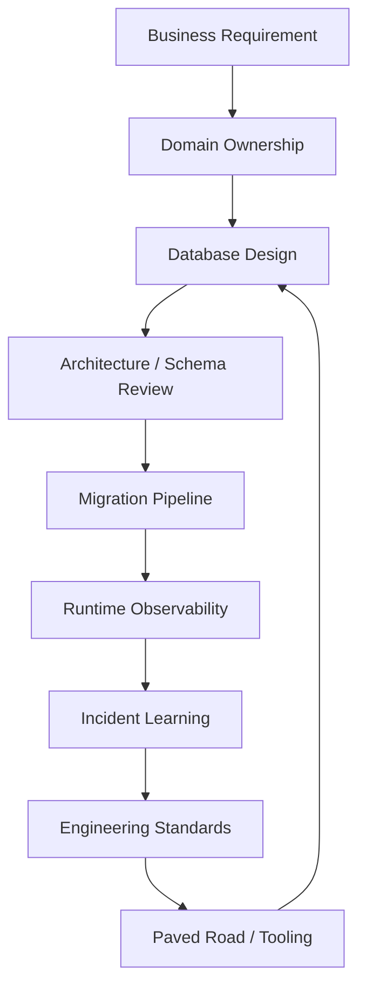
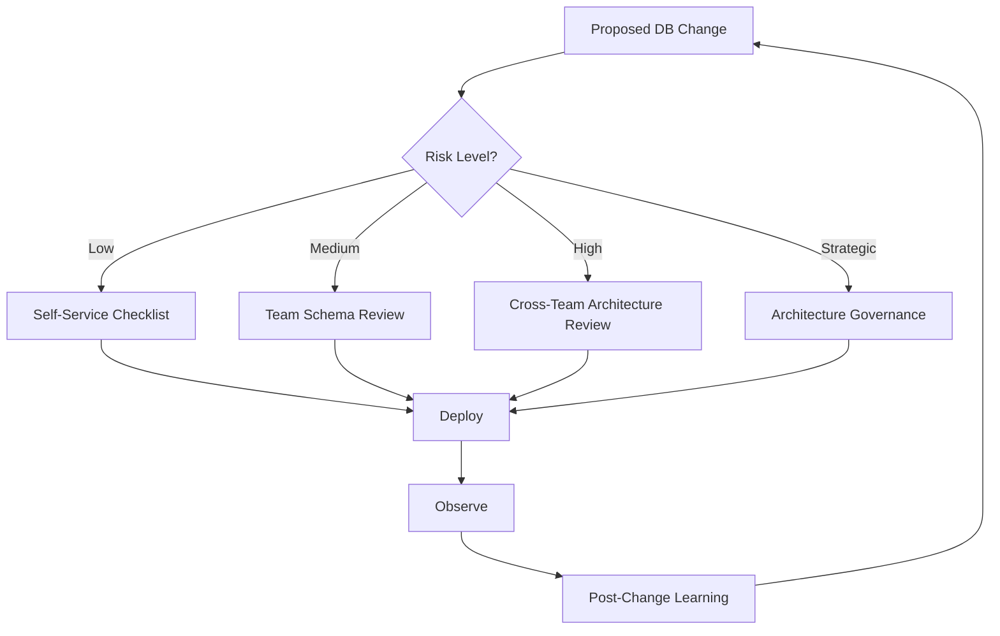
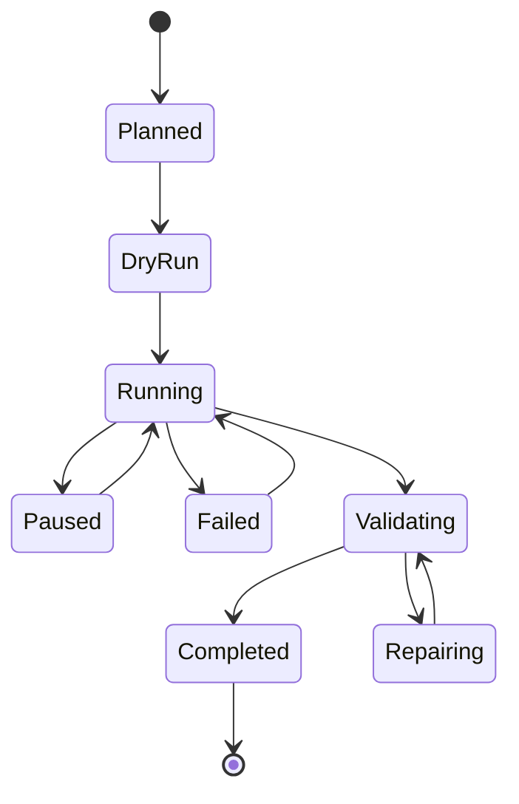
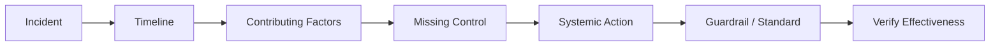

# Part 082 — Engineering Leadership for Database Design

> Target pembelajaran: mampu memimpin kualitas desain database lintas tim, bukan hanya mendesain schema sendiri. Fokusnya adalah membuat organisasi punya **standar, review system, ownership, paved road, guardrail, feedback loop, dan governance** sehingga kualitas database tidak bergantung pada hero engineer.

Database architecture yang buruk jarang terjadi karena satu engineer tidak tahu cara membuat table.

Ia biasanya terjadi karena organisasi tidak punya mekanisme yang jelas untuk menjawab:

1. siapa pemilik data;
2. siapa boleh mengubah schema;
3. siapa harus di-review sebelum constraint dihapus;
4. siapa menanggung incident ketika migration gagal;
5. siapa menjaga query production tetap sehat;
6. siapa menguji restore;
7. siapa mendefinisikan contract untuk consumer;
8. siapa memutuskan kapan perlu warehouse/projection/search store;
9. siapa bisa memberi exception terhadap standard;
10. siapa memastikan pelajaran incident menjadi perubahan sistemik.

Part ini bukan tentang syntax SQL. Ini tentang **operating model** untuk database engineering.

Seorang senior engineer bisa membuat schema bagus.

Seorang staff/principal/tech lead membuat **lingkungan teknis** di mana banyak tim bisa membuat schema bagus secara konsisten.

---

## 1. Core Mental Model: Database Quality Is an Organizational Property

Database quality tidak hanya ditentukan oleh table design.

Ia ditentukan oleh hubungan antara:

- product requirement;
- domain ownership;
- schema ownership;
- migration process;
- review quality;
- runtime observability;
- incident response;
- data governance;
- security and privacy control;
- platform tooling;
- engineering culture.

Diagram sederhana:



Leadership goal-nya bukan memastikan semua keputusan database melewati satu orang senior.

Goal-nya adalah membuat **sistem** di mana keputusan yang risky otomatis terlihat, keputusan yang aman bisa self-service, dan pelanggaran standard punya jalur eskalasi yang eksplisit.

---

## 2. Database Leadership Has Two Modes

Ada dua mode leadership yang harus dibedakan.

### 2.1 Expert Mode

Expert mode dipakai ketika engineer secara langsung membantu desain sulit.

Contoh:

- memilih shard key;
- mendesain transition table untuk workflow;
- men-debug deadlock;
- merancang online migration;
- memilih consistency contract;
- menghapus design smell besar;
- memperbaiki query plan regression.

Expert mode penting, tetapi tidak scalable.

Kalau semua keputusan database harus menunggu satu expert, organisasi akan melambat.

### 2.2 System Mode

System mode berarti membangun mekanisme agar kualitas database meningkat tanpa perlu expert hadir di semua tempat.

Contoh:

- schema review checklist;
- migration safety template;
- standard naming/type/key/index;
- CI guardrail untuk destructive migration;
- dashboard query health;
- ADR template;
- paved road untuk outbox/idempotency/audit;
- runbook database incident;
- maturity model per team.

Top 1% database leader bergerak dari expert mode ke system mode.

---

## 3. The Leadership Problem: Database Decisions Are Sticky

Keputusan database berbeda dari keputusan UI atau service code biasa.

Alasannya:

1. data hidup lebih lama dari aplikasi;
2. schema salah sulit diubah setelah production;
3. migration menyentuh data nyata;
4. backup dan restore ikut membawa kesalahan lama;
5. downstream consumer sering tidak terlihat;
6. data contract sering implicit;
7. query buruk bisa merusak seluruh cluster;
8. security/privacy leak bisa berdampak regulatori;
9. audit gap tidak bisa selalu direkonstruksi;
10. distributed consistency bug bisa muncul sporadis.

Jadi engineering leadership untuk database harus lebih formal dibanding perubahan code lokal.

Bukan birokrasi.

Formalitas diperlukan karena **cost of wrongness** tinggi.

---

## 4. Ownership Model: No Owner, No Architecture

Database tanpa owner akan berubah menjadi shared dumping ground.

Ownership harus jelas pada beberapa level.

| Layer | Pertanyaan | Owner Ideal |
|---|---|---|
| Business meaning | Data ini berarti apa? | Domain/product owner + domain tech lead |
| Write authority | Siapa boleh mengubah truth? | Owning service/team |
| Schema design | Siapa menjaga model fisik? | Owning engineering team |
| Migration | Siapa menjalankan dan rollback? | Owning team + platform/DBA support |
| Runtime health | Siapa merespons incident? | Owning team + SRE/DB platform |
| Access policy | Siapa menyetujui akses? | Data owner + security/privacy |
| Consumer contract | Siapa memberi breaking-change notice? | Owning team |
| Retention/erasure | Siapa memastikan lifecycle legal? | Data owner + compliance |

Rule sederhana:

> Jika sebuah table tidak punya owner, table itu tidak boleh menjadi source of truth.

---

## 5. RACI for Database Decisions

RACI membantu mencegah keputusan database jatuh ke “semua orang setuju secara diam-diam”.

Contoh RACI:

| Decision | Responsible | Accountable | Consulted | Informed |
|---|---|---|---|---|
| Create new canonical table | Feature team | Domain tech lead | DB/platform, security | Consumers |
| Add non-breaking column | Feature team | Feature team tech lead | Optional DB review | Consumers if public |
| Drop column | Feature team | Domain tech lead | Consumers, DB/platform | All affected teams |
| Add index | Feature team | Feature team tech lead | DB/platform for high-write table | SRE if high risk |
| Change PK/FK | Feature team + DB platform | Domain architect | Consumers, migration owner | SRE/support |
| Introduce new database engine | Architecture group | Engineering leadership | SRE, security, platform, finance | Affected teams |
| Create CDC contract | Owning team | Domain tech lead | Data platform, consumers | Governance group |
| Tenant isolation exception | Owning team | Security/data owner | Platform, compliance | Incident/support |

RACI bukan dokumen ceremonial.

Ia harus digunakan untuk menjawab:

- siapa wajib approve;
- siapa bisa block;
- siapa harus dilibatkan lebih awal;
- siapa harus menerima notice;
- siapa membawa pager saat production bermasalah.

---

## 6. Decision Rights: Make the Default Path Fast and the Risky Path Visible

Tidak semua perubahan database perlu architecture council.

Kalau semua perubahan kecil diperlakukan seperti perubahan global, tim akan menghindari review.

Gunakan level decision rights.

### Level 0 — Self-service Safe Change

Contoh:

- add nullable column internal;
- add comment;
- add safe non-unique index on small table;
- add internal table with clear owner;
- extend enum-like reference table tanpa semantic breaking change.

Syarat:

- migration reversible atau harmless;
- tidak mengubah public contract;
- tidak menyentuh high-write/hot table;
- tidak mengubah security boundary;
- tidak memerlukan backfill besar.

### Level 1 — Team Review Required

Contoh:

- add `NOT NULL` column dengan default/backfill;
- add FK pada table besar;
- add unique constraint;
- add index pada high-write table;
- introduce new state/status;
- create denormalized table;
- change query path untuk endpoint kritikal.

Syarat:

- schema review checklist;
- migration plan;
- query plan evidence;
- rollback/roll-forward plan.

### Level 2 — Cross-Team Review Required

Contoh:

- drop/rename public column;
- change CDC payload;
- split canonical table;
- move data ownership;
- introduce new projection store;
- change tenant isolation model;
- change retention semantics;
- change audit semantics.

Syarat:

- ADR;
- consumer impact analysis;
- migration state machine;
- backfill and validation plan;
- security/privacy review where relevant.

### Level 3 — Architecture Governance Required

Contoh:

- new database engine;
- sharding strategy;
- global replication topology;
- multi-region write model;
- cross-domain canonical data platform;
- irreversible migration of critical data;
- regulatory audit model redesign.

Syarat:

- architecture decision framework;
- failure mode analysis;
- operational readiness review;
- capacity and cost model;
- incident/recovery runbook;
- executive risk visibility if business critical.

---

## 7. Paved Road: Standardize the Safe Path, Not Every Path

A paved road adalah jalan resmi yang mudah, aman, dan didukung.

Dalam database engineering, paved road bisa berupa:

- standard migration framework;
- schema naming convention;
- common audit table pattern;
- common outbox implementation;
- common idempotency pattern;
- default tenant isolation pattern;
- approved index review checklist;
- sample materialized view refresh pattern;
- standard backup/restore test template;
- standard RLS testing harness;
- standard dashboard for DB health.

Paved road bukan pembatas kreativitas.

Ia mengurangi variasi yang tidak memberi nilai.

Contoh variasi yang tidak perlu:

```text
Team A pakai created_at.
Team B pakai created_on.
Team C pakai creation_time.
Team D pakai inserted_date.
```

Variasi seperti itu tidak meningkatkan architecture quality.

Ia hanya meningkatkan biaya query, reporting, dan onboarding.

---

## 8. Guardrails: Automate What Humans Forget

Review manusia bagus untuk tradeoff.

CI/CD bagus untuk aturan mekanis.

Jangan gunakan meeting untuk hal yang bisa dideteksi mesin.

Contoh guardrail:

| Guardrail | Deteksi |
|---|---|
| Migration destructive tanpa contract phase | `DROP COLUMN`, `DROP TABLE`, `ALTER TYPE`, destructive rename |
| Table tanpa primary key | DDL lint |
| Foreign key tanpa supporting index | schema analysis |
| `tenant_id` table tanpa composite FK/tenant isolation | schema policy |
| Column PII tanpa classification tag | metadata lint |
| Table source-of-truth tanpa audit columns | schema lint |
| Index redundant | catalog analysis |
| Migration long-running tanpa timeout | migration runner policy |
| Query baru tanpa plan evidence | CI benchmark/explain gate |
| RLS table tanpa policy test | integration test harness |

Guardrail yang bagus punya tiga karakter:

1. **explainable** — engineer tahu kenapa gagal;
2. **actionable** — ada cara memperbaiki;
3. **waivable with accountability** — exception bisa dilakukan, tapi tercatat.

---

## 9. Waiver Process: Exceptions Must Be Explicit Technical Debt

Standard tanpa waiver akan dilanggar diam-diam.

Waiver process membuat exception terlihat.

Template waiver:

```md
# Database Standard Waiver

## Standard Violated
Contoh: table high-write tanpa FK karena performance constraint.

## Reason
Mengapa standard tidak bisa diikuti saat ini?

## Risk
Apa correctness/operational/security risk-nya?

## Mitigation
Bagaimana risk dikurangi?

## Expiry / Review Date
Kapan waiver harus ditinjau ulang?

## Owner
Siapa accountable?

## Evidence
Benchmark, query plan, incident link, ADR, atau migration plan.
```

Waiver tanpa expiry biasanya menjadi architecture scar permanen.

---

## 10. Architecture Review Is Not Approval Theater

Review buruk biasanya seperti ini:

```text
"Looks good to me."
```

Atau:

```text
"Kenapa tidak pakai X saja?"
```

Review yang baik harus mencari missing risk, bukan menunjukkan seniority reviewer.

Review database yang baik bertanya:

- Apa source of truth-nya?
- Apa invariant-nya?
- Apa illegal state yang tidak boleh terjadi?
- Apa workload utama?
- Apa query paling mahal?
- Apa operasi paling concurrent?
- Apa data boleh stale?
- Apa migration plan-nya?
- Apa rollback/roll-forward plan-nya?
- Apa backup/restore impact-nya?
- Apa retention/privacy impact-nya?
- Apa consumer contract-nya?
- Apa observability signal-nya?
- Apa failure mode paling mungkin?
- Apa failure mode paling mahal?

---

## 11. A Practical Database Review Funnel

Gunakan review funnel agar effort review sebanding dengan risk.



Review funnel mencegah dua ekstrem:

- semua perubahan harus menunggu committee;
- semua perubahan bebas masuk production.

---

## 12. Review Comments Should Be Classified

Komentar review harus jelas tingkatnya.

| Level | Meaning | Example |
|---|---|---|
| Blocker | Harus diperbaiki sebelum merge | destructive migration tanpa expand-contract |
| Strong recommendation | Sangat disarankan, butuh alasan jika ditolak | index missing untuk FK high-volume |
| Question | Reviewer butuh klarifikasi | apakah report ini perlu reproducible? |
| Nit | Preferensi minor | naming comment |
| Future risk | Tidak block sekarang, perlu tracking | tenant skew mungkin muncul setelah enterprise launch |

Tanpa klasifikasi, review berubah menjadi perdebatan selera.

---

## 13. Database Standards That Actually Matter

Standard yang baik tidak terlalu panjang, tetapi menutup kelas risiko utama.

### 13.1 Naming Standard

Contoh:

- table menggunakan singular atau plural secara konsisten;
- PK bernama `id` atau `<entity>_id` secara konsisten;
- FK column jelas: `case_id`, `tenant_id`, `created_by_actor_id`;
- timestamp konsisten: `created_at`, `updated_at`, `deleted_at`;
- boolean tidak ambigu: `is_active`, `has_attachments`, `requires_review`;
- status column hanya untuk state sederhana, bukan workflow kompleks.

### 13.2 Key Standard

Contoh:

- semua table canonical punya primary key;
- business uniqueness harus punya unique constraint;
- external ID dipisah dari internal surrogate ID;
- multi-tenant table punya tenant-scoped uniqueness bila diperlukan;
- idempotency key punya uniqueness boundary eksplisit.

### 13.3 Type Standard

Contoh:

- money tidak disimpan sebagai float;
- timestamp semantics jelas: instant vs local date;
- enum-like value punya lifecycle/versioning strategy;
- JSON dipakai untuk extension boundary, bukan untuk menyembunyikan model inti;
- PII column diberi classification metadata.

### 13.4 Constraint Standard

Contoh:

- invariant hard harus di database jika bisa;
- `NOT NULL` dipakai untuk mandatory fact;
- FK dipakai untuk referential integrity dalam boundary yang sama;
- `CHECK` dipakai untuk domain constraint;
- partial unique index dipakai untuk active-state uniqueness;
- exclusion constraint dipakai untuk non-overlap interval jika engine mendukung.

### 13.5 Index Standard

Contoh:

- index harus didasarkan pada query workload;
- index harus punya owner/purpose;
- redundant index harus dibersihkan;
- high-write table index perlu justifikasi;
- query plan evidence diperlukan untuk critical path;
- index untuk reporting tidak boleh otomatis dipasang di OLTP production tanpa workload isolation review.

---

## 14. The Standard Library of Database Patterns

Engineering leadership harus menyediakan pattern siap pakai.

Bukan copy-paste buta, tetapi reference implementation.

### 14.1 Audit Pattern

```sql
created_at timestamptz not null default now(),
created_by text not null,
updated_at timestamptz not null default now(),
updated_by text not null
```

Untuk audit yang evidence-grade, audit event terpisah biasanya lebih baik daripada hanya `updated_at`.

### 14.2 Soft Delete Pattern

```sql
deleted_at timestamptz null,
deleted_by text null,
delete_reason text null
```

Plus partial unique index:

```sql
create unique index uq_active_case_reference
on regulatory_case (tenant_id, external_reference)
where deleted_at is null;
```

### 14.3 Idempotency Pattern

```sql
create table idempotency_record (
    tenant_id uuid not null,
    operation_name text not null,
    idempotency_key text not null,
    request_hash text not null,
    status text not null,
    response_payload jsonb null,
    created_at timestamptz not null default now(),
    expires_at timestamptz not null,
    primary key (tenant_id, operation_name, idempotency_key)
);
```

### 14.4 Outbox Pattern

```sql
create table outbox_event (
    id uuid primary key,
    aggregate_type text not null,
    aggregate_id uuid not null,
    event_type text not null,
    event_version int not null,
    payload jsonb not null,
    occurred_at timestamptz not null,
    published_at timestamptz null
);
```

### 14.5 State Transition Pattern

```sql
create table case_transition (
    id uuid primary key,
    case_id uuid not null,
    from_state text null,
    to_state text not null,
    transition_type text not null,
    actor_id uuid not null,
    reason text null,
    occurred_at timestamptz not null default now()
);
```

Pattern library membantu review karena reviewer bisa mengatakan:

> Gunakan pattern idempotency standard, bukan desain baru yang belum diuji.

---

## 15. Migration Governance

Migration adalah tempat database design bertemu realitas production.

Governance migration harus menjawab:

- apakah migration safe untuk traffic live;
- apakah migration butuh lock besar;
- apakah backfill bisa di-pause/resume;
- apakah validation tersedia;
- apakah rollback mungkin;
- apakah roll-forward lebih realistis;
- apakah consumer sudah compatible;
- apakah replica lag akan meningkat;
- apakah backup/restore terkena dampak;
- apakah observability tersedia.

### 15.1 Migration Risk Classes

| Class | Example | Requirement |
|---|---|---|
| Low | add nullable column | normal migration |
| Medium | add index on medium table | concurrent/online strategy |
| High | add FK/unique on big table | staged validation |
| Very High | table split | expand-migrate-contract |
| Critical | source-of-truth move | ADR + rehearsal + rollback/roll-forward |

### 15.2 Migration Checklist

```md
## Migration Checklist

- [ ] Is this backward compatible?
- [ ] Is this forward compatible?
- [ ] What code versions can run against this schema?
- [ ] What is the expected lock behavior?
- [ ] What is the expected runtime?
- [ ] Can it be paused/resumed?
- [ ] What is the validation query?
- [ ] What metric indicates danger?
- [ ] What is the rollback or roll-forward plan?
- [ ] Who is on-call during rollout?
```

---

## 16. Backfill Platform Capability

Backfill sering dianggap script sekali jalan.

Di organisasi matang, backfill adalah capability.

Backfill platform ideal punya:

- chunking;
- rate limiting;
- pause/resume;
- checkpoint;
- retry;
- idempotency;
- progress metric;
- error quarantine;
- validation;
- dry run;
- audit log;
- owner metadata;
- kill switch.

Pseudo lifecycle:



Backfill tanpa checkpoint biasanya akan gagal tepat ketika data sudah setengah berubah.

---

## 17. Data Contract Governance

Database schema sering menjadi API tidak resmi.

Consumer bisa berupa:

- service lain;
- BI dashboard;
- CDC pipeline;
- search projection;
- export job;
- ML pipeline;
- audit system;
- customer-facing report;
- support tooling.

Kalau consumer tidak tercatat, breaking change tidak akan terlihat.

Minimal governance:

```md
# Data Contract Registry Entry

## Producer
Owning team/service.

## Contract Surface
View/table/event/export/API.

## Consumers
Known consumers and owner.

## Freshness
Realtime, near-realtime, daily, on-demand.

## Compatibility Rules
Allowed additive changes, forbidden changes, deprecation period.

## Security Classification
PII, confidential, public, internal.

## Retention
How long the contract data is available.

## Change Process
Notice period, test suite, migration strategy.
```

Data contract governance tidak berarti semua table harus public.

Justru sebaliknya: bedakan internal schema dari public contract.

---

## 18. Incident Learning Loop

Database incident harus menghasilkan perubahan sistem, bukan hanya postmortem.

Contoh incident:

```text
Migration menambahkan index biasa pada table besar, menyebabkan lock dan request timeout.
```

Pembelajaran yang lemah:

```text
Engineer harus lebih hati-hati.
```

Pembelajaran yang kuat:

```text
CI migration linter sekarang memblokir CREATE INDEX non-concurrent pada table di atas threshold.
Runbook migration high-write table diperbarui.
Schema review checklist menambahkan lock-behavior section.
```

Incident learning loop:



---

## 19. Metrics for Database Engineering Leadership

Jangan hanya mengukur jumlah migration atau jumlah incident.

Ukur leading indicators.

### 19.1 Design Quality Metrics

- percent of canonical tables with owner metadata;
- percent of tables with primary key;
- percent of FK columns with supporting indexes where needed;
- number of orphan/unknown tables;
- number of public tables without contract registry;
- number of tables with PII classification;
- number of waivers past expiry;
- number of known design smells per domain.

### 19.2 Migration Quality Metrics

- migration failure rate;
- rollback/roll-forward rate;
- average backfill duration;
- percent of high-risk migrations with dry run;
- number of emergency schema changes;
- number of destructive migrations blocked by CI;
- time from migration start to detection of danger.

### 19.3 Runtime Health Metrics

- slow query count by service;
- top query load by normalized query;
- lock wait time;
- deadlock count;
- replication lag;
- connection saturation;
- WAL growth;
- bloat trend;
- backup success;
- restore test pass/fail;
- query plan regression count.

### 19.4 Governance Metrics

- ADR coverage for strategic decisions;
- average review lead time;
- exception/waiver count;
- expired waiver count;
- percent of teams using paved road;
- incident action completion rate;
- percentage of critical data with documented RPO/RTO.

Metrics harus dipakai untuk learning, bukan blame.

---

## 20. Maturity Model

Gunakan maturity model untuk membaca organisasi, bukan untuk memberi label buruk.

### Level 0 — Ad Hoc

Ciri:

- schema berubah langsung karena feature pressure;
- migration manual;
- table owner tidak jelas;
- index ditambah setelah incident;
- backup dianggap tanggung jawab infra;
- data contract implicit;
- no review checklist.

Risiko:

- correctness bug;
- migration incident;
- reporting inconsistency;
- security leak;
- operational surprise.

### Level 1 — Basic Discipline

Ciri:

- semua schema pakai migration tool;
- basic naming standard;
- PK/FK/constraint mulai konsisten;
- review dilakukan untuk perubahan besar;
- backup tersedia;
- slow query bisa ditemukan.

Gap:

- review quality tidak konsisten;
- migration high-risk belum punya playbook;
- data contract masih informal.

### Level 2 — Managed Practice

Ciri:

- schema review checklist;
- migration risk classification;
- query plan evidence untuk path kritikal;
- standard audit/outbox/idempotency pattern;
- owner metadata;
- basic RLS/security review;
- restore drill berkala;
- incident postmortem menghasilkan action.

Gap:

- guardrail belum banyak otomatis;
- cross-team contract masih lemah;
- maturity antar team berbeda.

### Level 3 — Platformed Discipline

Ciri:

- paved road tersedia;
- CI migration guardrail;
- automated schema lint;
- contract registry;
- backfill runner;
- DB observability standard;
- policy testing harness;
- architecture review funnel;
- waiver process.

Gap:

- strategic decision governance perlu konsistensi;
- advanced multi-region/polyglot risks masih butuh expert review.

### Level 4 — Adaptive Excellence

Ciri:

- database design learning loop berjalan;
- standards berevolusi dari incident and evidence;
- teams self-service untuk safe changes;
- high-risk changes transparan;
- data product contracts mature;
- architecture decisions regularly revisited;
- capacity/failure/security posture visible.

Tujuan bukan “semua level 4”.

Tujuan adalah maturity yang sesuai risk domain.

Sistem regulatory, financial ledger, identity, payment, dan case-management biasanya butuh maturity lebih tinggi daripada internal low-risk tool.

---

## 21. Operating Cadence

Leadership butuh cadence agar database quality tidak hanya dibahas saat incident.

### Weekly

- review high-risk migrations;
- monitor slow query/lock trends;
- check failed migrations/backfills;
- review urgent schema review blockers.

### Biweekly

- architecture review for upcoming major data changes;
- review waiver requests;
- refine paved road pattern;
- review top operational risks.

### Monthly

- database health review;
- capacity trend review;
- backup/restore status;
- schema smell report;
- security/privacy exceptions;
- top consumer contract changes.

### Quarterly

- database architecture strategy review;
- maturity assessment;
- engine/tooling roadmap;
- cost optimization review;
- incident trend review;
- standard refresh.

Cadence yang baik mencegah organisasi hanya reaktif.

---

## 22. Architecture Council: When Useful and When Dangerous

Architecture council berguna jika tugasnya:

- menangani decision level 3;
- menjaga cross-domain consistency;
- meninjau high-risk data movement;
- mengelola strategic platform direction;
- memutuskan exceptions besar;
- menghapus ambiguity ownership.

Architecture council berbahaya jika berubah menjadi:

- approval bottleneck;
- style police;
- tempat senior berdebat tanpa evidence;
- tempat semua keputusan kecil harus lewat;
- arena politik antar team.

Rule:

> Architecture council harus mempercepat keputusan sulit, bukan memperlambat keputusan aman.

---

## 23. Data Platform vs Product Team Responsibility

Data/database responsibility sering kabur antara platform team dan product team.

Pembagian sehat:

| Area | Product Team | DB/Data Platform |
|---|---|---|
| Domain meaning | Own | Consult |
| Canonical schema | Own | Provide standards/review |
| Migration authoring | Own | Provide tooling/guardrails |
| Backup platform | Consult | Own |
| Restore validation data-specific | Own | Support |
| Observability usage | Own | Provide dashboards/instrumentation |
| Database engine operation | Shared/depends | Own/support |
| Data contract | Own | Registry/tooling |
| Security policy semantics | Own with security | Provide enforcement mechanism |
| Incident response | Own application impact | Own platform impact |

Product team tidak boleh mengatakan:

```text
"Database itu tanggung jawab platform."
```

Platform team tidak boleh mengatakan:

```text
"Kami hanya menyediakan cluster, data meaning bukan urusan kami."
```

Database quality membutuhkan keduanya.

---

## 24. Coaching Engineers in Database Design

Leadership bukan hanya membuat aturan.

Ia juga mengembangkan judgement.

Cara coaching yang efektif:

1. minta engineer menjelaskan invariant;
2. minta mereka menggambar lifecycle state;
3. minta mereka menulis top 5 query;
4. minta mereka mengidentifikasi failure mode;
5. minta mereka menjelaskan migration path;
6. minta mereka menulis validation query;
7. minta mereka menjelaskan owner dan consumer;
8. minta mereka membandingkan alternatif, bukan hanya solusi final.

Pertanyaan coaching:

```text
Apa illegal state yang schema ini cegah?
Apa illegal state yang masih bergantung pada aplikasi?
Apa query yang akan sering dipanggil?
Apa operasi paling concurrent?
Apa data yang boleh stale?
Apa yang terjadi jika backfill berhenti di tengah?
Apa yang terjadi jika event dikirim dua kali?
Apa yang terjadi jika tenant terbesar 100x lebih besar?
```

Tujuan coaching adalah membangun mental model, bukan hanya membuat PR lulus review.

---

## 25. Common Leadership Failure Modes

### 25.1 Hero DBA Bottleneck

Semua keputusan menunggu satu orang.

Gejala:

- review queue panjang;
- team takut menyentuh schema;
- knowledge tidak tersebar;
- incident bergantung pada hero.

Mitigasi:

- standard checklist;
- pattern library;
- training drills;
- office hours;
- delegate decision rights;
- automate guardrails.

### 25.2 No Owner Shared Database

Semua service menulis ke database yang sama tanpa boundary.

Gejala:

- table berubah tanpa notice;
- query antar service langsung ke table internal;
- migration sulit karena unknown consumer;
- performance blame game.

Mitigasi:

- ownership registry;
- public contract views/APIs;
- deprecation process;
- schema namespace/domain boundary.

### 25.3 Process Without Expertise

Ada checklist, tetapi reviewer tidak paham risikonya.

Gejala:

- semua checklist dicentang;
- incident tetap berulang;
- review hanya naming/nit;
- high-risk change lolos tanpa challenge.

Mitigasi:

- review drills;
- incident-based training;
- example library;
- reviewer calibration.

### 25.4 Expertise Without Process

Ada expert kuat, tetapi tidak ada system.

Gejala:

- keputusan bagus tapi tidak repeatable;
- team lain mengulang kesalahan;
- standard tidak tertulis;
- incident learning hilang.

Mitigasi:

- codify decisions;
- create paved road;
- automate checks;
- write ADRs;
- convert review comments into standards.

### 25.5 Governance as Bureaucracy

Semua perubahan diperlambat.

Gejala:

- engineers bypass process;
- review dilihat sebagai penghalang;
- architecture group kehilangan trust;
- keputusan kecil menunggu meeting besar.

Mitigasi:

- risk-based review funnel;
- self-service low-risk path;
- SLA review;
- clear escalation;
- measurable value from governance.

---

## 26. 30/60/90-Day Plan for Database Leadership

### First 30 Days — Visibility

Output utama: tahu kondisi nyata.

Actions:

- inventory critical databases;
- identify table/service owners;
- list top critical data flows;
- collect recent database incidents;
- inspect migration process;
- inspect backup/restore reality;
- find top slow queries;
- identify unknown public consumers;
- review security/privacy-sensitive tables;
- map biggest design smells.

Deliverables:

- database ownership map;
- risk register;
- top 10 database risks;
- quick-win guardrail list;
- first version of schema review checklist.

### Days 31–60 — Standardization

Output utama: repeatable practice.

Actions:

- publish schema review checklist;
- define migration risk classes;
- create ADR template;
- create waiver template;
- define owner metadata standard;
- standardize audit/idempotency/outbox patterns;
- start weekly high-risk migration review;
- create database health dashboard;
- run first restore drill if absent.

Deliverables:

- database engineering handbook v1;
- paved road pattern library v1;
- review funnel;
- migration safety guide;
- observability baseline.

### Days 61–90 — Systemization

Output utama: guardrails and learning loop.

Actions:

- implement migration linter;
- implement schema lint for key standards;
- build contract registry pilot;
- create backfill runner or template;
- run review drills;
- review expired waivers;
- connect incident actions to standards;
- define maturity model per team;
- establish architecture council scope.

Deliverables:

- automated guardrail v1;
- maturity assessment;
- platform roadmap;
- incident learning loop;
- quarterly review cadence.

---

## 27. Database Engineering Handbook Structure

A real internal handbook can be structured like this:

```text
/database-engineering
  /standards
    naming.md
    keys-and-identity.md
    constraints.md
    indexes.md
    timestamps-and-time.md
    multi-tenancy.md
    security-and-privacy.md
  /patterns
    audit-event.md
    idempotency.md
    outbox.md
    inbox-dedup.md
    soft-delete.md
    state-transition.md
    materialized-view.md
    backfill.md
  /reviews
    schema-review-checklist.md
    migration-risk-classification.md
    architecture-review-method.md
    production-readiness-checklist.md
  /runbooks
    slow-query.md
    lock-storm.md
    replication-lag.md
    migration-rollback.md
    disk-wal-pressure.md
    restore.md
  /templates
    database-design-doc.md
    adr.md
    waiver.md
    incident-postmortem.md
```

Handbook yang baik bukan dokumen mati.

Ia harus berubah setelah incident, review, dan perubahan platform.

---

## 28. Example: Turning an Incident Into a Standard

Incident:

```text
A report query without tenant filter scanned 400M rows and saturated I/O.
```

Bad response:

```text
Ask the engineer to be more careful.
```

Good response:

1. add query lint for tenant-scoped services;
2. add schema review item: every multi-tenant query path must show tenant predicate;
3. add dashboard for top queries without tenant predicate where detectable;
4. add RLS or security view where appropriate;
5. add report boundary guidance;
6. add incident drill to onboarding.

This is leadership: converting pain into architecture improvement.

---

## 29. Example: Decision Rights for Indexes

Index governance should avoid two bad extremes:

- every engineer can add any index;
- no engineer can add index without DBA permission.

Balanced rule:

```text
Low-risk index:
- small table
- non-unique
- supports known query
- no high write rate
=> team self-service with checklist

Medium-risk index:
- medium/large table
- moderate write rate
- critical endpoint
=> team review + query plan evidence

High-risk index:
- high-write table
- unique constraint
- concurrent build required
- affects migration window
=> DB/platform review

Strategic index/model change:
- query pattern indicates wrong data model
- index is compensating for design smell
=> architecture review
```

Leadership principle:

> An index should not be the permanent excuse for a broken model.

---

## 30. Example: Ownership Metadata

At minimum, critical tables should have metadata.

Example as table comment:

```sql
comment on table regulatory_case is
'owner=case-platform; source_of_truth=true; pii=medium; retention=case-retention-policy-v3; contract=internal';
```

Or registry table:

```sql
create table data_asset_registry (
    asset_name text primary key,
    asset_type text not null,
    owning_team text not null,
    domain_name text not null,
    source_of_truth boolean not null,
    pii_classification text not null,
    retention_policy text not null,
    rpo_minutes int null,
    rto_minutes int null,
    contract_surface text not null,
    last_reviewed_at timestamptz not null
);
```

Without metadata, architecture knowledge lives in people’s memory.

People’s memory is not a control system.

---

## 31. Example: Schema Review Checklist as PR Gate

PR template:

```md
## Database Change Summary

### What changes?

### Why is this needed?

### Owner

### Source of truth impact
- [ ] No source-of-truth change
- [ ] New source of truth
- [ ] Existing source of truth changed

### Compatibility
- [ ] Backward compatible
- [ ] Forward compatible
- [ ] Requires expand-contract

### Migration risk
- [ ] Low
- [ ] Medium
- [ ] High
- [ ] Critical

### Workload evidence
- [ ] Top queries listed
- [ ] Query plan attached for critical path
- [ ] Index impact reviewed

### Data correctness
- [ ] Constraints added where possible
- [ ] Invariants documented
- [ ] Invalid historical data handled

### Security/privacy
- [ ] Tenant boundary preserved
- [ ] PII classification updated
- [ ] Access policy reviewed

### Operations
- [ ] Backfill plan included
- [ ] Rollback/roll-forward plan included
- [ ] Metrics/alerts updated
```

Make the right questions unavoidable.

---

## 32. How to Lead Without Becoming the Bottleneck

Use four levers:

### 32.1 Teach the Mental Model

Train engineers to think in:

- authority;
- invariant;
- workload;
- lifecycle;
- consistency;
- failure;
- evolution.

### 32.2 Provide Reference Solutions

Give teams strong defaults:

- idempotency implementation;
- outbox implementation;
- backfill runner;
- RLS example;
- migration strategy examples.

### 32.3 Automate the Repetitive Checks

CI should catch:

- missing PK;
- destructive DDL;
- unsafe index creation;
- missing owner metadata;
- unclassified PII;
- policy test absence.

### 32.4 Escalate Only High-Risk Decisions

Do not review everything.

Review the changes where wrongness is expensive.

---

## 33. What Great Looks Like

A mature database engineering culture has these properties:

1. Teams know who owns each data asset.
2. Schema changes are treated as compatibility events.
3. Critical invariants are enforced close to truth.
4. Migrations are staged, observable, and rehearsed when risky.
5. Query plans are part of performance-sensitive review.
6. Security/privacy boundaries are explicit.
7. Data contracts are versioned and discoverable.
8. Backup is not trusted until restore is tested.
9. Incidents change standards and tooling.
10. Low-risk changes are fast; high-risk changes are visible.

This is the goal.

Not perfect schema.

A resilient engineering system.

---

## 34. Final Checklist

Use this checklist when leading database design across teams.

### Ownership

- [ ] Critical tables have owning team.
- [ ] Source-of-truth tables are explicitly marked.
- [ ] Consumer contracts are documented.
- [ ] Data classification is known.

### Decision Process

- [ ] Decision rights are risk-based.
- [ ] Low-risk changes are self-service.
- [ ] High-risk changes require architecture review.
- [ ] ADRs exist for strategic decisions.
- [ ] Waivers have owners and expiry.

### Standards

- [ ] Naming standard exists.
- [ ] Key/identity standard exists.
- [ ] Constraint standard exists.
- [ ] Index standard exists.
- [ ] Time/timestamp standard exists.
- [ ] Multi-tenant standard exists.
- [ ] Security/privacy standard exists.

### Tooling

- [ ] Migration tool is standardized.
- [ ] Migration lint exists.
- [ ] Schema lint exists.
- [ ] Query health dashboard exists.
- [ ] Backup/restore automation exists.
- [ ] Backfill template/runner exists.
- [ ] Contract registry exists or is planned.

### Review

- [ ] Schema review checklist is used.
- [ ] Migration risk classification is used.
- [ ] Production readiness checklist is used.
- [ ] Review comments are classified.
- [ ] Reviewer calibration happens periodically.

### Operations

- [ ] Slow query runbook exists.
- [ ] Lock storm runbook exists.
- [ ] Migration incident runbook exists.
- [ ] Restore drill is scheduled.
- [ ] Replication lag alert exists.
- [ ] Capacity trend is reviewed.

### Learning

- [ ] Incidents produce systemic actions.
- [ ] Standards are updated from evidence.
- [ ] Training drills exist.
- [ ] Maturity is assessed regularly.
- [ ] Platform roadmap reflects pain points.

---

## 35. Key Takeaways

Engineering leadership for database design is not about being the smartest SQL person in the room.

It is about building a system where:

- correctness is designed;
- risk is visible;
- safe changes are fast;
- dangerous changes are reviewed;
- operations are observable;
- incidents produce learning;
- teams improve together.

The best database architecture is not just a schema.

It is a living socio-technical system: people, process, tooling, runtime, standards, and feedback loops all reinforcing each other.

If Part 081 gave you the **decision framework**, Part 082 gives you the **organizational operating model** to make that framework real across many teams.
