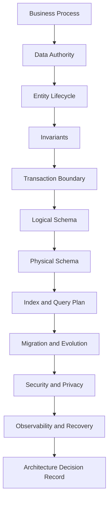
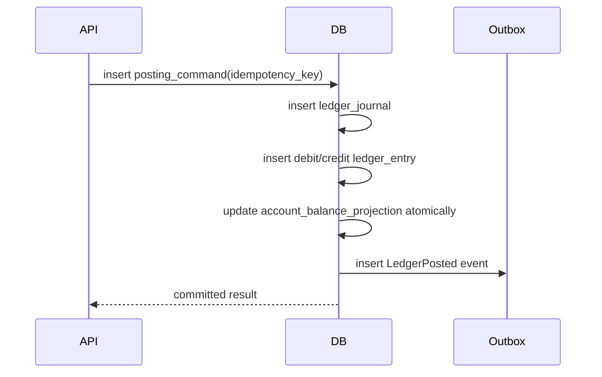
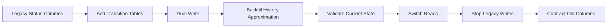
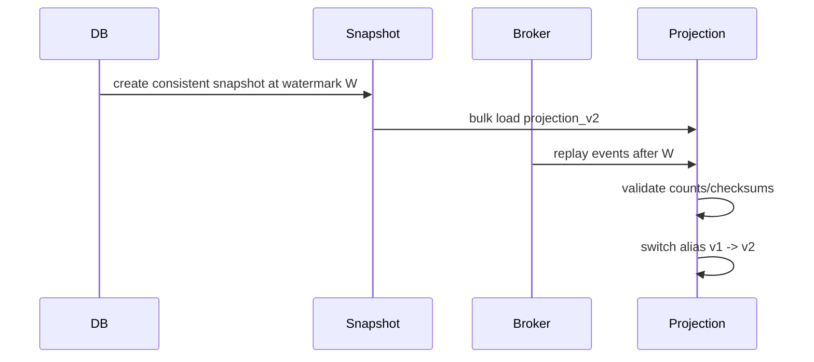
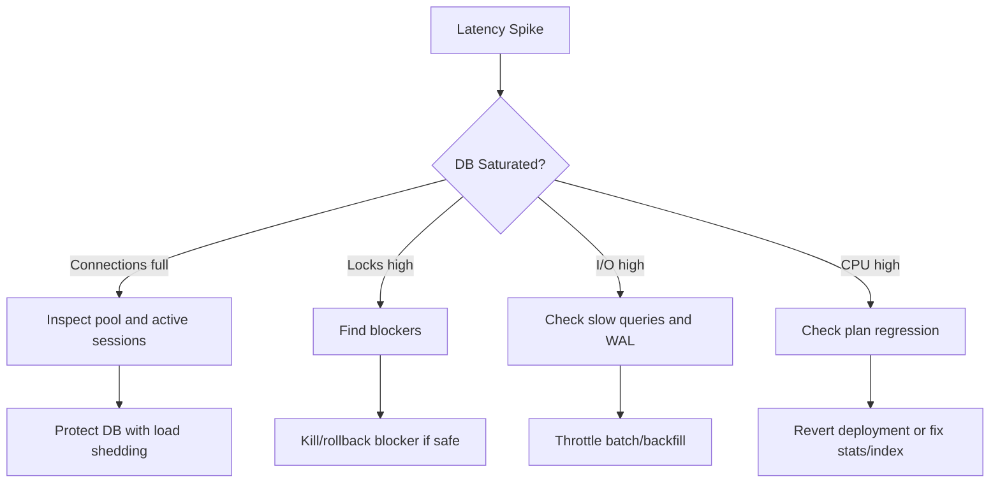

# Part 083 — Database Design Interview and Review Drills

> Goal bagian ini: mengubah seluruh konsep seri ini menjadi latihan nyata.
>
> Database architect yang kuat bukan hanya bisa menjelaskan normalization, index, transaction, atau CAP. Ia bisa mengambil problem ambigu, mengubahnya menjadi model data, mengunci invariant, memilih boundary, menilai risiko, dan mempertahankan keputusan desain dengan evidence.

Bagian ini berisi **drill**. Formatnya sengaja dibuat mirip internal engineering review: scenario, hidden ambiguity, expected reasoning, design sketch, failure modes, and review questions.

Tidak ada satu jawaban absolut untuk semua drill. Yang dinilai adalah **struktur berpikir**.

---

## 1. Cara Menggunakan Drill Ini

Gunakan setiap drill sebagai latihan 45–90 menit.

Format latihan:

1. Baca scenario.
2. Tulis assumptions.
3. Identifikasi source of truth.
4. Definisikan entity, lifecycle, dan invariant.
5. Buat conceptual/logical/physical model.
6. Tentukan transaction boundary.
7. Tentukan index berdasarkan workload.
8. Tentukan migration/evolution path.
9. Tentukan observability dan failure mode.
10. Tulis ADR ringkas.

Output ideal dari setiap drill:

```text
1. Problem statement
2. Scope and non-scope
3. Data authority map
4. Entity lifecycle diagram
5. Logical schema
6. Critical invariants
7. Main write flows
8. Main read flows
9. Index strategy
10. Consistency and transaction strategy
11. Security/privacy boundary
12. Migration strategy
13. Failure modes
14. Open risks
15. ADR decision summary
```

---

## 2. Rubric Evaluasi Database Architect

Gunakan rubric ini untuk menilai jawaban sendiri atau tim.

| Area | Junior Answer | Strong Answer | Architect-Level Answer |
|---|---|---|---|
| Requirement | Langsung bikin tabel | Tanya field yang kurang | Mengurai business invariant, lifecycle, authority, dan failure mode |
| Data model | Entity-list based | Normalized schema | Model berdasarkan grain, lifecycle, ownership, dan access pattern |
| Constraint | Validasi di aplikasi | Sebagian constraint di DB | Invariant diklasifikasikan: DB/app/job/manual/evidence |
| Index | Tambah index untuk query lambat | Index berdasarkan query | Index sebagai workload contract dengan write amplification awareness |
| Transaction | `BEGIN` / `COMMIT` | Hindari lost update | Memilih isolation/lock/idempotency sesuai invariant |
| Evolution | Migration script | Backward-compatible DDL | Expand–migrate–contract, backfill, validation, rollback path |
| Security | Role aplikasi | Tenant filter | Defense-in-depth: RLS, privilege, audit, break-glass, export control |
| Operability | Log error | Basic metric | SLO, runbook, dashboard, incident classification, restore proof |
| Tradeoff | Pilih teknologi populer | Bandingkan opsi | Membuat decision matrix dengan cost of change dan blast radius |

---

## 3. Review Ladder: Urutan Pertanyaan yang Benar

Jangan mulai review database dari “table apa saja?”. Mulai dari **truth and invariants**.



Mental model:

> Table is not the design. Table is the compiled artifact of business truth, lifecycle, invariants, workload, and operational constraints.

---

# Drill 1 — Regulatory Case Intake and Assignment

## Scenario

Sebuah regulator menerima laporan pelanggaran dari publik, internal monitoring, dan lembaga eksternal. Setiap laporan dapat berubah menjadi satu atau lebih case. Case memiliki assignment ke investigator, SLA, evidence, note, decision, dan enforcement action.

Kebutuhan:

- Laporan dapat duplicate.
- Case bisa digabung atau dipecah.
- Assignment punya history.
- SLA berbeda berdasarkan risk level.
- Evidence harus punya chain of custody.
- Semua decision harus bisa diaudit.
- User hanya boleh melihat case sesuai unit, role, dan sensitivity.

## Hidden Ambiguity

Pertanyaan yang harus muncul:

- Apakah intake report selalu menjadi case?
- Apakah duplicate report tetap disimpan?
- Apakah merge menghapus case lama atau membuat relation?
- Apakah assignment current state atau event history?
- Apakah SLA dihitung dari intake, triage, assignment, atau state tertentu?
- Apakah evidence metadata dan binary object disimpan di database yang sama?
- Apakah decision bisa direvisi?

## Expected Reasoning

Pisahkan minimal entity berikut:

```text
intake_report
case_file
case_relation
case_assignment
case_state_transition
case_sla_clock
case_evidence
case_evidence_custody_event
case_decision
case_enforcement_action
case_access_grant
case_audit_event
```

## Core Invariant

| Invariant | Enforcement |
|---|---|
| Case number unique | Unique constraint |
| Active assignment maksimal satu per role/case | Partial unique index |
| State transition harus legal | Transition table + transactional guard |
| Evidence custody event append-only | Insert-only table + restricted privileges |
| Decision references evidence snapshot | FK + immutable evidence version |
| User access tidak by convention | RLS/policy/materialized grant |

## Schema Sketch

```sql
create table case_file (
    case_id uuid primary key,
    case_number text not null unique,
    current_state text not null,
    risk_level text not null,
    sensitivity_level text not null,
    owning_unit_id uuid not null,
    opened_at timestamptz not null,
    closed_at timestamptz,
    version bigint not null default 0,
    created_at timestamptz not null default now(),
    updated_at timestamptz not null default now(),
    check (closed_at is null or closed_at >= opened_at)
);

create table case_assignment (
    assignment_id uuid primary key,
    case_id uuid not null references case_file(case_id),
    role_code text not null,
    assignee_user_id uuid not null,
    assigned_by_user_id uuid not null,
    assigned_at timestamptz not null,
    unassigned_at timestamptz,
    reason text not null,
    check (unassigned_at is null or unassigned_at >= assigned_at)
);

create unique index uq_active_case_assignment
on case_assignment(case_id, role_code)
where unassigned_at is null;
```

## Review Questions

1. Apa source of truth untuk current case state?
2. Apa difference antara `case_file.current_state` dan `case_state_transition`?
3. Bagaimana mencegah dua investigator menjadi primary assignee secara race condition?
4. Bagaimana merge case direpresentasikan tanpa kehilangan audit trail?
5. Bagaimana report yang duplicate tetap menjadi evidence?
6. Bagaimana reconstruct state pada tanggal tertentu?
7. Query apa yang paling sering muncul untuk work queue?
8. Index apa yang dibutuhkan untuk SLA dashboard?
9. Data apa yang masuk retention/purge?
10. Bagaimana user access diuji secara automated?

## Red Flags

- `case.status` menjadi tempat semua meaning.
- Assignment overwrite tanpa history.
- Evidence diganti in-place.
- Access control hanya `WHERE unit_id = ?` di aplikasi.
- Merge case dilakukan dengan delete.
- SLA dihitung ulang dari data ambigu.

---

# Drill 2 — High-Volume Transaction Ledger

## Scenario

Bangun ledger untuk transaksi finansial internal. Sistem menerima command debit/credit dari payment processor, partner API, dan batch settlement. Requirement:

- Tidak boleh double-posting.
- Balance harus konsisten.
- Correction tidak boleh update transaksi lama.
- Harus support reconciliation harian.
- Latency write p95 < 50 ms.
- Query balance by account harus cepat.
- Audit harus bisa membuktikan asal setiap posting.

## Expected Model

```text
ledger_account
ledger_journal
ledger_entry
account_balance_projection
posting_command
external_reference
reconciliation_batch
reconciliation_difference
```

## Core Principle

Ledger bukan tabel `balance` yang di-update sembarangan.

Ledger adalah:

```text
immutable journal + derived balance projection + reconciliation proof
```

## Write Flow



## Critical Invariants

| Invariant | Enforcement |
|---|---|
| Idempotency key unique per source | Unique constraint |
| Journal balanced: sum debit = sum credit | Deferred validation or controlled function |
| Entry immutable | No update/delete privilege |
| Balance projection derived from entries | Reconciliation job |
| Correction via reversal/new journal | Business rule + restricted API |

## Interview Questions

1. Mengapa `balance` tidak cukup sebagai source of truth?
2. Bagaimana idempotency key didesain?
3. Apa yang terjadi jika API timeout setelah commit?
4. Bagaimana membedakan duplicate request dan changed retry?
5. Bagaimana melakukan correction?
6. Bagaimana reconcile projection balance dengan journal?
7. Apakah account row perlu di-lock?
8. Bagaimana menghindari hot account bottleneck?
9. Bagaimana partitioning ledger_entry?
10. Apa tradeoff antara realtime balance dan eventual projection?

## Failure Modes

- Duplicate posting karena retry tanpa idempotency.
- Lost update pada balance projection.
- Reversal salah arah.
- Reconciliation tidak reproducible.
- External reference tidak unique.
- Backfill historical ledger memicu index/WAL pressure.

---

# Drill 3 — Multi-Tenant SaaS with Enterprise Isolation

## Scenario

SaaS B2B memiliki 20.000 tenant. Sebagian kecil enterprise tenant butuh dedicated database, data residency, custom retention, dan private support access. Mayoritas tenant menggunakan pooled database.

Kebutuhan:

- Tenant kecil murah dioperasikan.
- Enterprise tenant bisa dimigrasikan ke dedicated DB.
- Query report per tenant cepat.
- Backup/restore tenant penting.
- Support engineer tidak boleh bebas melihat data tenant.
- Noisy tenant tidak boleh menurunkan semua tenant.

## Architecture Options

| Model | Fit | Risk |
|---|---|---|
| Pooled schema | Cost efficient | Isolation by discipline |
| Schema per tenant | Medium isolation | Migration/DDL overhead |
| DB per tenant | Strong isolation | Operational explosion |
| Hybrid/cell | Balanced | Routing/catalog complexity |

## Expected Components

```text
tenant_catalog
tenant_region
tenant_database_placement
tenant_plan
tenant_feature_flag
tenant_access_policy
tenant_restore_request
tenant_migration_job
tenant_metric_daily
```

## Key Design Question

> Is `tenant_id` part of every primary key, every foreign key, every index, every audit event, every outbox event, and every metric dimension?

Kalau tidak, ada kemungkinan tenant isolation bocor.

## Review Questions

1. Bagaimana tenant ditemukan dari request?
2. Apakah tenant routing terjadi sebelum query DB?
3. Apakah FK composite memakai `tenant_id`?
4. Bagaimana mencegah cross-tenant join?
5. Apakah RLS dipakai sebagai safety net?
6. Bagaimana restore satu tenant dari backup?
7. Bagaimana migrasi tenant pool → dedicated?
8. Bagaimana per-tenant rate limit dan capacity?
9. Bagaimana support access diaudit?
10. Bagaimana report global lintas tenant dibuat tanpa bocor PII?

## Red Flags

- Tenant filter hanya di service layer tanpa guardrail.
- Foreign key tidak tenant-scoped.
- Unique constraint global padahal seharusnya per tenant.
- Tenant migration dianggap export/import sederhana.
- Backup strategy hanya database-level tanpa tenant restore drill.

---

# Drill 4 — Schema Migration from Status Soup

## Scenario

Legacy system memiliki tabel:

```sql
customer_case(
    id,
    status,
    sub_status,
    assigned_to,
    approved_by,
    rejected_reason,
    closed_reason,
    escalated_flag,
    pending_flag,
    deleted_flag,
    updated_at
)
```

Masalah:

- Banyak kombinasi status ilegal.
- Report berbeda antar tim.
- Tidak ada transition history.
- Sulit menambahkan workflow baru.
- Migration harus zero downtime.

## Expected Refactoring Strategy

Gunakan expand–migrate–contract.



## New Model

```text
case_file
case_state_transition
case_assignment
case_escalation
case_decision
case_closure
```

## Review Questions

1. Apa canonical source of truth selama migration?
2. Apakah old status bisa dipetakan losslessly?
3. Data mana yang tidak bisa dipulihkan dari legacy shape?
4. Bagaimana menangani illegal historical data?
5. Bagaimana dual-write diuji?
6. Bagaimana rollback setelah cutover?
7. Bagaimana menghindari lock besar saat backfill?
8. Query mana yang perlu compatibility view?
9. Bagaimana report lama divalidasi dengan report baru?
10. Kapan old columns aman dihapus?

## Architect-Level Answer

Jawaban matang tidak hanya membuat tabel baru. Ia menyatakan:

- transitional source of truth;
- compatibility layer;
- data repair plan;
- backfill chunking;
- validation query;
- cutover gate;
- rollback/roll-forward decision;
- communication ke consumer.

---

# Drill 5 — Event-Driven Projection Rebuild

## Scenario

Operational database mengirim event ke search index, warehouse, cache, dan notification service. Setelah bug ditemukan, search projection harus direbuild dari database tanpa kehilangan update baru.

## Expected Architecture

```text
canonical_db
outbox_event
cdc_relay
event_broker
projection_consumer
projection_checkpoint
projection_rebuild_job
projection_validation_result
```

## Rebuild Strategy



## Review Questions

1. Apa watermark yang dipakai untuk snapshot?
2. Bagaimana event baru selama rebuild diproses?
3. Apakah projection update idempotent?
4. Apakah event ordering per aggregate dijamin?
5. Bagaimana delete/tombstone dipropagate?
6. Bagaimana schema version event ditangani?
7. Bagaimana authorization data ikut projection?
8. Bagaimana validasi hasil rebuild?
9. Bagaimana rollback alias projection?
10. Apa SLO freshness projection?

## Red Flags

- Rebuild dengan full scan tanpa watermark.
- Projection tidak punya version/alias.
- Consumer tidak idempotent.
- Delete event diabaikan.
- Authorization filter hanya di search API, bukan indexed document.

---

# Drill 6 — Database for Approval Workflow with Delegation

## Scenario

Sistem approval procurement harus support:

- approval berjenjang;
- delegation sementara;
- substitute approver;
- maker-checker;
- approval timeout;
- audit decision;
- rule berubah dari waktu ke waktu.

## Expected Model

```text
approval_request
approval_step
approval_assignment
approval_decision
approval_policy_version
approval_delegation
approval_timeout_event
```

## Key Invariants

| Invariant | Enforcement |
|---|---|
| Maker tidak boleh approve request sendiri | Transactional guard |
| Satu active decision per step | Unique partial index |
| Delegation hanya valid dalam effective period | Temporal constraint/query guard |
| Approval policy version immutable after activation | Restricted update |
| Decision append-only | Insert-only privilege |

## Review Questions

1. Apakah approval rule disimpan sebagai data atau code?
2. Bagaimana policy version dipilih saat request dibuat?
3. Apakah perubahan policy berdampak ke request berjalan?
4. Bagaimana delegation direpresentasikan?
5. Bagaimana timeout diproses?
6. Bagaimana mencegah double approval?
7. Bagaimana audit membuktikan approver eligible saat itu?
8. Bagaimana report approval bottleneck dibuat?
9. Bagaimana rollback jika policy salah?
10. Bagaimana migration dari old approval rule?

---

# Drill 7 — Data Retention and Legal Hold

## Scenario

Sistem menyimpan customer document, case note, communication, audit event, dan exported report. Beberapa data harus dipurge setelah 7 tahun. Namun jika ada legal hold, purge tidak boleh terjadi. User juga dapat meminta erasure untuk PII tertentu.

## Expected Model

```text
data_asset_inventory
retention_policy
retention_policy_assignment
legal_hold
purge_candidate
purge_job
purge_job_item
privacy_erasure_request
erasure_action_log
```

## Key Questions

1. Apa asset inventory-nya?
2. Apa retention trigger date untuk setiap entity?
3. Apakah legal hold entity-level atau subject-level?
4. Bagaimana PII ditemukan di projection/search/warehouse?
5. Apakah audit event boleh dihapus atau dimask?
6. Bagaimana backup menangani erasure?
7. Bagaimana purge dibuktikan?
8. Bagaimana purge job dibuat idempotent?
9. Bagaimana partial purge tidak merusak referential integrity?
10. Bagaimana retention policy versioned?

## Red Flags

- `deleted_at` dianggap sama dengan retention.
- Legal hold hanya boolean di main table.
- Tidak ada data inventory.
- Projection/search tidak ikut erase.
- Purge tanpa evidence log.

---

# Drill 8 — Hot Work Queue

## Scenario

Sistem memiliki tabel task queue. Ribuan worker mengambil task dari database. Saat traffic naik, database mengalami lock contention, CPU tinggi, dan banyak timeout.

Legacy query:

```sql
select *
from task
where status = 'READY'
order by priority desc, created_at asc
limit 1
for update;
```

## Expected Diagnosis

Masalah potensial:

- semua worker berebut row/index range yang sama;
- query tidak pakai `SKIP LOCKED`;
- priority tinggi membuat hotspot;
- task status update menciptakan bloat;
- index tidak sesuai predicate/order;
- retry worker memperparah load.

## Improved Pattern

```sql
with claimed as (
    select task_id
    from task
    where status = 'READY'
      and available_at <= now()
      and bucket_id = :worker_bucket
    order by priority desc, created_at asc
    limit 10
    for update skip locked
)
update task t
set status = 'RUNNING',
    claimed_by = :worker_id,
    claimed_at = now()
from claimed c
where t.task_id = c.task_id
returning t.*;
```

## Review Questions

1. Apa queue ordering guarantee yang benar-benar dibutuhkan?
2. Apakah strict global priority worth the contention?
3. Bagaimana membagi queue ke bucket?
4. Bagaimana retry dan dead-letter queue dimodelkan?
5. Bagaimana lease timeout bekerja?
6. Bagaimana mencegah task lost saat worker crash?
7. Index apa yang dibutuhkan?
8. Bagaimana mengukur queue lag?
9. Kapan database queue harus diganti broker?
10. Bagaimana migrasi tanpa kehilangan task?

---

# Drill 9 — Search + Authorization Projection

## Scenario

Case management system butuh search lintas case, party, evidence metadata, note, dan decision. Search harus cepat, tetapi user hanya boleh melihat case yang authorized.

## Expected Design

Search index bukan source of truth. Ia projection.

```text
case_file                canonical
case_access_grant        authorization truth
case_search_document     projection source
search_index             external projection
search_index_checkpoint  operational state
```

## Review Questions

1. Data apa yang masuk search document?
2. Apakah authorization di-index atau dicek balik ke DB?
3. Bagaimana revocation access dipropagate?
4. Apakah sensitive field dimask sebelum indexing?
5. Bagaimana delete/tombstone?
6. Bagaimana rebuild index?
7. Bagaimana stale search result ditangani?
8. Bagaimana search result count dipakai di UI jika filter authorization post-query?
9. Bagaimana multi-tenant search isolation?
10. Bagaimana audit search access?

## Red Flags

- Search index mengandung PII tanpa classification.
- Authorization hanya post-filter setelah mengambil 10 result.
- Access revocation tidak punya event.
- Rebuild index tidak deterministic.
- Tidak ada projection version.

---

# Drill 10 — Global Distributed Application

## Scenario

Aplikasi dipakai di Asia, Europe, dan US. Setiap tenant punya home region. Beberapa operasi harus local-latency, beberapa harus globally visible. Data tertentu tidak boleh keluar region.

## Expected Reasoning

Klasifikasikan operasi:

| Operation | Consistency Need | Region Strategy |
|---|---|---|
| Tenant config read | Strong enough / cached | Home region + cache |
| Case update | Strong per case | Home region ownership |
| Global search | Eventual | Regional projection |
| User login | Low latency | Global identity/cache |
| Audit write | Durable/local | Home region + replicated metadata |
| Cross-region transfer | Controlled | Saga + ownership transfer |

## Review Questions

1. Apa unit of locality: tenant, account, case, user, or document?
2. Bagaimana request routing ke home region?
3. Bagaimana data residency enforced?
4. Apakah global transaction benar-benar dibutuhkan?
5. Bagaimana conflict dihindari?
6. Apa yang terjadi saat region partition?
7. Bagaimana failover menulis tanpa split-brain?
8. Bagaimana stale global search dikomunikasikan?
9. Bagaimana backup/restore per region?
10. Bagaimana audit chain lintas region?

---

# Drill 11 — Analytics Metric Contract

## Scenario

Leadership dashboard menampilkan jumlah open cases, average resolution time, SLA breach, enforcement amount, dan investigator workload. Angka sering berbeda antara dashboard A dan dashboard B.

## Expected Design

Buat semantic metric contract.

```text
metric_definition
metric_version
metric_dimension
metric_run
metric_result
metric_reconciliation
```

## Questions

1. Apa definisi `open case`?
2. Apakah reopen case dihitung sebagai case baru?
3. Apa grain dari metric?
4. Apa snapshot time?
5. Apakah timezone ditentukan?
6. Apakah deleted/merged case masuk?
7. Bagaimana data late-arriving ditangani?
8. Bagaimana metric versioning?
9. Bagaimana dashboard mereferensikan metric version?
10. Bagaimana reconcile ke source of truth?

## Red Flags

- Metric didefinisikan ulang di setiap dashboard.
- Tidak ada grain.
- Tidak ada effective date.
- Query langsung ke OLTP untuk leadership dashboard berat.
- Tidak ada reproducible report run.

---

# Drill 12 — Incident: Sudden Database Latency Spike

## Scenario

Pukul 10:15, latency API naik dari p95 80 ms ke 2 detik. Error timeout meningkat. CPU DB 70%, I/O naik, active connections penuh, dan banyak query menunggu lock.

## Expected Triage



## First Queries

```sql
select pid, state, wait_event_type, wait_event, query, now() - query_start as age
from pg_stat_activity
where state <> 'idle'
order by age desc;

select blocked.pid as blocked_pid,
       blocked.query as blocked_query,
       blocking.pid as blocking_pid,
       blocking.query as blocking_query
from pg_locks blocked_locks
join pg_stat_activity blocked on blocked.pid = blocked_locks.pid
join pg_locks blocking_locks
  on blocking_locks.locktype = blocked_locks.locktype
 and blocking_locks.database is not distinct from blocked_locks.database
 and blocking_locks.relation is not distinct from blocked_locks.relation
 and blocking_locks.page is not distinct from blocked_locks.page
 and blocking_locks.tuple is not distinct from blocked_locks.tuple
 and blocking_locks.virtualxid is not distinct from blocked_locks.virtualxid
 and blocking_locks.transactionid is not distinct from blocked_locks.transactionid
 and blocking_locks.classid is not distinct from blocked_locks.classid
 and blocking_locks.objid is not distinct from blocked_locks.objid
 and blocking_locks.objsubid is not distinct from blocked_locks.objsubid
 and blocking_locks.pid <> blocked_locks.pid
join pg_stat_activity blocking on blocking.pid = blocking_locks.pid
where not blocked_locks.granted
  and blocking_locks.granted;
```

## Review Questions

1. Apa deployment terakhir?
2. Apakah ada migration/backfill/report baru?
3. Query apa paling banyak wait time?
4. Apakah lock blocker aman dihentikan?
5. Apakah connection storm dari aplikasi?
6. Apakah query plan berubah karena stats stale?
7. Apakah autovacuum tertahan long transaction?
8. Apakah replica lag memaksa traffic ke primary?
9. Apa mitigation tercepat tanpa data corruption?
10. Apa permanent fix?

---

# Drill 13 — Document Store vs Relational Store Decision

## Scenario

Product team ingin menyimpan form submission dinamis. Setiap form punya field berbeda, conditional section, attachment, reviewer note, validation rule, dan report tahunan.

Pilihan:

1. Semua field jadi JSON di PostgreSQL.
2. Dynamic EAV table.
3. Document database.
4. Relational core + JSON extension.
5. Form engine dengan versioned schema + materialized reporting table.

## Expected Decision Criteria

| Question | Why It Matters |
|---|---|
| Apakah field perlu query/filter global? | Menentukan index/reporting design |
| Apakah schema form versioned? | Menentukan reproducibility |
| Apakah validation harus immutable per submission? | Menentukan evidence contract |
| Apakah attachment binary atau metadata? | Menentukan storage boundary |
| Apakah report butuh normalized dimension? | Menentukan analytical projection |

## Review Questions

1. Apa yang menjadi source of truth: form definition atau submission JSON?
2. Apakah submitted data harus mempertahankan label/rule saat submit?
3. Bagaimana indexing field dinamis?
4. Bagaimana mencegah JSON dump tanpa contract?
5. Bagaimana report lintas form dibuat?
6. Apakah validation rule bisa berubah?
7. Bagaimana migration form version?
8. Bagaimana privacy classification field?
9. Bagaimana search?
10. Bagaimana audit correction?

---

# Drill 14 — Access Control Bug in Multi-Tenant Reporting

## Scenario

Bug ditemukan: seorang admin tenant A bisa melihat aggregate report yang mencakup tenant B. Tidak ada raw record yang bocor, tetapi aggregate count dan revenue tenant B muncul dalam dashboard.

## Expected Incident Analysis

Ini tetap security incident. Aggregate leakage adalah information disclosure.

Investigasi:

1. Apakah OLTP tenant filter benar?
2. Apakah analytical pipeline membawa tenant_id?
3. Apakah semantic layer filter tenant?
4. Apakah cache key tenant-aware?
5. Apakah materialized view dibuat global lalu difilter terlambat?
6. Apakah RLS aktif di reporting DB?
7. Apakah dashboard query bypass service?
8. Apakah export endpoint punya filter berbeda?

## Fix Pattern

```text
source tenant boundary
→ CDC includes tenant_id
→ warehouse table includes tenant_id
→ semantic metric includes tenant dimension
→ dashboard role maps to tenant scope
→ cache key includes tenant scope
→ automated negative test
```

## Review Questions

1. Di layer mana tenant boundary hilang?
2. Apakah aggregate report dianggap sensitive?
3. Bagaimana historical incorrect report ditangani?
4. Apakah audit log cukup untuk impact assessment?
5. Apa preventive control?
6. Apa detective control?
7. Apa test yang harus ditambah?
8. Apakah incident perlu customer notification?
9. Bagaimana rebuild materialized report?
10. Apa governance change setelah incident?

---

# Drill 15 — Database Design Document Review

## Scenario

Tim mengajukan desain database untuk fitur baru. Mereka membawa ERD dan migration script. Review kamu 60 menit.

## Review Flow

Jangan langsung review DDL. Pakai urutan ini:

```text
1. Problem and scope
2. Data authority
3. Lifecycle
4. Invariants
5. Workload
6. Schema
7. Transaction
8. Index
9. Migration
10. Security/privacy
11. Operations
12. Failure modes
13. Decision and actions
```

## Questions to Ask

### Authority

- Tabel mana source of truth?
- Ada duplicate truth?
- Ada projection/cache/search/warehouse?

### Lifecycle

- Bagaimana entity dibuat?
- Siapa boleh mengubah?
- Apa terminal state?
- Apa correction path?

### Invariant

- State apa yang ilegal?
- Mana yang DB-enforced?
- Mana yang app-enforced?
- Mana yang async-validated?

### Workload

- Top 10 query path apa?
- Write rate?
- Read rate?
- Cardinality?
- Data growth?
- Tenant skew?

### Migration

- Apakah DDL blocking?
- Apakah backward compatible?
- Apakah ada backfill?
- Bagaimana validation?
- Bagaimana rollback?

### Operations

- Metric apa yang membuktikan healthy?
- Runbook apa yang tersedia?
- Backup/restore impact?
- Alert threshold?

## Review Outcome

Gunakan outcome eksplisit:

```text
APPROVED
APPROVED WITH CONDITIONS
NEEDS REVISION
BLOCKED
```

Jangan gunakan “LGTM” untuk desain database yang punya irreversible impact.

---

# Advanced Interview Question Bank

## Data Modelling

1. Bedakan conceptual, logical, physical model.
2. Apa grain dari tabel dan kenapa grain penting?
3. Kapan relationship harus menjadi entity sendiri?
4. Kapan natural key lebih baik dari surrogate key?
5. Bagaimana memodelkan hierarchy yang berubah historis?
6. Apa masalah polymorphic foreign key?
7. Kapan JSON di relational DB masuk akal?
8. Apa tanda EAV sudah menjadi design smell?
9. Bagaimana memodelkan correction vs update?
10. Bagaimana bitemporal modelling bekerja?

## Transactions and Concurrency

1. Jelaskan lost update dan cara mencegahnya.
2. Apa beda optimistic locking dan pessimistic locking?
3. Apa itu write skew?
4. Mengapa serializable bukan silver bullet?
5. Kapan perlu parent-row lock?
6. Bagaimana mendesain idempotent command?
7. Apa commit-unknown problem?
8. Bagaimana outbox mencegah dual-write?
9. Apa efek long transaction pada MVCC?
10. Bagaimana mendesain retry policy yang aman?

## Index and Query Performance

1. Apa arti sargability?
2. Bagaimana urutan column composite index dipilih?
3. Kapan partial index lebih baik?
4. Mengapa index bisa memperlambat write?
5. Bagaimana membaca estimated vs actual rows?
6. Apa penyebab query plan regression?
7. Mengapa OFFSET pagination buruk di data besar?
8. Bagaimana keyset pagination bekerja?
9. Kapan covering index berguna?
10. Kapan index tidak dipakai planner?

## Distributed Systems

1. Apa bedanya replication, partitioning, dan sharding?
2. Apa itu read-your-writes consistency?
3. Bagaimana replica lag memengaruhi UX?
4. Apa beda 2PC dan saga?
5. Apa failure mode saga compensation?
6. Apa tradeoff CAP/PACELC dalam aplikasi nyata?
7. Apa unit of locality di multi-region design?
8. Bagaimana mencegah split-brain write?
9. Apa data residency implication untuk schema?
10. Kapan distributed SQL masuk akal?

## Security, Privacy, and Compliance

1. Apa bedanya authorization di aplikasi dan RLS di database?
2. Apa risiko `BYPASSRLS`?
3. Bagaimana support break-glass access diaudit?
4. Bagaimana sensitive data masuk search index?
5. Apa beda soft delete dan retention purge?
6. Bagaimana legal hold memengaruhi purge?
7. Bagaimana erasure request dipropagate ke warehouse/search/cache?
8. Apa privacy risk pada audit log?
9. Apa itu data minimization dalam schema design?
10. Bagaimana membuktikan report reproducible?

## Operations

1. Apa first query saat lock storm?
2. Bagaimana membedakan CPU-bound vs I/O-bound DB?
3. Apa tanda index bloat?
4. Apa metric untuk replication lag?
5. Apa yang harus ada di restore drill?
6. Bagaimana mengukur capacity envelope?
7. Apa failure mode migration backfill?
8. Apa runbook untuk disk/WAL full?
9. Bagaimana menilai noisy tenant?
10. Apa evidence bahwa database production-ready?

---

# Architecture Review Scoring Sheet

Gunakan scoring 0–3.

| Dimension | 0 | 1 | 2 | 3 |
|---|---|---|---|---|
| Data authority | Tidak jelas | Sebagian jelas | Jelas | Jelas + documented + tested |
| Invariants | Tidak disebut | App-only | DB/app split | Enforced + tested + monitored |
| Workload | Tidak ada | Query list | Workload profile | Workload + growth + benchmark |
| Schema | Ad hoc | Reasonable | Normalized/fit | Evolvable + defensible |
| Index | Guessing | Basic | Query-aligned | Cost-aware + lifecycle managed |
| Transaction | Implicit | Basic transaction | Race-aware | Isolation/lock/retry/idempotency explicit |
| Migration | Blocking | Script only | Backward-compatible | Expand–migrate–contract + validation |
| Security | App convention | Role-based | Scoped | Defense-in-depth + audit |
| Privacy | Ignored | PII noted | Classified | Retention/erasure/projection covered |
| Observability | Logs only | Some metrics | Dashboard | SLO/runbook/drill/evidence |
| Recovery | Backup assumed | Backup configured | Restore tested | RPO/RTO proven + tenant/partial strategy |
| Decision | Opinion | Some rationale | ADR | ADR + alternatives + consequences |

Interpretation:

```text
0–12   : Not production-ready
13–24  : Prototype / internal-only
25–30  : Needs revision before launch
31–36  : Launchable with conditions
37–42  : Production-ready
43–48  : High-confidence architecture
```

---

# Final Drill: 30-Minute Database Architecture Defense

Ambil salah satu desain database yang pernah kamu buat. Siapkan jawaban untuk panel review:

1. Apa source of truth utama?
2. Apa 5 invariant paling penting?
3. State ilegal apa yang database tolak?
4. Apa top 5 query dan index-nya?
5. Apa top 3 write command dan transaction boundary-nya?
6. Apa concurrency race paling berbahaya?
7. Apa migration paling berisiko?
8. Apa data yang harus di-retain/purge?
9. Apa security boundary paling kritis?
10. Apa yang terjadi saat database lambat?
11. Apa yang terjadi saat replica stale?
12. Apa yang terjadi saat event consumer tertinggal?
13. Apa restore path?
14. Apa scaling trigger?
15. Apa keputusan yang paling sulit dibalik desain ini?

Jika kamu bisa menjawab 15 pertanyaan ini tanpa defensif dan dengan evidence, desainmu sudah berada di level engineering review yang matang.

---

# What Excellent Looks Like

Jawaban kuat biasanya punya pola seperti ini:

```text
We chose X because invariant A and workload B matter more than tradeoff C.
We rejected Y because it would weaken recovery path D and increase operational risk E.
We enforce correctness at layer F, validate drift with job G, and monitor symptom H.
If assumption I changes, we will revisit using migration path J.
```

Database architect yang matang tidak berkata:

```text
This is best practice.
```

Ia berkata:

```text
Given these invariants, workload, failure modes, and operational constraints, this is the lowest-risk design we can defend today.
```

---

# Checklist Penutup Part 083

Sebelum lanjut ke final synthesis, pastikan kamu bisa:

- Mengubah scenario ambigu menjadi entity lifecycle.
- Menemukan hidden invariant.
- Menentukan source of truth vs projection.
- Mendesain schema dengan constraint yang meaningful.
- Menentukan index dari query shape, bukan feeling.
- Menjelaskan transaction boundary dan concurrency risk.
- Mendesain zero-downtime migration.
- Menilai security/privacy boundary.
- Membuat failure-mode analysis.
- Menulis ADR database yang bisa dipertahankan.

Kalau semua drill ini terasa “banyak”, itu normal. Database architecture memang bukan hanya SQL. Ia adalah desain sistem kebenaran, waktu, perubahan, dan kegagalan.
