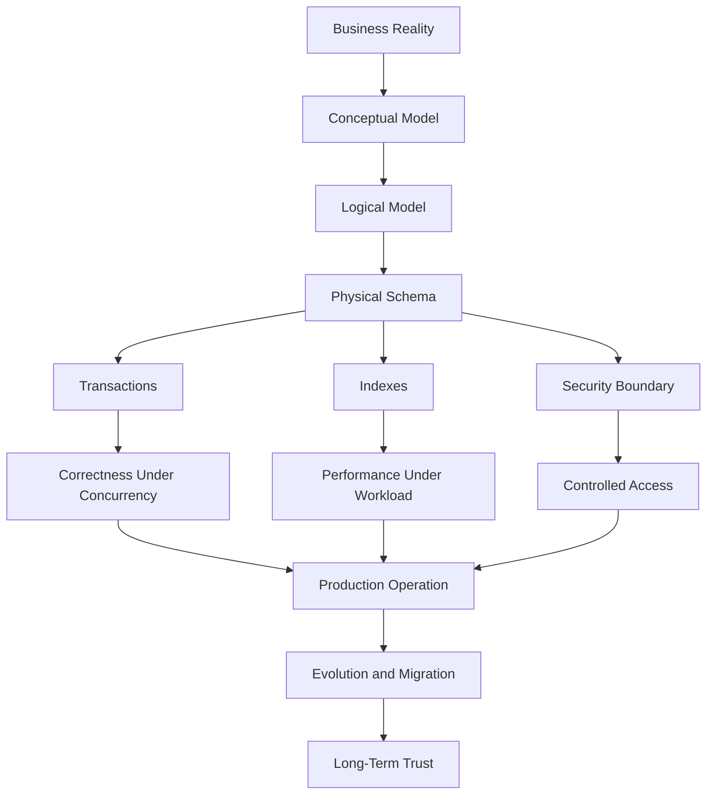
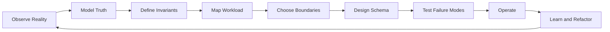

# Part 084 — Final Synthesis and Top 1% Playbook

> Goal bagian terakhir: menyatukan seluruh seri menjadi playbook kerja.
>
> Setelah 83 bagian, targetnya bukan lagi “tahu banyak pattern”. Targetnya adalah mampu mendesain, mengkritik, mengoperasikan, memigrasikan, dan mempertahankan database architecture dalam sistem produksi yang kompleks.

Ini adalah bagian terakhir seri **Learn Database Design and Architect**.

---

## 1. The Core Thesis

Database design bukan kegiatan membuat tabel.

Database design adalah proses menyusun:

```text
business truth
+ lifecycle
+ invariants
+ workload
+ consistency boundary
+ access boundary
+ evolution path
+ failure recovery
```

menjadi sistem yang bisa dipercaya.

Jika satu kalimat harus merangkum seluruh seri:

> A database is a durable, constrained, queryable, evolvable model of business truth under concurrency, failure, and change.

---

## 2. The Final Mental Model



Top engineer tidak melihat database sebagai satu layer di bawah aplikasi. Ia melihatnya sebagai **runtime for truth**.

---

## 3. Ten Mental Models That Matter Most

## 3.1 Source of Truth vs Projection

Selalu tanyakan:

```text
Is this table the truth, a cache, a projection, a snapshot, or an integration artifact?
```

Kesalahan besar muncul ketika projection dianggap truth.

Contoh:

| Data | Correct Role |
|---|---|
| `case_file` | Source of truth |
| `case_search_document` | Projection source |
| Search index | External projection |
| Dashboard aggregate | Derived metric |
| Exported PDF | Snapshot evidence |
| Cache entry | Performance artifact |

Rule:

> Every non-truth copy must have a rebuild path, freshness contract, and drift detection.

---

## 3.2 Invariants First

Schema bagus bukan schema yang “rapi”. Schema bagus adalah schema yang membuat state ilegal sulit masuk.

Tanyakan:

```text
What must never be false?
```

Contoh invariant:

- Satu case hanya boleh punya satu active primary investigator.
- Ledger journal harus balanced.
- Tenant user tidak boleh membaca tenant lain.
- Evidence custody event tidak boleh diedit.
- Effective-dated policy tidak boleh overlap.
- Idempotency key tidak boleh menghasilkan efek berbeda.

Mapping enforcement:

| Invariant Type | Prefer Enforcement |
|---|---|
| Existence | `NOT NULL`, FK |
| Uniqueness | Unique / partial unique index |
| Valid range | `CHECK` |
| Non-overlap period | Exclusion constraint / transactional guard |
| Cross-row business rule | Lock/serializable/materialized invariant row |
| Cross-system rule | Saga + reconciliation |
| Regulatory evidence | Append-only event + audit proof |

---

## 3.3 Grain Before Columns

Sebelum menambah kolom, jawab:

```text
One row represents exactly what?
```

Buruk:

```text
case_activity table contains task, note, decision, assignment, escalation, and email.
```

Lebih baik:

```text
case_task              one row per task
case_note              one row per authored note
case_decision          one row per decision
case_assignment        one row per assignment interval
case_escalation        one row per escalation event
case_communication     one row per communication artifact
```

Grain yang ambigu hampir selalu menghasilkan:

- nullable abuse;
- status soup;
- reporting ambiguity;
- impossible constraints;
- unpredictable query plans;
- painful migration.

---

## 3.4 Time Is a First-Class Dimension

Database architect harus membedakan:

| Time Type | Meaning |
|---|---|
| Event time | Kapan business event terjadi |
| Transaction time | Kapan database mencatatnya |
| Effective time | Kapan rule/fact berlaku |
| Processing time | Kapan pipeline memprosesnya |
| Report snapshot time | Kapan angka laporan dibekukan |

Kalau time tidak dimodelkan, sistem akan gagal saat:

- correction;
- audit;
- reporting;
- retroactive policy;
- SLA dispute;
- legal/regulatory inquiry.

Rule:

> Never hide temporal semantics in `updated_at`.

`updated_at` menjawab “row terakhir disentuh kapan”, bukan “fakta ini berlaku kapan”.

---

## 3.5 Workload Shapes Schema

Schema tidak bisa dinilai terpisah dari workload.

Untuk setiap desain, kumpulkan:

```text
Top write commands
Top read queries
Top reports
Cardinality
Selectivity
Data growth
Tenant skew
Freshness requirement
Latency target
Consistency requirement
```

Index tanpa workload hanyalah tebakan.

Database engine tanpa workload hanyalah preferensi.

---

## 3.6 Transaction Boundary Is Business Boundary

Setiap transaction harus punya jawaban:

```text
What invariant becomes true at commit?
```

Contoh:

```text
Assign case
- exactly one active primary assignment exists
- assignment event is recorded
- case current assignee is updated
- audit event is written
- outbox event is queued
```

Kalau operasi menyentuh external system, jangan campur aduk commit DB dan side effect. Gunakan outbox, idempotency, saga, atau reconciliation.

---

## 3.7 Denormalization Requires Ownership

Denormalization tidak salah. Denormalization tanpa owner salah.

Setiap derived field/table/index harus punya:

```text
source
owner
freshness
update mechanism
rebuild mechanism
drift detection
consumer contract
```

Kalau tidak, ia akan menjadi duplicate truth.

---

## 3.8 Migration Is a Product Feature

Schema akan berubah. Karena itu evolution path adalah bagian desain, bukan afterthought.

Default migration pattern:

```text
expand
→ deploy compatible code
→ backfill
→ validate
→ switch reads
→ stop old writes
→ contract
```

Zero-downtime database change bukan hanya “DDL tidak blocking”. Ia mencakup:

- compatibility;
- feature flags;
- backfill throttling;
- validation gates;
- rollback/roll-forward;
- observability;
- consumer communication.

---

## 3.9 Security Is a Data Shape Problem

Security bukan hanya middleware.

Security harus terlihat di:

- table ownership;
- tenant key;
- FK shape;
- RLS policy;
- grant model;
- audit event;
- export boundary;
- search projection;
- warehouse dimension;
- backup access;
- support tooling.

Rule:

> If access control depends on every developer remembering to add `WHERE tenant_id = ?`, the design is weak.

---

## 3.10 Operability Is Part of Correctness

A system that is correct only when nothing fails is not production-correct.

Database design harus menjawab:

- Bagaimana tahu query melambat?
- Bagaimana tahu replica stale?
- Bagaimana tahu projection drift?
- Bagaimana restore diuji?
- Bagaimana purge dibuktikan?
- Bagaimana migration dihentikan?
- Bagaimana incident ditriage?
- Bagaimana data corruption diperbaiki?

Correctness without recovery is fragile correctness.

---

# 4. The Top 1% Database Design Loop

Top 1% engineer tidak mengandalkan checklist saja. Ia punya loop berpikir.



Loop ini berulang sepanjang umur sistem.

---

## 5. Operating Principles

## Principle 1 — Make Illegal State Unrepresentable Where Possible

Jangan hanya validasi input. Bentuk schema agar state buruk tidak bisa disimpan.

```sql
alter table case_assignment
add constraint chk_assignment_interval
check (unassigned_at is null or unassigned_at >= assigned_at);

create unique index uq_one_active_primary_assignment
on case_assignment(case_id)
where role_code = 'PRIMARY' and unassigned_at is null;
```

Kalau invariant tidak bisa sepenuhnya DB-enforced, tulis alasannya dan buat detective control.

---

## Principle 2 — Prefer Explicit Lifecycle Over Boolean Flags

Buruk:

```text
is_active
is_deleted
is_pending
is_approved
is_rejected
is_escalated
```

Lebih baik:

```text
current_state
state_transition_history
state_transition_rule
state_transition_reason
```

Boolean flag sering gagal saat lifecycle tumbuh.

---

## Principle 3 — Every Important Event Needs a Durable Trace

Untuk sistem regulated, event penting tidak boleh hanya ada di log aplikasi.

Gunakan:

```text
business_event
state_transition
assignment_history
decision_record
evidence_custody_event
audit_event
outbox_event
```

Log aplikasi membantu observability. Audit table membantu accountability.

---

## Principle 4 — Treat Indexes as Contracts, Not Decorations

Setiap index harus menjawab:

- query apa yang dilayani;
- predicate apa;
- sort apa;
- selectivity apa;
- write cost apa;
- kapan index bisa dihapus.

Index yang tidak punya owner akan menjadi schema debt.

---

## Principle 5 — Do Not Let Reports Define Truth

Report harus mereferensikan truth, bukan menciptakan truth diam-diam.

Leadership dashboard harus punya:

- metric definition;
- grain;
- snapshot time;
- timezone;
- version;
- reconciliation path.

Kalau dua dashboard menghitung angka berbeda, masalahnya biasanya bukan BI tool. Masalahnya adalah semantic contract.

---

## Principle 6 — Choose Database Engine Last, Not First

Urutan yang benar:

```text
invariant
→ workload
→ consistency
→ lifecycle
→ query shape
→ scale shape
→ security/privacy
→ operations
→ engine
```

Jangan mulai dari “pakai Postgres atau Mongo?”. Mulai dari “apa truth dan invariant-nya?”.

---

## Principle 7 — Design for Backfill Before You Need It

Setiap sistem besar akan butuh backfill:

- field baru;
- projection baru;
- policy baru;
- retention correction;
- historical repair;
- analytics rebuild;
- search reindex.

Backfill yang matang punya:

```text
chunking
checkpoint
idempotency
throttling
validation
observability
stop/resume
rollback/repair
```

---

## Principle 8 — Prefer Rebuildable Projections

Search index, cache, read model, aggregate table, warehouse table harus rebuildable.

Kalau projection tidak bisa direbuild, ia diam-diam menjadi source of truth.

---

## Principle 9 — Never Hide Risk Behind Abstraction

ORM, repository, migration tool, CDC platform, atau managed database tidak menghapus risiko. Mereka hanya memindahkan bentuk risiko.

Contoh:

| Abstraction | Hidden Risk |
|---|---|
| ORM lazy loading | N+1 query, transaction leak |
| Repository | Query semantics tersembunyi |
| Managed DB | Failover behavior tetap harus dipahami |
| CDC platform | Ordering/replay/delete semantics tetap harus diuji |
| Migration tool | DDL lock tetap bisa terjadi |
| BI semantic layer | Metric definition tetap perlu governance |

---

## Principle 10 — Architecture Must Be Defensible

Keputusan database yang matang bisa dijelaskan sebagai:

```text
We chose A over B because invariant X and workload Y matter more than tradeoff Z.
We accept risk R and mitigate it with control C.
If assumption S changes, migration path M is available.
```

Bukan:

```text
Because best practice.
Because everyone uses it.
Because it is scalable.
```

---

# 6. The Final Database Architecture Checklist

Gunakan checklist ini setiap kali mendesain fitur/data platform besar.

## 6.1 Truth and Ownership

- [ ] Apa source of truth?
- [ ] Apa projection/copy/cache/search/warehouse?
- [ ] Siapa owner setiap data asset?
- [ ] Apa lifecycle owner?
- [ ] Apa correction path?
- [ ] Apa deletion/retention path?

## 6.2 Entity and Grain

- [ ] Satu row merepresentasikan apa?
- [ ] Apakah grain konsisten?
- [ ] Apakah ada entity yang tersembunyi sebagai nullable columns?
- [ ] Apakah relationship penting menjadi entity sendiri?
- [ ] Apakah history diperlukan?
- [ ] Apakah temporal validity diperlukan?

## 6.3 Invariants

- [ ] Apa state ilegal?
- [ ] Mana yang enforced by DB?
- [ ] Mana yang enforced by application?
- [ ] Mana yang monitored/reconciled?
- [ ] Apa invariant concurrency-sensitive?
- [ ] Apa invariant cross-system?

## 6.4 Schema

- [ ] Primary key tepat?
- [ ] Natural key/unique constraint tepat?
- [ ] FK lengkap?
- [ ] Nullable justified?
- [ ] Type sesuai semantic?
- [ ] Enum/status evolvable?
- [ ] JSON punya contract?
- [ ] Audit columns meaningful?

## 6.5 Transactions

- [ ] Apa commit boundary?
- [ ] Apa isolation requirement?
- [ ] Apa race condition?
- [ ] Perlu optimistic locking?
- [ ] Perlu pessimistic lock?
- [ ] Perlu idempotency key?
- [ ] Ada external side effect?
- [ ] Outbox diperlukan?

## 6.6 Query and Index

- [ ] Top query jelas?
- [ ] Predicate jelas?
- [ ] Sort jelas?
- [ ] Pagination benar?
- [ ] Index aligned?
- [ ] Write amplification diterima?
- [ ] Query plan diuji dengan data realistis?
- [ ] Statistik/skew dipahami?

## 6.7 Evolution

- [ ] Migration backward-compatible?
- [ ] Ada expand–migrate–contract?
- [ ] DDL lock risk dipahami?
- [ ] Backfill idempotent?
- [ ] Validation query tersedia?
- [ ] Cutover gate jelas?
- [ ] Rollback/roll-forward jelas?
- [ ] Consumer diberi contract?

## 6.8 Security and Privacy

- [ ] Tenant boundary jelas?
- [ ] Role/grant minimal?
- [ ] RLS perlu?
- [ ] Sensitive columns classified?
- [ ] Export/report/search boundary aman?
- [ ] Support access audited?
- [ ] Retention policy executable?
- [ ] Erasure propagation jelas?

## 6.9 Operations

- [ ] Dashboard ada?
- [ ] Slow query monitoring ada?
- [ ] Lock monitoring ada?
- [ ] Replica lag monitoring ada?
- [ ] Storage/WAL monitoring ada?
- [ ] Backup configured?
- [ ] Restore tested?
- [ ] Runbook tersedia?
- [ ] Capacity model ada?

## 6.10 Decision Record

- [ ] Alternatives dicatat?
- [ ] Tradeoff dicatat?
- [ ] Assumption dicatat?
- [ ] Risk dicatat?
- [ ] Revisit trigger dicatat?
- [ ] Owner dicatat?

---

# 7. Production Architecture Review Template

Gunakan template pendek ini saat review.

```md
# Database Architecture Review

## 1. Decision Summary
What are we deciding?

## 2. Context
What business process, data, workload, and constraints shape this decision?

## 3. Source of Truth
Which data is canonical? Which data is derived?

## 4. Critical Invariants
What must never be false?

## 5. Workload
Top writes, reads, reports, growth, latency, consistency.

## 6. Proposed Design
Conceptual/logical/physical design.

## 7. Transaction and Concurrency
Commit boundary, locks, isolation, idempotency, retry.

## 8. Index and Query Plan
Expected query plans and index ownership.

## 9. Security and Privacy
Tenant, role, PII, RLS, export, audit, retention.

## 10. Migration and Evolution
Expand/migrate/contract, backfill, validation, rollback.

## 11. Operations
Monitoring, backup, restore, capacity, runbook.

## 12. Failure Modes
What can fail? How do we detect, contain, recover, and prove recovery?

## 13. Alternatives Considered
Why not other designs?

## 14. Decision
Accepted design and conditions.

## 15. Revisit Triggers
When should we reconsider?
```

---

# 8. Database Architect Decision Matrix

Gunakan matrix ini untuk memilih engine/topology.

| Requirement | Relational OLTP | Distributed SQL | Document | Wide-Column | Key-Value | Graph | Search | Warehouse/Lakehouse |
|---|---:|---:|---:|---:|---:|---:|---:|---:|
| Strong relational integrity | High | High | Medium | Low | Low | Medium | Low | Medium |
| Complex transactions | High | Medium/High | Medium | Low | Low | Low | Low | Low |
| Global scale with SQL | Medium | High | Medium | Medium | Medium | Low | Medium | Medium |
| Flexible document aggregate | Medium | Medium | High | Medium | Medium | Low | Medium | Low |
| Write-heavy append/log | Medium | Medium | Medium | High | High | Medium | Medium | High |
| Relationship traversal | Medium | Medium | Low | Low | Low | High | Low | Low |
| Full-text relevance search | Low/Medium | Low/Medium | Medium | Low | Low | Low | High | Low |
| Analytical aggregation | Medium | Medium | Medium | Medium | Low | Low | Low | High |
| Operational simplicity | High | Medium | Medium | Medium | High | Medium | Medium | Medium |
| Strict audit/regulatory trace | High | High | Medium | Medium | Medium | Medium | Low/Medium | Medium/High |

Rule:

> Choose the smallest set of databases that can satisfy truth, workload, and operational constraints without creating duplicate authority.

---

# 9. Common Failure Patterns and Their Root Causes

| Symptom | Shallow Fix | Real Root Cause |
|---|---|---|
| Query slow | Add index | Query shape/index/workload not designed together |
| Report numbers differ | Fix dashboard | Metric contract absent |
| Duplicate transaction | Add retry | Idempotency not designed |
| Cross-tenant leak | Patch API | Tenant boundary not enforced in data model |
| Migration outage | Run during off-hours | No expand–migrate–contract discipline |
| Search stale | Reindex | Projection freshness/rebuild contract absent |
| Deadlock storm | Retry more | Lock order/transaction scope broken |
| Ledger mismatch | Adjust balance | Immutable journal/reconciliation absent |
| Audit incomplete | Add logs | Business event not persisted transactionally |
| Restore failed | Fix backup script | Restore was never treated as product capability |

---

# 10. How to Think Under Pressure

Saat incident atau design review panas, gunakan urutan ini.

## 10.1 During Incident

```text
1. Protect data correctness.
2. Stop blast radius growth.
3. Restore minimum service.
4. Preserve evidence.
5. Diagnose root cause.
6. Repair data if needed.
7. Add preventive/detective control.
```

Jangan mulai dari “buat cepat normal” kalau itu memperburuk data corruption.

## 10.2 During Architecture Debate

```text
1. State the invariant.
2. State the workload.
3. State the failure mode.
4. Compare alternatives.
5. Choose based on explicit tradeoff.
6. Record assumption and revisit trigger.
```

Kalau debate berubah jadi preferensi teknologi, kembalikan ke invariant dan workload.

---

# 11. Database Maturity Model

## Level 0 — Ad Hoc

- Schema dibuat cepat.
- Constraint minim.
- Index reaktif.
- Migration manual.
- Backup diasumsikan.
- Tidak ada ownership data.

## Level 1 — Basic Discipline

- PK/FK/unique mulai dipakai.
- Migration tool dipakai.
- Query lambat dimonitor.
- Backup ada.
- Beberapa design review dilakukan.

## Level 2 — Production-Aware

- Workload-first index.
- Expand–migrate–contract.
- Transaction boundary eksplisit.
- Observability dashboard.
- Restore drill.
- Security/privacy review.

## Level 3 — Architecture-Grade

- Invariant catalog.
- Data authority map.
- ADR untuk keputusan besar.
- Backfill platform.
- Runbook incident.
- Capacity model.
- Tenant/security guardrails.

## Level 4 — Organization-Scale Excellence

- Schema review standard lintas tim.
- Automated migration checks.
- Data contract registry.
- Architecture council ringan.
- Production readiness gate.
- Post-incident learning loop.
- Reusable templates/playbooks.

Target top engineer: minimal Level 3 dalam timnya, dan mendorong organisasi ke Level 4.

---

# 12. 30/60/90-Day Mastery Plan

## First 30 Days — Sharpen Foundations

- Review 3 schema produksi.
- Tulis data authority map.
- Identifikasi 20 invariant penting.
- Baca 10 query plan nyata.
- Audit 10 index: owner, query, cost.
- Jalankan restore drill kecil.
- Dokumentasikan 5 design smells.

Deliverable:

```text
Database Health and Risk Memo v1
```

## Days 31–60 — Improve Production Discipline

- Buat schema review checklist tim.
- Tambahkan migration safety checklist.
- Buat dashboard DB basic: slow query, locks, connections, storage, WAL/replication.
- Refactor satu bad query path.
- Buat runbook lock storm.
- Buat ADR untuk satu keputusan database penting.
- Tambahkan idempotency pada satu write path kritikal.

Deliverable:

```text
Database Engineering Playbook v1
```

## Days 61–90 — Build Architecture Capability

- Jalankan architecture review untuk fitur besar.
- Buat invariant catalog untuk domain utama.
- Buat data lifecycle/retention map.
- Buat backfill/reconciliation framework kecil.
- Simulasikan migration zero-downtime.
- Jalankan incident drill.
- Presentasikan maturity roadmap ke tim.

Deliverable:

```text
Database Architecture Maturity Roadmap
```

---

# 13. What To Practice Forever

Database mastery tidak selesai setelah satu seri. Latihan permanen:

1. Baca execution plan dari query produksi.
2. Baca migration script sebelum deploy.
3. Tulis invariant sebelum schema.
4. Cari duplicate truth.
5. Tanyakan rebuild path untuk setiap projection.
6. Jalankan restore drill.
7. Simulasikan concurrency race.
8. Review access control di report/search/export.
9. Tulis ADR untuk keputusan irreversible.
10. Belajar dari incident nyata.

---

# 14. The Architect's Database Design Kata

Gunakan kata ini setiap kali menghadapi domain baru.

```text
1. Name the truth.
2. Name the actors.
3. Name the lifecycle.
4. Name the illegal states.
5. Name the writes.
6. Name the reads.
7. Name the history.
8. Name the boundaries.
9. Name the failures.
10. Name the evolution path.
```

Kalau kamu tidak bisa menamai sesuatu, kamu belum benar-benar memodelkannya.

---

# 15. Final Example: Mini ADR

```md
# ADR: Use Append-Only Case State Transition Table

## Status
Accepted

## Context
The case management system must support audit, correction, SLA measurement,
and reconstruction of case state at a historical point in time.
A single mutable `case.status` column is insufficient because it loses transition
history and cannot explain why or by whom a state changed.

## Decision
We will store current state in `case_file.current_state` for fast operational reads
and store every legal transition in `case_state_transition` as append-only history.
State changes must occur through a transactional function/service path that:

1. verifies the current state;
2. verifies transition rule;
3. inserts transition event;
4. updates current state;
5. writes audit event;
6. writes outbox event.

## Consequences
Positive:
- Fast current-state reads.
- Durable transition history.
- Easier SLA and audit reconstruction.
- Illegal transitions can be detected.

Negative:
- Write path is more complex.
- Backfill from legacy status may be approximate.
- State machine versioning must be governed.

## Alternatives Considered
1. Only mutable status column: rejected due to audit loss.
2. Only event table without current state: rejected due to operational query cost.
3. Workflow engine as sole source of truth: rejected because regulatory audit requires durable domain-level state in database.

## Revisit Triggers
- State transition volume exceeds capacity envelope.
- Workflow engine becomes canonical source of truth.
- Regulatory requirement changes historical reconstruction semantics.
```

---

# 16. Final Anti-Patterns to Avoid

- Starting with technology instead of truth.
- Using status column as workflow engine.
- Treating JSON as escape hatch from modelling.
- Treating cache/search/report as source of truth.
- Adding index without query contract.
- Running migration without rollback/validation.
- Assuming retry is safe without idempotency.
- Assuming backup means restore works.
- Assuming tenant filter in code is enough.
- Assuming audit log equals regulatory evidence.
- Assuming distributed database removes distributed systems tradeoff.
- Assuming managed service removes architecture responsibility.

---

# 17. Final Self-Assessment

You are operating near top-tier database architecture level if you can confidently do these:

- Explain why a schema is correct, not only why it works.
- Find illegal states before they happen.
- Predict concurrency anomalies from write flows.
- Read execution plans and connect them to schema/index choices.
- Design zero-downtime migrations.
- Separate source of truth from projections.
- Build data lifecycle and retention model.
- Design audit/evidence trail for regulated workflows.
- Choose database engines using explicit tradeoffs.
- Defend architecture decisions with context and consequences.
- Run incident triage without corrupting data.
- Teach other engineers how to review database designs.

---

# 18. The Final Playbook in One Page

```text
For every database design:

1. Define the source of truth.
2. Define the entity grain.
3. Define lifecycle and time semantics.
4. Define invariants and illegal states.
5. Decide enforcement layer for each invariant.
6. List write commands and transaction boundaries.
7. List read queries and index strategy.
8. Separate canonical store from projections.
9. Define consistency and freshness contracts.
10. Design security/privacy/tenant boundaries.
11. Design migration and backfill path.
12. Design observability and runbooks.
13. Prove backup/restore/recovery.
14. Model failure modes and blast radius.
15. Record the decision and revisit triggers.
```

---

# 19. Penutup

Database architecture adalah disiplin tentang **truth under change**.

Aplikasi berubah. Traffic berubah. Regulasi berubah. Tim berubah. Query berubah. Data tumbuh. Incidents terjadi. Migration gagal. Consumer bertambah. Report diperdebatkan. Tenant besar muncul. Audit datang belakangan.

Desain database yang baik tidak hanya melayani kebutuhan hari ini. Ia memberi sistem kemampuan untuk tetap benar, dapat dijelaskan, dapat diperbaiki, dan dapat berkembang saat realitas berubah.

Kalau ada satu kebiasaan yang harus dibawa setelah seri ini:

> Jangan pernah review database dari bentuk tabel dulu. Review dari truth, invariant, workload, and failure.

---

# Series Completion

Seri **Learn Database Design and Architect** selesai di **Part 084**.

Kamu sudah melewati seluruh arc:

```text
mental model
→ modelling
→ invariants
→ relational design
→ time/audit/lifecycle
→ storage/index/query planner
→ transactions/concurrency
→ durability/recovery
→ replication/sharding/distribution
→ non-relational models
→ integration/contracts/CDC
→ operations/performance/security/privacy
→ analytics/reporting
→ review/checklists/case studies
→ decision framework/leadership/drills
→ final playbook
```

Langkah berikutnya bukan menambah teori acak. Langkah berikutnya adalah memilih satu sistem nyata, menjalankan review dengan checklist ini, menemukan risiko, dan memperbaiki desainnya secara bertahap.
