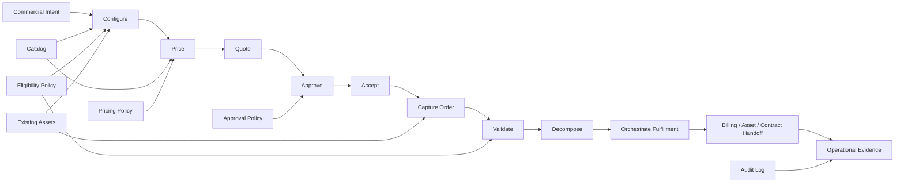
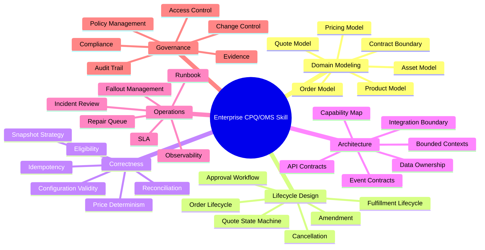
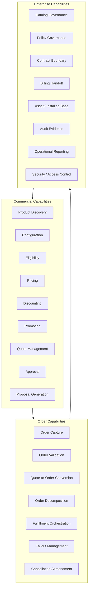
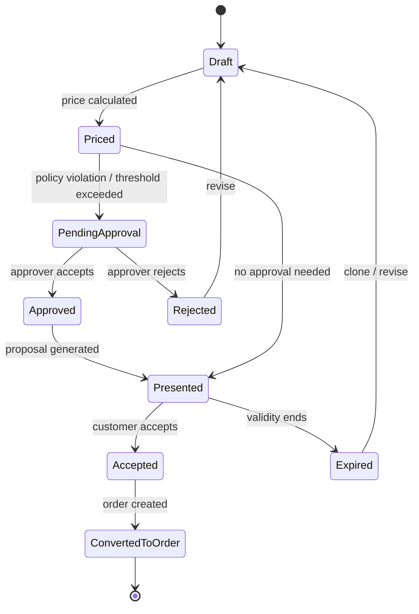

# Part 001 — Kaufman Skill Map

## 1. Tujuan Part Ini

Part ini adalah fondasi seri.

Kita belum masuk ke product catalog, pricing, quote lifecycle, order decomposition, atau fulfillment orchestration. Kita mulai dari **cara belajar dan cara berpikir** agar materi berikutnya tidak berubah menjadi kumpulan istilah, template architecture, atau diagram yang terlihat enterprise tetapi rapuh ketika dipakai di real system.

Target part ini:

1. Menentukan **target performa** untuk engineer yang mampu merancang CPQ/OMS enterprise-grade.
2. Memecah skill CPQ/OMS menjadi sub-skill yang bisa dilatih.
3. Membuat mental model CPQ/OMS sebagai **commercial operating system** perusahaan.
4. Menentukan artifact yang harus bisa dibuat oleh engineer level senior/staff/principal.
5. Menyiapkan feedback loop agar setiap part berikutnya tidak hanya dibaca, tetapi dipakai untuk membangun kemampuan desain.

Referensi dasar metode belajar berasal dari pendekatan Josh Kaufman dalam *The First 20 Hours*: tetapkan target performa, pecah skill menjadi sub-skill, belajar secukupnya untuk mulai praktik, hilangkan hambatan praktik, lalu lakukan practice loop terarah minimal 20 jam. Ringkasan prinsip ini juga dijelaskan dalam artikel WIRED tentang metode Kaufman: fokus pada satu skill, pecah menjadi sub-skill kecil, riset secukupnya, kurangi friction, dan commit pada latihan terarah.

> Penting: 20 jam di sini bukan berarti menjadi master CPQ/OMS dalam 20 jam. Untuk domain enterprise seperti ini, 20 jam adalah **first competence loop**: cukup untuk mulai melihat struktur, mendeteksi desain buruk, dan menghasilkan draft architecture yang bisa dikritik.

---

## 2. Skill yang Sebenarnya Kita Pelajari

Judul seri ini adalah CPQ dan Order Management Platform. Namun skill sebenarnya bukan “tahu CPQ”. Skill sebenarnya adalah:

> Mampu mendesain, mengevaluasi, mengoperasikan, dan memperbaiki platform enterprise yang mengubah intent komersial menjadi order yang valid, executable, auditable, dan recoverable.

CPQ/OMS adalah persimpangan antara:

- sales process,
- product model,
- pricing policy,
- legal/commercial commitment,
- order capture,
- fulfillment orchestration,
- billing handoff,
- integration architecture,
- auditability,
- operational recovery,
- and business governance.

Engineer top-tier tidak hanya bertanya:

> “Pakai workflow engine apa?”

Engineer top-tier bertanya:

> “Apa invariant yang tidak boleh dilanggar ketika quote disetujui, order dibuat, fulfillment sebagian gagal, harga berubah, catalog versi baru publish, customer amend subscription, dan billing sudah mulai berjalan?”

Itulah level berpikir yang akan kita bangun.

---

## 3. CPQ/OMS sebagai Commercial Operating System

Mental model utama:

> CPQ/OMS adalah operating system untuk menjalankan commercial intent secara terkontrol.

Commercial intent adalah keinginan bisnis seperti:

- sales ingin menjual kombinasi produk tertentu,
- customer ingin upgrade layanan,
- account manager ingin memberi diskon,
- partner ingin submit order dari channel eksternal,
- finance ingin margin tetap aman,
- legal ingin terms sesuai policy,
- operations ingin fulfillment bisa dieksekusi,
- regulator/auditor ingin keputusan bisa ditelusuri.

CPQ/OMS harus mengubah intent itu menjadi artifact yang stabil:

1. **Configured Offer** — apa yang dibeli customer.
2. **Priced Quote** — berapa harga dan diskon yang disetujui.
3. **Accepted Commercial Commitment** — apa yang customer dan company sepakati.
4. **Valid Product Order** — apa yang harus dipenuhi.
5. **Decomposed Fulfillment Plan** — apa yang harus dilakukan downstream.
6. **Operational Evidence** — apa yang terjadi, kapan, oleh siapa, dan atas dasar policy apa.

Diagram mental model:

Kunci dari diagram ini: CPQ/OMS bukan satu screen dan bukan satu service. Ia adalah rantai keputusan dan eksekusi yang harus mempertahankan correctness di banyak boundary.

---

## 4. Target Performa

Target performa seri ini bukan “bisa menjelaskan CPQ”. Targetnya lebih konkret.

Setelah menyelesaikan seri ini, kamu harus mampu melakukan hal berikut.

### 4.1 Mendesain Domain Boundary

Kamu harus bisa menjawab:

- Apa bedanya product offering, product specification, SKU, bundle, asset, subscription, dan order line?
- Apa yang dimiliki CPQ, apa yang dimiliki OMS, apa yang dimiliki billing, dan apa yang dimiliki ERP?
- Kapan quote harus immutable?
- Kapan price boleh dihitung ulang?
- Kapan order harus mengambil snapshot dari quote?
- Kapan order boleh divalidasi ulang terhadap catalog terbaru?
- Siapa source of truth untuk customer, account, contract, asset, entitlement, dan invoice?

### 4.2 Mendesain Lifecycle dan State Machine

Kamu harus bisa membuat state machine untuk:

- quote lifecycle,
- quote revision,
- approval workflow,
- order lifecycle,
- fulfillment task,
- fallout handling,
- cancellation,
- amendment,
- asset lifecycle.

State machine yang baik harus punya:

- state yang jelas,
- transition yang valid,
- actor/trigger,
- invariant,
- audit event,
- retry semantics,
- compensation path,
- terminal state,
- dan operational ownership.

### 4.3 Mendesain Correctness Model

Kamu harus mampu mendefinisikan:

- price correctness,
- configuration correctness,
- eligibility correctness,
- quote validity correctness,
- order validity correctness,
- fulfillment consistency,
- billing handoff correctness,
- audit correctness,
- idempotency correctness.

Enterprise CPQ/OMS gagal bukan hanya karena service down. Ia gagal ketika sistem menghasilkan keputusan yang tampak valid tetapi secara bisnis salah.

Contoh:

- Diskon melebihi policy tetapi tidak masuk approval.
- Quote accepted menggunakan price lama setelah price book berubah.
- Order dibuat dua kali karena retry dari channel partner.
- Product sudah tidak orderable tetapi masih muncul di configurator cache.
- Fulfillment sukses sebagian tetapi billing mulai penuh.
- Asset customer tidak sesuai dengan subscription aktif.

### 4.4 Mendesain Recovery dan Operations

Kamu harus bisa menjawab:

- Apa yang terjadi jika downstream provisioning timeout?
- Bagaimana membedakan retry aman vs retry berbahaya?
- Apa yang harus masuk repair queue?
- Siapa yang boleh mengubah order yang stuck?
- Apa evidence bahwa data correction aman?
- Bagaimana rekonsiliasi order, asset, billing, dan fulfillment?
- Bagaimana mencegah stuck order menjadi silent revenue leakage?

### 4.5 Melakukan Architecture Review

Kamu harus bisa membaca desain CPQ/OMS dan menemukan risiko seperti:

- data ownership kabur,
- quote mutable setelah accepted,
- order line tidak punya action semantics,
- pricing engine tidak explainable,
- approval logic hardcoded di UI,
- catalog publish tanpa effective dating,
- order orchestration tidak idempotent,
- event tidak punya correlation/causation,
- retry tanpa deduplication,
- audit log tidak cukup untuk dispute.

---

## 5. Deconstructing the Skill

Menurut Kaufman, skill besar harus dipecah menjadi sub-skill yang bisa dilatih. Untuk CPQ/OMS, decomposition-nya seperti ini.

Kita tidak akan mempelajari semua ini secara acak. Urutan seri mengikuti dependency alami:

1. Pahami boundary.
2. Modelkan product dan catalog.
3. Modelkan pricing.
4. Modelkan quote.
5. Modelkan order.
6. Modelkan integration dan consistency.
7. Modelkan scale, reliability, security, testing, dan governance.
8. Tutup dengan capstone design.

---

## 6. Capability Map yang Harus Kamu Kuasai

Capability map adalah peta kemampuan platform. Ini bukan org chart dan bukan deployment diagram.

Capability map menjawab:

> Kemampuan bisnis apa yang harus dimiliki platform agar quote-to-order berjalan benar?

Sebagai engineer, kamu harus mampu menjelaskan:

- capability mana yang synchronous,
- capability mana yang asynchronous,
- mana yang menjadi source of truth,
- mana yang hanya decision engine,
- mana yang boleh cache,
- mana yang harus versioned,
- mana yang butuh audit immutability,
- dan mana yang harus punya human override.

---

## 7. First 20 Hours Practice Loop untuk Seri Ini

Kita adaptasi metode Kaufman menjadi practice loop CPQ/OMS.

### 7.1 Hour 0–2: Build the Map

Output:

- glossary pribadi,
- capability map,
- boundary diagram,
- daftar entity utama,
- daftar lifecycle utama.

Latihan:

- Ambil satu skenario: “customer membeli bundle internet + device + support plan”.
- Gambar alur dari product discovery sampai billing handoff.
- Tandai setiap keputusan: configure, price, approve, order, fulfill, bill.

### 7.2 Hour 3–5: Model Product and Quote

Output:

- product model sederhana,
- quote model,
- quote state machine,
- price snapshot rule.

Latihan:

- Buat quote dengan 3 line item.
- Tambahkan discount dan approval threshold.
- Tentukan kapan quote menjadi immutable.
- Tentukan apa yang terjadi saat price book berubah sebelum acceptance.

### 7.3 Hour 6–8: Model Order and Fulfillment

Output:

- order model,
- order line action semantics,
- order lifecycle,
- fulfillment task graph.

Latihan:

- Convert quote menjadi order.
- Pecah satu commercial line menjadi beberapa fulfillment task.
- Simulasikan satu task gagal.
- Tentukan retry, compensation, atau manual repair.

### 7.4 Hour 9–12: Model Integration and Consistency

Output:

- API boundary,
- event map,
- idempotency key strategy,
- source-of-truth matrix,
- saga outline.

Latihan:

- Buat event `QuoteAccepted`, `OrderSubmitted`, `OrderValidated`, `FulfillmentTaskFailed`.
- Tambahkan correlation ID dan causation ID.
- Tentukan consumer yang boleh mengambil action dari event tersebut.

### 7.5 Hour 13–16: Model Failure and Recovery

Output:

- failure mode table,
- recovery policy,
- repair queue design,
- reconciliation process.

Latihan:

- Simulasikan duplicate order submission.
- Simulasikan catalog mismatch antara CPQ dan OMS.
- Simulasikan billing menerima order sebelum fulfillment selesai.
- Tentukan invariant yang mencegah kerusakan permanen.

### 7.6 Hour 17–20: Architecture Review

Output:

- architecture decision record,
- review checklist,
- risk register,
- capstone draft.

Latihan:

- Review desain sendiri.
- Tulis 10 failure mode.
- Tulis 10 invariant.
- Tulis 10 pertanyaan review untuk engineer lain.

---

## 8. Artifact yang Harus Bisa Kamu Hasilkan

Seri ini akan dianggap berhasil jika kamu bisa menghasilkan artifact berikut.

### 8.1 Capability Map

Contoh artifact:

- commercial capability map,
- order capability map,
- integration capability map,
- operational capability map.

Kualitas baik:

- capability tidak terlalu teknis,
- tidak dicampur dengan nama service,
- jelas ownership-nya,
- jelas dependency-nya.

Kualitas buruk:

- capability map berisi nama microservice saja,
- semua capability disebut “management”,
- tidak ada boundary antara CPQ, OMS, billing, dan ERP,
- tidak menunjukkan decision ownership.

### 8.2 Domain Model

Domain model harus menjawab:

- entity apa saja,
- value object apa saja,
- aggregate boundary apa saja,
- lifecycle apa saja,
- reference vs snapshot apa saja,
- invariant apa saja.

Minimal entity yang harus bisa kamu jelaskan:

- Product Offering,
- Product Specification,
- Price Book,
- Price Rule,
- Promotion,
- Quote,
- Quote Line,
- Approval Request,
- Contract,
- Product Order,
- Order Line,
- Fulfillment Task,
- Customer Asset,
- Subscription,
- Billing Account,
- Invoice Reference.

### 8.3 State Machine

State machine wajib untuk domain yang punya lifecycle non-trivial.

Contoh state machine quote:

State machine buruk biasanya memiliki gejala:

- terlalu banyak state teknis,
- tidak ada terminal state,
- transition tidak punya actor,
- state digunakan sebagai pengganti audit log,
- tidak jelas mana business state dan processing state,
- state bisa mundur tanpa alasan domain.

### 8.4 Invariant Catalog

Invariant adalah aturan yang tidak boleh dilanggar.

Contoh invariant:

- Accepted quote tidak boleh berubah secara substansial.
- Order harus punya snapshot commercial commitment yang cukup untuk audit.
- Order submit harus idempotent terhadap external reference.
- Fulfillment task tidak boleh membuat asset aktif dua kali untuk order line yang sama.
- Approval decision harus menyimpan policy basis, approver, timestamp, dan scope.
- Price calculation harus reproducible untuk quote version yang sama.
- Catalog publish tidak boleh mengubah quote yang sudah accepted.

Invariant catalog adalah artifact penting karena di enterprise system, risiko terbesar sering muncul dari perubahan kecil yang tampak aman tetapi merusak invariant.

### 8.5 Source-of-Truth Matrix

Contoh format:

| Data | Source of Truth | Consumers | Mutable? | Notes |
|---|---|---|---|---|
| Product Offering | Catalog | CPQ, OMS, Commerce | Versioned | Effective dated |
| Calculated Quote Price | CPQ/Pricing | Quote, Approval, Proposal | Frozen per quote version | Must be explainable |
| Accepted Quote | CPQ | OMS, Contract, Audit | Immutable except metadata | Converts to order |
| Product Order | OMS | Fulfillment, Billing, Support | Lifecycle mutable | Commercial snapshot frozen |
| Customer Asset | Asset/Subscription System | CPQ, OMS, Billing | Mutable by lifecycle | Must reconcile with fulfillment |

Kamu harus terbiasa membuat matrix seperti ini sebelum bicara database table atau microservice.

### 8.6 Failure Mode Table

Contoh format:

| Failure | Cause | Impact | Detection | Recovery | Invariant |
|---|---|---|---|---|---|
| Duplicate order | Channel retry without idempotency | Double fulfillment / double billing | Duplicate external reference | Deduplicate or cancel duplicate | Same accepted quote cannot create two active orders unless explicitly allowed |
| Stale price | Price book changed after quote | Margin leakage / customer dispute | Price version mismatch | Reprice or honor frozen price based on policy | Quote price must reference price version |
| Catalog mismatch | OMS uses newer catalog than CPQ | Invalid decomposition | Catalog version mismatch | Use quote snapshot or reject conversion | Order must be executable from accepted quote snapshot |

---

## 9. Competence Rubric

Gunakan rubric ini untuk menilai perkembanganmu.

### Level 0 — Tool User

Ciri:

- tahu nama CPQ vendor,
- bisa membuat quote sederhana,
- paham flow configure-price-quote secara surface,
- belum paham boundary dan invariant.

Risiko:

- menganggap CPQ sebagai UI sales saja,
- menganggap OMS sebagai CRUD order,
- mengabaikan pricing correctness dan audit.

### Level 1 — Feature Engineer

Ciri:

- bisa implement fitur quote line, discount, approval sederhana,
- bisa consume catalog API,
- bisa membuat order dari quote,
- mulai paham state.

Risiko:

- logic tersebar di UI/API/database trigger,
- order conversion terlalu procedural,
- tidak ada snapshot strategy.

### Level 2 — Domain Engineer

Ciri:

- bisa menjelaskan entity dan lifecycle,
- bisa membuat state machine,
- bisa membedakan quote vs order vs contract vs subscription,
- bisa menulis invariant.

Risiko:

- domain model bagus tetapi integration dan ops belum matang.

### Level 3 — Platform Engineer

Ciri:

- bisa mendesain bounded context,
- bisa mendesain API/event contract,
- bisa menentukan source of truth,
- bisa membuat idempotency dan saga strategy,
- bisa mendesain read model untuk operations.

Risiko:

- terlalu fokus technical elegance, kurang business governance.

### Level 4 — Staff/Principal-Level Architect

Ciri:

- bisa menyeimbangkan domain correctness, scale, governance, ops, dan business change,
- bisa menemukan failure mode sebelum produksi,
- bisa memberi trade-off jelas,
- bisa membuat architecture decision record yang defensible,
- bisa memimpin review lintas sales, finance, legal, ops, dan engineering.

Risiko:

- underestimating organizational complexity.

### Level 5 — Enterprise Systems Strategist

Ciri:

- bisa melihat CPQ/OMS sebagai commercial operating model,
- bisa merancang evolusi multi-year,
- bisa mengurangi complexity cost,
- bisa menentukan governance model,
- bisa menghubungkan platform design dengan revenue leakage, customer experience, operational cost, dan audit risk.

Ini target aspiratif seri ini.

---

## 10. Core Invariants yang Akan Berulang Sepanjang Seri

Berikut invariant yang akan terus muncul.

### 10.1 Commercial Commitment Must Be Reconstructable

Untuk setiap accepted quote atau submitted order, sistem harus bisa menjawab:

- customer membeli apa,
- harga berapa,
- diskon apa,
- policy apa,
- siapa yang approve,
- versi catalog mana,
- versi price mana,
- terms mana,
- kapan disetujui,
- dari channel mana,
- dan apa yang dikirim ke downstream.

Jika tidak bisa direkonstruksi, sistem tidak enterprise-grade.

### 10.2 Quote and Order Are Related but Not the Same

Quote adalah commercial proposal. Order adalah execution request.

Quote bisa berisi opsi, revisi, approval, proposal document, dan validity. Order harus executable, validated, decomposable, and orchestratable.

Kesalahan umum: memperlakukan quote line sama dengan order line. Ini sering gagal saat:

- satu quote line menjadi banyak fulfillment task,
- satu order line punya action add/change/remove,
- satu quote bundle butuh technical decomposition,
- satu commercial product membutuhkan provisioning di banyak downstream.

### 10.3 Snapshot Strategy Is Not Optional

Enterprise CPQ/OMS harus jelas tentang:

- data mana yang disnapshot,
- data mana yang direferensikan,
- data mana yang dihitung ulang,
- data mana yang immutable,
- data mana yang boleh berubah karena lifecycle.

Tanpa snapshot strategy, audit dan recovery akan rapuh.

### 10.4 Pricing Must Be Explainable

Pricing engine bukan hanya harus menghasilkan angka. Ia harus menjelaskan:

- input apa,
- rule apa,
- urutan rule apa,
- discount apa,
- rounding apa,
- price version apa,
- override apa,
- approval reason apa.

Jika sales, finance, audit, atau customer success tidak bisa memahami mengapa harga muncul, sistem akan sulit dipercaya.

### 10.5 Fulfillment Is Not Just Status Update

Fulfillment adalah proses eksekusi yang melibatkan dependency, retry, partial success, external failure, compensation, dan manual repair.

Status `FAILED` saja tidak cukup. Kita butuh:

- failure reason,
- retryability,
- owner,
- SLA,
- blocking dependency,
- impact to billing,
- impact to asset,
- recovery action,
- audit trail.

---

## 11. Latihan Praktis Part 001

Gunakan satu domain contoh untuk semua latihan awal:

> Enterprise software company menjual paket “Enterprise Compliance Platform” yang terdiri dari base subscription, user seats, premium support, implementation package, optional data retention add-on, dan regional compliance module.

### Exercise 1 — Capability Map

Buat capability map minimal berisi:

- product catalog,
- configurator,
- eligibility,
- pricing,
- promotion,
- quote,
- approval,
- proposal,
- contract,
- order capture,
- order validation,
- decomposition,
- fulfillment,
- billing handoff,
- asset/subscription,
- audit.

Pertanyaan review:

1. Capability mana yang menghasilkan keputusan?
2. Capability mana yang hanya menyimpan artifact?
3. Capability mana yang harus versioned?
4. Capability mana yang harus auditable?
5. Capability mana yang harus support human override?

### Exercise 2 — Invariant Catalog

Tulis minimal 15 invariant.

Contoh:

- Quote accepted harus menunjuk ke exact quote version.
- Discount di atas threshold harus punya approval record.
- Order tidak boleh dibuat dari expired quote kecuali policy mengizinkan explicit override.
- Order line harus punya action semantics.
- Billing handoff tidak boleh dilakukan untuk fulfillment state yang belum memenuhi billing trigger policy.

### Exercise 3 — Failure Mode Discovery

Tulis minimal 10 failure mode.

Contoh:

- duplicate submit,
- stale catalog,
- stale price,
- approval bypass,
- proposal mismatch,
- order decomposition failure,
- downstream timeout,
- fulfillment partial success,
- billing starts too early,
- asset not updated.

Untuk setiap failure, tulis:

- cause,
- impact,
- detection,
- recovery,
- invariant.

### Exercise 4 — Boundary Sketch

Gambar boundary awal antara:

- CRM,
- CPQ,
- CLM,
- OMS,
- Fulfillment,
- Billing,
- ERP,
- Data Warehouse,
- Support Operations.

Jangan masuk detail teknologi. Fokus pada ownership dan handoff.

---

## 12. Common Wrong Assumptions

### Assumption 1 — “CPQ selesai ketika quote PDF generated”

Salah. Quote PDF hanya salah satu artifact. CPQ enterprise harus menjaga konfigurasi, harga, diskon, approval, legal clause, validity, and conversion readiness.

### Assumption 2 — “OMS hanya menerima order dan update status”

Salah. OMS enterprise harus melakukan validation, decomposition, orchestration, fallout management, mutation handling, cancellation, reconciliation, and billing/asset coordination.

### Assumption 3 — “Catalog hanya daftar produk”

Salah. Catalog enterprise adalah governed commercial model: offering, specification, option, compatibility, lifecycle, effective date, market, channel, price relation, and publishing workflow.

### Assumption 4 — “Harga bisa dihitung ulang kapan saja”

Berbahaya. Harga boleh dihitung ulang hanya jika lifecycle dan policy mengizinkan. Accepted quote biasanya harus mempertahankan commercial commitment yang bisa diaudit.

### Assumption 5 — “Approval bisa hardcoded berdasarkan discount percent”

Tidak cukup. Approval enterprise bisa bergantung pada margin, customer segment, product family, contract term, region, sales role, channel, legal entity, promotion, non-standard clause, and exception history.

### Assumption 6 — “Event berarti integrasi sudah loosely coupled”

Tidak selalu. Event tanpa ownership, idempotency, schema evolution, correlation, and replay policy hanya memindahkan coupling dari API ke event stream.

---

## 13. Review Checklist untuk Part Ini

Gunakan checklist ini sebelum lanjut ke Part 002.

- [ ] Saya bisa menjelaskan CPQ/OMS sebagai commercial operating system.
- [ ] Saya bisa membedakan commercial intent, quote, order, fulfillment, billing, dan asset.
- [ ] Saya bisa membuat capability map tanpa menyebut nama service terlebih dahulu.
- [ ] Saya bisa menyebut minimal 10 invariant CPQ/OMS.
- [ ] Saya bisa menyebut minimal 10 failure mode CPQ/OMS.
- [ ] Saya bisa menjelaskan mengapa snapshot strategy penting.
- [ ] Saya bisa menjelaskan mengapa pricing harus explainable.
- [ ] Saya bisa menjelaskan mengapa quote dan order tidak sama.
- [ ] Saya bisa menjelaskan mengapa OMS bukan sekadar status tracker.
- [ ] Saya bisa melihat hubungan antara domain correctness, audit, operations, dan revenue protection.

---

## 14. Apa yang Akan Kita Lakukan di Part 002

Part 002 akan mengunci boundary:

- CPQ vs OMS,
- Quote-to-Cash vs Order-to-Cash,
- CRM vs CPQ,
- CPQ vs CLM,
- OMS vs Fulfillment,
- OMS vs Billing,
- Product Catalog vs Inventory,
- Asset vs Subscription,
- Order vs Contract,
- dan ownership matrix end-to-end.

Tanpa boundary yang tajam, semua part berikutnya akan mudah tercampur.

---

## References

- Josh Kaufman, *The First 20 Hours: How to Learn Anything... Fast* — rapid skill acquisition principles.
- WIRED, “How to learn a new skill in 20 hours” — summary of Kaufman’s method: set target, break the skill down, research enough to start, reduce friction, and commit to practice.
- Salesforce, “The Basics of the Quote-to-Cash Process” — CPQ as part of the broader quote-to-cash workflow.
- TM Forum, TMF620 Product Catalog Management API — catalog lifecycle and catalog consultation across ordering, campaign, and sales processes.
- TM Forum, TMF622 Product Ordering Management API — standardized product order creation based on product offerings defined in a catalog.
