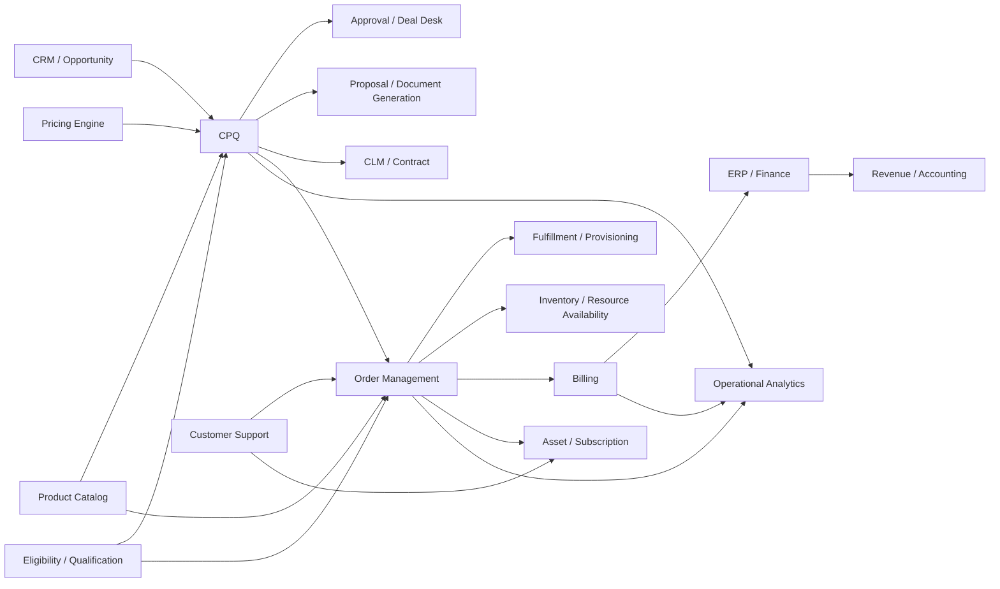
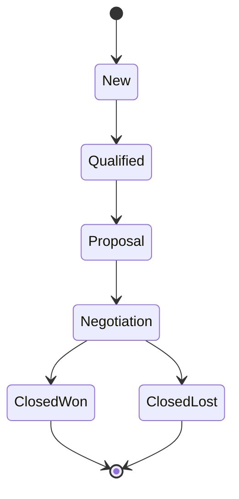
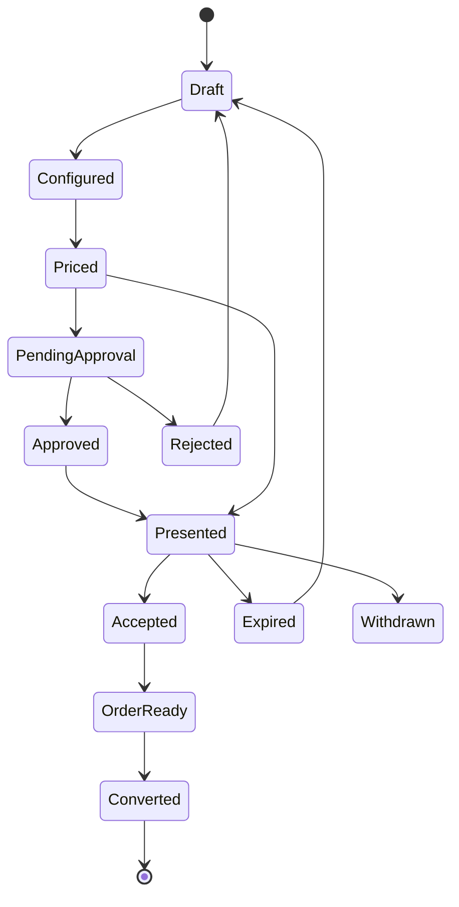
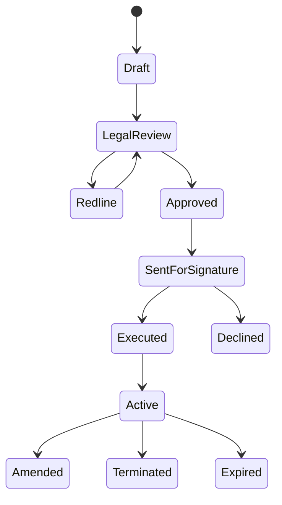
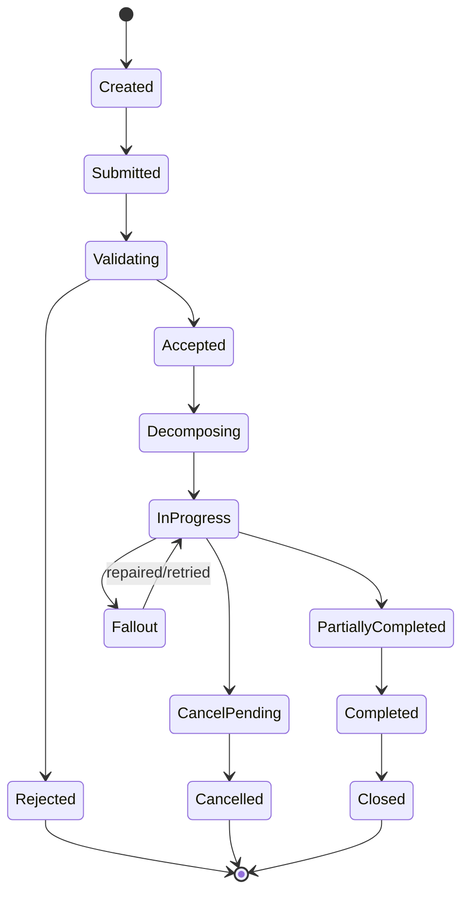
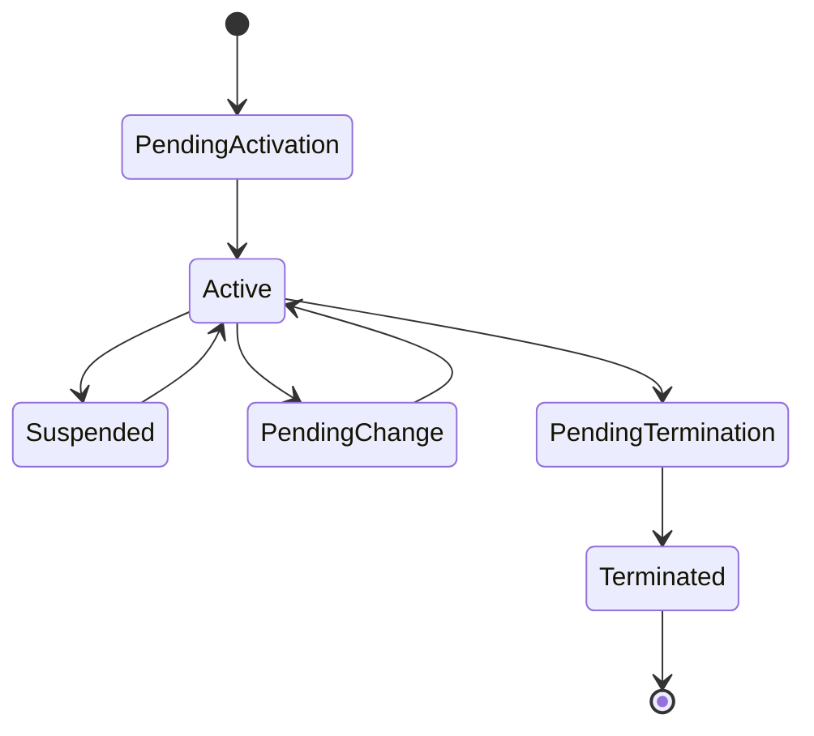
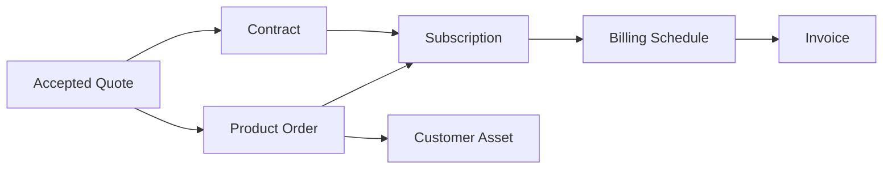
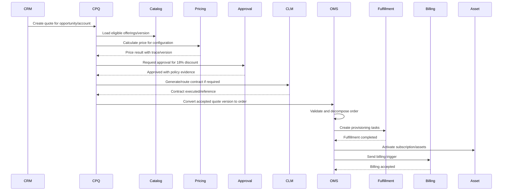

# Part 002 — Domain Boundary: CPQ, OMS, QTC, and OTC

## 1. Tujuan Part Ini

Part ini menjawab pertanyaan paling penting sebelum desain teknis:

> Sistem mana yang memiliki keputusan apa?

Enterprise CPQ/OMS gagal bukan hanya karena database lambat atau integration timeout. Banyak kegagalan berasal dari boundary yang kabur:

- CPQ menghitung harga tetapi billing menghitung ulang dengan logic berbeda.
- OMS menerima order tetapi tidak tahu quote version yang disetujui.
- CRM menyimpan product selection yang tidak valid terhadap catalog.
- Contract system mengubah term tanpa memberi dampak ke subscription.
- Fulfillment mengaktifkan service tetapi asset system tidak update.
- Finance melihat invoice yang tidak bisa direkonsiliasi ke order.

Part ini akan membangun boundary mental yang tajam antara:

- CPQ,
- OMS,
- Quote-to-Cash,
- Order-to-Cash,
- Lead-to-Cash,
- CRM,
- CLM,
- Billing,
- ERP,
- Fulfillment,
- Product Catalog,
- Inventory,
- Asset,
- Subscription.

---

## 2. First Principle: Boundary Follows Decision Ownership

Boundary tidak boleh ditentukan hanya berdasarkan UI, vendor, database, atau tim organisasi.

Boundary harus mengikuti **decision ownership**.

Artinya:

- sistem yang mengambil keputusan harus menyimpan basis keputusan,
- sistem yang mengeksekusi keputusan harus menerima input yang cukup untuk eksekusi,
- sistem yang menjadi source of truth harus jelas,
- sistem yang hanya membaca tidak boleh diam-diam mengubah semantic data,
- sistem downstream tidak boleh menciptakan commercial commitment baru tanpa explicit authority.

Contoh:

| Decision | Owner yang Umum | Kenapa |
|---|---|---|
| Product dapat dijual di market tertentu | Catalog / Eligibility | Ini policy orderability, bukan keputusan sales bebas |
| Customer boleh membeli produk tertentu | Eligibility / Qualification | Tergantung customer, region, credit, entitlement, regulatory policy |
| Harga quote final | CPQ / Pricing | Harus explainable, versioned, dan approved |
| Discount exception disetujui | Approval / Deal Desk | Harus auditable dan sesuai separation of duties |
| Quote diterima customer | CPQ / Sales Process | Commercial acceptance terjadi sebelum order execution |
| Order executable | OMS | OMS harus memastikan order bisa diproses downstream |
| Technical fulfillment step | Fulfillment / Provisioning | Ini execution detail, bukan commercial proposal |
| Invoice amount final | Billing / ERP Finance | Harus mengikuti financial control dan accounting policy |

Jika boundary mengikuti screen, hasilnya biasanya kacau. Misalnya karena sales screen menampilkan price, lalu UI dianggap owner pricing. Ini desain buruk. UI hanya channel. Ownership tetap di pricing/CPQ capability.

---

## 3. CPQ: Configure, Price, Quote

CPQ adalah capability untuk membantu organisasi menjual produk/layanan kompleks secara akurat dan terkendali.

Secara praktis, CPQ menjawab tiga pertanyaan:

1. **Configure** — kombinasi produk apa yang valid untuk customer/context ini?
2. **Price** — berapa harga yang benar berdasarkan catalog, price book, contract, discount, promotion, currency, dan policy?
3. **Quote** — proposal komersial apa yang bisa diberikan, disetujui, dikirim, diterima, dan dikonversi menjadi order?

Salesforce mendefinisikan CPQ sebagai configure, price, quote dan menempatkannya sebagai bagian dari quote-to-cash yang lebih luas. Dalam konteks enterprise, kita harus membaca ini sebagai capability, bukan hanya tool.

### 3.1 Apa yang CPQ Miliki

CPQ biasanya memiliki atau mengorkestrasi:

- quote lifecycle,
- quote version/revision,
- configured product selection,
- quote line commercial structure,
- pricing request/response,
- discount request,
- approval request,
- proposal generation,
- quote validity,
- acceptance event,
- quote-to-order readiness.

CPQ juga perlu menyimpan snapshot atau reference ke:

- catalog version,
- price version,
- customer/account context,
- contract reference,
- eligibility result,
- approval basis,
- proposal template version,
- terms and conditions version.

### 3.2 Apa yang CPQ Tidak Seharusnya Miliki

CPQ tidak seharusnya menjadi source of truth untuk:

- actual fulfillment execution,
- invoice lifecycle,
- accounting posting,
- physical inventory truth,
- provisioned network/resource state,
- ERP journal entry,
- long-term asset lifecycle jika ada dedicated asset/subscription system,
- legal contract lifecycle jika ada CLM yang authoritative.

CPQ boleh menampilkan data tersebut, tetapi menampilkan bukan berarti memiliki.

### 3.3 CPQ Output yang Baik

Output CPQ yang baik bukan hanya PDF.

Output minimal:

- accepted quote version,
- quote lines,
- configuration snapshot,
- pricing snapshot,
- discount and approval evidence,
- commercial terms,
- customer/account reference,
- validity and acceptance evidence,
- order conversion package.

Order conversion package harus cukup lengkap agar OMS tidak perlu menebak commercial intent.

---

## 4. OMS: Order Management System

OMS adalah capability untuk menerima order yang valid, memastikan order bisa dieksekusi, memecah order menjadi pekerjaan yang tepat, mengorkestrasi fulfillment, menangani exception, dan menjaga lifecycle order sampai selesai.

OMS menjawab pertanyaan:

1. **Apa yang harus dieksekusi?**
2. **Apakah order ini valid dan feasible?**
3. **Bagaimana order ini dipecah ke downstream?**
4. **Urutan eksekusi apa yang benar?**
5. **Apa yang terjadi jika sebagian gagal?**
6. **Kapan billing, asset, support, dan reporting boleh diberi sinyal?**

TM Forum TMF622 Product Ordering API menjelaskan product order sebagai mekanisme standar untuk menempatkan product order dengan parameter order yang diperlukan, dan product order dibuat berdasarkan product offering yang didefinisikan dalam catalog. Ini mendukung prinsip bahwa order tidak boleh lepas dari catalog/product offering basis.

### 4.1 Apa yang OMS Miliki

OMS biasanya memiliki:

- product order lifecycle,
- order line lifecycle,
- order validation result,
- quote-to-order conversion record,
- decomposition plan,
- fulfillment orchestration state,
- dependency graph,
- fallout state,
- retry/compensation decision,
- manual repair queue,
- cancellation/change-order lifecycle,
- order completion signal,
- billing/asset/fulfillment handoff events.

### 4.2 Apa yang OMS Tidak Seharusnya Miliki

OMS tidak seharusnya menjadi owner utama untuk:

- sales opportunity,
- quote negotiation,
- discretionary discount policy,
- legal clause negotiation,
- invoice calculation,
- general ledger posting,
- customer master,
- product catalog authoring,
- price book authoring.

OMS bisa melakukan validation against catalog/pricing snapshot, tetapi bukan berarti OMS menjadi owner catalog atau pricing policy.

### 4.3 OMS Output yang Baik

OMS output yang baik:

- order accepted/rejected result,
- validation evidence,
- decomposition result,
- fulfillment milestone,
- fallout event,
- completion event,
- cancellation/amendment result,
- billing trigger,
- asset activation/update instruction,
- operational audit trail.

---

## 5. Quote-to-Cash, Order-to-Cash, and Lead-to-Cash

Agar boundary tidak rancu, kita perlu membedakan business process besar.

### 5.1 Lead-to-Cash

Lead-to-Cash adalah proses paling luas dari lead generation sampai revenue collection.

Biasanya melibatkan:

- marketing,
- lead,
- opportunity,
- account management,
- CPQ,
- contract,
- order,
- fulfillment,
- billing,
- payment,
- revenue operations.

Lead-to-Cash bukan satu sistem. Ini end-to-end business value stream.

### 5.2 Quote-to-Cash

Quote-to-Cash biasanya dimulai saat penawaran komersial dibentuk dan berakhir ketika pembayaran/revenue process selesai.

Tahapan umum:

1. configure offer,
2. calculate price,
3. generate quote,
4. approve exceptions,
5. negotiate/accept,
6. contract,
7. create order,
8. fulfill,
9. bill,
10. collect payment,
11. recognize/report revenue.

Salesforce menekankan bahwa CPQ adalah bagian dari QTC, sedangkan QTC mencakup proses lebih luas sampai contract, billing, dan payment collection.

### 5.3 Order-to-Cash

Order-to-Cash biasanya dimulai ketika order sudah diterima dan berakhir pada billing/payment/cash application.

Tahapan umum:

1. order capture,
2. order validation,
3. fulfillment,
4. shipment/provisioning/service activation,
5. invoice,
6. payment,
7. cash application,
8. financial reconciliation.

Order-to-Cash lebih execution-heavy dibanding Quote-to-Cash.

### 5.4 CPQ vs QTC vs OTC

| Area | Starts From | Ends At | Primary Focus |
|---|---|---|---|
| CPQ | Sales offer intent | Accepted quote / order-ready quote | Commercial correctness |
| Quote-to-Cash | Quote creation | Cash collection / revenue process | Full commercial-to-finance flow |
| Order-to-Cash | Submitted order | Cash collection | Execution, billing, payment |
| Lead-to-Cash | Lead/opportunity | Cash/revenue | Full revenue value stream |

Kesalahan umum: menyebut semua hal sebagai CPQ. Ini membuat scope proyek meledak dan ownership kabur.

---

## 6. End-to-End Boundary Diagram

Diagram berikut menggambarkan boundary konseptual.

Interpretasi:

- CRM menciptakan sales context, bukan product truth.
- Catalog menciptakan product/commercial offering truth.
- CPQ menciptakan commercial proposal truth.
- CLM menciptakan contract/legal truth.
- OMS menciptakan order execution truth.
- Fulfillment menciptakan execution/provisioning truth.
- Billing menciptakan invoice/charge truth.
- ERP menciptakan financial/accounting truth.
- Asset/subscription system menciptakan installed-base truth.

---

## 7. Entity Boundary

Berikut entity utama dan boundary umum.

| Entity | Meaning | Common Owner | Notes |
|---|---|---|---|
| Lead | Potential buyer signal | CRM/Marketing | Pre-sales |
| Opportunity | Sales pursuit | CRM | Commercial pipeline, not executable order |
| Product Offering | Sellable commercial offer | Catalog | Market/channel/effective-date aware |
| Product Specification | Product definition | Catalog/Product master | Often more stable than offering |
| Price Book | Price list/version | Pricing/Catalog | Must be effective-dated |
| Quote | Commercial proposal | CPQ | Versioned, approvable, presentable |
| Quote Line | Commercial line item | CPQ | May map to multiple order/fulfillment items |
| Approval Request | Exception governance artifact | Approval/CPQ | Must store policy basis |
| Proposal Document | Human-readable offer artifact | CPQ/Document system | Must match quote version |
| Contract | Legal commitment | CLM | May reference quote/order/subscription |
| Product Order | Execution request | OMS | Must be valid, traceable, executable |
| Order Line | Executable commercial/technical action | OMS | Needs action semantics |
| Fulfillment Task | Downstream execution unit | OMS/Fulfillment | May be technical decomposition |
| Subscription | Ongoing commercial service instance | Subscription/Billing | Recurring lifecycle |
| Customer Asset | Installed product/service instance | Asset system | Used for amendments/renewals/support |
| Invoice | Financial billing document | Billing/ERP | Finance-controlled |
| Payment | Cash collection artifact | Payment/ERP | Financial control |

---

## 8. Boundary by Lifecycle

### 8.1 Opportunity Lifecycle

Owned by CRM.

Typical states:

Opportunity lifecycle should not replace quote lifecycle. An opportunity can have many quotes and revisions.

### 8.2 Quote Lifecycle

Owned by CPQ.

Quote lifecycle should not be overloaded with fulfillment status. Once converted, order lifecycle takes over execution.

### 8.3 Contract Lifecycle

Owned by CLM or contract capability.

Typical states:

Contract lifecycle overlaps quote/order but must not be confused with either.

### 8.4 Product Order Lifecycle

Owned by OMS.

Order lifecycle is execution-centric. It should carry commercial references but not re-negotiate quote terms.

### 8.5 Asset/Subscription Lifecycle

Owned by asset/subscription/billing capability depending on architecture.

Asset lifecycle is critical for amendments, renewals, entitlement, customer support, and billing.

---

## 9. Quote vs Order: The Most Important Distinction

Quote dan order sering terlihat mirip karena sama-sama punya line item. Ini sumber kesalahan besar.

### 9.1 Quote

Quote adalah proposal komersial.

Karakteristik:

- bisa direvisi,
- bisa dinegosiasikan,
- bisa punya alternative options,
- bisa expired,
- bisa butuh approval,
- bisa punya proposal document,
- bisa diterima atau ditolak customer,
- belum tentu executable.

Quote line menjelaskan apa yang ditawarkan.

### 9.2 Order

Order adalah request eksekusi.

Karakteristik:

- harus valid,
- harus executable,
- harus punya action semantics,
- harus bisa didekomposisi,
- harus punya lifecycle fulfillment,
- harus recoverable,
- harus bisa memicu billing/asset update pada waktu yang benar.

Order line menjelaskan apa yang harus dilakukan.

### 9.3 Mapping Tidak Selalu 1:1

Contoh:

| Quote Line | Order/Fulfillment Result |
|---|---|
| Enterprise SaaS Subscription | Create subscription, provision tenant, assign licenses, setup billing |
| Premium Support | Create entitlement, update support SLA, notify support system |
| Implementation Package | Create professional services project, schedule consultant |
| Data Retention Add-on | Update storage policy, configure compliance region, adjust billing |

Satu quote line bisa menjadi banyak fulfillment tasks. Satu bundle bisa menghasilkan banyak order lines. Satu order line bisa membutuhkan dependency sequencing.

---

## 10. Product Catalog vs Inventory vs Asset

Tiga konsep ini sering tertukar.

### 10.1 Product Catalog

Catalog menjawab:

> Apa yang dapat dijual?

Catalog berisi:

- offering,
- specification,
- bundle,
- option,
- compatibility,
- market,
- channel,
- lifecycle,
- effective date,
- product characteristics,
- sometimes price references.

TM Forum TMF620 Product Catalog Management API menempatkan catalog sebagai capability untuk mengelola lifecycle catalog elements dan digunakan dalam proses ordering, campaign, dan sales.

### 10.2 Inventory

Inventory menjawab:

> Resource fisik/logis apa yang tersedia atau dialokasikan?

Inventory bisa berupa:

- device stock,
- phone number,
- IP block,
- network resource,
- warehouse stock,
- license pool,
- capacity slot.

Inventory bukan source of truth untuk apa yang boleh dijual secara komersial. Ia source of truth untuk availability/resource allocation.

### 10.3 Asset

Asset menjawab:

> Customer saat ini memiliki atau menggunakan apa?

Asset bisa berupa:

- active subscription,
- installed product,
- active add-on,
- provisioned device,
- active support entitlement,
- contract-bound service instance.

Asset penting untuk:

- upgrade,
- downgrade,
- renewal,
- cancellation,
- entitlement,
- support,
- billing reconciliation.

### 10.4 Boundary Summary

| Concept | Question | Typical Owner |
|---|---|---|
| Catalog | What can be sold? | Product/Catalog |
| Inventory | What resource is available? | Inventory/Resource |
| Asset | What does customer have? | Asset/Subscription |
| Quote | What are we proposing? | CPQ |
| Order | What must be executed? | OMS |
| Invoice | What must be paid? | Billing/ERP |

---

## 11. Contract vs Subscription vs Order

### 11.1 Contract

Contract adalah legal agreement.

Ia menjawab:

- terms apa yang disepakati,
- party siapa saja,
- effective date,
- legal obligations,
- renewal clauses,
- termination clauses,
- liability,
- special terms.

### 11.2 Subscription

Subscription adalah commercial service instance yang berjalan dari waktu ke waktu.

Ia menjawab:

- customer subscribe apa,
- start date,
- end date,
- renewal term,
- billing frequency,
- quantity/seats,
- status,
- plan/add-on.

### 11.3 Order

Order adalah request untuk membuat/mengubah/menghentikan sesuatu.

Ia menjawab:

- action apa,
- untuk product/asset apa,
- kapan dieksekusi,
- dependency apa,
- status fulfillment apa.

### 11.4 Common Relationship

Tidak semua bisnis memakai semua artifact ini. Namun pada enterprise scale, memisahkan maknanya membantu mencegah boundary corruption.

---

## 12. Ownership Matrix End-to-End

Gunakan matrix ini sebagai baseline architecture review.

| Capability | Owns Decision? | Owns Data? | Produces Event? | Main Consumers |
|---|---:|---:|---:|---|
| CRM | Opportunity priority, sales ownership | Opportunity/account interaction | OpportunityWon | CPQ, analytics |
| Catalog | Product orderability model | Offering/spec/version | CatalogPublished | CPQ, OMS, commerce |
| Eligibility | Eligibility decision | Policy/result cache | EligibilityEvaluated | CPQ, OMS |
| Pricing | Price calculation | Price rule/version/result trace | PriceCalculated | CPQ, approval, quote |
| CPQ | Quote composition and acceptance | Quote/version/snapshot | QuoteAccepted | OMS, CLM, analytics |
| Approval | Exception approval | Approval decision/evidence | ApprovalGranted/Rejected | CPQ, audit |
| CLM | Legal contract lifecycle | Contract/document/clause | ContractExecuted | OMS, billing, subscription |
| OMS | Order lifecycle and orchestration | Order/decomposition/fallout | OrderSubmitted/Completed/Fallout | Fulfillment, billing, asset |
| Fulfillment | Technical execution | Task/provisioning state | FulfillmentCompleted/Failed | OMS, asset |
| Billing | Charge/invoice lifecycle | Invoice/charge/schedule | InvoiceIssued | ERP, customer portal |
| ERP | Financial posting | GL/accounting records | PaymentPosted/RevenuePosted | Finance, reporting |
| Asset/Subscription | Installed base | Asset/subscription status | AssetActivated/Changed | CPQ, support, billing |

---

## 13. Handoff Contracts

Boundary yang sehat membutuhkan handoff contract.

### 13.1 CRM to CPQ

Input:

- opportunity reference,
- account/customer reference,
- sales channel,
- region,
- seller role,
- deal context.

CRM should not send:

- arbitrary product structure not validated by catalog,
- final price not calculated by pricing/CPQ,
- approval bypass flag.

### 13.2 Catalog to CPQ

Input:

- offering,
- option,
- bundle structure,
- compatibility rule,
- orderability window,
- effective date,
- market/channel visibility.

CPQ should store:

- catalog version/reference,
- selected offering/version,
- configuration snapshot.

### 13.3 CPQ to OMS

Input:

- accepted quote ID and version,
- customer/account reference,
- selected products,
- price snapshot or commercial summary,
- approval evidence reference,
- contract reference if applicable,
- requested start date,
- delivery/billing account data,
- terms needed for execution.

OMS should not need to infer:

- which quote version was accepted,
- whether discount was approved,
- whether configuration was valid at quote time,
- whether quote expired before acceptance.

### 13.4 OMS to Fulfillment

Input:

- fulfillment task,
- technical product/resource mapping,
- dependency,
- idempotency key,
- correlation ID,
- required due date,
- rollback/compensation instruction where applicable.

Fulfillment should not decide:

- customer price,
- discount validity,
- quote acceptance,
- commercial eligibility.

### 13.5 OMS to Billing

Input:

- billing trigger,
- order reference,
- subscription/asset reference,
- charge instruction,
- start date,
- pricing/commercial reference,
- tax/account data if needed.

Billing should not guess:

- whether fulfillment is complete enough to bill,
- whether order was cancelled,
- whether commercial price was approved.

---

## 14. Boundary Failure Patterns

### 14.1 CPQ as Mini-ERP

Symptoms:

- CPQ stores invoices,
- CPQ owns accounting adjustments,
- CPQ manually updates revenue status,
- CPQ becomes source of truth for financial data.

Impact:

- financial control weak,
- reconciliation hard,
- audit risk high,
- ERP and CPQ disagree.

Better design:

- CPQ owns quote commercial commitment.
- Billing/ERP owns invoice and accounting.
- Link them with explicit references and events.

### 14.2 OMS as Passive Status Table

Symptoms:

- order has only `PENDING`, `SUCCESS`, `FAILED`,
- no decomposition,
- no dependency graph,
- no fallout ownership,
- no retry semantics,
- no manual repair lifecycle.

Impact:

- stuck orders invisible,
- duplicate downstream calls,
- partial failure not recoverable,
- billing/asset updates become unsafe.

Better design:

- OMS owns orchestration and recovery model.
- Fulfillment tasks have lifecycle and idempotency.
- Fallout is first-class.

### 14.3 Catalog as Static Lookup Table

Symptoms:

- no version,
- no effective date,
- no lifecycle,
- no market/channel scope,
- products deleted instead of retired,
- quotes break after catalog update.

Impact:

- old quotes cannot be reconstructed,
- order conversion fails,
- audit impossible,
- channel inconsistency.

Better design:

- catalog is versioned and governed,
- quote/order reference exact versions or store enough snapshot,
- publishing has approval and rollback.

### 14.4 Pricing Logic Split Across Systems

Symptoms:

- UI applies discount,
- backend recalculates price,
- billing recalculates again,
- data warehouse computes revenue using another formula.

Impact:

- customer dispute,
- margin leakage,
- invoice mismatch,
- finance reconciliation failure.

Better design:

- pricing engine produces traceable calculation,
- CPQ stores quote price snapshot,
- billing receives approved commercial basis or independently calculates only within clearly defined financial rule boundary,
- discrepancies are reconciled explicitly.

### 14.5 Quote and Order Share Same Mutable Record

Symptoms:

- quote becomes order by changing status,
- quote lines mutate during fulfillment,
- order cancellation changes quote history,
- accepted proposal cannot be reproduced.

Impact:

- audit broken,
- customer dispute impossible to resolve,
- order repair corrupts sales record.

Better design:

- quote and order are separate artifacts,
- conversion creates order from accepted quote version,
- order stores commercial snapshot/reference,
- quote remains immutable after acceptance except allowed metadata.

---

## 15. Scenario Walkthrough: New Enterprise Sale

Scenario:

> Customer buys Enterprise Compliance Platform with 500 seats, Premium Support, 7-year retention add-on, and APAC compliance module. Seller requests 18% discount. Policy says discounts above 15% require deal desk approval.

### 15.1 Correct Boundary Flow

### 15.2 What Must Be Preserved

- quote version,
- product configuration,
- price trace,
- discount approval evidence,
- contract reference,
- order reference,
- fulfillment completion,
- asset activation,
- billing trigger.

### 15.3 Design Review Questions

1. What if approval is revoked after quote is presented?
2. What if catalog version is retired before order submit?
3. What if customer accepts after quote expiry?
4. What if fulfillment partially succeeds?
5. What if billing rejects account data?
6. What if duplicate order conversion request is sent?
7. What if contract terms differ from quote terms?

---

## 16. Scenario Walkthrough: Change Order

Scenario:

> Existing customer has 500 seats and wants to upgrade to 800 seats, add Premium Support, and change billing from monthly to annual.

This is harder than new sale because installed base matters.

### 16.1 Required Inputs

CPQ needs:

- current assets/subscriptions,
- contract constraints,
- cotermination rule,
- entitlement,
- current price terms,
- amendment policy.

OMS needs:

- existing asset reference,
- action semantics: add/change/remove,
- effective date,
- dependency on current fulfillment state,
- billing change policy.

### 16.2 Boundary Risk

Common mistake:

> CPQ creates a new quote as if this is a net-new sale.

Impact:

- duplicate subscription,
- wrong billing,
- wrong entitlement,
- customer gets two active plans,
- renewal date mismatch.

Better design:

- CPQ uses asset-based ordering context.
- Quote lines include action intent.
- OMS converts action intent into order lines.
- Asset/subscription update is coordinated with fulfillment and billing.

---

## 17. Enterprise Boundary Checklist

Use this checklist for any CPQ/OMS architecture review.

### 17.1 CPQ Boundary

- [ ] Does CPQ own quote lifecycle separately from opportunity lifecycle?
- [ ] Does CPQ store quote version and revision history?
- [ ] Is accepted quote immutable enough for audit?
- [ ] Is pricing traceable and explainable?
- [ ] Are approvals linked to policy basis?
- [ ] Is proposal document tied to exact quote version?
- [ ] Is quote-to-order conversion idempotent?

### 17.2 OMS Boundary

- [ ] Does OMS own order lifecycle separately from quote lifecycle?
- [ ] Does order carry action semantics?
- [ ] Does OMS validate order before execution?
- [ ] Does OMS decompose commercial order into executable tasks?
- [ ] Does OMS manage dependency and partial failure?
- [ ] Does OMS own fallout and repair queue?
- [ ] Does OMS coordinate billing/asset trigger timing?

### 17.3 Catalog Boundary

- [ ] Is catalog versioned?
- [ ] Are product offerings effective-dated?
- [ ] Are retired products preserved for historical quote/order reconstruction?
- [ ] Are market/channel constraints modeled?
- [ ] Are bundle/option compatibility rules explicit?

### 17.4 Billing/ERP Boundary

- [ ] Does billing receive enough commercial basis?
- [ ] Is invoice traceable to order/contract/quote?
- [ ] Is financial ownership separate from CPQ/OMS?
- [ ] Are billing triggers controlled by fulfillment/order state?
- [ ] Is reconciliation possible across quote, order, asset, invoice, and payment?

### 17.5 Asset/Subscription Boundary

- [ ] Is installed base source of truth clear?
- [ ] Are amendments based on current asset state?
- [ ] Is asset update idempotent?
- [ ] Can CPQ read current entitlements?
- [ ] Can support see order/asset/billing history consistently?

---

## 18. Architecture Heuristics

### Heuristic 1 — Do Not Let Downstream Reconstruct Commercial Intent

OMS, fulfillment, and billing should not reverse-engineer what sales meant.

CPQ must pass enough accepted commercial context.

### Heuristic 2 — Do Not Let Upstream Pretend Execution Is Done

CPQ should not mark service active. CRM should not show completed fulfillment just because quote was accepted.

Execution truth belongs to OMS/fulfillment/asset systems.

### Heuristic 3 — Separate Negotiation State from Execution State

Negotiation state changes frequently and may be abandoned. Execution state has operational and financial consequences.

Quote can be messy. Order must be controlled.

### Heuristic 4 — Separate Commercial Product from Technical Fulfillment

Commercial product is what customer understands. Technical fulfillment is how company delivers it.

Do not expose every provisioning step as a sellable product. Do not assume every sellable product maps to one technical task.

### Heuristic 5 — Boundary Violations Are Often Hidden as Convenience

Examples:

- “Let billing recalculate price because it already has tax logic.”
- “Let CPQ update subscription directly because it already knows the customer.”
- “Let UI apply approval rule because it is faster.”
- “Let OMS read latest catalog because quote snapshot is annoying.”

Each may be acceptable in a specific context, but each is a boundary decision that needs explicit risk analysis.

---

## 19. Practical Exercise

Ambil skenario berikut:

> A B2B SaaS company sells a regulated workflow platform. Products include base platform, named user seats, AI add-on, audit retention add-on, premium support, and professional services onboarding. Customers can buy net-new, add seats mid-term, remove add-ons at renewal, upgrade support, or cancel with penalty.

Buat empat artifact.

### 19.1 Entity Ownership Matrix

Minimal entity:

- Account,
- Opportunity,
- Product Offering,
- Price Book,
- Quote,
- Quote Line,
- Approval,
- Contract,
- Product Order,
- Order Line,
- Subscription,
- Asset,
- Invoice,
- Payment.

Untuk setiap entity, tentukan:

- owner,
- mutable/immutable,
- lifecycle,
- consumers,
- audit requirement.

### 19.2 Handoff Contract: CPQ to OMS

Tentukan field minimal untuk convert accepted quote menjadi order.

Wajib mencakup:

- quote ID/version,
- customer/account,
- product selections,
- price snapshot/reference,
- approval reference,
- requested effective date,
- action semantics,
- contract reference,
- idempotency key.

### 19.3 Boundary Failure Table

Tulis minimal 8 boundary failure.

Untuk setiap failure:

- boundary yang dilanggar,
- cause,
- impact,
- detection,
- prevention,
- recovery.

### 19.4 Mermaid Diagram

Buat diagram end-to-end dari CRM sampai ERP.

Pastikan diagram membedakan:

- quote flow,
- contract flow,
- order flow,
- fulfillment flow,
- billing flow.

---

## 20. Summary

Part ini mengunci boundary utama.

Poin terpenting:

1. CPQ adalah commercial proposal capability: configure, price, quote, approval, proposal, acceptance.
2. OMS adalah execution orchestration capability: capture, validate, decompose, orchestrate, recover, complete.
3. Quote-to-Cash lebih luas dari CPQ karena mencakup contract, order, billing, payment, dan revenue process.
4. Order-to-Cash dimulai dari submitted order dan fokus pada execution-to-payment.
5. Boundary harus mengikuti decision ownership, bukan UI/vendor/team/database.
6. Quote dan order harus dipisahkan karena quote adalah negotiation artifact, order adalah execution artifact.
7. Catalog, inventory, asset, subscription, contract, billing, dan ERP memiliki semantic ownership yang berbeda.
8. Boundary yang kabur menghasilkan audit failure, revenue leakage, duplicate fulfillment, invoice mismatch, dan operational chaos.

Part berikutnya akan masuk ke **enterprise use cases and complexity drivers**: mengapa CPQ/OMS menjadi sulit pada large-scale enterprise, dan jenis kompleksitas apa yang harus dimodelkan sejak awal.

---

## References

- Salesforce, “What Is CPQ, or Configure, Price, Quote?” — CPQ as configure, price, quote capability for complex products/services and accurate quoting.
- Salesforce, “The Basics of the Quote-to-Cash Process” — CPQ as a critical part of quote-to-cash; QTC extends through contracts, billing, and payment collection.
- TM Forum, TMF620 Product Catalog Management API User Guide v5.0.0 — product catalog lifecycle and usage across ordering, campaign, and sales processes.
- TM Forum, TMF622 Product Ordering Management API User Guide v5.0.0 — product ordering mechanism and relationship between product order and product offering defined in catalog.
