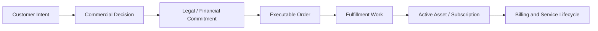
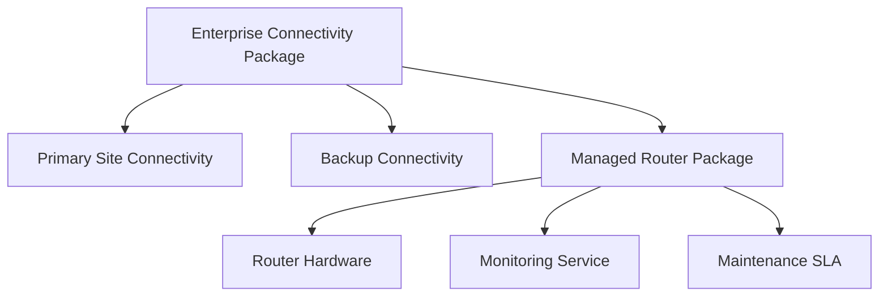
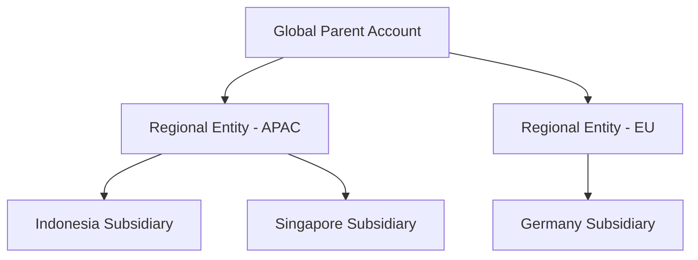
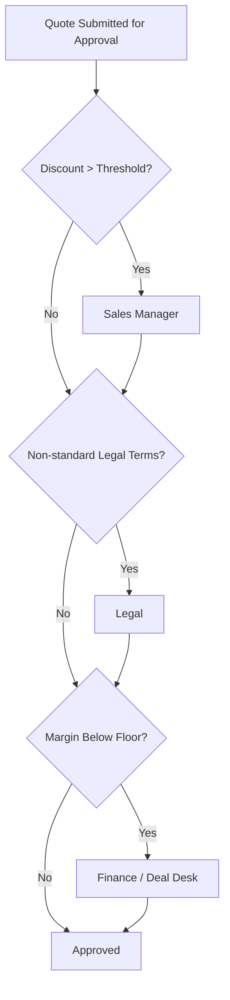
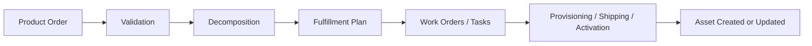
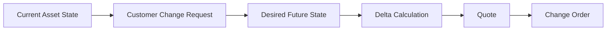
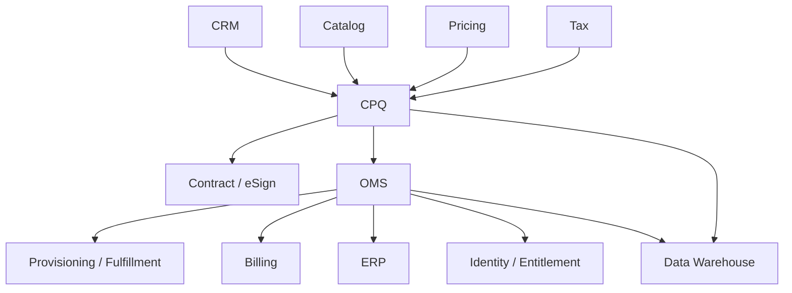

# Part 003 — Enterprise Use Cases and Complexity Drivers

## 1. Tujuan Part Ini

Part ini menjawab pertanyaan inti:

> Mengapa CPQ/OMS enterprise jauh lebih sulit daripada sekadar form quote, price calculator, approval workflow, dan order table?

Di sistem kecil, CPQ/OMS sering terlihat seperti rangkaian CRUD:

1. pilih produk,
2. hitung harga,
3. buat quote,
4. approve,
5. submit order,
6. kirim ke fulfillment,
7. selesai.

Di enterprise, alurnya tidak sesederhana itu. Masalah utama bukan jumlah screen, bukan jumlah API, dan bukan jumlah workflow engine. Masalah utamanya adalah **kombinasi perubahan komersial, operasional, legal, dan teknis yang saling mengunci**.

Target part ini:

1. Mengurai use case enterprise yang membuat CPQ/OMS kompleks.
2. Membedakan complexity yang legitimate dari complexity yang muncul karena desain buruk.
3. Membuat peta driver complexity yang akan dipakai sepanjang seri.
4. Menentukan invariant awal yang harus dijaga agar platform tetap benar.
5. Memberikan latihan analisis agar kita tidak sekadar menghafal istilah CPQ/OMS.

Part ini masih berada di fase Kaufman: **deconstruct the skill**. Kita belum mendesain solusi penuh. Kita sedang memecah medan masalah agar latihan berikutnya bisa fokus.

---

## 2. Mental Model Utama

CPQ/OMS enterprise adalah **commercial decision and execution platform**.

Artinya, platform ini tidak hanya menyimpan data. Ia mengubah intensi bisnis menjadi komitmen yang bisa dieksekusi.



Setiap transisi punya risiko:

| Transisi | Risiko Utama |
|---|---|
| Customer intent → commercial decision | Produk tidak eligible, konfigurasi tidak valid, sales salah memilih offering |
| Commercial decision → legal/financial commitment | Harga salah, diskon tidak authorized, terms tidak sesuai |
| Commitment → executable order | Quote tidak bisa dipenuhi, data tidak lengkap, order tidak decomposable |
| Executable order → fulfillment work | Downstream gagal, duplicate provisioning, dependency tidak lengkap |
| Fulfillment → active asset | Asset tidak sesuai order, billing salah, entitlement tidak terbentuk |

Mental model yang perlu dipegang:

> CPQ menentukan **apa yang boleh dijual, kepada siapa, dengan konfigurasi dan harga apa**. OMS memastikan **apa yang sudah dijual dapat diubah menjadi pekerjaan operasional yang benar, terlacak, dan dapat dipulihkan ketika gagal**.

---

## 3. CPQ/OMS Enterprise Bukan Satu Use Case

Kesalahan umum adalah mendefinisikan CPQ/OMS sebagai satu alur linear. Pada kenyataannya, platform ini melayani banyak mode bisnis.

### 3.1 New Sale

Customer membeli produk baru.

Contoh:

- perusahaan membeli paket SaaS enterprise baru,
- pelanggan telekomunikasi memesan koneksi dedicated internet baru,
- perusahaan manufaktur membeli mesin dengan opsi konfigurasi khusus,
- partner menjual bundle hardware + service + maintenance.

Kompleksitas utama:

1. eligibility,
2. konfigurasi,
3. pricing,
4. approval,
5. order decomposition,
6. fulfillment dependency.

### 3.2 Amendment / Change Order

Customer sudah punya asset/subscription aktif, lalu ingin mengubahnya.

Contoh:

- upgrade tier,
- tambah seat,
- kurangi kapasitas,
- pindah lokasi,
- ubah billing frequency,
- add-on module,
- swap hardware,
- change SLA.

Kompleksitas utama:

1. mengetahui installed base yang benar,
2. membedakan current state vs desired state,
3. menghitung delta price,
4. menentukan prorate/credit/penalty,
5. mencegah konflik dengan order in-flight,
6. menjaga continuity billing dan entitlement.

### 3.3 Renewal

Customer memperpanjang kontrak/subscription.

Kompleksitas utama:

1. renewal term,
2. price uplift,
3. cotermination,
4. product version migration,
5. grandfathered price,
6. renegotiated discount,
7. legal clause change,
8. approval ulang.

### 3.4 Cancellation / Termination

Customer membatalkan layanan atau kontrak.

Kompleksitas utama:

1. early termination fee,
2. refund/credit,
3. clawback commission,
4. deprovisioning,
5. data retention,
6. legal notice period,
7. downstream cancellation ordering,
8. billing stop date.

### 3.5 Suspend / Resume

Layanan dihentikan sementara lalu diaktifkan kembali.

Kompleksitas utama:

1. suspend reason,
2. billing impact,
3. entitlement impact,
4. SLA impact,
5. regulatory notice,
6. automatic resume,
7. manual override,
8. downstream provisioning state.

### 3.6 Reconfiguration Without Commercial Change

Tidak semua perubahan bersifat komersial. Kadang customer hanya ingin mengubah atribut operasional.

Contoh:

- mengganti kontak teknis,
- mengubah delivery address,
- mengubah parameter teknis,
- mengganti device yang rusak,
- mengubah schedule installation.

Kompleksitas utama:

1. apakah perlu quote baru,
2. apakah perlu approval,
3. apakah memengaruhi kontrak,
4. apakah memengaruhi fulfillment,
5. apakah memengaruhi billing.

### 3.7 Bulk / Enterprise Deal

Satu quote/order dapat berisi ratusan atau ribuan line.

Contoh:

- enterprise SaaS rollout untuk 40 negara,
- telco order untuk ratusan site,
- hardware refresh untuk ribuan device,
- multi-subsidiary master agreement.

Kompleksitas utama:

1. large cart performance,
2. partial approval,
3. mass pricing,
4. line grouping,
5. regional tax/legal differences,
6. fulfillment waves,
7. partial cancellation,
8. reporting visibility.

### 3.8 Partner / Channel Sale

Produk dijual oleh partner, reseller, marketplace, agent, atau distributor.

Kompleksitas utama:

1. partner eligibility,
2. channel-specific price book,
3. margin sharing,
4. deal registration,
5. territory rules,
6. partner approval,
7. order ownership,
8. customer visibility and support responsibility.

### 3.9 Multi-Entity / Multi-Region Transaction

Transaksi melibatkan legal entity, tax jurisdiction, currency, dan local regulation yang berbeda.

Kompleksitas utama:

1. legal seller entity,
2. buyer entity,
3. tax registration,
4. local terms,
5. currency conversion,
6. revenue entity,
7. fulfillment region,
8. data residency.

---

## 4. Domain Complexity Matrix

Gunakan matrix berikut untuk membaca kompleksitas sebuah CPQ/OMS initiative.

| Driver | Low Complexity | Medium Complexity | High Complexity |
|---|---|---|---|
| Product model | Flat SKU | Bundle + options | Nested bundle + technical decomposition |
| Pricing | Fixed price | Tiered + discount | Contracted price + usage + prorate + promotion stacking |
| Customer | Single account | Account hierarchy | Multi-entity global account + partner involvement |
| Channel | Direct only | Direct + partner | Omnichannel + marketplace + territory conflict |
| Lifecycle | New sale only | Renewal + amendment | Full asset lifecycle + in-flight mutation |
| Fulfillment | Single step | Multi-step | Dependency graph + partial fulfillment + fallout repair |
| Approval | Manager approval | Policy-based approval | Multi-dimensional deal desk + legal + finance + security |
| Catalog | Manual static | Versioned catalog | Effective-dated, multi-market, publish pipeline |
| Integration | Few synchronous APIs | Hybrid sync/event | Many downstreams, eventual consistency, reconciliation |
| Audit | Basic history | Approval audit | Legal, financial, regulatory, tamper-evident evidence |

Interpretasi matrix:

- Jika mayoritas driver berada di low complexity, CPQ/OMS bisa relatif sederhana.
- Jika beberapa driver high complexity, architecture harus sejak awal dirancang untuk versioning, traceability, dan failure recovery.
- Jika hampir semua driver high complexity, platform perlu diperlakukan sebagai **enterprise operating platform**, bukan aplikasi sales biasa.

---

## 5. Product Complexity Drivers

### 5.1 Flat Product

Flat product adalah produk yang bisa dijual tanpa konfigurasi bermakna.

Contoh:

```text
Product: Standard Support Package
Price: USD 10,000 / year
Options: none
```

Flat product mudah di-quote, mudah di-order, dan mudah di-fulfill.

Namun enterprise CPQ jarang berhenti di sini.

### 5.2 Bundle

Bundle menggabungkan beberapa item dalam satu commercial package.

Contoh:

```text
Enterprise Security Suite
- Identity Module
- Threat Detection Module
- Compliance Reporting Module
- Premium Support
```

Pertanyaan desain:

1. Apakah item bundle bisa dijual terpisah?
2. Apakah semua item wajib?
3. Apakah customer boleh memilih subset?
4. Apakah harga bundle dihitung dari komponen atau fixed package price?
5. Apakah fulfillment memproses bundle sebagai satu unit atau beberapa work order?

### 5.3 Nested Bundle

Nested bundle muncul saat bundle punya bundle di dalamnya.



Nested bundle meningkatkan risiko:

1. konfigurasi tidak konsisten,
2. pricing double-count,
3. approval salah level,
4. fulfillment tidak tahu parent-child relationship,
5. reporting salah menghitung revenue by product.

### 5.4 Product Characteristic Explosion

Produk enterprise sering punya banyak characteristic:

- bandwidth,
- region,
- SLA,
- term,
- billing frequency,
- capacity,
- user count,
- support level,
- compliance option,
- integration type,
- deployment model,
- data residency.

Masalahnya bukan jumlah atribut saja. Masalahnya adalah **kombinasi antar atribut**.

Contoh:

```text
Jika deployment = dedicated dan region = EU,
maka data residency clause wajib,
dan SLA platinum hanya valid jika support level = premium,
dan billing frequency monthly tidak tersedia untuk term < 12 bulan.
```

Dari sinilah configurator menjadi constraint system, bukan sekadar form builder.

### 5.5 Commercial Product vs Technical Product

Satu commercial product dapat decomposed menjadi banyak technical product/service/resource.

Contoh:

```text
Commercial Product:
- Managed Internet 1Gbps

Technical / Fulfillment Components:
- access circuit
- router device
- IP allocation
- monitoring profile
- installation appointment
- billing recurring charge
- SLA entitlement
```

Inilah alasan CPQ dan OMS tidak boleh mencampur semua model menjadi satu object raksasa.

Commercial model menjawab:

> Apa yang dijual dan dijanjikan kepada customer?

Technical model menjawab:

> Apa yang harus dibangun, dikirim, dikonfigurasi, dan dioperasikan?

---

## 6. Pricing Complexity Drivers

Pricing adalah salah satu sumber defect paling mahal dalam CPQ/OMS.

Kesalahan harga dapat menyebabkan:

1. revenue leakage,
2. margin erosion,
3. customer dispute,
4. legal dispute,
5. invoice correction,
6. sales compensation error,
7. audit issue,
8. loss of trust.

### 6.1 Price Dimension

Enterprise pricing biasanya bergantung pada banyak dimensi.

| Dimension | Contoh |
|---|---|
| Product | SKU, bundle, option |
| Customer | segment, tier, negotiated contract |
| Geography | country, state, region |
| Channel | direct, reseller, marketplace |
| Time | effective date, promo window |
| Volume | quantity tier, committed usage |
| Term | 12/24/36 bulan |
| Currency | USD, EUR, IDR, JPY |
| Legal entity | seller of record |
| Asset state | upgrade, renewal, add-on |

Pricing engine yang matang harus bisa menjelaskan:

```text
Mengapa harga ini muncul, dari rule mana, untuk kondisi apa,
berdasarkan catalog/price version mana, dan siapa yang mengubahnya.
```

### 6.2 Discount Governance

Discount bukan sekadar angka negatif.

Discount punya arti governance:

1. Apakah sales boleh memberi diskon ini?
2. Apakah diskon melewati floor price?
3. Apakah margin masih aman?
4. Apakah diskon berlaku untuk renewal?
5. Apakah diskon berlaku untuk add-on?
6. Apakah diskon bisa digabung dengan promotion?
7. Apakah diskon harus disetujui finance/legal/deal desk?

### 6.3 Promotion Stacking

Promotion stacking adalah sumber defect klasik.

Contoh konflik:

```text
Promo A: 20% off for new customers
Promo B: 15% off for annual term
Promo C: first 3 months free
Contract Discount: 25% enterprise discount
Partner Discount: 10% channel discount
```

Pertanyaan yang harus dijawab:

1. Apakah semua bisa digabung?
2. Mana yang dihitung lebih dulu?
3. Apakah diskon dihitung dari list price atau net price?
4. Apakah promo berlaku untuk recurring charge saja?
5. Apakah promo berlaku untuk usage charge?
6. Apakah ada maksimum total discount?
7. Apakah invoice harus menampilkan breakdown?

### 6.4 Proration and Cotermination

Amendment dan renewal sering butuh prorate.

Contoh:

```text
Customer punya kontrak 12 bulan.
Pada bulan ke-8, customer menambah 100 seat.
Add-on harus coterminate dengan kontrak utama pada bulan ke-12.
```

Pricing perlu menghitung:

1. sisa masa kontrak,
2. effective date,
3. billing frequency,
4. credit untuk downgrade,
5. charge untuk upgrade,
6. rounding,
7. tax boundary,
8. invoice presentation.

### 6.5 Rounding and Currency

Rounding terlihat kecil, tetapi di enterprise bisa menjadi audit issue.

Contoh pertanyaan:

1. Rounding dilakukan per line atau total?
2. Rounding dilakukan sebelum atau sesudah discount?
3. Currency conversion memakai rate tanggal apa?
4. Apakah price stored dalam minor unit?
5. Apakah tax dihitung dari rounded amount?
6. Bagaimana menangani multi-currency quote?

Invariant awal:

> Pricing result harus deterministic, explainable, replayable, dan versioned.

---

## 7. Customer, Account, and Party Complexity

Enterprise transaction jarang hanya punya satu customer.

Satu deal dapat melibatkan:

1. sold-to party,
2. bill-to party,
3. ship-to party,
4. service location,
5. payer,
6. reseller,
7. end customer,
8. parent account,
9. subsidiary,
10. contract signer,
11. technical contact,
12. procurement contact.

### 7.1 Account Hierarchy



Pertanyaan desain:

1. Diskon dinegosiasikan di parent atau subsidiary?
2. Contract ditandatangani oleh entity mana?
3. Invoice dikirim ke entity mana?
4. Fulfillment dilakukan di lokasi mana?
5. Currency mengikuti buyer, seller, atau contract?
6. Approval mengikuti region atau global account?
7. Reporting revenue masuk ke territory mana?

### 7.2 Related Party Role

Jangan modelkan semua sebagai `customerId`.

Gunakan role eksplisit:

```text
relatedParties:
- role: SOLD_TO
- role: BILL_TO
- role: SHIP_TO
- role: PAYER
- role: END_USER
- role: RESELLER
- role: CONTRACT_SIGNER
- role: TECHNICAL_CONTACT
```

Tanpa role eksplisit, sistem akan membuat asumsi implisit yang sulit diaudit.

### 7.3 Customer-Specific Entitlement

Customer tertentu dapat memiliki hak khusus:

1. grandfathered product,
2. special price,
3. region exception,
4. non-standard SLA,
5. custom terms,
6. manual fulfillment process,
7. early access product,
8. restricted feature.

Entitlement harus dikelola dengan hati-hati. Jika terlalu bebas, ia menjadi bypass semua governance. Jika terlalu kaku, business tidak bisa melayani enterprise deal.

---

## 8. Channel and Sales Motion Complexity

CPQ/OMS harus mendukung cara perusahaan menjual.

### 8.1 Direct Sales

Direct sales biasanya punya kontrol paling besar:

1. internal sales rep,
2. internal approval,
3. internal pricing policy,
4. full customer visibility,
5. full quote ownership.

### 8.2 Partner / Reseller

Partner sale menambah layer:

1. partner margin,
2. partner-specific catalog,
3. deal registration,
4. channel conflict,
5. end-customer visibility,
6. sell-in vs sell-through,
7. partner approval,
8. support responsibility.

### 8.3 Marketplace

Marketplace menambah constraint:

1. marketplace listing,
2. marketplace pricing rule,
3. billing through marketplace,
4. customer identity mapping,
5. limited contract customization,
6. entitlement synchronization,
7. marketplace lifecycle events.

### 8.4 Self-Service Commerce

Self-service butuh guardrail lebih kuat karena tidak ada sales rep yang memvalidasi manual.

Kompleksitas:

1. real-time eligibility,
2. real-time pricing,
3. simplified configuration,
4. payment authorization,
5. fraud/abuse control,
6. automated fulfillment,
7. immediate entitlement,
8. customer-visible order status.

### 8.5 Assisted Sales

Assisted sales adalah hybrid:

1. customer mulai di portal,
2. sales mengambil alih,
3. quote direvisi,
4. approval dilakukan internal,
5. customer menerima proposal,
6. order diproses internal.

Risiko utamanya adalah state handoff:

```text
Cart customer, draft quote sales, approved quote, accepted proposal,
and submitted order must not diverge silently.
```

---

## 9. Approval and Governance Complexity

Approval bukan sekadar flowchart.

Approval adalah mekanisme kontrol risiko.

### 9.1 Approval Dimensions

Approval dapat dipicu oleh:

1. discount percentage,
2. margin threshold,
3. non-standard terms,
4. product exception,
5. customer risk,
6. credit risk,
7. region rule,
8. deal size,
9. contract length,
10. custom implementation effort,
11. security/legal clause,
12. billing exception.

### 9.2 Multi-Approver Scenario



Pertanyaan desain:

1. Apakah approval parallel atau sequential?
2. Apakah satu rejection membatalkan semua?
3. Apakah quote berubah setelah approval?
4. Apakah approval harus invalidated setelah repricing?
5. Apakah approver boleh mengedit quote?
6. Apakah approval punya expiry?
7. Apakah delegation boleh?
8. Apakah override harus punya reason code?

### 9.3 Approval Invalidation

Salah satu defect paling berbahaya:

```text
Quote disetujui pada harga A,
kemudian sales mengubah konfigurasi atau discount,
tetapi approval lama tetap dianggap valid.
```

Invariant:

> Approval hanya valid untuk snapshot quote tertentu, bukan untuk quote mutable secara umum.

---

## 10. Order and Fulfillment Complexity

Order management adalah tempat janji komersial bertemu realitas operasional.

### 10.1 Order Capture vs Order Fulfillment

Order capture menjawab:

> Apa yang customer beli dan komitmen apa yang dibuat?

Fulfillment menjawab:

> Pekerjaan apa yang harus dilakukan agar komitmen itu terpenuhi?

Jangan mencampur keduanya menjadi satu state sederhana.



### 10.2 Decomposition Complexity

Satu order line bisa menghasilkan banyak fulfillment task.

Contoh:

```text
Order Line:
- Managed Internet 1Gbps for Site A

Fulfillment Tasks:
- validate address
- reserve access circuit
- schedule technician
- ship router
- configure router
- allocate IP
- activate monitoring
- create billing schedule
- create SLA entitlement
```

Pertanyaan desain:

1. Task mana yang parallel?
2. Task mana yang bergantung pada task lain?
3. Apa yang terjadi jika salah satu task gagal?
4. Apa yang boleh dibatalkan?
5. Apa yang harus dikompensasi?
6. Apa yang menjadi milestone customer-visible?
7. Apa yang menjadi internal operational status?

### 10.3 Partial Fulfillment

Enterprise order sering tidak selesai sekaligus.

Contoh:

```text
100 site order:
- 70 site berhasil aktif
- 20 site menunggu permit
- 5 site gagal address validation
- 5 site dibatalkan customer
```

OMS harus bisa mengekspresikan partial state, bukan hanya `COMPLETED` atau `FAILED`.

### 10.4 Fallout

Fallout adalah kondisi order tidak bisa lanjut tanpa intervensi.

Contoh:

1. data customer tidak lengkap,
2. address tidak valid,
3. inventory tidak tersedia,
4. downstream timeout,
5. provisioning rejected,
6. billing account missing,
7. manual approval expired,
8. catalog mapping tidak ditemukan.

Fallout management harus punya:

1. reason code,
2. owner,
3. SLA,
4. repair action,
5. retry policy,
6. audit trail,
7. customer impact,
8. escalation path.

---

## 11. Installed Base Complexity

Installed base adalah representasi produk/layanan yang sudah aktif untuk customer.

Tanpa installed base yang benar, CPQ tidak bisa menangani amendment dengan aman.

### 11.1 Current State vs Desired State



Contoh:

```text
Current:
- Plan: Pro
- Seats: 100
- Support: Standard
- Term End: 2026-12-31

Desired:
- Plan: Enterprise
- Seats: 180
- Support: Premium
- Term End: 2026-12-31
```

CPQ harus menghitung delta:

1. upgrade Pro → Enterprise,
2. add 80 seats,
3. Standard → Premium support,
4. prorate sampai term end,
5. approval jika discount berubah,
6. order action yang diperlukan.

### 11.2 Asset Drift

Asset drift terjadi saat real-world state, billing state, entitlement state, dan CPQ installed base tidak sama.

Contoh:

| System | State |
|---|---|
| CPQ Asset | 100 seats |
| Billing | 120 seats |
| Entitlement | 150 seats |
| Product Usage | 160 active users |

Jika sistem membuat renewal berdasarkan CPQ Asset, revenue bisa bocor. Jika membuat entitlement berdasarkan billing, customer bisa kehilangan akses. Jika membuat quote berdasarkan usage, legal commitment bisa salah.

Invariant:

> Installed base must have explicit source, effective date, reconciliation status, and confidence level.

---

## 12. Data and Integration Complexity

CPQ/OMS hampir selalu berada di tengah enterprise landscape.



Kompleksitas utama:

1. source of truth tidak jelas,
2. duplicate customer/account,
3. product code mismatch,
4. price version mismatch,
5. contract state berbeda dengan quote state,
6. order state berbeda dengan fulfillment state,
7. billing mulai sebelum fulfillment selesai,
8. events datang out of order,
9. retry menghasilkan duplicate action,
10. reporting menggunakan data yang belum reconciled.

---

## 13. Time as a Complexity Driver

Enterprise CPQ/OMS adalah domain yang sangat dipengaruhi waktu.

### 13.1 Important Dates

| Date | Makna |
|---|---|
| Quote created date | Saat quote dibuat |
| Quote valid until | Batas customer bisa menerima quote |
| Price effective date | Tanggal price version berlaku |
| Contract start date | Awal komitmen legal |
| Service start date | Layanan mulai aktif |
| Billing start date | Tagihan mulai berjalan |
| Order submitted date | Order dikirim ke OMS |
| Fulfillment completion date | Pekerjaan selesai |
| Asset effective date | Asset mulai berlaku |
| Cancellation effective date | Pembatalan efektif |

Masalah umum:

```text
Tanggal-tanggal ini sering dianggap sama, padahal tidak.
```

Contoh:

- quote dibuat 1 Juli,
- quote berlaku sampai 31 Juli,
- customer menerima 20 Juli,
- contract start 1 Agustus,
- service aktif 10 Agustus,
- billing start 15 Agustus.

Jika sistem hanya punya satu field `startDate`, semua downstream akan membuat asumsi sendiri.

### 13.2 Effective Dating

Catalog, price, policy, promotion, contract, dan entitlement semuanya bisa effective-dated.

Pertanyaan desain:

1. Saat quote direvisi, apakah memakai price version lama atau baru?
2. Saat order disubmit setelah promo berakhir, apakah promo tetap valid?
3. Saat catalog item retired, apakah renewal masih boleh?
4. Saat policy berubah, apakah approval lama tetap valid?
5. Saat customer menerima quote lewat masa berlaku, apakah order ditolak?

---

## 14. Regulatory, Legal, and Audit Complexity

Enterprise CPQ/OMS menghasilkan evidence.

Evidence ini bisa dipakai untuk:

1. customer dispute,
2. revenue audit,
3. contract audit,
4. regulatory audit,
5. internal control,
6. sales compensation dispute,
7. tax dispute,
8. incident investigation.

### 14.1 Evidence Objects

Minimal evidence yang harus dipikirkan:

1. quote snapshot,
2. price calculation trace,
3. approval decision,
4. approver identity,
5. policy version,
6. product/catalog version,
7. customer acceptance timestamp,
8. proposal document version,
9. order payload,
10. fulfillment milestone,
11. billing handoff event,
12. manual override reason.

### 14.2 Tamper Risk

Jika quote dan order bisa diedit tanpa jejak, sistem tidak defensible.

Invariant:

> Once a commercial commitment is made, changes must be represented as revision, amendment, cancellation, or correction — not silent mutation.

---

## 15. UX Complexity

CPQ/OMS tidak hanya backend.

Sales, deal desk, finance, operations, support, partner, dan customer perlu memahami status dan action.

### 15.1 Sales UX

Sales butuh:

1. guided selling,
2. fast product search,
3. clear validation error,
4. pricing explanation,
5. approval status,
6. proposal generation,
7. revision history,
8. customer acceptance tracking.

### 15.2 Operations UX

Operations butuh:

1. order queue,
2. fallout queue,
3. task ownership,
4. dependency view,
5. SLA breach view,
6. manual repair action,
7. retry and compensation tools,
8. customer impact view.

### 15.3 Finance UX

Finance butuh:

1. margin visibility,
2. discount exception,
3. billing readiness,
4. invoice schedule,
5. revenue leakage detection,
6. credit/rebill evidence,
7. audit report.

### 15.4 Customer UX

Customer butuh:

1. accurate quote,
2. transparent terms,
3. order status,
4. expected delivery date,
5. cancellation/change visibility,
6. support handoff.

UX yang buruk sering menyebabkan workaround. Workaround kemudian merusak data quality.

---

## 16. Distinguishing Real Complexity from Accidental Complexity

Tidak semua complexity valid.

### 16.1 Real Complexity

Real complexity berasal dari domain.

Contoh:

1. multi-region tax,
2. installed base amendment,
3. dependency-based fulfillment,
4. approval segregation of duties,
5. price effective dating,
6. order cancellation after partial fulfillment.

Complexity ini harus dimodelkan, bukan disembunyikan.

### 16.2 Accidental Complexity

Accidental complexity berasal dari desain buruk.

Contoh:

1. satu field dipakai untuk banyak makna,
2. quote line mutable setelah approval tanpa revision,
3. catalog code berbeda di tiap downstream,
4. pricing rule disimpan sebagai script tidak terkontrol,
5. order state terlalu generik,
6. integration retry tidak idempotent,
7. manual override tanpa reason,
8. reporting mengambil data dari database operational secara langsung.

Tujuan engineer top-tier bukan menghapus semua complexity, tetapi membedakan mana yang harus diekspresikan dan mana yang harus dieliminasi.

---

## 17. Complexity Driver → Architecture Response

| Complexity Driver | Architecture Response |
|---|---|
| Many product combinations | Constraint-based configurator and validation engine |
| Many pricing dimensions | Versioned deterministic pricing engine |
| Complex approval | Policy engine + approval snapshot binding |
| Installed base amendment | Asset model + delta engine |
| Multi-step fulfillment | Decomposition + orchestration state machine |
| Downstream instability | Idempotency, retry, outbox/inbox, reconciliation |
| Multi-region rules | Effective-dated policy/catalog/price by market |
| Legal defensibility | Immutable snapshots, audit trail, evidence store |
| High volume quotes/orders | Read models, caching, async processing, capacity model |
| Operational exceptions | Fallout queue, owner, SLA, repair actions |

---

## 18. Core Invariants Introduced in This Part

These invariants will be reused across the series.

### 18.1 Commercial Snapshot Invariant

> Anything approved or accepted must be bound to an immutable commercial snapshot.

This applies to:

1. quote lines,
2. configuration,
3. price result,
4. discount,
5. terms,
6. approval decisions,
7. customer acceptance.

### 18.2 Deterministic Pricing Invariant

> Given the same quote input and the same catalog/price/policy version, pricing must produce the same result and explanation.

### 18.3 Order Executability Invariant

> A submitted order must either be decomposable into executable work or rejected with actionable validation errors.

### 18.4 Lifecycle Integrity Invariant

> Lifecycle transitions must preserve history. Do not replace amendment, revision, cancellation, and correction with silent mutation.

### 18.5 Source-of-Truth Invariant

> Every business object must have an explicit owner and synchronization contract.

### 18.6 Recovery Invariant

> Every external side effect must be idempotent, traceable, retryable, and reconcilable.

---

## 19. Scenario Walkthrough: Enterprise Connectivity Deal

Gunakan scenario ini sebagai latihan mental.

### 19.1 Business Scenario

A global customer wants:

1. dedicated internet for 120 offices,
2. managed router for each office,
3. premium SLA for headquarters,
4. standard SLA for branches,
5. consolidated billing to Singapore entity,
6. local installation in 12 countries,
7. 36-month contract,
8. volume discount,
9. custom legal clause,
10. staged rollout over 6 months.

### 19.2 Complexity Analysis

| Area | Complexity |
|---|---|
| Product | Bundle: internet + router + SLA + monitoring |
| Configuration | Per-site bandwidth, SLA, address, router type |
| Pricing | Country price, volume discount, term discount, currency |
| Approval | Discount, legal clause, margin, implementation effort |
| Order | 120 site order, partial fulfillment |
| Fulfillment | Address validation, inventory, technician, provisioning |
| Billing | Consolidated billing but local service delivery |
| Asset | 120 service instances, each with lifecycle |
| Reporting | Global account view + country-level operational view |

### 19.3 Failure Modes

Possible failures:

1. Quote uses global discount but country price list was not applied.
2. Premium SLA selected for branch where support coverage is unavailable.
3. Router inventory not available in one country.
4. Legal clause approved for Singapore but not for Germany.
5. Order submitted before all addresses are validated.
6. Billing starts for sites not yet activated.
7. Customer changes rollout schedule after partial fulfillment.
8. Some sites fail provisioning but order header shows completed.
9. Renewal later cannot reconstruct original pricing logic.
10. Support cannot determine which SLA applies to which site.

### 19.4 Better Design Thinking

Instead of asking:

```text
How do we implement this flow?
```

Ask:

```text
What commitments are being made?
What data proves those commitments?
What can change over time?
What must be immutable?
What can fail?
Who owns recovery?
What must downstream systems receive?
What must customer, finance, legal, and operations be able to see?
```

---

## 20. Practice: Complexity Decomposition Worksheet

For any CPQ/OMS initiative, fill this worksheet.

### 20.1 Business Shape

```text
Industry:
Primary sales motion:
Product type:
Customer type:
Average quote size:
Largest quote size:
Sales channels:
Regions:
Currencies:
Legal entities:
```

### 20.2 Product Complexity

```text
Flat products:
Bundles:
Nested bundles:
Configurable attributes:
Compatibility rules:
Technical decomposition required:
Installed base required:
```

### 20.3 Pricing Complexity

```text
Price books:
Customer-specific pricing:
Contract pricing:
Promotions:
Discount policies:
Proration:
Usage-based charges:
Currency conversion:
Rounding policy:
```

### 20.4 Lifecycle Complexity

```text
New sale:
Renewal:
Upgrade:
Downgrade:
Add-on:
Suspend/resume:
Cancellation:
In-flight mutation:
Partial fulfillment:
```

### 20.5 Governance Complexity

```text
Approval dimensions:
Approver roles:
Override policy:
Audit evidence:
Segregation of duties:
Legal clause control:
Financial control:
```

### 20.6 Integration Complexity

```text
CRM:
Catalog:
Pricing:
Tax:
CLM/e-sign:
ERP:
Billing:
Provisioning:
Identity/entitlement:
Data warehouse:
Event bus:
```

---

## 21. Staff-Level Review Questions

Gunakan pertanyaan ini saat menilai desain CPQ/OMS.

1. Apa object yang menjadi commercial commitment?
2. Apa yang immutable setelah approval?
3. Apa yang immutable setelah customer acceptance?
4. Bagaimana quote berubah tanpa kehilangan history?
5. Bagaimana order dibuat dari quote tanpa drift?
6. Bagaimana product catalog version dipilih?
7. Bagaimana price version dipilih?
8. Bagaimana approval invalidated setelah perubahan quote?
9. Bagaimana customer/account hierarchy dimodelkan?
10. Bagaimana role sold-to/bill-to/ship-to/payer dimodelkan?
11. Bagaimana installed base diketahui benar?
12. Bagaimana amendment menghitung delta?
13. Bagaimana order decomposed?
14. Bagaimana partial fulfillment ditampilkan?
15. Bagaimana fallout di-repair?
16. Bagaimana duplicate order submission dicegah?
17. Bagaimana billing dicegah mulai terlalu awal?
18. Bagaimana downstream failure direkonsiliasi?
19. Bagaimana legal/audit membuktikan quote yang diterima customer?
20. Bagaimana reporting membedakan committed, ordered, fulfilled, billed, and active revenue?

---

## 22. Common Anti-Patterns

### 22.1 One Giant Product Table

Semua konsep produk disimpan dalam satu tabel:

```text
product(id, code, name, price, type, status, region, sku, serviceCode, billingCode, ...)
```

Masalah:

1. commercial dan technical concern tercampur,
2. versioning sulit,
3. bundle sulit,
4. eligibility sulit,
5. decomposition sulit,
6. downstream mapping fragile.

### 22.2 Quote as Mutable Cart Forever

Quote dianggap cart yang bisa diedit kapan pun.

Masalah:

1. approval kehilangan makna,
2. customer acceptance tidak defensible,
3. audit gagal,
4. order conversion bisa memakai data yang berbeda.

### 22.3 Order Header State Hides Line Reality

Order header punya status `COMPLETED`, padahal sebagian line gagal.

Masalah:

1. customer support bingung,
2. billing salah,
3. fulfillment tidak terlihat,
4. reporting overstates success.

### 22.4 Pricing as Spreadsheet Logic Hidden in Production

Pricing rule berasal dari spreadsheet, lalu diterjemahkan manual ke script production tanpa trace.

Masalah:

1. tidak replayable,
2. tidak explainable,
3. tidak testable,
4. change management buruk.

### 22.5 Manual Override Without Evidence

Sistem mengizinkan override price/approval/order state tanpa reason code dan audit.

Masalah:

1. fraud risk,
2. audit issue,
3. dispute sulit diselesaikan,
4. root cause analysis tidak mungkin.

---

## 23. Summary

CPQ/OMS enterprise kompleks karena ia berada di persimpangan:

1. product model,
2. pricing,
3. commercial policy,
4. approval,
5. legal commitment,
6. order execution,
7. fulfillment dependency,
8. installed base,
9. billing,
10. audit,
11. customer experience,
12. operational recovery.

Poin terpenting:

- CPQ/OMS bukan linear workflow sederhana.
- Banyak complexity berasal dari lifecycle dan time, bukan hanya data model.
- Quote dan order harus dipikirkan sebagai commitment artifacts.
- Pricing harus deterministic, explainable, replayable, dan versioned.
- Order harus decomposable, recoverable, and traceable.
- Installed base adalah fondasi amendment dan renewal.
- Enterprise-grade design berarti mampu membedakan real complexity dari accidental complexity.

Setelah part ini, kita siap menyusun **North Star Architecture and Platform Capability Map** di Part 004.

---

## 24. Referensi

- Salesforce, “What Is CPQ, or Configure, Price, Quote?” — https://www.salesforce.com/sales/cpq/what-is-cpq/
- Salesforce Help, “Guided Selling in Salesforce CPQ” — https://help.salesforce.com/s/articleView?id=sales.cpq_guided_selling.htm&type=5
- TM Forum, “TMF620 Product Catalog Management API v5.0” — https://www.tmforum.org/open-digital-architecture/open-apis/product-catalog-management-api-TMF620/v5.0
- TM Forum, “TMF622 Product Ordering Management API v5.0” — https://www.tmforum.org/open-digital-architecture/open-apis/product-ordering-management-api-TMF622/v5.0
- Oracle Documentation, “Set Up Orchestration Processes” — https://docs.oracle.com/en/cloud/saas/supply-chain-and-manufacturing/25c/faiom/set-up-orchestration-processes.html
