# Part 004 — North Star Architecture and Platform Capability Map

## 1. Tujuan Part Ini

Part ini menyusun peta arsitektur target untuk CPQ/OMS enterprise.

Kita belum memilih vendor, framework, database, workflow engine, message broker, atau cloud platform. Kita sedang membangun **north-star architecture**: gambaran capability, boundary, data ownership, dan flow yang cukup stabil untuk memandu desain lebih detail di part berikutnya.

Target part ini:

1. Menentukan capability map CPQ/OMS end-to-end.
2. Membedakan capability komersial, operasional, dan platform foundation.
3. Membentuk bounded context awal.
4. Menentukan integration boundary dengan CRM, catalog, pricing, billing, ERP, fulfillment, dan data platform.
5. Menentukan artifact arsitektur yang harus bisa dibuat oleh engineer level staff/principal.

Dalam framework Kaufman, ini adalah tahap **define target performance + decompose the skill into trainable sub-skills**. Kita membuat peta agar latihan berikutnya tidak acak.

---

## 2. North-Star Mental Model

CPQ/OMS enterprise sebaiknya dilihat sebagai **layered decision-to-execution platform**.

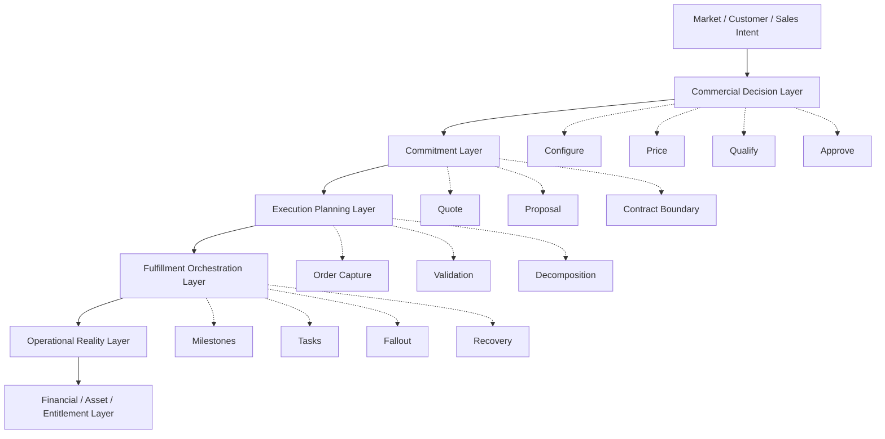

Interpretasi:

- CPQ bukan hanya UI sales.
- OMS bukan hanya order table.
- Catalog bukan hanya daftar produk.
- Pricing bukan hanya formula.
- Approval bukan hanya workflow.
- Fulfillment bukan hanya downstream call.
- Audit bukan hanya log.

Semua layer harus mempertahankan makna bisnis dari awal sampai akhir.

---

## 3. Architecture Principles

Sebelum capability map, tetapkan prinsip.

### 3.1 Separate Decision from Execution

CPQ membuat keputusan komersial:

```text
Produk apa yang boleh dijual,
kepada siapa,
dengan konfigurasi apa,
dengan harga apa,
dengan syarat apa,
dan approval apa.
```

OMS mengeksekusi komitmen:

```text
Apa yang sudah disetujui/dibeli,
bagaimana dipecah menjadi pekerjaan,
apa status fulfillment,
apa yang gagal,
dan bagaimana dipulihkan.
```

Jangan membuat CPQ melakukan fulfillment detail. Jangan membuat OMS menghitung ulang semua pricing tanpa alasan yang jelas.

### 3.2 Snapshot Commitments

Keputusan komersial harus dibekukan pada titik tertentu.

Snapshot minimal:

1. product configuration,
2. catalog version,
3. price result,
4. discount decision,
5. approval result,
6. proposal document version,
7. terms summary,
8. customer acceptance timestamp.

### 3.3 Version Everything That Can Change

Objek yang harus versioned:

1. product offering,
2. product specification,
3. bundle structure,
4. compatibility rule,
5. price book,
6. promotion,
7. discount policy,
8. approval policy,
9. document template,
10. decomposition rule,
11. fulfillment process,
12. contract clause.

### 3.4 Make Failure First-Class

Platform enterprise harus mengasumsikan failure.

Failure bukan edge case. Failure adalah normal state.

Contoh:

1. pricing service unavailable,
2. quote approved then edited,
3. catalog retired after quote created,
4. order submitted twice,
5. downstream times out after success,
6. billing account missing,
7. fulfillment line partially completed,
8. customer cancels during provisioning.

### 3.5 Make Explanation a Product Feature

CPQ/OMS harus bisa menjawab:

1. Mengapa produk ini eligible?
2. Mengapa produk ini tidak bisa dipilih?
3. Mengapa harga ini muncul?
4. Mengapa quote perlu approval?
5. Siapa yang approve?
6. Mengapa order stuck?
7. Apa dampak cancellation?
8. Kenapa billing belum mulai?

Explanation bukan hanya nice-to-have. Ia adalah bagian dari operability dan defensibility.

### 3.6 Optimize for Controlled Change

Enterprise CPQ/OMS berubah terus:

1. produk baru,
2. harga baru,
3. promo baru,
4. channel baru,
5. negara baru,
6. legal clause baru,
7. integration baru,
8. fulfillment partner baru.

Architecture yang baik membuat perubahan ini terkontrol, bukan membuat engineer harus patch production logic setiap minggu.

---

## 4. End-to-End Capability Map

Capability map adalah cara melihat platform tanpa terjebak pada aplikasi/vendor tertentu.

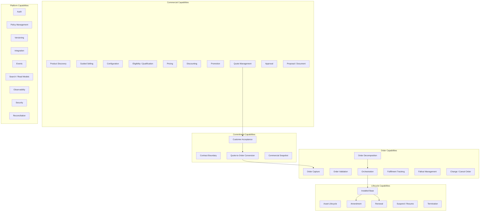

Capability map ini akan menjadi backbone seri.

---

## 5. Capability Group 1: Product and Catalog

### 5.1 Responsibilities

Product and Catalog capability bertanggung jawab atas:

1. product offering,
2. product specification,
3. commercial bundle,
4. options and add-ons,
5. characteristics,
6. compatibility rules,
7. lifecycle status,
8. market/channel visibility,
9. effective dating,
10. publish and rollback.

### 5.2 What It Should Not Own

Catalog tidak seharusnya menjadi pemilik:

1. customer-specific entitlement,
2. negotiated contract price,
3. quote approval decision,
4. order state,
5. fulfillment task state,
6. billing invoice status.

### 5.3 Key Artifact

```text
Catalog Release Package
- catalog version
- effective date
- product offerings changed
- pricing dependency
- eligibility dependency
- downstream mapping changes
- migration notes
- rollback instruction
```

### 5.4 Critical Invariants

1. Quote must know which catalog version it used.
2. Retired products must not silently disappear from active quotes/assets.
3. Catalog publication must be atomic from consumer perspective.
4. Product code mapping to downstream systems must be versioned.

---

## 6. Capability Group 2: Configuration

### 6.1 Responsibilities

Configuration capability handles:

1. bundle selection,
2. option selection,
3. characteristic values,
4. cardinality,
5. dependency,
6. compatibility,
7. invalid combination detection,
8. explanation of why a configuration is invalid.

### 6.2 Configuration Flow

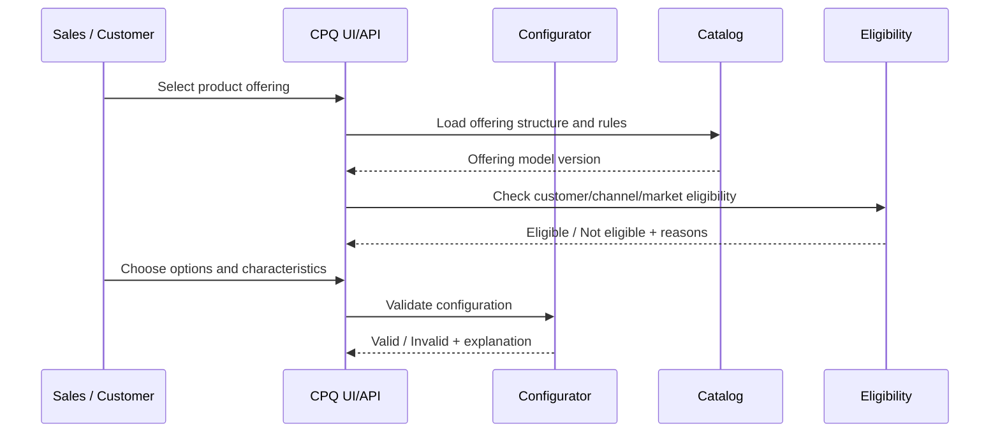

### 6.3 Design Warning

Configurator should not become a dumping ground for every business rule.

Separate:

| Rule Type | Better Owner |
|---|---|
| Product compatibility | Configurator/catalog |
| Customer eligibility | Eligibility service |
| Discount authorization | Pricing/policy/approval |
| Legal clause selection | Document/legal policy |
| Fulfillment feasibility | OMS/feasibility capability |

---

## 7. Capability Group 3: Eligibility and Qualification

### 7.1 Responsibilities

Eligibility answers:

> Can this product/offering be sold to this customer, in this context, at this time?

Qualification answers:

> Can this customer/order proceed given operational, financial, regulatory, or technical checks?

Examples:

1. region eligibility,
2. customer segment eligibility,
3. channel eligibility,
4. partner eligibility,
5. credit qualification,
6. address/serviceability qualification,
7. regulatory qualification,
8. installed-base entitlement.

### 7.2 Eligibility Result Model

Avoid boolean-only response.

Use richer result:

```text
EligibilityResult
- decision: ELIGIBLE | NOT_ELIGIBLE | CONDITIONALLY_ELIGIBLE | UNKNOWN
- reasons[]
- requiredActions[]
- evidence[]
- ruleVersion
- evaluatedAt
```

### 7.3 Critical Invariant

> A product that is configurable is not necessarily orderable.

A valid configuration can still fail because customer is not eligible, address is not serviceable, credit check fails, or channel is not authorized.

---

## 8. Capability Group 4: Pricing, Discount, and Promotion

### 8.1 Responsibilities

Pricing capability handles:

1. list price,
2. recurring charge,
3. one-time charge,
4. usage charge,
5. tiered pricing,
6. volume pricing,
7. contract pricing,
8. currency,
9. proration,
10. promotion,
11. discount,
12. rounding,
13. explanation.

### 8.2 Pricing Pipeline

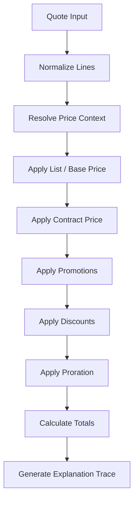

### 8.3 Pricing Output

Pricing should produce more than total.

```text
PricingResult
- linePrices[]
- subtotal
- discountTotal
- recurringTotal
- oneTimeTotal
- usageEstimate
- currency
- roundingPolicy
- appliedRules[]
- warnings[]
- approvalTriggers[]
- priceVersion
```

### 8.4 Critical Invariant

> Pricing must be deterministic for the same input and same versioned rule set.

This is the basis for golden-master tests, audit replay, and dispute resolution.

---

## 9. Capability Group 5: Quote Management

### 9.1 Responsibilities

Quote management owns:

1. quote header,
2. quote lines,
3. configuration snapshot,
4. price snapshot,
5. quote revision,
6. validity period,
7. approval state,
8. proposal generation trigger,
9. customer acceptance,
10. quote-to-order readiness.

### 9.2 Quote Lifecycle

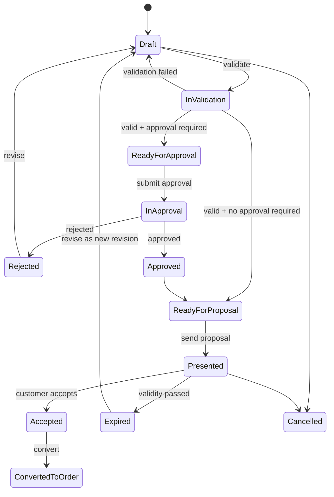

### 9.3 Quote Revision Principle

Mutable draft is acceptable before approval. After approval/presentation/acceptance, changes should create revision.

```text
Quote Q-100 v1 approved
Quote Q-100 v1 presented
Sales changes discount
=> Quote Q-100 v2 draft/reapproval required
```

---

## 10. Capability Group 6: Approval and Policy

### 10.1 Responsibilities

Approval capability handles:

1. approval trigger detection,
2. approval route calculation,
3. approver assignment,
4. delegation,
5. escalation,
6. approve/reject/request-change,
7. approval invalidation,
8. approval evidence.

### 10.2 Policy as Data

Approval rules should be controlled as policy, not hidden in UI code.

Example policy dimensions:

```text
IF discountPercent > thresholdByRole
AND productFamily = "Enterprise Security"
AND region = "EU"
THEN require Sales Director + Finance
```

### 10.3 Approval Binding

Approval must bind to a quote snapshot.

```text
ApprovalDecision
- quoteId
- quoteRevision
- quoteSnapshotHash
- approver
- decision
- reason
- policyVersion
- decidedAt
```

Critical invariant:

> Approval is not valid if the quote snapshot changes in a way that affects approval criteria.

---

## 11. Capability Group 7: Proposal, Document, and Contract Boundary

### 11.1 Responsibilities

Proposal/document capability handles:

1. quote document generation,
2. template selection,
3. legal clause inclusion,
4. localized terms,
5. product terms,
6. customer-specific terms,
7. document version,
8. e-signature handoff,
9. customer acceptance evidence.

### 11.2 Contract Boundary

CPQ usually does not own full contract lifecycle in mature enterprise architecture. CLM may own contract authoring, negotiation, redline, signature, and repository.

The boundary should be explicit:

| Concern | Possible Owner |
|---|---|
| Commercial quote | CPQ |
| Proposal document | CPQ/document service |
| Legal contract negotiation | CLM |
| E-signature ceremony | e-sign provider |
| Signed contract repository | CLM/document management |
| Contracted price reference | CPQ/pricing/contract repository |

### 11.3 Critical Invariant

> The accepted proposal/contract must be traceable to quote revision, price result, product configuration, and approval evidence.

---

## 12. Capability Group 8: Order Capture

### 12.1 Responsibilities

Order capture owns:

1. submitted order,
2. order source,
3. quote reference,
4. customer/account roles,
5. requested dates,
6. delivery information,
7. billing references,
8. order line action,
9. order validation state,
10. order submission evidence.

### 12.2 Order Source Types

Orders may come from:

1. accepted quote,
2. self-service checkout,
3. partner marketplace,
4. API integration,
5. internal migration,
6. bulk import,
7. renewal automation,
8. support-driven change order.

### 12.3 Order Model Principle

Order must represent a commitment to execute, not just a copy of cart.

Important fields:

```text
Order
- orderId
- sourceType
- sourceReference
- relatedParties[]
- orderLines[]
- requestedCompletionDate
- billingAccountRef
- deliveryRefs[]
- commercialSnapshotRef
- validationState
- orchestrationState
```

---

## 13. Capability Group 9: Order Validation and Decomposition

### 13.1 Responsibilities

Order validation checks whether the order can proceed.

Decomposition converts commercial order lines into executable fulfillment plan.

### 13.2 Validation Types

| Validation | Example |
|---|---|
| Data completeness | missing bill-to account |
| Commercial consistency | quote expired before order submission |
| Catalog consistency | product no longer orderable |
| Technical feasibility | address not serviceable |
| Financial readiness | credit hold |
| Contract readiness | signature missing |
| Billing readiness | billing account invalid |
| Fulfillment readiness | required mapping missing |

### 13.3 Decomposition Example

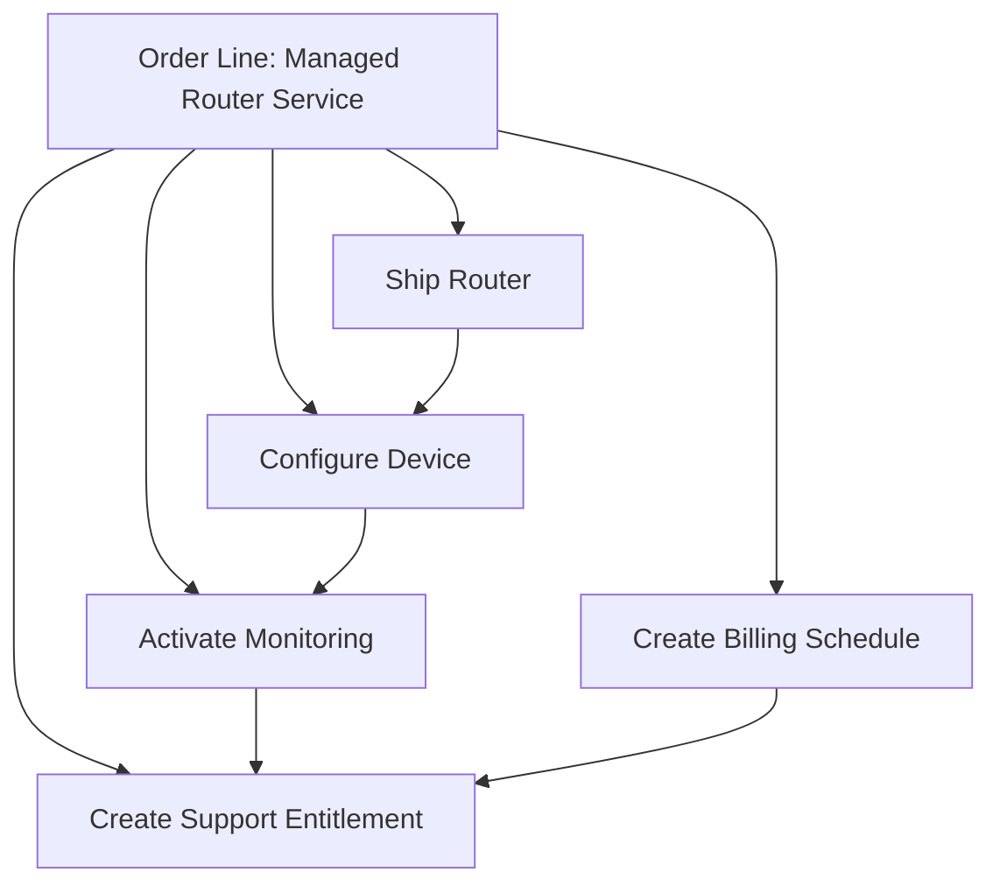

### 13.4 Critical Invariant

> If an order cannot be decomposed, it should not be accepted into fulfillment as if it were executable.

---

## 14. Capability Group 10: Orchestration and Fulfillment

### 14.1 Responsibilities

Orchestration owns:

1. fulfillment plan,
2. task dependency,
3. milestone,
4. state transition,
5. retry,
6. timeout,
7. compensation,
8. manual task,
9. fallout,
10. customer-visible status.

### 14.2 Orchestration Flow

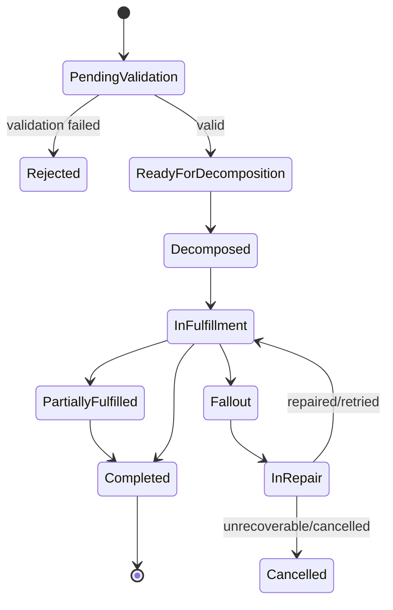

### 14.3 Fulfillment Boundary

OMS may not perform all fulfillment itself. It coordinates.

Downstream systems may include:

1. provisioning,
2. inventory,
3. shipping,
4. field service,
5. identity/entitlement,
6. billing,
7. ERP,
8. external partner.

### 14.4 Critical Invariant

> Every external side effect must have idempotency key, correlation ID, status tracking, and reconciliation path.

---

## 15. Capability Group 11: Installed Base and Asset Lifecycle

### 15.1 Responsibilities

Installed base capability owns or coordinates:

1. active product instance,
2. asset relationship,
3. subscription term,
4. service status,
5. entitlement reference,
6. billing linkage,
7. renewal baseline,
8. amendment baseline,
9. cancellation state.

### 15.2 Asset Lifecycle

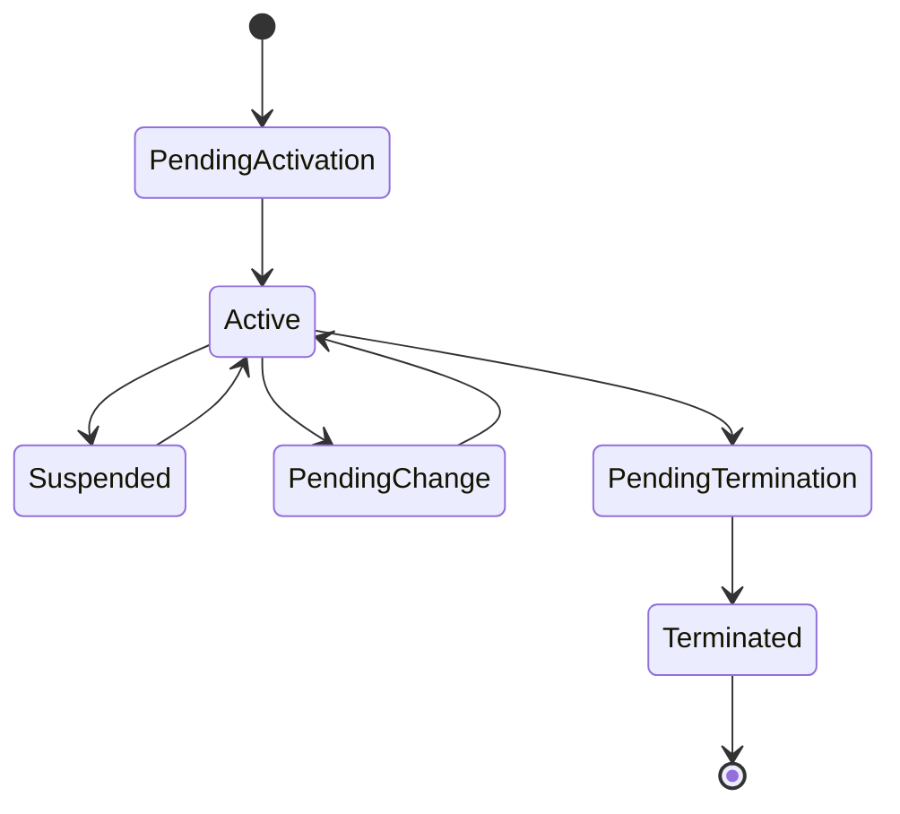

### 15.3 Asset Relationship

Enterprise assets are often hierarchical.

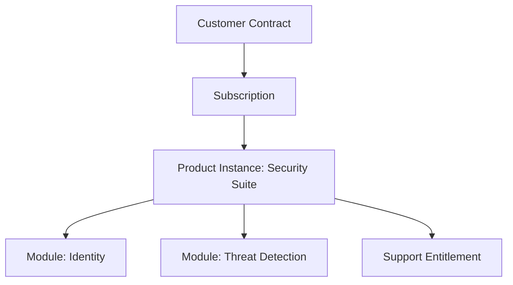

### 15.4 Critical Invariant

> Amendment must be based on known current state and produce explicit desired state delta.

---

## 16. Capability Group 12: Billing, Revenue, and ERP Handoff

### 16.1 Responsibilities

CPQ/OMS usually does not own full billing or accounting. But it must produce clean handoff.

Handoff data includes:

1. customer/account references,
2. billing account,
3. charge lines,
4. recurring schedule,
5. one-time charges,
6. usage charge setup,
7. tax-relevant data,
8. contract reference,
9. service activation date,
10. cancellation effective date,
11. credit/rebill events.

### 16.2 Billing Start Problem

One of the most common defects:

```text
Billing starts from order submission date,
but service starts later after fulfillment.
```

Better design:

```text
Order Submitted Date != Service Activation Date != Billing Start Date
```

### 16.3 Critical Invariant

> Billing should start from an explicit billing trigger derived from commercial terms and fulfillment state, not from accidental technical event timing.

---

## 17. Capability Group 13: Integration and Events

### 17.1 Integration Styles

CPQ/OMS uses multiple integration styles.

| Style | Use When |
|---|---|
| Synchronous API | user needs immediate answer, e.g., pricing preview |
| Async command | long-running execution, e.g., submit fulfillment task |
| Domain event | notify state changes, e.g., quote approved |
| Batch | migration, reconciliation, large sync |
| File/document integration | proposal, contract, invoice attachment |

### 17.2 Example Events

```text
QuoteCreated
QuotePriced
QuoteSubmittedForApproval
QuoteApproved
QuoteRejected
QuotePresented
QuoteAccepted
OrderCreated
OrderValidated
OrderRejected
OrderDecomposed
FulfillmentStarted
FulfillmentTaskCompleted
OrderFalloutRaised
OrderCompleted
AssetActivated
BillingReady
```

### 17.3 Event Design Rule

Events should express business facts, not UI actions.

Prefer:

```text
QuoteApproved
OrderFalloutRaised
AssetActivated
```

Avoid:

```text
ButtonClicked
PageSubmitted
StatusChanged
```

### 17.4 Critical Invariant

> Events are facts that already happened. Commands are requests to do something. Do not mix them.

---

## 18. Capability Group 14: Search, Read Models, and Reporting

### 18.1 Responsibilities

Operational users need fast read models.

Examples:

1. quote search,
2. order search,
3. approval queue,
4. fallout queue,
5. stuck order dashboard,
6. customer asset view,
7. revenue pipeline,
8. billing readiness report,
9. audit evidence view.

### 18.2 Read Model Principle

Do not force every screen/report to query transactional domain models directly.

Use read models optimized for:

1. search,
2. filtering,
3. aggregation,
4. operational queue,
5. timeline display,
6. audit view.

### 18.3 Critical Invariant

> Reporting must distinguish draft, quoted, approved, accepted, ordered, fulfilled, billed, active, cancelled, and terminated states.

Mixing these produces misleading revenue and operational metrics.

---

## 19. Capability Group 15: Audit, Security, and Governance

### 19.1 Audit Responsibilities

Audit capability captures:

1. who did what,
2. when,
3. from where,
4. using which version,
5. with what reason,
6. based on what policy,
7. with what before/after state.

### 19.2 Security Responsibilities

Security includes:

1. quote visibility,
2. price confidentiality,
3. discount authority,
4. approval separation,
5. customer data protection,
6. partner access boundary,
7. support access boundary,
8. admin override control.

### 19.3 Governance Responsibilities

Governance includes:

1. catalog release approval,
2. price change approval,
3. policy change approval,
4. template change approval,
5. emergency rollback,
6. manual correction approval,
7. production data fix control.

### 19.4 Critical Invariant

> Every financially or legally meaningful override must have identity, authority, reason, timestamp, and evidence.

---

## 20. Bounded Context Map

A mature architecture separates bounded contexts by meaning, ownership, and lifecycle.

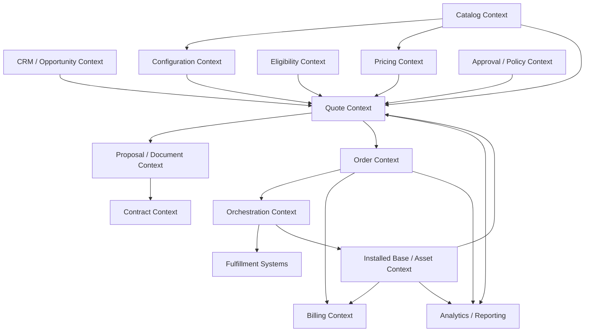

### 20.1 Why Not One Context?

Because each concept changes for different reasons.

| Context | Changes Because |
|---|---|
| Catalog | product team changes offerings |
| Pricing | finance/revenue changes price policy |
| Quote | sales process changes |
| Approval | governance changes |
| Order | execution model changes |
| Orchestration | fulfillment dependency changes |
| Asset | lifecycle/subscription model changes |
| Billing | invoice/revenue model changes |

If all are implemented as one object model, every change becomes risky.

---

## 21. System Context Diagram

A simplified system context:

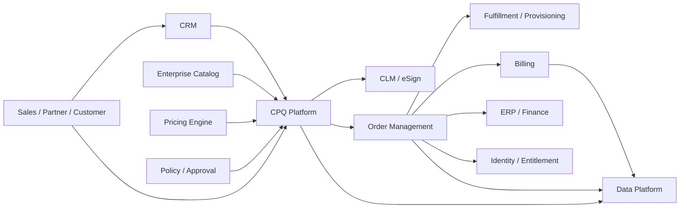

The key is not the boxes. The key is the boundary contracts.

---

## 22. Data Ownership Map

Use this as a starting point, not universal truth.

| Data Object | Likely Owner | Important Consumers |
|---|---|---|
| Lead/opportunity | CRM | CPQ, analytics |
| Product offering | Catalog | CPQ, pricing, OMS |
| Product specification | Catalog/product | Configurator, OMS |
| Price book | Pricing/finance | CPQ, quote, billing |
| Promotion | Pricing/marketing | CPQ, approval |
| Discount policy | Pricing/policy | CPQ, approval |
| Quote | CPQ | CRM, CLM, OMS, analytics |
| Approval decision | Approval/policy | CPQ, audit, analytics |
| Proposal document | Document/CLM | CPQ, customer, legal |
| Product order | OMS | fulfillment, billing, support |
| Fulfillment task | Fulfillment/OMS | OMS, support |
| Asset/subscription | Installed base/subscription | CPQ, billing, support |
| Invoice | Billing | ERP, support, analytics |
| Customer master | CRM/MDM | CPQ, OMS, billing |

Important rule:

> Consumer cache is not ownership.

A system may store a copy for performance or audit, but it must not silently become an alternative source of truth.

---

## 23. Key Platform APIs

This is conceptual, not vendor-specific.

### 23.1 Catalog APIs

```text
GET /catalogs/{catalogId}/offerings
GET /offerings/{offeringId}?version=...
GET /offerings/{offeringId}/configuration-model
GET /offerings/{offeringId}/downstream-mappings
```

### 23.2 Configuration APIs

```text
POST /configurations
POST /configurations/{id}/validate
POST /configurations/{id}/explain-invalidity
```

### 23.3 Pricing APIs

```text
POST /pricing/preview
POST /pricing/calculate
GET /pricing-results/{id}/explanation
```

### 23.4 Quote APIs

```text
POST /quotes
POST /quotes/{id}/lines
POST /quotes/{id}/validate
POST /quotes/{id}/price
POST /quotes/{id}/submit-approval
POST /quotes/{id}/present
POST /quotes/{id}/accept
POST /quotes/{id}/convert-to-order
```

### 23.5 Order APIs

```text
POST /orders
POST /orders/{id}/validate
POST /orders/{id}/decompose
POST /orders/{id}/submit-fulfillment
POST /orders/{id}/cancel
GET /orders/{id}/timeline
```

### 23.6 Asset APIs

```text
GET /customers/{id}/assets
POST /assets/{id}/amendment-preview
GET /assets/{id}/lifecycle
```

API design details will be covered later. Here we only establish capability boundaries.

---

## 24. Key Domain Events

A north-star architecture should define canonical event vocabulary early.

### 24.1 Quote Events

```text
QuoteCreated
QuoteLineAdded
QuoteConfigurationChanged
QuotePriced
QuoteValidationFailed
QuoteSubmittedForApproval
QuoteApprovalRequested
QuoteApproved
QuoteRejected
QuoteRevised
QuotePresented
QuoteAccepted
QuoteExpired
QuoteCancelled
QuoteConvertedToOrder
```

### 24.2 Order Events

```text
OrderCreated
OrderValidationStarted
OrderValidationFailed
OrderValidated
OrderDecompositionStarted
OrderDecomposed
OrderSubmittedToFulfillment
OrderLineFulfillmentStarted
OrderLineFulfilled
OrderFalloutRaised
OrderFalloutRepaired
OrderPartiallyFulfilled
OrderCompleted
OrderCancelled
```

### 24.3 Asset Events

```text
AssetPendingActivation
AssetActivated
AssetChanged
AssetSuspended
AssetResumed
AssetPendingTermination
AssetTerminated
```

### 24.4 Financial Handoff Events

```text
BillingReady
BillingHoldRaised
BillingHoldReleased
ChargeScheduleCreated
CreditRequested
InvoiceCorrectionRequired
```

---

## 25. Platform Non-Functional Capability Map

Enterprise-grade means non-functional requirements are part of the design.

| Capability | Why It Matters |
|---|---|
| Idempotency | Prevent duplicate quote/order/fulfillment side effects |
| Versioning | Support catalog/price/policy evolution |
| Audit trail | Support dispute, compliance, and investigation |
| Replay | Recalculate/explain historical pricing/order decisions |
| Reconciliation | Detect mismatch across CPQ/OMS/billing/fulfillment |
| Observability | Diagnose stuck order and integration failure |
| Access control | Protect price, customer, and deal data |
| Data retention | Meet legal/regulatory requirements |
| Migration tooling | Support catalog/product/customer migrations |
| Bulk processing | Support enterprise quotes/orders/imports |
| Feature flags | Control rollout by channel/region/product |
| Rate limiting | Protect pricing/catalog/order APIs |
| Backpressure | Avoid downstream overload |
| Disaster recovery | Preserve commercial and operational state |

---

## 26. Reference Architecture: Logical View

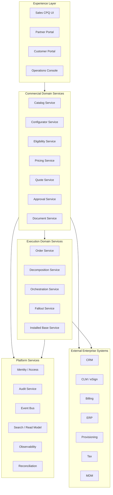

This is a logical view, not a deployment prescription. Some capabilities may run in one application, some as services, some as vendor modules. The important thing is that boundaries remain explicit.

---

## 27. Reference Architecture: Decision Flow

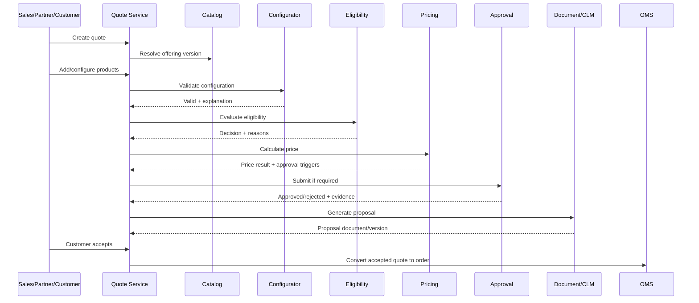

---

## 28. Reference Architecture: Execution Flow

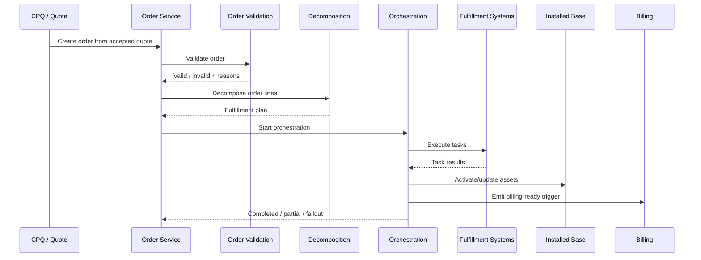

---

## 29. Design Decision Records Needed

A real CPQ/OMS initiative should maintain design decision records.

Minimum ADR set:

1. CPQ/OMS boundary decision.
2. Catalog ownership decision.
3. Pricing ownership decision.
4. Quote snapshot strategy.
5. Approval invalidation strategy.
6. Quote-to-order conversion strategy.
7. Order state model.
8. Decomposition ownership decision.
9. Fulfillment orchestration strategy.
10. Installed base ownership decision.
11. Billing trigger strategy.
12. Integration/event strategy.
13. Audit/evidence strategy.
14. Search/read model strategy.
15. Reconciliation strategy.

Each ADR should answer:

```text
Context:
Decision:
Alternatives considered:
Consequences:
Invariants protected:
Failure modes addressed:
Operational ownership:
```

---

## 30. North-Star Artifact Set

By the end of this series, you should be able to produce these artifacts.

### 30.1 Capability Map

Shows:

1. domain capabilities,
2. platform capabilities,
3. external dependencies,
4. business ownership.

### 30.2 Context Map

Shows:

1. bounded contexts,
2. ownership,
3. upstream/downstream relation,
4. data contracts,
5. anti-corruption boundaries.

### 30.3 Lifecycle State Machines

For:

1. quote,
2. approval,
3. order,
4. fulfillment task,
5. asset/subscription,
6. cancellation/change order.

### 30.4 Event Map

Shows:

1. domain events,
2. event producers,
3. consumers,
4. schema version,
5. replay/reconciliation use.

### 30.5 Data Ownership Matrix

Shows:

1. system of record,
2. consumers,
3. cache/snapshot copy,
4. synchronization strategy,
5. conflict resolution.

### 30.6 Failure Model

Shows:

1. failure scenarios,
2. detection mechanism,
3. recovery owner,
4. retry/compensation,
5. customer impact,
6. evidence required.

---

## 31. Evaluation Rubric

Use this rubric to evaluate a CPQ/OMS architecture.

| Dimension | Weak Design | Strong Design |
|---|---|---|
| Boundary | CPQ/OMS/CRM/billing mixed | Clear ownership and contracts |
| Catalog | Static product table | Versioned product offering model |
| Pricing | Ad hoc formula | Deterministic pricing engine with trace |
| Quote | Mutable cart | Revisioned commercial artifact |
| Approval | Generic workflow | Policy-based, snapshot-bound approval |
| Order | Header status only | Line-level lifecycle and orchestration |
| Fulfillment | Fire-and-forget API calls | Tracked tasks, retry, fallout, reconciliation |
| Asset | Inferred from billing | Explicit installed base lifecycle |
| Audit | Application logs | Business evidence trail |
| Integration | Point-to-point hidden coupling | Versioned APIs/events and ownership matrix |
| Operations | Manual SQL fixes | Runbooks, queues, repair actions |
| Reporting | Revenue/status ambiguity | State-aware read models |

---

## 32. Common Architecture Smells

### 32.1 CRM Owns Everything

CRM becomes owner of quote, catalog, pricing, order, asset, and billing state.

Why it fails:

1. sales object model cannot express fulfillment complexity,
2. operational state pollutes sales process,
3. quote/order/billing lifecycle become coupled,
4. governance becomes fragile.

### 32.2 OMS Reprices the Order Differently

OMS recalculates price using current price rules instead of accepted quote snapshot.

Why it fails:

1. customer commitment changes,
2. invoice mismatch,
3. audit dispute,
4. revenue leakage.

### 32.3 Catalog Directly Drives Fulfillment Without Mapping

Commercial product is assumed to equal technical fulfillment item.

Why it fails:

1. bundle cannot decompose correctly,
2. downstream product codes leak into sales model,
3. product launch requires too many coordinated changes,
4. technical migration breaks sales behavior.

### 32.4 Approval Is Detached from Quote Version

Approval records say “approved” but not what was approved.

Why it fails:

1. quote can change after approval,
2. evidence is weak,
3. policy audit fails,
4. approver responsibility unclear.

### 32.5 Events Are Just Database Status Changes

Event names like `QuoteUpdated` or `StatusChanged` dominate.

Why it fails:

1. consumers do not know business meaning,
2. replay is hard,
3. audit timeline is weak,
4. integration becomes implicit.

---

## 33. Practice: Draw Your Own Capability Map

Choose one business scenario:

1. B2B SaaS enterprise subscription,
2. telecom connectivity order,
3. manufacturing configured product,
4. insurance policy quote/order,
5. logistics contract service,
6. cloud marketplace private offer.

Then create:

```text
1. Commercial capabilities needed
2. Order capabilities needed
3. Lifecycle capabilities needed
4. External systems involved
5. Data owners
6. Events
7. Failure modes
8. Audit evidence required
```

Use this skeleton:

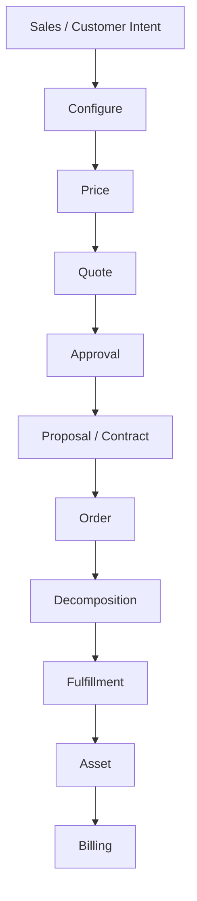

Then challenge it:

1. What changes after approval?
2. What changes after acceptance?
3. What can fail downstream?
4. What must be immutable?
5. What must be versioned?
6. What must be reconciled?

---

## 34. Staff-Level Review Checklist

Before approving a CPQ/OMS architecture, ask:

1. Is CPQ/OMS boundary explicit?
2. Is catalog ownership explicit?
3. Is pricing deterministic and explainable?
4. Are quote revisions modeled?
5. Is approval bound to quote snapshot?
6. Is customer acceptance captured as evidence?
7. Is quote-to-order conversion deterministic?
8. Is order validation separate from quote validation?
9. Is decomposition explicit?
10. Are fulfillment tasks tracked?
11. Are partial fulfillment and fallout modeled?
12. Are retries idempotent?
13. Is installed base a first-class concept?
14. Are amendment and renewal based on current asset state?
15. Is billing triggered by explicit business event?
16. Are events named as business facts?
17. Is source of truth clear for each entity?
18. Is audit trail business-meaningful?
19. Are read models designed for operations?
20. Is there a reconciliation strategy?

---

## 35. Summary

North-star architecture CPQ/OMS bukan sekadar diagram aplikasi.

Ia harus menjawab:

1. capability apa yang dibutuhkan,
2. siapa pemilik data,
3. apa boundary antar context,
4. apa yang immutable,
5. apa yang versioned,
6. apa yang bisa gagal,
7. bagaimana recovery dilakukan,
8. bagaimana audit membuktikan keputusan,
9. bagaimana order berubah menjadi pekerjaan nyata,
10. bagaimana lifecycle asset/subscription tetap konsisten.

Poin terpenting:

- CPQ/OMS harus dipisahkan antara decision layer dan execution layer.
- Catalog, pricing, quote, approval, order, orchestration, asset, billing, and audit punya lifecycle berbeda.
- Snapshot dan versioning adalah fondasi commercial correctness.
- Orchestration dan fallout adalah fondasi operational correctness.
- Events, read models, and reconciliation adalah fondasi enterprise operability.
- Capability map lebih penting daripada vendor/product diagram.

Part berikutnya akan masuk ke **Product Modeling for CPQ and Order Management**, yaitu fondasi untuk memahami product offering, specification, bundle, option, characteristic, commercial product, technical product, and versioning.

---

## 36. Referensi

- Salesforce, “What Is CPQ, or Configure, Price, Quote?” — https://www.salesforce.com/sales/cpq/what-is-cpq/
- Salesforce Help, “Guided Selling in Salesforce CPQ” — https://help.salesforce.com/s/articleView?id=sales.cpq_guided_selling.htm&type=5
- TM Forum, “TMF620 Product Catalog Management API v5.0” — https://www.tmforum.org/open-digital-architecture/open-apis/product-catalog-management-api-TMF620/v5.0
- TM Forum, “TMF622 Product Ordering Management API v5.0” — https://www.tmforum.org/open-digital-architecture/open-apis/product-ordering-management-api-TMF622/v5.0
- Oracle Documentation, “Set Up Orchestration Processes” — https://docs.oracle.com/en/cloud/saas/supply-chain-and-manufacturing/25c/faiom/set-up-orchestration-processes.html
- Oracle Documentation, “Overview of Using Business Rules With Order Management” — https://docs.oracle.com/en/cloud/saas/supply-chain-and-manufacturing/25d/faiom/overview-of-using-business-rules-with-order-management.html
