# Part 005 — Product Modeling for CPQ and Order Management

## Tujuan Bagian Ini

Setelah bagian sebelumnya kita membangun **north-star architecture** dan capability map, bagian ini masuk ke jantung CPQ/OMS: **product model**.

Di enterprise CPQ/OMS, product model bukan sekadar tabel `product` atau SKU list. Product model adalah kontrak domain yang menentukan:

1. apa yang boleh dijual,
2. kepada siapa boleh dijual,
3. bagaimana produk dikonfigurasi,
4. bagaimana produk dihitung harganya,
5. bagaimana quote line dibentuk,
6. bagaimana order line didekomposisi,
7. bagaimana fulfillment memahami produk,
8. bagaimana asset/subscription terbentuk setelah order selesai,
9. bagaimana perubahan produk dilakukan tanpa merusak histori komersial.

Mental model yang perlu dibangun:

> Product model adalah grammar bisnis. CPQ adalah parser + evaluator komersial. OMS adalah executor atas kalimat bisnis yang sudah valid.

Kalau grammar-nya lemah, semua layer di atasnya akan menghasilkan ambiguity: pricing salah, quote tidak valid, approval bocor, order stuck, billing mismatch, fulfillment bingung, dan audit tidak defensible.

---

## Kaufman Framing

Mengikuti pendekatan Josh Kaufman, skill ini kita pecah menjadi sub-skill yang bisa dilatih:

| Sub-skill | Kemampuan Praktis |
|---|---|
| Memisahkan product concept | Bisa membedakan offering, specification, SKU, bundle, option, technical product, service, resource |
| Mendesain relationship | Bisa memodelkan bundle, dependency, compatibility, substitution, upgrade path |
| Mendesain lifecycle | Bisa menentukan draft, active, retired, superseded, grandfathered, effective date |
| Mendesain versioning | Bisa menjaga quote/order lama tetap valid walaupun catalog berubah |
| Mendesain invariants | Bisa mendefinisikan hal yang tidak boleh dilanggar oleh configurator, pricing, dan OMS |
| Mendesain handoff | Bisa memastikan product model cukup kaya untuk CPQ, OMS, billing, fulfillment, dan reporting |

Target performa setelah Part 005:

> Kamu mampu membaca sebuah product catalog enterprise yang kacau, memetakan kelemahannya, lalu mengusulkan model yang lebih defensible untuk CPQ/OMS tanpa langsung terjebak pada pilihan vendor atau database schema.

---

## 1. Kenapa Product Modeling Sulit di Enterprise

Untuk sistem kecil, product sering terlihat sederhana:

```text
Product(id, name, price)
```

Untuk enterprise CPQ/OMS, model itu hampir selalu gagal karena dunia nyata mengandung:

- produk fisik,
- produk digital,
- subscription,
- usage-based product,
- professional service,
- license,
- maintenance,
- support tier,
- hardware + software bundle,
- region-specific offer,
- channel-specific offer,
- customer-specific entitlement,
- renewal SKU,
- upgrade SKU,
- regulatory restriction,
- technical provisioning dependency,
- billing schedule,
- tax category,
- revenue recognition classification,
- inventory impact,
- contract term.

Contoh: `Enterprise Firewall Premium` mungkin terlihat sebagai satu produk untuk sales, tetapi secara internal bisa terdiri dari:

- hardware appliance,
- subscription license,
- threat intelligence add-on,
- support package,
- installation service,
- cloud management portal entitlement,
- warranty,
- shipping,
- renewal commitment,
- regional compliance clause.

Jika semua ini dipaksa menjadi satu record `product`, sistem akan kehilangan kemampuan menjawab pertanyaan penting:

- Apakah item ini bisa dijual sendiri?
- Apakah item ini harus muncul di quote?
- Apakah item ini harus dipenuhi oleh fulfillment?
- Apakah item ini dikenakan pajak?
- Apakah item ini recurring atau one-time?
- Apakah item ini membentuk asset?
- Apakah item ini boleh diubah saat renewal?
- Apakah item ini visible untuk channel partner?
- Apakah item ini hanya technical child dari commercial product?

---

## 2. Core Mental Model: Product Has Multiple Faces

Satu "produk" memiliki beberapa wajah tergantung siapa yang melihatnya.

| View | Pertanyaan Utama | Contoh Pengguna |
|---|---|---|
| Commercial view | Apa yang dijual dan dibeli customer? | Sales, partner, customer portal |
| Configuration view | Opsi apa yang boleh dipilih? | CPQ configurator |
| Pricing view | Bagaimana charge dihitung? | Pricing engine, deal desk |
| Contract view | Komitmen hukum apa yang terbentuk? | Legal, contract team |
| Order view | Apa yang harus diproses setelah customer setuju? | OMS |
| Fulfillment view | Apa yang harus diprovide, dikirim, dipasang, atau diaktifkan? | Provisioning, logistics, service ops |
| Billing view | Apa yang harus ditagih, kapan, dan dengan pola apa? | Billing, finance |
| Asset view | Instance apa yang dimiliki customer setelah order selesai? | Support, success, renewal team |
| Analytics view | Bagaimana revenue dan adoption dilaporkan? | Finance, leadership, product management |

Kesalahan umum adalah menganggap satu model fisik bisa melayani semua view tanpa boundary. Akibatnya, field bertambah terus sampai object menjadi **god object**.

Desain yang lebih sehat:

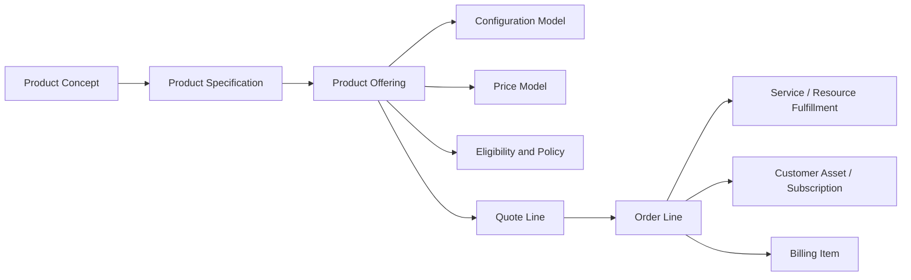

Product model yang baik tidak mencoba membuat semua view identik. Ia membuat **mapping eksplisit** antar-view.

---

## 3. Vocabulary yang Harus Dikunci

### 3.1 Product Concept

`Product Concept` adalah ide bisnis mentah.

Contoh:

- "Business Internet 1Gbps"
- "Premium Support"
- "Cloud Storage 10TB"
- "Enterprise Security Suite"

Concept belum tentu bisa dijual. Ia adalah nama bisnis atau portfolio idea.

### 3.2 Product Specification

`Product Specification` menjelaskan karakteristik produk secara reusable.

Contoh specification:

```yaml
ProductSpecification:
  id: internet-access-spec
  name: Internet Access
  characteristics:
    - bandwidth
    - accessTechnology
    - staticIpCount
    - slaTier
```

Specification menjawab:

- karakteristik apa yang produk punya,
- tipe data apa yang valid,
- apakah mandatory,
- apakah configurable,
- apakah visible untuk sales/customer,
- apakah relevan untuk fulfillment.

### 3.3 Product Offering

`Product Offering` adalah produk yang benar-benar ditawarkan ke pasar.

Offering biasanya mengikat:

- specification,
- price,
- market,
- channel,
- customer segment,
- region,
- lifecycle,
- effective date,
- eligibility rule,
- policy rule.

Contoh:

```yaml
ProductOffering:
  id: bo-internet-1g-sg-2026
  name: Business Internet 1Gbps - Singapore
  specificationRef: internet-access-spec
  market: SG
  segment: enterprise
  channel: direct-sales
  lifecycleStatus: active
  effectiveFrom: 2026-01-01
  effectiveTo: 2026-12-31
```

Dalam standar TM Forum, Product Ordering API biasanya membuat order berdasarkan product offering yang didefinisikan di catalog; offering tersebut merepresentasikan product atau set of products yang tersedia bagi customer serta mencakup pricing, product options, dan market.

### 3.4 SKU

`SKU` sering dipakai untuk inventory, ERP, fulfillment, atau commercial tracking. Tetapi SKU bukan selalu sama dengan product offering.

| Scenario | SKU = Offering? | Catatan |
|---|---:|---|
| Simple retail product | Sering iya | Satu SKU dijual langsung |
| Enterprise software subscription | Tidak selalu | Offering bisa menghasilkan beberapa billing/entitlement SKU |
| Telecom bundle | Hampir tidak | One commercial offer bisa map ke banyak service/resource SKU |
| Professional service | Tidak selalu | Bisa berupa labor category, milestone, project package |
| Renewal/amendment | Tidak selalu | SKU bisa berbeda untuk new sale vs renewal |

Aturan praktis:

> SKU adalah identifier operasional/komersial tertentu. Product offering adalah unit marketable. Jangan menjadikan SKU sebagai satu-satunya model produk jika bisnis memiliki bundle, subscription, atau technical decomposition.

### 3.5 Bundle

`Bundle` adalah offering yang terdiri dari beberapa component.

Jenis bundle:

| Tipe | Deskripsi | Contoh |
|---|---|---|
| Static bundle | Komponen tetap | Laptop + warranty + bag |
| Configurable bundle | Customer/sales memilih option | Internet + router choice + SLA tier |
| Nested bundle | Bundle di dalam bundle | Security suite berisi endpoint + firewall + monitoring |
| Commercial bundle | Satu harga untuk beberapa komponen | Office productivity suite |
| Technical bundle | Terlihat satu secara komersial, terurai teknis | Mobile plan menjadi SIM + number + network service |
| Promotional bundle | Bundle karena campaign | Buy 10 licenses get support discount |

### 3.6 Option

`Option` adalah pilihan dalam konteks konfigurasi.

Contoh:

```yaml
OptionGroup:
  name: SLA Tier
  minCardinality: 1
  maxCardinality: 1
  options:
    - Standard
    - Gold
    - Platinum
```

Option bukan selalu produk mandiri. Ia bisa:

- child offering,
- characteristic value,
- pricing modifier,
- fulfillment instruction,
- contract term.

### 3.7 Add-on

`Add-on` adalah produk tambahan yang bergantung pada produk utama.

Contoh:

- static IP add-on untuk internet access,
- premium support untuk software subscription,
- extra storage untuk cloud plan.

Invariants:

- add-on tidak boleh aktif tanpa parent valid,
- add-on harus punya compatibility dengan parent,
- add-on termination harus mengikuti atau bereaksi terhadap parent termination,
- add-on renewal harus jelas apakah coterminate dengan parent.

### 3.8 Accessory

Accessory mirip add-on, tetapi sering lebih lepas.

Contoh:

- mouse untuk laptop,
- cable untuk monitor,
- mounting bracket untuk device.

Accessory bisa dijual sendiri atau sebagai recommendation.

### 3.9 Product Characteristic

Characteristic adalah property produk.

Contoh:

| Characteristic | Type | Configurable? | Used By |
|---|---|---:|---|
| bandwidth | enum | yes | configurator, pricing, fulfillment |
| contractTerm | integer/month | yes | pricing, contract, billing |
| color | enum | yes | quote, fulfillment |
| taxCategory | enum | no | tax engine |
| provisioningCode | string | no | fulfillment |
| revenueCategory | enum | no | finance |

Aturan penting:

> Jangan semua hal dijadikan characteristic hanya karena mudah. Jika sebuah field menentukan lifecycle, pricing, order decomposition, atau accounting, ia mungkin butuh model eksplisit.

---

## 4. Product Specification vs Product Offering

Ini boundary paling penting.

### Specification menjawab: "Apa struktur produknya?"

Contoh:

```yaml
ProductSpecification:
  id: mobile-plan-spec
  characteristics:
    - dataAllowance
    - voiceAllowance
    - roamingEnabled
    - contractTerm
```

### Offering menjawab: "Bagaimana struktur itu dijual di market tertentu?"

```yaml
ProductOffering:
  id: mobile-plan-premium-id-2026
  name: Premium Mobile Plan Indonesia 2026
  specificationRef: mobile-plan-spec
  market: ID
  channel: ecommerce
  priceBookRef: id-consumer-2026
  eligibilityPolicyRef: mobile-consumer-policy-v3
```

Satu specification bisa punya banyak offering:

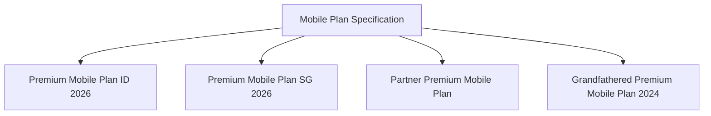

Manfaat separation:

- struktur produk reusable,
- market/channel bisa berbeda,
- lifecycle bisa berbeda,
- price bisa berbeda,
- eligibility bisa berbeda,
- quote lama tetap bisa refer offering version lama,
- order decomposition bisa tetap konsisten.

Anti-pattern:

```text
Product table:
- id
- name
- sku
- price
- region
- segment
- bandwidth
- color
- tax
- provisioning_code
- discount_rule
- approval_rule
- renewal_rule
- effective_date
- is_bundle
- parent_product_id
- ...
```

Model seperti ini terlihat praktis di awal, tetapi akan rusak ketika:

- satu specification punya banyak market offering,
- satu offering punya beberapa price model,
- region punya regulatory rule berbeda,
- bundle nested,
- produk berubah tetapi quote lama harus tetap valid,
- fulfillment membutuhkan technical decomposition berbeda dari commercial view.

---

## 5. Commercial Product vs Technical Product

Enterprise CPQ/OMS harus membedakan **apa yang customer beli** dari **apa yang sistem harus fulfill**.

### Commercial product

Visible untuk sales/customer.

Contoh:

- Enterprise Internet 1Gbps
- Cloud Backup Premium
- Advanced Fraud Protection
- Premium Support

### Technical product/service/resource

Visible untuk fulfillment/provisioning.

Contoh:

- fiber access service,
- router device,
- static IP allocation,
- monitoring entitlement,
- customer portal role,
- DNS configuration,
- billing subscription item.

Mapping:

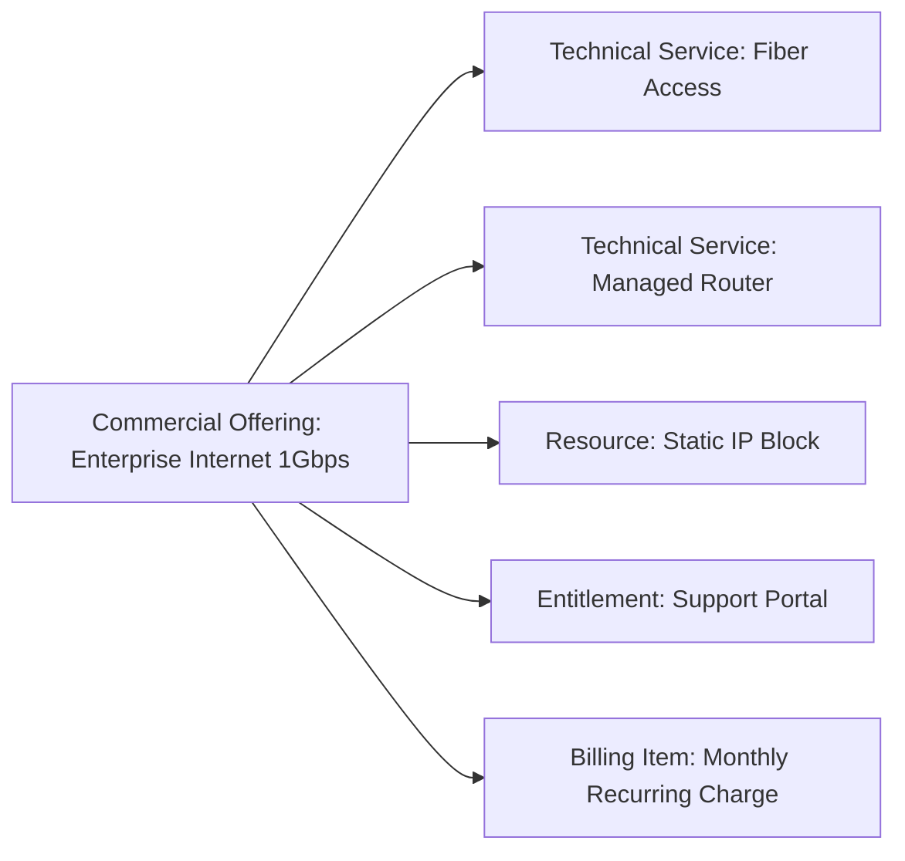

Kesalahan umum:

1. **Mengekspos technical product ke sales.**  
   Sales harus memilih "Business Internet 1Gbps", bukan "OLT Profile X + VLAN Y + Radius Policy Z".

2. **Menyembunyikan technical dependency terlalu jauh.**  
   OMS tetap butuh decomposition rule untuk tahu apa yang harus dieksekusi.

3. **Menggabungkan commercial dan technical lifecycle.**  
   Commercial offering bisa retired, sementara technical service masih aktif untuk customer existing.

---

## 6. Product Relationship Types

Product modeling enterprise sangat bergantung pada relationship. Jangan hanya punya `parent_id`.

### 6.1 Contains

Bundle mengandung component.

```text
Security Suite contains Endpoint Protection, Firewall, Monitoring
```

### 6.2 Requires

Satu produk membutuhkan produk lain.

```text
Static IP Add-on requires Business Internet
```

### 6.3 Excludes

Dua produk tidak boleh dipilih bersama.

```text
Basic Support excludes Premium Support
```

### 6.4 Recommends

Satu produk menyarankan produk lain, tetapi tidak wajib.

```text
Laptop recommends Extended Warranty
```

### 6.5 Replaces

Produk baru menggantikan produk lama.

```text
Cloud Backup Premium 2026 replaces Cloud Backup Premium 2024
```

### 6.6 Upgrades To

Jalur upgrade yang valid.

```text
Standard Plan upgradesTo Premium Plan
```

### 6.7 Downgrades To

Jalur downgrade yang valid.

```text
Premium Plan downgradesTo Standard Plan
```

### 6.8 Depends On Asset

Produk hanya bisa dibeli jika customer memiliki asset tertentu.

```text
Extra Storage Add-on dependsOnAsset Cloud Storage Subscription
```

### 6.9 Mutually Exclusive Asset

Customer tidak boleh memiliki dua asset aktif yang conflict.

```text
Legacy Firewall Service conflictsWith NextGen Firewall Service
```

Model relationship:

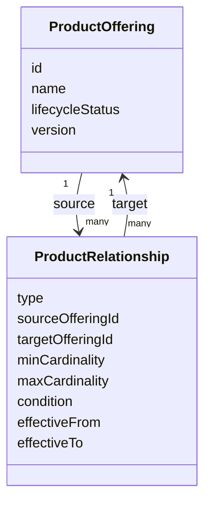

Aturan desain:

> Relationship harus typed, versioned, effective-dated, dan bisa dievaluasi oleh configurator serta validator.

---

## 7. Cardinality: Detail Kecil yang Sering Menjadi Sumber Bug Besar

Cardinality menjawab:

- minimal berapa item harus dipilih,
- maksimal berapa item boleh dipilih,
- apakah boleh duplicate,
- apakah quantity-based,
- apakah berlaku per bundle instance atau per quote.

Contoh:

```yaml
Bundle: Managed Internet Package
OptionGroups:
  - name: Access Technology
    min: 1
    max: 1
    options: [Fiber, Microwave, 5G]
  - name: Router
    min: 1
    max: 2
    options: [Standard Router, HA Router]
  - name: Static IP
    min: 0
    max: 5
    options: [1 IP, 5 IP, 13 IP]
```

Failure scenario:

- Catalog bilang router max 2.
- Configurator tidak enforce max.
- Sales menambahkan 3 router.
- Pricing menghitung 3 router.
- OMS hanya support 2 router.
- Fulfillment reject order.
- Customer sudah menerima quote.

Invariant:

> Cardinality harus dievaluasi sebelum quote bisa submitted, dan harus divalidasi ulang sebelum order accepted.

---

## 8. Product Lifecycle

Lifecycle tidak boleh hanya `active = true/false`.

Model minimal:

| Status | Meaning | Quote Baru? | Order Baru? | Existing Asset? |
|---|---|---:|---:|---:|
| Draft | Belum siap dijual | No | No | No |
| Approved | Siap publish tetapi belum aktif | No | No | No |
| Active | Bisa dijual | Yes | Yes | Yes |
| Suspended | Sementara tidak boleh dijual | No | Usually No | Existing tetap valid |
| Retired | Tidak boleh dijual lagi | No | No | Existing tetap valid |
| Grandfathered | Tidak untuk customer baru, masih untuk existing | Limited | Limited | Yes |
| Superseded | Digantikan versi baru | No for new sale | Maybe for amendments | Yes |
| Deleted | Biasanya tidak boleh untuk audit | No | No | Dangerous |

State machine:

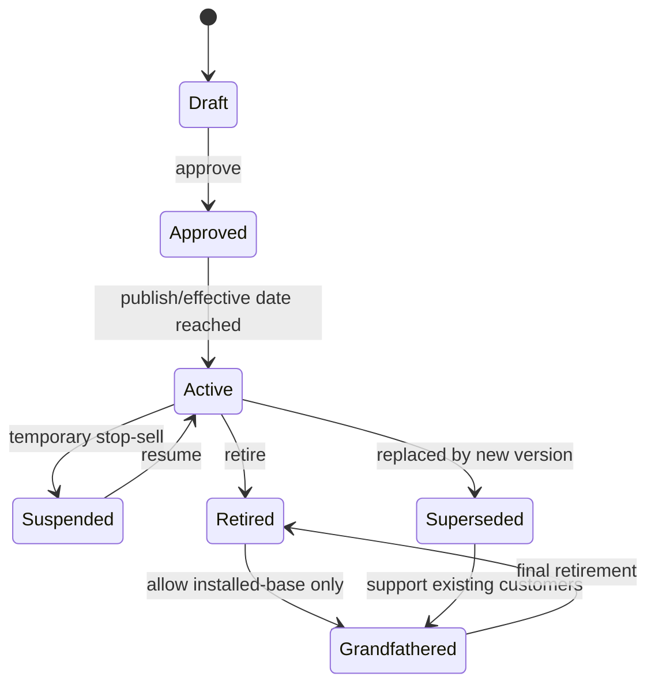

Critical distinction:

- **Stop sell**: tidak boleh dijual untuk quote baru.
- **Stop order**: tidak boleh masuk order baru.
- **Stop fulfill**: tidak boleh diproses fulfillment baru.
- **Stop bill**: tidak boleh dibuat billing item baru.
- **End of support**: customer existing tidak lagi didukung setelah tanggal tertentu.

Satu status `inactive` tidak cukup untuk semua nuance tersebut.

---

## 9. Versioning dan Effective Dating

Enterprise product model harus menjawab pertanyaan:

> Jika catalog berubah hari ini, apa yang terjadi pada quote yang dibuat kemarin dan order yang masih in-flight?

Jawaban yang defensible hampir selalu membutuhkan:

- immutable version,
- effective date,
- quote snapshot,
- order snapshot,
- explicit migration policy.

### 9.1 Versioning

Contoh:

```yaml
ProductOffering:
  stableId: cloud-storage-premium
  version: 2026.01
  lifecycleStatus: active

ProductOffering:
  stableId: cloud-storage-premium
  version: 2026.07
  lifecycleStatus: active
```

Gunakan dua identifier:

| Identifier | Fungsi |
|---|---|
| stableId | Identitas logical lintas versi |
| versionId | Identitas immutable untuk versi tertentu |

### 9.2 Effective Dating

```yaml
effectiveFrom: 2026-07-01T00:00:00+07:00
effectiveTo: 2026-12-31T23:59:59+07:00
```

Jangan hanya memvalidasi berdasarkan tanggal sekarang. Gunakan **business effective date**:

- quote creation date,
- quote requested start date,
- contract start date,
- order submission date,
- service activation date.

Contoh konflik:

- Quote dibuat 2026-06-25.
- Harga baru aktif 2026-07-01.
- Customer accept quote 2026-07-03.
- Quote validity sampai 2026-07-10.

Pertanyaan desain:

- Apakah price lama masih valid sampai quote expiry?
- Apakah order boleh memakai price snapshot?
- Apakah regulatory fee baru harus recalculated?
- Apakah approval perlu diulang karena price sudah stale?

Tidak ada jawaban universal. Yang wajib adalah policy-nya eksplisit.

---

## 10. Product Model as Graph

Untuk enterprise CPQ/OMS, product model lebih tepat dipahami sebagai graph daripada tabel datar.

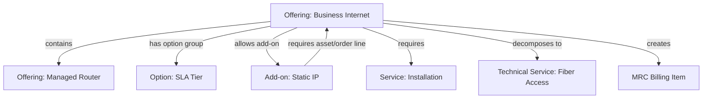

Graph memberi kita kemampuan:

- traverse dependency,
- validate compatibility,
- detect cycle,
- explain why item required/excluded,
- compute order decomposition,
- impact analysis saat product berubah.

### Cycle Detection

Cycle berbahaya:

```text
A requires B
B requires C
C requires A
```

Configurator bisa stuck atau menghasilkan explanation yang tidak masuk akal.

Invariant:

> Relationship graph untuk dependency hard-requirement harus acyclic atau memiliki semantics khusus yang jelas.

---

## 11. Product Model and Quote Line

Quote line bukan copy mentah product record. Quote line adalah commercial snapshot dari offering yang dikonfigurasi.

Quote line minimal menyimpan:

- quote line id,
- product offering version id,
- display name snapshot,
- selected characteristics,
- quantity,
- price components snapshot,
- discount snapshot,
- tax boundary reference,
- configuration trace,
- eligibility result reference,
- parent/child relationship dalam quote,
- source asset reference jika amendment,
- intended action: add/change/remove/renew.

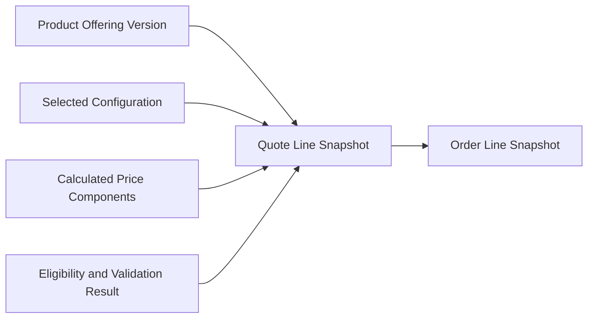

Kenapa snapshot penting?

- Customer melihat nama produk tertentu di proposal.
- Harga dihitung berdasarkan policy saat quote dibuat.
- Approval diberikan pada konfigurasi tertentu.
- Legal document mengacu ke term tertentu.
- Audit perlu membuktikan apa yang ditawarkan.

Jika quote hanya menyimpan `product_id`, perubahan catalog bisa mengubah makna historis quote.

---

## 12. Product Model and Order Line

Order line harus lebih executable daripada quote line.

Quote line fokus pada commercial acceptance. Order line fokus pada execution.

Order line membutuhkan:

- product offering snapshot,
- action type,
- requested start date,
- requested completion date,
- service address,
- fulfillment decomposition hints,
- related party,
- billing account,
- installation appointment,
- dependency to other order lines,
- asset reference,
- technical service/resource mapping.

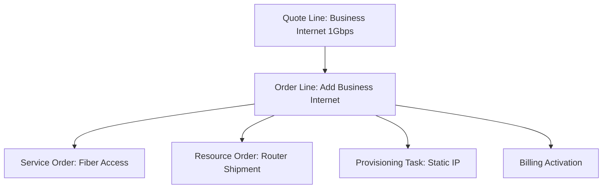

Product model harus cukup kaya agar OMS bisa menentukan:

- apakah line menghasilkan service order,
- apakah line menghasilkan shipment,
- apakah line menghasilkan billing activation,
- apakah line menghasilkan asset,
- urutan task,
- dependency antar-task.

---

## 13. Product Model and Asset Lifecycle

Setelah order fulfilled, customer biasanya memiliki asset/subscription/product instance.

Asset bukan hanya order line historis. Asset adalah current installed/commercial state.

Asset menyimpan:

- customer/account,
- product offering version at activation,
- current configuration,
- status,
- start date,
- end date,
- renewal date,
- contract reference,
- billing reference,
- parent asset,
- child assets,
- entitlement,
- technical service reference.

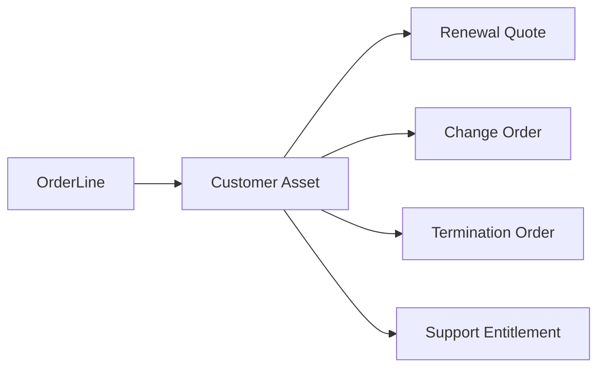

Invariants:

- active add-on asset must have active compatible parent asset,
- asset configuration must be traceable to originating order,
- amendment must not mutate historical order line,
- current asset state can change, but historical quote/order snapshot cannot,
- asset status must not contradict billing/provisioning status without explicit reconciliation state.

---

## 14. Product Model Design Patterns

### 14.1 Marketable Offering + Technical Decomposition

Gunakan ketika sales menjual simple commercial product, tetapi fulfillment kompleks.

```text
Commercial Offering -> Decomposition Rule -> Service/Resource Orders
```

Cocok untuk telecom, cloud, managed services, infrastructure.

### 14.2 Base Product + Add-on

Gunakan ketika produk tambahan bergantung pada parent.

```text
Base Subscription -> Add-on Product -> Child Asset
```

Cocok untuk SaaS, storage, support tier, security features.

### 14.3 Bundle with Option Groups

Gunakan ketika customer perlu memilih konfigurasi.

```text
Bundle -> Option Group -> Option Offering/Characteristic
```

Cocok untuk CPQ guided selling.

### 14.4 Product Family + Offer Variants

Gunakan ketika variasi market/channel/segment banyak.

```text
Product Family -> Specification -> Offering Variants
```

Cocok untuk multi-country, partner channel, enterprise segmentation.

### 14.5 Grandfathered Product

Gunakan ketika existing customers tetap punya produk lama, tapi new sales diarahkan ke produk baru.

```text
Old Offering: not sellable, amendable under restrictions
New Offering: sellable
Migration Rule: old -> new
```

### 14.6 Technical Phantom Component

Gunakan untuk komponen yang tidak muncul di quote, tetapi wajib untuk fulfillment/billing.

Contoh:

- activation fee item,
- provisioning profile,
- entitlement token,
- default support entitlement.

Perlu hati-hati karena phantom component sering membuat sales bingung jika muncul di invoice tanpa traceability.

---

## 15. Anti-Patterns

### 15.1 One Product Table to Rule Them All

Gejala:

- satu tabel product berisi field commercial, pricing, fulfillment, billing, tax, legal, analytics,
- banyak nullable fields,
- field meaning berubah per product type,
- logic tersebar di aplikasi.

Akibat:

- validasi sulit,
- catalog authoring rawan error,
- impact analysis hampir mustahil,
- quote/order historical drift.

### 15.2 Product Name as Logic

Contoh:

```text
if productName contains "Premium" then require approval
```

Ini rapuh. Product name berubah karena marketing, translation, rebranding.

Gunakan explicit attributes atau policy references.

### 15.3 SKU as Everything

SKU penting, tetapi tidak cukup untuk enterprise CPQ/OMS.

Gejala:

- bundle dimodelkan sebagai SKU list tanpa relationship semantics,
- add-on dependency tidak explicit,
- technical decomposition hardcoded by SKU,
- lifecycle product mengikuti ERP item master tanpa commercial nuance.

### 15.4 Mutable Product Definition Referenced by Historical Quote

Jika quote lama selalu membaca product terbaru, audit rusak.

Solusi:

- quote snapshot,
- immutable product offering version,
- pricing trace,
- document snapshot.

### 15.5 Configurator Rule Hidden in UI

Jika constraint hanya ada di frontend:

- API bisa membuat invalid quote,
- integration channel bisa bypass rule,
- order validation akan menemukan error terlambat.

Rule harus ada di domain/service layer, UI hanya menjadi presenter.

---

## 16. Minimal Enterprise Product Model

Berikut model minimal yang cukup sehat untuk CPQ/OMS enterprise.

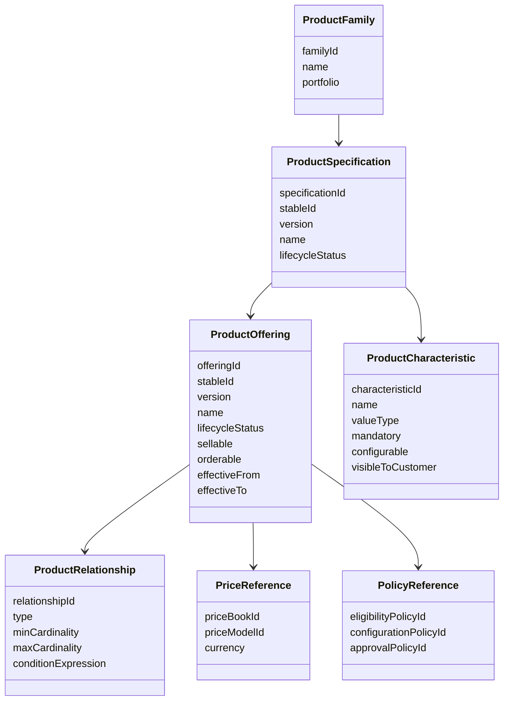

Field penting:

| Field | Kenapa Penting |
|---|---|
| stableId | Menghubungkan versi produk lintas waktu |
| version | Audit dan snapshot |
| lifecycleStatus | Governance sell/order/retire |
| effectiveFrom/effectiveTo | Time-aware commerce |
| sellable | Boleh muncul di quote baru |
| orderable | Boleh menjadi order line |
| configurable | Boleh dipilih sales/customer |
| visibleToCustomer | Muncul di proposal/document |
| min/max cardinality | Validasi bundle |
| policy references | Menghindari hardcoding rule |

---

## 17. Product Modeling Decision Framework

Saat menemukan product baru, tanyakan berurutan:

### Step 1 — Apakah ini marketable?

Jika customer/sales melihat dan memilihnya, kemungkinan `Product Offering`.

Jika tidak, mungkin technical component, billing item, entitlement, atau fulfillment resource.

### Step 2 — Apakah bisa dijual sendiri?

Jika bisa, offering mandiri.  
Jika tidak, add-on/option/child component.

### Step 3 — Apakah punya price sendiri?

Jika punya, butuh price model reference.  
Jika tidak, mungkin included component atau technical phantom.

### Step 4 — Apakah membentuk asset?

Jika ya, lifecycle setelah fulfillment harus dimodelkan.  
Jika tidak, mungkin one-time service atau document-only item.

### Step 5 — Apakah butuh fulfillment?

Jika ya, harus ada decomposition mapping.  
Jika tidak, mungkin commercial-only item seperti discount, credit, or legal clause.

### Step 6 — Apakah bisa berubah setelah aktif?

Jika ya, butuh amendment path, upgrade/downgrade rule, and asset-based ordering.

### Step 7 — Apakah ada region/channel/customer variation?

Jika ya, jangan encode semua variasi dalam specification. Buat offering variants.

---

## 18. Example: SaaS Enterprise Suite

### Business requirement

Perusahaan menjual `Enterprise Collaboration Suite` dengan:

- base subscription,
- user count,
- storage tier,
- security add-on,
- premium support,
- professional onboarding,
- discount berdasarkan contract term,
- renewal dan amendment.

### Product model

```yaml
ProductFamily:
  id: collaboration-suite
  name: Enterprise Collaboration Suite

ProductSpecification:
  id: collab-suite-spec
  characteristics:
    - userCount
    - storageTier
    - contractTerm
    - dataResidencyRegion

ProductOffering:
  id: collab-suite-enterprise-2026-v1
  sellable: true
  orderable: true
  effectiveFrom: 2026-01-01
  relationships:
    - type: allowsAddOn
      target: advanced-security-addon-2026-v1
    - type: allowsAddOn
      target: premium-support-2026-v1
    - type: requires
      target: onboarding-service-2026-v1
      condition: firstPurchase == true
```

### Quote line output

```yaml
QuoteLine:
  productOfferingVersion: collab-suite-enterprise-2026-v1
  quantity: 1
  characteristics:
    userCount: 500
    storageTier: 10TB
    contractTerm: 36
    dataResidencyRegion: EU
  children:
    - advanced-security-addon-2026-v1
    - premium-support-2026-v1
    - onboarding-service-2026-v1
```

### Order decomposition

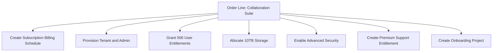

Critical modeling decisions:

- `userCount` is a characteristic, not separate product for every possible user count.
- `Advanced Security` is add-on because it has price, entitlement, and asset lifecycle.
- `Onboarding` is required one-time service for first purchase.
- `Premium Support` is add-on but may coterminate with base subscription.
- `Data residency` affects eligibility, fulfillment, legal, and sometimes price.

---

## 19. Example: Telecom Business Internet

### Product model

```yaml
ProductOffering:
  id: business-internet-1g-id-2026-v1
  name: Business Internet 1Gbps Indonesia
  specificationRef: internet-access-spec
  characteristics:
    bandwidth: 1Gbps
    accessTechnology: configurable
    slaTier: configurable
    contractTerm: configurable
  optionGroups:
    - name: Access Technology
      min: 1
      max: 1
      options: [Fiber, Microwave]
    - name: SLA Tier
      min: 1
      max: 1
      options: [Standard, Gold, Platinum]
  addOns:
    - static-ip-pack
    - managed-router-ha
```

### Technical decomposition

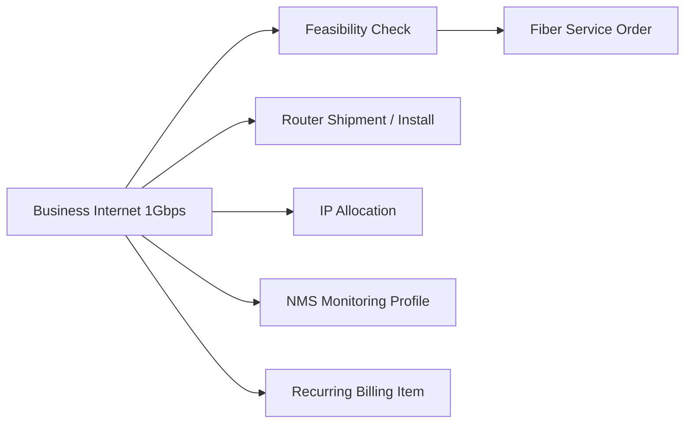

Potential failure if product model is weak:

- sales sells fiber where fiber unavailable,
- SLA tier not supported for selected access technology,
- static IP pack selected beyond allowed cardinality,
- router option incompatible with bandwidth,
- order submitted without installation appointment,
- billing charges MRC before activation.

Semua ini bukan sekadar workflow problem. Banyak berawal dari product model yang tidak mengekspresikan constraint.

---

## 20. Invariants for Enterprise Product Model

Gunakan daftar ini sebagai design review checklist.

### Identity invariants

1. Product offering version id must be immutable.
2. Historical quote/order must reference immutable offering version or contain sufficient snapshot.
3. Stable product id must not be reused for semantically different product.
4. Product display name may change, but historical document name must remain reproducible.

### Lifecycle invariants

1. Retired offering cannot be used for new quote unless explicit exception exists.
2. Grandfathered offering can only be used for eligible existing customers/assets.
3. Product deletion must not break audit of historical quote/order/asset.
4. Effective dating must use explicit business date semantics.

### Configuration invariants

1. Required options must be selected before quote submit.
2. Mutually exclusive options cannot coexist.
3. Add-on must have valid parent.
4. Cardinality must be enforced consistently across UI, API, and backend validator.
5. Configuration must be explainable.

### Pricing invariants

1. Price model must match selected offering version and effective date.
2. Included components must not be double charged.
3. Add-on price must be traceable to add-on line or price component.
4. Price-impacting characteristics must be captured in quote snapshot.

### Order invariants

1. Orderable product must have valid order decomposition or explicit no-fulfillment semantics.
2. Commercial line to technical service mapping must be deterministic or explicitly manually routed.
3. Parent line cancellation must define child behavior.
4. Change order must reference current asset state.

### Asset invariants

1. Active add-on asset requires compatible active parent asset.
2. Asset current state must be derived from fulfilled order events or controlled correction process.
3. Asset product version must remain traceable.
4. Amendment cannot rewrite original activation history.

---

## 21. Product Model Review Questions

Saat melakukan architecture review, gunakan pertanyaan berikut:

1. Apa perbedaan product specification dan product offering dalam model ini?
2. Bagaimana model membedakan commercial product dan technical product?
3. Apa identifier immutable untuk product offering version?
4. Bagaimana quote lama tetap bisa direkonstruksi setelah catalog berubah?
5. Apakah bundle relationship typed atau hanya parent-child?
6. Di mana cardinality diekspresikan?
7. Apakah compatibility rule dapat dievaluasi server-side?
8. Bagaimana lifecycle `retired`, `grandfathered`, dan `superseded` dimodelkan?
9. Apakah add-on bisa aktif tanpa parent?
10. Bagaimana product maps to pricing model?
11. Bagaimana product maps to fulfillment decomposition?
12. Bagaimana product maps to billing item?
13. Bagaimana asset terbentuk dari order line?
14. Bagaimana upgrade/downgrade path dikontrol?
15. Bagaimana impact analysis dilakukan saat product berubah?

---

## 22. Practice: Decompose a Product

Ambil satu produk kompleks dari domainmu. Isi template berikut:

```yaml
ProductConcept:
  name:
  businessGoal:

ProductSpecification:
  stableId:
  characteristics:
    - name:
      type:
      configurable:
      priceImpacting:
      fulfillmentImpacting:

ProductOfferings:
  - offeringId:
    market:
    channel:
    segment:
    lifecycleStatus:
    effectiveFrom:
    effectiveTo:

Relationships:
  - type:
    source:
    target:
    minCardinality:
    maxCardinality:
    condition:

PricingMapping:
  priceBook:
  priceComponents:

OrderMapping:
  decompositionRule:
  createsAsset:
  createsBillingItem:
  requiresFulfillment:

LifecyclePolicy:
  sellable:
  orderable:
  amendable:
  renewable:
  terminable:
```

Evaluasi hasilmu dengan invariants di atas.

---

## 23. Common Trade-Offs

### Flexible characteristic vs explicit model

| Choice | Benefit | Risk |
|---|---|---|
| Generic characteristic | Cepat dan fleksibel | Logic tersembunyi, sulit governance |
| Explicit model | Validasi kuat, audit jelas | Lebih banyak entity dan authoring effort |

Rule:

> Jika field memengaruhi price, eligibility, order decomposition, legal, billing, atau asset lifecycle, pertimbangkan model eksplisit.

### Single bundle model vs typed relationship graph

| Choice | Benefit | Risk |
|---|---|---|
| Simple parent-child | Mudah dimulai | Tidak cukup untuk requires/excludes/replaces/upgrades |
| Typed relationship graph | Expressive, explainable | Perlu tooling dan validation lebih matang |

### Real-time catalog read vs snapshot

| Choice | Benefit | Risk |
|---|---|---|
| Always read latest catalog | Simpler data | Historical drift |
| Snapshot at quote/order | Audit defensible | Data duplication terkontrol |

---

## 24. Design Heuristic: Model What Must Be Governed

Tidak semua hal perlu dimodelkan eksplisit. Tetapi apa pun yang perlu governance harus punya representasi domain.

Governed things:

- sellability,
- orderability,
- eligibility,
- price,
- discount,
- approval,
- tax category,
- legal clause,
- fulfillment mapping,
- billing mapping,
- asset lifecycle,
- migration path,
- retirement rule.

Jika hanya ada dalam spreadsheet, comment, UI text, atau tribal knowledge, sistem tidak bisa menjamin correctness.

---

## 25. Summary

Product modeling adalah fondasi CPQ/OMS.

Key takeaways:

1. Product bukan satu object. Ia memiliki commercial, configuration, pricing, order, fulfillment, billing, asset, dan analytics view.
2. Pisahkan product specification dari product offering.
3. Pisahkan commercial product dari technical product/service/resource.
4. Relationship harus typed, versioned, dan effective-dated.
5. Bundle bukan sekadar parent-child; ia butuh cardinality, compatibility, dan explainability.
6. Lifecycle harus lebih kaya daripada active/inactive.
7. Versioning dan snapshot adalah syarat auditability.
8. Product model yang buruk akan muncul sebagai pricing bug, stuck order, billing mismatch, dan governance failure.
9. Model apa yang harus dikontrol bisnis, bukan hanya apa yang mudah disimpan di database.
10. CPQ/OMS enterprise-grade dimulai dari grammar produk yang benar.

---

## Referensi

- TM Forum, **TMF620 Product Catalog Management API User Guide v5.0.0** — catalog lifecycle, catalog consultation during ordering, campaign, and sales processes.
- TM Forum, **TMF622 Product Ordering Management API User Guide v5.0.0** — product order based on product offer defined in catalog.
- Salesforce, **What Is CPQ?** — CPQ supports configuration, pricing rules, discounts, approvals, and quote generation.
- Oracle, **Oracle Configure, Price, Quote** — CPQ covers product selection, configuration, pricing, quoting, ordering, and approval workflows.

---

## Next Part

Part 006 akan membahas **Enterprise Catalog Architecture**: authoring, approval, publication, versioning, effective dating, environment promotion, rollback, catalog API, caching, governance, dan operational model.
