# Part 006 — Enterprise Catalog Architecture

## Tujuan Bagian Ini

Part 005 membahas **product model** sebagai grammar bisnis. Part 006 membahas sistem yang mengelola grammar itu: **enterprise catalog architecture**.

Dalam CPQ/OMS skala enterprise, catalog bukan sekadar database produk. Catalog adalah **control plane** untuk commercial truth.

Catalog menentukan:

- produk apa yang ada,
- versi mana yang aktif,
- kapan produk boleh dijual,
- channel mana yang boleh melihat,
- market mana yang boleh memakai,
- pricing model mana yang terhubung,
- rule mana yang berlaku,
- bundle dan opsi mana yang valid,
- bagaimana product changes dipromosikan dari draft ke production,
- bagaimana perubahan bisa diaudit dan di-rollback.

Mental model:

> Catalog adalah control plane. CPQ/OMS runtime adalah data plane. Catalog authoring mengubah definisi. CPQ/OMS execution memakai definisi yang sudah dipublikasikan, tervalidasi, dan versioned.

---

## Kaufman Framing

Untuk menguasai catalog architecture, pecah skill menjadi sub-skill:

| Sub-skill | Kemampuan Praktis |
|---|---|
| Catalog boundary | Bisa membedakan catalog authoring, publishing, runtime read, dan downstream consumption |
| Lifecycle design | Bisa mendesain draft, approval, published, active, retired, rollback |
| Versioning design | Bisa menjaga quote/order lama tidak rusak saat catalog berubah |
| Governance design | Bisa menentukan siapa boleh mengubah apa dan approval apa yang wajib |
| Runtime design | Bisa memilih strategi cache, API, snapshot, dan read model |
| Release design | Bisa mempromosikan catalog change dengan testing, validation, rollout, dan rollback |

Target performa:

> Kamu mampu mendesain enterprise catalog platform yang aman untuk perubahan bisnis cepat, tetapi tetap menjaga pricing correctness, orderability, auditability, dan operational stability.

---

## 1. Catalog Is Not Just Product Storage

Catalog sering dimulai sebagai:

```text
products table
prices table
```

Lalu business mulai meminta:

- produk baru minggu ini,
- harga baru bulan depan,
- campaign khusus channel partner,
- bundle baru hanya untuk region tertentu,
- stop-sell produk lama,
- grandfathered customers tetap bisa renew,
- approval khusus diskon produk tertentu,
- compliance clause berbeda per country,
- marketplace partner butuh catalog feed,
- quote lama harus tetap valid,
- order in-flight tidak boleh berubah karena product manager mengedit catalog.

Pada titik ini, catalog bukan lagi storage. Ia menjadi **governed system of commercial change**.

Definisi kerja:

> Enterprise catalog adalah platform untuk membuat, memvalidasi, menyetujui, mempublikasikan, mendistribusikan, dan mengaudit definisi produk komersial beserta relationship, pricing reference, policy reference, dan lifecycle-nya.

---

## 2. Catalog Architecture at a Glance

Arsitektur sehat memisahkan authoring dan runtime.

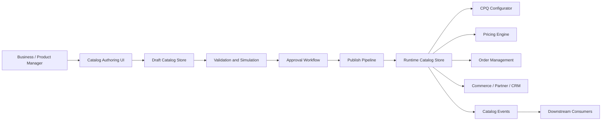

Core separation:

| Layer | Purpose |
|---|---|
| Authoring layer | Mengedit draft product/catalog data |
| Validation layer | Mengecek structural correctness dan business constraints |
| Approval layer | Governance perubahan komersial |
| Publish layer | Membuat immutable published version |
| Runtime layer | Read-optimized catalog untuk CPQ/OMS/channel |
| Distribution layer | Event/feed/API untuk downstream systems |
| Audit layer | Evidence of who changed what, when, and why |

Kesalahan fatal:

> CPQ runtime membaca langsung draft catalog yang bisa diedit kapan saja.

Akibat:

- quote berubah saat sedang dibuat,
- pricing tidak deterministik,
- approval diberikan pada definisi yang berubah,
- order conversion gagal,
- support tidak bisa menjelaskan kenapa customer mendapat konfigurasi tertentu.

---

## 3. Catalog Domains

Enterprise catalog biasanya berisi beberapa domain yang berhubungan tetapi tidak identik.

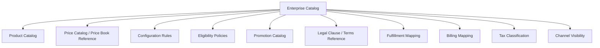

Tidak semua organisasi menaruh semuanya dalam satu service. Tetapi harus ada boundary yang jelas:

- siapa source of truth,
- bagaimana referensi antar-domain dilakukan,
- kapan perubahan antar-domain dirilis bersama,
- bagaimana compatibility divalidasi,
- bagaimana rollback dilakukan.

---

## 4. Authoring vs Runtime Model

### Authoring model

Authoring model mendukung manusia membuat perubahan.

Karakteristik:

- editable,
- draftable,
- incomplete states allowed,
- comments,
- approval notes,
- validation errors,
- comparison/diff,
- bulk import/export,
- what-if simulation,
- dependency impact analysis.

### Runtime model

Runtime model mendukung CPQ/OMS membaca cepat dan deterministik.

Karakteristik:

- immutable per published version,
- valid by construction,
- optimized for reads,
- indexed by market/channel/effective date,
- cacheable,
- API stable,
- explainable,
- traceable to authoring version.

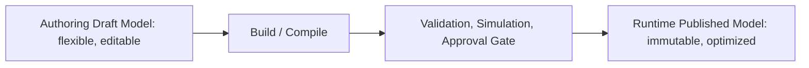

Analogi:

- Authoring catalog seperti source code.
- Publish pipeline seperti build/test/release pipeline.
- Runtime catalog seperti compiled artifact.

Jangan memaksa authoring model dan runtime model selalu sama.

---

## 5. Catalog Lifecycle

Minimal lifecycle:

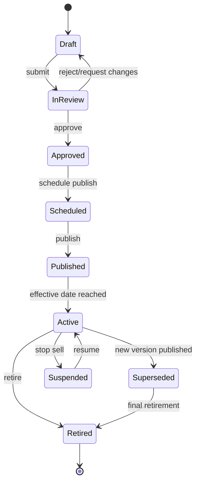

### Draft

Perubahan belum resmi. Boleh incomplete.

Allowed:

- edit product name,
- add option,
- modify relationship,
- attach price reference,
- run validation,
- simulate quote.

Not allowed:

- runtime CPQ menggunakan draft sebagai sellable catalog,
- order menggunakan draft.

### In Review

Perubahan masuk approval.

Check:

- commercial owner approval,
- pricing approval,
- legal approval jika clause berubah,
- fulfillment approval jika decomposition berubah,
- finance approval jika billing/tax impact,
- compliance approval jika regulated product.

### Approved

Siap dipublish, tetapi belum aktif.

Important:

- approved tidak sama dengan active,
- approved artifact harus frozen kecuali approval dibatalkan.

### Scheduled

Publish sudah dijadwalkan.

Important:

- timezone harus eksplisit,
- effective date harus jelas,
- dependent systems harus siap.

### Published

Versi immutable sudah tersedia di runtime store.

Published bisa belum active jika effective date di masa depan.

### Active

Runtime boleh menggunakan catalog untuk quote/order sesuai market/channel/effective date.

### Suspended

Stop-sell sementara.

Contoh:

- inventory shortage,
- regulatory issue,
- downstream outage,
- price correction.

### Superseded

Versi baru menggantikan versi lama.

Versi lama tetap harus tersedia untuk historical quote/order/asset.

### Retired

Tidak lagi dijual. Existing assets mungkin masih ada.

---

## 6. Versioning Strategy

Catalog versioning memiliki beberapa level.

| Level | Contoh | Fungsi |
|---|---|---|
| Entity version | Product offering v3 | Audit perubahan entity |
| Catalog release version | 2026.07.01-release-01 | Paket perubahan yang dipublish bersama |
| Runtime snapshot version | runtime-catalog-20260701T000000 | CPQ/OMS deterministic read |
| Policy version | eligibility-policy-v12 | Rule traceability |
| Price book version | id-enterprise-2026-h2 | Pricing correctness |

### Entity version

Setiap product offering memiliki versi immutable.

```yaml
ProductOffering:
  stableId: enterprise-internet-1g
  version: 2026.07
  versionId: po-839f7
```

### Release version

Beberapa entity bisa dirilis sebagai satu paket.

```yaml
CatalogRelease:
  releaseId: catalog-release-2026-07-01-a
  includes:
    - productOffering: enterprise-internet-1g:2026.07
    - priceModel: enterprise-internet-1g-price:2026.07
    - eligibilityPolicy: enterprise-internet-policy:v9
  effectiveFrom: 2026-07-01T00:00:00+07:00
```

### Runtime snapshot

Runtime snapshot adalah hasil publish yang digunakan CPQ/OMS.

```yaml
RuntimeCatalogSnapshot:
  snapshotId: runtime-catalog-20260701T000000+0700
  releaseId: catalog-release-2026-07-01-a
  status: active
```

Invariant:

> Quote harus dapat menunjukkan catalog snapshot/version yang digunakan untuk configuration dan pricing.

---

## 7. Effective Dating

Effective dating bukan sekadar field tambahan. Ia adalah temporal contract.

Pertanyaan yang harus dijawab:

1. Kapan produk boleh muncul di search?
2. Kapan produk boleh dikonfigurasi?
3. Kapan produk boleh dipakai untuk quote baru?
4. Kapan harga berlaku?
5. Kapan order boleh submitted?
6. Kapan fulfillment boleh menjalankan produk baru?
7. Kapan existing customer masih boleh renew?
8. Timezone apa yang digunakan?

### Different business dates

| Date | Meaning |
|---|---|
| catalog publish date | kapan artifact dipublish ke runtime |
| offer effective date | kapan offering berlaku komersial |
| quote creation date | kapan quote dibuat |
| quote acceptance date | kapan customer menerima quote |
| contract start date | kapan kontrak mulai |
| order submission date | kapan order masuk OMS |
| service activation date | kapan service aktif |
| billing start date | kapan tagihan mulai |

Kesalahan umum:

```text
valid if now between effective_from and effective_to
```

Ini terlalu naif. Untuk CPQ/OMS, validation sering butuh lebih dari satu business date.

Contoh:

- Product aktif untuk quote mulai 1 Juli.
- Service hanya bisa aktivasi mulai 15 Juli.
- Harga promo berlaku untuk quote created sampai 31 Juli.
- Billing harus mulai saat activation, bukan quote date.

Model yang lebih baik:

```yaml
EffectivePolicy:
  visibleFrom: 2026-06-15
  sellableFrom: 2026-07-01
  orderableFrom: 2026-07-01
  fulfillableFrom: 2026-07-15
  renewableUntil: 2027-06-30
```

---

## 8. Catalog Publication Pipeline

Catalog publish harus diperlakukan seperti software release.


### 8.1 Schema and rule lint

Checks:

- required fields present,
- enum values valid,
- relationship type valid,
- cardinality numeric and logical,
- no invalid date range,
- no duplicate stable ID,
- no dangling references.

### 8.2 Domain validation

Checks:

- sellable offering has price reference,
- orderable offering has fulfillment semantics,
- add-on has parent relationship,
- option group min <= max,
- required option group has at least one active option,
- no hard dependency cycle,
- retired product not referenced by active new-sale bundle unless allowed.

### 8.3 Quote simulation

Run representative quote scenarios:

- new sale,
- renewal,
- amendment,
- partner channel sale,
- region-specific sale,
- max quantity,
- invalid configuration,
- discount scenario.

### 8.4 Order simulation

Run order decomposition scenarios:

- add product,
- change product,
- remove product,
- cancel before activation,
- bundle partial failure,
- fulfillment dependency.

### 8.5 Impact analysis

Answer:

- Which active offers are affected?
- Which quote templates are affected?
- Which price models are affected?
- Which order decomposition rules are affected?
- Which downstream systems consume changed fields?
- Which existing assets are eligible for migration?

### 8.6 Approval gates

Approval should be based on type of change, not one generic approval.

| Change Type | Required Approval |
|---|---|
| Product name/description | Product owner, possibly legal/marketing |
| Price change | Pricing, finance, deal desk |
| Discount rule | Revenue governance, finance |
| Bundle relationship | Product owner, fulfillment if order impact |
| Eligibility rule | Sales ops, compliance if regulated |
| Tax category | Finance/tax |
| Legal clause | Legal |
| Fulfillment mapping | Operations/engineering |
| Billing mapping | Billing/finance |

---

## 9. Runtime Catalog Store

Runtime catalog harus optimized untuk read path CPQ/OMS.

Read patterns:

- list available offerings by market/channel/customer segment,
- retrieve offering details,
- retrieve bundle structure,
- retrieve option groups,
- retrieve characteristics,
- retrieve relationship graph,
- retrieve price references,
- retrieve policy references,
- resolve effective version by date,
- explain why product is not available.

### Runtime store options

| Option | Benefit | Risk |
|---|---|---|
| Relational DB | Strong consistency, query flexibility | Deep graph traversal may be expensive |
| Document store | Good for aggregate read | Harder cross-entity consistency |
| Graph DB | Natural relationship traversal | Operational complexity, skill requirement |
| Search index | Fast discovery/search | Not source of truth |
| In-memory cache | Low latency | Invalidation complexity |
| Compiled JSON artifact | Deterministic, portable | Publish pipeline must be strong |

Practical enterprise approach often combines:

- relational/document authoring store,
- compiled runtime artifact,
- search index for discovery,
- distributed cache for hot reads,
- event stream for downstream sync.

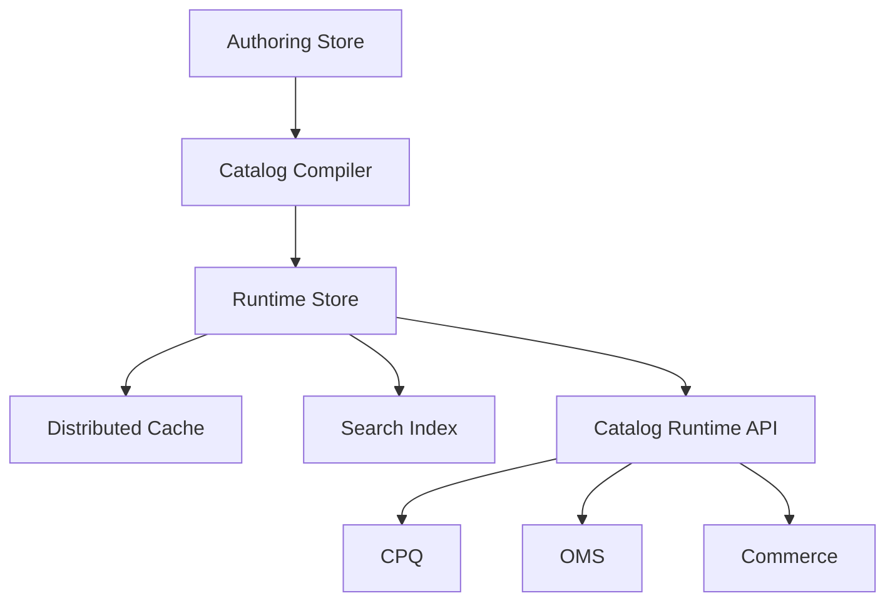

---

## 10. Catalog API Design

Catalog APIs should support deterministic reads.

### Important query dimensions

- market,
- channel,
- customer segment,
- account type,
- effective date,
- quote context,
- action type: new sale, amendment, renewal, cancellation,
- locale,
- currency,
- catalog snapshot id.

Example API shape:

```http
GET /catalog/runtime/offerings?market=ID&channel=DIRECT&segment=ENTERPRISE&action=NEW_SALE&effectiveDate=2026-07-02
```

Offering detail:

```http
GET /catalog/runtime/offerings/{offeringVersionId}?snapshotId=runtime-catalog-20260701T000000
```

Bundle resolution:

```http
POST /catalog/runtime/configuration-model:resolve
Content-Type: application/json

{
  "offeringVersionId": "enterprise-internet-1g:2026.07",
  "market": "ID",
  "channel": "DIRECT",
  "effectiveDate": "2026-07-02",
  "action": "NEW_SALE"
}
```

Explainability endpoint:

```http
POST /catalog/runtime/availability:explain
Content-Type: application/json

{
  "offeringStableId": "premium-support",
  "accountId": "A-123",
  "market": "ID",
  "channel": "PARTNER",
  "effectiveDate": "2026-07-02"
}
```

Response should explain:

```json
{
  "available": false,
  "reasonCode": "CHANNEL_NOT_ALLOWED",
  "message": "Premium Support is not available for PARTNER channel in market ID for the selected effective date.",
  "evaluatedPolicies": ["channel-visibility-policy-v4"]
}
```

---

## 11. Catalog Events

Catalog changes must be visible to downstream systems.

Important events:

| Event | Meaning |
|---|---|
| CatalogReleasePublished | New runtime release available |
| ProductOfferingActivated | Offering became active |
| ProductOfferingSuspended | Offering stopped temporarily |
| ProductOfferingRetired | Offering retired |
| ProductOfferingSuperseded | Offering replaced by newer version |
| PriceReferenceChanged | Price model reference changed |
| ConfigurationModelChanged | Option/relationship structure changed |
| EligibilityPolicyChanged | Availability rule changed |
| FulfillmentMappingChanged | OMS/decomposition impact |

Event payload should include:

- event id,
- release id,
- snapshot id,
- entity id,
- stable id,
- version,
- change type,
- effective date,
- changed by,
- approval reference,
- correlation id.

Example:

```json
{
  "eventType": "ProductOfferingActivated",
  "eventId": "evt-20260702-001",
  "releaseId": "catalog-release-2026-07-01-a",
  "snapshotId": "runtime-catalog-20260701T000000+0700",
  "stableId": "enterprise-internet-1g",
  "version": "2026.07",
  "effectiveFrom": "2026-07-01T00:00:00+07:00",
  "changedBy": "product.manager@example.com",
  "approvalRef": "approval-8821"
}
```

---

## 12. Caching Strategy

Catalog reads are often high-volume and latency-sensitive.

CPQ configurator may repeatedly fetch:

- bundle tree,
- option groups,
- compatibility rules,
- characteristic metadata,
- price references,
- availability metadata.

### Cache levels

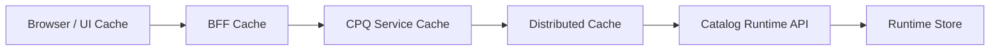

### Cache key design

Cache key must include dimensions that change result.

Bad:

```text
offeringId
```

Better:

```text
offeringVersionId:snapshotId:market:channel:segment:locale:effectiveDate:action
```

### Cache invalidation

Preferred strategy:

- immutable snapshot ids,
- cache by snapshot/version,
- activate new snapshot atomically,
- old cache expires naturally,
- no broad destructive invalidation for every catalog edit.

Avoid:

- mutable cache objects keyed only by product id,
- direct cache mutation by authoring system,
- clearing all catalog cache during business hours without warmup.

### Cache warmup

Before activating release:

- warm top product family,
- warm channel catalogs,
- warm price references,
- warm search index,
- run smoke quote.

---

## 13. Search and Discovery

Catalog search is not the same as catalog truth.

Search supports:

- product lookup by name,
- filtering by category,
- channel catalog browsing,
- guided selling suggestions,
- partner marketplace discovery.

Search index may denormalize:

- display name,
- description,
- tags,
- category,
- market,
- channel,
- lifecycle status,
- effective date,
- searchable attributes.

But final quote validation must call authoritative runtime catalog/policy APIs.

Invariant:

> Search can suggest. Runtime catalog validates.

---

## 14. Environment Promotion

Enterprise catalog changes move across environments.

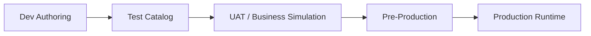

Promotion questions:

1. Are IDs stable across environments?
2. Are references to price/policy/fulfillment mappings valid in target environment?
3. Is test data representative?
4. Can business users preview production behavior?
5. Can release be scheduled?
6. Can release be rolled back?
7. Is there approval evidence?

### Stable IDs vs environment IDs

Use stable logical IDs for catalog content, not environment-generated IDs only.

Bad:

```text
Dev product id = 123
Prod product id = 987
No stable mapping
```

Better:

```yaml
stableId: enterprise-internet-1g
version: 2026.07
environmentEntityId:
  dev: 123
  prod: 987
```

---

## 15. Rollback Strategy

Catalog rollback is harder than software rollback because quotes and orders may already use the bad catalog.

### Types of rollback

| Type | Meaning | Risk |
|---|---|---|
| Runtime pointer rollback | Switch active snapshot to previous version | New quotes fixed, existing bad quotes remain |
| Stop-sell | Suspend affected offering | Fast containment, not full rollback |
| Patch release | Publish corrected version | Requires validation |
| Quote remediation | Find and fix affected quotes | Operational effort |
| Order fallout remediation | Repair orders created from bad catalog | High complexity |
| Asset correction | Correct assets created by bad order | Highest risk |

### Rollback decision tree

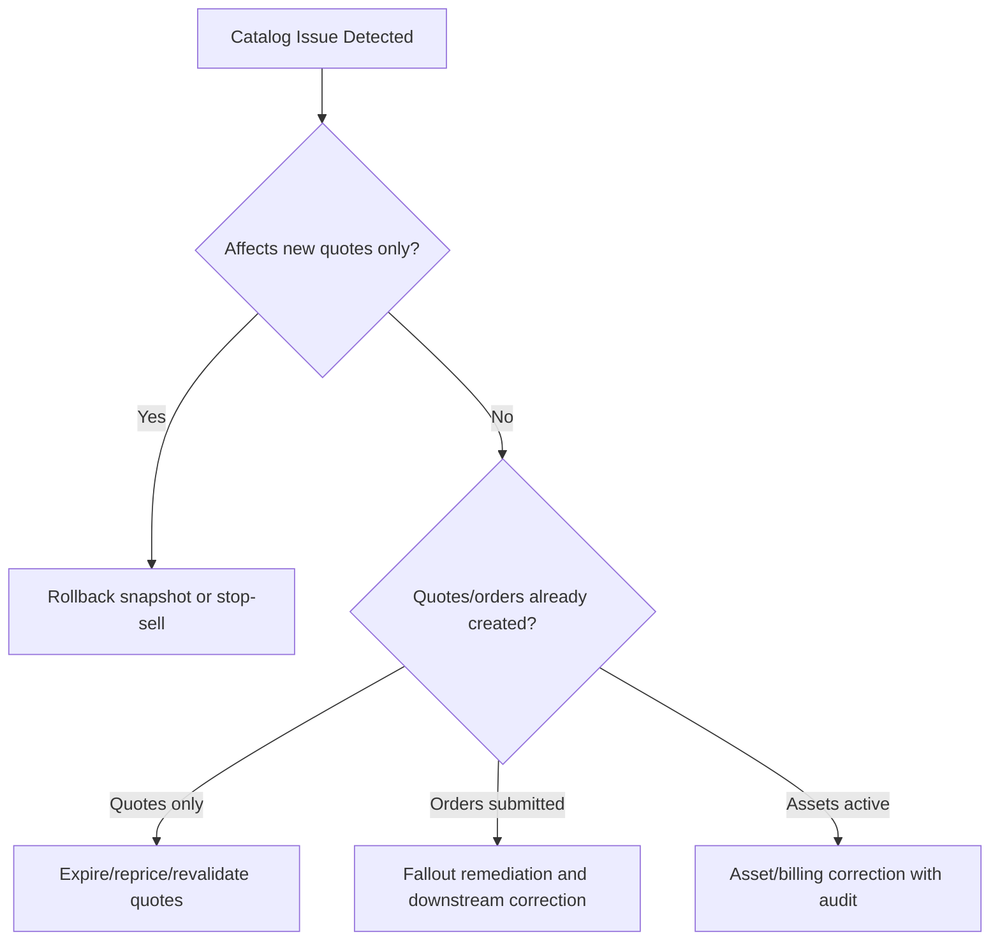

Key principle:

> Rollback stops future damage. It does not erase historical damage. You still need impact analysis and remediation.

---

## 16. Catalog Governance Model

Governance answers:

- who can create product,
- who can change price reference,
- who can retire product,
- who can publish,
- who can approve exception,
- who can hotfix production,
- who can view confidential price data.

### Roles

| Role | Responsibility |
|---|---|
| Product Manager | Product definition, lifecycle, positioning |
| Pricing Manager | Price reference, discount boundary, margin guardrail |
| Sales Operations | Channel readiness, quote process impact |
| Legal | Terms, clauses, regulated statements |
| Finance | Revenue category, billing/tax impact |
| Fulfillment Ops | Orderability, decomposition, operational feasibility |
| Catalog Admin | Data quality, publish coordination |
| Platform Engineer | Runtime stability, API, cache, release tooling |
| Compliance/Audit | Evidence, segregation of duties, policy control |

### Segregation of duties

Risky pattern:

```text
Same person creates product, changes price, approves, and publishes to production.
```

Better:

- creator cannot be sole approver for high-impact changes,
- price changes require pricing/finance approval,
- legal clause changes require legal approval,
- production hotfix requires incident/change record,
- publish action is logged with release artifact hash.

---

## 17. Catalog Data Quality Rules

Data quality is not cosmetic. It is runtime safety.

### Required quality gates

| Rule | Why |
|---|---|
| Sellable product must have valid lifecycle and effective date | Prevent ghost products |
| Sellable product must have price reference or explicit zero-price policy | Prevent quote pricing failure |
| Orderable product must have decomposition semantics | Prevent OMS fallout |
| Bundle must have valid child cardinality | Prevent invalid configuration |
| Add-on must define parent compatibility | Prevent orphan asset |
| Retired product must not be used in active new-sale bundle | Prevent selling dead product |
| Product names must be localized if channel requires locale | Prevent broken proposal/commerce UI |
| Tax category must exist for taxable item | Prevent invoice/tax issue |
| Billing mapping must exist for billable recurring item | Prevent revenue leakage |
| Audit metadata must be present | Regulatory defensibility |

---

## 18. Catalog Validation Rules

Validation should be layered.

### Structural validation

- required fields,
- type correctness,
- date range correctness,
- unique constraints,
- reference existence.

### Semantic validation

- sellable implies price reference,
- orderable implies order mapping,
- add-on implies parent,
- characteristic value allowed by type,
- region-specific product has region mapping.

### Graph validation

- no invalid cycles,
- no orphan child,
- no unreachable required option,
- no mutually exclusive required pair,
- cardinality satisfiable.

### Runtime simulation

- sample quote can be built,
- sample price can be calculated,
- sample order can be decomposed,
- sample document can be generated.

### Governance validation

- required approvals exist,
- approver role matches change type,
- change ticket/reference exists,
- publish window approved.

---

## 19. Catalog Impact Analysis

Impact analysis is a first-class capability, not a manual spreadsheet exercise.

When a product changes, ask:

### CPQ impact

- Which bundles include this product?
- Which configurator rules reference it?
- Which quote templates display it?
- Which guided selling flows recommend it?
- Which active quotes use the current version?

### Pricing impact

- Which price models reference it?
- Which discounts/promotions depend on it?
- Which margin guardrails are affected?
- Which contract prices reference it?

### OMS impact

- Which order decomposition rules reference it?
- Which fulfillment flows are affected?
- Which in-flight orders reference old version?
- Which cancellation/amendment rules depend on it?

### Asset impact

- Which active customer assets use it?
- Which renewals are upcoming?
- Which migration rules are needed?
- Which support entitlements depend on it?

### Downstream impact

- billing,
- tax,
- ERP,
- provisioning,
- inventory,
- data warehouse,
- partner feeds.

Diagram:

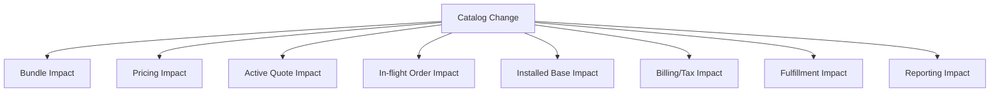

---

## 20. Catalog Release Types

Not all releases have same risk.

| Release Type | Example | Risk | Governance |
|---|---|---:|---|
| Metadata-only | Description update | Low | Product owner |
| New offering | New product launch | Medium/High | Product, pricing, ops |
| Price change | MRC update | High | Pricing, finance |
| Bundle structure change | Add/remove required option | High | Product, CPQ, fulfillment |
| Eligibility change | Region/channel availability | Medium/High | Sales ops, compliance |
| Fulfillment mapping change | New provisioning route | High | Ops/engineering |
| Retirement | Stop sell product | Medium/High | Product, sales, support |
| Hotfix | Correct production issue | Variable | Incident/change control |

Release classification helps route approval and testing.

---

## 21. Catalog and CPQ Runtime Interaction

CPQ uses catalog for:

1. product search,
2. guided selling,
3. configuration model,
4. option validation,
5. compatibility checking,
6. price reference resolution,
7. eligibility pre-check,
8. proposal display metadata,
9. quote line snapshot.

Sequence:

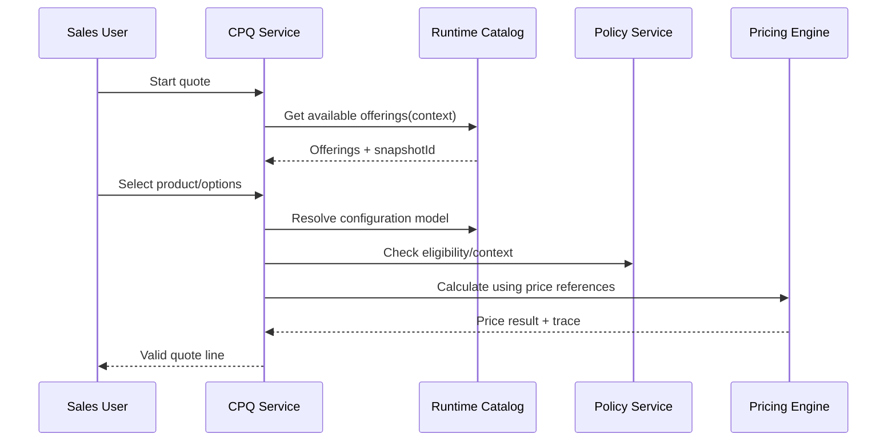

Important:

- CPQ should include catalog snapshot id in quote context.
- Pricing should know which product/price version was used.
- Validation should be repeated server-side before submit.

---

## 22. Catalog and OMS Runtime Interaction

OMS uses catalog for:

1. orderability validation,
2. product-to-service decomposition,
3. action semantics,
4. dependency graph,
5. fulfillment mapping,
6. asset creation rules,
7. cancellation/amendment rules.

Sequence:

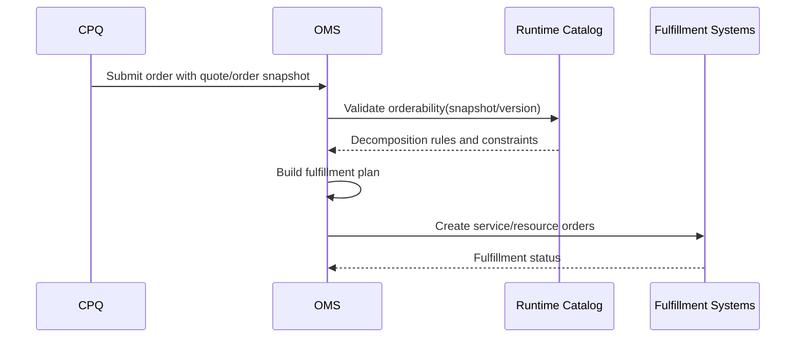

OMS should not blindly trust CPQ. It should validate:

- offering is orderable for action,
- required data exists,
- decomposition mapping exists,
- product version is known,
- quote snapshot has not expired beyond policy.

---

## 23. Catalog Consistency Model

Catalog data consistency choices:

### Strong consistency for authoring

Useful for:

- preventing duplicate IDs,
- maintaining approval state,
- ensuring reference integrity,
- enforcing draft workflow.

### Immutable consistency for runtime

Runtime should serve immutable snapshots.

Benefits:

- deterministic CPQ behavior,
- easier cache,
- auditability,
- rollback via pointer switch.

### Eventual consistency for downstream distribution

Downstream systems may receive catalog events asynchronously.

Mitigation:

- publish readiness checks,
- consumer acknowledgments for critical systems,
- compatibility windows,
- fallback to runtime API for authoritative lookup.

---

## 24. Catalog Security

Catalog is sensitive. It contains commercial strategy.

Security concerns:

- confidential prices,
- unreleased products,
- partner-specific offerings,
- regulated products,
- margin guardrails,
- customer-specific commercial terms,
- legal clauses.

### Access controls

| Capability | Control |
|---|---|
| View draft product | Role + portfolio/region scope |
| View confidential price | Pricing/finance role |
| Edit product relationship | Product owner/catalog admin |
| Change tax category | Finance/tax role |
| Approve release | Segregated approver |
| Publish production | Release role + approval evidence |
| Read runtime catalog | Service-to-service auth + scope |
| Partner catalog feed | Channel-specific filtering |

Audit log should capture:

- before/after values,
- actor,
- timestamp,
- reason/comment,
- approval id,
- release id,
- affected entities.

---

## 25. Catalog Observability

Catalog issues manifest as business incidents.

Metrics:

| Metric | Meaning |
|---|---|
| catalog publish success/failure | Release pipeline health |
| validation failure count | Data quality trend |
| runtime catalog latency | CPQ/OMS performance impact |
| cache hit ratio | Runtime efficiency |
| catalog API error rate | Runtime reliability |
| quote failures by catalog reason | Product data quality impact |
| order fallout by catalog reason | OMS impact |
| stale catalog read count | Consistency/caching issue |
| active quotes by catalog version | Migration/retirement planning |
| products without price/order mapping | Readiness gap |

Logs should include:

- snapshot id,
- offering version id,
- market,
- channel,
- effective date,
- correlation id,
- validation reason codes.

---

## 26. Failure Modes

### 26.1 Product published without price

Symptom:

- sales can select product,
- pricing engine fails,
- quote cannot be completed.

Prevention:

- sellable implies price reference validation.

### 26.2 Product published without fulfillment mapping

Symptom:

- quote succeeds,
- order submit succeeds,
- OMS cannot decompose.

Prevention:

- orderable implies decomposition semantics validation.

### 26.3 Channel visibility cache stale

Symptom:

- partner sees product that was suspended,
- invalid quotes created.

Prevention:

- snapshot-based cache,
- release pointer activation,
- short TTL for visibility-critical queries.

### 26.4 Bundle requires retired component

Symptom:

- configurator cannot satisfy required option,
- quote stuck.

Prevention:

- graph validation before publish.

### 26.5 Effective date timezone bug

Symptom:

- product appears one day early/late in some region.

Prevention:

- explicit timezone,
- business-date tests,
- no local server timezone assumption.

### 26.6 Rollback breaks active quote

Symptom:

- quote created on snapshot A,
- runtime rolled back to snapshot B,
- quote reconfiguration cannot find product version.

Prevention:

- keep old snapshots accessible for quote validity period,
- snapshot reference in quote.

---

## 27. Enterprise Catalog Reference Architecture

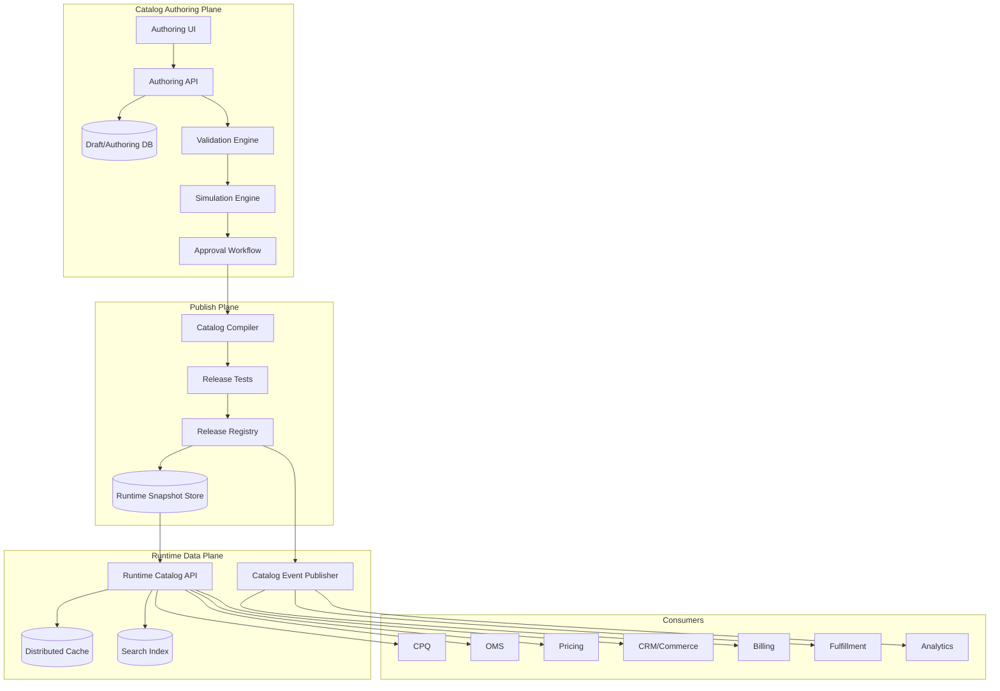

Design principle:

> Business users need flexible authoring. Runtime systems need immutable certainty. The publish pipeline converts one into the other.

---

## 28. Catalog Schema Example

Simplified release artifact:

```yaml
CatalogRelease:
  releaseId: catalog-release-2026-07-01-a
  status: published
  effectiveFrom: 2026-07-01T00:00:00+07:00
  createdBy: product.ops@example.com
  approvedBy:
    - product.owner@example.com
    - pricing.manager@example.com
    - fulfillment.ops@example.com
  artifacts:
    productOfferings:
      - stableId: enterprise-internet-1g
        version: 2026.07
        lifecycleStatus: active
        sellable: true
        orderable: true
        market: ID
        channel: DIRECT
        priceReference: enterprise-internet-price-2026-h2
        configurationModel: enterprise-internet-config-v5
        eligibilityPolicy: enterprise-internet-eligibility-v8
        fulfillmentMapping: enterprise-internet-fulfillment-v6
    relationships:
      - source: enterprise-internet-1g:2026.07
        type: allowsAddOn
        target: static-ip-pack:2026.07
        minCardinality: 0
        maxCardinality: 5
```

---

## 29. Catalog Design Review Checklist

Use this checklist before approving catalog architecture.

### Boundary

- Is authoring separated from runtime?
- Does runtime read only published/valid catalog?
- Is catalog source of truth clearly defined?
- Are price, policy, and fulfillment references explicit?

### Versioning

- Are product offering versions immutable?
- Is there a catalog release version?
- Does quote capture catalog snapshot/version?
- Are old snapshots retained long enough?

### Lifecycle

- Are draft, approved, published, active, suspended, retired distinct?
- Is stop-sell different from stop-fulfill?
- Is grandfathering supported?
- Are lifecycle transitions audited?

### Validation

- Does publish validate structure, semantics, graph, simulation, and governance?
- Are required price/order mappings enforced?
- Are bundle cardinalities satisfiable?
- Are effective dates tested?

### Runtime

- Are APIs deterministic by context and effective date?
- Is cache key complete?
- Is search separated from authoritative validation?
- Is rollback possible without deleting history?

### Governance

- Are roles and approvals mapped to change type?
- Is segregation of duties enforced for high-risk changes?
- Are before/after diffs stored?
- Is impact analysis available?

### Operations

- Are catalog metrics observable?
- Can bad release be contained quickly?
- Is remediation process defined for affected quotes/orders/assets?
- Are downstream consumers notified reliably?

---

## 30. Practice: Design a Catalog Release Pipeline

For one product family, define:

```yaml
CatalogReleasePlan:
  releaseName:
  businessGoal:
  releaseType:
  effectiveFrom:
  affectedMarkets:
  affectedChannels:

Changes:
  productOfferings:
  prices:
  configurationRules:
  eligibilityPolicies:
  fulfillmentMappings:
  billingMappings:

Validation:
  structuralChecks:
  semanticChecks:
  graphChecks:
  quoteSimulationCases:
  orderSimulationCases:

Approvals:
  productOwner:
  pricing:
  legal:
  finance:
  fulfillment:
  compliance:

RuntimePlan:
  snapshotId:
  cacheWarmup:
  smokeTest:
  publishWindow:
  rollbackPlan:

ImpactAnalysis:
  activeQuotes:
  inFlightOrders:
  activeAssets:
  downstreamSystems:
```

Self-review:

1. Apa yang terjadi jika release harus dirollback 2 jam setelah publish?
2. Quote mana yang terkena dampak?
3. Order mana yang harus dicegah masuk?
4. Consumer mana yang harus menerima event?
5. Bagaimana membuktikan approval terjadi sebelum publish?

---

## 31. Summary

Enterprise catalog architecture adalah control plane CPQ/OMS.

Key takeaways:

1. Catalog bukan product table; catalog adalah governed commercial change platform.
2. Pisahkan authoring model dari runtime model.
3. Runtime catalog harus immutable, versioned, cacheable, dan deterministic.
4. Catalog lifecycle harus mencakup draft, review, approved, scheduled, published, active, suspended, superseded, retired.
5. Effective dating harus memakai business date semantics, bukan sekadar `now()`.
6. Catalog publish harus seperti software release: lint, validate, simulate, impact analysis, approve, build, smoke test, publish.
7. Snapshot/version harus tercatat di quote/order untuk auditability.
8. Cache strategy paling aman adalah snapshot/version-based.
9. Rollback menghentikan damage baru, tetapi tetap perlu remediation untuk quote/order/asset yang sudah terdampak.
10. Governance, approval, impact analysis, dan observability adalah bagian dari architecture, bukan admin feature tambahan.

---

## Referensi

- TM Forum, **TMF620 Product Catalog Management API User Guide v5.0.0** — Product Catalog Management API mengelola lifecycle catalog elements dan menyediakan consultation selama ordering, campaign, dan sales processes.
- TM Forum, **TMF622 Product Ordering Management API User Guide v5.0.0** — Product Order dibuat berdasarkan product offer yang didefinisikan dalam catalog.
- Salesforce, **What Is CPQ?** — CPQ membantu sales mengonfigurasi produk, menerapkan pricing rules, mengelola discount/approval, dan menghasilkan quote.
- Oracle, **Oracle Configure, Price, Quote** — CPQ mendukung opportunity-to-quote-to-order process termasuk product selection, configuration, pricing, quoting, ordering, dan approval workflows.

---

## Next Part

Part 007 akan membahas **Configurator Mental Model and Constraint Solving**: option graph, compatibility, dependency, constraint propagation, invalid state explanation, guided selling, server-side validation, dan configurator architecture.
