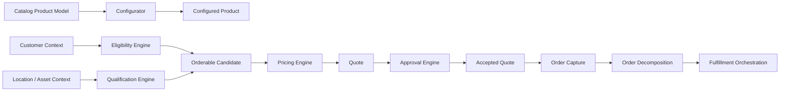
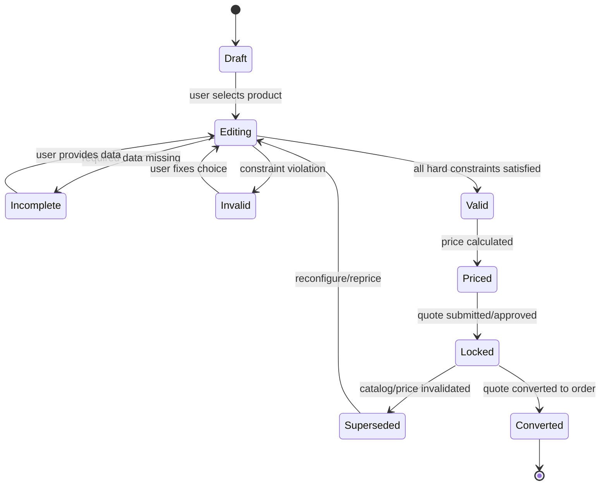
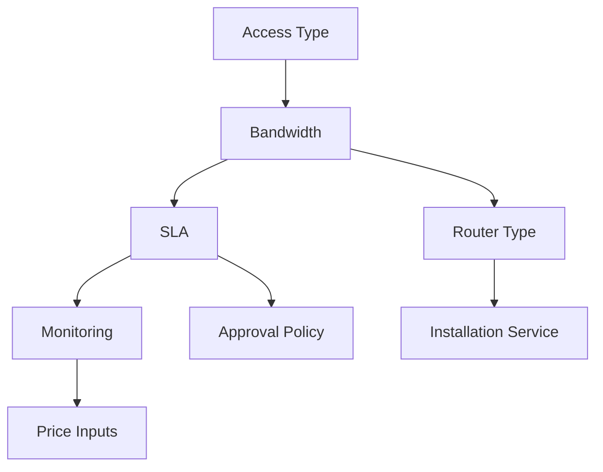
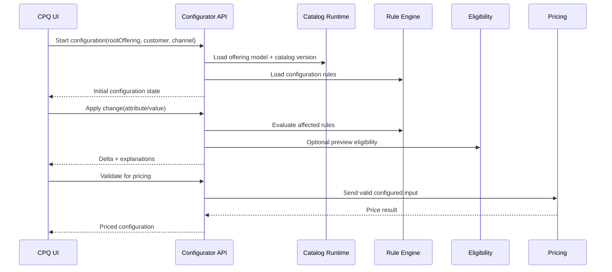
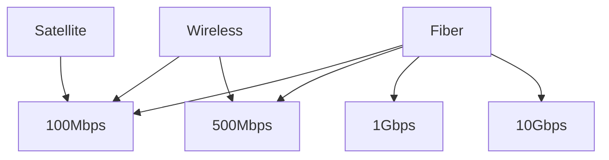
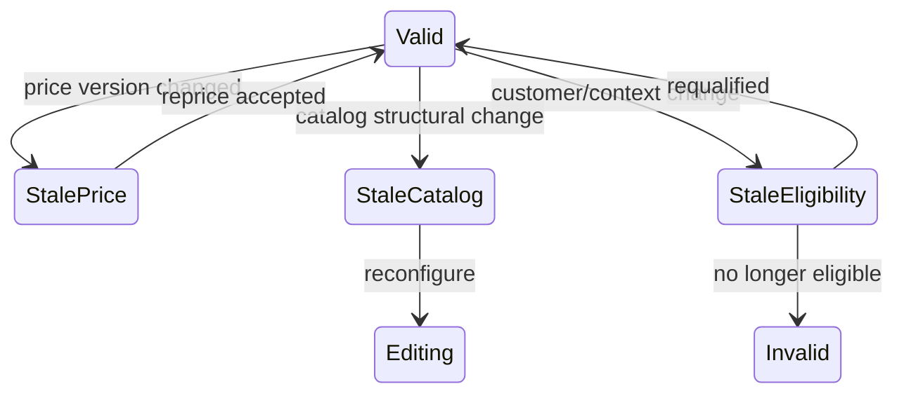

# Part 007 — Configurator Mental Model and Constraint Solving

## Learning Goal

Setelah bagian ini, kamu harus bisa menjelaskan, mendesain, dan mengkritisi **enterprise product configurator** untuk CPQ/OMS.

Target performa bukan sekadar “membuat form pilihan produk”. Targetnya adalah:

1. mampu memodelkan konfigurasi sebagai **graph of choices, constraints, derived values, and explanations**;
2. mampu membedakan **configuration rule**, **eligibility rule**, **pricing rule**, **approval rule**, dan **fulfillment rule**;
3. mampu mencegah invalid quote/order sejak awal tanpa membuat user experience lambat atau membingungkan;
4. mampu mendesain configurator yang deterministic, auditable, versioned, and scalable;
5. mampu membuat failure model untuk konfigurasi enterprise: stale rule, cyclic dependency, conflicting constraint, hidden option, invalid asset state, and unexplainable recommendation.

Dalam framework Josh Kaufman, ini adalah tahap **deconstruct the skill** dan **practice the most important sub-skills first**. Kamu tidak perlu menguasai seluruh teori constraint programming sebelum bisa mendesain CPQ configurator. Yang perlu dikuasai dulu adalah sub-skill yang paling sering menentukan benar/salahnya platform enterprise:

- memisahkan domain concept;
- membuat constraint model;
- menjaga determinism;
- membuat explanation;
- membuat test corpus;
- menghubungkan konfigurasi ke quote, order, asset, and fulfillment.

---

## 1. Why Configurator Is a Platform Problem

Configurator sering terlihat seperti UI problem:

> User pilih bundle, pilih option, sistem disable pilihan yang tidak valid.

Di enterprise CPQ, itu terlalu dangkal.

Configurator sebenarnya adalah **commercial validity engine** yang menentukan apakah sebuah kombinasi produk dapat dijual, dikutip, disetujui, dipesan, dipenuhi, dan dipertanggungjawabkan.

Satu keputusan konfigurasi dapat memengaruhi:

| Area | Dampak |
|---|---|
| Sales | Apakah sales rep bisa menawarkan kombinasi tertentu |
| Pricing | Apakah price engine punya input yang valid |
| Approval | Apakah konfigurasi melanggar policy tertentu |
| Legal | Apakah terms and conditions harus berubah |
| Fulfillment | Apakah downstream system bisa memprovision produk |
| Billing | Apakah charge structure valid |
| Asset | Apakah produk bisa menjadi installed base |
| Support | Apakah customer support bisa memahami produk yang aktif |
| Audit | Apakah perusahaan bisa menjelaskan mengapa quote dianggap valid |

Mental model utamanya:

> Configurator bukan “selector”. Configurator adalah **validity-preserving state transition system**.

Setiap user action mengubah state konfigurasi. Setelah perubahan, sistem harus bisa menjawab:

1. state saat ini valid atau tidak?
2. jika tidak valid, constraint mana yang dilanggar?
3. pilihan apa yang harus diubah?
4. nilai apa yang otomatis diturunkan?
5. opsi mana yang sekarang tersedia/tidak tersedia?
6. apakah konfigurasi masih kompatibel dengan catalog version, price version, customer context, and asset context?

---

## 2. Configuration vs Eligibility vs Pricing vs Approval

Salah satu kesalahan arsitektur paling umum adalah memasukkan semua aturan bisnis ke configurator.

Itu membuat sistem sulit diuji, sulit dijelaskan, dan sulit diubah.

Gunakan boundary berikut.

| Rule Type | Pertanyaan | Contoh | Owner |
|---|---|---|---|
| Configuration rule | Kombinasi produk/option ini valid secara struktural? | Laptop harus punya tepat satu CPU dan minimal satu storage | Product/catalog team |
| Eligibility rule | Customer/context ini boleh membeli offering ini? | Produk hanya tersedia untuk region tertentu atau segment enterprise | Commercial/product policy team |
| Qualification rule | Customer/location/account memenuhi syarat teknis/komersial? | Fiber tersedia di alamat ini; credit check lolos | Qualification/serviceability team |
| Pricing rule | Berapa harga konfigurasi ini? | Jika term 36 bulan, diskon tambahan 10% | Pricing/revenue team |
| Promotion rule | Promo apa yang berlaku? | Bundle discount untuk campaign Q3 | Marketing/commercial team |
| Approval rule | Butuh approval siapa? | Discount > 25% butuh VP Sales | Deal desk/finance |
| Fulfillment rule | Bagaimana order dipecah dan dipenuhi? | Bundle broadband + router menjadi service order + shipment | Fulfillment/product ops |
| Legal rule | Klausul apa yang harus masuk dokumen? | Data processing addendum untuk region EU | Legal/compliance |

Configurator boleh memanggil rule lain untuk preview experience, tetapi **tidak boleh mengambil ownership semua rule**.

Enterprise invariant:

> A configuration is not necessarily sellable. A sellable offer is not necessarily fulfillable. A fulfillable order is not necessarily billable without correct billing account and contract data.

Diagram boundary:



---

## 3. Core Domain Concepts

A robust configurator needs a small but precise vocabulary.

### 3.1 Product Family

A product family groups products with similar configuration structure.

Examples:

- broadband internet plan;
- enterprise connectivity package;
- SaaS subscription suite;
- insurance package;
- cloud infrastructure plan;
- hardware appliance;
- mobile device plan.

Product family often determines:

- shared attributes;
- available options;
- common constraints;
- configuration flow;
- base template;
- validation strategy.

### 3.2 Configurable Product

A configurable product is not a final SKU. It is a product model that requires user choices.

Example:

```text
Enterprise Network Package
├── Access type: Fiber | Wireless | Satellite
├── Bandwidth: 100 Mbps | 500 Mbps | 1 Gbps | 10 Gbps
├── SLA: Standard | Enhanced | Premium
├── Router: Standard | HA Pair | Customer Provided
├── Security Add-on: None | Firewall | Managed Firewall
└── Contract Term: 12 | 24 | 36 months
```

The final configured product is a **configuration instance**.

### 3.3 Attribute

An attribute is a configurable characteristic.

Examples:

- bandwidth;
- contract term;
- license count;
- device color;
- support tier;
- payment frequency;
- deployment region;
- SLA level.

Attribute metadata should include:

| Field | Meaning |
|---|---|
| `attributeCode` | Stable identifier |
| `label` | Human-readable label |
| `dataType` | String, number, enum, boolean, money, date |
| `allowedValues` | Candidate values |
| `defaultValue` | Initial value |
| `required` | Whether value must exist |
| `min/max` | Numeric boundary |
| `cardinality` | Number of allowed selections |
| `visibilityCondition` | When shown |
| `editabilityCondition` | When editable |
| `effectiveFrom/effectiveTo` | Validity window |
| `source` | User, catalog, rule, derived, external |

### 3.4 Option

An option is a selectable product/component.

Example:

- router option;
- support add-on;
- warranty extension;
- feature pack;
- extra seat pack;
- installation service.

Options may have:

- quantity;
- cardinality;
- dependency;
- exclusion;
- price impact;
- fulfillment impact;
- legal impact.

### 3.5 Bundle

A bundle is a structured grouping of offerings/options.

Bundle semantics must be explicit:

| Bundle Type | Meaning |
|---|---|
| Static bundle | Fixed composition |
| Configurable bundle | User chooses among options |
| Dynamic bundle | Composition derived by rules |
| Commercial bundle | Sold as package, fulfilled separately |
| Technical bundle | Fulfillment decomposition bundle |
| Discount bundle | Bundle mainly exists for pricing/promotion |

Do not treat every group as the same type of bundle.

Enterprise mistake:

> Using bundle as a generic grouping mechanism for catalog display, commercial pricing, technical decomposition, and fulfillment packaging at the same time.

This causes downstream ambiguity.

### 3.6 Configuration Instance

A configuration instance is the actual selected state.

It contains:

- product reference;
- catalog version;
- selected options;
- selected attribute values;
- quantities;
- derived values;
- validation result;
- explanation trace;
- user edits;
- system edits;
- timestamp;
- context.

Example conceptual shape:

```json
{
  "configurationId": "cfg_123",
  "catalogVersion": "2026.07.01",
  "rootOffering": "enterprise-network-package",
  "context": {
    "customerSegment": "enterprise",
    "region": "ID-JK",
    "channel": "direct-sales"
  },
  "attributes": {
    "bandwidth": "1Gbps",
    "sla": "premium",
    "contractTerm": 36
  },
  "options": [
    {
      "offeringCode": "managed-router-ha",
      "quantity": 1,
      "source": "user"
    },
    {
      "offeringCode": "managed-firewall",
      "quantity": 1,
      "source": "rule"
    }
  ],
  "validation": {
    "status": "valid",
    "evaluatedAt": "2026-07-02T10:15:00+07:00"
  }
}
```

---

## 4. Configurator as a State Machine

A configurator has lifecycle states.

This matters because invalid intermediate states may be allowed while user is still editing, but not allowed when generating quote, submitting for approval, or converting to order.



Important distinction:

| State | Allowed? | Meaning |
|---|---:|---|
| `Editing` | Yes | User is still constructing configuration |
| `Incomplete` | Yes | Required fields are missing |
| `Invalid` | Temporarily yes | User has conflicting selections |
| `Valid` | Yes | Can proceed to pricing |
| `Priced` | Yes | Has deterministic price result |
| `Locked` | Restricted | Used for approval/acceptance |
| `Superseded` | Needs action | Catalog/price/context changed |
| `Converted` | Terminal for quote flow | Order created |

Do not enforce every constraint too early.

Bad UX:

> “You cannot choose A until you choose B, but B is hidden until A is chosen.”

Better UX:

- allow tentative selection;
- show conflict;
- explain remedy;
- progressively narrow choices;
- never silently mutate high-impact selections without trace.

---

## 5. Constraint Types

Configurator rules can be decomposed into several categories.

### 5.1 Required Constraint

Something must be selected.

Example:

```text
Every laptop configuration must include exactly one CPU.
```

Formal form:

```text
count(selected(CPU options)) == 1
```

### 5.2 Cardinality Constraint

Controls min/max selection.

Example:

```text
A security bundle must include at least one and at most three protection modules.
```

Formal form:

```text
1 <= count(selected(SecurityModule)) <= 3
```

### 5.3 Dependency Constraint

Selecting one item requires another.

Example:

```text
Premium SLA requires managed monitoring.
```

Formal form:

```text
selected(PremiumSLA) -> selected(ManagedMonitoring)
```

### 5.4 Exclusion Constraint

Two items cannot coexist.

Example:

```text
Customer-provided router cannot be selected with managed router HA pair.
```

Formal form:

```text
not(selected(CustomerProvidedRouter) and selected(ManagedRouterHA))
```

### 5.5 Compatibility Constraint

Allowed combinations across dimensions.

Example:

```text
10 Gbps bandwidth is only compatible with Fiber access.
```

Formal form:

```text
bandwidth = 10Gbps -> accessType = Fiber
```

### 5.6 Range Constraint

Numeric value must fall within permitted range.

Example:

```text
License count must be between 50 and 10,000 for Enterprise plan.
```

Formal form:

```text
50 <= licenseCount <= 10000
```

### 5.7 Derived Value Rule

A value is calculated from other values.

Example:

```text
If contract term is 36 months, minimum commitment end date = start date + 36 months.
```

### 5.8 Defaulting Rule

A value is assigned when user has not made a choice.

Example:

```text
Default support tier is Standard unless customer is strategic account.
```

### 5.9 Visibility Rule

Controls whether a field or option is shown.

Example:

```text
Show "Dedicated Customer Success Manager" only for Enterprise segment.
```

### 5.10 Editability Rule

Controls whether a selected value can be changed.

Example:

```text
After approval submission, discount-impacting attributes become read-only.
```

### 5.11 Recommendation Rule

Suggests a value but does not enforce it.

Example:

```text
Recommend premium support for customers with more than 500 licenses.
```

### 5.12 Auto-Inclusion Rule

Automatically selects required item.

Example:

```text
If Managed Firewall is selected, include Security Monitoring service.
```

Auto-inclusion must be used carefully because it mutates user state.

Rule invariant:

> Any rule that changes configuration state must leave an explanation trace.

---

## 6. Constraint Solving Mental Model

There are multiple implementation styles. The important part is to understand the computational model.

### 6.1 Imperative Validation

The simplest model:

```text
When user changes field X:
  run validation functions
  return errors/warnings
```

Pros:

- easy to start;
- familiar to most engineers;
- good for simple rules.

Cons:

- rule ordering becomes hidden;
- conflict explanation can be poor;
- cyclic dependencies are hard to detect;
- large catalog becomes fragile.

Use for:

- small catalog;
- low interdependency;
- simple validation;
- admin-controlled internal tool.

### 6.2 Rule Engine

Rules are expressed as data or declarative conditions.

```text
IF selected(PremiumSLA)
THEN require(ManagedMonitoring)
```

Pros:

- business-configurable;
- easier to audit;
- can produce explanation trace;
- rule lifecycle can be governed.

Cons:

- debugging can be hard;
- non-technical users can create conflicting rules;
- performance can degrade;
- rule explosion.

Use for:

- configurable enterprise catalog;
- frequent product policy changes;
- need for traceability.

### 6.3 Constraint Satisfaction Model

Configuration is treated as a constraint satisfaction problem.

```text
Variables = attributes/options
Domains = allowed values
Constraints = relationships among variables
Solution = valid assignment
```

Pros:

- precise;
- detects unsatisfiable combinations;
- can support recommendation and auto-completion;
- can compute allowed values dynamically.

Cons:

- more complex to build;
- requires careful modeling;
- explanation can be difficult unless designed;
- may be overkill for many CPQ contexts.

Use for:

- high-complexity manufacturing;
- telecom/network configurations;
- hardware BOM;
- products with dense compatibility matrix.

### 6.4 Graph-Based Propagation

Configuration dependencies are represented as a graph.



When a node changes, dependent nodes are recalculated or invalidated.

Pros:

- good for incremental recomputation;
- dependency graph can be visualized;
- stale values can be detected.

Cons:

- graph cycles must be handled;
- derived vs user-controlled values must be separated;
- propagation order must be deterministic.

Use for:

- interactive configurator;
- large forms;
- low-latency recalculation;
- partial validation.

---

## 7. Determinism

Enterprise CPQ needs deterministic output.

Given the same:

- catalog version;
- rule version;
- customer context;
- asset state;
- input selections;
- effective date;
- channel;
- currency;
- locale;

the configurator should return the same:

- selected valid options;
- disabled options;
- validation result;
- derived values;
- explanation trace.

Determinism is necessary for:

- audit;
- reproducible bugs;
- quote replay;
- approval defensibility;
- pricing correctness;
- legal evidence;
- customer dispute handling.

Non-determinism sources:

| Source | Example |
|---|---|
| Current time | Rule uses `now()` without explicit effective date |
| External service | Eligibility check returns different result mid-session |
| Random ordering | First matching rule wins but order is not stable |
| Concurrent catalog publish | User configures against changing catalog |
| Hidden mutable data | Rule reads latest customer segment without snapshot |
| Cache inconsistency | Different nodes use different rule version |
| Floating-point math | Derived values differ by runtime/platform |

Rule:

> A configuration session must have an explicit evaluation context.

Example:

```json
{
  "evaluationContext": {
    "catalogVersion": "2026.07.01",
    "ruleVersion": "config-rules-2026.07.01-2",
    "effectiveDate": "2026-07-02",
    "customerSnapshotId": "custsnap_8891",
    "assetSnapshotId": "assetsnap_7721",
    "channel": "direct-sales",
    "locale": "id-ID"
  }
}
```

---

## 8. User Intent vs System Mutation

Configurator must distinguish:

| Source | Meaning |
|---|---|
| `userSelected` | User explicitly chose value |
| `defaulted` | System assigned initial default |
| `recommended` | System suggested value |
| `autoIncluded` | Rule added required value |
| `derived` | Value calculated from other values |
| `locked` | Value cannot be changed due to state/policy |
| `inherited` | Value inherited from asset/contract/customer |
| `external` | Value came from external qualification/serviceability |

Why this matters:

1. user-selected values should not be silently overridden;
2. derived values can be recalculated;
3. defaulted values can be replaced by user input;
4. inherited values may require special approval to change;
5. auto-included values need traceability;
6. external values may expire.

Example:

```json
{
  "attribute": "supportTier",
  "value": "Premium",
  "source": "recommended",
  "explanation": "Recommended because licenseCount > 500 and customerSegment = Enterprise."
}
```

---

## 9. Explanation Engine

Enterprise configurator must answer “why?”

Examples:

- Why is this option disabled?
- Why was this option added?
- Why did this value change?
- Why is the configuration invalid?
- Why does this configuration require approval?
- Why can’t this product be sold to this customer?
- Why did yesterday’s quote behave differently?

Minimum explanation model:

```json
{
  "result": "optionDisabled",
  "target": "satellite-access",
  "reasonCode": "INCOMPATIBLE_WITH_BANDWIDTH",
  "message": "Satellite access is not available for 1Gbps bandwidth.",
  "ruleId": "RULE-CONFIG-ACCESS-017",
  "ruleVersion": "3",
  "evidence": {
    "bandwidth": "1Gbps",
    "selectedAccessType": null,
    "effectiveDate": "2026-07-02"
  },
  "remediation": [
    "Select Fiber access",
    "Reduce bandwidth to 100Mbps"
  ]
}
```

Design principles:

1. explanations should use business language;
2. explanation must include stable rule ID;
3. explanation must include evidence;
4. explanation should suggest remediation;
5. explanation must separate hard errors from recommendations;
6. explanation should be available to support/audit, not only UI.

Bad explanation:

```text
Invalid configuration.
```

Better explanation:

```text
Managed Router HA cannot be used when Router Ownership is Customer Provided.
Change Router Ownership to Provider Managed or remove Managed Router HA.
```

---

## 10. Error Severity Model

Not every issue should block the user.

| Severity | Blocks save? | Blocks quote? | Blocks order? | Example |
|---|---:|---:|---:|---|
| Info | No | No | No | Recommended add-on available |
| Warning | No | No/Maybe | Maybe | Missing optional service contact |
| Soft error | No | Maybe | Yes | Address not yet qualified |
| Hard error | Yes/No | Yes | Yes | Required option missing |
| Policy violation | No | Requires approval | Maybe | Discounting-sensitive configuration |
| System error | Maybe | Yes | Yes | Config rule service unavailable |

Use phase-specific validation:


A rule that blocks order does not always need to block early editing.

---

## 11. Incremental Evaluation

Interactive CPQ must be fast.

Do not re-evaluate the entire universe on every keystroke if catalog is large.

Use incremental evaluation:

1. determine changed field/option;
2. find dependent rules;
3. recalculate affected nodes;
4. invalidate stale derived values;
5. update available values;
6. return compact delta to UI.

Conceptual algorithm:

```text
onConfigurationChange(change):
  context = loadEvaluationContext(configurationId)
  graph = loadDependencyGraph(context.ruleVersion)

  affectedNodes = graph.findDependents(change.target)
  affectedRules = graph.findRulesFor(affectedNodes)

  previousState = loadConfigurationState(configurationId)
  proposedState = applyUserChange(previousState, change)

  result = evaluateRules(proposedState, affectedRules, context)
  nextState = mergeResult(proposedState, result)

  persistState(nextState)
  return buildDelta(previousState, nextState)
```

Response delta example:

```json
{
  "configurationId": "cfg_123",
  "changed": [
    {
      "path": "attributes.bandwidth",
      "old": "500Mbps",
      "new": "1Gbps",
      "source": "user"
    }
  ],
  "disabledOptions": [
    {
      "offeringCode": "satellite-access",
      "reasonCode": "INCOMPATIBLE_WITH_BANDWIDTH"
    }
  ],
  "requiredOptions": [
    {
      "offeringCode": "fiber-access",
      "reasonCode": "REQUIRED_FOR_BANDWIDTH"
    }
  ],
  "warnings": [
    {
      "code": "PREMIUM_SLA_RECOMMENDED",
      "message": "Premium SLA is recommended for 1Gbps bandwidth."
    }
  ]
}
```

---

## 12. Configuration Session Model

A configuration session is not just a stateless API call.

It may include:

- user identity;
- channel;
- quote context;
- customer context;
- catalog version;
- current selections;
- validation cache;
- explanation trace;
- temporary external qualification results;
- collaboration state;
- locks;
- expiration.

Session lifecycle:



Session invariant:

> A session must be recoverable. If browser reloads, user should not lose configuration or receive different rule behavior without explanation.

---

## 13. Modeling Compatibility

Compatibility rules often become the largest source of complexity.

### 13.1 Matrix-Based Compatibility

Example:

| Access Type | 100 Mbps | 500 Mbps | 1 Gbps | 10 Gbps |
|---|---:|---:|---:|---:|
| Fiber | Yes | Yes | Yes | Yes |
| Wireless | Yes | Yes | No | No |
| Satellite | Yes | No | No | No |

Good for:

- finite dimensions;
- admin-friendly visualization;
- high business readability.

Weakness:

- matrix explosion when dimensions grow.

### 13.2 Property-Based Compatibility

Example:

```text
If bandwidth.requiredLatency <= accessType.maxLatency
and bandwidth.requiredCapacity <= accessType.maxCapacity
then compatible
```

Good for:

- avoiding huge matrices;
- engineering-driven product model;
- flexible future options.

Weakness:

- less transparent to business users.

### 13.3 Graph-Based Compatibility

Example:



Good for:

- visualization;
- dependency analysis;
- explanation.

Weakness:

- graph may become large;
- versioning graph changes needs discipline.

### 13.4 Hybrid Model

Enterprise systems often need all three:

- matrix for business-managed compatibility;
- property-based rules for engineering constraints;
- graph representation for runtime evaluation/explanation.

---

## 14. Avoid Rule Explosion

Rule explosion happens when every combination becomes a separate rule.

Bad model:

```text
Rule 1: Plan A + Router X + Region Jakarta = valid
Rule 2: Plan A + Router X + Region Bandung = valid
Rule 3: Plan A + Router Y + Region Jakarta = valid
...
```

Better model:

```text
Plan.allowedAccessTypes
Router.supportedBandwidthRange
Region.availableAccessTypes
Compatibility is computed from intersecting capabilities.
```

Use **capability attributes**.

Example:

```json
{
  "offeringCode": "router-ha-pro",
  "capabilities": {
    "maxBandwidthMbps": 10000,
    "supportsHA": true,
    "supportedAccessTypes": ["fiber"],
    "supportedSlaTiers": ["enhanced", "premium"]
  }
}
```

Then rule:

```text
selectedRouter.maxBandwidthMbps >= selectedBandwidth.mbps
```

This shifts from enumerating combinations to comparing properties.

---

## 15. Versioning Rules

Configurator rules are part of catalog truth.

Rules must be versioned because quote/order evidence depends on them.

Minimum versioned artifacts:

- product model;
- attribute definitions;
- option definitions;
- allowed values;
- relationship definitions;
- configuration rules;
- compatibility matrices;
- defaulting rules;
- recommendation rules;
- explanation templates;
- UI flow metadata.

Versioning strategy:

```text
Catalog Version = product model + offering model + rule package + explanation package
```

A quote should store:

- catalog version;
- rule package version;
- configuration snapshot;
- validation result;
- explanation trace;
- pricing input snapshot.

Do not store only the final selected SKU list.

Why?

Because six months later someone may ask:

> Why was option X allowed for this customer when the current catalog says it is not allowed?

The correct answer may be:

> It was allowed under catalog version 2026.07.01 and rule package v3, effective at quote creation date.

---

## 16. Configuration Snapshot

A configuration snapshot should be immutable once used for quote approval or order conversion.

Snapshot contains:

```json
{
  "snapshotId": "cfgsnap_456",
  "configurationId": "cfg_123",
  "rootOffering": "enterprise-network-package",
  "catalogVersion": "2026.07.01",
  "rulePackageVersion": "config-rules-2026.07.01-2",
  "selectedAttributes": {},
  "selectedOptions": [],
  "derivedValues": {},
  "validationStatus": "valid",
  "validationMessages": [],
  "explanationTrace": [],
  "createdAt": "2026-07-02T10:30:00+07:00",
  "createdBy": "user_001"
}
```

Snapshot invariant:

> Never mutate a configuration snapshot that has been used for approval, contract generation, or order creation.

If reconfiguration is needed, create a new snapshot/revision.

---

## 17. Handling Stale Configuration

A configuration can become stale when:

- catalog version changes;
- option retired;
- price book changes;
- eligibility changes;
- customer segment changes;
- asset state changes;
- regulatory rule changes;
- quote validity expires.

Staleness policy:

| Staleness Type | Example | Action |
|---|---|---|
| Informational | Label changed | No revalidation needed |
| Commercial | Price changed | Reprice required |
| Structural | Option removed | Reconfigure required |
| Eligibility | Product no longer available | Requalify required |
| Legal | Clause changed | Regenerate proposal |
| Fulfillment | Technical option no longer provisionable | Order validation required |

State machine:



---

## 18. UI Implications

Enterprise configurator UI must reflect the domain model.

Good UI behaviors:

1. show why option is disabled;
2. allow user to compare available alternatives;
3. make auto-added items visible;
4. separate required vs recommended;
5. preserve user intent;
6. show configuration completeness;
7. show unresolved issues by severity;
8. support long-running configuration;
9. support collaboration and handoff;
10. allow expert mode for complex users.

Anti-patterns:

- hidden auto-selection;
- rule errors exposed as technical stack traces;
- disabled options without explanation;
- full page reload after each choice;
- inconsistent state between UI and backend;
- frontend-only validation;
- impossible-to-debug rule cascade;
- allowing quote generation from stale invalid configuration.

---

## 19. API Design for Configurator

### 19.1 Start Session

```http
POST /configuration-sessions
```

Request:

```json
{
  "rootOfferingCode": "enterprise-network-package",
  "customerId": "cust_123",
  "channel": "direct-sales",
  "effectiveDate": "2026-07-02",
  "quoteId": "quote_999"
}
```

Response:

```json
{
  "configurationId": "cfg_123",
  "catalogVersion": "2026.07.01",
  "status": "editing",
  "availableAttributes": [],
  "availableOptions": [],
  "messages": []
}
```

### 19.2 Apply Change

```http
POST /configuration-sessions/{configurationId}/changes
```

Request:

```json
{
  "changeId": "chg_001",
  "operation": "setAttribute",
  "path": "attributes.bandwidth",
  "value": "1Gbps",
  "source": "user"
}
```

Response:

```json
{
  "configurationId": "cfg_123",
  "revision": 12,
  "status": "invalid",
  "delta": {},
  "messages": [
    {
      "severity": "hard_error",
      "code": "ACCESS_REQUIRED_FOR_BANDWIDTH",
      "message": "1Gbps bandwidth requires Fiber access."
    }
  ]
}
```

### 19.3 Validate

```http
POST /configuration-sessions/{configurationId}/validations
```

Request:

```json
{
  "validationPurpose": "PRICE"
}
```

Validation purpose examples:

- `SAVE_DRAFT`
- `PRICE`
- `SUBMIT_APPROVAL`
- `CONVERT_TO_ORDER`

### 19.4 Snapshot

```http
POST /configuration-sessions/{configurationId}/snapshots
```

Response:

```json
{
  "snapshotId": "cfgsnap_456",
  "status": "valid",
  "catalogVersion": "2026.07.01",
  "rulePackageVersion": "config-rules-2026.07.01-2"
}
```

---

## 20. Concurrency and Collaboration

Enterprise quotes may be edited by:

- sales rep;
- solution engineer;
- deal desk;
- partner user;
- product specialist;
- customer success;
- approver.

Concurrency concerns:

| Scenario | Risk |
|---|---|
| Two users edit same configuration | Lost update |
| Approval starts while configuration changes | Approved state not equal final state |
| Catalog publish happens mid-session | Different users see different options |
| Price recalculation overlaps config change | Price for wrong state |
| Asset state changes during amendment | Invalid change order |

Use optimistic locking:

```json
{
  "configurationId": "cfg_123",
  "expectedRevision": 11,
  "change": {
    "operation": "setAttribute",
    "path": "attributes.sla",
    "value": "premium"
  }
}
```

If revision mismatch:

```json
{
  "error": "CONFIGURATION_REVISION_CONFLICT",
  "currentRevision": 12,
  "message": "Configuration was changed by another user. Reload and reapply your change."
}
```

Approval invariant:

> Approval must reference an immutable configuration snapshot, not a mutable configuration session.

---

## 21. Performance Model

Configurator latency must be designed intentionally.

Typical latency targets depend on product domain, but mental model:

| Operation | Desired Behavior |
|---|---|
| Load initial config | Fast enough for interactive selling |
| Apply simple change | Near-real-time feedback |
| Recalculate large dependency graph | Still bounded and observable |
| External qualification | Async or clearly loading |
| Full validation | Can be slower but must be traceable |
| Snapshot creation | Deterministic and reliable |

Performance levers:

1. precompile rule package;
2. use dependency graph;
3. cache static catalog;
4. cache allowed values per context;
5. separate interactive validation from final validation;
6. avoid synchronous calls to slow downstream systems during keystrokes;
7. batch rule evaluation;
8. return deltas, not full model;
9. instrument rule evaluation time;
10. limit administrator-created rule complexity.

Observability metrics:

- rule evaluation latency;
- number of rules evaluated per change;
- conflict rate;
- invalid configuration rate;
- auto-correction rate;
- stale session count;
- session abandonment rate;
- top disabled option reasons;
- top validation errors;
- average time to valid configuration.

---

## 22. Testing Strategy

Configurator needs more than unit tests.

### 22.1 Rule Unit Tests

Each rule has examples.

```text
Given bandwidth = 1Gbps
When accessType = Satellite
Then configuration is invalid
And message code = INCOMPATIBLE_ACCESS_BANDWIDTH
```

### 22.2 Golden Configuration Corpus

Maintain known configurations:

| Corpus Type | Example |
|---|---|
| Minimal valid | Smallest sellable configuration |
| Maximal valid | Largest expected bundle |
| Invalid dependency | Missing required option |
| Invalid exclusion | Mutually exclusive choices |
| Boundary value | Min/max quantity |
| Legacy catalog | Old quote replay |
| Migration case | Asset amendment from older product version |

### 22.3 Property-Based Tests

Useful invariants:

- no valid config violates hard constraints;
- no disabled option appears selectable;
- all auto-included options have explanations;
- all hard errors have remediation;
- configuration replay produces same result;
- locked snapshot does not mutate.

### 22.4 Rule Conflict Tests

Detect:

- `A requires B` and `A excludes B`;
- default value violates constraint;
- hidden required attribute;
- circular defaulting;
- cyclic dependency;
- unsatisfiable bundle;
- duplicate rules with different outcomes.

### 22.5 Replay Tests

For each approved quote:

```text
replay(configuration snapshot, catalog version, rule version)
expect same validation result and explanation trace
```

This is essential for audit.

---

## 23. Failure Modes

| Failure Mode | Symptom | Root Cause | Prevention |
|---|---|---|---|
| Hidden required field | User cannot complete configuration | Visibility and required rules conflict | Rule conflict testing |
| Rule cascade surprise | User changes one field, many options change silently | Auto-mutation without explanation | Source tracking and explanation |
| Quote/order drift | Order differs from approved quote | Mutable config used after approval | Immutable snapshot |
| Stale catalog | Option sold after retirement | Session not tied to catalog version | Version pinning |
| Unreproducible bug | Support cannot recreate issue | Missing context snapshot | Evaluation context persistence |
| Rule explosion | Slow evaluation and admin confusion | Enumerated combination rules | Capability-based modeling |
| Cyclic dependency | Evaluation loop or unstable state | A derives B, B derives A | Dependency graph validation |
| Conflicting rules | Option both required and excluded | Rule governance failure | Pre-publish simulation |
| Frontend-only validation | Invalid order reaches backend | UI owns business rule | Backend source of truth |
| No explanation | User cannot resolve error | Rule result lacks reason model | Explanation contract |

---

## 24. Enterprise Design Review Checklist

Use this checklist when reviewing a CPQ configurator design.

### Domain Boundary

- Are configuration, eligibility, pricing, approval, and fulfillment rules separated?
- Is the configurator responsible only for structural validity?
- Are preview calls clearly separated from authoritative decisions?

### Model

- Are products, options, attributes, bundles, and relationships explicit?
- Are source-of-value metadata tracked?
- Are user-selected values protected from silent override?
- Are derived/default/recommended/auto-included values distinguishable?

### Rule Engine

- Are rules versioned?
- Is rule evaluation deterministic?
- Are cyclic dependencies detected?
- Is there a pre-publish simulation pipeline?
- Can admin-created rules be tested before release?

### Explanation

- Does every disabled option have a reason?
- Does every auto-included option have a reason?
- Are error codes stable?
- Is remediation provided where possible?
- Can support inspect the rule trace?

### State and Snapshot

- Is configuration session recoverable?
- Is approval based on immutable snapshot?
- Is quote/order conversion based on snapshot?
- Is stale configuration detected?

### Performance

- Is dependency graph used for incremental evaluation?
- Are slow external calls avoided during interactive editing?
- Are rule evaluation metrics captured?
- Is large-cart behavior tested?

### Audit

- Can an old configuration be replayed?
- Are catalog/rule versions persisted?
- Is effective date explicit?
- Is customer/asset context snapshotted?

---

## 25. Practical Exercise

Design a configurator for this product:

```text
Enterprise Secure Connectivity Bundle
- Access Type: Fiber, Wireless, Satellite
- Bandwidth: 100Mbps, 500Mbps, 1Gbps, 10Gbps
- SLA: Standard, Enhanced, Premium
- Router: Customer Provided, Managed Router, Managed Router HA
- Security: None, Firewall, Managed Firewall, DDoS Protection
- Monitoring: None, Basic, Advanced
- Contract Term: 12, 24, 36 months
```

Rules:

1. 10Gbps requires Fiber.
2. Satellite supports only 100Mbps.
3. Premium SLA requires Advanced Monitoring.
4. Managed Router HA requires Fiber.
5. Managed Firewall requires Advanced Monitoring.
6. DDoS Protection requires at least 1Gbps.
7. Customer Provided Router excludes Managed Router and Managed Router HA.
8. Contract term 36 months recommends Premium SLA but does not require it.
9. Enterprise strategic accounts default to Enhanced SLA.
10. Premium SLA triggers approval, but that is not a configuration error.

Tasks:

1. classify each rule type;
2. draw the dependency graph;
3. design validation response;
4. design explanation for disabled Satellite when bandwidth is 1Gbps;
5. create three valid and three invalid configurations;
6. define what must be snapshotted for quote approval;
7. define what is not configurator responsibility.

Expected mental move:

> Do not just encode conditions. Identify ownership, severity, state transition, explanation, and snapshot boundary.

---

## 26. Kaufman Practice Loop

For the next 60–90 minutes:

1. Pick one configurable product domain.
2. List 10 attributes/options.
3. Write 15 constraints.
4. Classify each constraint.
5. Convert constraints into a dependency graph.
6. Identify possible cycles/conflicts.
7. Write API response for one user change.
8. Write explanation for one disabled option.
9. Define snapshot shape.
10. Create a replay test.

The goal is not to build the engine yet. The goal is to develop fluency in seeing configuration as **state + constraints + context + explanation + versioning**.

---

## Summary

Enterprise configurator is a core CPQ platform capability.

The deepest mental model:

> A configurator is a deterministic, versioned, explainable constraint system that preserves commercial validity while allowing humans to explore complex product choices.

Key takeaways:

1. configuration is not eligibility;
2. eligibility is not pricing;
3. pricing is not approval;
4. approval is not fulfillment;
5. user intent and system mutation must be separated;
6. every important rule outcome needs explanation;
7. snapshots protect auditability;
8. rule versioning protects reproducibility;
9. dependency graph protects performance;
10. test corpus protects business correctness.

In the next part, we move from **structural validity** to **contextual sellability**: eligibility, qualification, and entitlement.
